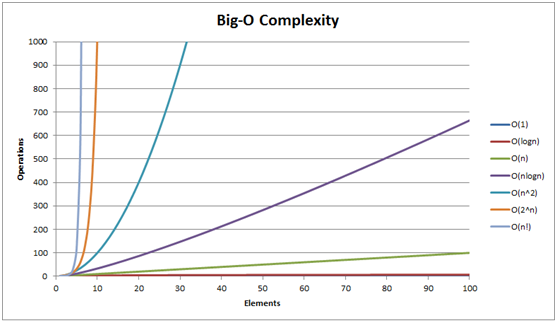
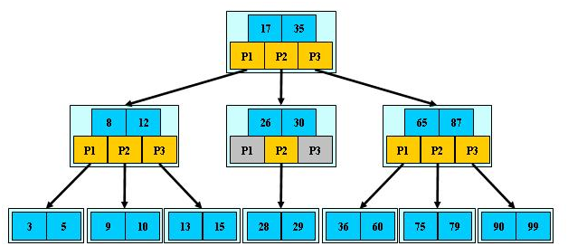
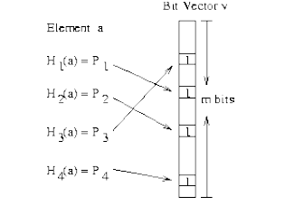

| 序号 | 修改时间   | 修改内容                       | 修改人 | 审稿人 |
| ---- | ---------- | ------------------------------ | ------ | ------ |
| 1    | 2009-9     | 创建                           | Keefe | Keefe |
| 2    | 2010-5-3   | 补充hash，桶排序，堆排序的描述 | 同上   |        |
| 3    | 2016-10-31 | 调整目录结构                   | 同上   |        |
| 4    | 2016-11-14 | 增加bloom filter               | 同上   |        |
|      |            |                                |        |        |


---

# 目录

[目录... 1](#_Toc491683000)

[1       算法... 3](#_Toc491683001)

[1.1        常见算法复杂度... 3](#_Toc491683002)

[1.1.1         数据结构操作... 3](#_Toc491683003)

[1.1.2         数组排序算法... 4](#_Toc491683004)

[1.1.3         图操作... 4](#_Toc491683005)

[1.1.4         堆操作... 5](#_Toc491683006)

[1.1.5         大O复杂度图表... 5](#_Toc491683007)

[1.2        Sort排序算法... 6](#_Toc491683008)

[1.2.1         排序概述... 6](#_Toc491683009)

[1.2.2         常见排序算法效率比较... 6](#_Toc491683010)

[1.2.3         quick sort 7](#_Toc491683011)

[1.2.4         heap sort 8](#_Toc491683012)

[1.3        Retrieve检索算法... 9](#_Toc491683013)

[1.3.1         常见检索算法效率比较... 9](#_Toc491683014)

[1.3.2         线性表... 9](#_Toc491683015)

[1.3.3         树表... 9](#_Toc491683016)

[1.3.4         Hash table. 10](#_Toc491683017)

[1.3.5         其它数据结构... 10](#_Toc491683018)

[1.4        遍历算法... 10](#_Toc491683019)

[1.4.1         遍历算法比较... 10](#_Toc491683020)

[1.4.2         二叉树... 10](#_Toc491683021)

[1.4.3         图... 11](#_Toc491683022)

[2       高级数据结构... 12](#_Toc491683023)

[各种数据结构适合场合... 13](#_Toc491683024)

[B- Tree. 13](#_Toc491683025)

[B+树... 15](#_Toc491683026)

[B*树... 16](#_Toc491683027)

[Hash Table. 16](#_Toc491683028)

[Bloom Filter 17](#_Toc491683029)

[Python版本：pybloomfiltermmap. 19](#_Toc491683030)

[Graph. 19](#_Toc491683031)

[3       专题... 20](#_Toc491683032)

[第K元素集问题... 20](#_Toc491683033)

[线性时间操作... 21](#_Toc491683034)

[4       参考资料... 21](#_Toc491683035)

[推荐阅读... 21](#_Toc491683036)

 

 

[TOC]


---


# 1  算法

## 1.1  常见算法复杂度 


### 1.1.1   数据结构操作

表格 1 数据结构操作复杂度

| **数据结构**                                                 | **时间复杂度** | **空间复杂度** |           |           |           |           |           |           |             |
| ------------------------------------------------------------ | -------------- | -------------- | --------- | --------- | --------- | --------- | --------- | --------- | ----------- |
|                                                              | **平均**       | **最差**       | **最差**  |           |           |           |           |           |             |
|                                                              | **访问**       | **搜索**       | **插入**  | **删除**  | **访问**  | **搜索**  | **插入**  | **删除**  |             |
| [Array](http://en.wikipedia.org/wiki/Array_data_structure)   | O(1)           | O(n)           | O(n)      | O(n)      | O(1)      | O(n)      | O(n)      | O(n)      | O(n)        |
| [Stack](http://en.wikipedia.org/wiki/Stack_(abstract_data_type)) | O(n)           | O(n)           | O(1)      | O(1)      | O(n)      | O(n)      | O(1)      | O(1)      | O(n)        |
| [Singly-Linked List](http://en.wikipedia.org/wiki/Singly_linked_list#Singly_linked_lists) | O(n)           | O(n)           | O(1)      | O(1)      | O(n)      | O(n)      | O(1)      | O(1)      | O(n)        |
| [Doubly-Linked   List](http://en.wikipedia.org/wiki/Doubly_linked_list) | O(n)           | O(n)           | O(1)      | O(1)      | O(n)      | O(n)      | O(1)      | O(1)      | O(n)        |
| [Skip List](http://en.wikipedia.org/wiki/Skip_list)          | O(log(n))      | O(log(n))      | O(log(n)) | O(log(n)) | O(n)      | O(n)      | O(n)      | O(n)      | O(n log(n)) |
| [Hash Table](http://en.wikipedia.org/wiki/Hash_table)        | –              | O(1)           | O(1)      | O(1)      | –         | O(n)      | O(n)      | O(n)      | O(n)        |
| [Binary   Search Tree](http://en.wikipedia.org/wiki/Binary_search_tree) | O(log(n))      | O(log(n))      | O(log(n)) | O(log(n)) | O(n)      | O(n)      | O(n)      | O(n)      | O(n)        |
| [Cartesian   Tree](https://en.wikipedia.org/wiki/Cartesian_tree) | –              | O(log(n))      | O(log(n)) | O(log(n)) | –         | O(n)      | O(n)      | O(n)      | O(n)        |
| [B-Tree](http://en.wikipedia.org/wiki/B_tree)                | O(log(n))      | O(log(n))      | O(log(n)) | O(log(n)) | O(log(n)) | O(log(n)) | O(log(n)) | O(log(n)) | O(n)        |
| [Red-Black   Tree](http://en.wikipedia.org/wiki/Red-black_tree) | O(log(n))      | O(log(n))      | O(log(n)) | O(log(n)) | O(log(n)) | O(log(n)) | O(log(n)) | O(log(n)) | O(n)        |
| [Splay Tree](https://en.wikipedia.org/wiki/Splay_tree)       | –              | O(log(n))      | O(log(n)) | O(log(n)) | –         | O(log(n)) | O(log(n)) | O(log(n)) | O(n)        |
| [AVL Tree](http://en.wikipedia.org/wiki/AVL_tree)            | O(log(n))      | O(log(n))      | O(log(n)) | O(log(n)) | O(log(n)) | O(log(n)) | O(log(n)) | O(log(n)) | O(n)        |

 

### 1.1.2   数组排序算法

表格 2 数组排序算法复杂度

| **算法**                                                     | **时间复杂度** | **空间复杂度** |                |           |
| ------------------------------------------------------------ | -------------- | -------------- | -------------- | --------- |
|                                                              | **最佳**       | **平均**       | **最差**       | **最差**  |
| [Quicksort](http://en.wikipedia.org/wiki/Quicksort)          | O(n log(n))    | O(n log(n))    | O(n^2)         | O(log(n)) |
| [Mergesort](http://en.wikipedia.org/wiki/Merge_sort)         | O(n log(n))    | O(n log(n))    | O(n log(n))    | O(n)      |
| [Timsort](http://en.wikipedia.org/wiki/Timsort)              | O(n)           | O(n log(n))    | O(n log(n))    | O(n)      |
| [Heapsort](http://en.wikipedia.org/wiki/Heapsort)            | O(n log(n))    | O(n log(n))    | O(n log(n))    | O(1)      |
| [Bubble Sort](http://en.wikipedia.org/wiki/Bubble_sort)      | O(n)           | O(n^2)         | O(n^2)         | O(1)      |
| [Insertion   Sort](http://en.wikipedia.org/wiki/Insertion_sort) | O(n)           | O(n^2)         | O(n^2)         | O(1)      |
| [Selection   Sort](http://en.wikipedia.org/wiki/Selection_sort) | O(n^2)         | O(n^2)         | O(n^2)         | O(1)      |
| [Shell Sort](http://en.wikipedia.org/wiki/Shellsort)         | O(n)           | O((nlog(n))^2) | O((nlog(n))^2) | O(1)      |
| [Bucket Sort](http://en.wikipedia.org/wiki/Bucket_sort)      | O(n+k)         | O(n+k)         | O(n^2)         | O(n)      |
| [Radix Sort](http://en.wikipedia.org/wiki/Radix_sort)        | O(nk)          | O(nk)          | O(nk)          | O(n+k)    |

 

### 1.1.3   图操作

表格 3 图操作算法复杂度

| **节点 /** **边界管理**                                      | **存储**         | **增加顶点**     | **增加边界**     | **移除顶点**     | **移除边界**     | **查询** |
| ------------------------------------------------------------ | ---------------- | ---------------- | ---------------- | ---------------- | ---------------- | -------- |
| [Adjacency   list](http://en.wikipedia.org/wiki/Adjacency_list) | O(\|V\|+\|E\|)   | O(1)             | O(1)             | O(\|V\| + \|E\|) | O(\|E\|)         | O(\|V\|) |
| [Incidence   list](http://en.wikipedia.org/wiki/Incidence_list) | O(\|V\|+\|E\|)   | O(1)             | O(1)             | O(\|E\|)         | O(\|E\|)         | O(\|E\|) |
| [Adjacency   matrix](http://en.wikipedia.org/wiki/Adjacency_matrix) | O(\|V\|^2)       | O(\|V\|^2)       | O(1)             | O(\|V\|^2)       | O(1)             | O(1)     |
| [Incidence   matrix](http://en.wikipedia.org/wiki/Incidence_matrix) | O(\|V\| ⋅ \|E\|) | O(\|V\| ⋅ \|E\|) | O(\|V\| ⋅ \|E\|) | O(\|V\| ⋅ \|E\|) | O(\|V\| ⋅ \|E\|) | O(\|E\|) |

 

### 1.1.4   堆操作

表格 4 堆操作算法复杂度

| **类型**                                                     | **时间复杂度** |                |                |            |           |           |           |
| ------------------------------------------------------------ | -------------- | -------------- | -------------- | ---------- | --------- | --------- | --------- |
|                                                              | **Heapify**    | **查找最大值** | **分离最大值** | **提升键** | **插入**  | **删除**  | **合并**  |
| [Linked List   (sorted)](http://en.wikipedia.org/wiki/Linked_list) | –              | O(1)           | O(1)           | O(n)       | O(n)      | O(1)      | O(m+n)    |
| [Linked List   (unsorted)](http://en.wikipedia.org/wiki/Linked_list) | –              | O(n)           | O(n)           | O(1)       | O(1)      | O(1)      | O(1)      |
| [Binary Heap](http://en.wikipedia.org/wiki/Binary_heap)      | O(n)           | O(1)           | O(log(n))      | O(log(n))  | O(log(n)) | O(log(n)) | O(m+n)    |
| [Binomial   Heap](http://en.wikipedia.org/wiki/Binomial_heap) | –              | O(1)           | O(log(n))      | O(log(n))  | O(1)      | O(log(n)) | O(log(n)) |
| [Fibonacci   Heap](http://en.wikipedia.org/wiki/Fibonacci_heap) | –              | O(1)           | O(log(n))      | O(1)       | O(1)      | O(log(n)) | O(1)      |

 

### 1.1.5   大O复杂度图表

​                                                  

图表 1 Big O Complexity Graph

 

## 1.2   Sort排序算法

### 1.2.1   排序概述

排序可分外排序和内排序。
* 外部排序指的是大文件的排序，即待排序的记录存储在[外存储器](https://baike.baidu.com/item/外存储器)上，待排序的文件无法一次装入内存，需要在内存和外部存储器之间进行多次数据交换，以达到排序整个文件的目的。外部排序最常用的算法是多路归并排序，即将原文件分解成多个能够一次性装入内存的部分分别把每一部分调入内存完成排序。然后，对已经排序的子文件进行归并排序。
* 内排序是可以在内存中完成的排序。一般提到排序都是指内排序，比如[快速排序](https://baike.baidu.com/item/快速排序)，[堆排序](https://baike.baidu.com/item/堆排序)，[归并排序](https://baike.baidu.com/item/归并排序)等。

 

**外排序步骤**

一般来说外排序分为两个步骤：预处理和合并排序。首先，根据可用内存的大小，将外存上含有n个纪录的文件分成若干长度为t的子文件（或段）；其次，利用内部排序的方法，对每个子文件的t个纪录进行内部排序。这些经过排序的子文件（段）通常称为[顺串](https://baike.baidu.com/item/顺串)(run)，顺串生成后即将其写入外存。这样在外存上就得到了m个顺串（m=[n/t]）。最后，对这些顺串进行归并，使顺串的长度逐渐增大，直到所有的待排序的几率成为一个顺串为止。

 

### 1.2.2   常见排序算法效率比较

表格 5常见排序算法效率比较表     

| SN   | 排序方式 |           |           | 时间复杂度 | 空间复杂度    | 稳定性 | 算法描述                                                |
| ---- | -------- | --------- | --------- | ---------- | ------------- | ------ | ------------------------------------------------------- |
|      |          | AVG       | 最好      | 最坏       |               |        |                                                         |
| 1    | 直接插入 | O(n2)     | O(n)      | O(n2)      | O(1)          | 稳定   | 按KEY大小插入到有序队列                                 |
| 2    | 希尔插入 |           |           |            | O(1)          | 不稳定 | 缩小增量排序                                            |
| 3    | 折半插入 | O(nlogn)  | O(nlogn)  | O(nlogn)   |               | 稳定   |                                                         |
| 4    | 冒泡排序 | O(n2)     | O(n)      | O(n2)      | O(1)          | 稳定   | 属交换排序,从右到左,相邻记录比较                        |
| 5    | 快速排序 | O(nlog2n) | O(nlog2n) | O(n2)      | O(log2n)~O(n) | 不稳定 | 两端向中间比较                                          |
| 6    | 直接选择 | O(n2)     |           |            |               | 不稳定 |                                                         |
| 7    | 堆排序   | O(nlog2n) |           | O(nlog2n)  | O(1)          | 不稳定 | 树形选择排序,创建堆O(n),维持堆n-1次log(n)，总共O(nlogn) |
| 8    | 归并排序 | O(nlog2n) |           |            | O(n)          | 稳定   |                                                         |
| 9    | 基数排序 |           |           |            | O(n)          | 不稳定 |                                                         |

**备注**：

*  时间复杂度O(1)<O(n)<O(logn)<O(nlogn)<O(n2)

*  1,2,3属于插入排序; 4,5属于交换排序; 6,7属于选择排序。

*  记录数大时,选择改进算法; 记录数较小时,可采用简单排序(如1,4,6)

*  平均情况下， *快速排序* 速度是最快的，推荐使用。

*  稳定性指具有相同值的记录在排序时相对次序不改变。

*  内排序：数据量较少时，仅在内存中进行;   

*  外排序：数据量较大时，在内外存中进行数据交换(常用归并排序,文件来解决)

 

### 1.2.3   quick sort

```c++
template <class T>

/*基本思想是：任取待排序列的某个记录作为基准，按照该关键码大小，
将整个序列分成两个序列——左侧的所有记录的关键码都比基准小（或者等），
右侧的都比基准大，基准则放在两个子序列之间。
分别对左右子序列重复上面的过程，直到最后所有的记录都放在相应的位置,
充分体现了分冶法的策略：将大问题分解成可解决的小问题*/
int Partition(T a[], int left, int right, int& KCN, int& RMN)
{
      int pivotpos = left; T pivot = a[left];//枢轴
      for (int i = left + 1; i <= right; i++)
      if (++KCN && a[i] < pivot && ++pivotpos != i)
      { swap(a[i], a[pivotpos]); RMN += 3;}
      swap(a[left], a[pivotpos]); RMN += 3;
      return pivotpos;
}
template <class T>
void QSRecurve(T a[], int left, int right, int& KCN, int& RMN)
{
      if (left < right)
      {
             int pivotpos = Partition<T>(a, left, right, KCN, RMN);
             QSRecurve<T>(a, left, pivotpos - 1, KCN, RMN);
             QSRecurve<T>(a, pivotpos + 1, right, KCN, RMN);
      }
}
template <class T>
void QuickSort(T a[], int N, int& KCN, int& RMN)
{
      KCN = 0; RMN = 0;
      QSRecurve<T>(a, 0, N - 1, KCN, RMN);
}
//
template <class T>
//void QuickSort2(T a[], int s, int t) s=0
void QuickSort2(T a[], int s, int t)
{
      T temp= a[s];
      int i,j;
      i=s; j=t;
      //first divided
      while(i<j)       //left < right
      {
             //only compare, no move
             while( a[j]>=temp && (i<j) ) j--;
             if(i<j)
             {
                    a[i]=a[j];
                    i++;
             }
             while( a[i]<=temp && (i<j) ) i++;
             if(i<j)
             {
                    a[j]=a[i];
                    j--;
             }
             //Recurve
             a[i]=temp;
             if(s < (i-1))
                    QuickSort2(a, s, i-1);
             if(t>(i+1))
                    QuickSort2(a, i+1, t);
      }
}
```


### 1.2.4   heap sort

1) MAX-HEAP(i)        //子函数用来维护以i为根节点的最堆;

2) for i=n/2 down to 1

do MAX-HEAP(i)  //创建一个最大堆；

3) 与堆顶比较，维护堆。

 

## 1.3   Retrieve检索算法

检索表：检索所依赖的数据结构.

查询定义：根据KEY,在检索表中确定VALUE的值。

### 1.3.1  常见检索算法效率比较

检索算法评估：(平均检索长度ASL)

下表是检索算法效率列表:

表格 6 常见检索算法效率比较表

| 检索表         | 检索算法               | ASL          | 算法描述 |      |
| -------------- | ---------------------- | ------------ | -------- | ---- |
| 线性表         | 顺序                   | (n+1)/2      |          |      |
| 折半           | Log2(n+1)-1   (n>>100) | 适用于有序表 |          |      |
| 分块           |                        |              |          |      |
| 树表           | 二叉排序树             | logn         |          |      |
| 平衡二叉排序树 | logn                   |              |          |      |
| B树            | logn                   |              |          |      |
| 红黑树         | logn                   |              |          |      |
| HASH表         |                        | n            |          |      |

 

### 1.3.2  线性表

1).顺序检索：采用逆向检索

2).折半检索

3).分块检索

### 1.3.3  树表

1).二叉排序树

2).平衡的二叉排序树

3).B树

4).红黑树

### 1.3.4  Hash table

平均查找只需常数时间O(1)，最坏O(n)。

 

### 1.3.5  其它数据结构

1) 序列容器

VectOr：类似线性表

List 类似线性表

 

2) 关联容器

Map：图的检索, 一对一

Multimap：一对多

Hashmap：常数时间检索,用hash_table实现.

 

## 1.4  遍历算法

### 1.4.1   遍历算法比较

最好情况＝平均情况=最坏情况：*O*(n)

 

### 1.4.2   二叉树

**1)** **前序遍历 preOrder**

若二叉树为空，则空操作；

否则（1）访问根结点；

（2）前序遍历左子树；

（3）前序遍历右子树。

 

**2）后序遍历 postOrder**

若二叉树为空，则空操作；

否则（1）后序遍历左子树；

（2）后序遍历右子树。

（3）访 问根结点；

 

**3）中序遍历 inOrder**

若二叉树为空，则空操作；

否则（1）中序遍历左子树； 

（2）访问根结点；

（3）中序遍历右子 树。

 

**4）已知前中序求后序。**

前序是先访问根，后序是最后访问根，中序是先左，后根，最后右。

示例：已知某二叉树有如下的前序遍历和中序遍历：

​            前序遍历：1 2 4 5 7 9 10 3 6 8；

​            中序遍历：4 2 9 7 10 5 1 3 8 6.

**法1：构建二叉树后再后序遍历**

step1：得到根结点。前序第一个结点node1一定是根结点。

step2：判断左右结点FindLR。在中序遍历中找到前序遍历的元素node所在位置m，即可得出，中序遍历m之前的是ndoe的左结点，之后的是node的右结点。

step3：遍历前序，每次调用FINDLR判断结点是否左右，可建立唯一的二叉树，如下：

   

更正：值是8的结点是右结点，

step4：再进行后序遍历，即得结果。

对应二叉树的后序遍历为：4 9 10 7 5 2 8 6 3 1

 

**法2：利用前中遍历的性质，不建二叉树。**

 

### 1.4.3   图

| 图的深度优先遍历 | 图的深度优先遍历DFS算法是每次在访问完当前顶点后，首先访问当前顶点的一个未被访问过的邻接顶点，然后去访问这个邻接点的一个未被访问过的邻接点，这样的算法是一个递归算法。 |      |
| ---------------- | ------------------------------------------------------------ | ---- |
| 图的广度优先遍历 | 图的广度优先遍历BFS算法是一个分层搜索的过程，和树的层序遍历算法类同，它也需要一个队列以保持遍历过的顶点顺序，以便按出队的顺序再去访问这些顶点的邻接顶点。 |      |

 

# 2  高级数据结构

高级数据结构主要是字典结构，通过key查找value，如hashtable，btree，map...

| 树的名称                                        | 单个结点组成                                                 | 特性                                                         | 算法效率                                                     |      |
| ----------------------------------------------- | ------------------------------------------------------------ | ------------------------------------------------------------ | ------------------------------------------------------------ | ---- |
| 二叉树                                          | stuct bNode{   void*key;//值   //左右结点指针   bNode* lNode;    bNode* rNode;    //父结点指针   bNode* pNode;   }; | 描述：通常包括一个关键值，二个子结点指针，一个父结点指针   . 支持动态插入和查找，比HASH表容易调整数据 | 时间O(h)=O(logn)，h为树的高度, n为结点总个数                 |      |
| 二叉查找树(又名二叉排序树)                      | 同二叉树                                                     | 递归有序，左小右大                                           | 时间O(logN)                                                  |      |
| 平衡二叉树                                      | Balanced binary tree,   关联容器中最基本的结构               | 对二叉查找树作了平衡处理来加快查找速度                       |                                                              |      |
| AVL-Tree (Adelson-   Velskii-   Landis    Tree) | stuct bbNode   :struct bNode{   //加入平衡因子   long lBFValue;   }; | 指加上了额外平衡条件的二叉查找树,如平衡因子. 示例:   用平衡因子来控制树的高度，平衡因子指左右子树的高度之差，通常不超过1，根据插入位置旋转进行调整 |                                                              |      |
| 红黑树 RB-Tree                                  | stuct rbNode:   struct bNode{   //加入结点状态   void color;   }; | 值存储在内结点中，color用来表示结点状态值，用color来快速查找 | 时间O(logN)                                                  |      |
| 哈夫曼树                                        |                                                              | 最优二叉树，带权路径长度最短的树                             |                                                              |      |
| 以下为多叉树                                    |                                                              |                                                              |                                                              |      |
| B树                                             | struct btnode{   //本结点树实际关键字总数   int count;   //M个key,有序   void key[M];    //M+1个子女指针，M为阶   struct btnode *p[M+1];   }; | 一个结点中包括M个key,M个卫星数据，M+1个 指向子女的指针，同一键值可能会多次出现，所有叶子结点在同一层，叶子结点不包括任何关键信息（键值），B树的阶指孩子的个数,如一个M阶的B树,孩子个 数是M,单个结点关键字数是m-1,如一个高度为3的100阶B树,则结点总数是1+100+100*100=100101个. | 1970年，R.Bayer和E.mccreight提出的用于外查找的树，是一种多叉平衡树   O（logN） |      |
| B+树                                            |                                                              | 键值只存储在叶子结点中，同一键值只出现一次                   |                                                              |      |
| 三叉树                                          | stuct triNode{                                               |                                                              |                                                              |      |
|                                                 |                                                              |                                                              |                                                              |      |

**备注**：平衡树是指所有叶子结点都在同一层或者左右子树高度之差不超过1的树，这样的话，通过控制树的深度，可以控制查找效率。

 

## 各种数据结构适合场合

表格 7 高级数据结构的应用场景比较表

| DS名称         | 优点                                                      | 缺点                                                | 适用场合                                                     |
| -------------- | --------------------------------------------------------- | --------------------------------------------------- | ------------------------------------------------------------ |
| 最大/小堆      | 能最快找到最大/最小值                                     | 不能用于排序。                                      | 常用在任务调度中取优先级(优先队列)                           |
| B树系列        | 一个结点为一个磁盘页，专为磁盘IO设计                      |                                                     | 专为磁盘IO设计                                               |
| 二叉查找树系列 | 查找容易，支持动态插入删除                                | 要注意保持深的平衡，调整平衡时花费时间较多          | 在数据插入删除比较频繁时，作为存储结构比较合适，常用到其变形：平衡二叉树和红黑树 |
| 连通图         | 用于描述网络结构的数据结构                                |                                                     |                                                              |
| 哈希表         | 可在O(1)时间内查找                                        | 如果数据过多，可能冲突严重                          | 不冲突情况下，查询最快                                       |
| bloom   filter | 位图存储，最大限度节约存储空间。   空间和时间开销都极佳。 | 不能删除元素；   不存在漏报，但存在误报（识报率）。 | 常用于放在内存的海量数据项查询，如：垃圾邮件过滤；   搜索引擎URL过滤排重；   K-VALUE加快查询；   GOOGLE   BIT TABLE。 |

备注：常用字符串哈希函数有BKDRHash，APHash，DJBHash，JSHash，RSHash，SDBMHash，PJWHash，ELFHash等等。

 

## B- Tree

在树结构，比较特别的一种。一个结点有N个关键字，N+1个子女。一个结点的大小通常相当于一个完整的磁盘页，因此一个结点的关键字个数取决于磁盘页的大小。

树的每个结点由关键字＋子女的指针＋附属数据组成，而B树的变形B+树，所有的附属数据都保存在叶结点上，只将关键字和子女指针保存在内结点里。

B树中的一个包含n个关键字，n+1个指针的结点的一般形式为：（n,P0,K1,P1,K2,P2,…,Kn,Pn） 
 其中，Ki为关键字，K1 <K2 <… <Kn, Pi 是指向包括Ki到Ki+1之间的关键字的子树的指针。

​      是一种多路搜索树（并不是二叉的）：

1. 定义任意非叶子结点最多只有M个儿子；且M>2；

2. 根结点的儿子数为[2, M]；//就是指根结点至少要有一个关键字

3. 除根结点以外的非叶子结点的儿子数为[M/2, M]；

4. 每个结点存放至少M/2-1（取上整）和至多M-1个关键字；（至少2个关键字）

 5.非叶子结点的关键字个数=指向儿子的指针个数-1；

6. 非叶子结点的关键字：K[1], K[2], …, K[M-1]；且K[i] < K[i+1]；

7. 非叶子结点的指针：P[1], P[2], …, P[M]；其中P[1]指向关键字小于K[1]的子树，P[M]指向关键字大于K[M-1]的子树，其它P[i]指向关键字属于(K[i-1], K[i])的子树；

8. 所有叶子结点位于同一层；

如：（M=3）

   

示例：

```c
define M 1 

/* B 树的阶，即非根节点中键的最小数目，也指存储记录的最大数目 
*/
typedef int typekey; 
typedef struct btnode {/* B-Tree 节点 */ 
int d;/* 以节点为树根结点时的关键字总数 */ 
typekey k[2*M];/* key */ 
char *v[2*M];/* 值 key value*/ 
struct btnode *p[2*M+1];/* 指向子树的指针 */ 
} node, *btree; 

/* 
* 每个键的左子树中的所有的键都小于这个键， 
* 每个键的右子树中的所有的键都大于等于这个键。 
* 叶子节点中的每个键都没有子树。 
*/

/* 当 M 等于 1 时也称为 2-3 树 ,下面为示例结点
*+----+----+ 
*| k0 | k1 | 
*+-+----+----+--- 
*| p0 | p1 | p2 | 
*+----+----+----+ 
*/
```

备注：k0,k1为key，p0,p1,p2为子女指针，此例子中，为二阶B-树，没有附属数据。

 

## B+树

​       B+树是B-树的变体，也是一种多路搜索树：

​       1.其定义基本与B-树同，除了：

​       2.非叶子结点的子树指针与关键字个数相同；

​       3.非叶子结点的子树指针P[i]，指向关键字值属于[K[i], K[i+1])的子树（B-树是开区间）；

​       5.为所有叶子结点增加一个链指针；

​       6.所有关键字都在叶子结点出现；

​       如：（M=3）

   

​      B+的搜索与B-树也基本相同，区别是B+树只有达到叶子结点才命中（B-树可以在非叶子结点命中），其性能也等价于在关键字全集做一次二分查找；

​       B+的特性：

​       1.所有关键字都出现在叶子结点的链表中（稠密索引），且链表中的关键字恰好是有序的；

​       2.不可能在非叶子结点命中；

​       3.非叶子结点相当于是叶子结点的索引（稀疏索引），叶子结点相当于是存储（关键字）数据的数据层；

​       4.更适合文件索引系统；

 

## B*树

​       是B+树的变体，在B+树的非根和非叶子结点再增加指向兄弟的指针；

   

​      B*树定义了非叶子结点关键字个数至少为(2/3)*M，即块的最低使用率为2/3（代替B+树的1/2）；

​       B+树的分裂：当一个结点满时，分配一个新的结点，并将原结点中1/2的数据复制到新结点，最后在父结点中增加新结点的指针；B+树的分裂只影响原结点和父结点，而不会影响兄弟结点，所以它不需要指向兄弟的指针；

​       B*树的分裂：当一个结点满时，如果它的下一个兄弟结点未满，那么将一部分数据移到兄弟结点中，再在原结点插入关键字，最后修改父结点中兄弟结点的关键字（因为兄弟结点的关键字范围改变了）；如果兄弟也满了，则在原结点与兄弟结点之间增加新结点，并各复制1/3的数据到新结点，最后在父结点增加新结点的指针；

​       所以，B*树分配新结点的概率比B+树要低，空间使用率更高。

 

## Hash Table

普通数组的扩展，根据关键字计算出下标。

可用链表或数组来实现，单个结点的组成是：元素值，元素属性等。

最关键的选择合适的hash函数。

 

**常用的hash函数**  **（启发式方法或随机化方法）**
1. 取余：%   
2. 乘法散列
3. 随机化方法

 

**collision冲突解决办法：**
1. 开放寻址：线性探测再hash, 寻找所有表项，直至hashtable被全部填充。
2. 链表法channing：存储指针来指向同一hash值的链表，实际使用中便以扩展，就是增加了指针的存储空间，比较常用。
3. 完全散列：最坏查找情况下也是O(1)

 

示例：一个典型的hashtable结构定义：

```c++
typedef enum{False,True}BOOL;
typedef enum{NULLKEY,HAVEKEY,DELKEY} HAVEORNOT;
typedef struct  /*定义哈希表的结构*/
{
      int elem[MAXSIZE];  /* 数据元素体，必需 */
      HAVEORNOT elemflag[MAXSIZE]; /*元素状态标志，没有记录、有记录、有过记录但已被删除*/
      int count;  /*哈希表中当前元素的个数， */
}HashTable;
```


**stl中hashtable定义**

```c++
template <class _Val>
struct _Hashtable_node
{
    _Hashtable_node* _M_next;
    _Val _M_val;
};
template <class _Val, class _Key, class _HashFcn,
class _ExtractKey, class _EqualKey, class _Alloc>
class hashtable {

};
```


## Bloom Filter

​       Bloom Filter是由Bloom在1970年提出的一种多哈希函数映射的快速查找算法。通常应用在一些需要快速判断某个元素是否属于集合，但是并不严格要求100%正确的场合。

​       Hash table具有查找高速的特点，bloom filter在此基础上，解决了内存耗大的问题，代价就是不考虑100%的准确率，存在一定的错误率（可以接受程度）。

​       Bloom Filter 是通过一组k 个定义在n 个输入key 上的Hash Function，将上述n 个key 映射到m 位上的数据容器。它提供将新key 插入的函数VOID Insert(key)，以及查询key 是否在集合中的函数BOOL Query(key)。

这里BOOL Query(key)的返回值以概率((1-ekn /m)k可能犯以假当真错误，除此以外，Query 不会出以真当假的错误。

 

下图画出了Bloom Filter 的工作原理:

   

*  Insert 时，输入A 给定之后，k 个互相独立的Hash Function 将它们映射到m 位中的k 个位上，并且将这位置1。如此，Bloom Filter 就记住了元素A 的“案底”，可备以后查询用。

*  Query 时，输入A 给定之后，我们一样得到k 个位。当它们都为1 时，就认为元素A 是之前Insert 的某个成员。

 

**K哈希函数个数的取值**

问题1：保证指定误判率的情况下，到底需要多少个hash函数，多少的存储空间。

假设飞镖问题，有m个靶位，有n个飞镖，假设每个飞镖有k次机会，（相当于n*k个镖）投中某个特定靶位的概率。（m即为BloomFilter位数组大小，n为实际的元素个数，k为哈希函数个数）

(m, n, k)查询不命中的概率(即误判率、错误率)p是:

​       p=(1-1/m)k*n      （1）

调用lim(1-1/x)-x=e，计算得：p = e^(-kn/m)  （2）

当某元素经过k哈希映射后都为1，命中的概率f：f= (1-p)^k=(1-e^(kn/m))^k   （3）

对（3）式求偏导数，得：g=-m/n*In(p)*In(1-p)  (4)

从（4）式可知，当p=1/2时，g最小（最少的K），得：**g=(m/n)\*In2=0.69\*m/n**  （5）

即在给定m和n时，能够使p最小化的k值为：k=g=**0.69\*m/n**

若允许错误率小于z，此时p=(1/2)k=(1/2)(m/n)*ln2 ,  令p<z，得

​       m/n>log2(1/z)/In2=log2z*log2(1/z)  （6）

即m比下界n log2(1/є)大了log2 e ≈ **1.44**倍。这说明在哈希函数的个数取到最优时，要让错误率不超过є，m至少需要取到最小值的1.44倍，即**m/n>1.44**。(经实际检测，这个1.44倍是不靠谱的，会导致很大的错误率)

**理论值：**

p < 0.1：k = 3.321928, m/n = 4.79

p < 0.01：k = 6.643856, m/n = 9.58

p < 0.001：k = 9.965784, m/n = 14.37

p < 0.0001：k = 13.287712, m/n = 19.170117

示例：保证错误率小于0.01，已知实际元素个数200万（已存储100万，目标200万），那么需要数组位超过100万*9.58=1000万，k取整数为7.

 

**Bloom Filter特点：**
 - 不存在漏报（False Negative），即某个元素在某个集合中，肯定能报出来。
 - 可能存在误报（False Positive），即某个元素不在某个集合中，可能也被爆出来。
 - 确定某个元素是否在某个集合中的代价和总的元素数目无关。

备注：

*  (BloomFilter位数组大小m)/(实际的元素个数n)越大，错误率越低，但消耗的空间会越多。

*  哈希表是K=1的bloom filter.  

 

**哈希函数**

常用字符串哈希函数有BKDRHash，APHash，DJBHash，JSHash，RSHash，SDBMHash，PJWHash，ELFHash等等。杂凑函数还有MD5和SHA1。这些函数的碰撞率都非常低。

各种哈希函数的基本思想是遍历字符串，根据一定关系(加法、乘法、移位等)得到一个无数号数值。

### Python版本：pybloomfiltermmap

示例：

```python
from pybloomfilter import BloomFilter
bf = BloomFilter(10000000, 0.01, 'filter.bloom')
with open("/usr/share/dict/words") as f:
    for word in f:

        bf.add(word.rstrip())
print 'apple' in bf
```

**说明：**

http://axiak.github.io/pybloomfiltermmap/ref.html#magic-methods 

常用的函数有：
```c++
class pybloomfilter.BloomFilter(capacity ：int, error_rate ：float, filename ：string)
{
    //(容量，错误率，文件名)
    static BloomFilter.open(filename)
    BloomFilter.add(item) → Boolean
    BloomFilter.clear_all()
    BloomFilter.copy(filename) → BloomFilter
    BloomFilter.update(iterable)
    BloomFilter.__len__(item) → Integer
    BloomFilter.__in__(item) → Boolean
}
```


## Graph

| 算法                          | 描述                                                         |      |
| --------------------------------- | ------------------------------------------------------------ | ---- |
| 普里姆（Prim）算法        | 如果连通图是一个网络，称该网络中所有生成树中权值总和最小的生成树为最小生成树 ( 也称最小代价生成树 ) 。普里姆（Prim）算法和克鲁斯卡尔（Kruskal）算法是两个典型的利用MST性质构造最小生成树的算法。本课件演示了普里姆（Prim）算法。 |      |
| 克鲁斯卡尔（Kruskal）算法 | 如果连通图是一个网络，称该网络中所有生成树中权值总和最小的生成树为最小生成树 ( 也称最小代价生成树 ) 。普里姆（Prim）算法和克鲁斯卡尔（Kruskal）算法是两个典型的利用MST性质构造最小生成树的算法。本课件演示了克鲁斯卡尔（Kruskal）算法。 |      |
|                                   | 具体算法演示请点击查看[【算法演示】](http://sjjg.js.zwu.edu.cn/SFXX/sf1/kruskal.html#_blank) |      |

 

# 3  专题

## 第K元素集问题

**题目：如何从n个数中选出最大（小）的k个数？** 

下面分析以最大K个数为示例:(KCN:key compare num; RMN：运行时移动次数)

| 方案            | 算法原理                                                     | 时间复杂度                                      | 空间复杂度                            | 备注                                                         |
| --------------- | ------------------------------------------------------------ | ----------------------------------------------- | ------------------------------------- | ------------------------------------------------------------ |
| 选择排序变形    | 一个个得到有序队列。   假设k=1,则要比较n-1次, k=2,则要比较(n-1)+(n-2)=2n-3,k 个则是O(n2) | O(n2)                                           | O(1)，k个大小的最终空间               | 最简单最笨的方法，基本不采用，只供分析                       |
| 最小堆          | 维护一个k元素小根堆，每插入一值都与堆顶比较，如比堆顶小，则舍弃，大，则比较左右子结点，调整堆. | 比较：O(n)    调整堆：O(logn)    total=O(nlogn) | O(1)，k个大小的最终空间，无需辅助空间 | 堆是一个完全二叉树，先要建堆，然后再维护堆.用数组实现较为简单. 维护堆自上而下，比较左右子结点。 |
| 败者树loserTree |                                                              |                                                 | O(1)，2倍堆大小的空间=2k-1            | 叶子结点才是数据结点.自底向上比较，保存胜者到父结点，在上层继续比较 |
| 快速排序变形    | 任取一值作轴，将轴不断移动，直到轴位置在k位置。              | O（n)，平常的快排是O(nlogn)                     |                                       |                                                              |

*  插入排序：是插入到有序队列，与有序队列依个比较。

*  选择排序：每次选择一个次关健值加入到队列中。如heapSort.

*  交互排序：比较两值大小，进行交换，快速排序是交互排序中冒泡的改进，从待排队列中选取一值作为枢，然后与枢比较，将值分布在枢左右，最后对左右子序列进行递归排序。

 

## 线性时间操作

**1)** **hashtable**

 

**2)** **基数排序**

 

**3)** **计数排序**

输入：小范围的一堆整数.

过程：利用数值特性，将输入元素实际值作为缓存数组下标，得到元素实际值的统计计数.
 输出：有序的整数集

应用：快速得到输入元素的数目统计，也能得到小于或等于输入元素的个数.

 

**4）桶排序bucket sort**

输入：输入是随机的数。

过程：将区间[0， 1]划分成n个相同大小的子区间，称为桶。将n个数输入数分布到各个桶中去。对每个桶进行排序，然后按次序将各桶中数据列出来即是。

输出：有序的整数集

应用：查找在线性时间内，分布过程有点类似hash。

 

# 参考资料

[1]. [http://corte.si//posts/code/visualisingsorting/index.html](http://corte.si/posts/code/visualisingsorting/index.html)

[2]. http://home.westman.wave.ca/~rhenry/sort/

[3]. http://en.wikipedia.org/wiki/List_of_data_structures

[4]. 每个程序员都应该收藏的算法复杂度速查表 http://blog.csdn.net/u011598879/article/details/51760000  

[5]. 数学之美二十一：布隆过滤器（Bloom Filter）：http://www.google.com.hk/ggblog/googlechinablog/2007/07/bloom-filter_7469.html

[6]. BloomFilter——大规模数据处理利器：http://www.cnblogs.com/heaad/archive/2011/01/02/1924195.html

[7]. 利用bloom filter算法处理大规模数据过滤 https://segmentfault.com/a/1190000004282786 

[8]. Bloom Filter 背景与详细公式推导 http://blog.csdn.net/zhaoyunxiang721/article/details/41121339  

[9]. k路归并（败者树，记录败者） http://blog.csdn.net/pi9nc/article/details/11714577 

 

## 推荐阅读

*  [Cracking the Coding Interview：150 Programming Questions and Solutions](http://www.amazon.com/gp/product/098478280X/ref=as_li_tl?ie=UTF8&camp=1789&creative=390957&creativeASIN=098478280X&linkCode=as2&tag=htcatu-20&linkId=B6WXIEKJHEBBWJ7B)

*  [Introduction to Algorithms, 3rd Edition](http://www.amazon.com/gp/product/0262033844/ref=as_li_tl?ie=UTF8&camp=1789&creative=390957&creativeASIN=0262033844&linkCode=as2&tag=htcatu-20&linkId=J2PHCTWEAND3YQF4)

*  [Data Structures and Algorithms in Java (2nd Edition)](http://www.amazon.com/gp/product/0672324539/ref=as_li_tl?ie=UTF8&camp=1789&creative=390957&creativeASIN=0672324539&linkCode=as2&tag=htcatu-20&linkId=Y4KPAZH5PFHYXMBA)

*  [High Performance JavaScript (Build Faster Web Application Interfaces)](http://www.amazon.com/gp/product/059680279X/ref=as_li_tl?ie=UTF8&camp=1789&creative=390957&creativeASIN=059680279X&linkCode=as2&tag=htcatu-20&linkId=WUNMGD5EARDJZKTT)

 

