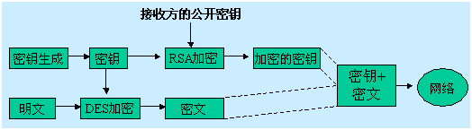

| 序号  | 修改时间       | 修改内容                           | 修改人   | 审稿人   |
| --- | ---------- | ------------------------------ | ----- | ----- |
| 1   | 2021-12-28 | 创建。从《非数值和工业界领域算法》迁移安全算法章节单独成文。 | Keefe | Keefe |
|     |            |                                |       |       |

<br><br><br>

---

[TOC]

<br>

---

## 1 安全算法概述

数据加密是所有数据安全技术的核心，在计算机网络环境下很难做到对敏感性数据的隔离，较现实的方法是设法做到即使攻击者获得了数据，但仍无法理解其包含的意义，以便达到了保密的目的。

**原理**：在发送端将数据变换成某种难以理解的形式，并在接收端进行反变换，以恢复数据的原样。加密/解密的关键是：加密/解密算法的提出和加密/解密模块的实现。

**密钥**：一串参与加密的字符串，算法在密钥的控制下进行操作，对应不同的密钥，相同的算法和相同的明文可以产生完全不同的密文。从而密钥可以充分地发挥已设计的加密算法的作用。

安全算法包括 加解密 和 散列算法。

安全算法要确保用现有的计算机暴力破解需要的时间成本超过其商业价值。

**不安全加密算法**：md5 Blowfish DES DESX RC2, Skipjack, 2TDEA, TEA, SEAL, CYLINK_MEK, RC4, 3DES

**协议安全之不安全传输协议**：SSL2.0 SSL3.0 TLS1.0  TLS1.1等。

## 2  加密算法

### 2.1  加密技术概述

加密技术是信息安全的核心技术.

**原理**： 大整数的素因子难分解是RSA算法的基础。

**里程碑**：

1967年，美国的Horst Feistel在分析传统加密算法的基础上，提出了秘密密钥加密体制的思想。1972年，IBM公司的W. Tuchman和C.Meyers依据秘密密钥加密体制的思想，实现并公开了一个命名为LUCIFER的算法。1977年，美国国家标准化局将此算法作为美国国家标准，命名为数据加密标准（DES－Data Encrypation Standard）。

1976年，美国的Diffie和Hallman提出了一种新的加密体制－公开密钥加密体制。RSA算法是公开密钥加密体制的典型算法。该算法由美国的Rivest、Shamir、Adleman三人于1978年提出。(**RSA**)

2000年10月，NIST(美国国家标准和技术协会)宣布通过从15种侯选算法中选出的一项新的密匙加密标准。Rijndael被选中成为将 来的AES。 Rijndael是在 1999 年下半年，由研究员 Joan Daemen 和 Vincent Rijmen 创建的。美国标准与技术研究院 (NIST) 于 2002 年 5 月 26 日制定了新的高级加密标准 (AES) 规范。

2004年，国际密码学会议(Crypto’2004)上，来自中国山东大学的王小云教授做的破译MD5、HAVAL-128、MD4和RIPEMD算法的报告，意味着这些算法将从应用中淘汰。随后，SHA-1也被宣告被破解。

 加密算法包括古典加密, 对称加密和非对称加密。

表格  加密算法分类

| 加密类型 | 算法说明       | 算法列表                                                                                                                                                                                       |
| ---- | ---------- | ------------------------------------------------------------------------------------------------------------------------------------------------------------------------------------------ |
| 古典加密 |            | 字符串移动                                                                                                                                                                                      |
| 对称   | 加解密用同一个密码。 | [DES](http://baike.baidu.com/view/7510.htm)，[3DES](http://baike.baidu.com/view/350958.htm)，RC2，[RC4](http://baike.baidu.com/view/904005.htm)，[AES](http://baike.baidu.com/view/133041.htm) |
| 非对称  | 加解密用不同密码。  | [RSA](http://baike.baidu.com/view/7520.htm)，新型[椭圆曲线算法](http://baike.baidu.com/view/531769.htm)ECC                                                                                          |
| 签名散列 |            | MD4、[MD5](http://baike.baidu.com/view/706946.htm)、SHA、  [DSA](http://baike.baidu.com/view/444139.htm)数字签名、ElGamal、Diffie-Hellman，BASE64                                                    |

表格  加密算法发展史

| 首次   发布 | 算法                                                         | 设计者                                                                                                                                                                                                                   | 算法细节                                                                                                                                                                                                                                                                                                                                            | 备注                                                                                                                        |
| ------- | ---------------------------------------------------------- | --------------------------------------------------------------------------------------------------------------------------------------------------------------------------------------------------------------------- | ----------------------------------------------------------------------------------------------------------------------------------------------------------------------------------------------------------------------------------------------------------------------------------------------------------------------------------------------- | ------------------------------------------------------------------------------------------------------------------------- |
|         | Base64                                                     |                                                                                                                                                                                                                       | 64为基的位置计数法                                                                                                                                                                                                                                                                                                                                      | 邮件[MIME](http://zh.wikipedia.org/wiki/MIME)的传输编码，也可作为简单加密。编码后比原来略长，大约为原来的4/3.                                             |
| 1976    | [RSA](http://baike.baidu.com/view/7520.htm)                | Rivest, Shamir,    Adleman (MIT)                                                                                                                                                                                      | 极大整数做因数分解                                                                                                                                                                                                                                                                                                                                       | 支持变长密钥，需要加密的文件块的长度也是可变的。                                                                                                  |
| 1977    | [DES](http://zh.wikipedia.org/wiki/DES)                    | IBM                                                                                                                                                                                                                   | [密钥](http://zh.wikipedia.org/wiki/密钥)长度 56位    [块长度](http://zh.wikipedia.org/w/index.php?title=块长度&action=edit&redlink=1) 64位    结构 平衡[费斯妥网络](http://zh.wikipedia.org/w/index.php?title=費斯妥网络&action=edit&redlink=1)    重复回数 16                                                                                                                 | Digital Signature   Algorithm：数字签名算法，是一种标准的 DSS(数字签名标准)。<br>1999，EFF用22小时15分完成了破解工作。                                      |
| 1985    | ECC                                                        | [Neal Koblitz](http://zh.wikipedia.org/w/index.php?title=Neal_Koblitz&action=edit&redlink=1)，   [Victor Miller](http://zh.wikipedia.org/w/index.php?title=Victor_Miller&action=edit&redlink=1)                        | 基于椭圆曲线数学的一种公钥密码的方法                                                                                                                                                                                                                                                                                                                              | Elliptic curve cryptography, 椭圆曲线密码学                                                                                      |
| 1987    | RC4                                                        | [Ron Rivest](http://en.wikipedia.org/wiki/Ron_Rivest) of [RSA Security](http://en.wikipedia.org/wiki/RSA_Security)                                                                                                    |                                                                                                                                                                                                                                                                                                                                                 | 用变长密钥对大量数据进行加密，比 DES 快                                                                                                    |
| 1990    | MD4                                                        | Ronald Rivest(MIT)                                                                                                                                                                                                    |                                                                                                                                                                                                                                                                                                                                                 |                                                                                                                           |
| 1992    | MD5                                                        | [Ron   Rivest](http://zh.wikipedia.org/w/index.php?title=Ron_Rivest&action=edit&redlink=1)                                                                                                                            | [密钥](http://zh.wikipedia.org/wiki/密钥)长度 128                                                                                                                                                                                                                                                                                                     | 2009年Tao Xie和Dengguo Feng仅用了220.96的时间即破解了MD5的[碰撞抵抗](http://zh.wikipedia.org/w/index.php?title=碰撞抵抗&action=edit&redlink=1) |
| 1993    | [Blowfish](http://en.wikipedia.org/wiki/Blowfish_(cipher)) | [Bruce Schneier](http://en.wikipedia.org/wiki/Bruce_Schneier)                                                                                                                                                         | 使用变长的密钥，长度可达448位                                                                                                                                                                                                                                                                                                                                | 运行速度很快                                                                                                                    |
| 1998    | AES                                                        | [Vincent Rijmen](http://zh.wikipedia.org/w/index.php?title=Vincent_Rijmen&action=edit&redlink=1), [Joan Daemen](http://zh.wikipedia.org/w/index.php?title=Joan_Daemen&action=edit&redlink=1)、<br/>美国标准与技术研究院   (NIST) | [密钥](http://zh.wikipedia.org/wiki/密钥)长度 128, 192   or 256 比特   <br/>[块长度](http://zh.wikipedia.org/w/index.php?title=块长度&action=edit&redlink=1) 128 位[[2\]](http://zh.wikipedia.org/wiki/高级加密标准#cite_note-blocksize-1)    <br/>结构 [置换组合网络](http://zh.wikipedia.org/w/index.php?title=置換組合網路&action=edit&redlink=1)    重复回数 10, 12 或 14 (视密钥长度而定) | 高级加密标准，速度快，安全级别高。AES 标准的一个实现是 Rijndael 算法。<br/>NIST于 2002 年 5 月 26 日制定了新的高级加密标准   (AES) 规范。                               |
| 1999    | 3DES                                                       |                                                                                                                                                                                                                       | 基于DES，对一块数据用三个不同的密钥进行三次加密，强度更高。                                                                                                                                                                                                                                                                                                                 |                                                                                                                           |
|         | PKCS                                                       | RSA                                                                                                                                                                                                                   | 一组公钥密码学标准。                                                                                                                                                                                                                                                                                                                                      | The Public-Key Cryptography Standards                                                                                     |
|         | TEA                                                        |                                                                                                                                                                                                                       | 安全性不如DES                                                                                                                                                                                                                                                                                                                                        | Tiny Encryption Algorithm，简单高效的加密算法，加密解密速度快，实现简单。                                                                         |
|         | IDEA                                                       |                                                                                                                                                                                                                       | [密钥](http://zh.wikipedia.org/wiki/密钥)长度 128                                                                                                                                                                                                                                                                                                     | International Data Encryption Algorithm 国际数据加密算法                                                                          |
| 20xx    |                                                            |                                                                                                                                                                                                                       |                                                                                                                                                                                                                                                                                                                                                 |                                                                                                                           |

备注：[Ron Rivest](http://en.wikipedia.org/wiki/Ron_Rivest)：Known for [Public-key](http://en.wikipedia.org/wiki/Public-key) [RSA](http://en.wikipedia.org/wiki/RSA_(algorithm)), [RC2](http://en.wikipedia.org/wiki/RC2), [RC4](http://en.wikipedia.org/wiki/RC4_(cipher)), [RC5](http://en.wikipedia.org/wiki/RC5), [RC6](http://en.wikipedia.org/wiki/RC6)，[MD2](http://en.wikipedia.org/wiki/MD2_(cryptography)), [MD4](http://en.wikipedia.org/wiki/MD4), [MD5](http://en.wikipedia.org/wiki/MD5), [MD6](http://en.wikipedia.org/wiki/MD6)，2002年[Turing Award](http://en.wikipedia.org/wiki/Turing_Award)获得者之一。

**最佳实践：**

* **签名**：对称加密算法不能实现签名，因此签名只能非对称算法。

* **速度**：非对称加密算法的运行速度比对称加密算法的速度慢很多.

* **安全性**：由于公钥密码算法基于未解决的数学难题，在破解上几乎不可能。非对称相对更安全些。

* **算法结合**：采用非对称加密算法管理对称算法的密钥，然后用对称加密算法加密数据。这样就集成了两类加密算法的优点，既实现了加密速度快的优点，又实现了安全方便管理密钥的优点。

* **加密压缩**：相对于压缩完加密，先加密再压缩可以节省传输流量。

* **简单加密**：xor异或操作可作为对称加密。加解密都是用同一函数。

### 2.2  DES

**1、原理和典型实例**

**原理**：在传统加密算法的基础上，充分利用计算机的处理能力，将算法内部的变换过程设计的非常复杂，并使用较长的密钥，使得攻击者对密文的破译变得非常困难。甚 至，在攻击者即使掌握了加密算法的本身，也会由于不知道密钥而得不到明文。由于这种体制将算法和密钥进行了分离，并且算法的保密性完全依赖于密钥的安全 性，因此，被称为秘密密钥加密体制。

典型实例：秘密密钥加密体制的典型算法是DES算法。1972年，IBM公司的W. Tuchman和C.Meyers依据秘密密钥加密体制的思想，实现并公开了一个命名为LUCIFER的算法。1977年，美国国家标准化局将此算法作为 美国国家标准，命名为数据加密标准（DES－Data Encrypation Standard）。

2、DES算法

|          | 描述                                                                                                                                                     |
| -------- | ------------------------------------------------------------------------------------------------------------------------------------------------------ |
| 基本<br>思想 | 将整个明文分块为一系列64位（8个字节）的明文块，并在一个64位（实用中只使用56位，另外的8位为奇偶校验位）的密钥控制下，对每个64位的明文块进行加密，形成64位的密文块。最后，串接所有的密文块形成整个密文。                                              |
| 加密过程     | 由16个独立的加密循环所组成，每个循环均使用一个密钥和一种加密算法（包括移位和置换），每一循环使用的密钥是对上一循环所用密钥（包括用户输入的最初 密钥，称为主密钥）进行处理得到的结果。并且，每个循环产生的密文（中间密文）均作为下一循环的输入而进行进一步的加密。                     |
| 安全问题     | DES算法的主密钥选择空间很大（256），如果攻击者试图用穷举法来进行攻击，即使每微秒攻击一个密钥，也要耗费约2283年的时间。但随着对DES算法研究的深入，以及高性能计算机的使用，已有 人声称可以在有限时间内破译64位密钥的DES算法，因此人们提出了加长密钥（如密钥长度增加到128位）的应对措施  |
| 存在的问题    | 使用DES算法时，加密和解密使用相同的密钥。因此如何保证密钥的一致性，以及如何维护密钥的安全性成为确保DES算法有效的关键技术，而这一点通常由用 户自行决定。另一方面，每对用户必须维护一个密钥，如果某个用户希望与N个用户进行秘密通信，则该用户在理论上应该维护N个密钥，也为用户的使用增加了一 定的困难 |
| 优点       | 由于循环内部过程的相似性使得计算机实现却十分的简单，而且由于DES算法的安全性程度较高，并且实现和使用的效率较高，目前在各行各业被广泛采用。                                                                                 |

### 2.3   RSA

1976年，美国的Diffie和Hallman提出了一种新的加密体制－公开密钥加密体制。

**1、基本思想:**  设计一种新的加密算法，该算法拥有一对不同的加密密钥**E**和解密密钥**D**。使得**E**和**D**之间具有如下性质：

（1）D（E（M））＝M，即对数据M用E加密后再用D解密，应当可以还原为M；

（2）E和D都是易于计算的；

（3）从E难以推导出D的结构。

2、工作原理

由于这种体制的加密密钥可以公开，因此被称为公开密钥加密体制。

| 1   | 每个用户可以选择一对E和D，并将E公开（称为公开密钥），存入其他用户都可访问的公共存储区，将D（称为秘密密钥）严格保密。                                       |
| --- | -------------------------------------------------------------------------------------------------- |
| 2   | 如果A用户希望向B用户发送数据（M），A首先从公共存储区中取得B的加密密钥Eb，并用Eb对数据进行加密，产生Eb（M）传输给B                                    |
| 3   | 根据性质(1)，B可对接收的密文用Db进行解密获得明文数据M。<br>根据性质(3)，B以外的所有用户都不掌握Db，并且无法从公开的Eb中推导出Db，所以即使攻击者获得了密文，也无法解出相应的明文 |

3、RSA算法

RSA算法是公开密钥加密体制的典型算法。该算法由美国的Rivest、Shamir、Adleman三人于1978年提出。

    RSA算法的设计依据：可以较容易地获得两个大的质数，而将它们的乘积分解并还原则极为困难，对于RSA算法的密钥选取以及加密和解密的实现描述如下：

|     | 步骤说明                                                                   |
| --- | ---------------------------------------------------------------------- |
| 1   | 随机地选择两个不同的大质数P和Q，计算其合数R＝P×Q，要求保密                                       |
| 2   | 计算R的欧拉φ函数，φ(R)=(P-1)×(Q-1)，要求保密                                        |
| 3   | 选择某个与φ(R)互质的量K（即K和φ(R)的最大公因子gcd(K,φ(R))=1），K可以被确定为秘密密钥Ps，或者确定为公开密钥Pk   |
| 4   | 使用欧几里德算法，计算满足同余方程K×T＝1 (mod φ(R))的解T，并将T作为公开密钥Pk，或者作为秘密密钥Ps，这依赖于3)的选择  |
| 5   | 将被传输的明文X进行分块，使得每一子块x对应的数值m小于等于R-1（即m∈(1,2,...R-1)），并针对每一明文块x，独立进行加密和解密 |
| 6   | 加密：明文块x自乘Pk次，并取模R，得到密文块y；所有密文块y的串接形成整个密文Y                              |
| 7   | 解密：密文块y自乘Ps次，并取模R，可得到明文块x；所有明文块x的串接形成整个明文X                             |

4、RSA算法的评价

|        | 说明                                                                                                                       |
| ------ | ------------------------------------------------------------------------------------------------------------------------ |
| <br>优点 | RSA算法使用方便，尤其是公开密钥的特征使得用户在数据传输之前无需交换密钥，即使和多个用户进行秘密通信，也无需记忆太多的密钥；原理上，N个用户进行通信，需要N对密钥，但每个用户只需记忆自己的秘密密钥，并去公共存储区中获取其他用户的公开密钥。 |
| 不足之处   | 算法的实现依赖于计算机的速度和容量，效率较低。统计表明，对于相同体积的数据块进行加密，DES算法的加密效率比RSA算法的加密效率高上数十倍                                                    |
| 结论     | 因此，RSA算法仅用于较少数据的加密，常用于数字签名等。                                                                                             |

### 2.4  AES

1、工作原理

AES 算法基于排列和置换运算。排列是对数据重新进行安排，置换是将一个数据单元替换为另一个。AES 使用几种不同的方法来执行排列和置换运算。

　　AES 是一个迭代的、对称密钥分组的密码，它可以使用128、192 和 256 位密钥，并且用 128 位(16字节)分组加密和解密数据。与公共密钥密码使用密钥对不同，对称密钥密码使用相同的密钥加密和解密数据。通过分组密码返回的加密数据的位数与输入 数据相同。迭代加密使用一个循环结构，在该循环中重复置换和替换输入数据。

**2、加密步骤**

**AES加密主要是几个步骤：**

**1).  key变换**

将传入的明文key做变换，AES的key固定为128bit，但变换后的key为加密位数的一倍，128bit的加密变换后key为256bit。注意加密和解密的key变换不一样。

**2).  加密解密**

选择加密的模式和补齐填充方法生成加密实例，加密得到密文。

**3).  密码块工作模式**

块密码工作模式(Block cipher mode of operation)，是对于按块处理密码的加密方式的一种扩充，不仅仅适用于AES，包括DES, RSA等加密方法同样适用。

表格 2 AES密码块工作模式

| 名称   | 英文                                | 全名      | 方法                 | 优点                                         | 缺点                   |
| ---- | --------------------------------- | ------- | ------------------ | ------------------------------------------ | -------------------- |
| ECB  | Electronic codebook               | 电子密码本   | 每块独立加密             | 1.分块可以并行处理                                 | 1.同样的原文得到相同的密文，容易被攻击 |
| CBC  | Cipher-block chaining             | 密码分组链接  | 每块加密依赖于前一块的密文      | 1.同样的原文得到不同的密文   2.原文微小改动影响后面全部密文          | 1.加密需要串行处理   2.误差传递  |
| PCBC | Propagating cipher-block chaining | 填充密码块链接 | CBC的扩种，较少使用        | 1.同样的原文得到不同的密文   2.互换两个邻接的密文块不会对后续块的解密造成影响 | 1.加密需要串行处理           |
| CFB  | Cipher feedback                   | 密文反馈    |                    |                                            |                      |
| OFB  | Output feedback                   | 输出反馈模式  | 加密后密文与原文异或XOR      |                                            | 1.能够对密文进行校验          |
| CTR  | Counter mode                      | 计数器模式   | 增加一个序列函数对所有密文快做XOR |                                            |                      |

备注：Java 标准库javax.crypto AES加密模式缺省是AES/ECB/NoPadding

**4）. 填充**

填充(Padding)，是对需要按块处理的数据，当数据长度不符合块处理需求时，按照一定方法填充满块长的一种规则。

表格 3 AES填充方式

| 名称             | 方法                                                                                       | 示例                                                                                                  |
| -------------- | ---------------------------------------------------------------------------------------- | --------------------------------------------------------------------------------------------------- |
| Zero padding   | 最常见的方式，全填充0x00                                                                           | AA AA AA AA 00 00 00 00                                                                             |
| ANSI X.923     | Zero的改进，最后一个字节为填充字节个数                                                                    | AA AA AA AA 00 00 00 04                                                                             |
| ISO 10126      | 随机填充                                                                                     | AA AA AA AA 81 A6 23 04                                                                             |
| PKCS7          | ANSI X.923的变体   填充1个字符就全0x01   填充2个字符就全0x02   不需要填充就增加一个块，填充块长度，块长为8就填充0x08，块长为16就填充0x10 | AA AA AA AA AA AA AA 01   AA AA AA AA 04 04 04 04   AA AA AA AA AA AA AA AA 08 08 08 08 08 08 08 08 |
| ISO/IEC 7816-4 | 以0x80开始作为填充开始标记，后续全填充0x00                                                                | AA AA AA AA AA AA AA 80   AA AA AA AA 80 00 00 00                                                   |

### 2.5   BASE64

**Base64编码原理**

* 将所有字符串转换成ASCII码

* 将ASCII码转换成8位二进制

* 将二进制三位归成一组（不足三位在后边补0），再按每组6位，拆成若干组

* 统一在6位二进制后不足8位的补0

* 将补0后的二进制转换成十进制

* 从Base64编码表取出十进制对应的Base64编码

若原数据长度不是3的倍数时且剩下1个输入数据，则在编码结果后加2个=；若剩下2个输入数据，则在编码结果后加1个=

**Base64编码的特点**

* 可以将任意的二进制数据进行Base64编码。

* 所有的数据都能被编码为并只用65个字符就能表示的文本文件。

* 编码后的65个字符包括AZ,az,0~9,+,/,=

* 对文件或字符串进行Base64编码后将比原始大小增加33%。

* 能够逆运算

* 不够安全，但却被很多加密算法作为编码方式

### 2.6   算法的混合使用

理论上，截取的密文越多，破译出密钥的概率越大。

DES算法：高强度和高效率，但密钥的管理复杂且不方便；

RSA算法：有密钥管理方面的优势，但加密效率极低，难以利用RSA算法来加密大批量的数据

实际中人们常将上述两种算法结合使用，以期同时获得公开密钥加密体制的安全优点和秘密密钥加密体制的速度优势。工作过程如下图所示。



图 1 加密算法混合使用示例图

秘密密钥加密体制和公开密钥加密体制的结合使用，不但可以简化秘密密钥加密体制中的密钥管理，而且能够做到对应每个明文使用一个不同的密钥（即一次一钥）；由于每个密钥仅仅使用一次，既使在某一次传输中密钥不慎泄露，它也只影响本次交换的信息。

### 安全加密算法选型

表格 7 对称与非对称算法比较

| 名称    | 密钥管理                | 安全性 | 速度                                                     |
| ----- | ------------------- | --- | ------------------------------------------------------ |
| 对称算法  | 比较难，不适合互联网，一般用于内部系统 | 中   | 快好几个数量级(软件加解密速度至少快100倍，每秒可以加解密数M比特数据)，<br>适合大数据量的加解密处理 |
| 非对称算法 | 密钥容易管理              | 高   | 慢，适合小数据量加解密或数据签名                                       |

表格 8 对称加密算法(加解密密钥相同)

| 名称   | 英文                          | 密钥长度         | 运算速度 | 安全性 | 资源消耗 |
| ---- | --------------------------- | ------------ | ---- | --- | ---- |
| DES  | Data Encryption Standard    | 56位          | 较快   | 低   | 中    |
| 3DES | Triple DES                  | 112位或168位    | 慢    | 中   | 高    |
| AES  | Advanced Encryption Standar | 128、192、256位 | 快    | 高   | 低    |

表格 9 非对称算法(加密密钥和解密密钥不同)

| 名称  | 英文                           | 成熟度 | 安全性 | 运算速度 | 资源消耗                  |
| --- | ---------------------------- | --- | --- | ---- | --------------------- |
| RSA |                              | 高   | 高   | 慢    | 高                     |
| DSA | Digital Signature Algorithm  | 高   | 高   | 慢    | 只能用于数字签名              |
| ECC | Elliptic Curves Cryptography | 低   | 高   | 快    | 低(计算量小，存储空间占用小，带宽要求低) |

备注：非对称算法的安全性主要取决于密钥长度。

表格 10 散列算法比较

| 名称    | 安全性 | 速度  |
| ----- | --- | --- |
| SHA-1 | 高   | 慢   |
| MD5   | 中   | 快   |

算法选择(从性能和安全性综合)

* 对称加密: AES(128位),

* 非对称加密: ECC(160位)或RSA(1024),

* 消息摘要: MD5

* 数字签名:DSA

* 轻量级：TEA、RC系列（RC4），Blowfish （不常换密钥）

* 速度排名（个人估测，未验证）：IDEA <DES <GASTI28<GOST<AES<RC4<TEA<Blowfish

表格 11 加密算法的安全级别 (Security Level of Cryptographic Algorithms)

| 安全级别    (Security Level) | 工作因素    (Work Factor) | 算法    (Algorithms)                                                                            |
| ------------------------ | --------------------- | --------------------------------------------------------------------------------------------- |
| 薄弱(Weak)                 | O(240)                | [DES](http://zh.wikipedia.org/wiki/DES), [MD5](http://zh.wikipedia.org/wiki/MD5)              |
| 传统(Legacy)               | O(264)                | [RC4](http://baike.baidu.com/view/904005.htm), [SHA-1](http://zh.wikipedia.org/wiki/SHA家族)    |
| 基准(Baseline)             | O(280)                | [3DES](http://zh.wikipedia.org/wiki/3DES)                                                     |
| 标准(Standard)             | O(2128)               | [AES-128](http://zh.wikipedia.org/wiki/高级加密标准), [SHA-256](http://zh.wikipedia.org/wiki/SHA家族) |
| 较高(High)                 | O(2192)               | [AES-192](http://zh.wikipedia.org/wiki/高级加密标准), [SHA-384](http://zh.wikipedia.org/wiki/SHA家族) |
| 超高(Ultra)                | O(2256)               | [AES-256](http://zh.wikipedia.org/wiki/高级加密标准), [SHA-512](http://zh.wikipedia.org/wiki/SHA家族) |

备注：1. 已经证实较容易破解的算法（不安全算法）：MD4, MD5, SHA-0, SHA-1, DES

表格 12 非对称密钥加密算法安全性对比

| 攻破时间  (MIPS年) | RSA/DSA  (密钥长度) | ECC  密钥长度 | RSA/ECC  密钥长度比 |
| ------------- | --------------- | --------- | -------------- |
| 104           | 512             | 106       | 5：1            |
| 108           | 768             | 132       | 6：1            |
| 1011          | 1024            | 160       | 7：1            |
| 1020          | 2048            | 210       | 10：1           |
| 1078          | 21000           | 600       | 35：1           |

备注：1.MIPS年是1MIPS的机器一年所能处理的数据量，如上表中的10000MIPS年，即表示处理速度为10000MIPS的CPU需要1年才能攻破。

2. 表中红色表示不安全、黄色表示中等安全、绿色表示安全级别较高。
3. 由上表可知，ECC算法抗攻击能力强、计算量小、处理速度快、存储空间小、带宽要求低。使得ECC在无线通信安全、IC卡数据加密等领域广泛应用。这些特点必将使其替换RSA等算法，而成为通用的公钥加密算法。然而由于非对称算法本身的复杂性，使得其对大数据加解密的适用性不强，所以非对称算法常与对称加密算法结合使用，即利用非对称算法对对称算法的密钥进行加密传输。

表格 13 AES与3DES的比较

| 算法名称 | 算法类型        | 密钥长度         | 速度  | 解密时间      | 资源消耗 |
| ---- | ----------- | ------------ | --- | --------- | ---- |
| AES  | 对称block密码   | 128、192、256位 | 高   | 1490000亿年 | 低    |
| 3DES | 对称feistel密码 | 112位或168位    | 低   | 46亿年      | 中    |

备注：解密时间~假设机器每秒尝试255个密钥。

简单的加密设计：用密钥对原文做 异或，置换，代换，移位

表格 14 简单的加密设计

| 名称           | 数据大小(MB) | 时间(s) | 平均速度MB/S | 评价  |
| ------------ | -------- | ----- | -------- | --- |
| DES          | 256      | 10.5  | 22.5     | 低   |
| 3DES         | 256      | 12    | 12       | 低   |
| AES(256-bit) | 256      | 5     | 51.2     | 中   |
| Blowfish     | 256      | 3.7   | 64       | 高   |

  表格  15 单钥密码算法性能比较表

| 名称       | 实现方式                 | 运算速度           | 安 全 性                                       | 改进措施                                  | 应用场合                 |
| -------- | -------------------- | -------------- | ------------------------------------------- | ------------------------------------- | -------------------- |
| DES      | 40-56bit  密钥         | 一般             | 完全依赖密钥，易受穷举搜索法攻击                            | 双重、三重DES，AES                          | 适用于硬件实现              |
| IDEA     | 128bit密钥  8轮迭代       | 较慢             | 军事级，可抗差值分析和相关分析                             | 加长字长为32bit、密钥为256bit，采用232 模加、232+1模乘 | 适用于ASIC设计            |
| GOST     | 256bit密钥  32轮迭代      | 较快             | 军事级                                         | 加大迭代轮数                                | S盒可随机秘  密选择，便于软件实现   |
| Blowfish | 256-448bit  密钥、16轮迭代 | 最快             | 军事级、可通过改变密钥长度调整安全性                          |                                       | 适合固定密钥场合，不适合常换密钥和智能卡 |
| RC4      | 密钥长度可变               | 快DESl0倍        | 对差分攻击和线性攻击具有免疫能力，高度非线性                      | 密钥长度放宽到64bit                          | 算法简单，易于编程实现          |
| RC5      | 密钥长度和迭代轮数均可变         | 速度与  参数  值选项相关 | 六轮以上时即可抗线性攻击、通过调整字长、密钥长度和迭代轮数可以在安全性和速度上取得折中 | 引入数据相倚转                               | 适用于不同字长的微处理器         |
| CASTl28  | 密钥长度可变、16轮迭代         | 较快             | 可抵抗线性和差分攻击                                  | 增加密钥长度、形成CAST256                      | 适用于PC机和  UNIX工作站     |

### 加密算法实现

#### JDK

表格 16 Java加密算法列表

| 算法     | 简介                                                            | *import*                                                                                                                                 |
| ------ | ------------------------------------------------------------- | ---------------------------------------------------------------------------------------------------------------------------------------- |
| BASE64 | 属于编码格式，而非加密算法                                                 | `import sun.misc.BASE64Decoder; import sun.misc.BASE64Encoder;`                                                                          |
| MD5    | Message Digest algorithm 5，信息摘要算法                             | `import java.math.BigInteger; import java.security.MessageDigest;`                                                                       |
| SHA    | Secure Hash Algorithm，安全散列算法                                  | `import java.math.BigInteger; import java.security.MessageDigest;`                                                                       |
| HMAC   | Hash  Message Authentication Code，散列消息鉴别码，基于密钥的Hash算法的认证协议  。 | import  javax.crypto.KeyGenerator;  import  javax.crypto.Mac;  import  javax.crypto.SecretKey;  import  javax.crypto.spec.SecretKeySpec; |
| AES    |                                                               | `import javax.crypto.Cipher;  import  javax.crypto.spec.SecretKeySpec;`                                                                  |
| RSA    |                                                               |                                                                                                                                          |

备注：1. JDK 6提供实现了DH和RSA两种算法。

2. JDK 7实现四种AES加密算法分别是CBC和ECB各两种。

**JDK AES 代码示例如下：**

```java
// Java SDK: javax.crypto.Cipher
// JDK中AES缺省实现为: AES/ECB/PKCS5Padding

import javax.crypto.Cipher;
import javax.crypto.spec.SecretKeySpec;

public class AesECB {
  public static byte[] Encrypt(byte[] text, byte[] key) throws Exception {
    SecretKeySpec aesKey = new SecretKeySpec(key, "AES");
    Cipher cipher = Cipher.getInstance("AES/ECB/PKCS5Padding"); // default, same as "AES"
    // Cipher cipher = Cipher.getInstance("AES"); // same as above
    cipher.init(Cipher.ENCRYPT_MODE, aesKey);
    return cipher.doFinal(text);
  }

  public static byte[] Decrypt(byte[] text, byte[] key) throws Exception {
    SecretKeySpec aesKey = new SecretKeySpec(key, "AES");
    Cipher cipher = Cipher.getInstance("AES/ECB/PKCS5Padding");
    cipher.init(Cipher.DECRYPT_MODE, aesKey);
    return cipher.doFinal(text);
  }

  public static String bytes2hex(byte[] bytes) {
    StringBuilder sb = new StringBuilder();
    for (int i = 0; i < bytes.length; i++) {
      String temp = (Integer.toHexString(bytes[i] & 0XFF));
      if (temp.length() == 1) {
        temp = "0" + temp;
      }
      sb.append(temp);
      sb.append(" ");
    }
    return sb.toString().toUpperCase();
  }

  public static void main(String[] args) {
    try {
      String key = args[0];
      String text = args[1];
      System.out.printf("text : %s\n", bytes2hex(text.getBytes()));
      byte[] enc = AesECB.Encrypt(text.getBytes(), key.getBytes());
      System.out.printf("encrypt: %s\n", bytes2hex(enc));
      byte[] dec = AesECB.Decrypt(enc, key.getBytes());
      System.out.printf("decrypt: %s\n", bytes2hex(dec));
    } catch (Exception e) {
      e.printStackTrace();
    }
  }
}
```

**JDK AES实现说明**

1. AES理论上支持128,192,256三种长度的密钥，几乎全部密码块工作模式和*填充方法*，但JDK 7中只实现如下四种AES加密算法：

(1)AES/CBC/NoPadding (128)

(2)AES/CBC/PKCS5Padding (128)

(3)AES/ECB/NoPadding (128)

(4)AES/ECB/PKCS5Padding (128)

**2.使用须知**

(1)缺省模式和填充为“AES/ECB/PKCS5Padding”，Cipher.getInstance(“AES”)与Cipher.getInstance(“AES/ECB/PKCS5Padding”)等效。

(2)JDK的PKCS5Padding实际是上述的PKCS7的实现。

(3)由于AES是按照16Byte为块进行处理，对于NoPadding而言，如果需要加密的原文长度不是16Byte的倍数，将无法处理抛出异常，其实是由用户自己选择Padding的算法。密文则必然是16Byte的倍数，否则密文肯定异常。

(4)如果加密为PKCS5Padding，解密可以选择NoPadding，也能解密成功，内容为原文加上PKCS5Padding之后的结果。

(5)如果原文最后一个字符为>=0x00&&<=0x10的内容，PKCS5Padding的解密将会出现异常，要么是符合PKCS5Padding，最后的内容被删除，要么不符合，则解密失败抛出异常。对此有两种思路，一是原文通过Base64编码为可见字符，二是原文自带长度使用NoPadding解密。

[**Java Cryptography Architecture Standard Algorithm Name Documentation**](https://docs.oracle.com/javase/7/docs/technotes/guides/security/StandardNames.html#Cipher)

表格 17 Cipher Algorithm Names

| Algorithm Name                                                 | Description                                                                                                                                                                                                                                                                                                                                                                                                                                                                                                                                                                                                                                                                                                                                                                                                                                                                                                                                                                                                                 |
| -------------------------------------------------------------- | --------------------------------------------------------------------------------------------------------------------------------------------------------------------------------------------------------------------------------------------------------------------------------------------------------------------------------------------------------------------------------------------------------------------------------------------------------------------------------------------------------------------------------------------------------------------------------------------------------------------------------------------------------------------------------------------------------------------------------------------------------------------------------------------------------------------------------------------------------------------------------------------------------------------------------------------------------------------------------------------------------------------------- |
| AES                                                            | Advanced Encryption Standard as specified  by NIST in [FIPS   197](http://csrc.nist.gov/publications/fips/index.html). Also known as the Rijndael algorithm by Joan Daemen and Vincent  Rijmen, AES is a 128-bit block cipher supporting keys of 128, 192, and 256  bits.                                                                                                                                                                                                                                                                                                                                                                                                                                                                                                                                                                                                                                                                                                                                                   |
| AESWrap                                                        | The AES key wrapping algorithm as  described in [RFC 3394](http://www.ietf.org/rfc/rfc3394.txt).                                                                                                                                                                                                                                                                                                                                                                                                                                                                                                                                                                                                                                                                                                                                                                                                                                                                                                                            |
| ARCFOUR                                                        | A stream cipher believed to be fully  interoperable with the RC4 cipher developed by Ron Rivest. For more  information, see K. Kaukonen and R. Thayer, "A Stream Cipher Encryption  Algorithm 'Arcfour'", Internet Draft (expired), [draft-kaukonen-cipher-arcfour-03.txt](http://www.mozilla.org/projects/security/pki/nss/draft-kaukonen-cipher-arcfour-03.txt).                                                                                                                                                                                                                                                                                                                                                                                                                                                                                                                                                                                                                                                          |
| Blowfish                                                       | The [Blowfish block cipher](http://www.schneier.com/blowfish.html)  designed by Bruce Schneier.                                                                                                                                                                                                                                                                                                                                                                                                                                                                                                                                                                                                                                                                                                                                                                                                                                                                                                                             |
| CCM                                                            | Counter/CBC Mode, as defined in [NIST   Special Publication SP 800-38C](http://csrc.nist.gov/publications/nistpubs/800-38C/SP800-38C_updated-July20_2007.pdf).                                                                                                                                                                                                                                                                                                                                                                                                                                                                                                                                                                                                                                                                                                                                                                                                                                                              |
| DES                                                            | The Digital Encryption Standard as  described in [FIPS   PUB 46-3](http://csrc.nist.gov/publications/fips/index.html).                                                                                                                                                                                                                                                                                                                                                                                                                                                                                                                                                                                                                                                                                                                                                                                                                                                                                                      |
| DESede                                                         | Triple DES Encryption (also known as  DES-EDE, 3DES, or Triple-DES). Data is encrypted using the DES algorithm  three separate times. It is first encrypted using the first subkey, then  decrypted with the second subkey, and encrypted with the third subkey.                                                                                                                                                                                                                                                                                                                                                                                                                                                                                                                                                                                                                                                                                                                                                            |
| DESedeWrap                                                     | The DESede key wrapping algorithm as  described in [RFC 3217](http://www.ietf.org/rfc/rfc3217.txt) .                                                                                                                                                                                                                                                                                                                                                                                                                                                                                                                                                                                                                                                                                                                                                                                                                                                                                                                        |
| ECIES                                                          | Elliptic Curve Integrated Encryption  Scheme                                                                                                                                                                                                                                                                                                                                                                                                                                                                                                                                                                                                                                                                                                                                                                                                                                                                                                                                                                                |
| GCM                                                            | Galois/Counter Mode, as defined in [NIST   Special Publication SP 800-38D](http://csrc.nist.gov/publications/nistpubs/800-38D/SP-800-38D.pdf).                                                                                                                                                                                                                                                                                                                                                                                                                                                                                                                                                                                                                                                                                                                                                                                                                                                                              |
| PBEWith<digest>  And<encryption> PBEWith<prf>  And<encryption> | The password-based encryption algorithm  found in (PKCS5), using the specified message digest (<digest>) or  pseudo-random function (<prf>) and encryption algorithm  (<encryption>). Examples:   PBEWithMD5AndDES: The password-based  encryption algorithm as defined in [RSA Laboratories,   "PKCS #5: Password-Based Encryption Standard," version 1.5, Nov   1993](http://www.rsa.com/rsalabs/node.asp?id=2127). Note that this algorithm implies [CBC](https://docs.oracle.com/javase/7/docs/technotes/guides/security/StandardNames.html#cbcMode)  as the cipher mode and [PKCS5Padding](https://docs.oracle.com/javase/7/docs/technotes/guides/security/StandardNames.html#pkcs5Pad)  as the padding scheme and cannot be used with any other cipher modes or  padding schemes.  PBEWithHmacSHA256AndAES_128: The  password-based encryption algorithm as defined in [RSA Laboratories,   "PKCS #5: Password-Based Cryptography Standard," version 2.0, March   1999](http://www.rsa.com/rsalabs/node.asp?id=2127). |
| RC2                                                            | Variable-key-size encryption algorithms  developed by Ron Rivest for RSA Data Security, Inc.                                                                                                                                                                                                                                                                                                                                                                                                                                                                                                                                                                                                                                                                                                                                                                                                                                                                                                                                |
| RC4                                                            | Variable-key-size encryption algorithms  developed by Ron Rivest for RSA Data Security, Inc. (See note prior for  ARCFOUR.)                                                                                                                                                                                                                                                                                                                                                                                                                                                                                                                                                                                                                                                                                                                                                                                                                                                                                                 |
| RC5                                                            | Variable-key-size encryption algorithms  developed by Ron Rivest for RSA Data Security, Inc.                                                                                                                                                                                                                                                                                                                                                                                                                                                                                                                                                                                                                                                                                                                                                                                                                                                                                                                                |
| RSA                                                            | The RSA encryption algorithm as defined  in [PKCS #1](http://www.rsa.com/rsalabs/node.asp?id=2125)                                                                                                                                                                                                                                                                                                                                                                                                                                                                                                                                                                                                                                                                                                                                                                                                                                                                                                                          |

表格 18 Cipher Algorithm Modes

| Algorithm Name | Description                                                                                                                                                                                                                                                                                                                                                                                                                                                                                                                                                                                                                                                                                                                         |
| -------------- | ----------------------------------------------------------------------------------------------------------------------------------------------------------------------------------------------------------------------------------------------------------------------------------------------------------------------------------------------------------------------------------------------------------------------------------------------------------------------------------------------------------------------------------------------------------------------------------------------------------------------------------------------------------------------------------------------------------------------------------- |
| NONE           | No mode.                                                                                                                                                                                                                                                                                                                                                                                                                                                                                                                                                                                                                                                                                                                            |
| CBC            | Cipher Block Chaining Mode, as defined in  [FIPS PUB 81](http://csrc.nist.gov/publications/fips/index.html).                                                                                                                                                                                                                                                                                                                                                                                                                                                                                                                                                                                                                        |
| CFB,   CFBx    | Cipher Feedback Mode, as defined in [FIPS PUB 81](http://csrc.nist.gov/publications/fips/index.html).   Using modes such as CFB and OFB, block ciphers can encrypt data in units  smaller than the cipher's actual block size. When requesting such a mode, you  may optionally specify the number of bits to be processed at a time by  appending this number to the mode name as shown in the  "DES/CFB8/NoPadding" and "DES/OFB32/PKCS5Padding"  transformations. If no such number is specified, a provider-specific default  is used. (For example, the SunJCE provider uses a default of 64 bits for  DES.) Thus, block ciphers can be turned into byte-oriented stream ciphers by  using an 8-bit mode such as CFB8 or OFB8. |
| CTR            | A simplification of OFB, Counter mode  updates the input block as a counter.                                                                                                                                                                                                                                                                                                                                                                                                                                                                                                                                                                                                                                                        |
| CTS            | Cipher Text Stealing, as described in  Bruce Schneier's book Applied Cryptography-Second Edition, John Wiley and  Sons, 1996.                                                                                                                                                                                                                                                                                                                                                                                                                                                                                                                                                                                                       |
| ECB            | Electronic Codebook Mode, as defined in [FIPS PUB 81](http://csrc.nist.gov/publications/fips/index.html)  (generally this mode should not be used for multiple blocks of data).                                                                                                                                                                                                                                                                                                                                                                                                                                                                                                                                                     |
| OFB, OFBx      | Output Feedback Mode, as defined in [FIPS PUB 81](http://csrc.nist.gov/publications/fips/index.html).   Using modes such as CFB and OFB, block ciphers can encrypt data in units  smaller than the cipher's actual block size. When requesting such a mode, you  may optionally specify the number of bits to be processed at a time by  appending this number to the mode name as shown in the  "DES/CFB8/NoPadding" and "DES/OFB32/PKCS5Padding"  transformations. If no such number is specified, a provider-specific default  is used. (For example, the SunJCE provider uses a default of 64 bits for  DES.) Thus, block ciphers can be turned into byte-oriented stream ciphers by  using an 8-bit mode such as CFB8 or OFB8. |
| PCBC           | Propagating Cipher Block Chaining, as  defined by [Kerberos V4](http://web.mit.edu/kerberos/).                                                                                                                                                                                                                                                                                                                                                                                                                                                                                                                                                                                                                                      |

表格 19 Cipher Algorithm Padding

| Algorithm Name                                   | Description                                                                                                                                                                                                                                                                                                                                                                                                                                                                                                                                                                                                                                                                                                                                                                                                                                                                                                                                                                                                                                                                                          |
| ------------------------------------------------ | ---------------------------------------------------------------------------------------------------------------------------------------------------------------------------------------------------------------------------------------------------------------------------------------------------------------------------------------------------------------------------------------------------------------------------------------------------------------------------------------------------------------------------------------------------------------------------------------------------------------------------------------------------------------------------------------------------------------------------------------------------------------------------------------------------------------------------------------------------------------------------------------------------------------------------------------------------------------------------------------------------------------------------------------------------------------------------------------------------- |
| NoPadding                                        | No padding.                                                                                                                                                                                                                                                                                                                                                                                                                                                                                                                                                                                                                                                                                                                                                                                                                                                                                                                                                                                                                                                                                          |
| ISO10126Padding                                  | This padding for block ciphers is  described in [5.2   Block Encryption Algorithms](http://www.w3.org/TR/xmlenc-core/#sec-Alg-Block) in the W3C's "XML Encryption Syntax and  Processing" document.                                                                                                                                                                                                                                                                                                                                                                                                                                                                                                                                                                                                                                                                                                                                                                                                                                                                                                  |
| OAEPPadding, OAEPWith<digest>  And  <mgf>Padding | Optimal Asymmetric Encryption Padding  scheme defined in PKCS1, where <digest> should be replaced by the  message digest and <mgf> by the mask generation function. Examples:  OAEPWithMD5AndMGF1Padding and OAEPWithSHA-512AndMGF1Padding.   If OAEPPadding is used, Cipher objects are initialized with a javax.crypto.spec.OAEPParameterSpec  object to supply values needed for OAEPPadding.                                                                                                                                                                                                                                                                                                                                                                                                                                                                                                                                                                                                                                                                                                     |
| PKCS1Padding                                     | The padding scheme described in [PKCS #1](http://www.rsa.com/rsalabs/node.asp?id=2125), used with the  RSA algorithm.                                                                                                                                                                                                                                                                                                                                                                                                                                                                                                                                                                                                                                                                                                                                                                                                                                                                                                                                                                                |
| PKCS5Padding                                     | The padding scheme described in [RSA Laboratories,   "PKCS #5: Password-Based Encryption Standard," version 1.5,   November 1993](http://www.rsa.com/rsalabs/node.asp?id=2127).                                                                                                                                                                                                                                                                                                                                                                                                                                                                                                                                                                                                                                                                                                                                                                                                                                                                                                                      |
| SSL3Padding                                      | The padding scheme defined in the SSL  Protocol Version 3.0, November 18, 1996, section 5.2.3.2 (CBC block cipher):       <BR>.``` <br/>block-ciphered struct {        <br/>opaque content[SSLCompressed.length];        <br/>opaque MAC[CipherSpec.hash_size];        <br/>uint8 padding[          GenericBlockCipher.padding_length];        uint8 padding_length;      } <br/>GenericBlockCipher;  The size of an instance of a  GenericBlockCipher must be a multiple of the block cipher's block length.   <br/>The padding length, which is always present, <br/>contributes to the padding,  which implies that if: sizeof(content) + sizeof(MAC) % block_length = 0,   padding has to be (block_length - 1)  bytes long, because of the existence of padding_length.   <br/>This makes the padding scheme similar (but not quite) to PKCS5Padding, where  the padding length is encoded in the padding (and ranges from 1 to  block_length). With the SSL scheme, the sizeof(padding) is encoded in the  always present padding_length and therefore ranges from 0 to block_length-1<br/>``` |

#### AES跨平台实现

* 加密模式: ECB,CBC,CFB,OFB,CTR,XTS…

* 密钥长度: 128, 256

* iv向量（init vector）: 需要与密钥同时设置。初始化向量，提升了解密复杂度。

* padding: NoPadding,ZeroPadding,PKCS5Padding,ISO10126Padding,ANSI X.923,SSL3Padding…

* 密钥: 用于加解密的key

Java版

```java
import sun.misc.BASE64Encoder;

import javax.crypto.Cipher;
import javax.crypto.spec.IvParameterSpec;
import javax.crypto.spec.SecretKeySpec;

public class AesTest {
    /**
     * 加密用的Key 可以用26个字母和数字组成
     * 此处使用AES-128-CBC加密模式，key需要为16位。
     */
    private static String sKey = "16bits";
    private static String ivParameter = "1234567890123456";

    // 加密
    public static String encrypt(String sSrc) throws Exception {
        Cipher cipher = Cipher.getInstance("AES/CBC/PKCS5Padding");
        byte[] raw = sKey.getBytes();
        SecretKeySpec skeySpec = new SecretKeySpec(raw, "AES");
        IvParameterSpec iv = new IvParameterSpec(ivParameter.getBytes());//使用CBC模式，需要一个向量iv，可增加加密算法的强度
        cipher.init(Cipher.ENCRYPT_MODE, skeySpec, iv);
        byte[] encrypted = cipher.doFinal(sSrc.getBytes("utf-8"));
        return new BASE64Encoder().encode(encrypted);//此处使用BASE64做转码。
    }

    // 解密
    public static String decrypt(String sSrc) {
        try {
            byte[] raw = sKey.getBytes("ASCII");
            SecretKeySpec skeySpec = new SecretKeySpec(raw, "AES");
            Cipher cipher = Cipher.getInstance("AES/CBC/PKCS5Padding");
            IvParameterSpec iv = new IvParameterSpec(ivParameter.getBytes());
            cipher.init(Cipher.DECRYPT_MODE, skeySpec, iv);
            byte[] encrypted1 = new BASE64Decoder().decodeBuffer(sSrc);//先用base64解密
            byte[] original = cipher.doFinal(encrypted1);
            String originalString = new String(original, "utf-8");
            return originalString;
        } catch (Exception ex) {
            return null;
        }
    }

    public static void main(String[] args) {
        String email = "lingyejun@java.aes";
        try {
            String sec = encrypt(email);
            System.out.println(sec);
            System.out.println(decrypt("CcOtM9WXv0N+Owh/xxedZJnuNUaTU7y3aUBESQLUvVM="));
        } catch (Exception e) {
            e.printStackTrace();
        }
    }
}
```

Python版

```python
import base64

from Crypto.Cipher import AES
from binascii import b2a_hex, a2b_hex

DEFAULT_ENCODING = 'utf-8'

class AESEncrypt:
    def __init__(self, key=b"bnnw1234@datalab", iv=b"NIfb&95GUY86Gfgh"):
        self.key = key
        self.iv = iv    # 初始化向量，提高解密复杂度
        self.mode = AES.MODE_CBC
        self.ENCODING = DEFAULT_ENCODING

    @staticmethod
    def padding(text, block_size=AES.block_size):
        """
        补位
        @param text: string
        @param block_size:
        @return: string
        """
        count = len(text.encode(DEFAULT_ENCODING))
        add = 0 if count % block_size == 0 else block_size - (count % block_size)
        text1 = text + ('\0' * add)
        return text1

    def encrypt(self, text):
        """
        加密：需补位，再加密，再base64编辑
        @text: string
        @return: string
        """
        cryptor = AES.new(self.key, self.mode, self.iv)
        text_pad = self.padding(text)
        ciphertext = cryptor.encrypt(text_pad.encode(self.ENCODING))
        cryptedStr = str(base64.b64encode(ciphertext), encoding=self.ENCODING)
        return cryptedStr

    def decrypt(self, text):
        """
        解密  b64decode=decodebytes
        @param text: string
        @return:
        """
        base_text = base64.b64decode(text.encode(self.ENCODING))
        cryptor = AES.new(self.key, self.mode, self.iv)
        plain_text = cryptor.decrypt(base_text)
        text_decrypted = plain_text.decode(self.ENCODING).rstrip('\0')
        return text_decrypted


if __name__ == '__main__':
    str2 = "1234"
    aes_obj = AESEncrypt()
    e2 = aes_obj.encrypt(str2)
    print(e2, aes_obj.decrypt(e2))
```

<br>

## 本章参考

1. [加密/解密示意图](http://web.nuist.edu.cn/courses/jsjwl/cha9/jmjm-s0.htm)
2. [传统加密算法](http://web.nuist.edu.cn/courses/jsjwl/cha9/jmjm-s1.htm)
3. [秘密密钥加密体制 ](http://web.nuist.edu.cn/courses/jsjwl/cha9/jmjm-s2.htm)
4. [公开密钥加密体制 ](http://web.nuist.edu.cn/courses/jsjwl/cha9/jmjm-s3.htm)
5. [算法的混合使用](http://web.nuist.edu.cn/courses/jsjwl/cha9/jmjm-s4.htm)

## 3   散列算法

散列是*信息的提炼*，通常其长度要比信息小得多，且为一个固定长度。加密性强的散列一定是不可逆的，这就意味着通过散列结果，无法推出任何部分的原始信息。

**特点：**

* 对任意长度的消息散列得到散列值是定长的

* 散列计算速度快，非常高效

* 消息不同，则散列值一定不同

* 消息相同，则散列值一定相同

* 具备单向性，无法逆推计算

单向散列函数一般用于产生消息摘要，密钥加密，数字签名等，常见的有MD4、MD5、SHA1、SHA256、SHA512等：

*      MD5（Message Digest Algorithm 5）：是RSA数据安全公司开发的一种单向散列算法。

*      SHA（Secure Hash Algorithm）：可以对任意长度的数据运算生成一个160位的数值。

### 3.1 MD5

[MD5算法](http://baike.baidu.com/view/706946.htm)简要叙述：MD5以512位分组来处理输入的信息，且每一分组又被划分为16个32位子分组，经过了一系列的处理后，算法的输出由四个32位分组组成，将这四个32位分组级联后将生成一个128位散列值。

**MD5改进**

可以对MD5进行改进，加大破解的难度，典型的加大解密难度的方式有一下几种：

* 加盐（Salt）：在明文的固定位置插入随机串，然后再进行MD5。

* 先加密，后乱序：先对明文进行MD5，然后对加密得到的MD5串的字符进行乱序。

* 先乱序，后加密：先对明文字符串进行乱序处理，然后对得到的串进行加密。

* 先乱序，再加盐，再MD5等。

### 3.2 SHA

安全哈希算法（Secure Hash Algorithm）主要适用于数字签名标准（Digital Signature Standard DSS）里面定义的数字签名算法（Digital Signature Algorithm DSA）。对于长度小于2^64位的消息，SHA1会产生一个160位的消息摘要。该算法经过加密专家多年来的发展和改进已日益完善，并被广泛使用。该算法的思想是接收一段明文，然后以一种不可逆的方式将它转换成一段（通常更小）密文，也可以简单的理解为取一串输入码（称为预映射或信息），并把它们转化为长度较短、位数固定的输出序列即散列值（也称为信息摘要或信息认证代码）的过程。散列函数值可以说是对明文的一种"指纹"或是"摘要"所以对散列值的数字签名就可以视为对此明文的数字签名。

### 3.3 HMAC

HMAC(Hash Message Authentication Code，散列消息鉴别码，基于密钥的Hash算法的认证协议。

消息鉴别码实现鉴别的原理是，用公开函数和密钥产生一个固定长度的值作为认证标识，用这个标识鉴别消息的完整性。使用一个密钥生成一个固定大小的小数据块，即MAC，并将其加入到消息中，然后传输。接收方利用与发送方共享的密钥进行鉴别认证等。

<br>

# 参考资料

**官网文档**

* [Java Cryptography Architecture Standard Algorithm Name Documentation](https://docs.oracle.com/javase/7/docs/technotes/guides/security/StandardNames.html#Cipher)
* md5解密网站  http://www.cmd5.com

**参考链接**

[1]:   http://blog.51cto.com/qiaofengzxq/1748687   "JAVA AES算法"
[2]:   https://en.wikipedia.org/wiki/Block_cipher_mode_of_operation    "block_cipher_mode"

[3]:   https://www.cnblogs.com/sunxuchu/p/5483956.html   "各种加密算法比较"
[4]:    https://www.cnblogs.com/davytitan/p/3850321.html  "加密算法的安全级别"
[5]:  https://blog.csdn.net/hqw19881118/article/details/38639075  "各种加解密算法分类及其各自的安全性能对比"
[6]:  http://www.cocoachina.com/programmer/20180530/23572.html  "数据安全及各种加密算法对比"
[7]: www.cnblogs.com/oumyye/p/4593592.html  " java基本加密算法"
[8]: https://blog.csdn.net/wangdi620/article/details/84992910  "AES加密算法Java与Python跨平台实现"
