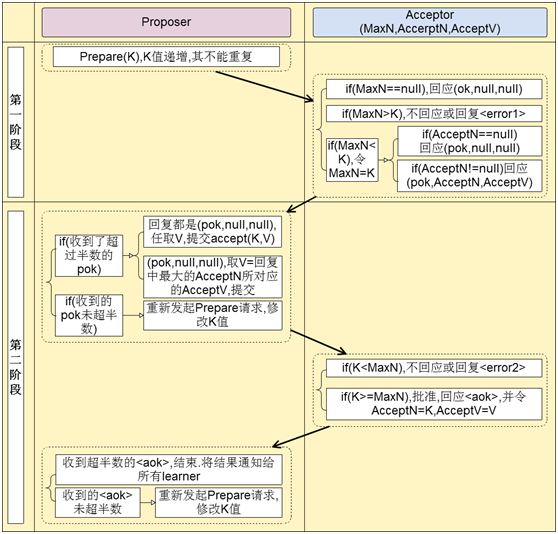
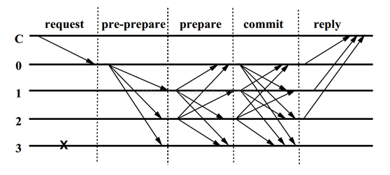
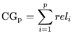
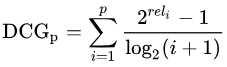
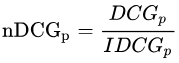
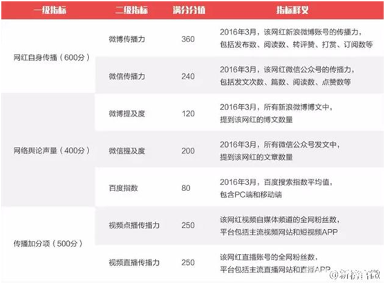
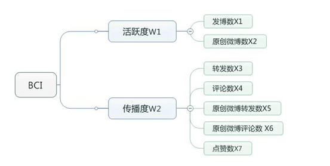

| 序号 | 修改时间   | 修改内容                                             | 修改人 | 审稿人 |
| ---- | ---------- | ---------------------------------------------------- | ------ | ------ |
| 1    | 2018-10-27 | 创建。从算法分析与设计中抽取AI和大数据部分单独成文。 | Keefe | Keefe |
| 2    | 2019-3-30  | 更新AI仿生学算法。                                   | 同上   |        |
| 3    | 2019-7-27  | 增加分布式系统共识算法章节。                         | 同上   |        |
| 4    | 2019-8-4   | 增加搜索引擎算法章节。                               | 同上   |        |
| 5 | 2021-12-28 | 迁移安全算法章节另文。 | 同上 |        |

<br><br><br><br>

---

# 目录

[TOC]


<br>

---

# 1 非数值算法概述

算法可粗分为数值算法和非数值算法, 本文主要研究非数值算法.

## 1.1  压缩算法

**原理**： 数据的冗余性, 来自信息论中香农的”熵”.

**概论**： 可分为有损和无损压缩.  无损压缩的模型主要有： Huffman编码, 算术编码, 字节压缩和字典压缩等.

**里程碑**：

**1948**, 香农在Bell System Technical Journal上发表了《A Mathematical Theory of Communication 》, 提出了”熵”的概念, 为现代信息论的创始人.

**1952**, D.A.Huffman发表论文”A Method for the Construction of Minimum Redundancy Codes”

**1977**, 以色列人 Jacob Ziv 和 Abraham Lempel 发表了论文“顺序数据压缩的一个通用算法”(A Universal Alogrithem for Sequential Data Compression)。简称LZ77.

**1978**, 他们发表了该论文的续篇“通过可变比率编码的独立序列的压缩”(Compression of Individual Sequences via Variable-Rate Coding)。简称LZ78.

**1984**, Terry Welch 发表了名为“高性能数据压缩技术”(A Technique for High-Performance Data Compression)的论文. 简称LZW.


压缩技术的概况是：

```
                     压缩技术
                        |
                /------------------------------\
         通用无损数据压缩           多媒体数据压缩(大多为有损压缩)
               |                                |
    /----------------\            /------------------------------------\
基于统计         基于字典    音频压缩        图像压缩                视频压缩
模型的压         模型的压        |              |
缩技术           缩技术         MP3等在      /-------------------、      AVI
    |                 |                  二值   灰度   彩色   矢量     MPEG2等
  /------\          /-------------\      图像   图像   图像   图像
Huffman  算术      LZ77   LZ78   LZW       |      |      |      |
编码     编码       \-------------/     传真机  FELICS  GIF    PostScript
 |         |               |            标准    JPEG等  JPEG等 Windows WMF等
UNIX下    接近无损    PKZIP、LHarc、ARJ、
的COMPACT 压缩极限    UNIX下的COMPRESS
程序等    的高级应用  程序等

```


## 1.2 串的模式匹配算法

| 算法     | 预处理时间 | 匹配时间 |
| -------- | ---------- | -------- |
| 朴素算法 | 0          | O(n-m+1) |
| KMP      | O(m)       | O(n)     |

注：n表示原串的长度，m为匹配度的长度


## 1.3  图论算法

G＝（V，E）  V为顶点集合｛v1,v2...};  E为边集合，E1={vi, vj}

1）显示图

概念： 图的结构显式给出，包括图的顶点，边及权重。 如路径问题，着色问题。

常用术语：权，环，入度，出度，路径，连通图，网络

搜索策略： 穷举搜索包括深度优先和广度优先。

2）隐式图

概念：一些求解，最优化或证明题中，给出初始结点和目标，在解问题过程中使用的搜索空间如子集树或排列树。

常用术语：子集树（问题在n个元素的子集中进行｝，排列树（问题在n个元素的排列中进行）

搜索策略： 启发式搜索包括回溯和分支限界等。

<br>

## 本章参考

[1]. [http://datacompression.info/](http://datacompression.info/)

[2]. 笨笨数据压缩教程 [http://wenku.baidu.com/view/c204071555270722192ef701.html](http://wenku.baidu.com/view/c204071555270722192ef701.html)

<br><br>

# 2 安全算法

详见 《[安全算法.md](./安全算法.md)》

<br><br>

# 3  大数据算法

## 3.1  并行算法

**原理**：并行计算机系统处理

**概论**：常用方法是PCAM, 包括划分,通信,组合,映射几个步骤.

**里程碑**：


## 3.2  大数据存储

参见  《数据库技术》


## 3.3  大数据传输安全

参见  《安全技术》


## 3.4  数据挖掘十大经典算法

详见

1. [C4.5](http://blog.csdn.net/aladdina/archive/2009/04/30/4141048.aspx)

2. [The k-means algorithm](http://blog.csdn.net/aladdina/archive/2009/04/30/4141089.aspx) 即K-Means算法

3. [Support vector machines](http://blog.csdn.net/aladdina/archive/2009/04/30/4141094.aspx)

4. [The Apriori algorithm](http://blog.csdn.net/aladdina/archive/2009/05/01/4141101.aspx)

Apriori算法是一种最有影响的挖掘布尔关联规则频繁项集的算法。其核心是基于两阶段频集思想的递推算法。该关联规则在分类上属于单维、单层、布尔关联规则。在这里，所有支持度大于最小支持度的项集称为频繁项集，简称频集。

5. [最大期望(EM)算法](http://blog.csdn.net/aladdina/archive/2009/05/01/4141114.aspx)

6. [PageRank](http://blog.csdn.net/aladdina/archive/2009/05/01/4141120.aspx)

7. [AdaBoost](http://blog.csdn.net/aladdina/archive/2009/05/01/4141124.aspx)

8. [kNN: k-nearest neighbor classification](http://blog.csdn.net/aladdina/archive/2009/05/01/4141127.aspx)

9. [Naive Bayes](http://blog.csdn.net/aladdina/archive/2009/05/01/4141140.aspx)

10. [CART: 分类与回归树](http://blog.csdn.net/aladdina/archive/2009/05/01/4141150.aspx)


<br>

## 本章参考

* 数据挖掘十大经典算法 http://blog.csdn.net/aladdina/archive/2009/05/01/4141177.aspx
* 皮尔逊相关系数评价算法（集体智慧编程） http://lobert.iteye.com/blog/2024999

<br><br>

# 4 分布式系统共识算法

**分布式系统常见问题**

1、「拜占庭将军问题」：1982年Lamport提出拜占庭将军问题。多个拜占庭将军要如何在可能有叛徒、信使可能被策反或者暗杀的情况下达成是否要进攻的一致性决定？

2、「拜占庭将军问题简化」：假设将军中没有叛军，信使的信息可靠但有可能被暗杀的情况下，将军们如何达成一致性决定？  解决方案：Paxos、Raft


应用场景：领导人选举、关键状态共享、分布式锁

应用案例：ZooKeeper、区块链

一致性常用算法 ：Paxos/2PC(1990)、DHT（1997）、Quorum拜占庭协议、Zab（2010）、Raft（2014）、

表格 9 分布式系统算法列表

| 算法             | 简介                                                         | 实现原理                                                     | 应用案例  |
| ---------------- | ------------------------------------------------------------ | ------------------------------------------------------------ | --------- |
| Paxos            | 最早的解决拜占庭将军问题简化的方案。1990年Lamport提出。      | 基于消息传递的一致性算法。一致性状态机(state machine replication)。 |           |
| DHT              | 1997年麻省理工学院提出的一种分布式哈希（DHT）实现算法。解决因特网中的热点(Hot spot)问题。 |                                                              | P2P       |
| Quorum拜占庭协议 |                                                              |                                                              |           |
| 拜占庭容错PBFT   | 1999年Castro和Liskov提出实用拜占庭容错算法PBFT（Practical  Byzantine Fault Tolerance），首次将此类算法的复杂度从指数级降到了多项式级。 | 如果系统内作恶节点数目不超过总节点数目的1/3，PBFT算法就能生效。 |           |
| Raft             | 2014年哈佛提出的算法。                                       |                                                              |           |
| Zab              | 为ZooKeeper设计的一种支持崩溃恢复的原子广播协议。            | 为分布式主备系统设计。                                       | ZooKeeper |

备注：ZooKeeper是业界第一个有行业影响力的开源共识系统。


## 4.1  分布式共识 Paxos/2PC (1990)

Paxos算法是莱斯利·兰伯特（Leslie Lamport，就是 [LaTeX](https://baike.baidu.com/item/LaTeX) 中的"La"，此人现在在微软研究院）于1990年提出的一种基于消息传递的一致性算法。这个算法被[认为](https://baike.baidu.com/item/认为/1230084)是类似算法中最有效的。

Paxos是用于解决分布式系统中一致性问题的共识算法（Consensus Algorithm），其最基本的功能是为了在多个进程之间对某个值达成一致。通过这个最基本功能，就可以在多个进程之间进行数据库、状态机、账本（区块链）等对象的同步。

Paxos不追求值的正确性、权威性、及时性，只追求一致性。

可能问题：拜占庭式（进程由于BUG或者恶意发送的不正确消息）、非拜占庭式、角斗士


**概念术语**

表格 10 Paxos的概念表

| ID       | 相互不冲突的提案编号，用于区分不同轮次的提案。               |
| -------- | ------------------------------------------------------------ |
| Value    | 提案的值，即最后试图达成共识的候选结果。                     |
| Proposer | 提案发起者，用于提出议案，提案的内容为：令 x=value，对同一轮提案，最多提议一个value 。Proposer角度看，提案分为两个阶段：Prepare阶段、Propose阶段。一轮提案的value不一定非要是Proposer自己提议的value。 |
| Acceptor | 提案投票者，有 N 个。Proposer 提出的 x=value 提案必须获得超过半数(N/2+1)的 Acceptor接受后才能被chosen。Acceptor 之间完全对等，在独立的时间轴执行提案投票。从Acceptor角度看，投票分两阶段进行：Promise阶段、Accept阶段。 |
| Learner  | 提案学习者。一个提案超过半数accpetor通过即可被chosen，其他未确定的Acceptor可以通过learner来同步结果。 |

说明：Paxos中有三类角色Proposer、Acceptor及Learner，主要交互过程在Proposer和Acceptor之间。

Paxos交互有二个阶段Phase： Prepare(Phase 1)和Propose(Phase 2)。


   

图 3 Paxos算法图解

**Prepare阶段**

A：Proposer选择一个提案编号n，向所有的Acceptor广播Prepare（n）请求。

B：Acceptor收到Prepare（n）请求，若提案编号n比之前接收的Prepare请求都要大，则承诺（Promise，将n记录下来）将不会接收提案编号比n小的提议，并且带上之前Accept的提议中编号小于n的最大的提案value。如果n比之前接受的提案编号小，则不予理会。

**Propose阶段**

A：Proposer收到Acceptor的Promise

如果未超过半数的accpetor回复承诺（Promise），本次提案失败；

如果超过半数的Acceptor回复承诺，又分为不同情况：

如果（回复承诺的）所有Acceptor都未接收过value（都为null），那么向所有的Acceptor发起（Propose）自己的value和提案编号n。

如果有部分Acceptor接收过value，那么从接受过的value中选择提案编号最大的value作为本次提案的value，提议编号仍然为n（即：此时Proposer不能提议自己的value，只能信任Acceptor通过的value，以达成收敛的效果。）

B：Acceptor接收到提议后，如果该提案编号不等于自身当前承诺的编号（第一阶段记录的），不接受该请求，相等则将提案的value写入本地。


## 4.2   一致性哈希DHT (1997)

​       一致性哈希算法在1997年由麻省理工学院提出的一种分布式哈希（DHT）实现算法，设计目标是为了解决因特网中的热点(Hot spot)问题，初衷和CARP十分类似。一致性哈希修正了CARP使用的简单哈希算法带来的问题，使得分布式哈希（DHT）可以在P2P环境中真正得到应用。

​    一致性hash算法提出了在动态变化的Cache环境中，判定哈希算法好坏的四个定义：

1、**平衡性**(Balance)：平衡性是指哈希的结果能够尽可能分布到所有的缓冲中去，这样可以使得所有的缓冲空间都得到利用。很多哈希算法都能够满足这一条件。

2、**单调性**(Monotonicity)：单调性是指如果已经有一些内容通过哈希分派到了相应的缓冲中，又有新的缓冲加入到系统中。哈希的结果应能够保证原有已分配的内容可以被映射到原有的或者新的缓冲中去，而不会被映射到旧的缓冲集合中的其他缓冲区。

3、**分散性**(Spread)：在分布式环境中，终端有可能看不到所有的缓冲，而是只能看到其中的一部分。当终端希望通过哈希过程将内容映射到缓冲上时，由于不同终端所见的缓冲范围有可能不同，从而导致哈希的结果不一致，最终的结果是相同的内容被不同的终端映射到不同的缓冲区中。这种情况显然是应该避免的，因为它导致相同内容被存储到不同缓冲中去，降低了系统存储的效率。分散性的定义就是上述情况发生的严重程度。好的哈希算法应能够尽量避免不一致的情况发生，也就是尽量降低分散性。

4、**负载**(Load)：负载问题实际上是从另一个角度看待分散性问题。既然不同的终端可能将相同的内容映射到不同的缓冲区中，那么对于一个特定的缓冲区而言，也可能被不同的用户映射为不同 的内容。与分散性一样，这种情况也是应当避免的，因此好的哈希算法应能够尽量降低缓冲的负荷。


在分布式集群中，对机器的添加删除，或者机器故障后自动脱离集群这些操作是分布式集群管理最基本的功能。如果采用常用的hash(object)%N算法，那么在有机器添加或者删除后，很多原有的数据就无法找到了，这样严重的违反了单调性原则。


## 4.3   拜占庭容错PBFT Quorum

   

图 4 PBFT（拜占庭容错）算法

其中C为发送请求端，0123为服务端，3为宕机的服务端，具体步骤如下：

1. Request：请求端C发送请求到任意一节点，这里是0

2. Pre-Prepare：服务端0收到C的请求后进行广播，扩散至123

3. Prepare：123,收到后记录并再次广播，1->023，2->013，3因为宕机无法广播

4. Commit：0123节点在Prepare阶段，若收到超过一定数量的相同请求，则进入Commit阶段，广播Commit请求

5. Reply：0123节点在Commit阶段，若收到超过一定数量的相同请求，则对C进行反馈

根据上述流程，在 N ≥ 3F + 1 的情況下一致性是可能解決，N为总计算机数，F为有问题的计算机总数。

备注：拜占庭容错能够容纳将近1/3的错误节点误差，IBM创建的Hyperledger就是使用了该算法作为共识算法。


## 4.4  Raft (2014)

Raft是一种管理复制日志的一致性算法。

它的首要设计目的就是易于理解，所以在选主的冲突处理等方式上它都选择了非常简单明了的解决方案。

在Raft中，问题分解为：Leader领导选取、日志复制、安全和成员变化。

复制状态机通过复制日志来实现：

*  日志：每台机器保存一份日志，日志来自于客户端的请求，包含一系列的命令

*  状态机：状态机会按顺序执行这些命令

*  一致性模型：分布式环境下，保证多机的日志是一致的，这样回放到状态机中的状态是一致的.


RAFT核心思想很容易理解，如果数个数据库，初始状态一致，只要之后的进行的操作一致，就能保证之后的数据一致。由此RAFT使用的是Log进行同步，并且将服务器分为三中角色：Leader，Follower，Candidate，相互可以互相转换。

RAFT从大的角度看，分为两个过程：

1. 选举Leader

2. Leader生成Log，并与Follower进行Headbeats同步


## 4.5  ZAB

Zab协议 的全称是 Zookeeper Atomic Broadcast （Zookeeper原子广播），是为ZooKeeper设计的一种支持崩溃恢复的原子广播协议。

**ZAB的具体实现**

*  ZooKeeper由client、server两部分构成

*  client可以在任何一个server节点上进行读操作

*  client可以在任何一个server节点上发起写请求，非leader节点会把此次写请求转发到leader节点上。由leader节点执行

*  ZooKeeper使用改编的两阶段提交协议来保证server节点的事务一致性

ZKID：ZooKeeper会为每一个事务生成一个唯一且递增长度为64位的ZXID,ZXID由两部分组成：低32位表示计数器(counter)和高32位的纪元号(epoch)。


Zookeeper 是通过 Zab 协议来保证分布式事务的最终一致性。

*  Zab协议是为分布式协调服务Zookeeper专门设计的一种 支持崩溃恢复 的 原子广播协议 ，是Zookeeper保证数据一致性的核心算法。Zab借鉴了Paxos算法，但又不像Paxos那样，是一种通用的分布式一致性算法。它是特别为Zookeeper设计的支持崩溃恢复的原子广播协议。

*  在Zookeeper中主要依赖Zab协议来实现数据一致性，基于该协议，zk实现了一种主备模型（即Leader和Follower模型）的系统架构来保证集群中各个副本之间数据的一致性。


**Zab** **协议的特性**：
 1）Zab 协议需要确保那些**已经在** **Leader** **服务器上提交（Commit）的事务最终被所有的服务器提交**。
 2）Zab 协议需要确保**丢弃那些只在** **Leader** **上被提出而没有被提交的事务**。

   

图 5 ZAB协议


**Zab协议原理**

Zab协议要求每个 Leader 都要经历三个阶段：发现，同步，广播。

*  发现：要求zookeeper集群必须选举出一个 Leader 进程，同时 Leader 会维护一个 Follower 可用客户端列表。将来客户端可以和这些 Follower节点进行通信。

*  同步：Leader 要负责将本身的数据与 Follower 完成同步，做到多副本存储。这样也是提现了CAP中的高可用和分区容错。Follower将队列中未处理完的请求消费完成后，写入本地事务日志中。

*  广播：Leader 可以接受客户端新的事务Proposal请求，将新的Proposal请求广播给所有的 Follower。


<br>

## 本章参考

[1]. paxos图解, http://coderxy.com/archives/121

[2]. Paxos算法详解, http://coderxy.com/archives/136

[3]. Paxos算法 wiki, [http://zh.wikipedia.org/zh-cn/Paxos%E7%AE%97%E6%B3%95#.E5.AE.9E.E4.BE.8B](http://zh.wikipedia.org/zh-cn/Paxos算法#.E5.AE.9E.E4.BE.8B)

[4]. 晦涩的Paxos https://www.jianshu.com/p/ddf0db5d5f52

[5]. 区块链共识算法 PBFT（拜占庭容错）、PAXOS、RAFT简述 https://blog.csdn.net/jerry81333/article/details/74303194

[6]. Raft 《[In search of an Understandable Consensus Algorithm (Extended Version)](https://ramcloud.atlassian.net/wiki/download/attachments/6586375/raft.pdf)》(寻找一种易于理解的一致性算法)

[7]. Raft 一致性算法论文译文 https://www.infoq.cn/article/raft-paper/

[8]. 聊聊zookeeper的ZAB算法 https://www.jianshu.com/p/400a44edee88

[9]. Zookeeper——一致性协议:Zab协议 https://www.jianshu.com/p/2bceacd60b8a

[10]. [Zab vs. Paxos](https://cwiki.apache.org/confluence/display/ZOOKEEPER/Zab+vs.+Paxos)

[11] .[Architecture of ZAB – ZooKeeper Atomic Broadcast protocol](https://distributedalgorithm.wordpress.com/2015/06/20/architecture-of-zab-zookeeper-atomic-broadcast-protocol/)

[12]. 从分布式一致性算法到区块链共识机制 https://blog.csdn.net/weixin_43970890/article/details/90173996

<br>

# 5 搜索引擎算法

## 5.1  搜索排序打分

当前的搜索引擎的排序技术有两个不足：语意相关性和排序个性化。前者需要完善的自然语言处理技术，后者需要记录庞大访问者信息和复杂的计算。

### Lucene/ES打分

Elasticsearch的默认打分公式是lucene的打分公式，主要分为两部分的计算，一部分是计算query部分的得分，另一部分是计算field部分的得分，下面给出ES官网给出的打分公式：

$$
score(q,d)  =  queryNorm(q)  · coord(q,d)  · ∑ (tf(t,d) · idf(t)² · t.getBoost() · norm(t,d))
$$
公式说明：

```sh
score(q,d)  =
            queryNorm(q)      # 查询归一化
          · coord(q,d)          # 协调因子
          · ∑ (
                tf(t in d)      # 词频
              · idf(t)²         # 反文档频率
              · t.getBoost()    # 词的权重
              · norm(t,d)       # 查询权重
            ) (t in q)
```

说明：q~查询词，d~文档，t~q分词后的单词。

1. 在计算过程中，涉及的变量应该考虑的是document所在的分片而不是整个index。

2. 相关性打分其实是查询与某个文档的某个字段之间的相关性打分，而不是与文档的相关性；

3. 根据公式转换，就变成了查询的所有Term与文档中字段的相关性求和，如果某个Term不相关，则需要处理coord系数

*  queryNorm(q)=1 / √sumOfSquaredWeights , sumOfSquaredWeights =(idf(t1)^2+idf(t2) ^2+...+idf(tn) ^2), 对于ES来说分片是1才不影响排序

*  coord(q,d)=overlap/maxoverlap，overlap是检索命中query中term的个数，maxoverlap是query中总共的term个数，指分词后命中词在查询词的比例。

*  tf(t in d) = √frequency，词频即term t在文档中出现的个数。

*  idf(t) = 1 + log ( numDocs / (docFreq + 1))  逆词频数，即召回的文档在总文档中出现过多少次

*  t.getboost():

*  norm(t,d): field的标准化因子，在官方给的解释是field越短，如果召回的话权重越大。


## 5.2   垂直搜索打分

### 音乐搜索权重


### 小说搜索权重

说明：小说更新越快，来源站越多，章节数越多，说明小说越受欢迎，权重越高。

**1). 选取指标**：爬取频率freqs、来源站数sources、章节数chapters、

2). 指标标准化：

*  f_boost = log(1+ freqs/(freqs+2)

*  s_boost = 1+sources/(sources+4)      //来源站数标准取4

*  c_boost = 1+chapters/(chapters+4)  //章节数标准取50

3). 指标加权：boost = $f_boost*$s_boost*$c_boost

 **PHP实现示例：**

```php
$f_boost = dba_fetch($u_key, $dba);
$f_boost = 1+($f_boost/($f_boost+2));
$f_boost = pow($f_boost, 2);   //爬取频率权重
$s_boost = 1+($info['sourcenum']/($info['sourcenum']+4));   //来源站权重，越多权重越高
$c_boost = 1+$info['chapter_total']/($info['chapter_total']+50);  //章节数权重，章节越多权重越高
$boost = round($f_boost*$s_boost*$c_boost, 1);
```


### 整合搜索权重

选择指标：频道权重、查询权重

指标标准化：

指标加权：


## 5.3  搜索质量评价

评价一个搜索引擎的指标包括：查全率，查准率和性能。

### 准确率-召回率-MAP

参见  《AI算法》评价指标章节

信息检索领域两个最基本指标是召回率(Recall Rate)和准确率(Precision Rate）。

如果是做搜索，那就是保证召回率的情况下提升准确率；如果做疾病检测、反垃圾，则是保证准确率的条件下，提升召回率。所以，在两者都要求高的情况下，可以用F1(或者称为F-score)来衡量。计算公式如下：
$$
F1 = (2 × P × R) / (P + R)。
$$


MAP（Mean Average Precision，平均准确率）：单个主题的平均准确率是每篇相关文档检索出后的准确率的平均值。


### 归一化折扣累计增益 NDCG

网页满意度评分（0-5）：非常不满意、较不满意、勉强满意、较满意、满意、非常满意

NDCG~归一化折扣累计增益是一种综合考虑排序和真实序列之间关系的指标。

 

**累计增益（CG）**

　　CG，cumulative gain，是DCG的前身，只考虑到了相关性的关联程度，没有考虑到位置的因素。它是一个搜素结果相关性分数的总和。指定位置p上的CG为：

> 备注：reli 代表i这个位置上的相关度。


**折损累计增益（DCG）**

　　DCG， Discounted 的CG，就是在每一个CG的结果上处以一个折损值，为什么要这么做呢？目的就是为了让排名越靠前的结果越能影响最后的结果(位置相关)。假设排序越往后，价值越低。到第i个位置的时候，它的价值是 1/log2(i+1)，那么第i个结果产生的效益就是 reli * 1/log2(i+1)，所以：


 

**归一化折损累计增益（NDCG）**

　　NDCG， Normalized 的DCG，由于搜索结果随着检索词的不同，返回的数量是不一致的，而DCG是当前排序的折扣累计增益，IDCG是最佳排序时的折扣累计增益。一个累加的值，没法针对两个不同的搜索结果进行比较，因此需要归一化处理，除以IDCG；

   


### 基于日志的反馈学习

搜索引擎日志挖掘的主要技术有：统计分析方法、数学模型分析与预测、关联规则分析、聚类分析等。

基于搜索词的分析

*  发现搜索词价值：相关搜索、近义词、热词缓存

*  发现不明意图下的用户行为：搜索引擎本身问题分词歧义和新词识别，可通过搜索日志改善。


基于用户点击日志的分析

*  时间与搜索意图的关系

*  地理位置与搜索意图的关系

*  点击日志与同义词：同义词发现

*  点击日志与词语权重：

*  点击日志与新词分类

*  点击日志与知识图谱

*  点击日志与网页重排序

*  点击日志与网页评价

*  基于用户特征分析：用户跟踪、用户群体、用户个体


<br>

## 本章参考

* ElasticSearch打分机制学习 https://blog.csdn.net/ginobefun/article/details/52861660
* 推荐系统遇上深度学习(十六)--详解推荐系统中的常用评测指标 https://blog.csdn.net/jiangjiang_jian/article/details/80728607

<br>

# 6 微服务算法

## 6.1  限流算法

表格 1 限流算法比较

| 算法     | 令牌桶算法                                                   | 漏洞算法                                                     |
| -------- | ------------------------------------------------------------ | ------------------------------------------------------------ |
| 算法原理 | 令牌以固定速率产生，并缓存到令牌桶中；  令牌桶放满时，多余的令牌被丢弃；  请求要消耗等比例的令牌才能被处理；  令牌不够时，请求被缓存。 | 水（请求）从上方倒入水桶，从水桶下方流出（被处理）；  来不及流出的水存在水桶中（缓冲），以固定速率流出；  水桶满后水溢出（丢弃）。 |
| 特点     | 结构：桶（存令牌） + 队列（存请求）。请求不被丢弃。          | 缓存请求、匀速处理、多余的请求直接丢弃。                     |
| 优点     | 能够在限制数据的平均传输速率的同时允许某种程度的突发传输。   | 漏桶算法能够强行限制数据的实时传输（处理）速率，对突发流量不做额外处理。 |

备注：漏桶和令牌桶算法最明显的区别就是是否允许突发流量(burst)的处理，漏洞算法会丢弃超量请求。nginx的限流默认使用的是漏洞算法。

   

图 6 令牌桶算法


 


图 7 漏洞算法

<br>

# 7 排名算法

## 7.1  网页排名算法

表格 12 网页常见算法比较

| 算法           | 算法简介                                                     | 公式                                                       | 优缺点 |
| -------------- | ------------------------------------------------------------ | ---------------------------------------------------------- | ------ |
| PageRank       | 网页重要性评价。根据[网页](http://zh.wikipedia.org/wiki/网页)之间相互的[超链接](http://zh.wikipedia.org/wiki/超链接)计算的网页排名算法。 | PR(A) = (1-d)  + d *( PR(T1)/C(T1) + ... +  PR(Tn)/C(Tn) ) |        |
| Hits           | 网页权威性评价。基于链接和用户搜索主题。算法核心在于权威值和枢纽值。 |                                                            |        |
| HillTop/  Hits | PageRank和Hits的综合。主题相关网页之间的链接对于权重计算的贡献比主题不相关的链接价值要更高。 |                                                            |        |
| 网页作弊评价   | 包括TrustRank、不信任传播模型、Panda、网页特征判断模型       |                                                            |        |


### 7.1.1   网页重要性~PageRank

PageRank，网页排名，又称网页级别、Google左侧排名或佩奇排名，是一种由[搜索引擎](http://zh.wikipedia.org/wiki/搜索引擎)根据[网页](http://zh.wikipedia.org/wiki/网页)之间相互的[超链接](http://zh.wikipedia.org/wiki/超链接)计算的网页排名技術，以[Google公司](http://zh.wikipedia.org/wiki/Google公司)創辦人[拉里·佩奇](http://zh.wikipedia.org/wiki/拉里·佩奇)（Larry Page）之姓來命名。此技術通常和[搜索引擎优化](http://zh.wikipedia.org/wiki/搜索引擎优化)有关，[Google](http://zh.wikipedia.org/wiki/Google)用它来体现网页的相关性和重要性。[Google](http://zh.wikipedia.org/wiki/Google)的创始人[拉里·佩奇](http://zh.wikipedia.org/wiki/拉里·佩奇)和[谢尔盖·布林](http://zh.wikipedia.org/wiki/谢尔盖·布林)於[1998年](http://zh.wikipedia.org/wiki/1998年)在[斯坦福大学](http://zh.wikipedia.org/wiki/斯坦福大学)发明了这项技术。

**PageRank公式：**
$$
PR(A) = (1-d) + d *( PR(T1)/C(T1) + ... + PR(Tn)/C(Tn) )
$$
公式说明：我们假设*外部站点*T1…Tn指向*网页*A（例如，被引用）。

*  PR(T1)表示该外部链接网站本身的PR分值；

*  C(T1)表示该外部链接站点T1所拥有的外部链接数量。PR(T1)/C(T1)即为外部站点T1带给网页A的PR分值。

*  参数d是制动因子，使结果在0，1之间。通常d等于0.85。即这个因子的存在是为了保证每个页面有个不为0的初始PR，并且在不断重复计算中还原其真实PR。一个网站的投票权值只有该网站PR分值的0.85，而且这个0.85的权值平均分配给其链接的每个外部网站。

*  参考2：PR(A)表示的是从一个外部链接站点T1上，依据Pagerank为系统给你的网站所增加的PR分值。C(A)定义为网页A指向其它网页的链接数。

**备注**：

*  注意PageRank的形式，分布到各个网页中，因此所有网页的PageRank和是1。

*  这个公式表明外部链接站数量Tn越多，能得到的外部PR分值就越多，最终网页的PR值就高。

*  这项技术的主要缺点是旧的页面等级会比新页面高。因为即使是非常好的新页面也不会有很多上游链接，除非它是某个站点的子站点。


这就是PageRank需要多项算法结合的原因。Google经常惩罚恶意提高PageRank的行为，至于其如何区分正常的链接交换和不正常的链接堆积仍然是商业机密。


### 8.1.2   网页权威性~HillTop算法

HillTop认为只计算 来自具有相同主题的相关文档(“专家”文档)链接对于搜索者的价值会更大：即主题相关网页之间的链接对于权重计算的贡献比主题不相关的链接价值要更高。


## 7.2  网站流量排名算法Alexa

曾经使用的一个排名算法是：

$$
Traffic Rank = Reach ^2 * PV
$$


*  Reach -- Reach per million users, 每百万用户访问人次,现在是全球用户访问比率．全球网民总数约10亿,其中装alexa工具条的估计在100万—1000万之间..

*  PV -- PageViews per user 每用户浏览页面数，简称PV

考虑到中国境内使用Alexa工具条的明显不如欧美地区，可加入到地区权重因子。公式改进为：

$$
Traffic Rank = (Reach*d) ^2 * PV
$$
其中参数d为地区权重因子，欧美地区为1,中国为5.


## 7.3  投票排名算法

**CodeProject文章排名算法**

CodeProject上有对所有文章进行了排名，并公开了自己的排名算法，公式如下：

```sh
Rank = Rating * Log10(Votes)      //会员评分权重*标准化投票数
Rating = SUM (Rating*weight)/SUM(weight)   //会员评分权重
```

可以看出，这个算法在计算排名时，用了投票数取Log10，再乘以得分，这样就避免了3个5分比10000个4.9分排名高的情况，同时，CodeProject的得分，并不是平均分（上面Rating的计算公式），而是考虑根据每个会员的等级，乘以一个系数，也就是说越高级会员，评分的权重会越大。

看起来CodeProject的排名算法还比较简单，不过，这里的Log10和会员权重都是一些经验数据，并没有理论支撑，所以显得不是那么严谨。


### 电影排名算法

**IMDb Top 250** [http://www.imdb.com/chart/top](http://www.imdb.com/chart/top)

成立与1990年的The Internet Movie Database (互联网电影数据库，简称IMDb)是目前全球互联网上最大、最详细的电影及电视剧数据库。作为amazon.com的旗下网站，IMDb除了拥有无比详 细的数据外还有大量忠实的用户。这些忠实用户对每部电影的评分就构成了目前公认最权威的电影排行榜——IMDb Top 250。

IMDB的Top 250电影可是鼎鼎有名, 深受影迷的欢迎，注册的用户可以给任何一部影片打分并加以评述，而网站又会根据影片所得平均分、选票的数目等计算得出影片的加权平 均分并以此进行TOP250（最佳250部影片）和Bottom100（最差100部影片）的排行。

$$
Weighte Rank (WR) = (v ÷ (v+m)) × R + (m ÷ (v+m)) × C
$$
其中：

*  v = number of votes for the movie = (votes) （投票人数，需要注意的是，只有经常投票者才会被计算在内）

*  m = minimum votes required to be listed in the top 250 (currently 1250) （进入imdb top 250需要的最小票数，只有三两个人投票的电影就算得满分也没用的）

*  R = average for the movie (mean) = (Rating) （是用普通的方法计算出的平均分）

*  C = the mean vote across the whole report (currently 6.9) （目前所有电影的平均得分）

IMDB的算法其实非常接近于贝叶斯算法，并且取得了相当“可信”的效果（IMDB的Top 250被N多网站引用），可见贝叶斯算法在现实中还是很有价值的。


**豆瓣电影250**
 [http://www.douban.com/movie/top250](http://www.douban.com/movie/top250)

豆瓣采用的简单平均分方法。


**迅雷评价最高影片** [http://movie.xunlei.com/top/top_rating.html](http://movie.xunlei.com/top/top_rating.html)

整体评分=印象×50%+(导演+故事+画面+表演+音乐)×10%


## 7.4  内容价值排名

### 7.4.1   新榜指数newrank.cn

新榜指数（New Rank Index，NRI）系由新媒体排行榜（newrank.cn）基于海量数据、用户深度反馈及专家建议而推出，用于衡量中国移动互联网渠道新媒体（主要指两微一端）的传播能力，此指数反映该新媒体主体的热度和发展趋势。

新榜隶属于上海看榜信息科技有限公司，成立于2014年8月，是一家定位于内容创业服务平台，用以衡量传播价值、品牌价值、投资价值的新榜指数，已经成为中国移动互联网内容价值标准。

2006.5，内容数据服务平台[新榜](http://www.investide.cn/?tag=新榜)宣布获得A+轮融资。本轮由微影资本，真格基金、高榕资本跟投。融得资金将用于提升用户体验，扩大数据服务，打造新媒体全链条的解决方案等。据了解，新榜已遍历1000万个以上微信公众号，并保持每天持续监测超过20万个有影响力的优秀账号。


以下算法主要针对微信进行阐述：

 **算法简述**
       新榜指数是由原始数据参照基数通过计算公式推导出来的标量数值，用以衡量原始数据在其所属维度的相对表现。例如，xx点赞数为：379，我们会将这一数据和点赞常数进行比较，以确定其点赞数的相对位置，进而转换为其点赞指数，其余指标以此类推。


**该算法相较于常规加权有四大优势：**
       1、不仅显示绝对表现，还能反映所处位置；
       2、标准化后，不同维度的指标之间可以相互比较；
       3、指标之间可以相互运算，从而得到综合考察各维度的新榜指数；
       4、不仅可以用于账号间的比较，也可以用于账号自身的跨期比较。


#### 微信新榜指数

算法
  **1、选定指标**
       在微信的计算中，为兼顾其数量与质量，我们使用总阅读数、最高阅读数、平均阅读数、头条阅读数、总点赞数五个指标来对账号进行评估，其中：
 整体指标（总阅读数，R）：指统计周期内所有发布内容的阅读数总和；
 优异指标（最高阅读，Rm)：是指统计周期内所有发布内容中的单篇最高阅读数；
 质量指标（平均阅读数， Ra )：统计周期内所有发布内容的阅读数平均值；
 主动预判指标（头条阅读， Rh  )：统计周期内位置为头条的内容的阅读总数；
 互动指标（总点赞数，Z)：统计周期内所有发布内容的点赞数总和。

**2、指标标准化**
 基于不同维度指标的差异性，我们首先将所得数据标准化，即通过对各维度原始数据与该维度常数的比值计算，得到该样本各项指标的千分化数值。
 在新榜指数中，以天为最小计算周期，将常规（1天推送一次，每次最多8篇）的公众号为对象在这一时间段内总阅读数、最高阅读数、平均阅读数、头条阅读数和点赞数共五个指标的常数分别记为：


#### 网红排名指数

网红排行榜中的综合得分暨新榜指数，由各项原始传播数据标准化处理之后，参照权重计算公式推导而得，包括网红自身传播、网络舆论声量、传播加分项三大维度，满分1500分，共计近30个细项指标，算法公式如下：

   

图 8网红排名算法


### 7.4.2   清博指数gsdata.cn

#### 微信传播指数WCI（V12.0）

WCI-12.0版本旨在鼓励账号提高单篇文章质量，合理把握推文数量，多做精品、少发“垃圾文”，提高账号的整体传播力和影响力。

   

图 9 微信传播指数WCI（V12.0）

其中，R为评估时间段内所有文章（n）的阅读总数；
 Z为评估时间段内所有文章（n）的点赞总数；
 d为评估时间段所含天数（一般周取7天，月度取30天，年度取365天，其他自定义时间段以真实天数计算）；
 n为评估时间段内账号所发文章数；
 Rmax和Zmax为评估时间段内账号所发文章的最高阅读数和最高点赞数。


#### 微博传播指数BCI（V9.0）

微博传播指数BCI（Micro-blog Communication Index）通过微博的活跃度和传播度来反映账 号的传播能力和传播效果。BCI重在评估账号的原发微博传播力，旨在鼓励高质量原创内容。
 1、指标体系： 采用数据：发博数X1、原创微博数X2、转发数X3、评论数X4、原创微博转发数X5、原创微博 评论数X6、点赞数X7。
 采用指标：主要通过活跃度和传播度两大维度来进行评价。建立如下指标体系：

   

图 10 微博传播指数BCI（V9.0）


   

图 11 微博传播指数BCI相关指标与权重

   

#### 品牌价值指数BVI

1、市值/估值：名单中包括上市和非上市公司。
 2、品牌口碑、品牌潜力：两项为专家打分。
 3、BCI：微博传播指数BCI（Micro-blog Communication Index）通过微博的活跃度和传播度来反映账 号的传播能力和传播效果。BCI重在评估账号的原发微博传播力，旨在鼓励高质原创内容，详见BCI说明。
 4、WCI：微信传播指数WCI（Wechat Communication Index）是指通过微信公众号推送文章的传播度、覆盖度及账号的成熟度和影响力来反映微信整体热度和公众号的发展走势。WCI用总阅读数、平均阅读数、 最高阅读数、总点赞数、平均点赞数和最高点赞数六个指标对微信公众号进行评估。详见WCI说明。
 5、计算公式如下：

   


#### 网红指数OCI（Online Celebrity Index）V2.0

**1、评价对象：**
 在微博、微信、社区贴吧等互联网平台上具有一定话题度和影响力的“网络红人”，其因在现实或网络生活中的某个事件或行为而被网民关注，并在跨平台传播和全 民娱乐过程中走红。既包括作家、企业家、官员等在现实社会具有一定影响力的人，也包括段子手、美女等草根。本评估主要面向在微博、微信平台上走红的网红。
 **2、评估维度：**
 网红指数旨在评估网红在各大网络平台（包括微博、微信、视频、网页等）的综合影响力和传播度，具体包括传播力、影响力、转化力（待定）三大维度。其中，传播力主要考核网红在微博、微信和主流视频平台发布内容的传播情况，通过阅读数、转评数、点击数等流量数据来量化；影响力用以评价网红在各大网络平台的人气 和网络关注度，主要通过网红粉丝数、网民关注度、新闻关注度等指标量化评估；转化力主要考核网红通过导流、营销、创投等方式实现商业价值转化的能力，通过 电商平台的销售数据和融资情况来量化评价。
 **3、评估模型：**
 网红指数OCI侧重于对网红传播力和影响力的量化评估，评估模型包括三大维度、十余项项量化指标，通过全网数据的采集，建立基于大数据的开放评估模型，具体的评估模型如下：

   

微博传播力BCI：T时间段内网红账号的官方微博传播力指数（具体见清博指数介绍）；
 微信传播力WCI：T时间段内网红账号的官方微信公众号传播力指数（具体见清博指数介绍）；
 网页搜索数X1：T时间段内网红相关（百度）网页搜索数量；
 新闻搜索数X2：T时间段内网红相关（百度）新闻搜索数量；
 微博搜索数X3：T时间段内网相关微博讨论/搜索数量；
 微信文章搜索数X4：T时间段内网红相关微信文章（搜狗平台收录）搜索数量。
 （其中，T时间段为一周）


#### VR网络影响力评估指数V1.0

VR网络影响力指数WII-VR（Web Influence Index of VR）主要面向虚拟现实企业和产品的线上影响力进行评价。

 

#### 头条号清博指数公式模型TGI

头条号清博指数TGI（Toutiao Gsdata Index）通过对头条号账号的活跃度和传播度、互动度来反映账号的传播能力和效果。
 **1、指标体系：**
 采用数据：发文量X1、阅读量X2、分享量X3、收藏量X4、评论量X5、订阅量X6。
 采用指标：主要通过活跃度、传播度和互动度三大维度来进行评价。建立如下指标体系：

**1、指标体系：**
 采用数据：发文量X1、阅读量X2、分享量X3、收藏量X4、评论量X5、订阅量X6。
 采用指标：主要通过活跃度、传播度和互动度三大维度来进行评价。建立如下指标体系：

​    

图 12 头条号清博指数公式模型TGI

| **一级指标**       | **二级指标**               | **权重** | **标准化方法**               |
| ------------------ | -------------------------- | -------- | ---------------------------- |
| 传播指数   （80%） | 日均阅读数X1  篇均阅读数X2 | 45%  55% | ln（X1+1）  ln（X2+1         |
| 互动指数   （20%） | 日均评论数X3  篇均评论数X4 | 45%  55% | ln（X3*10+1）  ln（X4*10+1） |

 **头条号清博指数TGI**
$$
TGI={0.8 * (0.45 * ln(x1 + 1) + 0.55 *ln(x2 + 1)) + 0.2 * (0.45 *ln(x3 * 10 + 1) + 0.55 * ln(x4 * 10 + 1))}*100
$$
 其中，X1为评估时间段内发文总数；
 X2为评估时间段内发布文章的阅读总数；
 X3为评估时间段内发布文章的分享总数；
 X4为评估时间段内发布文章的被收藏总量；
 X5为评估时间段内发布文章的评论总数；
 X6为该账号被订阅的数量。


<br>

## 本章参考

[1]. 新榜指数白皮书 [http://www.newrank.cn/public/about/reference.pdf](http://www.newrank.cn/public/about/reference.pdf)

[2]. 新鲜出炉的网红 Top100，你认识几个？ [http://www.a.com.cn/info/domestic/2016/0415/288116.html](http://www.a.com.cn/info/domestic/2016/0415/288116.html)

[3]. 清博指数 [http://www.gsdata.cn/site/guide](http://www.gsdata.cn/site/guide)

<br>

# 8 工业界领域特定算法

## 8.1  指数设计

统计指数的概念有广义和狭义之分，前者是泛指反映社会经济现象变动程度的相对数，后者是指综合反映多种不同事物在不同时间上的总变动的特殊的相对数。

根据不同的分类方法，指数主要可分为：个体指数、总指数和组指数；综合指数与平均指数；定基指数与环比指数；数量指标指数与质量指标指数等。

*  按研究对象范围的不同，指数可以分为个体指数、总指数和组指数。个体指数是用于反映总体中某一单个现象动态变化的指数。总指数则是反映被研究现象全体的总动态变化。组指数也称为类指数，是在总指数中通过统计分组计算的反映各个组动态变化的指数。

*  在总指数中，按研究方法的不同，可以分为综合指数与平均指数。综合指数(Synthetic index)的主要特点是：将不可以直接度量的指数化指标，通过同度量因素转化为可以合计的总量指标，然后将不同时期的总量指标进行对比以综合反映现象的动态变化；平均指数(Average index)则是以个体指数为基础，通过*简单平均*或*加权平均*的方法计算总指数。

*  按照对比时采用的基期不同，指数可以分为定基指数与环比指数。从具体计算方法上看，指数是两个时期的指标数值之比，其中作为比较基础的时期称为**基期**(Base term)，而被比较的时期称为**报告期**(Reporting term)或计算期。若在计算指数时，不只是仅把两个时期的数值进行对比，而是随时间推移连续编制指数，这就形成指数数列(Index number series)。在指数数列中，如果各个指数都以某一固定时期作为基期，就得到定基指数(Fixed base index)；如果各个指数都以报告期的前期作为基期，就得到环比指数(Changed base index)。

*  按指数的经济内容和性质不同，可以分为数量指标指数和质量指标指数。数量指标指数(Quantitative index)包括产品产量指数、商品销售量指数等，质量指标指数(Qualitive index)包括产品成本指数(Index of production cost)、劳动生产率指数(Index of labor productivity)、零售物价指数(Index of retail prices)、居民消费品价格指数(Consumption price index)等。


指数设计的步骤主要有三步：一是选定指标（若干参数项）；二是标准化指标（常用对数函数LOG/IN转化）；三是指标加权。


### 股价指数

股价**平均数**的计算方法主要有三种，即算术平均法、几何平均法和加权平均法。加权平均法权数的选择，可以是股票的成交金额，也可以是它的上市股数。若选择计算期的同度量因素作为权数，则被称为派氏（Paasche）加权法。与前两类方法相比，加权平均股价指数能更真实地反映市场整体走势，因此，加权平均法更适合用于开发股指期货合约的标的指数。


**示例：上证指数**

上证180：根据总市值和成交金额对股票进行综合排名；按照各行业的自由流通调整市值比例分配样本只数，在行业内选取综合排名靠前的180名公司作为样本股。上海证券市场上最具代表性的大型蓝筹股票指数，是投资评价尺度和金融衍生产品标的的基础指数，于2002年7月发布。


## 8.2  广告系统

广告可以分为展示广告和点击广告。


**广告的计费方式**主要有以下几种：

*  CPM: Cost Per Miles, 每千人成本，指的是广告投放过程中，听到或者看到某广告的每一人平均分担到多少广告成本。**按访问人次收费已经成为网络广告的惯例。**

*  CPC: Cost Per Click, 每点击成本。以每点击一次计费。这样的方法加上点击率限制可以〖WX)〗加强作弊的难度，而且是宣传网站站点的最优方式。对于不需点击可以看到的广告来说不合理。

*  CPA: Cost Per Action, 每行动成本。指按广告投放实际效果，即按回应的有效问卷或定单来计费，而不限广告投放量。CPA的计价方式对于网站而言有一定的风险，但若广告投放成功，其收益也比CPM的计 价方式要大得多。

*  CPR：(Cost Per Response) 每回应成本，以浏览者的每一个回应计费。这种广告计费充分体现了网络广告“及时反应、直接互动、准 确记录”的特点，但是，这个显然是属于辅助销售的广告模式，对于那些实际只要亮出名字 就已经有一半满足的品牌广告要求，大概所有的网站都会给予拒绝，因为得到广告费的机会 比CPC还要渺茫。

*  CPP：(Cost Per Purchase) 每购买成本 ，广告主为规避广告费用风险，只有在网络用户点击旗帜广告并进行在线交易后，才按销售笔 数付给广告站点费用。

**备注**：无论是CPA还是CPP，广告主都要求发生目标消费者的“点击”，甚至进一步形成购买，才予 付费：CPM则只要求发生“目击”(或称“展露”、“印象”)，就产生广告付费。


### 广告投放算法

表格 13 混合广告投放中的权重设置

| 投放方式                | 权重 | 原理                                             |
| ----------------------- | ---- | ------------------------------------------------ |
| 广告与搜索词相关性      | 0.65 |                                                  |
| 基于USER-BASED协同过滤  | 0.15 | KNN，计算用户相似度，效果较差，常是离线分析。    |
| 基于ITEM-BASED协同过滤  | 0.1  | 基于历史纪录与当前广告相似程度，一般是在线分析。 |
| 基于MODEL-BASED协同过滤 | 0.1  | 综合贝叶斯和LSI，可以实时计算。                  |

备注：

### Google Adsense

**广告收入公式：**
$$
CPM = coverage * depth * CTR * CRC * 1000    （注：可简化成CPM=CTR*CRC）
$$

*  CPM: Cost Per Mille, 每千次广告展示的收入

*  coverage: 广告覆盖率=出现广告的搜索页面/所有搜索页面，谷歌约为1/3。

*  depth: 平均每页广告数，即页面显示广告位，通常在3以内。

*  CTR: Click-Through-Rate, 广告点击率=点击量/展示量，跟用户相关，谷歌约为3%~4%。

*  CRC: 每次点击所产生的费用，跟广告主相关。谷歌采用的是竞价排名中第二私密竞价模式。


**广告质量公式**

$$
广告排名分数 = 最高点击成本 * 广告质量得分CTR
$$
注：广告质量得分即广告点击率。


<br>

## 本章参考

* 统计指数分析  http://taihang.hebau.edu.cn/jingpinke/2009/shengji/tongjixue/kcwz/doc/jy/10.htm

<br>

# 其它算法

## AI人工智能算法

详见 《[AI算法](../../大数据与AI/ai/AI算法.md)》

<br><br>

# 参考资料

* 计算机科学中最重要的 32 个算法  https://mp.weixin.qq.com/s/2iu8oW126ycK_EMoPc0X6Q
* 计算机最重要32算法、机器学习10大经典算法、Python在人工智能、金融和数据分析的应用  https://mp.weixin.qq.com/s/i5Xy0pNO_eI0RkARFeSSEg

