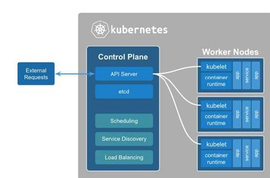
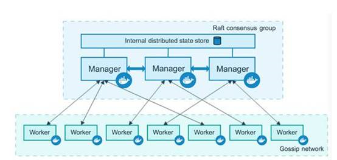

| 序号 | 修改时间 | 修改内容                     | 修改人 | 审稿人 |
| ---- | -------- | ---------------------------- | ------ | ------ |
| 1    | 2018-8-4 | 创建。从《微服务架构》拆分。 | 吴启福 |        |
|      |          |                              |        |        |
---

 

 

 

 

# 目录

[TOC]

 

 

 

 

# 1       云原生

定义：云原生技术用于开发一类特别的应用程序，这类应用程序通过容器中的服务构建，然后按照微服务的形式部署，并通过 DevOps 敏捷流程以及可持续交付工作流在弹性基础设施上进行管理。

云原生 = 容器 + 微服务 + 容器编排 + devops（CI/CD）

 

**云原生组织**

*  OCI：开放容器计划（Open Containers Initiative，OCI），这是一个轻量级、开放的治理结构（或项目），在 Linux 基金会的支持下产生，其明确的目的就是围绕容器格式和运行时创建开放的行业标准。

*  **CNCF**，云原生计算基金（Cloud Native Computing Foundation），一个致力于云计算普及化和可持续化的开源软件组织。

## 1.1     云原生CNCF简介

CNCF（Cloud Native Computing Foundation）于 2015 年 7 月成立，隶属于 Linux 基金会，初衷围绕“云原生”服务云计算，致力于维护和集成开源技术，支持编排容器化微服务架构应用。

CNCF 还帮助项目建立了治理结构。CNCF 提出了成熟度级别的概念：沙箱、孵化和毕业。这些级别分别对应下图中的创新者、早期采用者和早期大众。

图 1 CNCF 项目成熟等级

CNCF项目列表 详见 《CNCF云原生框架分析》

## 1.2     云服务成功案例

### 1.2.1  Amazon

电商。1995年创立；2006年推出AWS云服务；2007年推出kindle阅读器进军硬件市场。

 

### 1.2.2  Netflix

流媒体服务提供商。1997年创立；2009，开始使用AWS。

## 1.3     本章小结

[1].     值得考虑的9个开源云原生项目  http://3g.163.com/dy/article/EOSVH9QR0511D3QS.html 

 

# 2       云原生架构

云原生架相关
*  十二要素应用程序：应用程序开发模式的集合。
*  微服务：将单体业务系统分解为独立可部署服务。
*  自服务敏捷基础设施：自服务平台。
*  基于API的协作：通过API进行服务间的交互。
*  搞脆弱性：自我实现和加强的应用程序。

 

## 2.1     云原生特性

云原生架构的特性

*  以云为基础架构IAAS
*  云服务 PAAS+SAAS
*  无服务器架构
*  可扩展：扩展策略有根据资源、时间段、消息队列长度、业务参数和预测。
*  高可用
*  敏捷
*  云优先

### 2.1.1  12-Factor 十二要素

12-Factor 为构建如下的 SaaS（软件即服务） 应用提供了方法论（目标）：
*  使用标准化流程自动配置，从而使新的开发者花费最少的学习成本加入这个项目。
*  和操作系统之间尽可能的划清界限，在各个系统中提供最大的可移植性。
*  适合部署在现代的云计算平台，从而在服务器和系统管理方面节省资源。
*  将开发环境和生产环境的差异降至最低，并使用持续交付实施敏捷开发。
*  可以在工具、架构和开发流程不发生明显变化的前提下实现扩展。
*  这套理论适用于任意语言和后端服务（数据库、消息队列、缓存等）开发的应用程序。

**十二要素详解**

1)  基准代码：一份基准代码（Codebase），多份部署（deploy）。通常会使用版本控制系统加以管理，如Git, Mercurial, Subversion。

2)  依赖：显式声明依赖关系（ dependency ），如maven或setup.py

3) 配置：在环境中存储配置。判断一个应用是否正确地将配置排除在代码之外，一个简单的方法是看该应用的基准代码是否可以立刻开源，而不用担心会暴露任何敏感的信息。12-Factor推荐将应用的配置存储于 环境变量 中（ env vars, env ）。

4) 后端服务：把后端服务(backing services)当作附加资源。部署可以按需加载或卸载资源。

5) 构建，发布，运行：严格分离构建和运行。

6) 进程：以一个或多个无状态进程运行应用。任何需要持久化的数据都要存储在 后端服务 内，比如数据库。

7) 端口绑定：通过端口绑定(Port binding)来提供服务。12-Factor 应用完全自我加载 而不依赖于任何网络服务器就可以创建一个面向网络的服务。互联网应用 通过端口绑定来提供服务 ，并监听发送至该端口的请求。

8) 并发：通过进程模型进行扩展。

9) 易处理：快速启动和优雅终止可最大化健壮性。易处理（disposable）的，意思是说它们可以瞬间开启或停止。这有利于快速、弹性的伸缩应用，迅速部署变化的 代码 或 配置 ，稳健的部署应用。

10) 开发环境与线上环境等价：尽可能的保持开发，预发布，线上环境相同。缩小时间、人员和工具差异。

11) 日志：把日志当作事件流。

12) 管理进程：后台管理任务当作一次性进程运行。

 

 

## 2.2     云原生参考架构

表格 3 云原生参考架构

| 参考架构                      | 部署特点                       | 扩展性               | 可用性      | 安全性         |
| ----------------------------- | ------------------------------ | -------------------- | ----------- | -------------- |
| WEB应用的IAAS部署             | 基于VM                         | 向上（加资源）、横向 | 多节点、SLA | 防火墙、HTTPS  |
| WEB应用的PAAS部署             | 基于DOCKER、K8S管理            | 横向、POD            | 多POD       | 防火墙、HTTPS  |
| WEB应用的云原生架构           | SpringCloud、K8S               | 横向                 | 多实例      | 防火墙、HTTPS  |
| WEB应用的多站点部署（云原生） | SpringCloud、K8S、多数据中心DC | 横向、DC扩容         | 多实例      | 防火墙、HTTPS  |
| SAAS应用的混合云集成          | LDAP                           | 用户定义SLA          |             | 防火墙、HTTPS  |
| IOT应用的云原生架构           | 消息驱动、大数据               | 横向                 |             | IOT网关、HTTPS |

 

 

## 2.3     本章小结

[2].     容器编排巅峰对决-Mesos/Swarm/Kubernetes比较 https://www.sohu.com/a/157185937_287582

[3].     拿下中石油千万级大单，灵雀云如何在容器行业脱颖而出 | 爱分析调研  [www.sohu.com/a/240907122_545428](http://www.sohu.com/a/240907122_545428)

[4].     云原生应用的12要素  http://blog.didispace.com/12factor-zh-cn/ 

# 3       云原生设计模式

## 3.1     云原生设计模式

表格  云原生设计模式列表

| DFX      | 模式名   | 模式简介                           |
| -------- | -------- | ---------------------------------- |
| 可用性   | 限流     |                                    |
|          | 熔断器   |                                    |
|          | 断路器   |                                    |
|          | RETRY    | 超时重试。                         |
|          | 服务降级 | 按降级粒度可分为接口、功能和服务。 |
|          |          |                                    |
|          |          |                                    |
| 安全性   |          |                                    |
|          |          |                                    |
| 可扩展性 | ROUTE    |                                    |
|          |          |                                    |
|          |          |                                    |

 

## 3.2     容器设计模式

区别于之前的面向对象的设计模式。

 

表格 5 容器设计模式列表

## 3.3     本章小结

[1].     容器设计模式 https://www.jianshu.com/p/020f699c41e6 

[2].     [《Kubernetes与云原生应用》之容器设计模式](http://www.dockerinfo.net/2067.html) 

[3].     基于容器的分布式系统的设计模式  [www.dockone.io/article/1547](http://www.dockone.io/article/1547) 

 

# 4       容器编排

## 4.1     容器编排技术选型

表格 1容器编排的技术选型

编排Orchestration这一术语来源于音乐领域，根据作曲家的作品，编曲决定音乐作品的某一部分由某种乐器以某种方式在某个时机来演奏，这一过程称为编排。

编排这一术语被借用到了IT领域，

*  Service Orchestration： 在SOA和微服务体系中，针对Service。

*  Cloud Orchestration：在Cloud 体系中，针对云资源描述。

*  容器编排：负责容器的启停调度，并且通过管理容器集群来提升容器使用率。

 

表格 2 容器编排K8s/Mesos/Swarm比较

备注：2016年容器三家平分秋色；到2017年，k8s成为主流。

### 4.1.1  K8s

详见 3 见下方Kubernetes

 

Kubernetes的实现参考了Google内部的资源调度框架，但并不是Borg的内部容器编排系统的开源，而是借鉴Google从运行Borg获得的经验教训，形成了Kubernetes项目。它使用Label和Pod的概念来将容器划分为逻辑单元。Pods是同地协作（co-located）容器的集合，这些容器被共同部署和调度，形成了一个服务，这是Kubernetes和其他两个框架的主要区别。相比于基于相似度的容器调度方式（就像Swarm和Mesos），这个方法简化了对集群的管理。

图 2 K8s结构

ubernetes****基本概念：
*  ControlPlane：暴露应用程序接口（API），调度部署和管理整个集群。
*  WorkerNodes：物理或者虚拟的服务器，负责运行工作负载。
*  APIServer：外部与Kubernetes的互动点。
*  Etcd：默认采用CoreOS 的产品etcd ，提供键值存储、服务发现、服务注册功能。
*  Kubelet：节点上的代理，负责执行Kubernetes Master分配的任务。
*  Pods:由同一主机上部署的一个或几个容器组成的计算能力单位，执行相同的任务。
*  Services：Pods的前端和Load Balancer ,为Pods提供Floating IP。
*  Replicationcontrollers：负责维护指定数目的 Pods。
*  Labels：key-value标签以一种非层次化、松散的方式标记、查找Kubernetes中的Pods/Replication Controllers/Services等资源。

### 4.1.2  Mesos

Mesos是一个分布式调度系统内核，早于Docker产生，Mesos 作为资源管理器，从DC/OS(数据中心操作系统)的角度提供资源视图。主/从结构工作模式，主节点分配任务，并用从节点上的Executor负责执行，通过Zookeeper给主节点提供服务注册、服务发现功能。通过Framework Marathon 提供容器调度的能力。

图 3 Mesos主从结构

Mesos主要基本概念：
*  Mesos Master：将作业分配给Slave节点，并将资源提供给Framework.
*  Mesos Slave：运行Mesos Agent ,并执行执行分配的任务。
*  Zookeeper：服务注册、服务发现，同时可以在高可用的环境中选取Master节点。
*  Framework：资源的二度调度框架，通过在Agent上部署Executor来执行计划的任务。Mesos支持的Framework 有Hadoop/Spark/MPI/Marathon，通过Marathon Framework完成容器编排的功能。

 

### 4.1.3  Docker Swarm

Docker Swarm是一个由Docker开发的调度框架。由Docker自身开发的好处之一就是标准Docker API的使用，Swarm由多个代理（Agent）组成，把这些代理称之为节点（Node）。这些节点就是主机，这些主机在启动Docker Daemon的时候就会打开相应的端口，以此支持Docker远程API。这些机器会根据Swarm调度器分配给它们的任务，拉取和运行不同的镜像。

图 4 Docker Swarm结构

Swarm基本概念：
*  Manager：在整个集群中分配任务，集群中控制Worker的节点。
*  Worker：运行由Manager节点分配的任务.
*  Services：跨节点的执行特定接口的一组容器。.
*  Key-valuestore：内建的Key-Value存储解决方案，做服务发现、服务注册以及主节点选举工作。

# 5       Service Mesh

Service Mesh是专用的基础设施层，用于使服务之间通信安全，快速和可靠。

service mesh是用于处理服务与服务之间通信的专用基础设施层。 它负责在包含现代化、云原生应用且拓扑复杂的服务之间可靠地传递请求。 实际上，service mesh通过一系列轻量网络代理来实现，这些代理与应用程序代码一起部署，而且对应用程序不感知。

表格 6服务发现模式列表

# 参考资料

[1].     基于 Docker 的微服务架构实践 https://www.jianshu.com/p/f78864310827 