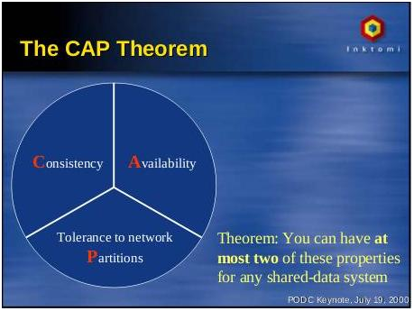
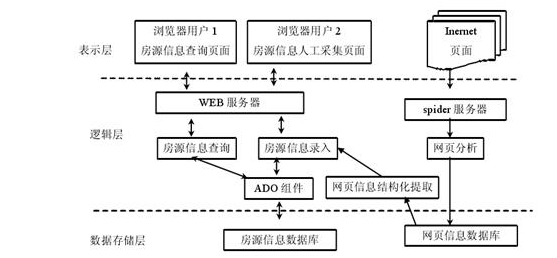
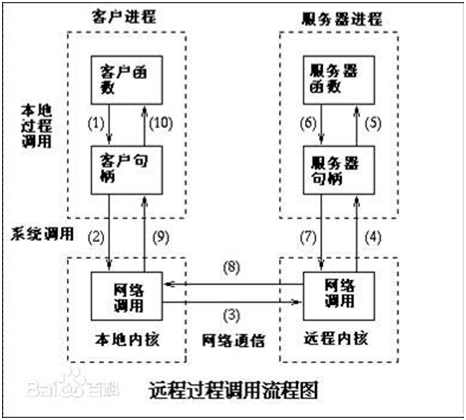
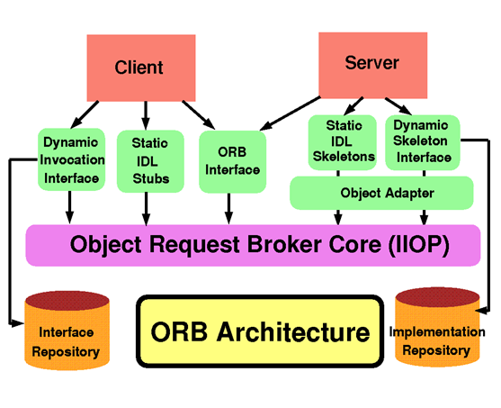
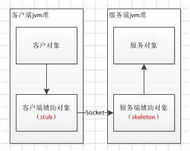
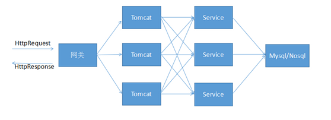
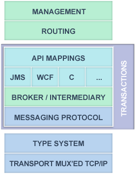
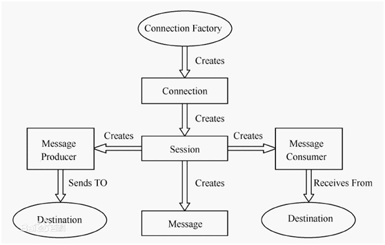
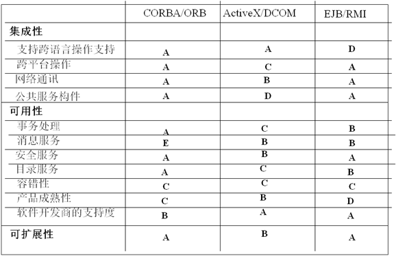

| 序号 | 修改时间   | 修改内容 | 修改人 | 审稿人 |
| ---- | ---------- | -------- | ------ | ------ |
| 1    | 2018-07-31 | 创建     | 吴启福 | 吴启福 |
---

 

 

 

# 目录

[目录... 1](#_Toc23768096)

[1       分布式架构概述... 4](#_Toc23768097)

[1.1          分布式架构理论... 5](#_Toc23768098)

[1.1.1         CAP理论（分布式）... 5](#_Toc23768099)

[1.1.2         BASE模型... 6](#_Toc23768100)

[1.1.3         一致性模型Consistence. 6](#_Toc23768101)

[1.1.4         区块链... 6](#_Toc23768102)

[1.1.5         本节参考... 6](#_Toc23768103)

[1.2          分布式系统常见设计... 7](#_Toc23768104)

[1.2.1         限流... 7](#_Toc23768105)

[1.2.2         通信设计... 7](#_Toc23768106)

[1.2.3         容灾恢复... 8](#_Toc23768107)

[1.2.4         数据容错... 8](#_Toc23768108)

[1.2.5         配置管理... 8](#_Toc23768109)

[1.2.6         缓存Cache. 8](#_Toc23768110)

[1.2.7         分布式session问题... 9](#_Toc23768111)

[1.2.8         分布式锁... 9](#_Toc23768112)

[1.2.9         负载均衡... 9](#_Toc23768113)

[1.2.10       全链接跟踪... 9](#_Toc23768114)

[1.2.11       分布式存储... 10](#_Toc23768115)

[1.2.12       其它理论... 10](#_Toc23768116)

[1.3          分布式模型... 10](#_Toc23768117)

[1.3.1         CS. 10](#_Toc23768118)

[1.3.2         WEB三层架构... 11](#_Toc23768119)

[1.3.3         XML-RPC（SOAP）... 11](#_Toc23768120)

[1.3.4         REST. 11](#_Toc23768121)

[1.3.5         RPC. 13](#_Toc23768122)

[1.4          构件模型 Conponent 14](#_Toc23768123)

[1.4.1         CORBA/ORB (OMG, 1991) 14](#_Toc23768124)

[1.4.2         EJB/RMI (SUN) 18](#_Toc23768125)

[1.4.3         COM/DCOM (Microsoft) 20](#_Toc23768126)

[1.4.4         Web Services 20](#_Toc23768127)

[1.5          中间件... 23](#_Toc23768128)

[1.6          分布式应用示例：分布式网站... 24](#_Toc23768129)

[1.6.1         分布式文件系统... 24](#_Toc23768130)

[1.6.2         分布式数据库... 25](#_Toc23768131)

[1.7          本章参考... 25](#_Toc23768132)

[2       消息队列MQ.. 25](#_Toc23768133)

[2.1          MQ概述... 25](#_Toc23768134)

[2.2          Apache Kafka. 30](#_Toc23768135)

[2.3          Apache ActiveMQ.. 31](#_Toc23768136)

[2.4          本章参考... 31](#_Toc23768137)

[3       微服务概论... 32](#_Toc23768138)

[3.1          微服务简介... 32](#_Toc23768139)

[3.2          微服务架构... 33](#_Toc23768140)

[3.3          本章参考... 35](#_Toc23768141)

[4       SOA--面向服务的架构... 35](#_Toc23768142)

[4.1          简介... 35](#_Toc23768143)

[4.2          SOA设计模式... 36](#_Toc23768144)

[4.3          版本控制和兼容性... 36](#_Toc23768145)

[4.4          本章参考... 36](#_Toc23768146)

[5       分布式技术选型... 37](#_Toc23768147)

[5.1          RPC VS REST. 37](#_Toc23768148)

[5.2          SOAP VS REST. 37](#_Toc23768149)

[5.3          SOA和微服务比较... 37](#_Toc23768150)

[5.4          构件模型比较... 38](#_Toc23768151)

[6       参考资料... 39](#_Toc23768152)

[7       附录... 40](#_Toc23768153)

[7.1          官网... 40](#_Toc23768154)

[7.2          数据交互格式（通讯协议）... 41](#_Toc23768155)

[7.2.1         概述... 41](#_Toc23768156)

[7.2.2         serialize. 42](#_Toc23768157)

[7.2.3         XML. 42](#_Toc23768158)

[7.2.4         SOAP. 42](#_Toc23768159)

[7.2.5         JSON.. 43](#_Toc23768160)

[7.2.6         Protobuf 44](#_Toc23768161)

[7.2.7         YAML. 46](#_Toc23768162)

[7.2.8         其它... 47](#_Toc23768163)

[7.2.9         数据格式比较... 49](#_Toc23768164)

[7.2.10       本节参考... 50](#_Toc23768165)


**表目录**

[表格 1 硬件和软件相互影响的架构变化... 4](#_Toc23768166)

[表格 2 单体式应用和分布式架构的比较... 4](#_Toc23768167)

[表格 3 常用的分布式缓存的对比... 8](#_Toc23768168)

[表格 4 分布式存储分类... 10](#_Toc23768169)

[表格 5 MQ简易比较... 27](#_Toc23768170)

[表格 6 MQ简易比较表格 7. 28](#_Toc23768171)

[表格 8. 28](#_Toc23768172)

[表格 9 Kafka和RabbitMQ比较... 29](#_Toc23768173)

[表格 10 多种消息队列方式比较... 30](#_Toc23768174)

[表格 11 三种版本控制策略比较... 36](#_Toc23768175)

[表格 12 RPC和REST比较... 37](#_Toc23768176)

[表格 13 REST与SOAP比较列表... 37](#_Toc23768177)

[表格 14 SOA和微服务对比... 37](#_Toc23768178)

[表格 15 SOA和微服务架构比较... 38](#_Toc23768179)

[表格 16 构件技术列表... 38](#_Toc23768180)

[表格 17 ATOM与RSS2.0比较表... 48](#_Toc23768181)

[表格 18 常见数据格式列表... 49](#_Toc23768182)

[表格 19 数据格式的时间和空间开销比较... 50](#_Toc23768183)

[表格 20 PHP数据存储格式比较... 50](#_Toc23768184)

 

 

**图目录**

[图 1 CAP. 5](#_Toc23768185)

[图 2一个房源信息网站的三层架构实例... 11](#_Toc23768186)

[图 3 RPC流程示意图... 13](#_Toc23768187)

[图 4 COBRA的体系架构... 15](#_Toc23768188)

[图 5 Java RMI 远程方法调用... 19](#_Toc23768189)

[图 6 一个中大型网站/App的基本架构... 24](#_Toc23768190)

[图 7 AMQP architecture. 26](#_Toc23768191)

[图 8 微服务基础架构 脑图... 33](#_Toc23768192)

[图 9 微服务架构技术体系... 34](#_Toc23768193)


 

# 1  分布式架构概述

表格 1 硬件和软件相互影响的架构变化

| 硬件变化 | 软件架构变化                        | 备注                                              |
| -------- | ----------------------------------- | ------------------------------------------------- |
| CP*      | 单核--多核--并行计算MPI--分布式计算 | 分布式计算相比MPI，就近计算，节省了网络传输时间。 |
| 内存     | 单进程缓存--IPC--分布式缓存         |                                                   |
| 存储     | NFS--块存储--对象存储。             |                                                   |

备注：硬件和软件的相继变化，使得服务器架构也随之而变如下：

*  SMP：同步并行处理。共享所有。

*  NAMA：Share Store。

*  MPP：Share Nothing。

 

表格 2 单体式应用和分布式架构的比较

|      | 单体式应用                                                   | 分布式                                                       |
| ---- | ------------------------------------------------------------ | ------------------------------------------------------------ |
| 简介 | 系统只有一个应用、打包成一个应用；部署在一台机器；在一个DB里存储数据.   采用分层架构，一般为表示层、业务层、数据访问层、DB层，表示层负责用户体验，业务层负责业务逻辑，数据访问层负责DB层的数据存取。 | 相互独立，代码独立开发，独立部署，通过API接口互相通信。通讯协议一般使用HTTP，数据格式是JSON，应用集成方式比较简化。 |
| 优点 | 开发、编译、调试一站式、一个应用程序包含所有功能点，容易测试和部署。 | 应用内部高内聚，独立开发、测试和部署，应用之间松耦合，业务边界清晰，业务依赖明确，支持大项目并行开发。 |
| 缺点 | 系统逐渐庞大时，代码复杂度高，难以维护，应用扩展水平低，业务和模块职责区分不清晰。 | API接口需求变化，应用就需要重新部署，通信可靠性和数据的封装性相对于进程内调用比较差。 |

备注：

1. 单机架构的开发需要考虑：并发、故障、同步和通讯。

2. 分布式架构：可扩展性（资源无限自动可扩展、按需弹性增减）、可用性（容错、灾难恢复）。

​	当前的分布式架构常用于WEB服务实现。从抽象角度来讲，从代码 -> 对象 -> 架构，系统不断提升，从而软件能够像硬件一样进行装配定制。

​    构件技术就是在这种背景下产生的，分布式构件技术主要有三个流派：CORBA规范，SUN的Java平台，MS的.NET平台。

 

分布式的基本思想包括：
*    分拆：系统分拆、子系统分拆、存储、计算
*   存储分拆：分布式的数据分片、RDMB的分库分表
*   计算分拆：数据分割并行计算、任务分割
*    并发：多线程、多进程
*    缓存：分布式缓存、多级缓存
*    在线计算/离线计算，同步/异步，全量 VS 增量 
*    消息队列：PUSH（一对多） VS POLL（一对一）
*    存储：重写轻读 VS 重读轻写 VS 读写平衡
*    读写分离、动静分离、冷热分离
*    限流
*    服务器熔断和升级
*    CAP理论：一致性、可用性和分区性


## 1.1  分布式架构理论

### 1.1.1   CAP理论（分布式）

​                                                  

图 1 CAP

在分布式系统中，一致性（Consistency）、可用性（Availability）和分区容忍性（Partition Tolerance）3 个要素最多只能同时满足两个，不可兼得。其中，分区容忍性又是不可或缺的。

*  Consistency（一致性）：即数据一致性，简单的说，就是数据复制到了N台机器，如果有更新，要N机器的数据是一起更新的。

*  Availability（可用性）：好的响应性能，此项意思主要就是速度。

*  Partition tolerance（分区容错性）：这里是说好的分区方法，体现具体一点，简单地可理解为是节点的可扩展性。

 

CAP理论提出者： Eric A. Brewer  Inktomi公司创始人, berkeley大学教授。

CAP理论的证明：[Brewer's CAP Theorem](http://www.julianbrowne.com/article/viewer/brewers-cap-theorem)

**定理**: 任何分布式系统只可同时满足二点，没法三者兼顾。

**忠告**: 架构师不要将精力浪费在如何设计能满足三者的完美分布式系统，而是应该进行取舍。

**示例**：Cassandra、Dynamo 等，默认优先选择AP，弱化C；HBase、MongoDB 等，默认优先选择CP，弱化A。

### 1.1.2   BASE模型

BASE模型，完全不同ACID模型，牺牲高一致性，获得可用性或可靠性.

*  Basically Available基本可用。支持分区失败(e.g. sharding碎片划分数据库)

*  Soft state软状态  状态可以有一段时间不同步，异步。

*  Eventually consistent最终一致，最终数据是一致的就可以了，而不是时时高一致。

 

BASE思想的主要实现有

1. 按功能划分数据库（分库）

2. sharding 碎片（分表）。

 

基本可用 Basically Available有：主备、

 

### 1.1.3   一致性模型Consistence

数据的一致性模型可以分成以下3类：

*  强一致性：数据更新成功后，任意时刻所有副本中的数据都是一致的，一般采用同步的方式实现。

*  弱一致性：数据更新成功后，系统不承诺立即可以读到最新写入的值，也不承诺具体多久之后可以读到。

*  最终一致性：弱一致性的一种形式，数据更新成功后，系统不承诺立即可以返回最新写入的值，但是保证最终会返回上一次更新操作的值。

 

一致性常用算法 ：Paxos/2PC(1990)、DHT（1997）、Quorum拜占庭协议、Raft（2014）、Zab

详见 《[非数值和工业领域算法](../algo/非数值和工业领域算法.md)》分布式系统章节

 

### 1.1.4   区块链

详见 《[区域链技术](../../领域开发/区域链技术.md)》


 

### 1.1.5   本节参考

[1].    [Dapper, a Large-Scale Distributed Systems Tracing Infrastructure](http://research.google.com/pubs/pub36356.html) http://research.google.com/pubs/pub36356.html 

[2].    Google Dapper-大规模分布式系统的基础跟踪设施 (中译文）http://bigbully.github.io/Dapper-translation/ 


## 1.2   分布式系统常见设计

高并发、大流量时的常见处理手段

*  扩容：水平/垂直扩容
*  动静分离：
*  缓存
*  服务降级
*  限流


### 1.2.1   限流

限流的目的是

*  基于计数器：如池化资源技术（连接池、线程池、内存池、对象池等）

*  令牌桶（Token Bucket）: 主要限制流量的平均流入速度，允许一定程度上的突发流量。实现如google Guava

*  漏桶（Leaky Bucket）：限制流量的固定流出速率，多出流量会被抛弃。实现如nginx限流。

 

**nginx**可实现接入层(四层)限制，限制每个IP每秒发的请求数、并发连接数，并缓存请求数。

 业务层面也可实现限流消峰，如

*  分时段抢购

*  答题验证，如12306的验证码登陆


### 1.2.2   通信设计 

分布式系统的一个基本问题就是：机器与机器之间如何通信？ 我们都知道底层原理是TCP/IP，Socket。但一般很少有人会去裸写Socket，实现机器之间的通信。这里，最常用的组件就是RPC。


最简单的实现RPC的方式就是使用http。当然，业界有很多成熟的开源RPC框架，如Facebook的Thrift, 阿里的Dubbo，点评的Pigeon。。

在RPC内部，一般都自己实现了负载均衡。还有更复杂的，如多版本，服务降级等。

补充一句：虽然底层原理都是Socket，但使用不同框架/组件时，通常都有其自己的跨机器通信方式，比如Mysql JDBC，RPC，消息中间件等。

 

通信分进程内部和进程外部两方面通信。
*  进程内通信：消息组件用以线程间同步。主要方法有一是乐观锁（如CAS，采用CPU级别指令）；二是位缓存。
*  进程间通信：异步IO中间件，如Netty、gevent。
*  分布式远程服务调用：参见 RPC
*  分布式调用跟踪系统：如Dubbo

 

### 1.2.3   容灾恢复(高可用)

在节点崩溃或运行单元异常退出时要有容灾恢复策略。

1）执行任务的具体进程崩溃：ZK监听节点间信息（心跳包），如节点崩溃，通知（短信或邮件）给责任人，由其手工重启或安排其它进程来尝试重启进程。

2）执行任务的集群节点崩溃： 主备集群切换

3）主节点故障：多主设计。

 

### 1.2.4   数据容错

原理：消息验证保证机制。

 

### 1.2.5   配置管理

配置管理常用方案：

*  本地配置：配置文件。可用环境变量来加载不同的配置文件，java -Dconfig ''，可在命令行加载不同配置。

*  集中式资源配置（分布式）：如Zookeeper、淘宝Diamond、百度Disconf、奇虎360的QConf、Spring-Cloud

分布式配置管理的实质是发布/订阅模式。

 

### 1.2.6   缓存Cache

参见  《网站架构设计与开发》网站缓存章节


缓存处理流程：前台请求，后台先从缓存中取数据，取到直接返回结果，取不到时从数据库中取，数据库取到更新缓存，并返回结果，数据库也没取到，那直接返回空结果。

程序缓存技术可分为

*  本地缓存：如Ehcache
*  分布式缓存：Redis、Memcache

 

#### 分布式缓存

当DB负载过高，需要为Service机器加缓存时，就遇到一个基本问题：

如果使用local的内存做缓存，则其他Service机器就没办法共用此缓存。因次，需要一个可以让所有Service机器共享的缓存，这就是分布式缓存。

常用的分布式缓存组件：Memcached/Redis/Tair等。

表格 3 常用的分布式缓存的对比

| 分布式缓存 | 数据结构 | 持久           | 复制模型   | 线程模型 | 存储结构                                                  | 高可用     |
| ---------- | -------- | -------------- | ---------- | -------- | --------------------------------------------------------- | ---------- |
| Redis      | string   |                |            |          |                                                           |            |
|            | list     |                |            |          |                                                           |            |
|            | hash     |                |            |          | 压缩串                                                    | 主从       |
|            | set      | RDB            | 主从复制   |          | 字典                                                      | Sential    |
|            | zset     | AOF            | 主从链     | 单线程   | 跳跃表                                                    | Cluster    |
| Memcache   | K/V      | 第三方组件     | 第三方组件 | 多线程   | Slab                                                      | 第三方组件 |
| Tari       | 同Redis  | 由存储结构决定 | Cluster    | 多线程   | MDB（内存）、RDB（Redis）、FDB（持久化）、LDB（Level DB） | Cluster    |

备注：Tair是阿里巴巴的开源分布式缓存。

1. 应用场景：Redis的数据结构较多并且可持久化，Memcache只支持键值多。因此Redis的应用场景会更广泛些，如消息队列。
2. 性能：Memcache用多线程实现；Redis是单线程，大数据情况下容易阻塞。因此，Redis适合快速操作的简单逻辑小数据量的场景。
3. Redis代码结构较简单。Memcache扩展性考虑较多，代码更复杂些。

 

#### 缓存穿透

   描述：缓存穿透是指缓存和数据库中都没有的数据，而用户不断发起请求，如发起为id为“-1”的数据或id为特别大不存在的数据。这时的用户很可能是攻击者，攻击会导致数据库压力过大。

   解决方案：

* 接口层增加校验，如用户鉴权校验，id做基础校验，id<=0的直接拦截；

* 从缓存取不到的数据，在数据库中也没有取到，这时也可以将key-value对写为key-null，缓存有效时间可以设置短点，如30秒（设置太长会导致正常情况也没法使用）。这样可以防止攻击用户反复用同一个id暴力攻击。


#### 缓存击穿

  描述：缓存击穿是指缓存中没有但数据库中有的数据（一般是缓存时间到期），这时由于并发用户特别多，同时读缓存没读到数据，又同时去数据库去取数据，引起数据库压力瞬间增大，造成过大压力

  解决方案：

* 设置热点数据永远不过期。
* 应用层 加互斥锁


#### 缓存雪崩

  描述：缓存雪崩是指缓存中数据大批量到过期时间，而查询数据量巨大，引起数据库压力过大甚至down机。和缓存击穿不同的是，缓存击穿指并发查同一条数据，缓存雪崩是不同数据都过期了，很多数据都查不到从而查数据库。

 解决方案：

* 缓存数据的过期时间设置随机，防止同一时间大量数据过期现象发生。
* 如果缓存数据库是分布式部署，将热点数据均匀分布在不同搞得缓存数据库中。
* 设置热点数据永远不过期。


### 1.2.7   分布式session问题

在传统的单机版应用中，我们经常使用session。而当单机扩展到多机，单机的session就没办法被其他机器所访问。

此时就需要使用分布式session，把session存放在一个所有Tomcat都可以访问的地方。

 

### 1.2.8   分布式锁

分布式锁特性：互斥、避免死锁、高性能、可重入性

 

分布式锁实现
*  Redis实现：SET NX EX原子操作，当KEY不存在时，SET NX返回成功，并且设置这个KEY的过期时间；当KEY已存在，SET NX返回失败。
*  ZK实现：zookeeper实现了paxos一致性协议；ZK临时节点支持客户端断连后自动删除；ZK支持WATCHER机制。


示例：宠物购买
*  REDIS: set {pet_id} {value} NX EX {EXPIRE_TIME}
*  ZK: znode/path-to-lock/{pet_id}


### 1.2.9   负载均衡

详见 《网站架构设计与开发》负载均衡章节

 

### 1.2.10 全链接跟踪

基本思想：Google Dapper论文，实现案例如Twitter Zipkin，阿里的鹰眼。

简易法：利用Nginx的$request_id变量来唯一标识一次请求。

proxy_set_header HTTP_REQUEST_ID $request_id


### 1.2.11 分布式存储

数据需求：结构化数据（一般是RDBS）、非结构化数据、半结构化数据（如HTML）

表格 4 分布式存储分类

| 存储分类                        | 简介                                           | 案例                                                |
| ------------------------------- | ---------------------------------------------- | --------------------------------------------------- |
| 分布式文件系统                  | 一般存储数据类型有：BLOG对象、定长块和大文件。 | Google GFS、Taobao File System、Facebook Haystack、 |
| 分布式键值系统（K-V，NoSQL）    |                                                | memcache redis、Amazon Dynamo                       |
| 分布式表格系统   (列式，NoSQL） | 列式存储。                                     | Google Bigtable, hbase                              |
| 分布式数据库(NewSQL)            | MySQL Sharding、                               | Google Spanner、OceanBase                           |

 

### 其它理论

*  I/O的五分钟法则。1997年测试数据表明，在内存中保持1k数据成本相当于磁盘中存储400秒(约等于5分钟)。
*  不要删除数据。删除仅是个标记，记录历史数据。

 

### 本节参考

[1]. 缓存穿透、缓存击穿、缓存雪崩区别和解决方案 https://blog.csdn.net/kongtiao5/article/details/82771694 


## 1.3   分布式模型 

### 1.3.1   CS

**C/S**：客户机/服务器模型。

### 1.3.2   WEB三层架构

   

图 2一个房源信息网站的三层架构实例

说明：分层风格, 共三层, 分别是表示层UI, 业务逻辑层BLL, 数据访问层DAL。常用于WEB开发。


### 1.3.3   XML-RPC（SOAP）

**XML-RPC**是一个[远程过程调用](http://zh.wikipedia.org/wiki/远程过程调用)（remote procedure call，RPC)的[分布式计算](http://zh.wikipedia.org/wiki/分布式计算)[协议](http://zh.wikipedia.org/wiki/互聯網協議)，通过[XML](http://zh.wikipedia.org/wiki/XML)将调用函数封装，并使用HTTP协议作为传送机制。

XML-RPC发表于1998年，由[UserLand Software](http://zh.wikipedia.org/w/index.php?title=UserLand_Software&action=edit&redlink=1)（[UserLand Software](http://en.wikipedia.org/wiki/UserLand_Software)）的[Dave Winer](http://zh.wikipedia.org/w/index.php?title=Dave_Winer&action=edit&redlink=1)及[Microsoft](http://zh.wikipedia.org/wiki/Microsoft)共同发表。后来在新的功能不断被引入下，这个标准慢慢演变成为今日的[SOAP](http://zh.wikipedia.org/wiki/SOAP)协定。


### 1.3.4   REST

**表征状态转移**（英文：Representational State Transfer**，简称**REST）是[Roy Fielding](http://zh.wikipedia.org/w/index.php?title=Roy_Fielding&action=edit&redlink=1)博士在2000年他的博士论文中提出来的一种[软件架构](http://zh.wikipedia.org/wiki/软件架构)风格。

**宗旨：**

REST 从**资源**的角度来观察整个网络，分布在各处的资源由[URI](http://zh.wikipedia.org/wiki/URI)确定，而客户端的应用通过URI来获取资源的表征。获得这些表征致使这些应用程序转变了其状态。随着不断获取资源的表征，客户端应用不断地在转变着其状态，所谓表征状态转移（Representational State Transfer）。

 

**要点：**

需要注意的是，REST是设计风格而不是标准。REST通常基于使用[HTTP](http://zh.wikipedia.org/wiki/HTTP)，[URI](http://zh.wikipedia.org/wiki/URI)，和[XML](http://zh.wikipedia.org/wiki/XML)以及[HTML](http://zh.wikipedia.org/wiki/HTML)这些现有的广泛流行的协议和标准。

*  资源是由URI来指定。
*  对资源的操作包括获取、创建、修改和删除资源，这些操作正好对应HTTP协议提供的GET、POST、PUT和DELETE方法。
*  通过操作资源的表形来操作资源。
*  资源的表现形式则是XML或者HTML，取决于读者是机器还是人，是消费web服务的客户软件还是web浏览器。当然也可以是任何其他的格式。

 

**REST的要求**

* 客户端和服务器结构

* 连接协议具有无状态性

* 能够利用Cache机制增进性能

* 层次化的系统

* 随需代码 - Javascript （可选）


**优点：**

* 可以利用缓存Cache来提高响应速度

* 通讯本身的无状态性可以让不同的服务器的处理一系列请求中的不同请求，提高服务器的扩展性

* 浏览器即可作为客户端，简化软件需求

* 相对于其他叠加在[HTTP协议](http://zh.wikipedia.org/wiki/超文本传输协议)之上的机制，REST的软件依赖性更小

* 不需要额外的资源发现机制

*  在软件技术演进中的长期的兼容性更好

 

**RESTful API良好设计的原则：**

* 协议安全：API与用户的通信协议总是使用HTTPs协议。
* 域名：尽量将API部署在专用域名，例如：https://apis.gusibi.com
* API地址和版本：在url中指定API版本。比如：https://apis.gusibi.com/v1
* 以资源为中心设计URL：
* 正确的请求方法：GET, PUT, POST, DELETE, PATCH
* 正确的过滤信息：如limit, offset, page, per_page, sortby...
* 选择合适的状态码：2xx(ok), 3xx(重定向), 4xx(客户端发送错误), 5xx(服务端错误)
* 返回结果：针对不同操作，服务器向用户返回结果符合下面规范
  ```M
  GET /collection/resource：返回单个资源对象
  POST /collection：返回新生成的资源对象
  PUT /collection/resource：返回完整的资源对象
  PATCH /collection/resource：返回完整的资源对象
  DELETE /collection/resource：返回一个空文档
  ```

* 错误处理：如果出错的话，在response body 中通过 message 给出明确的信息。
* 良好文档，最好能自动生成API文档和在线仿真测试。
* 其它：OAuth2鉴权，JSON作为返回的数据格式，限流


表格 5 HTTP 请求方法在RESTful Web 服务中的典型应用

| 资源                                                       | GET                                                          | PUT                                                        | POST                                                         | DELETE                |
| ---------------------------------------------------------- | ------------------------------------------------------------ | ---------------------------------------------------------- | ------------------------------------------------------------ | --------------------- |
| 一组资源的URI，比如`http://example.com/resources/`    | 列出 URI，以及该资源组中每个资源的详细信息（后者可选）。 | 使用给定的一组资源 替换 当前整组资源。                 | 在本组资源中创建/追加一个新的资源。 该操作往往返回新资源的URL。 | 删除 整组资源。   |
| 单个资源的URI，比如`http//example.com/resources/142` | 获取 指定的资源的详细信息，格式可以自选一个合适的网络媒体类型（比如：XML、JSON等） | 替换/创建 指定的资源。并将其**追加**到相应的资源组中。 | 把指定的资源当做一个资源组，并在其下创建/追加一个新的元素，使其隶属于当前资源。 | 删除 指定的元素。 |

 

**REST成熟度模型**

   

说明：
*  0级：使用HTTP作为传输
*  1级：引入资源概念
*  2级：根据语义使用HTTP动词
*  3级：使用HATEOAS。在资源的表达中包含了链接信息。

 

REST实现
*  JAX-RS（Java API for RESTful Web Service），此规范参考实现有Jersey。
*  [Ruby on Rails](http://zh.wikipedia.org/wiki/Ruby_on_Rails)1.2以后的版本支持[REST model](http://weblog.rubyonrails.org/2007/1/19/rails-1-2-rest-admiration-http-lovefest-and-utf-8-celebrations)。
*  [JBoss RESTEasy](http://www.jboss.org/resteasy)JBoss的REST实现


### 1.3.5   RPC

**RPC**（Remote Procedure Call Protocol）——[远程过程调用](https://baike.baidu.com/item/远程过程调用)协议。

 

RPC是一种通过网络从远程计算机程序上请求服务，而不需要了解底层网络技术的协议。[RPC协议](https://baike.baidu.com/item/RPC协议)假定某些传输协议的存在，如TCP或UDP，为通信程序之间携带信息数据。在OSI[网络通信](https://baike.baidu.com/item/网络通信)模型中，RPC跨越了[传输层](https://baike.baidu.com/item/传输层)和[应用层](https://baike.baidu.com/item/应用层)。RPC使得开发包括网络[分布式](https://baike.baidu.com/item/分布式)多程序在内的应用程序更加容易。

RPC采用客户机/服务器模式。请求程序就是一个客户机，而服务提供程序就是一个服务器。

有多种 RPC模式和执行。最初由 Sun 公司提出。IETF ONC 宪章重新修订了 Sun 版本，使得 ONC RPC 协议成为 IETF 标准协议。现在使用最普遍的模式和执行是开放式软件基础的分布式计算环境（DCE）。

   

图 3 RPC流程示意图

说明：一次客户机对服务器的RPC调用,其内部操作大致有如下十步：

1. 调用客户端句柄；执行传送参数

2. 调用本地系统内核发送网络消息

3. 消息传送到远程主机

4. 服务器句柄得到消息并取得参数

5. 执行远程过程

6. 执行的过程将结果返回服务器句柄

7. 服务器句柄返回结果，调用远程系统内核

8. 消息传回本地主机

9. 客户句柄由内核接收消息

10. 客户接收句柄返回的数据。

 

## 1.4   构件模型 Conponent

**构件**：系统中实际存在的可更换部分，它实现特定的功能，符合一套接口标准并实现一组接口。软件工程中，构件是可复用的软件模块。1995年，lan.oraham给出的构件定义如下：一个对象（接口规范或二进制代码），它被用于复用，接口被明确定义。

**构件模型**：[基于构件的软件开发](https://baike.baidu.com/item/基于构件的软件开发)(CBSD)技术中的一个重要概念，构件模型通过描述构件的接口和实现以及构件之间的关联来描述软件体系结构。


软件构件的特点：
*  自描述。构件必须能够识别其属性、存取方法和事件，这些信息可以使开发环境将第三方软件构件无缝地结合起来；
*  可定制。提供一个典型的图形方式环境，软件构件的属性只能通过控制面板来设置；
*  可集成。构件必须可以被编程语言直接控制。构件也可以和脚本语言连接或者与从代码级访问构件的环境连接，这个特性使得软件构件可以在非可视化开发项目中使用；
*  连接机制。构件必须能产生事件或者具有让程序员从语义上实现相互连接的其他机制。这意味着程序员可以很容易地向按钮添加代码，使点中按钮就可以影响其他构件的动作。
软件构件具备的属性：有用性、可用性、质量、适应性、可移植性。

 

构件模型是对构件本质特征的抽象描述。已形成三个主要流派，分别是
*  OMG（Object Management Group，对象管理组织）的CORBA（Common Object Request Broker Architecture，公共对象请求代理体系结构）、
*  Sun的EJB（Enterprise JavaBean，企业级Java组件）
*  Microsoft的DCOM（Distribute Component Object Model，分布式构件对象模型）。

这些实现模型将构件的接口与实现进行了有效的分离，提供了构件交互的能力，从而增加了重用的机会，并适应了目前网络环境下大型软件系统的需要。

构件模型是为开发者定义软件构件而建立的体系结构和API集，使开发者可通过软件构件的动态组合来建立应用系统。构件模型由构件与容器两种主要成份构成。构件是具有可重用特性的基本软件部件。容器用于存放和安排构件，实现构件间的交互。容器也可以作为另一个容器的构件使用。

 

### 1.4.1   CORBA/ORB (OMG, 1991)

CORBA(Common Object Request Broker Architecture，公共对象请求代理体系结构)是OMG组织在众多开放系统平台厂商提交的分布对象互操作内容的基础上制定的*公共对象请求代理*体系规范。1991年OMG颁布了CORBAI.O标准。CORBA分布计算技术，是绝大多数分布计算平台厂商所支持和遵循的系统规范技术，具有模型完整、独立于系统平台和开发语言及被规范支持的特点，已成为分布计算技术的标准。CORBA的体系结构如下图所示。

   

图 4 COBRA的体系架构

说明：ORB框架结构包含两个主要组成部分：客户和服务器。客户端ORB使用如IIOP之类的协议和服务器ORB通信。通常，客户端ORB被称为**stub**(存根)，服务器ORB被称为**skeleton**(骨架)。ORB是中间件，客户向ORB请求，并从OBR得到响应。

 

互联网互操作协议(Internet Inter Operable Protocol，IIOP)

COBRA标准可分为三个层次,分别是：对象请求代理ORB, 公共对象服务和公共设施。 
*  **ORB**(Object Request Broker)：最低层，规定了分布对象的定义(接口)和语言映射, 实现了对象之间的通讯和互操作。 
*  **公共对象服务**：提供诸如并发, 事务等服务。
*  **公共设施**：定义了组件框架, 提供可直接为业务对象使用的服务,规定了业务对象进行协作所需协定的规则。


CORBA的分布式计算和跨平台的能力，主要依赖于两项技术：IDL和ORB。

 

#### 1.4.1.1  ORB

CORBA的核心是对象请求代理ORB（Object Request Broker），ORB提供了一种机制，对象可以透明的发出请求和接收响应, 客户端程序使用一个对象时，不需要知道对象的位置、编程语言，或者平台类型，因为ORB抽象了这些细节。

可以使用不同的编程语言创建客户和服务器上的对象，而且它们之间可以通信。

 

CORBA允许客户以两种不同的方式提出对象请求：

1） 静态调用：通过给定接口的存根Stubs，在编译了对象代码后，进入客户端的程序。因此，静态调用必须在编译时就知道对象及其类型。

2）动态调用：通过ORB的动态调用接口DII(Dynamic Invooation Interface)，在运行时生成访问对象的代码。

 

#### 1.4.1.2  IDL

为了简化通讯过程，CORBA使用IDL（Interface Description Language，接口定义语言）用于描述组件将呈现出来的接口。

一个CORBA构件采用IDL进行描述。CORBA提供了IDL到C、C＋＋、Java、COBOL等语言的映射机制--IDL编译器。IDL编译器可以生成Server方的Skelton和Client方的Stub代码，通过分别与客户端和服务端程序的联编，即可得到相应的Server和Client程序。

IDL在不同的语言下都有相应的实现，可以把IDL描述的接口编译为目标语言，包括客户端代理和服务器端框架，以及相应的帮助类等等。比如Java中提供过了idlj命令用来编译。

 

IDL（Interface Definition Language，接口定义语言），是用来描述软件组件接口的一种规范语言。它抽象了不同语言的差异，定义了自己的语法和数据类型，把服务以语言中立的方式描述并且暴露出来。
 下面是IDL一个具体的例子，可以看出，用户可以定义模块、接口、属性、方法、输入输出参数，甚至异常等等。
```c
module finance {
   interface account {
     readonly attribute string owner;
     readonly attribute float balance;
     void makeLodgement(in float amount, out float newBalance);
     void makeWithdrawal(in float amount, out float newBalance);
   };
 };
```


#### 1.4.1.3 CORBA示例

与RMI相比，CORBA更为强大，并定义了企业级应用通用的服务：名字服务；事务服务；对象生命周期服务；并发控制服务；时间服务等。

说明：CORBA目前在一些电信级项目中仍大量存在。
**一、定义IDL**

```xml-dtd
# hello.idl
module helloworld{
   interface HelloWorld{
      string sayHello();
   };
};
```

 

**二、根据IDL生成存根和代理等代码**

 idlj -fall Hello.idl

说明：运行后，hello.idl目录下自动生成helloworld文件夹，文件夹中会有6个文件，
*  客户端必需：_HelloWorldStub.java、HelloWorldHelper.java、HelloWorldHolder.java
*  服务端必需： HelloWorldPOA.java
*  C/S都需要：HelloWorldOperations.java、HelloWorld.java。

**三、开发CORBA服务: xxxServer**

**服务端实现服务**
```c++
class HelloWorldImpl extends HelloWorldPOA {  
    public String sayHello() {  
        return "Hello World!"; 
    }  
}  

public class HelloServer {  
    public static void main(String[] args){
        //创建一个ORB实例  
        ORB orb = ORB.init(args, null);  
           
        //拿到RootPOA的引用，并激活POAManager，相当于启动了server  
        org.omg.CORBA.Object obj=orb.resolve_initial_references("RootPOA");  
        POA rootpoa = POAHelper.narrow(obj);  
        rootpoa.the_POAManager().activate();  
           
        //创建一个HelloWorldImpl实例  
        HelloWorldImpl helloImpl = new HelloWorldImpl();  
          
        //从服务中得到对象的引用，并注册到服务中  
        org.omg.CORBA.Object ref = rootpoa.servant_to_reference(helloImpl);
        HelloWorld href = HelloWorldHelper.narrow(ref);  
           
        //得到一个根名称的上下文  
        org.omg.CORBA.Object objRef = orb.resolve_initial_references("NameService");  
        NamingContextExt ncRef = NamingContextExtHelper.narrow(objRef);  
          
        //在命名上下文中绑定这个对象  
        String name = "Hello";  
        NameComponent path[] = ncRef.to_name(name);  
        ncRef.rebind(path, href);  
          
        //启动线程服务，等待客户端调用  
        orb.run();  
	}
}
```


**四、开发客户端：xxxClient**

```c++
public class HelloClient{  
    public static void main(String[] args){
        //创建一个ORB实例  
        ORB orb = ORB.init(args, null);  
           
        //获取根名称上下文   
        org.omg.CORBA.Object obj=orb.resolve_initial_references("NameService");  
		NamingContextExt ncRef = NamingContextExtHelper.narrow(objRef);

		//从命名上下文中获取接口实现对象
		helloImpl = HelloWorldHelper.narrow(ncRef.resolve_str('hello'));

		//调用接口对象的方法
		System.out.println("Obtained a handle on server object: " + helloImpl);}
	}
}

```

 

**五、启动CORBA服务器**

* 编译：先编译所有的Java文件：javac -Xlint:unchecked -d . *.java

* 运行：orbd -ORBInitiaPort [] -ORBInitiaHost []

* 示例：orbd -ORBInitialPort 1050 -ORBInitialHost 127.0.0.1  

 

**六、开启CORBA服务**

`java xxxServer -ORBInitiaPort []`

 

**七、启动CORBA客户端**

`java xxxClient -ORBInitiaHost [] -ORBInitiaPort []`

 

### 1.4.2   EJB/RMI (SUN)

详见文档：《Java开发》 《Java框架分析》

 

EJB是sun的服务器端组件模型，最大的用处是部署分布式应用程序。凭借Java跨平台的优势，用EJB技术部署的分布式系统可以不限于特定的平台。EJB是J2EE的一部分，定义了一个用于开发基于组件的企业多重应用程序的标准。

RMI（Remote Method Invocation，远程方法调用）是分布在网络中的各类Java对象之间的进行方法调用的ORB机制。

Java/RMI是Java特有的分布式计算技术，它允许运行在一个Java虚拟机上的对象调用运行在另一个Java虚拟机上的对象的方法。

   

图 5 Java RMI 远程方法调用

Java的软件构件称为JavaBean，或者简称Bean。按照Javasoft给出的定义，Bean是能够在构造工具中进行可视化操作的可重用软件。JavaBean的组件模型包含组件和容器两个基本要素，这一思想在ActiveX/DCOM技术中同样存在。

作为一种典型的组件模型，JavaBean具有<u>*属性、方法、事件、自我检查、定制和永久性*</u>等6个方面的特征。其中前3种特征（属性、方法、事件）是面向对象的组件必须满足的基本要求，属性和方法保证Bean成为一个对象，而事件可以描述组件之间的相互作用以及组件与容器之间相互感兴趣的事情。通过事件的生成、传播和处理，构件相互之间关联在一起，共同完成复杂的任务。后三种特征（自我检查、定制和永久性）主要侧重于对JavaBeans组件性质的刻画。内省用于暴露与发现构件接口。使用内省机制，可以使构件的使用者了解到构件的属性、方法和事件。由于一个构件通常是具有一定性质和行为的对象的抽象，它往往有很大的通用性。为了在一个具体的应用环境中使用构件，必须对构件进行定制。JavaBean的定制通常在一个可视化生成工具中进行，通过构件的内省机制，发现构件的属性、方法和事件，然后利用生成工具提供的属性编辑器实现定制。永久性是将构件的状态保存在永久存储器中并能够一致恢复的机制。Java通过序列化（Serialize）实现定制构件的永久性存储，通过反序列化可以实现构件状态的恢复。

 

JavaBean构件的本地活动是在与其容器相同的地址空间内进行的。在网络上，JavaBean构件可以以三种方式进行活动：
*  JDBC：使Bean构件能够访问SQL数据库。Bean可以实现给定数据库中的表操作，完成相应的业务逻辑；
*  Java RMI（远程方法调用）：使分布在网络不同地址上的两个构件之间实现互操作。构件之间的调用方式采用经典的Client/Server计算模型；
*  Java IDL：是一个Java版的CORBA/ORB。通过JavaIDL可以实现一个JavaBean和一个CORBA服务之间的互操作。基于JavaIDL的Java构件互操作模型完全等同于CORBA的思想，只不过具体的编程语言采用Java，而CORBA/ORB选择了JavaIDL。

 

### 1.4.3   COM/DCOM (Microsoft)

**COM**

**COM** (Component Object Model，构件对象模型) 是一个用于在交互平台上开发客户/服务器应用程序开放结构.
*  COM是微软的构件对象模型,是构件之间实现互操作的二进制标准。
*  COM对象通过接口来显示功能。接口是COM对象与外部世界的一个绑定约定。
*  COM可以用不同语言实现.
*  COM只能运行在WINDOWS平台上
*  COM实现了OLE对象的底层通信,其作用类似于CORBA/ORB


**DCOM**

DCOM全名为分布式组件对象模型，又名ActiveX/DCOM，被称为网络OLE，是二进制的COM对象在局域,广域网和Internet上的扩展。

COM能够使客户在本地处理中透明地访问库中的对象，DCOM允许在远程处理中透明地访问对象。（DCOM的功能实现使得程序员不必编写网络代码,或仅仅知道如何编写网络代码）

DCOM基于 (RPC--- remote procedure call )工作，它不是一种编程语言，而是一种规范，一种服务，是一种高级网络协议。

DCOM是用COM实现的。

 

**OLE**

OLE: 对象链接和嵌入(Object Linking and Embedding)

从用户角度看OLE
*  OLE文档：以文档为中心,OLE集成数据
*  OLE自动化
*  OLE控件：可以被嵌入应用程序中的自包含的可重用的组件.


**ActiveX**

ActiveX是OLE技术和COM技术在Internet网上的一个扩展.但是它的内容更多,它还组成了一系列用来产生丰富的Internet网和多媒体服务。

 

### 1.4.4   Web Services

#### 1.4.4.1  Web Services概述

Web Services 可以将应用程序转换为网络应用程序。

Web Services 可以被其他应用程序利用。

基本的 Web Services 平台是 XML+HTTP。
*  HTTP 协议是最常用的因特网协议。
*  XML 提供了一种可用于不同的平台和编程语言之间的语言。


Web services 平台的元素：
*  UDDI (通用描述、发现及整合)
*  WSDL (Web services 描述语言)
*  SOAP (简易对象访问协议)


**UDDI**

UDDI 是一种目录服务，通过它，企业可注册并搜索 Web services。
*  UDDI 指通用的描述、发现以及整合（Universal Description, Discovery and Integration）。
*  UDDI 是一种用于存储有关 web services 的信息的目录。
*  UDDI 是一种由 WSDL 描述的网络服务接口目录。
*  UDDI 经由 SOAP 进行通迅。
*  UDDI 被构建于 Microsoft .NET 平台之中。

 

**WSDL**

WSDL（网络服务描述语言，Web Services Description Language）是一门基于 XML 的语言，用于描述 Web Services 以及如何对它们进行访问。
*  WSDL 指网络服务描述语言
*  WSDL 使用 XML 编写
*  WSDL 是一种 XML 文档
*  WSDL 用于描述网络服务
*  WSDL 也可用于定位网络服务
*  WSDL 还不是 W3C 标准

 

**SOAP**

SOAP 是一种简单的基于 XML 的协议，它使应用程序通过 HTTP 来交换信息。
*  SOAP 指简易对象访问协议
*  SOAP 是一种通信协议
*  SOAP 用于应用程序之间的通信
*  SOAP 是一种用于发送消息的格式
*  SOAP 被设计用来通过因特网进行通信
*  SOAP 独立于平台
*  SOAP 独立于语言
*  SOAP 基于 XML
*  SOAP 很简单并可扩展
*  SOAP 允许您绕过防火墙
*  SOAP 将作为 W3C 标准来发展

 

#### 1.4.4.2          SOAP示例

SOAP有两种操作方式，NO-WSDL 与 WSDL。
*  NO-WSDL模式：使用参数来传递要使用的信息。
*  WSDL模式： 使用WSDL文件名作为参数，并从WSDL中提取服务所需的信息。


使用 PHP 的 SOAP 扩展来创建 Web Service。

首先确保PHP安装了SOAP扩展，可用phpinfo()查看。

服务端：server.php

```php
<?php
Class SiteInfo
{  // SiteInfo 类用于处理请求
    /**
     *    返回网站名称
     *    @return string
     */
    public function getName() {
        return "getname";
    }
    public function getUrl() {
        return "www.runoob.com";
    }
}

// 创建 SoapServer 对象
$s = new SoapServer(null,array("location"=>"http://localhost/soap/Server.php","uri"=>"Server.php"));

// 导出 SiteInfo 类中的全部函数
$s->setClass("SiteInfo");
// 处理一个SOAP请求，调用必要的功能，并发送回一个响应。
$s->handle();
?>
```


客户端：client.php

```php
<?php

try {
    // non-wsdl方式调用web service
    // 创建 SoapClient 对象
    $soap = new SoapClient(null,array('location'=>"http://localhost/soap/Server.php",'uri'=>'Server.php'));
    // 调用函数
    $result1 = $soap->getName();
    $result2 = $soap->__soapCall("getUrl",array());
    echo $result1."<br/>";
    echo $result2;
} catch(SoapFault $e) {
    echo $e->getMessage();
} catch(Exception $e) {
    echo $e->getMessage();
}
```

这时我们访问 http://localhost/soap/Client.php，就可得到输出结果：

getname

[www.runoob.com](http://www.runoob.com)


## 1.5   中间件

中间件是一种独立的系统软件或服务程序，分布式应用软件借助这种软件在不同的技术之间共享资源。中间件位于客户机/ 服务器的操作系统之上，管理计算机资源和网络通讯。是连接两个独立应用程序或独立系统的软件。

 

**定义**

中间件(middleware)是基础软件的一大类，属于可复用软件的范畴。顾名思义，中间件处于[操作系统](https://baike.baidu.com/item/操作系统)软件与用户的应用软件的中间。中间件在操作系统、网络和[数据库](https://baike.baidu.com/item/数据库)之上，[应用软件](https://baike.baidu.com/item/应用软件)的下层，总的作用是为处于自己上层的应用软件提供运行与开发的环境，帮助用户灵活、高效地开发和集成复杂的应用软件。

IDC定义（普遍接受）：中间件是一种独立的系统软件或服务程序，[分布式](https://baike.baidu.com/item/分布式)应用软件借助这种软件在不同的技术之间共享资源，中间件位于客户机服务器的操作系统之上，管理计算资源和网络通信。

>  中间件 = 对象 + 互操作性

中间件分类（IDC的分类）：大致可分为六类:[终端仿真](https://baike.baidu.com/item/终端仿真)/屏幕转换中间件、数据访问中间件、[远程过程调用](https://baike.baidu.com/item/远程过程调用)中间件、[消息中间件](https://baike.baidu.com/item/消息中间件)、交易中间件、[对象](https://baike.baidu.com/item/对象)中间件。

 

**相关概念**
*  企业服务[总线](https://baike.baidu.com/item/总线)（ESB ： Enterprise Service Bus）：ESB 是一种开放的、基于标准的[分布式](https://baike.baidu.com/item/分布式)同步或异步信息传递中间件。通过 XML、Web Service接口以及标准化基于规则的[路由选择](https://baike.baidu.com/item/路由选择)文档等支持，ESB 为企业应用程序提供安全互用性。
*  事务处理（TP：Transaction Processing）[监控器](https://baike.baidu.com/item/监控器)：为发生在[对象](https://baike.baidu.com/item/对象)间的事务处理提供监控功能，以确保操作成功实现。
*  [分布式](https://baike.baidu.com/item/分布式)计算环境（DCE：Distributed Computing Environment）：指创建运行在不同平台上的[分布式](https://baike.baidu.com/item/分布式)应用程序所需的一组技术服务。
*  远程过程调用（RPC：Remote Procedure Call）：指客户机向服务器发送关于运行某程序的请求时所需的标准。
*  对象请求代理（ORB：Object Request Broker）：为用户提供与其他[分布式](https://baike.baidu.com/item/分布式)网络环境中对象通信的接口。
*  [数据库](https://baike.baidu.com/item/数据库)访问中间件（Database Access Middleware）：支持用户访问各种操作系统或应用程序中的数据库。SQL 是该类中间件的其中一种。
*  信息传递（Message Passing）：[电子邮件系统](https://baike.baidu.com/item/电子邮件系统)是该类中间件的其中一种。
*  基于XML的中间件（XML-Based Middleware）：XML 允许开发人员为实现在Internet中交换结构化信息而创建文档。

 

阿里的中间件主要就包含这么几个：
*  [分布式关系型数据库DRDS_水平拆分](https://link.zhihu.com/?target=https%3A//www.aliyun.com/product/drds) 做数据库扩展性的
*  [消息队列_云消息](https://link.zhihu.com/?target=https%3A//www.aliyun.com/product/ons/) 做消息的MOM
*  [企业级分布式应用服务EDAS_企业云计算解决方案](https://link.zhihu.com/?target=https%3A//www.aliyun.com/product/edas) 做分布式服务的
*  还有一些其他的中间件，比如JstormT 、配置服务、缓存等等。

国内知名的中间件提供商：金蝶


## 1.6  分布式应用示例：分布式网站



   图 6 一个中大型网站/App的基本架构

通过一个最简单的、常用的分布式系统，来阐述分布式系统中的一些基本问题。
*  负载均衡 
*  分布式缓存
*  分布式文件系统/CDN
*  分布式RPC
*  分布式数据库/Nosql 
*  分布式消息中间件
*  分布式session问题 

### 1.6.1  分布式文件系统

要存储客户端上传的图片文件时，就会遇到另一个基本问题：我不能把图片存在每个Tomcat的本地文件系统里面，这样的话，其他机器就没办法访问了。我需要一个让所有机器可以共享的文件系统，这就是分布式文件系统。

常用的分布式文件系统：MogileFS/TFS/HDFS/Amazon S3/OpenStack Swift等

 

当使用了分布式文件系统，对外提供图片url访问服务时，就会遇到另一个基本问题：如果每次文件的访问，都要到分布式文件系统里面去取，效率和负载就可能成为问题。

为此，就需要引入CDN。

常用的CDN厂商，比如ChinCache。当然，现在的各种云存储，比如七牛云，阿里云，腾讯云，已经自带了CDN。

 

### 1.6.2  分布式数据库

详见 《数据库技术》NewSQL章节

DB是单一节点。当访问量达到一定程度，就会涉及到MySQL的分库分表问题。

分库/分表之后，就会涉及到join的问题，分布式事务的问题。

关于分库分表，业界也早有成熟方案。对上层屏蔽分库分表，sql的执行，像是在单库一样。

 

## 1.7   本章参考

[1].    分布式架构 -- 学习路线图（入门到进阶） https://blog.csdn.net/chunlongyu/article/details/52431200

[2].    分布式架构－－基本思想汇总 https://blog.csdn.net/chunlongyu/article/details/52525604

[3].    [W3C的SOAP页面](http://www.w3.org/TR/soap/) 

[4].    [SOAP1.2版说明书](http://www.w3.org/TR/soap12/)

[5].    [《RESTful Web Services 中文版》](http://www.restfulwebservices.cn/)：[http：//www.restfulwebservices.cn/](http://www.restfulwebservices.cn/)

[6].    [http：//www.ics.uci.edu/~fielding/pubs/dissertation/top.htm](http://www.ics.uci.edu/~fielding/pubs/dissertation/top.htm) Roy Fielding的博士论文《Architectural Styles and the Design of Network-based Software Architectures

[7].    EJB的体系结构[http：//www.uml.org.cn/j2ee/2009112011.asp](http://www.uml.org.cn/j2ee/2009112011.asp)

[8].    金蝶中间件 http://www.apusic.com/ 

[9].    ORB 与 RPC 的比较http://blog.163.com/woshihezhonghua@126/blog/static/127143636201311461423417/ 

[10].基于Java的CORBA技术复杂应用范例  http://lavasoft.blog.51cto.com/62575/244874/ 

[11].CORBA的简单介绍及HelloWorld http://blog.csdn.net/drykilllogic/article/details/25971915 

 

# 2  消息队列MQ

## 2.1  MQ简介

不同系统之间，如何传递消息？

作为中间件，消息队列是分布式应用间交换信息的重要组件。消息队列可驻留在内存或磁盘上, 队列可以存储消息直到它们被应用程序读走。

消息队列中间件是分布式系统中重要的组件，主要解决应用耦合，异步消息，流量削锋等问题。

MQ主要的应用场景：**解耦、异步、削峰**

**1)解耦 :**中间件中的生产者只管发送消息 , 消费者只要从队列当中获取消息进行消费 就可以 , 从而来实现业务的解耦 。

**2)冗余存储 :** 有些情况下，处理数据的过程会失败。消息中间件可以把数据进行持久化直到它们已经被完全处理，通过这一方式规避了数据丢失风险。在把一个消息从消息中间 件中删 除之前，需要你的处理系统明确地指出该消息己经被处理完成，从而确保你的数据 被安全地保 存直到你使用完毕。

**3)可恢复性:** 当系统一部分组件失效时，不会影响到整个系统 。 消息中间件降低了进程间的 稿合度，所以即使一个处理消息的进程挂掉，加入消息中间件中的消息仍然可以在系 统恢复后 进行处理 。

**4)顺序保证:** 在大多数使用场景下，数据处理的顺序很重要，大部分消息中间件支持一定程 度上的顺序性。

**5)缓冲:** 在任何重要的系统中，都会存在需要不同处理时间的元素。消息中间件通过一个缓 冲层来帮助任务最高效率地执行，写入消息中间件的处理会尽可能快速 。

**6)异步通信:** 在很多时候应用不想也不需要立即处理消息 。 消息中间件提供了异步处 理机制，允许应用把一些消息放入消息中间件中，但并不立即处理它，在之后需要的时候再 慢慢处理 。


消息需要考虑的问题：

* 消息有序：如kafka指定key，消息将会在同一个分区partition 里。
* 消息不重复消费（等幂性）：设置offset自动提交


**Kafka消息传输**

Kafka消息传输保障机制，通过配置不同的消息发送模式来保障消息传输，进而满足不同的可靠性要求应用场景。

表格 Kafka消息传输保障机制

|                          | 同步发送不带确认 | 同步发送带确认     | 异步发送不带确认 | 异步发送带确认不重试 | 异步发送带确认有重试 |
| ------------------------ | ---------------- | ------------------ | ---------------- | -------------------- | -------------------- |
| 无副本                   | 最多一次         | 至少一次           | 最多一次         | 至少一次             | 至少一次             |
| 同步复制(leader fellow） | 最多一次         | 至少一次           | 最多一次         | 至少一次             | 至少一次             |
| 异步复制     (leader)    | 最多一次         | 消息可能丢失或重复 | 最多一次         | 消息可能丢失或重复   | 消息可能丢失或重复   |


###   概念术语

* Producer: 生产者，就是投递消息的一方。
* Consumer：消费者，就是接收消息的一方。

* Queue：队列是MQ内部对象，用于存储消息。


### 消息规范

消息实现的规范有：AMQP、JMS (1999,Sun)、XMPP等等

**AMQP**

**AMQP**，即Advanced Message Queuing Protocol，一个提供统一消息服务的应用层标准高级消息队列协议，是应用层协议的一个开放标准,为面向消息的中间件设计。基于此协议的客户端与消息中间件可传递消息，并不受客户端/中间件不同产品，不同的开发语言等条件的限制。

   

图 7 AMQP architecture

备注：基于AMOP实现的软件有RabbitMQ（Erlang）、RockerMQ(Java)等等。


**JMS**

1999年，原来的SUN公司领衔提出了一种面向消息的中间件服务--JMS规范（标准）；

JMS即Java消息服务（Java Message Service的简称），是Java EE 的标准/规范之一。这种规范（标准）指出：消息的发送应该是异步的、非阻塞的。JMS只是Java EE中定义的一组标准API，它自身并不是一个消息服务系统，它是消息传送服务的一个抽象，也就是说它定义了消息传送的接口而并没有具体实现。

JMS即[Java消息服务](https://baike.baidu.com/item/Java消息服务)（Java Message Service）应用程序接口，是一个[Java平台](https://baike.baidu.com/item/Java平台)中关于面向[消息中间件](https://baike.baidu.com/item/消息中间件/5899771)（MOM）的[API](https://baike.baidu.com/item/API/10154)，用于在两个应用程序之间，或[分布式系统](https://baike.baidu.com/item/分布式系统/4905336)中发送消息，进行异步通信。Java消息服务是一个与具体平台无关的API，绝大多数MOM提供商都对JMS提供支持。

Java消息服务是一个在 Java标准化组织（JCP）内开发的标准（代号JSR 914）。2001年6月25日，Java消息服务发布JMS 1.0.2b，2002年3月18日Java消息服务发布 1.1，统一了消息域。

 

   

**JMS对象模型包含如下几个要素：** 

1）连接工厂。连接工厂（ConnectionFactory）是由管理员创建，并绑定到[JNDI](https://baike.baidu.com/item/JNDI)树中。客户端使用JNDI查找连接工厂，然后利用连接工厂创建一个JMS连接。

2）JMS连接。JMS连接（Connection）表示JMS客户端和服务器端之间的一个活动的连接，是由客户端通过调用连接工厂的方法建立的。

3）JMS会话。JMS会话（Session）表示JMS客户与JMS服务器之间的会话状态。JMS会话建立在JMS连接上，表示客户与服务器之间的一个会话线程。

4）JMS目的。JMS目的（Destination），又称为[消息队列](https://baike.baidu.com/item/消息队列)，是实际的消息源。

5）JMS生产者和消费者。生产者（Message Producer）和消费者（Message Consumer）对象由Session对象创建，用于发送和接收消息。

6）JMS消息通常有两种类型：

① 点对点（Point-to-Point）。在点对点的消息系统中，消息分发给一个单独的使用者。点对点消息往往与队列（javax.jms.Queue）相关联。（只有一个消费者，PULL 拉模式）

② 发布/订阅（Publish/Subscribe）。发布/订阅消息系统支持一个事件驱动模型，消息生产者和消费者都参与消息的传递。生产者发布事件，而使用者订阅感兴趣的事件，并使用事件。该类型消息一般与特定的主题（javax.jms.Topic）关联。（一对多消费者，PUSH 推模式）

 

### 分布式MQ比较

表格  分布式MQ简易比较

| 产品            | 简介                                                         | 应用场景                                                     |
| --------------- | ------------------------------------------------------------ | ------------------------------------------------------------ |
| Apache Kafka    | 依赖与Zookeeper，使用Scala语言开发。 <br/>LinkedIn于2010年12月开发并开源的一个分布式流平台，现在是Apache的顶级项目，是一个高性能跨语言分布式Publish/Subscribe消息队列系统，以Pull的形式消费消息。快速持久化，可以在O(1)的系统开销下进行消息持久化；高吞吐，在一台普通的服务器上既可以达到10W/s的吞吐速率；完全的分布式系统，Broker、Producer、Consumer都原生自动支持分布式，自动实现复杂均衡。 | 快而强劲。   理论上消息会重复，但是不会丢失（除非消息过期）。   适合日志传输。 |
| Apache RocketMQ | Java实现，初版参考Kafka。阿里于2013年开源，2017成为Apache TLP. 前身为MetaQ，3.0后更名为RocketMQ。具有高吞吐量、高可用性、适合大规模分布式系统应用的特点。 | 快而强劲。互联网场景。                                       |
| RabbitMQ        | Erlang实现，通过Erlang的Actor模型实现了数据的稳定可靠传输。pivotal公司支持。本身支持很多的协议：AMQP, XMPP, SMTP, STOMP，适合企业级开发。<br>类似于ZeroMQ，它可以部署于代理模式和P2P模式。它易于实现高级场景，而且只需付出低消耗。 | 大而稳。                                                     |
| Apache ActiveMQ | Java实现。介于ZeroMQ和RabbitMQ之间。   其下一代消息产品是Apollo。 | （企业级）ActiveMQ不够轻巧，而且对于队列较多的情况支持不好，据说还有丢消息的情况。 |
| ZeroMQ          | C实现，号称是“史上最快的消息队列”~基于消息队列的多线程网络库，可以在任何平台通过任何代码连接，通过inproc、IPC、TCP、TIPC、多播传送消息，支持发布-订阅、推-拉、共享队列等模式，高速异步I/O引擎。 | 小而美。   专门为高吞吐量/低延迟的场景开发的。   更类似与底层网络通讯库，封装SOCKET。 |
| Apache Redis    | 可作为轻量级的MQ。（基于分布式 pub/sub）                     | 多用于实时性较高的消息推送，并不保证可靠。                   |

 

表格  MQ简易比较表格 （8维度） 

| 产品     | 年份 | 社区活跃度 | 持久化 | 高并发 | 高可用 | 性能 | 可靠性 | 支持公司 | 编程语言 | 备注   |
| -------- | ---- | ---------- | ------ | ------ | ------ | ---- | ------ | -------- | -------- | ------ |
| Kafka    | 2010 | 强         | √      |        | √      | √    | √      | Linkln   | Scala    | 分布式 |
| RocketMQ | 2013 | 中         |        |        | √      | √    | √      | Alibaba  | Java     |        |
| RabbitMQ | 2013 | 强         | √      | √      |        | 中   | √      | Apache   | Erlang   |        |
| ActiveMQ | 2005 | 中         | √      |        |        | 中   | \      | Apache   | Java     |        |
| ZeroMQ   |      | 中         | 不支持 |        |        | √    |        |          | C        |        |
| Redis    | 2010 | 强         | √      |        | √      | √    | \      | Apache   | C        | 缓存   |

> 备注：如果是开源软件，年份是开源时间，而非创建时间。


表格  Kafka和 RabbitMQ 比较

| 功能项     | Kafka（1.1.0版本）                                           | RabbitMQ（3.6.10版本）                                       |
| ---------- | ------------------------------------------------------------ | ------------------------------------------------------------ |
| 优先级队列 | 不支持                                                       | 支持。建议优先级大小设置在0-10之间。                         |
| 延迟队列   | 不支持                                                       | 支持                                                         |
| 死信队列   | 不支持                                                       | 支持                                                         |
| 重试队列   | 不支持                                                       | 不支持。<br>RabbitMQ中可以参考延迟队列实现一个重试队列，二次封装比较简单。<br>如果要在Kafka中实现重试队列，首先得实现延迟队列的功能，相对比较复杂。 |
| 消费模式   | 拉模式                                                       | 推模式+拉模式                                                |
| 广播消费   | 支持。Kafka对于广播消费的支持相对而言更加正统。              | 支持，但力度较Kafka弱。                                      |
| 消息回溯   | 支持。Kafka支持按照offset和timestamp两种维度进行消息回溯。   | 不支持。RabbitMQ中消息一旦被确认消费就会被标记删除。         |
| 消息堆积   | 支持                                                         | 支持。一般情况下，内存堆积达到特定阈值时会影响其性能，但这不是绝对的。<br>如果考虑到吞吐这因素，Kafka的堆积效率比RabbitMQ总体上要高很多。 |
| 持久化     | 支持                                                         | 支持                                                         |
| 消息追踪   | 不支持。消息追踪可以通过外部系统来支持，但是支持粒度没有内置的细腻。 | 支持。RabbitMQ中可以采用Firehose或者rabbitmq_tracing插件实现。不过开启rabbitmq_tracing插件件会大幅影响性能，不建议生产环境开启，反倒是可以使用Firehose与外部链路系统结合提供高细腻度的消息追踪支持。 |
| 消息过滤   | 客户端级别的支持                                             | 不支持。但是二次封装一下也非常简单。                         |
| 多租户     | 不支持                                                       | 支持                                                         |
| 多协议支持 | 只支持定义协议，目前几个主流版本间存在兼容性问题。           | RabbitMQ本身就是AMQP协议的实现，同时支持MQTT、STOMP等协议。  |
| 跨语言支持 | 采用Scala和Java编写，支持多种语言的客户端。                  | 采用Erlang编写，支持多种语言的客户端。                       |
| 流量控制   | 支持client和user级别，通过主动设置可将流控作用于生产者或消费者。 | RabbitMQ的流控基于Credit-Based算法，是内部被动触发的保护机制，作用于生产者层面。 |
| 消息顺序性 | 支持单分区（partition）级别的顺序性。                        | 顺序性的条件比较苛刻，需要单线程发送、单线程消费并且不采用延迟队列、优先级队列等一些高级功能，从某种意义上来说不算支持顺序性。 |
| 安全机制   | （TLS/SSL、SASL）身份认证和（读写）权限控制                  | 与Kafka相似                                                  |
| 幂等性<br> | 支持单个生产者单分区单会话的幂等性。                         | 不支持                                                       |
| 事务性消息 | 支持                                                         | 支持                                                         |

 

表格 11 多种消息队列方式比较

| 产品            | 优点                                                       | 缺点                                                         |
| --------------- | ---------------------------------------------------------- | ------------------------------------------------------------ |
| OpenFire (XMPP) | 1.成熟稳定。2.适合做IM服务器                               | 1.消息可靠性无保障。2.路由策略不灵活。3.集群模式不完善。4.协议太重 |
| ActiveMQ (JMS)  | 1.成熟稳定。2.与Java契合度高                               | 1.路由策略不灵活。2.集群模式不稳定                           |
| RabbitMQ (AMQP) | 1.成熟稳定。2.路由策略灵活。3.消息传输可靠。4.集群方案成熟 | 1.配置多，学习和运维成本高                                   |

 

## 2.2  Apache Kafka

依赖组件：[ZooKeeper](https://zookeeper.apache.org/)

**Apache Samza**

Apache Samza是一种与Apache Kafka消息系统紧密绑定的流处理框架。虽然Kafka可用于很多流处理系统，但按照设计，Samza可以更好地发挥Kafka独特的架构优势和保障。该技术可通过Kafka提供容错、缓冲，以及状态存储。

 ### 用户篇

**Samza**

由于Kafka相当于永恒不变的日志，Samza也需要处理永恒不变的数据流。这意味着任何转换创建的新数据流都可被其他组件所使用，而不会对最初的数据流产生影响。

Samza与Kafka之间紧密的关系使得处理步骤本身可以非常松散地耦合在一起。无需事先协调，即可在输出的任何步骤中增加任意数量的订阅者，对于有多个团队需要访问类似数据的组织，这一特性非常有用。多个团队可以全部订阅进入系统的数据话题，或任意订阅其他团队对数据进行过某些处理后创建的话题。这一切并不会对数据库等负载密集型基础架构造成额外的压力。


### 架构篇

Kafka 在处理数据时涉及下列概念：

* Topic（话题）：进入Kafka系统的每个数据流可称之为一个话题。话题基本上是一种可供消耗方订阅的，由相关信息组成的数据流。`TOPIC由生产方创建，一般要设置安全管控；需要消费方订阅后方可消费`。

* Partition（分区）：为了将一个话题分散至多个节点，Kafka会将传入的消息划分为多个分区。分区的划分将基于键（Key）进行，这样可以保证包含同一个键的每条消息可以划分至同一个分区。分区的顺序可获得保证。每个分区是有序且不可变的消息队列。引入Partition机制，保证了kafka的高吞吐能力。Partition可以在创建时配置，Partition数量决定了并发消费者的最大数量。

* Broker（代理）：组成Kafka集群的每个节点也叫做代理。

* Producer（生成方）：任何向Kafka话题写入数据的组件可以叫做生成方。生成方可提供将话题划分为分区所需的键。要求生产方数据需要按序发送。

* Consumer（消费方）：任何从Kafka读取话题的组件可叫做消费方。消费方需要负责维持有关自己分支的信息，这样即可在失败后知道哪些记录已经被处理过了。支持消息离线和在线消费，不重复消费。
* Consumer Group（消费组）：每个Consumer属于一个特定的Consumer Group（可为每个Consumer指定group name）。
* Offset 偏移： 每条消息在文件中的位置叫Offset（偏移量）。offset是一个long型数字，它唯一标记一条消息。消费者通过（offset、partition、topic）跟踪记录。
* 副本：副本以分区为单位，每个分区有自己的主（LEADER）和从（FOLLOWER）副本。Follower通过拉取的方式从Leader中同步数据。消费者和生产者都是从Leader中读写数据，不与Follower交互。

 

**Kafka logs**

为了使得Kafka的吞吐率可以线性提高，物理上把Topic分成一个或多个Partition，每个Partition在物理上对应一个文件夹，该文件夹下存储这个Partition的所有消息和索引文件。Kafka把Topic中一个Parition大文件分成多个小文件段，通过多个小文件段，就容易定期清除或删除已经消费完文件，减少磁盘占用。

* Appends:  新消息追加到文件尾
* Deletes：消息已标记为已消费。定期清除。
* Reads:  消费者通过（offset、partition、topic）跟踪记录。


图  kafka架构

说明：kafak需要依赖ZK, kafka元数据存储在ZK。生产者推push数据到Kafak，消费者从kafka拉取push数据。


### 开发篇

开发示例：

```java
// 1.配置keytab到工程
public final static String topic = "example-metric1";  // Topic名称，安全模式下，需要以管理员用户添加当前用户的访问权限
private static final String USER_KEYTAB_FILE ="用户自己申请的机机账号keytab文件名称";
private static final String USER_PRINCIPAL = "用户自己申请的机机账号名称";

// 2.安全认证
// 调用认证接口
LoginUtil.setKrb5Config(krbFile);
LoginUtil.setZookeeperServerPrincipal("zookeeper/hadoop.hadoop.com");
LoginUtil.setJaasFile(USER_PRINCIPAL, userKeyTableFile);

// 3.TOPIC订阅
consumer.subscribe(Collections.singletonList(this.topic));

// 4.消息获取
ConsumerRecords<Integer, String> records = consumer.poll(waitTime);

// 5.消息处理
for (ConsumerRecord<Integer, String> record : records)
{
	LOG.info(“Received message: (” + record.key() + “, ” +record.value());
}
```


## 2.3  Apache RabbitMQ

### 用户篇

安装：依赖Erlang，需要先安装Erlang，再安装rabbitmq。

启动：windows安装的需要设置erlang/rabbit安装的环境变量，并配置在PATH。ERLANG_HOME 、RABBITMQ_SERVER。

```shell
# windows
# 1.应用启动：以后台方式
rabbitmq-server -detached 
# 2.服务启动 start/stop/enable/disable/install 
rabbitmq-service.bat start

# 管理插件启动/关闭: enable/disable
rabbitmq-plugins enable rabbitmq_management

# 节点管理方式
Rabbitmqctl
```

访问： http://127.0.0.1:15672/   （用户密码缺省为： guest/guest )


### 架构篇


 

## 2.4  Apache ActiveMQ

ActiveMQ就是JMS规范的具体实现；它是Apache下的一个项目，采用Java语言开发；是一款非常流行的开源消息服务器。

### 用户篇

1). 下载二进制包，并解压。

2). 运行

```sh
./bin/activemq start  # 启动
./bin/activemq stop  # 停止
./bin/activemq dstat  # 启动消息管理页面
```


**配置**

* activate.xml  设置监听端口、连接数量等等 

* jetty.xml  设置消息管理页面是否认证等。 true：需要认证； false：不需要认证。

  `<property name="authenticate" value="true" />`

* jetty-realm.properties

  ```ini
  admin: admin123, admin
  user: user, user
  ```

备注:第一个为用户名  第二个是密码 第三个是角色

 

**管理页面**

http://localhost:8161/ 


## 本章参考

[1].   常用消息队列对比 https://blog.csdn.net/liuxinghao/article/details/60875715

[2].   AMQP-百度百科  https://baike.baidu.com/item/AMQP/8354716  

[3].   AMQP  http://www.amqp.org/ 

[4].   kafka  http://kafka.apache.org/

[5].   activemq  http://activemq.apache.org/ 

[6].   消息中间件选型分析——从Kafka与RabbitMQ的对比来看全局 https://blog.csdn.net/u013256816/article/details/79838428 

[7]. Windows环境下RabbitMQ的启动和停止命令 https://blog.csdn.net/zxl646801924/article/details/80435231 

 

# 3  微服务架构

详见 [微服务架构](微服务架构.md)

 

# 4   SOA--面向服务的架构

## 4.1   简介

SOA：Service Oriented Architecture，面向服务的体系结构，最早由国际咨询机构Gartner 公司于1996 年提出，2003 年以后成为我国软件产业界关注的重点，并得到众多行业的广泛应用。2004年，IBM建立SOA全球中心。

​    SOA是一个组件模型,它将应用程序的不同功能单元(称为服务)通过这些服务之间定义良好的接口和契约联系起来。

​	SOA是一种架构模型，它可以根据需求通过网络对松散耦合的粗粒度应用组件进行[分布式](http://www.csai.cn/incsearch/search.asp?key=%B7ֲ%BCʽ#_blank)部署、组合和使用。服务层是SOA的基础，可以直接被应用调用，从而有效控制系统中与软件代理交互的人为依赖性。

​	SOA的关键是“服务”的概念，W3C将服务定义为：“服务提供者完成一组工作，为服务使用者交付所需的最终结果。最终结果通常会使使用者的状态发生变化，但也可能使提供者的状态改变，或者双方都产生变化”。

​	SOA又叫服务治理，SOA就是帮助我们把服务之间调用的乱七八糟的关系给治理起来，然后提供一个统一的标准。

​	SOA的体系结构仍旧是三层或N层结构，但对**异构**平台各层之间的联系，不是用CORBA、J2EE或.NET的方式，而且用WBDL和SOAP来实现，它们的概念简单统一。

 

**ESB** 

ESB，Enterprise Service Bus，企业服务（数据）总线。企业服务总线提供了服务之间的连接，转换以及中介处理（mediation）的能力。

数据总线是起到调度服务的作用，数据总线不是集成服务，数据总线更新一个调度框架，每个服务需要根据约定向数据总线注册服务。目前应用数据总线的有阿里的dubbo,还有zookeeper。

 

**SOA原则**

*  标准化服务契约
*  服务松耦合
*  服务抽象
*  服务可重用性
*  服务自治原则
*  服务无状态
*  服务可发现性
*  服务可组合性

 

约束条件：客户端服务器、无状态、缓存、统一契约、分层系统、按需代码。

 

## 4.2   SOA设计模式

 

## 4.3   版本控制和兼容性

**版本控制策略**

常见三种策略

*  严格：任何兼容或非兼容变更都会产生新服务契约。不支持后向兼容。

*  弹性：任何兼容或变更都会产生新服务契约。支持后向但不支持前向兼容。

*  松散：任何兼容或变更都会产生新服务契约。支持前后向兼容。

表格 13 三种版本控制策略比较

|          | 严格 | 弹性 | 松散 |
| -------- | ---- | ---- | ---- |
| 严格性   | 高   | 中   | 低   |
| 治理影响 | 高   | 中   | 低   |
| 复杂性   | 低   | 中   | 高   |

 

**兼容性**

兼容性：后向兼容（支持旧版本）、前向兼容（面向未来的）

一般新版本服务契约被认为是 后向兼容的，用以支持与旧版本配合的消费者程序。

版本标识符：主.次  （一般同主版本必须兼容，如5.0, 5.1, 5.2；不同主版本可以与其它主版本不兼容，如4.0、5.0。

## 4.4   本章参考

[1].    http://www.soapatterns.org/ 

 

# 5   分布式技术选型

## 5.1   RPC VS REST

表格 14 RPC和REST比较


|          | RPC                                                          | REST                                                         |
| -------- | ------------------------------------------------------------ | ------------------------------------------------------------ |
| 简介     | **RPC**（Remote Procedure Call Protocol）—[远程过程调用](https://baike.baidu.com/item/远程过程调用)协议。本质是跨主机的进程调用，封装了底层通用协议处理、寻址和参数序列过程，让开发人员关注业务逻辑。 | **REST**（Representational State Transfer，表征状态转移）是[Roy Fielding](http://zh.wikipedia.org/w/index.php?title=Roy_Fielding&action=edit&redlink=1)博士在2000年他的博士论文中提出来的一种[软件架构](http://zh.wikipedia.org/wiki/软件架构)风格。 |
| 协议     | TCP                                                          | HTTP                                                         |
| 序列化   | 二进制                                                       | 文本                                                         |
| 优点     | 屏蔽底层处理细节。                                           | 易理解。用资源URI的角度来观察网络。                          |
| 缺点     |                                                              |                                                              |
| 应用场景 | 大数据量传输。                                               |                                                              |

 

## 5.2   SOAP VS REST

表格 15 REST与SOAP比较列表

|      | 成熟度                        | 效率和  易用性             | 安全性     | 应用设计与改造        | 备注                                                       |
| ---- | ----------------------------- | -------------------------- | ---------- | --------------------- | ---------------------------------------------------------- |
| REST | 成熟                          | 高效易用                   | WS-Securif |                       | 适用于资源型服务接口，特别是性能要求高，但安全性不高的场景 |
| SOAP | Web service的基础协议，更成熟 | 协议复杂了些，性能有所降低 | 暂无规范   | 为RPC而设计，改造容易 | 其成熟性适用于安全性要求较高的接口设计                     |

备注：

 

## 5.3   SOA和微服务比较

表格 16 SOA和微服务对比

|          | SOA                                              | 微服务                                                       |
| -------- | ------------------------------------------------ | ------------------------------------------------------------ |
| 简介     | ESB企业服务总线为核心，大量的web service实现。   | 业务系统彻底的组件化和服务。<br>去ESB、去中心化、分布式。    |
| 优点     | 核心逻辑复用；独立测试部署；水平扩展；系统运营。 | 解决单体应用的问题。                                         |
| 缺点     | 依赖复杂；可靠性差；数据一致性；运维要求高。     | CAP原则带来较难解决事务一致性问题。集成复杂。部署复杂（节点数过多）。 |
| 服务粒度 | 较粗。                                           | 细，细到无可拆分。                                           |

备注：1. 单体应用的问题主要有系统复杂、运维困难和无法扩展。
2. 两者的共同点是：实现方式上，都是中立性、语言无关的。 

 

表格 17 SOA和微服务架构比较

| 比较项   | SOA                                        | 微服务                                       |
| -------- | ------------------------------------------ | -------------------------------------------- |
| 可重用性 | 应用程序服务的可重用性的最大化             | 专注于解耦                                   |
| 整体     | 系统性的改变需要修改整体                   | 系统性的改变是创建一个新的服务               |
| DevOps   | DevOps和持续交付正在变得流行，但还不是主流 | 强烈关注DevOps和持续交付                     |
|          | 专注于业务功能重用                         | 更重视“上下文边界”的概念                     |
| 通信     | 使用企业服务总线ESB                        | 使用较少精细和简单的消息系统                 |
| 消息协议 | 支持多种消息协议                           | 使用轻量级协议，例如HTTP，REST或Thrift API   |
| 部署     | 对部署到它的所有服务使用通用平台           | 应用程序服务器不是真的被使用，通常使用云平台 |
| 容器     | 容器（如Docker）的使用不太受欢迎           | 容器在微服务方面效果很好                     |
| 数据存储 | SOA服务共享数据存储                        | 每个微服务可以有一个独立的数据存储           |
| 服务治理 | 共同的治理和标准                           | 轻松的治理，更加关注团队协作和选择自由       |

备注：

## 5.4   构件模型比较

表格 18 构件技术列表

| 技术    | 简介                                                         | 控件     | 容器 | 特性                       |
| ------- | ------------------------------------------------------------ | -------- | ---- | -------------------------- |
| CORBA   | 1991年，OMG颁布CORAB 1.0标准。   OMG为解决分布式处理环境中硬件和软件系统的互连而提出的一种解决方案， CORBA的核心是对象请求代理ORB（Object Request Broker，对象请求代理），它提供对象定位、对象激活和对象通讯的透明机制。客户发出要求服务的请求，而对象则提供服务，ORB把请求发送给对象、把输出值返回给客户。 |          |      | 已成为分布计算技术的标准。 |
| EJB/RMI | Sun技术。它允许运行在一个Java虚拟机上的对象调用运行在另一个Java虚拟机上的对象的方法。 | JavaBean |      | Java特有的分布式计算技术。 |
| DCOM    | Microsoft技术，从DDX-》OLE-》ActiveX。DCOM源于DDX(动态数据交换)，通过剪贴板实现。OLE从DDX延伸出来 | ActiveX  |      |                            |
|         |                                                              |          |      |                            |

 

​      说明：


# 参考资料

[1]:  https://www.zhihu.com/question/37808426  "SOA和微服务架构的区别？"

[2]:  Service-oriented(https://en.m.wikipedia.org/wiki/Service-oriented_architecture)  "SOA "

[3]:   https://www.ibm.com/developerworks/cn/webservices/ws-soa-ref-arch/ "IBM 在 SOA 参考架构标准中的优势"

[4]:   http://developer.51cto.com/act/openstack/210709 "大型互联网公司如何设计自己的微服务架构"

[5]:   http://developer.51cto.com/art/201708/548763.htm  "15年资深架构师详解：一个大型互联网公司的微服务转型实践"

[6]:   http://developer.51cto.com/art/201709/552085.htm  "微服务的4个设计原则和19个解决方案"

[7]:   http://mdsa.51cto.com/art/201707/544624.htm  "实施微服务架构的关键技术"

[8]:  http://server.51cto.com/Micro-550525.htm  "Spring Cloud微服务实践"

[9]:   https://www.w3cschool.cn/docker/  "Docker教程"

[10]:   https://www.zhihu.com/question/37808426  "SOA和微服务架构的区别？"

[11]:   https://www.cnblogs.com/dumi/p/8660677.html "同为分布式缓存，为何 Redis 更胜一筹？"

[12]:   http://blog.itpub.net/228377/viewspace-813020/   "几种构件模型的比较分析"

[13]:   https://blog.csdn.net/boonya/article/details/51376451 "在首席架构师手里，应用架构如此设计"

[14]:   https://blog.csdn.net/qian_xiaoqian/article/details/53575932  "经典游戏服务器端架构概述"

[15]: https://blog.csdn.net/qian_xiaoqian/article/details/53575934  "经典游戏服务器端架构概述 (2) "

[16]: http://djt.qq.com/article/view/327  "基于Protobuf的通讯库--Poppy简介"

[17]: http://zhuanlan.51cto.com/art/201612/524201.htm "究竟啥才是互联网架构高可用"

[18]: http://server.zzidc.com/fwqjs/1522.html  "究竟啥才是互联网架构高并发"

[19]: http://developer.51cto.com/art/201710/553642.htm  "架构师之路-创业互联网公司如何搭建自己的技术架构"

 

# 附录

## 官网

1. [Spring Boot](https://github.com/spring-projects/spring-boot)  
2. [Alibaba Dubbo](https://github.com/alibaba/dubbo)  
3. [Google gRPC](https://github.com/grpc/grpc)  
4. [NetflixOSS Eureka](https://github.com/Netflix/eureka)  
5. [Hashicorp Consul](https://github.com/hashicorp/consul)  
6. [NetflixOSS Zuul](https://github.com/Netflix/zuul)  
7. [Kong](https://github.com/Kong/kong)  
8. [Spring Cloud      Config](https://github.com/spring-cloud/spring-cloud-config)  
9. [CTrip Apollo](https://github.com/ctripcorp/apollo)  
10. [ElasticSearch](https://github.com/elastic/elasticsearch)  
11. [Yelp Elastalert](https://github.com/Yelp/elastalert)  
12. [Dianping CAT](https://github.com/dianping/cat)  
13. [Zipkin](https://github.com/openzipkin/zipkin)  
14. [Naver Pinpoint](https://github.com/naver/pinpoint)  
15. [OpenTSDB](https://github.com/OpenTSDB/opentsdb)  
16. [KairosDB](https://github.com/kairosdb/kairosdb)  
17. [Argus](https://github.com/salesforce/Argus)  
18. [InfluxDB](https://github.com/influxdata/influxdb)  
19. [Prometheus](https://github.com/prometheus/prometheus)  
20. [Grafana](https://github.com/grafana/grafana)  
21. [Sensu](https://github.com/sensu/sensu)  
22. [Esty 411](https://github.com/etsy/411)  
23. [Zalando ZMon](https://github.com/zalando/zmon)  
24. [NetflixOSS Hystrix](https://github.com/Netflix/Hystrix)  
25. [Nginx](https://github.com/nginx/nginx)  
26. [Apache Kafka](https://github.com/apache/kafka)  
27. [Allegro Hermes](https://github.com/allegro/hermes)  
28. [Apache Rocketmq](https://github.com/apache/rocketmq)  
29. [Rabbitmq](https://github.com/rabbitmq/rabbitmq-server)  
30. [Sohutv CacheCloud](https://github.com/sohutv/cachecloud)  
31. [Twitter twemproxy](https://github.com/twitter/twemproxy)  
32. [CodisLab codis](https://github.com/CodisLabs/codis)  
33. [Dangdang      Sharding-jdbc](https://github.com/shardingjdbc/sharding-jdbc)  
34. [MyCAT](https://github.com/MyCATApache/Mycat-Server)  
35. [Xxl-job](https://github.com/xuxueli/xxl-job)  
36. [Dangdang elastic-job](https://github.com/elasticjob/elastic-job-lite)  
37. [Apereo CAS](https://github.com/apereo/cas)  
38. [JBoss keycloak](https://github.com/keycloak/keycloak)  
39. [Spring cloud      security](https://github.com/spring-cloud/spring-cloud-security)  
40. [OpenID-Connect-Java-Spring-Server](https://github.com/mitreid-connect/OpenID-Connect-Java-Spring-Server)  
41. [Google Kubernetes](https://github.com/kubernetes/kubernetes)  
42. [Apache Mesos](https://github.com/apache/mesos)  
43. [Vmware Harbor](https://github.com/vmware/harbor)  
44. [Netflix Spinnaker](https://github.com/spinnaker/spinnaker)  
45. [Microservices      in Practice – Key Architecture Concepts of an MSA](https://wso2.com/whitepapers/microservices-in-practice-key-architectural-concepts-of-an-msa/)  


## 数据交互格式（通讯协议）

### 7.2.1   概述

数据交互格式是指某种数据结构的信息，以某种格式保存起来。主要用于数据存储、传输协议格式等场合。

数据传输前需要序列化，传输后读取需要反序列化，serialize序列化/unserialize反序列化过程对应于XML的格式化、解析过程。

 **序列化**serialize是将一个[对象](http://zh.wikipedia.org/wiki/对象_(计算机科学))存储至一个[存储媒体](http://zh.wikipedia.org/w/index.php?title=存儲媒體&action=edit&redlink=1)（例如：[档案](http://zh.wikipedia.org/wiki/檔案)或[记亿体缓冲](http://zh.wikipedia.org/w/index.php?title=記億體緩衝&action=edit&redlink=1)）或透过一个网络连结（例如：一个socket）传送的过程，而传送方式可以是字节的串联或是如XML的人类可读格式。

各种面向对象语言都有相应的序列化函数，如PHP的serialize..

 

### 7.2.2   serialize

serialize后的文件格式（用来保存数组内结构体，支持嵌套）

a：3：{i：0;a：17：{s：2："id";s：7："1843159";…;s：19："2009-12-20 11：12：14";}}

a：3表示有3个结果集；用{}来保存一个结构体。’;’为结构内成员间隔符。

i：0表示是第一个结果集.

s：2：”id”表示一个项，s为开始标记，2表示字符长度，id为字符串内容。

 

### 7.2.3  XML

详见 《前端开发知识》XML章节。

 

### 7.2.4   SOAP

SOAP 是一种简单的基于 XML 的协议，它使应用程序通过 HTTP 来交换信息。
*  SOAP 指简易对象访问协议
*  SOAP 是一种通信协议
*  SOAP 用于应用程序之间的通信
*  SOAP 是一种用于发送消息的格式
*  SOAP 被设计用来通过因特网进行通信
*  SOAP 独立于平台
*  SOAP 独立于语言
*  SOAP 基于 XML
*  SOAP 很简单并可扩展
*  SOAP 允许您绕过防火墙
*  SOAP 将作为 W3C 标准来发展

**简单对象访问协议**（SOAP，全写为Simple Object Access Protocol）是一种标准化的通讯规范，主要用于Web服务（web service）中。此标准由IBM、Microsoft、UserLand和DevelopMentor在1998年共同提出，并得到IBM，莲花（Lotus），康柏（Compaq）等公司的支持，于2000年提交给[万维网联盟](http://zh.wikipedia.org/wiki/万维网联盟)（[World Wide Web Consortium](http://zh.wikipedia.org/wiki/World_Wide_Web_Consortium)；W3C），目前 SOAP 1.1 版是业界共同的标准，属于第二代的XML协定（第一代具主要代表性的技术为XML-RPC以及WDDX）。

 

**定义**
*  SOAP 封装（envelop），它定义了一个框架，描述消息中的内容是什么，是谁发送的，谁应当接受并处理它以及如何处理它们；
*  SOAP 编码规则（encoding rules），它定义了一种序列化的机制，用于表示应用程序需要使用的数据类型的实例；
*  SOAP RPC表示（RPC representation），它定义了一个协定，用于表示远程过程调用和应答；
*  SOAP 绑定（binding），它定义了SOAP使用哪种协议交换信息。使用HTTP/TCP/UDP协议都可以。


**传输格式**

SOAP使用因特网应用层协议作为其传输协议。[SMTP](http://zh.wikipedia.org/wiki/SMTP)以及[HTTP](http://zh.wikipedia.org/wiki/HTTP)协议都可以用来传输SOAP消息，但是由于HTTP在如今的因特网结构中工作得很好，特别是在网络防火墙下仍然正常工作，所以被广泛采纳。SOAP亦可以在[HTTPS](http://zh.wikipedia.org/wiki/HTTPS)上传输。SOAP的消息格式采用[XML](http://zh.wikipedia.org/wiki/XML)。

 

### 7.2.5   JSON

**JSON**（Javascript Object Notation，JavaScript 对象表示法）是一种轻量级的[数据交换语言](http://zh.wikipedia.org/w/index.php?title=資料交換語言&action=edit&redlink=1)，以文字为基础，且易于让人阅读。尽管JSON是在[Javascript](http://zh.wikipedia.org/wiki/Javascript)的一个子集，但JSON是独立于语言的文本格式，并且采用了类似于C语言家族的一些习惯。

JSON格式是1999年《JavaScript Programming Language, Standard ECMA-262 3rd Edition》的子集合，所以可以在[JavaScript](http://zh.wikipedia.org/wiki/JavaScript)以eval()函数（Javascript通过eval()调用解释器）读入。不过这并不代表JSON无法使用于其他语言，事实上几乎所有与网页开发相关的语言都有JSON库。

JSON简单说就是Javascript中的对象和数组，所以这两种结构就是对象和数组两种结构，通过这两种结构可以表示各种复杂的结构

1、**对象object**：对象在js中表示为“{}”括起来的内容，数据结构为 {key：value, key：value,...}的键值对的结构，键和值之间使用":"分隔，每个键值对之间用“,”分隔。在面向对象的语言中，key为对象的属性，value为对应的属性值，所以很容易理解，取值方法为对象.key 获取属性值，这个属性值的类型可以是数字、字符串、数组、对象几种。

2、**数组array**：数组在js中是中括号“[]”括起来的内容，数据结构为 ["Java","Javascript","vb",...]，取值方式和所有语言中一样，使用索引获取，字段值的类型可以是 数字、字符串、数组、对象几种。

JSON的格式描述可以参考[RFC 4627](http://tools.ietf.org/html/rfc4627)。

示例：

```json
{
     "firstName"："John",
     "lastName"："Smith",
     "male"：true,
     "age"：25,
     "address"：
     {
         "streetAddress"："21 2nd Street",
         "city"："New York",
         "state"："NY",
         "postalCode"："10021"
     },
}

```


**JSON与XML的不同点**

JSON 比 XML 更小、更快，更易解析。

JSON与XML最大的不同在于XML是一个完整的[标记语言](http://zh.wikipedia.org/wiki/標記語言)，而JSON不是。这使的XML在程序判读上需要比较多的功夫。主要的原因在于XML的设计理念与JSON不同。XML利用标记语言的特性提供了绝佳的延展性（如[XPath](http://zh.wikipedia.org/wiki/XPath)），在数据存储、扩展及高级检索方面具备对JSON的优势，而JSON则由于比XML更加小巧,以及浏览器的内建快速解析支持,使得其更适用于网络数据传输领域。

 

**JSONP**

JSONP全称：**JSON with Padding**

JSONP可以实现跨域，这要归功于强大的<script></script>元素标签。除了我们会在它中间写js代码外，也经常会在网站中通过它的src属性引入外部js文件。

我们在开始就定义好：

function callback(data){

​    alert(data.name);

}

 

#### 7.2.5.1    编程语言实现

**1. python:**  

```python
import json
# Python字典 和 JSON字符串 转化：json.loads/dumps
dict1={'key1':100, 'key2':200}
json_str=json.dumps(dict1)
json_dict=json.loads(json_str)
```

 

**2. js**

 ```js
// json对象 和 JSON字符串 转化 
obj = JSON.parse(json_str);
obj = jQuery.parseJSON(json_str);
json_str = JSON.stringify(obj);
 ```


### 7.2.6   Protobuf

[Protocol Buffer](http://code.google.com/p/protobuf/)是Google实现的数据存储和传输格式，具有效率高，编码紧凑，使用方便，格式灵活，支持二进制数据兼容，功能强大等诸多优点。Protocol Buffer在google内得到了大量的应用，配套的工具以及跨语言的支持也都很成熟。

a language-neutral, platform-neutral, extensible way of serializing structured data for use in communications protocols, data storage, and more.

 

**安装**：

* python: $ pip install protobuf

* Java: $ mvn test & mvn install

* [C++ Installation - Unix](https://github.com/google/protobuf/tree/master/src)

```shell
$ sudo apt-get install autoconf automake libtool curl make g++ unzip pkgconfig
$ ./autogen.sh
$ ./configure
$ make
$ make check
$ sudo make install
$ sudo ldconfig # refresh shared library cache.
```

**使用示例：**

```sh
$ c++ my_program.cc my_proto.pb.cc `pkg-config --cflags --libs protobuf
```

 

Usage: **protoc** [OPTION] PROTO_FILES

Parse PROTO_FILES and generate output based on the options given:

 

示例：比如有个电子商务的系统（假设用C++实现），其中的模块A需要发送大量的订单信息给模块B，通讯的方式使用socket。
 假设订单包括如下属性：
 －－－－－－－－－－－－－－－－－－－－－－－－－－－－－－－－
 　　时间：time（用整数表示）
 　　客户id：userid（用整数表示）
 　　交易金额：price（用浮点数表示）
 　　交易的描述：desc（用字符串表示）

**1.proto文件**

相当于确定数据协议，数据结构中存在哪些数据，数据类型是怎么样

```c++
//在proto文件里，数据的协议时以Message的形式表现的。
message Order
{
  required int32 time = 1;
  required int32 userid = 2;
  required float price = 3;
  optional string desc = 4;
}

// 发送方：set_xx, SerailzeToString
Order order;
order.set_time(XXXX);
order.set_userid(123);
order.set_price(100.0f);
order.set_desc("a test order");
string sOrder;
order.SerailzeToString(&sOrder);
// 然后调用某种socket的通讯库把序列化之后的字符串发送出去

// 接收方：ParseFromString
string sOrder;
// 先通过网络通讯库接收到数据，存放到某字符串sOrder
Order order;
if(order.ParseFromString(sOrder))  // 解析该字符串
{
  cout << "userid:" << order.userid() << endl
          << "desc:" << order.desc() << endl;
}
else
{
  cerr << "parse error!" << endl;
}

```


**2. modifiers**

* required 不可以增加或删除的字段，必须初始化

* optional 可选字段，可删除，可以不初始化

* repeated 可重复字段， 对应到Java文件里，生成的是List

 

### 7.2.7   YAML

[YAML ](http://www.yaml.org/)（Yet Another Markup Language，另一种标记语言）是专门用来写配置文件的语言，非常简洁和强大，远比 JSON 格式方便。

yml文件扩展名是YAML的缩写，YAML于2001年出现，是一种数据描述语言，类似xml，但非常简洁，在2009年发布了1.2版本，在PHP中有php-yaml,syck,spyc进行解析。

 

YAML 语言（发音 /ˈjæməl/ ）的设计目标，就是方便人类读写。它实质上是一种通用的数据串行化格式。

它的基本语法规则如下。
*  大小写敏感
*  使用缩进表示层级关系
*  缩进时不允许使用Tab键，只允许使用空格。
*  缩进的空格数目不重要，只要相同层级的元素左侧对齐即可
*  表示注释，从这个字符一直到行尾，都会被解析器忽略。

 

YAML 支持的数据结构有三种。
* 对象：键值对的集合，又称为映射（mapping）/ 哈希（hashes） / 字典（dictionary）
* 数组：一组按次序排列的值，又称为序列（sequence） / 列表（list）
* 纯量（scalars）：单个的、不可再分的值

 

### 7.2.8   其它

#### 7.2.8.1   RSS

通过使用 RSS，您可以有选择地浏览您感兴趣的以及与您的工作相关的新闻。

通过使用 RSS，您可以把需要的信息从不需要的信息（兜售信息，垃圾邮件等）中分离出来。

通过使用 RSS，您可以创建自己的新闻频道，并将之发布到因特网。

 

**RSS**（**简易信息聚合**）是一种[消息来源](http://zh.wikipedia.org/wiki/消息來源)格式规范，用以发布经常更新数据的网站，例如博客文章、新闻、音频或视频的网摘。
 RSS是一种网页内容联合格式（web content sydication format）。 

RSS可以是以下三种解释中任一种的缩写，但其实这三者都是指同一种联合供稿（Syndication）的技术：

*  **Really Simple Syndication**（RSS 2.0 2002）

*  [**RDF**](http://zh.wikipedia.org/wiki/RDF)**（Resource Description Framework）Site Summary**（RSS 0.91, RSS 1.0 2000）

*  **Rich Site Summary**（RSS 0.9 and 1.0 1999）

RSS是XML的一种。所有的RSS文档都遵循XML 1.0规范，该规范发布在W3C网站上。在一个RSS文档的开头是一个<rss>节点和一个规定的属性version，该属性规定了该文档将以RSS的哪个版本表示。如果该文档以这个规范来表示，那么它的version属性就必须等于2.0。     在<rss>节点的下一级是一个独立的<channel>节点，该节点包含关于channel的信息和内容。 
 RSS示例：（标红的标签说明是必需的）

```xml
<?xml version="1.0" encoding="UTF-8"?>  
<rss version="2.0">  
<channel>  
	<title>DotNetBips.com Latest Articles</title>  
	<link>www.dotnetbips.com</link>  
	<description>DotNetBips.com Latest Articles</description>  
	<language>zh-cn</language>  
	<copyright>Copyright (C) DotNetBips.com. All rights reserved.</copyright>  
	<generator>www.dotnetbips.com RSS Generator</generator>  

    <item>  
    <title>Using WebRequest and WebResponse</title>  
    <link>http：//www.dotnetbips.com/displayarticle.aspx?id=239</link>  
    <description>Description here</description>  
    <category></category>  
    <author>Bipin Joshi</author>  
    <copyright></copyright>  
    <pubDate>Sun, 25 Jan 2004 12：00：00 AM GMT</pubDate>  
    </item>  
</channel>  
</rss>  
```


#### 7.2.8.2 ATOM

**Atom**是一对彼此相关的标准。Atom供稿格式（Atom Syndication Format）是用于网站消息来源，基于[XML](http://zh.wikipedia.org/wiki/XML)的文档格式；而Atom出版协定（Atom Publishing Protocol，简称AtomPub或APP）是用于新增及修改网络资源，基于HTTP的协议。

Atom是[IETF](http://zh.wikipedia.org/wiki/IETF)的“建议标准”，Atom供稿格式列为[RFC 4287](http://tools.ietf.org/html/rfc4287)，而Atom出版协定列为[RFC 5023](http://tools.ietf.org/html/rfc5023)。

示例：

```xml
<?xml version="1.0" encoding="utf-8"?>
<feed xmlns="http：//www.w3.org/2005/Atom">
        <title>Example Feed</title>
        <subtitle>Insert witty or insightful remark here</subtitle>
        <link href="http：//example.org/"/>
        <updated>2003-12-13T18：30：02Z</updated>
        <author>
                <name>John Doe</name>
                <email>johndoe@example.com</email>
        </author>
        <id>urn：uuid：60a76c80-d399-11d9-b93C-0003939e0af6</id>
        <entry>
                <title>Atom-Powered Robots Run Amok</title>
                <link href="http：//example.org/2003/12/13/atom03"/>
<id>urn：uuid：1225c695-cfb8-4ebb-aaaa-80da344efa6a</id>
                <updated>2003-12-13T18：30：02Z</updated>
                <summary>Some text.</summary>
        </entry>
</feed>
```

 

当初发展Atom的动机在于广泛应用[RSS](http://zh.wikipedia.org/wiki/RSS) 2.0时所遇到的问题。下表是ATOM与RSS2.0比较。

表格 19 ATOM与RSS2.0比较表

|                                                              | RSS2.0                                                       | ATOM   1.0                                                   |
| ------------------------------------------------------------ | ------------------------------------------------------------ | ------------------------------------------------------------ |
| [Deployment](http://www.intertwingly.net/wiki/pie/Rss20AndAtom10Compared#deployment) | 更早出现，广泛使用                                           | 后来者居上                                                   |
| [Specifications](http://www.intertwingly.net/wiki/pie/Rss20AndAtom10Compared#specs) | copyrighted by Harvard University                            | [IETF](http://www.ietf.org/) 建议标准,                       |
| [Publishing   protocols](http://www.intertwingly.net/wiki/pie/Rss20AndAtom10Compared#protocol) | [MetaWeblog](http://www.xmlrpc.com/metaWeblogApi) and [       Blogger](http://www.blogger.com/developers/api/). | [Atom   Publishing Protocol](http://ietfreport.isoc.org/idref/draft-ietf-atompub-protocol/) |
| [Required   content](http://www.intertwingly.net/wiki/pie/Rss20AndAtom10Compared#required) | requires feed-level title, link, and   description.          | requires that both feeds and entries   include a title (which may be empty), a unique identifier, and a last-updated   timestamp. |
| [Payload](http://www.intertwingly.net/wiki/pie/Rss20AndAtom10Compared#payload) | 只允许完整的种子文档                                         | 允许条目单独成文档                                           |
| [Ful*   or partial content](http://www.intertwingly.net/wiki/pie/Rss20AndAtom10Compared#full) | `description``可以包含全文或摘要`                            | separate `<summary>` and `<content>`                         |
| [Autodiscovery](http://www.intertwingly.net/wiki/pie/Rss20AndAtom10Compared#disco) | 存在多种标准                                                 | 统一标准                                                     |
| [Extraction   and aggregation](http://www.intertwingly.net/wiki/pie/Rss20AndAtom10Compared#aggro) |                                                              |                                                              |
|                                                              |                                                              |                                                              |
| [Extensibility](http://www.intertwingly.net/wiki/pie/Rss20AndAtom10Compared#x) | 没有名字空间                                                 | in [an XML namespace](http://www.w3.org/2005/Atom)           |
| [URIs](http://www.intertwingly.net/wiki/pie/Rss20AndAtom10Compared#u) | 无                                                           | [xml：base](http://www.w3.org/TR/xmlbase/)区分相对地址和绝对地址 |
| [Software   availability](http://www.intertwingly.net/wiki/pie/Rss20AndAtom10Compared#software) | 支持                                                         | 支持                                                         |
| [Language   tagging](http://www.intertwingly.net/wiki/pie/Rss20AndAtom10Compared#langs) | own `<language>`   element                                   | 使用[xml：lang](http://www.w3.org/TR/REC-xml/#sec-lang-tag) attribute. |
| [Digita*   signatures and encryption](http://www.intertwingly.net/wiki/pie/Rss20AndAtom10Compared#digsig) | 相当于普通内容的签名与加密                                   | 使用标准的XML签名和加密,强制每个条目有唯一ID。               |
| [Authors](http://www.intertwingly.net/wiki/pie/Rss20AndAtom10Compared#auths) |                                                              | 更严格区分`<author>` and `<contributor>`                     |
| [Categories](http://www.intertwingly.net/wiki/pie/Rss20AndAtom10Compared#cats) | 二种：label and domain.                                      | 三种：多了title                                              |
| [Schema](http://www.intertwingly.net/wiki/pie/Rss20AndAtom10Compared#schema) | 无                                                           | 支持XML schema                                               |

 

### 7.2.9   数据格式比较

常用的数据格式有：XML, JSON, TEXT, RSS, ATOM等。

表格 20 常见数据格式列表

| **格式**  | **简介**                                                     | **优点**                                                     | **缺点**                             | **最佳场合** |
| --------- | ------------------------------------------------------------ | ------------------------------------------------------------ | ------------------------------------ | ------------ |
| XML       | 完整的标记语言。                                             | 可读性、扩展性好。                                           | 冗余数据较多；XML解析较慢。          |              |
| serialize | 带长度的数据格式，各语言都有相应serialize函数。              |                                                              |                                      |              |
| JSON      | Javascript  Object Notation，JavaScript 对象表示法   轻量级的[数据交换语言](http://zh.wikipedia.org/w/index.php?title=資料交換語言&action=edit&redlink=1)。 | 轻量级、解析更快                                             |                                      | 网络传输     |
| SOAP      | 一种标准化的通讯规范。                                       |                                                              |                                      | 分布式架构   |
| protobuf  | google制定开放的二进制通讯协议。2008年开放。                 | 数据量更小、性能更高；自动生成代码；支持前后兼容；支持多种编程语言。 | 二进制格式导致可读性较差；非自描述。 | WEB系统      |
| Thrift    | facebook开发用做系统内各语言之间的RPC通信，2007年贡献到apache 。 | 用来进行可扩展且跨语言的服务的开发。                         |                                      | RPC通信      |
| RSS       |                                                              |                                                              |                                      |              |
| ATOM      |                                                              |                                                              |                                      |              |
| 自定义    | 实际项目中，常自定义二进制协议。                             | 保密性更好、针对性更强。                                     | 通用差。                             |              |

备注：protobuf 不管是处理时间上，还是空间占用上都优于现有的其他序列化方式。内存暂用是Java 序列化的1/9，时间也是差了一个数量级，一次操作在1us左右。缺点：就是对象结构体有限制，只适合于内部系统使用。


 表格 配置文件格式 YAML/ini/HOCON比较表

| 格式       | 简介                                                         | 样例                                                         |
| ---------- | ------------------------------------------------------------ | ------------------------------------------------------------ |
| YAML       | [YAML ](http://www.yaml.org/)(Yet Another   Markup Language)，2001年出现首版。<br>适用场景：多层级关系，数组，可定义常量（包括：整数，浮点数，字符串，NULL，日期，布尔，时间）<br>文件后缀为.yml，比如docker-compose.yml。<br>注释用#表示。<br> | filebeat:<br/>  inputs:<br/>    - type: log  #日志<br/>      paths:<br/>        - /var/log/*.log  <br/>      multiline:<br/>        pattern: '^['<br/>        match: after |
| ini        | ini配置文件由节[section]、键、值组成。键=值。注解用;表示。<br>比如.gitconfig、pip.ini、大部分unix系统下的配置文件。 | ; comment<br/>[owner] <br/>name=John Doe <br/>organization=Acme Products  <br/>[database] <br/>server=192.0.2.42 |
| HOCON      | （Human-Optimized Config Object Notation）由typesafe（开发scala和play framework的公司）主导的项目。<br>HOCON是JSON和java property的超集，最为灵活。<br/>注释用#表示。 | service_a: {   host: yyy   db: $db_connection }              |
| properties | 类似ini文件。键值对，键=值 或 键:值。<br>注释用#表示。       | # 主机、端口<br/>server=192.0.2.42<br/>port=8090             |


表格 21 数据格式的时间和空间开销比较

|                  | protobuf | jackson | xstream | Serializable | hessian2 | hessian2压缩 | hessian1 |
| ---------------- | -------- | ------- | ------- | ------------ | -------- | ------------ | -------- |
| 序列化(单位ns)   | 1154     | 5421    | 92406   | 10189        | 26794    | 100766       | 29027    |
| 反序列化(单位ns) | 1334     | 8743    | 117329  | 64027        | 37871    | 188432       | 37596    |
| bytes            | 97       | 311     | 664     | 824          | 374      | 283          | 495      |

 

表格 22 PHP数据存储格式比较

| 存储方式 | 存储格式 | 存储文件大小 | write/read函数     | 性能write/read | 备注              |
| ------------ | ------------ | ---------------- | -------------------------- | ---------------------- | --------------------- |
| include      | PHP array    | 中间             | var_export/   include      | 0.9938/0. 3386         |                       |
| require      | PHP array    | 中间             | var_export/   require      | 0. 9938/0. 3391        |                       |
| serialize    | 序列化字符串 | 最大             | serialize/   unserialize   | 0. 5813/ 0. 2041       | read/write   平均最快 |
| json         | JSON格式     | 最小             | json_encode/   json_decode | 0. 5923/ 0. 2393       |                       |

注：性能测试每回1000次循环。include/require各项性能相当，生成数据文件会小些，但这种存储方式读写是最慢的。整体上 include=require < json < serialize .

 

### 7.2.10 本节参考

[1].  一次关于JSONP的小实验与总结http://www.cnblogs.com/vimsk/archive/2013/01/29/2877888.html

[2].  [The application/rss+xml Media Type](http://www.rssboard.org/rss-mime-type-application.txt). Network Working Group. 2006-5-22 [2007-08-16].

[3].  RSS各版本比较  [http：//www.intertwingly.net/slides/2003/rssQuickSummary.html](http://www.intertwingly.net/slides/2003/rssQuickSummary.html) 

[4].  ATOM [http：//en.wikipedia.org/wiki/Atom_%28standard%29](http://en.wikipedia.org/wiki/Atom_(standard)) 

[5].  ["RSS 2.0 and Atom 1.0 Compared"](http://www.intertwingly.net/wiki/pie/Rss20AndAtom10Compared). *Atom Wiki*. Retrieved 2007-12-04.

[6].  protobuf  https://github.com/google/protobuf

[7].  Google 的开源技术protobuf 简介与例子 http://blog.csdn.NET/program_think/archive/2009/05/31/4229773.aspx 

[8].  YAML 语言教程 http://www.ruanyifeng.com/blog/2016/07/yaml.html

[9].  YAML官网 http://www.yaml.org/

[10]. 几种序列化协议(protobuf,xstream,jackjson,jdk,hessian)相关数据对比 http://agapple.iteye.com/blog/859052 

[11]. 序列化方案选型对比 - JSON/ProtocolBuffer/FlatBuffer/DIMBIN https://blog.csdn.net/weixin_43970890/article/details/94737254 

 