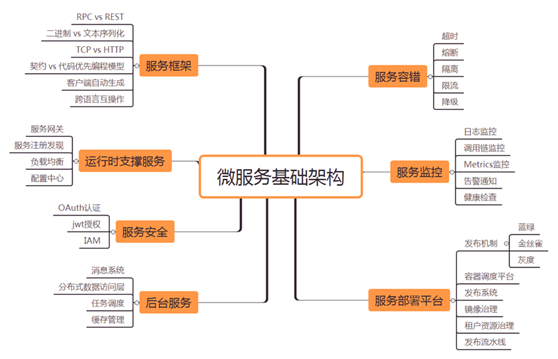
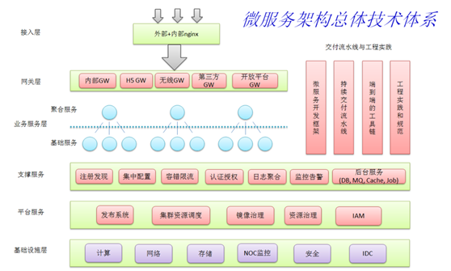
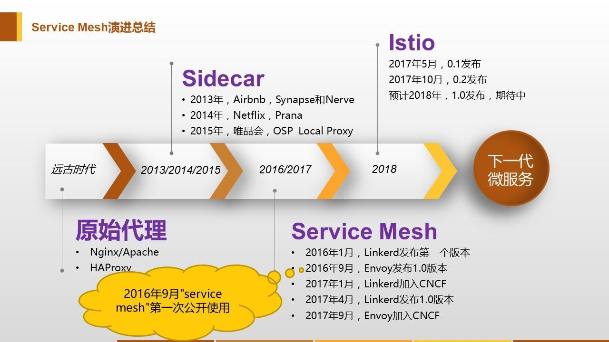

| 序号 | 修改时间 | 修改内容                     | 修改人 | 审稿人 |
| ---- | -------- | ---------------------------- | ------ | ------ |
| 1    | 2020-2-10 | 创建。从《分布式架构》拆分。 | 吴启福 |        |
|      |          |                              |        |        |
---

# 目录

[TOC]

 

---

# 1 微服务概述

## 1.1 微服务进化史

2014 年可以认为是微服务 1.0 的元年，当年有几个标志性事件，

一是 Martin Fowler 在其博客上发表了”Microservices”一文，正式提出微服务架构风格；

二是 Netflix 微服务架构经过多年大规模生产验证，最终抽象落地形成一整套开源的微服务基础组件，统称 NetflixOSS，Netflix 的成功经验开始被业界认可并推崇；

三是 Pivotal 将 NetflixOSS 开源微服务组件集成到其 Spring 体系，推出 Spring Cloud 微服务。

 

**微服务架构是一项在云中部署应用和服务的新技术。**

微服务可以在“自己的程序”中运行，并通过“轻量级设备与HTTP型API进行沟通”。关键在于该服务可以在自己的程序中运行。通过这一点我们就可以将服务公开与微服务架构（在现有系统中分布一个API）区分开来。在服务公开中，许多服务都可以被内部独立进程所限制。如果其中任何一个服务需要增加某种功能，那么就必须缩小进程范围。在微服务架构中，只需要在特定的某种服务中增加所需功能，而不影响整体进程。

 微服务可以在“自己的程序”中运行，并通过“轻量级设备与HTTP型API进行沟通”。关键在于该服务可以在自己的程序中运行。通过这一点我们就可以将服务公开与微服务架构（在现有系统中分布一个API）区分开来。在服务公开中，许多服务都可以被内部独立进程所限制。如果其中任何一个服务需要增加某种功能，那么就必须缩小进程范围。在微服务架构中，只需要在特定的某种服务中增加所需功能，而不影响整体进程。

## 1.2 微服务设计

1. 设计原则： 单一职责，服务自治、轻量级通信、去中心化
2. 划分模型：分领域驱动和数据驱动。选型在于业务复杂度和团队对领域驱动的熟悉度。
   - 领域驱动：更复杂。流程是建立统一语言、业务分析、寻找聚合。
   - 数据驱动：需求分析 --> 抽象数据结构 --> 划分服务 --> 确定服务调用关系 --> 业务流程验证 --> 持续优化  --> 逐步划分。

3. 已有单体架构拆分优先级策略：新业务、通用服务、核心服务、边界明显、独立属性优先。
4. 拆分原则：
   - 前后端分离
   - 状态外置
   - 提取微服务

5. AKF扩展立方体（可扩展）：三个角度XYZ轴扩展
   - X轴：水平扩展，实例复杂，常用于负载均衡
   - Y轴：垂直扩展，功能拆分多个微服务
   - Z轴：数据分区，如租户分组
6. 微服务的优劣。
   - 优势：服务模块边界清晰，支持独立部署，允许技术多样性
   - 劣势：微服务太多，需要专业的服务治理。

## 1.3 微服务参考架构

   

图 8 微服务基础架构 脑图

说明：

1. 服务框架选型：Spring Boot、Dubbo、gRPC(HTTP2+protobuf)
2. 运行时支撑服务：服务注册中心~Spring Cloud Eureka，服务网关~Spring Cloud ZUUL
3. 服务监控：日志监控-ELK，调用链监控-CAT/Zipkin/Pinpoint，Metrics 监控~TSDB
4. 服务容错：Hystrix
5. 后台服务：
6. 服务安全：

 

   

图  微服务架构技术体系

 

由于微服务尽量都是通过HTTP API的方式暴露出去的，因此这种服务管理平台不需要像传统企业内部的ESB服务总线这么重。但是最基本的服务注册，服务代理，服务发布，服务简单的路由，安全访问和授权，服务调用消息和日志记录这些功能还是需要具备。类似淘宝的Dubbo架构，即可以做为微服务架构下的服务管控平台。

表格 12 微服务功能组件 

| 功能       | 功能简介                                         | 功能详述                             |
| ---------- | ------------------------------------------------ | ------------------------------------ |
| 服务发现   | 两种模式，即客户端发现模式和服务端发现模式。     | 需搭建服务注册中心如ZK、Etcd、Consul |
| 服务治理   | 弹性伸缩、熔断、降级、超时重试、隔离、限流、限制 |                                      |
| 服务编排   |                                                  |                                      |
| 微服务测试 |                                                  |                                      |

  

**服务发现**

两种模式，即客户端发现模式和服务端发现模式。
表格 6  服务发现模式列表

| 模式             | 优点                         | 不足                                       | 适用场景                             | 案例 |
| ---------------- | ---------------------------- | ------------------------------------------ | ------------------------------------ | ---- |
| 集中式代理       | 运维简单、集中治理、语言无关 | 配置麻烦周期长、单点问题、多一跳有性能开销 | 中大小规模公司都适用，需一定运维能力 |      |
| 客户端嵌入式代理 | 无单点、性能好               | 客户端复杂、多语言麻烦、治理松散           | 中大规模公司，语言栈较统一           |      |
| 主机独立进程代理 | 折中方案                     | 运维部署复杂                               | 中大规模公司，运维能力强             |      |

**1. 服务客户端发现模式**

使用客户端发现模式时，客户端决定相应服务实例的网络位置，并且对请求实现负载均衡。客户端查询服务注册表，后者是一个可用服务实例的数据库；然后使用负载均衡算法从中选择一个实例，并发出请求。客户端从服务注册服务中查询，其中是所有可用服务实例的库。客户端使用负载均衡算法从多个服务实例中选择出一个，然后发出请求。

说明：类似搜神做P2P共享系统时的客户端登陆请求附近服务器地址。

 

**2. 服务端发现模式**

客户端通过负载均衡器向某个服务提出请求，负载均衡器查询服务注册表，并将请求转发到可用的服务实例。如同客户端发现，服务实例在服务注册表中注册或注销。在原文中有图示，基本看图就清楚了，即在服务注册库前新增加了一个Load Balancer节点。

服务端发现模式兼具优缺点。它最大的优点是客户端无需关注发现的细节，只需要简单地向负载均衡器发送请求，这减少了编程语言框架需要完成的发现逻辑。并且如上文所述，某些部署环境免费提供这一功能。这种模式也有缺点。除非负载均衡器由部署环境提供，否则会成为一个需要配置和管理的高可用系统组件。

 

**服务注册表**

服务实例必须在注册表中注册和注销。

对于服务注册表，文章提供了三种选择，感觉最常用的实现仍然是基于ZooKeeper进行的。

* tcd – 高可用、分布式、一致性的键值存储，用于共享配置和服务发现。

* Consul –发现和配置的服务，提供 API 实现客户端注册和发现服务。

* Apache ZooKeeper –被分布式应用广泛使用的高性能协调服务。

## 1.4 服务治理

在微服务体系里，IT治理就是服务治理。服务治理是服务到了一定程度，出现各种问题，不得不进行的一种处理方法。

服务治理的三个阶段：

1. 单体服务：如果单体服务太复杂，可采取微服务化。
2. 微服务：已经是微服务，可以采用常见的微服务框架进行管理，如Sprint boot, Dubbo等等。
3. Service Mesh 服务网络：当微服务已经极多，服务之间调用网络化。而常见的微服务框架对Java以外语言支持并不很友好，需要更进一步的服务治理技术服务网络，常用的框架有Istio等等。

##  本章参考

[1]: http://www.infoq.com/cn/articles/micro-service-technology-stack  "微服务架构技术栈选型手册"
[2]: https://yq.aliyun.com/articles/706057?spm=a2c4e.11155435.0.0.16e63312DWHVaf  "微服务开源生态报告 No.1"

# 2 微服务框架

详见 [《分布式架构框架分析》](../framework.框架/分布式架构框架分析.md) 同名章节

# 3 Service Mesh

## 3.1 Service Mesh简述

Service Mesh，服务网络。这个词最早使用由开发Linkerd的Buoyant公司提出，并在内部使用。2016年9月29日第一次公开使用这个术语。

**Service Mesh定义**

服务网格是一个基础设施层，功能在于处理服务间通信，职责是负责实现请求的可靠传递。在实践中，服务网格通常实现为轻量级网络代理，通常与应用程序部署在一起，但是对应用程序透明。

Service Mesh演进总结

表格 Service Mesh产品：Linkerd/Envoy/Istio/Conduit比较

| 功能         | Linkerd                                                    | Envoy                                   | Istio                                                    | Conduit                                |
| ------------ | ---------------------------------------------------------- | --------------------------------------- | -------------------------------------------------------- | -------------------------------------- |
| 主要贡献者   | Buoyant优步于2016年开源， 第一款Service Mesh产品。      | Lyft于2016年10月开源。                  | 2017年5月发布。IBM、Google、Lyft Service Mesh集大成者 | Buoyant优步于2017年12月开源            |
| 实现简介     | Scala语言编写，运行于JVM， 底层基于Twitter的Finagle库。 | C++实现。                               | Go语言实现。网络通信基于Envoy。                          | 数据平面用Rust开发，控制平面用Go开发。 |
| 代理         | Finagle+Jetty                                              | Envoy                                   | Envoy                                                    | Conduit                                |
| 熔断         | 支持                                                       | 支持                                    | 支持                                                     | 不支持                                 |
| 动态路由请求 | 支持。增量和受控方式                                       | 支持                                    | 支持                                                     | 不支持                                 |
| 流量分流     | 支持。增量和受控方式                                       | 支持                                    | 支持                                                     | 不支持                                 |
| 服务发现     | 支持。多种方式                                             | 支持。提供平台接口无关服务              | 支持                                                     | 只支持K8s                              |
| 负载均衡     | 支持。多种                                                 | 支持                                    | 支持，同Envoy                                            | 支持                                   |
| TLS安全通信  | 支持。                                                     | 支持                                    | 支持                                                     | 支持                                   |
| 访问控制     | 不支持。                                                   | 不支持                                  | 支持基于RBAC的访问控制                                   | 不支持                                 |
| 可见性       | 分布式追踪Zipkin； 运行时指标Prometheus/statsd          | 分布式追踪Zipkin； 运行时指标statsd | 分布式追踪Zipkin； 运行时指标；监控                  | 运行时指标Prometheus                   |
| 部署模式     | sidecar或者pre-host模式                                    | sidecar模式                             | sidecar模式                                              | sidecar模式                            |
| 控制平面     | Namerd                                                     | 没有，但可能通过API实现                 | Pilot、Mixer、Citadel                                    | Conduit                                |
| 协议支持     | HTTP/1.x、HTTP/2、gRPC                                     | HTTP/1.x、HTTP/2、gRPC、TCP             | HTTP/1.x、HTTP/2、gRPC、TCP                              | HTTP/1.x、HTTP/2、gRPC、TCP            |
| 运行平台     | 平台无关                                                   | 平台无关                                | 初是K8s，目标平台无关                                    | 只支持K8s                              |
| 是否产品     | 可以                                                       | 可以                                    | 可以                                                     | 不建议                                 |

备注：

1. sidecar模式： 一种将应用功能从应用本身剥离出来作为单独进程的方式。该模式允许我们向应用无侵入添加多种功能，避免了为满足第三方组件需求而向应用添加额外的配置代码。
2. 数据面板 Data Plane：作用是处理网格内服务间的通信，并完成服务发现、负载均衡、流量管理、健康检查等功能；数据平面的作用是处理网格内服务之间的通信，并负责实现服务发现、负载平衡、流量管理、健康检查等功能。
3. 控制面板 Control Plane：作用是管理和配置Sidecar来执行策略并收集遥测（telemetry）。

## 3.2 Istio

https://istio.io/

### 简介

主要功能

- 连接（Connect）：智能控制服务之间的调用流量，能够实现灰度升级、AB 测试和红黑部署等功能

- 安全加固（Secure）：自动为服务之间的调用提供认证、授权和加密。

- 控制（Control）：应用用户定义的 policy，保证资源在消费者中公平分配。

- 观察（Observe）：查看服务运行期间的各种数据，比如日志、监控和 tracing，了解服务的运行情况。

  

 ### 架构

服务之间的通信（比如这里的 Service A 访问 Service B）会通过代理（默认是 Envoy）来进行，支持多种网络协议。

控制中心做了进一步的细分，分成了 Pilot、Mixer 和 Citadel，它们的各自功能如下：

- Pilot：为 Envoy 提供了服务发现，流量管理和智能路由（AB 测试、金丝雀发布等），以及错误处理（超时、重试、熔断）功能。 用户通过 Pilot 的 API 管理网络相关的资源对象，Pilot 会根据用户的配置和服务的信息把网络流量管理变成 Envoy 能识别的格式分发到各个 Sidecar 代理中。
- Mixer：为整个集群执行访问控制（哪些用户可以访问哪些服务）和 Policy 管理（Rate Limit，Quota 等），并且收集代理观察到的服务之间的流量统计数据。
- Citadel：为服务之间提供认证和证书管理，可以让服务自动升级成 TLS 协议。

代理会和控制中心通信，一方面可以获取需要的服务之间的信息，另一方面也可以汇报服务调用的 Metrics 数据。

## 本章参考

[1]. https://www.jianshu.com/p/987155ce2298

[2.  [Istio / What is Istio?](https://istio.io/docs/concepts/what-is-istio/)  "[istio 官网上对 istio 进行介绍的文档](https://cizixs.com/2018/08/26/what-is-istio/)"

[3]. [Pattern: Service Mesh](http://philcalcado.com/2017/08/03/pattern_service_mesh.html)  "service mesh pattern 详解的文章"

# 参考资料

参考书籍

* 《Service Mesh实战 : 基于Linkerd和Kubernetes的微服务实践》 杨章显 / 机械工业出版社 / 2018-11
* 《[深入浅出Istio：Service Mesh快速入门与实践](https://book.douban.com/subject/30437870/)》 崔秀龙 / 电子工业出版社 / 2019-3 / 79

## 参考链接 

[1]:  Python微服务框架nameko的简单使用 https://blog.csdn.net/eagleuniversityeye/article/details/102722741

