| 序号 | 修改时间   | 修改内容        | 修改人 | 审稿人 |
| ---- | ---------- | --------------- | ------ | ------ |
| 1    | 2018-08-15 | 创建            | 吴启福 | 吴启福 |
| 2    | 2019-3-23  | 更新Redis持久化 | 同上   |        |
---

 

 

 

# 目录

[目录... 1](#_Toc4313798)

[1       DBMS架构篇... 5](#_Toc4313799)

[1.1          DBMS整体架构... 5](#_Toc4313800)

[RDBMS components 6](#_Toc4313801)

[ODBMS components 7](#_Toc4313802)

[1.2          DBMS存储结构... 7](#_Toc4313803)

[1.3          SQL引擎... 8](#_Toc4313804)

[1.4          术语... 8](#_Toc4313805)

[1.5          本章参考... 8](#_Toc4313806)

[2       RDMS. 8](#_Toc4313807)

[2.1          MySQL. 8](#_Toc4313808)

[2.1.1         总体架构：插件式存储引擎... 8](#_Toc4313809)

[2.1.2         存储引擎... 9](#_Toc4313810)

[2.1.3         MySQL数据表的存储（磁盘文件）... 11](#_Toc4313811)

[2.1.4         MySQL索引的存储结构... 12](#_Toc4313812)

[2.2          PostgreSQL. 13](#_Toc4313813)

[2.2.1         总体架构... 13](#_Toc4313814)

[2.3          Oracle. 13](#_Toc4313815)

[2.3.1         Oracle内存和进程架构... 15](#_Toc4313816)

[2.3.2         Oracle存储架构... 16](#_Toc4313817)

[2.3.3         Oracle各版本整体架构细节... 19](#_Toc4313818)

[2.4          SQL Server 21](#_Toc4313819)

[2.5          本章参考... 21](#_Toc4313820)

[3       NoSQL. 22](#_Toc4313821)

[3.1          Redis 22](#_Toc4313822)

[3.1.1         架构... 22](#_Toc4313823)

[3.1.2         原理... 25](#_Toc4313824)

[3.2          Memcached. 26](#_Toc4313825)

[3.3          Tokyo Products 26](#_Toc4313826)

[TC实现... 27](#_Toc4313827)

[TT实现... 28](#_Toc4313828)

[3.4          MongoDB. 28](#_Toc4313829)

[3.4.1         存储结构... 28](#_Toc4313830)

[3.4.2         集群架构... 29](#_Toc4313831)

[3.5          Neo4j 30](#_Toc4313832)

[3.5.1         存储结构... 30](#_Toc4313833)

[3.5.2         集群架构... 32](#_Toc4313834)

[3.6          OrientDB. 32](#_Toc4313835)

[3.6.1         存储结构... 33](#_Toc4313836)

[3.7          本章参考... 33](#_Toc4313837)

[4       NewSQL. 34](#_Toc4313838)

[4.1          Gauss/libra (Huawei) 34](#_Toc4313839)

[4.1.1         架构... 34](#_Toc4313840)

[4.1.2         查询流程... 36](#_Toc4313841)

[4.2          Tidb. 37](#_Toc4313842)

[4.2.1         架构... 37](#_Toc4313843)

[4.2.2         查询流程... 38](#_Toc4313844)

[4.3          本章参考... 38](#_Toc4313845)

[5       OLAP（开源）... 39](#_Toc4313846)

[5.1          GreenPlum (Pivotal/EMC) 39](#_Toc4313847)

[5.1.1         Pivotal 39](#_Toc4313848)

[5.1.2         HAWQ.. 39](#_Toc4313849)

[5.2          Impala (Cloudara) 41](#_Toc4313850)

[5.2.1         架构... 41](#_Toc4313851)

[5.2.2         查询流程... 42](#_Toc4313852)

[5.3          Presto (Facebook) 42](#_Toc4313853)

[5.3.1         架构... 43](#_Toc4313854)

[5.3.2         查询流程... 44](#_Toc4313855)

[5.4          Pinot (LinkedIn) 45](#_Toc4313856)

[5.5          Kylin. 46](#_Toc4313857)

[5.5.1         架构... 46](#_Toc4313858)

[5.5.2         KAP. 48](#_Toc4313859)

[5.5.3         Kyligence Cloud. 48](#_Toc4313860)

[5.6          本章参考... 49](#_Toc4313861)

[6       OLAP（商业付费）... 49](#_Toc4313862)

[6.1          IQ (Sybase/SAP) 50](#_Toc4313863)

[6.1.1         IQ整体架构... 51](#_Toc4313864)

[6.1.2         存储架构... 52](#_Toc4313865)

[6.2          HANA (SAP) 53](#_Toc4313866)

[6.3          Oracle Exadata. 54](#_Toc4313867)

[6.3.1         软件架构... 55](#_Toc4313868)

[6.3.2         存储架构... 57](#_Toc4313869)

[6.4          Teradata. 58](#_Toc4313870)

[6.4.1         Teardata Aster 58](#_Toc4313871)

[6.4.2         架构... 58](#_Toc4313872)

[6.4.3         查询流程... 59](#_Toc4313873)

[6.5          本章参考... 60](#_Toc4313874)

[7       时序数据库 TSDB. 61](#_Toc4313875)

[7.1          Druio. 61](#_Toc4313876)

[7.2          本章参考... 61](#_Toc4313877)

[参考资料... 62](#_Toc4313878)

[附录... 62](#_Toc4313879)


**表目录**

[表格 1 MySQL存储引擎比较列表... 9](#_Toc4313880)

[表格 2 MySQL数据表类型... 11](#_Toc4313881)

[表格 3 Oracle版本史... 13](#_Toc4313882)

[表格 4 Redis运行模式比较... 23](#_Toc4313883)

[表格 5 Redis持久化RDB和AOF比较... 25](#_Toc4313884)

[表格 6 Neo4j数据存储说明... 31](#_Toc4313885)

 

 

**图目录**

 

[图 1  RDBMS组件图... 6](#_Toc4313886)

[图 2 MySQL插件式存储引擎的体系结构... 9](#_Toc4313887)

[图 3 PostgreSQL体系结构图... 13](#_Toc4313888)

[图 4 Oracle内存结构和进程结构... 15](#_Toc4313889)

[图 5 Oracle存储结构整体... 17](#_Toc4313890)

[图 6 Oracle物理存储结构... 18](#_Toc4313891)

[图 7 ORACEL 9i架构图... 19](#_Toc4313892)

[图 8 ORACEL 10g架构图... 20](#_Toc4313893)

[图 9 Sqlserver架构图... 21](#_Toc4313894)

[图 10 Tokyo Products. 26](#_Toc4313895)

[图 11 MongoDB数据文件内部结构... 29](#_Toc4313896)

[图 12 mongodb集群架构... 30](#_Toc4313897)

[图 13 Neo4j数据存储结构... 31](#_Toc4313898)

[图 14 Neo4j数据存储示例... 31](#_Toc4313899)

[图 15 Neo4J集群的架构... 32](#_Toc4313900)

[图 16 OrientDB存储结构... 33](#_Toc4313901)

[图 17 LibrA结构... 34](#_Toc4313902)

[图 18 TiDB 的整体架构... 38](#_Toc4313903)

[图 19 GreenPlum架构... 39](#_Toc4313904)

[图 20 Pivotal的SQL on Hadoop方案... 40](#_Toc4313905)

[图 21 HAWQ系统架构... 40](#_Toc4313906)

[图 22 Impala架构图... 41](#_Toc4313907)

[图 23 impala查询处理过程... 42](#_Toc4313908)

[图 24 Presto架构... 43](#_Toc4313909)

[图 25 Presto执行过程示意图... 44](#_Toc4313910)

[图 26 Pinot架构... 45](#_Toc4313911)

[图 27 Pinot组件架构图... 46](#_Toc4313912)

[图 28 kylin部署架构... 47](#_Toc4313913)

[图 29 Kylin应用架构之组件（插件化）... 47](#_Toc4313914)

[图 30 Kylin 生态圈... 48](#_Toc4313915)

[图 31 Kyligence Cloud 的架构图... 49](#_Toc4313916)

[图 32 SAP IQ 16 Engine. 51](#_Toc4313917)

[图 33 SAP IQ Loading Engine. 51](#_Toc4313918)

[图 34 HANA软件架构... 54](#_Toc4313919)

[图 35 Oracle Exadata软件架构... 56](#_Toc4313920)

[图 36 Oracle Exadata软件架构2. 57](#_Toc4313921)

[图 37 Exadata存储架构... 58](#_Toc4313922)

[图 38 Teradata架构... 59](#_Toc4313923)

[图 39 Teradata数据写取流程图... 59](#_Toc4313924)

[图 40 Teradata数据读取流程图... 60](#_Toc4313925)

[图 41 Druid的架构... 61](#_Toc4313926)


 

# 1       DBMS架构篇

EA架构包括业务架构、应用架构（功能）、IT架构（包括技术架构和数据架构）。

软件架构通常可以以四视图法表示，如部署视图、组件视图、逻辑视图（进程、内存等）等等。

数据库架构的架构主要是组件视图，其中包括两个关键组件：存储引擎和SQL引擎。根据数据库特点会分别讲述事务处理的差异、集群架构的差异。

## 1.1   DBMS整体架构

According to the wikibooks open-content textbooks, "[Design of Main Memory Database System/Overview of DBMS](http://en.wikibooks.org/wiki/Design_of_Main_Memory_Database_System/Overview_of_DBMS)", most DBMS as of 2009[[update\]](http://en.wikipedia.org/w/index.php?title=Database&action=edit) implement a relational model. Other less-used DBMS systems, such as the object DBMS, generally operate in areas of application-specific data management where performance and scalability take higher priority than the flexibility of *ad hoc* query capabilities provided via the [relational-algebra](http://en.wikipedia.org/wiki/Relational_algebra) execution algorithms of a relational DBMS.

### RDBMS components

​    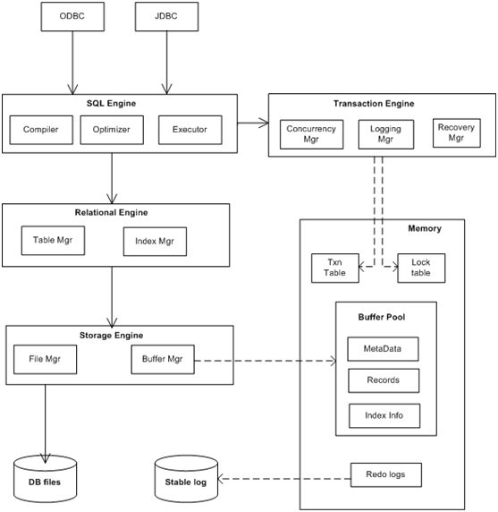                                              

图 1  RDBMS组件图

- **Interface drivers** - A user or application program initiates either schema      modification or content modification. These drivers[[*which?*](http://en.wikipedia.org/wiki/Wikipedia:Avoid_weasel_words)]      are built on top of SQL. They provide methods to prepare statements,      execute statements, fetch results, etc. Examples include [DDL](http://en.wikipedia.org/wiki/Data_Definition_Language), [DCL](http://en.wikipedia.org/wiki/Data_Control_Language), [DML](http://en.wikipedia.org/wiki/Data_Manipulation_Language), [ODBC](http://en.wikipedia.org/wiki/ODBC), and [JDBC](http://en.wikipedia.org/wiki/JDBC). Some vendors      provide language-specific proprietary interfaces. For example [MySQL](http://en.wikipedia.org/wiki/MySQL) and [FireBird](http://en.wikipedia.org/wiki/Firebird_(database_server)) provide drivers for [PHP](http://en.wikipedia.org/wiki/PHP), [Python](http://en.wikipedia.org/wiki/Python_(programming_language)), etc.
- **SQL engine** - This component interprets and executes the [SQL](http://en.wikipedia.org/wiki/SQL) query. It      comprises three major components (compiler, optimizer, and execution      engine). SQL引擎组成三部分是解析、优化和执行。
- **Transaction engine** - Transactions are sequences of operations that read or write      database elements, which are grouped together. 事务引擎包括日志、回滚和并发管理。
- Relationa  engine - Relational objects such as Table,      Index, and Referential integrity constraints  are implemented in this component.
- [**Storage      engine**](http://en.wikipedia.org/wiki/Storage_engine) - This component stores and retrieves data records. It also      provides a mechanism to store [metadata](http://en.wikipedia.org/wiki/Metadata)      and control information such as undo logs, redo logs, lock tables, etc. 存储引擎存储和检测数据纪录。

### ODBMS components

说明：ODBMS面向对象的DBMS没有关系引擎。

- **Language drivers** - A user or application program initiates either schema      modification or content modification via the chosen programming language.      The drivers then provide the mechanism to manage object lifecycle coupling      of the application memory space with the underlying persistent storage.      Examples include C++, Java, .NET, and Ruby.
- **Query engine** - This component interprets and executes language-specific      query commands in the form of OQL, LINQ, JDOQL, JPAQL, others. The query      engine returns language specific collections of objects which satisfy a      query predicate expressed as logical operators e.g >, <, >=,      <=, AND, OR, NOT, GroupBY, etc.
- **Transaction engine** - Transactions are sequences of operations that read or write      database elements, which are grouped together. The transaction engine is      concerned with such things as data isolation and consistency in the driver      cache and data volumes by coordinating with the storage engine.
- [**Storage      engine**](http://en.wikipedia.org/wiki/Storage_engine) - This component stores and retrieves objects in an arbitrarily complex model. It also      provides a mechanism to manage and store metadata and control information      such as undo logs, redo logs, lock graphs,

 

## 1.2   DBMS存储结构

Databases may store relational tables/indexes in memory or on hard disk in one of many forms:

- ordered/unordered [flat files](http://en.wikipedia.org/wiki/Flat_file_database)
- [ISAM](http://en.wikipedia.org/wiki/ISAM)
- [heaps](http://en.wikipedia.org/wiki/Heap_(data_structure))
- [hash      buckets](http://en.wikipedia.org/wiki/Hash_table)
- [B+ trees](http://en.wikipedia.org/wiki/B%2B_tree)

| Database         | 内存索引             | 磁盘存储         | 特性                                            |
| ---------------- | -------------------- | ---------------- | ----------------------------------------------- |
| MySQL MyISAM     | B+                   | 表存储？         | 支持OLAP。                                      |
| MySQL   *InnoDB* |                      |                  | 支持ACID。                                      |
| memcached        | hashtable            | 无               | hash函数：hash(key)&(1<<16)，若碰撞，则用拉链法 |
| MongoDB          | B+                   | mmap             | VALUE可以是结构化数据。                         |
| TT & TC          | B+/ hash/array/table | 文件+cache       | 可存磁盘。                                      |
| Redis            | hashtable            | 内存文件映像mmap |                                                 |
|                  |                      |                  |                                                 |

备注: 需要验证！！！

## 1.3   SQL引擎

详见 《数据库技术》SQL优化章节。

 

## 1.4   术语

 

## 1.5   本章参考

[1].    http://en.wikipedia.org/wiki/Database#Components_of_DBMS

[2].    http://en.wikipedia.org/wiki/Database_model

[3].    http://en.wikibooks.org/wiki/Design_of_Main_Memory_Database_System/Overview_of_DBMS

[4].    http://en.wikipedia.org/wiki/Database_storage_structures

# 2       RDMS

## 2.1   MySQL

### 2.1.1   总体架构：插件式存储引擎

**图14.1****：MySQL****插件式存储引擎的体系结构**

   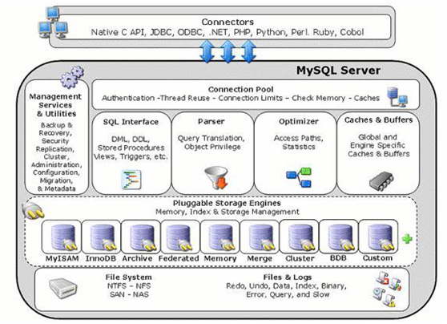

图 2 MySQL插件式存储引擎的体系结构

说明：插件式存储引擎体系结构提供了标准的管理和支持服务集合，它们对所有的基本存储引擎来说是共同的。存储引擎本身是数据库服务器的组件，负责对在物理服务器 层面上维护的基本数据进行实际操作。

 

### 2.1.2   存储引擎

#### 存储引擎比较

表格 1 MySQL存储引擎比较列表

| 特点         | MyISAM | BDB  | Memory | InnoDB   | Archive |
| ------------ | ------ | ---- | ------ | -------- | ------- |
| 存储限制     | 没有   | 没有 | 有     | 64TB     | 没有    |
| 事务安全     |        | 支持 |        | **支持** |         |
| 锁机制       |        |      |        |          |         |
| B树索引      | 支持   | 支持 | 支持   | 支持     |         |
| 哈希索引     |        |      | 支持   | 支持     |         |
| 全文索引     | 支持   |      |        |          |         |
| 集群索引     |        |      |        | 支持     |         |
| 数据缓存     |        |      | 支持   | 支持     |         |
| 索引缓存     | 支持   |      | 支持   | 支持     |         |
| 数据可压缩   | 支持   |      |        |          | 支持    |
| 空间使用     | 低     | 低   | N/A    | 高       | 非常低  |
| 内存使用     | 低     | 低   | 中等   | 高       | 低      |
| 批量插入速度 | 高     | 高   | 高     | 低       | 非常高  |
| 支持外键     |        |      |        | 支持     |         |

说明：MyISAMt和InnoDB是最常用的两种存储引擎。
*  MyISAM：默认的MySQL插件式存储引擎，它是在Web、数据仓储和其他应用环境下最常使用的存储引擎之一。适合进行 OLAP 运算。支持更多数据类型，管理非事务表，提供高速存储和检索，以及全文搜索能力（全文索引只能用MyISAM表）。注意，通过更改STORAGE_ENGINE配置变量，能够方便地更改MySQL服务器的默认存储引擎。
*  InnoDB：用于事务处理应用程序，具有众多特性，包括ACID事务支持。用于数据完整性/写性能要求比较高的应用。是为处理巨大数据量时的最大性能设计。需要做更多的配置，不过值得，可以更安全的存储数据，以及得到更快的速度。相比MyISAM，写的效率会低些并且会占用更多磁盘空间用来保存索引和数据。
*  BDB：可替代InnoDB的事务引擎，支持COMMIT、ROLLBACK和 其他事务特性。
*  Memory：将所有数据保存在RAM中，在需要快速查找引用和 其他类似数据的环境下，可提供极快的访问。 
*  Merge：允许MySQL DBA或开发人员将一系列等同的MyISAM表以逻辑方式组合在一起，并作为1个 对象引用它们。对于诸如数据仓储等VLDB环境十分适合。
*  Archive：为大量很少引用的历史、归档、或安全审计信息的存储和检索提供了完美的解决 方案。
*  Federated：能够将多个分离的MySQL服务器链接起 来，从多个物理服务器创建一个逻辑数据库。十分适合于分布式环境或数据集市环境。
*  Cluster/NDB：MySQL的簇式数据库引擎，尤其适合 于具有高性能查找要求的应用程序，这类查找需求还要求具有最高的正常工作时间和可用性。
*  Other：其他存储引擎包括CSV（引用由逗号隔开的用作数据 库表的文件），Blackhole（用于临时禁止对数据库的应用程序输入），以及Example引 擎（可为快速创建定制的插件式存储引擎提供帮助）。


##### InnoDB

 

##### MyISAM

 

#### 自定义存储引擎

实施新存储引擎的最简单方法是，通过拷贝和更改EXAMPLE存储引擎开始。在MySQL 5.1源码树的sql/examples/目录下可找到文件ha_example.cc和ha_example.h。

 

#### 使用存储引擎

**1)** **将存储引擎指定给表**

可以在创建新表时指定存储引擎，或通过使用ALTER TABLE语句指定存储引擎。

要想在创建表时指定存储引擎，可使用ENGINE参数：

CREATE TABLE engineTest(

id INT

) ENGINE = MyISAM;

 

要想更改已有表的存储引擎，可使用ALTER TABLE语句：

ALTER TABLE *engineTest* ENGINE = *ARCHIVE*;

 

**2)** **插入拨出存储引擎**

能够使用存储引擎之前，必须使用INSTALL PLUGIN语句将存储引擎plugin（插件）装载到mysql。例如，要想加载example引擎，首先应加载ha_example.so模块：

INSTALL PLUGIN *ha_example* SONAME '*ha_example.so*';

文件.so必须位于MySQL服务器库目录下（典型情况下是installdir/lib）

 

要想拔出存储引擎，可使用UNINSTALL PLUGIN语句：

UNINSTALL PLUGIN *ha_example*;

如果拔出了正被已有表使用的存储引擎，这些表将成为不可访问的。拔出存储引擎之前，请确保没有任何表使用该存储引擎。

 

**3)** **插件式存储器的安全含义**

为了安装插件式存储引擎，*plugin*文件必须位于恰当的MySQL库目录下，而且发出INSTALL PLUGIN语句的用户必须具有SUPER权限。

 

### 2.1.3   MySQL数据表的存储（磁盘文件）

MySQL通过数据库目录中的.frm表格式（定义）文件表示每个表。表的存储引擎也可能会创建其它文件。对于MyISAM表，存储引擎可以创建数据和索引文件。

 

MySQL数据表类型有：ISAM、MyISAM、MERGE、BDB、InnoDB和HEAP。每种数据表在文件系统中都有不同的表示方式，有一个共同点就是每种数据表至少有一个存放数据表结构定义的.frm文件。下面介绍每种数据表文件：

表格 2 MySQL数据表类型

| 数据表   类型 | 简介                                                         | 存储文件                                                     | 备注 |
| ------------- | ------------------------------------------------------------ | ------------------------------------------------------------ | ---- |
| ISAM          | ISAM数据表是最原始的数据表，有三个文件                       | *  .frm，存放数据表的结构定义；   *  .ISD，数据文件，存放数据表中的各个数据行的内空；   *  .ISM，索引文件，存放数据表的所有索引信息。 |      |
| MyISAM        | MyISAM数据表是ISAM数据表的继承者，也有三个文件。             | *  .frm，结构定义文件；   *  .MYD，数据文件；   *  .MYI，索引文件。 |      |
| MERGE         | MERGE数据表是一个逻辑结构，代表一组结构完全相同的MyISAM数据表构成的集合。它在文件系统中有二个文件。 | *  .frm，结构定义文件；   *  .MRG，构成MERGE表的MyISAM数据表清单，每个MyISAM数据表名占一行。也就是说可通过改变该表的内容来改变MERGE数据表的结构。修改前请先刷新缓存(flush tables)，但不建议这样修改MERGE数据表。 |      |
| BDB           | BDB数据表用两个文件来表示                                    | *  .frm，结构定义文件；   *  .db，数据表数据和索引文件       |      |
| InnoDB        | InnoDB由于采用表空间的概念来管理数据表，所以它只有一个与数据表对应.frm文件，同一目录下的其它文件表示为表空间，存储数据表的数据和索引。 | *  .frm，结构定义文件；                                      |      |
| HEAP          | HEAP数据表是一个存在于内存中的表，所以它的数据和索引都存在于内存中。文件系统中只有一个.frm文件，以定义结构。 | *  .frm，结构定义文件；                                      |      |

备注：了解MySQL数据表在文件系统中表现形式后，我们可知道，创建、修改或删除数据表，其实就是对这些文件进行操作。例如一些数据表(除InnoDB和HEAP数据表外)，我们可直接在文件系统中删除相应的文件来删除数据表。

% cd datadir

% rm -f mydb/mydb.*

以上命令可删除mydb数据库中的mydb数据表。

 

### 2.1.4   MySQL索引的存储结构

FULLTEXT索引只能对CHAR, VARCHAR和TEXT列编制索引，并且只能在MyISAM表中编制。

部分储存引擎允许在创建索引时指定索引类型。*index_type*指定语句的语法是USING *type_name*。不同的储存引擎所支持的*type_name*值已显示在下表中。如果列有多个索引类型，当没有指定*index_type*时，第一个类型是默认值。

| **存储引擎** | **允许的索引类型** |
| ------------ | ------------------ |
| MyISAM       | B TREE             |
| InnoDB       | B+ TREE            |
| MEMORY/HEAP  | HASH, BTREE        |

示例：

CREATE TABLE lookup (id INT) ENGINE = MEMORY;

CREATE INDEX id_index USING BTREE ON lookup (id);

 

## 2.2   PostgreSQL

### 2.2.1   总体架构

   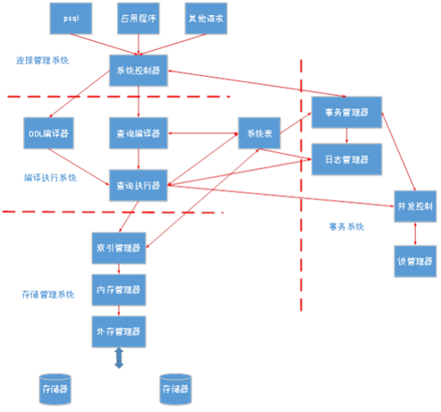

图 3 PostgreSQL体系结构图

PostgreSQL由连接管理系统（系统控制器），编译执行系统，存储管理系统，事务系统，系统表五大部分组成。

 

## 2.3   Oracle

表格 3 Oracle版本史

| 版本       | 发布日期  | 事件                                                         |
| ---------- | --------- | ------------------------------------------------------------ |
| Oracle 2   | 1979      |                                                              |
| Oracle 3   | 1983      | 增加关键特性：可移植性                                       |
| Oracle 4   | 1984      | 增加重要特性：读一致性                                       |
| Oracle 5   | 1985      | 稳定版本                                                     |
| Oracle 5.1 | 1985      | 支持分布式查询。                                             |
| Oracle 6   | 1988      | 引入行级锁、联机热备份功能。                                 |
| Oracle 7   | 1992.6    | 增加了许多新的性能特性：分布式事务处理功能、增强的管理功能、用于应用程序开发的新工具以及安全性方法。 |
| Oracle 8   | 1997.6    | 支持面向对象的开发及新的多媒体应用。                         |
| Oracle 8i  | 1998.9    | 这一版本中添加了大量为支持Internet而设计的特性同时这一版本为数据库用户提供了全方位的Java支持 |
| Oracle 9i  | 2001.6    | 增加Real Application Clusters（RAC）。                       |
| Oracle 10g | 2003.9    | 这一版的最大的特性就是加入了网格计算的功能。                 |
| Oracle 11g | 2007.7.11 | 根据用户的需求实现了信息生命周期管(Information sLifecycle Management)等多项创新。 |
| Oracle 12c | 2013.6.23 |                                                              |
|            |           |                                                              |

 

Oracle数据库服务器包括一个数据库和至少一个数据库实例（通常简称为实例），由于实例和数据库紧密地连接在一起，所以有时使用Oracle数据库来引用实例和数据库，严格意义上说，Oracle数据库具有以下含义：

*  数据库实例Database Instance：实例是数据库启动时初始化的一组进程和内存结构。实例由称为系统全局区（System Global Area）的共享内存区和后台进程组成，实例可以独立于数据库文件存在。

*  数据库Database：数据库则指的是用户存储数据的一些物理文件。这些文件可以独立于数据库实例存在。

 

Oracle Architect包括

*  [Multitenant Architecture](https://docs.oracle.com/en/database/oracle/oracle-database/18/cncpt/introduction-to-oracle-database.html#GUID-AB84D6C9-4BBE-4D36-992F-2BB85739329F) 多租户

*  [Sharding Architecture](https://docs.oracle.com/en/database/oracle/oracle-database/18/cncpt/introduction-to-oracle-database.html#GUID-8F1E6C26-A65A-4D62-B236-BFE3DA6CD43F) 分片 

*  [Process Architecture](https://docs.oracle.com/en/database/oracle/oracle-database/18/cncpt/process-architecture.html#GUID-85D9852E-5BF1-4AC0-9E5A-49F0570DBD7A) 进程架构，进程包括服务器、客户端和后台进程。

*  [Memory Architecture](https://docs.oracle.com/en/database/oracle/oracle-database/18/cncpt/memory-architecture.html#GUID-913335DF-050A-479A-A653-68A064DCCA41) 内存架构，SGA+PGA；也可分为[Physical Storage Structures](https://docs.oracle.com/en/database/oracle/oracle-database/18/cncpt/physical-storage-structures.html#GUID-FFA872E1-7F63-4DC5-8A35-F21394AB4595) + [Logical Storage Structures](https://docs.oracle.com/en/database/oracle/oracle-database/18/cncpt/logical-storage-structures.html#GUID-13CE5EDA-8C66-4CA0-87B5-4069215A368D)

### 2.3.1   Oracle内存和进程架构

   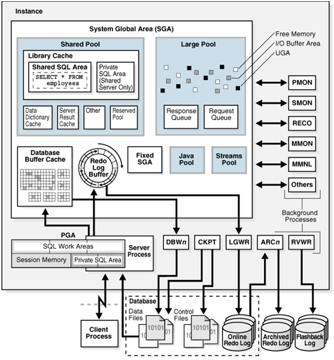

图 4 Oracle内存结构和进程结构

**内存结构**

Oracle DB创建并使用内存结构来满足多种需要，例如，使用内存来存储正在运行的程序代码、在各用户之间共享的数据以及所连接的每个用户的专用数据区域。一个实例有两个关联的基本内存结构：

*  系统全局区（System Global Area, SGA）：一组共享的内存结构（称为SGA组件），其中包含一个Oracle DB实例的数据和控制信息。SGA由所有服务器进程和后台进程共享，SGA中存储的数据有高速缓存的数据块和共享SQL区域等；
*  程序全局区（Program Global Area, PGA）：包含某个服务器进程或后台进程的数据及控制信息的内存区域。PGA是Oracle DB在服务器进程或后台进程启动时创建的非共享内存。服务器进程对PGA的访问是独占式的，每个服务器进程和后台进程都具有自己的PGA。


**SGA****（系统全局区）说明**

SGA中必须包含的内存结构有数据库缓冲区、日志缓冲区和共享池；可选的内存结构有大池、Java池和流池。
*  共享池 Shared Pool~用于库缓存、数据字典缓存和PLSQL区缓存。
*  **大池****Large Pool****：**大池是个可选的内存区域，前面我们提到专有服务器连接和共享服务器连接，如果数据库采用了共享服务器连接模式，则要使用到大池；RMAN(Oracle的高级备份恢复工具)备份数据也需要大池。
*  Java池：用作实例化Java对象所需的堆空间。
*  流池 Streams Pool：从重做日志中提取变更记录的进程 和 应用变更记录的进程会用到流池。

备注：除了日志缓冲区是固定的，不能动态调整也不能进行自动管理外，其他内存区域都可以进行动态调整，也可以进行自动管理。

 

**进程结构**

Oracle进程由用户进程、后台进程和服务器进程组成。
*  SMON(System Monitor): 安装和打开数据库，实例恢复也是由此进程完成的。
*  PMON(Process Monitor): 进程监视器，主要监视服务器进程。
*  CKPT(Checkpoint Process): CKPT负责发起检查点信号
*  MMON(Manageability Monitor): 数据库的自我监视和自我调整的支持进程。
*  ARCn（Archiver）: 归档进程，可选。

### 2.3.2   Oracle存储架构

针对Oracle存储结构将分别从物理存储结构和逻辑存储结构两个维度来进行阐述。

物理结构是系统管理员能看到的，逻辑结构则是用户所能感知到的。

   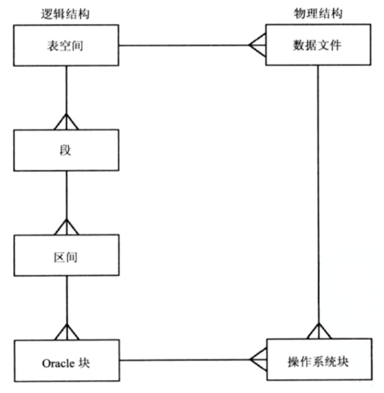

图 5 Oracle存储结构整体

 

**逻辑结构**

逻辑存储结构能够使Oracle数据库对磁盘空间使用进行细粒度的控制，包括：
*  数据块（Data Blocks）：从最细的层面来讲，Oracle数据库的数据存储在数据块中，一个数据块与磁盘中特定字节数的物理空间相对应。每个表空间的数据块大小是在创建表空间时指定的，数据库以Oracle数据块为单位使用和分配空闲数据库空间；
*  区（Extends）：区是特定数量的相邻Oracle数据块（通过一次分配获得），用于存储特定类型的信息。一个区中的Oracle数据块在逻辑上是相邻的，但在物理上可以分布在磁盘上的不同位置（RAID条带化和文件系统实施会导致此现象）；
*  段（Segments）：段是为某个逻辑结构分配的一组区，例如：数据段、索引段、还原段以及临时段；
*  表空间（Tablespaces）：一个数据库分为多个逻辑存储单元，这些单元称为“表空间”，用于将相关逻辑结构或数据文件归到一组。表空间从逻辑上是多个段的结合，在物理上是多个数据文件的集合，相当于在段和数据文件的对应中加入了一个中间层来解决这种多对多的关系。

 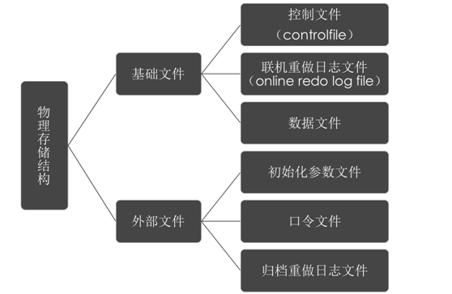

   

图 6 Oracle物理存储结构

构成Oracle DB的文件可划分为以下类别：
*  数据文件：包含数据库的用户或应用程序数据，以及元数据和数据字典；
*  控制文件：包含与数据库本身相关的数据，即物理数据库结构信息。这些文件对数据库至关重要，没有这些文件，就无法打开数据文件来访问数据库中的数据，控制文件还可以包含与备份相关的元数据；
*  在线重做日志文件：用于恢复数据库实例，如果数据库服务器崩溃，但未丢失任何数据文件，则实例可使用这些文件中的信息恢复数据库。

### 2.3.3   Oracle各版本整体架构细节

   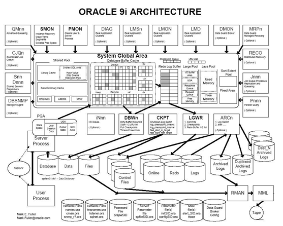

图 7 ORACEL 9i架构图

 

   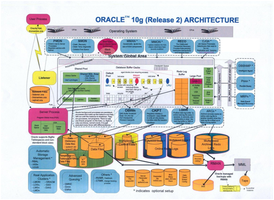

图 8 ORACEL 10g架构图

## 2.4   SQL Server

   

图 9 Sqlserver架构图

 

## 2.5   本章参考

[1].    本人另文  《元数据专题》

[2].    http://dev.mysql.com/doc/refman/5.1/zh/pluggable-storage.html

[3].    InnoDB引擎的索引和存储结构 http://www.cnblogs.com/binyue/p/4135121.html 

[4].    存储引擎和表类型 http://doc.mysql.cn/mysql5/refman-5.1-zh.html-chapter/storage-engines.html

[5].    database-concepts_201804 https://docs.oracle.com/en/database/oracle/oracle-database/18/cncpt/introduction-to-oracle-database.html#GUID-16C1C948-4B26-4A0E-B94E-01D57859CFCF

[6].    https://docs.oracle.com/en/database/oracle/oracle-database/index.html

[7].    Oracle体系结构详解 https://www.cnblogs.com/chengxiao/p/5904783.html 

[8].    PostgreSQL体系架构 https://blog.csdn.net/eagle89/article/details/80390145 

# 3       NoSQL

## 3.1   Redis

Redis是一个开源的，基于网络的，高性能的key-value数据库，弥补了memcached这类key-value存储的不足，在部分场合可以对关系数据库起到很好的补充作用，满足实时的高并发需求。

Redis跟memcached类似，不过数据可以持久化，而且支持的数据类型很丰富。支持在服务器端计算集合的并、交和补集(difference)等，还支持多种排序功能。

说明： 

Redis客户端跟服务端间的网络数据传输未加密，建议不要使用Redis存取敏感数据，否则可能存在安全风险。

### 3.1.1   架构

#### 3.1.1.1         逻辑架构

Reids逻辑架构包含Redis Server与Redis-WS，如[图1](http://localhost:7890/pages/YZH0518G/01/YZH0518G/01/resources/zh-cn_topic_0085563647.html?ft=0&fe=10&hib=2.2.3.16.1&id=ZH-CN_TOPIC_0085563647#ZH-CN_TOPIC_0085563647__fig1)所示。

图1 Redis逻辑架构
    
* Redis Server：Redis组件的核心模块，负责Redis协议的数据读写、数据持久化、主从复制、集群功能。 
* Redis-WS：Redis WebService管理模块，主要负责Redis集群的创建、扩容、减容、查询、删除等操作，集群管理信息存入DB数据库。

备注：每个节点会打开两个TCP socket。第一个用于标准的RESP协议，默认端口是6369；另一个用于集群间二进制协议，在第一个端口加上10000。

#### 3.1.1.2         部署架构~运行模式

表格 4 Redis运行模式比较

|          | **单实例模式**                         | **集群模式**                                                 |
| -------- | -------------------------------------- | ------------------------------------------------------------ |
| 部署方式 | 一主多从，一从多从                     | 多主。多个Redis实例组合为一个Redis集群，共16384个槽位均分到各主实例上。 |
| 可用性   | 主实例宕机，服务终止。从实例默认只读。 | Redis   Sentinel，监控主从节点的实例。主实例故障，由集群中剩余的主实例选举出一个从实例升主，需要半数以上主实例OK才能选举。 |
| 可伸缩性 |                                        | Redis集群可以进行扩容、减容（新实例加入集群或Redis实例退出集群），并进行槽位迁移。 |
| 性能     |                                        |                                                              |

备注：单机版的Redis是有数据库概念的，并且每个数据库的数据是隔离的不能共享。集群没有数据库概念。

 

Redis实例可以部署在一个或多个节点上，且一个节点上也可以部署一个或多个Redis实例（FusionInsight HD平台中，每个节点上Redis实例的个数由软件根据节点硬件资源情况计算得出）。

最新版本的Redis支持集群功能，可以将多个Redis实例组合为一个Redis集群，从而对外提供一个分布式key-value数据库。集群通过分片（sharding）来进行数据共享，并提供复制和故障转移功能。

 

**单实例模式** 

单实例模式逻辑部署方式如[图2](http://localhost:7890/pages/YZH0518G/01/YZH0518G/01/resources/zh-cn_topic_0085563647.html?ft=0&fe=10&hib=2.2.3.16.1&id=ZH-CN_TOPIC_0085563647#ZH-CN_TOPIC_0085563647__fig2)所示：

**图****2** 单实例模式
    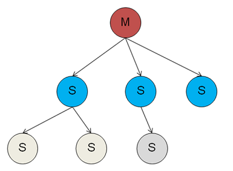

说明：

·         一个主实例（master）可以对应有多个从实例（slave），从实例本身还可连接从实例。 

·         发给主实例的命令请求，主实例会实时同步给从实例进行处理。 

·         主实例宕机，从实例不会自动升主。 

·         从实例默认只读，在配置了“slave-read-only”为no时，从实例也可写。但从实例重启后，会从主实例同步数据，之前写入从实例的数据丢失。 

·         多层级从实例的结构，相对所有从实例都直接连接在主实例下的结构，由于减少了主实例需要直接同步的从实例个数，一定程度上能提升主实例的业务处理性能。

 

#### 3.1.1.3         可伸缩性：Redis集群

**集群模式** 

集群模式逻辑部署方式如[图3](http://localhost:7890/pages/YZH0518G/01/YZH0518G/01/resources/zh-cn_topic_0085563647.html?ft=0&fe=10&hib=2.2.3.16.1&id=ZH-CN_TOPIC_0085563647#ZH-CN_TOPIC_0085563647__fig3)所示：

**图****3** 集群模式
    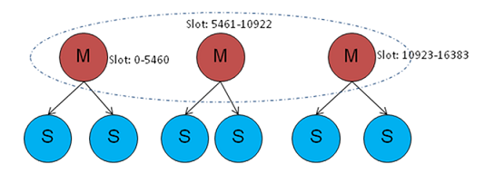

说明：

·         多个Redis实例组合为一个Redis集群，共16384个槽位均分到各主实例上。 

·         集群中的每个实例都记录有槽位与实例的映射关系，客户端也记录了槽位与实例的映射。客户端根据key算hash并模16384得到槽位 (HASH_SLOT=CRC16(key) module 16384)，根据槽位-实例映射，将消息直接发送到对应实例处理。 

·         默认情况，从实例不能读不能写，在线执行readonly命令可使从实例可读。 

·         主实例故障，由集群中剩余的主实例选举出一个从实例升主，需要半数以上主实例OK才能选举。 

·         cluster-require-full-coverage配置项指示集群是否要求完整，若配置为yes，则其中一组主从都故障时，集群状态为FAIL，整个集群不能处理命令；若配置为no，则半数以上主实例OK，集群状态还是OK。 

·         Redis集群可以进行扩容、减容（新实例加入集群或Redis实例退出集群），并进行槽位迁移。 

·         目前FusionInsight HD中的Redis集群只支持一主一从模式。

 

**windows****下创建多实例（一主多从）**

一个redis实例对应一个节点，每个节点对应一个配置文件，可配置一个监听端口。

1. 配置文件修改：redis.windows-service.conf，命名为 redis.windows-service-{port}.conf，如redis.windows-service-6380.conf
```shell
# master port为 6379

port 6380

slaveof 127.0.0.1 6379
```

2. 服务注册：命令行输入
```shell
redis-server --service-install redis.windows-service-6380.conf --service-name redis6380 --loglevel verbose
```

3. 服务启动：命令行输入
```shell
redis-server --service-start --service-name redis6380
```

4.客户端启动：命令行输入 
```shell
redis-cli.exe -p 6379
redis-cli.exe -p 6380
```
备注：linux配置一主多从会更简单点，去除服务注册，直接用redis-server [conf]启动。

 

数据分区三种方法：

* 客户端分区：分区逻辑包含在客户端代码中。
* 辅助代理分区：连接到中间件，同中间件来分发请求。
* 查询路由：Redis集群当前的实现方式，典型实现有Twitter开源的Twemproxy。任一客户端查询集群中的随机节点将被路由到包含键的正确节点上。常见方法有范围分区、列表分区等等。
* 范围分区：根据传入键落入特定范围，并将该键划分给此范围所对应的实例。
* 列表分区：为分区指定一个列表值。如果传入键在某分区列表中，则命中此分区。如全国电话号码分布（将前若干位数字作为分区号）。
* 哈希分区：对键进行哈希，结果取模操作（%）。
* 复合分区：范围/列表/哈希组合分区的方式，使用一致性哈希（哈希槽16384，理论上集群节点数最多16384个）。

### 3.1.2   原理

#### 3.1.2.1         RESP协议

Redis的协议规范是 Redis Serialization Protocol (Redis序列化协议)。

该协议是用于与Redis服务器通信的，用的较多的是Redis-cli通过pipe与Redis服务器联系。

 协议如下：

​       客户端以规定格式的形式发送命令给服务器；

​       服务器在执行最后一条命令后，返回结果。

 

客户端发送命令的格式(类型)：5种类型（由第一个字节决定）

间隔符号，在Linux下是\r\n，在Windows下是\n

* + 代表简单字符串

*  - 代表错误字符串

*  : 代表整数字符串

*  $ 代表块字符串

*  \* 代表数组

#### 3.1.2.2         Redis持久化

Redis提供了RDB与AOF等多种不同级别的持久化方式。

表格 5 Redis持久化RDB和AOF比较

|              | **RDB (Redis DataBase)**                                     | **AOF (Append** **Only** **File****)**                       |
| ------------ | ------------------------------------------------------------ | ------------------------------------------------------------ |
| 原理         | 可以在指定的时间间隔内生成数据集的时间点快照（point-in-time snapshot）。二种方式：   1. 手动执行持久化数据命令来让redis进行一次数据快照。命令：save/bgsave   **save**：s**ave**操作在Redis主线程中工作，因此会阻塞其他请求操作，应该避免使用。   **bgsav****e****：**调用Fork,产生子进程，父进程继续处理请求。   2. 根据你所配置的配置文件 的 策略，达到策略的某些条件时来自动持久化数据。 | 记录服务器执行的所有写操作命令，并在服务器启动时，通过重新执行这些命令来还原数据集。   AOF文件（**appendonly.aof**）中的命令全部以Redis协议的格式来保存，新命令会被追加到文件的末尾。Redis还可以在后台对AOF文件进行重写，使得AOF文件的体积不会超出保存数据集状态所需的实际大小。 |
| 存储文件     | 持久化到**dump.rdb**文件，并且在redis重启后，自动读取其中文件. |                                                              |
| 缺省配置策略 | save   900   # 每900秒变化1+键值做快照   save   300 3  # 每300秒变化3+键值   save   60 10000 # 每50秒变化1万+键值 | appendonly   yes   appendsync   everysync  # 三个选择：everysync~每秒，no~, always~ |
| 缺省         | 通常情况下**一千万**的字符串类型键，**1GB**的快照文件，同步到内存中的 时间是**20-30****秒**）。 |                                                              |
| 优点         | RDB恢复数据时更快，可以最大化redis性能，子进程对父进程无任何性能影响。 | **AOF**有序的记录了redis的命令操作。意外情况下数据丢失甚少。 |
| 缺点         | 数据丢失比AOF严重                                            |                                                              |

备注：Redis可以同时使用AOF持久化和RDB持久化。在这种情况下，当Redis重启时，它会优先使用AOF文件来还原数据集，因为AOF文件保存的数据集通常比RDB文件所保存的数据集更完整。用户也可以关闭持久化功能，让数据只在服务器运行时存在。

 

#### 3.1.2.3         Redis的哈希槽

Redis 集群并没有使用一致性hash，而是引入了哈希槽的概念。Redis 集群有16384个哈希槽，每个key通过CRC16校验后对16384取模来决定放置哪个槽，集群的每个节点负责一部分hash槽。

在redis节点发送心跳包时需要把所有的槽放到这个心跳包里，以便让节点知道当前集群信息，16384=16k，在发送心跳包时使用bitmap压缩后是2k（2 * 8 (8 bit) * 1024(1k) = 2K），也就是说使用2k的空间创建了16k的槽数。

虽然使用CRC16算法最多可以分配65535（2^16-1）个槽位，65535=65k，压缩后就是8k（8 * 8 (8 bit) * 1024(1k) = 8K），也就是说需要需要8k的心跳包，作者认为这样做不太值得；并且一般情况下一个redis集群不会有超过1000个master节点，所以16k的槽位是个比较合适的选择。

 

## 3.2   Memcached

详见另文 《memcache深度使用指南》

内存分配：slab allocation, fixed-size memoryPool

内存更新算法：expiretime 或 LFU

分布式支持：由客户端实现。KEY值转化为HASH数值

HASH算法: a)机器数求余；b)consistence hash;

 

## 3.3   Tokyo Products

http://1978th.net/tokyocabinet/tokyoproducts.pdf

概述：

*  **Tokyo Cabinet**

– database library

*  Tokyo Tyrant

– database server

*  Tokyo Dystopia

– full-text search engine

*  Tokyo Promenade

– content management system

*  open source

– released under LGPL

*  powerful, portable, practical

– written in the standard C, optimized to POSIX

下图为Tokyo Products

   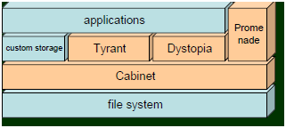

图 10 Tokyo Products

###  TC实现

TC:  database library. (libtokyocabinet.so)

支持各种storage方式。

*  hash   (hdb)
*  B+ tree   (bdb)
*  array: fixed-len  (adb)
*  table (tdb)
*  …

 

Eg.,  B+tree db object:

 tcbdbopen, tcbdbput2, tcbdbget2, #tcbdbcurnew, tcbdbclose

 

测试程序：(perl, Ruby…)

http://1978th.net/tokyocabinet/perldoc/#example

 

**Example Code:** 

```c
// Makefile: gcc tctest.c  -ltokyocabinet
#include <tcutil.h>
#include <tchdb.h>
#include <stdlib.h>
#include <stdbool.h>
#include <stdint.h>
int main(int argc, char **argv)
{
        TCHDB *hdb;
        int ecode;
        char *key, *value;
        /* create the object */
        hdb = tchdbnew();
        /* open the database */
        if(!tchdbopen(hdb, "casket.hdb", HDBOWRITER | HDBOCREAT)) {
                ecode = tchdbecode(hdb);
                fprintf(stderr, "open error: %s￥n", tchdberrmsg(ecode));
        }
        /* store records */
        if(!tchdbput2(hdb, "foo", "hop") ||
            !tchdbput2(hdb, "bar", "step") ||
            !tchdbput2(hdb, "baz", "jump")) {
                ecode = tchdbecode(hdb);
                fprintf(stderr, "put error: %s￥n", tchdberrmsg(ecode));
        }
        /* retrieve records */
        value = tchdbget2(hdb, "foo");
        if(value) {
                printf("%s￥n", value);
                free(value);
        } else {
                ecode = tchdbecode(hdb);
                //fprintf(printf(stderr, "get error: %s/n", tchdberrmsg(ecode));
                }
                /* traverse records */
                tchdbiterinit(hdb);
        while((key = tchdbiternext2(hdb)) != NULL) {
                value = tchdbget2(hdb, key);
                if(value) {
                        printf("%s:%s￥n", key, value);
                        free(value);
                }
                free(key);
        }
        /* close the database */
        if(!tchdbclose(hdb)) {
                ecode = tchdbecode(hdb);
                fprintf(stderr, "close error: %s￥n", tchdberrmsg(ecode));
        }
        /* delete the object */
        tchdbdel(hdb);
        return 0;
}

```


###  TT实现

TT:  database server

## 3.4   MongoDB

MongoDB 是由C++语言编写的，是一个基于分布式文件存储的开源数据库系统。**MongoDB****只支持对单行记录的原子性修改，并不支持对多行数据的原子操作。**

### 3.4.1   存储结构

MongoDB3.0引入了插件式存储引擎API，为第三方的存储引擎厂商加入MongoDB提供了方便，这一变化无疑参考了MySQL的设计理念。

   

图 11 mongodb插件式存储引擎

**备注：****1.** MMAP是MongoDB的原生存储引擎，有以下缺陷：耗费磁盘空间和内存空间且难以清理，库级别锁。
2. WiredTiger：收购存储引擎厂商WiredTiger，将WiredTiger存储引擎集成进3.0版本（仅在64位版本中提供）。支持文档级别并发控制；磁盘数据压缩。

 

**存储结构**

MongoDB的数据目录下主要存储有：预写日志(journal)、集合的数据（collection）、集合的索引（index）。

 

 

   

图 12 MongoDB数据文件内部结构

说明：Collection -- Extent -- Doc

*  MongoDB在数据存储上按命名空间来划分，一个Collection是一个命名空间，一个索引也是一个命名空间

*  同一个命名空间的数据被分成很多个Extent，Extent之间使用双向链表连接

*  在每一个Extent中，保存了具体每一行的数据，这些数据也是通过双向链接连接的

*  每一行数据存储空间不仅包括数据占用空间，还可能包含一部分附加空间，这使得在数据update变大后可以不移动位置

*  索引以BTree结构实现

 

MongoDB的逻辑结构是一种层次结构，主要由：文档(Document)、集合(Collection)、数据库(database)这三部分组成。

*  MongoDB的文档(Document)，相当于关系数据库中的一行记录。

*  多个文档组成一个集合(Collection)，相当于关系数据库的表。

*  多个集合(Collection)，扩及上组织在一起，就是数据库(database)。

*  一个MongoDB实例支持多个数据库(database)。

 

### 3.4.2   集群架构

**集群组件**

*  单机实例(mongod instance)：只有一个单机实例，客户端与其直接连接使用。 

*  副本集(Replica sets)：至少3个节点组成（一主多从）。其中一个是主节点，负责处理客户端请求，其余的都是从节点，负责复制主节点上的数据。 

*  分片(Sharding)：将一个集合的数据分别存储在不同的shard节点上减轻单机压力。

*  路由服务器(mongos)：负责把对应的数据请求请求转发到对应的shard服务器上mongos，相当于一个负载均衡器。

*  配置服务器(mongos)：存储所有数据库元信息（路由、分片）的配置。mongos本身没有物理存储分片服务器和数据路由信息，只是缓存在内存里，配置服务器则实际存储这些数据。

 

   

图 13 mongodb集群架构

单机mongod 组成副本集 -> 分片, 客户端通过mongos 读取 config servers的信息与分片通信，客户端程序感觉不到集群的存在，他只需要知道mongos服务器的ip和连接方式，至于它有多少个集群ip 都不需要关注，mongos 会自动选择。

 

   

图 14 MongoDB分片集群结构

上图中主要有如下所述三个主要组件：
*  Shard: 用于存储实际的数据块，实际生产环境中一个shard server角色可由几台机器组个一个replica set承担，防止主机单点故障 
*  Config Server: mongod实例，存储了整个 ClusterMetadata，其中包括 chunk信息。 
*  Query Routers: 前端路由，客户端由此接入，且让整个集群看上去像单一数据库，前端应用可以透明使用。


### 3.4.3   MongoDB GridFS

GridFS 用于存储和恢复那些超过16M（BSON文件限制）的文件(如：图片、音频、视频等)。

GridFS 也是文件存储的一种方式，但是它是存储在MonoDB的集合中。

GridFS 可以更好的存储大于16M的文件。

GridFS 会将大文件对象分割成多个小的chunk(文件片段),一般为256k/个,每个chunk将作为MongoDB的一个文档(document)被存储在chunks集合中。

GridFS 用两个集合来存储一个文件：fs.files与fs.chunks。

每个文件的实际内容被存在chunks(二进制数据)中,和文件有关的meta数据(filename,content_type,还有用户自定义的属性)将会被存在files集合中。 

 

## 3.5   Neo4j

[Neo4j](https://baike.baidu.com/item/Neo4j)是一个高性能的,NOSQL图形数据库，它将结构化数据存储在网络上而不是表中。它是一个[嵌入式](https://baike.baidu.com/item/嵌入式/575465)的、基于[磁盘](https://baike.baidu.com/item/磁盘/2842227)的、具备完全的事务特性的Java持久化引擎，但是它将结构化数据存储在网络(从数学角度叫做图)上而不是表中。Neo4j也可以被看作是一个高性能的图引擎，该引擎具有成熟数据库的所有特性。程序员工作在一个面向对象的、灵活的网络结构下而不是严格、静态的表中——但是他们可以享受到具备完全的事务特性、企业级的数据库的所有好处。

### 3.5.1   存储结构

数据存储主要分为节点、关系、节点或关系上属性这三类数据存储，这些数据也可以通过Lucene进行存储检索。

**node****，relationship****，property****存储都是固定大小的。**

   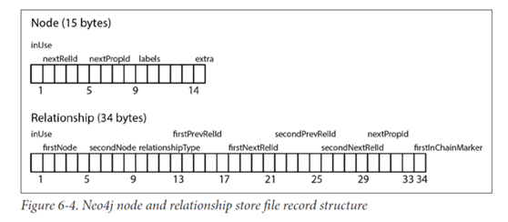

图 15 Neo4j数据存储结构

 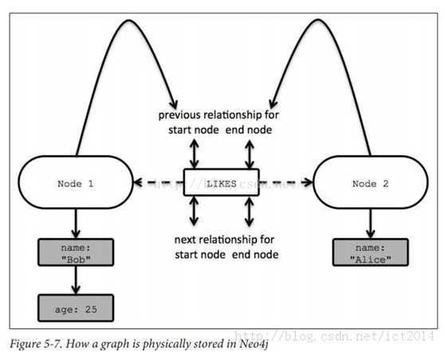

表格 6 Neo4j数据存储说明

| 组件 | 长度bytes | 存储文件                      | 简介     |
| ---- | --------- | ----------------------------- | -------- |
| 节点 | 15        | neostore.nodestore.db         |          |
| 关系 | 34        | neostore.relationshipstore.db | 双向链表 |
| 属性 |           | neostore.propertystore.db     | 单向链表 |

 

   

图 16 Neo4j数据存储示例

*  节点包含指向关系链和属性链的第一个指针。

*  指向Label的指针，可能多个。

*  属性读取从单向链表的第一个开始

*  关系读取直接在双向链表中查找，直到找到想要的关系。

 

### 3.5.2   集群架构

   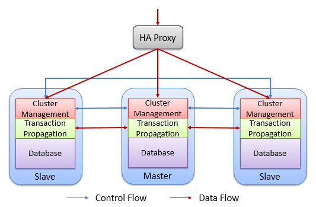

图 17 Neo4J集群的架构

每个Neo4J集群都包含一个Master和多个Slave。该集群中的每个Neo4J实例都包含了图中的所有数据。

## 3.6   OrientDB

OrientDB是处理文档，图形和传统数据库组件（如模式和关系）的NoSQL数据库技术。OrientDB是第一个多模型开源NoSQL DBMS，将图形的功能和文档的灵活性集成到可扩展的高性能操作数据库中。

### 3.6.1   存储结构

   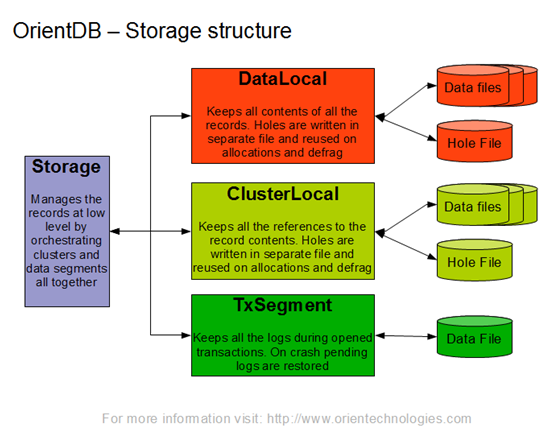

图 18 OrientDB存储结构

 

## 3.7   本章参考

[1].    Redis两种持久化方式(RDB&AOF) https://www.cnblogs.com/tdws/p/5754706.html

[2].    Redis协议规范(RESP) https://www.cnblogs.com/tommy-huang/p/6051577.html

[3].    tokyocabinet  http://1978th.net/tokyocabinet/tokyoproducts.pdf

[4].    MongoDB架构图解 https://blog.csdn.net/yujin2010good/article/details/53794305 

[5].    MongoDB集群架构分析 https://blog.csdn.net/zhu2mu/article/details/54970832 

[6].    图形数据库Neo4J简介 https://www.cnblogs.com/loveis715/p/5277051.html 

[7].    主流图数据库Neo4J、ArangoDB、OrientDB综合对比：架构分析 https://www.jianshu.com/p/6cab7a150755 

[8].    OrientDB https://orientdb.com/ 

[9].    OrientDB教程 https://www.w3cschool.cn/orientdb/ 

# 4       NewSQL

## 4.1   Gauss/libra (Huawei)

FusionInsight LibrA是企业级的大规模并行处理关系型数据库。FusionInsight LibrA采用MPP(Massive Parallel Processing)架构，支持行存储与列存储，提供PB(Petabyte，2的50次方字节)级别数据量的处理能力。

### 4.1.1   架构

   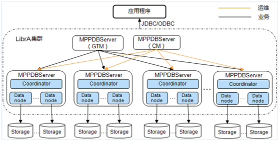

图 19 LibrA结构

备注：外部应用程序可通过JDBC/ODBC直接访问CN节点（或者通过负载均衡组件提供统一对外地址）。CM只提供给运维使用。

 


 

### 4.1.2   查询流程 

作为关系型数据库系统，LibrA主要业务为数据的查询与存储。LibrA进行数据查询的流程如[图3](http://localhost:7890/pages/YZH07284/01/YZH07284/01/resources/zh-cn_topic_0085587885.html?ft=0&fe=10&hib=2.2.1.2&id=ZH-CN_TOPIC_0085587885#ZH-CN_TOPIC_0085587885__f478a3a11cca840bbb937a6708bc6c661)所示。

**图****3** 数据查询流程
    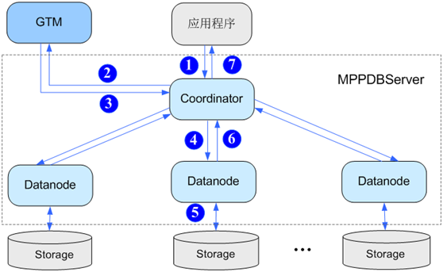

具体查询流程如下：

1.       用户通过应用程序发出查询本地数据的SQL请求到Coordinator。 

2.       Coordinator接收用户的SQL请求，分配服务进程，向GTM请求分配全局事务信息。 

3.       GTM接收到Coordinator的请求，返回全局事务信息给Coordinator。 

4.       Coordinator根据数据分布信息以及系统元信息，解析SQL为查询计划树，从查询计划树中提取可以发送到Datanode的执行步骤，封装成SQL语句或者子执行计划树，发送到Datanode执行。 

5.       Datanode接收到读取任务后，查询具体Storage上的本地数据块。 
6.       Datanode任务执行后，将执行结果返回给Coordinator。 
7.       Coordinator将查询结果通过应用程序返回给用户。

 

## 4.2   Tidb

TiDB 是 PingCAP 公司设计的开源分布式 HTAP (Hybrid Transactional and Analytical Processing) 数据库，结合了传统的 RDBMS 和 NoSQL 的最佳特性。TiDB 兼容 MySQL，支持无限的水平扩展，具备强一致性和高可用性。TiDB 的目标是为 OLTP (Online Transactional Processing) 和 OLAP (Online Analytical Processing) 场景提供一站式的解决方案。

TiDB 是一款定位于在线事务处理/在线分析处理（ HTAP: Hybrid Transactional/Analytical Processing）的融合型数据库产品，实现了一键水平伸缩，强一致性的多副本数据安全，分布式事务，实时 OLAP 等重要特性。同时兼容 MySQL 协议和生态，迁移便捷，运维成本极低。

2016 年 12 月 23 日，分布式关系型数据库 TiDB 正式发布 RC1。

### 4.2.1   架构

 

   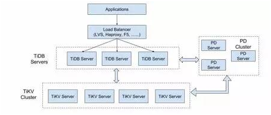

图 20 TiDB 的整体架构

一个 TiDB 集群由不同的模块组成，包括：TiDB 服务器、TiKV 服务器、Placement Driver (PD) 服务器。

**节点说明：**
*  TiDB Servers：负责接收 SQL 请求，处理 SQL 相关的逻辑，并通过 PD 找到存储计算所需数据的 TiKV 地址，与 TiKV 交互获取数据，最终返回结果。无状态的节点，本身并不存储数据，只负责计算，可以无限水平扩展。可以通过负载均衡组件对外提供统一地址。
*  TiKV Cluster：负责存储数据，从外部看 TiKV 是一个分布式的提供事务的 Key-Value 存储引擎。存储数据的基本单位是 Region，每个 Region 负责存储一个 Key Range（从 StartKey 到 EndKey 的左闭右开区间）的数据，每个 TiKV 节点会负责多个 Region。。TiKV 使用 Raft 协议做复制，保持数据的一致性和容灾。副本以 Region 为单位进行管理，不同节点上的多个 Region 构成一个 Raft Group，互为副本。数据在多个 TiKV 之间的负载均衡由 PD 调度，这里也是以 Region 为单位进行调度。
*  PD Server：类似Zookeeper。整个集群的管理模块，其主要工作有三个：一是存储集群的元信息（某个 Key 存储在哪个 TiKV 节点）；二是对 TiKV 集群进行调度和负载均衡（如数据的迁移、Raft group leader 的迁移等）；三是分配全局唯一且递增的事务 ID。一般部署奇数个节点（推荐3）。

用户的 SQL 请求会直接或者通过 Load Balancer 发送到 tidb-server，tidb-server 会解析 MySQL Protocol Packet，获取请求内容，然后做语法解析、查询计划制定和优化、执行查询计划获取和处理数据。数据全部存储在 TiKV 集群中，所以在这个过程中 tidb-server 需要和 tikv-server 交互，获取数据。最后 tidb-server 需要将查询结果返回给用户。

### 4.2.2   查询流程 

 

## 4.3   本章参考

[1].    https://www.pingcap.com/

[2].    https://www.pingcap.com/docs-cn/

[3].    《TiDB 原理与实战》

# 5       OLAP（开源）

## 5.1   GreenPlum (Pivotal/EMC)

Pivotal公司成立于2003年，2006年推出了首款产品，其主营业务关注在数据仓库和商业智能方面，Greenplum DW/BI软件可以在虚拟化x86服务器上运行无分享（shared-nothing）的大规模并行处理（MPP）架构。2010年被EMC收购。

两款产品：GreenPlum、HAWQ

 

### 5.1.1   Pivotal

   

图 21 GreenPlum架构

 

### 5.1.2   HAWQ

Pivotal的SQL on Hadoop方案是基于10多年来产品开发的成果价值，即投资研发Greenplum Database——Pivotal的旗舰分析数据仓库。Pivotal正是利用这一代码基础和深度数据管理专业知识来构建了业内最好的SQL on Hadoop企业引擎。

HAWQ，全称Hadoop With Query（带查询Hadoop）。HAWQ使企业能够获益于经过锤炼的基于MPP的分析功能及其查询性能，同时利用Hadoop堆栈。

 

HAWQ的历史和现状
1. 想法和原型系统（2011）：GOH阶段（Greenplum Database On HDFS）。
2. HAWQ 1.0 Alpha（2012）：多个国外大型客户试用，当时客户性能测试是Hive的数百倍。促进了HAWQ 1.0作为正式产品发布。
3. HAWQ 1.0 GA（2013年初）：改变了传统MPP数据库架构，包括事务，容错，元数据管等。
4. HAWQ 1.X版本（2014-2015 Q2）：增加了一些企业级需要的功能，比如Parquet存储，新的优化器，Kerberos，Ambari安装部署。客户覆盖全球。
5. HAWQ 2.0 Alpha发布并成为Apache孵化器项目：针对云环境的系统架构重新设计，数十个高级功能，包括弹性执行引擎，高级资源管理，YARN集成，秒级扩容等等。现在大家在Apache开源的是最新的2.0 Alpha版本。未来的开发都在Apache进行。

 

   

图 22 Pivotal的SQL on Hadoop方案

 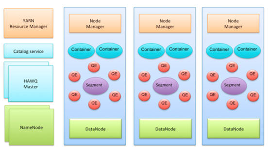

   

图 23 HAWQ系统架构

HAWQ集群的主要组件：其中有几个Master节点：包括HAWQ master节点，HDFS master节点NameNode，YARN master节点ResourceManager。每个Slave节点上部署有HDFS DataNode，YARN NodeManager以及一个HAWQ Segment。HAWQ Segment在执行查询的时候会启动多个QE (Query Executor, 查询执行器)。

 

## 5.2   Impala (Cloudara)

Impala是用于处理存储在Hadoop集群中的大量数据的MPP（大规模并行处理）SQL查询引擎，由Cloudera公司主导开发。 它是一个用C ++和Java编写的开源软件。 

与其他Hadoop的SQL引擎相比，它提供了高性能和低延迟。宣称比原来基于MapReduce的HiveSQL查询速度提升3~90倍，且更加灵活易用。提供类SQL的查询语句，能够查询存储在Hadoop的HDFS和Hbase中的PB级大数据。查询速度快是其最大的卖点。

### 5.2.1   架构

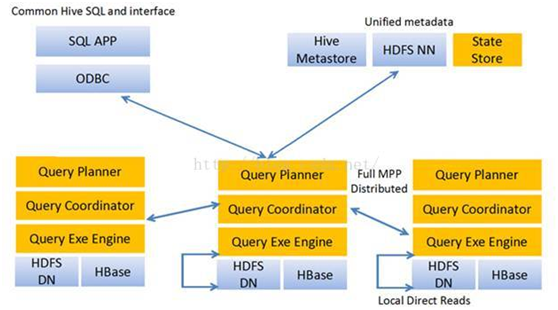

 

图 24 Impala架构图

位于Datanode上的每个impalad进程，都具有Query Planner, Query Coordinator, Query Exec Enginer这几个组件，每个impala节点在功能上是对等的。

 

Impala由Impalad，State Store，CLI组成：

*  Impalad：是impala的核心进程，与Datanode在同一个节点上，接受客户端的查询请求(接受查询请求的impalad为Coordinator，Coordinator通过JNI调用java前端解释SQL查询语句，生成查询计划树，再通过调度器吧执行计划分发给具有相应数据的其他impalad执行)，读写数据，并行执行查询，并把结果通过网络流式传给Coordinator，有Coordinator返回给客户端。同时impalad也与statestore保持连接，用于确定哪些impalad的健康的是可以执行新任务的。

*  State Store：类似Zookeeper。跟踪集群中的impalad的健康状态及位置信息，并不断把健康状况发送给所有的impalad进程节点。一旦某个impala节点不可用，State Store确保将这一信息及时传达到所有的impalad进程节点，当有新的查询请求时，Impalad进程节点不会把查询请求发送到不可用的节点上。State Store通过创建多个线程来处理Impalad的注册订阅和与各个Impalad保持心态连接。值得注意的是，statestore并非关键进程，即使不可用，Impalad进程节点间仍然可以相互协调正常对外提供分布式查询。

*  CLI：用户查询的命令行共组，还提供了Hue、JDBC、ODBC等接口。

*  Meta Store: Impala使用传统的MySQL、PostgreSQL或Hive来存储表定义。 诸如表和列信息和表定义的重要细节存储在称为元存储的集中式数据库中。

 

### 5.2.2   查询流程 

   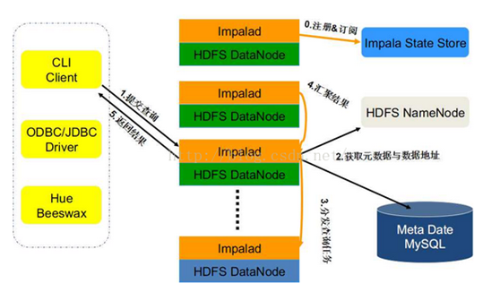

图 25 impala查询处理过程

Impalad分为Java前端与C++处理后端，接受客户端连接的Impalad即作为这次查询的Coordinator，Coordinator通过JNI调用Java前端对用户的查询SQL进行分析生成执行计划树，不同的操作对应不用的PlanNode,如：SelectNode， ScanNode， SortNode， AggregationNode， HashJoinNode等等。

执行计划树的每个原子操作由一个PlanFragment表示，通常一条查询语句由多个Plan Fragment组成， PlanFragment 0表示执行树的根，汇聚结果返回给用户，执行树的叶子结点一般是Scan操作，分布式并行执行。

Java前端产生的执行计划树以Thrift数据格式返回给ImpalaC++后端（Coordinator）（执行计划分为多个阶段，每一个阶段叫做一个PlanFragment，每一个PlanFragment在执行时可 以由多个Impalad实例并行执行(有些PlanFragment只能由一个Impalad实例执行,如聚合操作)，整个执行计划为一执行计划树），由 Coordinator根据执行计划，数据存储信息（Impala通过libhdfs与HDFS进行交互。通过hdfsGetHosts方法获得文件数据 块所在节点的位置信息），通过调度器（现在只有simple-scheduler, 使用round-robin算法）Coordinator::Exec对生成的执行计划树分配给相应的后端执行器Impalad执行（查询会使用LLVM 进行代码生成，编译，执行。

## 5.3   Presto (Facebook)

Facebook也是Hive的初始开发者。

Presto 是 Facebook 推出的一个基于Java开发的大数据分布式 SQL 查询引擎，可对从数 G 到数 P 的大数据进行交互式的查询，查询的速度达到商业数据仓库的级别，据称该引擎的性能是 Hive 的 10 倍以上。Presto 可以查询包括 Hive、Cassandra 甚至是一些商业的数据存储产品，单个 Presto 查询可合并来自多个数据源的数据进行统一分析。

 

### 5.3.1   架构

   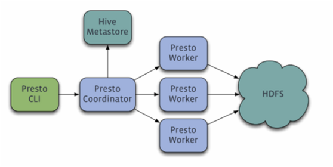

图 26 Presto架构

Presto查询引擎是一个Master-Slave的架构，由下面三部分组成: 

*  一个Coordinator节点
*  一个Discovery Server节点
*  多个Worker节点

 

节点说明：  

*  Coordinator: 负责解析SQL语句，生成执行计划，分发执行任务给Worker节点执行 
*  Discovery Server: 通常内嵌于Coordinator节点中 
*  Worker节点: 负责实际执行查询任务,负责与HDFS交互读取数据。
*  节点间交互： Worker节点启动后向Discovery Server服务注册，Coordinator从Discovery Server获得可以正常工作的Worker节点。如果配置了Hive Connector，需要配置一个Hive MetaStore服务为Presto提供Hive元信息


### 5.3.2   查询流程 

   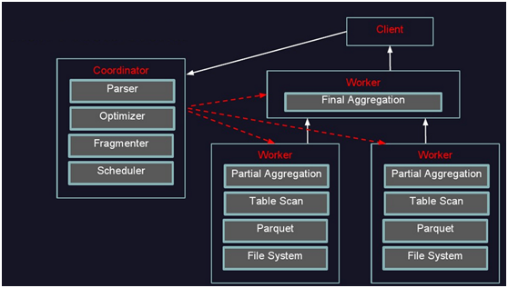

图 27 Presto执行过程示意图

用户使用Presto Cli提交一个查询语句后，Cli使用HTTP协议与Coordinator通信，Coordinator收到查询请求后调用SqlParser解析SQL语句得到Statement对象，并将Statement封装成一个QueryStarter对象放入线程池中等待执行。

 

## 5.4   Pinot (LinkedIn)

Pinot 是一个实时分布式的 OLAP 数据存储和分析系统。LinkedIn 使用它实现低延迟可伸缩的实时分析。Pinot 从离线数据源（包括 [Hadoop](http://www.oschina.net/p/hadoop) 和各类文件）和在线数据源（如 [Kafka](http://www.oschina.net/p/kafka)）中攫取数据进行分析。Pinot 被设计是可以进行水平扩展的。

### 5.4.1   架构

   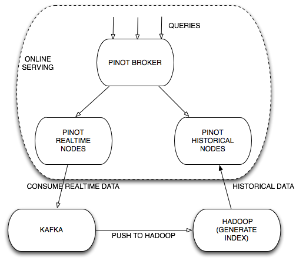

图 28 Pinot 的组件架构


   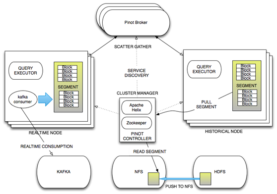

图 29 Pinot组件架构图

整个系统利用Apache Helix作为集群的管理，还利用了Zookeeper存储集群的状态，同时保存Helix和Pinot的配置。

## 5.5   Kylin

Kylin来自 eBay 的中国人韩卿 [@lukehq](https://twitter.com/lukehq) 领导的团队开发的一个 OLAP 分析引擎，这是 ebay 历史上第一次开源并贡献给 apache 基金会的项目。Kylin于2014年10月在github开源，并很快在2014年11月加入Apache孵化器，于2015年11月正式毕业成为Apache顶级项目，也成为首个完全由中国团队设计开发的Apache顶级项目。

2016年3月，Apache Kylin核心开发成员在上海创建Kyligence公司，力求更好地推动项目和社区的快速发展。2016年4月，大数据公司Kyligence 跬智科技宣布获得了数百万美元的天使轮投资。

### 5.5.1   架构

Apache Kylin™是一个开源的分布式分析引擎，提供Hadoop/Spark之上的SQL查询接口及多维分析（OLAP）能力以支持超大规模数据，最初由eBay Inc. 开发并贡献至开源社区。它能在亚秒内查询巨大的Hive表。

   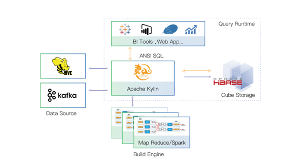

图 30 kylin部署架构

说明：数据源有hive/kafka；cube存储引擎缺省为hbase；cube构建引擎使用spark/MR；kylin元数据缺省存储在hbase，也可选mysql等。

 

   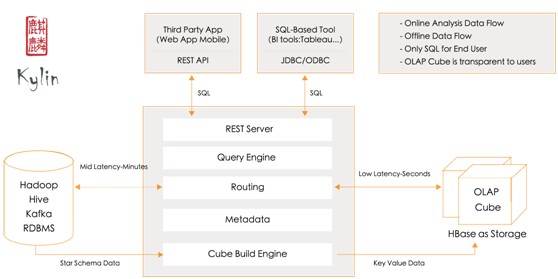

图 31 Kylin应用架构之组件（插件化）

说明：
*  REST Server：提供一些restful接口，例如创建cube、构建cube、刷新cube、合并cube等cube的操作，project、table、cube等元数据管理、用户访问权限、系统配置动态修改等。除此之外还可以通过该接口实现SQL的查询，这些接口一方面可以通过第三方程序的调用，另一方也被kylin的web界面使用。
*  jdbc/odbc接口：kylin提供了jdbc的驱动，驱动的classname为org.apache.kylin.jdbc.Driver，使用的url的前缀jdbc:kylin:，使用jdbc接口的查询走的流程和使用RESTFul接口查询走的内部流程是相同的。这类接口也使得kylin很好的兼容tebleau甚至mondrian。
*  Query引擎：kylin使用一个开源的Calcite框架实现SQL的解析，相当于SQL引擎层。
*  Routing：该模块负责将解析SQL生成的执行计划转换成cube缓存的查询，cube是通过预计算缓存在hbase中，这部分查询是可以再秒级甚至毫秒级完成，而还有一些操作使用过查询原始数据（存储在hadoop上通过hive上查询），这部分查询的延迟比较高。
*  Metadata：kylin中有大量的元数据信息，包括cube的定义，星状模型的定义、job的信息、job的输出信息、维度的directory信息等等，元数据和cube都存储在hbase中，存储的格式是json字符串，除此之外，还可以选择将元数据存储在本地文件系统。
*  Cube构建引擎：这个模块是所有模块的基础，它负责预计算创建cube，创建的过程是通过hive读取原始数据然后通过一些mapreduce计算生成Htable然后load到hbase中。

   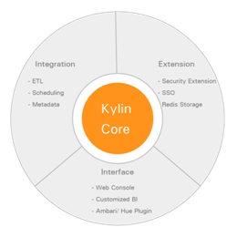

图 32 Kylin 生态圈

说明：
*  Kylin 核心: Kylin OLAP引擎基础框架，包括元数据（Metadata）引擎，查询引擎，Job引擎及存储引擎等，同时包括REST服务器以响应客户端请求
*  扩展: 支持额外功能和特性的插件
*  整合: 与调度系统，ETL，监控等生命周期管理系统的整合
*  用户界面: 在Kylin核心之上扩展的第三方用户界面
*  驱动:ODBC 和 JDBC 驱动以支持不同的工具和产品，比如Tableau


### 5.5.2   KAP

 

### 5.5.3   Kyligence Cloud

使用 Kyligence Cloud，用户可以在公有云（如微软 Azure, 亚马逊 AWS，阿里云等）上快速建立大数据分析集群，接入各种云端数据源并进行建模分析，实现对 PB 级数据的交互式 OLAP 分析与关键业务查询的亚秒级响应。

   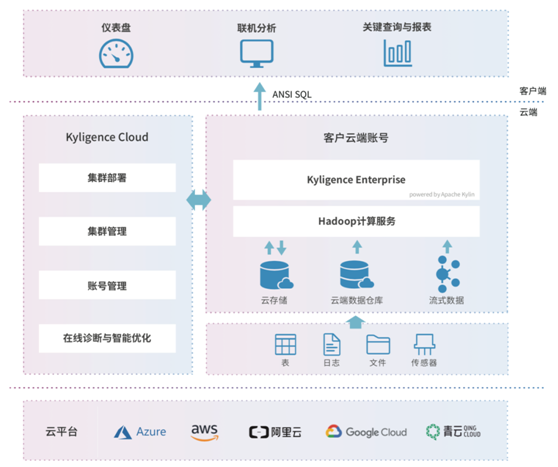

图 33 Kyligence Cloud 的架构图

说明：1. Hadoop / Spark 集群、Kyligence Enterprise、KyAnalyzer 是随需启动的服务，与您的集群具有相同的生命周期。云存储和元数据则具有更长的持久性，当集群停止时，它们不会被删除。

\2. 表结构、Cube 模型等元数据存储在您帐户下的 RDS 或 SQL Server 实例中，Cube 数据会保存在 S3、 Azure blob store 或 OSS 中。

 

## 5.6   ClickHouse (Yandex)

ClickHouse是一个开源的面向列式数据的数据库管理系统，能够使用SQL查询并且生成实时数据报告。

**应用场景：**

1.绝大多数请求都是用于读访问的

2.数据需要以大批次（大于1000行）进行更新，而不是单行更新；或者根本没有更新操作

3.数据只是添加到数据库，没有必要修改

4.读取数据时，会从数据库中提取出大量的行，但只用到一小部分列

5.表很“宽”，即表中包含大量的列

6.查询频率相对较低（通常每台服务器每秒查询数百次或更少）

7.对于简单查询，允许大约50毫秒的延迟

8.列的值是比较小的数值和短字符串（例如，每个URL只有60个字节）

9.在处理单个查询时需要高吞吐量（每台服务器每秒高达数十亿行）

10.不需要事务

11.数据一致性要求较低

12.每次查询中只会查询一个大表。除了一个大表，其余都是小表

13.查询结果显著小于数据源。即数据有过滤或聚合。返回结果不超过单个服务器内存大小

 

**不适用场景（使用限制）**

1.不支持真正的删除/更新支持，不支持事务（事务性工作OLTP）

2.不支持二级索引

3.有限的SQL支持，join实现与众不同

4.不支持窗口功能

5.元数据管理需要人工干预维护

6.高并发的键值访问

7. Blob或者文档存储

 

## 5.7   本章参考

[1].    Greenplum 数据库架构分析及5.x新功能分享  http://blog.sina.com.cn/s/blog_12c856e4c0102yhek.htm*  

[2].    [Apache Kylin](http://kylin.apache.org)  http://kylin.apache.org 

[3].    [kylinpy on Github](https://github.com/Kyligence/kylinpy)

[4].    [Superset:Airbnb’s data exploration platform](https://medium.com/airbnb-engineering/caravel-airbnb-s-data-exploration-platform-15a72aa610e5)

[5].    http://kyligence.io

[6].    http://docs.kyligence.io/  

[7].    Kyligence Cloud  http://docs.kyligence.io/books/cloud/zh-cn/overview/architecture.cn.html 

[8].    impala的原理架构介绍及应用场景 https://blog.csdn.net/javajxz008/article/details/50523332 

[9].    Presto架构及原理 https://www.cnblogs.com/tgzhu/p/6033373.html 

[10].LinkedIn Pinot初探 https://blog.talkingdata.net/?p=3169  

[11].Pinot架构介绍 https://www.jianshu.com/p/67a9156f041a

[12].clickhouse 基础知识 https://www.jianshu.com/p/a5bf490247ea 

 

# 6       OLAP（商业付费）

Tera~简写为T，10的12次方，这是Teradata的大数据。

Exa~简写为E，10的16次方，Oracle超越Teradata的野心。 

 

软硬机一体机出现的场景是：大数据分析时，需要将大容量数据从磁盘读到内存，再作WHERE过滤后只返回部分数据，这时读数据的过程占了很大时间。因此出现了一体机智能扫锚数据，大大减少了需要传输的数据量。

 

## 6.1   IQ (Sybase/SAP)

1984年，Mark B. Hiffman和Robert Epstern创建了Sybase公司，并在1987年推出了Sybase数据库产品。

Sybase IQ是Sybase公司推出的特别为数据仓库设计的关系型数据库，是第一个商用的列式数据库。

IQ的架构与大多数关系型数据库不同，特别的设计用以支持大量并发用户的即时查询。

*  ASA是Sybase OLTP数据库，行式存储。主要用于移动设备数据库，属于小型数据库产品。

*  IQ是Sybase OLAP和DSS的数据库，采用列式存储，适合数据仓库、数据集市等分析性应用，不符合并发压力大的联机场景。

 

**SAP Sybase IQ** **功能特性：** 
 海量存储（PB级）
 高压缩比 (5~100倍) 
 极速装载(Load：34T/h) 
 高性能查询
 丰富接口
 线性扩展(集群)
 列式计算
 极简运维

 **SAP Sybase IQ****应用场景：**  
 自助分析
 分布式数据集市
 数据仓库 
 报表查询(DSS)

 

### 6.1.1   IQ整体架构

   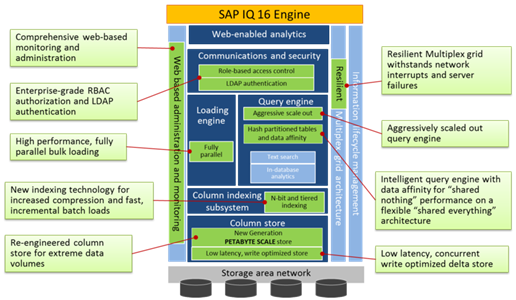

图 34 SAP IQ 16 Engine

 

   

图 35 SAP IQ Loading Engine

 

### 6.1.2   存储架构

   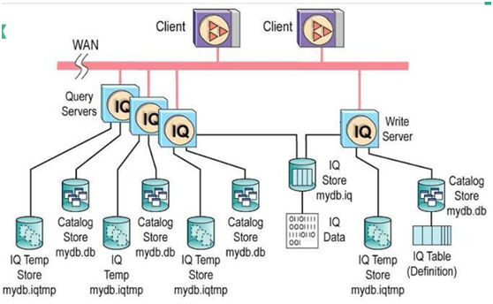

备注：图中mydb为示例的数据库名称。

一个数据库有一个或者多个实例，每一个实例有自己的元数据存储（mydb.db）、临时存储（mydb.iqtmp）、元数据事务日志（mydb.log）、服务器消息日志（mydb.iqmsg），一个写服务器实例和多个查询服务器实例共享一个IQ存储（mydb.iq）

*  IQ Main Store 数据表空间，通常是dbname.iq
*  Catalog Store 元数据表空间，通常是dbname.db
*  IQ Temporary Store 临时表空间，通常是dbname.iqtmp
*  IQ Message Log IQ信息日志文件(可以清理)，通常是dbname.iqmsg
*  Catalog Store Transaction Log 元数据事务日志文件，通常是dbname.log
*  IQ Server Logs IQ服务器日志，通常是00n.stderr 和00n.srvlog
*  Interfaces 接口文件，通常是$SYSBASE/interfaces

 

**元数据存储** **(xxx.db)**

元数据存储采用Sybase按行存储的数据库Sybase ASA，其数据库页面通常是4K (4096 byte)，其页面大小在建立数据库时指定。

通常元数据存储中包括如下系统表，完整的系统表列表可以参考SybaseIQ的产品手册：

SYSIQCOLUMN：数据库中的所有表和视图的字段信息；

SYSIQFILE：数据库操作系统文件列表；

SYSIQINDEX：数据库的索引信息；

SYSIQTABLE：数据库中的所有表和视图信息；

这些系统表数据可以通过DBISQL客户端或者 Sybase Central浏览。

 

**IQ****存储** **(xxx.iq)**

Sybase IQ的数据以压缩的索引方式存储在磁盘上的数据 ，也包括SybaseIQ的事务日志，采用(free list)方式管理分配空间，free list指明已经分配给IQ存储的磁盘页面。

 

## 6.2   HANA (SAP)

2010年SAP全球技术研发者大会上，SAP发布了SAP 高性能分析应用软件（SAP High-Performance Analytic Appliance ，简称SAP HANA），2011年则开始将成熟的产品和解决方案向全球推广,目前SAP HANA也是SAP历史上用户增长速度最为迅猛的产品之一。

SAP HANA是一款支持企业预置型部署和云部署模式的内存计算平台，提供高性能的数据查询功能，用户可以直接对大量实时业务数据进行查询和分析，而不需要对业务数据进行建模、聚合等。

SAP HANA是在Sybase(SAP收购的数据库软件)的基础上开发的基于内存的列数据库，加上内存和存储设备的硬件。

HANA的[内存数据库](https://baike.baidu.com/item/内存数据库)（SAP In-Memory Database, IMDB）是其重要组成部分，包括数据库服务器(In-Memory Database Server)、建模工具（Studio）和客户端工具（ODBO、JDBC、ODBC、SQLDBC等）。HANA的计算引擎（Computing Engine）是其核心，负责解析并处理对大量数据的各类CRUDQ操作，支持SQL和MDX语句、SAP和non-SAP数据。

 

   

图 36 HANA软件架构

最下层是SAP ECC、BW及其它非SAP数据源，通过Data Services和Modeling Studio把数据导入HANA，通过Replication Services写到磁盘，，通过HANA计算引擎处理数据插入和查询等操作。HANA是一个平台，在这个平台之上可以是BO、BW，以及其它产品。

 

## 6.3   Oracle Exadata

**版本历史**

2000~2005，SAGE（网格环境存储设备）--HP的硬件和Oracle软件。

2008年，与HP合作，推出Oracle Exadata X1（定位为数据仓库平台），基本没商用。

2009年9月宣布：推出世界上第一个OLTP数据库机——Sun Oracle数据库机（即Oracle Exadata X2即第二版）。2009年12年，Oracle用74亿美元收购SUN。X2-2定位为大型OLTP系统。 

2012年，发布Exadata X3。

​      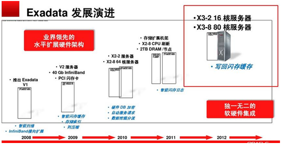

 

### 6.3.1   软件架构

Oracle Exadata 是核心由Database Machine（数据库服务器） 与 Exadata Storage Server （存储服务器） 组成的一体机硬件平台。运行在exadata的软件核心为Oracle数据库和 Exadata Cell软件，分别对应着ORACLE 11g软件和存储管理软件。

可以将Exadata划分为两部分，即存储层和数据库层，两层使用infiniband网络来连接，使用iDB协议进行通信
*  数据库层：多个sun服务器组成，运行Oracle 11g R2软件，RAC不是必须的，当通常会配置成一个或者多个RAC集群，使用ASM来管理存储(ASM是必须的）。
*  存储层：也是多个sun服务器构成，每个存储服务器12块磁盘，运行Oracle存储服务器软件（cellsrv）。
*  infiniband：提供低延时、高宽带的管钱通信链路，也提供链路上的冗余和联结（bonding）
*  iDB协议：iDB用来将请求和请求的元数据（比如查询谓词where）传到存储服务器软件cellsrv中，通过cellsrv软件在存储中进行智能扫描到需要的数据，然后将最终的结果返回给数据库层，所以将大大减少传输到数据库层的数据量。当不能进行智能扫描时，cellsrv会返回整个Oracle数据块。iDB使用的是RDS协议，这是一种低延时的协议，跳过了内核调用。


 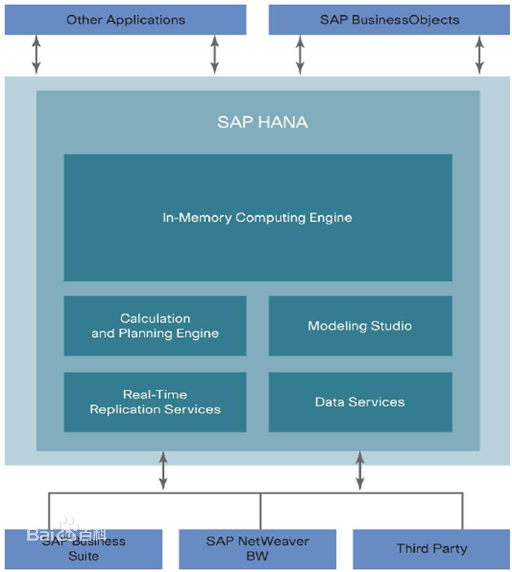

​    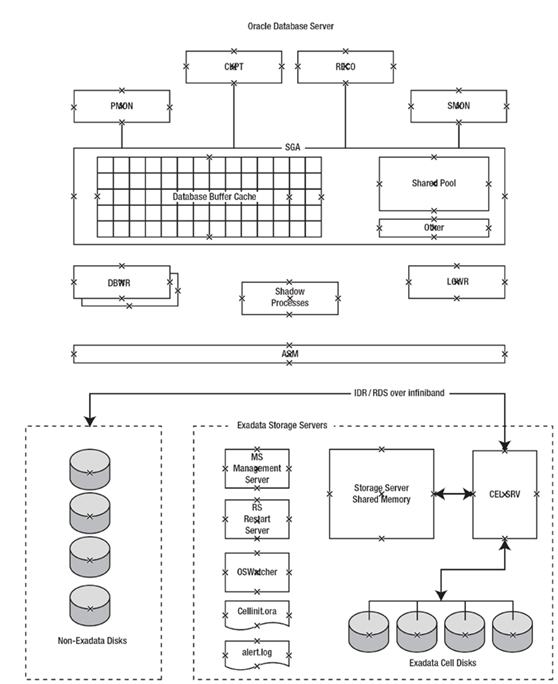

图 37 Oracle Exadata软件架构

上半部分是标准的Oracle 11g架构，显示了缓冲区和共享池的全局区（SGA），也显示了一些主要的进程。

下半部分显示一台存储服务器的组件，只有一个进程cellsrv来处理与数据库服务器之间的通信，还拥有一些少数的辅助进程和监控环境。

cellsrv使用init.ora以及alert.log文件，以及ADR（自动诊断信息库）。


图 38 Oracle Exadata软件架构2

 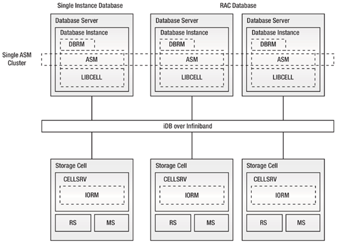

### 6.3.2   存储架构

Exadata的磁盘层次结构非常清晰，依次是Physical Disk→LUN→Cell Disk→Grid Disk →
 ASM Disk

  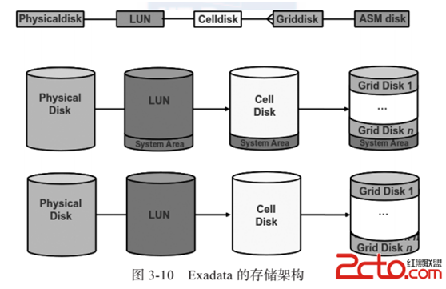

图 39 Exadata存储架构

上半部分表示操作系统所在的磁盘（一般为前2块磁盘）的架构；下半部分表示非操作系统盘的存储架构（剩余没有进行分区的10块盘）。

*  Grid Disk在RDBMS层面对应的是ASM disk，Grid Disk和ASM disk实际是同一个东西，但是分别站在Exadata Stroage和RDBMS的角度来看。

*  当前Cell Disk与Grid Disk的对应关系是一对多。

## 6.4   Teradata 

Teradata于2007年从其母公司NCR独立出来，是世界上最早提供数据仓库一体机的厂商。

### 6.4.1   Teardata Aster

2015年，数据存储设备厂商Teradata斥资2.63亿美元收购了非结构化数据处理工具软件厂商Aster Data Systems。　

Teradata Aster 大数据探索平台（Teradata Aster Discovery Platform），该平台是业内首个最全面的数据探索解决方案，拥有20多项全新的大数据分析能力，包括定制的可视化功能等。借助分析获得的洞察力，将促使企业通过改善客户关系、增加销售量来提升盈利能力。

 

### 6.4.2   架构

 

   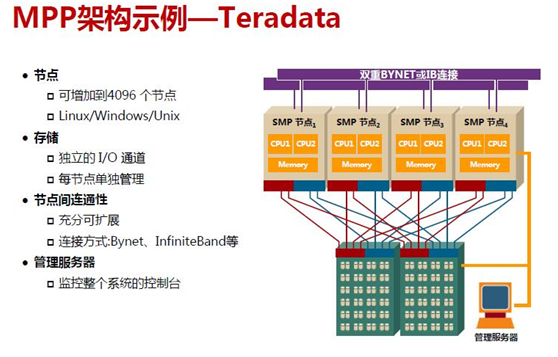

图 40 Teradata架构

 

### 6.4.3   查询流程

   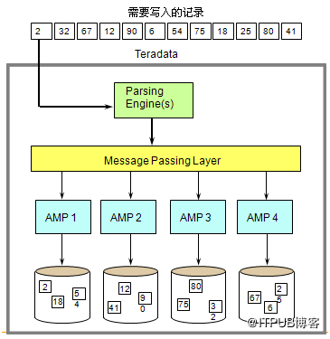

图 41 Teradata数据写取流程图

数据写取步骤

*  Parsing Engine分发需要写入的记录. 
*  Message Passing Layer确定应管理记录的AMP 
*  AMP将记录写入磁盘一个AMP管理一个逻辑存储单元      
*  virtual disk （它对应多个物理的存储单元）

 

   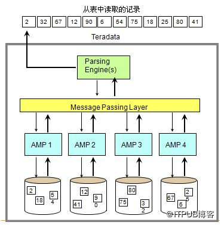

图 42 Teradata数据读取流程图

数据读取步骤
*  Parsing Engine将数据读取请求发送到处理单元     
*  Message Passing Layer确定要读取的记录属于哪个AMP管理  
*  AMP(s)定位要读取的记录的存储位置并读取.
*  Message Passing Layer将结果记录反馈到PE       
*  PE将结果记录反馈到请求端.

## 6.5   本章参考

[1].    impala教程 https://www.w3cschool.cn/impala/ 

[2].    [FusionInsight LibrA 产品文档](http://support.huawei.com/hedex/pages/EDOC1000157768YZG0630G/02/EDOC1000157768YZG0630G/02/resources/hedex-homepage.html) http://support.huawei.com/hedex/hdx.do?docid=EDOC1000157768&lang=zhSybase IQ体系结构  http://bbs.chinaunix.net/thread-990918-1-1.html 

[3].    列式数据库大PK:Sybase IQ和其他数据库 http://tech.hexun.com/2011-03-22/128100480.htm*  

[4].    Teradata架构 https://wenku.baidu.com/view/d378e5747fd5360cba1adbda.html 

[5].    SAP收购Sybase——软件行业垄断格局逐渐形成https://searchdatabase.techtarget.com.cn/microsite/7-22767/ 

[6].    Vertica: 基于DBMS架构的列存储数据仓库 https://blog.csdn.net/pelick/article/details/38480313 

[7].    HAWQ技术总结 https://www.cnblogs.com/liuzhongfeng/p/8241066.html 

[8].    SAP IQ http://infocenter.sybase.com/help/index.jsp 

[9].    Oracle Exadata体系笔记https://www.cnblogs.com/zhenxing/p/3905047.html 

# 7       时序数据库 TSDB 

## 7.1   Druio

### 7.1.1   架构

   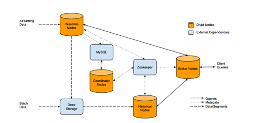

图 43 Druid架构v1

备注：v1包括四个接口，分别是RealTime、Historical、Coordnior仲裁、Broker。

   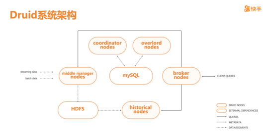

图 44 Druid架构v2

v1基础上增加二个节点overload和middle_manager。节点详述分别是

*  Coordnior 仲裁节点：主节点之一。

*  overload：主节点之一

*  Broker 代理：查询的接入节点。

*  Historical 历史：主要负责加载索引文件，同时提供历史数据的查询服务。

*  RealTime 实时：

*  Middle Manager：负责数据索引，生成索引文件。

存储：索引文件由Middle Manager负责写入到HDFS。MySQL存储元数据。

### 7.1.2   高性能

数据预聚合。

 

## 7.2   Prometheus

详见 《CNCF原生去框架分析》

## 7.3   InfluxDB

### 7.3.1   存储架构

   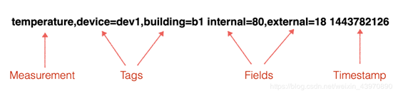

图 45 InfluxDB的数据模型

 

 

## 7.4   OpenTSDB

 

## 7.5   本章参考

[1].    快手万亿级实时 OLAP 平台的建设与实践 https://www.infoq.cn/article/IWfHmTig_KNAeEJKF8eS 

[2].    时序数据库连载系列：时序数据库那些事 https://blog.csdn.net/weixin_43970890/article/details/87916971

[3].    时序数据库连载系列: 时序数据库一哥InfluxDB之存储机制解析 https://blog.csdn.net/weixin_43970890/article/details/87938271 

[4].    时序数据库连载系列：指标届的独角兽Prometheus https://blog.csdn.net/weixin_43970890/article/details/87938347 

   

# 参考资料

**参考图书**

*  《Oracle Exadata技术详解》 https://book.2cto.com/201511/57548.html

 

**参考文档**

*  另作 《元数据分析》、《数据库技术》


# 附录

 