| 序号 | 修改时间   | 修改内容               | 修改人 | 审稿人 |
| ---- | ---------- | ---------------------- | ------ | ------ |
| 1    | 2017-01-27 | 创建                   | 吴启福 | 吴启福 |
| 2    | 2018-9-9   | 迁移出我的项目架构另文 | 同上   |        |
| 3    | 2019-4-21  | 增加游戏架构章节       | 同上   |        |
---

 

 

 

# 目录

目录

[目录... 1](#_Toc6783943)

[1       概述... 3](#_Toc6783944)

[1.1        名词术语... 3](#_Toc6783945)

[1.2        性能指标... 3](#_Toc6783946)

[1.3        常见技术体系概述... 3](#_Toc6783947)

[1.3.1         互联网公司的技术体系概述... 3](#_Toc6783948)

[1.3.2         互联网分层架构... 5](#_Toc6783949)

[1.4        本章参考... 5](#_Toc6783950)

[2       知名互联网公司的技术架构... 6](#_Toc6783951)

[2.1        百度baidu. 6](#_Toc6783952)

[2.1.1         百度开放平台... 6](#_Toc6783953)

[2.1.2         百度贴吧... 6](#_Toc6783954)

[2.1.3         百度媒体云... 8](#_Toc6783955)

[2.2        腾讯tencent 9](#_Toc6783956)

[2.2.1         微信... 9](#_Toc6783957)

[2.2.2         QQGame. 10](#_Toc6783958)

[2.2.3         QQ.. 11](#_Toc6783959)

[2.3        阿里巴巴alibaba. 13](#_Toc6783960)

[2.3.1         淘宝... 13](#_Toc6783961)

[2.3.2         淘宝云梯分布式计算平台... 13](#_Toc6783962)

[2.3.3         一淘etao. 14](#_Toc6783963)

[2.3.4         中间件：分布式任务调试服务SchedulerX.. 16](#_Toc6783964)

[2.4        新浪Sina. 16](#_Toc6783965)

[2.4.1         新浪微博... 16](#_Toc6783966)

[2.5        Wikipedia. 18](#_Toc6783967)

[2.6        Amazon. 19](#_Toc6783968)

[2.7        microsoft 21](#_Toc6783969)

[2.7.1         .NET Framework体系结构... 21](#_Toc6783970)

[2.8        本章参考... 21](#_Toc6783971)

[3       SearchEngine.搜索引擎架构... 21](#_Toc6783972)

[4       Database.数据库架构... 22](#_Toc6783973)

[5       云计算/大数据架构... 22](#_Toc6783974)

[6       网站架构... 22](#_Toc6783975)

[7       游戏架构... 22](#_Toc6783976)

[8       软件产品线架构... 22](#_Toc6783977)

[8.1        SNS社区的产品线架构... 23](#_Toc6783978)

[9       其它架构实例... 23](#_Toc6783979)

[9.1        秒杀系统... 23](#_Toc6783980)

[参考资料... 24](#_Toc6783981)

[附录... 24](#_Toc6783982)

 

---

 

# 1  概述

## 1.1   名词术语

QPS：Query Per Second 每秒请求数

 

## 1.2   性能指标

参见 《运维》相关章节

 

## 1.3   常见技术体系概述

运行平台架构：

*  面向资源：CPU、IO、MEMORY、NETWORK

*  面向服务：

 

### 1.3.1   互联网公司的技术体系概述

​       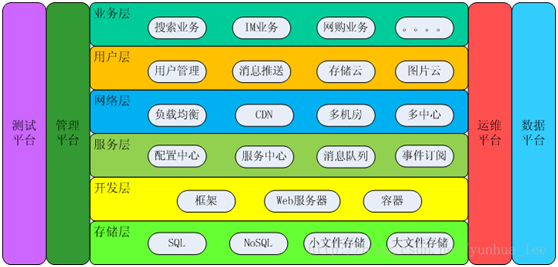                                           

图 1 互联网公司的通用技术体系

说明：
1. 存储层：
   * 小文件存储的特点是文件数量多（>千万级）、数据小（<1MB）和访问量巨大（亿级），如图片、网页等，通常小文件的存储可用开源分布式文件系统来实现，如hbase。
   * 大文件存储的特点是文件数据大（G缘）、数量小，如视频、日志。通常大文件的存储可用到开源分布式计算spark等。
2. 开发层：
   * 框架如各种流程的WEB框架，
   * WEB服务器如apache、nginx、tomcat等等。
   * 容器以docker为典型代表。
3. 服务层： 
   * 配置中心：集中管理各个系统的配置。最简单的设计如下，通过“系统标识 + host + port”来标识唯一一个系统运行实例。
   * 服务中心：解决跨系统依赖的“配置”和“调度”问题。服务中心的实现一般来说有两种方式：服务名字系统、服务总线系统。配置中心和服务中心是为了解决系统数量剧增、系统间依赖指数间增长的状况。 开源zooker是一个很好的服务发现的和集群管理工具。
   * 消息队列和事件订阅：为了实现这种跨系统异步通知而提供的中间件系统。其中消息队列用于“一对一”通知，事件订阅用于“一对多”广播。
4. 网络层：
   * 负载均衡就是将请求均衡的分配到多个系统上。
n  DNS是最简单的、也是最常见的负载均衡方式，一般用来实现地理级别的均衡。
n  Nginx&LVS&F5就是用于同一地点内机器级别的负载均衡。其中Nginx是软件的7层负载均衡，LVS是内核的4层负载均衡，F5是硬件做4层负载均衡。
   * CDN：全称是Content Delivery Network，即内容分发网络。其基本思路是尽可能避开互联网上有可能影响数据传输速度和稳定性的瓶颈和环节，使内容传输的更快、更稳定。
   * 多机房、多中心：多机房的主要目标是灾备，多中心必须以多机房为前提，但从设计的角度来看，多中心相比多机房是本质的飞越，难度也高出一个等级。
5. 用户层：
6. 业务层： 

 

### 1.3.2   互联网分层架构

   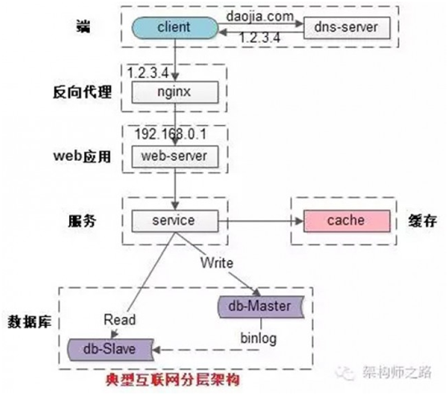

图 2 常见的互联网分层架构

常见互联网分布式架构如上，分为：

(1)客户端层：典型调用方是浏览器browser或者手机应用APP

(2)反向代理层：系统入口，反向代理（指以[代理服务器](https://baike.baidu.com/item/代理服务器)来接受internet上的连接请求，然后将请求转发给内部网络上的服务器，并将从服务器上得到的结果返回给internet上请求连接的客户端，此时代理服务器对外就表现为一个反向代理服务器）。反向代理器功能相当于一个中转服务器。

(3)WEB应用层：实现核心应用逻辑，返回html或者json

(4)服务层：如果实现了服务化，就有这一层

(5)数据-缓存层：缓存加速访问存储

(6)数据-数据库层：数据库固化数据存储

 

## 1.4   本章参考

[1].    《BAT解密：互联网技术发展之路》  http://blog.csdn.net/column/details/itechroad.html 

 

# 2   知名互联网公司的技术架构

## 2.1   百度baidu

### 2.1.1   百度开放平台

   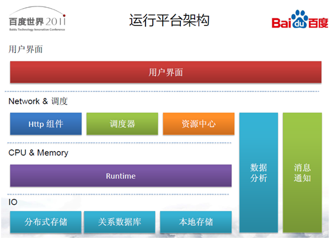

图 3 百度开放平台的运行架构

备注：2011年百度开行平台每天80亿HTTP请求，近1000个应用。

 

**百度大数据**

*  数据量：来自网页、广告、日志和UGC，每天产生200PB，每天需处理100PB。

*  数据计算需求：有统计报表，数据挖掘的模型训练，复杂计算中的网页索引和超链分析，MAP-REDUCE的通用批量数据处理，大规模的机器学习等等。

 

### 2.1.2   百度贴吧

数据量：百亿帖子，某些热门话题千万回复，P级视频存储，每秒10W级的HTTP请求。

解决方案：

*  轻量级：MySQL + CACHE + FLASH，可解决80%的日常产品开发需求（快速开发）。

*  大数据存储：分区消息队列，K-V存储

*  服务器集群：负载均衡、心跳机制

   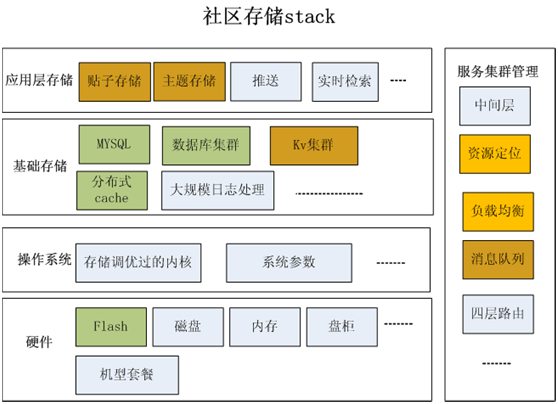

图 1 百度贴吧存储stack

 

### 2.1.3   百度媒体云

   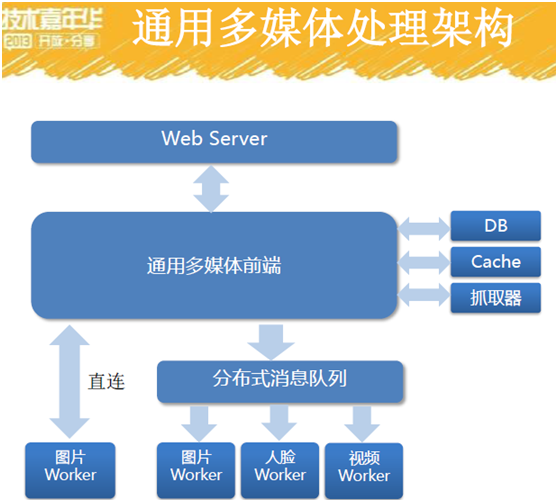

图 4 百度媒体云通用多媒体处理架构

说明：1.图像处理与识别包括图片转码、图像识别、图像生成和图像解析。

2.人脸服务包括人脸检测、人脸认证、人脸聚类、人脸识别和属性分析。

3.视频包括视频转码、签黄。

 

 

## 2.2   腾讯tencent

### 2.2.1   微信

   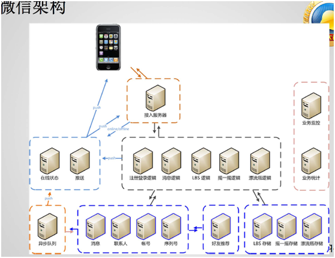

图 5微信架构

备注：2010.1.26发布1.0版本，2010.10发布3.0版本。

数据量：10个月5千万用户，千万级在线。

 

### 2.2.2   QQGame

   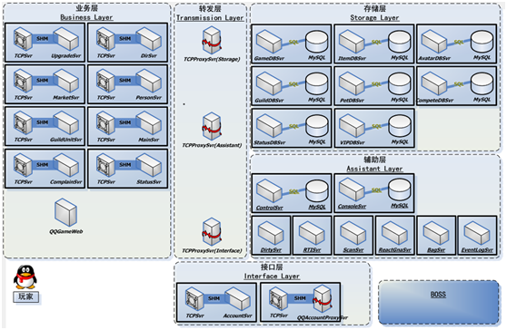

图 6 QQGame后台架构

说明：

*  数据量：3.2亿注册用户，2千万活跃用户数，400万人同时在线。

 

   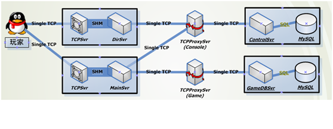

图 7 QQGame关键业务模块

 

   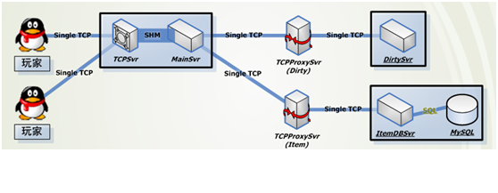

图 8 QQGame聊天系统的拓朴结构

 

   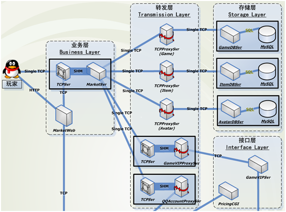

图 9 QQGame商城系统的拓朴结构

 

### 2.2.3   QQ

IM系统关键的质量属性：性能, 可用性

   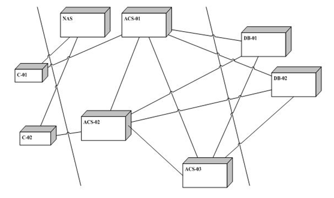

图 10 IM架构的逻辑视图

   

图 11 IM架构的部署视图

各模块的说明：

C-XX：客户端, 使用自己定义的协议与NAS、ACS进行通信，提供IM的基本功能。
 NAS：导航服务器, 为用户C-XX分配ACS服务器，在用户登录时进行。NAS简单的采用轮转的方式，依次分配系统中存在的ACS给登陆的用户。(可以是一个或多个)
 ACS：响应服务器, 为用户提供IM服务端功能，主要有用户信息的修改，用户状态的维护，用户消息的处理等。ACS之间的逻辑结构是网状的，任何两个ACS都可以平等的进行通信。
 DB：数据库, 保存用户的信息，不同的DB分成不同的区，维护不同段的用户。每个ACS到各个分区的数据库都有连接，ACS根据用户所在的区，访问相应的数据库，存取用户的数据。(数据库按用户注册时分配的ID分段处理)

 

## 2.3   阿里巴巴alibaba

详见 本人另文《阿里巴巴专题》

## 2.4   新浪Sina

### 2.4.1   新浪微博

   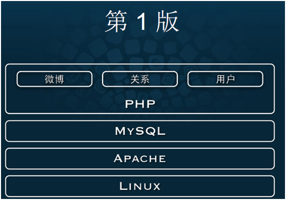

图 15新浪微博架构（第一版）

 

   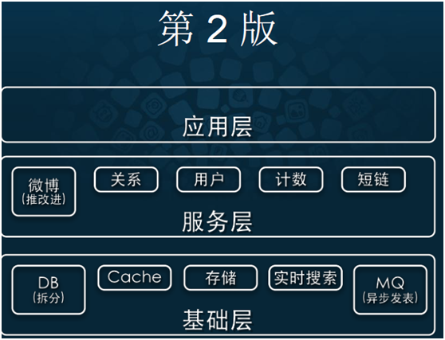

图 16 新浪微博架构（第二版）

   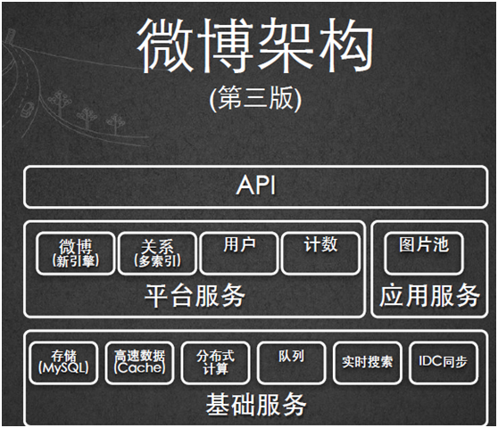

图 17 新浪微博架构（第三版）

 

## 2.5   Wikipedia

 

   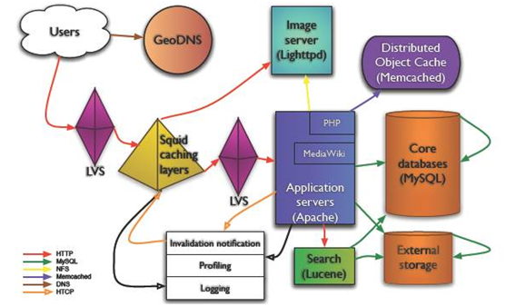

图 18 wikimedia架构

 

## 2.6   Amazon

   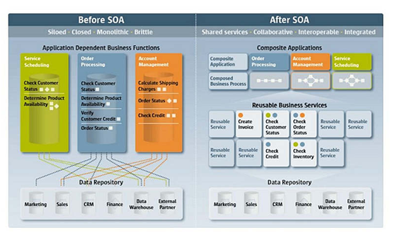

图 19 Amazon SOA架构前后

 

2002年，贝索斯突然向全公司发布了一道指令。

（1）从今天起，所有的团队都要以服务接口的方式，提供数据和各种功能。

（2）团队之间必须通过接口来通信。

（3）不允许任何其他形式的互操作：不允许直接链接，不允许直接读其他团队的数据，不允许共享内存，不允许任何形式的后门。唯一许可的通信方式，就是通过网络调用服务。

（4）具体的实现技术不做规定，HTTP、Corba、PubSub、自定义协议皆可。

（5）所有的服务接口，必须从一开始就以可以公开作为设计导向，没有例外。这就是说，在设计接口的时候，就默认这个接口可以对外部人员开放，没有讨价还价的余地。

（6）不遵守上面规定，就开除。

 

接下来的几年里，亚马逊全公司都转向了面向服务的架构（SOA）。这个过程中，工程师们得到了大量的经验教训。

**教训一：SOA架构的错误定位，非常麻烦。**

一个请求可能要经过20次服务器调用，才能找到问题的真正所在。通常，单单是问题的定位就要花费15分钟到几个小时，除非搭建大量的外围监控和报警措施。

**教训二：同事也是潜在的 DOS** **攻击者。**

公司内部某个小组，会突然对你的服务发起大量请求。除非每个服务都设有严格的用量和限量措施，否则根本无法保证可用性。

**教训三：监控和质量保障（QA）是两回事。**

监控一个服务的时候，可能会得到"一切正常"的回复。但是很有可能，整个服务唯一还正常工作的部分，就是这个回应"一切正常"的模块。只有完整地调用服务，才能确定服务是正常的。

这意味着，真正监控一个服务，必须做到对所有的服务和数据进行完整的语意检查，否则是看不出问题的。如果做到了这一点，本质上就是在做自动化 QA 了。

**教训四：必须有服务发现机制。**

面对成百上千的服务时，没有服务发现机制是不可想象的。这又离不开服务注册机制，而它本身也是一个服务。亚马逊有一套统一的服务注册机制，可以通过编程的方式找到所有服务，包括一个服务有哪些API，目前是不是运行正常，在什么位置等。

**教训五：必须有沙箱用来调试**

如果代码中调用了他人服务，查找问题的难度要高很多，除非有统一的方式在沙箱里运行所有服务，否则几乎不可能进行任何调试。

**教训六：不能信任任何人**

团队采用服务的方式进行合作以后，基本上就不能信任其他团队了，正如不能信任第三方工程师一样。

 

## 2.7   Microsoft

### 2.7.1   .NET Framework体系结构

   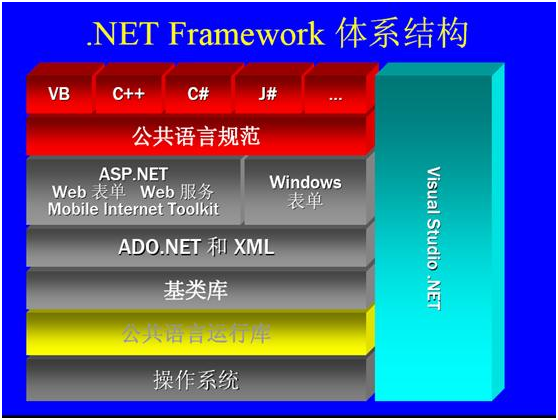

图 20  .NET Framework体系结构

说明：使用分层layered风格。

 

## 2.8   本章参考

[1].    亚马逊如何变成 SOA（面向服务的架构）？http://www.ruanyifeng.com/blog/2016/09/how_amazon_take_soa.html

# 3   SearchEngine.搜索引擎架构

详见：本人另作《搜索引擎实现方案》、《搜索引擎技术选型》。

 

初级：数据库字段索引查询 百万级规模 LINK匹配

中级：数据库全文索引或者coreseek，需分词

高级：第三方外置索引架构，如基于Lucene的ElasticSearch、Solr。

最终：自己开发的搜索引擎架构。

 

# 4   IM 即时通讯

IM全称是『Instant Messaging』，中文名是即时通讯。在这个高度信息化的移动互联网时代，生活中IM类产品已经成为必备品，比较有名的如钉钉、微信、QQ等以IM为核心功能的产品。

## 4.1   IM消息系统架构

IM系统在互联网初期即存在，其基础技术架构在这十几年的发展中更新迭代多次，从早期的CS、P2P架构，到现在后台已经演变为一个复杂的分布式系统，涉及移动端、网络通信、协议、安全、存储和搜索等技术的方方面面。IM系统中最核心的部分是消息系统，消息系统中最核心的功能是消息的同步、存储和检索：

- **消息的同步**：将消息完整的、快速的从发送方传递到接收方，就是消息的同步。消息同步系统最重要的衡量指标就是消息传递的实时性、完整性以及能支撑的消息规模。从功能上来说，一般至少要支持在线和离线推送，高级的IM系统还支持『多端同步』。
- **消息的存储**：消息存储即消息的持久化保存，传统消息系统通常只能支持消息在接收端的本地存储，数据基本不具备可靠性。现代消息系统能支持消息在服务端的在线存储，功能上对应的就是『消息漫游』，消息漫游的好处是可以实现账号在任意端登陆查看所有历史消息。
- **消息的检索**：消息一般是文本，所以支持全文检索也是必备的能力之一。传统消息系统通常来说也是只能支持消息的本地检索，基于本地存储的消息数据来构建。而现在消息系统在能支持消息的在线存储后，也具备了消息的『在线检索』能力。

   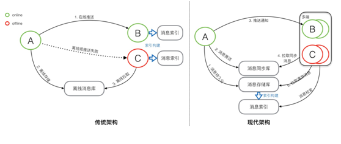

图 21 IM消息系统 传统架构 vs 现代架构

说明：传统架构先同步后存储；现代架构先存储后同步。

 

## 本章参考

[1].    现代IM系统中的消息系统架构 - 架构篇 https://yq.aliyun.com/articles/698301 

[2].    现代IM系统中的消息系统架构 - 模型篇 https://blog.csdn.net/weixin_43970890/article/details/90515785 

[3].    现代IM系统中的消息系统架构 - 实现篇 https://yq.aliyun.com/articles/710363 

[4].    《[浅谈IM系统的架构设计](http://www.52im.net/thread-307-1-1.html)》

[5].    《[简述移动端IM开发的那些坑：架构设计、通信协议和客户端](http://www.52im.net/thread-289-1-1.html)》

[6].    《[一套原创分布式即时通讯(IM)系统理论架构方案](http://www.52im.net/thread-151-1-1.html)》

[7].    《[从零到卓越：京东客服即时通讯系统的技术架构演进历程](http://www.52im.net/thread-152-1-1.html)》

[8].    《[蘑菇街即时通讯/IM服务器开发之架构选择](http://www.52im.net/thread-31-1-1.html)》

[9].    《[腾讯QQ1.4亿在线用户的技术挑战和架构演进之路PPT](http://www.52im.net/thread-158-1-1.html)》

[10].《[微信技术总监谈架构：微信之道——大道至简(演讲全文)](http://www.52im.net/thread-200-1-1.html)》

[11].《[如何解读《微信技术总监谈架构：微信之道——大道至简》](http://www.52im.net/thread-201-1-1.html)》

[12].《[快速裂变：见证微信强大后台架构从0到1的演进历程（一）](http://www.52im.net/thread-168-1-1.html)》

[13].《[17年的实践：腾讯海量产品的技术方法论](http://www.52im.net/thread-159-1-1.html)》

[14].从1.0到4.0，详解直播平台“IM系统”搭建全攻略 https://blog.csdn.net/qiansg123/article/details/80127699 

# 5   电商架构

## 5.1   秒杀系统（限时抢购）

秒杀系统的特点是时间短、瞬时并发量高。

以秒杀商品数100为例，假设吸引了1万人参加，则最大并发请求数是1万 人。

 

秒杀系统需要面对的技术挑战有：

**1.时间短，不要对现有业务造成冲击。**

解决方案：将秒杀系统独立部署，甚至使用独立域名，使其与网站完全隔离。

**2.** **突然增加的网络及服务器带宽。**

解决方案：单独设置秒杀页面为静态页面，并将秒杀商品页面缓存在CDN，同样需要和CDN服务商临时租借新增的出口带宽。

**3.** **如何进行下单前置检查**

下单服务器检查本机已处理的下单请求数目：

1)        如果超过10条，直接返回已结束页面给用户；

2)        如果未超过10条，则用户可进入填写订单及确认页面；

检查全局已提交订单数目：

1)        已超过秒杀商品总数，返回已结束页面给用户；

2)        未超过秒杀商品总数，提交到子订单系统；

**4、同一热卖商品数据库高并发写**

问题：MySQL InnoDB更新行锁引起DB TPS下降

解决方案：乐观锁~给商品item增加version字段。version一致扣减；version不一致尝试扣减。 

**5、Redis扣减热卖商品库存**

DB库存为实际库存，Redis库存为实时库存。

分布式锁：基于ZK 或 Redis实现

 

**秒杀架构原则**

尽量将请求拦截在系统上游传统秒杀系统之所以挂，请求都压倒了后端数据层，数据读写锁冲突严重，并发高响应慢，几乎所有请求都超时，流量虽大，下单成功的有效流量甚小【一趟火车其实只有2000张票，200w个人来买，基本没有人能买成功，请求有效率为0】。

读多写少的常用多使用缓存。这是一个典型的读多写少的应用场景【一趟火车其实只有2000张票，200w个人来买，最多2000个人下单成功，其他人都是查询库存，写比例只有0.1%，读比例占99.9%】，非常适合使用缓存。

 

## 5.2  支付系统

## 本章参考

 

# 6   Database.数据库架构

详见：本人另作《[数据库架构](数据库架构.md)》。

 

*  高可读性：读写分离，设立多个冗余读库

*  高可写性：冗余写库。

*  数据一致性：一是使用中间件；二是强制读写。

自增ID的同步冲突解决方案

方案1：两个写库使用不同的初始值，相同的步长，如1写库为奇数，2写库为偶数（即步长为2）。

方案2：不使用数据的id，业务层自己生成唯一ID。

# 7  云计算/大数据架构

详见：本人另作

*  《云计算专题》、

*  《大数据开发》、

*  《大数据开发实例》

 

# 8   网站架构

详见：本人另作《[网站架构设计与开发](网站架构设计与开发.md)》。

 

# 9   游戏架构

详见：本人另作《游戏编程笔记》

 

# 10   软件产品线架构

**软件产品线**：指具有一组可管理的、公共特性的、软件密集性系统的集合，这些系统满足特定的市场需求或任务需求，并且按照预定义方式从一个公共的核心资产集开发得到。

**软件产品线架构**：针对一个公司或组织内的一系列产品而设计的通用架构。

 

## 10.1  SNS社区的产品线架构

目前, 腾讯形成了在线社区3C产业链，分为三层，从下到上分别是用户(Customer), 社区(Community), 内容(Content)；这是腾讯的创造性贡献。具体到一个SNS社区产品模型，从下到上也分为三层：

1）底层，Profile，用户的属性描述及行为画像

2）中间，Relation，用户群内部关系链

3）上层, 内容(Content)和应用(Application)。

 

# 11  其它架构实例

 

 

# 参考资料

[1].    蒋宁, 解析SNS社区产品架构模型, http：//www.uml.org.cn/zjjs/200908282.asp 2009-08-28

[2].    面向对象葵花宝典系列 http://blog.csdn.net/column/details/oobaodian.html 

[3].    秒杀系统架构分析与实战 http://www.cnblogs.com/andy-zhou/p/5364136.html 

 

# 附录

**微信公众号**

*  架构师之路

*  互联网架构师

 