| 序号 | 修改时间   | 修改内容        | 修改人 | 审稿人 |
| ---- | ---------- | ----------------------------------------------- | ------ | ------ |
| 1    | 2010-01-01 | 创建    | Keefe | Keefe |
| 2    | 2010-1-5   | 3.2架构风格中增加异构, 各风格比较, 增加架构实例 | 同上   |        |
| 3    | 2010-1-8   | 细化架构评估ATAM        | 同上   |        |
| 4    | 2010-1-12  | 将视图风格属性战术拆分为架构理论篇      | 同上   |        |
| 5    | 2011-7-25  | 增加分布式架构章节      | 同上   |        |
| 6    | 2011-8-26  | 增加领域驱动设计DDD章节  | 同上   |        |
| 7    | 2011-9-16  | 增加系统性能专题        | 同上   |        |
| 8    | 2016-10-15 | 将WEB框架章节移到《网站开发》文档。     | 同上   |        |
| 9    | 2017-1-4   | 增加三大质量模型比较。  | 同上   |        |
| 10   | 2017-1-27  | 将架构实例章节移到《架构实例》文档。    | 同上   |        |
| 11   | 2017-2-15  | 增加微服务架构章节、更新架构视图。      | 同上   |        |
| 12   | 2018-4-5   | 增加企业架构EA章节；更新ADD 3.0。       | 同上   |        |
| 13   | 2018-5-1   | 更新分布式架构章节，增加概述。  | 同上   |        |
| 14   | 2018-6-17  | 增加参考架构章节，更新架构视图。        | 同上   |        |
| 15   | 2018-7-31  | 迁移微服务和SOA章节另文《微服务架构》   | 同上   |        |

---

# 目录

[目录... 1](#_Toc17404245)

[1       架构概论... 4](#_Toc17404246)

[1.1  企业架构 EA.. 4](#_Toc17404247)

[1.1.1  业务架构 BA.. 5](#_Toc17404248)

[1.1.2  应用架构 AA.. 6](#_Toc17404249)

[1.1.3  数据架构 DA.. 7](#_Toc17404250)

[1.1.4  技术架构 TA.. 7](#_Toc17404251)

[1.1.5  示例：工业互联网平台... 8](#_Toc17404252)

[1.1.6  补充：信息架构 IA.. 9](#_Toc17404253)

[1.2  软件架构 SA.. 10](#_Toc17404254)

[1.2.1  软件架构的定义... 10](#_Toc17404255)

[1.2.2  架构设计的原理、目的和原则... 11](#_Toc17404256)

[1.2.3  架构风格、设计模式与框架区分... 11](#_Toc17404257)

[1.2.4  架构的商业周期(ABC) 12](#_Toc17404258)

[1.3  参考架构... 12](#_Toc17404259)

[1.3.1  大数据... 12](#_Toc17404260)

[1.3.2  云计算... 12](#_Toc17404261)

[1.3.3  区块链... 14](#_Toc17404262)

[1.3.4  SOA参考架构... 14](#_Toc17404263)

[1.3.5  智慧城市... 16](#_Toc17404264)

[1.4  本章参考... 17](#_Toc17404265)

[2       架构设计理论... 17](#_Toc17404266)

[2.1  架构视图view.. 17](#_Toc17404267)

[2.1.1  RUP四视图法... 18](#_Toc17404268)

[2.1.2  架构4+1视图法... 19](#_Toc17404269)

[2.1.3  SEI三视图法... 20](#_Toc17404270)

[2.1.4  五视图法... 20](#_Toc17404271)

[2.2  架构风格style. 22](#_Toc17404272)

[2.2.1  实践派分类... 22](#_Toc17404273)

[2.2.2  学院派分类... 23](#_Toc17404274)

[2.2.3  异构... 24](#_Toc17404275)

[2.2.4  架构风格的比较... 24](#_Toc17404276)

[3       架构设计方法... 25](#_Toc17404277)

[3.1  ADD~属性驱动设计... 25](#_Toc17404278)

[3.1.1  ADD概述... 25](#_Toc17404279)

[3.1.2  质量属性... 26](#_Toc17404280)

[3.1.3  质量模型... 27](#_Toc17404281)

[3.1.4  质量场景... 28](#_Toc17404282)

[3.1.5  质量战术... 32](#_Toc17404283)

[3.1.6  本章参考... 36](#_Toc17404284)

[3.2  DDD~领域驱动设计... 36](#_Toc17404285)

[3.2.1  DDD的分层架构和构成要素... 37](#_Toc17404286)

[3.3  MDA~模式驱动的架构... 38](#_Toc17404287)

[3.3.1  MDA流程... 38](#_Toc17404288)

[3.4  本章参考... 38](#_Toc17404289)

[4       架构设计过程... 39](#_Toc17404290)

[4.1  软件过程常用规范... 39](#_Toc17404291)

[4.2  架构描述... 39](#_Toc17404292)

[4.3  架构评审... 39](#_Toc17404293)

[4.3.1  ATAM.. 39](#_Toc17404294)

[4.3.2  SAAM.. 43](#_Toc17404295)

[4.3.3  ARID.. 43](#_Toc17404296)

[4.3.4       架构评审常用方法的比较... 43](#_Toc17404297)

[4.4  架构编档... 44](#_Toc17404298)

[4.5  架构验证... 44](#_Toc17404299)

[4.6  SAI 软件架构指数... 44](#_Toc17404300)

[4.7  本章参考... 44](#_Toc17404301)

[5       分布式架构... 44](#_Toc17404302)

[6       架构实例... 44](#_Toc17404303)

[参考资料... 45](#_Toc17404304)

[参考链接... 45](#_Toc17404305)

[参考书目... 45](#_Toc17404306)

[附录... 46](#_Toc17404307)

[业界标准化组织... 46](#_Toc17404308)

**表目录**

[表格 1 云计算-CCRA用户视图表... 12](#_Toc17404212)

[表格 2 RUP 4视图法列表... 18](#_Toc17404213)

[表格 3 三视图法列表... 20](#_Toc17404214)

[表格 4 实践派的架构分类列表... 23](#_Toc17404215)

[表格 5学院派的架构分类列表... 23](#_Toc17404216)

[表格 6 架构风格的比较列表... 24](#_Toc17404217)

[表格 7 ADD发展史... 25](#_Toc17404218)

[表格 8 三大质量模型列表... 27](#_Toc17404219)

[表格 9 常见的质量属性列表... 28](#_Toc17404220)

[表格 10 ATAM评估步骤... 40](#_Toc17404221)

[表格 11 ATAM/SAAM/ARID的比较表... 43](#_Toc17404222)

 

**图目录**

[图 1 系统功能视角的应用架构图... 6](#_Toc17404223)

[图 2 系统技术层次视角的应用架构图... 7](#_Toc17404224)

[图 3 工业互联网平台的应用架构（功能视角的功能架构）... 8](#_Toc17404225)

[图 4 工业互联网平台的技术架构... 9](#_Toc17404226)

[图 5架构的商业周期... 12](#_Toc17404227)

[图 6 云计算-CCRA功能视图... 14](#_Toc17404228)

[图 7 SOA RA 逻辑解决方案视图... 15](#_Toc17404229)

[图 8 SOA服务类型... 16](#_Toc17404230)

[图 9 智慧城市标准体系框图... 17](#_Toc17404231)

[图 10 架构视图之间的转换... 18](#_Toc17404232)

[图 11 架构4+1视图法（2007版）... 19](#_Toc17404233)

[图 12 4+1 architectural view model （2005版）... 20](#_Toc17404234)

[图 13 McCall Quality Model(1977)定义的11个外部质量属性... 28](#_Toc17404235)

[图 14 Quality attribute parts. 29](#_Toc17404236)

[图 15 Availability general scenarios. 30](#_Toc17404237)

[图 16 Summary of availability tactics. 32](#_Toc17404238)

[图 17 Summary of modifiability tactics. 33](#_Toc17404239)

[图 18  Summary of performance tactics. 34](#_Toc17404240)

[图 19 Summary of tactics for security. 35](#_Toc17404241)

[图 20 Summary of testability tactics. 35](#_Toc17404242)

[图 21 Summary of runtime usability tactics. 36](#_Toc17404243)

[图 22 DDD分层架构... 37](#_Toc17404244)

 

---

# 1  架构概论

架构可以从业务驱动和技术驱动两个角度分为企业架构EA和软件架构SA。

本文主要描述软件架构。

## 1.1   企业架构 EA

企业架构最早的思想雏形来自[企业建模](https://baike.baidu.com/item/企业建模)领域。20世纪80年代中期，当时还是IBM员工的John Zachman率先提出了“信息系统架构框架”的概念。1996年美国的Clinger-Cohen 法案（也称信息技术管理改革法案）导致了术语“IT架构”的产生。

企业架构（Enterprise Architecture），简称EA。是指对企业事业信息管理系统中具有体系的、普遍性的问题而提供的通用解决方案，更确切的说，是基于<u>业务导向</u>和驱动的架构来理解、分析、设计、构建、集成、扩展、运行和管理信息系统。复杂系统集成的关键，是基于架构（或体系）的集成，而不是基于部件（或组件）的集成。

企业架构方法有很多，但TOGAF是最主流的。

### 1.1.1 EA框架介绍

虽然企业架构框架理论所面对的问题都是同样的，但是由于他们出现的历史背景和研发团体都不相同，因而他们的适用范围和侧重角度都有较大的差异。本章将根据2007年 《Comparison of the Top Four Enterprise Architecture Methodologies》所述对四种主流的企业架构框架理论（Zachman，FEA，Gartner，TOGAF）进行比较。

四种框架比较表如下

|                  | Zachman | TOGAF | FEA  | Gartner |
| ---------------- | ------- | ----- | ---- | ------- |
| **分类法完整度** | 4       | 3     | 2    | 1       |
| **过程完整度**   | 1       | 4     | 2    | 3       |
| **参考模型指南** | 1       | 3     | 4    | 1       |
| **实践指南**     | 1       | 2     | 2    | 4       |
| **成熟度模型**   | 1       | 1     | 3    | 2       |
| **业务关注度**   | 1       | 2     | 1    | 4       |
| **治理指南**     | 1       | 2     | 3    | 3       |
| **企业划分指南** | 1       | 2     | 4    | 3       |
| **视角目录**     | 1       | 2     | 4    | 2       |
| 厂商无关度       | 2       | 4     | 3    | 1       |
| **信息易获取性** | 2       | 4     | 2    | 1       |
| **价值获取效率** | 1       | 3     | 1    | 4       |

上面表格中评分量级从1至4，其意义分别定义如下：

1. 在当前评测方面无所表现。
2. 在当前评测方面有所表现，但是并不足够。
3. 在当前评测方面有着可以接受的表现。
4. 在当前评测方面有着很好的表现。

  上述表格采用十二个方面对四个框架进行对比，其中每个评测方面的意义如下：

- 分类法完整度（Taxonomy completeness）：用以表明当前框架理论对各种架构制品划分的优劣程度。
- 过程完整度（Process completeness）：用以表明当前框架理论在指导人们创建企业架构方面是否采用了渐入式的方式，且表现如何。
- 参考模型指南（Reference model guidance）：用以表明当前框架理论在帮助人们创建一系列相关的参考模型中的作用。
- 实践指南（Practice guidance）：用以表明当前框架理论在帮助人们将企业架构的精神融入到组织中，并为其创建一个珍视并使用企业架构的企业文化时的帮助程度。
- 成熟度模型（Maturity model）：用以表明当前框架理论在评估企业使用企业架构的有效性和成熟度方面的帮助程度。
- 业务关注度（Business focus）：用以表明当前框架理论是否着眼于使用技术来驱动业务价值。其中，业务价值被定义为减少成本或增加收入。
- 治理指南（Governance guidance）：用以表明当前框架理论在理解和创建有效的企业架构治理模型方面的帮助程度。
- 划分指南（Partitioning guidance）：用以表明当前框架理论在帮助人们对企业进行有效的自治性分区划分方面的帮助程度。此种分区划分对于复杂性管理来说是一个重要的方法。
- 视角目录（Perspective catalog）：用以表明当前框架理论在指导人们设置架构资产目录方面的帮助程度。这些架构资产会在未来的活动中被重用。
- 厂商无关度（Vendor neutrality）：用以表明当前框架理论与某个特定咨询组织的锁定程度。此方面评分越高表示与特定厂商的锁定程度越低。
- 信息易获取性（Information availability）：用以表明与当前框架理论相关的免费或廉价信息的数量和质量。
- 价值获取效率（Time to value）：用以表明从开始使用当前框架理论到创建具有高度业务价值的解决方案这一过程的效率。

#### **TOGAF**

TOGAF是美国**The Open Group**组织推出的架构框架（TOGAF=The Open Group Architecture Framework, 开放组体系结构框架），它提出了企业架构一词，是对整个企业的商业战略、业务体系、信息支持而言的。它的理念其实更多来自于IT-业务战略一致性匹配模型。

TOGAF是一个行业标准的体系架构框架，它能被任何希望开发一个信息系统体系架构在组织内部使用的组织自由使用。

TOGAF 由国际标准权威组织The Open Group制定。The Open Group于1993年开始应客户要求制定系统架构的标准，在1995年发表The Open Group Architecture Framework (TOGAF) 架构框架。TOGAF的基础是美国国防部的[信息管理技术](https://baike.baidu.com/item/信息管理技术)架构(Technical Architecture for Information Management: TAFIM)。它是基于一个迭代(Iterative)的过程模型，支持最佳实践和一套可重用的现有架构资产。它可让您设计、评估、并建立组织的正确架构。TOGAF的关键是架构开发方法（Architecture Development Method: ADM）， 一个可靠的，行之有效的方法，以发展能够满足商务需求的企业架构。

TOGAF支持开放、标准的SOA参考架构，同时支持其他不同的架构风格，如传统的面向对象、CS、或BS三层架构风格。

 

EA可以分为两大部分：业务架构和IT架构，大部分企业架构方法都是从IT架构发展而来的。

① 业务架构：是把企业的业务战略转化为日常运作的渠道，业务战略决定业务架构，它包括业务的运营模式、流程体系、组织结构、地域分布等内容。

② IT架构：指导IT投资和设计决策的IT框架，是建立企业信息系统的综合蓝图，包括数据架构、应用架构和技术架构三部分。

开放群组企业架构框架，有4 种被接受为企业架构的子集的架构，TOGAF 都支持：

*  业务架构：定义了商业策略，管理，组织和关键业务流程。包括业务治理目标、业务对象、业务流程和业务发展规划。

*  应用架构：这种结构为待配置的个人应用系统提供一个蓝图，从他们的交互，他们的关系到该组织核心的业务流程。包括应用治理目标、应用组件、接口和应用发展规划。

*  数据架构：这个描述一个组织逻辑的和物理的数据资产和数据管理资源的结构。包括数据治理目标、数据对象、数据存储和数据发展规划。

*  技术架构：它描述了支持核心部署和关键任务应用的软件基础设施。这种软件有时也叫做中间件。包括技术专利目标、技术组件、网络和技术发展规划。

 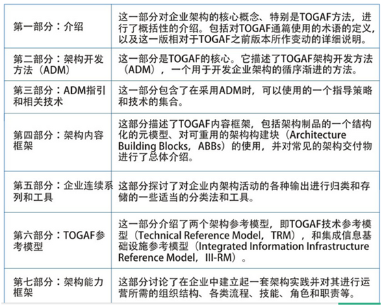

 

 TOGAF 9提供了架构开发方法（ADM）、架构能力框架、架构内容框架、企业连续体及参考模型等组件。其中ADM是最核心内容，详细介绍了构建企业架构需要执行的各个步骤以及他们之间的关系。

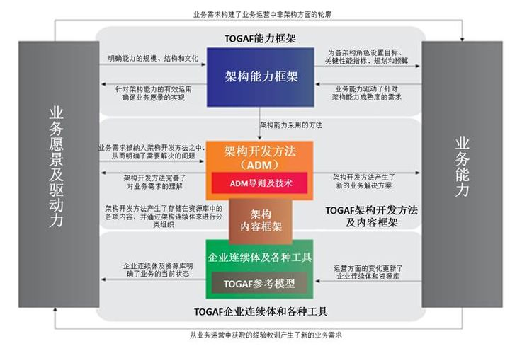

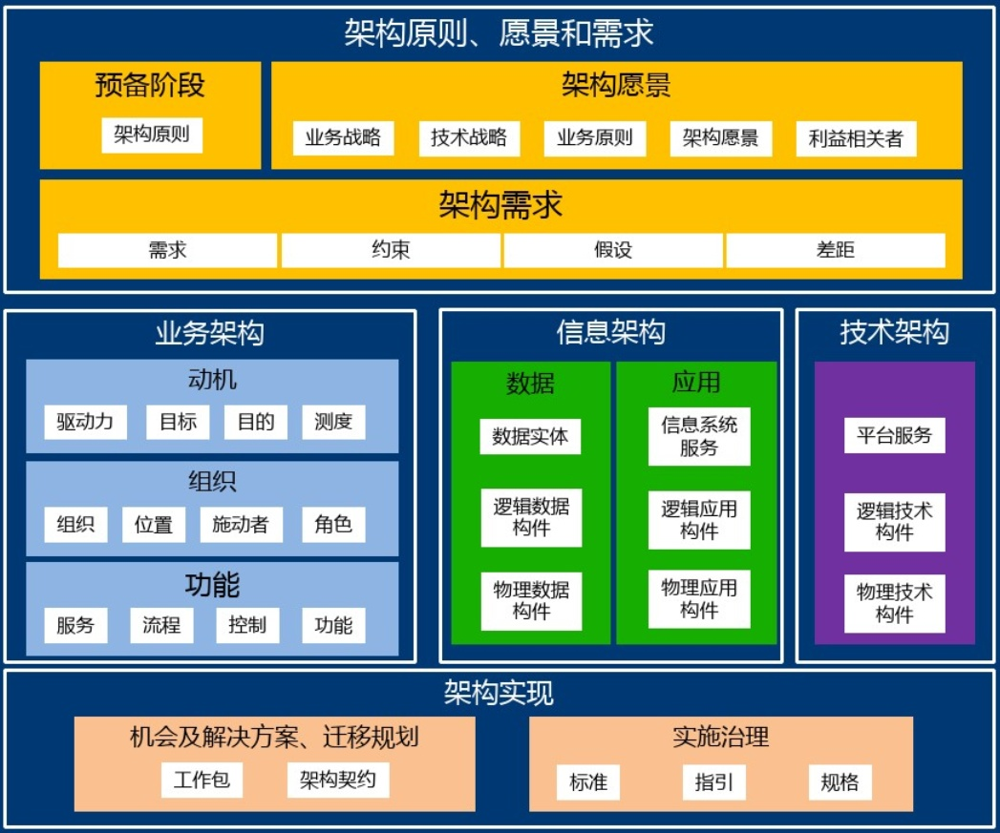

图 TOGAF的内容结构

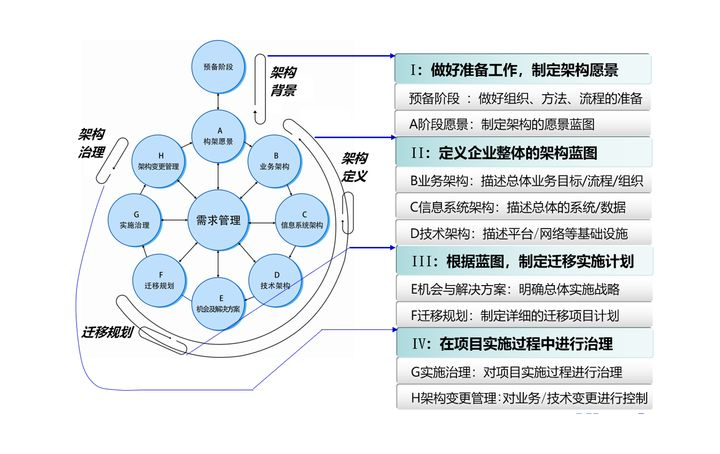

图 TOGAF企业架构的实施过程

**ArchiMate**

ArchiMate是Open Group引入的建模标准。它提供了一组丰富的建模符号和概念，支持在域内和域之间一致地建模企业架构。

#### Zachman

由约翰 扎科曼（John Zachman ）在1987年创立的全球第一个企业架构理论，其论文《信息系统架构框架》至今仍被业界认为是企业架构设计方面最权威的理论。是其他[企业架构](https://baike.baidu.com/item/企业架构/31037)框架的源泉。在这篇论文中Zachman先生以修建房屋为例从两个维度将与信息系统架构设计相关的各种元素归纳到如下表格之中：

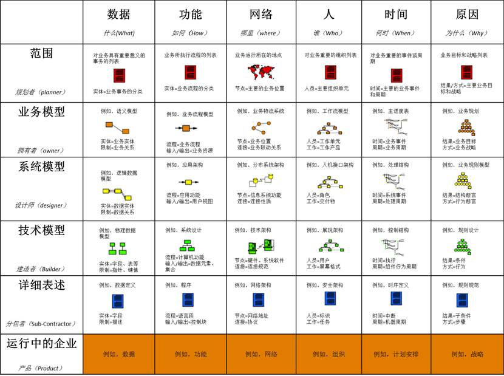

- 表格中的每一行代表了在信息系统构造过程中所涉及到的某干系人在描述信息系统时所采用的视角，包括：
  - **范围/规划师（Planner）**：包括整个信息系统描述所处的环境上下文、产生于内部与来源于外部的各种约束，以及其他视角下对信息系统的描述所需要考虑的相关构成部分的列表。
  - **业务模型/拥有者（Owner）**：有关最终产品的概念视图，反映了最终产品的使用特性，即用户准备如何对最终产品加以使用。具有此视角的干系人包括最终产品的客户或用户。
  - **系统模型/设计师（Designer）**：有关最终产品的逻辑视图，反映了最终产品的本质规律以及逻辑约束。具有此视角的干系人包括工程师、架构师以及能够将期望所得与现有的物理、技术上的实现联系起来的各种中间人。
  - **技术模型/建造者（Builder）**：反映了在产品构建过程中现有技术的物理约束。具有此视角的干系人包括制造工程师、总承包商以及具有生产最终产品所需的技术能力的组织或人员。
  - **详细表述/分包者（Sub-Contractor）**：关于为了达到生产目的而对复杂对象进行分解的详细描述，这些内容在从设计媒介到最终产品媒介的转换中起着非常重要的作用。例如，用于将技术模型中所阐述的技术约束与供应商为所提供的产品联系在一起的产品规格说明。
  - **产品/运行中的企业（Functioning Enterprise）**：在1987年的论文（《A framework for information systems architecture》）中并没有这一行的内容，实际上此行的内容也并不在架构描述的范畴的之内，不过为了使得架构Zachman框架对于架构的表述更加完备，这一行最终还是被加了进去。这一行的内容代表了最终产品，是架构在客观现实中的实例体现。例如，对信息系统架构来说，此行的内容就是最终产出的信息系统，同理，对于企业架构来说，这一行所代表的就是运行中的企业本身。简而言之，前面五行的内容是对于客观对象的描述，而这最后一行的内容就是客观对象本身了。
- 表格中的每一列代表了用于描述信息系统的某一个方面。在Zachman先生看来，对于任何一个事物只要在几个基本方面对其进行清晰的解释就足将其描述清楚，而且几千年来人类自然语言的特性也证明了这一结论。这些方面包括：（即5W1H法）
  - **数据（What，即什么内容）**：用于表示客观对象的材料组成，即材料清单。对于企业来说，此部分内容就是组成事物模型（Thing Model，之所以将其称为组成事物模型而不是数据模型是因为由于不同的行代表了不同的视角，而仅在设计师所处的第三行才会关注真正信息化意义上的“数据模型”，因而在此才使用“组成事物”来对所有视角在此列中的描述对象进行指代）。
  - **功能（How，即如何工作）**：用于表示功能和转换行为。对于企业来说，这部分内容就是流程或功能模型等。
  - **网络（Where，即何处）**：用于表示各组成部件的坐落位置以及相互之间的联通关系。对于企业来说，这部分内容就是物流或网络模型等。
  - **人（Who，即何人负责）**：用于描述了何人应该做何事，例如用户手册和操作说明等。对于企业来说，这部分内容就是人力模型或工作流模型等。
  - **时间（When，即什么时间）**：用于描述事物发生的时间以及不同事物之间的相对时间关系，例如生命周期和时序图等。对于企业来说，这部分内容就是时间或动态模型等。
  - **原因（Why，即为什么做）**：用于表示最终结果和意义。对于企业来说，这部分内容就是动机模型等。
- 每行和列相交的单元格表示了各个干系人在各自视角上对于信息系统的某个方面的具体描述。

  通过上述关于Zachman框架内容的表述我们可以发现此框架本身并不复杂，不过在实际应用过程中我们还应该遵循下列的使用规则：

- 不能为此框架增加新的行或列。在Zachman框架看来，框架中的六行视角以及六列描述方面构成了系统描述的最基本元语，即为了构建系统而对其架构所做的描述只要能够从六种视角出发，并能为每个视角在六个方面（什么内容（*What*）、如何工作（*How*）、何处（*Where*）、何人负责（*Who*）、何时（*When*）和为什么动机（*Why*））做出解答，那么此架构描述就是完备的，也由此足以成为系统的复杂度管理和变更管理的基础。
- 每一列中的内容都遵从某一通用模型。由于每一列都代表了所描述架构的某一个方面，因而处于同一列的各个描述在本质上应符合某种经过高度抽象的元模型：
  - “数据”列（What）应遵从：事物——关系——事物。
  - “功能”列（How）应遵从：流程——输入/输出——流程。
  - “网络”列（Where）应遵从：节点——连接——节点。
  - “人”列（Who）应遵从：人员——工作——人员。
  - “时间”列（When）应遵从：事件——周期——时间。其中，“事件”指代某一时间点，而“周期”代表了一段时间区间。
  - “原因”列（Why）应遵从：结果——方式——结果。其中，“结果”代表了目标状态，而“方式”则用于表示为了达成目标状态而采用的行为。
- 每个表格单元中的模型应该是其所在列采用的通用模型的具体特化。虽然在前面规则中提到过，每一列中的架构描述都遵循相同的模型，但是由于每一行所代表的视角对于描述所采用的术语、语法以及所受的约束各有不同，因而对于每个具体的单元格来说，其中的架构描述也应该是以该列所采用的通用元模型为基础并受其所在行视角约束的特化。

Zachman表格可以从以下五个方面帮助我们开发企业构架：

* 确保每个利益相关着能够从描述的焦点考虑。

* 通过把每个焦点精简到每个特殊观众涉及的焦点来提升构架材料的质量。

* 确保每个商业需求能够追踪到技术实现。

* 确保商业方面不会规划出多余没用的功能。

* 确保技术组包含在商业组的规划中。

该框架仅仅提供了关于企业架构内容的分类方法，而对于企业架构的创建过程却并没有相应的描述。

Zachman本身并不是一个完整的解决方案。有太多的问题它都没有描述。例如，Zachman没有给出一步一步构造一个构架的过程。在决定我们将要构建的构架是否是最好的时候，Zachman没有提供更多的信息帮助我们作出决定。就此而言，Zachman也没有给出一种途径展示将来构架的需求。最重要的，从我们的角度，尽管Zachman表格可以帮助组织构架材料，但是它在描述企业复杂性方面几乎什么都没做。

#### FEA

FEA并不是一个严格意义上的企业架构框架，而是以美国联邦政府为客观对象的企业架构的具体实例，与之相比，在它之前诞生的FEAF（联邦企业架构框架）才算得上一个真正意义的企业架构框架理论，不过由于其在政府的企业架构方面的示范作用，FEA中所抽象出来的各种参考模型和治理方法倒比方法论级别的FEAF更加容易让人接受，所以在很多情况下，FEA也被看作是一种企业架构框架理论。

#### Gartner

Gartner既不提供企业架构内容的分类法，也不提供企业架构的建设过程指南，因而从架构框架的定义来看，Gartner应该不能算是一个严格意义上的企业架构框架理论。Gartner并不提供通常意义上的方法论，而是以其在企业架构建设领域中积累的大量实践经验为基础，对外提供关于企业架构方面的各种最佳实践。因而，如果企业要借助Gartner的力量来建设企业架构，要么出资购买其资讯服务，要么就以Gartner公司提供的数个企业架构建设实例为参考来构建自身的企业架构。

### 1.1.2 EA架构细分-TOGAF为例

#### 1. 业务架构 BA

业务基础架构平台软件是指以业务导向和驱动的、可快速构建应用软件的软件平台。

业务基础架构平台软件包括集成应用平台、开发体系两个部分。从技术角度分析，业务基础架构平台软件为复杂应用软件系统的开发提供了一个基本框架，并有与之相应的、方便易用的开发与维护管理工具。这个框架给出了一些复杂应用软件的基本组成部分和实现方法，并且预置了很多供参考的软件模块。

业务架构平台最大的优势是实现了软件的 **技术无关** 和 **业务导向** 两大困扰国内软件业发展的难题。通过运行平台直接执行企业的业务，实现业务模型和系统实现技术的分离，从根本上提升管理软件的技术无关性，使应用系统可以在各类主流和标准的基础平台上运行，并可以顺利地迁移到未来的实现技术上。

业务知识领域：

* BABOK

#### 2   应用架构 AA

应用架构（Application Architecture）是描述了IT系统功能和技术实现的内容。

应用架构分为以下两个不同的层次：

*  企业级的应用架构：企业层面的应用架构起到了统一规划、承上启下的作用，向上承接了企业战略发展方向和业务模式，向下规划和指导企业各个IT系统的定位和功能。在企业架构中，应用架构是最重要和工作量最大的部分，他包括了企业的应用架构蓝图、架构标准/原则、系统的边界和定义、系统间的关联关系等方面的内容。

*  单个系统的应用架构：在开发或设计单一IT系统时，设计系统的主要模块和功能点，系统技术实现是从前端展示到业务处理逻辑，到后台数据是如何架构的。这方面的工作一般属于项目组，而不是企业架构的范畴，不过各个系统的架构设计需要遵循企业总体应用架构原则。

 

应用架构划分方式

*  水平分，从功能类型划分，比如把系统分为web前端/中间服务/后台任务，这是面向业务深度的划分。

*  垂直分，以业务类型划分，比如ERP系统可以划分为三个独立的应用，这是面向业务广度的划分

 

应用架构主要以架构图的方式描述系统的组成和框架，一般从系统功能和系统技术层次两个架构视角进行设计：

   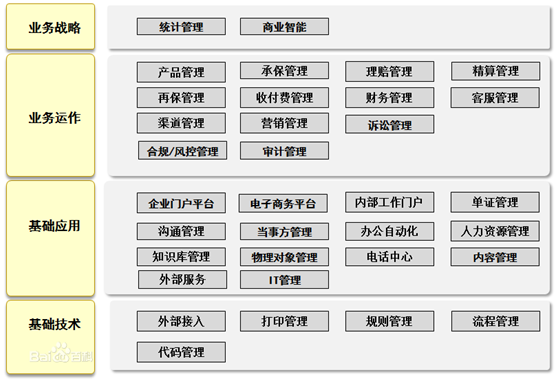

图 1 系统功能视角的应用架构图

 

   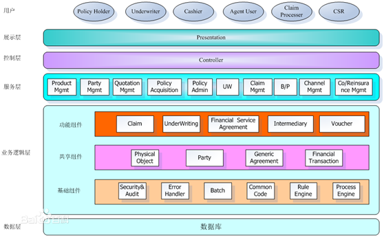

图 2 系统技术层次视角的应用架构图

 

#### 3   数据架构 DA

参见 《BI专题》数据治理章节。

#### 4   技术架构 TA

 技术架构 可以用URL视图进一步细化，一般包括逻辑视图、部署视图、组件视图、并发视图。

#### 5 信息架构 IA（补充）

以华为IA为例。

IA信息架构包括数据资产目录、数据标准、企业级数据模型和数据分布。

*  数据资产目录的数据分层架构(五层)：主题域分组，主题域，业务对象，属性组和属性。

*  数据标准：

*  数据模型：按照ER范式建模。

*  数据底座（分层）：SDI（单源数据）、DWI（接入层）、DWR（报表层）、DM（数据集市）

 

### EA 示例：工业互联网平台

   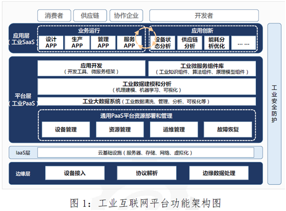

图 3 工业互联网平台的应用架构（功能视角的功能架构）

 

   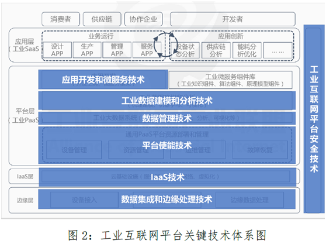

图 4 工业互联网平台的技术架构

**1.数据集成与边缘处理技术**

设备接入：基于工业以太网、工业总线等工业通信协议，以太网、光纤等通用协议，3G/4G/4G/4G、NB-IOT等无线协议将工业现场设备接入到平台边缘层。

协议转换：一方面运用协议解析、中间件等技术。技术兼容Mod、OPC、CAN、Profibus等各类工业通信协议和软件通信接口，实现数据格式转换和统一。另一方面利用HTTP、MQTT等方式从边缘侧将采集到的数据传输云端，实现数据的远程接入。

边缘数据处理：基于高性能计算芯片、实时操作系统芯片、实时操作系统、边缘分析算法等技术支撑，在靠近设备或数据源头的网络边缘侧进行数据预处理、存储以及智能分析应用，提升操作响应灵敏度、消除网络堵塞，并与云端分析形成协同。

 

### 本节参考

[1]   TOGAF http://www.opengroup.org/subjectareas/enterprise/togaf

[2]   百度百科-TOGAF https://baike.baidu.com/item/TOGAF 

[3]   百度百科-企业架构 [https://baike.baidu.com/item/%E4%BC%81%E4%B8%9A%E6%9E%B6%E6%9E%84/31037](https://baike.baidu.com/item/企业架构/31037) 

[4]   [8]. 百度百科-Zachman框架  https://baike.baidu.com/item/Zachman%E6%A1%86%E6%9E%B6/5553896?fr=aladdin

[5]. 企业架构 | TOGAF内容框架 https://zhuanlan.zhihu.com/p/83807192

[6]. 企业架构研究总结（4）——企业架构与企业架构框架概论 https://www.cnblogs.com/zscyun/archive/2013/04/28/3048985.html 

[7]. 企业架构、TOGAF和ArchiMate概览   http://www.uml.org.cn/modeler/2020011511.asp

## 1.2   软件架构 SA

**影响因素**

建筑学：建筑模式-->架构风格/模式, 建筑流程/周期-->架构商业周期,软件开发周期

**软件工程**参考了建筑学的模式, 数学的建模, 经济学中的成本估算, 工程学中的产品周期.

**软件体系结构**虽然脱胎于软件工程,但形成中也参考了计算机的体系结构, 网络的体系结构.

 

**架构实践一书目录层次 [构架学习思路参考]**

* 构架基础知识

包括构架商业周期，基本概念，结构视图组成：模块，行为，进程

* 构架创建与分析

包括构架模式，需求分析之功能、非功能分析，单元操作

* 构架实例

* 构架重用

 

**词汇表**

*  架构模式：此文中的含义等同于架构风格style, 是对元素和关系类型以及一组对其使用方式的限制的描述。

*  构件：此文中的含义等同于组件．

*  软件架构：此文中的含义等同于软件体系结构，软件构架。

*  架构实例：此文中主要指概念性架构。

*  参考模型：一种考虑数据流的功能划分。

*  参考架构：映射到软件元素（它们相互协作，共同实现在参考模型中定义的功能）及元素之间数据流上的参考模型。

 

### 1.2.1   软件架构的定义

**软件体系结构的定义** (主要有组成派(1)和决策派(2))

(1) Garlan& Shaw：软件体系结构（SA）是一个三元组：

SA={components, connectors, constrains}

其中：

*  **构件**(component)可以是一组代码，如程序的模块;也可以是一个独立的程序(如数据库的SQL服务器); 

*  **连接件**(connector)是关系的抽象，用以表示构件之间的相互作用。如过程调用、管道、远程过程调用等; 

*  **限制**(constrain)：用于对构件和连接件的语义说明。

 

(2) 决策派认为, 软件架构是包括了以下几个问题的重要决策
*   软件系统的组织。
*   选择组成系统的结构元素和它们之间的接口, 以及当这些元素相互协作时所体现的作为。
*   如何组合这些元素, 使它们逐渐合成为更大的子系统。
*   用于指导这个系统组织的架构网络, 这些元素及它们的接口, 协作和组合。

### 1.2.2   架构设计的原理、目的和原则

**架构设计的原理**

软件体系结构是建立在几条基本原理之上的，它们是：抽象、封装、数据隐藏、模块化、注意点分离、耦合和内聚、策略和实现的分离、接口与实现的分离、引用的单一性、分而制之、层次化以及充分性、完备性和原始性.

 

**架构设计的目的**
*   架构是更抽象更高层次的设计**重用**。为大规模开发时提供可重用的资产, 一定程度上降低项目的周期, 降低开发和维护的成本.
*   可以提高产品质量。好的架构是产品质量的保证, 特别是用户提出的非功能方面的需求.

 

**架构设计的原则**

软件架构设计必须遵循以下原则：

1)、满足功能性需求和非功能需求。这是一个软件系统最基本的要求，也是架构设计时应该遵循的最基本的原则。

2)、**实用性原则**，就像每一个软件系统交付给用户使用时必须实用，能解决用户的问题一样，架构设计也必须实用，否则就会“高来高去”或“过度设计”。

3)、满足复用的要求，最大程度的提高开发人员的工作效率。

### 1.2.3   架构风格、设计模式与框架区分

**粒度**：体系结构 > 框架framework > 设计模式design model

style：比较具体，如建筑风格。

Pattern：模式，抽象些。

说明：设计模式与架构模板并没原则上的区别，更准确的划分是在规模上。 ~《软件架构设计 实用方法及实践》

 

*  复杂性是层次化的。 --《人月神话》

*  好的架构设计必须把变化点错落有致地封装到软件系统的不同部分(即关注点分离)。

*  软件单元的粒度：

* 粒度最小的单元通常是“类”。
   * 几个类紧密协作形成“模块”。
   * 完成相对独立的功能的多个模块构成了“子系统”。
   * 多个子系统相互配合才能满足一个完整应用的需求，从而构成了软件“系统”。
   * 一个大型企业往往使用多套系统，多套系统通过互操作形成“集成系统”。

### 1.2.4   架构的商业周期(ABC)

   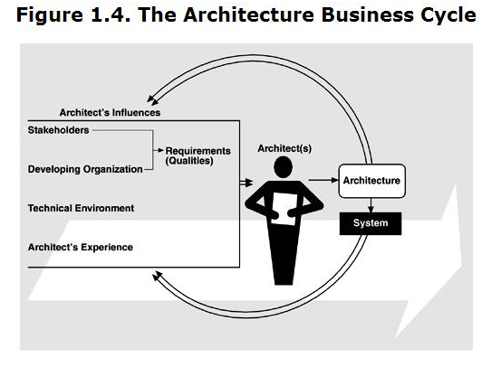

图 5架构的商业周期

**说明**：架构的影响因素包括涉众, 开发组织, 技术环境, 架构师的经验。这些因素综合起来影响了架构师的设计。而架构师设计的架构又返回来影响到上述因素。(相互影响)

## 1.3   参考架构

参考架构指概念性模型，通用的、与技术无关的概念架构。

### 1.3.1   大数据

详见 [《大数据开发》](../../media/大数据和/bigdata/大数据开发.md)

### 1.3.2   云计算

参见 工信部《云计算标准化白皮书（2014）》

 

表格 1 云计算-CCRA用户视图表

| 角色   | 子角色   | 活动       |
| ---------------------- | ---------------- | ---------- |
| 云服务客户     | 云服务用户       | 使用云服务 |
| 云服务管理者   |  |    |
| 业务管理者     |  |    |
| 云服务集成者   |  |    |
| 云服务提供者   | 云服务运营管理者 |    |
| 云服务部署管理者       |  |    |
| 云服务管理者   |  |    |
| 云服务业务管理者       |  |    |
| 客户支持和服务代表     |  |    |
| 跨云提供者     |  |    |
| 云服务安全和风险管理者 |  |    |
| 网络提供者     |  |    |
| 云服务协作者   | 云服务开发者     |    |
|        | 云审计者  |    |
|        | 云服务代理者     |    |

说明：角色分三类分别是云服务的客户、提供者和协作者。

   

   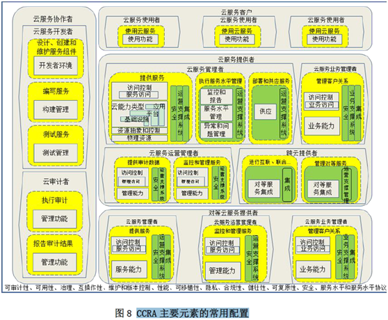

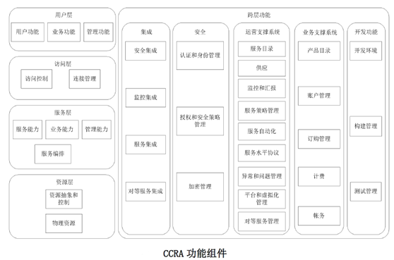

图 6 云计算-CCRA功能视图

说明：功能分五层分别是用户层、访问层、服务层、资源层和跨层功能。

 

### 1.3.3   区块链

来自于 工信部《2018年中国区块链产业白皮书》 

参考  [《区域链技术》](../../media/领域开发/区域链技术.md)

 

### 1.3.4   SOA参考架构

来自于 IBM SOA RA & TOGAF。

一个符合SOA思想的应用系统，其组成元素包括：SOA基础技术平台、实现业务功能的业务服务、各种已经存在的应用系统和数据资源、使用各种业务服务的服务消费者（应用程序），以及建立SOA应用系统和监控系统运行的辅助工具集，当然还需要有建设、使用和维护这些系统的各类人员。

   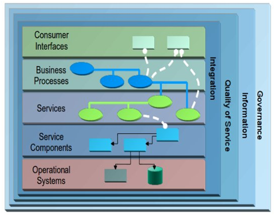

图 7 SOA RA 逻辑解决方案视图

SOA 组合功能是在操作系统层和组件层实现。公开的界面则是由服务层提供。

SOA RA 作为一个整体提供框架来支持所有 SOA 元素，包括支持服务及其交互的所有组件。

SO A RA分四纵五横，五横分层服务，自底向上分别是操作系统层、服务组件层、服务层、业务流程层和消费层。四纵包含一些横切关注点 (cross cutting concerns)，比如集成、信息、服务质量和治理。

 

SOA 参考架构定义了一个标准的服务分类方案。这里的服务可根据它们的行动来分类，下图显示了一个功能分类方案，用于在典型企业中发现服务。

   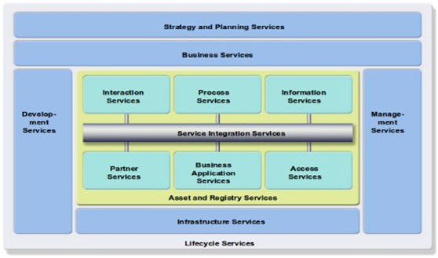

图 8 SOA服务类型

 

### 1.3.5   智慧城市 

来自于 工信部《智慧城市标准化白皮书（2014）》

 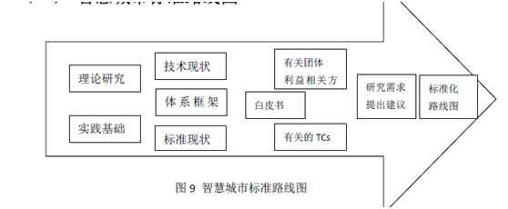

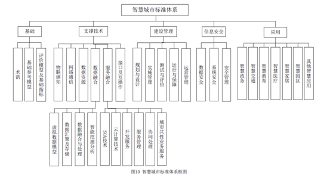

图 9 智慧城市标准体系框图

 

### 1.3.6   中台战略 

阿里2015年开始，业务首先推行数据、业务双中台战略。

 

## 1.4   本章参考

[1].  Lambda架构已死，去ETL化的IOTA才是未来  https://blog.csdn.net/np4rHI455vg29y2/article/details/79936779 

[2] .  Enterprise architecture](https://en.m.wikipedia.org/wiki/Enterprise_architecture) https://en.m.wikipedia.org/wiki/Enterprise_architecture 

[3].   Architectural pattern https://en.m.wikipedia.org/wiki/Architectural_pattern 

# 2   架构设计理论

## 2.1  架构视图view

**架构视图**：用来从不同角度描述系统.描述中涵盖了系统的某一特定方面,而忽略了与此方面无关的实体。

多视图方法是业界广泛认同的一种架构设计思路，包括： 

*  SEI的3视图法： 模块视图、组件-连接器视图、分配视图。 

*  西门子的4视图法： 概念视图、模块视图、代码视图、执行视图。 

*  RUP的4+1视图法： 用例视图、逻辑视图、实现视图（开发视图 + 进程视图）、部署（物理）视图。 

*  联邦企业架构框架： 技术架构视图、信息架构视图、应用架构视图、业务架构视图。

 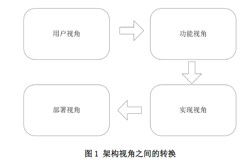

   

图 10 架构视图之间的转换

说明：一般会从四个视角分析，分别是用户、功能、实现和部署。

| 视角 | RUP四视图  | 4+1  | 三视图 |
| ---- | ---------- | ------------ | ------ |
| 用户 | 用例       | 无   | 无     |
| 功能 | 无  | 无   | 无     |
| 实现 | √  | √    | 无     |
| 部署 | √  | √    | 无     |
| 其它 | 多逻辑视图 | 多逻辑、进程 |        |

 

### 2.1.1   RUP四视图法

来源于IBM RUP(Rational l Unified Process)，统一软件开发过程。

表格 2 RUP 4视图法列表

| 视图  | 简述  | 涉及图例       |
| ------------------------------------------------------------ | ------------------------------------------------------------ | -------------------------------------- |
| 用例视图   Usecase   | 它主要是作为需求分析阶段的一个主要利器，是外部用户所能观察到的功能。 包括用例和场景，它是用例模型的子集。 | 用例图、顺序图  |
| 逻辑视图   Logical  | 逻辑架构关注功能。其设计着重考虑功能需求。包括最重要的设计类、从这些设计类到包和子系统的组织形式，以及从这些包和子系统到层的组织形式。它还包括一些用例实现。它是设计模型的子集。 | 类图、状态机和对象图。  |
| 实现视图   Implement  | （实施/开发视图）包括实施模型及其从模块到包和层的组织形式的概览。其设计着重考虑开发期质量属性，如可扩展性、可重用性、可移植性、易理解性和易测试性等。 | 组件图。交互图、状态图、活动图、序列图 |
| （进程视图）运行架构关注进程、线程、对象等运行时概念，以及相关的并发、同步、通信等问题。只有在系统具有很高程度的并行时，才需要该视图。它是设计模型的子集。 | 类图与对象图（包括任务 - 进程与线程）、活动图。      |        |
| 部署视图Deployment   | 物理架构关注软件系统最终如何安装或部署到物理机器。其设计着重考虑“安装和部署需求”。只有在分布式系统中才需要该视图。它是部署模型的一个子集。 | 部署图  |

*备注：1.常用的UML建模软件如ROSE通常由四种视图组成，分别是用例、逻辑、组件和部署。其中用例、逻辑和部署视图一样。但组件视图演变成关注质量属性的两种视图，分别是关注开发期的开发视图和关注运行期的运行视图。*

*2.* *构架视图记录在软件构架文档中。您可以构建其他视图来表达需要特别关注的不同方面：用户界面视图、安全视图、数据视图等等。对于简单系统，可以省略 4+1* *视图模型中的一些视图。*

 

### 2.1.2   架构4+1视图法

[4+1 视图](https://en.m.wikipedia.org/wiki/4%2B1_architectural_view_model)，源于[Philippe Kruchten](https://en.m.wikipedia.org/wiki/Philippe_Kruchten)在 1997 年发表的《Architectural Blueprints – the 4+1 view model of software architecture》。

   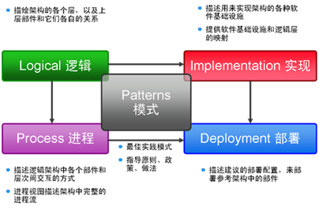

图 11 架构4+1视图法（2007版）

 

   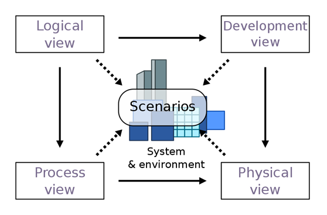

图 12 4+1 architectural view model （2005版）

备注：这个4+1视图与上面的已经差异较大。Develop被Implement替代；Physical被Deployment替代。Scenarios（一组用例集合）被Pattern替代。

 

### 2.1.3   SEI三视图法

来源：《构架实践v2》

表格 3 三视图法列表

| 视图    | 简述  | 涉及图例 |
| --------------- | ------------------------------------------------------------ | -------- |
| 模块分解视图    | 元素是模块, 把功能分配到模块。模块考虑的系统基于代码的表现方式。涉及到设计决策：系统是如何被组织为一个代码单元集合(模块)的. |  |
| 组件-连接件视图 | 元素是组件,连接件。涉及到设计决策：系统是如何组织为一个具有运行时行为(组件)和交互(连接件)的元素集合. |  |
| 分配视图        | 分配视图展示了系统与非软件结构的外部元素之间的关系.  |  |

 

### 2.1.4   五视图法

来源: 温昱《一线架构师实践指南》

 

逻辑架构、开发架构、数据架构、运行架构、物理架构

**1.** **逻辑架构**

逻辑架构的重点是考虑软件功能性需求。

| No.  | 考虑的方面   | 产出物     | 工具       | 说明   |
| ---- | ------------------------------------ | ---------- | ---------- | ---------------------------------------------- |
| 1    | 系统功能划分为几个子系统与功能模块？ | 系统功能树 | 树型结构图 |        |
| 2    | 向什么用户提供什么样的功能？  | 用例模型   | UML用例图  | 体现用户和行为  |
| 3    | 每个功能都是怎样的操作流程与分支？   | 用例描述   | 用例描述表 | 含输入输出、事件流分析；   不要有界面描述      |
|      |      |    | UML活动图  | 进行业务流程分析，包括泳道图   |
| 4    | 如何通过界面与用户交互？怎样交互？   | 鲁棒分析   | 鲁棒图     | 通过对“用例描述表”进行原文分析法拣出名词和动词 |
| 5    | 应当设计哪些类与界面？怎样设计？     | 领域模型   | UML类图    |        |
| 6    | 与哪些外部系统接口？怎样接口？       | 接口描述   | UML类图    |        |

 

**2.** **开发架构**

开发架构重点关注的是开发编码实现方面的问题。

| No.  | 考虑的方面   | 产出物   | 工具  | 说明  |
| ---- | ------------ | ---------------------------------------- | ------------ | ---------------------------------------------------- |
| 1    | 分层结构设计 | 分层架构图（开发架构图）  | 各种绘图工具 | 好的分层结构支持自动化测试   |
| 2    | 开发技术选项 | 开发语言   开发框架   开发工具   |      | 考虑商用产品、开源框架、自研框架     |
| 3    | 模块划分     | 源码工程；Project目录结构；   分包(分库) |      |      |
| 4    | 开发规范     | 开发/编码规范文档；      |      |      |
| 5    | 软件质量属性 | 分析和决策结果   |      | 考虑运行期和开发期软件质量属性，并权衡利弊进行决策。 |

 

**3.** **数据架构**

数据架构不仅仅要考虑开发中涉及到的数据库，实体模型，也要考虑物理架构中数据存储的设计。

| No.  | 考虑的方面     | 产出物     | 工具   | 说明 |
| ---- | ---------------------------------------------- | -------------------------- | ---------------------- | ---- |
| 1    | 数据是集中还是分布存储的？如何考虑分布式存储？ | 数据架构图  |        |      |
| 2    | 领域模型到数据库表的转换？表结构关系的设计？   | 逻辑模型   物理模型   ER图 | Power Designer   Visio |      |
| 3    | 实体如何设计？充血模型和贫血模型？     | UML类图    |        |      |
| 4    | 使用什么数据库？关系型还是非关系型？   | 选型结果   |        |      |

 

**4.** **运行架构**

运行架构关注的不再是全局而是局部，着重关注那些关键点与难点，常常需要技术攻关与预研。主要考虑控制流、通讯机制、资源争用、锁机制、同步异步、并发、串行，同时也要考虑质量属性。

| No.  | 考虑的方面     | 产出物    | 工具 | 说明 |
| ---- | ------------------------------ | --------------------------------------------------------- | ---- | ---- |
| 1    | 运行：同步vs.异步；并发vs.串行 | 考虑开发架构中代码的实现。        |      |      |
| 2    | 交互：对象间交互；状态转换     | 考虑开发架构的合理性，到类、到接口、到代码。      |      |      |
| 3    | 质量：安全；可靠；可伸缩       | 考虑开发架构的合理性      |      |      |
| 4    | 性能：响应时间；吞吐量  | 估算：   在线人数、并发人数；   每秒事务量；   响应时间。 |      |      |

 

**5.** **物理架构**

物理架构主要考虑硬件选择和拓扑结构，软件到硬件的映射，软硬件的相互影响。

| No   | 考虑的方面     | 产出物     | 工具 | 说明 |
| ---- | -------------------------------------- | ------------------ | ---- | ---- |
| 1    | 网络方面：网络拓扑；网络设备；安全机制 | 拓扑图   安全规范  |      |      |
| 2    | 性能方面：可靠性、可伸缩性     | 需要什么样设备性能 |      |      |
| 3    | 部署方面：集中式还是分布式；组件部署   | 部署图     |      |      |

## 2.2   架构风格style

### 2.2.1  实践派分类

来自于<<面向模式的软件体系结构 - 卷1 模式系统>>POSA 1996

此书作者认为模式系统有两种分类方式，一是模式分类，可分为架构模式，设计模式和惯用法idiom。 二是问题分类，如下表。 

每个模式由｛语境，问题，解决方案｝组成。 

模式分类是按粒度进行区分：架构模式基于问题域；设计模式同GOF；惯用法是具体语言相关，如编程风格，C++中的引用计数等。

 

表格 4 实践派的架构分类列表

| 适用类别       | 体系结构模式名称       |
| ------------------------------ | ---------------------- |
| 结构   | Layered分层    |
| Pipes and filters 管道和过滤器 |        |
| blackboard黑板  |        |
| 分布式系统     | proxy代理      |
| 交互系统       | 模型-视图-控制器 (MVC) |
| 表示-抽象-控制 (PAC)   |        |
| 自适应系统     | 反射 reactor   |
| 微核   |        |

备注：1.  分层：可分为通用层~单个节点和应用服务层~多个节点。

### 2.2.2  学院派分类

来自于 《Software Architecture (Perspectives on an Emerging Discipline)》1996

这种分类影响最为广泛，大约从交互角度来考虑，此书作者认为架构模式等同于架构风格。

表格 5学院派的架构分类列表

| style分类   | style name      |
| ------------------- | --------------- |
| 基于数据流  | 批处理系统batch |
| pipes and filters   |  |
| 调用返回    | 主程序和子函数  |
| OO  |  |
| 分层layered  |  |
| 独立组件    | 进程通讯        |
| 事件系统-隐式调用   |  |
| 虚拟机VM    | 解释器  |
| Rule-baseed systems |  |
| 数据为中心  | 数据库databases |
| 黑板 blackboard     |  |
| Hypertext systems   |  |
| other       | distributes     |
| proxy       |  |
| MVC  |  |
| PAC  |  |
| ...  |  |

 

### 2.2.3  异构

异构是指系统由很多风格组合而成。组合方式有下面三种：

1) 层次结构：一个系统构件是某种风格, 而它的内部结构则是另一种风格; (最常用的)

2) 单一构件采用复合的连接件

 

### 2.2.4  架构风格的比较

表格 6 架构风格的比较列表

| 架构风格名     | 特点  | 优点  | 缺点  | 应用实例     |
| ---------------------------------------------- | ------------------------------------------------------------ | ------------------------------------------------------------ | ------------------------------------------------------------ | ------------------------------------------------------------ |
| pipe-filters   | 构件为filters, 拥有一个输入集和输出集,   连接件为pipe        | 1)支持模块重用,只要保证过滤器传输数据格式一致;2)易维护和扩展, 可增加修改filters; 3)支持特定分析; 4)具有天然的并发特性. | 1)导致处理过程的批操作;   2)维护数据流通讯困难;   3)filters需要解析输入输出数据, 降低了系统效率; | unix shell程序, 编译器       |
| OO     |      | 1)实现隐藏; 2)对象化的设计;  |      |      |
| 事件系统的隐式调用     | 分为两种,一是有事件集中分发的构件dispatcher; 另外一种是无集中分发的observer | 1)很好地支持重用, 通过事件注册,即可引入新的构件; 2)简化系统演变, 易更新构件. | 1)构件放弃自身对系统的控制,不能保证事件的及时响应;   2)对于需要通过事件传递的数据, 影响数据交换,影响性能 | 调试器的中断点事件; 数据库中一致性约束;      |
| 分层layered    | 包括N层结构。层与层之间通过接口提供调用,每层可以有自己的风格实现. | 1)支持分级抽象的系统设计;   2)支持扩展; 3)支持重用.  | 1)多层调用降低性能;  | 分层通讯协议  |
| 知识库  | 分为输入触发的传统数据库和中心数据结构状态触发的黑板知识库   |      |      | 传统数据库; 黑板     |
| 解释器  | 包括解释引擎,伪码存储区, 程序状态的数据,以及一个进度的DS     |      |      |      |
| 分布式处理     |      |      |      | c/s  |
| MVC：   Model-View-   Control | 三个组件各自分离, 当model变化时通过控制器事件通知给view.   view <--> control   <--> modle | 1)各个组件相互独立,互不影响.  | 1)不易理解;  | 擅长于处理交互界面.   首先出现在SmartTalk, 后在Java组件中广泛使用,如swing, sping, struts |
| PAC：   Presentation-   Abstraction-   Control | 类似MVC,只是MVC的控制侧重于视图ＩＯ处理，而PAC       |      |      |      |
| 三层架构(最常见的分层架构类型)  | WEB开发中常用, 分为表示层UI, 业务逻辑层BLL, 数据访问层DAL.   UI <--> BLL   <--> DAL | 1)具有分层结构的所有优点     | 1)具有分层结构的所有缺点     | 常用于WEB开发        |
| CORBA：        |      | 大而全, 互操作性和开放性好   | 庞大而复杂, 技术和标准更新较慢       | 199１年,   CORBA1.0  |
|        |      |      |      |      |

扩展阅读：[architectural patterns](http://en.wikipedia.org/wiki/Architectural_pattern_(computer_science))  [Model-View-Controller](http://en.wikipedia.org/wiki/Model-view-controller)　[Presentation-Abstraction-Control](http://en.wikipedia.org/wiki/Presentation-abstraction-control)

 

# 3  架构设计方法

## 3.1   ADD~属性驱动设计

### 3.1.1   ADD概述

ADD：Attribute Drive Design，ADD是最全面、最广泛使用的有文档记录的软件架构设计方法。

表格 7 ADD发展史

| 版本 | 发布时间 | 简介  | 缺点  |
| ---- | -------- | ------------------------------------------------------------ | ------------------------------------------------------------ |
| 1.0  | 2000.1   | 原为ABD~Architectual Base Design基于软件架构的设计。  |      |
| 2.0  | 2006.11  | 将质量属性和设计选择关联起来，详见《软件架构实践V3》。   ADD2.0的迭代总是由软件架构元素的选择和分解来驱动。 | 1).缺少敏捷开发环境的软件设计指导。2).没有提供如何开始设计过程的指导。3).没有明确考虑不同的设计 目标。   4).有时设计一个步骤是由关键的架构需求来驱动的。 |
| 2.5  | 2013.4   | 解决了ADD2.0太抽象以致于难于实现的缺点。     |      |
| 3.0  | 2015     | 快速设计迭代。显式地推广了参考架构。增加了架构关注点。       |      |

 

ADD把一组质量属性场景作为输入，并使用对质量属性实现和构架之间的关系的了解，对架构进行设计。

 

**构架驱动因素包括功能、质量、商业属性，这边主要考虑到质量属性。**

**ADD的步骤：**

1 首先选择要分解的模块

2 根据下列步骤对模块求精：

a. 从具体的质量场景和功能需求集合中选择构架驱动因素。
 　　　b. 选择满足构架驱动因素的构架模式（根据可以用来实现驱动因素的战术创建模式）。
 　　　c. 实例化模块并根据用例分配功能，使用多个视图进行表示。 
 　　　d. 定义子模块的接口。 
 　　　e. 验证并求精用例和质量场景，使它们成为子模块的限制。

3 对需要进一步分解的模块重复上述1,2步骤．分解模块通常从系统开始到子系统，再进一步将子系统分解成子模块．

 

**ADD 3.0的步骤**

1. 系统需求：用例模型、质量属性场景、约束条件和架构关注点。
2. 设计过程：评审输入 -> 多次迭代

| 步骤 | 简介     | 详述   |
| ---- | ------------------------------------------------ | ------------------------------ |
| 1    | 评审输入  | 建立用例与质量属性的重要性分级 |
| 2    | 通过选择驱动因子建立迭代目标     |        |
| 3    | 选择一个或多个系统元素来细化     |        |
| 4    | 选择一个或多个设计元素概念以满足选中的驱动因子。 |        |
| 5    | 实例化架构元素、分配职责和定义接口       |        |
| 6    | 草拟视图和记录设计决策   |        |
| 7    | 分析当前设计、评审迭代目标、实现设计 目的        |        |

根据系统类型遵循设计路线图：成熟/新兴领域的绿地系统、现存系统的棕地设计 

 

### 3.1.2   质量属性

**质量属性、质量模型**和**软件质量**

*  **质量属性**就是系统在生命周期过程中所表现出的各种特征。

*  **质量模型**，定义了不同的软件质量属性，目前主要有三种质量模型。

*  **软件质量**就是许多质量属性的综合体现。

 

系统从设计、实现到部署的整个过程中考虑质量属性的实现。质量属性包括下列三类：

*  系统内在的质量属性有多种，如：可用性、可修改性、性能、安全、可测试性、易用性、可移植、可重用、可集成。

*  受架构影响的商业属性包括：上市时间、成本和收益、所希望的系统生命周期的长短、目标市场、推出计划、与老系统的集成。

*  与架构本身相关的一些质量属性：如概念完整性、正确性和完整性、可构建性。

 

质量属性分类可分为开发期和运行期。

**构架战术**就是那些影响质量属性的设计决策。

**架构策略**是架构中所采用的战术的集合。

 

强烈推荐＂质量属性-->场景-->战术（决策）＂表来分析质量属性．

### 3.1.3   质量模型

比较常见的三个**质量模型**Quality Model是McCall模型（1977年）、Boehm模型（1978年）和ISO9126（1993年）。

 

表格 8 三大质量模型列表

| 质量模型     | 简介  | 软件质量属性（特征）  |
| -------------------- | ------------------------------------------------------------ | ------------------------------------------------------------ |
| McCall模型（1977年） | 分为三层：**因素**、**衡量准则**、**度量**。   正确性、可靠性等被称为软件质量因素，它表现了系统可见的行为化特征。   每一因素又由一些准则来衡量，而准则是跟软件产品和设计相关的质量特征的属性。例如,正确性由可跟踪性、完全性、相容性来判断;每一准则又有一些定量化指标来计量,指标是捕获质量准则属性的度量。 | 软件质量从两个层次去分析：外部和内部。   McCall定义了11个软件外部质量特性,称为软件的质量要素,它们是正确性、可靠性、效率、完整性、可使用性、可维护性、可测试性、灵活性、可移植性、重复使用性和连接性。   定义了23个软件的内部质量特征,称之为软件的质量属性,它们是完备性、一致性、准确性、容错性、简单性、模块性、通用性、可扩充性、工具性、自描述性、执行效率、存储效率、存取控制、存取审查、可操作性、培训性、通信性、软件系统独立性、机独立性、通信通用性、数据通用性和简明性。   软件的内部质量属性通过外部的质量要素反映出来。 |
| Boehm模型（1978年）  | Boehm提出的概念的成功之处在于它包含了硬件性能的特征,这在McCall模型中是没有的。 | 定义了19个质量特征。  |
| ISO9126（1993年）    | 这个模型中第一层（质量特性）和第二层（准则）关系非常清楚，没有像McCall模型和Boehm模型的那种交叉关系。 | 从三个层次来分析即内部质量，外部质量和使用质量，这三者之间都是互相影响互相依赖。   定义了内部和外部质量的6大特征：功能性、可靠性、使用性、效率、可维护性和可移植性。大特征可以分成更多的子特征。   使用质量主要有四点：有效性，生产率，安全性，满意度。 |

 

   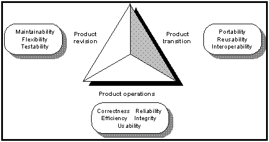

图 13 McCall Quality Model(1977)定义的11个外部质量属性

 

表格 9 常见的质量属性列表

| 质量属性 | 定义（质量场景）     | 战术  |
| -------- | ------------------------------------------------------------ | ------------------------------------------------------------ |
| 可用性   | 与系统故障及其相关后果有关。  | 容错（心跳机制）、备份（主备机、分布式存储、灾难存储）、预防（服务可移除、进程监控）、 |
| 可修改性 | 有关变更的成本问题。  | 属性修改（本地修改、改动接口、限制）、场景变动（开发、测试） |
| 性能     | 与时间相关。涉及到各种资源的使用如CPU/内存/带宽/存储等等。   | 资源需求（增大/减少资源）、资源管理（可重用资源cache、并发）、调度策略 |
| 安全性   | 衡量系统在向合法用户提供服务的同时,阻止非授权用户使用的能力。 | 防范攻击（验证用户、限制资源）、检测攻击、从攻击中恢复       |
| 可测试性 | 允许在完成软件开发的一个增量后，较轻松地对软件进行测试。     | 管理输入输出（各种单元测试、）、内部监控     |
| 易用性   | 对用户来说完成某个期望任务的容易程序和系统所提供的用户支持的种类。 | 分离用户接口、用户初始化（进入、退出）、系统初始化   |
| 其它     | 可配置性：   可伸缩性：   可移植性：  |      |

 

### 3.1.4  质量场景

http：//www.tar.hu/softarchpract/ch04lev1sec4.html

#### 3.1.4.1  质量场景的组成元素

使用场景来定义质量属性。包括6个部分。

| 场景元素 | 描述  |
| -------- | ------------------------------------------------------------ |
| 刺激源   | 这是某个生成该刺激的实体     |
| 刺激     | 此刺激是当刺激到达时系统需要考虑的条件       |
| 环境     | 此刺激在某些条件下发生       |
| 制品     | 某个制品被刺激       |
| 响应     | 此响应是在刺激后所采取的行动  |
| 响应度量 | 当响应发生后,应该能够以某种方式对响应进行度量,以对需求进行测试 |

 

​      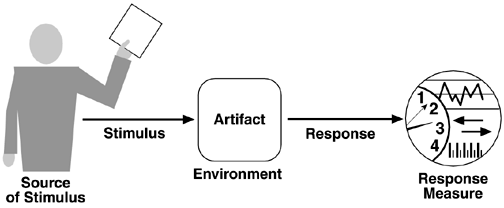

图 14 Quality attribute parts

 

#### 3.1.4.2  可用性的一般场景

可用性：与系统故障及其相关后果有关。

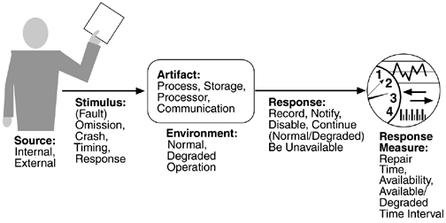

图 15 Availability general scenarios

 

| Portion of Scenario   场景组成/场景元素 | Possible Values   可能的值   |
| --------------------------------------- | ------------------------------------------------------------ |
| 源      | Internal to   the system; external to the system     |
| 刺激    | **Fault**：omission, crash, timing, response  |
| 制品    | System's   processors, communication channels, persistent storage, processes |
| 环境    | Norma*   operation;   degraded mode (i.e., fewer features, a   fall back solution) |
| 响应    | System   should detect event and do one or more of the following：  record it  notify appropriate parties, including the user and other systems  disable sources of events that cause fault or failure according to   defined rules  be unavailable for a prespecified interval, where interval depends on   criticality of system  continue to operate in normal or degraded mode |
| 响应度量        | Time   interval when the system must be available   Availability time   Time interval in which system can be in   degraded mode   Repair time |

备注：业界一般要求可用性在99.95左右（相当于5小时/年）。一般用N个9来衡量可用性指标。

 

#### 3.1.4.3  可修改性的一般场景

可修改性是有关变更的成本问题。

| 场景元素 | Possible Values      |
| -------- | ------------------------------------ |
| 源       | 最终用户、开发人员、管理人员  |
| 刺激     | 希望增加/删除/修改功能,质量属性,容量 |
| 制品     |      |
| 环境     |      |
| 响应     |      |
| 响应度量 |      |

 

#### 3.1.4.4  性能的一般场景

性能与时间相关。

| 场景元素 | Possible Values        |
| -------- | ---------------------------------------------- |
| 源       | 大量的独立源中的一个，可能来自系统内部  |
| 刺激     | 定期事件到达，随机事件到达，偶然事件到达       |
| 制品     | 系统   |
| 环境     | 正常模式；超载模式     |
| 响应     | 处理刺激；改变服务级别  |
| 响应度量 | 等待事件、期限、吞吐量、抖动、缺失率、数据丢失 |

 

#### 3.1.4.5  安全性的一般场景

安全性是衡量系统在向合法用户提供服务的同时,阻止非授权用户使用的能力。

| 场景元素 | Possible Values      |
| -------- | ------------------------------------------------------------ |
| 源       | 正确识别,非正确识别或身份未知的个人或系统; 经过了授权/未经授权 |
| 刺激     | 试图   显示数据,改变/删除数据,访问系统服务,降低系统服务的可用性 |
| 制品     | 系统服务,系统中的数据        |
| 环境     | 在线或离线, 联网或断网, 连接有防火墙或直接连到网络上  |
| 响应     |      |
| 响应度量 |      |

 

#### 3.1.4.6  可测试性的一般场景

软件可测试性是指通过测试(通常是基于运行的测试)揭示软件缺陷的容易程度.

| 场景元素 | Possible Values      |
| -------- | ------------------------------------------------------------ |
| 源       | 单元开发人员, 增量集成人员, 系统验证人员, 客户验收测试人员, 系统用户 |
| 刺激     | 已完成的分析, 设计, 架构, 类和子系统集成; 所交付的系统       |
| 制品     | 设计, 代码段和完整的应用     |
| 环境     | 设计时, 开发时, 编译时, 部署时       |
| 响应     | 提供对状态值的访问, 提供所计算的值, 准备测试环境     |
| 响应度量 |      |

#### 3.1.4.7  易用性的一般场景

易用性关注的是对用户来说完成某个期望任务的容易程序和系统所提供的用户支持的种类。

| 场景元素 | Possible Values |
| -------- | --------------- |
| 源       | 最终用户        |
| 刺激     |  |
| 制品     |  |
| 环境     |  |
| 响应     |  |
| 响应度量 |  |

 

### 3.1.5  质量战术

#### 3.1.5.1  可用性战术

目标：阻止错误发展为故障, 至少能够把错误的影响限制在一定范围内, 从而使修复成为可能.

   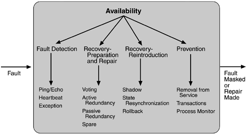

图 16 Summary of availability tactics

分布式系统要求高可用性。

案例如MySQL的高可用性

*  单机：二进制日志Binlog、InnoDB Redo Log

*  集群：主从同步机制，包括异步复制、半同步复制、全同步复制。

说明：互联网分层系统的高可用，是通过每一层的冗余+自动故障转移来综合实现的。

 

#### 3.1.5.2  可修改性战术

**目标**：　控制实现，测试和部署变更的时间和成本．

   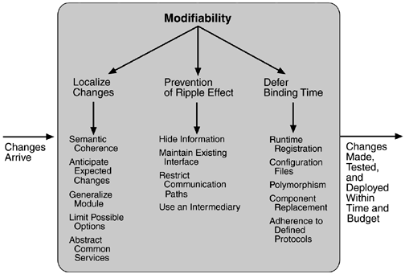

图 17 Summary of modifiability tactics

 

#### 3.1.5.3  性能战术

**目标**：　对在一定时间限制内到达系统的事件生成一个响应．

   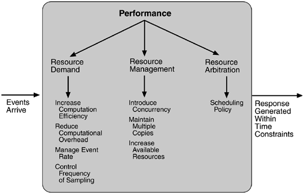

图 18  Summary of performance tactics

说明：互联网的高并发扩展方式有垂直和水平两种途径。垂直扩展通过提高单机硬件或架构性能，来提高并发性。但分布式架构真正解决途径是要通过水平扩展来实现。

互联网分层架构中，各层次**水平扩展**的实践又有所不同：

（1）反向代理层可以通过“DNS轮询”的方式来进行水平扩展；

（2）站点层可以通过nginx来进行水平扩展；

（3）服务层可以通过服务连接池来进行水平扩展；

（4）数据库可以按照数据范围，或者数据哈希的方式来进行水平扩展；

各层实施水平扩展后，能够通过增加服务器数量的方式来提升系统的性能，做到理论上的性能无限。

 

#### 3.1.5.4  安全性战术

**目标**：　系统检测，抵抗或从攻击中恢复过来．

   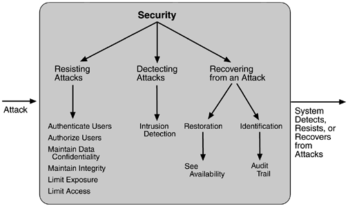

图 19 Summary of tactics for security

 

#### 3.1.5.5  可测试性战术

**目标**：　允许在完成软件开发的一个增量后，较轻松地对软件进行测试。

   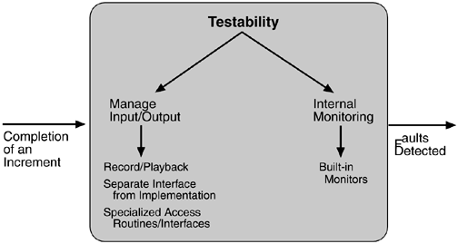

图 20 Summary of testability tactics

 

#### 3.1.5.6  易用性战术

**目标**：　为用户提供适当的反馈和协助．

   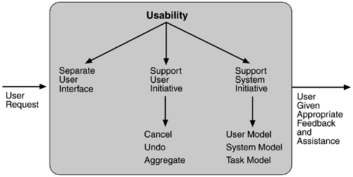

图 21 Summary of runtime usability tactics

 

#### 3.1.5.7  其它战术

可配置性战术包括数据，功能，界面，流程可配置等。

可伸缩性战术包括应用服务器的水平扩展，数据库层的水平扩展等。

其它如可移植性等略

 

### 3.1.6   本章参考

## 3.2   DDD~领域驱动设计

2004年著名建模专家Eric Evans发表了他最具影响力的书籍：《Domain-Driven Design –Tackling Complexity in the Heart of Software》(中文译名：领域驱动设计—软件核心复杂性应对之道)，书中提出了“领域驱动设计(简称 DDD)”的概念。

领域驱动设计事实上是针对OOAD的一个扩展和延伸，DDD基于*面向对象分析与设计技术*，对技术架构进行了分层规划，同时对每个类进行了策略和类型的划分。

 

领域模型是领域驱动的核心。采用DDD的设计思想，业务逻辑不再集中在几个大型的类上，而是由大量相对小的领域对象(类)组成，这些类具备自己的状态和行为，每个类是相对完整的独立体，并与现实领域的业务对象映射。**领域模型**就是由这样许多的细粒度的类组成。基于领域驱动的设计，保证了系统的可维护性、扩展性和复用性，在处理复杂业务逻辑方面有着先天的优势。

### 3.2.1   DDD的分层架构和构成要素

   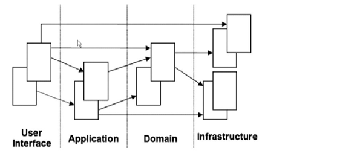

图 22 DDD分层架构

 

整个架构分为四层，其核心就是领域层（Domain），所有的业务逻辑应该在领域层实现，具体描述如下：

| 用户界面/展现层 | 负责向用户展现信息以及解释用户命令。  |
| --------------- | ------------------------------------------------------------ |
| 应用层  | 很薄的一层，用来协调应用的活动。它不包含业务逻辑。它不保留业务对象的状态，但它保有应用任务的进度状态。 |
| 领域层  | 本层包含关于领域的信息。这是业务软件的核心所在。在这里保留业务对象的状态，对业务对象和它们状态的持久化被委托给了基础设施层。 |
| 基础设施层      | 本层作为其他层的支撑库存在。它提供了层间的通信，实现对业务对象的持久化，包含对用户界面层的支撑库等作用。 |

 

那么如何在去实现领域驱动设计呢？我们总结了以下四个步骤：

1)   确定**业务服务**（Business Service）：根据业务需求和功能模块划分，确定业务单元，每个Business Service是一个内聚的业务单元，覆盖相关的领域对象。

2)    定义**领域对象**（Entity， VO）：根据业务单元的业务逻辑定义领域对象，通过UML方法和设计模式描述领域对象。

3)    定义领域对象的属性和关联关系：确定领域对象的各种属性和各个领域对象之间的关联关系。

4)    为领域对象增加**行为**：根据业务需求（系统用例和界面原型等）为领域对象增加行为，并定义哪些方法要被业务服务引用。

 

**DDD设计评价**：（作者按）DDD与面向对象设计的思路是一致的。

面向对象是先从用例中提取中对象，再找出对象的属性和相互关系。最后从对象中浒生中类。DDD的设计是用业务对象取代用例对象，用领域对象取代粗粒度对象类，用定义领域对象属性和关系时取代粗粒度对象的设计细化，最后定义类的形为。

## 3.3   MDA~模式驱动的架构

MDA：Model-driven architecture

2001年MDA被OMG（Object Management Group 国际对象管理集团）提出，OMG定义的一个软件开发框架。

在OMG的蓝图中，UML、MOF、XMI、CWM等一系列标准分别解决了MDA的模型建立、模型扩展、模型交换、模型变换这几个方面的问题。

MDA的三个主要目标是：通过架构性的分离来实现轻便性、[互操作性](https://baike.baidu.com/item/互操作性)和可重用性。

 

### 3.3.1   MDA流程

在MDA中软件开发过程是由软件系统的建模行为驱动的。

MDA生命周期和传统生命周期没有大的不同，主要的区别在于开发过程创建的工件，包括PIM（Platform Independent Model，平台无关模型）、PSM（Platform specific Model，平台相关模型）和代码。

 

MDA的流程 MDA的实现主要集中在以下3个步骤：

1 首先，您用UML对您的应用领域进行高度抽象的建模，这个模型和实现它的技术（或者底层技术）完全没有关系。这个模型我们称之为平台无关模型(PIM)。

2 然后，PIM将被转换为一个或多个平台相关模型(PSM)。这个翻译的过程一般是自动实现的。PSM将用一个特定的实现技术来描述您的系统。它将用到这种技术所提供的种种架构，比如EJB，数据库模型](https://baike.baidu.com/item/数据库模型)，[COM组件](https://baike.baidu.com/item/COM组件)等等。

3 最后，PSM将被翻译成源代码。因为每个PSM已经完全依靠某种特定的技术，这个步骤一般是比较简单的。

MDA流程中最难的一步，是从PIM生成一个PSM。它要求您对您要应用的基础技术具有丰富且巩固的知识，另一方面，源模型(PIM)必须具备自动生成PSM所要求的足够信息量。

## 3.4 数据驱动设计

 

## 本章参考

[1].   对软件架构设计的一些总结和理解 https://blog.csdn.net/cooldragon/article/details/48241965 

[2].   [Domain Driven Design](https://en.m.wikipedia.org/wiki/Domain_Driven_Design)

[3]. 微服务架构设计基础之领域驱动设计 https://zhuanlan.zhihu.com/p/54267289

# 4   架构设计过程

## 4.1   软件过程常用规范

**CMM：** SEI/ISO组织        软件过程改善模型(五个级别)

**RUP**：   IBM公司       统一软件过程

**MSF**：   MS公司        微软解决方案框架  人员与软件工程阶段中工作的对应

**UML**：OMG组织发布的统一建模语言,用于领域建模, Rose全面支持。(主用图形来表示)

软件开发方法：包括面向对象OO和面向过程OP两种。

敏捷开发Agile：这是软件过程方法。是指在软件开发过程中选择的一种开发方式。

 

* 一般的软件过程：

概念化阶段 -> 分析阶段 -> 架构设计阶段 -> 并行开发与测试阶段 -> 验收与交付阶段

 ──┬──    ──┬─    ───┬──    ────┬────    ───┬──

​     ↓    ↓    ↓        ↓  ↓

​    愿景  需求  架构   可执行系统  交付的系统

 

* 软件架构设计过程：

需求分析 -> 领域建模 -> 确定关键需求 -> 概念性架构设计 -> 细化架构 -> 验证架构

   │        │    └──────┬──────┘    └────┬──┘

   │        │      概念性架构     实际架构

   └───┬────┘  └───────┬──────┘

​        分析阶段    架构设计阶段  

 

 

## 4.2   架构描述

 

## 4.3   架构评审

构架评审的常用方法可以分为两类：ATAM、SAAM。(都来自于CMU SEI)

构架评审有多方面的好处，例如：财务上的收益、强制为评审做的准备、捕获构架设计的基本思想、在早期检测中发现问题、验证需求、改进构架（任选四个）。

### 4.3.1  ATAM

**ATAM**：Architecture Tradeoff  Analysis Method。ATAM是评估软件构架的一个健壮的方法。在该方法中，项目决策者和涉众要清晰地阐述一个准确的质量属性需求列表（以场景的方式），并说明与实现每个高优先场景相关的构架决策。然后，把这些决策确定为有风险决策或无风险决策，以找到构架中任何存在问题的地方。

 

1) ATMM**的参与人员**：评估小组，项目决策者，构架风险承担者。

**2) ATMM的过程**

**四个阶段：**

| 第0阶段 | 建立评估小组，评估小组和项目决策者共同确定评估细节。  | 关系和准备     |
| ------- | ------------------------------------------------------------ | -------------------------------------- |
| 第1阶段 | 以架构为中心，重点获取架构信息并对其进行分析。       | 评估阶段，上面的9 个步骤    在这时完成 |
| 第2阶段 | 以风险承担者中心，重点为获取风险承担者的观点，并对第1阶段的结果进行验证。 |        |
| 第3阶段 | 后续阶段，评估小组自我检查和改进、提交书面报告。     | 后续工作       |

 

ATAM九个步骤(评估阶段)

表格 10 ATAM评估步骤

| 四部分  | 九步   骤    | 主   要活动者        | 活   动      | 目   的      |
| ---------------------- | ------------------------------------ | ------------------------------------------------------------ | ------------------------------------------------------------ | -------------------------------------------- |
| 1. 表述        | 1> ATAM方法的表述;   | 评估负责人   | 向评估参与者介绍ATAM方法并回答问题。    a. 评估步骤介绍    b. 用于获取信息或分析的技巧：效用树的生成、基于架构方法的获取和分析、对场景的集体讨论及优先级的划分    c.  评估的结果：所得出的场景及其优先级，用以理解和评估架构的问题、描述架构的动机需求并给出带优先级的效用树、所确定的一级架构方法、所发现的有风险决 策、无风险决策、敏感点和权衡点等 | 使参与者对该方法形成正确的预期       |
| 2> 商业动机的表述;     | 项目发言人    （项目经理或系统客户） | 阐述系统的商业目标 (ABC)    a. 系统最重要的功能：客户和开发组织    b. 技术、管理、政治、经济方面的任何相关限制    c. 与项目相关的商业目标和上下文    d. 主要的风险承担者    e. 架构的驱动因素（即促使形成该架构的主要质量属性目标） | 说明采用该架构的主要因素    （如：高可用性，极高的安全性或推向市场的时机） |      |
| 3> 架构的表述;  | 架构设计师   | 对架构做出描述    a. 技术约束条件，诸如要使用的操作系统，硬件，中间件之类的约束    b. 该系统必须要与之交互的其他系统    c. 用以满足质量属性的架构方法    d. 对最重要的用例场景及生长场景的介绍 (表格：属性-场景-战术表) | 重点强调该架构是怎样适应商业动机的   |      |
| 2. 调查和分析  | 4> 确定架构方法      | 架构设计师   | 确定所用的架构方法,但不进行分析      |      |
| 5>  生成质量属性效用树 |      | 生成质量属性效用树,详细的根结点为效用，一直细分到位于叶子节点的质量属性场景， 质量属性场景的（优先级，实现难度）用高（H）、中（M）、低（L）描述；不必精确. (表格：质量效用表) | 得出构成系统效用的质量属性(性能等)；    具体到场景--刺激--响应模式，并划分优先级 |      |
| 6> 分析架构方法        |      | 根据上一步得到的高优先级场景，得出应对这一场景的架构方法并对其进行 分析    要得到的结果包括：    a. 与效用树中每个高优先级的场景相关的架构方法或决策；    b. 与每个架构方法相联系的待分析问题；    c.  架构分析师对问题的解答；    d.  有风险决策，无风险决策、敏感点和权衡点的确认。(表格：场景分析表) | 确定架构上的有风险决策、无风险决策、敏感点、权衡点等  |      |
| 3. 测试        | 7> 集体讨论,确定场景优先级   |      | 根据所有风险承担者的意见形成更大的场景集合. 场景分类：    a.  用例场景：描述风险承担者对系统使用情况的期望。    b.  生长场景：描述期望架构能在较短时间内允许的扩充与更改。    c.  探察场景：描述系统生长的极端情况，即架构在某些更改的重压的情况。 | 由所有风险承担者通过表决确定这些场景的优先级 |
| 8> 分析架构方法        |      | 对第6步重复，使用的是在第7步中得到的高优先级场景，这些场景被认为是迄今为止所做分析的测试案例.   (表格：风险和敏感点分析表) | 发现更多的架构方法，有风险决策、无风险决策、敏感点、权衡点等 |      |
| 4. 形成报告    | 9> 结果的表述        | 评估小组     | 根据在ATAM评估期间得到的信息（方法、场景、针对质量属性的问题、 效用树、有风险决策、无风险决策、敏感点、权衡点等），向与会的风险承担者报告评估结果。 |      |

 

**3) ATAM的结果**

输入：用场景集合捕获的质量要求

输出：粗糙的评价，可能包括

*  一个简洁的构架表述
*  表述清楚的业务目标
*  构架决策到质量需求的映射
*  所确定的敏感点和权衡点集合
*  有风险决策和无风险决策
*  风险主题的集合

*敏感点*：与某个质量属性相关的构架决策

权衡点：与多个质量属性相关的构架决策

有风险决策：根据所陈述的质量属性需求, 可能导致不期望结果的构架决策

无风险决策：根据分析, 被认为是安全的构架决策

 

**ATAM**常用表格：（示例：票务系统）

**表格1**：属性-场景-战术表

| 质量属性目标       | 质量场景     | 所采用的战术      |
| -------------------------- | ------------------------------------------------------------ | ------------------------- |
| 性能       | 用户访问的系统应该能在规定的时间内做出响应，如果系统由于网络或者数据库原因不能在规定时间内做出反应，那么系统应该提出警告，不能出现用户无故长时间等待的情况。 | 提高计算效率   缓冲池技术 |
| 易用性     | 遵从J2EE的系统提供了诸如JSP和servlet这样的Java技术，它们支持内容的渲染，以满足不同用户的需要 | 单独的用户接口    |
| 用JavaBean有效封装数据操作 | 封装通用类   |   |

 

**表格2**：质量效用表

质量效用树的作用是使质量属性需求具体化，从而迫使设计师和客户代表准确地定义出他们的质量需求。效用是系统的总体”适宜性”的表示。

最初的效用树是由架构设计师和关键开发人员创建的。在对场景进行集体讨论的过程和设置优先级的过程中，有很多风险承担者参与其中，与最初的效用树相比，两者之间的不匹配可以揭露架构设计师未曾注意到的方面，从而使得我们发现架构中的重大风险。

  质量属性属性求精场景 访问的安全性 在web数据库客户端，web服务器和数据库服 安全性务器之间，都应该有防火墙保护，防止网络上的非法数据请求。( M, H )

  数据的完整性：当出现异地订票点同时需要对通一张票请求操作时，系统必须保证数据库内数据的完整性。 可用性 异常检测和抛出 但用户企图输入不符合系统条件的查询或者订购不存在的票务的时候，系统必须检测出，并且抛出相应的异常，转入挂起操作。

 

表格3：场景分析表

| 场景号：XN02       | 场景：系统访问量达到高峰     |        |    |    |
| ---------------------------------- | ------------------------------------------------------------ | ------ | ---------- | ---------- |
| 属性       | 性能  |        |    |    |
| 环境       | 系统处于高峰时期     |        |    |    |
| 刺激       | 用户请求访问  |        |    |    |
| 响应       | 良好响应请求  |        |    |    |
| 构架决策   | 敏感点       | 权衡点 | 有风险决策 | 无风险决策 |
| 超出限制访问量的请求放在缓存队列里 | S1   |        | R1  |    |
| 缓存       | S2   |        | R2  |    |
| 推理       | 1 由于系统部署的是单应用服务器, 限制了并发访问数,不能保证用户随时登陆, 降低了用户的满意度。 2 单服务器的缓存数有限。 |        |    |    |

 

表格4：风险和敏感点分析表

| **采用战术**       | **敏感点(S)**        | **有风险决策(R)**  |
| ---------------------------------- | -------------------------------------------- | ---------------------------------------------------------- |
| 超出限制访问量的请求放在缓存队列里 | 提高了系统的稳定性和可用性, 减少了崩溃的可能 | 会降低最大并发数目, 使得用户等待时间过长, 可能造成用户不满 |
| 缓存       | 提高系统的访问速度和性能     | 缓存数目有限, 并发数目多的情况下,系统处理缓慢      |

 

表格5：质量属性列表

敏感点表S, 权衡点表T, 有风险表R, 无风险表N,

| 质量属性 | 编号   | 构造决策   |
| -------- | ------ | ---------------------------------- |
| 性能     | S1, R1 | 超出限制访问量的请求放在缓存队列里 |
| S2, R2   | 缓存   |    |

 

### 4.3.2  SAAM

 

### 4.3.3  ARID

ARID，active reviews for Intermediate Design。ARID最适合于对尚不完善的架构进行评估，在这一阶段，设计人员就是想搞清楚从要求使用该设计架构的其他部分的角度来看，所采用的设计方案是否合适。

### 4.3.4 架构评审常用方法的比较

表格 11 ATAM/SAAM/ARID的比较表

| 条目   | ATAM  | SAAM  | ARID  |
| -------------- | ------------------------------------------------------------ | ------------------------------------------------------------ | ------------------------------------------------------------ |
| 涉及的质量属性 | 不面向任何具体的质量属性，但据其历史，它更侧重于可修改性，安全性， 可靠性和性能。 | 主要是可修改性和功能。       | 设计方法和适宜性。   |
| 分析的对象     | 架构方法或样式；阐述过程、数据流、使用、物理或模块视图的架构文档。 | 架构文档，特别是阐述逻辑或模块视图的部分。   | 组件的接口规范。     |
| 适用阶段       | 在架构设计方法已经选定之后。  | 在架构已经将功能分配到各个模块中以后。       | 在架构设计期间。     |
| 采用的方法     | 利用效用树和对场景的集体讨论来搞清楚质量属性需求。通过对架构方法的 分析确定出敏感点、权衡点和风险。 | 利用对场景的集体讨论搞清楚质量属性需求。通过来验证功能或对更改成本 作出估计。 | 积极评审设计，对场景进行集体讨论。   |
| 资源需求       | 一般用3天的时间，另外还有预先的准备时间和之后的总结时间。参评人员 有客户、架构设计师、风险承担者和4人评估小组。 | 一般用2天时间，另外还有之后的总结时间，参评人员有客户、架构设计 师、风险承担者和3人评估小组。 | 一般用2天时间，另外还有预先的准备时间和之后的总结时间。参评人员有 架构设计师、设计人员、风险承担者和2人评估小组。 |

 

## 4.4   架构编档

1)  为用户编档．

2)  视图编档

3)  行为编档：如UML中的序列图和状态图。

4)  接口编档。

## 4.5   架构验证

验证架构的两种方法：
    **原型法**。
      对于项目型开发，常采用“原型法”。即对一组架构设计决策在非功能需求方面的满足程度进行验证。该原型往往是演进型，而非抛弃型。
    **框架法**。
      对于产品型开发，采用“框架法”有更多优点。该方法将架构设计方案用框架的形式实现，并在此基础上进行评估验证。在框架实现后，在框架基础上实现部分应用的功能，即实现一个小的垂直原型，从而进行实际非功能测试和开发期质量属性评价。

 

## 4.6   SAI 软件架构指数

 

## 本章参考

[1]. 软件架构 http://www.uml.org.cn/zjjs/zjjs-bk.asp

# 5   分布式架构

详见  [《分布式架构》](./分布式架构.md)

 

# 6    云原生架构

详见  [《云原生架构》](./云原生架构.md)

 

# 7   架构实例

架构实例指的是实际项目中的架构例子。

详见  [《软件架构实例》](./软件架构实例.md)

# 参考资料

## 参考链接

[1]  [architectural patterns](http://en.wikipedia.org/wiki/Architectural_pattern_(computer_science))
[2]  [List of software architecture styles and patterns](https://en.m.wikipedia.org/wiki/List_of_software_architecture_styles_and_patterns)
[3]  [http：//www.ics.uci.edu/~fielding/pubs/dissertation/top.htm](http://www.ics.uci.edu/~fielding/pubs/dissertation/top.htm)  Roy Fielding的博士论文《Architectural Styles and the Design of Network-based Software Architectures
[4]  基于J2EE的MVC设计模式的研究与实现  孙福振《山东理工大学学报（自然科学版）》 2006年2期

## 参考书目

备注：里克·卡斯曼（Rick Kazman）：CMU SEI首席研究员，是《软件架构设计 实用方法及实践》、《软件架构实践》和《软件架构评估》的作者，也是SAAM/ATAM/CBAM的创建者。

*  Kruchten.Philippe (1995, November). [Architectural Blueprints — The “4+1” View Model of Software Architecture.](http://www.cs.ubc.ca/~gregor/teaching/papers/4+1view-architecture.pdf) IEEE Software 12 (6), pp. 42-50.
*  Kruchten.Philippe 《Architectural Blueprints – the 4+1 view model of software architecture》，1997
*  Eric Evans 《Domain-Driven Design –Tackling Complexity in the Heart of Software》 2004
*  《企业应用架构模式》 Martin Fowler著 王怀民、周斌译 机械工业出版社 2004
*  《软件架构设计》  温昱 电子工业出版社  2007.5
*  《一线架构师实践指南》  温昱 电子工业出版社  2009.10
*  《[软件架构设计 : 程序员向架构师转型必备](https://book.douban.com/subject/10797944/)》  温昱 电子工业出版社  2012.7
*  《[领域驱动设计 : 软件核心复杂性应对之道 ](https://book.douban.com/subject/26819666/)》 Eric Evans / 赵俐、盛海艳、刘霞 / 人民邮电出版社 2016.6

 

# 附录

## 业界标准化组织

*  （IBM提交，published in December 2011.） Open Group Standard SOA Reference Architecture http://www.opengroup.org/projects/soa-ref-arch/  
*  TOGAF http://www.opengroup.org/subjectareas/enterprise/togaf 
*  CCRA, ISO/IEC 17789《信息技术云计算参考架构》(Cloud Computing Reference Architecture)，

 