| 序号 | 修改时间  | 修改内容         | 修改人 | 审稿人 |
| ---- | --------- | ---------------- | ------ | ------ |
| 1    | 2017-1-20 | 创建。           | Keefe  | Keefe  |
| 2    | 2017-8-20 | 更新若干流行框架 | 同上   |        |
| 3    | 2018-3-10 | 更新SSH框架      | 同上   |        |
|      |           |                  |        |        |

<br><br><br>

---

# 目录

目录

[TOC]
[目录... 1](#_Toc520839643)

[1       Java自身框架... 3](#_Toc520839644)

[1.1        JVM.. 3](#_Toc520839645)

[1.2        J2EE. 3](#_Toc520839646)

[1.2.1         Model 1: JSP + Beans（已淘汰）... 3](#_Toc520839647)

[1.2.2         Model 2: JSP + Servlet + Beans 4](#_Toc520839648)

[1.3        EJB模型... 5](#_Toc520839649)

[1.4        本章参考... 7](#_Toc520839650)

[2       Java SSH框架... 7](#_Toc520839651)

[2.1        SSH框架简介... 7](#_Toc520839652)

[2.2        Strucs 9](#_Toc520839653)

[2.2.1         Strucs架构原理篇... 9](#_Toc520839654)

[2.2.2         Strucs开发篇... 10](#_Toc520839655)

[2.2.3         struts项目实例: web_test 11](#_Toc520839656)

[2.3        Spring. 12](#_Toc520839657)

[2.3.1         Spring架构... 14](#_Toc520839658)

[2.3.2         Spring开发... 15](#_Toc520839659)

[2.4        Hibernate. 18](#_Toc520839660)

[2.4.1         Hibernate架构原理篇... 18](#_Toc520839661)

[2.4.2         Hibernate开发篇... 21](#_Toc520839662)

[2.5        本章参考... 23](#_Toc520839663)

[3       Java其它第三方框架... 24](#_Toc520839664)

[3.1        本章参考... 24](#_Toc520839665)

[4       Android框架... 25](#_Toc520839666)

[4.1        本章参考... 25](#_Toc520839667)

<br>

---

# 1  Java自身框架

表格 1 Java自身框架列表

| **框架名称** | **简介**              | **介绍** |
| -------- | ------------------- | ------ |
| J2EE     |                     |        |
| EJB      | Enterprise JavaBean |        |
| MVC      |                     |        |

## 1.1  JVM

详见 《Java开发》相应章节。

## 1.2  J2EE

J2EE的分层架构是设计模式MVC（详见 《软件设计系列》MVC模式）的优秀实践。Java平台的动态网站编程技术经历了Model 1和Model2两个阶段。

J2EE是SUN公司基于Java的体系结构，是4层结构，包括客户层(客户端), WEB层(JSP/Servlets), 业务层(Java Bean), EIS层(DBMS)

### Model1: JSP + Beans（已淘汰）

Model 1体系中，JSP页面充当VIEW+CONTROLLER的角色。控制逻辑和表现逻辑混在一起，代码可用性和维护性差，不利于大型项目开发。

​         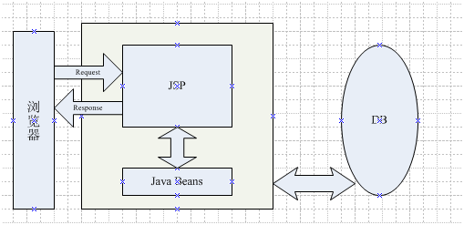

### Model2: JSP + Servlet + Beans

   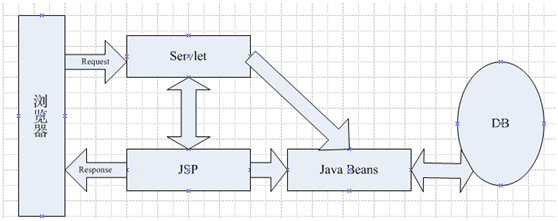

* Java Servlet：运行于服务器上的一个小程序, 提供应用程序接口, 通过它可以简单快速地开发并扩展服务器功能, 将来有可能取代CGI。Servlet处理业务逻辑。
* JSP：Java Server Page, 提供一种简单快速的方法来*创建动态网页*。JSP生成表示层的内容

Servlet 是在[服务器](http://baike.baidu.com/view/899.htm)上运行的小程序。这个词是在 Java [applet](http://baike.baidu.com/view/150834.htm)的环境中创造的，Java applet 是一种当作单独文件跟网页一起发送的小程序，它通常用于在客户端运行，结果得到为用户进行运算或者根据用户互作用定位图形等服务。

最早支持 Servlet 技术的是 JavaSoft 的 Java Web Server。此后，一些其它的基于 Java 的 Web Server 开始支持标准的 Servlet API。Servlet 的主要功能在于交互式地浏览和修改数据，生成动态 Web 内容。这个过程为：

1. 客户端发送请求至服务器端；
2. 服务器将请求信息发送至 Servlet；
3. Servlet 生成响应内容并将其传给服务器。响应内容动态生成，通常取决于客户端的请求；
4. 服务器将响应返回给客户端。

   

图 1 J2EE里的 MVC (JSP + Servlet + Beans)

说明：J2EE与MVC的关系

在实际WEB开发中, J2EE常采用MVC的设计模式. 具体做法是:

* 由JSP来充当视图V, 产生显示网页；
* 由Java Bean充当模型M处理请求；
* 控制器control由Servlets实现。

控制器流程如下:

1. 根据用户权限,导航到不同界面;
2. 根据用户功能请求, 实例化功能模块Bean；
   3..将Bean处理结果导航给JSP显示给客户端.

## 1.3  EJB模型

EJB-（Enterprise [JavaBean](https://baike.baidu.com/item/JavaBean)，企业Bean），是sun的JavaEE服务器端[组件模型](https://baike.baidu.com/item/组件模型)，设计目标与核心应用是部署分布式应用程序。简单来说就是把已经编写好的程序（即类）打包放在服务器上执行。

EJB是基于Java开发、部署服务器端分布式组件的标准规范。

EJB是J2EE(javaEE)的一部分，定义了一个用于开发基于组件的企业多重应用程序的标准。其特点包括[网络服务](https://baike.baidu.com/item/网络服务)支持和核心开发工具(SDK)。

在J2EE里，EJB称为Java 企业Bean，是Java的核心代码，包括三种Bean：

* 会话Bean（Session Bean），
* 实体Bean（Entity Bean）
* 消息驱动Bean（MessageDriven Bean）。

在EJB3.0推出以后，实体Bean被单独分了出来，形成了新的规范[JPA](https://baike.baidu.com/item/JPA)。

表格 2 EJB版本

| 版本      | 说明     | 特性        |
| ------- | ------ | --------- |
| EJB 1.0 |        |           |
| EJB 2.0 | 太过于复杂。 |           |
| EJB 3.0 |        | 更加简单和轻量化。 |

EJB 从技术上而言不是一种"产品",EJB 是一种描述了构建应用组件要解决的标准：

* 可扩展 (Scalable)
* 分布式 (Distributed)
* [事务处理](https://baike.baidu.com/item/事务处理)(Transactional)
* [数据存储](https://baike.baidu.com/item/数据存储)(Persistent)
* 安全性 (Secure)

   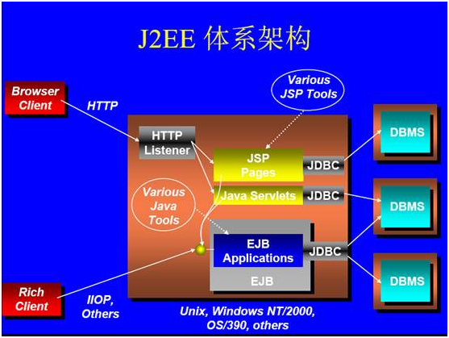

图 2 J2EE体系结构（彩色版）

说明：

* Java Servlet：运行于服务器上的一个小程序, 提供应用程序接口, 通过它可以简单快速地开发并扩展服务器功能, 将来有可能取代CGI。

* **JSP**：Java Server Page, 提供一种简单快速的方法来*创建动态网页*。Java Servlets的一种扩展。

* **EJB：**Enterprise Java Bean即企业Beans, 定义了一个应用程序接口, 可以使程序员快速开发,发布和管理跨平台的基于组件的企业级应用程序。

* **JDBC**：Java的数据库访问接口, 通过它来访问DBMS.

   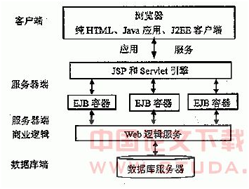

图 3 J2EE体系结构

## 1.4   常见开源框架

表格 18 Java框架列表

| softwareName  | Desc                 | currnet  version | Copyright(c)         | License   | Note                                                                                   |
| ------------- | -------------------- | ---------------- | -------------------- | --------- | -------------------------------------------------------------------------------------- |
| tomcat        | web server           | 6.08  2006-10-24 | ASF                  | Apache2.0 | http://tomcat.apache.org/                                                              |
| spring        | MVC中的View  Framework |                  | 2002--  springsource | Apache2.0 | http://www.springsource.org  Author: Rod Johnson                                       |
| **Struts**    |                      |                  |                      |           | **Struts** 是一个基于Sun J2EE平台的MVC框架，主要是采用Servlet和JSP技术来实现的。                               |
| **Hibernate** | 持久层框架                |                  |                      |           | 一个开放源代码的对象关系映射框架，它对JDBC进行了非常轻量级的对象封装。                                                  |
| ibatis        | 持久层框架                |                  |                      |           | 相对于Hibernate,  ibatis 则要求开发者编写具体的SQL 语句                                                |
| **Quartz**    | Job调度                |                  |                      |           |                                                                                        |
| **Velocity**  | 模板引擎                 |                  |                      |           |                                                                                        |
| **Eclipse**   | IDE                  |                  |                      |           | 2001年IBM开发并开源.  [http://www.Eclipse.org/downloads/](http://www.eclipse.org/downloads/) |
| NetBeans      | IDE                  |                  |                      |           |                                                                                        |
| XPlanner      | 项目管理                 |                  |                      |           |                                                                                        |

<br>

## 本章参考

[1]: EJB的体系结构 http://www.uml.org.cn/j2ee/2009112011.asp(http://www.uml.org.cn/j2ee/2009112011.asp)

[2]: EJB  https://baike.baidu.com/item/EJB

[3]: J2EE [http://Java.sun.com/developer/technicalArticles/J2EE/despat/](http://java.sun.com/developer/technicalArticles/J2EE/despat/)

<br>

# 2  Java SSH框架

**说明：涉及到分布式框架库，一般要使用J2EE。**

## 2.1 SSH框架简介

表格 3 Java SSH框架列表

| 框架名称                                     | 简介           | 介绍                                                                                   |
| ---------------------------------------- | ------------ | ------------------------------------------------------------------------------------ |
| [  Struts  ](https://struts.apache.org/) | Web框架        | Struts   是一个基于Sun J2EE平台的MVC框架，主要是采用Servlet和JSP技术来实现的。2001年诞生struts 1，最新版本是struts 2。 |
| [  Spring  ](https://spring.io/)         | J2EE/IOC/AOP | 作为EJB模型的一个替换选择，是IOC和AOP的容器框架。初版2003年发布，最新版本是Spring   3。                              |
| [  Hibernate  ](http://hibernate.org/)   | ORM持久层框架     | 一个开放源代码的对象关系映射ORM框架，它对JDBC进行了非常轻量级的对象封装。                                             |

*备注：SSH~ Struts + Spring + Hibrnate**，Java**最经典的开发框架组合。*

SSH框架是Java平台企业级的最基础的框架之一。

集成步骤总结：

1. 获取所有的依赖库(很多)。
2. 注册 Spring 的 ContextLoaderListener 来整合 Struts2 和 Spring。
3. 使用 Spring 的 LocalSessionFactoryBean 来集成 Spring 和 Hibernate。
4. 完成所有连接。

Struts 2 <-- (ContextLoaderListener) --> Spring <-- (LocalSessionFactoryBean) --> Hibernate

| 组件        | 配置文件及配置项                          | 配置项                                    | 主要源文件                   | 要点                            |
| --------- | --------------------------------- | -------------------------------------- | ----------------------- | ----------------------------- |
| Struts    | strucs.xml  <br>strucs.properties | 配置action                               | action类   需要实现execute方法 | action类需要struts.xml里配置action。 |
| Spring    | spring.xml   bean.xml             |                                        | bean类                   | bean类和bean.xml一一对应。           |
| Hibernate | hibernate.cfg.xml                 | dialect、driver、url、username、password等等 | ORM类                    | ORM类对应同名.hbm.xml              |

备注：WEB程序都要有一个配置文件web.xml，主要配置Filter。

**strucs.xml**

```xml
<?xml version="1.0" encoding="utf-8"?>
<package name="default" namespace="/" extends="struts-default">
  <!-- 定义一个名为user的Action，实现类为com.qst.chapter02.action.UserAction   -->
  <action name="user" class="com.qst.chapter02.action.UserAction">
    <!-- 配置execute()方法返回值与视图资源之间的映射关系 -->
    <result name="success">/result.jsp</result>
    <result name="error">/error.jsp</result>
  </action>
</package>
```

**hibernate.cfg.xml**

```xml
<?xml version="1.0" encoding="utf-8"?>
<hibernate-configuration>
  <session-factory>
    <!-- 配置访问Oracle数据库参数信息 -->
    <property name="dialect">org.hibernate.dialect.OracleDialect</property>
    <!-- 注册所有ORM映射文件 -->
    <mapping resource="com/qst/chapter05/pojos/Student.hbm.xml"/>
  </session-factory>
</hibernate-configuration>
```

## 2.2 Strucs

### 2.2.1   Strucs架构原理篇

strucs 2是典型的MVC模式。

   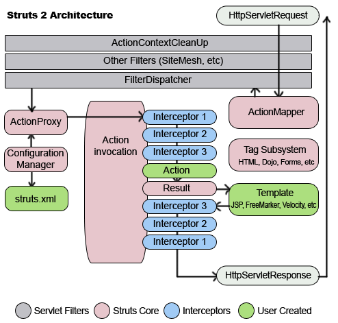

图 4 Struts 2 framework

说明：

1. struts 2是以webwork为核心，采用拦截器interceptor的机制对用户的请求进行处理。挡截器机制使得用户的业务逻辑控制器与servlet api完全分离，业务逻辑控制器更像一个POJO。

2. user created颜色部分是指项目中项目需要实现的。如业务控制器类、视图页面和struts.xml里配置业务控制器。

### 2.2.2   Strucs开发篇

#### 配置

**常量的定义**

```shell
<br>

-------------->  常量加载顺序 ------------->
strucs.xml --> strucs.properties --> web.xml
<--------------  常量覆盖顺序 <-------------
```

action的实现方式：实现接口Action，继承ActionSupport，访问ActionContext。

result的处理方式：

#### JSP标签库

ONGL：Object-Graph Navigation Language, 对象图导航语言。是一种功能强大的表达式语言，提供了存取对象属性、调用对象方法、遍历对象结构图、对象类型转换的特定语法。

JSP标签库：类似HTML里的标签，能够简化JSP的编写。

标签分类：

* UI标签：分表单（如checkboxlist/datetimepicker/doubleselect/optgroup/optiontransferselect等）和非表单（如actionerror/actionmessage/tree/treenode等）

* 非UI标签：分流程控制（如iterator）和数据访问（如bean, include, param, property, set, url）。

* AJAX标签：如

标签库的导入：JSP中使用taglib指令引入标签库。

`<%@taglib prefix="s" uri="/struts-tags"%>`

标签库的三个符号：#（变量） %（字符串） $（范围）

**模板和主题**

* 模板：就是代码。在struts 中通常用FreeMarker编写，标签使用这些代码能渲染生成相应的HTML代码。
* 主题：就是一系列模板的组合。

### struts项目实例: web_test

   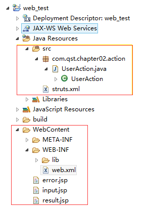

项目步骤

step 1: 新建项目 Dynamic web moduel

*step 2**：*配置struts框架，下载struts 2；复制lib下jar包到WEB-INF/lib。

step 3：配置WEB-CONTENT/WEB-INF/lib下的web.xml里的servlet Filter（核心控制器）

```xml
    <!-- 配置Struts 2框架的核心Filter -->
    <filter>
        <!--过滤器名 -->
        <filter-name>struts2</filter-name>
        <!--  配置Struts 2的核心Filter的实现类  -->
        <filter-class>org.apache.struts2.dispatcher.ng.filter.StrutsPrepareAndExecuteFilter</filter-class>
    </filter>
    <!--  让Struts 2的核心Filter拦截所有请求  -->
    <filter-mapping>
        <!--过滤器名 -->
        <filter-name>struts2</filter-name>
        <!-- 匹配所有请求 -->
        <url-pattern>/*</url-pattern>
    </filter-mapping>
```

step 4: 创建输入/输出/错误视图：input.jsp result.jsp error.jsp

step 5: 创建业务控制器：src目录下类com.qst.chapter02.action.UserAction

并配置源码src里的struts.xml里的action（业务控制器~用户自定义）。

```xml
    <package name="default" namespace="/" extends="struts-default">
        <!-- 定义一个名为user的Action，实现类为com.qst.chapter02.action.UserAction -->
        <action name="user" class="com.qst.chapter02.action.UserAction">
            <!-- 配置execute()方法返回值与视图资源之间的映射关系 -->
            <result name="success">/result.jsp</result>
            <result name="error">/error.jsp</result>
        </action>
    </package>
```

step 6: 运行显示视图，启动tomcat，访问http://localhost:8080/web_test/input.jsp

   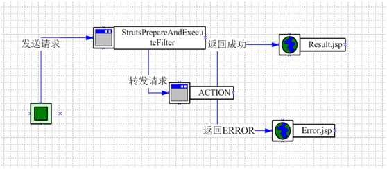

图 5 web_test项目运行流程图

## 2.3 Spring

Spring框架，由**Rod Johnson**开发，是一个非常强大的反转控制(IOC)框架，以帮助分离项目组件之间的依赖关系。Spring是一个轻量级的IOC和AOP的容器框架。

**Spring的目标：**

1、可以令人方便愉快的使用Spring。

2、应用程序代码并不依赖于Spring APIs。

3、Spring不和现有的解决方案竞争，而是致力于将它们融合在一起。

**Spring的基本组成：**

1、最完善的轻量级核心框架。

2、通用的事务管理抽象层。

3、JDBC抽象层。

4、集成了Toplink, Hibernate, JDO, and iBATIS SQL Maps。

5、AOP功能。

6、灵活的MVC Web应用框架。

* 控制反转——Spring通过一种称作控制反转（IoC）的技术促进了松耦合。当应用了IoC，一个对象依赖的其它对象会通过被动的方式传递进来，而不是这个对象自己创建或者查找依赖对象。你可以认为IoC与JNDI相反——不是对象从容器中查找依赖，而是容器在对象初始化时不等对象请求就主动将依赖传递给它。

* 面向切面——Spring提供了[面向切面编程](https://baike.baidu.com/item/面向切面编程)的丰富支持，允许通过分离应用的业务逻辑与系统级服务（例如审计（auditing）和事务（transaction）管理）进行内聚性的开发。应用对象只实现它们应该做的——完成业务逻辑——仅此而已。它们并不负责（甚至是意识）其它的系统级关注点，例如日志或事务支持。

* 容器——Spring包含并管理应用对象的配置和生命周期，在这个意义上它是一种容器，你可以配置你的每个bean如何被创建——基于一个可配置原型（prototype），你的bean可以创建一个单独的实例或者每次需要时都生成一个新的实例——以及它们是如何相互关联的。然而，Spring不应该被混同于传统的重量级的EJB容器，它们经常是庞大与笨重的，难以使用。

* 框架——Spring可以将简单的组件配置、组合成为复杂的应用。
  
  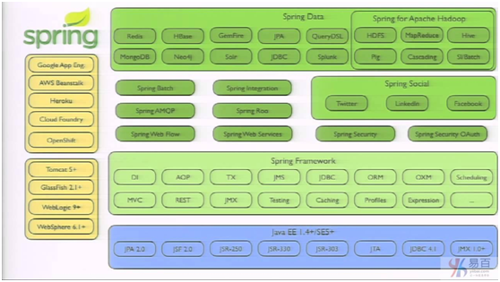

### 2.3.1    Spring架构

   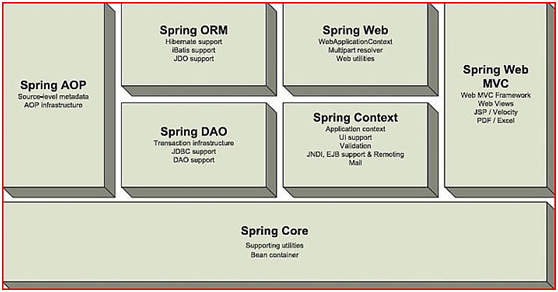

图 6 Spring framework

说明：spring七个组件，其中spring core必选，可与其它组件搭配使用。

**1. Spring Core核心容器**

这是Spring框架最基础的部分，它提供了依赖注入（DependencyInjection）特征来实现容器对Bean的管理。这里最基本的概念是BeanFactory，它是任何Spring应用的核心。BeanFactory是工厂模式的一个实现，它使用IoC将应用配置和依赖说明从实际的应用代码中分离出来。

**2. Spring Context应用上下文**

Spring 上下文是一个配置文件，向 Spring 框架提供上下文信息。Spring 上下文包括企业服务，例如 JNDI、EJB、电子邮件、国际化、校验和调度功能。核心模块的BeanFactory使Spring成为一个容器，而上下文模块使它成为一个框架。这个模块扩展了BeanFactory的概念，增加了对国际化（I18N）消息、事件传播以及验证的支持。

另外，这个模块提供了许多企业服务，例如电子邮件、JNDI访问、EJB集成、远程以及时序调度（scheduling）服务。也包括了对模版框架例如Velocity和FreeMarker集成的支持。

**3. Spring AOP** 面向切面编程

Spring在它的AOP模块中提供了对面向切面编程的丰富支持。这个模块是在Spring应用中实现切面编程的基础。为了确保Spring与其它AOP框架的互用性，Spring的AOP支持基于AOP联盟定义的API。AOP联盟是一个开源项目，它的目标是通过定义一组共同的接口和组件来促进AOP的使用以及不同的AOP实现之间的互用性。

**4. Spring DAO: JDBC抽象和DAO模块**

使用JDBC经常导致大量的重复代码，取得连接、创建语句、处理结果集，然后关闭连接。Spring的JDBC和DAO模块抽取了这些重复代码，因此你可以保持你的数据库访问代码干净简洁，并且可以防止因关闭数据库资源失败而引起的问题。

**5. Spring ORM** **对象/关系映射集成模块**

对那些更喜欢使用对象/关系映射工具而不是直接使用JDBC的人，Spring提供了ORM模块。Spring并不试图实现它自己的ORM解决方案，而是为几种流行的ORM框架提供了集成方案，包括Hibernate、JDO和iBATIS SQL映射。Spring的事务管理支持这些ORM框架中的每一个也包括JDBC。

**6. Spring Web**

Web上下文模块建立于应用上下文模块之上，提供了一个适合于Web应用的上下文。另外，这个模块还提供了一些面向服务支持。例如：实现文件上传的multipart请求，它也提供了Spring和其它Web框架的集成，比如Struts、WebWork。

**7. Spring MVC**

MVC 框架是一个全功能的构建 Web 应用程序的 MVC 实现。通过策略接口，MVC 框架变成为高度可配置的，MVC 容纳了大量视图技术，其中包括 JSP、Velocity、Tiles、iText 和 POI。Spring为构建Web应用提供了一个功能全面的MVC框架。虽然Spring可以很容易地与其它MVC框架集成，例如Struts，但Spring的MVC框架使用IoC对控制逻辑和业务对象提供了完全的分离。

### 2.3.2    Spring开发

#### 2.3.2.1  Spring Core ~ IOC容器

IOC：控制反转（Inversion of Control，）把创建对象的权利交给框架,是框架的重要特征，并非[面向对象编程](https://baike.baidu.com/item/面向对象编程)的专用术语。它包括依赖注入（Dependency Injection，简称[DI](https://baike.baidu.com/item/DI)）和依赖查找（Dependency Lookup）。

​       IoC模式，系统中通过引入实现了IoC模式的IoC容器，即可由IoC容器来管理对象的生命周期、依赖关系等，从而使得应用程序的配置和依赖性规范与实际的应用程序代码分开。其中一个特点就是通过文本的配置文件进行应用程序组件间相互关系的配置，而不用重新修改并编译具体的代码。

​       当前比较知名的IoC容器有：Pico Container、Avalon 、Spring、JBoss、HiveMind、EJB等。在上面的几个IoC容器中，轻量级的有Pico Container、Avalon、Spring、HiveMind等，超重量级的有EJB，而半轻半重的有容器有JBoss，Jdon等。

​       可以把IoC模式看做是工厂模式的升华，可以把IoC看作是一个大工厂，只不过这个大工厂里要生成的对象都是在XML文件中给出定义的，然后利用Java 的“反射”编程，根据XML中给出的类名生成相应的对象。从实现来看，IoC是把以前在工厂方法里写死的对象生成代码，改变为由XML文件来定义，也就是把工厂和对象生成这两者独立分隔开来，目的就是提高灵活性和可维护性。

**IoC的缺点**

（1）生成一个对象的步骤变复杂了（事实上操作上还是挺简单的），对于不习惯这种方式的人，会觉得有些别扭和不直观。

（2）对象生成因为是使用反射编程，在效率上有些损耗。但相对于IoC提高的维护性和灵活性来说，这点损耗是微不足道的，除非某对象的生成对效率要求特别高。

（3）缺少IDE重构操作的支持，如果在Eclipse要对类改名，那么你还需要去XML文件里手工去改了，这似乎是所有XML方式的缺陷所在。

现有的框架实际上使用以下三种基本技术的框架执行服务和部件间的绑定：

| 类型  | 简介       | 详述                                               | 示例                            |
| --- | -------- | ------------------------------------------------ | ----------------------------- |
| 1   | 基于接口     | 可服务的对象需要实现一个专门的接口，该接口提供了一个对象，可以重用这个对象查找依赖(其它服务)。 | 早期的容器Excalibur                |
| 2   | 基于setter | 通过JavaBean的属性(如setter方法)为可服务对象指定服务。              | HiveMind和Spring               |
| 3   | 基于构造函数   | 通过构造函数的参数为可服务对象指定服务。                             | PicoContainer、HiveMind和Spring |

**实现策略**

IoC是一个很大的概念,可以用不同的方式实现。其主要形式有两种：

* 依赖查找：容器提供回调接口和上下文条件给组件。EJB和Apache Avalon 都使用这种方式。这样一来，组件就必须使用容器提供的API来查找资源和协作对象，仅有的控制反转只体现在那些回调方法上（也就是上面所说的 类型1）：容器将调用这些回调方法，从而让应用代码获得相关资源。

* 依赖注入：组件不做定位查询，只提供普通的Java方法让容器去决定依赖关系。容器全权负责的组件的装配，它会把符合依赖关系的对象通过JavaBean属性或者[构造函数](https://baike.baidu.com/item/构造函数)传递给需要的对象。通过JavaBean属性注射依赖关系的做法称为设值方法注入(Setter Injection)；将依赖关系作为构造函数参数传入的做法称为[构造器](https://baike.baidu.com/item/构造器)注入（Constructor Injection）

实现的关键

* BeanFactory：提供了Spring的配置框架和基本功能。

* ApplicationContext：ApplicationContext是BeanFactory的子接口，也被称为应用上下文。

**依赖注入1：Setter设值注入配置文件**

bean.xml

```xml
<?xml version="1.0" encoding="UTF-8"?>
<beans
    xmlns="http://www.springframework.org/schema/beans"
    xmlns:xsi="http://www.w3.org/2001/XMLSchema-instance"
    xsi:schemaLocation="
        http://www.springframework.org/schema/beans
          http://www.springframework.org/schema/beans/spring-beans-4.1.xsd">
    <bean id="book" class="com.qst.chapter08.Book">
        <property name="name" value="SSH开发" />
        <property name="author" value="qst" />
        <property name="publishHouse" value="某出版社" />
        <property name="price" value="70.25" />
    </bean>
</beans>
```

**依赖注入2：Constructor构造器注入配置文件**

```xml
<bean id="book" class="com.qst.chapter08.Book">
    <constructor-arg name="name" value="SSH开发" />
</beans>
```

示例：ApplicationContextExample.java

```java
import org.springframework.context.support.ClassPathXmlApplicationContext;

public class ApplicationContextExample {
    public static void main(String[] args) {
        ClassPathXmlApplicationContext context = new ClassPathXmlApplicationContext(
                "com/qst/chapter08/config/beans.xml");
        // 获取bean名称为order的属性id的值，定义在beans.xml
        Order order = (Order) context.getBean("order");
        System.out.println(order.getId());
        context.close();
    }
}
```

#### 2.3.2.2  Spring AOP

Spring AOP的模块化方面横切关注点。简单地说，就是一个拦截器拦截一些方法。

* [Spring AOP通知实例(Advice)](http://www.yiibai.com/spring/spring-aop-examples-advice.html) - 有关不同类型的 Spring 建议说明和示例。
* [Spring AOP实例(Pointcut, Advisor)](http://www.yiibai.com/spring/spring-aop-example-pointcut-advisor.html) - 有关不同类型的 Spring 的切入点和 Advisor 的解释和示例。
* [Spring AOP拦截器的顺序](http://www.yiibai.com/spring/spring-aop-interceptor-transaction-is-not-working.html) - AOP拦截器的顺序会影响功能。
* [自动代理创建者实例](http://www.yiibai.com/spring/spring-auto-proxy-creator-example.html) - 一个自动代理生成例子是用来为Bean自动创建代理对象，以避免造成许多重复的代理对象。

**AOP的实现策略**

1. Java SE动态代理：使用动态代理可以为一个或多个接口在运行期动态生成实现对象，生成的对象中实现接口的方法时可以添加增强代码，从而实现AOP。缺点是只能针对接口进行代理，另外由于动态代理是通过反射实现的，有时可能要考虑反射调用的开销。

2. 字节码生成（CGLib动态代理）：动态字节码生成技术是指在运行时动态生成指定类的一个子类对象，并覆盖其中特定方法，覆盖方法时可以添加增强代码，从而实现AOP。其常用工具是cglib。

3. 定制的类加载器：当需要对类的所有对象都添加增强，动态代理和字节码生成本质上都需要动态构造代理对象，即最终被增强的对象是由AOP框架生成，不是开发者new出来的。解决的办法就是实现自定义的类加载器，在一个类被加载时对其进行增强。JBoss就是采用这种方式实现AOP功能。

4. 代码生成：利用工具在已有代码基础上生成新的代码，其中可以添加任何横切代码来实现AOP。

5. 语言扩展：可以对构造方法和属性的赋值操作进行增强，AspectJ是采用这种方式实现AOP的一个常见Java语言扩展。

AOP中的切面封装了增强（Advice）和切点（Pointcut）。

Spring框架的AOP功能是通过JavaSE动态代理和cglib实现的。

#### 2.3.2.3  Spring MVC

## 2.4 Hibernate

Hibernate是典型的ORM模式。

POJO：Java普通对象。

### 2.4.1   Hibernate架构原理篇

   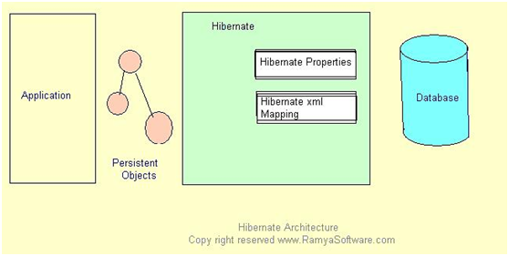

图 7 Hibernate部署视图

说明：Hibernate通过持久化对象（PO）这个媒介来对数据库进行操作，底层数据库对于应用程序来说是透明的。

   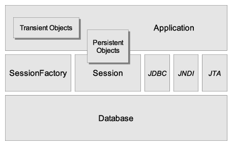

图 8 Hibernate架构

说明：

1. SessionFactory:生成session的工程，依赖ConnectionProvider。单个数据库映射关系经过编译后的内存镜像，线程安全的。
2. Session:应用程序与持久层之间交互操作的一个单线程对象。所有的持久化对象必须在Session管理下才能进行持久化操作。它底层封装了JDBC连接，是Transaction工厂。
3. 持久化对象（PO）：系统创建的POJO实例，一旦与特定的Session关联，并对应数据表的指定记录，该对象就处于持久化状态。
4. 瞬态对象：通过new等关键字创建的Java实例，没有与特定session关联的对象。
5. 托管对象：曾经的持久化对象，一旦session关闭，则对象进入托管状态。
6. 事务（Transaction）：代表一次原子操作，Hibernate事务是对底层具体的JDBC，JTA以及CORBA事务的抽象。
7. 连接提供者（ConnectionProvider）：生成JDBC连接的工厂，通过抽象将应用程序与底层的DataSource或DriverManager隔离开。

 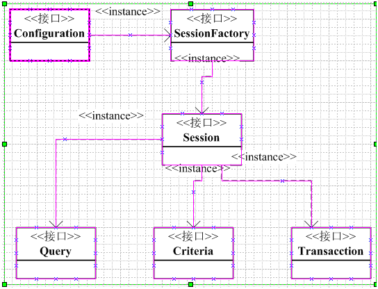

图 9 hibernate核心接口图

说明：

**1.Configuration接口:**

   配置hibernate，启动hibernate。hibernate应用通过Configuration执行关系-映射文件的位置或者动态配置hibernate属性，最后创建SessionFactory实例对象。

  在hibernate的hiberante.cfg.xml文件配置中，指定关系-映射文件的位置：

<mapping resource="com/lanhuigu/hibernate/entity/Customer.hbm.xml" />

**2.SessionFactory接口:**

   初始化hibernate,一个SessionFactory对应一个实例数据源，创建session接口对象。

   SessionFactory特点:

   1.线程安全，一个实例多个线程共享。

   2.不能随意创建和销毁，因为是重量级的。一个数据库只需创建一个SessionFactory实例，初始化时创建。如果同时访问多个数据库，需要对应每个数据库创建对应

​      的实例。否则线程共享数据时，发生数据混乱。

**3.Session接口:**

   线程不安全，避免多个线程共享一个session。

   是轻量级的，创建和销毁消费资源少，被称为持久化管理器，负责数据的保存，更新，删除，加载和查询对象。

   主要有5个方法对象以上操作: save(): update(): delete(): load(): find():

**4.Transaction接口:**

  底层封装JDBC,JTA,CORBA事务。 负责hibernate事务的管理。

**5.Query，Criteria:负责数据的查询。**

  Query封装HQL(Hibernate Query Language)查询语句，Criteria封装基于字符串形式的查询语句。

 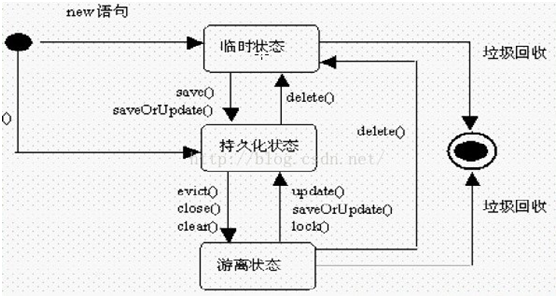

图 10 Hibernate对象的三种状态转换

### 2.4.2   Hibernate开发篇

表格 4 Hibernate 第三方库列表

| 库                                         | 描述                                                                                                                                                                                                                             |
| ----------------------------------------- | ------------------------------------------------------------------------------------------------------------------------------------------------------------------------------------------------------------------------------ |
| dom4j (必需）                                | Hibernate在解析XML配置和XML映射元文件时需要使用dom4j。                                                                                                                                                                                          |
| CGLIB (必需）                                | Hibernate在运行时使用这个代码生成库强化类（与Java反射机制联合使用）。                                                                                                                                                                                      |
| Commons Collections, Commons Logging (必需） | Hibernat使用Apache Jakarta Commons项目提供的多个工具类库。                                                                                                                                                                                   |
| ODMG4 (必需)                                | Hibernate提供了一个可选的ODMG兼容持久化管理界面。如果你需要映射集合，你就需要这个类库，就算你不是为了使用ODMG API。我们在这个教程中没有使用集合映射，但不管怎样把这个JAR拷贝过去总是不错的。                                                                                                                     |
| EHCache (必需)                              | Hibernate可以使用不同的第二级Cache方案。如果没有修改配置的话，EHCache提供默认的Cache。                                                                                                                                                                       |
| Log4j (可选)                                | Hibernate使用Commons Logging API,后者可以使用Log4j作为底层实施log的机制。如果上下文类目录中存在Log4j库，Commons Logging就会使用Log4j和它在上下文类路径中找到的log4j.properties文件。在Hibernate发行包中包含有一个示例的properties文件。所以，如果你想看看幕布之后到底发生了什么，也把log4j.jar拷贝到你的上下文类路径去吧（它位于src/目录中）。 |
| 其他文件是不是必需的？                               | 请察看Hibernate发行包中的/lib/README.txt文件。这是一个Hibernate发行包中附带的第三方类库的列表，总是保持更新。你可以在那里找到所有必需或者可选的类库的列表。                                                                                                                                 |

   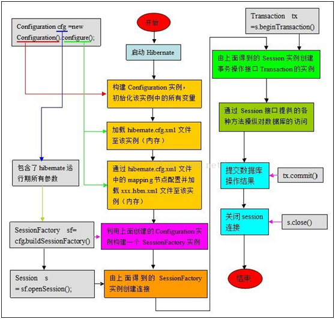

图 11 hibernate运行流程图

说明：hibernate开发顺序

1 下载并安装Hibernate

2 Hibernate配置文件详解，配置与MySQL数据库的链接与映射文件User.hbm.xml

3 编写PO（组成是POJO+映射文件），如用户PO=持久化类User.java + 映射文件User.hbm.xml.

5 编写辅助类HibernateSessionFactory.java 负责取得和关闭Hibernate的Session对象

6 编写DAO类UserDAO.java 编写根据用户名取得用户对象的getUser()

7 编写Service类UserService.java 编写valid()函数 调用UserDAO.java的getUser()函数执行函数验证。

**step 2:** **配置文件**

hibernate 有两个配置文件，分别是hibernate.cfg.xml, hiberntate.properties，一个XML，另一个键值文件，互为补充。

示例：hibernate.cfg.xml

```xml
<!DOCTYPE hibernate-configuration PUBLIC "-//Hibernate/Hibernate Configuration DTD 3.0//EN" "http://www.hibernate.org/dtd/hibernate-configuration-3.0.dtd">
<hibernate-configuration>
    <session-factory>
        <!-- 配置访问Oracle数据库参数信息 -->
        <property name="dialect">
            org.hibernate.dialect.OracleDialect
        </property>
        <property name="connection.driver_class">
            oracle.jdbc.driver.OracleDriver
        </property>
        <property name="connection.url">
            jdbc:oracle:thin:@localhost:1521:orcl
        </property>
        <property name="connection.username">scott</property>
        <property name="connection.password">scott123</property>
        <!-- 在控制台显示SQL语句 -->
        <property name="show_sql">true</property>
        <!--根据需要自动生成、更新数据表 -->
        <property name="hbm2ddl.auto">update</property>
        <!-- 注册所有ORM映射文件 -->
        <mapping resource="com/qst/chapter05/pojos/Student.hbm.xml" />
        <mapping resource="com/qst/chapter05/pojos/User.hbm.xml" />
    </session-factory>
</hibernate-configuration>
```

step 4: 编写辅助类 HibernateSessionFactory.java

SessionFactory sessionFactory = new Configuration().configure().buildSessionFactory();

<br>

## 本章参考

**官网**

* struts  https://struts.apache.org/
* Spring https://spring.io/
* Hibernate http://hibernate.org/

**参考链接**

[1]:  Spring 框架简介  Spring AOP 和 IOC 容器入门  https://www.ibm.com/developerworks/cn/java/wa-spring1/

[2]:  Spring之AOP由浅入深 https://www.cnblogs.com/zhaozihan/p/5953063.html

[3]: Spring官方文档 - http://www.springsource.org/documentation

[4]: Spring 教程 [https://www.w3cschool.cn/wkspring/](https://www.w3cschool.cn/wkspring/)

[5]: Spring 3.0文档 - http://static.springsource.org/spring/docs/3.0.x/spring-framework-reference/html/

[6]: Java中SSH框架怎样搭建 http://jingyan.baidu.com/article/066074d6564b39c3c21cb018.html

[7]: Struts2+Spring+Hibernate集成实例 https://www.yiibai.com/struts_2/struts-2-spring-hibernate-integration-example.html

[8]: struts 2教程  https://www.yiibai.com/struts_2/

[9]: Spring Framework (Wiki) - http://en.wikipedia.org/wiki/Spring_Framework

<br>

# 3   Java其它第三方框架

表格 5 Java第三方框架列表

| 框架名称          | 简介       | 介绍                                                                                             |
| ------------- | -------- | ---------------------------------------------------------------------------------------------- |
| IBATIS        | ORM持久层框架 | 2010.6，ibatis3.x正式更名为Mybatis ，代码于2013年11月迁移到Github。<br>相对于Hibernate, ibatis 则要求开发者编写具体的SQL 语句。 |
| Quartz        | Job调度    |                                                                                                |
| Velocity      | 模板引擎     |                                                                                                |
| XPlanner      | 项目管理     |                                                                                                |
| Guice         | IOC      | google开发的轻量级的依赖注入框架(IOC）。                                                                      |
| PicoContainer | IOC      | 极小的容器。                                                                                         |
| AspectJ       | AOP      |                                                                                                |
| FastAop       | AOP      | 高性能的AOP框架。                                                                                     |

## Mybatis

MyBatis 是支持定制化 SQL、存储过程以及高级映射的优秀的持久层框架。

MyBatis 避免了几乎所有的 JDBC 代码和手动设置参数以及获取结果集。

MyBatis可以使用简单的XML或注解用于配置和原始映射，将接口和Java的POJO（Plain Old Java Objects，普通的Java对象）映射成数据库中的记录。

<br>

## 本章参考

* Mybatis的前世今生 https://blog.51cto.com/u_14230003/2364982

<br>

# 4 Android框架

   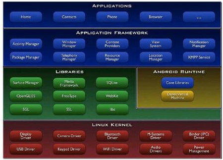

图 12 android架构

<br>

## 本章参考

<br>

# 参考资料

[1]:  JAVA 及 Eclipse 历史简介 http://www.cnblogs.com/COM_ZHJ/archive/2010/04/08/1707328.html
