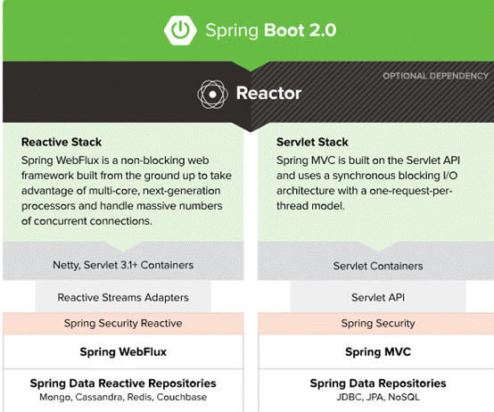
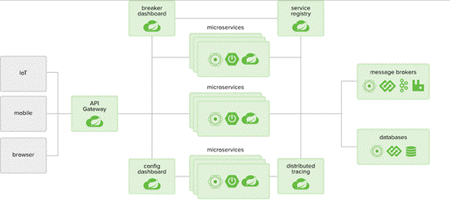
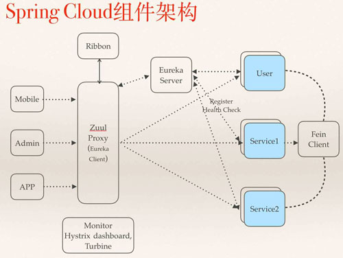

| 序号  | 修改时间       | 修改内容             | 修改人   | 审稿人 |
| --- | ---------- | ---------------- | ----- | --- |
| 1   | 2019-11-22 | 创建。从《分布式框架分析》拆分。 | Keefe |     |
|     |            |                  |       |     |

<br><br><br>

---

[TOC]

<br>

---

# 1  Spring框架概述

Spring 框架可以说是 Java 开发人员使用的最流行的应用程序开发框架之一。它目前由大量提供一系列服务的模块组成。包括模块容器，为构建横切关注点提供支持的面向切面编程（AOP），安全框架，数据存取框架，Web 应用框架和用于模块测试提供支持的类。

Spring 框架的所有组件都通过依赖注入粘在一起。依赖注入（也称为控制反转）使设计和测试松散耦合的软件模块变得更容易。

Spring Boot / Cloud 是微服务实践的最佳落地方案。

* Spring Boot 是一套快速配置脚手架，可以基于 Spring Boot 快速开发单个微服务。

* Spring Cloud 是一个基于 Spring Boot 实现的服务治理工具包。Spring Boot 专注于快速、方便集成的单个微服务个体。Spring Cloud 关注全局的服务治理框架。

## 版本

### Spring版本

表格 Spring版本详细

| 版本  | 发布时间    | 特性                                                                                                                                                                                                           |
| --- | ------- | ------------------------------------------------------------------------------------------------------------------------------------------------------------------------------------------------------------ |
| 1.0 | 2004-3  |                                                                                                                                                                                                              |
| 2.0 | 2006-10 | Spring 2.0 具有可扩展的 XML 配置功能，用于简化 XML 配置，支持 Java 5，额外的 IoC 容器扩展点，支持动态语言。                                                                                                                                       |
| 2.5 | 2007-12 | Spring 2.5 中的主要新功能包括支持 Java 6 / Java EE 5，支持注释配置，classpath 中的组件自动检测和兼容 OSGi 的 bundle。                                                                                                                        |
| 3.0 | 2009-12 | Spring 3.0 具有许多重要特性，如重组模块系统，支持 Spring 表达式语言，基于 Java 的 bean 配置（JavaConfig），支持嵌入式数据库（如 HSQL，H2 和 Derby），模型验证/ REST 支持和对 Java EE 的支持。                                                                           |
| 4.0 | 2013-12 | 4.x最后一个版本是4.3.8(2017.4)。<br>Spring 4.0 是 Spring 框架的一大进步，它包含了对Java 8 的全面支持，更高的第三方库依赖性（groovy 1.8+，ehcache 2.1+，hibernate 3.6+等），Java EE 7 支持，groovy DSL for bean 定义，对 websockets 的支持以及对泛型类型的支持作为注入 bean 的限定符。 |
| 5.0 |         |                                                                                                                                                                                                              |

> 2013 年 4月，VMware 和 EMC 通过 GE 投资创建了一家名为 Pivotal 的合资企业。所有的 Spring 应用项目都转移到了 Pivotal。

### Spring Boot版本

2012 年 10 月，Mike Youngstrom 在 Spring jira 中创建了一个功能请求，要求在 Spring 框架中支持无容器 Web 应用程序体系结构。这一要求促使了 2013 年初开始的 Spring Boot 项目的研发。

Spring Boot 简单性使 java 开发人员能够快速大规模地采用该项目。Spring Boot 可以说是在 Java 中开发基于 REST 的微服务 Web 应用程序的最快方法之一。

表格 Spring Boot版本详细

| 版本  | 发布时间    | 特性                                                                                                      |
| --- | ------- | ------------------------------------------------------------------------------------------------------- |
| 1.0 | 2014-4  |                                                                                                         |
| 1.1 | 2014-6  | 改进的模板支持，gemfire 支持，elasticsearch 和 apache solr 的自动配置。                                                   |
| 1.2 | 2015-3  | 升级到 servlet 3.1 / tomcat 8 / jetty 9，spring 4.1 升级，支持 banner / jms / SpringBootApplication 注解。          |
| 1.3 | 2016-12 | Spring 4.2 升级，新的 spring-boot-devtools，用于缓存技术（ehcache，hazelcast，redis 和 infinispan）的自动配置以及完全可执行的 jar 支持。 |
| 1.4 | 2017-1  | spring 4.3 升级，支持 couchbase / neo4j，分析启动失败和RestTemplateBuilder。                                          |
| 1.5 | 2017-2  | 支持 kafka / ldap，第三方库升级，弃用 CRaSH 支持和执行器记录器端点以动态修改应用程序日志级别。                                               |
| 1.6 | 2018-3  | 基于 Java 8，支持 Java 9，支持 Quartz ，调度程序大大简化了安全自动配置，支持嵌入式 Netty。                                             |

### Spring Cloud版本

Spring Cloud 自 2016 年 1 月发布第一个 Angel.SR5 版本，到目前 2020 年 3 月发布 Hoxton.SR3 版本，已经历经了 4 年时间。这 4 年时间里，Spring Cloud 一共发布了 46 个版本，支持的组件数从 5 个增加到 21 个。

关于maven仓库的版本列表
spring-cloud-dependencies 版本列表可查看：
https://mvnrepository.com/artifact/org.springframework.cloud/spring-cloud-dependencies
spring-boot-starter-parent 版本列表可查看：
https://mvnrepository.com/artifact/org.springframework.boot/spring-boot-starter-parent

表格 Sprint Boot 和Sprint Cloud的版本号构成

|         | Sprint Boot                   | Sprint Cloud                       |
| ------- | ----------------------------- | ---------------------------------- |
| 版本号     | 数字（主.次.修改）                    | 单词表示，首字母越靠后表示版本号越大。2020年后用年份记录版本号。 |
| 版本tag   | 希腊字母（Base/Alpha/Beta/RELEASE） | 英文单词（BUILD、GA、PRE、RC、SR）           |
| 完整版本号示例 | 2.0.3 RELEASE                 | Greenwich.SR5                      |

备注：1. 用版本tag表示当前版本处于哪个开发阶段。tag详细含义可参见 [开源软件开发指南](../../平台与编程语言/platform.平台/开源软件开发指南.md)

2. SprintCloud版本号这样设计的目的是为了更好的管理每个SpringCloud子项目的清单，避免自己的版本号与子项目的版本号混淆。

表格  Spring Cloud大版本发布时间和兼容的Spring Boot版本

| 英文          | 中文    | 终结版本 | 发布时间           | boot大版本 | boot代表 | 说明  |
| ----------- | ----- | ---- | -------------- | ------- | ------ | --- |
| Angel       | 安吉尔   | SR6  | 2016.1         | 1.2.x   | 1.2.8  | GA  |
| Brixton     | 布里克斯顿 | SR7  |                | 1.3.x   | 1.3.8  | GA  |
| Camden      | 卡梅登   | SR7  |                | 1.4.x   | 1.4.2  | GA  |
| Dalston     | 达斯顿   | SR5  |                | 1.5.x   | *      | GA  |
| Edgware     | 艾奇韦尔  | SR5  |                | 1.5.x   | 1.5.19 | GA  |
| Finchley    | 芬奇利   | SR2  |                | 2.0.x   | 2.0.8  | GA  |
| Greenwich   | 格林威治  | SR6  |                | 2.1.x   | 2.1.2  | GA  |
| Hoxton      | 霍克斯顿  | SR8  | 2019.11-2020.3 | 2.2.x   | 2.2.6  | GA  |
| 2020.0.0-M3 | xx    | xx   | 2020.x-?       | 2.4.x   | xx     | GA  |

备注：2020年起，用年份开头来记录版本号。

表格 Sprint Boot版本对应的Sprint Cloud示例

| Spring Boot                  | Spring Cloud            |
| ---------------------------- | ----------------------- |
| 1.5.2.RELEASE                | Dalston.RC1             |
| 1.5.9.RELEASE                | Edgware.RELEASE         |
| 2.0.2.RELEASE                | Finchley.BUILD-SNAPSHOT |
| 2.0.3.RELEASE                | Finchley.RELEASE        |
| 2.1.0.RELEASE-2.1.14.RELEASE | Greenwich.SR5           |
| 2.2.0.M4                     | Hoxton.SR4              |

## **Spring Cloud规范实现分支**

 Spring Cloud 规范目前的实现者也不单单只有 Netflix 这一套。目前有 Spring Cloud Alibaba、Spring Cloud Consul、Spring Cloud Zookeeper、Spring Cloud Kubernetes，甚至 Spring Cloud 官方也有对应的实现组件比如 Spring Cloud Config 集成了 Git、SVN 或 Database 提供配置服务、Spring Cloud Stream RabbitMQ/Kafka 提供消息抽象的实现者。

表格 Sprint Cloud实现方案

|         | Spring Cloud官方                   | Netflix  | Alibaba       | Consul | Kubernetes | Zookeeper |
| ------- | -------------------------------- | -------- | ------------- | ------ | ---------- | --------- |
| 分布式配置   | SCC Client/Server                | Archaius | Nacos         | Consul | Config Map | Zookeeper |
| 服务注册/发现 | Service Register/Discover        | Eureka   | Nacos         | Consul | Api Server | Zookeeper |
| 服务熔断    | Circuit Breaker                  | Hystrix  | Sentinel      |        |            |           |
| 服务调用    | OpenFeign/<br>RestTemplate       | Feign    | Dubbo RPC     |        |            |           |
| 服务路由    | SC Gateway                       | Zuul     | Dubbo+Servlet |        |            |           |
| 分布式消息   | SC Stream/<br>SCS RabbitMQ/Kafka |          | SCS RocketMQ  |        |            |           |
| 消息总线    | SC Bus                           |          | SCB           |        |            |           |
| 负载均衡    | SC LoadBalancer                  | Ribbon   | Dubbo LB      |        |            |           |
| 分布式事务   |                                  |          | Seata         |        |            |           |

> 备注：1. 表格中SC是Spring Cloud的缩写。
> 
> 2. Netflix是Spring Cloud的最早实现者和开源者。

<br>

## 本章参考

* 深入浅出，了解 Spring 框架和 Spring Boot 的历史  https://mp.weixin.qq.com/s/iqve1_9kjYCGdXzV1nAQqA

* 4 年 46 个版本，一文读懂 Spring Cloud 发展历史 https://blog.csdn.net/csdnnews/article/details/105304531

* 初识SpringCloud 整体架构 https://blog.csdn.net/Strive_Peter/article/details/113887255

<br>

# 2  Spring Boot

SpringBoot是由Pivotal团队在2013年开始研发、2014年4月发布第一个版本的全新开源的轻量级框架。它基于Spring4.0设计，不仅继承了Spring框架原有的优秀特性，而且还通过简化配置来进一步简化了Spring应用的整个搭建和开发过程。另外SpringBoot通过集成大量的框架使得依赖包的版本冲突，以及引用的不稳定性等问题得到了很好的解决。

Spring Boot 是一套快速配置脚手架，可以基于 Spring Boot 快速开发单个微服务。

Spring Boot基于Spring platform对Spring框架和第三方库进行处理，提供默认配置以降低使用复杂度，可轻松创建单独运行的、基于生产级的Spring应用程序。

Spring Boot基于Maven构建。

**Eclipse集成Spring Intializer**

安装方式：Eclipse Marketplace -> 搜索 STS

新建Spring项目：New -> Spring Starter Project



图 1 Sprint Boot 2.0框架

<br>

# 3   Spring Cloud

Spring Cloud 是一系列框架的有序集合，它利用 Spring Boot 的开发便利性巧妙地简化了分布式系统基础设施的开发，如服务发现注册、配置中心、消息总线、负载均衡、断路器、数据监控等，都可以用 Spring Boot 的开发风格做到一键启动和部署。

## 3.1  Spring Cloud架构

**Spring Cloud** **的核心功能**：

* 分布式/版本化配置。
* 服务注册和发现。
* 路由。
* 服务和服务之间的调用。
* 负载均衡。
* 断路器。
* 分布式消息传递。





图 2 Spring Cloud组件架构

各组件的运行流程：

* 所有请求都统一通过 API 网关(Zuul)来访问内部服务。
* 网关接收到请求后，从注册中心(Eureka)获取可用服务。
* 由 Ribbon 进行均衡负载后，分发到后端的具体实例。
* 微服务之间通过 Feign 进行通信处理业务。
* Hystrix 负责处理服务超时熔断。
* Turbine 监控服务间的调用和熔断相关指标。
* Zipkin 负责请求链接追踪。

## 3.2  Spring Cloud 工具框架

Spring Cloud 共集成了 19 个子项目，里面都包含一个或者多个第三方的组件或者框架!

- Spring Cloud Config，配置中心，利用 git 集中管理程序的配置。
- Spring Cloud Netflix，集成众多 Netflix 的开源软件。
- Spring Cloud Bus，消息总线，利用分布式消息将服务和服务实例连接在一起，用于在一个集群中传播状态的变化      。
- Spring Cloud for Cloud Foundry，利用 Pivotal Cloudfoundry 集成你的应用程序。
- Spring Cloud Foundry Service Broker，为建立管理云托管服务的服务代理提供了一个起点。
- Spring Cloud Cluster，基于 Zookeeper、Redis、Hazelcast、Consul 实现的领导选举和平民状态模式的抽象和实现。
- Spring Cloud Consul，基于 Hashicorp Consul 实现的服务发现和配置管理。
- Spring Cloud Security，在 Zuul 代理中为 OAuth2 rest 客户端和认证头转发提供负载均衡。
- Spring Cloud Sleuth Spring Cloud，应用的分布式追踪系统和 Zipkin、HTrace、ELK      兼容。
- Spring Cloud Data Flow，一个云本地程序和操作模型，组成数据微服务在一个结构化的平台上。
- Spring Cloud Stream，基于 Redis、Rabbit、Kafka      实现的消息微服务，简单声明模型用以在 Spring Cloud 应用中收发消息。
- Spring Cloud Stream App Starters，基于      Spring Boot 为外部系统提供 Spring 的集成。
- Spring Cloud Task，短生命周期的微服务，为 Spring Boot 应用简单声明添加功能和非功能特性。
- Spring Cloud Task App Starters。
- Spring Cloud Zookeeper，服务发现和配置管理基于 Apache Zookeeper。
- Spring Cloud for Amazon Web Services，快速和亚马逊网络服务集成。
- Spring Cloud Connectors，便于 PaaS 应用在各种平台上连接到后端像数据库和消息经纪服务。
- Spring Cloud Starters，项目已经终止并且在 Angel.SR2 后的版本和其他项目合并。
- Spring Cloud CLI，插件用 Groovy 快速的创建 Spring Cloud 组件应用。

## 3.3   Spring Cloud配置

Spring Cloud包含两个基本模块，spring cloud context和spring cloud commons。

* spring cloud context即spring cloud应用上下文，包含引导上下文(加载bootstrap配置)、配置加密、配置刷新范围(RefreshScope)、控制端点(/env/reset，/refresh，/restart等)功能。
* Spring cloud commons 提供服务注册发现，负载均衡，断路器等模式的一个共用抽象层，为具体现实提供统一抽象。

实际应用过程中，我们使用了

* spring cloud consul 作为服务注册和发现组件
* spring cloud config 作为分布式/版本化配置管理
* spring cloud bus 作为消息总线用于刷新分布式应用配置
* spring boot admin 作为统一的应用监控后台
* spring cloud Netflix feign  作为rest服务调用client
* spring cloud Netflix zuul  作为路由、过滤网关
* spring cloud consul

<br>

# 4 实例

## 4.1  Docker-Compose编排微服务实例

来源： https://github.com/itmuch/spring-cloud-docker-microservice-book-code-docker/blob/Edgware/docker-3-complex/pom.xml

表格 1 实例中微服务列表

| 微服务项目名称                                    | 项目微服务中的角色   |
| ------------------------------------------ | ----------- |
| microservice-discovery-eureka-ha           | 服务发现组件      |
| microservice-provider-user                 | 服务提供者       |
| microservice-consumer-movie-ribbon-hystrix | 服务消费者       |
| microservice-gateway-zuul                  | API Gateway |
| microservice-hystrix-turbine               | Hystrix聚合工具 |

### 4.1.1  执行步骤

1. 编辑pom.xml
2. 每个项目的根目录执行以下命令，构建docker镜像
   `mvn clean package docker:build`
3. 编辑docker-compose.yml
4. 启动
   `docker-compose up`

测试

* 高可用测试

* 动态扩缩容

docker-compose scale [proj=num]

如 docker-compose scale microservice-provider-user=3

### 4.1.2  pom.xml

```xml
<?xml version="1.0" encoding="UTF-8"?>
<project xmlns="http://maven.apache.org/POM/4.0.0" xmlns:xsi="http://www.w3.org/2001/XMLSchema-instance"
  xsi:schemaLocation="http://maven.apache.org/POM/4.0.0 http://maven.apache.org/xsd/maven-4.0.0.xsd">
  <modelVersion>4.0.0</modelVersion>
  <groupId>com.itmuch.cloud</groupId>
  <artifactId>parent</artifactId>
  <version>0.0.1-SNAPSHOT</version>
  <packaging>pom</packaging>

  <modules>
    <module>microservice-consumer-movie-ribbon-hystrix</module>
    <module>microservice-discovery-eureka-ha</module>
    <module>microservice-gateway-zuul</module>
    <module>microservice-hystrix-turbine</module>
    <module>microservice-provider-user</module>
  </modules>

  <build>
    <plugins>
      <!-- 添加docker-maven插件 -->
      <plugin>
        <groupId>com.spotify</groupId>
        <artifactId>docker-maven-plugin</artifactId>
        <version>0.4.13</version>
        <configuration>
          <imageName>itmuch/${project.artifactId}:${project.version}</imageName>
          <forceTags>true</forceTags>
          <baseImage>java</baseImage>
          <entryPoint>["java", "-jar", "/${project.build.finalName}.jar"]</entryPoint>
          <resources>
            <resource>
              <targetPath>/</targetPath>
              <directory>${project.build.directory}</directory>
              <include>${project.build.finalName}.jar</include>
            </resource>
          </resources>
        </configuration>
      </plugin>
    </plugins>
  </build>
</project>
```

说明:

<imageName>itmuch/${project.artifactId}:${project.version}</imageName>  # 镜像名称

<entryPoint>["java", "-jar", "/${project.build.finalName}.jar"]</entryPoint>  # 镜像的入口命令

### 4.1.3  docker-compose.yml

```yaml
version: "3"
services:
  peer1:
    image: itmuch/microservice-discovery-eureka-ha:0.0.1-SNAPSHOT
    ports:
      - "8761:8761"
    environment:
      - spring.profiles.active=peer1
  peer2:
    image: itmuch/microservice-discovery-eureka-ha:0.0.1-SNAPSHOT
    hostname: peer2  # 重置此镜像的容器名称，避免循环依赖
    ports:
      - "8762:8762"
    environment:
      - spring.profiles.active=peer2
  microservice-provider-user:
    image: itmuch/microservice-provider-user:0.0.1-SNAPSHOT
  microservice-consumer-movie-ribbon-hystrix:
    image: itmuch/microservice-consumer-movie-ribbon-hystrix:0.0.1-SNAPSHOT
  microservice-gateway-zuul:
    image: itmuch/microservice-gateway-zuul:0.0.1-SNAPSHOT
  microservice-hystrix-turbine:
    image: itmuch/microservice-hystrix-turbine:0.0.1-SNAPSHOT
```

说明：双节点的Eureka Server集群。

<br>

# 参考资料

## **官网**

* https://spring.io/

* [Spring Boot Reference Manual](https://docs.spring.io/spring-boot/docs/current-SNAPSHOT/reference/htmlsingle/)

* [Spring Cloud Reference Manual](https://cloud.spring.io/spring-cloud-static/current/)

## 参考文献

[1]: https://github.com/itmuch/spring-cloud-docker-microservice-book-code-docker/blob/Edgware/docker-3-complex/pom.xml   "《Spring Cloud与Docke微服务架构实战》v2 "
[2]:   http://docs.docker.com/composq/faq    "FAQ"
[3]:  http://c.biancheng.net/spring_cloud/  "Spring Cloud入门教程：Spring Cloud框架经典学习资料"
[4]:   https://blog.csdn.net/Strive_Peter/article/details/113887255  "初识SpringCloud 整体架构 "

*
