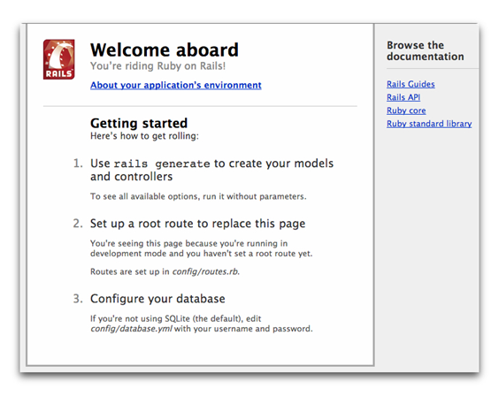
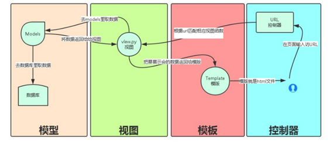
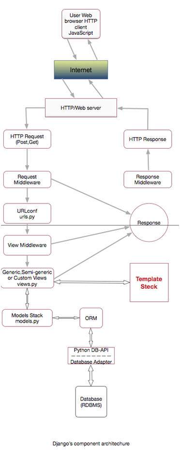
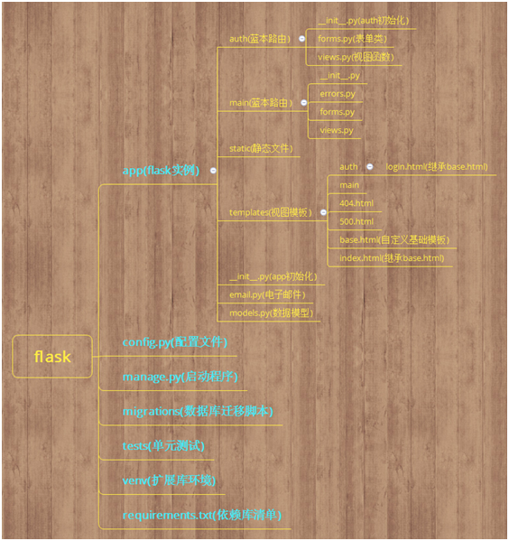
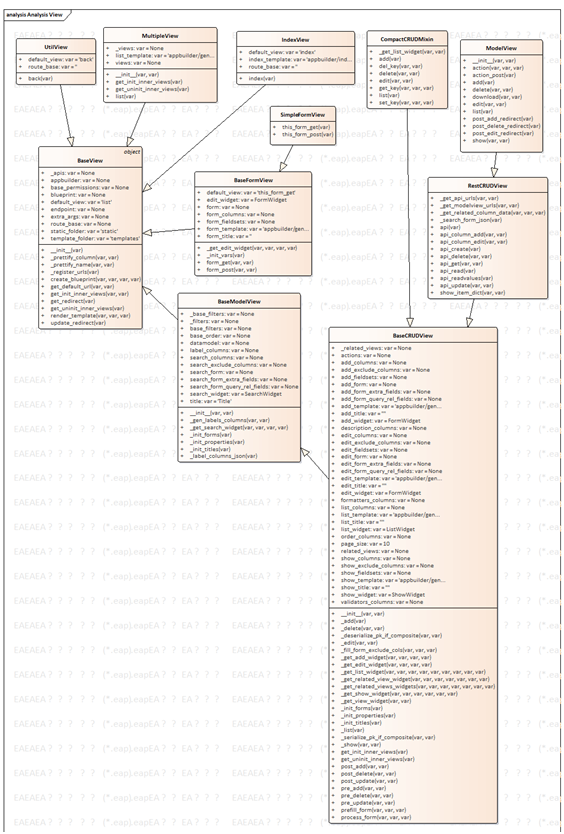

| 序号 | 修改时间   | 修改内容    | 修改人 | 审稿人 |
| ---- | ---------- | -------------------------- | ------ | ------ |
| 1    | 2016-12-21 | 创建   | 吴启福 | 吴启福 |
| 2    | 2017-1-15  | 补充各大WEB框架内容。   | 同上   |   |
| 3    | 2018-3-25  | 更新node.js   | 同上   |   |
| 4    | 2018-4-25  | 补充更新前端框架   | 同上   |   |
| 5    | 2018-7-3   | 增加Python WEB程序部署章节 | 同上   |   |
| 6    | 2018-11-18 | 汇总python web框架    | 同上   |   |
| 7    | 2019-12-15 | 迁移前端框架/Nodejs另文    | 同上   |   |
---

 

 

 

# 目录

 

[目录... 1](#_Toc530263898)

[1  WEB框架概述... 3](#_Toc530263899)

[1.1   WEB框架列表... 3](#_Toc530263900)

[1.2   python WEB框架... 4](#_Toc530263901)

[1.3   Python WEB程序部署方式... 5](#_Toc530263902)

[1.4   本章参考... 6](#_Toc530263903)

[2  前端框架... 6](#_Toc530263904)

[2.1   模板引擎... 7](#_Toc530263905)

[2.1.1    Smarty（PHP）... 7](#_Toc530263906)

[2.1.2    Jiaja2 (Python) 8](#_Toc530263907)

[2.2   AJAX.. 8](#_Toc530263908)

[2.2.1    Prototype. 8](#_Toc530263909)

[2.2.2    JQuery. 9](#_Toc530263910)

[2.3   Bootstrap. 10](#_Toc530263911)

[2.4   View层-数据可视化... 10](#_Toc530263912)

[2.4.1    React 10](#_Toc530263913)

[2.4.2    Vue. 11](#_Toc530263914)

[2.4.3    D3/nvd3. 12](#_Toc530263915)

[2.4.4    Echarts 12](#_Toc530263916)

[2.5   本章参考... 12](#_Toc530263917)

[3  php-yil 13](#_Toc530263918)

[3.1   本章参考... 13](#_Toc530263919)

[4  node.js 13](#_Toc530263920)

[4.1   简介... 13](#_Toc530263921)

[4.2   入门实例... 14](#_Toc530263922)

[4.2.1    安装篇... 14](#_Toc530263923)

[4.2.2    示例1：hello world. 15](#_Toc530263924)

[4.2.3    示例2：sacdl-project 16](#_Toc530263925)

[4.3   技术原理篇... 16](#_Toc530263926)

[4.3.1    并发处理：事件和回调... 16](#_Toc530263927)

[4.3.2    全局对象和模块... 17](#_Toc530263928)

[4.4   相关框架：Express 18](#_Toc530263929)

[4.5   本章参考... 18](#_Toc530263930)

[5  ruby-on-rails 18](#_Toc530263931)

[5.1   入门实例... 18](#_Toc530263932)

[5.1.1    安装rails 18](#_Toc530263933)

[5.1.2    创建 Blog 程序... 19](#_Toc530263934)

[5.2   本章参考... 20](#_Toc530263935)

[6  python-Tornado. 21](#_Toc530263936)

[6.1   本章参考... 21](#_Toc530263937)

[7  python-Django. 21](#_Toc530263938)

[7.1   入门实例... 21](#_Toc530263939)

[7.2   架构分析... 23](#_Toc530263940)

[7.3   本章参考... 25](#_Toc530263941)

[8  python-Flask. 25](#_Toc530263942)

[8.1   简介... 25](#_Toc530263943)

[8.2   flask使用篇... 25](#_Toc530263944)

[8.2.1    入门实例... 25](#_Toc530263945)

[8.2.2    项目结构... 27](#_Toc530263946)

[8.3   flask开发篇... 27](#_Toc530263947)

[8.4   flask架构篇... 28](#_Toc530263948)

[9  python-flask扩展... 28](#_Toc530263949)

[9.1   flask-appbuilder 28](#_Toc530263950)

[9.1.1    fabmanger 29](#_Toc530263951)

[9.1.2    配置 config.py. 30](#_Toc530263952)

[9.1.3    路由定制... 34](#_Toc530263953)

[9.1.4    类图... 36](#_Toc530263954)

[9.2   flask-cache. 37](#_Toc530263955)

[9.3   flask-login. 37](#_Toc530263956)

[9.4   flask-script 37](#_Toc530263957)

[9.5   本章参考... 38](#_Toc530263958)

[参考资料... 38](#_Toc530263959)

[附录... 39](#_Toc530263960)

 


# 1  WEB框架概述

## 1.1  WEB框架列表

表格 1 WEB常用框架列表

| 开发   语言 | 框架   名称 | 简介    | 优点   | 缺点  |
| ----------- | ----------- | ------------------------------------------------------------ | ---------------------------------- | --------------- |
| php    | yii    | 一个基于组件、用于开发大型 Web 应用的高性能 PHP 框架，是一个 MVC 的框架。Yii是创始人薛强的心血结晶，于2008年1月1日开始开发。 | 优异的性能，丰富的功能和清晰的文档 |  |
| php    | symfony  | 一个基于MVC模式的面向对象的PHP5[框架](http://baike.so.com/doc/1863840-1971314.html)。Symfony允许在一个web应用中分离事务控制，服务逻辑和表示层。 |   |  |
| php    | codeigniter | 一套给PHP网站开发者使用的应用程序开发框架和工具包。在最小化，最轻量级的开发包中得到最大的执行效率、功能和灵活性。   CodeIgniter是由Ellislab公司的CEO RickEllis开发的。 | 动态实例化。松耦合。组件专一性。   |  |
| javascript  | nodejs   | Node.js是建立在谷歌Chrome的JavaScript引擎(V8引擎)的Web应用程序框架。 | 数据密集型。   | CPU密集型慎用。 |
| js  | express  | Express是一个最小的，灵活的Node.js Web应用程序框架，它提供了一套强大的功能来开发Web和移动应用程序。 它有助于基于Node Web应用程序的快速开发。 |   |  |
| js  | **JXcore**  | 引入了包装和源文件和其他资源加密成JX包一个独特的功能。  |   |  |
| ruby   | rails  | Rails 是使用 Ruby 语言编写的网页程序开发框架，目的是为开发者提供常用组件，简化网页程序的开发。只需编写较少的代码，就能实现其他编程语言或框架难以企及的功能。 |   |  |
| ruby   | jekyll   | 一个支持markdown和liquid模板语言的静态站点生成器，作为github项目的标配页面。 | 很适合作BLOG。   |  |
| java   | grails   | 基于Groovy编程语言，并构建于Spring、Hibernate等开源框架之上，是一个高[生产](http://baike.so.com/doc/5381738-5618075.html)力一站式框架。 | 插件系统    |  |
| java   | scooter  |    |   |  |
| java   | jsp/servlet |    |   |  |
| java   | SSH    | (spring/structs/hibernate)  |   |  |
| java   | struts   |    |   |  |
| java   | spring MVC  |    |   |  |
| perl   | catalyst    | 一个用 Perl 语言开发的 MVC 框架。   |   |  |
| scala  | lift   | 一个非常优雅的web框架，基于Scala编程语言，使用Apache 2.0 license许可发布。 | 可伸缩应用服务器    |  |
| scala  | scalatra    |    |   |  |

**说明**：当前有许多框架可用，敏捷开发中有时并不需自己设计框架，利用已知框架或者在编程过程重构代码中产生框架。这听起来有些荒谬，事实上这正是大多数公司在开发中所采用的模式。

 

表格 2 WEB框架列表

| softwareName  | Desc    | currnet   version    | Copyright(c)     | License   | Note  |
| ------------- | ------------------------------------------------------------ | ------------------------------------------------------------ | ----------------------------------------------------------- | --------------------------------------------------------- | ----------------------- |
| Ruby On Rails | an [open source](http://en.wikipedia.org/wiki/Open_source) [web application framework](http://en.wikipedia.org/wiki/Web_application_framework) | [2.3.8 released May 25,   2010](http://rubyonrails.org/download) | 2005…,   [Rails Core Team](http://www.rubyonrails.com/core) | [MIT](http://www.opensource.org/licenses/mit-license.php) | http://rubyonrails.org/ |

 

## 1.2  python WEB框架

表格 3 python WEB框架列表

| 框架    | 简介    | 特性   |
| ------------------------------------------------------------ | ------------------------------------------------------------ | ---------------------------------- |
| [Django](https://www.djangoproject.com/download/)  | 一个开源的重量级Web框架，并且采用MVC设计模式。它源自一个在线新闻 Web 站点，于 2005 年以开源的形式被释放出来。 | 简便、快速的开发数据库驱动的网站。 |
| [flask](http://flask.pocoo.org/)    | 使用 [Python](http://baike.so.com/doc/1790119-1892991.html) 编写的轻量级 Web 应用框架。其 [WSGI](http://baike.so.com/doc/1142343-1208497.html) 工具箱采用 Werkzeug ，[模板引擎](http://baike.so.com/doc/5846906-6059743.html)则使用 Jinja2 。Flask使用 BSD 授权。 | 使用简单的核心。    |
| tornado      | 使用Python编写出来的一个极轻量级、高可伸缩性和非阻塞IO的Web服务器软件。   著名的Friendfeed 网站就是使用它搭建的。 |   |
| [Zope 2](http://zope2.zope.org/releases)   | 一款基于Python的Web应用框架，是所有Python Web应用程序、工具的鼻祖，是Python家族一个强有力的分支。Zope 2的“对象发布”系统非常适合面向对象开发方法，并且可以减轻开发者的学习曲线，还可以帮助你发现应用程序里一些不好的功能。 |   |
| [Web2py](http://web2py.com/examples/default/download)   | 一个用Python语言编写的免费的开源Web框架，旨在敏捷快速的开发Web应用，具有快速、可扩展、安全以及可移植的数据库驱动的应用，遵循LGPLv3开源协议。   　　Web2py提供一站式的解决方案，整个开发过程都可以在浏览器上进行，提供了Web版的在线开发，HTML模版编写，静态文件的上传，数据库的编写的功能。其它的还有日志功能，以及一个自动化的admin接口。 | 推荐   |
| [Web.py](http://webpy.org/install)    | 一个轻量级的开源Python Web框架，小巧灵活、简单并且非常强大，在使用时没有任何限制。目前Web.py被广泛运用在许多大型网站，如西班牙的社交网站Frinki、主页日平均访问量达7000万次的Yandex等。 |   |
| [Pyramid](http://www.pylonsproject.org/projects/pyramid/download) | 一款轻量级的开源Python Web框架，是Pylons项目的一部分。Pyramid只能运行在Python 2.x或2.4以后的版本上。在使用后端数据库时无需声明，在开发时也不会强制使用一些特定的模板系统。 |   |
| pylons    | 对WSGI标准进行了扩展应用，提升了重用性且将功能分割到独立的模块中。 |   |
| [CubicWeb](http://docs.cubicweb.org/admin/setup)   | 不仅是一个Web开发框架，而且还是一款语义Web开发框架。CubicWeb使用关系查询语言（RQL Relation Query Language）与数据库之间进行通信。 |   |
| [turbogears](http://www.turbogears.org/)   | 一个可以扩展为全栈解决方案的微型框架。   |   |

 

表格 4 python WEB框架比较

|   |  | 性能 nums/sec |    | 依赖组件    | 启动方式   |
| ---------------- | -------- | ------------- | ------- | --------------------------------------------------- | ------------------------------ |
| 框架名   | 代码行数 | 单进程   | 并发100 |     |    |
| Django   | 120K  | 255   | x  | babel(10k)    | python manger.py runserver  |
| Tornago  | 42K   | 387   | 918  |     |    |
| Flask  | 6.5K  | 342   | 1694    | Jinjia2(12k), <br>MarkupSafe(22k),  <br>click(6.6k) | python xx.py    |
| uwsgi + Django   |  | 280   | 2947    |     |    |
| uwsgi + Flask    |  | 343   | 4651    |     | uwsgi --wsgi-file <file>  |
| gunicorn + Flask |  |  |    |     | gunicorn -w 2 <filename.Flask> |

备注：uwsgi启动4个工作进程。uwsgi使用C实现性能更高，gunicorn更易使用。

 

## 1.3  Python WEB程序部署方式

表格 5 Python WEB程序部署方式比较

| 部署方式    | 简介    | 优缺点    | 备注   |
| ---------------------------------------------- | ------------------------------------------------------------ | ------------------------------------------------------------ | ------ |
| mod_python    | apache内置的模块。     | 很严重的依赖于mod_python编译使用的python版本。  | 不推荐 |
| cgi    |    | nginx不支持。     | 太老   |
| fastcgi  | 通过flup模块支持。     | 长连接方式。    |   |
| spawn-fcgi    | fastcgi多进程管理程序，lighttpd安装包附带的。   | spawn-fcgi用途很广，可以支持任意语言开发的代码。   |   |
| scgi     | 全名是Simple   Common Gateway Interface，也是cgi的替代版本。 | 没推广。     |   |
| http     | nginx使用proxy_pass转发。   | 这个要求后端appplication必须内置一个能处理高并发的http server |   |
| uwsgi    | nginx从0.8.4开始内置支持uwsgi协议。   | 自带的进程控制程序。   | 推荐   |
| [gunicorn](http://gunicorn.org/)  | 类似uwsgi, 从rails的部署工具(Unicorn)移植过来的。  | python2.5时定义的官方标准([PEP 333](http://lutaf.com/j?u=http://www.python.org/dev/peps/pep-0333/) )。 | 推荐   |
| [mod_wsgi](https://code.google.com/p/modwsgi/) | apache的一个module，也是支持WSGI协议。   |    |   |

备注：

## 1.4  本章参考

[1].    6种Web框架测评 http://www.alrond.com/en/2007/jan/25/performance-test-of-6-leading-frameworks/ 

[2].    全面解读python web 程序的9种部署方式 https://www.cnblogs.com/flish/p/5267902.html


# 2 前端框架

详见 [前端框架](前端框架分析.md)


# 3  php-yil

Yii 的很多想法来自其他著名 Web 编程框架和应用程序。下面是一个简短的清单。

*  [Prado](http://baike.so.com/doc/6747126-6961672.html):这是 Yii 的主要思想来源。Yii 采用了基于组件和[事件驱动](http://baike.so.com/doc/357634-378877.html)编程模式，[数据库抽象层](http://baike.so.com/doc/1667709-1763258.html)，模块化的应用架构，国际化和本地化，和许多它的其他特点和功能。
*  Ruby on Rails:Yii 继承它的配置的思想。还引用它的 [Active Record](http://baike.so.com/doc/1518150-1605059.html)的 ORM设计模式。
*  JQuery:这是集成在 Yii 为基础的 JavaScript 框架。
*  Symfony:Yii 引用它的过滤设计和[插件](http://baike.so.com/doc/1483288-1568456.html)架构。
*  Joomla:Yii 引用其模块化设计和信息翻译方案。


## 3.1  本章参考

 

# 5. ruby-on-rails

## 入门实例

### 安装rails

必需安装软件

·    [Ruby](https://www.ruby-lang.org/en/downloads) 1.9.3 及以上版本

·    包管理工具 [RubyGems](https://rubygems.org/)，随 Ruby 1.9+ 安装。想深入了解 RubyGems，请阅读 [RubyGems 指南](http://guides.rubygems.org/)

·    [SQLite3](https://www.sqlite.org/) 数据库

 

安装：

```shell
$ sudo apt-get install ruby sqlite
$ gem install rails
```


### 创建 Blog 程序

Rails 提供了多个被称为“生成器”的脚本，可以简化开发，生成某项操作需要的所有文件。其中一个是新程序生成器，生成一个 Rails 程序骨架，不用自己一个一个新建文件。

打开终端，进入有写权限的文件夹，执行以下命令生成一个新程序：

// 1.会在文件夹 blog 中新建一个Rails 程序

$ rails new blog

// 2.安装 Gemfile 中列出的 gem。

$ bundle install 

// 3.生成 blog 程序后，进入该文件夹：


执行 rails new -h 可以查看新程序生成器的所有命令行选项。

blog 文件夹中有很多自动生成的文件和文件夹，组成一个 Rails 程序。本文大部分时间都花在 app 文件夹上。下面简单介绍默认生成的文件和文件夹的作用：

| 文件/文件夹   | 作用    |
| --------------------- | ------------------------------------------------------------ |
| app/   | 存放程序的控制器、模型、视图、帮助方法、邮件和静态资源文件。本文主要关注的是这个文件夹。 |
| bin/   | 存放运行程序的 rails 脚本，以及其他用来部署或运行程序的脚本。 |
| config/  | 设置程序的路由，数据库等。详情参阅“[设置   Rails 程序](http://guides.ruby-china.org/configuring.html)”一文。 |
| config.rl   | 基于 Rack 服务器的程序设置，用来启动程序。    |
| db/    | 存放当前数据库的模式，以及数据库迁移文件。    |
| Gemfile, Gemfile.lock | 这两个文件用来指定程序所需的 gem 依赖件，用于 Bundler gem。关于 Bundler 的详细介绍，请访问 [Bundler 官网](http://bundler.io/)。 |
| lib/   | 程序的扩展模块。  |
| log/   | 程序的日志文件。  |
| public/  | 唯一对外开放的文件夹，存放静态文件和编译后的资源文件。  |
| Rakefile    | 保存并加载可在命令行中执行的任务。任务在 Rails 的各组件中定义。如果想添加自己的任务，不要修改这个文件，把任务保存在 lib/tasks 文件夹中。 |
| README.rdoc   | 程序的简单说明。你应该修改这个文件，告诉其他人这个程序的作用，如何安装等。 |
| test/  | 单元测试，固件等测试用文件。详情参阅“[测试   Rails 程序](http://guides.ruby-china.org/testing.html)”一文。 |
| tmp/   | 临时文件，例如缓存，PID，会话文件。   |
| vendor/  | 存放第三方代码。经常用来放第三方 gem。   |

 

**启动服务器**

$ rails server

上述命令会启动 WEBrick，这是 Ruby 内置的服务器。要查看程序，请打开一个浏览器窗口，访问[http://localhost:3000](http://localhost:3000/)。应该会看到默认的 Rails 信息页面。

   

 

## 本章参考

 

# 6   python-Tornado

## 6.1  本章参考

 

# 7  python-Django

Django是一个开放源代码的Web应用框架，由Python写成。 

Django遵守BSD版权，初次发布于2005年7月, 并于2008年9月发布了第一个正式版本1.0 。

Django采用了MVC的软件设计模式，即模型M，视图V和控制器C。

框架本身集成了ORM、模型绑定、模板引擎、缓存、Session等诸多功能。

 

## 7.1   入门实例

**Django安装**

```shell
$ pip install django  #安装最新版本的Django
$ pip install -v django==1.7.1   #或者指定安装版本
```


**命令行创建项目** (示例项目名mysite)

`$ django-admin.py startproject mysite`

Django将自动生成下面的目录结构：

```shell
mysite/
├── manage.py   # Django管理主程序
├── mysite
│   ├── __init__.py
│   ├── settings.py  # 主配置文件
│   ├── urls.py   	# URL路由系统文件
│   └── wsgi.py  	# 网络通信接口
└── template  # 该目录放置HTML文件模板
```

**创建APP** （示例app名为cmdb）

在每个Django项目中可以包含多个APP，相当于一个大型项目中的分系统、子模块、功能部件等等，相互之间比较独立，但也有联系，所有的APP共享项目资源。

```shell
$ python manage.py startapp cmdb
cmdb/
├── admin.py   
├── apps.py  
├── __init__.py
├── migrations
│   └── __init__.py
├── models.py    
├── tests.py	
└── views.py	# 页面

```

**4、编写路由规则**

路由都在urls文件里，它将浏览器的URL映射到响应的业务处理逻辑。

```python
# urls.py
from django.conf.urls import url
from django.contrib import admin
from cmdb import views
 
urlpatterns = [
    #url(r'^admin/', admin.site.urls),
    url(r'^index/', views.index),
]
```

 

**5、编写业务处理逻辑views**

```python
# views.py
from django.shortcuts import render
#首先导入HttpResponse模块
from django.shortcuts import HttpResponse
# Create your views here.
def index(request):
    """
    :param request: 这个参数必须有，类似self的默认规则，可以改，它封装了用户请求的所有内容
    :return: 不能直接返回字符串，必须有HttpResponse这个类封装起来，这是Django的规则
    """
    return HttpResponse("Hello,World")

```

**运行Web服务**

$ python manage.py runserver 127.0.0.1 8080

访问地址：http://127.0.0.1:8000/index/ 可以看到我们定义的返回结果"Hello,World"。

 django服务启动的同时，会启动两个进程，一个负责监控文件的变化，一个是主进程，如果文件发生变化，则会将退出当前进程，重新启动一个子进程。要想避免监控文件变化，加参数--noreload。


## 7.2  架构分析

   

   

图 3 django组件视图



备注：核心在于 middleware（中间件），django 所有的请求、返回都由中间件来完成。中间件，就是处理 HTTP 的 request 和 response 的，类似插件，比如有 Request 中间件、view 中间件、response 中间件、exception 中间件等，Middleware 都需要在 “project/settings.py” 中 MIDDLEWARE_CLASSES 的定义。

## 7.3  本章参考

[1]:  Django教程 https://www.runoob.com/django/django-tutorial.html


# 8  python-Flask 

## 8.1  简介

**特性**
*  内置开发用服务器和debugger
*  集成单元测试（unit testing）
*  RESTful request dispatching
*  使用Jinja2模板引擎
*  支持secure cookies（client side sessions）
*  100% WSGI 1.0兼容
*  Unicode based
*  详细的文件、教学
*  Google App Engine兼容
*  可用Extensions增加其他功能

备注： *fabmanager*是flask的权限管理命令。

 

## 8.2  flask使用篇

### 8.2.1   入门实例

**安装使用**

Flask 依赖两个外部库： [Jinja2](http://jinja.pocoo.org/2/) 模板引擎和 [Werkzeug](http://werkzeug.pocoo.org/) WSGI 工具集。

**Werkzeug:** Werkzeug is an HTTP and WSGI utility library for Python. 

 ```shell
$sudo pip install flask flask-login flask-mail flask-sqlalchemy flask-wtf flask-babel flup
$ pip install Flask
$ python hello.py
* Running on http://localhost:5000/
 ```

示例：hello.py

```python
from flask import Flask
app = Flask(__name__)

@app.route("/")    # URL目录
def hello():
    return "Hello World!"

if __name__ == "__main__":
    app.run()
	# 监听所有公网IP
	app.run(host='0.0.0.0')
```

那么，这段代码做了什么？
1. 首先，我们导入了 [Flask](http://docs.jinkan.org/docs/flask/api.html#flask.Flask) 类。这个类的实例将会是我们的 WSGI 应用程序。
2. 接下来，我们创建一个该类的实例，第一个参数是应用模块或者包的名称。 如果你使用单一的模块（如本例），你应该使用 __name__ ，因为模块的名称将会因其作为单独应用启动还是作为模块导入而有不同（ 也即是 '__main__' 或实际的导入名）。这是必须的，这样 Flask 才知道到哪去找模板、静态文件等等。详情见 [Flask](http://docs.jinkan.org/docs/flask/api.html#flask.Flask) 的文档。

3. 然后，我们使用 [route()](http://docs.jinkan.org/docs/flask/api.html#flask.Flask.route) 装饰器告诉 Flask 什么样的URL 能触发我们的函数。
4. 这个函数的名字也在生成 URL 时被特定的函数采用，这个函数返回我们想要显示在用户浏览器中的信息。

5. 最后我们用 [run()](http://docs.jinkan.org/docs/flask/api.html#flask.Flask.run) 函数来让应用运行在本地服务器上。 其中 if __name__ == '__main__': 确保服务器只会在该脚本被 Python 解释器直接执行的时候才会运行，而不是作为模块导入的时候。

 

### 8.2.2   项目结构

   

备注：

 

## 8.3  flask开发篇

使用实例文件夹
 我们使用 app.config.from_pyfile() 来从一个实例文件夹中加载配置变量。当我们调用 Flask() 来创建我们的应用的时候，如果我们设置了 instance_relative_config=True， app.config.from_pyfile() 将会从 instance/ 目录加载指定文件。

```python
# app.py or app/__init__.py
app = Flask(__name__, instance_relative_config=True)
app.config.from_object('config')
app.config.from_pyfile('config.py')
```


## 8.4  flask架构篇

 

# 9  python-flask扩展

| 扩展组件    | 简介    | 主要功能     |
| ---------------- | ------------------------------------------------------------ | ------------------------------------------------------------ |
| flask-appbuilder | 基于Flask实现的一个用于快速构建Web后台管理系统的简单的框架。 | fabmanager [OPTIONS] COMMAND [ARGS]...   |
| flask-login   | 登陆。    |    |
| flask-migrate    | 数据库迁移、升级。     | $python manage.py db migrate   $python manage.py db upgrade  |
| flask-cache   | 缓存，支持redis/memcache/filesystem   |    |
| flask-script  | 命令行脚本   | from flask-script import Manager   Manager().run()   |
| flask-sqlalchemy | DB的ORM模型。     | from flask_sqlalchemy   import SQLAlchemy   db =   SQLAlchemy(app) |
| flask-cors  | 跨域资源共享    | CORS(app, resources=r'/*')  |
|   |    |    |
|   |    |    |

 

## 9.1  flask-appbuilder

Flask-AppBuilder是基于Flask实现的一个用于快速构建Web后台管理系统的简单的框架。主要用于解决构建Web后台管理系统时避免一些重复而繁琐的工作，提高项目完成时间，它可以和 Flask/Jinja2自定义的页面进行无缝集成，并且可以进行高级的配置。这个框架还集成了一些CSS和JS库，包括以下内容：
*  Google charts CSS and JS
*  BootStrap CSS and JS
*  BootsWatch Themes
*  Font-Awesome CSS and Fonts

 

### 9.1.1   fabmanger

Superset中的安全性由Flask AppBuilder（FAB）处理。 FAB是一个“简单快速的应用程序开发框架，构建在Flask之上”。 FAB提供身份验证，用户管理，权限和角色。

```shell
$ fabmanager --help
Usage: fabmanager [OPTIONS] COMMAND [ARGS]...

  This is a set of commands to ease the creation and maintenance of your
  flask-appbuilder applications.
  All commands that import your app will assume by default that you're
  running on your projects directory just before the app directory. They
  will also assume that __init__.py initializes AppBuilder like this (using
  a var named appbuilder) just like the skeleton app::
  appbuilder = AppBuilder(......)
  If you're using different namings use app and appbuilder parameters.

Options:
  --help  Show this message and exit.

Commands:
  babel-compile  Babel, Compiles all translations
  babel-extract  Babel, Extracts and updates all messages...
  collect-static    Copies flask-appbuilder static files to your...
  create-addon   Create a Skeleton AddOn (needs internet...
  create-admin   Creates an admin user
  create-app   Create a Skeleton application (needs internet...
  create-db    Create all your database objects (SQLAlchemy...
  list-users   List all users on the database
  list-views   List all registered views
  reset-password    Resets a user's password
  run  Runs Flask dev web server.
  security-cleanup  Cleanup unused permissions from views and...
  version   Flask-AppBuilder package version

```


**创建app目录结构**

```shell
keefe@LENOVO-PC /e/Workspaces/python.ws/flask_project
$ fabmanager create-app
Your new app name: test
Your engine type, SQLAlchemy or MongoEngine [SQLAlchemy]:
Downloaded the skeleton app, good coding!
$ find test
test
test/.gitignore
test/app
test/app/models.py
test/app/templates
test/app/templates/404.html
test/app/translations
test/app/translations/pt
test/app/translations/pt/LC_MESSAGES
test/app/translations/pt/LC_MESSAGES/messages.mo
test/app/translations/pt/LC_MESSAGES/messages.po
test/app/views.py
test/app/__init__.py
test/babel
test/babel/babel.cfg
test/babel/messages.pot
test/config.py
test/README.rst
test/run.py

# 创建管理员
fabmanager create-admin --app superset

# 运行脚本
我们可以通过fabmanager来运行生成的脚本 ，目录下缺省名称为run.py
$ fabmanager run
也可以通过Python解释器来运行
$ python3 run.py
```


### 9.1.2   配置 config.py

#### 数据库配置

如果使用SQLAlchemy可以通过配置SQLALCHEMY_DATABASE_URI的值来指定数据库连接。如果使用Mongdb可以配置MONGODB_SETTINGS的值。默认使用Sqlite数据库，SQLALCHEMY_DATABASE_URI的值为'sqlite:///' + os.path.join(basedir, 'app.db')。

 

#### Base Configuration

**Configuration keys**

Use config.py to configure the following parameters. By default it will use SQLLITE DB, and bootstrap’s default theme:

| Key     | Description  | Mandatory |
| ------------------------------------------------------------ | ------------------------------------------------------------ | --------- |
| SQLALCHEMY_DATABASE_URI     | DB connection string (flask-sqlalchemy)  | Cond.  |
| MONGODB_SETTINGS  | DB connection string (flask-mongoengine)   | Cond.  |
| AUTH_TYPE   = 0 \| 1 \| 2 \| 3 \| 4   or   AUTH_TYPE   = AUTH_OID, AUTH_DB,   AUTH_LDAP,    AUTH_REMOTE   AUTH_OAUTH | This is the authentication type   0 = Open ID   1 = Database style (user/password)   2 = LDAP, use AUTH_LDAP_SERVER also   3 = uses web server environ var   REMOTE_USER   4 = USE ONE OR MANY OAUTH PROVIDERS | Yes  |
| AUTH_USER_REGISTRATION   = True\|False   | Set to True to enable user self registration  | No   |
| AUTH_USER_REGISTRATION_ROLE    | Set role name, to be assign when a user   registers himself. This role must already exist. Mandatory when using user   registration | Cond.  |
| AUTH_LDAP_SERVER  | define your ldap server when AUTH_TYPE=2   example:   AUTH_TYPE = 2   AUTH_LDAP_SERVER = “[ldap://ldapserver.new](ldap://ldapserver.new)” | Cond.  |
| AUTH_LDAP_BIND_USER    | Define the DN for the user that will be   used for the initial LDAP BIND. This is necessary for OpenLDAP and can be   used on MSFT AD.   AUTH_LDAP_BIND_USER =   “cn=queryuser,dc=example,dc=com” | No   |
| AUTH_LDAP_BIND_PASSWORD     | Define password for the bind user.    | No   |
| AUTH_LDAP_SEARCH  | Use search with self user registration or   when using AUTH_LDAP_BIND_USER.   AUTH_LDAP_SERVER = “[ldap://ldapserver.new](ldap://ldapserver.new)”   AUTH_LDAP_SEARCH = “ou=people,dc=example” | No   |
| AUTH_LDAP_UID_FIELD    | if doing an indirect bind to ldap, this   is the field that matches the username when searching for the account to bind   to. example:   AUTH_TYPE = 2   AUTH_LDAP_SERVER = “[ldap://ldapserver.new](ldap://ldapserver.new)”   AUTH_LDAP_SEARCH = “ou=people,dc=example”   AUTH_LDAP_UID_FIELD = “uid” | No   |
| AUTH_LDAP_FIRSTNAME_FIELD   | sets the field in the ldap directory that   stores the user’s first name. This field is used to propagate user’s first   name into the User database. Default is “givenName”. example:   AUTH_TYPE = 2   AUTH_LDAP_SERVER = “[ldap://ldapserver.new](ldap://ldapserver.new)”   AUTH_LDAP_SEARCH = “ou=people,dc=example”   AUTH_LDAP_FIRSTNAME_FIELD = “givenName” | No   |
| AUTH_LDAP_LASTNAME_FIELD    | sets the field in the ldap directory that   stores the user’s last name. This field is used to propagate user’s last name   into the User database. Default is “sn”. example:   AUTH_TYPE = 2   AUTH_LDAP_SERVER = “[ldap://ldapserver.new](ldap://ldapserver.new)”   AUTH_LDAP_SEARCH = “ou=people,dc=example”   AUTH_LDAP_LASTNAME_FIELD = “sn” | No   |
| AUTH_LDAP_EMAIL_FIELD  | sets the field in the ldap directory that   stores the user’s email address. This field is used to propagate user’s emai*   address into the User database. Default is “mail”. example:   AUTH_TYPE = 2   AUTH_LDAP_SERVER = “[ldap://ldapserver.new](ldap://ldapserver.new)”   AUTH_LDAP_SEARCH = “ou=people,dc=example”   AUTH_LDAP_EMAIL_FIELD = “mail” | No   |
| AUTH_LDAP_ALLOW_SELF_SIGNED    | Allow LDAP authentication to use self   signed certificates  | No   |
| AUTH_LDAP_APPEND_DOMAIN     | Append a domain to all logins. No need to   use [john@domain.local](mailto:john%40domain.local). Set it like:   AUTH_LDAP_APPEND_DOMAIN = ‘domain.local’   And the user can login using just ‘john’ | No   |
| AUTH_LDAP_USERNAME_FORMAT   | It converts username to specific format   for LDAP authentications. For example,   username = “userexample”   AUTH_LDAP_USERNAME_FORMAT=”format-%s”.   It authenticates with   “format-userexample”. | No   |
| AUTH_ROLE_ADMIN   | Configure the name of the admin role.    | No   |
| AUTH_ROLE_PUBLIC  | Special Role that holds the public   permissions, no authentication needed. | No   |
| APP_NAME     | The name of your application.    | No   |
| APP_THEME    | Various themes for you to choose from   (bootwatch).    | No   |
| APP_ICON     | path of your application icons will be   shown on the left side of the menu | No   |
| ADDON_MANAGERS    | A list of addon manager’s classes Take a   look at addon chapter on docs. | No   |
| UPLOAD_FOLDER     | Files upload folder. Mandatory for file   uploads.   | No   |
| FILE_ALLOWED_EXTENSIONS     | Tuple with allower extensions.   FILE_ALLOWED_EXTENSIONS = (‘txt’,’doc’) | No   |
| IMG_UPLOAD_FOLDER    | Image upload folder. Mandatory for image   uploads.  | No   |
| IMG_UPLOAD_UR*    | Image relative URL. Mandatory for image   uploads.   | No   |
| IMG_SIZE     | tuple to define default image resize.   (width, height, True\|False). | No   |
| BABEL_DEFAULT_LOCALE   | Babel’s default language.   | No   |
| LANGUAGES    | A dictionary mapping the existing   languages with th   |   |

 

#### 主题配置

Flask-AppBuilder集成了bootwatch，只需要配置APP_THEME的值就可以改变应用的主题风格。下面是config.py文件中可供选择的主题：

 

### 9.1.3   路由定制

| 路由  | 功能详述   | 代码文件  | 代码实现     |
| ---------------------------- | ------------------ | ------------------------------------------ | ------------------------------------------------------------ |
| @expose(uri)  | 在现路由上扩展路径 |    |    |
| Baseview.   create_blueprint |  | flask_appbuilder/baseview.py  | route_base = None   if self.route_base is None:  self.route_base = '/' + self.__class__.__name__.lower() |
| route_base    | 路由根路径    | flask_appbuilder/views.py   | route_base = ''   |
|  |  | flask_appbuilder/security/registerviews.py | route_base = '/register'    |
|  |  | flask_appbuilder/security/views.py    | route_base = '/users'   roles permissions viewmenus permissionviews   resetmypassword resetpassword registeruser |
|  |  | flask_appbuilder/babel/views.py  | route_base = '/lang'   |
|  |  |    |    |

示例：@expose('/welcome')

结果：/superset/welcome

代码实现：

```python
# superset/flask_appbuilder/baseview.py
def expose(url='/', methods=('GET',)):
    """
   Use this decorator to expose views on your view classes.
   :param url:  Relative URL for the view
   :param methods:  Allowed HTTP methods. By default only GET is allowed.
    """
    def wrap(f):
   if not hasattr(f, '_urls'):
  f._urls = []
   f._urls.append((url, methods))
   return f
    return wrap

def expose_api(name='', url='', methods=('GET',), description=''):
    def wrap(f):
   api_name = name or f.__name__
   api_url = url or "/api/{0}".format(name)
   if not hasattr(f, '_urls'):
  f._urls = []
  f._extra = {}
   f._urls.append((api_url, methods))
   f._extra[api_name] = (api_url, f.__name__, description)
   return f
    return wrap

```


### 9.1.4   类图

   

图 4 flask-appbuilder view

 

## 9.2  flask-cache

Flask-Cache支持多个缓存后端（Redis，Memcached，SimpleCache（内存中）或本地文件系统）。

```python
# flask_cache/__init__.py
Cache()
    def init_app(self, app, config=None):
		...
   config.setdefault('CACHE_DEFAULT_TIMEOUT', 300)  # 缓存过期时间缺省300秒
   config.setdefault('CACHE_DIR', None)   # 设置缓存路径
		# null改为'filesystem'，如果是redis/memache，则需要相应的服务器支持和安装python客户端模块
   config.setdefault('CACHE_TYPE', 'null')  

```


## 9.3  flask-login

[flask-login](https://github.com/maxcountryman/flask-login)跟Flask app是一一对应关系，即一个app内只可能存在一个login manager，所以为了运行多个login manager，只能运行多个app.

 

**app dispatch技术**

[Application Dispatching](http://flask.pocoo.org/docs/0.12/patterns/appdispatch/#app-dispatch)是WSGI工具箱[werkzeug](http://werkzeug.pocoo.org/)提供的一种技术，目的是将多个Flask应用按URL前缀组合成一个应用

```python
class DispatcherMiddleware(__builtin__.object)
 |  Allows one to mount middlewares or applications in a WSGI application.
 |  This is useful if you want to combine multiple WSGI applications::
 |   app = DispatcherMiddleware(app, {
 |  '/app2':   app2,
 |  '/app3':   app3
 |   })
```

小结：app dispatch技术实现了app的隔离（独立的login manager、secret_key等），同时让每层业务系统都能模块化（只关心自己的URL部分），很有用。

 

## 9.4  flask-script

```python
# flask-script/__init__.py: Manager
class Print(Command):
    def run(self):
   print "hello"

from flask import Flask
from flask_script import Manager

app = Flask(__name__)
manager = Manager(app)
manager.add_command("print", Print())
if __name__ == "__main__":
    manager.run()

python manage.py print
> hello

```

 

## 9.5  本章参考

[1]   [Jinja2 文档](http://jinja.pocoo.org/2/documentation/)

[2]   [Werkzeug 文档](http://werkzeug.pocoo.org/documentation/)

 

# 参考资料

**官网**

*  [node.js](https://nodejs.org/)官方网站 https://nodejs.org/ 
*  [Ruby 语言官方网站](https://www.ruby-lang.org/zh_cn/documentation/)
*  flask 官网 http://flask.pocoo.org/ 
*  Ruby on Rails 指南 http://guides.ruby-china.org/
*  [RubyGems 指南](http://guides.rubygems.org/)
*  django https://www.djangoproject.com/ 


**前端框架官网**

*  [Twitter Bootstrap](http://getbootstrap.com/) - Bootstrap 的官方网站 http://getbootstrap.com/ 
*  JQuery  [http://JQuery.com/](http://jquery.com/)  
*  jinja  http://jinja.pocoo.org/ 
*  React https://reactjs.org/ 
*  Prototypejs  [http://www.Prototypejs.org/](http://www.prototypejs.org/) 
*  D3 https://d3js.org/ 
*  nvd3 http://nvd3.org/examples/
*  echarts  http://echarts.baidu.com/echarts2/doc/doc.html 

 

**参考文献**

[1].    W3shools http://www.w3school.com.cn/

[2].    菜鸟教程 http://www.runoob.com/ 

[3].    Node.js快速入门 http://www.yiibai.com/nodejs/nodejs-quick-start.html

[4].    Smarty教程http://www.yiibai.com/smarty/ 

[5].    https://github.com/jobbole/awesome-python-cn 

[6].    flask中文文档 http://docs.jinkan.org/docs/flask  

[7].    [Less](http://www.w3cschool.cc/manual/lessguide/) - Less 快速入门

[8].    初识Django框架 https://www.cnblogs.com/phennry/p/5849445.html 

 

# 附录

 