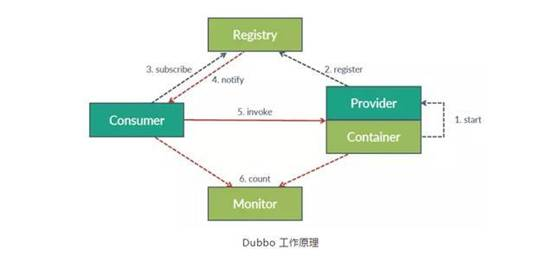
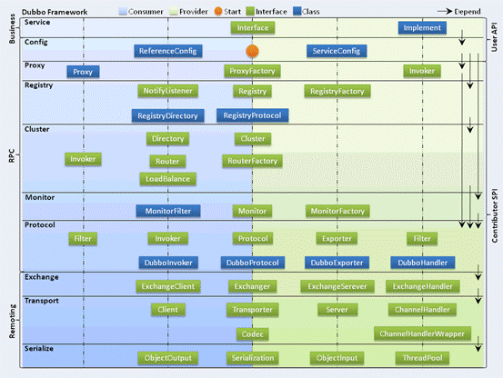

| 序号 | 修改时间   | 修改内容                           | 修改人 | 审稿人 |
| ---- | ---------- | ---------------------------------- | ------ | ------ |
| 1    | 2018-8-4   | 创建。从《微服务架构》拆分。       | 吴启福 |        |
| 2    | 2019-8-9   | CNCF章节拆分《CNCF云原生框架分析》 | 同上   |        |
| 3    | 2019-11-22 | Spring框架章节拆分另文             | 同上   |        |
|      |            |                                    |        |        |
---

 

# 目录
```
[目录... 1](#_Toc25396565)
[1       分布式框架概述... 2](#_Toc25396566)
[1.1        CNCF. 2](#_Toc25396567)
[1.2        RPC框架比较... 2](#_Toc25396568)
[2       微服务框架... 3](#_Toc25396569)
[2.1        Spring Boot/Cloud框架体系（Java）... 4](#_Toc25396570)
[2.2        Dubbo. 4](#_Toc25396571)
[Dubbo架构... 4](#_Toc25396572)
[2.3        本章参考... 6](#_Toc25396573)
[3       RPC框架... 6](#_Toc25396574)
[3.1        Thrift. 6](#_Toc25396575)
[简介... 6](#_Toc25396576)
[实例... 7](#_Toc25396577)
[3.2        本章参考... 8](#_Toc25396578)
[参考资料... 8](#_Toc25396579)
```


---


# 1  分布式框架概述
远程接口所用的消息传输格式详见： [《分布式架构》](../architecture.架构/分布式架构.md)相关章节 
## 1.1   CNCF
详见  [《CNCF云原生框架分析》](./CNCF云原生框架分析.md)


## 1.2   RPC框架比较

表格 1 RPC框架比较：gRPC、thrift、dubbo、motan

|                | Motan                                                        | Dubbox                                                       | thrift                                 | gRPC                             | rpcx                                         |
| -------------- | ------------------------------------------------------------ | ------------------------------------------------------------ | -------------------------------------- | -------------------------------- | -------------------------------------------- |
| 开源公司       | 新浪                                                         | 当当/阿里，2011                                              | Facebook，2007                         | 谷歌，2015                       |                                              |
| 开发语言       | Java                                                         | Java                                                         | 跨语言                                 | 跨语言                           | go                                           |
| 分布式服务治理 | Y                                                            | Y                                                            | 可以配合zookeeper,Eureka等实现         | 可以配合etcd(go),ZK,consul等实现 | 自带服务注册中心，也支持ZK,etcd等发现方式    |
| 底层协议       | motan协议，使用tcp长连接                                     | Dubbo、Rmi、<br>Hessian、HTTP、WebService、DubboThrift、Memcached | tpc/http/frame                         | http2                            | tcp长链接                                    |
| 消息序列化     | hessian2,json                                                | hessian2,json,resr,kyro,<br>FST等，可扩展protobuf等          | thrift                                 | protobuf                         | Gob、Json、MessagePack、gencode、ProtoBuf等  |
| 跨语言编程     | N(支持phpclient和cserver)                                    | N                                                            | Y                                      | Y                                | N                                            |
| 负载均衡       | ActiveWeight、Random、RoundRobin、LocalFirst、Consistent、ConfigurableWeight | Random、RoundRobin、ConsistentHash、LeastActive              | Haproxy,zookerper+客户端负载均衡等方案 | 负载均衡软件HaProxy等            | 支持随机请求、轮询、低并发优先、一致性Hash等 |
| 容错           | Failover失效切换、Failfast快速失败                           | Failover、Failfast、Failsafe、Failback、Forking、Broadcast   | Failover                               | 具有Failover失效切换的容错策略   | 失败重试（Failover）、快速失败（Failfast）   |
| 注册中心       | consul                                                       | zookeeper                                                    | zookeeper                              | etcd,zookeeper,consul            | zookerper,etcd                               |
| 性能           | ★★                                                           | ★★                                                           | ★★★★  比grpc快2-5倍                    | ★★★                              | ★★★★★比thrift快1-1.5倍                       |
| 侧重优势       | 服务管理                                                     | 服务管理                                                     | 跨语言，性能++                         | 跨语言，性能                     | 性能++，服务治理                             |
| 客户端异步调用 |                                                              |                                                              |                                        | stream传输，双向通信             |                                              |
| 服务端异步处理 |                                                              |                                                              |                                        | 同上，使用stream传输。           |                                              |

备注：1. Motan是新浪微博开源的RPC框架，可认为是简化版的Dubbo。dubboX是当当基于Dubbo的版本。Dubbo阿里开源。 

2. gRPC：Stream对象在传输过程中会被当做集合，用Iterator来遍历处理。网络库netty。

# 2   微服务框架
微服务是一种架构的理念，提出了微服务的设计原则，从理论为具体的技术落地提供了指导思想。
表格 2 微服务框架列表


## 2.1   Spring Boot/Cloud框架体系（Java）
详见  [《SpringCloud框架分析》](./SpringCloud系列框架分析.md)


Spring Boot 是一套快速配置脚手架，可以基于 Spring Boot 快速开发单个微服务。
Spring Cloud 是一个基于 Spring Boot 实现的服务治理工具包;Spring Boot 专注于快速、方便集成的单个微服务个体;Spring Cloud 关注全局的服务治理框架。
Spring Boot / Cloud 是微服务实践的最佳落地方案。


## 2.2  Dubbo

Dubbo是阿里巴巴公司开源的一个高性能优秀的分布式服务框架，使得应用可通过高性能的 RPC 实现服务的输出和输入功能，可以和Spring框架无缝集成。
2011年开源，2013年停止更新，2017年9月又重启维护并发布新版本，2018.2进入Apache孵化器。
Dubbo支持多种注册中心，官方推荐Zookeeper。
### Dubbo架构
Dubbo是基于Java的RPC框架。如图所示，Dubbo工作分为4个角色，分别是服务提供者、服务消费者、注册中心和监控中心。

图 1 Dubbo工作原理
按照工作阶段又分为部署阶段和运行阶段。其中部署阶段在图中以蓝色的线（1、2、3）来表示，代表服务注册、服务订阅的过程，而运行阶段在图中以红色的线（4、5、6）来表示，代表一次RPC的完整调用。
部署阶段中服务提供方在启动时在制定的端口上暴露服务（1），并向注册中心汇报自身的地址（2），服务调用方启动时向注册中心订阅感兴趣的地址（3）。
运行阶段中注册中心首先将地址列表推送给服务消费者（4），服务消费者从其中选取一个地址向对端发起调用（5）。在这个过程中，服务消费者和服务提供者的运行状态会上报给监控中心（6）。



图 2 Dubbo的整体架构

Dubbo框架设计一共划分了10个层，而最上面的Service层是留给实际想要使用Dubbo开发分布式服务的开发者实现业务逻辑的接口层。图中左边淡蓝背景的为服务消费方使用的接口，右边淡绿色背景的为服务提供方使用的接口， 位于中轴线上的为双方都用到的接口。

**各个层次的设计要点：**
1. 服务接口层（Service）：该层是与实际业务逻辑相关的，根据服务提供方和服务消费方的业务设计对应的接口和实现。
2. 配置层（Config）：对外配置接口，以ServiceConfig和ReferenceConfig为中心，可以直接new配置类，也可以通过spring解析配置生成配置类。
3. 服务代理层（Proxy）：服务接口透明代理，生成服务的客户端Stub和服务器端Skeleton，以ServiceProxy为中心，扩展接口为ProxyFactory。
4. 服务注册层（Registry）：封装服务地址的注册与发现，以服务URL为中心，扩展接口为RegistryFactory、Registry和RegistryService。可能没有服务注册中心，此时服务提供方直接暴露服务。
5. 集群层（Cluster）：封装多个提供者的路由及负载均衡，并桥接注册中心，以Invoker为中心，扩展接口为Cluster、Directory、Router和LoadBalance。将多个服务提供方组合为一个服务提供方，实现对服务消费方来透明，只需要与一个服务提供方进行交互。
6. 监控层（Monitor）：RPC调用次数和调用时间监控，以Statistics为中心，扩展接口为MonitorFactory、Monitor和MonitorService。
7. 远程调用层（Protocol）：封将RPC调用，以Invocation和Result为中心，扩展接口为Protocol、Invoker和Exporter。Protocol是服务域，它是Invoker暴露和引用的主功能入口，它负责Invoker的生命周期管理。Invoker是实体域，它是Dubbo的核心模型，其它模型都向它靠扰，或转换成它，它代表一个可执行体，可向它发起invoke调用，它有可能是一个本地的实现，也可能是一个远程的实现，也可能一个集群实现。
8. 信息交换层（Exchange）：封装请求响应模式，同步转异步，以Request和Response为中心，扩展接口为Exchanger、ExchangeChannel、ExchangeClient和ExchangeServer。
9. 网络传输层（Transport）：抽象mina和netty为统一接口，以Message为中心，扩展接口为Channel、Transporter、Client、Server和Codec。
10. 数据序列化层（Serialize）：可复用的一些工具，扩展接口为Serialization、 ObjectInput、ObjectOutput和ThreadPool。


## 2.3  本章参考

[1]: https://spring.io/  "spring"
[2]: https://docs.spring.io/spring-boot/docs/current-SNAPSHOT/reference/htmlsingle/  "Spring Boot Reference Manual"
[3]: https://cloud.spring.io/spring-cloud-static/current/  "Spring Cloud Reference Manual"
[4]: http://dubbo.apache.org  "dubbo"
[5]: http://shiyanjun.cn/archives/325.html  "Dubbo架构设计详解"


# 3   RPC框架

## 3.1   Thrift
### 简介
Thrift是一个软件框架，用来进行可扩展且跨语言的服务的开发。它结合了功能强大的软件堆栈和[代码生成](https://baike.baidu.com/item/代码生成)引擎，以构建在 C++, Java, Go,Python, PHP, Ruby, Erlang, Perl, Haskell, C#, Cocoa, JavaScript, Node.js, Smalltalk, and OCaml 这些编程语言间无缝结合的、高效的服务。
thrift最初由facebook开发用做系统内各语言之间的RPC通信 。2007年由facebook贡献到apache基金 ，08年5月进入apache孵化器 。支持多种语言之间的RPC方式的通信：如php语言client可以构造一个对象，调用相应的服务方法来调用Java语言的服务 ，跨越语言的C/S RPC调用 。

Thrift允许定义一个简单的[定义文件](https://baike.baidu.com/item/定义文件)中的数据类型和服务接口，以作为输入文件，[编译器](https://baike.baidu.com/item/编译器)生成代码用来方便地生成RPC客户端和服务器通信的无缝跨编程语言。支持多种语言之间的RPC方式的通信：php语言client可以构造一个对象，调用相应的服务方法来调用java语言的服务 ，跨越语言的C/S RPC调用 。
Thrift 也能够让你选择传输协议，包括原始 TCP 和 HTTP。原始 TCP 比 HTTP 更高效，然而 HTTP对于防火墙、浏览器和使用者来说更友好。
Apache Thrift软件框架用于可扩展的跨语言服务开发，简单来说就是RPC远程调用，它是一个完整的 RPC 框架体系。 


**Thrift支持的数据类型**  1.基本类型 
 bool：布尔值 (true or false), one byte 
 byte：有符号字节 
 i16：16位有符号整型 
 i32：32位有符号整型 
 i64：64位有符号整型 
 double：64位浮点型 
 string：编码或者二进制的字符串
2.容器（Containers） 
 Thrift容器与流行编程语言的容器类型相对应，采用Java泛型风格。它有3种可用容器类型： 
 list: 元素类型为t1的有序表，容许元素重复。 
 set:元素类型为t1的无序表，不容许元素重复。 
 map

### 实例
**客户端异步处理**
*  使用thriftIDL“oneway”关键字(无返回结果)，+callback 
*  tcp异步请求
*  -thriftIDL参数不支持函数或服务

**服务器端异步处理**
1.  不同语言的实现试
TNonblockingServer(java/c++,php);
THsHaServer(java/c++);
TThreadpoolServer(java/c++);
TThreadSelectorServer(java/c++)
2. 结合消息队列或中间件
3. swoole/goroutine等多任务支持
 ```shell
# result.thrift
namespace java wu.thrift.bean
struct TResult{
    1: optional string code;
    2: optional string describe;
}
# 
namespace java wu.thrift.service
include "result.thrift"
typedef result.TResult TResult
service TResultService{
    TResult getResponse(1:string code);
}
 ```

## 3.2     本章参考
[1].     thrift使用总结 https://blog.csdn.net/qq_27784479/article/details/73250958 


# 参考资料