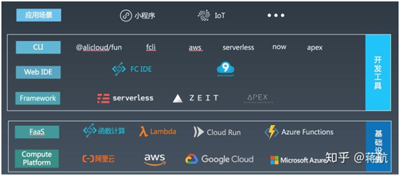
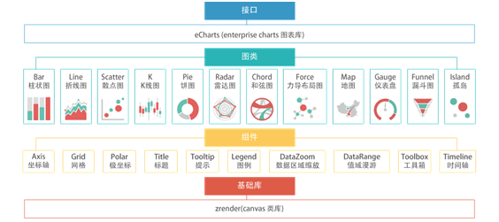
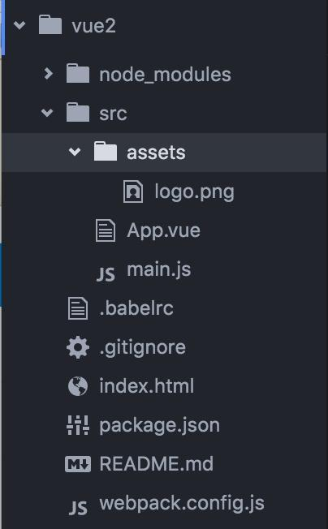
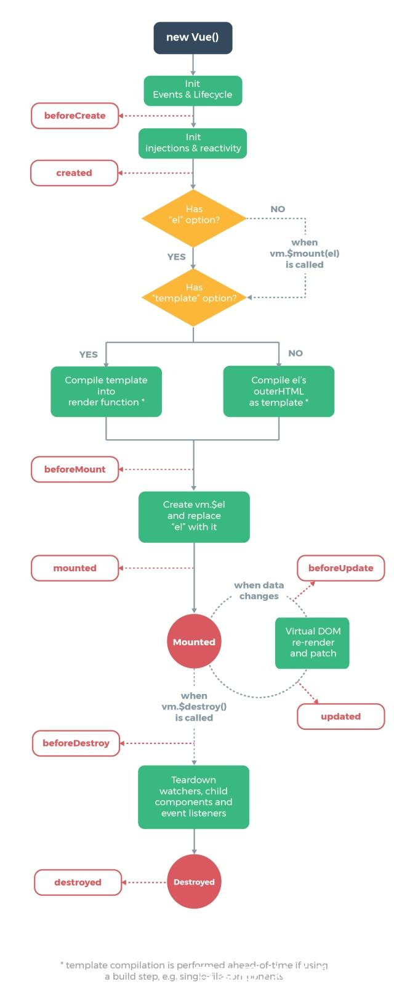

| 序号 | 修改时间   | 修改内容            | 修改人 | 审稿人 |
| ---- | ---------- | ------------------------------------- | ------ | ------ |
| 1    | 2019-12-15 | 创建。从《web框架》相关章节迁移成文。 | Keefe | Keefe |
|   |      |                  |     |     |
---


**目录**

[1 前端概述... 1](#_Toc27424406)

[前端开发史... 2](#_Toc27424407)

[前端架构... 3](#_Toc27424408)

[Serverless. 3](#_Toc27424409)

[前端工程化... 4](#_Toc27424410)

[前端工具... 4](#_Toc27424411)

[npm... 5](#_Toc27424412)

[Bable.. 7](#_Toc27424413)

[术语... 8](#_Toc27424414)

[本章参考... 10](#_Toc27424415)

[2 前端框架... 10](#_Toc27424416)

[2.1 前端框架概述... 11](#_Toc27424417)

[2.2 模板引擎... 11](#_Toc27424418)

[2.2.1 Smarty（PHP）... 11](#_Toc27424419)

[2.2.2 Jiaja2 (Python). 13](#_Toc27424420)

[2.3 AJAX.. 14](#_Toc27424421)

[2.3.1 Prototype.. 14](#_Toc27424422)

[2.3.2 JQuery. 16](#_Toc27424423)

[2.4 Bootstrap.. 17](#_Toc27424424)

[2.5 View层-数据可视化... 17](#_Toc27424425)

[2.5.1 React. 17](#_Toc27424426)

[2.5.2 Vue.. 19](#_Toc27424427)

[2.5.3 D3/nvd3.. 20](#_Toc27424428)

[2.5.4 Echarts. 21](#_Toc27424429)

[2.7 本章参考... 21](#_Toc27424430)

[Node.js. 22](#_Toc27424431)

[简介... 22](#_Toc27424432)

[入门实例... 23](#_Toc27424433)

[安装篇... 23](#_Toc27424434)

[示例1：hello world.. 25](#_Toc27424435)

[示例2：sacdl-project. 25](#_Toc27424436)

[技术原理篇... 26](#_Toc27424437)

[并发处理：事件和回调... 26](#_Toc27424438)

[全局对象和模块... 27](#_Toc27424439)

[相关框架：Express. 28](#_Toc27424440)

[本章参考... 29](#_Toc27424441)

[Vue.. 29](#_Toc27424442)

[vue-cli. 29](#_Toc27424443)

[vue项目结构... 30](#_Toc27424444)

[本章参考... 31](#_Toc27424445)

[参考资料... 31](#_Toc27424446)

 

[TOC]


---

# 1  前端概述

前端开发包括

* 前端页面展现：HTML/CSS/JavaScript

* 后端业务逻辑处理：PHP/ASP/Python/...

* 数据库访问：ADO/MYSQL/ORM/...

 狭义的前端只能前端页面层，广义的前端则包括了页面+后端逻辑。


**易用性是网页开发质量的一个重要组成。**

前端基础可简单认为：html + css + JavaScript

进一步扩展，则

* html, xhtml, xml,  
* css -> xsl
* JavaScript, browser script; ….

 

## 前端开发史


前端开发模式的演进，主要有四个阶段。

1. 基于模板渲染的动态页面：此阶段无前后端的分离。

2. 基于 AJAX 的前后端分离：2015年AJAX出现，开始出现前端工程师职位。

3. 基于 Node.js 的前端工程化：2009年Node.js出现，随着 Node.js 一同出现的还有 CommonJS 规范和 npm 包管理机制。随后也出现了 Grunt、Gulp、Webpack 等一系列基于 Node.js 的前端开发构建工具。2013 年前后，前端三大框架 React.js/Angular/Vue.js 相继发布第一个版本。前端开发开始变得规范化、标准化、工程化。

4. 基于 Node.js 的全栈开发。随着微服务的兴起，在微服务和前端中间，加了一个 BFF（Backend For Frontend） 层，由 BFF 对接口进行聚合、裁剪后，再输出给前端。


表格  淘宝的前端开发史

| 年代   | 简介                     | 主要技能                       |
| --------- | --------------------------------------------------- | ------------------------------------------------------------ |
| 2003~2006 | 静态页面、嵌套表格、单一浏览器、兼职开发 | HTML/CSS/JS，SEO |
| 2006~2007 | 增加了交互、视觉设计，专门设立WEB前端工程师职位。 | 新增：标准兼容（W3C/HTML4/JS）、调试工具（Firebug）、用户体验 |
| 2007~2008 | 大量使用AJAX，内容剧增 | 新增：栅格化、库/框架(YUI2/tbra)、部署（jslint/YC/ant)、组件库、性能优化 |
| 2009-2010 | 前端性能问题、组件本地化、多人协作/前端架构的模块化 | 新增：前端架构(yui3、kissy) |
| 2010~2011 | 移动终端、大屏、OPOA（单页应用） | 新增：前端MVC、HTML5/CSS3、移动终端 |
| 2012~ | FSAS~函数作为服务。云计算时代的前端。 | |


## 前端架构

###  SAP

SAP~Single Page Application，单页面应用。将渲染HTML的工作全部交给前端。

SAP相对于 之前的MAP（多页应用），有以下不同：

优点

* 前端掌控路由，用户体验更佳。
* 可移植，可离线使用。
* 服务器端提供的是干净数据接口，具备高度的可复用性。
* HTML资源作为静态资源，易于部署。
* 前后端完全分离，各自维护源码，无须而合。

**缺点**

* SEO不友好，难度较高
* 前进后退管理麻烦
* 初次加载消耗高（白屏时间）。

**优化**

*　SEO用 #!来替换 #，因为google会采集 带#!的URL
*　记录浏览历史路由，来管理前进后退。
*　加载优化：页面压缩；渐次加载。


SPA 前端实现方式  通常有2种：      

* 修改 url 中 Hash：通过hashchange事件，监听#后字符变化

* 利用 H5 中的 history： back(), forward(), go()，pushState()和 replaceState()


### Serverless

Serverless = FAAS+ BAAS。

*  FAAS（Function as a Service） 就是一些运行函数的平台，比如阿里云的函数计算、AWS 的 Lambda 等。
*  BAAS（Backend as a Service）则是一些后端云服务，比如云数据库、对象存储、消息队列等。利用 BAAS，可以极大简化我们的应用开发难度。

Serverless 的主要特点有：

* 事件驱动

* 函数在 FAAS平台中，需要通过一系列的事件来驱动函数执行。

* 无状态

* 因为每次函数执行，可能使用的都是不同的容器，无法进行内存或数据共享。如果要共享数据，则只能通过第三方服务，比如 Redis 等。

* 无运维

* 使用 Serverless 我们不需要关心服务器，不需要关心运维。这也是 Serverless 思想的核心。

* 低成本

* 使用 Serverless 成本很低，因为我们只需要为每次函数的运行付费。函数不运行，则不花钱，也不会浪费服务器资源

  

图 1 Serverless 服务中的前端解决方案架构图

​          

## 前端技术

### ES/ES6

ES是ECMAScript的简称。

ECMAScript是一种由Ecma国际（前身为欧洲计算机制造商协会，European Computer Manufacturers Association）通过ECMA-262标准化的脚本程序设计语言。ECMAScript最初由网景的布兰登·艾克开发，原命名为Mocha，后改名为LiveScript，最后重命名为JavaScript。JavaScript、微软的JScript和Adobe的ActionScript都是ECMAScript的实现子集。<br>1995年12月，升阳与网景联合发表了JavaScript。

1999年12月，ECMAScript 3.0版发布，成为JavaScript的通行标准，得到了广泛支持。

2015年6月17日，ECMAScript 6发布正式版本，即*ECMAScript 2015*。


**ES６语法**

参见 TypeScript 语法。


### CSS/CSS3


### JS/JSX/TypeScript

* JS- Javascript
* JSX： js的扩展。React框架用了JSX语法。
* Typescript是js的超集。


**JSX语法**

见下方 React章节


**TypeScript**

TypeScript 是 JavaScript 的一个超集，主要提供了类型系统和对 ES6 的支持，它由 Microsoft 开发，代码开源于 GitHub 上。它可以编译成纯 JavaScript。编译出来的 JavaScript 可以运行在任何浏览器上。TypeScript 编译工具可以运行在任何服务器和任何系统上。TypeScript 是开源的。
它的第一个版本发布于 2012 年 10 月，经历了多次更新后，现在已成为前端社区中不可忽视的力量，不仅在 Microsoft 内部得到广泛运用，而且 Angular2、Vue3 也都使用了 TypeScript 作为开发语言。

* 特点：提供类型系统和es6的支持
* 安装： `npm install -g typescript` 
  * 编译 TypeScript 文件，生成hello.js：`tsc hello.ts`

优点：

1. 增加代码的可读性和可维护性
    * 类型系统是最好的文档
    * 在编译阶段就发现错误，比运行时发现错误好
    * 增加了编辑器和ide的功能，代码不全、接口提示、跳转到定义、重构
2. 包容性
    .js文件可重命名为.ts文件。
    不显式的定义类型，也能自动作出类型推论。
    可定义一切类型。
    即使typescript编译报错，也可生成js文件。
    兼容第三方库，即使第三方库不是用ts写的，也可编写单独的类型文件供ts读取。


**TS语法**

表格 TS基本语法

| 语法     | 语法项  | 定义                   | 说明                                                         |
| -------- | ------- | ---------------------- | ------------------------------------------------------------ |
| 类型     |         |                        | unknown(高度类似any), void(高度类似undefined),  never, any, undefined |
|          | unknown | 不可预先定义的类型     | 在很多场景下，它可以替代 any 的功能同时保留静态检查的能力。  |
|          | void    | 空                     | void 和 undefined 功能高度类似，可以在逻辑上避免不小心使用了空指针导致的错误。某种程度undefined 是 void 的一个子集。 |
|          | never   | 没法正常结束返回的类型 | 一个必定会报错或者死循环的函数会返回这样的类型。             |
| 运算符   |         |                        | !  ?.  ??  _  \|\|  `三元运算符a?b:c`                        |
|          | !       | 非空断言运算符         | 可以用在变量名或者函数名之后，用来强调对应的元素是非 null。示例`callback!();` |
|          | ?.   | 可选链运算符           | 作用于编译阶段的非空判断。用来判断左侧的表达式是否是 null，如果是则会停止表达式运行，可以减少我们大量的&&运算。 |
|          | ??      | 空值合并运算符         | ??与\|\|的功能是相似的，区别在于??在左侧表达式结果为 null 或者 undefined 时，才会返回右侧表达式。 |
|          | _       | 数字分隔符             | _可以用来对长数字做任意的分隔，主要设计是为了便于数字的阅读，编译出来的代码是没有下划线的。 |
|          | …       | 扩展运算符             | 用于取出参数对象中的所有可遍历属性，拷贝到当前对象之中。     |
| 操作符   |         |                        |                                                              |
|          | keyof   | 键值获取               | keyof 可以获取一个类型所有键值，返回一个联合类型             |
|          | typeof  | 实例类型获取           | typeof 是获取一个对象/实例的类型                             |
|          | in      | 遍历 属性              | in 只能用在类型的定义中，可以对枚举类型进行遍历              |
| 泛型     |         |                        | 语法格式：类型名<泛型列表> 具体类型定义                      |
|          | extends | 泛型约束&泛型条件      | 语法格式：`类型名 extends 类型`   或  `类型名A extends 类型A ？类型B: 类型C` |
|          | infer   | 泛型判断               |                                                              |
| 泛型工具 |         |                        | Partical<T>  Record<K, T>  Pick<T, K>   Exclude<T, U>  Omit<T, K>  ReturnType<T>  Required<T> |
|          |         |                        |                                                              |

> 其它：`: `用于指定一个类型。`=>`用于函数的执行逻辑。

```tsx
// ts函数示例：const fun=()=>{}，支持函数内嵌套定义函数，如下面onClick函数里定义了stopQuery方法。
// onClick函数名作为常量，相当于 const onClick=(arg1:type, arg2:type...):void => {};
const onClick = (
  shouldShowStopButton: boolean,
  allowAsync: boolean,
  runQuery: (c?: boolean) => void = () => undefined,
  stopQuery = () => {},
): void => {
  if (shouldShowStopButton) return stopQuery();
  if (allowAsync) {
    return runQuery(true);
  }
  return runQuery(false);
};
```


## 前端工程化

前端开发过程产生的问题

1.　ECMAScript（ES）规范与浏览器兼容性不一致：想使用最新的ECMAScript规范进行开发，但受限于浏览器实现，需要适配旧规范。
2.　CSS的弱编程能力：想使用LESS/SASS等预编译语法或者PostCSS自动处理hack。
3.　资源定位：本地开发静态资源引用的是本地相对路径，上线前需要修改为真实URL。
4. 考虑产品性能：需要压缩静态资源，图片压缩/BASE64内嵌/CSS Sprites。
5.　模块依赖分析和压缩打包：模块化开发，提高维护效率。上线前模块需要进行依赖分析和合并打包。
6.　协作层面：前端依赖后端数据
7.　部署层面：静态文件（JS/CSS/图片）与动态文件(HTML模板)仍然存在于同一项目，前端部分资源仍然需要后端工程师部署。

说明：针对上面七大问题。前面五大是开发问题。


前端工程化流水线要经过大概四个阶段：脚手架 --> 构建 --> 本地开发服务器 --> 部署

| 阶段           | 目的                                                         | 功能                                                         | 工具                        |
| -------------- | ------------------------------------------------------------ | ------------------------------------------------------------ | --------------------------- |
| 脚手架         | 快速搭建前端基本环境，以聚焦业务。                           | 包括自动安装、统一工具栈等。                                 | [Yeoman](http://yeoman.io/) |
| 构建<br>       | 也叫编译。将源代码中转化成宿主浏览器能执行的代码。解决前端七大问题中的开发问题。 | 解决依赖打包、资源嵌入、文件压缩、HASH指纹等。构建还包括构建需要解决3类问题，分别是语言、优化和部署。 | webpack                     |
| 本地开发服务器 | 本地服务器最典型的应用是MOCK服务，通过模拟接口和数据解决前端JS对数据API的依赖问题，从而实现前后端并行开发。 | MOCK服务。<br>支持SSR（服务器端渲染）。<br>动态构建。        |                             |
| 部署           |                                                              |                                                              |                             |


表格 构建步骤的前端资源变化

| 源资源                  | 构建后产出资源 | 构建动作       |
| -------------------------------------------- | -------------- | -------------------- |
| 领先于浏览器实现的ECMAScript规范编写的JS代码 (xx.es) | JS       | ECMAScript规范编转译 |
| LESS/SAAS预编译语法编写的CSS代码 (xx.less) | CSS      | CSS预编译语法转译    |
| Jade/EJS/Mustache等模板语法编写的HTML代码 (xx.jade) | html     | HTML模板渲染      |

  

## 前端工具

表格  前端常用工具1

| 工具                               | 简介                                                         | 安装                                                         | 使用                                   |
| ---------------------------------- | ------------------------------------------------------------ | ------------------------------------------------------------ | -------------------------------------- |
| node.js                            | 建立在谷歌Chrome的JavaScript引擎(V8引擎)的Web应用程序框架。  | `nvm install 5.1.0`   或者<br>`apt-get install nodejs`       | node -v                                |
| npm/   cnpm                        | NPM是随同NodeJS一起安装的包管理工具，能解决NodeJS代码部署上的很多问题。用来安装npm包。cnpm为中国区。 | `npm install -g cnpm --registry=https://registry.npm.taobao.org` | npm -v   npm install   [xxx]           |
| nvm                                | node.js的包管理工具。                                        | curl  -o https://raw.githubusercontent.com/creationix/nvm/v0.33.1/install.sh \| bash | nvm  --version   nvm install [version] |
| yarn                               | 替代npm。为了弥补 npm 的一些缺陷而出现的。                   | npm install -g yarn                                          |                                        |
| webpack                            | 模块打包工具。2012.3诞生。                                   | npm install webpack@xx -g                                    |                                        |
| babel                              | Babel 是一个 JavaScript 编译器，是一个工具链。<br>主要用于将 ECMAScript 2015+ 版本的代码转换为向后兼容的 JavaScript 语法，以便能够运行在当前和旧版本的浏览器或其他环境中。（ES转译） |                                                              |                                        |
| [Gulp](https://www.gulpjs.com.cn/) | 2012.3诞生。基于 Node.js 的项目、流(stream)的自动化构建工具。<br/>Grunt 采用配置文件的方式执行任务，而 [Gulp](https://www.gulpjs.com.cn/) 一切都通过代码实现。 | npm install gulp -g                                          | gulp [js_pipe]   gulp deploy           |
| [Grunt](http://www.gruntjs.net/)   | 2012.6诞生。Grunt 是基于 Node.js 的项目构建工具。<br>它可以自动运行你所设定的任务。Grunt 拥有数量庞大的插件。 | npm install -g grunt-cli                                     |                                        |
| bower                              | npm包，前端管理工具，专门用来管理WEB前端依赖包（JS/CSS/IMAGES/fonts） | npm  install bower<br>bower init 初始化生成bower.json        | bower install xx                       |
| n                                  | 用来管理nodejs版本。<br>查看nodejs版本：n lsr                | npm install -g n                                             | 安装指定版本：n xx                     |
| npx                                | npm5.2+版本新增。npx 想要解决的主要问题，就是调用项目内部安装的模块。<br>运行的时候，会到`node_modules/.bin`路径和环境变量`$PATH`里面，检查命令是否存在。 |                                                              |                                        |

备注：cnpm类似npm，只是源在中国。


表格 前端常用工具2

| 工具名                                                       | 用途                                                         | 备注 |
| :----------------------------------------------------------- | ------------------------------------------------------------ | ---- |
| [PostCSS](https://www.postcss.com.cn/)                       | CSS预编译器。支持未来 CSS 语法、模块化、代码检测等。         |      |
| [LESS](https://www.bootcss.com/p/lesscss/)/[SASS](https://www.sasscss.com/) | CSS预编译语法转换。                                          |      |
| CommonJS                                                     | 面向浏览器以外的JavaScript模块化规范。原名ServeJS，2019年改现名，被Nodejs采纳为默认的模块化规范。 | 弃   |
| AMD/CMD                                                      | CommonJS的变种，主要针对浏览器环境的模板化规范。             | 弃   |
| ES6 Module                                                   | 规范的静态模块体系。                                         | 标准 |
| [ESLint](https://cn.eslint.org/)                             | ESLint 是一个插件化并且可配置的 JavaScript 语法规则和代码风格的检查工具。ESLint 能够帮你轻松写出高质量的 JavaScript 代码。 |      |

备注：模块化规范有三种分别是CommonJS、AMD/CMD和ES6 Module，任选其一即可。在ES6 Module推出后，另外二种退出舞台。


### npm&cnpm

npm是随同NodeJS一起安装的包管理工具，能解决NodeJS代码部署上的很多问题，常见的使用场景有以下几种：

- 允许用户从NPM服务器下载别人编写的第三方包到本地使用。

- 允许用户从NPM服务器下载并安装别人编写的命令行程序到本地使用。

- 允许用户将自己编写的包或命令行程序上传到NPM服务器供别人使用。

  ```sh
  # 查看当前版本
  $ npm -v
  
  # install后空是根据当前目录下的package.json安装；否则安装指定包，@版本号
  npm install
  npm install xx
  npm install xx@x.x
  
  # npm升级自身 
  $ npm install npm -g
  ```

**cnpm**:  淘宝镜像的npm, 中国区用户速度更快

```shell
# 安装cnpm
$ npm install -g cnpm --registry=https://registry.npm.taobao.org 
```


**npm命令**

```sh
$ npm --help
Usage: npm <command>

where <command> is one of:
    access, adduser, audit, bin, bugs, c, cache, ci, cit,
    clean-install, clean-install-test, completion, config,
    create, ddp, dedupe, deprecate, dist-tag, docs, doctor,
    edit, explore, fund, get, help, help-search, hook, i, init,
    install, install-ci-test, install-test, it, link, list, ln,
    login, logout, ls, orgtdated, owner, pack, ping, prefix,
    profile, prune, publish, rb, rebuild, repo, restart, root,
    run, run-script, s, se, search, set, shrinkwrap, star,
    stars, start, stop, t, team, test, token, tst, un,
    uninstall, unpublish, unstar, up, update, v, version, view,
    whoami

npm <command> -h  quick help on <command>
npm -l      display full usage info
npm help <term>   search for help on <term>
npm help npm   involved overview

Specify configs in the ini-formatted file:
    C:\Users\keefe\.npmrc
or on the command line via: npm <command> --key value
Config info can be viewed via: npm help config

npm@6.13.2 C:\Users\keefe\AppData\Roaming\npm\node_modules\npm

# aliases：命令别名
$ npm run --help
npm run-script <command> [-- <args>...]

aliases: run, rum, urn

$ npm install --help
npm install (with no args, in package dir)
npm install [<@scope>/]<pkg>
npm install [<@scope>/]<pkg>@<tag>
npm install [<@scope>/]<pkg>@<version>
npm install [<@scope>/]<pkg>@<version range>
npm install <alias>@npm:<name>
npm install <folder>
npm install <tarball file>
npm install <tarball url>
npm install <git:// url>
npm install <github username>/<github project>

aliases: i, isntall, add
common options: [--save-prod|--save-dev|--save-optional] [--save-exact] [--no-save]
```

备注： 

* npm init 会产生初始的package.json
* npm run xx 是最常用，用来启动各种命令如dev(热更新代码，用于开发环境)  build(构建生产版本)  lint ...
* npm install  安装依赖于package.json,  注意是--save-dev 还是 -g
* npm ci  类似install，冻结安装，依赖于package.json.lock，安装更快也更严谨。
* npm list/npm show -g  列出npm所有安装的包, 
* npm show xxx  列出某个包的详细情况 
* npm root -g 查看全局安装路径


**npm配置项**

```shell
# 列出 npm主要配置项
$ npm config list
; cli configs
metrics-registry = "https://registry.npm.taobao.org/"
scope = ""
user-agent = "npm/6.14.11 node/v10.24.0 win32 x64"

; project config D:\mydocs\repos\script-langs\toolkit\etc\.npmrc
cache = "C:\\Users\\qfwud\\nodejs\\node_cache"
prefix = "C:\\Users\\qfwud\\nodejs\\node_global"
registry = "https://registry.npm.taobao.org/"

; userconfig C:\Users\qfwud\.npmrc
cache = "C:\\Users\\qfwud\\nodejs\\node_cache"
prefix = "C:\\Users\\qfwud\\nodejs\\node_global"
registry = "https://registry.npm.taobao.org/"

; node bin location = D:\dev\langs\nodejs\node-v10.24.0-win-x64\node.exe
; cwd = D:\mydocs\repos\script-langs\toolkit\etc
; HOME = C:\Users\qfwud
; "npm config ls -l" to show all defaults.

# 列出 npm所有可配置信息
$ npm config list --json
{
  "json": true,
  "user-agent": "npm/6.14.11 node/v10.24.0 win32 x64",
  "metrics-registry": "https://registry.npm.taobao.org/",
  "scope": "",
  "prefix": "C:\\Users\\qfwud\\nodejs\\node_global",
  "cache": "C:\\Users\\qfwud\\nodejs\\node_cache",
  "registry": "https://registry.npm.taobao.org/",
  "access": null,
  "allow-same-version": false,
  "always-auth": false,
  "also": null,
  "audit": true,
  "audit-level": "low",
  "auth-type": "legacy",
  "before": null,
  "bin-links": true,
  "browser": null,
  "ca": null,
  "cache-lock-stale": 60000,
  "cache-lock-retries": 10,
  "cache-lock-wait": 10000,
  "cache-max": null,
  "cache-min": 10,
  "cert": null,
  "cidr": null,
  "color": true,
  "depth": null,
  "description": true,
  "dev": false,
  "dry-run": false,
  "editor": "notepad.exe",
  "engine-strict": false,
  "force": false,
  "format-package-lock": true,
  "fund": true,
  "fetch-retries": 2,
  "fetch-retry-factor": 10,
  "fetch-retry-mintimeout": 10000,
  "fetch-retry-maxtimeout": 60000,
  "git": "git",
  "git-tag-version": true,
  "commit-hooks": true,
  "global": false,
  "globalconfig": "C:\\Users\\qfwud\\nodejs\\node_global\\etc\\npmrc",
  "global-style": false,
  "group": 0,
  "ham-it-up": false,
  "heading": "npm",
  "if-present": false,
  "ignore-prepublish": false,
  "ignore-scripts": false,
  "init-module": "C:\\Users\\qfwud\\.npm-init.js",
  "init-author-name": "",
  "init-author-email": "",
  "init-author-url": "",
  "init-version": "1.0.0",
  "init-license": "ISC",
  "key": null,
  "legacy-bundling": false,
  "link": false,
  "loglevel": "notice",
  "logs-max": 10,
  "long": false,
  "maxsockets": 50,
  "message": "%s",
  "node-options": null,
  "node-version": "10.24.0",
  "offline": false,
  "onload-script": null,
  "only": null,
  "optional": true,
  "otp": null,
  "package-lock": true,
  "package-lock-only": false,
  "parseable": false,
  "prefer-offline": false,
  "prefer-online": false,
  "preid": "",
  "production": false,
  "progress": true,
  "proxy": null,
  "https-proxy": null,
  "noproxy": null,
  "read-only": false,
  "rebuild-bundle": true,
  "rollback": true,
  "save": true,
  "save-bundle": false,
  "save-dev": false,
  "save-exact": false,
  "save-optional": false,
  "save-prefix": "^",
  "save-prod": false,
  "script-shell": null,
  "scripts-prepend-node-path": "warn-only",
  "searchopts": "",
  "searchexclude": null,
  "searchlimit": 20,
  "searchstaleness": 900,
  "send-metrics": false,
  "shell": "C:\\Windows\\system32\\cmd.exe",
  "shrinkwrap": true,
  "sign-git-commit": false,
  "sign-git-tag": false,
  "sso-poll-frequency": 500,
  "sso-type": "oauth",
  "strict-ssl": true,
  "tag": "latest",
  "tag-version-prefix": "v",
  "timing": false,
  "tmp": "C:\\Users\\qfwud\\AppData\\Local\\Temp",
  "unicode": false,
  "unsafe-perm": true,
  "update-notifier": true,
  "usage": false,
  "user": 0,
  "userconfig": "C:\\Users\\qfwud\\.npmrc",
  "umask": 0,
  "version": false,
  "versions": false,
  "viewer": "browser",
  "globalignorefile": "C:\\Users\\qfwud\\nodejs\\node_global\\etc\\npmignore"
}
```


**npm安装扩展模块**
npm 的包安装分为本地安装（local）、全局安装（global）两种。可以用`npm root [-g|]` 查看安装路径。

* 本地安装（local）：分--save(**无参数时默认**) 和 --save-dev。安装路径在 ./node_modules 下（运行 npm 命令时所在的目录）。
* 全局安装（global）：-g，默认安装路径在~/.node_modules下（以配置文件.npmrc为准，通常推荐安装webpack, webpack-dev-server, babel）。 

示例安装 

```python
# 安装到全局环境
npm install 依赖包[@版本号] -g 
# 安装到当前环境并添加到package.json的dependencies部分
npm install 依赖包[@版本号] --save
# 安装到当前环境并添加到package.json的devDependencies部分
npm install 依赖包[@版本号] --save-dev
```

npm配置文件 [.npmrc ](https://www.npmjs.cn/files/npmrc/)

```ini
prefix=~\nodejs\node_global
cache=~\nodejs\node_cache
registry=https://registry.npm.taobao.org/
```


#### npm常用模块

packae.json里的组件版本含义

* “5.0.3” 表示安装指定的5.0.3版本，
* “～5.0.3” 表示安装5.0.X中最新的版本，
* “^5.0.3” 表示安装5.X.X中最新的版本。
* ">= 5.0.3 < 5.1.0" 表示安装在5.0.3到5.1.0之间的版本。


表格 npm常用扩展模块

| 框架    | 模块名        | 说明                                                         | 使用                                                       |
| ------- | ------------- | ------------------------------------------------------------ | ---------------------------------------------------------- |
| vue     | vue           | 脚手架，快速搭建开发环境。用来生成模板的vue工程。            | import Vue from 'vue'                                      |
|         | 组件经典组合  | vue-cli + vue-router(路由) + vue-x(扩展)                     | import VueRouter from "vue-router"                         |
|         | vue-resource  |                                                              | import VueResource from 'vue-resource'                     |
| react   | react         | react框架核心模块。                                          |                                                            |
|         | 组件经典组合  | react-dom +  react-router(路由) + react-redux(扩展)          |                                                            |
|         | react-scripts | react脚本，用来构建脚本命令。使用在package.json。            |                                                            |
| express | express       | 基于node.js的框架。脚手架。<br>它提供了一套强大的功能来开发Web和移动应用程序。 | var express = require('express');<br/>var app = express(); |
| 其它    | D3.js         | 数据可视化前端开发包。                                       | 安装：bower install d3 --save                              |
|         | eCharts       | 百度开源的数据可视化前端开发包。                             |                                                            |
|         | Yeoman        | 脚手架。                                                     | 安装：npm install -g yo                                    |
|         | gh-pages      | 文档构建和部署                                               |                                                            |
|         | ejs           | 模板引擎                                                     |                                                            |
|         | github        | github   api                                                 |                                                            |

备注：参数选项--save-dev为保存到开发目录（即当前目录，缺省选项。同时会写入到package.json里的devDependencies; --save写入到Dependencies ），-g 保存到全局目录。

1. npm包安装： npm/cnpm install [npm] --save-dev

2. 前端相关的包安装:  bower install [npm] --saves


表格 前端工程化所需的npm模块

| 工具            | 模块                 | 说明                                                         |
| --------------- | -------------------- | ------------------------------------------------------------ |
| webpack         | webpack              | 可以构建打包。配置文件webpack.config.js                      |
|                 | webpack-dev-server   | 基于Express框架的Node.js服务器。它还提供了一个客户端的运行环境，会被注入到页面代码中执行，并通过Socket.IO与服务器通信。<br/>服务器端的每次改动与重新构建都会被通知到页面上。还提供了如模块替换这样强大的功能。 |
| babel           | babel-core           | bable转化JS。配置文件.babelrc                                |
|                 | babel-preset-es2015  | babel的ES6语法包                                             |
|                 | babel-preset-react   | babel的React语法包                                           |
|                 | babel-runtime        |                                                              |
| eslint          | eslint               | 最新版本@3.19.0。配置文件.eslintrc.js                        |
|                 | eslint-config-airbnb | ESLint的第三方配置规则eslint-config-airbnb<br>依赖3个插件：eslint-plugin-import eslint-plugin-react eslint-plugin-jsx-a11y |
| Webpack -loader |                      | loader专注于处理资源内容。Webpack 默认只能处理 JavaScript 模块，如果要处理其他类型的文件，就需要使用 loader 进行转换。<br>插件：eslint-loader  babel-loader  style-loader css-loader less-loader sass-loader file-loader url-loader |
| Webpack -plugin |                      | plugin可以实现那些loader实现不了或者不适合在loader实现的功能，比如自动生成项目的HTML页面、向构建过程中注入环境变量等。<br>插件：html-webpack-plugin  uglifyjs-webpack-plugin |
|                 | clean-webpack-plugin | 清除webpack之前打包的文件。                                  |
| tools           | cross-env            | 设置环境变量，兼容windows和linux。示例 `cross-env NODE-ENV=prod` |

备注：用于开发 `npm instlal  xx  --save-dev`


#### **npm常见问题**

**Q1:  cygpath command not found**

描述： 

原因：cygwin兼容性问题。

解决方法：


**Q2：npm安装过程失败，重新安装总失败**

原因：需要清除缓存

解决方法：1.先删除node_module目录; 2.清除cache

```shell
$ rm -rf node_modules
$ npm cache clean --force
$ npm install -d  #开发模式安装，会安装dependencies和devDependencies，安装模块会更多些
$ npm run dev  #开发模式运行，即时编译，有修改即会触发编译。发布到生产时可用npm run build
```


**Q3： 解决linux下nodejs中watch文件最大数异常**

描述：

```shell
ENOSPC: System limit for number of file watchers reached
```

解决方法：

```shell
$ echo fs.inotify.max_user_watches=524288 | sudo tee -a /etc/sysctl.conf && sudo sysctl -p
```


### nvm

官网：http://nvm.sh/ -> https://github.com/nvm-sh/nvm/blob/master/README.md

nvm可用来管理nodejs的多个版本。

```sh
# 安装nvm
$ npm install -g nvm

# 安装特定版本nodejs，并切换版本use
$ nvm install 6.14
$ nvm use 6.14

# 设置缺省nodejs版本
$ nvm alias default 8.1.0
```


### yarn

“Yarn是由Facebook、Google、Exponent 和 Tilde 联合推出了一个新的 JS 包管理工具 ，正如[官方文档](https://link.jianshu.com?t=http%3A%2F%2Flink.zhihu.com%2F%3Ftarget%3Dhttps%3A%2F%2Fcode.facebook.com%2Fposts%2F1840075619545360)中写的，Yarn 是为了弥补 npm 的一些缺陷而出现的。

Yarn的优势  

* 速度更快
* 版本统一，冻结安装，依赖于package.json.lock，永远不修改package.json
* 更简洁输出
* 多安装源
* 更好的语义化命令


表格 Yarn和npm命令对比

|                          npm | yarn                 |
| ---------------------------: | :------------------- |
|                  npm install | yarn                 |
|     npm install react --save | yarn add react       |
|   npm uninstall react --save | yarn remove react    |
| npm install react --save-dev | yarn add react --dev |
|            npm update --save | yarn upgrade         |


### webpack

官网：https://webpack.js.org/

github仓库：https://github.com/webpack/webpack

**webpack** 是一个用于现代 JavaScript 应用程序的 *静态模块打包工具*。当 webpack 处理应用程序时，它会在内部构建一个 [依赖图(dependency graph)](https://webpack.docschina.org/concepts/dependency-graph/)，此依赖图对应映射到项目所需的每个模块，并生成一个或多个 *bundle*。

**webpack命令**

```shell
$ webpack --help
Usage: webpack [entries...] [options]
Alternative usage to run commands: webpack [command] [options]

The build tool for modern web applications.

Options:
  -c, --config <value...>                Provide path to a webpack configuration file e.g. ./webpack.config.js.
  --config-name <value...>               Name of the configuration to use.
  -m, --merge                            Merge two or more configurations using 'webpack-merge'.
  --env <value...>                       Environment passed to the configuration when it is a function.
  --node-env <value>                     Sets process.env.NODE_ENV to the specified value.
  --progress [value]                     Print compilation progress during build.
  -j, --json [value]                     Prints result as JSON or store it in a file.
  -d, --devtool <value>                  Determine source maps to use.
  --no-devtool                           Do not generate source maps.
  --entry <value...>                     The entry point(s) of your application e.g. ./src/main.js.
  --mode <value>                         Defines the mode to pass to webpack.
  --name <value>                         Name of the configuration. Used when loading multiple configurations.
  -o, --output-path <value>              Output location of the file generated by webpack e.g. ./dist/.
  --stats [value]                        It instructs webpack on how to treat the stats e.g. verbose.
  --no-stats                             Disable stats output.
  -t, --target <value...>                Sets the build target e.g. node.
  --no-target                            Negative 'target' option.
  -w, --watch                            Watch for files changes.
  --no-watch                             Do not watch for file changes.
  --watch-options-stdin                  Stop watching when stdin stream has ended.
  --no-watch-options-stdin               Do not stop watching when stdin stream has ended.

Global options:
  --color                                Enable colors on console.
  --no-color                             Disable colors on console.
  -v, --version                          Output the version number of 'webpack', 'webpack-cli' and 'webpack-dev-server' and commands.
  -h, --help [verbose]                   Display help for commands and options.

Commands:
  build|bundle|b [entries...] [options]  Run webpack (default command, can be omitted).
  configtest|t [config-path]             Validate a webpack configuration.
  help|h [command] [option]              Display help for commands and options.
  info|i [options]                       Outputs information about your system.
  serve|server|s [entries...] [options]  Run the webpack dev server.
  version|v [commands...]                Output the version number of 'webpack', 'webpack-cli' and 'webpack-dev-server' and commands.
  watch|w [entries...] [options]         Run webpack and watch for files changes.

To see list of all supported commands and options run 'webpack --help=verbose'.

Webpack documentation: https://webpack.js.org/.
CLI documentation: https://webpack.js.org/api/cli/.
Made with ? by the webpack team.
```


#### webpack用户篇

**核心概念**：

- [入口(entry)](https://webpack.docschina.org/concepts/#entry)： 指示 webpack 应该使用哪个模块，来作为构建其内部 依赖图(dependency graph) 的开始。
- [输出(output)](https://webpack.docschina.org/concepts/#output)  告诉 webpack 在哪里输出它所创建的 *bundle*，以及如何命名这些文件。主要输出文件的默认值是 `./dist/main.js`，其他生成文件默认放置在 `./dist` 文件夹中。
- [loader](https://webpack.docschina.org/concepts/#loaders):  定义规则处理js/json之外的文件要用到的loader
- [插件(plugin)](https://webpack.docschina.org/concepts/#plugins)：插件目的在于解决 [loader](https://www.webpackjs.com/concepts/loaders) 无法实现的**其他事**。webpack **插件**是一个具有 [`apply`](https://developer.mozilla.org/en-US/docs/Web/JavaScript/Reference/Global_Objects/Function/apply) 属性的 JavaScript 对象。`apply` 属性会被 webpack compiler 调用，并且 compiler 对象可在**整个**编译生命周期访问。
- [模式(mode)](https://webpack.docschina.org/concepts/#mode)： 环境参数，选择 `development`, `production` 或 `none` 之中的一个，默认production
- [浏览器兼容性(browser compatibility)](https://webpack.docschina.org/concepts/#browser-compatibility)
- [环境(environment)](https://webpack.docschina.org/concepts/#environment)  webpack 5 运行于 Node.js v10.13.0+ 的版本。
- 模块：离散功能块(discrete chunks of functionality)。每个模块具有比完整程序更小的接触面，使得校验、调试、测试轻而易举。


**webpack.config.js 示例**

```js
const path = require('path');

module.exports = {
  entry: './path/to/my/entry/file.js',   //入口，可以指向字符串（SAP）或一个字典（多页面）
  output: {	//输出
    path: path.resolve(__dirname, 'dist'),
    filename: 'my-first-webpack.bundle.js',
  },

  module: {  
    //loader: txt文件用raw-loader, jsx文件用babel解析
    rules: [{ test: /\.txt$/, use: 'raw-loader' }，
			{ test: /\.jsx$/, exclude:/node_modules/, loaders:['babel'] },             
           ],      
  },    
  plugins: [new HtmlWebpackPlugin({ template: './src/index.html' })],  //插件    
  mode: 'production',    
};
```


**安装webpack loader**

Webpack有一个不可不说的优点，它把所有的文件都可以当做模块处理，包括你的JavaScript代码，也包括CSS和fonts以及图片等等等，只有通过合适的loaders，它们都可以被当做模块被处理。
Webpack 默认只能处理 JavaScript 模块，如果要处理其他类型的文件，就需要使用 loader 进行转换。

安装eslint-loader整合eslint：

```q
npm install eslint-loader --save-dev
```

安装babel-loader整合babel：

```mipsasm
npm install babel-loader --save-dev
```

安装style-loader css-loader等，转换对应类型文件：

```brainfuck
npm install style-loader css-loader less-loader sass-loader file-loader url-loader --save-dev
```

css-loader 用于打包css文件
style-loader 用于将编译完成的css插入html中
less-loader 是将less文件编译成css
sass-loader 是将sass文件编译成css
file-loader 用于打包文件
url-loadder 用于打包图片

webpack提供两个工具处理样式表，css-loader 和 style-loader，二者处理的任务不同，css-loader使你能够使用类似@import 和 url(...)的方法实现 require()的功能,style-loader将所有的计算后的样式加入页面中，二者组合在一起使你能够把样式表嵌入webpack打包后的JS文件中。
url-loader是对file-loader的上层封装。一般限制小图片直接转成 base64 可以用 url-loader，其他情况都用 file-loader。


**安装webpack plugin**

与loader专注于处理资源内容不同，plugin功能更广更强大。plugin可以实现那些loader实现不了或者不适合在loader实现的功能，比如自动生成项目的HTML页面、向构建过程中注入环境变量等。

常用插件：html-webpack-plugin  uglifyjs-webpack-plugin（用于JS代码压缩）


**hash、chunkhash和contenthash**

* hash:  跟整个项目的构建相关，同一次构建过程中生成的hash都是一样的。只要项目里有文件更改，整个项目构建的hash值都会更改；没有文件更改，重新构建，生成HASH值也不一样。主要用于开发模式，客户端缓存都会失效。
* **chunkhash**：即模块hash。根据不同的入口文件(Entry)进行依赖文件解析、构建对应的chunk，生成对应的hash值。只要文件内容没有更改就不会重复构建。如果公共库是单独模块，不修改公共库文件；非公共库文件修改后，重新构建非公共库模块，原公共库模块缓存仍能使用。
* contenthash： 表示由文件内容产生的hash值，内容不同产生的contenthash值也不一样。在项目中，通常做法是把项目中css都抽离出对应的css文件来加以引用。


#### webpack版本差异

[版本迁移指南](https://webpack.js.org/migrate/) https://webpack.docschina.org/migrate/

**前提条件**

在开始之前，请确保安装了 [Node.js](https://nodejs.org/en/) 的最新版本。使用 Node.js 最新的长期支持版本(LTS - Long Term Support)，是理想的起步。使用旧版本，你可能遇到各种问题，因为它们可能缺少 webpack 功能以及/或者缺少相关 package 包。

| 版本    | 发布时间   | npm版本要求 | 说明                                                         |
| ------- | ---------- | ----------- | ------------------------------------------------------------ |
| 1.0     | 2012-03    |             | 略                                                           |
| 2.0     |            |             | webpack 2.0之后，不能省略后缀-loader。 <br>1.新增对`ES6`语法的支持.<br>2.支持`tree-shaking` ( 减少打包后的体积 )<br>3.更新`resolve`的写法: resolve.modulesDirectories => resolve.modules<BR>4.修改module配置：外层loaders改为rules; 内层loader改为use; 所有插件必须加上 -loader，不再允许缩写; 不再支持使用!连接插件，改为数组形式; json-loader模块移除，webpack会自动处理.<br>5.移除部分plugins: 移除了OccurenceOrderPlugin、NoErrorsPlugin插件，改为内置插件 |
| 3.0     | 2017-06-20 |             | 1.Scope Hoisting : 作用域，将 function closures的包裹方式变成了可配置的形式。<br>2.Magic Comments 魔法注释（内联注释）。<br>3.新增内置插件webpack-dev-server |
| 4.0     | 2018-02-26 | 6.11.5+     | webpack 4+ 版本，还需要安装 CLI(webpack-cli)，可以不用引入一个配置文件。<br>1.mode配置选项。<br/>2.Loader使用规则：废弃loaders写法，只支持rules。<br/>3.babek使用新的命名规则@babel。<br/>4.CommonsChunkPlugin：代码拆分插件。<br/>5.新增ini-css-extract-plugin: css代码抽离插件。把css从js文件中抽离，防止js太大，加载时间太长。<br/>6.UglifyJsPlugin：js代码压缩插件。production mode下面自动为true，optimization.minimizer可以进行个性化配置。<br/>7.happypack：多进程loader打包.当开启时，子进程执行，结果发给父进程。 |
| 5.0     | 2020-10-10 | 10.13.0+    | 1.针对 `production` 模式进行了优化<BR>2.                  |
| Roadmap |            |             |                                                              |

更改比较多的配置示例

```shell
# webpack 1.X：

# webpack 2.X：

# webpack 3.X：

# webpack 4.X：
const { mode } = require("webpack-nano/argv");
const {
  MiniHtmlWebpackPlugin,
} = require("mini-html-webpack-plugin");
const { WebpackPluginServe } = require("webpack-plugin-serve");

module.exports = {
  watch: mode === "development",
  entry: ["./src", "webpack-plugin-serve/client"],
  mode,
  plugins: [
    new MiniHtmlWebpackPlugin({ context: { title: "Demo" } }),
    new WebpackPluginServe({
      port: process.env.PORT || 8080,
      static: "./dist",
      liveReload: true,
      waitForBuild: true,
    }),
  ],
};
```

webpack@4以后的版本，弃用了许多@3的插件，其中包括：
分离打包js文件的插件 webpack.optimize.CommonChunkPlugin()；
压缩js文件的插件 webpack.optimize.UglifyJsPlugin();
定义产品上线环境 webpack.optimize.DedupePlugun()；
分离css文件插件 extract-text-webpack-plugin();
css文件压缩插件 CssMinimizerPlugin()；


### babel

JavaScript编译，将浏览器未实现的ECMAScript规范语法转化成可运行的低版本语法 。

我们使用 `@babel/cli` 从终端运行 Babel，利用 `@babel/polyfill` 来模拟所有新的 JavaScript 功能，而 `env` preset 只对我们所使用的并且目标浏览器中缺失的功能进行代码转换和加载 polyfill。

1. 安装

```sh
npm install --save-dev @babel/core @babel/cli @babel/preset-env
npm install --save @babel/polyfill
```

2. 配置：配置文件有多种，包括.babelrc, .babelrc.js,  babel.config.js

   * .babelrc：适用于单个软件包的配置

  ```js
  {
    "presets": [...],
    "plugins": [...]
  }
  ```

		*  .babelrc.js： 与 [`.babelrc`](https://www.babeljs.cn/docs/configuration#babelrc) 的配置相同，但你可以使用 JavaScript 编写。

  ```js
  const presets = [ ... ];
  const plugins = [ ... ];
  
  module.exports = { presets, plugins };
  ```

   * `babel.config.js`：项目根目录下，可编译node_modules目录下的模块。内容如下，

  ```js
  const presets = [
    [
      "@babel/env",
      {
     targets: {
       edge: "17",
       firefox: "60",
       chrome: "67",
       safari: "11.1",
     },
     useBuiltIns: "usage",
      },
    ],
  ];
  
  module.exports = { presets };
  ```

3. 运行此命令将 `src` 目录下的所有代码编译到 `lib` 目录： 

   `./node_modules/.bin/babel src --out-dir lib`


### gulp

https://www.gulpjs.com.cn/

gulp.js - 基于流(stream)的自动化构建工具。Grunt 采用配置文件的方式执行任务，而 [Gulp](https://www.gulpjs.com.cn/) 一切都通过代码实现。


##  本章参考

[1]: webpack中文文档 " https://webpack.docschina.org"
[2]: babel在线转换 "https://babeljs.io/repl/"
[3]: 知乎ServerLess " https://zhuanlan.zhihu.com/p/65914436 "

* TS基础  https://blog.csdn.net/qq_39403733/article/details/93756705
* ts语法总结 https://blog.csdn.net/qq_15701939/article/details/83934608
* TypeScript 高级用法 https://www.cnblogs.com/cczlovexw/p/14389259.html
* Webpack 各版本 ( v1 - v4 ) 的区别 https://blog.csdn.net/Vue2018/article/details/106501629/


# 2  前端框架

## 2.1  前端框架概述

前端框架主要指HTML+CSS+JS组成的框架库。此外还包括模板引擎。

前端框架模式： MVC+MVP+MVVM

1. MVC：Model(模型)+View(视图)+controller(控制器)，主要是基于分层的目的，让彼此的职责分开。

View通过Controller来和Model联系，Controller是View和Model的协调者，View和Model不直接联系，基本联系都是单向的。用户User通过控制器Controller来操作模板Model从而达到视图View的变化。

2. MVP：是从MVC模式演变而来的，都是通过Controller/Presenter负责逻辑的处理+Model提供数据+View负责显示。

在MVP中，Presenter完全把View和Model进行了分离，主要的程序逻辑在Presenter里实现。

并且，Presenter和View是没有直接关联的，是通过定义好的接口进行交互，从而使得在变更View的时候可以保持Presenter不变。

MVP模式的框架：Riot,js。

3. MVVM：MVVM是把MVC里的Controller和MVP里的Presenter改成了ViewModel。Model+View+ViewModel。

View的变化会自动更新到Model, Model的变化也会自动同步到View上显示。

这种自动同步是因为ViewModel中的属性实现了Observer，当属性变更时都能触发对应的操作。


### 前端框架列表

表格  前端框架列表（基于编程语言）

| 语言   | 框架名称                   | 简介                        | 特性                        |
| ------ | ----------------------------------------------------- | ------------------------------------------------------------ | ------------------------------------------------------------ |
| php    | Smarty                     | 一个php模板引擎。更准确的说,它分开了逻辑程序和外在的内容,提供了一种易于管理的方法。 |                          |
| python | Jinja2                     | 设计思想来源于[Django](https://baike.baidu.com/item/Django/61531)的模板引擎，并扩展了其语法和一系列强大的功能。 | 完全支持[unicode](https://baike.baidu.com/item/unicode)，并具有集成的沙箱执行环境 |
| J2EE   | [Freemarker](https://baike.baidu.com/item/Freemarker) |                          |                          |
| JS  | Prototype                  | 轻量级好用的AJAX开发框架。              | 功能实用而且尺寸较小，适合中小型的Web应用。         |
| JS  | JQuery                     | 轻量级好用的AJAX开发框架。              |                          |
| JS  | Bootstrap                  | 来自 Twitter开源的前端框架。   |                          |
| JS  | React                      | 起源于 Facebook，用来构建UI。              |                          |
| JS  | Vue                     | 构建用户界面的渐进式框架。              | 只关注视图层， 采用自底向上增量开发的设计。         |
| JS  | D3                      | Data-Driven Documents，数据可视化框架。          |                          |
| JS  | ECharts                    | 百度开源的商业级数据图表。缩写来自Enterprise Charts。     |                          |

 

### 前端框架比较

表格 前端主要框架比较

| 框架名称      | 主要 平台 | 基础技术           | 布局 | CSS 版式 | 控件   | 特效   | 风格设置         |
| ------------- | --------- | ------------------ | ---- | -------- | ------ | ------ | ---------------- |
| Bootstrap     | 桌面端    | jQuery, LESS       | 丰富 | 丰富     | 丰富   | 丰富   | 手动配置         |
| jQuery        | 桌面端    | jQuery             | -    | -        | 丰富   | 丰富   | 预置/可视化配置  |
| jQuery Mobile | 移动端    | jQuery             | 丰富 | -        | 丰富   | 丰富   | 预置/可视化配置  |
| SenchaExtJS   | 桌面端    | Ext JS, Sass       | 丰富 | -        | 极丰富 | 极丰富 | 预置             |
| Sencha Touch  | 移动端    | HTML5              | 丰富 | -        | 丰富   | 丰富   | -                |
| Sencha GXT    | 桌面端    | Java, HTML5        | 丰富 | -        | 丰富   | 丰富   | -                |
| Dojo          | 桌面端    | Dojo Nano          | 丰富 | 丰富     | 极丰富 | 极丰富 | CSS 代码         |
| Dojo Mobile   | 移动端    | Dojo Nano          | 丰富 | -        | 丰富   | 丰富   | 内置与移动端匹配 |
| Mootools      | 桌面端    | Mootools Core      | -    | -        | 少量   | 少量   | -                |
| Prototype     | 桌面端    | Prototype          | -    | -        | 少量   | 丰富   | -                |
| YUI           | 桌面端    | YUI                | 丰富 | -        | 丰富   | 丰富   |                  |
| Foudation     | 移动端    | jQuery/Zepto, Sass | 丰富 | 丰富     | 丰富   | 丰富   |                  |
| Kissy         | 桌面端    | Kissy Core         | -    | -        | 丰富   | 少     | -                |
| Kissy Mobile  | 移动端    | Kissy              | -    | -        | 少     | 少     | -                |
| QWrap         | 桌面端    | QWrap              | -    | -        | -      | 少     |                  |
| Tangram       | 桌面端    | Tangram            | -    | -        | 少     | 少     |                  |


## 2.2  模板引擎

### Smarty (PHP)

  Smarty的特点之一是"模板编译"。意思是Smarty读取模板文件然后用他们创建php脚本。这些脚本创建以后将被执行。因此并没有花费模板文件的语法解析,同时每个模板可以享受到诸如Zend加速器(http://www.zend.com ) 或者PHP加速器(http://www.php-accelerator.co.uk )。这样的php编译器高速缓存解决方案。

Smaty的一些特点:

*  非常非常的快!

*  用php分析器干这个苦差事是有效的

*  不需要多余的模板语法解析,仅仅是编译一次
*  仅对修改过的模板文件进行重新编译
*  可以编辑'自定义函数'和自定义'变量',因此这种模板语言完全可以扩展
*  可以自行设置模板定界符,所以你可以使用{}, {{}}, <!--{}-->, 等等
*  诸如 if/elseif/else/endif 语句可以被传递到php语法解析器,所以 {if ...} 表达式是简单的或者是复合的,随你喜欢啦
*  如果允许的话,section之间可以无限嵌套
*  引擎是可以定制的.可以内嵌php代码到你的模板文件中,虽然这可能并不需要(不推荐)
*  内建缓存支持
*  独立模板文件
*  可自定义缓存处理函数
*  插件体系结构

 

安装Smarty发行版在/libs/目录

**Smarty库文件**

```shell
Smarty.class.php
Smarty_Compiler.class.php
Config_File.class.php
debug.tpl
/core/*.php (all of them)
/plugins/*.php (all of them)
```


**一个smarty的应用实例：**

法1：使用全路径

`require('/usr/local/lib/php/Smarty/Smarty.class.php');`

法2：使用'SMARTY_DIR'的php常量作为它的系统库目录

```php
define('SMARTY_DIR','/usr/local/lib/php/Smarty/');
require(SMARTY_DIR.'Smarty.class.php');
```

法3：使用库路径

```php
require('Smarty.class.php');
$smarty = new Smarty;
```

创建`index.tpl`文件让smarty载入。这个文件放在 $template_dir目录里

```tpl
{* Smarty *}
Hello, {$name}!
```

说明：{* *}为注释。

实例：

```php
require('Smarty.class.php');

$smarty = new Smarty;
$smarty->assign('name','Ned');
$smarty->display('index.tpl');
```

结果：

在浏览器打开 index.php,你应该看到"Hello, Porky!"


### Jinja2 (Python)

```shell
$ pip show Jinja2
Name: Jinja2
Version: 2.11.3
Summary: A very fast and expressive template engine.
Home-page: https://palletsprojects.com/p/jinja/
Author: Armin Ronacher
Author-email: armin.ronacher@active-4.com
License: BSD-3-Clause
Location: e:\dev\python\venv\superset-py37-env\lib\site-packages
Requires: MarkupSafe
Required-by: Flask, Flask-Babel
```

Jinja2 是一个现代的，设计者友好的，仿照 Django 模板的 Python 模板语言。 它速度快，被广泛使用，并且提供了可选的沙箱模板执行环境保证安全，以 BSD 许可证授权。

[Flask](https://baike.baidu.com/item/Flask)使用jinja2作为框架的模板系统；使用django等其他Python web框架也可以方便的集成jinja2模板系统。

**特性:**

- 沙箱中执行
- 强大的 HTML 自动转义系统保护系统免受 XSS
- 模板继承
- 及时编译最优的 python 代码
- 可选提前编译模板的时间
- 易于调试。异常的行数直接指向模板中的对应行。
- 可配置的语法

**优点：**

1.  相对于Python原生string的Template，jinja2更加灵活，它提供了控制结构，表达式和继承等。
2.  相对于Mako，jinja2仅有控制结构，不允许在模板中编写太多的业务逻辑。
3.  相对于Django模板，jinja2性能更好。
4.  Jinja2模板的可读性很棒。


**示例**

```jinja2
    #layout.html文件

<title></title>

  <ul>
  
    <li><a href="{{ user.url }}">{{ user.username }}</a></li>
  
  </ul>

```

 

#### Jinja2语法

**基本语法**如下：

* 控制结构 ：包括 for/if/with 等，用相应的endxx结束。

* 变量取值 {{ }}：变量{{}}相当于占位符，渲染时才填充/替换。支持所有的python数据类型。可以用`过滤器`修改变量值。

* 注释 {# #}：
* 宏macro/call：用endmacro结束
* set： 变量赋值


 for 循环块中你可以访问这些特殊的变量:

| 变量           | 描述                                         |
| :------------- | :------------------------------------------- |
| loop.index     | 当前循环迭代的次数（从 1 开始）              |
| loop.index0    | 当前循环迭代的次数（从 0 开始）              |
| loop.revindex  | 到循环结束需要迭代的次数（从 1 开始）        |
| loop.revindex0 | 到循环结束需要迭代的次数（从 0 开始）        |
| loop.first     | 如果是第一次迭代，为 True 。                 |
| loop.last      | 如果是最后一次迭代，为 True 。               |
| loop.length    | 序列中的项目数。                             |
| loop.cycle     | 在一串序列间期取值的辅助函数。见下面的解释。 |


**jinja2的过滤器**

变量可以通过“过滤器”进行修改，过滤器可以理解为是jinja2里面的内置函数和字符串处理函数。

表格 jinja2常用过滤器

| 过滤器名称  | 说明                                         |
| ----------- | -------------------------------------------- |
| safe        | 渲染时值不转义                               |
| capitialize | 把值的首字母转换成大写，其他子母转换为小写   |
| lower       | 把值转换成小写形式                           |
| upper       | 把值转换成大写形式                           |
| title       | 把值中每个单词的首字母都转换成大写           |
| trim        | 把值的首尾空格去掉                           |
| striptags   | 渲染之前把值中所有的HTML标签都删掉           |
| join        | 拼接多个值为字符串                           |
| replace     | 替换字符串的值                               |
| round       | 默认对数字进行四舍五入，也可以用参数进行控制 |
| int         | 把值转换成整型                               |

如何使用这些过滤器呢？ 只需要在变量后面使用管道(|)分割，多个过滤器可以链式调用，前一个过滤器的输出会作为后一个过滤器的输入。也可以如下使用:

```jinja2
{{ 'abc' | captialize  }}
# Abc #


    This text becomes uppercase

# this text becomes uppercase #
```


#### Jinja2模板继承

jinja2中最强大的部分就是模板继承。模板继承允许我们创建一个基本(骨架)文件，其他文件从该骨架文件继承，然后针对自己需要的地方进行修改。

jinja2模板继承重要关键字：

* block:  利用block关键字表示其包涵的内容可以进行修改。结束endblock
* extend: 继承块，可以导入文件路径。
* include:  用于包含一个模板，并在当前命名空间中返回那个文件的内容渲染结果。
* macro/call/import/from xx import xx  导入代码、模块等


以下面的骨架文件base.html为例：

```jinja2
<!DOCTYPE html>
<html lang="en">
<head>
    
    <link rel="stylesheet" href="style.css"/>
    <title> - My Webpage</title>
    
</head>
<body>
<div id="content"></div>
<div id="footer">
    
    <script>This is javascript code </script>
    
</div>
</body>
</html>
```

这里定义了四处 block，即：head，title，content，footer。那怎么进行继承和变量替换呢？一个子模板如下

```jinja2
       {# 继承base.html文件 #}
 
 Dachenzi    {# 定制title部分的内容 #}
 

    {{  super()  }}        {# 用于获取原有的信息 #}
    <style type='text/css'>
    .important { color: #FFFFFF }
    </style>
   
 
{# 其他不修改的原封不同的继承#}
```

说明：可以调用 super 来渲染父级块的内容，这会返回父级块的结果。


### Liquid

Jekyll的模板语言。详见  [Jekyll用户手册](../tools.工具/Jekyll用户手册.md)

https://liquid.bootcss.com/


## 2.3  AJAX

### 2.3.1   Prototype

Prototype是目前应用广泛的AJAX开发框架，其的特点是功能实用而且尺寸较小，非常适合在中小型的Web应用中使用。

[Prototype.js](http://baike.baidu.com/view/1112205.htm)是由Sam Stephenson写的一个JavaScript类库。该框架的设计思路巧妙，而且兼容标准的类库，能够帮助开发人员轻松建立有交互性]良好的web2.0特性[富客户端](http://baike.baidu.com/view/1330363.htm)页面。

开发Ajax应用需要编写大量的客户端JavaScript脚本，而Prototype框架可以大大地简化JavaScript代码的编写工作。更难得的是，Prototype具备兼容各个浏览器的优秀特性，使用该框架可以不必考虑[浏览器兼容性](http://baike.baidu.com/subview/6746126/6874381.htm)的问题。

Prototype对JavaScript的内置对象（如“String”对象、“Array”对象等）进行了很多有用的扩展，同时该框架中也新增了不少自定义的对象，包括对Ajax开发的支持等都是在自定义对象中实现的。Prototype可以帮助开发人员实现以下的目标：

（1）对字符串进行各种处理

（2）使用枚举的方式访问集合对象

（3）以更简单的方式进行常见的DOM操作

（4）使用CSS选择符定位页面元素

（5）发起Ajax方式的HTTP请求并对响应进行处理

（6）监听DOM事件并对事件进行处理
 　　“Prototype”框架功能详解—使用实用函数，“Prototype”框架的实现仅仅包含一个JavaScript即可，1.6版本的“[Prototype.js](http://baike.baidu.com/subview/1112205/1112205.htm)”的文件大小为127K字节，约4220行。在页面中应用的语法类似于：

```html
<script
type=”text/JavaScript” src=”inc"js"Prototype.js” ></script>
```

然后就可以在后继的脚本中享受该框架带来的便利了。

 

该框架中有很多预定义的对象和实用函数，可以将程序员从重复的打字中解放出来。

（1）使用“$()”函数。

（2）使用“$F()”函数。此函数是另一个大受欢迎的“快捷键”，能用于返回任何表单输入控件的值，比如多行文本框和下拉列表框等控件。此个方法也能用元素id或元素本身做为参数。

（3）使用“$A()”函数。此函数能将其接收到的单个的参数转换成一个Array对象。

（4）使用“$H()”函数。此函数把一些对象转换成一个可枚举的和联合数组类似的Hash对象。

（5）使用“$R()”函数。此函数是“new ObjectRange(lowBound,upperBound,excludeBounds)”的缩写，用于建立一个范围对象。

（6）使用“Try.these()”函数。“Try.these()” 方法用于调用不同的方法直到其中的一个成功。此函数把一系列的方法作为参数，并且按顺序的一个一个的执行这些方法，直到其中的一个成功执行。返回成功执行 的那个方法的返回值。“Try.these()”函数可以用于处理兼容性问题。

 

### 2.3.2   JQuery

JQuery是继[Prototype](http://baike.baidu.com/view/1217697.htm)之后又一个优秀的[JavaScript](http://baike.baidu.com/view/16168.htm)库。它是轻量级的js库 ，它兼容[CSS3](http://baike.baidu.com/view/1713027.htm)，还兼容各种浏览器（[IE](http://baike.baidu.com/subview/703/10271308.htm) 6.0+, [FF](http://baike.baidu.com/subview/31049/5089479.htm) 1.5+, [Safari](http://baike.baidu.com/subview/110484/5036395.htm) 2.0+, [Opera](http://baike.baidu.com/subview/10019/7098372.htm) 9.0+），JQuery2.0及后续版本将不再支持IE6/7/8浏览器。JQuery使用户能更方便地处理[HTML](http://baike.baidu.com/view/692.htm)（[标准通用标记语言](http://baike.baidu.com/view/5286041.htm)下的一个应用）、events、实现动画效果，并且方便地为网站提供[AJAX](http://baike.baidu.com/subview/1641/5762264.htm)交互。JQuery还有一个比较大的优势是，它的文档说明很全，而且各种应用也说得很详细，同时还有许多成熟的插件可供选择。JQuery能够使用户的html页面保持代码和html内容分离，也就是说，不用再在html里面插入一堆js来调用命令了，只需要定义id即可。

JQuery是一个兼容多浏览器的JavaScript库，核心理念是write less,do more(写得更少,做得更多)。JQuery在2006年1月由美国人John Resig在纽约的barcamp发布，吸引了来自世界各地的众多JavaScript高手加入，由Dave Methvin率领团队进行开发。如今，JQuery已经成为最流行的JavaScript库，在世界前10000个访问最多的网站中，有超过55%在使用JQuery。

JQuery是免费、开源的，使用MIT许可协议。JQuery的语法设计可以使开发更加便捷，例如操作文档对象、选择DOM元素、制作动画效果、事件处理、使用[Ajax](http://baike.baidu.com/view/1641.htm)以及其他功能。除此以外，JQuery提供API让开发者编写插件。其模块化的使用方式使开发者可以很轻松的开发出功能强大的静态或动态网页。

JQuery，顾名思义，也就是JavaScript和查询（Query），即是辅助JavaScript开发的库。

 

 

## 2.4  前端经典框架

表格 前端经典框架比较（Angular/Bootstrap/React/Vue）

| 框架                                   | Sponsor           | 开源时间 | 开源<br>协议 | 源码                                                         | 文档                                                         | 最新版本 | 简介                                                         | 优点               | 缺点                                  |
| :------------------------------------- | ----------------- | -------- | ------------ | ------------------------------------------------------------ | ------------------------------------------------------------ | -------- | ------------------------------------------------------------ | ------------------ | ------------------------------------- |
| [Angular](https://angular.io/)         | Google, Huawei... | 2010     | MIT          | [angular/angular](https://github.com/angular/angular)        | [DOCS](https://angular.io/docs)                              | 12.2.9   | 横跨所有平台，快速的前端框架。                               | 各语种有专门站点。 | ~~性能上AngularJS依赖对数据做脏检查~~ |
| [Bootstrap](https://getbootstrap.com/) | Twitter           | 2011.8   | MIT          | [twbs/bootstrap](https://github.com/twbs/bootstrap)          | [Docs](https://getbootstrap.com/docs/5.1/) [Readme](https://github.com/twbs/bootstrap#readme) | 5.1.2    | Bootstrap 主要针对桌面端，Bootstrap3 提出移动优先。<br>Bootstrap 主要基于 jQuery 进行 JavaScript 处理，支持 LESS 来做 CSS 的扩展。 | jQuery+LESS        | IE6/7不友好                           |
| [React](https://reactjs.org/)          | Facebook          | 2013.5   | MIT          | [facebook/react](https://github.com/facebook/react)          | [Readme](https://github.com/facebook/react#readme)           | 17.0.2   | React 是一个用于构建用户界面的 JavaScript 库。React主要用于构建UI. | JSX                |                                       |
| [Vue.js](https://cli.vuejs.org )       | 阿里巴巴...       | 2014     | MIT          | [vuejs/vue-cli: 🛠️ Standard Tooling for Vue.js Development](https://github.com/vuejs/vue-cli) | [Readme](https://github.com/vuejs/vue-cli#readme)            | 4.5.13   | 基于 Vue.js 进行快速开发的完整系统.                          | 上手最容易。       |                                       |

> 备注：最新版本时间截止到2021.10.9


表格  前端三大框架比较

|            | Angular  |   React    |   Vue    |
| :--------: | :------: | :--------: | :------: |
|  组织方式  |   MVC    |   模块化   |  模块化  |
| *数据绑定* | 双向绑定 | *单向绑定* | 双向绑定 |
|  模板能力  |   强大   |    自由    |   自由   |
|   自由度   |   较小   |     大     |   较大   |
|    路由    | 静态路由 |  动态路由  | 动态路由 |
|    背景    |  Google  |  Facebook  | 阿里巴巴 |
|  开源时间  |   2010   |   2013.5   |   2014   |
|    文档    |   英文   |    英文    |  多语言  |
|  上手难度  |   ⭐⭐⭐    |    ⭐⭐⭐     |    ⭐⭐    |
|  App方案   |  lonic   |     RN     |   Weex   |

* 模块化：一切都是组件，组件实例之间可以嵌套。
* 模板：React模板就是JSX，JSX语法相当于一个变量，相当灵活。Vue支持模板语法和JSX语法。
* 路由：React使用React-router，Vue使用Vue-router，Angular中是静态的路由，而React4.x开始使用动态路由，Vue2.2之后也可以使用addRoutes来创建动态路由。
* React依赖Virtual DOM，而Vue.js使用的是DOM模板。


### Angular (2010) 


### Bootstrap (2011)

Bootstrap来自 Twitter，是目前最受欢迎的前端框架。Bootstrap 是基于 HTML、CSS、JavaScript 的，它简洁灵活，使得 Web 开发更加快捷。用于开发响应式布局、移动设备优先的 WEB 项目。

Bootstrap 是 2011年8月在 GitHub 上发布的开源产品。

**Bootstrap 包的内容**

- **基本结构**：Bootstrap 提供了一个带有网格系统、链接样式、背景的基本结构。这将在 **Bootstrap 基本结构** 部分详细讲解。

- **CSS**：Bootstrap 自带以下特性：全局的 CSS 设置、定义基本的 HTML 元素样式、可扩展的 class，以及一个先进的网格系统。这将在 **Bootstrap CSS** 部分详细讲解。

- **组件**：Bootstrap 包含了十几个可重用的组件，用于创建图像、下拉菜单、导航、警告框、弹出框等等。这将在 **布局组件** 部分详细讲解。

- JavaScript 插件：Bootstrap 包含了十几个自定义的 jQuery 插件。您可以直接包含所有的插件，也可以逐个包含这些插件。

- **定制**：您可以定制 Bootstrap 的组件、LESS 变量和 jQuery 插件来得到您自己的版本。

  

### React (2013)

React 是一个用于构建用户界面的 JavaScript 库。React主要用于构建UI，很多人认为 React 是 MVC 中的 V（视图）。

React 起源于 Facebook 的内部项目，用来架设 Instagram 的网站，并于 2013 年 5 月开源。

React 拥有较高的性能，代码逻辑非常简单，越来越多的人已开始关注和使用它。

 

**React** **特点**

1. 声明式设计  −React采用声明范式，可以轻松描述应用。
2. 高效  −React通过对DOM的模拟，最大限度地减少与DOM的交互。
3. 灵活  −React可以与已知的库或框架很好地配合。
4. JSX  −JSX 是 JavaScript 语法的扩展。React 开发不一定使用 JSX ，但我们建议使用它。
5. 组件Component   −通过 React 构建组件，使得代码更加容易得到复用，能够很好的应用在大项目的开发中。
6. 单向响应的数据流  −React 实现了单向响应（父组件流向子组件）的数据流，从而减少了重复代码，这也是它为什么比传统数据绑定更简单。通过prop和state来实现。

 

第一个例子
```xml
<!DOCTYPE html>
<html>
  <head>
    <meta charset="UTF-8" />
    <title>Hello React!</title>
    <script src="https://cdn.bootcss.com/react/15.4.2/react.min.js"></script>
    <script src="https://cdn.bootcss.com/react/15.4.2/react-dom.min.js"></script>
    <script src="https://cdn.bootcss.com/babel-standalone/6.22.1/babel.min.js"></script>
  </head>
  <body>
    <div id="example"></div>
    <script type="text/babel">
   ReactDOM.render(
     <h1>Hello world!</h1>,
     document.getElementById('example')
   );
    </script>
  </body>
</html>
```


### Vue.js (2014)

Vue.js（读音 /vjuː/, 类似于 view），简称Vue，是一套构建用户界面的渐进式框架。

Vue 只关注视图层， 采用自底向上增量开发的设计。

Vue 的目标是通过尽可能简单的 API 实现响应的数据绑定和组合的视图组件。


第一个例子

```html
<!DOCTYPE html>
<html>
<head>
<meta charset="utf-8">
<title>Vue 测试实例 - 菜鸟教程(runoob.com)</title>
<script src="https://cdn.bootcss.com/vue/2.2.2/vue.min.js"></script>
</head>
<body>
<div id="app">
  <p>{{ message }}</p>
</div>

<script>
new Vue({
  el: '#app',
  data: {
    message: 'Hello Vue.js!'
  }
})
</script>
</body>
</html>
```


## 2.5 数据可视化（图表）

表格 主流可视化库

| 库                                        | 主要贡献 | 开源<br>协议 | 源码 (github)                                           | 文档                                                         | 最新版本 | 简介                                                         | 备注                                                 |
| ----------------------------------------- | -------- | ------------ | ------------------------------------------------------- | ------------------------------------------------------------ | -------- | ------------------------------------------------------------ | ---------------------------------------------------- |
| [ECharts](https://echarts.apache.org/)    | 百度     | Apache-2.0   | [apache/echarts](https://github.com/apache/echarts)     | https://echarts.apache.org/zh/index.html                     | 5.2.1    | 缩写来自Enterprise Charts，由百度开源，2021年捐献给ASF。商业级数据图表，一个纯JavaScript的图表库。 | [Readme](https://github.com/apache/echarts#readme)   |
| [D3.js](https://d3js.org/)                |          | BSD          | [d3/d3](https://github.com/d3/d3)                       | [Documentation](https://github.com/d3/d3/wiki) [中文](https://d3js.org.cn/) | 7.1.1    | 全称是Data-Driven Documents，JavaScript 的函数库。<br>基于D3的实现库有NVD3、metrics-graphics和C3。 | [Readme](https://github.com/d3/d3#readme)            |
| [highcharts](https://www.highcharts.com/) | Highsoft | 非商用免费   | https://code.highcharts.com/                            |                                                              | 9.2.2    | 纯 Javascript 类库，开源，非商业使用免费。                   |                                                      |
| [MapBox](https://www.mapbox.com/)         |          | 商用         |                                                         | https://docs.mapbox.com/                                     |          | 致力于打造全球最漂亮的个性化地图。Mapbox地图数据来源于Open Street Map（OSM）等其他地图数据供应商。 |                                                      |
| [deck.gl](https://deck.gl/)               | Uber     | MIT          | [visgl/deck.gl](https://github.com/visgl/deck.gl)       |                                                              | 8.5.10   | Uber 开源的基于 WebGL 的可视化图层。<br>WebGL2 powered visualization framework. | [Readme](https://github.com/visgl/deck.gl#readme)    |
| [Chart.js](https://www.chartjs.org/)      |          | MIT          | [chartjs/Chart.js](https://github.com/chartjs/Chart.js) | [docs](https://www.chartjs.org/docs)                         | 3.5.1    | 开源的HTML5图表工具。Chart.js 是为设计和开发人员准备的简单、灵活的 JavaScript 图表工具。 | [Readme](https://github.com/chartjs/Chart.js#readme) |
| [antv](https://antv.vision/)              | 蚂蚁集团 | MIT          | [antvis/L7](https://github.com/antvis/L7)               |                                                              | 2.0.0    | 蚂蚁集团全新一代数据可视化解决方案。                         | [Readme](https://github.com/antvis/L7#readme)        |
| metrics-graphics (D3)                     |          |              |                                                         |                                                              |          | 建立在D3之上的可视化库, 针对可视化和布置时间序列数据进行了优化。 |                                                      |

> 最新版本截止时间是2021-10-9。


### D3/NVD3

D3 的全称是（Data-Driven Documents），顾名思义可以知道是一个**被数据驱动的文档**。听名字有点抽象，说简单一点，其实就是一个 JavaScript 的函数库，使用它主要是用来做数据可视化的。

引用D3

```js
<script src="http://d3js.org/d3.v3.min.js"
charset="utf-8"></script>
```

NVD3是基于D3的实现。

 

### Echarts

http://echarts.baidu.com/echarts2/doc/doc.html

ECharts，缩写来自Enterprise Charts，由百度开源。商业级数据图表，一个纯JavaScript的图表库，可以流畅的运行在PC和移动设备上，兼容当前绝大部分浏览器（IE6/7/8/9/10/11，chrome，firefox，Safari等），底层依赖轻量级的Canvas类库[ZRender](http://ecomfe.github.io/zrender/)，提供直观，生动，可交互，可高度个性化定制的数据可视化图表。创新的拖拽重计算、数据视图、值域漫游等特性大大增强了用户体验，赋予了用户对数据进行挖掘、整合的能力。

支持折线图（区域图）、柱状图（条状图）、散点图（气泡图）、K线图、饼图（环形图）、雷达图（填充雷达图）、和弦图、力导向布局图、地图、仪表盘、漏斗图、事件河流图等12类图表，同时提供标题，详情气泡、图例、值域、数据区域、时间轴、工具箱等7个可交互组件，支持多图表、组件的联动和混搭展现。

 

​             

### deck.gl 

github: https://github.com/uber/deck.gl

官网:  https://deck.gl/

demo: https://deck.gl/#/examples/

deck.gl，是由 Uber 开源的基于 WebGL 的可视化图层。用于React 的 WebGL 遮罩套件，提供了一组高性能的数据可视化叠加层。为数据可视化用例提供测试、高性能的图层，如 2 维和 3维的散点图、choropleths 等。


### Mapbox

[MapBox](https://www.mapbox.com/)致力于打造全球最漂亮的个性化地图。Mapbox地图数据来源于Open Street Map（OSM）等其他地图数据供应商，和Google Map、Apple Map等地图厂商的地图数据来源差不多。

表格 各地图服务商比较

| 地国     | 坐标系                          | 中国/外国                                | 引入方式                                         |
| -------- | ------------------------------- | ---------------------------------------- | ------------------------------------------------ |
| 高德地图 | 国内GCJ02                       | 目前只支持国内                           | 除了本身的freamework包之外还需引入多个系统类库。 |
| 百度     | 国内BMK09LL和BMK09MC，国外WGS84 | 全球。国内外看到的数据一致。             | 同上                                             |
| 苹果     | 国内GCJ02，国外WGS84            | 全球。国外没限制，国内不可看国外数据。   | 只需引入2个系统类库，CoreLocation和Mapkit        |
| 谷歌     | WGS84                           | 全球。但国内目前无法使用SDK，只能使用WEB |                                                  |
| Mapbox   | WGS84                           | 全球。但国内访问略慢。                   | 只需引入一个Mapbox.framework类库即可。           |


## 2.6 其它框架

### Express

Express的特点

- 实现了路由功能
- 中间件功能
- 扩展了req和res对象
- 可以集成其他模版引擎

 

## 本章参考

*  Bootstrap   https://www.bootcss.com/  
*  Bootstrap  [http://www.runoob.com/try/Bootstrap](http://www.runoob.com/try/bootstrap) 
*  react http://react-china.org/ 
*  React 教程 http://www.runoob.com/react/react-tutorial.html 
*  vue http://www.runoob.com/vue2/vue-tutorial.html 
*  前端开发框架对比 https://www.cnblogs.com/liangxiaofeng/p/5253103.html
*  前端三大框架的对比 https://www.jianshu.com/p/64dad076dace  
*  Jinja2中文文档  http://docs.jinkan.org/docs/jinja2/


# 3  Node.js

官网：https://nodejs.org/

## 入门篇

### 简介

Node.js是建立在谷歌Chrome的JavaScript引擎(V8引擎)的Web应用程序框架。Node.js在[官方网站](https://nodejs.org/)的定义文件内容如下：

Node.js® is a platform built on [Chrome's JavaScript runtime](http://code.google.com/p/v8/) for easily building fast, scalable network applications. Node.js uses an event-driven, non-blocking I/O model that makes it lightweight and efficient, perfect for data-intensive real-time applications that run across distributed devices.

Node.js自带运行时环境可在JavaScript脚本的基础上可以解释和执行(这类似于JVM的Java字节码)。这个运行时允许在浏览器以外的任何机器上执行JavaScript代码。由于这种运行时在Node.js上，所以JavaScript现在可以在服务器上执行。

Node.js还提供了各种丰富的JavaScript模块库，它极大简化了使用Node.js来扩展Web应用程序的研究与开发。

**Node.js =** **运行环境+ JavaScript库**

 

下图描述了 Node.js 的一些重要组成部分

   

图 2 Node.js Concept

 

**在哪里可以使用Node.js？**

以下是Node.js证明自己完美的技术的合作伙伴的领域。

*  I/O 绑定应用程序
*  数据流应用
*  数据密集型实时应用(DIRT)
*  JSON API的应用程序
*  单页面应用

 

**在哪些地方不要使用Node.js？**

不建议使用Node.js的就是针对CPU密集型应用。

 

**与node.js** **相关的工具**

*  gulp 基于 node 实现 Web 前端自动化开发的工具，利用它能够极大的提高开发效率。

*  ghost  node.js和ghost安装配置工具

*  grunt  node.js自动化项目构建工具


### 版本

Nodejs的版本兼容性较差，因此要熟悉各个版本的差异。

详细参见 https://nodejs.org/zh-cn/download/releases/

表格 Nodejs版本说明

| Version         | LTS     | Date       | V8         | npm     | N-M-V |                                                              |
| --------------- | ------- | ---------- | ---------- | ------- | ----- | ------------------------------------------------------------ |
| Node.js 16.4.0  |         | 2021-06-23 | 9.1.269.36 | 7.18.1  | 93    | [下载 ](https://nodejs.org/download/release/v16.4.0/)[更新日志 ](https://github.com/nodejs/node/blob/master/doc/changelogs/CHANGELOG_V16.md#16.4.0)[文档](https://nodejs.org/dist/v16.4.0/docs/api/) |
| Node.js 16.0.0  |         | 2021-04-20 | 9.0.257.17 | 7.10.0  | 93    | [下载 ](https://nodejs.org/download/release/v16.0.0/)[更新日志 ](https://github.com/nodejs/node/blob/master/doc/changelogs/CHANGELOG_V16.md#16.0.0)[文档](https://nodejs.org/dist/v16.0.0/docs/api/) |
| Node.js 15.0.0  |         | 2020-10-20 | 8.6.395.16 | 7.0.2   | 88    | [下载 ](https://nodejs.org/download/release/v15.0.0/)[更新日志 ](https://github.com/nodejs/node/blob/master/doc/changelogs/CHANGELOG_V15.md#15.0.0)[文档](https://nodejs.org/dist/v15.0.0/docs/api/) |
| Node.js 14.17.1 | Fermium | 2021-06-15 | 8.4.371.23 | 6.14.13 | 83    | [下载 ](https://nodejs.org/download/release/v14.17.1/)[更新日志 ](https://github.com/nodejs/node/blob/master/doc/changelogs/CHANGELOG_V14.md#14.17.1)[文档](https://nodejs.org/dist/v14.17.1/docs/api/) |
| Node.js 14.0.0  |         | 2020-04-21 | 8.1.307.30 | 6.14.4  | 83    | [下载 ](https://nodejs.org/download/release/v14.0.0/)[更新日志 ](https://github.com/nodejs/node/blob/master/doc/changelogs/CHANGELOG_V14.md#14.0.0)[文档](https://nodejs.org/dist/v14.0.0/docs/api/) |
| Node.js 13.0.0  |         | 2019-10-22 | 7.8.279.17 | 6.12.0  | 79    | [下载 ](https://nodejs.org/download/release/v13.0.0/)[更新日志 ](https://github.com/nodejs/node/blob/master/doc/changelogs/CHANGELOG_V13.md#13.0.0)[文档](https://nodejs.org/dist/v13.0.0/docs/api/) |
| Node.js 12.22.1 | Erbium  | 2021-04-06 | 7.8.279.23 | 6.14.12 | 72    | [下载 ](https://nodejs.org/download/release/v12.22.1/)[更新日志 ](https://github.com/nodejs/node/blob/master/doc/changelogs/CHANGELOG_V12.md#12.22.1)[文档](https://nodejs.org/dist/v12.22.1/docs/api/) |
| Node.js 12.0.0  |         | 2019-04-23 | 7.4.288.21 | 6.9.0   | 72    | [下载 ](https://nodejs.org/download/release/v12.0.0/)[更新日志 ](https://github.com/nodejs/node/blob/master/doc/changelogs/CHANGELOG_V12.md#12.0.0)[文档](https://nodejs.org/dist/v12.0.0/docs/api/) |
| Node.js 11.0.0  |         | 2018-10-23 | 7.0.276.28 | 6.4.1   | 67    | [下载 ](https://nodejs.org/download/release/v11.0.0/)[更新日志 ](https://github.com/nodejs/node/blob/master/doc/changelogs/CHANGELOG_V11.md#11.0.0)[文档](https://nodejs.org/dist/v11.0.0/docs/api/) |
| Node.js 10.24.1 | Dubnium | 2021-04-06 | 6.8.275.32 | 6.14.12 | 64    | [下载 ](https://nodejs.org/download/release/v10.24.1/)[更新日志 ](https://github.com/nodejs/node/blob/master/doc/changelogs/CHANGELOG_V10.md#10.24.1)[文档](https://nodejs.org/dist/v10.24.1/docs/api/) |
| Node.js 10.0.0  |         | 2018-04-24 | 6.6.346.24 | 5.6.0   | 64    | [下载 ](https://nodejs.org/download/release/v10.0.0/)[更新日志 ](https://github.com/nodejs/node/blob/master/doc/changelogs/CHANGELOG_V10.md#10.0.0)[文档](https://nodejs.org/dist/v10.0.0/docs/api/) |
| Node.js 9.0.0   |         | 2017-10-31 | 6.2.414.32 | 5.5.1   | 59    | [下载 ](https://nodejs.org/download/release/v9.0.0/)[更新日志 ](https://github.com/nodejs/node/blob/master/doc/changelogs/CHANGELOG_V9.md#9.0.0)[文档](https://nodejs.org/dist/v9.0.0/docs/api/) |
| Node.js 8.17.0  | Carbon  | 2019-12-17 | 6.2.414.78 | 6.13.4  | 57    | [下载 ](https://nodejs.org/download/release/v8.17.0/)[更新日志 ](https://github.com/nodejs/node/blob/master/doc/changelogs/CHANGELOG_V8.md#8.17.0)[文档](https://nodejs.org/dist/v8.17.0/docs/api/) |
| ...          |         |            |            |         |       |                                                              |
| io.js 1.0.0     |         | 2015-01-14 | 3.31.74.1  | 2.1.18  | 42    | [下载 ](https://iojs.org/download/release/v1.0.0/)[更新日志 ](https://github.com/nodejs/node/blob/master/doc/changelogs/CHANGELOG_IOJS.md#1.0.0)[文档](https://iojs.org/dist/v1.0.0/docs/api/) |
| Node.js 0.1.14  |         | 2011-08-26 | 1.3.15.0   |         |       | [下载 ](https://nodejs.org/download/release/v0.1.14/)[更新日志 ](https://github.com/nodejs/node-v0.x-archive/blob/v0.1.14/ChangeLog)[文档](https://nodejs.org/docs/v0.1.14/api.html) |

版本更新规律：大概每月一个小版本，每年一个大版本。4.x开始首位偶数版本有LTS版本。N-M-V指NODE_MODULE_VERSION。


### 安装

linux用nvm安装和管理Node.js

nodejs在线更新

```shell
# 查看node版本
node -v

# 安装n模块
npm install -g n

# 查看可安装版本
n lsr -all

# 安装提定版本，如12.22.1
n 12.22.1

# 检查版本
node -v
```


### 示例1：hello world

Node.js应用程序由以下三个重要部分组成：

*  导入所需模块: 使用require指令来加载JavaScript模块
*  创建一个服务器: 服务器这将听监听在Apache HTTP服务器客户端的请求。
*  读取请求并返回响应： 在前面的步骤中创建的服务器将响应读取由客户机发出的HTTP请求(可以是一个浏览器或控制台)并返回响应。

 文件 helloworld.js

```javascript
var http = require("http")
http.createServer(function (request, response) {  
   response.writeHead(200, {'Content-Type': 'text/plain'});  
   response.end('Hello World\n');
}).listen(8081);
console.log('Server running at http://127.0.0.1:8081/');
```


现在执行helloworld.js来启动服务器，如下：

`$ node helloworld.js`

在任何浏览器中打开地址：http://127.0.0.1:8081/，看看下面的结果。

 

### 示例2：sacdl-project

源码：https://github.com/imfly/sacdl-project 

演示：http://imfly.github.io/sacdl-project/ 

SDCDL是加密货币开发语言统计分析, Statistical Analysis of Cryptocurrency Development Languages，是[《Nodejs开发加密货币》](https://github.com/imfly/bitcoin-on-nodejs) 入门部门实例程序。是一个基于gihub的Api进行二次开发的统计分析工具。

 

**功能**

*  自定义搜索。可以代替github针对版本库的高级搜索，自定义搜索任何关键字（不限于加密货币）;

*  数据可视化。可以输出列表、柱状图、矩阵图等交互性视图，方便、直观;

*  扩展性能好。集成了d3.js，可以根据自己喜好，添加和定制任何视图样式; ...

*  开发

 ```shell
# 安装依赖包
git clone https://github.com/imfly/sacdl-project.git
cd sacdl-project
npm install   # 自动查找package.json里依赖包并安装
bower install

# 构建代码
gulp 
# 部署到 gh-pages
gulp deploy
 ```


## 技术原理篇

### 并发处理：事件和回调

Node JS是单线程应用程序，但它通过事件和回调概念，支持并发。 由于Node JS每一个API是异步的，作为一个单独的线程，它使用异步函数调用，以保持并发性。Node JS使用观察者模式。Node线程保持一个事件循环，每当任何任务得到完成，它触发这标志着该事件侦听器函数执行相应的事件。

 

**什么是回调?**

回调是一个异步等效的功能。在完成特定任务回调函数被调用。 Node大量使用了回调。Node的所有的API都支持回调这样的一种方式。

 

**事件**

Node.js运行在一个单线程模式，但它使用一个事件驱动范例来处理并发。它还有助于创建子进程，以充分利用并行处理的多核CPU系统。

子进程总是有三个流child.stdin，child.stdout和child.stderr这可能与父进程stdio流共享。

Node提供child_process模块，该模块具有以下三个主要的方法来创建子进程。

*  exec - child_process.exec方法在shell/控制台运行一个命令并缓冲输出。
*  spawn - child_process.spawn启动一个新的过程，一个给定的指令
*  fork - child_process.fork方法是指定spawn()来创建子进程的一个特例。

 

### 全局对象和模块

Node.js的全局对象是具有全局性的，它们可在所有的模块中应用。我们并不需要包括这些对象在应用中，而可以直接使用它们。这些对象的模块，函数，字符串和对象本身，如下所述。

表格 9 node.js全局对象列表

| 全局对象      | 简介                        | 备注 |
| ------------------- | ------------------------------------------------------------ | ---- |
| __filename    | 表示正在执行的代码的文件名，解析绝对路径。          |   |
| __dirname     | 表示当前正在执行的脚本所在目录的名称。           |   |
| setTimeout(cb, ms)  | 用于至少毫秒毫秒后运行回调cb。实际延迟取决于外部因素，如OS计时器粒度和系统负载。计时器不能跨越超过24.8天。 |   |
| clearTimeout(t)  | 用来停止以前用的setTimeout()创建一个定时器。这里t是由setTimeout()函数返回的计时器。 |   |
| setInterval(cb, ms) | 用来至少毫秒后重复运行回调cb。实际延迟取决于外部因素，如OS计时器粒度和系统负载。计时器不能跨越超过24.8天。 |   |
|         |                          |   |

 

表格 10 node.js内置模块列表

| 模块    | 简介                       | 备注 |
| ------- | ----------------------------------------------------------- | ---- |
| Console | 用于打印输出和错误信息                 |   |
| Process | 用于获取当前进程的信息。提供处理活动有关的多个事件    |   |
| OS   | 提供基本的操作系统相关的实用功能             |   |
| Path    | 提供工具，用于处理和转换文件的路径           |   |
| NET  | 提供服务器和客户端的数据流。充当网络包装        |   |
| DNS  | 提供做实际DNS查询的功能，以及使用底层操作系统的名称解析功能 |   |
| Domain  | 提供一个方式来处理多个不同的I/O操作，作为一个组       |   |

 

## 相关框架：Express

**Express**

Express是一个最小的，灵活的Node.js Web应用程序框架，它提供了一套强大的功能来开发Web和移动应用程序。 它有助于基于Node Web应用程序的快速开发。下面是一些Express框架的核心功能：

*  允许设立中间件响应HTTP请求

*  定义了用于执行基于HTTP方法和URL不同动作的路由表

*  允许动态渲染基于参数传递给模板HTML页面

 

## 本章参考

[1]:  https://www.runoob.com/nodejs/nodejs-tutorial.html  "Node.js 教程"


# 4  Vue.js

vue官方文档：https://cn.vuejs.org/v2/guide/

vue资源精选：http://vue.awesometiny.com/

vue GitHub地址：https://github.com/vuejs/vue

Vue2.x 框架配置：vue-cli + vue-router + vuex

## 入门篇

### 版本

表格 Vue.js版本说明

| 版本 | 发布时间 | 说明                                                         |
| ---- | -------- | ------------------------------------------------------------ |
| 1.0  | 2014     |                                                              |
| 2.0  |          |                                                              |
| 3.0  | 2020.9   | 提供了更好的性能、更小的捆绑包体积、更好的 TypeScript 集成、用于处理大规模用例的新 API。 |


### vue-cli

安装：

```shell
# 全局安装 vue-cli
cnpm install vue-cli -g

# 创建一个基于 webpack 模板的新项目
$ vue init webpack [my-project]
```

Vue CLI 是一个基于 Vue.js 进行快速开发的完整系统，提供：

- 通过 `@vue/cli` 搭建交互式的项目脚手架。
- 通过 `@vue/cli` + `@vue/cli-service-global` 快速开始零配置原型开发。
- 一个运行时依赖 (@vue/cli-service)，该依赖：
  - 可升级；
  - 基于 webpack 构建，并带有合理的默认配置；
  - 可以通过项目内的配置文件进行配置；
  - 可以通过插件进行扩展。
- 一个丰富的官方插件集合，集成了前端生态中最好的工具。
- 一套完全图形化的创建和管理 Vue.js 项目的用户界面。

CLI 服务是构建于 [webpack](http://webpack.js.org/)[ ](http://webpack.js.org/) 和 [webpack-dev-server](https://github.com/webpack/webpack-dev-server)[ ](https://github.com/webpack/webpack-dev-server) 之上的。它包含了：

- 加载其它 CLI 插件的核心服务；
- 一个针对绝大部分应用优化过的内部的 webpack 配置；
- 项目内部的 `vue-cli-service` 命令，提供 `serve`、`build` 和 `inspect` 命令。


### vue项目结构   

**package.json** :  npm init产生。本地项目的包定义文件。

```json
{ 
 "author": "keefe <wuqifu@gmail.com>", 
 "name": "hello", 
 "description": "A example for write a module", 
 "version": "0.0.1", 
 "repository": { 
 "url": ""
 }, 
 "main": "hello.js", 
 "engines": { 
 "node": "*"
 }, 
 "dependencies": {}, 
 "devDependencies": {} 
} 
```

nodejs/vue项目典型结构如下图




vue项目结构说明表

| 一级目录或文件    | 二级目录或文件 | 说明                        |
| ----------------- | -------------- | ------------------------------------------------------------ |
| node_modules   |       | 项目全局模块目录 -g                  |
| src      |       |                          |
|          | assets      | 静态资源目录                      |
|          | component   | 组件目录，里面文件类似app.vue格式             |
|          | **app.vue** | 项目入口文件。定义vue的template、script、style      |
|          | main.js     | 项目的核心文件                    |
| .babelrc    |       | JS构建。                       |
| package.json   |       | 项目的包定义文件，包括依赖组件、脚本等。npm init [proj] 时初始化。 |
| package-lock.json |       | `npm install`时候生成一份文件，用以记录当前状态下实际安装的各个npm package的具体来源和版本号。不能update依赖组件。 |
| webpack.config.js |       | webpack打包配置文件 |
|          |       |                          |

```vue
# App.uve, 导入其它地方定义的vue组件 
<script>
import firstcomponent from './component/firstcomponent.vue'
</script>
```


VUE项目的目录文件详细说明

```
├── build                      # 构建相关
├── static                     # 静态资源
│   │── img                    # 图片
│   │── favicon.ico            # favicon图标
│   └── index.html             # html模板
│   │── Tinymce                # 富文本
├── src                        # 源代码
│   ├── api                    # 所有请求
│   ├── assets                 # 主题 字体等静态资源
│   ├── components             # 全局公用组件
│   ├── directive              # 全局指令
│   ├── icons                  # 项目所有 svg icons
│   ├── lang                   # 国际化 language
│   ├── layout                 # 全局 layout
│   ├── router                 # 路由
│   ├── store                  # 全局 store管理
│   ├── styles                 # 全局样式
│   ├── utils                  # 全局公用方法
│   ├── views                  # views 所有页面
│   ├── App.vue                # 入口页面,根组件
│   ├── main.js                # 入口文件 加载组件 初始化等
│   └── permission.js          # 权限管理
├── tests                      # 测试
├── .env.xxx                   # 环境变量配置
├── .eslintrc.js               # eslint 配置项
├── .gitignore                 # git忽略项
├── .babelrc                   # babel-loader 配置
├── .travis.yml                # 自动化CI配置
├── vue.config.js              # vue-cli 配置
└── package.json               # 项目基本信息，如依赖模块
```

说明：一个.vue文件就是一个组件。


## 技术原理篇

### Vue的生命周期



图 vue生命周期示意图


### Vue数据双向绑定

MVVM架构模式。

Vue.js 是采用 Object.defineProperty 的 getter 和 setter，并结合观察者模式来实现数据绑定的。当把一个普通 Javascript 对象传给 Vue 实例来作为它的 data 选项时，Vue 将遍历它的属性，用 Object.defineProperty 将它们转为 getter/setter。用户看不到 getter/setter，但是在内部它们让 Vue 追踪依赖，在属性被访问和修改时通知变化。


* *Observer* 数据监听器，能够对数据对象的所有属性进行监听，如有变动可拿到最新值并通知订阅者，内部采用Object.defineProperty的getter和setter来实现。

* **Compile** 指令解析器，它的作用对每个元素节点的指令进行扫描和解析，根据指令模板替换数据，以及绑定相应的更新函数。

* **Watcher** 订阅者， 作为连接 Observer 和 Compile 的桥梁，能够订阅并收到每个属性变动的通知，执行指令绑定的相应回调函数。

* **Dep** 消息订阅器，内部维护了一个数组，用来收集订阅者（Watcher），数据变动触发notify 函数，再调用订阅者的 update 方法。


## vue插件

### vuex


### vue-router


## 本章参考

[1]:  https://cn.vuejs.org/  " 官网文档"
[2]:  https://www.runoob.com/w3cnote/vue2-start-coding.html  "Vue2.0 新手入门 — 从环境搭建到发布"
[3]: https://www.cnblogs.com/ppap/p/11189092.html "pycharm新建Vue项目"
[4]:  https://panjiachen.github.io/vue-element-admin-site/zh/ "基于vue和element构建的后台前端解决方案"


# 5 React

源码官网：https://github.com/facebook/react

入门项目：   https://harman052.github.io/react-tutorial-solutions

## 入门篇

### 简介

React 是一个用于构建用户界面的 JAVASCRIPT 库。 React主要用于构建UI，很多人认为 React 是 MVC 中的 V（视图）。

**React 特点**

- **1.声明式设计** −React采用声明范式，可以轻松描述应用。
- **2.高效** −React通过对DOM的模拟，最大限度地减少与DOM的交互。
- **3.灵活** −React可以与已知的库或框架很好地配合。
- **4.JSX** − JSX 是 JavaScript 语法的扩展。React 开发不一定使用 JSX ，但我们建议使用它。
- **5.组件** − 通过 React 构建组件，使得代码更加容易得到复用，能够很好的应用在大项目的开发中。
- **6.单向响应的数据流** − React 实现了单向响应的数据流，从而减少了重复代码，这也是它为什么比传统数据绑定更简单。


**DEMO**

```react
<!DOCTYPE html>
<html>
  <head>
    <meta charset="UTF-8" />
    <title>Hello React!</title>
    <script src="//www.w3cschool.cn/statics/assets/react/react.min.js"></script>
    <script src="//www.w3cschool.cn/statics/assets/react/react-dom.min.js"></script>
    <script src="//www.w3cschool.cn/statics/assets/react/babel.min.js"></script>
  </head>
  <body>
    <div id="example"></div>
    <script type="text/babel">
      ReactDOM.render(
        <h1>Hello, world!</h1>,
        document.getElementById('example')
      );
    </script>
  </body>
</html>
```

说明：使用 JSX，则 <script> 标签的 type 属性需要设置为 text/babel。


表格 React版本说明

| 版本 | 发布时间 | 说明 |
| ---- | -------- | ---- |
| 1.0  | 2013.5   |      |
| 2.0  |          |      |
| 3.0  |          |      |


### 入门步骤

```shell
# step1: 安装全局包 babel/webpack/
$ npm install babel -g
$ npm install webpack -g
$ npm install webpack-dev-server -g

# step2: 初始化，创建react项目 reactapp
mkdir reactapp
cd reactapp
npm init  # 生成package.json

# step3: 安装依赖包 和babel插件
# react依赖包 react react-dom
$ npm install react react-dom --save
$ npm install react-dom --save

# react-redux依赖包
$ npm install redux redux-actions  react-redux

# react-router依赖包
$ npm install react-router react-router-redux

# redux调试工具包
$ npm install redux-devtools

# babel： 
$ npm install babel-core babel-loader babel-preset-react babel-preset-es2015
```


**step4: 创建文件** webpack.config.js, index.html, app.jsx, main.jsx

webpack.config.js

```js
var config = {
   entry: './main.js',
	
   output: {
      path:'./',
      filename: 'index.js',
   },
	
   devServer: {
      inline: true,
      port: 7777
   },
	
   module: {
      loaders: [ {
         test: /\.jsx?$/,
         exclude: /node_modules/,
         loader: 'babel',
			
         query: {
            presets: ['es2015', 'react']
         }
      }]
   }
}

module.exports = config;
```

- **entry:** 指定打包的入口文件 **main.js**。
- **output：**配置打包结果，path定义了输出的文件夹，filename则定义了打包结果文件的名称。
- **devServer：**设置服务器端口号为 **7777**，端口后你可以自己设定 。
- **module：**定义了对模块的处理逻辑，这里可以用loaders定义了一系列的加载器，以及一些正则。当需要加载的文件匹配test的正则时，就会调用后面的loader对文件进行处理，这正是webpack强大的原因。


**index.html**

设置 **div id = "app"** 为我们应用的根元素，并引入 **index.js** 脚本文件。

```html
<!DOCTYPE html>
<html>

   <head>
      <meta charset = "UTF-8">
      <title>React App - W3Cschool教程(w3cschool.cn)</title>
   </head>

   <body>
      <div id = "app"></div>
      <script src = "index.js"></script>
   </body>

</html>
```


App.jsx 

```jsx
import React from 'react';

class App extends React.Component {
   render() {
      return (
         <div>
            Hello World!!!<br />
            欢迎来到W3Cschool教程学习！！！
         </div>
      );
   }
}

export default App;
```


main.js 文件代码

```jsx
import React from 'react';
import ReactDOM from 'react-dom';

import App from './App.jsx';

ReactDOM.render(<App />, document.getElementById('app'))
```


**step5**  启动服务 :  `npm start`

访问服务  http://localhost:7777/


### JSX语法

React发明了JSX，利用HTML语法来创建虚拟DOM。React的核心机制之一就是可以在内存中创建虚拟的DOM元素。以此来减少对实际DOM的操作从而提升性能。

JSX 即Javascript XML，它是对JavaScript 语法扩展。React 使用 JSX 来替代常规的 JavaScript。当遇到<，JSX就当HTML解析，遇到{就当JavaScript解析。

**JSX的优点：**

- 快，执行速度更快，因为它在编译为JavaScript代码后进行了优化。
- 可以使用熟悉的语法仿照HTML来定义虚拟DOM。从而编写模板更加简单快速。

使用JSX：如果要使用JSX，需要得到语法的支持，你可以使用Babel来进行转换。

每个 JSX 元素只是调用 `React.createElement(component, props, ...children)` 的语法糖。

因此，使用 JSX 可以完成的任何事情都可以通过纯 JavaScript 完成。


## 原理篇

引入了三个库： react.min.js 、react-dom.min.js 和 babel.min.js：

- **react.min.js** - React 的核心库
- **react-dom.min.js** - 提供与 DOM 相关的功能
- **babel.min.js** - Babel 可以将 ES6 代码转为 ES5  代码，这样我们就能在目前不支持 ES6 浏览器上执行 React 代码。Babel 内嵌了对 JSX 的支持。通过将 Babel 和  babel-sublime 包（package）一同使用可以让源码的语法渲染上升到一个全新的水平。

```
ReactDOM.render(
	<h1>Hello, world!</h1>,
	document.getElementById('example')
);
```

以上代码将一个 h1 标题，插入 id="example" 节点中。


### React组件生命周期 

React 组件是可复用的小的代码片段，它们返回要在页面中渲染的 React 元素。JS函数和React.Component派生类都是组件。

React 组件从概念上类似于 JavaScript 函数。它接受任意的入参（即 “props”），并返回用于描述页面展示内容的 React 元素。

React规范里以小写字母开头的组件视为原生 DOM 标签，如<div />代表 HTML 的 div 标签；大写字母开头的为React组件，如<App />。

React 组件基本由三个部分组成，

1. 属性 props： React 组件的输入。它们是从父组件向下传递给子组件的数据。不可被修改。
2. 状态 state：当组件中的一些数据在某些时刻发生变化时，这时就需要使用 `state` 来跟踪状态。
3. 生命周期方法：用于在组件不同阶段执行自定义功能。组件的生命周期状态包括挂载、更新和卸载，另外错误处理。
   * 挂载时调用顺序： constructor() static getDerivedStateFromProps() render() componentDidMount()
   * 更新时调用顺序：static getDerivedStateFromProps() shouldComponentUpdate() render() getSnapshotBeforeUpdate() componentDidUpdate()
   * 卸载：componentWillUnmount()
   * 错误处理：static getDerivedStateFromError() componentDidCatch()


图 React组件生命周期 （[React组件生命周期图谱](https://projects.wojtekmaj.pl/react-lifecycle-methods-diagram/)）

React 组件的生命周期可分成三个状态：

- Mounting：已插入真实 DOM
- Updating：正在被重新渲染
- Unmounting：已移出真实 DOM


生命周期的方法有：

- **componentWillMount** 在渲染前调用,在客户端也在服务端。
- **componentDidMount** : 在第一次渲染后调用，只在客户端。之后组件已经生成了对应的DOM结构，可以通过this.getDOMNode()来进行访问。 如果你想和其他JavaScript框架一起使用，可以在这个方法中调用setTimeout, setInterval或者发送AJAX请求等操作(防止异部操作阻塞UI)。
- **componentWillReceiveProps** 在组件接收到一个新的prop时被调用。这个方法在初始化render时不会被调用。
- **shouldComponentUpdate** 返回一个布尔值。在组件接收到新的props或者state时被调用。在初始化时或者使用forceUpdate时不被调用。 
  可以在你确认不需要更新组件时使用。
- **componentWillUpdate**在组件接收到新的props或者state但还没有render时被调用。在初始化时不会被调用。
- **componentDidUpdate** 在组件完成更新后立即调用。在初始化时不会被调用。
- **componentWillUnmount**在组件从 DOM 中移除的时候立刻被调用。

这些方法的详细说明，可以参考[官方文档](http://facebook.github.io/react/docs/component-specs.html#lifecycle-methods)。

React 组件 API。我们将讲解以下7个方法:

- 设置状态：setState
- 替换状态：replaceState
- 设置属性：setProps
- 替换属性：replaceProps
- 强制更新：forceUpdate
- 获取DOM节点：findDOMNode
- 判断组件挂载状态：isMounted


### ReactDOM.render渲染原理 

1. 首先我们写的JSX语法，都被Babel进行转义，然后使用React.creatElement进行创建，转换为React的元素
2. 使用ReactDom.render创建root对象，执行root.render。
3. 一系列函数调用之后，workLoop在一次渲染周期内，遍历虚拟DOM，将这些虚拟DOM传递给performUnitOfWork函数，performUnitOfWork函数开启一次workTime，将虚拟DOM传递给beginWork。
4. beginWork根据虚拟DOM的类型，进行不同的处理，将子元素处理为Fiber类型，为Fiber类型的虚拟DOM添加父节点、兄弟节点等（就是转换为Fiber树）。
5. beginWork处理完一次操作之后，返回需要处理的子元素再继续处理，直到沒有子元素（即返回null），
6. 此时performUnitOfWork调用completeUnitOfWork进行初始化生命周期的挂载，以及调用completeWork进行DOM的渲染。
7. completeWork对节点类型进行操作，发现是html相关的节点类型，添加渲染为真实的DOM。
8. 最后将所有的虚拟DOM，渲染为真实的DOM。


## 实践篇

tic-tac-toe(三连棋)游戏代码: **[最终成果](https://codepen.io/gaearon/pen/gWWZgR?editors=0010)**.

### React插件

以下工具链为 React 提供更多更具灵活性的方案。推荐给更有经验的使用者：

- **[Neutrino](https://neutrinojs.org/)** 把 [webpack](https://webpack.js.org/) 的强大功能和简单预设结合在一起。并且包括了 [React 应用](https://neutrinojs.org/packages/react/)和 [React 组件](https://neutrinojs.org/packages/react-components/)的预设。
- **[Nx](https://nx.dev/react)** 是针对全栈 monorepo 的开发工具包，其内置了 React，Next.js，[Express](https://expressjs.com/) 等。
- **[Parcel](https://parceljs.org/)** 是一个快速的、零配置的网页应用打包器，并且可以[搭配 React 一起工作](https://parceljs.org/recipes.html#react)。
- **[Razzle](https://github.com/jaredpalmer/razzle)** 是一个无需配置的服务端渲染框架，但它提供了比 Next.js 更多的灵活性。


表格 React项目常用插件

| 类别        | 插件名称                    | 插件简介                                                     |
| ----------- | --------------------------- | ------------------------------------------------------------ |
| 状态管理    | **Redux**                   | `JavaScript` 状态容器，提供可预测化的状态管理                |
|             | **Redux Saga**              | `Redux`中间件,用于管理应用程序 `Side Effect`(副作用，例如异步获取数据，访问浏览器缓存等) |
|             | **Redux Thunk**             | `Redux`的异步处理中间件                                      |
| UI组件库    | **Ant design**              | 基于 `Ant Design` 设计体系的 `React UI` 组件库，主要用于研发企业级中后台产品 |
|             | **Ant design mobile**       | 基于 `Ant Design` 设计体系的 `React UI` 移动端组件库         |
|             | **MaterialUI**              | 世界最受欢迎的基于质感设计的`React UI`库                     |
|             | **Zent**                    | 有赞 PC 端 `WebUI` 规范的 `React` 实现，提供了一整套基础的 UI 组件以及一些常用的业务组件 |
| 工具类      | **react-copy-to-clipboard** | 基于`React`的复制到剪切板组件                                |
|             | **qrcode.react**            | 基于**React**的生成二维码的组件                              |
|             | **emoji-mart**              | 基于`React`的表情库                                          |
|             |                             |                                                              |
| 数据可视化  | **AntV**                    | 包含 `G2`、`G6`、`F2`、`L7` 以及一套完整的图表使用和设计规范, 提供强大的数据可视化需求 |
|             | **G2Plot**                  | 基于`G2`封装的开箱即用的可视化组件库                         |
| 动画/动效果 | **Halogen**                 | 使用`React`的加载动画集合                                    |
| 拖拽/排序   | **react-beautiful-dnd**     | 漂亮,可移植性 列表拖拽库                                     |
| 图像处理    | **react-image-crop**        | 强大的图片裁切库                                             |
| 编辑器相关  | **braft-editor**            | 富文本编辑器                                                 |
| 地图相关    |                             | **google-map-react** 谷歌地图插件 <br>**react-amap** 高德地图插件 <br>**@uiw/react-baidu-map** 百度地图 |
| 脚手架      | **Create React App**        | 初学者必备`React`傻瓜式脚手架                                |
|             | **Next.js**                 | 构建服务端渲染的`React`脚手架                                |
|             | **umi**                     | 企业级前端应用框架                                           |
|             | **webpack3_react**          | 兼容`IE9+`且提供完整的`React`全家桶解决方案                  |


#### react-redux 

2014年 Facebook 提出了 [Flux](https://www.ruanyifeng.com/blog/2016/01/flux.html) 架构的概念，引发了很多的实现。2015年，[Redux](https://github.com/reactjs/redux) 出现，将 Flux 与函数式编程结合一起，很短时间内就成为了最热门的前端架构。

Flux将一个应用分成四个部分。

> - **View**： 视图层
> - **Action**（动作）：视图层发出的消息（比如mouseClick）
> - **Dispatcher**（派发器）：用来接收Actions、执行回调函数
> - **Store**（数据层）：用来存放应用的状态，一旦发生变动，就提醒Views要更新页面


Flux 的最大特点，就是数据的"单向流动"。任何相邻的部分都不会发生数据的"双向流动"。这保证了流程的清晰。这就是React的单向数据绑定，区别于Vue的双向绑定。数据单向流动流程详细说明如下：

```shell
1. 用户访问 View
2. View 发出用户的 Action
3. Dispatcher 收到 Action，要求 Store 进行相应的更新
4. Store 更新后，发出一个"change"事件
5. View 收到"change"事件后，更新页面
```

Redux思想：WEB应用是一个状态机，视图(View) 与状态(State) 一一对应。所有的状态保存在一个对象（Store）里。reducer是生成新状态。


Redux数据流向过程：
1）用户发出Action（进行点击click、输入input等事件，子组件通过callback调用最外层组件的自定义事件。

2）callback中执行Dispatcher（actions creators(data)）。 或者 `store.dispatch(action);`

3）Store监听到action被触发，执行相应的Reducer，State被改变。监听函数listener `store.subscribe(listener);`

4）页面render

React-Redux 将所有组件分成两大类：UI 组件（presentational component）和容器组件（container component）。UI 组件负责 UI 的呈现，容器组件负责管理数据和逻辑。

React-Redux 规定，所有的 UI 组件都由用户提供，容器组件则是由 React-Redux 自动生成。也就是说，用户负责视觉层，状态管理则是全部交给它。

实现方式：

* connect： 用于从 UI 组件生成容器组件。`function connect(mapStateToProps, mapDispatchToProps, mergeProps)`
* Provider组件：让容器组件拿到`state`。


#### react-router

`Router`组件本身只是一个容器，真正的路由要通过`Route`组件定义。

```
import { Router, Route, hashHistory } from 'react-router';

render((
  <Router history={hashHistory}>
    <Route path="/" component={App}/>
  </Router>
), document.getElementById('app'));
```


#### **react-router-dom**

React Router附带了一些HOOK，可让您访问路由器的状态并从组件内部执行导航。

```tsx
import React from "react";
import ReactDOM from "react-dom";
import { BrowserRouter as Router, Route } from "react-router-dom";

ReactDOM.render(
  <Router>
    <div>
      <Route exact path="/">
        <Home />
      </Route>
      <Route path="/news">
        <NewsFeed />
      </Route>
    </div>
  </Router>,
  node
);
```


#### react-script

react-script 配置和脚本启动react项目。

```shell
$ npm show react-script

react-script@2.0.5 | MIT | deps: none | versions: 15
http://github.com/1j01/react-script/

dist
.tarball: https://registry.nlark.com/react-script/download/react-script-2.0.5.tgz
.shasum: 9dac20f97cff1fb40f5b4084e3f44b82e3001572

maintainers:
- 1j01 <isaiahodhner@gmail.com>

dist-tags:
latest: 2.0.5

published over a year ago by 1j01 <isaiahodhner@gmail.com>
```


模块结构 

```shell
$ tree -L 2
.
├── bin
│   └── react-scripts.js
├── config
│   ├── env.js
│   ├── getHttpsConfig.js
│   ├── jest
│   ├── modules.js
│   ├── paths.js
│   ├── pnpTs.js
│   ├── webpack.config.js
│   └── webpackDevServer.config.js
├── lib
│   └── react-app.d.ts
├── LICENSE
├── node_modules
│   ├── fs-extra
│   └── graceful-fs
├── package.json
├── README.md
├── scripts
│   ├── build.js
│   ├── eject.js
│   ├── init.js
│   ├── start.js
│   ├── test.js
│   └── utils
├── template
│   └── README.md
└── template-typescript
    └── README.md
```


`react-scripts.js`文件会根据参数去判断执行哪种构建脚本，比如当前参数是`start`，那么就会执行`scripts/start.js`构建脚本

支持命令有：

* build  构建生产环境的包 
* eject  释放配置文件
* init
* start  启动开发web服务器，依赖于webpack-dev-server
* test


脚本命令示例: /react-scripts/scripts/start.js

```js
const webpack = require('webpack');
const WebpackDevServer = require('webpack-dev-server');

// Tools like Cloud9 rely on this.
const DEFAULT_PORT = parseInt(process.env.PORT, 10) || 3000;
const HOST = process.env.HOST || '0.0.0.0';

...

// 浏览器打开web服务
checkBrowsers(paths.appPath, isInteractive)  
  .then(() => {
    // We attempt to use the default port but if it is busy, we offer the user to
    // run on a different port. `choosePort()` Promise resolves to the next free port.
    return choosePort(HOST, DEFAULT_PORT);
  })
  .then(port => {
    if (port == null) {
      // We have not found a port.
      return;
    }
    ...
    
	// 启动webpack-dev-server, 传参compiler和配置数据
	const devServer = new WebpackDevServer(compiler, serverConfig);
    devServer.listen(port, HOST, err => {
      if (err) {
        return console.log(err);
      }
      if (isInteractive) {
        clearConsole();
      }

      if (env.raw.FAST_REFRESH && semver.lt(react.version, '16.10.0')) {
        console.log(
          chalk.yellow(
            `Fast Refresh requires React 16.10 or higher. You are using React ${react.version}.`
          )
        );
      }

      console.log(chalk.cyan('Starting the development server...\n'));
      openBrowser(urls.localUrlForBrowser);	//打开浏览器
    });
  .catch(err => {
    if (err && err.message) {
      console.log(err.message);
    }
    process.exit(1);
  });    
```


## 本章参考

* react官网中文文档  https://zh-hans.reactjs.org
* 做了N+1个企业项目之后, 我总结了这些React必备插件 https://zhuanlan.zhihu.com/p/348669260
* [译]揭秘 React 服务端渲染 https://juejin.cn/post/6844903604453654536
* Flux 架构入门教程 https://www.ruanyifeng.com/blog/2016/01/flux.html
* React 入门实例教程(删) https://www.ruanyifeng.com/blog/2015/03/react.html
* [Redux - A predictable state container for JavaScript apps. | Redux](https://redux.js.org/)   https://redux.js.org/
* 这可能是最通俗易懂的React 渲染原理及性能优化 https://blog.csdn.net/weixin_46837985/article/details/106642294?utm_medium=distribute.pc_relevant.none-task-blog-baidujs_title-4&spm=1001.2101.3001.4242
* ReactDom render原理剖析 https://blog.csdn.net/weixin_33912453/article/details/88028171 
* 深入理解ReactDOM.render 是如何串联渲染链路的全过程 https://blog.csdn.net/xgangzai/article/details/117794098?utm_medium=distribute.pc_relevant.none-task-blog-2~default~OPENSEARCH~default-9.control&depth_1-utm_source=distribute.pc_relevant.none-task-blog-2~default~OPENSEARCH~default-9.control
* React系列---Webpack环境搭建（一）手动搭建 https://segmentfault.com/a/1190000009902941
* React系列---Webpack环境搭建（二）不同环境不同配置 https://segmentfault.com/a/1190000009952845
* react-scripts实现原理 https://segmentfault.com/a/1190000021881152


#  参考资料

官网

* webpack https://webpack.js.org/
* Vue JS  https://cli.vuejs.org 
* react  https://www.reactjs.org
* [Flask-AppBuilder官方文档](http://flask-appbuilder.readthedocs.io/en/latest/index.html)  http://flask-appbuilder.readthedocs.io/


官网文档中文版

* babel中文文档  https://www.babeljs.cn/  
* react官网中文文档  https://zh-hans.reactjs.org

*  boostrap中文网  https://www.bootcss.com/
* webpack中文文档 https://www.webpackjs.com/concepts/

  

开发站点

* 中文文档  https://docschina.org/
* 前端代码在线验证  https://codepen.io/
* [SlideShare - Share PPT](http://www.slideshare.net/) —— 在线PPT分享，资源丰富
* [Google Doctype](http://code.google.com/doctype/) —— Web开发人员的百科全书 
* [IBM Developers中国](http://www.ibm.com/developerworks/cn/web/) ([Web 前端开发技术专题](http://www.ibm.com/developerworks/cn/web/wa-front/)) 
* [WebKit](http://webkit.org/)
* [网页设计师](http://www.w3cn.org) http://www.w3cn.org/ (too old, until 200602)
* 站长工具 http://tool.chinaz.com/ 


参考链接

*  知乎专题-趣谈前端 https://zhuanlan.zhihu.com/p/348669260


# 附录

## 前端术语


表格  前端术语列表

| 缩写       | 简述                                                        | 详述                                                         |
| ---------- | ----------------------------------------------------------- | ------------------------------------------------------------ |
| XHTML      | 可扩展HTML（Extensible HTML）                               | XHTML 使用XML重新定义了HTML 4.01的语法。XHTML 1.0是HTML的下一个版本。更多的[请参考我们的XHTML 指南](http://www.leftworld.net/online/xml/xhtml/index.htm)。 |
| CSS        | 层叠样式表单（Cascading Style Sheets）                      | CSS 样式单可以为XML文档添加显示信息。                        |
| PostCSS    |                                                             | CSS预编译，补称作CSS的Babel。                                |
| XSL        | 可扩展样式单语言（Extensible Style Sheet Language）         | XSL由三部分组成: XML文档转换（XML Document Transformation ，又叫XSLT）,模式匹配语法（ a pattern matching syntax ，又叫XPath),  格式话对象（ a formatting object  interpretation，XSL FO）。 |
| DOM        | 文档对象模型（Document Object Model）                       | DOM定义了XML文档的接口、属性和方法。 [更多请参考 DOM 指南](http://www.leftworld.net/online/xml/dom/index.htm)。 |
| BOM        | 浏览器对象模型 (BrowserObjectModel)                         | 用于描述这种对象与对象之间层次关系的模型，浏览器对象模型提供了独立于内容的、可以与浏览器窗口进行互动的对象结构。BOM由多个对象组成，其中代表浏览器窗口的Window对象是BOM的顶层对象，其他对象都是该对象的子对象。 |
| XPath      | XML匹配模式（XML Pattern Matching）                         | XPath是一种用于标识XML文档各个部分的语言。这是一种为了XSLT 和 XPointer而设计出来的语言。XPath是用于在XML文件上寻找信息的一种语言。XPath用于操纵XML文件上的元素和属性。 |
| Namespaces | 命名空间                                                    | XML命名空间提供了一种可以把元素、属性、名字和URL地址引用相互关联的方法。 |
| RDF        | 资源描述框架 (RDF)                                          | 描述网络中资源的 W3C  标准。  RDF 是一个框架，用来描述网络资源，诸如网页的标题、作者、修改日期、内容以及版权信息等。 |
| SVG        | 可缩放矢量图形（Scalable  Vector Graphics）。               | SVG 使用 XML 格式定义图像。                                  |
| AJAX       | Asynchronous JavaScript and XML（异步的 JavaScript 和 XML） | AJAX 不是新的编程语言，而是一种使用现有标准的新方法。        |
| ECMAScript |                                                             | 简称ES。ECMAScript是通过ECMA-262标准化的脚本程序设计语言。JavaScript、微软的JScript和Adobe的ActionScript都是ECMAScript的实现子集。 |
| SSR        | Server Side Render（服务器端渲染）                          | MOCK服务提供服务器端渲染所需的页面初始数据。                 |

备注： [统一资源定位符](https://baike.baidu.com/item/统一资源定位符/4438100)（Uniform Resource Locator，URL）,[统一资源名称](https://baike.baidu.com/item/统一资源名称/4437154)（Uniform Resource Name，URN）是URI（Uniform Resource Identifier）的子集。

URI的格式如下：
`[协议名]://[用户名]:[密码]@[服务器地址]:[服务器端口号]/[路径]?[查询字符串]#[片段ID]`