| 序号           | 修改时间       | 修改内容           | 修改人   | 审稿人   |
| ------------ | ---------- | -------------- | ----- | ----- |
| 1            | 2010-04-14 | 创建             | Keefe | Keefe |
| 2            | 2017-8-21  | 略为调整文章内容和目录结构。 | 同上    | 同上    |
|              |            |                |       |       |
| <br><br><br> |            |                |       |       |

---

**目录**

```
[1  开源库的使用 library. 3](#_Toc491117275)
[2  设计模式的使用pattern. 3](#_Toc491117276)
[2.1   模式的应用场景... 3](#_Toc491117277)
[2.2   场景中的模式应用... 3](#_Toc491117278)
[2.3   服务器开发中设计模式... 4](#_Toc491117279)
[service configure. 7](#_Toc491117280)
[concurrency stragety. 7](#_Toc491117281)
[acceptor. 10](#_Toc491117282)
[3  服务器网络通讯... 12](#_Toc491117283)
[3.1   任务管理(线程池) 12](#_Toc491117284)
[3.1.1    实现1. 12](#_Toc491117285)
[3.1.2    实现2. 13](#_Toc491117286)
[3.2   任务的创建(请求对象化command) 14](#_Toc491117287)
[3.3   业务层具体任务... 14](#_Toc491117288)
[3.4   网络数据通信基础... 16](#_Toc491117289)
[1)   Socket 句柄... 16](#_Toc491117290)
[2)   网络主机信息host. 17](#_Toc491117291)
[3.5   网络IO异步处理... 17](#_Toc491117292)
[1)   IO机制—epoll 18](#_Toc491117293)
[2)   Buffer, packet. 19](#_Toc491117294)
[3.6   主函数... 20](#_Toc491117295)
[3.7   服务器开发关注点... 20](#_Toc491117296)
[3.8   服务器开发设计小结... 22](#_Toc491117297)
[3.8.1    用于优化Web服务器的技术总结... 23](#_Toc491117298)
[4  后台开发常用中间件... 26](#_Toc491117299)
[4.1   IO strategy. 26](#_Toc491117300)
[4.2   xml解析... 27](#_Toc491117301)
[4.3   mysql连接... 27](#_Toc491117302)
[4.4   内存分配... 27](#_Toc491117303)
[4.5   线程同步机制... 28](#_Toc491117304)
[4.6   日志... 29](#_Toc491117305)
[4.7   协议解析ghttp. 30](#_Toc491117306)
[5  设计方法总结... 31](#_Toc491117307)
[参考文献... 31](#_Toc491117308)
[附录... 32](#_Toc491117309)
[1 C/C++高级特性... 32](#_Toc491117310)
```

[TOC]

<br>

---

# 1  开源库的使用 library

详见 《开源软件开发指南》的开源库章节。
​
<br>

# 2  设计模式的使用pattern

## 2.1  模式的应用场景

表格 1 设计模式的应用场景列表

| 模式名              | 模式简介             | 组成                                  | 应用场景实例                                                                              |     |
| ---------------- | ---------------- | ----------------------------------- | ----------------------------------------------------------------------------------- | --- |
| Singleto*        | 创建型模式，用于保持全局唯一实例 | protected:   static   T* _instance; | CRetrieveDispatcher，   Epollor,   TaskManager, PacketedChannelQueue, CommandFactory |     |
| Abstract Factory | 创建型模式，提供接口来创建对象  | ::create( )                         | CommandFactory                                                                      |     |
| Command          | 将请求封装为对象         | ::handle( )                         | Task, OriginalRequestCommand, HostDetectCommand, ForwardRequestCommand              |     |
| Pooling          | 资源管理中的池模式，资源循环利用 | Eager Requrisition +Lazy            |                                                                                     |     |
| Cache            | 有标记的资源           | Eager Requisitio*                   |                                                                                     |     |
| proactor         | 主动接收器            |                                     |                                                                                     |     |
|                  |                  |                                     |                                                                                     |     |

## 2.2  场景中的模式应用

表格 2 场景中的模式应用列表

| 场景scene           | 场景简介                                                       | 组成                                                                                              | 使用模式                       |     |
| ----------------- | ---------------------------------------------------------- | ----------------------------------------------------------------------------------------------- | -------------------------- | --- |
| 任务管理TaskManager   | 任务Task/Job或者请求Request或者, 要处理海量的任务。要求1)任务分优先级; 2)任务有超时处理机制； | TaskObject, TaskManger, TaskHandler                                                             | 线程池ThreadPool + 并发模式       |     |
| 线程池ThreadPool     | 为了减少thread创建销毁的开销                                          | Resource:  thread   Resource   user:  请求者   Resource   provider: ThreadPool   Resource   proxy: | 半同步半异步或Leader Follower(LF) |     |
| 内存池   MemoryPool  | 为了循环利用宝贵的内存资源                                              |                                                                                                 |                            |     |
| 连接池   ConnectPool | 为了重用数据库连接，减少连接线程创建销毁的开销                                    |                                                                                                 |                            |     |
| 并发处理              | 高性能处理海量数据，提高CPU的利用率                                        |                                                                                                 |                            |     |
|                   |                                                            |                                                                                                 |                            |     |
|                   |                                                            |                                                                                                 |                            |     |

## 2.3  服务器开发中设计模式

表格 3 服务器开发中的设计模式

| 问题      | 场景应用                                                                                                                                                                                | pattern name                   | 模式使用                                 | 模式实例            |     |
| ------- | ----------------------------------------------------------------------------------------------------------------------------------------------------------------------------------- | ------------------------------ | ------------------------------------ | --------------- | --- |
| 服务访问和配置 | OS平台迁移                                                                                                                                                                              | wrapperFacade                  | 封闭平台相关的非面向对象API                      | 如thread,   lock |     |
|         | 服务器不允许停机。常规：主备机的热备份。                                                                                                                                                                | 组件配置器                          | 服务组件动态更新，不需重起程序                      | 如dll替换          |     |
|         | 添加新的服务组件                                                                                                                                                                            | 截取器                            | 能透明地扩展                               |                 |     |
|         |                                                                                                                                                                                     | 扩展接口                           |                                      |                 |     |
| 事件处理    | The *Reactor* architectural patter allows event-driven applications to demultiplex and   dispatch service requests   that are delivered to an application from one or more clients. | Reactor/Dispatcher   /Notifier | 能够多路分解事件,并同步处理                       | 如select         |     |
|         |                                                                                                                                                                                     | Proactor                       | 异步接收和处理，可认为是同步Reactor的异步变体           | 使用IOCP, Epoll   |     |
|         |                                                                                                                                                                                     | 异步完成标记ACT                      |                                      |                 |     |
|         | 电信呼叫中心                                                                                                                                                                              | 接受器－连接器                        | 将接受和连接对象从程序中分离，增加了可扩展性               |                 |     |
| 并发      | 进程，线程模型                                                                                                                                                                             | 主动对象                           |                                      |                 |     |
|         |                                                                                                                                                                                     | 监视器对象                          |                                      |                 |     |
|         |                                                                                                                                                                                     | 半同步/半异步                        |                                      | 如管道，餐厅          |     |
|         |                                                                                                                                                                                     | learder/follower               | 线程池中选出一个作为执行者                        |                 |     |
|         |                                                                                                                                                                                     | 线程特定的存储器                       |                                      |                 |     |
| 同步      |                                                                                                                                                                                     | 定界加锁                           | 锁在指定{ }有效                            | c++惯用法          |     |
|         |                                                                                                                                                                                     | 策略化加锁                          | 一定义抽象抽象接口锁；二参数化类型，使用模板或抽象类指针         |                 |     |
|         | 在多线程程序中包含组件间方法调用的组件，避免自死锁                                                                                                                                                           | 线程安全接口                         | 一公共接口只获取、释放锁，在组件边缘进行检测。二是实现方式才完成具体任务 |                 |     |
|         | 减少抢占和同步开销                                                                                                                                                                           | 双检查加锁优化                        | 可以是sinegleton或者加入一个标记                |                 |     |
|         |                                                                                                                                                                                     |                                |                                      |                 |     |

如下图所示：
​     
图 1 服务器开发的设计模式

### service configure

   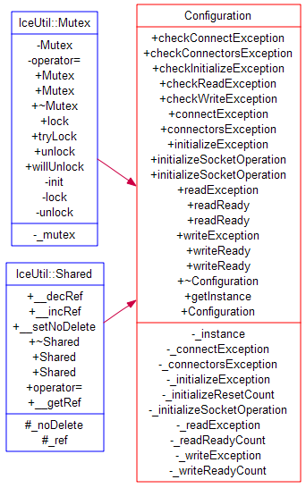

### concurrency stragety

   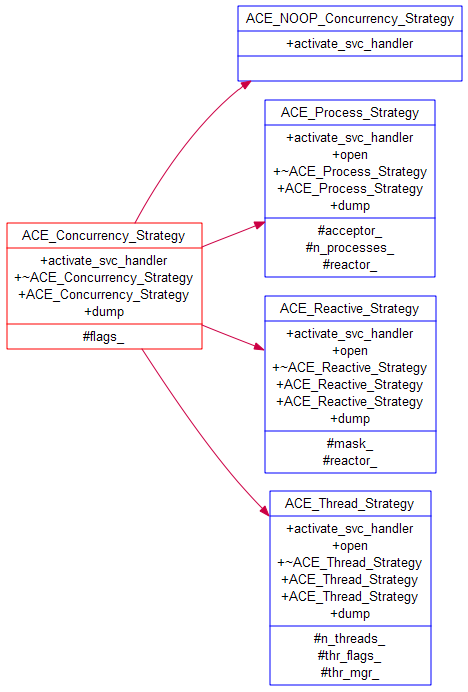

### acceptor

   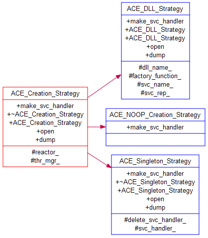
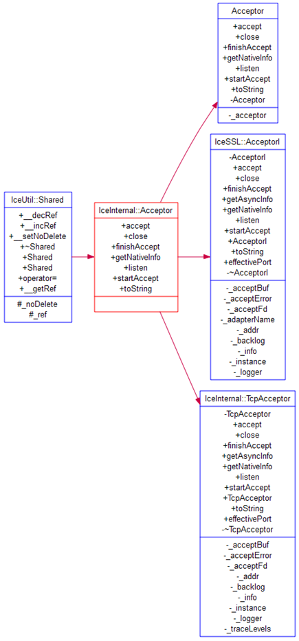

<br>

# 3   服务器网络通讯

## 3.1  任务管理(线程池)

### 3.1.1  实现1

   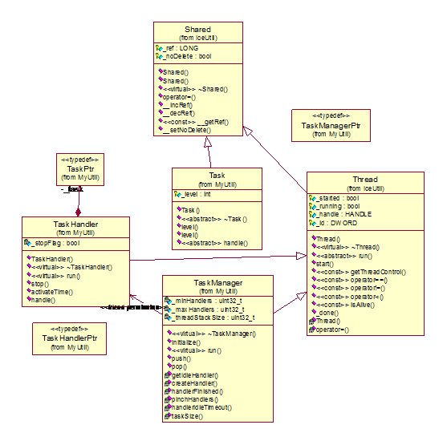
图 2 线程池实现类图1

**接口说明**：
Task提供了抽象任务处理接口handle( ),  不同的任务重载此方法； 使用TaskPtr作为任务的标记。
Thread提供了线程启动后的运行抽象接口run( ), 不同功能的线程重载此方法。如任务处理线程TaskHandler, 任务管理器线程TaskManger.

**设计原理**
任务的分发：接收数据包后封装为任务，放入到任务队列map<int, list<TaskPtr>>, 调用TaskManger.push(task);
线程池的管理：TaskHandler是资源，state{idle，busy}. 在TaskManager初始化时创建minHandlers个的资源于空闲队列 list<TaskHandlerPtr>_idleHandlers; 在TaskManager.run( )时取出任务::pop( )，启动TaskHandler.run( )；任务执行完回归池内TaskManager::instance().handlerFinished(this)。 资源使用getIdleHandler：资源回归：handlerFinished。 资源的状态变更是在改变两个队列成员中完成。
任务的执行：得到执行线程TaskHandler后，由线程调动具体任务执行。getIdleHandler()->handle(task);  _task->handle( ).
 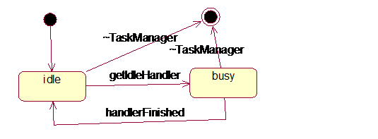

图 任务处理者TaskHandler 状态机

### 3.1.2  实现2

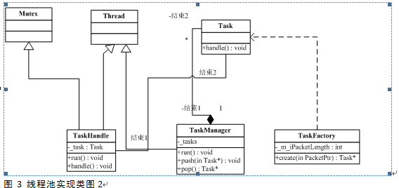

线程池说明：TaskHandle是可重复使用的工作线程，调用Task.run()来工作。Task是真正的任务，可由TaskFactory.create()来创建。TaskManager管理所有的Task。
模式说明：ThreadPool并未出现在GOF 23个模式中，但出现在《面向模式的体系结构》。实际上也可将ThreadPool看作是GOF中若干个模式的组合。

## 3.2  任务的创建(请求对象化command)

```c++
    while (true) {
       PacketPtr packet = PacketedChannelQueue::instance().getPacket();
       TaskPtr task = CommandFactory::instance().create(packet);
       if(task != 0) {
        TaskManager::instance().push(task);
       }
    }
```

说明：从PcketedChannelQueue获取到一个数据包，由CommandFactory将其封装成一个任务对象， 交此任务由TaskManager来管理分配。

CommandFactory::create( )过程如果是open, close类型的数据包，不作任何处理。（仅为调试，记录创建，关闭连接总数，可删）
如果是数据包，则根据数据包前面类型生成不同的请求包。
注意：中间层与index_serv, summary_serv, 搜索前端的连接是临时生成。
客户端发送connect, close时产生相应的操作。应该与后台服务器之间建立TCP常连接。

## 3.3  业务层具体任务

   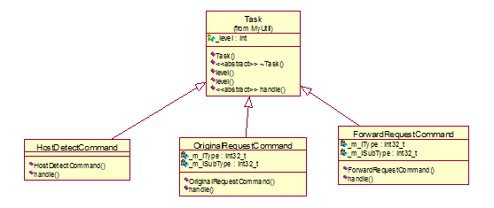
说明： 这是中间层的具体任务。有三个： 一是主机检测，用来查找主机，实现主机的配置访问； 二是可以处理的任务；三是中转请求任务。

1) HostDetectCommand流程：与index_servs建立连接，与summary_servs建立连接。服务器配置信息保存在list<Host_t  *>HostList_t, 共两个队列，分别是_m_summaryHostList和_m_indexerHostList.
2) FowardRequestCommand流程：查找socket句柄所在的epollchannel, 将此句柄从epollchannel移除，将此句柄的数据进行打包后放到消息队列PacketedChannelQueue。
   数据存储：通道队列list<EpollChannelPtr> ChannelQueue; EpollerChannel
   ChannelQueue存储EpollerChannelPtr，分为三种类型：开，数据，关闭。
   EpollerChannel存储句柄int, epoll_event.
   ChannelQueue  _channelsOpen, _channelsPacket, _channelsClose;

3) OriginalRequestCommand流程：

## 3.4  网络数据通信基础

### 1)  Socket 句柄

   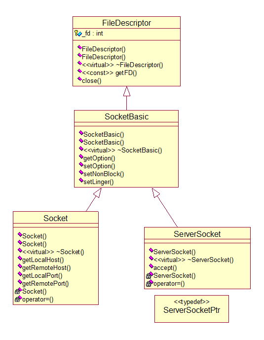
**说明**：socket也是一个文件句柄，因此受到一个线程/进程所能打开的句柄数[FD_SIZE]限制。查看进程打开文件句柄数限制方法：
方法1：当前用户进程限制，ulimit可修改，但受限于系统的极值
`$ ulimit –n`

方法2：系统总限制 {已分配，已使用，max}

```sh
sh-3.2$ cat /proc/sys/fs/file-nr
640  0  781672
```

方法3：配置软硬设置 （不好用）
`sh-3.2$ cat /etc/security/limits.conf`

方法4：查看内核源码文件v2.6.30

```sh
[NR_OPEN]
[include/linux/fs.h, line 23 ](http://lxr.linux.no/linux+*/include/linux/fs.h#L23)
[include/linux/limits.h, line 4](http://lxr.linux.no/linux+*/include/linux/limits.h#L4)
```

方法5：lsof命令查看

```sh
$ lsof |wc –*  //查看总数量
$ lsof -n|awk ‘{print $2}’|sort|uniq -c |sort -nr|more    //按数值从高到低打印{num, pid}
```

### 2)  网络主机信息host

a) 网络字节顺序
定义：网络字节顺序是大端BigEndian. 重要字节先存储。数值高位存在低地址。
BSD socket规定字节流传输采用网络字节顺序，因此数据从本地send前要inet_aton, recv后要inet_ntoa，这样才能正确处理数据。

```c
//return: 1-litterEndian, 0-bigEndian
int isLitterdian()
{
  int x = 1;
  return *((char *)&x);
}
```

b)网络地址address

## 3.5  网络IO异步处理

网络IO处理有多种方式：
一是多线程；二是多进程；三是事件通知，多路复用机制，包括poll,select,epoll，windows的OverlappedIO，开源的AIO, kqueue等。

| 网络IO         | 实现方式                                         | 优点   | 缺点               |     |
| ------------ | -------------------------------------------- | ---- | ---------------- | --- |
| 多线程          | 每一个请求到来，产生一个线程进行处理                           | 实现简易 | 线程数量会影响并发量       |     |
| 多进程          | 每一个请求到来，fork一个进程进行处理                         | 同上   | 进程数量会影响性能        |     |
| Poll         |                                              |      |                  |     |
| Select       | Fd_set集合（数组）   select后，判断socket是否有事件FD_ISSET |      | 遍历所有socket，性能不高。 |     |
| Epoll        | Epoll_event，epoll_wait可以得到事件相关的返回。           |      |                  |     |
| dell/poll    | solaris平台                                    |      |                  |     |
| AIO          |                                              |      |                  |     |
| kqueue       | BSD平台为主                                      |      |                  |     |
| overlappedIO | windows平台的complete   port                    |      |                  |     |

Note: 下面的socket同socketfd，是socket descriptor的简写。

### 1)   IO机制—epoll

Epollor: 管理epoll events.
EpollChannel: 一个socket对应一个channel, 提供一个抽象接口handleEvents( )来处理由事件引发的IO操作。
数据存储：

* map<int, EpollChannelPtr> ChannelMap , _channelsAll为所有的通道图,key为socketfd。
* list<EpollChannelPtr> ChannelList, _channelsDiscarded为遗弃的通道队列。

Epollor主流程：Epollor是侦听线程，公共继承singleton, thread, start( )启动epoll_create,  紧接着线程启动后run中，不断进行epoll_wait循环处理。
EpollChannel初始流程： EpollChannel是socket相关的通道，用channelsAll来保存。setEvent设置关心的事件类型（源码中是EPOLLIN|EPOLLERR|EPOLLHUP, 没有**EPOLLOUT**）;注册到通道Epollor:: *registerChannel*, 是将此socket加入到map channelsAll，并epoll_ctl此socket；然后PacketedChannelQueue::hookopen，此时是将通道push到open消息队列。.
EpollChannel有两种通道类型，一是ListenedEpollChannel监听socket, 进程启动时创建; 另一种是BufferedEpollChannel 连接socket。

**事件激发流程**：具体的事件处理handleEvents( )由子类重载方法实现。
a)  ListenedEpollChannel在EPOLLIN时产生accept连接，将连接得到的socket产生一个BufferedEpollChannel，然后将此新socket注册，同EpollChannel的初始流程。在EPOLLERR｜EPOLLHUP时deregisterChannel.
b)  BufferedEpollChanne 如果是EPOLLIN时，产生read(2)操作，将数据push到packet队列。如果是EPOLLOUT时，产生write(2)操作，setupChannel修改此通道。在EPOLLERR｜EPOLLHUP时deregisterChannel.

**EpollChannel的管理**：registerChannel 为有新socket时注册到容器中，新增触发事件，加入到Epoll管理;  deregisterChannel时数据处理完毕，将 此socket移入到回收容器处理，退出Epoll管理。（这两种情况会产生相应的open/close消息到消息队列，但将此消息取出包装为task时，并不包装，只是将对应的计数加一,此计数暂无实际意义，仅表示曾经创建了socket个数和已经关闭了的socket 个数）。setupChannel只是寻找socket后，修改触发event.  Epollor.run()循环中将会清空回收队列releaseDiscards。并会处理很久未通信的socket, checkTimeout().

 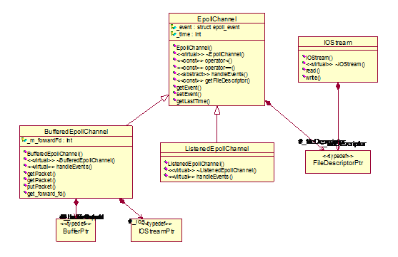

### 2)   Buffer, packet

PacketedChannelQueue 是存储通道的数据包，数据包存储为list<EpollorChannelPtr>ChannelQueue, 有三个数据包队列，分别是open, packet, close.
open队列在ListenedEpollChannel::handleEvent( )时注册通道，放数据。packet队列在BufferEpollChannel::handleEvent()在read(2)，放数据。

主线程：不断从三个消息队列中取数据。getPacket().  数据队列中要调用_channelsPacket::getPacket( )来得到数据包，其它两个队列数据内容只有一个类型字段，自己生成packet.
   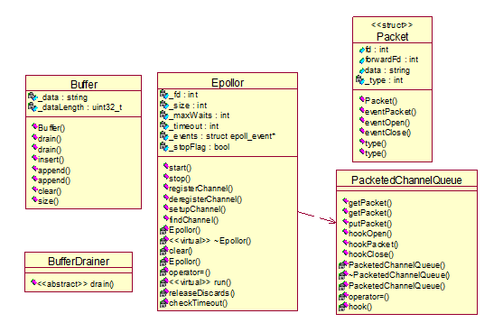

## 3.6  主函数

序列图如下：
   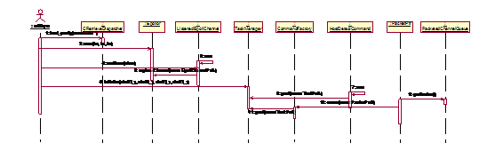

## 3.7  QUIC

QUIC（Quick UDP Internet Connection）是谷歌制定的一种互联网传输层协议，它基于UDP传输层协议，同时兼具TCP、TLS、HTTP/2等协议的可靠性与安全性，可以有效减少连接与传输延迟，更好地应对当前传输层与应用层的挑战。

**RTP和RTO**

* RTT(Round Trip Time)：一个连接的往返时间，即数据发送时刻到接收到确认的时刻的差值；

* RTO(Retransmission Time Out)：重传超时时间，即从数据发送时刻算起，超过这个时间便执行重传。
  RTT和RTO 的关系是：由于网络波动的不确定性，每个RTT都是动态变化的，所以RTO也应随着RTT动态变化。
  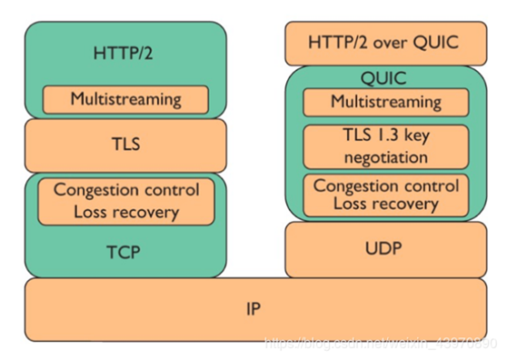
  
  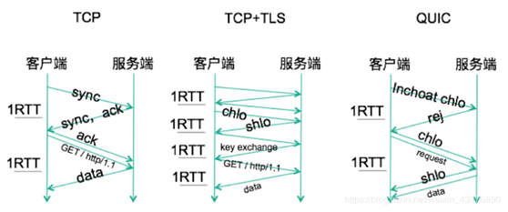
  图 4 QUIC--TCP-TLS握手比对
  说明：基于TCP的HTTPS一次建连至少需要2~3个RTT，而QUIC基于UDP，完整握手只需要1RTT乃至0RTT，可以显著降低延迟。

QUIC优点

* 快速建立连接，低延迟
* 安全可靠：兼且TCP、TLS、HTTPS/2等协议安全可靠的特点
* 改造灵活，不需要操作系统和内核支持
* 改进的多路复用，彻底无队头阻塞
* 改进的拥塞控制

## 3.8  服务器开发关注点

1） 进程/线程/数据结构

| 线程/进程/DS    | 说明                     | 本代码实例                                  |
| ----------- | ---------------------- | -------------------------------------- |
| 监听线程listen  | 接收accept请求的线程          | ListenEpollChannel::handleEvent()      |
| IO管理线程      | 由IO模型决定，如select, epoll | Epollor::start()                       |
| 数据接收线程      | 同上                     | BufferEpollChannel::handleEvent()      |
| 数据发送线程      | 同上                     | BufferEpollChannel::handleEvent()      |
| 业务处理线程      | 具体的业务处理,可以是一组          | TaskHandler::run()里调用   Task::handle() |
| 模块管理线程      | 如内存管理线程，任务管理线程         | TaskManager::start()                   |
|             |                        |                                        |
| 消息队列list    | 用来存储数据包,可多种类型          | list<EpollorChannelPtr>ChannelQueue    |
| socket list | 用来回收socket             | list<EpollChannelPtr>ChannelList       |
| socket map  | 用来管理所有socket           | map<int, EpollChannelPtr>   ChannelMap |
| 任务队列        | 用来管理所有任务，带优先级          | map<int, list<TaskPtr>>                |
| 业务线程队列      | Type: idel, busy       | list<TaskHandlerPtr>                   |

2）细节

| IO策略         | state                                   | 本代码实例                                                     |
| ------------ | --------------------------------------- | --------------------------------------------------------- |
| socket分类     | 是监听socket还是数据socket                     | ServerSocket   Socket                                     |
| socket   属性  | 是否阻塞block; 是否延迟关闭linger，是否地址重用，是否保持连接等… | setNonBlock()   setLinger()   SO_REUSEADDR   SO_KEEPALIVE |
| accept   属性  | 是否不间断连接                                 | {EINTR, EAGAIN, EWOULDBLOCK}continue                      |
| connect   属性 | 缺省超时60s,是否可不间断连接                        |                                                           |
| read策略       | 全部还是部分read                              | 全部 whie(<byte)read;                                       |
| write策略      | 全部还是部分write                             | 全部                                                        |
|              |                                         |                                                           |

BSD socket的数据发送接收影响因素

[服务器之间的通信]

* 是否保持常连接状态？服务器少，通信多，需要保持keep alive(2h)。
* 定时侦听连接状态？远程主机不能保证总是在可用中。host_state{connect, close, available, add}, 只有available时才是可用的。

[与客户端的通信]

3）优化点

| 优化点           | 原因                | 策略      |     |
| ------------- | ----------------- | ------- | --- |
| socket是否重用    | 减少socket,close的开销 | socket池 |     |
| 数据接收发送的内存是否重用 | 节约内存分配删除开销        | memory池 |     |

## 3.9  服务器开发设计小结

1. 设计之前
   1）  考虑有连接TCP还是无连接UDP的服务。
   2）  考虑服务器是有状态还是无状态。
   3）  并发等级：在某个给定时刻一个服务器正在运行的执行线程数。（每秒处理请求数，服务器cpu利用率）

2. 服务器设计
   **场景**
   1）多协议服务器（TCP, UDP）
   2）多服务服务器:  典型实例如inetd
   3）服务器的可配置性：静态和动态

**服务器的实现清单**

| type      | desc (serv + protocol)     |     |
| --------- | -------------------------- | --- |
| 循环式loop   | （不常见）   单服务，多协议   多服务，多协议  |     |
| 单执行线程并发式  |                            |     |
| 多进程或线程并发式 | 典型的多服务，单协议                 |     |
| 独立执行程序并发式 | 超级服务器   多服务+多协议+配置文件如inetd |     |

**常用设计技巧**
1）  SOCKET：有连接的服务器TCP， socket要高效利用，要处理客户异常退出而不发送关闭的情形（TCP连接是双工平等的，如一端不关闭，就会一直保存着，若有KEEP_ALIVE，则2H后才会检测连接状态）。方法1：定时检测 socket，若规定时间内未通信，则关闭此连接。方法2：设置SO_LINGER，l_onoff=1,则主动关闭时能释放socket缓冲区数据，避免TIME_WAIT的过程，加快释放socket。可能的问题是发送的数据可能丢包。
2）  并发服务：请求要在一定的时间内给以响应。因此可给请求进行分级，对高优先级请求优先处理；对长久未处理的请求可放弃，进行超时处理。
3）  高效IO：要求sock是非阻塞的，可及时响应。

### 3.9.1  用于优化Web服务器的技术总结

这一部分总结决定Web服务器性能的最为重要的因素[5]。这些观察报告基于我们对现有服务器设计和实现策略、以及我们调谐JAWS的经验的研究。这些研究揭示了开发高性能Web服务器的主要优化目标。

表格 4 用于优化WEB服务器的技术总结表

| 优化项         | 可能的问题                                                                                                        | 优化策略                                         |
| ----------- | ------------------------------------------------------------------------------------------------------------ | -------------------------------------------- |
| 轻量级并发       | 基于进程的并发机制可能会产生糟糕的性能。                                                                                         | 一CPU一服务器进程。   进程预创建。   轻量级并发机制。   线程池。       |
| 专用OS特性      | OS供应商常常会提供能给出更好性能的专用编程接口。                                                                                    |                                              |
| 请求生存期系统调用开销 | 请求生存期被定义为服务器在它从客户接收HTTP请求之后、以及在它发送出所请求文件之前，所必须执行的一系列指令。执行请求生存期所用的时间直接影响客户观察到的响应时间。                           | 减少同步。   缓存文件。   使用“集中写”。   预先计算的HTTP响应       |
| 日志开销        | 大多数Web服务器允许管理员对他们所服务的不同页面的点击数进行日志记录。日志常常用于评估服务器在一天的不同时间里的负载情况。对HTTP请求进行日志记录会产生显著的开销：如文件系统、同步、反向主机查找和Ident查找。 |                                              |
| 传输层优化       | 应该配置下面的传输层选项，以提高Web服务器在高速网络上的性能                                                                              | 侦听backlog。   Socket发送缓冲区。   Nagle算法（RFC 896） |

轻量级并发：
如在[3]中所看到的，基于进程的并发机制可能会产生糟糕的性能。在多处理器系统中，基于进程的并发机制可以良好地执行，特别是在进程数目与处理器数目相等时。在这种情况下，每个处理器可以运行一个Web服务器进程，从而使上下文切换开销得以最小化。
通常，进程应被预先生成，以避免动态进程创建的开销。但是，更可取的方法是使用轻量级并发机制（例如，使用POSIX线程）来使上下文切换开销最小化。和进程一样，动态线程创建开销也可以通过在服务启动时将线程预先派生进线程池中来加以避免。

专用OS特性：
OS供应商常常会提供能给出更好性能的专用编程接口。例如，Windows NT 4.0提供TransmitFile函数，使用Windows NT虚拟内存缓存管理器来获取文件数据。TransmitFile允许在文件数据之前和之后分别增加数据。这特别适用于Web服务器，因为它们通常与所请求文件一起发送HTTP头数据。因此，所有给客户的数据可以在单个的系统调用中发送，从而使模式切换开销得以最小化。
通常，这些接口必须相对于标准API仔细进行基准测试，以了解特定接口给出更好性能的条件。如2.4所示，在使用TransmitFile的情况下，我们的实验数据表明，在Windows NT上通过Socket传输大文件，异步形式的TransmitFile是最为高效的机制。

请求生存期系统调用开销：
在Web服务器中，请求生存期被定义为服务器在它从客户接收HTTP请求之后、以及在它发送出所请求文件之前，所必须执行的一系列指令。执行请求生存期所用的时间直接影响客户观察到的响应时间。因此，在此路径上使系统调用开销和其他处理最小化是很重要的。下面描述在Web服务器中可以减少这样的开销的各种地方。

* 减少同步：在处理并发时，常常需要通过同步来序列化对共享资源的访问（比如缓存式虚拟文件系统）。但是，使用同步会使性能恶化。因而，在请求生存期中使所获取（或释放）的锁的数目最小化是很重要的。在[3]中显示了每个请求所进行的平均锁操作数较低的服务器比进行大量锁操作的服务器执行得要好得多。
  在某些情况下，获取和释放锁还可能导致占先（preemption）。因而，如果线程读进HTTP请求，随后试图获取一个锁，它就有可能会被占先，并可能在它被再次分派之前等待相对较长的时间。这会增加Web客户所经受的响应延迟。

* 缓存文件：如果服务器不进行文件缓存，至少会带来两方面的开销。首先是来自open系统调用的开销。其次，反复使用read和write系统调用来访问文件系统会带来累积的开销，除非文件小到足以在单次调用中被获取或存储。使用在大多数形式的UNIX和Windows NT上可用的内存映射文件，可以有效地进行缓存。
  ​    使用“集中－写”（gather-write）：在UNIX系统中，writev系统调用允许在单个系统调用中将多个缓冲区写入设备。这对于Web服务器来说是有用的，因为除了所请求的文件，典型的服务器响应还含有许多行头信息。通过使用“集中－写”，不需要在发送前将这些头的行连接进单个缓冲区，从而避免了不必要的数据复制。

* 预先计算的HTTP响应：典型的HTTP请求使得服务器发回HTTP头，其中含有HTTP成功代码和所请求文件的MIME类型（例如，text/plain）。因为这样的响应是预期情况的一部分，它们可以被预先计算。当文件进入缓存时，响应的HTTP响应也可以和文件存储在一起。于是当HTTP请求到达时，头在缓存中已直接可用了。

* 日志开销：大多数Web服务器允许管理员对他们所服务的不同页面的点击数进行日志记录。日志常常用于评估服务器在一天的不同时间里的负载情况。它还常常因为商业原因而使用，例如，网站可能基于页面的点击率来确定广告的费率。但是，因为以下原因，对HTTP请求进行日志记录会产生显著的开销：
  ​    文件系统开销：繁忙的Web服务器执行相当多的I/O调用，从而压迫文件系统和底层硬件。将数据写到日志文件会增加这样的压力，从而导致更低的性能。将日志文件和HTTP文件放置在分开的文件系统上（且在分开的物理设备上，如果可能）可以限制这一开销。

* 同步开销：典型的Web服务器有多个活动线程或进程在对请求进行服务。如果这些线程/进程需要将请求记录到公用的共享日志文件，对该日志文件的访问就需要被同步，也就是，在任何时刻至多只有一个线程/进程可以对该共享日志文件进行写操作。这样的同步引入了额外的开销，从而有害于性能。通过使用多个独立的日志文件，可以减少这种开销。如果使用了内存缓冲区，它们就应该被存储在线程专有存储（thread-specific storage）中，以消除锁定竞争。

* 反向主机名查找：客户的IP地址对于Web服务器来说是在本地的。但是，在日志文件中主机名通常更为有用。因而，客户的IP地址需要被转换为相应的主机名。这通常是使用反向DNS查找来完成的。因为常常涉及网络I/O，这些查找非常昂贵。因此，它们应该被避免，或者异步地完成（使用线程或异步I/O）。

* Ident查找：Ident协议[35]允许Web服务器获取给定HTTP连接的用户名。这通常涉及设置新的到用户机器的TCP/IP连接，因而也涉及了“往返旅程”（round-trip）延迟。还有，ident查找必须在HTTP连接仍在活动时执行，因此不能够“懒洋洋”地执行。因而，为获得高性能，只要可能，都应该避免进行这样的查找。

* 传输层优化：应该配置下面的传输层选项，以提高Web服务器在高速网络上的性能：

* 侦听backlog：大多数TCP实现都在驻留内核的“侦听队列”上缓冲到来的HTTP连接，以使服务器能够使用accept使它们出队、进行服务。如果TCP队列超出了listen调用的“backlog”参数，新的连接就将被TCP拒绝。因而，如果预计到来的连接的流量将会很大的话，就应该通过设置更大的backlog参数（这有可能需要修改OS内核）来增大内核队列的容量。

* Socket发送缓冲区：每个Socket都有一个与之相关联的发送缓冲区，该缓冲区在数据正通过网络传输时持有这些由服务器发送的数据。为获得高性能，该缓冲区的大小应被设置为所允许的最大值（也就是，大缓冲区）。在Solaris，这个限制为64K。

* Nagle算法（RFC 896）：某些TCP/IP实现通过实现Nagle算法来避免拥塞（congestion）。这常常导致数据在实际通过网络发送之前、被网络层所迟滞。若干对响应时间有严格要求的应用（比如X-Windows）禁用了这一算法（例如，Solaris支持TCP_NO_DELAY Socket选项）。通过强制网络层尽可能快地发送数据，禁用这一算法可以改善响应时间。

## 3.10   本章参考

[1].  JAWS源码和文档 http://www.cs.wustl.edu/~schmidt/ACE.html
[2].  TCP的超时重传之深入了解RTT与RTO https://blog.csdn.net/whgtheone/article/details/80970292

<br>

# 4 后台开发常用中间件

## 4.1  IO strategy

   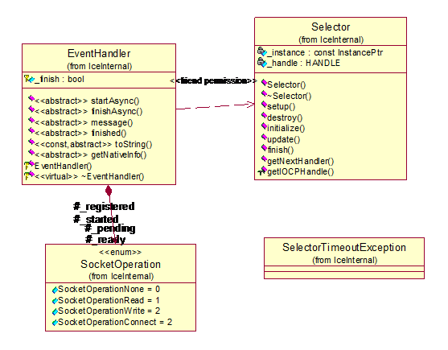

```c++
#ifdef ICE_USE_IOCP
class Selector
{
public:
    Selector(const InstancePtr&);
    ~Selector();
    void setup(int);
    void destroy();
    void initialize(EventHandler*);
    void update(EventHandler*, SocketOperation, SocketOperation);
void finish(EventHandler*);
    EventHandler* getNextHandler(SocketOperation&, int);
    HANDLE getIOCPHandle() { return _handle; }
private:
    const InstancePtr _instance;
    HANDLE _handle;
};
#elif defined(ICE_USE_KQUEUE) || defined(ICE_USE_EPOLL)
#if defined(ICE_USE_EPOLL)
    std::vector<struct epoll_event> _events;
#else
    std::vector<struct kevent> _events;
    std::vector<struct kevent> _changes;
    bool _selecting;
#endif
#elif defined(ICE_USE_SELECT) || defined(ICE_USE_POLL)
    std::vector<std::pair<EventHandler*, SocketOperation> > _changes;
    std::map<SOCKET, EventHandler*> _handlers;
};
#endif
```

## 4.2  xml解析

常用的xml解析方式有两种，一是DOM，文档对象模型，需要读入全部XML，建立XML的整体结构，响应较慢；二是SAX （simple api for *xml*）， 不需全部读入XML，而且边载入边解析。 在JAVA环境还有Jdom（java document object）集中了二者的优点。

以tinyxml作为示例。

## 4.3  mysql连接

对象：数据库连接

## 4.4  内存分配

对象： 内存
质量属性要求： 满足宝贵的内存资源能拴循环使用。
可用模式：Pooling

## 4.5  线程同步机制

对象：thread, 线程同步机制
质量属性要求： wrapper façade用来封装可移植，健壮，内聚的类接口。此处指平台依赖相关的。
可用模式：LF

线程池的设计：1）考虑设计模式LF或half-syn/half-asyn;  2）考虑线池池的可配置性，如最小空闲线程数，最大空闲线程数。3）线程池配合任务管理。任务不保证百分百执行，对任务加入优先级和超时检测机制。参数指标：Qos
   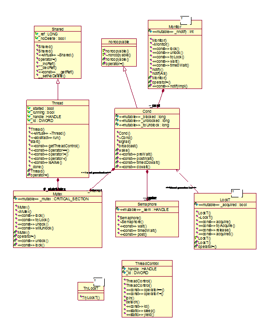
类图说明：

1) 成员函数用const修饰，为了修改类里的某个数据成员，使用了mutable来修饰数据成员, 这个功能看起来有些搞笑，因为就一个数据成员。
2) 定界加锁惯用法: IceUtil::Mutex::Lock lock(_stateMutex); 在对象创建时调用传入的参数进行锁创建，对象析构时锁释放。类同win32多线程编程的CLock和可供继承CLockObject.
3) 策略化加锁：配合定界加锁，给锁使用参数化，使用模板或者*多态*，多态通过具体锁的继承来实现。

## 4.6  日志

质量属性要求：日志按类别记录。支持多线程。

**1）日志级别的使用**
级别从低到高分别是：off, TRACE, DEBUG, INFO, WARN, ERROR, FATAL, ALL
DEBUG： 通常用于调试输出，常用屏幕打印输出，发布时通常不输出。
INFO：通常为产品发布时给用户提供的服务基本反馈信息，可以同时提供文件和屏幕输出。
WARN,ERROR,FATAL：则是可能引发错误的信息，要慎重对待的日志。
在开发时可暂不使用日志，只用标准C/C++的输出函数如printf, cout等，用于屏幕输出，程序后台运行时，这些输出将被忽略。

示例：一个典型的log4plus日志配置文件 --log4cplus.properties
// 下列配置Appenders是ConsoleAppender, layout是PatternLayout; Filters是LogLevelMatchFilter，只写DEBUG级别的日志; console输出时打印DEBUG~~ERROR级别的日志信息。

```ini
# log4plus usage:
# LogLevels:   off, TRACE, DEBUG, INFO, WARN, ERROR, FATAL, ALL
# Appenders: ConsoleAppender, FileAppender, SyslogAppender, RollingFileAppender
#   DailyRollingFileAppender, NTEventLogAppender, SocketAppender, Win32DebugAppender
# Layout: BasicLayout, TTCCLayout, PatternLayout
# Filters: DenyAllFilter, LogLevelMatchFilter, LogLevelRangeFilter, StringMatchFilter

# Define the root logger
log4cplus.rootLogger= TRACE, console
# Define a file appender named "debugDaily", in log/debug
log4cplus.appender.debugDaily=log4cplus::DailyRollingFileAppender
log4cplus.appender.debugDaily.Schedule=DAILY
log4cplus.appender.debugDaily.DatePattern = yyyy-MM-dd
log4cplus.appender.debugDaily.File=log/debug
log4cplus.appender.debugDaily.MaxFileSize=1000MB
log4cplus.appender.debugDaily.MaxBackupIndex=10
log4cplus.appender.debugDaily.filters.1=log4cplus::spi::LogLevelMatchFilter
log4cplus.appender.debugDaily.filters.1.LogLevelToMatch=DEBUG
log4cplus.appender.debugDaily.filters.1.AcceptOnMatch=true
log4cplus.appender.debugDaily.filters.2=log4cplus::spi::DenyAllFilter
log4cplus.appender.debugDaily.layout=log4cplus::PatternLayout
log4cplus.appender.debugDaily.layout.ConversionPattern=%D{%Y:%m:%d %H:%M:%S}|%m%n
# Define a file appender named "console", print out the log between INFO and ERROR
log4cplus.appender.console=log4cplus::ConsoleAppender
log4cplus.appender.console.layout=log4cplus::PatternLayout
log4cplus.appender.console.layout.ConversionPattern=%D{%Y:%m:%d %H:%M:%S}|%m%n
log4cplus.appender.console.filters.1=log4cplus::spi::LogLevelRangeFilter
log4cplus.appender.console.filters.1.LogLevelMin=INFO
log4cplus.appender.console.filters.1.LogLevelMax=ERROR
log4cplus.appender.console.filters.1.AcceptOnMatch=true
log4cplus.appender.console.filters.2=log4cplus::spi::DenyAllFilter
## Define a file appender named "info", in log/info
log4cplus.appender.info=log4cplus::DailyRollingFileAppender
log4cplus.appender.info.Schedule=DAILY
log4cplus.appender.info.DatePattern = yyyy-MM-dd
log4cplus.appender.info.File=log/info
log4cplus.appender.info.MaxFileSize=1000MB
log4cplus.appender.info.MaxBackupIndex=10
log4cplus.appender.info.filters.1=log4cplus::spi::LogLevelMatchFilter
log4cplus.appender.info.filters.1.LogLevelToMatch=INFO
log4cplus.appender.info.filters.1.AcceptOnMatch=true
log4cplus.appender.info.filters.2=log4cplus::spi::DenyAllFilter
log4cplus.appender.info.layout=log4cplus::PatternLayout
log4cplus.appender.info.layout.ConversionPattern=%D{%Y:%m:%d %H:%M:%S}|%m%n
log4cplus.appender.info.layout.ConversionPattern=%-5p-[%t][%D{%H:%M:%S %Q}]%m
```

## 4.7  协议解析ghttp

# 5  设计方法总结

**设计准则**：

1) 业务层与网络层分离
   业务逻辑决策数据结构，数据结构决定线程模型（？）。
2) 网络层设计
    a) 连接方式：传输层使用TCP还是UDP。
    b) 多路复用：poll/select/epoll/kqueue/complete port/AIO
    c) 协议处理：协议与消息传递，网络层无关，主要有packet, unPacket操作，可以是业务线程来解包。协议由IO和并发策略参数化。
    d) Io策略： 同步，异步
    e) 并发策略：threadPerQuest, threadPerSession, threadPool, processPool

**质量属性：性能**
a) 高性能函数：如多路复用中epoll比select高效。
b) 多线程支持：可以用线程池，将管理线程与业务线程分离。
c) 读写锁代替普通锁：扫描容器时，更多是读操作时，此时适宜使用读写锁—读者优先。
d) 使用高效IO：IO常是瓶颈，因此epoll中可选择使用ET。
e) 减少系统调用：系统调用要进入内核，尽量减少。
f) 协议二进制包结构接收，字符串包延迟接收（写时复制）。

质量属性：可用性，可维护性，可读性（设计模式的使用）

* MemoryPool内存池的设计: 提高内存资源的使用率
* MessageQueue消息队列：用来作同步层，延迟处理数据。
* Epoll + 线程池：将业务处理线程与IO线程分离，此外包括管理线程。
* TaskFactory任务工厂：将业务逻辑封装成任务，便以分发。
* 架构相关的封装：如线程及线程同步类。
* 常用封装façade: 如日志，XML，DataBase，配置文件读取。

# 参考文献

[1].  服务器开发模式POSA  http://www.cs.wustl.edu/~schmidt/POSA/
[2].  ACE  http://www.cs.wustl.edu/~schmidt/ACE.html
[3].  http://docs.huihoo.com/ace_tao/
[4].  http://docs.huihoo.com/ace_tao/ACE-2002-12/Part-Three/Chapter-2.htm
[5].  JAWS  http://www.dre.vanderbilt.edu/JAWS/
[6].  http://www.zeroc.com/

<br>

# 附录
