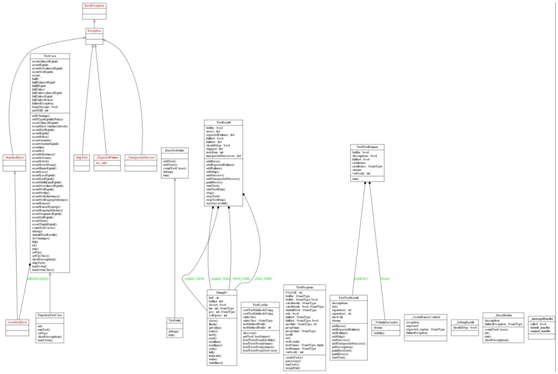
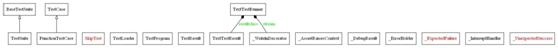

| 序号 | 修改时间  | 修改内容  | 修改人 | 审稿人 |
| ---- | --------- | ----------------------------------------------- | ------ | ------ |
| 1    | 2017-1-13 | 创建测试相关框架。  | 吴启福 | 吴启福 |
| 2    | 2019-3-2  | 增加TDD/BDD框架    | 同上   |   |
| 3    | 2019-8-21 | 将其它文章的WEB测试工具、UI/API工具迁移到本文。 | 同上   |   |
|  |  |    |   |   |
---

 

 

 

# 目录

[目录... 1](#_Toc17297257)

[1  测试框架概述... 2](#_Toc17297258)

[2  单元测试... 3](#_Toc17297259)

[2.1   cppunit 3](#_Toc17297260)

[2.2   pyunit: unittest 3](#_Toc17297261)

[3  API测试... 6](#_Toc17297262)

[3.1   postman. 6](#_Toc17297263)

[3.2   本章参考... 6](#_Toc17297264)

[4  UI测试... 6](#_Toc17297265)

[4.1   selenium.. 6](#_Toc17297266)

[4.2   本章参考... 7](#_Toc17297267)

[5  TDD.. 7](#_Toc17297268)

[6  BDD.. 7](#_Toc17297269)

[6.1   Specipy. 8](#_Toc17297270)

[6.2   本章参考... 8](#_Toc17297271)

[7  A/B测试框架... 8](#_Toc17297272)

[8   WEB测试... 9](#_Toc17297275)

[参考资料... 10](#_Toc17297279)

 


---


# 1  测试框架概述

表格 1 测试框架列表

| softwareName | Desc   | currnet   version | Copyright(c)  | License | Note    |
| ------------ | ------------------------------------------------------------ | ----------------- | ------------- | ------- | ------------------------------------ |
| googletest   | Google's framework for writing C++ tests on a variety of platforms | 1.5.0   | 2008   google | BSD  | http://code.google.com/p/googletest/ |
| cppunit  |   |    |  |    |    |
| pyunit  |   |    |  |    |    |
|    |   |    |  |    |    |

 

# 2  单元测试

## 2.1  cppunit

​    

 

## 2.2  pyunit: unittest
```sh
NAME
    unittest
 
FILE
    c:\dev\python27_x86\lib\unittest\__init__.py
 
DESCRIPTION
    Python unit testing framework, based on Erich Gamma's JUnit and Kent Beck's
    Smalltalk testing framework.
    
    This module contains the core framework classes that form the basis of
    specific test cases and suites (TestCase, TestSuite etc.), and also a
    text-based utility class for running the tests and reporting the results
  (TextTestRunner).
 
PACKAGE CONTENTS
    __main__
    case
    loader
    main
    result
    runner
    signals
    suite
    test (package)
util
 
CLASSES
    __builtin__.object
   unittest.case.TestCase  #测试用例，定义方法中调用被调用类的方法
  unittest.case.FunctionTestCase
   unittest.loader.TestLoader  #测试加载器
   unittest.main.TestProgram  #测试主程序，构造函数中会调用runTest()
   unittest.result.TestResult  #测试结果
  unittest.runner.TextTestResult
   unittest.runner.TextTestRunner  
    exceptions.Exception(exceptions.BaseException)
   unittest.case.SkipTest
    unittest.suite.BaseTestSuite(__builtin__.object)  #测试组合
   unittest.suite.TestSuite
```

说明：TestProgram构造时，加载TestLoader，去分析TestCase和TestSuite（多个TestCase或TestCase中的方法的组合）。TestResult保存测试结果并最后统计输出。  


 

   

图 1 pyunit包括父类和关联的类图

 

   

图 2 pyunit

说明：TestCase

 

 

   

图 3 pyunit只含类名的类图（不含类的成员属性和方法）

 

 

# 3  API测试

## 3.1  postman

详见 [自动化测试工具](../toolbox.工具/自动化测试工具.md)

 

## 3.2  本章参考

# 4  UI测试

## 4.1  selenium  

selenium 是一个web的自动化测试工具。

*  免费
*  支持多语言：C、 java、ruby、python和C#
*  支持多平台：windows、linux、MAC ，支持多浏览器：ie、ff、safari、opera、chrome
*  支持分布式测试用例的执行，可以把测试用例分布到不同的测试机器的执行，相当于分发机的功能。


**Selenium** **套件**

*  Selenium是一套完整的Web应用程序测试系统，它包含了测试的录制（Selenium IDE）、编写及运行（Selenium Remote Control）和测试的并行处理（Selenium Grid）。Selenium的核心Selenium Core基于JsUnit，完全由JavaScript编写，因此可运行于任何支持JavaScript的浏览器上。 
*  Selenium Core：Selenium的核心部分,它由一些纯js代码组成， 可以运行在windows/linux的不同browser上，而IDE是在core的基础上的一种应用, 通过UI实现类似QTP/Winner的脚本录制回放功能，它是Selenium IDE 和 Selenium RC 的引擎。 
*  Selenium IDE： FireFox 的一个插件，支持脚本录制。 
*  Selenium RC： Selenium Remote Control，是客户端利用各种编程语言，通过网络向Selenium Server发送指令，Selenium Server接收到测试指令后，启动浏览器并向其发出JavaScript调用实现对Html页面的全面追踪,并通过网络把执行结果返回给调用者。 
*  Selenium WD： Selenium WebDriver。Web驱动。 
*  Selenium Grid：允许同时并行地、在不同的环境上运行多个测试任务，极大地加快 Web 应用的功能测试。


示例1：Chromei引擎

```python
from selenium import webdriver
driver = webdriver.Chrome()
driver.get('http://radar.kuaibo.com')
print driver.title
driver.quit()
```

 

## 4.2  本章参考

 

# 5  TDD

TDD，驱动测试开发。测试先于代码开发。

# 6  BDD

BDD，形为驱动开发。鼓励开发者、QA和非技术业务互动。

 

**常见的BDD框架：**

- C – Cspec
- C++ –  CppSpec, Spec-CPP
- .Net –  NBehave, NSpecify, SpecFlow
- Groovy –  GSpec, easyb, Cuke4Duke
- PHP – PHPSpec
- Python –  Specipy
- Ruby – RSpec,  Shoulda, Cucumber

**与Java相关的BDD测试工具：**

- JBehave –  Java annotations based, Test frameworks agnostic
- Cuke4duke –  Cucumber support for JVM
- JDave – RSpec  (Ruby) inspired, Mojo 2 & Hamcrest based
- beanSpec –  Java based
- easyb – Java  based, Specifications written in Groovy
- instinct –  BDD framework for Java, providing annotations for contexts. Inspired by  Rspec
- BDoc -  Extracts behaviour from unit tests

 

## 6.1  Specipy


## 6.2  本章参考

 

# 7  A/B测试框架

A/B测试是将流量分为两部分，20%导向待测试系统A，余下流量仍指向原系统B。

运行一段时间后，比较A是否有提高。

 


# 参考资料

[1].    6种Web框架测评 http://www.alrond.com/en/2007/jan/25/performance-test-of-6-leading-frameworks/ 

[2].    [kenjis / php-framework-benchmark ](https://github.com/kenjis/php-framework-benchmark) https://github.com/kenjis/php-framework-benchmark 

