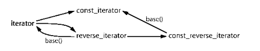

| 序号 | 修改时间  | 修改内容 | 修改人 | 审稿人 |
| ---- | --------- | -------- | ------ | ------ |
| 1    | 2006-2007 | 创建     | Keefe | Keefe |
<br>

---


 目录

[1 入门: STL速览... 1](#_Toc27944843)

[1.1 头文件和名字空间... 1](#_Toc27944844)

[2 六大组件... 2](#_Toc27944845)

[2.1 组件一：迭代器描述... 3](#_Toc27944846)

[2.1.1 迭代器的类型... 3](#_Toc27944847)

[2.1.2 指针迭代器... 4](#_Toc27944848)

[2.1.3 容器迭代器... 4](#_Toc27944849)

[2.1.4 常量迭代器... 4](#_Toc27944850)

[2.2 组件二：容器... 5](#_Toc27944851)

[2.2.1 容器类型... 5](#_Toc27944852)

[2.2.2 容器迭代器... 5](#_Toc27944853)

[2.3 组件三：函数对象(重点). 5](#_Toc27944854)

[2.3.1 发生器函数对象... 6](#_Toc27944855)

[2.3.2 绑定器函数对象... 7](#_Toc27944856)

[3 STL常用算法... 7](#_Toc27944857)


[TOC]


<br>

---

# 1 入门: STL速览

STL的一个重要特点是数据结构和算法的分离。尽管这是个简单的概念，但这种分离确实使得STL变得非常通用。例如，由于STL的sort()函数是完全通用的，你可以用它来操作几乎任何数据集合，包括链表，容器和数组。

## 1.1 头文件和名字空间

为了避免和其他头文件冲突， STL的头文件不再使用常规的.h扩展。

表 1. STL头文件和容器类

| #include | Container Class   |
| ------------ | --------------------- |
| <deque> | deque     |
| <list> | list |
| <map>  | map, multimap   |
| <queue> | queue, priority_queue |
| <set>  | set, multiset   |
| <stack> | stack     |
| <vector>     | vector, vector<bool>  |

 为了使用STL，可以将下面的指示符插入到你的源代码文件中，典型地是在所有的#include指示符的后面：using namespace std;


<br>

# 2 六大组件

1） 迭代器提供了访问容器中对象的方法。例如，可以使用一对迭代器指定list或vector中的一定范围的对象。迭代器就如同一个指针。事实上，C++的指针也是一种迭代器。但是，迭代器也可以是那些定义了operator*()以及其他类似于指针的操作符地方法的类对象。

2） 容器是一种数据结构，如list，vector，和deques ，以模板类的方法提供。为了访问容器中的数据，可以使用由容器类输出的迭代器。

3） 算法是用来操作容器中的数据的模板函数。例如，STL用sort()来对一个vector中的数据进行排序，用find()来搜索一个list中的对象。函数本身与他们操作的数据的结构和类型无关，因此他们可以在从简单数组到高度复杂容器的任何数据结构上使用。

**以下是六大组件列表说明：**

| 组件英文名 | 组件中文名 | 含义     | 备注      |
| --------------- | ---------- | -------------------------- | -------------------------------------------- |
| iterators | 迭代器     | 泛型指针  |     |
| containers | 容器 | 就是数据结构，用来存放元素 |     |
| algorithms | 算法 | 就是算法  |     |
| function object | 函数对象   | 一种行为类似函数的东西     |     |
| allocators | 配置器     | 用来分配内存空间     | 这一特性很多编译器不是很支持，建议使用默认值 |
| adapters  | 适配器     | 用来修饰其它组件     | 可参考设计模式中的adapter   |


## 2.1 组件一：迭代器描述

### 2.1.1    迭代器的类型

对于STL数据结构和算法，你可以使用五种迭代器。下面简要说明了这五种类型：

*  Input iterators 提供对数据的只读访问。
*  Output iterators 提供对数据的只写访问
*  Forward iterators 提供读写操作，并能向前推进迭代器。
*  Bidirectional iterators提供读写操作，并能向前和向后操作。
*  Random access iterators提供读写操作，并能在数据中随机移动。


尽管各种不同的STL实现细节方面有所不同，还是可以将上面的迭代器想象为一种类继承关系。从这个意义上说，下面的迭代器继承自上面的迭代器。由于这种继承关系，你可以将一个Forward迭代器作为一个output或input迭代器使用。

**下面是各种iterator类型之间的关系列图：**
```
input iterators  output iterators

 \   /
  forward iterators
     |
  bidirectional iterators
   |
  random access iterators
```

### 2.1.2    指针迭代器

正如下面的小程序显示的，一个指针也是一种迭代器。该程序同样显示了STL的一个主要特性——它不只是能够用于它自己的类类型，而且也能用于任何C或C++类型。

### 2.1.3    容器迭代器

尽管C++指针也是迭代器，但用的更多的是容器迭代器。容器迭代器用法和iterdemo.cpp一样，但和将迭代器申明为指针变量不同的是，你可以使用容器类方法来获取迭代器对象。两个典型的容器类方法是begin()和end()。它们在大多数容器中表示整个容器范围。其他一些容器还使用rbegin()和rend()方法提供反向迭代器，以按反向顺序指定对象范围。

### 2.1.4    常量迭代器

和指针一样，你可以给一个迭代器赋值。


## 2.2 组件二：容器

你可以生成STL容器，用来存放对象或者指向对象的指针。

```c
class TMyClass;
typedef list<TMyClass> TMyClassList;     // 用于存放对象的list容器
typedef list<TMyClass*> TMyClassPtrList; // 用于存放对象指针的list容器
```


如果容器是保存的对象，则在容器析构的时候会自动清理这些对象。但，如果它保存的是对象的指针，删除指针就应该是程序员的责任了。

 


### 2.2.1  容器类型

 包括序列容器与关联容器。

### 2.2.2   容器迭代器

 STL中的所有标准容器类都提供四种不同的迭代器类型：iterator、const_iterator、reverse_iterator和const_reverse_iterator。

下图清晰的表明了不同类型的迭代器之间的转换关系：


## 2.3 组件三：函数对象(重点)

STL算法通过重载operator()函数实现为模板类或模板函数。这些类用于创建函数对象，对容器中的数据进行各种各样的操作。下面解释如何使用函数和函数对象。

所谓**断言函数**，就是返回bool值的函数, 就是它从另一个函数对象创建而来，如果原先的函数返回真，则否定函数对象返回假。有两个否定函数对象：not1()和not2()。not1()接受单目函数对象，not2()接受双目函数对象。否定函数对象通常和帮定器一起使用。

除了给STL算法传递一个回调函数，你还可能需要传递一个类对象以便执行更复杂的操作。这样的一个对象就叫做函数对象。实际上函数对象就是一个类，但它和回调函数一样可以被回调。例如，在函数对象每次被for_each()或find_if()函数调用时可以保留统计信息。函数对象是通过重载operator()()实现的。如果TanyClass定义了opeator()(),那么就可以这么使用：

```c++
TAnyClass object;  // Construct object
object();    	// Calls TAnyClass::operator()() function
for_each(v.begin(), v.end(), object);
```


### 2.3.1    发生器函数对象

有一类有用的函数对象是“发生器”(generator)。这类函数有自己的内存，也就是说它能够从先前的调用中记住一个值。例如随机数发生器函数。

```c++
#include <iostream.h>
#include <stdlib.h>    // Need random(), srandom()
#include <time.h> // Need time()
#include <algorithm>   // Need random_shuffle()
#include <vector> // Need vector
#include <functional>  // Need ptr_fun()
#include <iterator>

using namespace std;

// Data to randomize
int iarray[10] = {1, 2, 3, 4, 5, 6, 7, 8, 9, 10};
vector<int> v(iarray, iarray + 10);

// Function prototypes
void Display(vector<int>& vr, const char *s);
unsigned int RandInt(const unsigned int n);

int main()
{
  srandom( time(NULL) );  // Seed random generator
  Display(v, "Before shuffle:");

  pointer_to_unary_function<unsigned int, unsigned int>
​    ptr_RandInt = ptr_fun(RandInt);  // Pointer to RandInt()//注意这行
  random_shuffle(v.begin(), v.end(), ptr_RandInt);

  Display(v, "After shuffle:");
  return 0;
}

// Display contents of vector vr
void Display(vector<int>& vr, const char *s)
{
  cout << endl << s << endl;
  copy(vr.begin(), vr.end(), ostream_iterator<int>(cout, " ")); //space
  cout << endl;
}

// Return next random value in sequence modulo n
unsigned int RandInt(const unsigned int n)
{
  return random() % n;
}
```


### 2.3.2    绑定器函数对象

一个绑定器使用另一个函数对象f()和参数值V创建一个函数对象。被绑定函数对象必须为双目函数，也就是说有两个参数,A和B。STL 中的帮定器有：

bind1st() 创建一个函数对象，该函数对象将值V作为第一个参数A。

bind2nd()创建一个函数对象，该函数对象将值V作为第二个参数B。


<br>

# 3  STL常用算法

STL的算法可以分为不改变容器值的算法，改变容器值的与及排序查找算法。

**其中不改变容器值的算法有：**

线性查找算法：find, find_if

匹配算法：search...

比较区域：equal, mismatch...

计算元素个数：count, count_if

max, min


**会改变容器值的算法有：**

拷贝：copy, copy_backward

1）  替换：replace

2）  移动：remove, remove_if

3）  产生数：generate

排序查找包括：sort...

