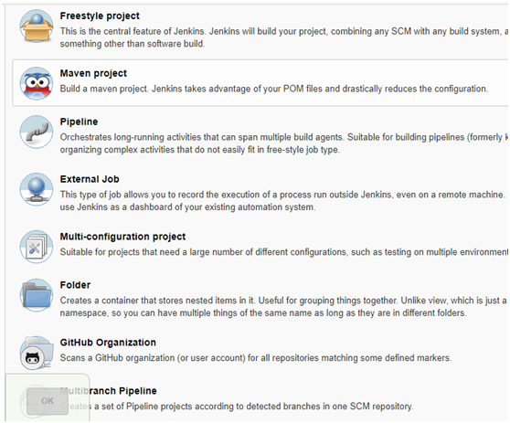
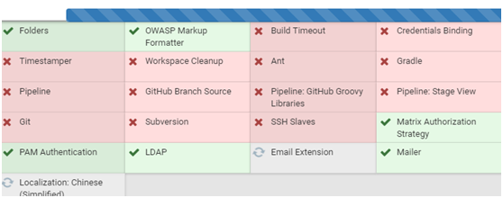

| 序号 | 修改时间  | 修改内容                                   | 修改人 | 审稿人 |      |
| ---- | --------- | ------------------------------------------ | ------ | ------ | ---- |
| 1    | 2019-12-12 | 创建。从《运维专题》抽取相关章节成文。 | Keefe |        |      |


---

[TOC]


---


## 简介

Jenkins官网 https://jenkins.io/


CI工具组合：代码质量检测sonar

Jenkins是一个开源软件项目，是基于Java开发的一种[持续集成](https://baike.baidu.com/item/持续集成)工具，用于监控持续重复的工作，旨在提供一个开放易用的软件平台，使软件的持续集成变成可能。可以用于自动化执行所有与编译、测试、提交、调度软件相关的任务。


Jenkins功能包括：

* 可以签出源码，执行测试（测试覆盖率），统计TODO任务，发送结果通知和编写文档等。
* 持续的软件版本发布/测试项目。
* 监控外部调用执行的工作。


## 安装篇

下载：https://jenkins.io/zh/download

 

表格 10 jenkins使用方式

| 环境           | 启动命令                             | 配置文件   | 备注                                               |
| -------------- | ------------------------------------ | ---------- | -------------------------------------------------- |
| war            | java -jar jenkins.war -httpPort=8080 | ~/.jenkins |                                                    |
|                | war文件放到tomcat app目录下          |            |                                                    |
| docker         | docker run                           |            | 详见《CNCF云原生框架分析》章节Docker-CICD之Jenkins |
|                | docker-compose up                    |            | 组合启动                                           |
| linux/  ubuntu | $ /etc/init.d/jenkins restart        |            |                                                    |
| windows        |                                      |            |                                                    |

说明：2018-3-29要求JDK 8以后版本。


1. linux下安装
```SH
$ wget -q -O - https://pkg.jenkins.io/debian/jenkins-ci.org.key | sudo apt-key add -
$ sudo sh -c 'echo deb http://pkg.jenkins.io/debian-stable binary/ > /etc/apt/sources.list.d/jenkins.list'
$ sudo apt-get update
$ sudo apt-get install jenkins
```

启动jenkins
`$ /etc/init.d/jenkins restart`

修改缺省端口8080
`$vim /etc/default/jenkins`

 

**启动**

首先保证系统中已经安装了jdk，最好是jdk1.5以上。

法一：JAR运行，切换到jenkins.jar存放的目录，输入如下命令：
`$ java -jar jenkins.war`

如果需要修改端口可以使用如下命令：
`$ java -jar jenkins.war--httpPort=8081`

然后在浏览器中（推荐用火狐）输入localhost:8080，localhost可以是本机的ip，也可以是计算机名。就可以打开jenkins。

 

法二：tomcat运行

解压tomcat到某个目录,如/usr/local，进入tomcat下的/bin目录，启动tomcat

将jenkins.war文件放入tomcat下的webapps目录下，启动tomcat时，会自动在webapps目录下建立jenkins目录，在地址栏上需要输入localhost:8080/jenkins。

 

## 作业篇

### 项目/作业类型 

               


表格 11 Jenkins项目（或作业）类型列表

| 项目类型     | 项目说明                         | 构建步骤                                                     | 注意事项             |
| ------------ | -------------------------------- | ------------------------------------------------------------ | -------------------- |
| freestyle    | 自由风格                         | l General: 常规配置如是否参数化项目 <br>l 源码管理：git/svn  <br>l Build Triggers：计划、轮询SCM、GITHUB勾子、远程触发、手工  <br>l 构建环境：如构建前删除workspace；  <br>l Build：shell/cmd/python/ant/grade/...  <br>l 构建后活动：发布测试文档如Javadoc/HtmlReport/JUnit；归档构建物；通知；构建其它项目 |                      |
| Maven        |                                  |                                                              |                      |
| Pipeline     | 流水线构建                       | General -> Build Triggers --> 高级项目配置项 --> Pipeline    |                      |
| External Job | 外部作业                         |                                                              | 留意外部非交互过程。 |
| 多配置作业   | 允许不同配置下运行相同构建作业。 |                                                              |                      |

备注：1. 作业整个流程大致相似，作业基本配置->触发点->构建前活动->构建->构建后活动。

2. 构建步骤如源码、构建都需要相应的插件支持。

#### pipeline

流水线

 

## 配置篇

###  插件管理

插件代理：https://mirrors.tuna.tsinghua.edu.cn/jenkins/updates/update-center.json

 

图 3 安装时缺省插件

 

表格 12 Jenkins插件简介

| 分组       | 插件介绍                                                     | 备注             |
| ---------- | ------------------------------------------------------------ | ---------------- |
| 自动化测试 | 压测：JMeter  代码覆盖率：Cobertura、Clover  代码质量：PMD/CPD、FindBugs、Checkstyle、CodeNarc、Sonar |                  |
| 通用类     | 一般：SSH/SSH  locale：可以根据浏览器来切换语言              |                  |
| 通知       | 邮件：Mailer/Email  短信、Jabber等通知                       |                  |
| 权限管理   | LDAP/PAM/                                                    | 各种权限管理机制 |
| build      | 构建工具：Ant/Gradle/Git/shell  报告：htmlreport             | 构建             |
| artifact   |                                                              | 二进制品         |
| 运维       | Disk Usage、Load Statics                                     | 二进制品         |
| python     |                                                              |                  |
| java       |                                                              |                  |
| c++        |                                                              |                  |
| android    |                                                              |                  |
| .net       |                                                              |                  |

 

###  安全

安全域：内置用户数据库、LDAP、UNIX用户和用户组、微软活动目录、其它系统...

授权：安全矩阵、基于项目、基于角色、审计


## 项目示例

**项目示例1：python-freestyle-xx**
1) The project is parameterized 参数化项目，设定String Parameter

2) Build Environment: 选择 Delete workspace before build starts

3) Add build step -> Excecute shell: 填充构建脚本

4) Post Actions -> Publish test result report: 

 

## FAQ

**jenkis调试**

* jenkis首次登陆密码文件：${ JENKINS_HOME}//users/admin/config.xml
* 以root身份登陆docker容器：docker exec -it -u root [docker_name] /bin/bash
* 报告命令： pytest --html=xx --junit-xml=xx

 

## 参考资料

[1]: Jenkis https://jenkins.io/

[2]: Jenkins 教程（安装和解锁） https://blog.csdn.net/jmh1996/article/details/79029696

[3]: 30分钟搞定 Jenkins CI https://www.jianshu.com/p/9806203950d7

