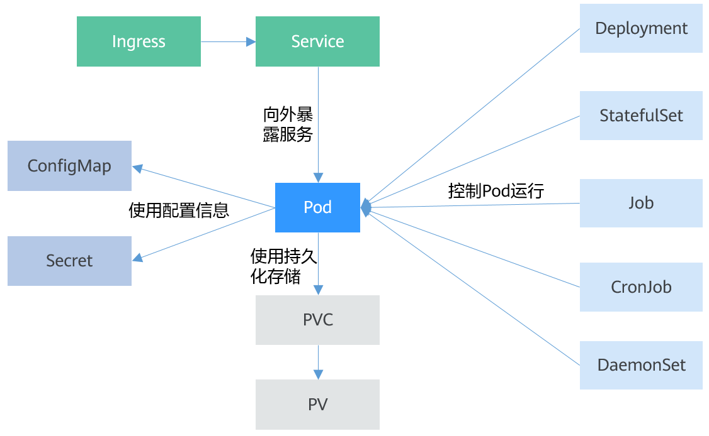

| 序号  | 修改时间      | 修改内容                | 修改人   | 审稿人 |
| --- | --------- | ------------------- | ----- | --- |
| 1   | 2020-4-17 | 创建。从《CNCF原生框架分析》拆分。 | Keefe |     |
|     |           |                     |       |     |

<br><br><br>

---

[TOC]

<br>

---

# 1  概述

官网  https://www.kubernetes.org/  https://www.kubernetes.org.cn/

[k8s源码](https://github.com/kubernetes/kubernetes/)

## 1.1  简介

​         **Kubernetes**的名字来自希腊语，意思是“舵手” 或 “领航员”*。*K8s是将8个字母“ubernete”替换为“8”的缩写。是一个开源的，用于管理云平台中多个主机上的容器化的应用，Kubernetes的目标是让部署容器化的应用简单并且高效（powerful）,Kubernetes提供了应用部署，规划，更新，维护的一种机制。

​         Kubernetes是Google 2014年创建管理的，是Google 10多年大规模容器管理技术Borg的开源版本。

​         在Kubernetes中，我们可以创建多个容器，每个容器里面运行一个应用实例，然后通过内置的负载均衡策略，实现对这一组应用实例的管理、发现、访问，而这些细节都不需要运维人员去进行复杂的手工配置和处理。

​         Kubernetes 属于主从的分布式集群架构，包含 Master 和 Node：Master 作为控制节点，调度管理整个系统；Node 是运行节点，运行业务容器。

**Kubernetes** **特点**

* 可移植: 支持公有云，私有云，混合云，多重云（multi-cloud）

* 可扩展: 模块化，插件化，可挂载，可组合

* 自动化: 自动部署，自动重启，自动复制，自动伸缩/扩展

**容器优势总结**：

- 快速创建/部署应用：与VM虚拟机相比，容器镜像的创建更加容易。
- 持续开发、集成和部署：提供可靠且频繁的容器镜像构建/部署，并使用快速和简单的回滚(由于镜像不可变性)。
- 开发和运行相分离：在build或者release阶段创建容器镜像，使得应用和基础设施解耦。
- 开发，测试和生产环境一致性：在本地或外网（生产环境）运行的一致性。
- 云平台或其他操作系统：可以在 Ubuntu、RHEL、 CoreOS、on-prem、Google      Container Engine或其它任何环境中运行。
- Loosely coupled，分布式，弹性，微服务化：应用程序分为更小的、独立的部件，可以动态部署和管理。
- 资源隔离
- 资源利用：更高效


## 1.2  K8s术语

表格  K8s关键术语

| 名词                               | 释义                                                                                                                                       | 设计理念                                                                      |
| -------------------------------- | ---------------------------------------------------------------------------------------------------------------------------------------- | ------------------------------------------------------------------------- |
| API对象                            | K8s集群中的管理操作单元。K8s集群系统每支持一项新功能，引入一项新技术，一定会新引入对应的API对象，支持对该功能的管理操作。                                                                        | K8s中所有的配置都是通过API对象的spec去设置的。即所有的操作都是声明式（Declarative）的而不是命令式（Imperative）的。 |
| Pod                              | 微服务，也称实例。K8s集群中运行部署应用或服务的最小单元，它是可以支持多容器的。Pod是K8s集群中所有业务类型的基础，可以看作运行在K8s集群中的小机器人，不同类型的业务就需要不同类型的小机器人去执行。                                  | 支持多个容器在一个Pod中共享网络地址和文件系统，可以通过进程间通信和文件共享这种简单高效的方式组合完成服务。                   |
| 复制控制器 RC（Replication Controller） | RC是K8s集群中最早的保证Pod高可用的API对象。                                                                                                              | 通过监控运行中的Pod来保证集群中运行指定数目的Pod副本（1~多个）。                                      |
| 副本集 RS（Replica Set）              | 新一代RC，提供同样的高可用能力，区别主要在于RS后来居上，能支持更多种类的匹配模式。                                                                                              | 副本集对象一般不单独使用，而是作为Deployment的理想状态参数使用。                                     |
| 部署(Deployment)                   | 部署表示用户对K8s集群的一次更新操作。部署是一个比RS应用模式更广的API对象，可以是创建/更新/滚动升级新服务                                                                                |                                                                           |
| 服务（Service）                      | 在K8s集群中，客户端需要访问的服务就是Service对象。在K8s集群中微服务的负载均衡是由Kube-proxy实现的。Servcie Type目前有四种。                                                          | 每个Service会对应一个集群内部有效的虚拟IP，集群内部通过虚拟IP访问一个服务。                               |
| 任务（Job）                          | Job是K8s用来控制批处理型任务的API对象。                                                                                                                 | Job管理的Pod根据用户的设置把任务成功完成就自动退出了。                                            |
| 后台支撑服务集（DaemonSet）               | 后台支撑型服务的核心关注点在K8s集群中的节点（物理机或虚拟机），要保证每个节点上都有一个此类Pod运行。                                                                                    |                                                                           |
| 有状态服务集（PetSet）                   | PetSet用来控制有状态服务，PetSet中的每个Pod的名字都是事先确定的，不能更改。                                                                                            | 适合于PetSet的业务包括数据库服务MySQL和PostgreSQL，集群化管理服务Zookeeper、etcd等有状态服务。          |
| 集群联邦（Federation）                 | 为提供跨Region跨服务商K8s集群服务而设计的。                                                                                                               |                                                                           |
| 存储卷（Volume）                      | K8s的存储卷的生命周期和作用范围是一个Pod。                                                                                                                 |                                                                           |
| PV & PVC                         | 持久存储卷（Persistent Volume，PV）和持久存储卷声明（Persistent Volume Claim，PVC）                                                                         |                                                                           |
| 节点（Node）                         | K8s集群中的计算能力由Node提供。 Node可以是物理机也可以是虚拟机。                                                                                                   | K8s集群中的Node也就等同于Mesos集群中的Slave节点，是所有Pod运行所在的工作主机。                         |
| 名字空间（Namespace）                  | 名字空间为K8s集群提供虚拟的隔离作用，K8s集群初始有四个名字空间：<br>* default默认名字空间，<br>* kube-system系统名字空间，<br>* kube-public公共、所有人都可以访问 , <br>* kube-node-lease内部使用。 | 管理员可以可以创建新的名字空间满足需要。                                                      |
| RBAC访问授权                         | 基于角色的访问控制（Role-based Access Control，RBAC）的授权模式。RBAC主要是引入了角色（Role）和角色绑定（RoleBinding）的抽象概念。                                                | RBAC中，访问策略可以跟某个角色关联，具体的用户在跟一个或多个角色相关联                                     |

备注：其它常用术语还有密钥对象（Secret）、用户帐户（User Account）和服务帐户（Service Account）。从K8s的系统架构、技术概念和设计理念，我们可以看到K8s系统最核心的两个设计理念：一个是容错性，一个是易扩展性。容错性实际是保证K8s系统稳定性和安全性的基础，易扩展性是保证K8s对变更友好，可以快速迭代增加新功能的基础。

1. API对象。每个API对象都有3大类属性：元数据metadata、规范spec和状态status。
   
   - 元数据是用来标识API对象的，每个对象都至少有3个元数据：namespace，name和uid；除此以外还有各种各样的标签labels用来标识和匹配不同的对象，例如用户可以用标签env来标识区分不同的服务部署环境，分别用env=dev、env=testing、env=production来标识开发、测试、生产的不同服务。
   
   - 规范描述了用户期望K8s集群中的分布式系统达到的理想状态（Desired State），例如用户可以通过复制控制器Replication Controller设置期望的Pod副本数为3；
   
   - 状态描述了系统实际当前达到的状态（Status），例如系统当前实际的Pod副本数为2；那么复制控制器当前的程序逻辑就是自动启动新的Pod，争取达到副本数为3。

2. Pod: Pod是Kubernetes创建或部署的最小单位。
   
   * 一个Pod封装一个或多个容器（container）、存储资源（volume）、一个独立的网络IP以及管理控制容器运行方式的策略选项。
   
   * 目前K8s中的业务主要可以分为长期伺服型（long-running）、批处理型（batch）、节点后台支撑型（node-daemon）和有状态应用型（stateful application）；分别对应的小机器人控制器为Deployment、Job、DaemonSet和PetSet。

3. RC、RS和Deployment只是保证了支撑服务的微服务Pod的数量，但是没有解决如何访问这些服务的问题。Service解决服务访问的问题。RC和RS主要是控制提供无状态服务的，其所控制的Pod的名字是随机设置的，名字不重要，重要的是Pod总数。

4. 在云计算环境中，服务的作用距离范围从近到远一般可以有：同主机（Host，Node）、跨主机同可用区（Available Zone）、跨可用区同地区（Region）、跨地区同服务商（Cloud Service Provider）、跨云平台。K8s的设计定位是单一集群在同一个地域内，因为同一个地区的网络性能才能满足K8s的调度和计算存储连接要求。而联合集群服务就是为提供跨Region跨服务商K8s集群服务而设计的。

5. Service的四种type:  K8S通过Service对外暴露服务。
   
   - *ClusterIP*（默认） - 在集群中内部IP上暴露服务。此类型使Service只能从集群中访问。
   - *NodePort* - 通过每个 Node 上的 IP 和静态端口（NodePort）暴露服务。NodePort 服务会路由到 ClusterIP 服务，这个 ClusterIP 服务会自动创建。通过请求 `<NodeIP>:<NodePort>`，可以从集群的外部访问一个 NodePort 服务。
   - *LoadBalancer* - 使用云提供商的负载均衡器（如果支持），可以向外部暴露服务。外部的负载均衡器可以路由到 NodePort 服务和 ClusterIP 服务。
   - *ExternalName* - 通过返回 CNAME和它的值，可以将服务映射到 externalName 字段的内容，没有任何类型代理被创建。这种类型需要v1.7版本或更高版本`kube-dnsc`才支持。



图 K8S基本对象

对象说明：K8S对象就是一个资源。

- Service
  
  Service是用来解决Pod访问问题的。Service有一个固定IP地址，Service将访问流量转发给Pod，而且Service可以给这些Pod做负载均衡。

- Ingress
  
  Service是基于四层TCP和UDP协议转发的，Ingress可以基于七层的HTTP和HTTPS协议转发，可以通过域名和路径做到更细粒度的划分。ConfigMapConfigMap是一种用于存储应用所需配置信息的资源类型，用于保存配置数据的键值对。通过ConfigMap可以方便的做到配置解耦，使得不同环境有不同的配置。

- Secret
  
  Secret是一种加密存储的资源对象，您可以将认证信息、证书、私钥等保存在Secret中，而不需要把这些敏感数据暴露到镜像或者Pod定义中，从而更加安全和灵活。

- PersistentVolume（PV）
  
  PV指持久化数据存储卷，主要定义的是一个持久化存储在宿主机上的目录，比如一个NFS的挂载目录。

- PersistentVolumeClaim（PVC）
  
  Kubernetes提供PVC专门用于持久化存储的申请，PVC可以让您无需关心底层存储资源如何创建、释放等动作，而只需要申明您需要何种类型的存储资源、多大的存储空间。

<br>

# 2  技术原理篇

## 2.1  Borg

Borg是谷歌内部的大规模集群管理系统，负责对谷歌内部很多核心服务的调度和管理。Borg的目的是让用户能够不必操心资源管理的问题，让他们专注于自己的核心业务，并且做到跨多个数据中心的资源利用率最大化。

Borg主要由BorgMaster、Borglet、borgcfg和Scheduler组成，如下图所示

   

图  google_Borg架构

* BorgMaster是整个集群的大脑，负责维护整个集群的状态，并将数据持久化到Paxos存储中；

* Scheduer负责任务的调度，根据应用的特点将其调度到具体的机器上去；

* Borglet负责真正运行任务（在容器中）；

* borgcfg是Borg的命令行工具，用于跟Borg系统交互，一般通过一个配置文件来提交任务。

## 2.2  Kubernetes架构

Kubernetes的实现参考了Google内部的资源调度框架，但并不是Borg的内部容器编排系统的开源，而是借鉴Google从运行Borg获得的经验教训，形成了Kubernetes项目。它使用Label和Pod的概念来将容器划分为逻辑单元。Pods是同地协作（co-located）容器的集合，这些容器被共同部署和调度，形成了一个服务，这是Kubernetes和其他两个框架的主要区别。相比于基于相似度的容器调度方式（就像Swarm和Mesos），这个方法简化了对集群的管理。

Kubernetes借鉴了Borg的设计理念，比如Pod、Service、Labels和单Pod单IP等。Kubernetes的整体架构跟Borg非常像，如下图所示

   

图  Kubernetes架构


图  K8s结构

Kubernetes基本概念：

* ControlPlane：暴露应用程序接口（API），调度部署和管理整个集群。
* WorkerNodes：物理或者虚拟的服务器，负责运行工作负载。
* APIServer：外部与Kubernetes的互动点。
* Etcd：默认采用CoreOS 的产品etcd ，提供键值存储、服务发现、服务注册功能。
* Kubelet：节点上的代理，负责执行Kubernetes Master分配的任务。
* Pods: 由同一主机上部署的一个或几个容器组成的计算能力单位，执行相同的任务。
* Services：Pods的前端和Load Balancer，为Pods提供Floating IP。
* Replicationcontrollers：负责维护指定数目的 Pods。
* Labels：key-value标签以一种非层次化、松散的方式标记、查找Kubernetes中的Pods/Replication Controllers/Services等资源。

Kubernetes的核心组件组成： K8s Master的4个和K8s Node的3个。


图 K8s master

备注：K8s master由四部分组成，分别是API Server、Scheduler、Controller和etcd。

* API Server 提供了资源操作的唯一入口，并提供认证、授权、访问控制、API注册和发现等机制；

* Scheduler 负责资源的调度，按照预定的调度策略将Pod调度到相应的机器上；

* Controller manager 负责维护集群的状态，比如故障检测、自动扩展、滚动更新等；

* etcd 保存了整个集群的状态；
  
  

图 K8s Node

K8s Node的3个组件：

* kubelet: 负责维护容器的生命周期，同时也负责Volume（CVI）和网络（CNI）的管理；
* Container runtime负责镜像管理以及Pod和容器的真正运行（CRI）；
* kube-proxy: 负责为Service提供cluster内部的服务发现和负载均衡；

除了核心组件，还有一些推荐的Add-ons：

* kube-dns 负责为整个集群提供DNS服务
* Ingress Controller 为服务提供外网入口
* Heapster 提供资源监控
* Dashboard 提供GUI，类似管理UI有scope, Promethus.
* Federation 提供跨可用区的集群
* Fluentd-elasticsearch 提供集群日志采集、存储与查询
* Helm:  kubernetes环境下的yum包管理工具。

### 分层架构

Kubernetes设计理念和功能其实就是一个类似Linux的分层架构，如下图所示

   

图  K8s分层架构

- 内核层Nucleus：Kubernetes最核心的功能，对外提供API构建高层的应用，对内提供插件式应用执行环境。必选。

- 应用层：部署（无状态应用、有状态应用、批处理任务、集群应用等）和路由（服务发现、DNS解析等）。

- 管理层：系统度量（如基础设施、容器和网络的度量），自动化（如自动扩展、动态Provision等）以及策略管理（[RBAC](http://docs.kubernetes.org.cn/148.html)、Quota、PSP、NetworkPolicy等）

- 接口层：[kubectl命令行工具](http://docs.kubernetes.org.cn/61.html)、客户端SDK以及集群联邦

- 生态系统：在接口层之上的庞大容器集群管理调度的生态系统，可以划分为两个范畴

- - Kubernetes外部：日志、监控、配置管理、CI、CD、Workflow、FaaS、OTS应用、ChatOps等
  - Kubernetes内部：CRI、CNI、CVI、镜像仓库、Cloud Provider、集群自身的配置和管理等

### 网络模型

1. pod是一个网络；
   
   - 同一个pod内的多个容器间：lo
   - 各pod之间的通信：
   - Pod与Service之间的通信：在每一个node节点上运行一个守护进程，kube-proxy组件，随时与api server进行通信，每一个pod地址发生变化的时候需要保存在API server中，然后kube-proxy在那个地址反应在本地的iptables或ipvs规则中。

2. service是一个网络；

3. node是一个网络；

k8s通过CNI(容器网络接口)插件体系来接入外部的网络服务解决方案：

* flannel：网络配置，纯粹的叠加网络实现；

* calico：网络配置，网络策略，三层隧道网络，可以直接使用bgp；

* canel: 

## 2.3  多集群架构

* 全世界数据中心的统一 API

* 多集群时代的 “ The Platform for Platform”

Kubernetes 和它所推崇的声明式[容器编排与管理体系](https://www.infoq.cn/article/R1p3H3_29f4TYImExsyw)，让软件交付本身变得越来越标准化和统一化，并且实现了与底层基础设施的完全解耦；而另一方面，云原生技术体系在所有公有云和大量数据中心里的落地，使得软件面向一个统一的 API 实现“一次定义，到处部署”成为了可能。

Kubernetes 项目的本质其实是 Platform for Platform，也就是一个用来构建“平台”的“平台”。 相比于 Mesos 和 Swarm 等容器管理平台，Kubernetes 项目最大的优势和关注点，在于它始终专注于如何帮助用户基于 Kubernetes 的声明式 API ，快速、便捷的构建健壮的分布式应用，并且按照统一的模型（容器设计模式和控制器机制）来驱动应用的实际状态向期望状态逼近和收敛。

   

图  多集群 K8s 隧道架构

如图所示，其核心分为两层，下层是被托管的集群，在其中会有一个 Agent，Agent 一方面在被托管的集群中运行，可以轻易的在内网访问被托管的集群，另一方面它通过公网与公有云接入层中的节点 (Stub) 构建一个隧道 (tunnel)。在上层，用户通过公有云统一的方式接入审计、鉴权、权限相关功能，通过访问 Stub，再通过隧道由 Agent 向用户自己的 Kubernetes 集群转发命令。<br>

# 3  安装篇

工具Vagrant & VirtualBox 详见 《[运维专题](../../平台与编程语言/运维专题.md)》

## 3.1  安装准备

[Kubernetes网站](https://kubernetes.io/docs/setup/)上有多种搭建Kubernetes集群的方法，例如minikube、kubeadm等。

Kubernetes可以在多种平台运行，从笔记本电脑，到云服务商的虚拟机，再到机架上的裸机服务器。要创建一个Kubernetes集群，根据不同场景需要做的也不尽相同，可能是运行一条命令，也可能是配置自己的定制集群。

* 本地服务器方案：包括三种，分别是本地Docker、Vagrant和无虚拟机本地集群（Linux）。基于Docker的本地方案：是众多能够完成快速搭建的本地集群方案中的一种，但是局限于单台机器。
* 托管解决方案（如Google Container Engine）是最容易搭建和维护的。当你准备好扩展到多台机器和更高可用性时。
* 全套云端方案（如AWS、Azure等）：只需要少数几个命令就可以在更多的云服务提供商搭建Kubernetes。
* 定制方案 需要花费更多的精力，但是覆盖了从零开始搭建Kubernetes集群的通用建议到分步骤的细节指引。

表格 5 Kubernatess发行版

| 发行版                                                                              | 简介                                                                                                                                                        | 许可和定价模型                       | 安装                                             |
| -------------------------------------------------------------------------------- | --------------------------------------------------------------------------------------------------------------------------------------------------------- | ----------------------------- | ---------------------------------------------- |
| 原版开源 Kubernetes                                                                  | Kubernetes 由 Cloud Native Computing Foundation（云原生计算资金会）和 Kubernetes 用户组成的多样化社区支持，也是第一个从 CNCF 毕业的项目。                                                      | 开源且 100％免费                    |                                                |
| 红帽 [OpenShift](https://www.redhat.com/en/technologies/cloud-computing/openshift) | 在 Kubernetes 之前，OpenShift 作为一个单独项目并使用完全不同的技术运行。后来，红帽意识到 Kubernetes 的能力越来越强大，因此在第 3 版中明智地将其作为 OpenShift 的核心。                                               | 三种定价模式：                       | 不是很复杂，但需要特定配置。                                 |
| CoreOS  [Tectonic](https://coreos.com/tectonic/)                                 | 由 CoreOS 创建，CoreOS 是一家致力于发展容器技术公司，但已被红帽收购，目前正在与红帽集成。优势功能如下：易于设置、用户友好的 Web UI、用户管理 对供应商的支持                                                                 | 拥有商业许可模式，最多可免费提供 10 个节点       | 可以通过安装程序或 Terraform 安装。                        |
| Stackube                                                                         | 以 Kubernetes 为中心的 OpenStack 发行版。可根据所用容器运行时环境提供不同程度的多租户机制，用户可选择 Docker 或者虚拟机进行配置。                                                                          | KDC 和 Containerum 平台都是 100％开源 | 设置相对容易                                         |
| [Rancher](https://rancher.com/kubernetes/)                                       | 包含 Kubernetes 的容器管理平台。主要特点如下：跨供应商集群部署、用户管理 Web、用户界面、集成CI/CD管道。                                                                                            | 100％开源，该公司可提供咨询和支持服务          | 可使用名为 RKE 的 Kubernetes 安装工具。                   |
| Canonical  Distribution of Kubernetes（[CDK](https://ubuntu.com/kubernetes)）      | 由 Linux 发行版 Ubuntu 背后的公司 Canonical 支持，相当于是一个可在主流公有云提供商和 OpenStack 等私有云解决方案上轻松部署的  vanilla Kubernetes，能够轻松设置并管理跨供应商的 Kubernetes 集群，用户界面是官方 Kubernetes 仪表板。 | 完全免费。但是，每个虚拟节点有几个支持包          | 可使用 Canonical 开发的部署工具 Conjure-up 或 Juju 来完成安装。 |
| [Docker ](https://www.docker.com/products/kubernetes)社区版 /企业版                    | Docker  Enterprise 3.0添加了Docker Kubernetes服务                                                                                                              |                               |                                                |
| Pivotal 容器服务 ([PKS](https://pivotal.io/cn/platform/pivotal-container-service))   | 突出的特性是与VMware虚拟机堆栈紧密集成。                                                                                                                                   |                               |                                                |
| [SUSE ](https://www.suse.com/products/caas-platform/)容器服务平台                      | SUSE CaaS平台让人想起CoreOS Tectonic，它结合了运行容器的裸机“微型”操作系统、Kubernetes、内置的镜像仓库和集群配置工具。                                                                             |                               |                                                |

**下载并解压** **Kubernetes** **二进制文件**

$ git clone https://github.com/kubernetes/kubernetes.git

1) 翻墙访问： googleapis. com  gcr.io

```shell
# ./kubernetes/server/bin/kube-apiserver.tar  # 目标二进制文件
$ ./kubernetes/cluster/get-kube-binaries.sh
```

2) 国内源下载:  apt-get install

| 组件                                                                                                | 下载入口                                                                      | 备注                                               |
| ------------------------------------------------------------------------------------------------- | ------------------------------------------------------------------------- | ------------------------------------------------ |
| kubectl                                                                                           | [k8s](https://github.com/kubernetes/kubernetes/releases)                  | 集群命令的管理工具                                        |
| [minikube](https://github.com/AliyunContainerService/minikube/releases)                           | [minikube下载](https://github.com/AliyunContainerService/minikube/releases) | 缺省Minikube使用VirtualBox驱动来创建Kubernetes本地环境-单节点集群。 |
| [kubeadm](https://kubernetes.io/docs/setup/production-environment/tools/kubeadm/install-kubeadm/) |                                                                           | 高可用。部署一个完整的k8s集群。                                |

### k8s-for-docker-desktop

https://github.com/AliyunContainerService/k8s-for-docker-desktop

最简单使用K8S集群的试是直接使用 Windows or Mac 上的 Docker Desktop 内置 K8s。

图形端配置镜像仓库

```json
{
  "registry-mirrors": [
    "https://docker.mirrors.ustc.edu.cn",  //中科大
    "https://registry.docker-cn.com"
  ],
  "insecure-registries": [],
  "debug": false,
  "experimental": false,
  "features": {
    "buildkit": true
  }
}
```

图形端上启用K8S

```bash
#  启用步骤
#  step1: Settings- Kubernates 勾选 Enable Kubernates.  
#  step2: 勾选后会尝试下载k8s所需镜像，如果可以下载并成功，则左下角k8s显示图标是绿色的。
#  step3: 如果无法直接访问镜像，图标会显示红色警告；则需要进行下面步骤，手动下载镜像

# 下载项目后，拉取镜像
git clone https://github.com/AliyunContainerService/k8s-for-docker-desktop
cd k8s-for-docker-desktop
./load_images.sh

# kubectl查看集群信息：cluster-info, version, get nodes
# 此时k8s集群原始状态是（也是reset cluster状态）
# ns: default是缺省，若资源未指定ns，则指向此处；kube-system是k8s集群本身
% kubectl get ns --show-labels
NAME              STATUS   AGE     LABELS
default           Active   4m39s   kubernetes.io/metadata.name=default
kube-node-lease   Active   4m41s   kubernetes.io/metadata.name=kube-node-lease
kube-public       Active   4m41s   kubernetes.io/metadata.name=kube-public
kube-system       Active   4m41s   kubernetes.io/metadata.name=kube-system
```

启用dashboard查看k8s集群

```shell
# 创建 dashboard 资源。yaml文件可以是本地的也可以线上的。
% kubectl apply -f https://raw.githubusercontent.com/kubernetes/dashboard/v2.0.2/aio/deploy/recommended.yaml
# 或者 本地文件
% kubectl apply -f kubernetes-dashboard.yaml

# 查看 Deployment 的运行状态 
% kubectl get deployment -n kubernetes-dashboard
NAME                        READY   UP-TO-DATE   AVAILABLE   AGE
dashboard-metrics-scraper   1/1     1            1           15h
kubernetes-dashboard        1/1     1            1           15h

# 查看 Pod 的运行状态
% kubectl get pod -n kubernetes-dashboard
NAME                                        READY   STATUS    RESTARTS   AGE
dashboard-metrics-scraper-c45b7869d-k9qvx   1/1     Running   0          15h
kubernetes-dashboard-79b5779bf4-h4zg6       1/1     Running   0          15h

# 查看 service 的运行状态
% kubectl get svc -n kubernetes-dashboard
NAME                        TYPE        CLUSTER-IP       EXTERNAL-IP   PORT(S)    AGE
dashboard-metrics-scraper   ClusterIP   10.100.169.128   <none>        8000/TCP   19h
kubernetes-dashboard        ClusterIP   10.101.216.148   <none>        443/TCP    19h

# 查看方式：
# 法1：ClusterIP访问
# 需先开启 API Server 访问代理 dashboard，需要启动 kubectl proxy，
% kubectl proxy
Starting to serve on 127.0.0.1:8001
网页URL：
http://localhost:8001/api/v1/namespaces/kubernetes-dashboard/services/https:kubernetes-dashboard:/proxy/

# 法2：NodePort访问，NodePort方式是https访问，需要申请证书。优先chrome之外浏览器
#  修改yaml文件，在Service项修改如下
Service:
  spec: 
    type: NodePort #新   
#  或者启动后修改，将type: ClusterIP改为type:NodePort，会随机分配端口
kubectl -ns=kubernetes-dashboard edit service kubernetes-dashboard
访问URL： https://IP:PORT/
```

授权`kube-system`默认服务账号

```shell
# 生成默认服务账号：default
kubectl apply -f kube-system-default.yaml
```

登陆dashboard需要鉴权，支持以下二种方式：

* 一是Token方式。每个 Service Account 都有一个合法的 Bearer Token ，可用于登录 Dashboard 。 要了解有关如何配置和使用 Bearer Tokens 的更多信息，请参阅 [身份验证](https://kubernetes.io/docs/admin/authentication/) 部分。
  
  ```shell
  # windows环境：使用Select-String
  $TOKEN=((kubectl -n kube-system describe secret default | Select-String "token:") -split " +")[1]
  kubectl config set-credentials docker-for-desktop --token="${TOKEN}"
  echo $TOKEN
  
  # mac环境：使用awk
  TOKEN=$(kubectl -n kube-system describe secret default| awk '$1=="token:"{print $2}')
  kubectl config set-credentials docker-desktop --token="${TOKEN}"
  echo $TOKEN
  
  # 或者 执行下面命令，粘贴 token: 后面的值, 用户是default
  kubectl describe secret -n kube-system default
  ```

* 二是Kubeconfig方式。创建的 kubeconfig 文件以配置对集群的访问权限。 要了解有关如何配置和使用 kubeconfig 文件的更多信息， 请参阅[配置到多个集群的访问](https://kubernetes.io/docs/tasks/access-application-cluster/configure-access-multiple-clusters/) 部分。

```shell
# kubeconfig文件路径
Mac: $HOME/.kube/config
Win: %UserProfile%\.kube\config

# kubeconfig文件流程：
#  step1: 生成xxx账号对应的token；
#  step2: 将k8s集群配置信息、token信息、用户信息、上下文信息写入到文件~/.dashboard-admin.conf
#. step3: 将配置信息导入到客户端本地
# 查看刚才创建的token名称，名称为：dashboard-admin-token-xxx
$ kubectl get secrets -n kube-system | grep dashboard
dashboard-admin-token-22n2v       kubernetes.io/service-account-token   3      11m
# 查看token的详细信息，会获取token
$ kubectl describe secrets -n kube-system dashboard-admin-token-22n2v
# 将token的信息生成一个变量
$  DASH_TOKEN=$(kubectl get secrets -n kube-system dashboard-admin-token-22n2v -o jsonpath={.data.token} | base64 -d)
# 1）将k8s集群的配置信息写入到一个文件中，文件可自定义
$ kubectl config set-cluster kubernets --server=192.168.10.52:6443 --kubeconfig=/Users/keefe/.dashboard-admin.conf
Cluster "kubernets" set.
# 2）将token的信息也写入到文件中（同一个文件）
$ kubectl config set-credentials dashboard-admin --token=${DASH_TOKEN} --kubeconfig=/Users/keefe/.dashboard-admin.conf
User "dashboard-admin" set.
# 3）用户信息也写入文件中（同一个文件）
$ kubectl config set-context dashboard-admin@kubernetes --cluster=kubernetes --user=dashboard-admin --kubeconfig=/Users/keefe/.dashboard-admin.conf
Context "dashboard-admin@kubernetes" created.
# 4）将上下文的配置信息也写入文件中（同一个文件）
$ kubectl config use-context dashboard-admin@kubernetes --kubeconfig=/Users/keefe/.dashboard-admin.conf
Switched to context "dashboard-admin@kubernetes".
# 最后将配置信息导入到客户端本地
$ sz /Users/keefe/.dashboard-admin.conf
```

### minikube

K8S 官方为了开发者能在个人电脑上运行 K8S 而提供的一套工具。实现上是通过 Go 语言编写，通过调用虚拟化管理程序，创建出一个运行在虚拟机内的单节点集群。Minikube CLI可用于启动，停止，删除，获取状态，并在虚拟机上执行其他操作。一旦Minikube虚拟机启动，Kubectl CLI会在Kubernetes集群上执行操作。

```shell
$ curl -Lo minikube https://github.com/kubernetes/minikube/releases/download/v1.7.3/minikube-linux-amd64
$ chmod +x minikube && sudo mv minikube /usr/local/bin
# 启动方式1：Minikube缺省使用VirtualBox驱动，windows环境下vbox和hyper-v只能选择一个
$ minikube start --registry-mirror=https://registry.docker-cn.com

# 启动方式2：安装了docker， none driver
$ minikube start --vm-driver=none --registry-mirror=https://registry.docker-cn.com

# 打开k8s控制台
$ minikube dashboard
```

### kubeadm

k8s官网推荐用kubeadm工具部署一个完整的k8s集群。

安装

```shell
# apt-get方式安装
# 安装必需工具
sudo apt-get update
sudo apt-get install -y apt-transport-https ca-certificates curl

# 增加国内镜像apt源：https://mirrors.aliyun.com/kubernetes/apt/
$ curl https://mirrors.aliyun.com/kubernetes/apt/doc/apt-key.gpg | apt-key add -
$ cat <<EOF >/etc/apt/sources.list.d/kubernetes.list
deb https://mirrors.aliyun.com/kubernetes/apt/ kubernetes-xenial main
EOF

# 安装kubeadm
$ apt-get update
$ apt-get install -y kubelet kubeadm kubectl
$ sudo apt-mark hold kubelet kubeadm kubectl
```

常用命令

```shell
 kubeadm init #初始化集群；
 kubeadm join #加入集群；
```

1. mater,node: 安装kubelet, kubeadm, docker

2. master: kubeadm init

3. nodes: kubeadm join

## 3.2  本地Docker方案

**选择镜像**： 使用谷歌容器仓库（GCR）上托管的镜像 gcr.io

google镜像仓库：gcr.io

* https://gcr.io/google-containers/

* https://gcr.io/kubernetes-helm/

* https://gcr.io/google-containers/pause

gcr.io 不可访问，可换用国内镜像源

* 阿里源 registry.cn-hangzhou.aliyuncs.com

* 华为云镜像仓库 

国内源替换示例，如下

```shell
docker pull gcr.io/google_containers/etcd:2.0.12 
# 替换：gcr.io -> registry.cn-hangzhou.aliyuncs.com
docker pull registry.cn-hangzhou.aliyuncs.com/google_containers/etcd:2.0.12 
```

说明: 本地docker方案需要linux环境。

   

图  K8s集群~本地Docker方案

**第一步：运行Etcd**

`docker run --net=host -d registry.cn-hangzhou.aliyuncs.com/google_containers/etcd:2.0.12 /usr/local/bin/etcd --addr=127.0.0.1:4001 --bind-addr=0.0.0.0:4001 --data-dir=/var/etcd/data`

**第二步：~~启动master~~（不可用）**

```shell
docker run \
    --volume=/:/rootfs:ro \
    --volume=/sys:/sys:ro \
    --volume=/dev:/dev \
    --volume=/var/lib/docker/:/var/lib/docker:ro \
    --volume=/var/lib/kubelet/:/var/lib/kubelet:rw \
    --volume=/var/run:/var/run:rw \
    --net=host \
    --pid=host \
    --privileged=true \
    -d \
    gcr.io/google_containers/hyperkube:v1.0.1 \
    /hyperkube kubelet --containerized --hostname-override="127.0.0.1" --address="0.0.0.0" --api-servers=h
```

**第三步：运行service proxy**

```shell
docker run -d --net=host --privileged gcr.io/google_containers/hyperkube:v1.0.1 /hyperkube proxy --master=http://127.0.0.1:8080
```

**测试**

```shell
$ kubectl get nodes
```

## 3.3  vagrant创建单节点集群

vagrant启动每个虚拟机约需1G内存。get.k8s.ios可能需翻墙访问。

**法1：脚本部署**

```shell
export KUBERNATES_PROVIDER=vagrant
export NUM_MINIORS=2
curl -s https://get.k8s.io/ |bash
```

**法2：docker-compose部署**

1）下载安装docker docker-compose

2）进入虚拟机 /vagrant目录，执行下列命令

```shell
$ docker-compose -f k8s.yml up -d
$ docker ps
$./kubectl get nodes
```

# 4  使用篇

表格 K8S控制平面的开放端口

| 协议  | 方向  | 端范围       | 作用                      | 使用者                        |
| --- | --- | --------- | ----------------------- | -------------------------- |
| TCP | 入站  | 6443      | Kubernetes API 服务器      | 所有组件                       |
| TCP | 入站  | 2379-2380 | etcd 服务器客户端 AP          | kube-apiserver, etcd       |
| TCP | 入站  | 10250     | Kubelet API             | kubelet 自身、控制平面组件          |
| TCP | 入站  | 10251     | kube-scheduler          | kube-scheduler 自身          |
| TCP | 入站  | 10252     | kube-controller-manager | kube-controller-manager 自身 |

表格 K8S工作节点的开放端口

| 协议  | 方向  | 端口范围        | 作用          | 使用者               |
| --- | --- | ----------- | ----------- | ----------------- |
| TCP | 入站  | 10250       | Kubelet API | kubelet 自身、控制平面组件 |
| TCP | 入站  | 30000-32767 | NodePort 服务 | 所有组件              |

## 4.1 配置文件

每个K8S资源对象都可以通过YAML或JSON格式的Manifest文件表示。K8S的配置文件是YAML格式，其内容可以分为如下四个部分：(一级标签通常包括apiVersion, kind, metadata, spce, status)

- typeMeta：对象类型的元信息，声明对象使用哪个API版本-apiVersion，哪个类型的对象kind。
- objectMeta：对象的元信息metadata，包括对象名称name、使用的标签labels等。
- spec：对象的期望状态，例如对象使用什么镜像、有多少副本等。
- status：对象的实际状态，只能在对象创建后看到，创建对象时无需指定。

namespace 就好比是一个大的分组，一个k8s集群内可以创建多个namespace ，在它之下才能创建deployment ，然后在 deployment 之下可以启动多个名字一样的 pod（名字一样，id不同，pod全名是pod名加id组成的） ，在一个pod内可以启动多个 container ，一般情况下，一个pod内只跑一个容器，有些特殊的场景才会在pod内启动多个容器；创建了 service 可以将 pod 对 k8s 集群内进行dns解析，并且提供负载均衡能力，同一个namespace下的service可以直接使用 service名字进行解析，不同namespace执行的 service 需要加上 servicename.namespace 才能解析，并且，要解析service的话，只能在pod的容器内进行，容器之外无法解析。

关系： namespace - deployment  -  pod - container

| 文件                | 说明           | 配置关键信息                                      | 资源查看命令                |
| ----------------- | ------------ | ------------------------------------------- | --------------------- |
| xx_namespace.yaml | Namespace配置  | name, labels                                | kubectl get namespace |
| xxx_deploy.yaml   | Deployment配置 | selector, template,<br>strategy, containers | kubectl get deploy    |
| xxx_pod.yaml      | Pod配置        | nodeSelector, containers, volumes           | kubectl get pod       |
| xxx_service.yaml  | Service配置    | ports, selector                             | kubectl get svc       |

说明： 

1. yaml文件操作命令

```shell
# 创建资源对象命令
$ kubectl create -f xxx.yaml

# 更新yaml文件
$ kubectl apply -f xxx.yaml

# 通过yaml文件删除此文件对应的资源对象，也可不用yaml文件删除资源对象
$ kubectl delete -f xxx.yaml
```

2. 查看资源命令：资源支持简写， ns等同namespace/namespaces，svc等同service/services，deploy同deployment，pod同pods。
   
   `kubectl get [namespace/deploy/pod/svc/rc/...] -n $namespace_name`

### 资源YAML文件示例

**Namespace示例**

```yaml
apiVersion: v1
kind: Namespace
metadata:
   name: product
   labels:
     name: product
```

**Pod示例**

```yaml
apiVersion: v1             #指定api版本，此值必须在kubectl apiversion中
kind: Pod                  #指定创建资源的角色/类型,如Pod、Deployment、Namespace
metadata:                  #资源的元数据/属性
  name: web04-pod          #资源的名字，在同一个namespace中必须唯一
  labels:                  #设定资源的标签，详情请见http://blog.csdn.net/liyingke112/article/details/77482384
    k8s-app: apache
    version: v1
    kubernetes.io/cluster-service: "true"
  annotations:             #自定义注解列表
    - name: String         #自定义注解名字
spec:  #specification of the resource content 指定该资源的内容
  restartPolicy: Always    #表明该容器一直运行，默认k8s的策略，在此容器退出后，会立即创建一个相同的容器
  nodeSelector:            #节点选择，先给主机打标签kubectl label nodes kube-node1 zone=node1
    zone: node1
  containers:
  - name: web04-pod        #容器的名字
    image: web:apache      #容器使用的镜像地址
    imagePullPolicy: Never #三个选择Always、Never、IfNotPresent，每次启动时检查和更新（从registery）images的策略，
                           # Always，每次都检查
                           # Never，每次都不检查（不管本地是否有）
                           # IfNotPresent，如果本地有就不检查，如果没有就拉取
    command: ['sh']        #启动容器的运行命令，将覆盖容器中的Entrypoint,对应Dockefile中的ENTRYPOINT
    args: ["$(str)"]       #启动容器的命令参数，对应Dockerfile中CMD参数
    env:                   #指定容器中的环境变量
    - name: str            #变量的名字
      value: "/etc/run.sh" #变量的值
    resources:             #资源管理，请求请见http://blog.csdn.net/liyingke112/article/details/77452630
      requests:            #容器运行时，最低资源需求，也就是说最少需要多少资源容器才能正常运行
        cpu: 0.1           #CPU资源（核数），两种方式，浮点数或者是整数+m，0.1=100m，最少值为0.001核（1m）
        memory: 32Mi       #内存使用量
      limits:              #资源限制
        cpu: 0.5
        memory: 32Mi
    ports:
    - containerPort: 80    #容器开发对外的端口
      name: httpd          #名称
      protocol: TCP
    livenessProbe:         #pod内容器健康检查的设置，详情请见http://blog.csdn.net/liyingke112/article/details/77531584
      httpGet:             #通过httpget检查健康，返回200-399之间，则认为容器正常
        path: /            #URI地址
        port: 80
        #host: 127.0.0.1   #主机地址
        scheme: HTTP
      initialDelaySeconds: 180 #表明第一次检测在容器启动后多长时间后开始
      timeoutSeconds: 5    #检测的超时时间
      periodSeconds: 15    #检查间隔时间
      #也可以用这种方法
      #exec: 执行命令的方法进行监测，如果其退出码不为0，则认为容器正常
      #  command:
      #    - cat
      #    - /tmp/health
      #也可以用这种方法
      #tcpSocket: //通过tcpSocket检查健康
      #  port: number
    lifecycle:             #生命周期管理
      postStart:           #容器运行之前运行的任务
        exec:
          command:
            - 'sh'
            - 'yum upgrade -y'
      preStop:             #容器关闭之前运行的任务
        exec:
          command: ['service httpd stop']
    volumeMounts:          #详情请见http://blog.csdn.net/liyingke112/article/details/76577520
    - name: volume         #挂载设备的名字，与volumes[*].name 需要对应
      mountPath: /data     #挂载到容器的某个路径下
      readOnly: True
  volumes:                 #定义一组挂载设备
  - name: volume           #定义一个挂载设备的名字
    #meptyDir: {}
    hostPath:
      path: /opt           #挂载设备类型为hostPath，路径为宿主机下的/opt,这里设备类型支持很多种
```

**Deployment示例**

```yaml
apiVersion: extensions/v1beta1
kind: Deployment
metadata:
  name: aas
  namespace: product
  labels:
    app: aas
spec:
  selector:
    matchLabels:    #定义pod启动在labels为aas的Deployment内
      app: aas
  revisionHistoryLimit: 5
  replicas: 2
  minReadySeconds: 60
  strategy:    #策略：回滚、升级
    type: RollingUpdate
    rollingUpdate:
      maxSurge: 1
      maxUnavailable: 1
  template:    #定义pod模板:如标签、详细启动参数
    metadata:
      labels:
        app: aas
    spec:    #
      affinity:
        podAntiAffinity:
          requiredDuringSchedulingIgnoredDuringExecution:
          - labelSelector:
              matchExpressions:
              - key: app
                operator: In
                values:
                - aas
            topologyKey: kubernetes.io/hostname
      terminationGracePeriodSeconds: 60
      imagePullSecrets:
      - name: resecret-product
      nodeSelector:
        apptype: memnode
      containers:
      - name: aas
        readinessProbe:
          httpGet:
            path: /aas/
            port: 8080
            scheme: HTTP
          initialDelaySeconds: 80
          timeoutSeconds: 20
        livenessProbe:
          httpGet:
            path: /aas/
            port: 8080
            scheme: HTTP
          initialDelaySeconds: 80
          timeoutSeconds: 20
        env:
        - name: JAVA_OPTS
          value: "-Xms1024M -Xmx1024M -server -Duser.timezone=GMT+08"
        image: registry.test.com/appimage/aas:AAS.01.00.001.release
        resources:
          limits:
            cpu: "600m"
            memory: 2048Mi
          requests:
            cpu: "300m"
            memory: 1280Mi
        volumeMounts:
        - mountPath: /etc/localtime
          readOnly: false
          name: localtime
        - mountPath: /home/gooagoo/config
          readOnly: false
          name: appconfig
        - mountPath: /home/gooagoo/resource
          readOnly: false
          name: appresource
        - mountPath: /home/gooagoo/log
          readOnly: false
          name: log
        - mountPath: /opt/tomcat/logs
          readOnly: false
          name: tomcatlog
        - mountPath: /mnt/mfs
          readOnly: false
          name: mnt

      volumes:
      - name: "localtime"
        hostPath:
          path: "/etc/localtime"
          type: File
      - name: "tomcatlog"
        hostPath:
          path: "/home/app/log/aas/tomcatlogs"
      - name: "log"
        hostPath:
          path: "/home/app/log/aas"
      - name: "appconfig"
        hostPath:
            path: "/home/app/config"
      - name: "appresource"
        hostPath:
            path: "/home/app/resource"
      - name: "mnt"
        flexVolume:
          driver: "alicloud/nas"
          options:
            server: "15123496df-bee90.cn-beijing.nas.aliyuncs.com"
            path: "/"
            vers: "4.0"
```

**Service示例**

```yaml
apiVersion: v1
kind: Service
metadata:
  name: aas
  namespace: product
spec:
  ports:
  - port: 8080
  selector:
    app: aas
```

### YAML文件检测

<br><br>

## 4.2 kubectl

kubectl用于运行Kubernetes集群命令的管理工具。通过kubectl能够对集群本身进行管理，并能够在集群上进行容器化应用的安装部署。

kubectl是用go实现的。

```shell
kubectl [command] [TYPE] [NAME] [flags]
```

* comand：指定要对资源执行的操作，例如create、get、describe和delete

* TYPE：指定资源类型，资源类型是大小学敏感的，开发者能够以单数、复数和缩略的形式。例如：pod/pods/po

* NAME:  指定资源的名称，名称也大小写敏感的。如果省略名称，则会显示所有的资源。

* flags：指定可选的参数。例如，可以使用-s或者–server参数指定Kubernetes API server的地址和端口。

```shell
# 以下是 kubectl支持命令
Basic Commands (Beginner):
  create         Create a resource from a file or from stdin.
  expose         使用 replication controller, service, deployment 或者 pod 并暴露它作为一个新的Kubernetes Service
  run            在集群中运行一个指定的镜像
  set            为 objects 设置一个指定的特征

Basic Commands (Intermediate):
  explain        查看资源的文档
  get            显示一个或更多 resources
  edit           在服务器上编辑一个资源
  delete         Delete resources by filenames, stdin, resources and names, or by resources and label selector

Deploy Commands:
  rollout        Manage the rollout of a resource
  scale          为 Deployment, ReplicaSet, Replication Controller 或者 Job 设置一个新的副本数量
  autoscale      自动调整一个 Deployment, ReplicaSet, 或者 ReplicationController 的副本数量

Cluster Management Commands:
  certificate    修改 certificate 资源.
  cluster-info   显示集群信息
  top            Display Resource (CPU/Memory/Storage) usage.
  cordon         标记 node 为 unschedulable
  uncordon       标记 node 为 schedulable
  drain          Drain node in preparation for maintenance
  taint          更新一个或者多个 node 上的 taints

Troubleshooting and Debugging Commands:
  describe       显示一个指定 resource 或者 group 的 resources 详情
  logs           输出容器在 pod 中的日志
  attach         Attach 到一个运行中的 container
  exec           在一个 container 中执行一个命令
  port-forward   Forward one or more local ports to a pod
  proxy          运行一个 proxy 到 Kubernetes API server
  cp             复制 files 和 directories 到 containers 和从容器中复制 files 和 directories.
  auth           Inspect authorization

Advanced Commands:
  apply          通过文件名或标准输入流(stdin)对资源进行配置
  patch          使用 strategic merge patch 更新一个资源的 field(s)
  replace        通过 filename 或者 stdin替换一个资源
  wait           Experimental: Wait for one condition on one or many resources
  convert        在不同的 API versions 转换配置文件

Settings Commands:
  label          更新在这个资源上的 labels
  annotate       更新一个资源的注解
  completion     Output shell completion code for the specified shell (bash or zsh)

Other Commands:
  alpha          Commands for features in alpha
  api-resources  Print the supported API resources on the server
  api-versions   Print the supported API versions on the server, in the form of "group/version"
  config         修改 kubeconfig 文件
  plugin         Runs a command-line plugin
  version        输出 client 和 server 的版本信息
```

**使用示例**

```bash
# 查看集群整体情况: cluster-info, version, get nodes
% kubectl cluster-info
Kubernetes control plane is running at https://kubernetes.docker.internal:6443
CoreDNS is running at https://kubernetes.docker.internal:6443/api/v1/namespaces/kube-system/services/kube-dns:dns/proxy

To further debug and diagnose cluster problems, use 'kubectl cluster-info dump'.

% kubectl version     
Client Version: version.Info{Major:"1", Minor:"22", GitVersion:"v1.22.5", GitCommit:"5c99e2ac2ff9a3c549d9ca665e7bc05a3e18f07e", GitTreeState:"clean", BuildDate:"2021-12-16T08:38:33Z", GoVersion:"go1.16.12", Compiler:"gc", Platform:"darwin/arm64"}
Server Version: version.Info{Major:"1", Minor:"22", GitVersion:"v1.22.5", GitCommit:"5c99e2ac2ff9a3c549d9ca665e7bc05a3e18f07e", GitTreeState:"clean", BuildDate:"2021-12-16T08:32:32Z", GoVersion:"go1.16.12", Compiler:"gc", Platform:"linux/arm64"}
% kubectl get nodes
NAME             STATUS   ROLES                  AGE   VERSION
docker-desktop   Ready    control-plane,master   16h   v1.22.5

# 查看namespace，后面步骤看资源加上 -n [namespace_name]
# 示例namespace：kube-system是k8s集群本身，kubernetes-dashboard是k8s图形UI
% kubectl get namespace --show-labels
NAME                   STATUS   AGE   LABELS
default                Active   20h   kubernetes.io/metadata.name=default
kube-node-lease        Active   20h   kubernetes.io/metadata.name=kube-node-lease
kube-public            Active   20h   kubernetes.io/metadata.name=kube-public
kube-system            Active   20h   kubernetes.io/metadata.name=kube-system
kubernetes-dashboard   Active   19h   kubernetes.io/metadata.name=kubernetes-dashboard
xxocr                  Active   20h   kubernetes.io/metadata.name=xxocr,name=xxocr

# k8s集群名字空间kube-system 所属的deploy, pod, service
% kubectl get deploy -n kube-system
NAME      READY   UP-TO-DATE   AVAILABLE   AGE
coredns   2/2     2            2           20h
# master组件etcd,apiserver,controller,scheduler; slaver组件proxy.
% kubectl get pods -n kube-system    
NAME                                     READY   STATUS    RESTARTS        AGE
coredns-78fcd69978-j8vdl                 1/1     Running   0               20h
coredns-78fcd69978-tkxpn                 1/1     Running   0               20h
etcd-docker-desktop                      1/1     Running   0               20h
kube-apiserver-docker-desktop            1/1     Running   0               20h
kube-controller-manager-docker-desktop   1/1     Running   0               20h
kube-proxy-z5r9c                         1/1     Running   0               20h
kube-scheduler-docker-desktop            1/1     Running   0               20h
storage-provisioner                      1/1     Running   0               20h
vpnkit-controller                        1/1     Running   12 (130m ago)   20h
% kubectl get svc -n kube-system
NAME       TYPE        CLUSTER-IP   EXTERNAL-IP   PORT(S)                  AGE
kube-dns   ClusterIP   10.96.0.10   <none>        53/UDP,53/TCP,9153/TCP   20h

#（可选）explain查看命令如何配置，以及配置的层级关系，可以使用类似下面的方式查看spec.template.spec支持的参数
kubectl explain deploy.spec.template.spec

# describe查看具体的pod报错信息， 在启动kubectl create -f xxocr/deployment 之后使用
# 查看xxocr命名空间中的所有pods(一定要加-n)，
kubectl get pods -n xxocr
kubectl describe pod xxocr.detection-8488c79997-fzgv5we -n xxocr

# 查看其它资源: deployment, svc, rc
kubectl get deployment -n xxocr
kubectl get svc -n xxocr
```

## 4.3 kube-proxy

kubue-proxy：负责服务发现和负载均衡（轮询）。

## 4.4 Ingress

Ingress 可以提供

- 负载均衡
- SSL termination
- name-based virtual hosting

## Dashboard

源码：https://github.com/kubernetes/dashboard 

Dashboard 2.0+ 集成了一个 `metrics-scraper` 的组件，可以通过 Kubernetes 的 Metrics API 收集一些基础资源的监控信息，并在 web 页面上展示，所以要想在页面上展示监控信息就需要提供 Metrics API，前提需要安装 Metrics Server。

**修改访问方式**：默认ClusterIP方式为NodePortY方式

```shell
% kubectl --namespace=kubernetes-dashboard edit service kubernetes-dashboard

# 将 里面 type: ClusterIP改为type: NodePort即可。
#  保存后等会会自动刷新。若未指定端口，将会给个随机可用端口，如示例中端口号32193
% kubectl -n=kubernetes-dashboard get service                               
NAME                        TYPE        CLUSTER-IP       EXTERNAL-IP   PORT(S)         AGE
dashboard-metrics-scraper   ClusterIP   10.100.169.128   <none>        8000/TCP        40h
kubernetes-dashboard        NodePort    10.101.216.148   <none>        443:32193/TCP   40h
```

访问：<mark>https</mark>://IP:32193/

https访问需要生成证书，如下

```shell
# 重新创建一个集群，只需从step5开始。
#Step 1: 新建目录：
mkdir key && cd key

#Step 2: 生成 SSL 证书
openssl genrsa -out dashboard.key 2048

#Step 3: 我这里写的自己的 node1 节点，因为我是通过 nodeport 访问的；如果通过 apiserver 访问，可以写成自己的 master 节点 ip
openssl req -new -out dashboard.csr -key dashboard.key -subj '/CN=172.16.106.209'
openssl x509 -req -in dashboard.csr -signkey dashboard.key -out dashboard.crt

#Step 4: 删除原有的证书 secret
kubectl delete secret kubernetes-dashboard-certs -n kubernetes-dashboard

#Step 5: 创建新的证书 secret
kubectl create secret generic kubernetes-dashboard-certs --from-file=dashboard.key --from-file=dashboard.crt -n kubernetes-dashboard

#Step 6: 查看 pod
kubectl get pod -n kubernetes-dashboard

#Step 7: 重启 pod，pod名称来自step 6
kubectl delete pod kubernetes-dashboard-7b5bf5d559-gn4ls  -n kubernetes-dashboard
```

<br><br>

# 5 最佳实践

<br><br>

# 参考资料

**资源**

* K8S官网 [https://www.kubernetes.org/](https://www.kubernetes.org/) [https://www.kubernetes.org.cn/](https://www.kubernetes.org.cn/)

* [kubernetes github](https://github.com/kubernetes/kubernetes/)

* k8s-for-docker-desktop https://github.com/AliyunContainerService/k8s-for-docker-desktop

* dashboard [GitHub - kubernetes/dashboard: General-purpose web UI for Kubernetes clusters](https://github.com/kubernetes/dashboard)

**官网文档**

- Kubernetes中文社区 | 中文文档 [http://docs.kubernetes.org.cn/](http://docs.kubernetes.org.cn/)

- k8s基础知识 [概述_云容器引擎 CCE_Kubernetes基础知识_华为云](https://support.huaweicloud.com/basics-cce/kubernetes.html)

- kubeadmin [Installing kubeadm | Kubernetes](https://kubernetes.io/docs/setup/production-environment/tools/kubeadm/install-kubeadm/)

- [kubeadm/design_v1.10.md at main · kubernetes/kubeadm · GitHub](https://github.com/kubernetes/kubeadm/blob/master/docs/design/design_v1.10.md)

## 参考链接

[1].  "k8s之启动namespace 、pod 、service，yaml配置文件详解，以及如何启动pod、service，如何删除pod、service" [k8s之启动namespace 、pod 、service，yaml配置文件详解，以及如何启动pod、service，如何删除pod、service_运维攻城狮 Linke的博客-CSDN博客](https://blog.csdn.net/qq_31547771/article/details/102526403)
[2].  容器十年 ——一部软件交付编年史 https://blog.csdn.net/weixin_43970890/article/details/94569105
[3].  云原生时代， Kubernetes 多集群架构初探 https://blog.csdn.net/weixin_43970890/article/details/98959354
[4].  解锁云原生 AI 技能|在 Kubernetes 上构建机器学习系统 https://blog.csdn.net/weixin_43970890/article/details/97134534
[5].  云原生应用 Kubernetes 监控与弹性实践 https://blog.csdn.net/weixin_43970890/article/details/94570862
[6].  阿里云 PB 级 Kubernetes 日志平台建设实践 https://blog.csdn.net/weixin_43970890/article/details/89883335
[7].  10个业界最流行的Kubernetes发行版 https://blog.csdn.net/RancherLabs/article/details/98478755
[8].  基于Docker本地运行Kubernetes https://www.kubernetes.org.cn/doc-5

[9].  Kubernetes之kubectl命令行工具简介、安装配置及常用命令 https://blog.csdn.net/bbwangj/article/details/80814568

[10].  "minikube国内安装步骤"  https://www.jianshu.com/p/18441c7434a6

[11].  "Minikube - Kubernetes本地实验环境" https://yq.aliyun.com/articles/221687

* k8s群集的三种的Web-UI界面部署（dashboard、scope、Prometheus）  https://blog.51cto.com/u_14320361/2473879
* 在 Docker Desktop 中启用 K8s 服务  https://www.cnblogs.com/danvic712/p/enable-k8s-in-docker-desktop.html
* 搭建 Kubernetes 集群 Dashboard 2.0+ 可视化插件.  https://developer.aliyun.com/article/856527
* 验证Kubernetes YAML的最佳实践和策略  https://blog.csdn.net/RancherLabs/article/details/107811605
