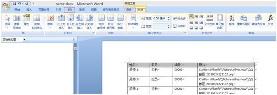
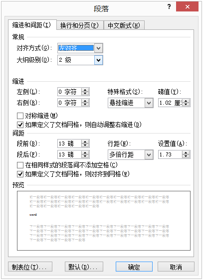
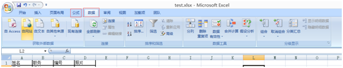
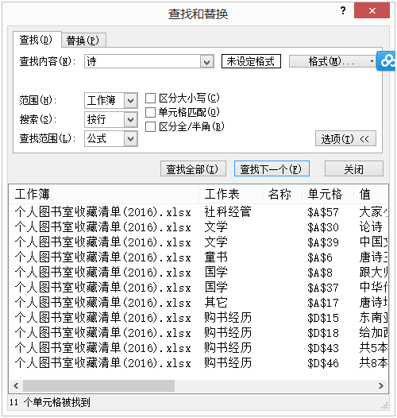

| 序号 | 修改时间   | 修改内容                                   | 修改人 | 审稿人 |
| ---- | ---------- | ------------------------------------------ | ------ | ------ |
| 1    | 2016-4-9   | 创建《办公软件高级教程》。                 | Keefe  |        |
| 2    | 2021-6-28  | 办公软件高级教程章节单独成文。             | 同上   |        |
| 3    | 2021-8-11  | 增加 OpenOffice章节。                      | 同上   |        |
| 4    | 2021-11-18 | 增加 MS Office替代品 和 企业协同办公章节。 | 同上   |        |
| 5    | 2022-2-26  | 增加markdown编辑章节                       | 同上   |        |


<br><br><br>

---

[TOC]

<br>

---

# 一 简介

## 开放文档格式 ODF

开放文档格式（OpenDocument Format，简称ODF）是一种规范，基于XML的[文件格式](https://baike.baidu.com/item/文件格式/6156907)，因应[试算表](https://baike.baidu.com/item/试算表/8690020)、[图表](https://baike.baidu.com/item/图表/1252386)、[简报](https://baike.baidu.com/item/简报/4502034)和文书处理文件等电子文件而设置。开放文档格式企图提供一个取代私有专利文件格式的一个方案，使得组织或个人不会因为文件格式而被厂商套牢（Vendor lock-in）。

ODF规格原本由太阳微系统开发，标准则由OASIS Open Document Format for Office Applications（OpenDocument）TC（又称为OASIS ODF TC）所开发，2003年OASIS ODF TC通过第一份草案。

2006年11月以[ISO](https://baike.baidu.com/item/ISO)/[IEC](https://baike.baidu.com/item/IEC)国际标准发布──**ISO/IEC 26300:2006 Open Document Format for Office Applications（OpenDocument）v1.0**。

2012年1月11日，ODF 1.2发布。

2015年6月9日，ODF 1.2成为ISO国际标准。

<br>

# 二 Microsoft Office

Microsoft Office 是由[Microsoft](https://baike.baidu.com/item/Microsoft/125917)(微软)公司开发的一套基于 Windows 操作系统的[办公软件](https://baike.baidu.com/item/办公软件/4703331)套装。常用组件有 [Word](https://baike.baidu.com/item/Word/2970534)、[Excel](https://baike.baidu.com/item/Excel/9564)、[PowerPoint](https://baike.baidu.com/item/PowerPoint/904847)等。

最初的版本于1985年发布。MS Office常年垄断PC桌面办公软件，MS Office文档格式已成为事实上的行业标准，开源Office或其它商业Office一般都兼容MS Office的文档格式。

## 1  MS Word

### 1.1 常用功能

​        

工具标题栏：开始、插入、页面布局、引用、邮件、审阅、视图、设计、布局

*  页面布局：可页面设置等等
*  引用：可生成目录、交叉引用等等。写论文必需。
*  邮件：可通过数据关联，批量制作名片。
*  审阅：包括校对、批注、修订、估计也是 、比较、保护。
*  视图：主要用于浏览文档。
*  表格工具~设计、布局：常用于表格内容。如合并行列、斜线表头、重复标题行等等。

**快捷键**

ctrl+< 增大字体

ctrl+> 减少字体

ctrl++ 上标

ctrl+= 下标


**边框和底坟**

边框可对表格边框显示进行修改。

底坟可对表面的背景色进行修改。


**特殊图形，符号**

可汇制框图, 组织结构图， 循环图, 目标图等。

还有各种箭头， { 符号等。

设置字体上标， 下标等。


### 1.2 写作

**1).** **写作注意事项**

* 单词统计: 用来统计字数。

* 索引引文: 文档结构图辅助段落,数字编号，用来生成标题目录，交叉引用等。

* 图表目录: 图表下方插入"题注"用来生成图表目录。

* 页眉和页脚: 打印时方便看。

* 英文写作: 可检查符号书写规范，单复数，单词词性，常见拼写错误。不能解决的是句子动词的时态。

* 自动校对：WORD选项 -> 自动更正选项 --> 键入时自动套用格式，勾选“internet及网络路径替换为超链接”选项。

* 设置缺省文本对齐方式：选项卡（或者选择一段文字） 段落--对齐方式。如下图所示：



图 2 WORD设置段路的‘对齐方式’


**2).** **审阅：文档安全，** **修订**

工具->保护文档后，可以进行修订或批注。否则只有点击修订或批注纽才起作用。

对于要评价或修改别人的文章可在保护文档后进行操作,更加方便。

修订的使用: 删除状态，插入状态，批注状态，小气球表示，标记(突出显示)。


### 1.3 WORD模板

要打开.dotx格式的模板，需选择‘文件’选项卡，在左侧选择‘打开’选项，点击‘浏览’按钮，在弹出的‘打开’对话框中单击‘文件名’后面的‘文件类型’下拉框，选择‘WORD模板’选项。

简述：只能用‘文件’选项卡的‘打开’选项才能编辑模板。


## 2  MS Excel

### 2.1 常用功能

 

Excel区别与WORD的工具栏：公式、数据

* 公式：插入各种函数，名称管理器可提供内容自动填充功能。

* 数据： 包括获取外部数据、连接、排序和筛选、分级显示


**1.** **首页标题不参与排序。**

方法一：排序前‘隐藏’首行，排序完再‘取消隐藏’首行。

方法二：点选“排序和筛选”选项；在弹出的对话框中“数据包含标题”前的小方框中打勾，然后点击确定，再次排序，首行就不在参加排序。


**2.** **空值填充**

1） 批量填充（不同值）：需要填写的空单元格以及其上方单元格一起选中，同时按住ctrl+G，跳出“定位”对话框，点击“定位条件”，选择‘空值’。(编辑 - 查找和选择 - 定位条件)

2）空值填充为0


**3.** **查找**

ctrl + F

缺省是查前当前工作表，按行列出单元格。

可设置查找范围‘工作簿’，那么就会查找excel所有工作表。示例如下：

 


### 2.2 数据处理

**1.** **分列**


**2.** **行列互换（倒置）：**

法1：选择性粘贴，右键弹出窗口 ‘倒置’

法2：公式：TRAMSPOSE， 按CTRL+SHIFT+ENTER 得到结果


### 2.3 合并多个工作表到一个


### 2.4 透视表

工作簿和工作表sheet：工作簿由多个工作表组成。

引用：引用符号$，行号或列号前加$

* 绝对引用：$A$B，表示A行B列；$AB，表A行第B列（B会变化）。

* 跨表引用：[表名]![行列]

* 表内引用：[行列]，可忽略表名。


### 2.5 分级显示

主要包括合并计算和分类汇总。


### 2.6 数据模拟分析与预测

略。


### 2.7 VBA宏

打开宏：工具 -- 宏

编码宏：在宏界面的菜单→插入→模块→粘贴下代码

执行命令： F5

**示例：提取超链接**

```vbscript
Sub test()
For Each cell In Range("A1:A21")   # 需要提取的源单元区域
cell.Offset(0, 1) = cell.Hyperlinks(1).Address  # 提取后存放的单元格地址
Next
End Sub
```


## 3 MS PPT

### 3.1 常用功能

1). 使用对象:声音，视频，图片，超链接与excel，word的关联。

2). 设计方案: 页面显示动画效果，页面母版，配色方案。

3). 生成图表: 流程图、饼图、条形图...


### 3.2 PPT模板

**模板页面设置**

路径：幻灯片模板 - 页面设置

16边框： 长度33.86. 宽度19.05

 


**模板切换**

示例：把A.PPT的母模板应用到B.PPT

步骤

1)     A.PPT 在设计-母模板，适当修改后。文件- 另存为-其它格式（powerpoint(*.potx)）。保存路径为C:\Users\keefe\AppData\Roaming\Microsoft\Templates

2)     B.PPT


<br>

## 本章参考

* 怎样把一个ppt替换成另外一个好看ppt的模板？ https://jingyan.baidu.com/article/fedf0737baf37d35ac8977b2.html

* 怎样快速更换PPT模板 https://jingyan.baidu.com/article/fd8044fac25edf5031137ad6.html

<br>

# 三 MS Office替代品

## 基于OpenOffice.org

1999年，Sun Microsystems收购了StarSuite办公套件。

2000年，Sun开始采用StarSuite软件有机该项目继续在Sun员工和志愿者的帮助下，提供免费的OpenOffice。

2011年，Sun Microsystems被Oracle收购。Oracle甲骨文宣布停止OpenOffice.org的商业支持，导致开发者出走成立了The Document Foundation，创建了分支LibreOffice。

2011年6月，甲骨文宣布将OpenOffice.org捐赠给[Apache软件基金会](https://zh.wikipedia.org/wiki/Apache軟件基金會)，后来成为[Apache OpenOffice](https://zh.wikipedia.org/wiki/Apache_OpenOffice)。

```
StarSuite(1999) ->  OpenOffice.org(2000)  -> Apache OpenOffice(2011)
                  /         |           \
  [IBM Lotus Symphony] LibreOffice(2011)  Go-oo
```


InfoWorld [对比了两个办公软件的Windows版本](https://www.oschina.net/action/GoToLink?url=http%3A%2F%2Fwww.infoworld.com%2Fprint%2F151716)，寻找它们的差异和优缺点，以及用户是否可以抛弃甲骨文的OpenOffice。

| 产品                                                         | 官网                           | 开源 | 简介                                                         |
| ------------------------------------------------------------ | ------------------------------ | ---- | ------------------------------------------------------------ |
| [StarOffice](http://en.wikipedia.org/wiki/StarOffice)        |                                |      | 所有分支的起点，商业软件。最早由StarDivision开发，所以称为StarOffice。<br/>1999年被Sun收购，仍保留原名称。现在称为Oracle Open Office。 |
| [OpenOffice.org](http://en.wikipedia.org/wiki/OpenOffice.org) |                                | ✔    | 2000年，Sun将StarOffice公开源代码形成的社区开发版。关于其名称，本应该是OpenOffice，但因为该名称有版权问题，所以改称为 OpenOffice.org ，简称OOo。 |
| [Go-oo](http://en.wikipedia.org/wiki/Go-oo)                  |                                | ✔    | OOo的分支，绝大多数Linux（ Ubuntu, openSUSE, Mandriva Linux）采用了该版本。 |
| [IBM Lotus Symphony](http://symphony.lotus.com/)             |                                |      | 2007年9月，IBM公司基于OpenOffice.org推出的办公套件，是对OpenOffice改动最大的分支。 |
| Apache OpenOffice                                            | http://www.openoffice.org/     | ✔    | 2011年6月，甲骨文宣布将OpenOffice.org捐赠给[Apache软件基金会](https://zh.wikipedia.org/wiki/Apache軟件基金會)，后来成为[Apache OpenOffice](https://zh.wikipedia.org/wiki/Apache_OpenOffice)。 |
| LibreOffice                                                  | https://zh-cn.libreoffice.org/ | ✔    | 2010年9月由新基金 Document Foundation 推出的新分支，实际上基于Go-oo。<br>目前大多数Linux发行版换用了此版本。 |
| WPS Office                                                   | https://www.wps.cn/            |      | 1989年推出WPS1.0。WPS Office是由金山软件股份有限公司自主研发的一款办公软件套装，可以实现办公软件最常用的文字、表格、演示等多种功能。<br/>具有内存占用低、运行速度快、体积小巧、强大插件平台支持、免费提供海量在线存储空间及文档模板、支持阅读和输出PDF 文件、全面兼容微软Office97-2010格式(doc/docx/xls/xlsx/ppt/pptx 等）独特优势，覆盖Windows、 Linux、 Android、 iOS等多个平台。 |


### 功能和使用技巧

表格 OpenOffice.org 和MS Office主要办公套件的比较

| 办公套件 | Microsoft Office | OpenOffice.org |
| -------- | ---------------- | -------------- |
| 文字处理 | MS Word          | writer         |
| 表格     | MS Excel         | calc           |
| 演示     | MS PPT           | present        |
| 数据库   | MS Access        | database       |


表格 OpenOffice.org 和MS Office关键功能对比

| MS Office功能   | OpenOffice对应功能 | 详述                                                         |
| --------------- | ------------------ | ------------------------------------------------------------ |
| WORD 文档结构图 | 视图 - 导航        | 导航快捷键 F5，标题对应到文档结构图，另外还有图片/链接/表格的结构。 |
| WORD审阅        | 插入 - 批注        | 快捷键CTRL + ALT + C                                         |
| Excel 数据分析  |                    |                                                              |
| ...             |                    |                                                              |


**常用快捷键**

```
F5 	打开导航，即文档结构图
Alt + F12 打开设置项
Ctrl + Enter   表格单元格内换行
```


**windows环境，libreoffce性能提升**

优化方法：打开选项卡可用快捷键`Alt + F12`。

1. 关闭 OpenCL:    打开选项卡「工具」—「选项」—「OpenCL」，取消勾选「允许使用OpenCL」选项。
2. 禁用Java运行时： 打开选项卡「工具」—「选项」—「高级」，取消勾选「使用 Java 运行时环境」选项。此项不影响日常功能，但如果要用到某些特殊功能时，需勾选。
3. 字体固定：打开选项卡「工具」—「选项」—「字体」，“HTML、Basic及SQL源代码的字体设置” 从 “自动” 改为自己平常用的字体。


**FAQ**

**Q1:   粘贴过长的表格，数据常被截断。**

可以右键 ’选择性粘贴‘，选择 电子表格。


### Apache OpenOffice

[Apache OpenOffice - 开放免费的文字处理软件](http://www.openoffice.org/zh-cn/)  http://www.openoffice.org/

Apache OpenOffice是一款先进的**开源** **办公软件套件**，它包含**文本文档**、**电子表格**、**演示文稿**、**绘图**、**数据库**等。 它能够支持**许多语言**并且在所有**普通计算机**上工作。它将你所有的数据以**国际开放标准格式**存储下来，并能够读写从其它常用办公软件包来的文件。它可以被完全**免费**下载并使用于**任何用途**。


###  Libreoffice

[主页 | LibreOffice 简体中文官方网站 - 自由免费的办公套件](https://zh-cn.libreoffice.org/)  https://zh-cn.libreoffice.org/

LibreOffice 是一款功能强大的办公软件，默认使用开放文档格式 (OpenDocument Format , ODF)，并支持 *.docx, *.xlsx, *.pptx 等其他格式。它包含了 Writer, Calc, Impress, Draw, Base 以及 Math 等组件，可用于处理文本文档、电子表格、演示文稿、绘图以及公式编辑。<br>它可以运行于 Windows, GNU/Linux 以及 macOS 等操作系统上，并具有一致的用户体验。

LibreOffice 采用对企业和个人用户均免费的 MPL 2.0 授权协议。您可以自由分发该软件，无需支付授权费用（但您仍然可以付费获得经认证的专业支持）。它的源代码完全公开，任何人都可以参与软件的开发和维护。

LibreOffice 是目前最活跃的 OpenOffice.org 代码库后继者，每 6 个月发布一个主要的新版本。


## WPS Office

**发展历程**

- 1989年，金山创始人求伯君正式推出WPS1.0，并在2001年完成政府采购第一枪；
- 2005年，WPS Office宣布个人版免费使用；
- 2011年，金山办公正式发布WPS Office移动端；
- 2012年，金山WPS通过核高基重大专项验收；
- 2015年，WPS+一站式云办公发布；
- 2017年，WPS Office PC端与移动端用户均过亿，5月份正式发布泰文版本；
- 2018年，召开了主题为“简单.创造.不简单”云AI未来办公大会，发布了金山文档等新产品；
- 2020年11月11日，金山办公正式发布“使命.愿景.价值观”。


<br>

## 本章参考

*  [LibreOffice 与 Microsoft® Office 2016 的对比](https://wiki.documentfoundation.org/Feature_Comparison:_LibreOffice_-_Microsoft_Office)  https://wiki.documentfoundation.org/Feature_Comparison:_LibreOffice_-_Microsoft_Office
* LibreOffice:完全由开源社区主导的OpenOffice分支  https://xbeta.info/libreoffice.htm

<br>

# 四 企业协同办公Office

详见  《[企业协同办公生态.md](./企业协同办公生态.md)》

<br>

# 其它办公套件

## Adobe PDF

MS Office办公套件有PDF格式转换插件，可以将word格式转化成pdf格式。

1). 生成pdf文件;

2). 裁剪pdf文件大小;

<br>

# Markdown编辑

**通用写作技巧**

1. [Markdown 公式指导手册](https://www.zybuluo.com/codeep/note/163962)
2. 如果单个md文件超过100KB，一般需要拆分内容另文。
3. `数字+空格` 会变成有序符号且不需额外换行；仅数字开头仍需换行。
4. 路径符号要用unix或url符号/，不能用\，否则图片链接在github上不能正确显示。
5. 空行：markdown语法中空行要用`<br> 或者 <br/>`来表示，二个换行符的空行模式不是所有markdown编辑器都支持。比如Typora支持二换行符空行，Marktext就不支持。

## 工具篇

表格  markdown相关的工具

| 工具名称                                      | 用途                                                         | 示例                    |
| --------------------------------------------- | ------------------------------------------------------------ | ----------------------- |
| typora                                        | markdown所见即所得编辑器，2021年底winows版付费使用。         |                         |
| marktext                                      | A simple and elegant markdown editor, available for Linux, macOS and Windows.<br>可替换typora，支持目录，但换行要显式使用`<br>`，不支持空行换行。 |                         |
| [trilium](https://github.com/zadam/trilium)   | 可替换typora。支持目录，类似印象笔记，有网页版也有客户端。   |                         |
| [notable](https://github.com/notable/notable) | The Markdown-based note-taking app that doesn't suck. 类似网易云笔记，但不支持目录。 |                         |
| mkdocs                                        | 生成markdown文本。                                           |                         |
| pandoc                                        | 可方便地在markdown和其它格式之间进行转换。                   | pandoc xx.docx -o xx.md |


### Typora

[官网](https://typora.io/) [Typora中文](https://www.typora.net/)

Typora 是一款十分简洁的 Markdown 编辑器，支持 Windows、Mac、Linux。但2021.11.23，Typora 正式发布了 1.0.0 版本，并开启付费模式，价格为 89 元，可用 3 台设备，提供免费升级；2022.2.15起，windows旧版本已不可使用，需要换用付费新版本，并且只能试用15天；linux版暂不受影响。

问题：官网无法访问。

下载：[Typora-Mirror 发行版 - Gitee.com](https://gitee.com/typora-mirror/Typora-Mirror/releases)

https://gitee.com/typora-mirror/Typora-Mirror/attach_files/432421/download/typora_0.9.92_amd64.deb

ubuntu环境：可以先下载好deb，然后安装deb。`dpkg -i typora_0.9.92_amd64`


### Pandoc

Pandoc 是由 John MacFarlane 开发的标记语言转换工具，可实现不同标记语言间的格式转换，堪称该领域中的“瑞士军刀”。Pandoc 使用 Haskell 语言编写，以命令行形式实现与用户的交互，可支持多种操作系统；Pandoc采用GNU GPL授权协议发布，属于自由软件。

```shell
$ pandoc --version
pandoc 2.5
Compiled with pandoc-types 1.17.5.4, texmath 0.11.2.2, skylighting 0.7.7
Default user data directory: /home/keefe/.pandoc
Copyright (C) 2006-2018 John MacFarlane
Web:  http://pandoc.org
This is free software; see the source for copying conditions.
There is no warranty, not even for merchantability or fitness
for a particular purpose.
```

常规格式转化： `pandoc [源文件] -o [目标文件]`

**安装pandoc及相应格式引擎**

`$ sudo apt install texlive texlive-latex-extra texlive-latex-recommended texlive-xetex pandoc`

1. 将markdown格式转化成pdf

   pandoc的pdf格式对中文支持不太好，一要更换pdf引擎；二要安装中文字体；三要中文文档边界没要处理好，需要替换latex模板。

   1）更换pdf引擎：默认的latex引擎是pdflatex，是不支持中文的，因此需要手动设置编译时所用的引擎为xelatex，编译命令增加 `--pdf-engine=xelatex`

   2）安装中文字体：编译时默认的字体时不支持中文的，所以我们得手动设置中文字体。显然，所设的字体应该为系统中已装的字体，且字体的名字不能写错。可用 fc-list 查看支持字体。

   3）替换latex模板：生成模板命令 `pandoc -D latex > template.tex`，修改模板若干行 或者直接替换已修改好的模板

pandoc转换命令示例：`pandoc infile.md -o outfile.pdf -s --pdf-engine=xelatex -V mainfont="Microsoft YaHei" -V geometry:margin=2.5cm`

<br>

## 用户篇

**通用快捷键**

* 格式：ctrl+b 加粗，ctrl+u 下划线，ctrl+i 斜线, ctrl+D 删除线
* 段落：ctrl+1, +2, +3...

表格  Typora和Marktext的常用快捷键比较

|            | Typora       | Marktext     | markdown符号                   |
| ---------- | ------------ | ------------ | ------------------------------ |
| 源代码模式 | ctrl+/       | ctrl+alt+s   |                                |
| 超链接     | ctrl+k       | ctrl+L       | [title](link)                  |
| 清除格式   | ctrl+\       | ctrl+shift+r |                                |
| 代码块     | ctrl+shift+k | ctrl+`       | ``` 代码块 ```                 |
| 删除线     | alt+shift+5  | ctrl+d       | ~~删除线~~                     |
| 高亮       |              | ctrl+shfit+h | <mark>高亮</mark>              |
| 复制       | ctrl+c       | ctrl+shift+c | 复制为markdown格式，即原有格式 |
| 粘贴       | ctrl+v       | ctrl+shift+v | 粘贴为文本格式                 |

备注：1. 快捷键大小写不敏感。

2. 2021-11-23起 Typora付费才能使用，换成开源替代marktext。

3. Marktext 可设置移除代码块首尾空行。可在 File - Perferences... - Editor 关闭 `Remove leading and traling empty lines in code blacks`

4. Marktext 可设置新行符的处置方式(v0.16.3版本有BUG，此项配置无效，默认去除尾部空行)。可在 File - Perferences... - Editor - `Handling of trailing newline characters`

<br>

**Typora支持的md格式与传统md格式的差别**

1. md格式表格头前要有空行，Typora没作要求。
2. 脚注使用 `[^xx]`， 会在文末出现参考链接，xx可以是任意名称或数字。


## 数学公式语法

Typora支持单行公式的方法：点开 “文件” -- “偏好设置” -- “Markdown扩展语法”，后面跟了一竖排内联公式（也就是行内公式）、上标、下标之类的勾选项，打好钩后重启编辑器就可以了。

行内与独行

1. 行内公式：将公式插入到本行内，符号：`$公式内容$`，如：$xyz$
2. 独行公式：将公式插入到新的一行内，并且居中，符号：`$$公式内容$$`，如：$$xyz$$


上标、下标与组合

1. 上标符号，符号：`^`，如：$x^4$
2. 下标符号，符号：`_`，如：$x_1$,   $x_{10}$
3. 组合符号，符号：`{}`，如：${16}_{8}O{2+}_{2}$


汉字、字体与格式

1. 汉字形式，符号：`\mbox{}`，如：$V_{\mbox{初始}}$
2. 字体控制，符号：`\displaystyle`，如：$\displaystyle \frac{x+y}{y+z}$
3. 下划线符号，符号：`\underline`，如：$\underline{x+y}$
4. 标签，符号`\tag{数字}`，如：$\tag{11}$
5. 上大括号，符号：`\overbrace{算式}`，如：$\overbrace{a+b+c+d}^{2.0}$
6. 下大括号，符号：`\underbrace{算式}`，如：$a+\underbrace{b+c}_{1.0}+d$
7. 上位符号，符号：`\stacrel{上位符号}{基位符号}`，如：$\vec{x}\stackrel{\mathrm{def}}{=}{x_1,\dots,x_n}$


占位符

1. 两个quad空格，符号：`\qquad`，如：$x \qquad y$
2. quad空格，符号：`\quad`，如：$x \quad y$
3. 大空格，符号`\`，如：$x \  y$
4. 中空格，符号`\:`，如：$x : y$
5. 小空格，符号`\,`，如：$x , y$
6. 没有空格，符号``，如：$xy$
7. 紧贴，符号`\!`，如：$x ! y$


定界符与组合

1. 括号，符号：`（）\big(\big) \Big(\Big) \bigg(\bigg) \Bigg(\Bigg)`，如：$（）\big(\big) \Big(\Big) \bigg(\bigg) \Bigg(\Bigg)$
2. 中括号，符号：`[]`，如：$[x+y]$
3. 大括号，符号：`\{ \}`，如：${x+y}$
4. 自适应括号，符号：`\left \right`，如：$\left(x\right)$，$\left(x{yz}\right)$
5. 组合公式，符号：`{上位公式 \choose 下位公式}`，如：${n+1 \choose k}={n \choose k}+{n \choose k-1}$
6. 组合公式，符号：`{上位公式 \atop 下位公式}`，如：$\sum_{k_0,k_1,\ldots>0 \atop k_0+k_1+\cdots=n}A_{k_0}A_{k_1}\cdots$

### 运算符号

四则运算

1. 加法运算，符号：`+`，如：$x+y=z$
2. 减法运算，符号：`-`，如：$x-y=z$
3. 加减运算，符号：`\pm`，如：$x \pm y=z$
4. 减加运算，符号：`\mp`，如：$x \mp y=z$
5. 乘法运算，符号：`\times`，如：$x \times y=z$
6. 点乘运算，符号：`\cdot`，如：$x \cdot y=z$
7. 星乘运算，符号：`\ast`，如：$x \ast y=z$
8. 除法运算，符号：`\div`，如：$x \div y=z$
9. 斜法运算，符号：`/`，如：$x/y=z$
10. 分式表示，符号：`\frac{分子}{分母}`，如：$\frac{x+y}{y+z}$
11. 分式表示，符号：`{分子} \voer {分母}`，如：${x+y} \over {y+z}$
12. 绝对值表示，符号：`||`，如：$|x+y|$


高级运算

1. 平均数运算，符号：`\overline{算式}`，如：$\overline{xyz}$
2. 开二次方运算，符号：`\sqrt`，如：$\sqrt x$
3. 开方运算，符号：`\sqrt[开方数]{被开方数}`，如：$\sqrt[3]{x+y}$
4. 对数运算，符号：`\log`，如：$\log(x)$
5. 极限运算，符号：`\lim`，如：$\lim^{x \to \infty}_{y \to 0}{\frac{x}{y}}$
6. 极限运算，符号：`\displaystyle \lim`，如：$\displaystyle \lim^{x \to \infty}_{y \to 0}{\frac{x}{y}}$
7. 求和运算，符号：`\sum`，如：$\sum^{x \to \infty}_{y \to 0}{\frac{x}{y}}$
8. 求和运算，符号：`\displaystyle \sum`，如：$\displaystyle \sum^{x \to \infty}_{y \to 0}{\frac{x}{y}}$
9. 积分运算，符号：`\int`，如：$\int^{\infty}_{0}{xdx}$
10. 积分运算，符号：`\displaystyle \int`，如：$\displaystyle \int^{\infty}_{0}{xdx}$
11. 微分运算，符号：`\partial`，如：$\frac{\partial x}{\partial y}$
12. 矩阵表示，符号：`\begin{matrix} \end{matrix}`，如：$\left[ \begin{matrix} 1 &2 &\cdots &4\5 &6 &\cdots &8\\vdots &\vdots &\ddots &\vdots\13 &14 &\cdots &16\end{matrix} \right]$


逻辑运算

1. 等于运算，符号：`=`，如：$x+y=z$
2. 大于运算，符号：`>`，如：$x+y>z$
3. 小于运算，符号：`<`，如：$x+y<z$
4. 大于等于运算，符号：`\geq`，如：$x+y \geq z$
5. 小于等于运算，符号：`\leq`，如：$x+y \leq z$
6. 不等于运算，符号：`\neq`，如：$x+y \neq z$
7. 不大于等于运算，符号：`\ngeq`，如：$x+y \ngeq z$
8. 不大于等于运算，符号：`\not\geq`，如：$x+y \not\geq z$
9. 不小于等于运算，符号：`\nleq`，如：$x+y \nleq z$
10. 不小于等于运算，符号：`\not\leq`，如：$x+y \not\leq z$
11. 约等于运算，符号：`\approx`，如：$x+y \approx z$
12. 恒定等于运算，符号：`\equiv`，如：$x+y \equiv z$


集合运算

1. 属于运算，符号：`\in`，如：$x \in y$
2. 不属于运算，符号：`\notin`，如：$x \notin y$
3. 不属于运算，符号：`\not\in`，如：$x \not\in y$
4. 子集运算，符号：`\subset`，如：$x \subset y$
5. 子集运算，符号：`\supset`，如：$x \supset y$
6. 真子集运算，符号：`\subseteq`，如：$x \subseteq y$
7. 非真子集运算，符号：`\subsetneq`，如：$x \subsetneq y$
8. 真子集运算，符号：`\supseteq`，如：$x \supseteq y$
9. 非真子集运算，符号：`\supsetneq`，如：$x \supsetneq y$
10. 非子集运算，符号：`\not\subset`，如：$x \not\subset y$
11. 非子集运算，符号：`\not\supset`，如：$x \not\supset y$
12. 并集运算，符号：`\cup`，如：$x \cup y$
13. 交集运算，符号：`\cap`，如：$x \cap y$
14. 差集运算，符号：`\setminus`，如：$x \setminus y$
15. 同或运算，符号：`\bigodot`，如：$x \bigodot y$
16. 同与运算，符号：`\bigotimes`，如：$x \bigotimes y$
17. 实数集合，符号：`\mathbb{R}`，如：`\mathbb{R}`
18. 自然数集合，符号：`\mathbb{Z}`，如：`\mathbb{Z}`
19. 空集，符号：`\emptyset`，如：$\emptyset$


### 数学符号

1. 无穷，符号：`\infty`，如：$\infty$
2. 虚数，符号：`\imath`，如：$\imath$
3. 虚数，符号：`\jmath`，如：$\jmath$
4. 数学符号，符号`\hat{a}`，如：$\hat{a}$
5. 数学符号，符号`\check{a}`，如：$\check{a}$
6. 数学符号，符号`\breve{a}`，如：$\breve{a}$
7. 数学符号，符号`\tilde{a}`，如：$\tilde{a}$
8. 数学符号，符号`\bar{a}`，如：$\bar{a}$
9. 矢量符号，符号`\vec{a}`，如：$\vec{a}$
10. 数学符号，符号`\acute{a}`，如：$\acute{a}$
11. 数学符号，符号`\grave{a}`，如：$\grave{a}$
12. 数学符号，符号`\mathring{a}`，如：$\mathring{a}$
13. 一阶导数符号，符号`\dot{a}`，如：$\dot{a}$
14. 二阶导数符号，符号`\ddot{a}`，如：$\ddot{a}$
15. 上箭头，符号：`\uparrow`，如：$\uparrow$
16. 上箭头，符号：`\Uparrow`，如：$\Uparrow$
17. 下箭头，符号：`\downarrow`，如：$\downarrow$
18. 下箭头，符号：`\Downarrow`，如：$\Downarrow$
19. 左箭头，符号：`\leftarrow`，如：$\leftarrow$
20. 左箭头，符号：`\Leftarrow`，如：$\Leftarrow$
21. 右箭头，符号：`\rightarrow`，如：$\rightarrow$
22. 右箭头，符号：`\Rightarrow`，如：$\Rightarrow$
23. 底端对齐的省略号，符号：`\ldots`，如：$1,2,\ldots,n$
24. 中线对齐的省略号，符号：`\cdots`，如：$x_1^2 + x_2^2 + \cdots + x_n^2$
25. 竖直对齐的省略号，符号：`\vdots`，如：$\vdots$
26. 斜对齐的省略号，符号：`\ddots`，如：$\ddots$


### 希腊字母

| 字母 | 实现       | 字母 | 实现       |
| ---- | ---------- | ---- | ---------- |
| A    | `A`        | α    | `\alhpa`   |
| B    | `B`        | β    | `\beta`    |
| Γ    | `\Gamma`   | γ    | `\gamma`   |
| Δ    | `\Delta`   | δ    | `\delta`   |
| E    | `E`        | ϵ    | `\epsilon` |
| Z    | `Z`        | ζ    | `\zeta`    |
| H    | `H`        | η    | `\eta`     |
| Θ    | `\Theta`   | θ    | `\theta`   |
| I    | `I`        | ι    | `\iota`    |
| K    | `K`        | κ    | `\kappa`   |
| Λ    | `\Lambda`  | λ    | `\lambda`  |
| M    | `M`        | μ    | `\mu`      |
| N    | `N`        | ν    | `\nu`      |
| Ξ    | `\Xi`      | ξ    | `\xi`      |
| O    | `O`        | ο    | `\omicron` |
| Π    | `\Pi`      | π    | `\pi`      |
| P    | `P`        | ρ    | `\rho`     |
| Σ    | `\Sigma`   | σ    | `\sigma`   |
| T    | `T`        | τ    | `\tau`     |
| Υ    | `\Upsilon` | υ    | `\upsilon` |
| Φ    | `\Phi`     | ϕ    | `\phi`     |
| X    | `X`        | χ    | `\chi`     |
| Ψ    | `\Psi`     | ψ    | `\psi`     |
| Ω    | `\v`       | ω    | `\omega`   |

<br>

## 本章参考

* 再见 Typora！这款 Markdown 神器绝了！ https://blog.csdn.net/sinat_33224091/article/details/122150807
* 神器pandoc的安装和使用  http://www.360doc.com/content/19/0507/17/13561030_834142392.shtml
* Markdown数学公式语法  https://www.jianshu.com/p/e74eb43960a1


<br>

# 参考资料

