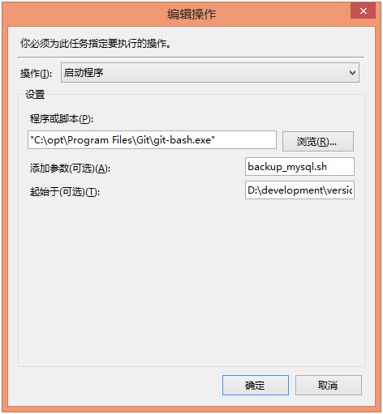

| 序号 | 修改时间   | 修改内容                | 修改人 | 审稿人 |
| ---- | ---------- | ----------------------- | ------ | ------ |
| 1    | 2021-12-20 | 创建。                  | Keefe  |        |
| 2    | 2022-1-25  | 更新Linux安装软件章节。 | 同上   |        |


----

[TOC]


----

# 1 简介

参见  《[操作系统实现原理.md](../../平台与编程语言/platform.平台/操作系统实现原理.md)》、《[linux内核源码剖析.md](./linux内核源码剖析.md)》

Windows是主要的办公OS。

CentOS和Ubuntu是主要的开发OS。


## BIOS配置

**BIOS Boot Mode启动模式**

* Legacy：传统方式，从MBR中加载启动程序。

* UEFI：Unified Extensible Firmware Interface，可扩展固件接口。新的启动技术，只支持64位系统。UEFI BIOS也引入了一些新的技术，例如Fast boot和secure boot。UEFI的引导程序是以后缀名为.efi的文件存放在ESP分区中的，ESP分区采用fat32文件系统。因此只要u盘或移动硬盘上有fat32分区，分区根目录下有个文件夹叫EFI，UEFI就会自动去查找相应的启动文件(.efi)。


Windows8启动相关分区有三个:

* ESP (EFI系统分区)，

* SR (Microsoft保留分区，通常为128MB)。

* WinRE Tools  恢复分区。

**EFI Boot 介绍**

EFI 的全称是可扩展固件接口 (Extensible Firmware Interface)，它是 Intel 公司为全新类型的固件体系结构、接口和服务提出的建议性标准。该标准有两个主要用途：向操作系统的引导程序和某些在计算机初始化时运行的应用程序提供一套标准的运行环境；为操作系统提供一套与固件通讯的交互协议


**联想g40怎么进入bios设置u盘启动**

1.笔记本上插上U盘。

2.开机启动，开机后在显示LENOVO自检画面的时候，反复按Fn+F12键进入bios界面。

3.切换到boot设置项。设置boot mode为legacy support，然后设置Boot priority为legacy first。

4.把开机启动项设置usb优先，也就是把U盘调整到最前面。按FN+F6或者FN+F5调整。

5.切换到EXIT设置项。把OS optimized defaults由win8 64bit改为other OS。


进入BIOS快捷键

* F12： 联想


## 跨OS工具

* 办公：参见 《[office办公软件高级教程.md](./office办公软件高级教程.md)》
* 开发：参见  《[项目开发环境工具.md](./项目开发环境工具.md)》


### U盘启动盘

制作U盘启动盘的方法如下，

* Windows：UltraISO、Universal USB Installer

* Linux：dd命令、Etcher软件、usb-creator-gtk（ubuntu自带）

  ```shell
  # 查看磁盘分区情况，获取U盘设备符，示例U盘设备是/dev/sdb是
  $ sudo fdisk -l
  # 卸载U盘 
  $ sudo umount /dev/sdb
  
  # 法1. dd命令制作U盘 (很不友好，没有任何进度提示，约需20分钟)
  $ sudo dd if=/home/lm/ubuntukylin-19.04-enhanced-amd64.iso of=/dev/sdb
  
  # 法2. 启动盘创建器（usb-creator-gtk）
  # usb-creator-gtk是Ubuntu系统自带的U盘系统启动盘制作工具，制作时将覆盖U盘中的所有内容。该工具仅支持制作Debian系的系统镜像。
  ```


## 本章参考

* UEFI与 Legacy BIOS两种启动模式详解  https://www.cnblogs.com/sddai/p/7739567.html

* Linux中制作U盘启动盘的三种方法，使用启动盘创建器/dd命令和Etcher  https://ywnz.com/linuxjc/5620.html

* 如何在win8中制作一个Ubuntu系统的U盘 https://jingyan.baidu.com/article/f3ad7d0f2dc64b09c3345bb0.html

* 用UltraISO制作Ubuntu16|18|20.04 U盘启动盘 https://www.cnblogs.com/silentdoer/p/13044305.html


# 2 Windows

## 全新Windows配置

### 防火墙设置

WIN8自带防火墙，可在“控制面板” --“系统与安全”-“Windows 防火墙”启用或关闭。

一般来讲关闭防火墙就能解决绝大部分问题，但从安全角度来讲，不推荐。

1）局域网无法PING：

修改规则：修改ICMP Echo规则。

具体操作：“控制面板” - “Windows 防火墙” - “高级设置” - “入站规则” - “文件和打印机共享（回显请求 - ICMPv4 - In）”，然后根据你的实际情况选择其中一个，右键点击“启用规则”。


2）局域网无法访问WEB服务

新建规则：增加TCP80端口。

具体操作：“控制面板” - “Windows 防火墙” - “高级设置” - “入站规则” - “新建规则”- “添加端口”。


### 其它设置

1. win8系统桌面添加“我的电脑”图标

桌面上右击，选择【个性化】； - 【更改桌面图标】，勾选‘计算机’选项。


2.  设置静态IP

右键点击网络图标，Edit Connections，这个选项一开始可能并不会出现，但网络稳定后才出现。


## FAQ

### WINDOWS命令行

1. 以管理员身份运行命令行 cmd

   ```shell
   $ runas /user:administrator cmd
   ```

2. **git bash在windows 10下启动很慢，达到分钟级。**

   原因：有非常多的原因导致git bash启动很慢。比如双显卡工作的原因需移除AMD驱动；不是管理员权限启动；windows自带的病毒防范；windows cmd新样式等。

   git缺省安装路径C:\Program Files\Git\mingw64\

   解决方法：

   1）恢复cmd旧样式方法：win+R 打开cmd 在标题栏上右键， 属性-- 选项--- 打勾---使用旧控制台样式。

   2）(推荐)升级git版本到2.20+（发布于2018.12）版本。


## 本章参考


# 3 Linux

## 3.1 Linux环境综述

表格  Linux通用命令

| 功能           | 命令       | 说明                                                         |
| -------------- | ---------- | ------------------------------------------------------------ |
| 运行级别       | runlevel   | 得到当前的运行级别，可使用sysv-rc-conf来配置各运行级别的服务项。 |
| 查看OS内核版本 | `uname -a` |                                                              |
| ...            |            |                                                              |


### 特殊安装软件

1. **五笔输入法**

   三种输入框架：ibus(缺省自带)、fcitx（推荐，含搜够五笔拼音输入法）和 xim，三种输入法可同时并存。


2. **Typora安装**

[官网](https://typora.io/)  [Typora中文](https://www.typora.net/)

Typora 是一款十分简洁的 Markdown 编辑器，支持 Windows、Mac、Linux。

问题：官网无法访问。

下载：[Typora-Mirror 发行版 - Gitee.com](https://gitee.com/typora-mirror/Typora-Mirror/releases)

https://gitee.com/typora-mirror/Typora-Mirror/attach_files/432421/download/typora_0.9.92_amd64.deb

ubuntu环境：可以先下载好deb，然后安装deb。`dpkg -i typora_0.9.92_amd64 `


3. **chrome安装**

问题：google.com无法访问。

网盘下载：https://www.chromedownloads.net/chrome64linux-stable/

```shell
# 下载安装
$ wget https://dl.google.com/linux/direct/google-chrome-stable_current_amd64.deb

$ sudo dpkg -i google-chrome-stable_current_amd64.deb
```


4. **Finalshell安装**

   ```SHELL
   # 一键安装脚本
   $ wget www.hostbuf.com/downloads/finalshell_install_linux.sh;chmod +x finalshell_install_linux.sh;./finalshell_install_linux.sh;
   
   * 安装路径 /usr/lib/FinalShell
   * /配置文件路径 /home/$USER/.finalshell/
   * 卸载删除安装目录 rm -rf /usr/lib/FinalShell/
   ```


## 3.2 Ubuntu

基于[Debian](https://baike.baidu.com/item/Debian/748667)发行版的Linux都可以参考Ubuntu配置，如[Debian](http://baike.baidu.com/view/40687.htm)、[Google Chrome OS](http://baike.baidu.com/view/2627636.htm)等等。

Ubuntu由[马克·舍特尔沃斯](https://baike.baidu.com/item/马克·舍特尔沃斯)亦译为沙特尔沃斯(*Mark Shuttleworth)*创立，其首个版本Ubuntu4.10以Debian为开发蓝本发布于2004年10月20日。Ubuntu的开发目的是为了使个人电脑变得简单易用，同时也提供针对企业应用的服务器版本。

Ubuntu（友帮拓、优般图、乌班图）是一个以桌面应用为主的开源GNU/Linux操作系统。Ubuntu基于[Debian](https://baike.baidu.com/item/Debian/748667)发行版和Gnome桌面环境。

Ubuntu基于debian的Linux发行版，采用DPG的软件管理包(区别于redhat的RPM包)，安装软件常用apt-get命令，管理软件包文本界面aptitude，图形界面synaptic。


**版本分类**

Ubuntu官方网站提供了丰富的Ubuntu版本及衍生版本，下面按照几个流行的标准来进行分类。

**根据[中央处理器](https://baike.baidu.com/item/中央处理器/284033)架构划分**

根据中央处理器架构划分，Ubuntu 16.04支持[i386](https://baike.baidu.com/item/i386/9048429) 32位系列、amd 64位[X86](https://baike.baidu.com/item/X86/6150538)系列、[ARM](https://baike.baidu.com/item/ARM/7518299)系列及PowerPC系列处理器。由于不同的CPU实现的技术不同，体系架构各异，所以Ubuntu会编译出支持不同中央处理器类型的发行版本。

**根据发布版本用途划分**

根据Ubuntu发行版本的用途来划分，可分为Ubuntu桌面版(Ubuntu Desktop)Ubuntu服务器版(Ubuntu Server)、Ubuntu云操作系统(Ubuntu Cloud)和Ubuntu移动设备系统(Ubuntu Touch)。Ubuntu已经形成一个比较完整的解决方案，涵盖了IT产品的方方面面。

**根据开发项目划分**

除了标准Ubuntu版本之外，Ubuntu官方还有几大主要分支，分别是Edubuntu、Kubuntu、Lubuntu、Mythbuntu、Ubuntu MATE，Ubuntu GNOME、Ubuntu Kylin、Ubuntu Studio和Xubuntu。


**版本支持**

Ubuntu每六个月便会发布一个新版，以便人们实时地获取和使用新软件。长期支持版本(Long Term Support，LTS)从12.04开始，桌面版3年，服务器版5年。

| 版本号                                                       | 代号              | 发布时间   |
| ------------------------------------------------------------ | ----------------- | ---------- |
| 21.10                                                        | Impish Indri      | 2021-10-14 |
| 21.04                                                        | Hirsute Hippo     | 2021-04-22 |
| 20.10                                                        | Groovy Gorilla    | 2020-10-22 |
| 20.04 LTS                                                    | Focal Fossa       | 2020-04-23 |
| 19.10                                                        | Eoan Ermine       | 2019-10-17 |
| 19.04                                                        | Disco Dingo       | 2019-4-19  |
| 18.10                                                        | Cosmic Cuttlefish | 2018-10-18 |
| 18.04 LTS                                                    | Bionic Beaver     | 2018-04-26 |
| 17.10（[GNOME](https://baike.baidu.com/item/GNOME/5105879)成为默认桌面环境） | Artful Aardvark   | 2017-10-21 |
| 17.04                                                        | Zesty Zapus       | 2017-04-13 |
| 16.10                                                        | Yakkety Yak       | 2016-10-20 |
| 16.04 LTS                                                    | Xenial Xerus      | 2016-04-21 |
| 15.10                                                        | Wily Werewolf     | 2015-10-23 |
| 15.04                                                        | Vivid Vervet      | 2015-04-22 |
| 14.10                                                        | Utopic Unicorn    | 2014-10-23 |
| 14.04 LTS                                                    | Trusty Tahr       | 2014-04-18 |
| 13.10                                                        | Saucy Salamander  | 2013-10-17 |
| 13.04                                                        | Raring Ringtail   | 2013-04-25 |
| 12.10                                                        | Quantal Quetzal   | 2012-10-18 |
| 12.04 LTS                                                    | Precise Pangolin  | 2012-04-26 |
| 11.10                                                        | Oneiric Ocelot    | 2011-10-13 |
| 11.04（[Unity](https://baike.baidu.com/item/Unity/5779064)成为默认桌面环境） | Natty Narwhal     | 2011-04-28 |
| 10.10                                                        | Maverick Meerkat  | 2010-10-10 |
| 10.04 LTS                                                    | Lucid Lynx        | 2010-04-29 |
| 9.10                                                         | Karmic Koala      | 2009-10-29 |
| 9.04                                                         | Jaunty Jackalope  | 2009-04-23 |
| 8.10                                                         | Intrepid Ibex     | 2008-10-30 |
| 8.04 LTS                                                     | Hardy Heron       | 2008-04-24 |
| 7.10                                                         | Gutsy Gibbon      | 2007-10-18 |
| 7.04                                                         | Feisty Fawn       | 2007-04-19 |
| 6.10                                                         | Edgy Eft          | 2006-10-26 |
| 6.06 LTS                                                     | Dapper Drake      | 2006-06-01 |
| 5.10                                                         | Breezy Badger     | 2005-10-13 |
| 5.04                                                         | Hoary Hedgehog    | 2005-04-08 |
| 4.10（初始发布版本）                                         | Warty Warthog     | 2004-10-20 |

备注： 1. 4.10为初始发布版本，11.04始Unity成为默认桌面环境，17.10重新切换成Gnome3桌面环境。从12.04开始，Ubuntu支持在线更新（无需重新安装新LTS）。

2. 版本号：包括版本代号和数字号。版本代号是按照“形容词+动物”的格式命名的，且形容词和动物名称的第一个字母要一致，一开始并不是按照字母顺序，从6.06的Drapper DRAKE才开始如此。而数字号则是表示发布的“年+月”，如12.04是在2012年4月发布。

**升级命令**

```shell
# Desktop桌面版本升级：先更新系统，再升级系统
# 先更新系统：updateg更新资源（比如检测apt源仓库是否可用）, upgrade更新软件包
$ sudo apt-get update
$ sudo apt-get dist-upgrade

# 重启
$ reboot

# 升级系统: 检测是否有版本可升级。如果可升级，会弹框提示，确认后升级即可。
$ update-manager -d

# Server版本升级: 用update-manager配置选择要更新的版本。然后参数Desktop的升级步骤。
$ sudo apt-get install update-manager-core
$ sudo vim /etc/update-manager/release-upgrades
Prompt=normal  #normal-会选择离当前版本最近的；lts-长期支持版本，需要当前版本也是lts；
```


### Ubuntu Kylin

优麒麟是Ubuntu的正式子项目，其主旨是创建一份Ubuntu的变体以面向中文用户（使用简体中文写作系统）优化，尽管它也支持其他语言。其缺省桌面为UKUI（优麒麟用户界面），它基于MATE桌面且用Qt工具包开发。UKUI尽其所能地遵守友好易用的设计原则。该发行还提供超过20种内部开发的应用软件，包括麒麟助手、麒麟视频、麒麟截屏、软件中心。

| 特色               | 21.10 impish                                                 | 21.04 hirsute                                                | 20.10 groovy                                                 | 20.04 focal                                                  | 19.10 eoan                                                   | 19.04 disco                                                  | 18.10 cosmic                                                 | 18.04 bionic                                                 | 17.10 artful                                                 | 17.04 zesty                                                  | 16.10 yakkety                                                | 16.04 xenial                                                 | 15.10 wily                                                   | 15.04 vivid                                                  | 14.10 utopic                                                 | 14.04 trusty                                                 | 13.10 saucy                                                  | 13.04 raring                                                 | 特色               |
| :----------------- | :----------------------------------------------------------- | ------------------------------------------------------------ | ------------------------------------------------------------ | ------------------------------------------------------------ | ------------------------------------------------------------ | ------------------------------------------------------------ | ------------------------------------------------------------ | ------------------------------------------------------------ | ------------------------------------------------------------ | ------------------------------------------------------------ | ------------------------------------------------------------ | ------------------------------------------------------------ | ------------------------------------------------------------ | ------------------------------------------------------------ | ------------------------------------------------------------ | ------------------------------------------------------------ | ------------------------------------------------------------ | ------------------------------------------------------------ | ------------------ |
| 发布日期           | 2021-10-14                                                   | 2021-04-22                                                   | 2020-10-22                                                   | 2020-04-23                                                   | 2019-10-17                                                   | 2019-04-18                                                   | 2018-10-18                                                   | 2018-04-26                                                   | 2017-10-19                                                   | 2017-04-13                                                   | 2016-10-13                                                   | 2016-04-21                                                   | 2015-10-22                                                   | 2015-04-23                                                   | 2014-10-23                                                   | 2014-04-17                                                   | 2013-10-17                                                   | 2013-04-25                                                   | 发布日期           |
| 生命期末尾         | 2022-07                                                      | 2022-01                                                      | 2021-07                                                      | 2023-04                                                      | 2020-07                                                      | 2020-01                                                      | 2019-07                                                      | 2021-04                                                      | 2018-07                                                      | 2018-01                                                      | 2017-07                                                      | 2019-04                                                      | 2016-07                                                      | 2016-01                                                      | 2015-07                                                      | 2019-04                                                      |                                                              |                                                              | 生命期末尾         |
| 价格（美圆）       | Free                                                         | Free                                                         | Free                                                         | Free                                                         | Free                                                         | Free                                                         | Free                                                         | Free                                                         | Free                                                         | Free                                                         | Free                                                         | Free                                                         | Free                                                         | Free                                                         | Free                                                         | Free                                                         | Free                                                         | Free                                                         | 价格（美圆）       |
| 镜像文件大小（MB） | 3600-3700                                                    | 3100-3200                                                    | 2900-3000                                                    | 2100-2200                                                    | 2400-2500                                                    | 1700-1800                                                    | 1700-1800                                                    | 1600-1700                                                    | 1594-1608                                                    | 1638-1662                                                    |                                                              | 1476-1505                                                    |                                                              |                                                              |                                                              |                                                              |                                                              |                                                              | 镜像文件大小（MB） |
| 免费下载           | [ISO](http://cdimage.ubuntu.com/ubuntukylin/releases/21.10/) | [ISO](http://cdimage.ubuntu.com/ubuntukylin/releases/21.04/) | [ISO](http://cdimage.ubuntu.com/ubuntukylin/releases/20.10/) | [ISO](http://cdimage.ubuntu.com/ubuntukylin/releases/20.04/) | [ISO](http://cdimage.ubuntu.com/ubuntukylin/releases/19.10/) | [ISO](http://cdimage.ubuntu.com/ubuntukylin/releases/19.04/) | [ISO](http://cdimage.ubuntu.com/ubuntukylin/releases/18.10/) | [ISO](http://cdimage.ubuntu.com/ubuntukylin/releases/18.04/) | [ISO](http://cdimage.ubuntu.com/ubuntukylin/releases/17.10/) | [ISO](http://cdimage.ubuntu.com/ubuntukylin/releases/17.04/) | [ISO](http://cdimage.ubuntu.com/ubuntukylin/releases/16.10/) | [ISO](http://cdimage.ubuntu.com/ubuntukylin/releases/16.04/) | [ISO](http://cdimage.ubuntu.com/ubuntukylin/releases/15.10/) | [ISO](http://cdimage.ubuntu.com/ubuntukylin/releases/15.04/) | [ISO](http://cdimage.ubuntu.com/ubuntukylin/releases/14.10/) | [ISO](http://cdimage.ubuntu.com/ubuntukylin/releases/14.04/) | [ISO](http://cdimage.ubuntu.com/ubuntukylin/releases/13.10/) | [ISO](http://cdimage.ubuntu.com/ubuntukylin/releases/13.04/) | 免费下载           |
| 安装方式           | Graphical                                                    | Graphical                                                    | Graphical                                                    | Graphical                                                    | Graphical                                                    | Graphical                                                    | Graphical                                                    | Graphical                                                    | Graphical                                                    | Graphical                                                    | Graphical                                                    | Graphical                                                    | Graphical                                                    | Graphical                                                    | Graphical                                                    | Graphical                                                    | Graphical                                                    | Graphical                                                    | 安装方式           |
| 缺省桌面           | UKUI (MATE)                                                  | UKUI (MATE)                                                  | UKUI (MATE)                                                  | UKUI (MATE)                                                  | UKUI (MATE)                                                  | UKUI (MATE)                                                  | UKUI (MATE)                                                  | UKUI (MATE)                                                  | UKUI (MATE)                                                  | UKUI (MATE)                                                  | Unity                                                        | Unity                                                        | Unity                                                        | Unity                                                        | Unity                                                        | Unity                                                        | Unity                                                        | Unity                                                        | 缺省桌面           |
| 软件包管理         | DEB                                                          | DEB                                                          | DEB                                                          | DEB                                                          | DEB                                                          | DEB                                                          | DEB                                                          | DEB                                                          | DEB                                                          | DEB                                                          | DEB                                                          | DEB                                                          | DEB                                                          | DEB                                                          | DEB                                                          | DEB                                                          | DEB                                                          | DEB                                                          | 软件包管理         |
| 发布模式           | Fixed                                                        | Fixed                                                        | Fixed                                                        | Fixed                                                        | Fixed                                                        | Fixed                                                        | Fixed                                                        | Fixed                                                        | Fixed                                                        | Fixed                                                        | Fixed                                                        | Fixed                                                        | Fixed                                                        | Fixed                                                        | Fixed                                                        | Fixed                                                        | Fixed                                                        | Fixed                                                        | 发布模式           |
| 办公套件           | LibreOffice                                                  | LibreOffice                                                  | LibreOffice                                                  | LibreOffice                                                  | LibreOffice                                                  | LibreOffice                                                  | LibreOffice                                                  | LibreOffice                                                  | LibreOffice                                                  | LibreOffice                                                  | LibreOffice                                                  | LibreOffice                                                  | LibreOffice                                                  | LibreOffice                                                  | LibreOffice                                                  | LibreOffice                                                  | LibreOffice                                                  | LibreOffice                                                  | 办公套件           |
| 处理器架构         | aarch64, x86_64                                              | aarch64, x86_64                                              | aarch64, x86_64                                              | aarch64, x86_64                                              | i686, x86_64                                                 | i686, x86_64                                                 | i686, x86_64                                                 | i686, x86_64                                                 | i386, x86_64                                                 | i386, x86_64                                                 | i386, x86_64                                                 | i386, x86_64                                                 | i386, x86_64                                                 | i386, x86_64                                                 | i386, x86_64                                                 | i386, x86_64                                                 | i386, x86_64                                                 | i386, x86_64                                                 | 处理器架构         |
| init软件           | systemd                                                      | systemd                                                      | systemd                                                      | systemd                                                      | systemd                                                      | systemd                                                      | systemd                                                      | systemd                                                      | systemd                                                      | systemd                                                      | systemd                                                      | systemd                                                      | systemd                                                      | systemd                                                      | systemd                                                      | systemd                                                      | systemd                                                      | Upstart                                                      | init软件           |
| 日志型文件系统     | Btrfs, ext3, ext4, JFS, ReiserFS, XFS                        | Btrfs, ext3, ext4, JFS, ReiserFS, XFS                        | Btrfs, ext3, ext4, JFS, ReiserFS, XFS                        | Btrfs, ext3, ext4, JFS, ReiserFS, XFS                        | Btrfs, ext3, ext4, JFS, ReiserFS, XFS                        | Btrfs, ext3, ext4, JFS, ReiserFS, XFS                        | Btrfs, ext3, ext4, JFS, ReiserFS, XFS                        | Btrfs, ext3, ext4, JFS, ReiserFS, XFS                        | Btrfs, ext3, ext4, JFS, ReiserFS, XFS                        | Btrfs, ext3, ext4, JFS, ReiserFS, XFS                        | Btrfs, ext3, ext4, JFS, ReiserFS, XFS                        | Btrfs, ext3, ext4, JFS, ReiserFS, XFS                        | Btrfs, ext3, ext4, JFS, ReiserFS, XFS                        | Btrfs, ext3, ext4, JFS, ReiserFS, XFS                        | Btrfs, ext3, ext4, JFS, ReiserFS, XFS                        | Btrfs, ext3, ext4, JFS, ReiserFS, XFS                        | Btrfs, ext3, ext4, JFS, ReiserFS, XFS                        | Btrfs, ext3, ext4, JFS, ReiserFS, XFS                        | 日志型文件系统     |
| 多语言             | --                                                           | --                                                           | --                                                           | --                                                           | --                                                           | --                                                           | --                                                           | --                                                           | --                                                           | --                                                           | --                                                           | --                                                           | --                                                           | --                                                           | --                                                           | --                                                           | --                                                           | --                                                           | 多语言             |
| 亚洲语言支持       | zh_CN                                                        | zh_CN                                                        | zh_CN                                                        | zh_CN                                                        | zh_CN                                                        | zh_CN                                                        | zh_CN                                                        | zh_CN                                                        | zh_CN                                                        | zh_CN                                                        | zh_CN                                                        | zh_CN                                                        | zh_CN                                                        | zh_CN                                                        | zh_CN                                                        | zh_CN                                                        | zh_CN                                                        | zh_CN                                                        | 亚洲语言支持       |
| 完整的软件包列表   | [21.10](https://distrowatch.com/table.php?distribution=ubuntukylin&pkglist=true&version=21.10#pkglist) | [21.04](https://distrowatch.com/table.php?distribution=ubuntukylin&pkglist=true&version=21.04#pkglist) | [20.10](https://distrowatch.com/table.php?distribution=ubuntukylin&pkglist=true&version=20.10#pkglist) | [20.04](https://distrowatch.com/table.php?distribution=ubuntukylin&pkglist=true&version=20.04#pkglist) | [19.10](https://distrowatch.com/table.php?distribution=ubuntukylin&pkglist=true&version=19.10#pkglist) | [19.04](https://distrowatch.com/table.php?distribution=ubuntukylin&pkglist=true&version=19.04#pkglist) | [18.10](https://distrowatch.com/table.php?distribution=ubuntukylin&pkglist=true&version=18.10#pkglist) | [18.04](https://distrowatch.com/table.php?distribution=ubuntukylin&pkglist=true&version=18.04#pkglist) | [17.10](https://distrowatch.com/table.php?distribution=ubuntukylin&pkglist=true&version=17.10#pkglist) | [17.04](https://distrowatch.com/table.php?distribution=ubuntukylin&pkglist=true&version=17.04#pkglist) | [16.10](https://distrowatch.com/table.php?distribution=ubuntukylin&pkglist=true&version=16.10#pkglist) | [16.04](https://distrowatch.com/table.php?distribution=ubuntukylin&pkglist=true&version=16.04#pkglist) | [15.10](https://distrowatch.com/table.php?distribution=ubuntukylin&pkglist=true&version=15.10#pkglist) | [15.04](https://distrowatch.com/table.php?distribution=ubuntukylin&pkglist=true&version=15.04#pkglist) | [14.10](https://distrowatch.com/table.php?distribution=ubuntukylin&pkglist=true&version=14.10#pkglist) | [14.04](https://distrowatch.com/table.php?distribution=ubuntukylin&pkglist=true&version=14.04#pkglist) | [13.10](https://distrowatch.com/table.php?distribution=ubuntukylin&pkglist=true&version=13.10#pkglist) | [13.04](https://distrowatch.com/table.php?distribution=ubuntukylin&pkglist=true&version=13.04#pkglist) | 完整的软件包列表   |


### 全新Ubuntu配置

**常用软件列表**

电影播放 － realplay + w32codecs, totem + gstreamer

音乐播放 － rhythmbox（系统自带）＋gstreamer/xine

IM聊天 － gaim（系统自带）＋OpenQ

语音通讯 － skype

浏览器 － firefox 2/Opera 9.0/IE6.0(wine)

图形编辑 － gIMP（系统自带）

图片管理 － Picasa

网页编辑 － Bluefish

文本编辑　－ vim, emacs

FTP工具 － gFTP, vsftpd

下载工具 － d4x

P2P工具 － bitTorrent/aMule

办公软件 － OpenOffice（系统自带）

刻录软件 － gnomeBaker

WIN模拟 － wine

输入法 － scim（系统自带）,fcitx

字典 － stardict

其它工具 －gnochm, unrar


开发软件列表：

apt-get build-essential

基础开发: g++, gcc, make, valgrind

高级开发：flex, nasm, bison, sourcenav

LAMP: mysql-server, libmysqlclient15-dev, apache2, php5, php5-mysql

lib: zlib1g-dev, libqt4-dev, libxml2, libexpat1, gsoap

```shell
# 基础开发包
$ sudo apt-get build-essential g++ gcc make

# 开发文档
$ sudo apt-get install binutils-doc glibc-doc libstdc++6-4.0-doc stl-manual manpages manpages-dev php-doc qt4-doc libxml2-doc perl-doc cpp-4.0-doc cpp-doc gcc-4.0-doc gcc-doc
```


**开机自动挂载windows分区（ntfs/fat32)**

​	通常linux可通过修改/etc/fstab来达到自动挂载的目的，但ubuntu的内核支持自动挂载，因此更容易些，只需在/mount目录下有window分区的卷名目录即可实现自动挂载。20.04版本无需任何处理，就已经自动挂载windows分区。

```shell
# 查看分区信息
$ fdisk -l
$ df -h

# (可选)安装
$ sudo apt-get install ntfs-3g exfat-utils

# (ubuntu-14之前) mount需要生成卷名目录，注意通常为大写。
$ mkdir -p /mount/卷名目录

# (ubuntu-14+后) ntfs分区不会自动挂载，无法加载的分区用ntfsfix重新加载
$ ntfsfix /dev/xx

# usb盘加载, usb盘默认是fat32分区。
$ lsusb
```


**ubuntu的运行级别**

​	通常的linux第一个运行脚本是/etc/inittab，但在ubuntu则默认是/etc/event.d/rc-default，在其中设置缺省运行级别，其运行级别与通常linux的值又不同，缺少是2，表示多用户模式运行（但又支持nfs)，可通过命令runlevel得到当前的运行级别，可使用sysv-rc-conf来配置各运行级别的服务项。


**FAQ**

1. **Ubuntu开机时出现“waiting for network configuration”**

**问题描述**：开机时启动很慢，在网络配置检查花近二分钟，Waiting up to 60 seconds for network configuration。

**问题原因**：使用 sudo pppoeconf 命令时，会有信息写入/etc/network/interfaces 文件内，直接导致出现了上面的问题。
**问题解决：**

```shell
$ sudo vi /etc/network/interfaces
# 打开文件后，保留下句外其他内容全部删除后，重启系统就可。
auto lo iface lo inet loopback
```


## 3.3 CentOS

基于Red Hat发行版的Linux都可以参考CentOS配置，如[RHEL](https://baike.baidu.com/item/RHEL/2767838)、[Fedora](http://baike.baidu.com/view/182182.htm)等等。

CentOS是免费的、开源的、可以重新分发的开源操作系统 ，CentOS（Community Enterprise Operating System，中文意思是社区企业操作系统）是[Linux](https://baike.baidu.com/item/Linux/27050)发行版之一。

CentOS Linux发行版是一个稳定的，可预测的，可管理的和可复现的平台，源于[Red Hat Enterprise Linux](https://baike.baidu.com/item/Red Hat Enterprise Linux/10770503)（RHEL）依照开放源代码（大部分是GPL开源协议）规定释出的源码所编译而成。

自2004年3月以来，CentOS Linux一直是社区驱动的开源项目，旨在与[RHEL](https://baike.baidu.com/item/RHEL/2767838)在功能上兼容。2014年，Redhat收购RHL的社区主要力量CentOS（使用RHEL开放源代码编译而成的免费开源版本，号称100%兼容RHEL），CentOS仍保持免费。2020.12，Redhat宣布停止维护CentOS(最新版本CentOS 8)。


表格 CentOS 系统官方支持时间表

| **发布版本** | 完整更新        | 维护更新        |
| ------------ | --------------- | --------------- |
| 3            | 2006-07-20      | 2010-10-31      |
| 4            | 2009-03-31      | 2012-02-29      |
| 5            | Q1 2014         | 2017-03-31      |
| 6            | Q2 2017         | 2020-11-30      |
| 7            | Q4 2019         | **2024-06-30**  |
| 8            | -               | 2021-12-31      |
| Stream       | N/A（滚动更新） | N/A（滚动更新） |


### 全新CentOS配置


## 本章参考

* Ubuntu 安装中文输入法  https://blog.csdn.net/Chamico/article/details/89788324
* ubuntu设置静态ip（WIRED） http://jingyan.baidu.com/article/b7001fe18f85fe0e7282ddaf.html
*  阿里云ECS服务器Linux环境下配置php服务器 https://blog.csdn.net/l00149133/article/details/50434004


# 4 macOS

macOS是一套由苹果开发的运行于[Macintosh](https://baike.baidu.com/item/Macintosh/8310244)系列电脑上的操作系统。macOS是首个在商用领域成功的图形用户界面操作系统。

macOS是基于XNU[混合内核](https://baike.baidu.com/item/混合内核/4239577)的图形化操作系统，一般情况下在普通PC上无法安装的操作系统。

Apple I，Apple 的第一台计算机，实际上并没有操作系统。 它可以将程序保存到盒式磁带中，但 Apple II 拥有可以在软盘上组织、读取和写入的内部磁盘操作系统。

Macintosh 计算机于 1984 年发布，其操作系统称为 Macintosh 系统软件或系统 1。

表格  Mac操作系统完整列表

| macOS序号 | macOS名称             | 发布时间 | 最新版本 | 特性                                                         |
| --------- | :-------------------- | -------- | :------- | ------------------------------------------------------------ |
| 12        | macOS Monterey        | 2021     | 12.1     | 包含大量新功能，例如 SharePlay 和 Universal Control，并将快捷方式引入 Mac。 |
| 11        | macOS Big Sur         | 2020     | 11.6.2   | 停止对 32 位应用程序的支持                                   |
| 10.15     | macOS Catalina        | 2019     | 10.15.7  |                                                              |
| 10.14     | macOS Mojave          | 2018     | 10.14.6  |                                                              |
| 10.13     | macOS High Sierra     | 2017     | 10.13.6  |                                                              |
| 10.12     | macOS Sierra          | 2016     | 10.12.6  | Mac OS X 正式更名为 macOS。                                  |
| 10.11     | OS X El Capitan       | 2015     | 10.11.6  |                                                              |
| 10.10     | OS X Yosemite         | 2014     | 10.10.5  |                                                              |
| 10.9      | OS X Mavericks        | 2013     | 10.9.5   |                                                              |
| 10.8      | OS X Mountain Lion    | 2012     | 10.8.5   | 添加游戏中心和通知中心以及提醒、便笺和消息应用程序。         |
| 10.7      | OS X Lion             | 2011     | 10.7.5   | 可以使用更多多点触控手势                                     |
| 10.6      | Mac OS X Snow Leopard | 2009     | 10.6.8   |                                                              |
| 10.5      | Mac OS X Leopard      | 2007     | 10.5.8   |                                                              |
| 10.4      | Mac OS X Tiger        | 2005     | 10.4.11  |                                                              |
| 10.3      | Mac OS X Panther      | 2003     | 10.3.9   | Panther 添加到 Safari 和 FileVault 中，允许更快的用户切换，并包含 Finder 更新。 |
| 10.2      | Mac OS X Jaguar       | 2002     | 10.2.8   | 更好的性能和更好的合成图形，允许 iChat 和地址簿在 Mac 上运行。 |
| 10.1      | Mac OS X Puma         | 2001     | 10.1.5   | 苹果宣布 Mac OS X 将成为其电脑的默认操作系统。               |
| 10.0      | Mac OS X Cheetah      | 2001     | 10.0.4   | 更名为Mac OS X。                                             |
| 9         | Mac OS 9              |          |          | 改进了无线网络支持，并引入了远程网络、动态文件加密和早期版本的多用户支持。 |
| 8         | Mac OS 8              |          |          | 更名为Mac OS。添加了 HFS+ 和至少在后台克隆文件的能力。       |
| 7         | System 7              | 1991     |          | 具有虚拟内存支持、内置协作多任务处理和添加的别名。<br>它还添加了新的应用程序，并大大改变了用户界面。 |
| 6         | System 6              | 1988     |          |                                                              |
| 5         | System 5              | 1987     |          | 允许 Mac 用户一次运行多个应用程序                            |
| 4         | System 4              | 1987     |          | 允许 Macintosh 计算机与更多外部设备一起工作。                |
| 3         | System 3              | 1986     |          |                                                              |
| 2         | System 2              | 1985     |          | 增加了对 AppleTalk 网络协议的支持。                          |
| 1         | System 1              | 1984     |          | 引入了菜单栏，以及“桌面附件”应用程序，如计算器和闹钟。       |


## 本章参考

* [确定您的 Mac 使用的是哪个 macOS 版本 - Apple 支持 (中国)](https://support.apple.com/zh-cn/HT201260)
* 苹果 MacOS 操作系统版本历史汇总  www.dayanzai.me/mac-operating-system-versions.html
* Mac OS X和macOS版本的完整列表  https://www.imymac.com/zh-CN/mac-tips/mac-os-versions.html


# 5 跨平台开发环境配置

跨平台开发语言   详见《Python开发》、《JAVA开发》

## 5.1 AMP

### 5.1.1 安装

表格 3 AMP及其常用应用列表

| softwareName                                 | Desc                                                | currnet version           | Note                                                         |
| -------------------------------------------- | --------------------------------------------------- | ------------------------- | ------------------------------------------------------------ |
| [Apache 	httpd](http://httpd.apache.org/) | web server                                          | 2.4.23 2015               |                                                              |
| [PHP](http://php.net/)                       | PHP is a popular general-purpose scripting language | v5.6.26 2016 v7.0.11 2016 |                                                              |
| [MySQL](http://www.mysql.com/)               |                                                     |                           | 已被oracel收购。                                             |
| [PHPMyadmin](http://www.phpmyadmin.net/)     | 管理mysql                                           | V4.6.4 2016               | 最新版本要求PHP在v5.x以上。 支持导入bzip2压缩。              |
| mediawiki                                    | wiki                                                |                           | [https://www.mediawiki.org](https://www.mediawiki.org/) 1.15.0以后需mysql5.0以后支持。1 |


#### Windows AMP套件

WIINDOWS下快速搭建AMP套件有：AppServ、WAMP5、wampserver、xampp、EasyPHP.

表格  Windows下AMP套件列表

| 软件名                                | 简介                                                         | 版本更新情况                                                 | 注意事项                                   |
| ------------------------------------- | ------------------------------------------------------------ | ------------------------------------------------------------ | ------------------------------------------ |
| [AMPServer](http://apmserv.s135.com/) | APMServ 5.2.6 是一款拥有图形界面的快速搭建Apache 2.2.9、PHP 5.2.6、MySQL 5.1.28＆4.0.26、、Memcached、phpMyAdmin、OpenSSL、 SQLite、ZendOptimizer，以及ASP、CGI、Perl网站服务器平台的绿色软件。 | 张宴开发，最后一版5.2.6(PHP版本)于2008-10-20。许久未更新，对于要求更高PHP版本的无法兼容，只适用于新手学习。 | WIN8要用管理员权限启动。 不支持PHP新版本。 |
| [Wamp](http://www.wampserver.com/)    | WampServer is available for free (under GPML license) in two distinct versions : 32 and 64 bits. Wampserver 2.5 is not compatible with Windows XP, neither with SP3, nor Windows Server 2003. Older WampServer versions are available on [SourceForge](http://sourceforge.net/projects/wampserver/files/). 最早是由法国人开发。mysql/php缺省错误提示语言为法语，可在配置文件修改。 | 最新版本：3.0.6 Wampserver 3.0.6 32 bit x86 – Apache 2.4.23 – PHP 5.6.25/7.0.10 – MySQL 5.7.14 – PhpMyAdmin 4.6.4 – Adminer 4.2.5 – PhpSysInfo 3.2.5 | 推荐。 开源，更新快，文档齐全。            |
| EasyPHP                               | 略                                                           |                                                              |                                            |
| AppServ                               | 略                                                           |                                                              |                                            |


**WAMP配置**

总配置文件：安装目录下 wampmanager.conf

1. 设置MySQL密码

WampServer安装后密码是空的，需要设置一下

一般有两种方式：

一是通过phpMyAdmin直接修改；

二是使用WAMP的MySql控制台修改。

第一种：

①在phpMyAdmin界面中点击【用户】，将用户概况中的所有用户名为【root】

用户的密码都改为【要修改的密码】。

修改是点击【编辑权限】，设置密码即可。

②在目录wamp\apps下找到phpmyadmin文件夹下的【config.inc.php】文件，

修改【$cfg['Servers'][$i]['password'] = ''】;为【$cfg['Servers'][$i]['password'] = '要修改的密码';】。

重新启动服务即可。

第二种：

①打开WAMP的mysql控制台，提示输入密码，开始密码为空，直接按回车

②输入【use mysql】，控制台提示【Database changed】

③输入【update user set password=PASSWORD('要修改的密码') where user='root';】,

控制台提示【Query OK,XXXXXXXXX】

④最后输入【flush privileges】，提交

⑤输入【quit】，退出。

⑥在目录wamp\apps下找到phpmyadmin文件夹下的【config.inc.php】文件，

修改【$cfg['Servers'][$i]['password'] = ''】;为【$cfg['Servers'][$i]['password'] = '要修改的密码';】。

重新启动服务即可。


2. 更改MySQL的法文提示

进入安装目录下 bin\mysql\mysql5.6.17\my.ini

```ini
# Change your locale here !
# lc-messages=fr_FR
lc-messages=en_US

[client]
# 设置缺省字符集
default_character_set=utf-8
```


#### Linux直接安装 

**Ubunut下APT-GET方式安装**

```shell
# 1.安装Apache
$sudo apt-get install apache2

# 5.安装PHP
$sudo apt-get install php5
# 让Apache支持PHP
$sudo apt-get install libapache2-mod-php5

# 3.安装MySQL
# APT-GET方式安装，此过程中会要求输入数据库ROOT密码。
$sudo apt-get install mysql-server mysql-client

# 启动MySQL
$sudo service mysql restart
# 让Apache、PHP支持mysql
$sudo apt-get install libapache2-mod-auth-mysql php5-mysql
```


**阿里云ECS yum安装**

```shell
# 1.安装httpd
$ yum install httpd
$ /etc/init.d/httpd start
# 或者
$ service httpd start

# 2.安装mysql
# mysql需要重设密码，设置远程访问权限
yum install mysql-server
# 云服务器上需要先下载，再安装mysql服务器

#3.安装php5
yum install php
yum install php-mysql php-gd libjpeg* php-imap php-ldap php-odbc php-pear php-xml php-xmlrpc php-mbstring php-mcrypt php-bcmath php-mhash libmcrypt #这里选择以上安装包进行安装，根据提示输入Y回车

/etc/init.d/mysqld restart
/etc/init.d/httpd restart
```


#### Linux编译安装

**编译安装Apache**,  依次执行下面命令：

```shell
# 解压源码包
$ tar -zxf httpd-2.0.55.tar.gz

# 进入安装目录
$ cd httpd-2.0.55

# 配置apache安装信息,　配置安装后目录，模块动态配置，允许重写重配置
$./configure --prefix=/usr/local/apache --enable-modules=so --enable-rewrite

# 执行make安装
$ make; make install
```


**编译安装PHP**， 依次执行下面命令：

```shell
$ tar -zxf php-5.0.5.tar.gz
$ cd php-5.05

# 配置php安装信息,　配置安装后目录，模块动态配置，允许重写重配置
$ ./configure --prefix=/usr/local/php --with-apxs2=/usr/local/apache/bin/apxs --with-mysql=/usr/local/mysql/ --with-curl=/usr/local/curl --enable-ftp --with-libxml-dir=/usr/local/libxml2 --with-expat-dir=/usr/lib --enable-soap --with-xsl=/usr/local/libxslt --enable-xslt --with-gd=/usr/local/gd2/ --with-jpeg-dir=/usr/local/jpeg6/ --with-zlib-dir=/usr/lib --with-png --with-freetype-dir=/usr/local/freetype --enable-mbstring

$ make; make install
```

其中./configure 后的

--prefix=/usr/local/php

--with-apxs2=/usr/local/apache/bin/apxs

--with-mysql=/usr/local/mysql/

--with-libxml-dir

--enable-mbstring

是必要的选项

--with-gd=/usr/local/gd2/

--with-jpeg-dir=/usr/local/jpeg6/

--with-png

--with-zlib-dir=/usr/lib

--with-freetype-dir=/usr/local/freetype

这是让PHP支持GD库的配置选项


### 5.1.2 AMP配置

|        | 配置文件                                                     | 重要配置项                                                   |
| ------ | ------------------------------------------------------------ | ------------------------------------------------------------ |
| Apache | 全局：apache2.conf或 httpd.conf  <br>mods-enabled/*.conf  conf-enabled/*.conf  sites-enabled/*.conf .htaccess | ServerName, DocumentRoot, DirectoryIndex VirtualHost         |
| PHP    | php.conf                                                     |                                                              |
| MySQL  | mysql.conf                                                   |                                                              |
| nginx  | nginx.conf                                                   | `http|stream  {   upstream xx {  }  server { location xx { } location xxx  { }   } }`  //说明：upstraeam、server和location可以多个 |

备注：不同OS的配置文件的后缀不一样，Linux~.conf，Windosw~.ini


#### Apache配置

1、**apache服务器配置**

Ubuntu系统的Apache服务器配置结构如下：

```
/etc/apache2/
|-- apache2.conf
|      `--  ports.conf
|-- mods-enabled
|      |-- *.load
|      `-- *.conf
|-- conf-enabled
|      `-- *.conf
|-- sites-enabled
|      `-- *.conf
```

全局配置文件: httpd.conf

- 配置文件：httpd.conf 	或者 apache2.conf
- 文件路径：/etc/apache2/ 	或者 $apache路径/
- 常用配置项：ServerName, 	DocumentRoot, DirectoryIndex

```ini
#ServerName 修改主机名称，若无dns,则用IP替代ServerName 192.168.36.163:80#DocumentRoot　修改文档路径，就是要放置目标网页的地方DocumentRoot "/var/www/html"<Directory "/var/www/html">#DirectoryIndex　修改默认的首页名称DirectoryIndex index.html index.php index.htm#1 Directory<Directory />    Options FollowSymLinks    AllowOverride None    Order deny,allow  #说明先执行denny,再执行allow    allow from all   #此句是允许所有地址访问，在这可设置具体IP的访问权限</Directory>#2 ScriptAlias /cgi-bin/ "/var/www/cgi-bin/" #脚本路径#3 redirects (http return status code)ErrorDocument 500 "The server made a boo boo."ErrorDocument 404 /missing.htmlErrorDocument 404 "/cgi-bin/missing_handler.pl"ErrorDocument 402 http://www.example.com/subscription_info.html
```


- ​	模块Module配置
  - 模块配置文件：mods-enabled/*.conf
  - 模块路径：modules/*.so
  - 加载模块：http.conf文件里使用LoadModule 	模块名 模块路径

示例：Linux apache加载PHP模块

`LoadModule php5_module        modules/libphp5.so`

示例：Windows apache加载PHP模块

`LoadModule php5_module        modules/libphp5.dll`


2、多域名配置

```ini
$ cat /etc/apach2/apach2.conf
# Include the virtual host configurations:IncludeOptional sites-enabled/*.conf
$ vi /etc/apache2/sites-available/000-default.conf
<VirtualHost *:80>        
# The ServerName directive sets the request scheme, hostname and port that        
# the server uses to identify itself. This is used when creating        
# redirection URLs. In the context of virtual hosts, the ServerName        
# specifies what hostname must appear in the request's Host: header to        
# match this virtual host. For the default virtual host (this file) this        
# value is not decisive as it is used as a last resort host regardless.        
# However, you must set it for any further virtual host explicitly.        
#ServerName www.example.com        
ServerAdmin webmaster@localhost        
DocumentRoot /var/www/html        
# Available loglevels: trace8, ..., trace1, debug, info, notice, warn,        
# error, crit, alert, emerg.        
# It is also possible to configure the loglevel for particular        
# modules, e.g.        
#LogLevel info ssl:warn        

ErrorLog ${APACHE_LOG_DIR}/error.log        
CustomLog ${APACHE_LOG_DIR}/access.log combined        
# For most configuration files from conf-available/, which are        
# enabled or disabled at a global level, it is possible to        
# include a line for only one particular virtual host. For example the        
# following line enables the CGI configuration for this host only        
# after it has been globally disabled with "a2disconf".        
#Include conf-available/serve-cgi-bin.conf
</VirtualHost>
# 以sozhibo.top为例，在sites-available目录下建立sozhibo.top文件，内容如下：

<VirtualHost 123.56.21.231>   
ServerName sozhibo.top   
ServerAdmin Ubuntu@sozhibo.top   
DocumentRoot "/var/www/www/www_show/getanchor/"   
ErrorLog "/var/log/apache2/sozhibo_errors.log"   
CustomLog "/var/log/apache2/sozhibo_accesses.log" 
</VirtualHost>
```


3、**.htacees文件：目录跳转二级域名**

**目录跳转说明**：目录跳转的作用一是减少URL长度，二是增加站点权重。

目标跳转的域名需本身能被正确解析（即在域名注册商有关联CNAME或A记录；在网站空间商的虚拟主机vhost设置里能找到，即apache配置文件已正确设置，详参考章节 多域名配置）。

在网站根目录下，建立.htaccess，编辑此文件。

情形1：Redirect重定向目录到指定域名，目录可以是虚拟目录，指定域名需可访问

```ini
Redirect /wiki http://www.wuqifu.cn/mediawiki-1.26.0/Redirect /blog http://blog.wuqifu.cn/
```


情形2：PHP需支持RewriteEngine

```ini
RewriteEngine OnRewriteCond %{HTTP_HOST} ^(www.)?wiki.wuqifu.cn$RewriteCond %{REQUEST_URI} !^/mediawiki-1.26.0/RewriteCond %{REQUEST_FILENAME} !-fRewriteCond %{REQUEST_FILENAME} !-dRewriteRule ^(.*)$ /mediawiki-1.26.0/$1RewriteCond %{HTTP_HOST} ^(www.)?wiki.wuqifu.cn$RewriteRule ^(/)?$ mediawiki-1.26.0/index.php [L]
```

说明：此情形下，指定域名可不需在域名空间商指定关联。


#### PHP配置

全局配置文件: php.ini ~修改extension_dir，激活模块

让apache支持PHP：配置 httpd.conf

```shell
$ vi /usr/local/apache/conf/httpd.conf# php安装完后会自动在httpd.conf加上下面一行（若无，请手动添加）：LoadModule php5_module        modules/libphp5.so# 找到 AddType application/x-gzip .gz .tgz 在其下添加如下内容AddType application/x-httpd-php .phpAddType application/x-httpd-php-source .phps# 重启apache$ /usr/local/apache/bin/apachectl restart
```


**配置PHP模块**

PHP常见模块

- libxml2: xml解析库
- zlib: 开源压缩库
- gd: 图形库
- libpng: 用来处理png图像格式文件的库
- freetype: TrueType字体绘制引擎
- ZendOptimizer:
- JPEG库:


PHP在Windows下加载模块

修改php.ini

```ini
# 修改扩展目录extension_dirextension_dir="$PATH/php/php/ext"# 激活模块扩展，所有DLL放在extension_dir，如下面激活mysqlextension=php_mysql.dllextension=php_mysqli.dll# 将php程序和php ext路径加入到环境变量
```


PHP在Ubuntu下加载模块

可用的模块路径: /etc/php5/mods-available/模块.ini
 需要在apache激活的模块路径：/etc/php5/apache2/conf.d/20-模块.ini

```sh
# 示例：加载mcrypt模块# 安装模块$sudo apt-get install mcrypt php5-crypt# 激活模块，相当于ln -s /etc/php5/mods-available/mcrypt.int /etc/php5/apache2/conf.d/20-mcrypt.ini$ sudo php5enmod mcrypt# 重新启动apache$sudo /etc/init.d/apache2 restart
```


#### MySQL和PHPMyadmin配置

**MySQL配置**

MySQL全局配置文件：mysql.ini

各种LAMP集成软件中 ，MySQL ROOt缺省为空。

1). 修改ROOT密码：

```shell
shell> mysql -u root mysqlmysql> UPDATE user SET Password=PASSWORD('new_password')           WHERE user='root';mysql> FLUSH PRIVILEGES;#或者shell> mysqladmin -u root password new_password
```


**PHPMyadmin配置**

PHPMyadmin全局配置文件：config.php 

1). PHPMyadmin修改登陆方式

```php
//说明: cookie方式用户手工输入密码并cookie保存；config 方式文件中保存密码。//$cfg['Servers'][$i]['auth_type'] = 'cookie';$cfg['Servers'][$i]['auth_type'] = 'config';
```


### 5.1.3 AMP框架下的经典应用

**AMP版本要求**

phpinfo.php,  检索AMP配置参数

```php
<?phpphpinfo()?>
```


表格  AMP版本支持软件列表

| 主要组件 | 版本支持或 组件扩展 | 符合条件软件列表                       |
| -------- | ------------------- | -------------------------------------- |
| mysql    | v4.x                |                                        |
|          | v5.x                |                                        |
| php      | v5.2.x以下          |                                        |
|          | v5.3.x              | mediawiki v1.16以上                    |
|          | v5.3.x以上          | mediawiki v1.26以上 phpmyadim v4.x以上 |
|          |                     |                                        |
| apache   | v2.2.x              |                                        |
| nginx    |                     |                                        |


#### Mediawiki

参考：《[mediawiki开发手册](./mediawiki开发手册.md)》


网站迁移：若mediawiki版本相同，只需复制mediawiki目录，然后迁移数据库，按原有环境配置，即可马上使用。注意，PHP/MySQL/APACHE的版本要保证在mediawiki的版本要求之内。

网站升级：进入新版本目录，运行update。


文件的必要备份：包括图片、icon、skin等等

- localsetting.php：这是mediawiki的配置文件，里面包含数据库帐号信息、mediawiki部分参数的设置等
- skins/common/images/wiki.png：这是老版本首页的LOGO，MediaWiki 1.26后缺省四个皮肤分别是CologneBlue、Modern、MonoBook和Vector
- /images/目录：这是所有上传图片的存放目录，还包括自动生成的缩略图。图片路径包含数字。


## 5.2 定时执行程序

### Linux Crontab

```sh
denny@denny-ubuntu:~/backup/database.mysql$ crontab -l# min hour  day month week   command30 22 * * * /home/denny/backup/script/backup_mysql.sh#00 09 * * * /home/denny/project/topicspider/topicspider.sh0 */2 * * * /home/denny/project/topicspider/topicspider.sh
```


### Windows 计划任务

打开Windows控制面板，寻找‘计划任务’，然后

- 创建任务
- 设置触发器：即时间控制
- 设置操作：可调用批处理或其它程序。有三个编辑框，分别是*程序或脚本*（一般是全路径）、添加参数（可选项，非批处理程序填全路径的脚本名称）和起始于（可选项，用于对执行路径有要求的程序，一般为程序或脚本的所在目录路径）。
  - 如果是批处理脚本bat：程序或脚本中直接填‘脚本名称’（可以不是全路径，那起始于要填脚本所在路径），其它参数可不设。
  - 如果非处理脚本如调用python脚本：程序或脚本中填‘%PYTHON安装路径%/PYTHON.exe’ 	，添加参数填‘python脚本名称.py’，起始于填‘python脚本所在路径’。

参考批处理脚本如下图



图   Windows计划任务里编辑操作


## 本章参考

* Apache多域名配制： http://blog.csdn.net/ncxgx/article/details/4098616


# 参考资料

**参考网站**

* [Enterprise Open Source and Linux | Ubuntu](https://ubuntu.com/)
* Ubuntu Kylin优麒麟   https://www.ubuntukylin.com/


**参考链接**

* [2004.pdf (ubuntukylin.com)](https://www.ubuntukylin.com/public/pdf/2004.pdf)


# 附录

## 服务器常用端口

| 端口 | 服务   | 备注 |
| ---- | ------ | ---- |
| 22   | ftp    |      |
| 443  | ftp    |      |
| 6379 | mysql  |      |
| 8080 | tomcat |      |

