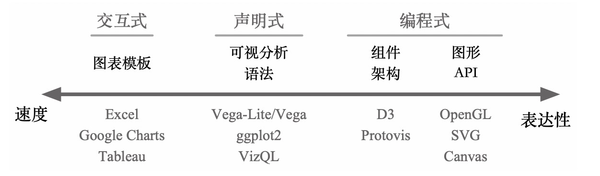
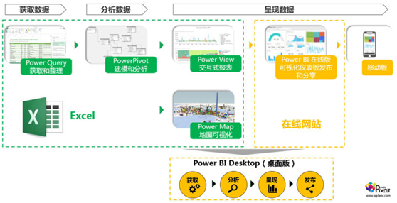
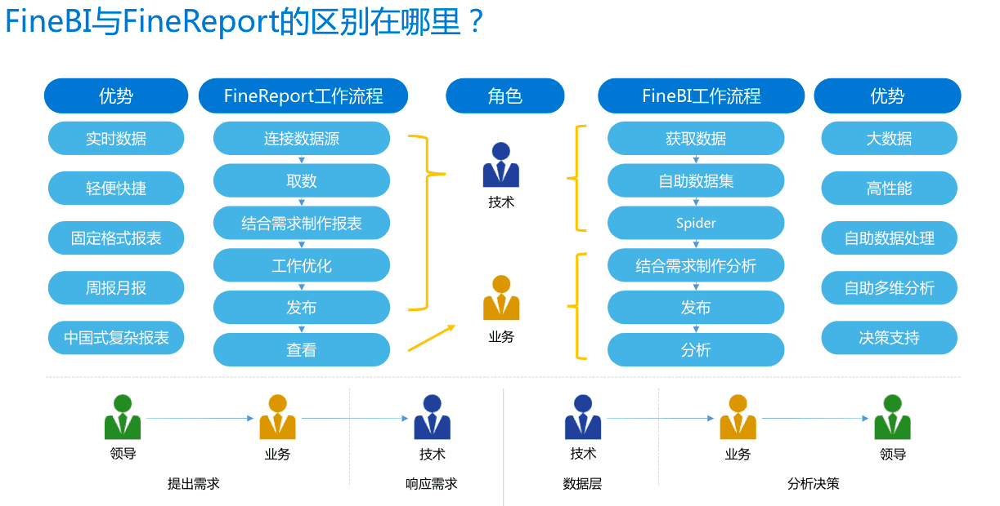
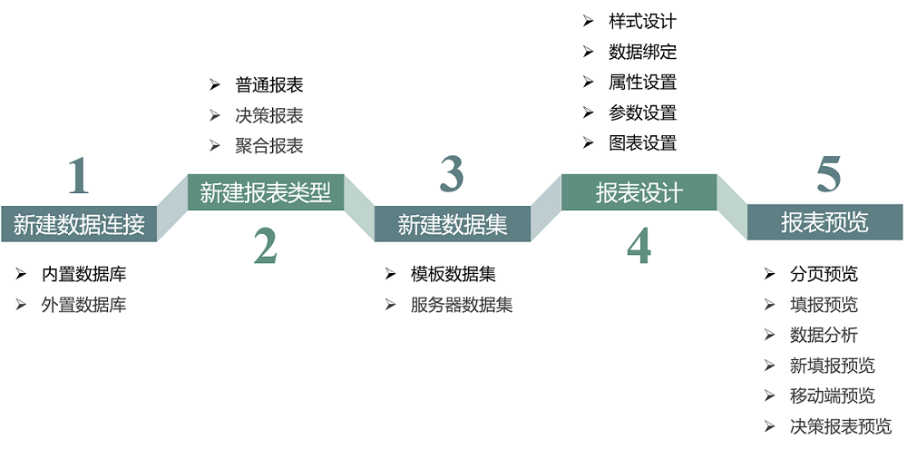
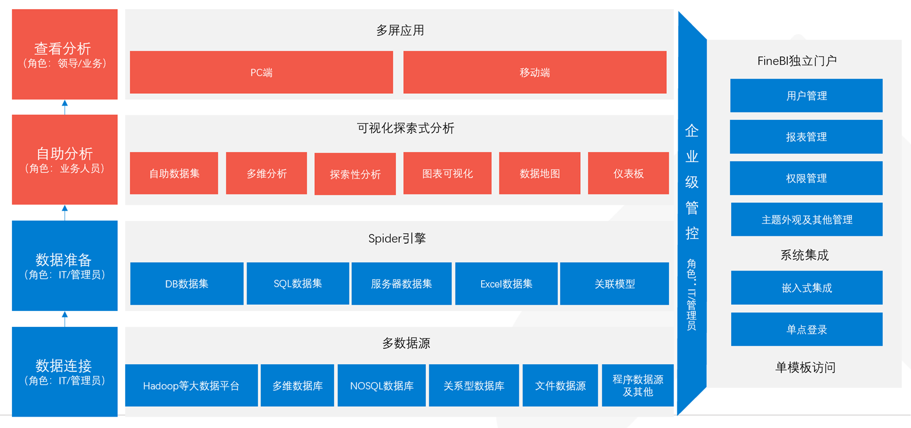

| 序号 | 修改时间   | 修改内容                                             | 修改人 | 审稿人 |
| ---- | ---------- | ---------------------------------------------------- | ------ | ------ |
| 1    | 2021-11-29 | 创建。从《数据可视化》、《BI专题》迁移相关章节成文。 | Keefe  |        |
|      |            |                                                      |        |        |


---

[TOC]


---

# 1 简述

在大数据时代，数据可视化工具必须具有以下特性：

(1)实时性：数据可视化工具必须适应大数据时代数据量的爆炸式增长需求，必须快速的收集分析数据、并对数据信息进行实时更新;

(2)简单操作：数据可视化工具满足快速开发、易于操作的特性，能满足互联网时代信息多变的特点;

(3)更丰富的展现：数据可视化工具需具有更丰富的展现方式，能充分满足数据展现的多维度要求;

(4)多种数据集成支持方式：数据的来源不仅仅局限于数据库，数据可视化工具将支持团队协作数据、数据仓库、文本等多种方式，并能够通过互联网进行展现。

表格  数据可视化工具列表

| 工具             | 简介                                                         | 备注                   |
| ---------------- | ------------------------------------------------------------ | ---------------------- |
| Excel            | 是快速分析数据的理想工具，也能创建供内部使用的数据图，但是Excel在颜色、线条和样式上课选择的范围有限，这也意味着用Excel很难制作出能符合专业出版物和网站需要的数据图。 | 入门级工具             |
| Power BI         |                                                              | 全套的BI解决方案。     |
| Tableau          |                                                              | 专业的报表可视化工具。 |
| Superset         |                                                              | 开源的报表可视化工具。 |
| Google Chart API | Google Chart提供了一种非常完美的方式来可视化数据，提供了大量现成的图标类型，从简单的线图表到复杂的分层树地图等。它还内置了动画和用户交互控制。 |                        |


各种图表库按照表达性和速度的差异主要分为三类：

- 第一类是可视化分析工具（交互式，工具）：如 Tableau、Excel、Google sheets 等，你只需要简单的交互操作，比如选择和拖拽，就能够从预设的图表库中快速创建出图表，但相应地图表的自定义程度会受到较多的限制。
- 第二类是如 OpenGL、Canvas 等绘图引擎提供了一系列 API，可以完全按照你的需要来实现可视化效果，当然细粒度的控制也意味着需要非常精通可视化理论。
- 第三类是框架。介于二者之间，在速度和表达性之前做了权衡，在不同领域都有较好的实现，例如 R 语言的 [ggplot2](https://link.segmentfault.com/?enc=Qd0yxMDnuJ%2F%2F9r1ynvFJHg%3D%3D.ubqS1910sCu7Ac9RUo8ripzSg8iapvaoSyITxoG3hCdajsLZk4q%2FoG679zSOg462)、python 的 [bokeh](https://link.segmentfault.com/?enc=nqQRbe0uhAICQYmFnJkDpw%3D%3D.7U%2BzAIwV6V4yCfZ2AcEYQm8dkxzJR8A3bPt3U8fT0bw%3D)、Tableau 的 [VizQL](https://link.segmentfault.com/?enc=%2FZ4TH23oyQ%2FLkc8ZLaSBHA%3D%3D.rlImZJ78BkMT%2BEVi%2Fzru4bPEJ1UUV1f09w3dXTEvmOvfdTQQcsQ6mNprhZ7sGUA6Vjc%2B2IjBhl7zEbGlZX%2BP2Q%3D%3D)、前端中 canvas 的 [ECharts](https://link.segmentfault.com/?enc=F4PK6iJriqXVo%2FytuLcxCg%3D%3D.LGJe9utTkN15yxY6yZbyhgP8OsHgBDfdqdyHcVRR8T0%3D) 等等。



表格 数据可视化可复用层次分类

| 类别 | 特性                             | 示例                                              |
| ---- | -------------------------------- | ------------------------------------------------- |
| 工具 | 交互式，直接提供图表模板         | 常见的BI自助工具如Tableau、Excel、google sheets等 |
| 库   | 编程式，提供图形API              | 如OpenGL、SVG等                                   |
| 框架 | 编程式 或 声明式，提供组件级框架 | 编程式如D3、ECharts；声明式如Vega等               |


#  2 BI自助分析工具

## 2.1  简介

说明：BI是数据中台的组成部分，是数据可视化产品。下文BI产品特指2017年以后流行的自助分析工具。

2016年起，BI自助分析流行。移动BI也正在兴起。

自助分析工具的基本功能

* 多数据源连接：传统关系数据库Oracle、MySQL、Postgres等，MPP数据库如Druid，大数据如Hive
* 丰富图表类型：一般支持流行的图表类型，30+种
* 交互式分析：通过拖拽式操作，自助生成SQL
* 仪表盘：大屏支持，自助CSS样式。
* 可以共享：单个图表和仪表盘可以共享读。编辑则只有owner才可操作。
* 细粒度的权限管理：用户验证、数据权限细分

自助分析工具的扩展功能：

* 图表钻取：数据的上卷、下钻、旋转、切片等多维分析。
* 交叉过滤：支持多个图表间关联，点击钻取时可以同步变化关联图表。
* 多平台支持：桌面软件、移动端、微信小程序、钉钉
* 系统集成：支持单点登陆等各种方式集成到第三方系统。用到密码场景需要考虑到密码同步问题。
  * 单点登陆：一是前端单点登陆，传输用户名和密码，登陆验证成功后保存<u>返回会话token</u>到cookie（支持ajax/iframe）。二是后端登陆，只需有用户名。
  * SSO登陆：


表格 9 主流BI自助分析工具比较

|          | 细项         | Power  BI                                           | Tableau                                                      | Superset                                                     |
| -------- | ------------ | --------------------------------------------------- | ------------------------------------------------------------ | ------------------------------------------------------------ |
| 简介     | 简介         | 2015年Microsoft推出的商业软件，由MS EXCEL发展而来。 | Tableau成立于2004年。2019年被软件巨头Salesforce以157亿美元收购。 | 2015年[airbnb](https://link.zhihu.com/?target=https%3A//github.com/airbnb/superset/blob/master/CONTRIBUTING.md%23setting-up-a-python-development-environment)推出的开源软件。python开发。 |
| 功能     | 报表访问     | 桌面、网站、移动端                                  | 桌面、网站、移动端                                           | 网站                                                         |
|          | 报表制作     | 桌面                                                | 桌面                                                         | 网站                                                         |
|          | 数据源       | 多文件格式+上百种数据源。                           | 多文件格式+多种数据源                                        | csv文件+近12种数据源                                         |
|          | 图表         | 很多                                                | 很多                                                         | 47种，不断更新中。                                           |
|          | 共享协作     | 支持                                                | 支持                                                         | 不支持共享                                                   |
|          | 数据钻取     | 支持                                                | 支持                                                         | 不支持                                                       |
|          | 多数据源融合 | 支持                                                | 支持                                                         | 不支持                                                       |
| 安全性   | 安全性       | 有专门的权限管理服务器SASS。                        | 有专门的权限管理服务器。                                     | 账号权限管理复杂。                                           |
| 成本     | 商业成本     | 分桌面、专业和白金。桌面版免费。                    | 分桌面和服务器。桌面14天免费试用。                           | 开源免费                                                     |
|          | 二次开发     | 支持第三方插件                                      | 不支持                                                       | 完全支持                                                     |
|          | 学习成本     | Office用户很容易适应。用户文档齐全。                | 用户文档齐全。                                               | 物理表需要手工添加。文档较滞后，社区活跃。                   |
| 特性     | 优点         | 可交互、可钻取。  数据源巨多。与Excel深度嵌入。     | 出现早，用户众多，文档齐全。                                 | 开源免费，版本更新非常快。与Druid深度集成。                  |
|          | 缺点         | 价格不菲。                                          |                                                              | 易用性                                                       |
| 适用场景 |              | 大中小型公司的BI全套解决方案                        | 大中小型公司的数据可视化。                                   | 中小型公司的轻量级数据可视化。                               |

备注：1. 本表更新时间为2018-3。桌面指安装在办公电脑里的软件。

2. BI工具基本功能：获取数据（连接多数据源和ETL）、分析数据（建模和分析）和呈现数据（通过桌面、在线网站或移动端）。


表格 Superset和中国区自助分析工具的功能比较

|              | **模块**      | **功能点**           | **Superset** | **帆软BI** | **永洪BI** | **阿里Quick BI** | **网易有数** |
| ------------ | ------------- | -------------------- | ------------ | ---------- | ---------- | ---------------- | ------------ |
| **标准功能** | **数据源/集** | 多数据源             | √            | √          | √          | √                | √            |
|              |               | 跨源连接             |              | √          |            | √                |              |
|              | **图表**      | 丰富图表类型         | √            | √          | √          | √                | √            |
|              |               | 图表共享             | √            | √          | √          | √                | √            |
|              |               | 图表打印(图片/PDF)   | √            | √          | √          | √                | √            |
|              |               | 数据导入导出(CSV/..) | √            | √          | √          | √                | √            |
|              |               | 数据钻取             |              | √          | √          | √                | √            |
|              | **看板**      | 看板                 | √            | √          | √          | √                | √            |
|              |               | 大屏                 |              | √          | √          | √                |              |
|              |               | 看板交叉过滤（联动） | √            | √          | √          | √                | √            |
|              |               | 看板共享             | √            | √          | √          | √                | √            |
|              | **数据分析**  | 实时分析             | √            | √          | √          | √                | √            |
|              |               | 交互分析             | √            | √          | √          | √                | √            |
|              | **其它**      | 远程设计             | √            | √          | √          | √                | √            |
|              |               | 细粒度权限管理       | √            | √          | √          | √                | √            |
|              |               | 邮件警告和报告       | √            |            |            | √                | √            |
| **扩展功能** | **系统集成**  | 移动端               |              | √          | √          | √                | √            |
|              |               | 微信集成             |              | √          |            |                  |              |
|              |               | 钉钉集成             |              | √          |            | √                |              |
|              |               | 其它系统集成         | √            | √          |            | √                |              |
|              | **数据填报**  | 数据录入             |              | √          | √          | √                | √            |
|              |               | EXCEL导入            |              | √          |            |                  | √            |
|              |               | 数据多次上报         |              | √          |            |                  | √            |
|              | **看板**      | 看板主题自定义       | √            | √          |            | √                |              |
|              | **图表**      | 智能推荐图表         |              | √          |            |                  | √            |
|              | **数据源/集** | 数据源扩展           | √            | √          |            |                  |              |
|              | **其它**      | 自定义SQL            | √            |            |            |                  |              |
|              |               | 行级别安全           | √            |            |            | √                |              |
|              |               | 租户隔离             |              |            |            |                  |              |
| **服务**     | 公共服务      | 开源社区             | √            |            |            |                  |              |
|              |               | 电话客服             |              | √          | √          | √                | √            |
|              | 培训服务      |                      |              | √          | √          | √                | √            |
|              | 远程服务      |                      |              | √          | √          | √                | √            |
|              | 现场支持      |                      |              | √          | √          | √                | √            |
|              | 软件升级      |                      |              | √          | √          | √                | √            |
|              | 功能定制      |                      |              | √          | √          | √                | √            |

备注：本表更新时间截止到2021-10-22。中国区域BI特有功能有数据填报、大屏和中国式报表。


## 2.2  商业BI

### PowerBI


  

图 15 PowerBI组件图

说明：组件详解如下

*  Power Query：负责抓取和整理数据的，它可以抓取几乎市面上所有格式的源数据，然后再按照我们需要的格式整理出来。
*  Power Pivot：负责建模分析。处理数据可达到亿级。
*  Power View: 嵌套在Excel里的交互式图表工具，只用Excel也可以制作高大上的仪表板。
*  Power Map: 嵌套在Excel里的基于地图的可视化工具。
*  Power BI Online Service（在线版）：主要负责仪表板的制作和分享
*  Power BI Mobile（移动版）：iphone、Android、Windows手机上随时查看。
*  Power BI的桌面版– Power BI Desktop：集成了其它组件的主要功能


Power BI分为三个版本，分别是桌面版、专业和白金版。

表格 10 Power BI版本定价策略

| 版本      | Power BI Desktop                                             | Power BI Pro                                                 | Power BI Premium                                             |
| --------- | ------------------------------------------------------------ | ------------------------------------------------------------ | ------------------------------------------------------------ |
| 用途      | 作者                                                         | 共享和协作                                                   | 缩放大型部署                                                 |
| 费用      | free                                                         | $9.99  每用户每月                                            | 容量定价  每节点每月                                         |
| 功能<br/> | 连接数百个[数据源](https://powerbi.microsoft.com/zh-cn/#connect-wrapper)  <br>使用可视化工具清理和准备数据  <br/>使用自定义可视化分析和生成出色的报表 <br/>发布到 Power BI 服务  <br/>嵌入公共网站 | 构建可全方位实时查看业务的仪表板  <br/>自动保持数据最新状态，包括本地源  <br/>针对共享数据进行协作  <br/>审核和管理数据的访问和使用方式  <br/>通过应用将内容打包并分发给用户 | 获取分配、缩放和控制的专用容量  <br/>分发和[嵌入内容](https://powerbi.microsoft.com/zh-cn/power-bi-embedded/)，而无需购买每用户许可证  <br/>使用 Power BI 报表服务器在本地发布报表  <br/>针对 Pro 用户提供更多容量并降低限制 |


### Tableau

Tableau是一家在西雅图起家，为企业解决BI需求的公司，2015年进军中国，并在2019年被软件巨头Salesforce以157亿美元收购，成为Salesforce历史上最大的一笔收购案。2022年11.17宣布，2022年1月31日起终止与中国大陆的现有合作伙伴关系。


### 帆软

帆软软件有限公司（以下简称“帆软”）成立于2006年，是中国专业的大数据BI和分析平台提供商，专注商业智能和数据分析领域，致力于为全球企业提供一站式商业智能解决方案，目前主要有3款产品：FineReport、FineBI、简道云。

帆软在专业水准、组织规模、服务范围、企业客户数量上均为业内前列，先后获得包括Gartner、IDC、CCID在内的众多专业咨询机构的认可。2018年入选福布斯中国非上市企业潜力榜50强，2018年、2019年、2020年连续入选中国大数据企业50强。

**帆软产品列表** （前三个是主打产品）

* [FineReport](https://www.fanruan.com/finereport)  领先的企业级Web报表工具
* [FineBI](https://www.fanruan.com/finebi)  新一代自助大数据分析的BI工具。可下载服务端部署，购买并发LICENCE。
* [简道云](https://www.jiandaoyun.com/)  零代码轻量级应用搭建平台
* 数知鸟：帆软推出的一款企业级的数据需求管理平台，可以帮助数据团队提升需求协作效率、透明需求处理进度，沉淀需求处理经验。
* [九数云](https://work.jiushuyun.com/)：帆软纯WEB端的工具，相当于FineBI平台版。但功能弱化很多，支持图表类型只有9种，数据量级在百万级内。
* FineTube 帆软推出的一款低代码/高时效的企业级一站式数据集成产品。


FineBI 和 FineReport 作为两种分析工具，最终的结果可以放在一个信息门户上「数据决策系统、移动门户」。

**联系**

* FineReport 中的所有数据源都可以通过 [服务器数据集](http://help.finebi.com/doc-view-253.html) 在 FineBI 中进行读取和使用。
* FineReport 制作的所有报表页面都可以挂载在 FineBI 中进行查看和使用。详情参见：[如何在 FineBI 中发布 FineReport 模板](http://help.finebi.com/doc-view-526.html) 。
* FineBI 和 FineReport 产品支持融合部署，所有功能都可以整合在同一个工程中进行使用「推荐 FineReport 整合到 FineBI 」，详情参见：[FineReport 集成到 FineBI](http://help.finebi.com/doc-view-67.html) 。同时移动端也可以共用一个数据分析 App 。
* [FineBI工程迁移- FineBI帮助文档 FineBI帮助文档 (fanruan.com)](https://help.fanruan.com/finebi/doc-view-68.html)

**区别**： 如下表和图所示：

| **类型** | **FineBI**                                                   | **FineReport**                                               |
| -------- | ------------------------------------------------------------ | ------------------------------------------------------------ |
| 数据引擎 | 提供 [实时数据](http://help.finebi.com/doc-view-85.html) 与抽取数据两种方式的 Spider 计算引擎，用户可以根据数据量、实时性要求、使用频次等自由选择 | 直连数据库，性能方面需要数据库的支撑                         |
| 支持范围 | 提供自助式的 OLAP 多维数据分析模式                           | 支持灵活定制各种中国式复杂报表                               |
| 面向对象 | 主要面向业务人员，业务人员可以自己设计仪表板进行分析，自主分析得出结果，辅助企业业务决策 | 可以用来出固定格式的周报、月报、适合作为正式汇报材料         |
| 使用目的 | 关注长期的战略决策，更着重于商业趋势和业务单元的联系而非具体的数据和精确度本身 | 着重于短期的运作支持                                         |
| 工具类型 | 商业智能工具：侧重于数据分析，改变之前传统做表的方式，交互性更好，性能更加强大 | 报表工具：报表是企业信息化必不可少统计分析工具，主要实现一些企业固定的月报、季报、关键数据的统计分析 |
| 目的     | 旨在将企业中现有的数据转化为知识，帮助企业做出明智的业务经营决策 | 旨在统计或者告诉决策者：过去发生了什么，什么正在发生         |




#### **FineReport**

FineReport是C/S 架构的纯JAVA 软件。客户端设计、服务端发布，这种模式将报表设计员、报表用户和报表管理员自然分离。

客户端包括一个本地tomcat数据决策服务器和报表模板设计器；服务端只是一个单纯的tomcat数据决策服务器。

安装客户端后，本地服务端访问路径：http://localhost:8075/webroot/decision/

报表预览会访问本地服务端，路径示例：http://localhost:8075/webroot/decision/view/report?viewlet=wjl/sales.cpt

FineReport可用来作复杂中国式报表，大屏。对于大屏，有专门的模板、动态效果（包括轮播、滚动和闪烁动画）。


示例第一张报表  [第一张报表- FineReport帮助文档 - 全面的报表使用教程和学习资料 (fanruan.com)](https://help.fanruan.com/finereport/doc-view-72.html)

图 帆软报表设计流程图



说明：

* 数据连接：指报表元数据连接。**内置数据库**是本地数据库HSQL，用户初学者可以使用这个。**外置数据库**一般用在正式场合，可以在初次连接时选择；也可以在登陆网页端后切换，菜单路径： ` 管理系统 - 系统管理 - 常规 - 常规参数 - 外接数据库`。FineBI也是类似配置。**注意**：如果网页上切换外接数据库会清空原数据库（<u>最好选择带迁移功能的版本，可以迁移现有数据到新数据库。对于集群功能共用外接数据库需要另外设置</u>）。

* 报表类型：三种类型。普通和聚合报表都是cpt格式（帆软最早支持的格式）；决策报表是frm格式，表单报表，对移动端自适应和联动有更好的效果。

* 数据集：二种。模板数据集只适用于当前模板，已经有个缺省数据集FRDemo，是DEMO报表用的。服务器数据集对所有设计节点都适用，服务器数据集需报表管理员在决策系统上设置。数据集内可以携带参数。PG数据库示例如下

  ```sql
  # 字段名如果是大小写敏感如pg/oracle，那么将字段名用双引号圈起来，双引号圈起来表示是字段名；字段值是字符串则要用单引号圈起来。
  # 控件参数：sdt和product2是控件名称，判断控件值是否存在，存在生成 and语句。
  # cc是字符串参数。
  select *  from public.dws_wjl_model14_1
   where 1=1
    ${if(len(sdt) == 0,"","and \"Sale Date Time\" = '" + sdt + "'")}
    ${if(len(product2) == 0,"","and product = '" + product2 + "'")}
    and "Client City" = `${cc}`
   limit 3000
  ```

* 报表设计：包括样式设计、数据绑定、属性设置、参数设置和图表设置。报表设计栏一般有二块，参数面板和表格。

  * 数据绑定：可以指定单元格里的数据来源于单元格内容（计算类）、数据库表（需要远程连接数据集）。
  * 属性设置：可以设置条件属性（如分页，形态等）
  * 参数设置：是参数面板的设置项。参数面板可以放置各种控件，控件值来源有数据库表，SQL查询，自定义，公式等。
  * 图表设置：表格栏里可以插入图表。可以设置图表的样式，图例等。

* 报表预览：

  * 分页预览：此处分页只是对超过页面设置大小的内容（针对的是数据内容长度）进行自动分页，主要设置项在 `菜单 - 页面设置。`

  * 填报预览：

* 报表发布：将报表文件从本地路径中取出发给报表管理员。报表管理员先将文件上传到数据决策系统服务器相应路径下。再在数据决策系统的目录管理页面上创建相应目录、上传模板，然后设置相应权限即可访问。

  * 本地报表文件路径 `$FINEREPORT_HOME\webapps\webroot\WEB-INF\reportlets\`
  * 报表预览文件路径 `$FINEREPORT_HOME\webapps\webroot\WEB-INF\assets\vcs\history\`
  * 报表用的数据集连接 也要在数据决策服务器上添加一模一样的。


#### **FineBI**

FineBI 让业务人员/数据分析师自主制作仪表板，进行探索分析。数据取于业务，用于业务，让需要分析数据的人，可以自己处理分析数据。

FineBI 是B/S 架构的纯JAVA 软件。

安装后，访问路径：http://localhost:37799/webroot/decision/

演示DEMO：

* [销售管理方案](http://secure.finedevelop.com:33080/webroot/decision) 财务 人力资源 http://secure.finedevelop.com:33080/webroot/decision  1/1
* [试用人事系统](http://121.37.182.66:8080/webroot/decision)   账号：20150706001  密码：123456




图 FineBI 的体系结构

说明：

* 数据连接：支持多数据源类型。注意PG的数据源粒度是数据库+schema。
* 数据准备：可以通过导入外部数据来生成数据(集)列表，数据分为实时数据和抽取数据。在创建业务包后可以使用各种数据来源导入表生成数据集。
  * 实时：使用direct直连引擎，可以直连数据库，不额外加工数据。
  * 抽取：默认使用spider引擎，会加工外部数据，生成加速数仓（类似Kylin，会数据类型自动识别，维度建模）。这个过程耗费时间跟数据量大小直接相关。
  * 自助数据集：只能使用EXCEL表和（别人的）自助数据集，可以对数据进行简单ETL如：字段类型转化、去除空行、值填充和添加计算列等。
  * 明细表：对于大数据量可以用实时数据集的分页方式获取；但如果要有维度字段下拉过滤框，则建议建维度宽表，用抽取方式得到下拉框值。
* 自助分析：图表可以复用到其它仪表板。
* 查看分析：


**linux安装部署**

```shell
# 说明：安装目录为/opt，安装后路径为 /opt/FineBI5.1/
cd /opt

# 下载 finebi
wget 'https://fine-build.oss-cn-shanghai.aliyuncs.com/finebi/5.1.3/stable/exe/spider/linux_unix_FineBI5_1-CN.sh'

# 执行安装，所有都选择Y 或回车键确认。安装路径要注意，非root要安装在自己HOME目录下，否则启动时容易出错
./linux_unix_FineBI5_1-CN.sh

# (不可用，需登陆后下载)下载DB驱动包，示例 Pivotal Greenplum Database数据连接 https://help.fanruan.com/finebi/doc-view-289.html
# 复制DB插件到 %FineBI%\webapps\webroot\WEB-INF\lib
wget 'https://help.fanruan.com/finebi/doc-download-/finebi/uploads/file/20210203/postgresql-42.1.4.jar'
wget 'https://help.fanruan.com/finebi/doc-download-/finebi/uploads/file/20210203/greenplum%20(1).jar' -o greenplum.jar
cp *.jar /opt/FineBI5.1/webapps/webroot/WEB-INF/lib/

# 启动
/opt/FineBI5.1/bin/finebi
# 如果重启，则杀finebi相应进程，再启动。更新DB驱动包后，需重启服务。
ps -ef | grep "finebi" | grep -v "grep" | awk '{print $2}' | xargs -I {} kill -9 {}
```

**FineBI免费版限制**：没有限制使用期限、功能；只限制2个IP并发（一个浏览器连接的IP算一个并发，除非浏览器关闭所有相关TAB才算释放这个IP）。


### 永洪BI

北京永洪商智科技有限公司（简称永洪科技）成立于2012年，致力于为全球企业提供大数据技术产品及服务，依托自主知识产权的一站式大数据平台形成完善的产品及服务体系，具备从数据应用方案咨询、数据治理、数据仓库建设、数据可视化分析、数据深度应用到数据平台实施运维服务的端到端大数据价值服务能力，连续五年获得中国敏捷BI第一名。

**产品**

* Z-Suite  企业级BI平台
* X-Suite  部门级BI平台

仪表盘DEMO： http://public.yonghongtech.com/bi/?au_act=login&adminv=demo&passv=Yonghong123


### 其它厂商

**观远数据**

**观远数据**隶属于[杭州观远数据有限公司](https://baike.baidu.com/item/杭州观远数据有限公司/24546722)，成立于2016年，致力于为泛零售、消费、互联网以及通用领域客户提供一站式智能数据分析与决策（AI+BI）解决方案，并提出一整套从敏捷分析（BI）到智能决策（AI）的完整“5A”落地路径方法论（Agile敏捷化、Accurate场景化、Automated自动化、Augmented增强化、Actionable行动化），为企业构建智能决策大脑，大力推进从传统BI到智能决策的成功转型。


## 2.3 开源BI

表格 开源BI工具比较

| 工具      | Superset                                   | Redash                                                       | **Metabase**                                                 | Davinci.达芬奇                                               | DataEase                                              |
| --------- | ------------------------------------------ | ------------------------------------------------------------ | ------------------------------------------------------------ | ------------------------------------------------------------ | ----------------------------------------------------- |
| 简介<br>  | Airbnb 开源的数据探索与可视化平台。        | 可协作数据可视化和仪表板平台，旨在使用更简单的方式（SQL）进行数据可视化。<br>2020.6被Spark母公司Databricks收购。 | metabase更注重非技术人员的使用体验。                         | DVAAS平台解决方案。<br>由中国宜信数据团队开源。              | 国产飞致云开源。<BR>[demo](https://demo.dataease.io/) |
| 官网      | https://superset.apache.org/               | https://blog.redash.io/ <br>https://www.dazdata.com/ redash中文版 | https://www.metabase.com/                                    |                                                              | https://dataease.io/                                  |
| 源码      | https://github.com/apache/superset         | https://github.com/getredash/redash                          | https://github.com/metabase/metabase                         | https://github.com/edp963/davinci                            | https://github.com/dataease/dataease                  |
| 文档      | https://superset.apache.org/docs/intro     | [https://redash.io/help/<br>Readme](https://github.com/getredash/redash#readme) | [Readme](https://github.com/metabase/metabase#readme)        | [文档](https://edp963.github.io/davinci/docs/zh/1.1-deployment) | https://dataease.io/docs/                             |
| Star      | 41k                                        | 20.1k                                                        | 26.3k                                                        | 3.9k                                                         | 3.6k                                                  |
| Fork      | 8k                                         | 3.5k                                                         | 3.6k                                                         | 1.6k                                                         | 533                                                   |
| 首版时间  | 2015-09-05                                 | 2014-2-25                                                    | v0.9 2015-1-24                                               | 2018-9-11                                                    | 2021-1-24                                             |
| 最新版本  | 1.3.0                                      | 10.1.0                                                       | 0.41.1                                                       | 0.3.0                                                        | 1.3.0                                                 |
| release数 | 49                                         | 97                                                           | 220                                                          | 13                                                           | 14                                                    |
| License   | Apache-2.0                                 | BSD-2                                                        | [AGPL + 商业协议](https://github.com/metabase/metabase/blob/master/LICENSE.txt) | Apache-2.0                                                   | GPL-2                                                 |
| 语言框架  | python+flask-appbuilder+React              | python+flask+React                                           | Java+Clojure+JS                                              | Java+Ts                                                      | Java SpringBoot+Vue+Echarts                           |
| 优势      | 功能较全面，社区活跃，更新快               | 区分商业版和开源版。针对中国市场有推出定制化的中文版和大屏。有提供商业版演示系统。中文文档非常齐全。 |                                                              |                                                              | 功能简洁，有提供体验DEMO                              |
| 劣势      | 权限控制复杂，权限项太多。可用性还需提升。 | 不支持直接部署到windows                                      |                                                              |                                                              |                                                       |

> 备注：本表统计时间截止到2021-11-24。release数指大版本发布数量，这个指标只是作为更新活跃度的一个参考。
>
> DVAAS：Data Visualization as a Service。


### Superset

详见另文《[superset二次开发](../../平台与编程语言/源码剖析/superset二次开发.md)》、《[superset源码剖析](../../平台与编程语言/源码剖析/superset源码剖析.md)》


### Redash

详见另文《[redash源码剖析](../../平台与编程语言/源码剖析/redash源码剖析.md)》

* [Dazdata BI | Redash中文版](https://www.dazdata.com/)   https://www.dazdata.com/
* 商业版演示系统  [点击进入](https://portal.dazdata.com/default/?portal_menu=hy&portal_style=drawer&colorstyle_mode=dark&show_portal=true&portal_hide=false)


Redash 可协作数据可视化和仪表板平台，旨在使用更简单的方式（SQL）进行数据可视化。2020.6被Spark母公司Databricks收购。

[Redash](https://redash.io/)是受欢迎的开源实时数据可视化和商业智能(BI)软件，基于新一代云计算和数据分析技术，响应式B/S架构、操作简单、自助使用、会写SQL就会定义报表、队列技术运行快捷、扩展性强、拥有成本低；广泛应用于企事业单位、政府机关等需要数据驱动、数据决策、数字化和数智化建设等领域。

表格 redash开源版和商业版差别

|            | 开源版                                                       | 商业版 Dazdata BI                                       |
| ---------- | ------------------------------------------------------------ | ------------------------------------------------------- |
| 查询       | 多数据源 + 可视化 + 查询结果定时刷新最快30秒 + 数据导出 + 筛选过滤 | 查询结果定时刷新最快5秒                                 |
| 部件       | 简单文档                                                     | 支持markdown部件 + 弹窗报表 + 多视图 + 部件功能控制     |
| 容器       |                                                              | 容器报表                                                |
| 分享       | 报表无自动刷新 + 不支持带文本参数共享                        | 报表自动刷新最快5秒 + 带任意参数共享 + 报表共享安全设置 |
| 视图       |                                                              | 线形图平滑 + markdown视图 + 自定义视图                  |
| 数据源     | 100+                                                         | ✔                                                       |
| 可视化类型 | 100+                                                         | 1000+                                                   |
| 钻取联动   | ✔                                                            | ✔                                                       |
| 移动端     |                                                              | ✔                                                       |

免费开源中文版

- 支持100种以上数据源，数据资产轻松集成，支持查询结果集再运算。
- 响应式React技术，多屏自适应，一处开发，多设备使用。
- 分析型缓存机制，数据随时就绪，无需等待报表随时可用。
- RQ队列技术，支持工业互联网数据秒级刷新。

商业版Dazdata BI

- 集成Markdown、ECharts、Plotly.js、Three.js、Video.js的1000+可视化类型、html5、3d动画和视频流。
- 视图组合技术，可实现画中画等特效，充分利用屏幕每一个像素。
- 支持钻取、联动、筛选、跳转、弹窗、切换等丰富的交互操作。
- 可开发能力强，前端自定义js代码和三方库，后端自定义python代码，BI不设限。

达之云屏

- 达之云屏拒绝模板化，创作式大屏与众不同，尽情发挥您的创意。
- 不再止于炫动画的电视屏，交互展现数据价值，辅助决策。
- 大屏高于海报，强大的技术支撑,拒绝不能快速实时刷新的海报屏。
- 支持一键切换风格样式，满足不同场景需求。


**Redash中文商业版**

Redash中文商业版，可视化报表云平台，能链接100+数据源和超过100种专业可视化图形，操作简便，报表开发效率高，懂基础的数据库操作就可以开发可视化报表。开发成果运行于pc端、手机端和数据大屏，并可以以嵌入方式集成至其他应用系统。


Excel文件数据源、markdown集成、报表门户和自定义风格、开发者模式（低代码开发平台）、部件交互控制、用户管理方式、枚举和树型选择、中国地理行政区划图、管理控制台风格。

新一代云应用平台，多级分离式技术架构，秒级刷新频率真正做到适时数据可视化。视图种类最全，全面集成markdown，低代码开发平台的开发者模式充分释放最强可视化库plotly.js的全部潜能，全面支持ECharts所有视图特性。


#### 安装部署

* 安装部署： [安装方式5：CENTOS8本地安装REDASH中文版 · Dazdata](https://www.dazdata.com/docs/install/5.html)
* 访问：http://localhost:5000

安装部署注意事项：

```python
# secret创建，参见 https://redash.io/help/open-source/admin-guide/secrets
$ python -c 'import secrets; print(secrets.token_hex())'
'192b9bdd22ab9ed4d12e236c78afcb9a393ec15f71bbf5dc987d54727823bcbf'
$ export REDASH_SECRET_KEY=192b9bdd22ab9ed4d12e236c78afcb9a393ec15f71bbf5dc987d54727823bcbf

# pystache安装，要求pystache>=0.5.4
$ pip install -U pystache -f https://github.com/PennyDreadfulMTG/pystache/releases/

# 需要安装 redis, postgresql

```


### Metabase

**安装**

```shell
# 先下载软件
$ wget 'https://downloads.metabase.com/v0.41.1/metabase.jar'

# 运行
$ java -jar metabase.jar
```

浏览器访问： http://localhost:3000/


## 2.4  其它工具

### Pentaho BI

[Pentaho BI](http://www.pentaho.com/)平台不同于传统的BI 产品，它是一个以流程为中心的，面向解决方案（Solution）的框架。其目的在于将一系列企业级BI产品、开源软件、API等等组件集成起来，方便商务智能应用的开发。它的出现，使得一系列的面向商务智能的独立产品如Jfree、Quartz等等，能够集成在一起，构成一项项复杂的、完整的商务智能解决方案。

Pentaho BI 平台，Pentaho Open BI 套件的核心架构和基础，是以流程为中心的，因为其中枢控制器是一个工作流引擎。工作流引擎使用流程定义来定义在BI 平台上执行的商业智能流程。流程可以很容易的被定制，也可以添加新的流程。BI 平台包含组件和报表，用以分析这些流程的性能。目前，Pentaho的主要组成元素包括报表生成、分析、数据挖掘和工作流管理等等。这些组件通过 J2EE、WebService、SOAP、HTTP、Java、JavaScript、Portals等技术集成到Pentaho平台中来。Pentaho的发行，主要以Pentaho SDK的形式进行。

Pentaho SDK共包含五个部分：Pentaho平台、Pentaho示例数据库、可独立运行的Pentaho平台、Pentaho解决方案示例和一个预先配制好的 Pentaho网络服务器。其中Pentaho平台是Pentaho平台最主要的部分，囊括了Pentaho平台源代码的主体；Pentaho数据库为 Pentaho平台的正常运行提供的数据服务，包括配置信息、Solution相关的信息等等，对于Pentaho平台来说它不是必须的，通过配置是可以用其它数据库服务取代的；可独立运行的Pentaho平台是Pentaho平台的独立运行模式的示例，它演示了如何使Pentaho平台在没有应用服务器支持的情况下独立运行；Pentaho解决方案示例是一个Eclipse工程，用来演示如何为Pentaho平台开发相关的商业智能解决方案。
Pentaho BI 平台构建于服务器，引擎和组件的基础之上。这些提供了系统的J2EE 服务器，安全，portal，工作流，规则引擎，图表，协作，内容管理，数据集成，分析和建模功能。这些组件的大部分是基于标准的，可使用其他产品替换之。

Pentaho是一个以工作流为核心的、强调面向解决方案而非工具组件的BI套件，整合了多个开源项目，目标是和商业BI相抗衡。它包括：
（1）工作流引擎：Shark and JaWE
（2）数据库：Firebird RDBMS
（3）集成管理和开发环境：Eclipse
（4）报表工具：Eclipse BIRT
（5）ETL工具：Enhydra/**Kettle**
（6）OLAP Server：Mondrian
（7）OLAP展示：JPivot
（8）数据挖掘组件：Weka
（9） 应用服务器和Portal服务器：JBoss
（10）单点登陆服务及LDap认证：JOSSO


docker部署： `docker run -p 8080:8080 wmarinho/pentaho                                                         ` （镜像2.46GB）

浏览器登陆： http://localhost:8080/      admin/password


## 本章参考

* 2021年五大开源数据可视化BI方案对比  https://cloud.tencent.com/developer/article/1882014
* 这家IT千亿巨头正式宣布退出中国区业务！国产化替代必是大势所趋 www.qiyexinxi.net/cms_news/232850.html


#  3 可视化框架/库

表格 可视化前端框架

| 框架名称                                                     | 主要贡献              | 协议       | 源码 (github)                                                | 文档                                                         | 最新版本 | 简介                                                         | 备注                                                         |
| ------------------------------------------------------------ | --------------------- | ---------- | ------------------------------------------------------------ | ------------------------------------------------------------ | -------- | ------------------------------------------------------------ | ------------------------------------------------------------ |
| [ECharts](https://echarts.apache.org/)                       | 百度                  | Apache-2.0 | [apache/echarts](https://github.com/apache/echarts)          | https://echarts.apache.org/zh/index.html                     | 5.2.1    | 缩写来自Enterprise Charts，由百度开源，2021年捐献给ASF。商业级数据图表，一个纯JavaScript的图表库。 | [Readme](https://github.com/apache/echarts#readme)           |
| [D3.js](https://d3js.org/)                                   |                       | ISC        | [d3/d3](https://github.com/d3/d3)                            | [Documentation](https://github.com/d3/d3/wiki) [中文](https://d3js.org.cn/) | 7.1.1    | 全称是Data-Driven Documents，JavaScript数据可视化库，使用 HTML、SVG 和 Canvas 技术展现数据。<br>基于D3的实现库有NVD3、metrics-graphics、C3和Plotly.js。 | [Readme](https://github.com/d3/d3#readme)                    |
| [Chart.js](https://www.chartjs.org/)                         |                       | MIT        | [chartjs/Chart.js](https://github.com/chartjs/Chart.js)      | [docs](https://www.chartjs.org/docs)                         | 3.5.1    | 开源的HTML5图表工具。Chart.js 是为设计和开发人员准备的简单、灵活的 JavaScript 图表工具。 | [Readme](https://github.com/chartjs/Chart.js#readme)         |
| [highcharts](https://www.highcharts.com/)                    | Highsoft              | 非商用免费 | https://code.highcharts.com/                                 |                                                              | 9.2.2    | 纯 Javascript 类库，开源，非商业使用免费。                   |                                                              |
| [MapBox](https://www.mapbox.com/)                            |                       | 商用       |                                                              | https://docs.mapbox.com/                                     |          | 致力于打造全球最漂亮的个性化地图。Mapbox地图数据来源于Open Street Map（OSM）等其他地图数据供应商。 |                                                              |
| [deck.gl](https://deck.gl/)                                  | Uber                  | MIT        | [visgl/deck.gl](https://github.com/visgl/deck.gl)            |                                                              | 8.5.10   | Uber 开源的基于 WebGL 的可视化图层。<br>WebGL2 powered visualization framework. | [Readme](https://github.com/visgl/deck.gl#readme)            |
| [antv](https://antv.vision/)                                 | 蚂蚁集团              | MIT        | [antvis/L7](https://github.com/antvis/L7)                    |                                                              | 2.0.0    | 蚂蚁集团全新一代数据可视化解决方案。[G2](https://github.com/antvis/g2) 是一套基于可视化编码的图形语法，是蚂蚁金服数据可视化解决方案 [AntV](https://antv.alipay.com/zh-cn/index.html)的重要组成部分。 | [Readme](https://github.com/antvis/L7#readme)                |
| [Plotly.js](https://plotly.com/javascript/) (D3)             |                       | MIT        | [plotly/plotly.js](https://github.com/plotly/plotly.js)      |                                                              | 2.8.0    | Built on top of [d3.js](https://d3js.org/) and [stack.gl](https://github.com/stackgl), 支持40+图表，美观易用。对很多编程语言提供接口。 | [Readme ](https://github.com/plotly/plotly.js#readme)        |
| [metrics-graphics](https://github.com/mozilla/metrics-graphics) (D3) |                       |            | [metricsgraphics/metrics-graphics](https://github.com/metricsgraphics/metrics-graphics) | [metricsgraphicsjs.org](http://metricsgraphicsjs.org/)       | 2.11     | 建立在D3之上的可视化库, 针对可视化和布置时间序列数据进行了优化，更简洁和拥有更规范的数据图表布局优化算法的库。 | [Readme](https://github.com/metricsgraphics/metrics-graphics#readme) |
| [Vega](https://vega.github.io/vega/) (D3)                    | 华盛顿大学 IDL 实验室 | BSD-3      | [vega/vega](https://github.com/vega/vega )                   | https://vega.github.io/vega/docs/                            | 5.21.0   | 基于D3实现的声明式可视化语法框架，目标是做数据可视化的配置语法。其语法格式是 JSON，渲染引擎是 D3，用户可以自由使用 Vega 语法进行组合构建出各种各样的图表。 | [Readme](https://github.com/vega/vega#readme)                |

> 备注：最新版本截止时间是2021-10。


表格 其它语言可视化框架/库

| 框架名称                                | 语言    | 贡献者 | 协议  | 源码 (github)                                                | 文档                                                       | 最新版本 | 简介                                                         |
| --------------------------------------- | ------- | ------ | ----- | ------------------------------------------------------------ | ---------------------------------------------------------- | -------- | ------------------------------------------------------------ |
| [ggplot2](http://ggplot2.org/)          | R       |        |       |                                                              |                                                            |          | R 语言社区最著名的可视化绘图包，2005年由 [Hadley Wickham](https://en.wikipedia.org/wiki/Hadley_Wickham) 创造。 |
| [Bokeh](https://github.com/bokeh/bokeh) | python  |        | BSD-3 | [bokeh/bokeh](https://github.com/bokeh/bokeh)                | [Readme](https://github.com/bokeh/bokeh#readme) | 3.0 | 图形语法的实现是基于 Python 的，最终渲染是用 D3 在浏览器上绘图。<br>其优势是可以借由 Python 获得大规模数据的处理能力，但也因为同时具备两个端（BS 架构），所以嵌入其他系统的成本相对较大。 |
| [seaborn](https://seaborn.pydata.org)  | python  |        | BSD-3 | [mwaskom/seaborn](https://github.com/mwaskom/seaborn)        | [tutorial.html](https://seaborn.pydata.org/tutorial.html)  | 0.11.2   | 统计数据可视化。依赖于matplotlib和pandas。                   |
| [matplotlib](https://matplotlib.org)    | python  |        | PSF   | [matplotlib/matplotlib](https://github.com/matplotlib/matplotlib) | [Documentation ](https://matplotlib.org/stable/index.html) | 3.5.1    | 图形包，高度定制化，可用来画各种图形。依赖于pillow。         |
| [Pillow](https://python-pillow.org)     | python  |        | HPND  | [python-pillow/Pillow](https://github.com/python-pillow/Pillow) | https://pillow.readthedocs.io/                             | 8.4.0    | Pillow在PIL基础上，兼容了python 3。<br>PIL~python图形库，用于python 2.7。 |
| opencv                                  | c/R/... |        |       |                                                              |                                                            |          |                                                              |

> 备注：最新版本截止时间2021-12。


## D3/NVD3

D3 的全称是（Data-Driven Documents），顾名思义可以知道是一个**被数据驱动的文档**。听名字有点抽象，说简单一点，其实就是一个 JavaScript 的函数库，使用它主要是用来做数据可视化的。

引用D3

```js
<script src="http://d3js.org/d3.v3.min.js"
charset="utf-8"></script>
```

NVD3是基于D3的实现。


## Echarts

http://echarts.baidu.com/echarts2/doc/doc.html

ECharts，缩写来自Enterprise Charts，由百度开源。商业级数据图表，一个纯JavaScript的图表库，可以流畅的运行在PC和移动设备上，兼容当前绝大部分浏览器（IE6/7/8/9/10/11，chrome，firefox，Safari等），底层依赖轻量级的Canvas类库[ZRender](http://ecomfe.github.io/zrender/)，提供直观，生动，可交互，可高度个性化定制的数据可视化图表。创新的拖拽重计算、数据视图、值域漫游等特性大大增强了用户体验，赋予了用户对数据进行挖掘、整合的能力。

支持折线图（区域图）、柱状图（条状图）、散点图（气泡图）、K线图、饼图（环形图）、雷达图（填充雷达图）、和弦图、力导向布局图、地图、仪表盘、漏斗图、事件河流图等12类图表，同时提供标题，详情气泡、图例、值域、数据区域、时间轴、工具箱等7个可交互组件，支持多图表、组件的联动和混搭展现。

 


## deck.gl

github: https://github.com/uber/deck.gl

官网:  https://deck.gl/

demo: https://deck.gl/#/examples/

deck.gl，是由 Uber 开源的基于 WebGL 的可视化图层。用于React 的 WebGL 遮罩套件，提供了一组高性能的数据可视化叠加层。为数据可视化用例提供测试、高性能的图层，如 2 维和 3维的散点图、choropleths 等。


## Mapbox

[MapBox](https://www.mapbox.com/)致力于打造全球最漂亮的个性化地图。Mapbox地图数据来源于Open Street Map（OSM）等其他地图数据供应商，和Google Map、Apple Map等地图厂商的地图数据来源差不多。


## 本章参考


# 参考资料

**配色工具**

配色获取1：https://colordrop.io/

配色获取2：https://colorhunt.co/

中国风配色：http://zhongguose.com/

渐变色获取1：[https://uigradients.com/](https://uigradients.com/#Mantle)

渐变色获取2：https://webkul.github.io/coolhue/


**素材资源网站**

帆软官方组件库：https://market.fanruan.com/reuse

大屏素材图片集合：https://help.fanruan.com/dvg/doc-view-68.html

阿里巴巴图标库：https://www.iconfont.cn/（大量免费图标，可供模板制作使用）


## BI产品官网

* superset官网 https://superset.incubator.apache.org
* Redash  https://www.redash.io/
* [Dazdata BI | Redash中文版](https://www.dazdata.com/)   https://www.dazdata.com/
* Metabase  https://www.metabase.com/
* 帆软BI  https://help.fanruan.com/finebi/
* 永洪BI  https://www.yonghongtech.com/
* 阿里Quick BI  [Quick BI官网_BI数据可视化分析工具_智能报表-阿里云 (aliyun.com)](https://www.aliyun.com/product/bigdata/bi)
* 网易数帆-有数  https://sf.163.com/
* Tableau  https://www.tableau.com/
* PowerBI  [数据可视化 | Microsoft Power BI](https://powerbi.microsoft.com/zh-cn)  https://powerbi.microsoft.com/zh-cn
* Pentaho BI  http://www.pentaho.com/


**BI官网文档**

* 帆软Report 第一张报表 [第一张报表- FineReport帮助文档 - 全面的报表使用教程和学习资料 (fanruan.com)](https://help.fanruan.com/finereport/doc-view-72.html)
* 帆软BI文档 https://help.fanruan.com/finebi
* 帆软-可视化指南  https://help.fanruan.com/dvg/doc-view-128.html
* [FineDB 数据库](https://help.fanruan.com/finebi/doc-view-819.html#)
* 永洪科技-商业智能社区 https://ask.hellobi.com/
* Yonghong 在线帮助 (yonghongtech.com)   https://www.yonghongtech.com/help/Z-Suite/9.3/ch/


## PowerBI 参考资料

**参考链接**

*  关于微软的Power BI介绍？ https://www.zhihu.com/question/21588013
*  Power BI系列课程地址：[从Excel到Power BI数据分析可视化](https://link.zhihu.com/?target=http%3A//study.163.com/series/1001139001.htm)
*  [一张图看懂微软Power BI系列组件](https://link.zhihu.com/?target=http%3A//www.agileex.com/powerpivotworks/2016-5-20/636.html)


1、PowerBI国内学习网站：

[Excel120.com](https://link.zhihu.com/?target=http%3A//www.excel120.com/)（宗萌老师个人博客）

[pbihome.net](https://link.zhihu.com/?target=http%3A//www.pbihome.net)（国内唯一PowerBI交流论坛，论坛刚起步，内容较少，但是相关这方面相关大咖均已入驻，大家学习过程中遇到什么问题都可以发帖交流）

[PowerQuery - 简书](https://link.zhihu.com/?target=http%3A//www.jianshu.com/u/234dbfc62e9d)

[Power BI - 知乎专栏](https://zhuanlan.zhihu.com/leigongzi)

[Power BI 专栏 - 知乎专栏](https://zhuanlan.zhihu.com/PowerBI)

2、PowerBI国外学习网站：

[SQLBI](https://link.zhihu.com/?target=http%3A//www.sqlbi.com/)

[PowerPivotPro - Transforming your Business with Power Pivot and Power BI](https://link.zhihu.com/?target=http%3A//www.powerpivotpro.com/)

[Power Query Archives – The BIccountant](https://link.zhihu.com/?target=http%3A//www.thebiccountant.com/category/power-query/)

[Chris Webb&#x27;s BI Blog](https://link.zhihu.com/?target=https%3A//blog.crossjoin.co.uk)

3、PowerBI公众号推荐：

《Powerpivot工坊》

《PowerBI极客》

《PowerBI大师》

《Excel120》

4、PowerBI学习线路图推荐：《[PBI系列学习框架地图 | Excel120](https://link.zhihu.com/?target=http%3A//www.excel120.com/posts/2016/04/1015.html)》

如果你想下载阅读这些电子书可以直达我们PowerBIhome论坛下载《[点击直达电子书下载](https://link.zhihu.com/?target=http%3A//pbihome.net/forum.php%3Fmod%3Dviewthread%26tid%3D43%26extra%3Dpage%3D1)》


## 参考链接

* 数据可视化图形语法简史  https://my.oschina.net/kener/blog/1620513
