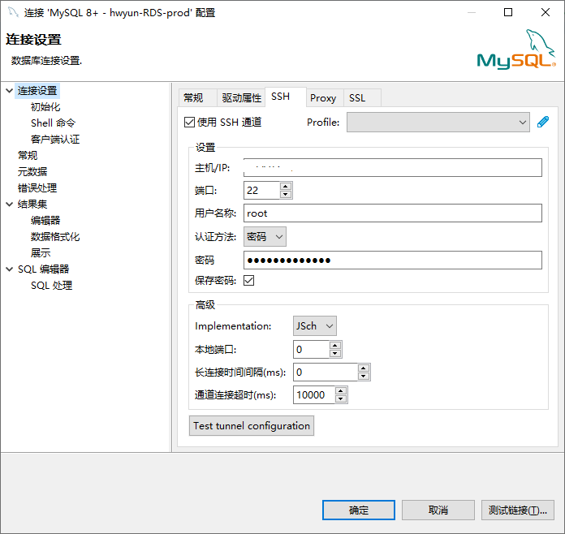
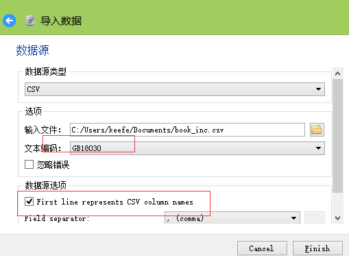
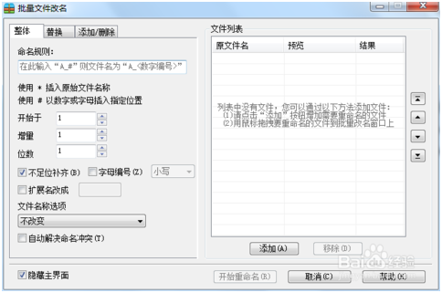

| 序号 | 修改时间   | 修改内容                                                     | 修改人 | 审稿人 |
| ---- | ---------- | ------------------------------------------------------------ | ------ | ------ |
| 1    | 2021-12-22 | 创建。从《个人数据管理》、《项目开发环境工具》相关章节迁移成文。 | Keefe  |        |


<br><br><br>

---


[TOC]


<br>

---


# 1 数据管理工具简介


#  2 数据库工具

## DBEver（开源）

DBEver支持SSH通道，可先登陆SSH通道的堡垒机，再连接到目标数据库。




数据导入导出： 扩展参数`--default-character-set=utf8`

```shell
# 完整SQL命令如下: xxDB为数据库名
# 导出mysqldump
mysqldump.exe --routines --add-drop-table --disable-keys --extended-insert --default-character-set=utf8 -v --host=localhost --port=3306 -u root xxDB.0 > xx.sql

# 导入mysql
mysql.exe --no-beep --default-character-set=utf8 --host=localhost --port=3306 -u root xxDB < xx.sql
```

说明：如果导入导出用的不是同一字符集，导入时可能会报错 `Unknown command \\n`


## SQLite Studio

SQLite是小型方便的嵌入式数据库，无需安装特定服务器，即可方便地管理数据。

SQLite Studio提供SQLite界面的管理，可以很方便地对数据库进行编辑操作。

- 导入：支持CSV格式，可选各种编码，支持中文名称查询。导入的CSV可以建新表，也可将数据插入到已创建表。
- 导出：导出格式支持HTML/PDF/JSON/XML，可导出压缩包。


## SQLite expero

软件：SQLite expero

功能：可导入csv文件到sqlite文件。


SQLite

- 数据亲和类型：TEXT  NUMBERIC  INTERER  REAL  JNULL
- 字符串函数：substr  replace


**CSV格式导入**



- excel导出csv文本：缺省编码为本地编码，ANSI
- sqlite导入csv文本：文本编码要选择正确，中文书名时不建议选择缺省‘系统’，要选择gb18030。


表格 3 CSV导入注意事项

| 数据类型              | 格式                            | 说明                                                         |
| --------------------- | ------------------------------- | ------------------------------------------------------------ |
| datetime 		date | YYYY-MM-DD 		HH:MM:SS.SSS | SQLite 		没有一个单独的用于存储日期和/或时间的存储类，但 		SQLite 		能够把日期和时间存储为 		TEXT、REAL 		或 		INTEGER 		值。 |
| float                 | xx.xx                           |                                                              |
| string                |                                 | 纯数字字符串用text存储，如果用string，会变成用数字类型存储（如001会存成 		1）。 |

备注：


<br>

# 3  数据迁移

## MySQL数据库迁移

1. phpmyadmin导入导出

导入：注意SQL文件大小。PHP配置文件有限制POST/MEMORY大小。

导出：增加drop database/drop table项，压缩格式。


2) 命令行导入导出

```shell
# 导入
$mysql -uroot -p [dbname] < xx.sql

# 导出
$mysqldump
```


# 4 数据清洗

## 数据清洗工具


# 5 生活常用小工具

## 批量改文件名

**工具**：2345好压

**步骤**：

1 用2345好压打开任意一个压缩文件，没有请自行下载。

2.如图所示，选择“工具箱”点击批量改名。

​        

图  2345批量文件改名工具


## 根据EXIF信息批量重命名照片

**工具**：ACDSee或者RenameXif


 Exif是一种图像文件格式，它的数据存储与JPEG格式是完全相同的。实际上Exif格式就是在JPEG格式头部插入了数码照片的信息，包括拍摄时的光圈、快门、白平衡、ISO、焦距、日期时间等各种和拍摄条件以及相机品牌、型号、色彩编码、拍摄时录制的声音以及GPS全球定位系统数据、缩略图等。你可以利用任何可以查看JPEG文件的看图软件浏览Exif格式的照片，但并不是所有的图形程序都能处理Exif信息。

EXIF主要信息：

* 拍摄时间（通常不会改变，常用来标识图片的真实创建时间）、

* 修改时间（类似拍摄时间，除非图片有修改否则不会改变，复制图片不更片）、

* 创建时间（复制图片为当前时间）、

* 访问时间（图片有读写操作都会改变，最频繁）

示例：

* 移动图片，图片的拍摄时间/修改时间/创建时间不变，但访问时间发生改变。

* 复制图片，图片的拍摄时间/修改时间不变，但创建时间/访问时间改为复制时的系统时间。

备注：类似图片，因为复制文件创建时间变化，一般不能作为证物。事实上，EXIF上的各种时间如拍摄时间都可以通过软件进行修改。更改修改时间和创建时间有个小技巧，即修改本地系统时间为目标时间，然后复制图片即可得到所需要的时间，然后再将系统时间改回来。


1）按拍摄时间（EXIF）重命名

工具：ACDSee或者RenameXif


2）按创建时间重命名

某些相机拍摄时间出错，恰好创建时间与拍摄时间相同。


3）修改图片EXIF信息

拍摄时间出错：通常发生在相机软件故障，但照片的创建时间有可能正确，这时可将创建时间赋值给拍摄时间。

创建时间出错：（通常发生在手机时间出错）将拍摄时间赋值给创建时间。


## 批量更新MP3的音乐标签tag

**工具**：千千静听、Mp3tag、Xilisoft Audio Converter 6


音乐标签：ID3(v1 v1.1 v2)  APE(v1 v2)

目前tag格式没有一个统一标准，不同音濒格式使用的tag也不尽相同。

现在比较流行的tag格式有ID3和APE（这个APE和平常说的无损音濒格式APE可不一样），它们各自也还有不同的版本

| ID3版本 | 简介                                                         |
| ------- | ------------------------------------------------------------ |
| v1      | 1996年新增。储存于在档案末尾，共128byte。  <br>SongTitle (30Bytes) -- Artist (30B) -- Album(30B)  -- Year(4B)  --  Comment(30B)  --  Genre(4B) |
| v1.1    | 新增Album trac                                               |
| v2      | 1998然后诞生，是全新的tag系统。  储存于在档案开头。          |


如何将歌曲名和艺术家的信息批量写入到Mp3的id3v1标签内？

把歌曲加到千千静听里面，然后点属性中的从文件名猜测标签，用Mp3tag批量重命名。


<br>

## 本章参考

[1].   怎样进行文件的批量改名？-百度经验http://jingyan.baidu.com/article/95c9d20db53429ec4e7561de.html

[2].   怎样以照片拍摄时间为照片批量命名-百度经验 http://jingyan.baidu.com/article/d5a880eb77bd4513f147cc9d.html

[3].   如何批量修改照片的拍摄时间http://jingyan.baidu.com/article/e52e3615b360be40c60c5182.html

[4].   如何对Mp3批量重命名、将歌曲名写入到id3v1标签https://jingyan.baidu.com/article/375c8e19c0e85925f3a22979.html


<br>

# 参考资料

**官网文档**

* Kettle中文 https://www.kettle.net.cn/


<br>

# 附录

## 定期数据源

中国信通院（CAICT）权威发布，包括白皮书、深度观察、权威数据和市场研究报告

- http://www.caict.ac.cn/kxyj/qwfb/bps/


## 数据库规范

**命名规范**

|          | 数据库名、表名、字段名                            | 其它约束 |
| -------- | ------------------------------------------------- | -------- |
| MySQL    | 大小写不敏感。建议小写，用_连接，不能以数字开头。 |          |
| Oracle   | 大小写敏感。要求大写。                            |          |
| Postgres | 大小写敏感。要求小写。                            |          |


## 异构数据类型转化

### 数据类型

#### SQLite

SQLite 数据类型是一个用来指定任何对象的数据类型的属性。SQLite 中的每一列，每个变量和表达式都有相关的数据类型。

您可以在创建表的同时使用这些数据类型。SQLite 使用一个更普遍的动态类型系统。在 SQLite 中，值的数据类型与值本身是相关的，而不是与它的容器相关。


**SQLite** **存储类**

每个存储在 SQLite 数据库中的值都具有以下存储类之一：

| 存储类  | 描述                                                         |
| ------- | ------------------------------------------------------------ |
| NULL    | 值是一个 NULL 值。                                           |
| INTEGER | 值是一个带符号的整数，根据值的大小存储在 1、2、3、4、6 或 8 字节中。 |
| REAL    | 值是一个浮点值，存储为 8 字节的 IEEE 浮点数字。              |
| TEXT    | 值是一个文本字符串，使用数据库编码（UTF-8、UTF-16BE 或 UTF-16LE）存储。 |
| BLOB    | 值是一个 blob 数据，完全根据它的输入存储。                   |

SQLite 的存储类稍微比数据类型更普遍。INTEGER 存储类，例如，包含 6 种不同的不同长度的整数数据类型。


**SQLite 亲和(Affinity)类型**

SQLite支持列的亲和类型概念。任何列仍然可以存储任何类型的数据，当数据插入时，该字段的数据将会优先采用亲缘类型作为该值的存储方式。SQLite目前的版本支持以下五种亲缘类型：

| 亲和类型 | 描述                                                         |
| -------- | ------------------------------------------------------------ |
| TEXT     | 数值型数据在被插入之前，需要先被转换为文本格式，之后再插入到目标字段中。 |
| NUMERIC  | 当文本数据被插入到亲缘性为NUMERIC的字段中时，如果转换操作不会导致数据信息丢失以及完全可逆，那么SQLite就会将该文本数据转换为INTEGER或REAL类型的数据，如果转换失败，SQLite仍会以TEXT方式存储该数据。对于NULL或BLOB类型的新数据，SQLite将不做任何转换，直接以NULL或BLOB的方式存储该数据。需要额外说明的是，对于浮点格式的常量文本，如"30000.0"，如果该值可以转换为INTEGER同时又不会丢失数值信息，那么SQLite就会将其转换为INTEGER的存储方式。 |
| INTEGER  | 对于亲缘类型为INTEGER的字段，其规则等同于NUMERIC，唯一差别是在执行CAST表达式时。 |
| REAL     | 其规则基本等同于NUMERIC，唯一的差别是不会将"30000.0"这样的文本数据转换为INTEGER存储方式。 |
| NONE     | 不做任何的转换，直接以该数据所属的数据类型进行存储。         |


**SQLite 亲和类型(Affinity)及类型名称**

下表列出了当创建 SQLite3 表时可使用的各种数据类型名称，同时也显示了相应的亲和类型：

| 数据类型                                                     | 亲和类型 |
| ------------------------------------------------------------ | -------- |
| INT 		INTEGER 		TINYINT 		SMALLINT 		MEDIUMINT 		BIGINT 		UNSIGNED 		BIG INT 		INT2 		INT8 | INTEGER  |
| CHARACTER(20) 		VARCHAR(255) 		VARYING 		CHARACTER(255) 		NCHAR(55) 		NATIVE 		CHARACTER(70) 		NVARCHAR(100) 		TEXT 		CLOB | TEXT     |
| BLOB 		no 		datatype specified                   | NONE     |
| REAL 		DOUBLE 		DOUBLE 		PRECISION 		FLOAT | REAL     |
| NUMERIC 		DECIMAL(10,5) 		BOOLEAN 		DATE 		DATETIME | NUMERIC  |


**Boolean** **数据类型**

SQLite 没有单独的 Boolean 存储类。相反，布尔值被存储为整数 0（false）和 1（true）。

**Date** **与** **Time** **数据类型**

SQLite 没有一个单独的用于存储日期和/或时间的存储类，但 SQLite 能够把日期和时间存储为 TEXT、REAL 或 INTEGER 值。

| 存储类  | 日期格式                                                   |
| ------- | ---------------------------------------------------------- |
| TEXT    | 格式为 "YYYY-MM-DD HH:MM:SS.SSS" 的日期。                  |
| REAL    | 从公元前 4714 年11月24日格林尼治时间的正午开始算起的天数。 |
| INTEGER | 从 1970-01-01 00:00:00 UTC 算起的秒数。                    |

您可以以任何上述格式来存储日期和时间，并且可以使用内置的日期和时间函数来自由转换不同格式。


### SqlServer --> MySQL

表格 4 SqlServer --> MySQL数据类型转化表

| 编号 | SqlServer         | ToMySQL       | MySQL         |
| ---- | ----------------- | ------------- | ------------- |
| 1    | binary(50)        | LONGBLOB      | binary        |
| 2    | bit               | CHAR(1)       | bit           |
| 3    | char(10)          | VARCHAR(10)   | char          |
| 4    | date              | VARCHAR(10)   | date          |
| 5    | datetime          | UNKNOWN       | datetime      |
| 6    | datetime2(7)      | VARCHAR(27)   | datetime      |
| 7    | datetimeoffset(7) | VARCHAR(34)   | datetime      |
| 8    | decimal(18,0)     | BIGINT        | decimal       |
| 9    | float             | DOUBLE        | float         |
| 10   | nchar(10)         | Varchar(10)   | nvarchar(10)  |
| 11   | numeric(18,0)     | BIGINT        | real          |
| 12   | nvarchar(50)      | VARCHAR(50)   | nvarchar(50)  |
| 13   | nvarchar(MAX)     | MEDIUMTEXT    | nvarchar      |
| 14   | real              | DOUBLE        | real          |
| 15   | smallmoney        | DOUBLE        | decimal(10,4) |
| 16   | text              | MEDIUMTEXT    | text          |
| 17   | time(7)           | VARCHAR(16)   | time          |
| 18   | timestamp         | LONGBLOB      | timestamp     |
| 19   | varbinary(50)     | LONGBLOB      | varbinary     |
| 20   | varbinary(MAX)    | LONGBLOB      | varbinary     |
| 21   | varchar(MAX)      | MEDIUMTEXT    | varchar       |
| 22   | uniqueidentifier  | VARCHAR(36)   | VARCHAR(36)   |
| 23   | geography         | LONGBLOB      | LONGBLOB      |
| 24   | geometry          | LONGBLOB      | LONGBLOB      |
| 25   | hierarchyid       | LONGBLOB      | LONGBLOB      |
| 26   | bigint            | BIGINT        | bigint        |
| 27   | image             | LONGBLOB      | longblob      |
| 28   | int               | INT           | int           |
| 29   | money             | DECIMAL(19,4) | decimal(19,4) |
| 30   | ntext             | MEDIUMTEXT    | mediumtext    |
| 31   | smalldatetime     | DATETIME      | datetime      |
| 32   | smallint          | INT           | int           |
| 33   | sql_variant       | TEXT          | text          |
| 34   | tinyint           | INT           | int           |
| 35   | Varchar(50)       | VARCHAR(50)   | Varchar(50)   |
| 36   | xml               | MEDIUMTEXT    | mediumtext    |


### MySQL --> SqlServer

表格 5 MySQL到SqlServer数据类型转化表

| **编号** | **MySql**           | **ToSqlServer** | **SqlServer** |
| -------- | ------------------- | --------------- | ------------- |
| 1        | DECIMAL/DECIMAL(10) | BIGINT          | DECIMAL       |
| 2        | BLOB                | VARCHAR(100)    | IMAGE         |
| 3        | BLOB(10)            | VARCHAR(100)    | IMAGE         |
| 4        | BINARY              | UNKNOWN         | BINARY        |
| 5        | LONGBLOB            | VARCHAR(100)    | IMAGE         |
| 6        | MEDIUMBLOB          | VARCHAR(100)    | IMAGE         |
| 7        | TINYBLOB            | VARCHAR(100)    | IMAGE         |
| 8        | VARBINARY(10)       | VARCHAR(100)    | VARBINARY     |
| 9        | DATE                | DATETIME        | DATE          |
| 10       | TIME                | DATETIME        | TIME          |
| 11       | TIMESTAMP           | DATETIME        | TIMESTAMP     |
| 12       | YEAR                | DATETIME        | INT           |
| 13       | DECIMAL(10)         | BIGINT          | DECIMAL       |
| 14       | DOUBLE              | FLOAT(53)       | REAL          |
| 15       | REAL                | FLOAT(53)       | REAL          |
| 16       | CHAR                | VARCHAR         | CHAR          |
| 17       | NVARCHAR            | VARCHAR         | NVARCHAR      |
| 18       | TEXT                | VARCHAR         | TEXT          |
| 19       | TINYTEXT            | VARCHAR         | TEXT          |
| 20       | BIT                 | VARCHAR         | BIT           |
| 21       | ENUM                | VARCHAR         | VARCHAR2      |
| 22       | SET                 | VARCHAR         | VARCHAR2      |
| 23       | GEOMETRY            | UNKNOWN         | TEXT          |
| 24       | GEOMETRYCOLLECTION  | UNKNOWN         | TEXT          |
| 25       | MULTILINESTRING     | UNKNOWN         | TEXT          |
| 26       | LINESTRING          | UNKNOWN         | TEXT          |
| 27       | MULTIPOINT          | UNKNOWN         | TEXT          |
| 28       | MULTIPOLYGON        | UNKNOWN         | TEXT          |
| 29       | POINT               | UNKNOWN         | TEXT          |
| 30       | POLYGON             | UNKNOWN         | TEXT          |
| 31       | INT                 | INT             | INT           |
| 32       | VARCHAR(20)         | VARCHAR(20)     | VARCHAR(20)   |
| 33       | DATETIME            | DATETIME        | DATETIME      |
| 34       | DATETIME(6)         | DATETIME        | DATETIME      |
| 35       | FLOAT               | FLOAT           | FLOAT         |
| 36       | INT(8)              | INT             | INT           |
| 37       | MEDIUMINT(10)       | INT             | INT           |
| 38       | SMALLINT(2)         | INT             | INT           |
| 39       | TINYINT(2)          | INT             | INT           |
| 40       | LONGTEXT            | TEXT            | TEXT          |
| 41       | MEDIUMTEXT          | TEXT            | TEXT          |


<br>

## 本章参考

1. 异构关系数据库（Sqlserver与MySql）之间的数据类型转换参考 https://www.cnblogs.com/JoeyWong/p/8660233.html
2. 异构关系数据库（MySql与Oracle）之间的数据类型转换参考 https://www.cnblogs.com/JoeyWong/p/8660174.html
3. 异构关系数据库（Sqlserver与Oracle）之间的数据类型转换参考 https://www.cnblogs.com/JoeyWong/p/8660217.html
4. SQLite 数据类型 https://www.runoob.com/sqlite/sqlite-data-types.html
