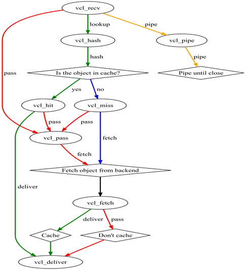
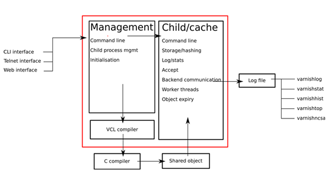
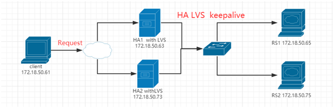

| 序号  | 修改时间      | 修改内容                    | 修改人   | 审稿人 |
| --- | --------- | ----------------------- | ----- | --- |
| 1   | 2021-12-7 | 创建。迁移《网站架构设计与开发》相关章节成文。 | Keefe |     |

<br><br><br>

---

[TOC]

<br>

---

# 1 工具概述

表格  网站优化工具列表

| 类别     | 工具                                        | 简介                                                  | 应用场景                                            |
| ------ | ----------------------------------------- | --------------------------------------------------- | ----------------------------------------------- |
| WEB服务器 |                                           | 包括nginx、apache、fastcgi、Lighttpd                     | nginx详见 《[nginx用户手册](../tools.工具/nginx用户手册.md)》 |
|        | Lighttpd                                  | 高性能的轻量极web服务器                                       | 图片服务器首选。                                        |
|        | fastcgi                                   | 可扩展、开放、开性能的CGI。常驻内存,多线程,分布式?                        |                                                 |
|        | gunicorn                                  | 针对python WSGI应用的HTTP服务器，可设置工作进程数。                   | python WEB框架                                    |
|        | uwsgi                                     |                                                     | python WEB框架                                    |
| 反向代理   |                                           | 包括nginx, apache, squid, varnish                     |                                                 |
| 负载均衡   |                                           | 包括nginx，lvs，haporxy                                 |                                                 |
|        | nginx                                     | HTTP七层工作。                                           | 动静分离、反向代理、后端服务器的负载均衡。                           |
|        | haproxy                                   | 软件四层和七层工作。                                          | 高可用、负载均衡、HTTP/FTP应用代理                           |
|        | LVS                                       | 软件四层工作。                                             |                                                 |
|        | F5                                        | 硬件四层工作。                                             | 商业硬件。                                           |
| 缓存     |                                           | 包括squid, varnish, ATS                               |                                                 |
|        | [squid](https://www.squid-cache.org)      | 高性能代理缓存，支持ftp/http/https/gopher协议。数据保存在内存和磁盘，不支持多核。 | 代理缓存。                                           |
|        | [varnish](https://www.varnish-cache.org/) | 高性能代理&缓存服务器，数据保存在内存。                                | 内存缓存。                                           |
|        | [ATS](https://trafficserver.apache.org/)  | 高性能的、模块化的HTTP代理和缓存服务器。                              |                                                 |
| 其它     | [keepalived](https://www.keepalived.org/) | 存在一个VIP。自动监测节点状态，并作相应处理（脚本如重启、关闭）。                  | 多主或主从集群。如lvs+keepalived、nginx+keepalived        |

> 说明：nginx功能强劲，包括反向代理，负载均衡等等。

<br>

# 2 负载均衡工具

使用nginx, lightttp, fastcgi提升性能和构造分布式服务。

表格  主流负载均衡工具(nginx/haproxy/lvs)比较

|           | 简介                                                                                                                                                                                                                                                                                                                                                                                                                                                                                                                                               | 备注       |
| --------- | ------------------------------------------------------------------------------------------------------------------------------------------------------------------------------------------------------------------------------------------------------------------------------------------------------------------------------------------------------------------------------------------------------------------------------------------------------------------------------------------------------------------------------------------------ | -------- |
| **nginx** | 高性能的 HTTP 和反向代理服务器，也是一个IMAP/POP3/SMTP代理服务器，可替换Apache。  <br/>1、工作在网络的7层之上，可以针对http应用做一些分流的策略，比如针对域名、目录结构；   <br>2、Nginx对网络的依赖比较小，理论上能ping通就就能进行负载功能；   <br/>3、Nginx安装和配置比较简单，测试起来比较方便；   <br/>4、也可以承担高的负载压力且稳定，一般能支撑超过1万次的并发；   <br/>5、对后端服务器的健康检查，只支持通过端口来检测，不支持通过url来检测。   <br/>6、Nginx对请求的异步处理可以帮助节点服务器减轻负载；   <br/>7、Nginx仅能支持http、https和Email协议，这样就在适用范围较小。   <br/>8、不支持Session的直接保持，但能通过ip_hash来解决。、对Big  request header的支持不是很好，   <br/>9、支持负载均衡算法：Round-robin（轮循）、Weight-round-robin（带权轮循）、Ip-hash（Ip哈希）   <br/>10、Nginx还能做Web服务器即Cache功能。 | 七层HTTP   |
| LVS       | LVS（Linux Virtual Server）即Linux虚拟服务器，是由章文嵩博士主导的开源负载均衡项目，目前LVS已经被集成到Linux内核模块中。LVS工作模式分为NAT、TUN和DR模式。  <br/>1、抗负载能力强。抗负载能力强、性能高，能达到F5硬件的60%；对内存和cpu资源消耗比较低   <br/>2、工作在网络4层，通过vrrp协议转发（仅作分发之用），具体的流量由linux内核处理，因此没有流量的产生。   <br/>3、应用范围比较广，可以对所有应用做负载均衡；   <br/>4、不支持正则处理，不能做动静分离。   <br/>5、支持负载均衡算法：rr（轮循）、wrr（带权轮循）、lc（最小连接）、wlc（权重最小连接）   <br/>6、稳定性、可靠性好，自身有完美的热备方案；（如：LVS+Keepalived）   <br/>7、配置复杂，对网络依赖比较大，稳定性很高。                                                                                                                          | 四层TCP/IP |
| HAProxy   | 1、支持两种代理模式：TCP（四层）和HTTP（七层），支持虚拟主机；    <br/>2、能够补充Nginx的一些缺点比如Session的保持，Cookie的引导等工作    <br/>3、支持url检测后端的服务器出问题的检测会有很好的帮助。    <br/>4、更多的负载均衡策略比如：动态加权轮循(Dynamic  Round Robin)，加权源地址哈希(Weighted  Source Hash)，加权URL哈希和加权参数哈希(Weighted Parameter Hash)已经实现    <br/>5、单纯从效率上来讲HAProxy更会比Nginx有更出色的负载均衡速度。    <br/>6、HAProxy可以对Mysql进行负载均衡，对后端的DB节点进行检测和负载均衡。    <br/>9、支持负载均衡算法：Round-robin（轮循）、Weight-round-robin（带权轮循）、source（原地址保持）、RI（请求URL）、rdp-cookie（根据cookie）    <br/>10、不能做Web服务器即Cache。                                                  | 四层+七层    |

备注: nginx的http会话的直接保持，可通过ip_hash解决，但这样就不能自动剔除后端服务器故障（轮询）。

三大主流软件负载均衡器适用业务场景：
 1、网站建设初期，可以选用Nigix/HAproxy作为反向代理负载均衡（或者流量不大都可以不选用负载均衡），因为其配置简单，性能也能满足一般的业务场景。如果考虑到负载均衡器是有单点问题，可以采用Nginx+Keepalived/HAproxy+Keepalived避免负载均衡器自身的单点问题。
 2、网站并发达到一定程度之后，为了提高稳定性和转发效率，可以使用LVS。毕竟LVS比Nginx/HAproxy要更稳定，转发效率也更高。不过维护LVS对维护人员的要求也会更高，投入成本也更大。

## HAProxy

**HAProxy**是一个使用C语言编写的自由及开放源代码软件。

（1）HAProxy 是一款提供高可用性、负载均衡以及基于TCP（第四层）和HTTP（第七层）应用的代理软件，支持虚拟主机，它是免费、快速并且可靠的一种解决方案。HAProxy特别适用于那些负载特大的web站点，这些站点通常又需要会话保持或七层处理。HAProxy运行在当前的硬件上，完全可以支持数以万计的并发连接。并且它的运行模式使得它可以很简单安全的整合进您当前的架构中， 同时可以保护你的web服务器不被暴露到网络上。

（2）HAProxy实现了一种[事件驱动](https://baike.baidu.com/item/事件驱动/9597519), **单一进程**模型，此模型支持非常大的并发连接数。多进程或多线程模型受内存限制 、系统调度器限制以及无处不在的锁限制，很少能处理数千并发连接。[事件驱动模型](https://baike.baidu.com/item/事件驱动模型/1419787)因为在有更好的资源和时间管理的用户空间(User-Space) 实现所有这些任务，所以没有这些问题。此模型的弊端是，在多核系统上，这些程序通常扩展性较差。这就是为什么他们必须进行优化以 使每个CPU时间片(Cycle)做更多的工作。

（3）HAProxy 支持连接拒绝 : 因为维护一个连接的打开的开销是很低的，有时我们很需要限制攻击蠕虫（attack bots），也就是说限制它们的连接打开从而限制它们的危害。 这个已经为一个陷于小型DDoS攻击的网站开发了而且已经拯救了很多站点，这个优点也是其它负载均衡器没有的。

（4）HAProxy 支持全透明代理（已具备硬件防火墙的典型特点）: 可以用客户端IP地址或者任何其他地址来连接后端服务器. 这个特性仅在[Linux](http://www.ttlsa.com/linux/) 2.4/2.6内核打了cttproxy补丁后才可以使用. 这个特性也使得为某特殊服务器处理部分流量同时又不修改服务器的地址成为可能。

**性能**

HAProxy借助于OS上几种常见的技术来实现性能的最大化。

1，单进程、事件驱动模型显著降低了上下文切换的开销及内存占用。

2，O(1)事件检查器(event checker)允许其在高并发连接中对任何连接的任何事件实现即时探测。

3，在任何可用的情况下，单缓冲(single buffering)机制能以不复制任何数据的方式完成读写操作，这会节约大量的CPU时钟周期及内存带宽；

4，借助于Linux 2.6 (>= 2.6.27.19)上的splice()系统调用，HAProxy可以实现零复制转发(Zero-copy forwarding)，在Linux 3.5及以上的OS中还可以实现零复制启动(zero-starting)；

5，内存分配器在固定大小的内存池中可实现即时内存分配，这能够显著减少创建一个会话的时长；

6，树型存储：侧重于使用作者多年前开发的弹性二叉树，实现了以O(log(N))的低开销来保持计时器命令、保持运行队列命令及管理轮询及最少连接队列；

7，优化的HTTP首部分析：优化的首部分析功能避免了在HTTP首部分析过程中重读任何内存区域；

8，精心地降低了昂贵的系统调用，大部分工作都在用户空间完成，如时间读取、缓冲聚合及文件描述符的启用和禁用等；

所有的这些细微之处的优化实现了在中等规模负载之上依然有着相当低的CPU负载，甚至于在非常高的负载场景中，5%的用户空间占用率和95%的系统空间占用率也是非常普遍的现象，这意味着HAProxy进程消耗比系统空间消耗低20倍以上。因此，对OS进行性能调优是非常重要的。即使用户空间的占用率提高一倍，其CPU占用率也仅为10%，这也解释了为何7层处理对性能影响有限这一现象。由此，在高端系统上HAProxy的7层性能可轻易超过硬件负载均衡设备。

在生产环境中，在7层处理上使用HAProxy作为昂贵的高端硬件负载均衡设备故障故障时的紧急解决方案也时长可见。硬件负载均衡设备在“报文”级别处理请求，这在支持跨报文请求(request across multiple packets)有着较高的难度，并且它们不缓冲任何数据，因此有着较长的响应时间。对应地，软件负载均衡设备使用TCP缓冲，可建立极长的请求，且有着较大的响应时间。

HAProxy目前主要有三个版本： 1.3 , 1.4, 1.5，CentOS6.6 自带的RPM包为 1.5 的。

**配置HAProxy Session亲缘性的三种方式**

haproxy负载均衡保持客户端和服务器Session亲缘性的三种方式:

**1).用户IP** **识别**

haproxy 将用户IP经过hash计算后 指定到固定的真实服务器上（类似于nginx 的IP hash 指令）

配置指令 balance source

**2).cookie** **识别**

haproxy 将WEB服务端发送给客户端的cookie中插入(或添加前缀)haproxy定义的后端的服务器COOKIE ID。

配置指令例举 cookie SESSION_COOKIE insert indirect nocache

用firebug可以观察到用户的请求头的cookie里 有类似" Cookie jsessionid=0bc588656ca05ecf7588c65f9be214f5; SESSION_COOKIE=app1" SESSION_COOKIE=app1就是haproxy添加的内容

**3).session** **识别**

haproxy 将后端服务器产生的session和后端服务器标识存在haproxy中的一张表里。客户端请求时先查询这张表。

配置指令例举 appsession JSESSIONID len 64 timeout 5h request-learn

**配置Haproxy~haproxy.cfg**

​    Haproxy配置中分成五部分内容，当然这些组件不是必选的，可以根据需要选择作为配置。

* global：参数是进程级的，通常和操作系统(OS)相关。这些参数一般只设置一次，如果配置无误，就不需要再次配置进行修改；
* default：配置默认参数的，这些参数可以被利用配置到frontend，backend，listen组件；
* frontend：接收请求的前端虚拟节点，Frontend可以根据规则直接指定具体使用后端的backend(可动态选择)；
* backend：后端服务集群的配置，是真实的服务器，一个Backend对应一个或者多个实体服务器；
* listen：Frontend和Backend的组合体。

## LVS

LVS是Linux Virtual Server的简写，意即Linux虚拟服务器，是一个虚拟的服务器集群系统。本项目在1998年5月由章文嵩博士成立，是中国国内最早出现的自由软件项目之一。章文嵩博士目前工作于中国国家并行与分布式处理重点实验室，主要从事集群技术、操作系统、对象存储与数据库的研究。

<br>

## 本章参考

* 三大主流软件负载均衡器对比(LVS VS Nginx VS Haproxy) https://www.cnblogs.com/zjoch/p/6409411.html
* HAProxy用法详解 [www.ttlsa.com/linux/haproxy-study-tutorial/](http://www.ttlsa.com/linux/haproxy-study-tutorial/)
* shuming. [LVS 工作模式以及工作原理](http://blog.csdn.net/caoshuming_500/article/details/8291940)
* LVS负载均衡（LVS简介、三种工作模式、十种调度算法） https://blog.csdn.net/weixin_40470303/article/details/80541639
* LVS wiki. [Load balancing](http://kb.linuxvirtualserver.org/wiki/Load_balancing)

<br>

# 3  缓存工具

表格 varnish和squid比较

|      | varnish                                           | squid  |
| ---- | ------------------------------------------------- | ------ |
| 稳定性  | 更高                                                | 经常需要重启 |
| 访问速度 | 更快。Varnish采用了“Visual Page Cache”技术，所有缓存数据都直接从内存读取 | 从磁盘读取。 |
| 并发连接 | 更高。Varnish的TCP连接释放要比Squid快。                       |        |
| 清除缓存 | 可以通过管理端口，使用正则表达式批量清除部分缓存。                         |        |
| 资源开销 | 高并发状态下CPU、I/O和内存等资源开销更高。                          |        |
| 持续化  | 重启后资源清空。                                          |        |

> 备注：共同点是都是开源的反向代理服务器。

## varnish

​     varnish是一款高性能且开源的反向代理服务器和HTTP加速器，它的开发者poul-Henning kamp FreeBSD 核心的开发人员之一。varnish采用全新的软件体系机构，和现在的硬件体系配合紧密，
​     varnish是一个轻量级的cache和反向代理软件。先进的设计理念和成熟的设计框架式是varnish的主要特点。

**什么是varnish？**

* 是一个反向http代理，有时称为http加速器或web加速器。
* varnish将文件或文件片段存储在内存中，使他们能够快速被提供。
* varnish本质上是一个键/值存储，它通过使用url作为键。
* varnish是为现代硬件、现代操作系统和现代工作负载而设计的。
* varnish 是做CDN 即缓存和访问代理

**varnish的特点：**

1、基于内存进行缓存，重启后数据将消失。
2、利用虚拟内存方式，I\O性能好。
3、支持设置0~60秒的精确缓存时间。
4、VCL配置管理比较灵活。
5、具有强大的管理功能，例如top、stat、admin、list 等。
6、状态机设计巧妙、结构清晰。
7、利用二叉堆管理缓存文件，可达到积极删除目的。

### 用户篇

**安装**

```shell
$ sudo yum install varnish

# 启动
$ sudo service varnish start
Redirecting to /bin/systemctl start varnish.service
```

**命令**

```shell
$ ps -ef|grep -v grep |grep varnish
varnish   1451     1  0 09:16 ?        00:00:00 /usr/sbin/varnishd -a :6081 -f /etc/varnish/default.vcl -s malloc,256m
varnish   1461  1451  0 09:16 ?        00:00:00 /usr/sbin/varnishd -a :6081 -f /etc/varnish/default.vcl -s malloc,256m

$ varnishd --help
Usage: varnishd [options]

Basic options:
  -a address[:port][,proto]    # HTTP listen address and port
     [,user=<u>][,group=<g>]   # Can be specified multiple times.
     [,mode=<m>]               #   default: ":80,HTTP"
                               # Proto can be "PROXY" or "HTTP" (default)
                               # user, group and mode set permissions for
                               #   a Unix domain socket.
  -b [addr[:port]|path]        # Backend address and port
                               #   or socket file path
                               #   default: ":80"
  -f vclfile                   # VCL program
                               # Can be specified multiple times.
  -n dir                       # Working directory

-b can be used only once, and not together with -f

Documentation options:
  -?                           # Prints this usage message
  -x parameter                 # Parameter documentation
  -x vsl                       # VSL record documentation
  -x cli                       # CLI command documentation
  -x builtin                   # Builtin VCL program
  -x optstring                 # List of getopt options

Operations options:
  -F                           # Run in foreground
  -T address[:port]            # CLI address
                               # Can be specified multiple times.
  -M address:port              # Reverse CLI destination
                               # Can be specified multiple times.
  -P file                      # PID file
  -i identity                  # Identity of varnish instance
  -I clifile                   # Initialization CLI commands

Tuning options:
  -t TTL                       # Default TTL
  -p param=value               # set parameter
                               # Can be specified multiple times.
  -s [name=]kind[,options]     # Storage specification
                               # Can be specified multiple times.
                               #   -s default (=malloc)
                               #   -s malloc
                               #   -s file
  -l vsl                       # Size of shared memory log
                               #   vsl: space for VSL records [80m]

Security options:
  -r param[,param...]          # Set parameters read-only from CLI
                               # Can be specified multiple times.
  -S secret-file               # Secret file for CLI authentication
  -j jail[,options]            # Jail specification
                               #   -j unix
                               #   -j none

Advanced/Dev/Debug options:
  -d                           # debug mode
                               # Stay in foreground, CLI on stdin.
  -C                           # Output VCL code compiled to C language
  -V                           # version
  -h kind[,options]            # Hash specification
  -W waiter                    # Waiter implementation
```

说明：默认启动项 -a address[ip:port],  -f vclfile

相关的二进制程序：

```shell
$ ls /usr/bin/varnish*
varnishadm   varnishhist  varnishlog   varnishncsa  varnishstat  varnishtest  varnishtop
```

* varnishd   varnish服务端程序

* varnishadm  命令行终端，可以在终端上执行各种管理命令。如加载配置文件 `vcl.list`
  
  ```shell
  $ varnishadm
  200
  -----------------------------
  Varnish Cache CLI 1.0
  -----------------------------
  Linux,4.18.0-147.5.1.el8_1.aarch64,aarch64,-jnone,-smalloc,-sdefault,-hcritbit
  varnish-6.0.8 revision 97e54ada6ac578af332e52b44d2038bb4fa4cd4a
  
  Type 'help' for command list.
  Type 'quit' to close CLI session.
  
  varnish> vcl.load superset /home/ai/projects/config/superset.vcl
  varnish> vcl.use superset
  # default缺省，superset本次增加配置
  varnish> vcl.list
  200
  active      auto/warm          0 boot
  available   auto/warm          0 default
  available   auto/warm          0 superset
  ```

* varnishstat   统计varnish运行状态，可以统计缓存命中次数，未命中次数，请求数，缓存大小等。

* varnishlog    日志，一个请求会产生二条日志记录。`varnishlog -I log`

* varnishtop

**varnish返回响应**

varnish响应会增加三个相应头信息，分别是“X-Varnish”、“Via”和“Age”。

* X-Varnish：后面会有一个或两个数字，如果是一个数字，就表明varnish在缓存中没有发现这个请求，这个数字的含义是varnish为这个请求所做的标记ID。如果X-Varnish后是两个数字，就表明varnish在缓存中命中了这个请求，第一个数字是请求的标识ID，第二个数字是缓存的标识ID。
* Age：标识出这个请求将被缓存多长时间（单位：秒）。首次请求的“Age”为0，后续的重复请求将会使Age值增大。如果后续的请求没有是“Age”增加，那就说明varnish没有缓存这个响应的结果。
* Via：表明这个请求将经过一个代理。会携带varnish的版本。

varnish响应示例

```shell
$  curl -I 'http://$host/static/assets/images/favicon.png'
HTTP/1.1 200 OK
Content-Length: 2242
Content-Type: image/png
Last-Modified: Mon, 17 Jan 2022 10:12:45 GMT
Cache-Control: public, max-age=31536000
Expires: Thu, 19 Jan 2023 02:59:34 GMT
ETag: "1642414365.1485384-2242-1447828744"
Date: Wed, 19 Jan 2022 02:59:34 GMT
Access-Control-Allow-Origin: *
Server: Werkzeug/1.0.1 Python/3.8.11
X-Varnish: 327735 163861
Age: 346
Via: 1.1 varnish (Varnish/6.0)
X-Cache: HIT Via ecs-4ed9
Accept-Ranges: bytes
Connection: keep-alive
```

**varnish配置文件**

VCL（varnish configuration language）是 varnish 配置语言，其用来定义 varnish 的存取策略。VCL 语法比较简单，跟 C 和 Perl 比较相似。主要有以下几点：

* 块是由花括号分隔，语句以分号结束，使用‘ # ’符号可以添加注释。

* VCL 使用指定运算符“=”、比较运算符“==”、逻辑运算符“!,&&,!!”等形式，还支持正则表达式和用“~”进行 ACL 匹配运算。

* VCL 没有用户自己定义的变量，你可以在 backend、request 或 object 上设置变量值，采用 set 关键字进行设置。例如 set req.backend = director_employeeui;

* 两个字符串的连接，他们之间没有任何运算符。

* \”字符在 VCL 里没有特别的含义，这点与其他语言略有不同。
- VCL 可以使用 set 关键字设置任何 HTTP 头，可以使用 remove 或是 unset 关键字移除 HTTP 头。

- VCL 有 if/else 的判断语句，但是没有循环语句。

VCL策略在启用前，会由management进程将其转换为C代码，而后再由gcc编译器将C代码编译成二进制程序。编译完成后，management负责将其连接至varnish实例，即child进程。正是由于编译工作在child进程之外完成，它避免了装载错误格式VCL的风险。因此，varnish修改配置的开销非常小，其可以同时保有几份尚在引用的旧版本配置，也能够让新的配置即刻生效。编译后的旧版本配置通常在varnish重启时才会被丢弃，如果需要手动清理，则可以使用varnishadm的vcl.discard命令完成。

Varnish处理HTTP请求的运行流程图如下：



**Varnish处理HTTP请求的过程大致分为如下几个步骤；**

(1)Receive状态。也就是请求处理的入口状态，根据VCL规则判断该请求应该pass或者pipe，还是进入lookup(本地查询)

(2)Lookup状态。进入此状态后，会在hash表中查找数据，若找到，则进入Hit状态，否则进入Miss状态。

(3)Pass状态。在此状态下，会进入后端请求，即进入fetch状态。

(4)Fetch状态。在fetch状态下，对请求进行后端获取，发送请求，获得数据，并进行本地存储。

(5)Deliver状态。将获取到的数据发送给客户端，然后完成本次请求。

**VCL Objects**:  req (请求) bereq (后端请求)  beresp (后端响应)  resp  obj (只读对象)

**[VCL内置函数](https://varnish-cache.org/docs/7.0/users-guide/vcl-built-in-subs.html)** (vcl_开头)：vcl_init vcl_recv  vcl_pipe vcl_hash vcl_hit vcl_miss  vcl_pass  vcl_fetch  vcl_deliver

**VCL内置变量**： [VCL-Variables — Varnish version 7.0.1 documentation (varnish-cache.org)](https://varnish-cache.org/docs/7.0/reference/vcl-var.html)

**vcl配置文件示例**

```ini
$ cat /etc/varnish/default.vcl
#
# This is an example VCL file for Varnish.
#
# It does not do anything by default, delegating control to the
# builtin VCL. The builtin VCL is called when there is no explicit
# return statement.
#
# See the VCL chapters in the Users Guide at https://www.varnish-cache.org/docs/
# and https://www.varnish-cache.org/trac/wiki/VCLExamples for more examples.

# Marker to tell the VCL compiler that this VCL has been adapted to the
# new 4.0 format.
vcl 4.0;

# Default backend definition. Set this to point to your content server.
backend default {
    .host = "127.0.0.1";
    .port = "80";
}

# 自定义后端, 也可以多个后端绑定成组；另外也可对后端进行健康检查
backend java {
    .host = "127.0.0.1";
    .port = "8080";
    .probe = {
        .url = "/";
        .timeout = 1s;
        .interval = 5s;
        .window = 5;
        .threshold = 3;
    }
}

sub vcl_recv {
    # Happens before we check if we have this in cache already.
    # 在请求开始的时候调用，判断是否处理该请求，怎样处理以及访问后台哪个服务器。
    # Typically you clean up the request here, removing cookies you don't need,
    # rewriting the request, etc.
    if (req.url ~ "^/java/") {
        set req.backend_hint = java;
    } else {
        set req.backend_hint = default；
    }

    # 忽略cookie进行缓存。缺省情况下，带cookie不缓存。
    if (req.method == "GET" && req.url ~ "\.(js|css|html|jpg|png|gif|swf|jpeg|ico)$") {
        unset req.http.cookie;
    }
}

sub vcl_backend_response {
    # Happens after we have read the response headers from the backend.
    #
    # Here you clean the response headers, removing silly Set-Cookie headers
    # and other mistakes your backend does.
}

sub vcl_deliver {
    # Happens when we have all the pieces we need, and are about to send the
    # response to the client.
    #
    # You can do accounting or modifying the final object here.
    # 添加一个Header标识，以判断缓存是否命中
    if (obj.hits > 0) {
        set resp.http.X-Cache = "HIT Via " + server.hostname;
    } else {
        set resp.http.X-Cache = "MISS";
    }
    return (deliver);
}
```

多个后端示例：

```ini
import directors;    # load the directors

backend server1 {
    .host = "192.168.0.10";
}
backend server2 {
    .host = "192.168.0.10";
}

sub vcl_init {
    new bar = directors.round_robin();
    bar.add_backend(server1);
    bar.add_backend(server2);
}

sub vcl_recv {
    # send all traffic to the bar director:
    set req.backend_hint = bar.backend();
}
```

### 进阶篇

当几个客户端请求同一个页面的时候，varnish只发送一个请求的后端服务器，然后让那个其他几个请求挂起等待返回结果，返回结果后，复制请求结果发送给客户端。为了解决请求扎堆等待，varnish有二种处理模式，分别是Grace模式和Saint模式

* Grace优雅模式：指示varnish去保持缓存的对象超过他们的TTL。先获取旧结果。
* Saint神圣模式：抛弃一个后端服务器的某个页面，并尝试从其他服务器获取，或提供缓存中的旧内容。

Varnish的默认缓存策略是偏向保守的（可以通过配置改变）

* 它默认只缓存GET请求和HEAD请求，不缓存带有Cookie和认证信息的请求，也不会缓存带有Set-Cookie或者有变化的头信息的响应。
* Varnish也会检查请求和响应中的Cache-Control头信息，这个头信息中会包含一些选项来控制缓存行为。当Cache-control中Max-age的控制和默认策略冲突时，varnish不会单纯的根据Cache-control信息就改变自己的缓存行为。
  例如：Cache-Control: max-age=n，n为数字，如果varnish收到web服务器的响应中包含max-age，varnish会以此值设定缓存的过期时间（单位：秒），否则varnish将会设置为参数配置的时间，默认为120秒。
* 提高Varnish命中率的根本方法，就是仔细规划请求和应答，并自定义缓存策略，通过VCL来配置自己想要缓存的内容，并主动设置对象的ttl，尽量不去依赖Http header。

### 原理篇



图  varnish系统架构

varnish主要运行两个进程：Management进程 和Child进程(也叫Cache进程)。

* Management进程是主进程，管理进程。主要实现应用新的配置、编译VCL、监控varnish、初始化varnish以及提供一个命令行接口等。Management进程会每隔几秒钟探测一下Child进程以判断其是否正常运行，如果在指定的时长内未得到Child进程的回应，Management将会重启此Child进程。

* Child进程包含多种类型的线程，常见的如：
  
  - Acceptor线程：接收新的连接请求并响应；
  * Worker线程：child进程会为每个会话启动一个worker线程，因此，在高并发的场景中可能会出现数百个worker线程甚至更多；
  
  * Object Expiry 线程：从缓存中清理过期内容；
  
  * Commad line 线程 : 管理接口
  
  * Storage/hashing 线程 ：缓存存储
  
  * Log/stats 线程：日志管理线程
  
  * Backend Communication 线程：管理后端主机线程

Varnish依赖“工作区(workspace)”以降低线程在申请或修改内存时出现竞争的可能性。在varnish内部有多种不同的工作区，其中最关键的当属用于管理会话数据的session工作区。

## squid

Squid是一个高性能的代理缓存服务器，Squid支持FTP、gopher、HTTPS和HTTP协议。和一般的代理缓存软件不同，Squid用一个单独的、非模块化的、I/O驱动的进程来处理所有的客户端请求。

squid将数据元缓存在内存和硬盘中，同时也缓存DNS查询的结果。Squid支持SSL，支持访问控制。由于使用了ICP（轻量Internet缓存协议），Squid能够实现层叠的代理阵列，从而最大限度的节约带宽。

**squid缓存原理**

缓存的存放方式：每一台Squid 代理服务器上都有若干颗硬盘，每颗硬盘又分割成多个分区，每一个分区又可建立很多目录，目录下才放文件(Squid 把它叫object)。

表格 Squid版本（ 详见 http://www.squid-cache.org/Versions/ ）

| Version                                            | First STABLE release Date                            | Latest Release | Latest Release Date |
| -------------------------------------------------- | ---------------------------------------------------- | -------------- | ------------------- |
| [6](http://www.squid-cache.org/Versions/v6/)       | [Squid RoadMap](http://wiki.squid-cache.org/RoadMap) |                |                     |
| [5](http://www.squid-cache.org/Versions/v5/)       | 20 Jan 2020                                          | 5.3            | 07 Dec 2021         |
| [4](http://www.squid-cache.org/Versions/v4)        | 02 Jul 2018                                          | 4.16           | 05 Jul 2021         |
| [3.5](http://www.squid-cache.org/Versions/v3/3.5/) | 17 Jan 2015                                          | 3.5.28         | 15 Jul 2018         |
| [3.4](http://www.squid-cache.org/Versions/v3/3.4/) | 09 Dec 2013                                          | 3.4.14         | 01 Aug 2015         |
| [3.3](http://www.squid-cache.org/Versions/v3/3.3/) | 09 Feb 2013                                          | 3.3.14         | 01 May 2015         |
| [3.2](http://www.squid-cache.org/Versions/v3/3.2/) | 14 Aug 2012                                          | 3.2.14         | 01 May 2015         |
| [3.1](http://www.squid-cache.org/Versions/v3/3.1/) | 29 Mar 2010                                          | 3.1.23         | 09 Jan 2013         |
| [3.0](http://www.squid-cache.org/Versions/v3/3.0/) | 13 Dec 2007                                          | STABLE26       | 28 Aug 2011         |
| [2.7](http://www.squid-cache.org/Versions/v2/2.7/) | 31 May 2008                                          | STABLE9        | 16 Mar 2010         |
| [2.6](http://www.squid-cache.org/Versions/v2/2.6/) | 01 Jul 2006                                          | STABLE23       | 17 Sep 2009         |
| [2.5](http://www.squid-cache.org/Versions/v2/2.5/) | 25 Sep 2002                                          | STABLE14       | 20 May 2006         |
| [2.4](http://www.squid-cache.org/Versions/v2/2.4/) | 20 Mar 2001                                          | STABLE7        | 02 Jul 2002         |

## Apache Traffic Server (ATS)

官网： https://trafficserver.apache.org/

Apache Traffic Server（ATS或TS）软件是一种快速、可扩展和可扩展的 HTTP/1.1 和 HTTP/2 兼容缓存代理服务器。 以前的商业产品，雅虎捐赠给了 Apache 基金会，目前被几个主要的 CDN 和内容所有者使用。

ATS开发语言为C++。它通过将频繁访问的信息缓存在网络的边缘来改善网络的效率和性能，使得访问内容在地里上更接近终端用户，在更快分发的同事也减少带宽的占用。

**ATS特色**

* 缓存：改进响应时间的同时降低了服务器负载与对带宽的需求，这是通过缓存并且重用经常请求的网页、图片和Web Service调用实现的。

* 代理：很容易添加持续连接、过滤器或异步内容请求，还可以通过添加代理层实现[负载平衡](https://baike.baidu.com/item/负载平衡)。

* 速度：在现代的SMP硬件上具有很好的可伸缩性，每秒钟可以处理数以万计的请求。

* 可扩展性：API考虑到了自定义插件，可以修改头与内容，还可以实现新的协议处理器。

* 可靠性：能够完美处理TB级别的数据，包括正向与反向代理。

**ATS部署选项**

- 作为一个反向代理:   ATS需要配置为用户直接连接的源服务器（典型的用法是将源服务器的主机名解析到ATS）,反向代理的功能也被叫做服务器加速。
- 作为一个web代理缓存:  作为web代理缓存，ATS接收用户直接发往源站的web内容请求。如果ATS包含请求的内容，它将直接提供服务。如果请求的内容不再缓存里，ATS将作为一个代理；为用户从源站服务器获取请求的内容，并在本地保存一份拷贝以服务于将来相同的请求。
- 部署在多级缓存:  ATS可以灵活地参与多级缓存，当internet请求不能在一个缓存中得到满足的时候，将被路由到其他区域的缓存，从而利用附近缓存的内容。在一个多级代理中，ATS可以作为其他ATS系统或者其他相似的缓存产品的父节点或者子节点。

<br>

## 本章参考

* [Dealing with multiple backends in Varnish — Varnish Wiki documentation (varnish-software.com)](https://www.varnish-software.com/wiki/content/tutorials/varnish/multiple_varnishes.html)
* Varnish, a high-performance HTTP accelerator.  http://varnish.projects.linpro.no/
* varnish 详解  https://blog.51cto.com/freeloda/1297414
* 高命中率varnish缓存配置  https://www.xiaohuai.com/3854/
* varnish几个工具命令行工作情况  https://blog.csdn.net/wangpengqi/article/details/8900858
* https://wiki.squid-cache.org/
* Apache Traffic Server服务搭建 https://www.cnblogs.com/Dev0ps/p/7891659.html

# 4 高可用

## keepalived

​     keepalive起初专门为lvs负载均衡软件设计的，用来管理监控lvs集群系统中各个服务节点的状态，后来又加入了可以实现高可用的vrrp功能。

​     keepalive软件通过vrrp协议实现高可用功能的。**VRRP**（虚拟路由器冗余协议）目的就是为了解决静态路由单点故障问题，竞选机制来将路由的任务交给某台VRRP路由器的，保证节点宕机，整个网络可以不间断的运行。

　Keepalived可以实现任意两台主机之间，例如Master和Backup主机之间的故障转移和自动切换，这个主机可以是普通的不能停机的业务服务器，也可以是LVS负载均衡、Nginx反向代理这样的服务器。

​    Keepalived工作方式：抢占式、非抢占式

**Keepalived高可用简单原理**

　　master端的vrrp路由器会一直发送vrrp广播包，buckup会一直收到广播包，buckup不会抢占master资源，在backup上会一直监听，一旦收不到master的包，在多台backup中优先级最高的就会抢占为master。（master若故障，则此机上keepalived会尝试重启；若重启失败，则关闭keepalived，master心跳包停发）。

**keepalive服务的三个重要功能**

1. 管理LVS负载均衡软件
2. 实现对LVS集群节点健康检查功能
3. 作为系统网络服务的高可用功能
4. 双主热备. 自动切换（需要一个主备共用的VIP，前端用VIP访问；如果nginx的upstraem负载均衡采用轮询，也能自动剔除故障机器）

案例：LVS. Nginx

集群前提条件

(1). 各节点时间必须同步，这个操作很关键。工具有ntp和chrony（CentOS7上开始启用）

(2). 确保iptables及selinux不会成为阻碍。要停止firewalld服务和iptables

(3). 各节点之间可通过主机名互相通信（对KA并非必须），建议使用/etc/hosts文件实现

(4). 各节点之间的root用户可以基于密钥认证的ssh服务完成互相通信（对KA并非必须，但是建议配置）

(5). 多播地址。建议更改默认的多播地址，防止冲突，可以在配置文件里的全局加入选项vrrp_mcast_group4 224.100.50.100。将组播地址调整为224.100.50.100。

### keepalive+LVS高可用

实现效果是当有请求过来时，根据轮询规则调度到后端RS,同时实现了对RS的健康性检查，同时实现VS的高可用。

 

### keepalive+Nginx高可用

A机器：192.168.232.132

B机器：192.168.232.131

A级器作为master，B机器作为backup

**常用命令**

* service nginx start  # 启动nginx
* service nginx stop  # 关闭nginx

```sh
ip add  #查看本机ip地址信息
systemctl stop keepalived  #关闭keepalive
systemctl start keepalived #启动keepalive
```

A机

$ vim /etc/keepalived/keepalived.conf

```ini
global_defs {
  notification_email {
   aming@aminglinux.com
  }
  notification_email_from root@aminglinux.com
  smtp_server 127.0.0.1
  smtp_connect_timeout 30
  router_id LVS_DEVEL       #唯一标识，不同机器不能一样
}

vrrp_script chk_nginx {
  script "/usr/local/sbin/check_ng.sh"    # 检测nginx服务器活跃脚本
  interval 3
}

#vrrp实例，名字可以自定义，与前面关键字空格隔开
vrrp_instance VI_1 {
  state MASTER    # 标识主还是备，必须大写。A/B机不一样，A为MASTER, B为BACKUP
  interface eth0     # 默认的通信的接口，当vip不指定时，默认绑定eth0。
  virtual_router_id 51     # 实例ID，0~255，主备一样
  priority 100        # 权重，从机值稍小
  advert_int 1       # 心跳间隔
  authentication {
    auth_type PASS
    auth_pass aminglinux>com
  }
  virtual_ipaddress {      # vip地址，主备一样，可以指定多个
    192.168.232.100
  }
  track_script {
    chk_nginx
  }
}
vrrp_instance VI_1 {
  state MASTER    # 标识主还是备，必须大写。A/B机不一样，A为MASTER, B为BACKUP
  interface eth0     # 默认的通信的接口，当vip不指定时，默认绑定eth0。
  virtual_router_id 51     # 实例ID，0~255，主备一样
  priority 100        # 权重，从机值稍小
  advert_int 1       # 心跳间隔
  authentication {
    auth_type PASS
    auth_pass aminglinux>com
  }
  virtual_ipaddress {      # vip地址，主备一样
    192.168.232.100
  }
  track_script {
    chk_nginx
  }
}
```

脚本路径: /usr/local/sbin/check_ng.sh

```sh
#!/bin/bash
#时间变量，用于记录日志
d=`date --date today +%Y%m%d_%H:%M:%S`
#计算nginx进程数量
n=`ps -C nginx --no-heading|wc -l`
# 如果进程为0，则启动nginx，并且再次检测nginx进程数量，
# 如果还为0，说明nginx无法启动，此时需要关闭keepalived
if [ $n -eq "0" ]; then
    /etc/init.d/nginx start
    n2=`ps -C nginx --no-heading|wc -l`
    if [ $n2 -eq "0" ]; then
        echo "$d nginx down,keepalived will stop" >> /var/log/check_ng.log
        systemctl stop keepalived
    fi
fi
```

<br>

## 本章参考

* Keepalived详细介绍  https://www.cnblogs.com/losbyday/p/5841830.html
* Keepalive详解 https://www.cnblogs.com/rexcheny/p/10778567.html

# 5 其它

## OpenResty

基于Nginx开发的WEB应用。

<br>

# 参考资料

**工具官网**

* HAProxy官网  http://www.haproxy.org/
* lvs   http://www.linuxvirtualserver.org/
* varnish  https://www.varnish-cache.org/    https://github.com/varnishcache/varnish-cache
* squid  www.squid-cache.org   https://github.com/squid-cache/squid
* ATS  https://trafficserver.apache.org/
* keepalived https://www.keepalived.org/

**官网文档链接**

* [HAProxy Management Guide](http://www.haproxy.org/download/1.6/doc/management.txt)
* [Varnish Documentation](https://varnish-cache.org/docs/7.0/index.html)
* Squid Documentation http://www.squid-cache.org/Doc/

**相关文档**

* 《[nginx用户手册.md](../tools.工具/nginx用户手册.md)》

**参考链接**
