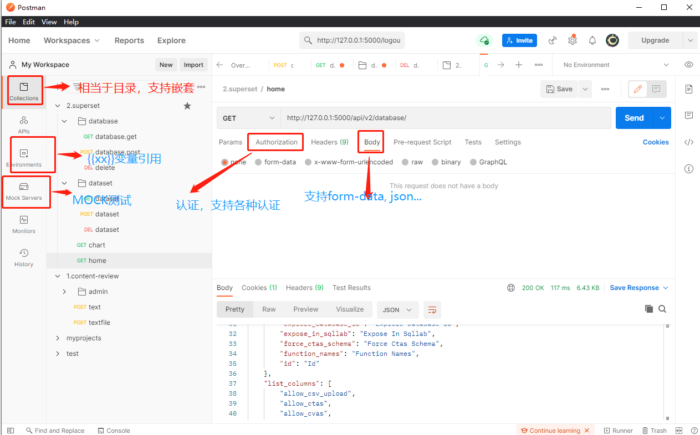

| 序号 | 修改时间  | 修改内容                                   | 修改人 | 审稿人 |      |
| ---- | --------- | ------------------------------------------ | ------ | ------ | ---- |
| 1    | 2019-12-18 | 创建。 | Keefe |        |      |


---

[TOC]


---


# 1 UI测试

## Selinum


## 本章参考 


# 2 接口测试

命令行工具有：curl httpie

图形端工具有：postman  postwoman  

网页工具有：swagger


## 命令行工具

curl示例：

```shell
$ curl -H 'Accept: application/json; indent=4' -u admin:password123 http://127.0.0.1:8000/users/
```

httpie示例：

```shell
# 安装
$ python -m pip install --upgrade httpie

# 运行： get/post
$ http -a admin:password123 http://127.0.0.1:8000/users/
$ http -f POST $HOST/xxx/ hello=World
```


## API测试工具1：Postman

### 简介

Postman 原本是一个 Chrome 浏览器的插件，现在已经提供了 Windows、MacOS 和Linux 的独立安装版本。 Postman ，一个 HTTP API 测试工具。它是一个基于 Electron 开发的客户端软件，支持 OSX，Window 和 Linux。Postman 功能非常强大，支持 REST，SOAP 和 GraphQL 请求，可以实现自动化接口测试、接口监控、模拟接口数据、生成接口文档、多人协作等。





Web 接口的定义来决定测试内容

*  Method：GET POST PUT DELETE HEAD ...
*  URL: 接口的地址
*  请求参数：每个参数名字，参数的类型，参数的范围，参数是否可选，参数是否有默认值 
   - 等价类：有效等价的参数，无效等价的参数
   - 边界值：离点，上点，内点
   - 正交试验法：×因子 ×状态
   - 有的时候，参数之间关联：省，市，县（区），尤其注意非法（无效）的关联
*  断言：检查响应的内容 
   - 正文：正文是否包含某些字符
   - 正文：JSON 或者 XML 的键值对检查，数量检查 xx.length
   - 响应的状态码：200, 403
   - 响应的时间: 100ms, 200ms 
   - 认证：你是否有权限访问接口
*  接口的实质对象：数据~格式和内容


**变量引用**：{{xxx}}

**Pre-request Script **:  定义发送request之前需要运行的一些脚本，主要是设置全局变量和环境变量。

**Tests **:   定义发送Request之后，需要用脚本检测的内容，也就是Test case的内容。


### 示例

#### Tests 自动化测试加断言

语法1：tests[description] = value

```python
# 测试检测网页的响应时间是否小于200ms
tests["Response time is less than 200ms"] = responseTime < 200;

# Test Results：测试响应结果 
# 测试通过pass
[pass] Response time is less than 200ms

# 测试失败
[FAIL] Response time is less than 200ms | AssertionError: expected false to be truthy
```


语法2：assert(表达式)

```python
# 检查响应串结果
assert(ResponseJson.data.userlist.order==1)
```


## API文档工具1: Swagger

Swagger 官方文档: [https://swagger.io/](https://links.jianshu.com/go?to=https%3A%2F%2Fswagger.io%2F)

其它API接口文档工具：Apizza、Yapi等等

swagger文档生成：[swagger-codegen](https://github.com/swagger-api/swagger-codegen)

swagger验证工具： swagger-cli 


```shell
# 安装
npm install -g swagger-cli
# 验证
swagger-cli xx $HOST/
```


### 简介

**Swagger的优点：**

1、节省了大量手写接口文档的时间，这是最大的优势；

2、生成的接口文档可以直接在线测试，节省了使用Postman设置接口参数的过程，而且请求的参数，返回的参数一目了然；

3、接口按照模块已经分类展示，结构清晰；


**Swagger 的缺点**

1. 需要在代码中写大量的注解，生成的接口文档越清晰，写的注解越多；
2. 对于复杂功能，一个功能需要多个模块配合的情况下，联调测试将会是一件非常麻烦的事。Swagger还不支持自定义接口文档，不能指明某一个功能需要使用哪些接口；
3. 对于返回结果不能添加说明或者实现这个功能非常麻烦。虽然 Swagger 有 @ApiResponse注解用来说明返回结果，但是这个使用并不方便，而且如果返回的并不是对象的时候(如 Map)，就无法实现给每一个返回字段的说明；
4. 无法测试错误的请求方式、参数等。如接口指定使用 POST 请求，则无法使用 swagger 测试 GET 请求的结果，也无法自定义 Header；
5. 分布式开发环境中，一个项目往往有多个接口服务（比如电商项目有app，pc，后台三个接口服务）。每一个接口服务都对应一个独立的swagger文档，不能实现统一整合。


### 示例

项目接入依赖 pom.xml

```xml
    <!-- swagger2 -->
    <dependency>
        <groupId>io.springfox</groupId>
        <artifactId>springfox-swagger2</artifactId>
        <version>2.4.0</version>
    </dependency>
    <dependency>
        <groupId>io.springfox</groupId>
        <artifactId>springfox-swagger-ui</artifactId>
        <version>2.4.0</version>
    </dependency>
```


## 本章参考 

* Api接口文档管理工具，你知道哪些呢？ https://www.jianshu.com/p/e5ba5f8c369c
* [Postman使用教程之如何在不同接口之间传递参数数据](https://huajiakeji.com/utilities/2019-01/1771.html)
* Postman Interceptor插件 - 通过Postman发送带cookie请求 https://huajiakeji.com/web-development/2017-08/785.html
* Postman使用入门（二） - 环境变量Environments https://blog.csdn.net/liyazhen2011/article/details/84942816


# 3 UNIT单元测试


## 本章参考 


# 4 性能压测工具

## 4.1 概述

 表格 3 性能压测工具简介

|                     | 简介                                                         | 应用场景                                                     |
| ------------------- | ------------------------------------------------------------ | ------------------------------------------------------------ |
| Apache  Bench（ab） | ab是一款用来针对HTTP协议做性能压测的**命令行**工具，支持在本地环境发起测试请求，验证服务器的处理性能。 | 适用于本地对支持HTTP协议的单一地址进行性能压测，但缺少相应的链路编排、场景管理、数据可视化等大规模性能压测基础功能，无法应用于生产环境。 |
| LoadRunner          | 发布于1993年11月的预测系统行为和性能的负载测试工具。通过以模拟上千万用户实施并发负载及实时性能监测的方式来确认和查找问题，LoadRunner作为一款历史悠久的商业性能压测工具，能够对整个企业架构进行测试。 | LoadRunner可适用于各种体系架构的自动负载测试，能预测系统行为并评估系统性能。 |
| Jmeter              | Apache组织开发的基于Java的压力测试工具。它可以用于测试静态和动态资源，例如静态文件、Java 小服务程序、CGI 脚本、Java 对象、数据库、FTP 服务器等等。另外，JMeter能够对应用程序做功能/回归测试，通过创建带有断言的脚本来验证你的程序返回了你期望的结果。 | JMeter是热门的开源性能压测工具，也存在学习、维护成本高，缺少监控告警等功能支持，难以应用于大型复杂的性能压测场景。 |
| PTS                 | 性能测试服务（Performance Testing Service，简称 PTS）是一个 SaaS 性能测试平台，提供场景 API 编排功能。结合阿里巴巴的自研平台和引擎，支持按需设定压测模式、压测量级、压测时间，快速发起压测，监控压测过程并生成报告等功能，同时也兼容开源工具 JMeter。 | 阿里云。                                                     |

 

表格 4 性能压测工具比较

| 压测工具                     | Apache Bench  （ab） | LoadRunner | JMeter | Aliyun PTS |
| ---------------------------- | -------------------- | ---------- | ------ | ---------- |
| 学习成本                     | 低                   | 高         | 高     | 低         |
| 安装部署成本                 | 低                   | 高         | 高     | 低         |
| 是否免费                     | 是                   | 否         | 是     | 否         |
| 是否支持多协议               | 否                   | 是         | 是     | 是         |
| 压测结果是否能够图形化展示   | 否                   | 是         | 是     | 是         |
| 是否支持TPS模式              | 否                   | 否         | 否     | 是         |
| 是否有链路、场景编排管理支持 | 否                   | 是         | 是     | 是         |
| 是否支持场景录制             | 否                   | 是         | 是     | 是         |
| 生态环境强弱                 | 弱                   | 弱         | 弱     | 强         |
| 监控指标是否完备             | 否                   | 否         | 否     | 是         |
| 是否原生支持流量地域定制     | 否                   | 否         | 否     | 是         |


表格  web测试工具列表

| 工具              | 目的          | 测试命令 与示例                                              |
| ----------------- | ------------- | ------------------------------------------------------------ |
| Apache Beach - ab | 网页负载 测试 | -c 并发数；-n 请求总数 <br>示例：ab -c 5 -n 1000 http://project.com/ |
| http_load         |               | http_load -rate 10 -seconds 5 project.com                    |
| siege             | 网页负载 测试 | -c 并发数; -t 请求时间<br>示例：siege -d 1 -t 1M -c 50 project.com |
| JMeter            | 性能&压力测试 | Java工具。                                                   |
| Load Runner       | 性能&压力测试 | 付费软件                                                     |

备注：1. 每一次执行命令行，需要重启测试框架，以清除上次测试影响。

2. 测试主要关注项：(ps aux: VSZ, RSS, %CPU, %MEM).


表格 性能指标说明

| 指标                                                         | 解释                                                         |
| ------------------------------------------------------------ | ------------------------------------------------------------ |
| 吞吐率（Requests per second）                                | 服务器并发处理能力的量化描述，单位是reqs/s，指的是在某个并发用户数下单位时间内处理的请求数。<br>某个并发用户数下单位时间内能处理的最大请求数，称之为最大吞吐率。 |
| 并发连接数（The number of concurrent connections）           | 并发连接数指的是某个时刻服务器所接受的请求数目，简单的讲，就是一个会话。 |
| 并发用户数（Concurrency Level）                              | 一个用户可能同时会产生多个会话，也即连接数。在HTTP/1.1下，IE7支持两个并发连接，IE8支持6个并发连接，FireFox3支持4个并发连接，所以相应的，我们的并发用户数就得除以这个基数。 |
| 用户平均请求等待时间（Time per request）                     | 计算公式：处理完成所有请求数所花费的时间/（总请求数/并发用户数），即：<BR>Time per request=Time taken for tests/（Complete requests/Concurrency Level） |
| 服务器平均请求等待时间（Time per request:across all concurrent requests） | 计算公式：处理完成所有请求数所花费的时间/总请求数，即：<br/>Time taken for/testsComplete requests<br/>可以看到，它是吞吐率的倒数。<br/>同时，它也等于用户平均请求等待时间/并发用户数，即<br/>Time per request/Concurrency Level |


##  Apache Beach (ab)

apache自带的压力测试工具。

ab的原理：ab命令会创建多个并发访问线程，模拟多个访问者同时对某一URL地址进行访问。它的测试目标是基于URL的，因此，它既可以用来测试apache的负载压力，也可以测试nginx、lighthttp、tomcat、IIS等其它Web服务器的压力。

ab命令

```shell
$ ab --help
-n 在测试会话中所执行的请求个数。默认时，仅执行一个请求。

-c 一次产生的请求个数。默认是一次一个。
-t测试所进行的最大秒数。其内部隐含值是-n 50000，它可以使对服务器的测试限制在一个固定的总时间以内。默认时，没有时间限制。
-p 包含了需要POST的数据的文件。
-P 对一个中转代理提供BASIC认证信任。用户名和密码由一个:隔开，并以base64编码形式发送。无论服务器是否需要(即, 是否发送了401认证需求代码)，此字符串都会被发送。
-T POST数据所使用的Content-type头信息。
-v 设置显示信息的详细程度-4或更大值会显示头信息，3或更大值可以显示响应代码(404,200等),2或更大值可以显示警告和其他信息。
-V 显示版本号并退出。
-w 以HTML表的格式输出结果。默认时，它是白色背景的两列宽度的一张表。
-i 执行HEAD请求，而不是GET。

-x 设置<table>属性的字符串。
-X 对请求使用代理服务器。
-y 设置<tr>属性的字符串。
-z 设置<td>属性的字符串。
-C 对请求附加一个Cookie:行。其典型形式是name=value的一个参数对，此参数可以重复。
-H 对请求附加额外的头信息。此参数的典型形式是一个有效的头信息行，其中包含了以冒号分隔的字段和值的对(如,"Accept-Encoding:zip/zop;8bit")。
-A 对服务器提供BASIC认证信任。用户名和密码由一个:隔开，并以base64编码形式发送。无论服务器是否需要(即,是否发送了401认证需求代码)，此字符串都会被发送。
```

示例：10个并发线程，100个请求

`ab -c 10 -n 100 http://a.ilanni.com/index.php`


## Siege

siege - An HTTP/HTTPS stress tester. 

Siege is a multi-threaded http load testing and benchmarking utility.  It was designed to let web developers measure the performance of their code under duress.  It allows one to hit a web server with a configurable number of concurrent simulated users. Those users place the webserver "under siege."  Performance measures include elapsed time, total data transferred, server response time, its transaction rate, its throughput, its concurrency and the number of times it returned OK. These measures are quantified and reported at the end of each run.  Their meaning and significance is discussed below.  Siege has essentially three modes of operation: regression (when invoked by bombardment), internet simulation and brute force.

Siege是一个多线程http负载测试和基准测试工具。它有3种操作模式： 
1) Regression (when invoked by bombardment) Siege从配置文件中读取URLs，按递归方式，逐个发送请求 

2) Internet simulation (Siege从配置文件中读取URLs，随机选取URL发送请求) 。

3) Brute force (在命令行上写上一个单独的URL，发送请求) 


siege命令

```shell
$ siege --help
-h  ,  --help 打印帮助信息  
-C  ,  --config 
 打印当前配置。这个选项读取 .siegerc 并打印。你可以通过编辑$HOME/.siegerc修改配置。如果没有这个文件，你可以运行siege.config（/usr/local/bin/siege.config ）来生成此文件。  
-v  ,  --verbose  
  打印详细信息。包含请求的协议、响应码、请求的URL  
-g URL  ,  --get URL  
 获得一个HTTP事务。导出headers和显示HTTP交易。对于debug有所帮助。  
-c NUM  ,  --concurrent=NUM  并发用户数（必需参数）。  
-i  ,  --internet  
 此选项配合URLs的配置文件使用。每个虚拟用户每次请求的URL是随机从配置文件的获取。  
-t NUMm  ,  --time=NUMm  
 设置测试运行的时间。单位S\M\H代表秒\分\时。单位大小写不敏感。数字和单位之间不要有空格。  
-f FILE  ,  --file=FILE  
 被测试的URLs配置文件。默认$SIEGE_HOME/etc/urls.txt  
-l  ,  --log  
 记录统计信息到$SIEGE_HOME/var/siege.log  
-m MESSAGE  ,  --mark=MESSAGE 
 此选项允许你使用分隔符标记日志文件。没必要与'-l'同时使用。  
-d NUM  ,  --delay=NUM  
 Time DELAY, random delay before each requst between 1 and NUM. (NOT COUNTED IN STATS)  
-b  ,  --benchmark 
 BENCHMARK,  runs  the  test  with  NO  DELAY  for throughput benchmarking. 负载测试时不推荐使用。  
-H HEADER ,  --header=HEADER 
 HEADER, 该选项允许你添加额外的头信息。   
-R SIEGERC ,  --rc=SIEGERC  #设置运行参数配置文件。 默认 $HOME/.siegerc  
-A "User Agent" , --user-agent="User Agent" AGENT, 定制客户端信息。
```

示例： 1000并发线程，100s测试时间

`siege -c 1000 -t 100s -b http://127.0.0.1:13579/3344 `


## Jmeter

Apache JMeter是Apache组织开发的基于Java的压力测试工具。用于对软件做压力测试，它最初被设计用于Web应用测试，但后来扩展到其他测试领域。 它可以用于测试静态和动态资源，例如静态文件、Java 小服务程序、CGI 脚本、Java 对象、数据库、FTP 服务器， 等等。JMeter 可以用于对服务器、网络或对象模拟巨大的负载，来自不同压力类别下测试它们的强度和分析整体性能。另外，JMeter能够对应用程序做功能/回归测试，通过创建带有断言的脚本来验证你的程序返回了你期望的结果。为了最大限度的灵活性，JMeter允许使用正则表达式创建断言。


**术语**

1、Label： 定义的HTTP请求名称

2、Samples： 表示这次测试中一共发出了多少个请求

3、Average： 访问页面的平均响应时间

4、Min: 访问页面的最小响应时间

5、Max: 访问页面的最大响应时间

6、Error%： 错误的请求的数量/请求的总数

7、Throughput：每秒完成的请求数

8、KB/Sec： 每秒从服务器端接收到的数据量


# 参考资料

## 官网

| 类别     | 工具          | 简介                                     | 官网                                                         | 源码 github/                                                 | 备注                                                         |
| -------- | ------------- | ---------------------------------------- | ------------------------------------------------------------ | ------------------------------------------------------------ | ------------------------------------------------------------ |
| UI       | Selinum       |                                          | https://www.selenium.dev/                                    |                                                              | [文档](https://www.selenium.dev/documentation)               |
| 命令行   | curl          | 1998年就有的命令行工具。                 | https://curl.se/                                             | [curl/curl](https://github.com/curl/curl)                    | [文档](https://curl.se/docs/) [Readme](https://github.com/curl/curl#readme) |
|          | httpie        |                                          |                                                              |                                                              | 文档                                                         |
| API测试  | postman       |                                          | https://www.postman.com/                                     |                                                              | [En.Docs](https://learning.postman.com/docs/getting-started/introduction/)  [中文](https://huajiakeji.com/web-development/2017-12/870.html) |
|          | postwoman     |                                          | [https://postwoman.io/](https://links.jianshu.com/go?to=https%3A%2F%2Fpostwoman.io%2F) | [liyasthomas/postwoman](https://github.com/liyasthomas/postwoman) | 文档                                                         |
| API文档  | swagger       |                                          | https://swagger.io/                                          |                                                              | 文档                                                         |
| 性能压测 | Apache Beach  |                                          |                                                              |                                                              | 文档                                                         |
|          | Siege         |                                          | http://www.joedog.org/                                       | [JoeDog/siege](https://github.com/JoeDog/siege)              | [Readme](https://github.com/JoeDog/siege#readme)             |
|          | Apache Jmeter | Apache组织开发的基于Java的压力测试工具。 | https://jmeter.apache.org/                                   | [apache/jmeter](https://github.com/apache/jmeter)            | [Readme](https://github.com/apache/jmeter#readme)            |
|          | LoadRunner    | 商务版。                                 |                                                              |                                                              |                                                              |

