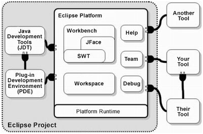
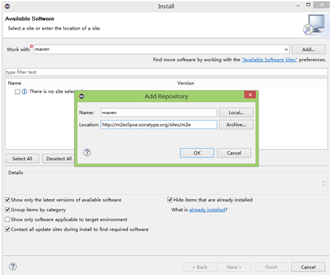
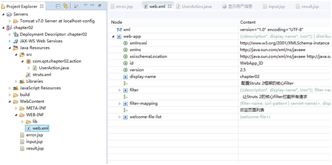
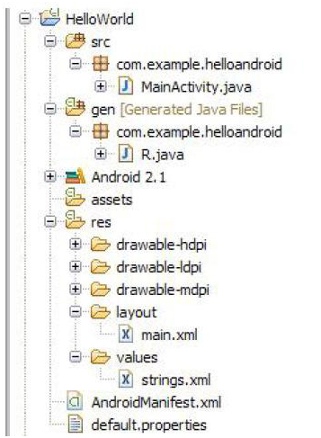
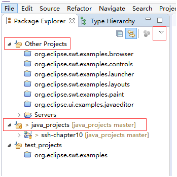
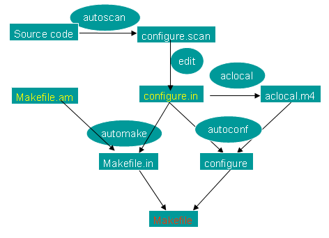
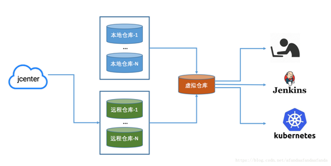
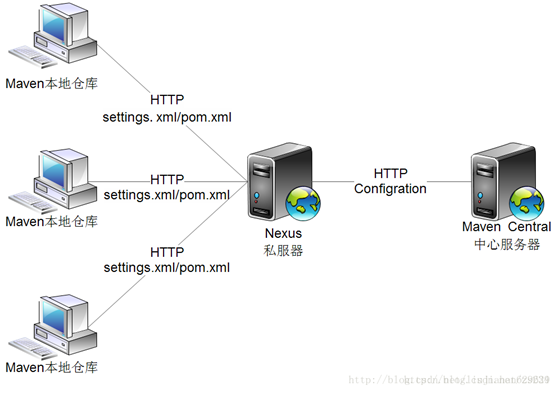

| 序号 | 修改时间  | 修改内容                                   | 修改人 | 审稿人 |
| ---- | --------- | ------------------------------------------ | ------ | ------ |
| 1    | 2019-12-22 | 创建。从《多语言开发》迁移相关章节成文。 | Keefe |        |
|  |  |  |  | |


---

目录

[1 开发工具... 1](#_Toc27951426)

[1.1 开发工具概述... 1](#_Toc27951427)

[1.2 IDE Eclipse.. 3](#_Toc27951428)

[1.2.1 Eclipse简介... 3](#_Toc27951429)

[1.2.2 Eclipse设置与使用... 5](#_Toc27951430)

[1.2.3 Eclipse plugin.. 6](#_Toc27951431)

[1.2.4 Eclipse Project. 9](#_Toc27951432)

[1.2.5 Eclipse项目群管理：workset. 14](#_Toc27951433)

[1.2.6 本节参考... 14](#_Toc27951434)

[1.3 IDE IntelliJ IDEA.. 15](#_Toc27951435)

[本章参考... 16](#_Toc27951436)

[2 项目构建工具... 16](#_Toc27951437)

[2.1 概述... 16](#_Toc27951438)

[2.2 make/makefile.. 18](#_Toc27951439)

[2.2.1 Makefile模板... 18](#_Toc27951440)

[2.2.2 各语言生成makefile.. 19](#_Toc27951441)

[2.3 cmake/qmake.. 19](#_Toc27951442)

[2.3.1 cmake.. 19](#_Toc27951443)

[2.3.2 qmake.. 20](#_Toc27951444)

[2.4 ant. 21](#_Toc27951445)

[2.4.1 build.xml配置... 21](#_Toc27951446)

[2.5 maven.. 22](#_Toc27951447)

[2.5.1 maven简述... 23](#_Toc27951448)

[2.5.2 pom.xml配置... 24](#_Toc27951449)

[2.5.3 maven项目结构和命令... 25](#_Toc27951450)

[2.6 gradle.. 28](#_Toc27951451)

[2.7 sbt. 29](#_Toc27951452)

[2.7.1 下载安装... 30](#_Toc27951453)

[2.7.2 构建定义和配置文件..30](#_Toc27951454)

[2.7.3 构建命令... 31](#_Toc27951455)

[2.8 grunt. 32](#_Toc27951456)

[本章参考... 32](#_Toc27951457)

[3 包/模块管理... 33](#_Toc27951458)

[3.1 自定义安装程序... 33](#_Toc27951459)

[3.2 软件包管理package manager. 33](#_Toc27951460)

[3.3 各语言的扩展模块 module.. 34](#_Toc27951461)

[python安装模块... 34](#_Toc27951462)

[npm... 35](#_Toc27951463)

[本章参考... 35](#_Toc27951464)

[4 软件制品仓库 Artifactory. 35](#_Toc27951465)

[4.1 仓库... 37](#_Toc27951466)

[4.1.1 pypi. 37](#_Toc27951467)

[4.1.2 conda.. 39](#_Toc27951468)

[4.1.3 maven.. 39](#_Toc27951469)

[4.1.4 npm... 40](#_Toc27951470)

[4.1.5 docker. 40](#_Toc27951471)

[4.2 仓库管理软件... 41](#_Toc27951472)

[4.2.1 JFrang Artifactory. 41](#_Toc27951473)

[4.2.2 nexus. 45](#_Toc27951474)

[4.3 本章参考... 47](#_Toc27951475)

[参考资料... 47](#_Toc27951476)

 


[TOC]

---

# 1 开发工具IDE

## 1.1 开发工具概述

表格  各语言的开发工具列表

| Language                                                     | 源文件   后缀 | 目标后缀 | 编译    | 调试 | 代码格式化/<br>检查工具                                      | IDE                                      | 备注      |
| ------------------------------------------------------------ | ------------- | -------- | ------- | ---- | ------------------------------------------------------------ | ---------------------------------------- | --------- |
| [C](http://en.wikipedia.org/wiki/C_(programming_language))/[C++](http://en.wikipedia.org/wiki/C%2B%2B) | c/cc/cpp      | o        | gcc/g++ | gdb  | [Astyle](http://sourceforge.net/projects/astyle) [indent](http://www.gnu.org/software/indent/indent.html) | vc++ eclipse                             | 编译+链接 |
| [Erlang](http://en.wikipedia.org/wiki/Erlang_programming_language) |               |          |         |      |                                                              |                                          |           |
| [Perl](http://en.wikipedia.org/wiki/Perl)                    | pl            |          |         |      | [perlTidy](http://sourceforge.net/projects/perltidy/)        |                                          |           |
| [Python](http://en.wikipedia.org/wiki/Python_(programming_language)) | py            | pyc      | python  | pdb  | [autopep8 ](https://github.com/hhatto/autopep8)pep8ify    [YAPF](https://github.com/google/yapf) [Pydent](http://sourceforge.net/projects/pythius/) pylint | pycahrm,  Eclipse+Pydev, IDLE, pythonwin |           |
| [PHP](http://en.wikipedia.org/wiki/PHP)                      | php           |          | php     |      | [phpCodeBeautifier](http://www.phpedit.net/products/phpCodeBeautifier/)   [astyle](http://sourceforge.net/projects/astyle) |                                          |           |
| [Ruby](http://en.wikipedia.org/wiki/Ruby_programming_language) | rb            |          | ruby    |      |                                                              |                                          |           |
| [Java](http://en.wikipedia.org/wiki/Java_(programming_language)) | Java          | class    | Java    |      | [astyle](http://sourceforge.net/projects/astyle) [Jalopy](http://jalopy.sourceforge.net/) Jacobe ImportScrbber | eclipse IDEA                             |           |
| [Scala](http://en.wikipedia.org/wiki/Scala_programming_language) | scala         |          |         |      |                                                              |                                          |           |
| [Go](http://en.wikipedia.org/wiki/Go!_(programming_language)) |               |          |         |      |                                                              |                                          |           |
| asp                                                          | asp           |          |         |      | [VBSBeaut](http://www.daansystems.com/vbsbeaut/)             |                                          | 弃        |
| jsp                                                          | jsp           |          |         |      |                                                              |                                          |           |
| html                                                         | htm/html      |          |         |      | htmltidy                                                     | vscode                                   |           |
| css                                                          | css           |          |         |      | [csstidy](http://csstidy.sourceforge.net/)                   | vscode                                   |           |
| javascript                                                   | js            |          |         |      | [Astyle](http://sourceforge.net/projects/astyle) [indent](http://www.gnu.org/software/indent/indent.html) | vscode                                   |           |

备注：

1. 常用代码编辑软件有vim/editplus等，常用功能包括语法高亮、代码格式化等。
2. 代码格式化工具按推荐优先顺序列出。


表格 14 常用开发工具列表

| 常用工具                                         | 简介                                                         | 支持语言                               |
| ------------------------------------------------ | ------------------------------------------------------------ | -------------------------------------- |
| eclipse                                          | 跨平台、多语言的IDE。                                        | Java/c++/php/android/ python/...       |
| [IntelliJ IDEA](https://www.jetbrains.com/idea/) | java语言开发的集成环境，在业界被公认为最好的java开发工具之一。 | 免费版：Java/   旗舰版：python/php/    |
| vim                                              | unix/linux平台最强大的代码编辑工具，有丰富的第三方语言插件。 | c/c++/python/php/Java/   html/bash/... |
| editplus                                         | windows平台最强大的代码编辑工具，有丰富的第三方语言插件。    | c/c++/python/php/Java/   html/bash/... |
| astyle                                           | 支持编程语言最多的代码格式化工具。                           | *C/C++/JAVA/PHP*                       |

> 备注：设计建模工具详见下面章节。


表格 开发相关的工具列表

| 工具类别     | 开源&共享软件                                            | 商业软件                  |
| ------------ | -------------------------------------------------------- | ------------------------- |
| 数据库管理   | mysql_workbench mysql_front <br>redisStudio sqliteStudio | navicat mongoche studio3t |
| 数据建模     | xdata                                                    | Erwin                     |
| 终端连接&FTP | Filezilla                                                | secureCRT                 |
| 编辑工具     | Editplus                                                 |                           |
| 源码查看     | lxr ctags                                                | sourceInsight             |
| 设计建模     | staruml umbrello                                         | xMind EA Rose AxureRP     |
| 数学工具     | Lindo                                                    | Mathimatica Matlab Stata  |
| 自助分析     | superset                                                 | powerBI, tableau          |
| 压缩         | 7zip 360压缩                                             | winrar winzip             |
| 虚拟机       | docker vigrant                                           | vmware                    |

备注：1. 运维工具参见 《[运维专题](运维专题.md)》运维工具章节

2. Hadoop工具 参见 《Hadoop体系》相关章节


## 1.2 IDE Eclipse

### 1.2.1  Eclipse简介 

下载：[http://www.Eclipse.org/downloads/](http://www.eclipse.org/downloads/)  （几乎每年更新新版本）
简介：2001年IBM开发并开源。
使用前必需：执行Eclipse之前，你必须确认安装了Java运行环境,即必须安装JRE或JDK，你可以到（[http://www.Java.com/en/download/manual.jsp](http://www.java.com/en/download/manual.jsp)）找到JRE下载并安装。

表格 15 Eclipse历史版本简介(2004~2017)

| 代号                                                         | 平台    版本 | 项目                                                         | 主要版本    发行日期 | SR1发行日期 | SR2    发行日期 | 特性 |
| ------------------------------------------------------------ | ------------ | ------------------------------------------------------------ | -------------------- | ----------- | --------------- | ---- |
| N/A                                                          | 3.0          | N/A                                                          | 2004-6-21            | N/A         | N/A             |      |
| N/A                                                          | 3.1          | N/A                                                          | 2005-6-28            | N/A         | N/A             |      |
| Callisto                                                     | 3.2          | [Callisto   projects](http://www.eclipse.org/callisto/callistoprojects.php) | 2006-6-30            | N/A         | N/A             |      |
| Europa                                                       | 3.3          | [Europa projects](http://wiki.eclipse.org/index.php/Europa_Simultaneous_Release) | 2007-6-29            | 2007-9-28   | 2008-2-29       |      |
| Ganymede                                                     | 3.4          | [Ganymede projects](http://wiki.eclipse.org/index.php/Ganymede_Simultaneous_Release) | 2008-6-25            | 2008-9-24   | 2009-2-25       |      |
| Galileo                                                      | 3.5          | [Galileo projects](http://wiki.eclipse.org/Galileo)          | 2009-6-24            | 2009-9-25   | 2010-2-26       |      |
| Helios                                                       | 3.6          | [Helios   projects](http://wiki.eclipse.org/index.php/Helios) | 2010-6-23            | 2010-9-24   | 2011-2-25       |      |
| Indigo                                                       | 3.7          | [Indigo projects](http://wiki.eclipse.org/Indigo)            | 2011-6-22            | 2011-9-23   | 2012-2-24       |      |
| Juno                                                         | 4.2          | [Juno projects](http://wiki.eclipse.org/Juno)                | 2012-6-27            | 2012-9-28   | 2013-2-22       |      |
| Kepler                                                       | 4.3          | [Kepler projects](http://wiki.eclipse.org/Kepler)            | 2013-6-26            | 2013-9-28   | 2014-2-28       |      |
| Luna                                                         | 4.4          | [Luna projects](http://wiki.eclipse.org/Luna)                | 2014-6-25            | N/A         | N/A             |      |
| Mars                                                         | 4.5          | Mars projects                                                | 2015-6-24            | N/A         | N/A             |      |
| neno                                                         | 4.6          | Neno projects                                                | 2016-6-22            | N/A         | N/A             |      |
| [Oxygen](http://www.eclipse.org/downloads/packages/release/Oxygen/R) | 4.7          | [Oxygen](http://www.eclipse.org/downloads/packages/release/Oxygen/R) | 2017-5-25            | N/A         | N/A             |      |
| [Photon](https://www.eclipse.org/downloads/packages/release/photon) |              | [Photon](https://www.eclipse.org/downloads/packages/release/photon) | 2018                 |             |                 |      |
| 2018                                                         |              |                                                              |                      |             |                 |      |
| 2019                                                         |              |                                                              |                      |             |                 |      |

备注：Eclipse版本列表  https://www.eclipse.org/downloads/packages/release 

1. 版本：从2006年起，Eclipse基金会每年都会安排同步发布（simultaneous release）一个稳定版本。每个稳定版又分若干里程碑milestone，如neno版本共有7个里程碑版本，M1~M7。 2018年起改用年份开头作为版本标识。
2. 官网提供java/c++/php/android的 分发包。


表格 16 eclipse的衍生版本及相关工具（2016年）

| 名称      | 简介                |
| --------- | ------------------- |
| che       | 云版本的eclipse     |
| myeclipse | 基于eclipse的封装。 |

备注：


### 1.2.2  Eclipse设置与使用

**说明**：Eclipse甚至是绿色软件，下载后即可运行。
denny@denny-laptop:~$ ls /usr/lib/Eclipse/
configuration  Eclipse  Eclipse.ini  features  links  plugins  startup.jar

设置页面入口为：windows -> Preferences ->
**设置字符编码**
Eclipse工作空间(workspace)的缺省字符编码是操作系统缺省的编码， 简体中文操作系统 (Windows XP、Windows 2000简体中文)的缺省编码是GB18030，在此工作空间中建立的工程编码是GB18030，工程中建立的java文件也是GB18030。如果要使 新建立工程、java文件直接是UTF-8, 则需要做以下工作：
1. 设置工程**文件编码**： general->Workspace，右侧Text file encoding，选择Other，改变为UTF-8。
2. 设置**源文件编码**： general->Content Types，右侧Context Types树，可设置各种文件编码。 TextàJava Source Fileà Default encoding输入框中输入UTF-8，点Update，则设置Java文件编码为UTF-8。
3. 设置**终端输出编码**：右键 Run As--- Open Run Dialog , 选择Common, 修改其下的编码为UTF8
**说明**：Java/python跨平台的编程语言缺省编码一般设置为utf-8。

**其它设置**
1）行号：-> General -> Editors -> Text Editors -> Show line numbers
2）代码格式化（Java为例）：-> JAVA-Code Style -Formatter
3）代码折叠：缺省打开。-> General -> Editors -> Structed Text -> enable folding
4）缩进indent：用space代替tab，一个 tab等于4个空格。

*  General->Editors->Text Editors: 选中右侧的 insert space for tabs
*  Java（或C++或pydev）->code style ->formatter -> 点击右侧的editor，选则左侧 tab policy的值为spaces only。


**Eclipse常用快捷键**
窗口最大小：Ctrl+m

**Edit命令**
ctrl+shift+numpad_divede(小键盘的/或-)   代码折叠
 ctrl+shift+numpad_multiply(小键盘的*或+)    代码展开
代码助手:Ctrl+Space（简体中文操作系统是Alt+/）
 快速修正：Ctrl+1
 单词补全：Alt+/
删除行：Ctrl+D
注释：Ctrl+/
Java编辑器 格式化  Ctrl+Shift+F 
 Java编辑器 取消注释  Ctrl+\ 
 Java编辑器 注释  Ctrl+/ 

**Debug** 命令
 F5：Step Into（debug）
 F6：Step over（debug）
 F7：Step return（debug）
 F8：Resume（debug）
 F11：debug上一个应用（debug）
Ctrl+F11  运行上次启动
Ctrl+F5  单步跳入选择
添加/去除断点 Ctrl+Shift+B 
运行至行 Ctrl+R 
执行 Ctrl+U 

备注：Debug快捷键失败，点击Debug框 勾选'Show Debug Toolbox'可出现调试工具栏，或者（实际不生效）Debug右键选择Reset，然后重起Eclipse。


### 1.2.3  Eclipse plugin

   
图 1 Eclipse plugin结构

表格 17 eclipse常用插件列表

| eclipse插件                                  | 简介                                                         | 下载                                                         | 配置项                      | 备注 |
| -------------------------------------------- | ------------------------------------------------------------ | ------------------------------------------------------------ | --------------------------- | ---- |
| ant                                          | 项目构建工具                                                 |                                                              |                             | 缺省 |
| maven                                        | 同上                                                         | http://www.eclipse.org/m2e/download/   http://m2eclipse.sonatype.org/sites/m2e | maven- Installation -   Add | 缺省 |
| gradle                                       | 同上                                                         |                                                              |                             | 缺省 |
| tomcat                                       | Java web服务器                                               | http://marketplace.eclipse.org/content/eclipse-tomcat-plugin    http://www.Eclipsetotale.com/tomcatPlugin/ | Server-Runtime Envionments  |      |
| ADT                                          | [Android Development   Tools (ADT)](http://developer.android.com/sdk/eclipse-adt.html) | http://developer.android.com/sdk/eclipse-adt.html            |                             | 淘汰 |
| pydev                                        | [PyDev   - Python IDE for Eclipse](http://marketplace.eclipse.org/content/pydev-python-ide-eclipse) | http://pydev.org/updates http://marketplace.eclipse.org/content/pydev-python-ide-eclipse/ | pydev- Interpreter-python   |      |
| scala                                        | scala语言插件[Scala IDE(for Scala 2.9.x and Eclipse Juno)](http://download.scala-ide.org/sdk/e38/scala29/stable/update-site.zip) | http://www.scala-lang.org/download/2.7.6.final.html          |                             |      |
| CDT                                          | C/C++语言插件                                                | http://download.eclipse.org/tools/cdt/releases/9.2/          |                             |      |
| goclipse                                     | go语言插件                                                   | http://marketplace.eclipse.org/content/goclipse    https://goclipse.github.io | go-                         |      |
| [groovy](http://baike.baidu.com/item/groovy) | JVM的敏捷开发语言。                                          | http://dist.codehaus.org/groovy/distributions/update/        |                             |      |
| mylyn                                        | 任务和上下文管理插件                                         |                                                              |                             |      |
| ivy                                          | 依赖管理工具，与ant紧密集成。                                |                                                              |                             |      |
|                                              |                                                              |                                                              |                             |      |
| markdown                                     | markdown编辑和预览                                           | https://github.com/winterstein/Eclipse-Markdown-Editor-Plugin/releases |                             |      |
| wordwarp                                     | 自动换行                                                     | http://ahtik.com/eclipse-update                              |                             |      |
|                                              |                                                              |                                                              |                             |      |
| eclipse插件                                  | 简介                                                         | 下载                                                         | 配置项                      | 备注 |

备注：1.安装完插件，还需要设置插件工具（插件工具需自行安装，如maven程序）的路径，设置地址通常为Window - Preferences - xxx - Installation - Add。

2. 2017年eclipse-neno版缺省自带ant/maven/gradle插件。

**插件安装**
**1. 在线安装**
法1：Help-->Install New Software的方式，输入HTTP地址来安装，简单易操作，但是也优缺点，就是下载速度慢，或者有的时候干脆搜索不到要安装的插件。
*备注：若此种在线方式无法安装，可尝试Eclipse Marketplace方式。*
示例：安装maven插件：
http://m2eclipse.sonatype.org/sites/m2e
   

**eclipse** **配置maven**
Window - Preferences - Maven - Installation - Add
输入maven本地安装路径，finish

**2. 离线下载安装**
示例：安装tomcat插件，其它插件类似。
**法1：link文件** **+** **插件目录（！推荐）**

1. 先下载一个tomcat插件
   地址：http://www.Eclipsetotale.com/tomcatPlugin/tomcatPluginV321.zip 

2. 下载完后将zip进行解压，解压的内容放在Eclipse下的plugin目录下

3. 在links目录下新建一个tomcat.link文件内容为plugin下tomcat插件的当前目录如
   F:\Eclipse\plugins\com.sysdeo.Eclipse.tomcat_3.2.1

4. 配置完后打开Eclipse就会出现tomcat小图标了，然后在windows->Preferences里配置一下tomcat.


**法2：放入相应缺省目录**
解压后的子文件夹features和plugins的jar包文件分别导入Eclipse安装目录下的features和plugins文件夹内，然后重启Eclipse就可以在Preferences中看到Maven选项了。


### 1.2.4  Eclipse Project

表格 18 eclipse packages

| 图标 | 包名称                                                       | 大小   | 简介                                                         |
| ---- | ------------------------------------------------------------ | ------ | ------------------------------------------------------------ |
|      | [Eclipse   IDE for Java EE Developers](http://www.eclipse.org/downloads/packages/eclipse-ide-java-ee-developers/neon3) | 303 MB | Tools for Java   developers creating Java EE and Web applications, including a Java IDE, tools   for Java EE, JPA, JSF, Mylyn... |
|      | [Eclipse   IDE for Java Developers](http://www.eclipse.org/downloads/packages/eclipse-ide-java-developers/neon3) | 161 MB | The essentia*   tools for any Java developer, including a Java IDE, a Git client, XML Editor,   Mylyn, Maven and Gradle integration... |
|      | [Eclipse IDE for   C/C++ Developers](http://www.eclipse.org/downloads/packages/eclipse-ide-cc-developers/neon3) | 181 MB | An IDE for C/C++   developers with Mylyn integration.        |
|      | [Eclipse   for PHP Developers](http://www.eclipse.org/downloads/packages/eclipse-php-developers/neon3) | 168 MB | The essentia*   tools for any PHP developer, including PHP language support, Git client,   Mylyn and editors for JavaScript, HTML, CSS and... |
|      | [Eclipse for   Android Developers](http://www.eclipse.org/downloads/packages/eclipse-android-developers-includes-incubating-components/neon3) | 245 MB | An IDE for   developers creating Android applications.       |
|      | [Eclipse   IDE for JavaScript and Web Developers](http://www.eclipse.org/downloads/packages/eclipse-ide-javascript-and-web-developers/neon3) | 155 MB | The essentia*   tools for any JavaScript developer, including JavaScript language support,   Git client, Mylyn and editors for JavaScript, HTML, CSS and... |
|      | [Eclipse   IDE for Java and DSL Developers](http://www.eclipse.org/downloads/packages/eclipse-ide-java-and-dsl-developers/neon3) | 309 MB | The essentia*   tools for Java and DSL developers, including a Java & Xtend IDE, a DS*   Framework (Xtext), a Git client. |
|      | [Eclipse   for Parallel Application Developers](http://www.eclipse.org/downloads/packages/eclipse-parallel-application-developers/neon3) | 231 MB | Tools for C,   C++, Fortran, and UPC, including MPI, OpenMP, OpenACC, a parallel debugger,   and remotely building, running and monitoring applications... |
|      | [Eclipse   IDE for Eclipse Committers](http://www.eclipse.org/downloads/packages/eclipse-ide-eclipse-committers/neon3) | 250 MB | Package suited   for development of Eclipse itself at Eclipse. |
|      | [Yatta Launcher for Eclipse](http://eclipse.org/go/PROMO_DOWNLOAD_YATTA) |        | Install, launch,   and share your Eclipse IDE. Stop configuring. Start Coding. |
|      | 其它                                                         |        |                                                              |

备注：1. 以上分发包属于eclipse官网提供的2017年最新的eclipse-neon版本。http://www.eclipse.org/downloads/eclipse-packages/ 

2. 流行程度：从下载用户数量来看，J2EE/Java还是最大的用户群，分别是10万和5万；然后是C++有1.7万用户，其它分发包用户下载数均低于1万。
   3.eclipse多语言之间可通过File - switch workspace来区分管理。

表格 19 eclipse java/python项目的生成文件说明

| 文件或目录         | 简述                                            | 备注 |
| ------------------ | ----------------------------------------------- | ---- |
| .project           | 项目整体配置：如名称                            | 必需 |
| .classpath         | 虚拟目录的相对路径                              | 必需 |
| project.properties | 本项目参数设置，如android版本                   |      |
| default.properties | 新建项目缺省的参数，文件内容同project.propertie |      |

####  Java

java项目的构建方式支持以下几种：ant/maven/gradle，android项目构建类似java项目。

**查看JDK源码（绑定源码）**
方法一
1、window->Preferences->Java->installed JRES
2、此时“Installed JRES”右边列出了裂纹中的JRE环境，选择你的JRE，然后点右边上的"Edit..."，会出现一个窗口（Edit JRE）
3、选中rt.jar文件项“c:\program files\Java\jre_1.x\lib\rt.jar”，点击左边的“+”号展开
4、展开后可以看到“Source Attachment(none)”，点这一项，点击右边的按钮“Source Attachement...”，选择你的JDK目录下的“src.zip”文件
5、一路OK下去
备注：

*  rt.jar包含了jdk的基础类库
*  dt.jar是关于运行环境的类库，主要是swing的包
*  tools.jar是关于一些工具的类库

方法二
1、使用F3键查看，此时会打开相应的class文件
2、class文件中有一个“关联源代码”按钮，点击这个按钮，然后选择JDK目录下的src.zip文件即可。

**项目工程实例：**
   

#### Android

**下载安装**：在开始 Android 开发之前，请确保安装了以下工具：

*  [Eclipse SDK](http://www.eclipse.org/downloads/packages/eclipse-rcpplug-developers/galileosr2) — 建议对最新的 Android SDK 使用 V3.5。这可以从 Galileo 下载页面进行下载。
*  [Android SDK](http://developer.android.com/sdk/index.html) — 可以直接下载或者通过ADT下载。(每个API版本约100MB)
*  [Android Development Tools (ADT)](http://developer.android.com/sdk/eclipse-adt.html) — 这是一个 Eclipse 插件。它等同于用于 Android 开发的 JDT (JAVA Development Tools)。请遵循详细说明安装 ADT 插件，并设置 Android SDK 在 Eclipse 中的位置。ADT-12.0.0.zip *(July 2011,* 约5.8MB)
   **配置**：在文件下载完全后，就可在eclipse中配置Android SDK位置。然后就可使用eclipse创建Android application项目。
   **运行**：创建Android Virtual Device或者直接连接上手机，就可查看程序的运行效果。

**或者**
[Eclipse for Android Developers](http://www.eclipse.org/downloads/packages/eclipse-android-developers-includes-incubating-components/neon3)
直接使用最新版本的eclipse-android-neno（自带ADT插件），然后在eclipse workspace下载Android sdks.

**查看sdk源码**
在AndroidSDK的安装目录下的platforms/android-xx下新建sources目录，把core/java的内容复制过去，然后重启Eclipse即可.

**Eclipse Android项目文件结构如下：**
   
目录结构说明

*  src:  包含用户指定的所有类，包括默认的活动类Activity。
*  gen:  此文件夹内的R.JAVA为 自动生成的文件，该文件夹包含对 **res** 文件夹中存在的所有资源的静态引用（R.JAVA包括所有出现在res的外部资源和程序引用的内部资源的ID），这样就可以轻松、动态地通过 JAVA 代码引用它们。不要手动修改 R.JAVA 的内容。
*  res文件夹包含用于项目的所有资源：图标、图像**drawable**、字符串**values**和布局layout。拥有一个独立的资源文件夹可将非源代码资源保留在代码外部，并可基于硬件、软件、方向和位置动态地选择资源。
*  **AndroidManifest.xml** 也是项目的一个重要部分。它等同于插件的一个 plugin.xml 文件。它主要定义应用程序中的**活动**，并指定为每个活动指定的操作。它还列出应用程序执行各操作所需的权限。它也有一个漂亮的 UI。Declaring the activity/service/ in the manifest.
*  default.properties 为项目API的配置文件，如果API不对，可修改并重启eclipse即可。一般不起作用。

#### Python ~Pydev

先安装插件pydev，然后配置python解释器，最后再创建pydev项目。
安装pydev：在线安装

*  设置python：windows -> Preferences -> pydev- Interpreter-python
*  创建pydev项目：File > New > Pydev > Project…，在窗口中选择PyDev Project
*  pydev项目生成文件
*  将当前项目加入到PYTHON PATH（可选，如果模块导入错误）：右键项目，Properties --> PyDev-PYTHONPATH 
   

表格 20 pydev项目的生成文件说明

| 文件或目录    | 简述                                                         | 备注 |
| ------------- | ------------------------------------------------------------ | ---- |
| .project      | 项目整体配置：如名称、                                       |      |
| .pydevproject | python本身配置：如python版本                                 |      |
| .settings目录 | 包含文件org.eclipse.core.resources.prefs   文件的编码等参数设置。 |      |


#### C++

* 下载[CDT](https://sourceforge.net/projects/mingw/files/latest/download?source=files)插件

* WINDOWS环境下载[MINGW](https://sourceforge.net/projects/mingw/files/latest/download?source=files)，配置MINGW环境变量LIBRARY_PATH、C_INCLUDE_PATH、CPLUS_INCLUDE_PATH。

  ```sh
  # mingw, ~/app
  MINGW_HOME=/d/dev/mingw
  APP_HOME=~/app
  export PATH=$MINGW_HOME/bin/:$APP_HOME/bin:$PATH
  export LD_LIBRARY_PATH=$MINGW_HOME/lib:$APP_HOME/lib:$LD_LIBRARY_PATH
  
  # compile: find liberary(=-L), include=(-I)
  export LIBRARY=$MINGW_HOME/lib:$APP_HOME/lib:$LIBRARY_PATH
  export C_INCLUDE_PATH=$MINGW_HOME/include:$APP_HOME/include:$C_INCLUDE_PATH
  export CPLUS_INCLUDE_PATH=$MINGW_HOME/include:$APP_HOME/include:$CPLUS_INCLUDE_PATH
  ```

* 测试GCC/G++，因mingw缺省无make，可在bin目录下的mingw32-make复制为make.
  $ gcc -v

### 1.2.5  Eclipse项目群管理：workset

在JAVA EE下的Package Explorer视图下：

1. Package Explorer --> filter --> Top Level Elements ---> Working sets

2. Package Explorer 右键 new --->other --->java---> java working set

3. 输入 working set 的 name时 把你的项目add / add all 到新建的 working set 中。

4. 点击选择Selected Working Set，选中你刚新建的那个working se即可。


   


### 1.2.6  本节参考

[1]: eclipse [http://www.Eclipse.org/downloads/](http://www.eclipse.org/downloads/)

[2]: eclipse http://www.ibm.com/developerworks/cn/linux/opensource/os-ecov/

[3]: eclipse webtools [http://download.Eclipse.org/webtools/downloads/](http://download.eclipse.org/webtools/downloads/)

[4]: http://www.cnblogs.com/halfacre/archive/2012/07/22/2603848.html)http://www.cnblogs.com/halfacre/archive/2012/07/22/2603848.html	"Eclipse配置PyDev插件"


## 1.3  IDE IntelliJ IDEA

IDEA 全称 IntelliJ IDEA，是Java语言开发的集成环境，IntelliJ在业界被公认为最好的java开发工具之一，尤其在智能代码助手、代码自动提示、重构、J2EE支持、各类版本工具(git、svn、github等)、JUnit、CVS整合、代码分析、 创新的GUI设计等方面的功能可以说是超常的。IDEA是[JetBrains](http://baike.baidu.com/item/JetBrains)公司的产品，这家公司总部位于[捷克共和国](http://baike.baidu.com/item/捷克共和国)的首都[布拉格](http://baike.baidu.com/item/布拉格)，开发人员以严谨著称的东欧程序员为主。它的旗舰版本还支持HTML，CSS，PHP，MySQL，Python等。免费版只支持Java等少数语言。

2001年1月发布IntelliJ IDEA 1.0版本，同年七月发布2.0，接下来基本每年发布一个版本(2003除外)，当然每年对各个版本都是一些升级。3.0版本之后，IDEA屡获大奖，其中又以2003年的赢得的“Jolt Productivity Award”，“JavaWorld Editors’s Choice Award”为标志，从而奠定了IDEA在IDE中的地位。
目前版本为17.1，2015年7月发布，更新版本为17.1。IDEA的宗旨：“Develop with pleasure”。
IntelliJ IDEA分为Ultimate Edition 旗舰版和Community Edition 社区版本，旗舰版可以免费试用30天，社区版本免费使用，但是功能上对比旗舰版有所缩减。


## 1.4 IDE Pycharm

PyCharm是用于Python脚本语言的最流行的IDE。

PyCharm有二个版本，专业版 Profession 和 社区版Community。

* 专业软件包涉及所有高级功能（python+web开发），并且可以免费试用几天，并且用户必须购买许可密钥才能在试用期之后激活。
* 社区包是免费的，可以在需要时下载和安装。它包括安装所需的所有基本功能。

下载： https://www.jetbrains.com/pycharm/download/#section=windows


**常用快捷键**

```shell
# 代码折叠
所有代码折叠： ctrl + alt + -
所有代码展开：ctrl + alt + +
折叠某一点：ctrl + -
展开某一层：ctrl + +

代码格式化: ctrl + alt + L
```


## 1.5 IDE Visual Studio Code

Visual Studio Code,简称*VS code*。 前端开发利器。

* Visual Studio Code（VScode ）官网：https://code.visualstudio.com/
* Visual Studio Code（VScode ）github地址：  https://github.com/Microsoft/vscode


VS vode特点：

- 开源，免费；
- 自定义配置
- 集成git
- 智能提示强大
- 支持各种文件格式（html/jade/css/less/sass/xml）
- 调试功能强大
- 各种方便的快捷键
- 强大的插件扩展


常用插件

* **[Debugger for Chrome](https://marketplace.visualstudio.com/items?itemName=msjsdiag.debugger-for-chrome)**   从VS Code调试在Google Chrome中运行的JavaScript代码。
* **[beautify](https://marketplace.visualstudio.com/items?itemName=HookyQR.beautify)** 格式化代码，工具美化`javascript`，`JSON`，`CSS`，`Sass`，和`HTML`在Visual Studio代码。
* **[Atuo Rename Tag](https://marketplace.visualstudio.com/items?itemName=formulahendry.auto-close-tag)**  修改 html 标签，自动帮你完成头部和尾部闭合标签的同步修改。
* **[Code Spell Checker](https://marketplace.visualstudio.com/items?itemName=streetsidesoftware.code-spell-checker)**   代码拼写检查器


## 本章参考

[1]: http://codingdict.com/article/8961 Pycharm教程

[2]: https://www.cnblogs.com/clwydjgs/p/10078065.html  vs.code插件介绍


# 2 项目构建工具

## 2.1  概述

构建工具是将软件项目构建相关的过程自动化的工具。构建一个软件项目通常包含以下一个或多个过程：

*  生成源码（如果项目使用自动生成源码）；
*  从源码生成项目文档；
*  编译源码；
*  将编译后的代码打包成JAR文件或者ZIP文件；
*  将打包好的代码安装到服务器、仓库或者其它的地方；
   自动化构建过程的好处是将手动构建过程中犯错的风险降到最低。而且，自动构建工具通常要比手动执行同样的构建过程要便捷，不易出错。

表格 21 常见项目构建工具列表

| 名称                                  | 简介                                                         | 配置文件                | 命令                                       | 项目    |
| ------------------------------------- | ------------------------------------------------------------ | ----------------------- | ------------------------------------------ | ------- |
| make                                  | unix/linux平台最常见的项目构建工具。1997年斯图亚特·菲尔德曼在贝尔实验室里制作此工具，并应用在unix系统里。 | Makefile                | make install/clean                         | C/C++   |
| cmake                                 | cross-platform, open-source make system。可以很方便地管理库、多个子项目。 | CMakeLists.txt          | cmake .   & make                           | C++     |
| qmake                                 | 需要QT库支持。                                               | qmake.project           | qmake                                      | C++     |
| [ant](http://ant.apache.org/)         | Apache软件基金会提供的项目构建工具。源于2003年Apache Tomcat工程。 | build.xm                | ant [dist\|eclipse]                        | Java    |
| [maven](http://maven.apache.org)      | 构建工具。发布于2004年。                                     | pom.xm                  | mvm [install \| clean \|package]           | Java    |
| [gradle](https://gradle.org)          | Groovy based build system。属于于2012年。                    | x-build.gradle          | gradlew   [wrapper  \|assembleDebug]       | Java    |
| [grunt](https://gruntjs.com/)         | 基于Node.js的项目构建工具。                                  | package.json  Gruntfile |                                            | Node.js |
| npm                                   | 基于Node.js的包管理工具。                                    | package.json            | npm install <br>npm run [build\|dev\|test] | Node.js |
| sbt                                   | scala项目构建工具。                                          | xx.sbt或   xx.scala     |                                            | scala   |
| [gulp](https://www.gulpjs.com.cn/).js | 基于流(stream)的自动化构建工具。Grunt 采用配置文件的方式执行任务，而 Gulp 一切都通过代码实现。 |                         |                                            | Node.js |

备注：1. 命令主要包括安装、更新和运行等等。构建工具本身需要安装，通常下载后解压缩，直接运行二进制程序即可。

2. gradle慢慢替代maven和ant。maven可以两个命令先后使用，如`mvn clean & mvn install` 等同于 `mvn clean install`
3. nodejs项目依赖包都可以通过npm进行管理，包括构建工具grunt、gulp、webpack和 nodejs本身（通过n模块管理nodejs版本）。


表格 22 maven和ant的比较列表

|                  | Maven                                                        | Ant                                                          |
| ---------------- | ------------------------------------------------------------ | ------------------------------------------------------------ |
| 标准构建文件     | project.xml 和 maven.xml   （后面版本二合一为pom.xml）       | build.xml                                                    |
| 特性处理顺序     | ${maven.home}/bin/driver.properties   ${project.home}/project.properties   ${project.home}/build.properties   ${user.home}/build.properties   通过 -D 命令行选项定义的系统特性   最后一个定义起决定作用。 | 通过 -D 命令行选项定义的系统特性   由 任务装入的特性   第一个定义最先被处理。 |
| 构建规则         | 构建规则更为动态（类似于编程语言）；它们是基于 Jelly 的可执行 XML。 | 构建规则或多或少是静态的，除非使用<script>任务               |
| 扩展语言         | 插件是用 Jelly（XML）编写的。                                | 插件是用 Java 语言编写的。                                   |
| 构建规则可扩展性 | 通过定义   <preGoal> 和   <postGoal> 使构建 goal 可扩展。    | 构建规则不易扩展；可通过使用   <script> 任务模拟   <preGoal> 和   <postGoal> 所起的作用。 |
| 其它             | 声明式，POM文件描述项目的资源，每一个项目都有一个POM文件。   | 命令式，定义了操作和操作执行的顺序，没有默认的目录结构。     |

*备注：Maven和* *Ant* 针对构建问题的两个不同方面。

1. Ant *为* Java技术开发项目提供跨平台构建任务。ant使用XML来描述构建过程和依赖关系。
2. Maven *本身描述项目的高级方面，它从* *Ant* 借用了绝大多数构建任务。Maven 主要通过约定（convention）定义构建过程。


## 2.2  make/makefile

程序安装可不需要root权限. 可安装在HOME目录，然后在.bashrc设置环境变量。

```shell
wuqifu@SuoYin87:~$ cat .bashrc
export PATH=$PATH:~/app/bin
export LD_LIBRARY_PATH=$LD_LIBRARY_PATH:~/app/lib
```


   
图 1 makefile自动生成机制


### 2.2.1  Makefile模板

**说明**：C/C++作为编译语言，要先编译再LINK。

```shell
# compile
gcc -c *.c

# link
gcc -o xxx *.o
```


**makefile模板示例**

 ```makefile
# makefile templet
CC=g++
LD=g++
INCLUDES=
LIBS=
CFLAGS=-Wall -g
#LDFLAGS=-lpthread -llog4cplus -lkittylog
CFLAGS:=$(CFLAGS) $(INCLUDES)
LDFLAGS:=$(LDFLAGS) $(LIBS)
OBJFILES =  backupData.o
TARGET = stockDataBackup
#等同 :.cpp.o
%.o : %.cpp
     $(CC) $(CFLAGS) -c $< 
all : $(TARGET)
$(TARGET): $(OBJFILES)
     $(LD) $(LDFLAGS) -o $@ $(OBJFILES)  
clean:
     -rm $(OBJFILES)  $(TARGET)
 ```


### 2.2.2  各语言生成makefile

以下各种语言生成makefile的方式：
1) c/c++/Lua:  `$./configure --prefix=$INSTALL_PATH`

2) perl:  `$perl Makefile.PL prefix=$INSTLL_PATH`
3) ruby:  `$ruby extconf.rb prefix=$INSTALL_PATH`

4) Java

```shell
$ ./configure --prefix=$INSTALL_PATH， 
# need set class_path
export CLASSPATH="$CLASSPATH:$INSTALL_PATH/xxx.jar"
# ------------- then do make and make install ----------------
$ make
$ make install
```

备注：脚本语言运行不需要编译，但需要识别脚本程序路径，可在文件头加上脚本路径，如 

 `#! /usr/bin/perl`
 `#! /bin/bash`


## 2.3  make家族

### 2.3.1 cmake

​      **cmake**是个跨平台的自动化建构系统，它用组态档控制建构过程（build process）的方式和 Unix的Make 相似，只是**Cmake**的组态档取名为CmakeLists.txt。“Cmake”这个名字是 "cross platform make" 的缩写。虽然名字中含有 "make"，但是 CMake 和 Unix 上常见的“make”系统是分开的，而且更为高阶。 
​    **cmake**是kitware公司以及一些开源开发者在开发几个工具套件(VTK)的过程中衍生品，最终形成体系，成为一个独立的开放源代码项目。项目的诞生时间是2001年。其官 方网站是www.cmake.org，可以通过访问官方网站获得更多关于cmake的信息。cmake的流行其实要归功于KDE4的开发,目前的KDE4开发版本已经完全使用cmake来进行构建。像kdesvn,rosegarden等项目也开始使用cmake，这也注定了cmake必然会成为一个主流的构建体系。


**cmake配置文件：CMakeLists.txt**

```cmake
project( SCWS )
cmake_minimum_required( VERSION 2.6 )
# set compile argument
set( CMAKE_CXX_FLAGS "-O2 -s -pipe -fomit-frame-pointer -Wunused -Wall" )
add_definitions( )
# set directory
set( LOCATION_DIR ../.. )
set( CMAKE_LIBRARY_OUTPUT_DIRECTORY ${LOCATION_DIR}/lib )
set( CMAKE_INSTALL_PREFIX ${LOCATION_DIR} )
# set liberary link argument
set( LIB_NAME scws)
aux_source_directory( . SCWS_DIR )
add_library( ${LIB_NAME} SHARED ${SCWS_DIR} )
set_target_properties( ${LIB_NAME} PROPERTIES VERSION 1.0 SOVERSION 1 )
INSTALL ( FILES scws.h rule.h xdict.h scws_version.h xtree.h pool.h
    DESTINATION include/scws )
```

**构建**
\# 然后执行下列命令，即生成makefile文件
`$ cmake DIR_PATH`


### 2.3.2 *qmake*

**构建**
`$ qmake DIR_PATH`


## 2.4  Ant

2000年，源于Apache Tomcat工程的ant（another neat tool）问世。Ant本意是Another Neat Tool,也就是另一种整洁的工具，取首字符就是Ant。Apache Ant,是一个将软件编译、测试、部署等步骤联系在一起加以自动化的一个工具，大多用于Java环境中的软件开发。由Apache软件基金会所提供。

**Ant的优点**

*  跨平台性。Ant是纯Java语言编写的，所示具有很好的跨平台性。
*  操作简单。Ant是由一个内置任务和可选任务组成的。Ant运行时需要一个XML文件(构建文件)。Ant通过调用target树，就可以执行各种task。每个task实现了特定接口对象。由于Ant构建文件时XML格式的文件，所以和容易维护和书写，而且结构很清晰。
*  易集成。由于Ant的跨平台性和操作简单的特点，它很容易集成到一些开发环境中去。

**运行**
安装好Ant并且配置好路径之后，在命令行中切换到构建文件的目录，输入Ant命令就可以运行 Ant.若没有指定任何参数，Ant会在当前目录下查询build.xml文件。如果找到了就用该文件作为 构建文件。如果使用了–find 选项，Ant 就会在上级目录中找构建文件，直至到达文件系统的根目录。如果构建文件的名字不是build.xml，则Ant运行的时候就可以使用–buildfile file ,这里file 指定了要使用的构建文件的名称。


### 2.4.1 build.xml配置

Ant环境变量分为四种：

1. build.properties文件中定义的变量
2. build.xml文件中定义的变量，
3. windows系统默认自带的环境变量，
4. windows系统SET的环境变量。
   备注：1，3，4都是为2提供变量支持

**build.xml定义的变量又称为属性。**

*  定义形式<property name="some_name"  value="some_value" />
*  Value中可以引用：
*  Build.xml前面定义的变量param 引用形式：${paramname}
*  系统SET的环境变量，通过${env.paramname}来引用
*  windows系统自带环境变量，直接用{param.name}引用


Builid.xml开头一般是固定形式如下：

```xml
<!--变量设置 :name工程名 basedir相对根目录， . 表示当前目录-->
<project name="project_name" basedir="." default="task_name" xmlns:ivy="antlib:fr.jayasoft.ivy.ant">
   <!-- 变量设置 -->
   <!-- <property environment="env"/> 必须放在最前面，可以确保能使用到编译平台的环境变量 -->
   <!-- <property name="project.root" value="${basedir}" /> 必须放在第二句，在build.properties中不需要再设置此属性 -->
   <property environment="env" />
   <property name="project.root" value="${basedir}" />
   <--以上两句一是引用环境变量声明，二是去定根目录，为后来的目录结构奠定基础-->
   <!—下句是import进ant属性配置文件，properties文件里存放基本的配置变量。该变量可以在build.xml中直接引用 -->
   <property file="build.properties" />
   <--上句是引用外部文件-->
   <dependencies>  <--依赖模块-->
        <dependency></dependency>
   </dependencies>
</project>
```


## 2.5  Maven

### 2.5.1  maven简述

*  [Getting Started Tutorial](http://maven.apache.org/guides/getting-started/index.html)，官方入门文档；
*  [Build Cookbook](http://maven.apache.org/users/cookbook/index.html)，官方的cookbook；
*  [POM Reference](http://maven.apache.org/pom.html)，POM文件的设置参考
*  [Settings Reference ](http://maven.apache.org/settings.html)，settings文件的设置参考

​      [Maven](http://maven.apache.org)是一个强大的Java项目管理工具，它包含了一个项目对象模型POM (Project Object Model)，一组标准集合，一个项目生命周期(Project Lifecycle)，一个依赖管理系统(Dependency Management System)，和用来运行定义在生命周期阶段(phase)中插件(plugin)目标(goal)的逻辑。当你使用Maven的时候，你用一个明确定义的项目对象模型来描述你的项目，然后Maven可以应用横切的逻辑，这些逻辑来自一组共享的（或者自定义的）插件。
​  Maven 除了以程序构建能力为特色之外，还提供高级项目管理工具。由于 Maven 的缺省构建规则有较高的可重用性，所以常常用两三行Maven 构建脚本就可以构建简单的项目。
maven有以下功能：

*  构建：比如生成class、jar、war或者ear文件
*  生成文档：比如生成javadoc、网站文档
*  生成报告：比如junit测试报告
*  生成依赖类库：生成文档，说明项目多其他软件的依赖
*  有关SCM：SCM（Software Configuration Management），软件配置管理，比如版本控制，比如bug管理等等
*  发布：生成供发布的分发包，比如生成Struts2的分发包，供提交给用户使用
*  部署：比如，web应用程序，自动部署到指定的服务器上


### 2.5.2  pom.xml配置

Maven的中心思想是POM文件（项目对象模型）。

*  POM文件是以XML文件的形式表述项目的资源，如源码、测试代码、依赖（用到的外部Jar包）等。
*  POM文件应该位于项目的根目录下。
*  所有的Maven pom文件都继承自一个父pom。如果没有指定父pom，则该pom文件继承自根pom。
   下图说明了Maven是如何使用POM文件的，以及POM文件的主要组成部分：
   
   图表 2 maven过程

如下为一个最小化的POM文件示例：

```xml
<?xml version="1.0" encoding="utf-8"?>
<project xmlns="http://maven.apache.org/POM/4.0.0" xmlns:xsi="http://www.w3.org/2001/XMLSchema-instance" xsi:schemaLocation="http://maven.apache.org/POM/4.0.0 http://maven.apache.org/xsd/maven-4.0.0.xsd">  
  <modelVersion>4.0.0</modelVersion>  
  <groupId>com.jenkov</groupId>  
  <artifactId>Java-web-crawler</artifactId>  
  <version>1.0.0</version>  
  <dependencies> 
    <dependency> 
   <groupId>org.hamcrest</groupId>  
   <artifactId>hamcrest-all</artifactId>  
   <scope>test</scope> 
    </dependency>  <dependency/> 
  </dependencies>  
  <build> 
    <pluginManagement> 
   <plugins> 
     <plugin/> 
   </plugins> 
    </pluginManagement> 
  </build> 
</project>
```

说明：

*  modelVersion属性表示使用的POM模型的版本。
*  groupId属性是一个组织或者项目（比如开源项目）的唯一ID。大多数情况下，你会使用项目的java包的根名称作为group ID。
*  artifactId属性包含你正在构建的项目的名称。
*  versionId包含项目的版本号。
*  其它标签：build pluginManagement plugins plugin dependencies dependency等等
   上文中的groupId，artifactId和version属性，在项目构建后会生成一个jar文件，位于Maven仓库的如下路径中（目录和文件名）：
   MAVEN_REPO/$ groupId/$artifactId/$ version/$artifactId-$version.jar 
   即：
   MAVEN_REPO/com/jenkov/Java-web-crawler/1.0.0/Java-web-crawler-1.0.0.jar
   如果你的项目使用[[Maven目录结构](http://tutorials.jenkov.com/maven/maven-tutorial.html#maven-directory-structure)]，而且项目没有外部依赖，上面的最简化POM文件就是你构建项目所需的所有配置了。


### 2.5.3  **maven项目结构和命令**

表格 23 maven项目标准目录布局

| 目录文件                    | 简介                                                         |
| --------------------------- | ------------------------------------------------------------ |
| src/main/Java               | Application/Library sources                                  |
| src/main/resources          | Application/Library resources                                |
| src/main/resources-filtered | Application/Library resources which are filtered.   (Starting with Maven 3.4.0, not yet released.) |
| src/main/filters            | Resource filter files                                        |
| src/main/webapp             | Web application sources                                      |
| src/test/Java               | Test sources                                                 |
| src/test/resources          | Test resources                                               |
| src/test/resources-filtered | Test resources which are filtered by   default. (Starting with Maven 3.4.0, not yet released.) |
| src/test/filters            | Test resource filter files                                   |
| src/it                      | Integration Tests (primarily for plugins)                    |
| src/assembly                | Assembly descriptors                                         |
| src/site                    | Site                                                         |
| pom.xml                     | maven项目的配置文件                                          |
| LICENSE.txt                 | Project's license                                            |
| NOTICE.txt                  | Notices and attributions required by   libraries that the project depends on |
| README.txt                  | Project's readme                                             |

**Maven配置文件**
配置文件名为settings.xml，两个配置文件分别为：

*  Maven安装目录中：$M2_HOME/conf/settings.xml
*  用户主目录中（Default）：${user.home}/.m2/settings.xml
   两个配置文件都是可选的。如果两个文件都存在，则用户目录下的配置会覆盖Maven安装目录中的配置。

Maven命令

```shell
# 创建maven项目
mvn archetype:generate
# 编译项目，编译测试程序：
mvn compile
mvn test-compile
# 打包发布，打包时跳过测试
mvn package
mvn package -Dmaven.test.skip=ture
# 安装当前工程的输出文件到本地仓
$ mvn install
# 清理（删除target目录下编译内容）
mvn clean
mvn clean install
# 生成、清除Eclipse项目结构
mvn eclipse:eclipse
mvn eclipse:clean
# 仅打包Web页面文件
mvn war:exploded
```

*  运行测试：mvn test 
*  生成站点目录: mvn site 
*  生成站点目录并发布：mvn site-deploy
*  查看实际pom信息: mvn help:effective-pom 
*  分析项目的依赖信息：mvn dependency:analyze 或 mvn dependency:tree
*  查看帮助信息：mvn help:help 或 mvn help:help -Ddetail=true 
*  查看插件的帮助信息：mvn <plug-in>:help，比如：mvn dependency:help 或mvn ant:help 等等。

 ```shell
denny@denny-ubuntu:~$ echo $MAVEN_HOME
denny@denny-ubuntu:~$ mvn -version
Apache Maven 3.0.5
Maven home: /usr/share/maven
Java version: 1.7.0_121, vendor: Oracle Corporation
Java home: /usr/lib/jvm/Java-7-openjdk-i386/jre
Default locale: en_US, platform encoding: UTF-8
OS name: "linux", version: "4.2.0-27-generic", arch: "i386", family: "unix"
 ```


## 2.6  Gradle

​      Gradle是一个基于Apache Ant和Apache Maven概念的项目自动化建构工具。它使用一种基于Groovy的特定领域语言(DSL)来声明项目设置，抛弃了基于XML的各种繁琐配置。
​      Gradle是一个基于JVM的构建工具，是一款通用灵活的构建工具，支持maven， Ivy仓库，支持传递性依赖管理，而不需要远程仓库或者是pom.xml和ivy.xml配置文件，基于Groovy，build脚本使用Groovy编写。

Gradle 为Java（JVM）世界提供快速构建的工具。提供如下功能：

*  一个非常灵活的通用构建工具,如 Ant
*  方便从 Maven 中切换过来。但我们从不强制
*  对多项目构建非常支持
*  很强的依赖性管理（基于 Apache Ivy）
*  对你现有的 Maven 或者 Ivy 库全力支持
*  支持传递依赖管理，不需要远程仓库或者 pom.xml 和 ivy.xml 文件
*  Ant 的任务和构建是一等公民
*  Groovy 为构建使用脚本
*  一个丰富的域模型描述你的构建

Install manually
下载：[Download](https://gradle.org/releases) 
安装：直接解压，并将二进制路径加入到系统路径PATH。

#### **gradle命令**

```sh
# 查看tasks, task表示一个逻辑上较为独立的执行过程；查看项目属性列表
$ gradle tasks
$ gradle properties
# 查看依赖列表
gradle -q dependencies api:dependencies webapp:dependencie

# 清除
$ gradle clean
# 编译打包代码,但不运行单元测试
$ gradle **assemble**
# 编译并测试代码
$ gradle check
# 打包，发布jar文件
gradle uploadArchives
# 创建eclipse项目，转化gradle项目到eclipse，自动下载gradle依赖库
gradle eclipse
```

#### build.gradle配置

gradle配置文件示例：build.gradle

```groovy
apply plugin: 'eclipse'   # 插件
apply plugin: 'groovy'
repositories {  # 仓库即文件集合，通过仓库找到外部依赖的文件，仓库形式包括maven/LVY等
    mavenCentral()  # maven
}
dependencies {  # 依赖关系
    compile 'org.codehaus.groovy:groovy-all:2.3.6'
    testCompile 'junit:junit:4.11'
}
```


## 2.7  sbt

sbt 依赖 Java。

[**sbt核心概念**](http://www.scala-sbt.org/release/docs/zh-cn/Summary.html#sbt%3A+核心概念)：

- Scala 基础。不可否认，熟悉 Scala 语法非常有帮助。[Programming in   Scala](https://www.artima.com/shop/programming_in_scala_3ed)，Scala 的作者写的非常好的介绍。 
- [.sbt 构建定义](http://www.scala-sbt.org/release/docs/zh-cn/Basic-Def.html) 
- 你的构建定义是一个大的  Setting    对象列表，sbt 使用  Setting  转换之后的键值对执行 task。 
- 为了创建  Setting ，在一个 key 上调用其中的一个方法： := ， +=  或者  ++= 。 
- 没有可变的状态，至于转换；例如，一个  Setting    将 sbt 的键值对集合转换成一个新的集合。不会就地改变任何代码。 
- 每一个设置都有一个特定类型的值，由 key 决定。 
- *tasks* 是特殊的设置，通过   key 产生 value 的计算在每次出发 task 的时候都会重新执行。Non-task 计算只会在构建定义的第一次加载时执行。 
- [Scopes](http://www.scala-sbt.org/release/docs/zh-cn/Scopes.html) 
- 每一个 key 都可能有多个 value，按照 scope 划分。 
- scope 会用三个轴：configuration，project，task。 
- scope 允许你按项目、按 task、按 configuration 有不同的行为。 
- 一个 configuration 是一种类型的构建，例如  Compile    或者  Test 。 
- project 轴也支持 “构建全局” scope。 
- scopes 回滚或 *代理* 到更通用的 scope。 
- 将大部分配置放在  build.sbt  中，但是用  .scala  构建定义文件定义类和更大的 task 实现。 
- 构建定义是一个 sbt 项目，来自于项目目录。 
- [插件](http://www.scala-sbt.org/release/docs/zh-cn/Using-Plugins.html)是对构建定义的扩展 
- 通过在  addSbtPlugin  方法在  project/plugins.sbt  中添加插件。（不是在项目基目录下的  build.sbt  中）。 


下载： https://www.scala-sbt.org/download.html

安装：windows下点击msi文件按提示安装即可。


### 2.7.2 构建定义和配置文件

**build.sbt**
sbt 在检查项目和处理构建定义文件之后，形成一个Project定义。构建定义有二种风格。 

*  多工程 .sbt 构建定义 
*  bare .sbt 构建定义 :  由一个 Setting[_] 表达式的列表组成，而不是定义 Project。 

```
 name := "hello"
 version := "1.0"
 scalaVersion := "2.12.3"
```


**目录规约**
和maven一样，sbt有约定了一个通用的目录结构，使用约定的结构会使后面的工作简单很多。

```shell
src/
  main/
    resources/
    <files to include in main jar here>
    scala/
    <main Scala sources>
    java/
    <main Java sources>
  test/
    resources
    <files to include in test jar here>
    scala/
    <test Scala sources>
    java/
    <test Java sources>
```

配置文件（构建定义文件）为 **xxx.sbt**


### 2.7.3 构建命令

表格 24 sbt常用命令清单

| 命令        | 简介                                                         |
| ----------- | ------------------------------------------------------------ |
| clean       | 删除所有生成的文件 （在 target 目录下）。                    |
| compile     | 编译源文件（在   src/main/scala 和   src/main/java 目录下）。 |
| test        | 编译和运行所有测试。                                         |
| console     | 进入到一个包含所有编译的文件和所有依赖的 classpath 的 Scala 解析器。输入 :quit， Ctrl+D （Unix），或者 Ctrl+Z （Windows） 返回到 sbt。 |
| run <参数>  | 在和 sbt 所处的同一个虚拟机上执行项目的 main class。         |
| package     | 将   src/main/resources 下的文件和   src/main/scala 以及   src/main/java 中编译出来的 class 文件打包成一个 jar 文件。 |
| help <命令> | 显示指定的命令的详细帮助信息。如果没有指定命令，会显示所有命令的简介。 |
| reload      | 重新加载构建定义（build.sbt， project/*.scala， project/*.sbt 这些文件中定义的内容)。在修改了构建定义文件之后需要重新加载。 |

备注：终端输入sbt进入sbt的交互环境。


## 2.8  Grunt

Grunt和 Grunt 插件是通过 [npm](https://www.npmjs.org/) 安装并管理的，npm是 [Node.js](https://nodejs.org/) 的包管理器。

Grunt 0.4.x 必须配合 Node.js `>= 0.8.0` 版本使用。

**安装**

`npm install -g grunt-cli`


**新项目**

一般需要在你的项目中添加两份文件：package.json 和 Gruntfile。

* package.json: 此文件被npm用于存储项目的元数据，以便将此项目发布为npm模块。你可以在此文件中列出项目依赖的grunt和Grunt插件，放置于devDependencies配置段内。
* Gruntfile: 此文件被命名为 Gruntfile.js 或 Gruntfile.coffee，用来配置或定义任务（task）并加载Grunt插件的。 此文档中提到的 Gruntfile 其实说的是一个文件，文件名是 Gruntfile.js 或 Gruntfile.coffee。

Gruntfile由以下几部分构成：

- "wrapper" 函数
- 项目与任务配置
- 加载grunt插件和任务
- 自定义任务

项目执行

```sh
npm install  #根据package.json安装依赖模块
grunt  #构建
```

项目脚手架： grunt-init


## 本章参考

[1]: http://my.unix-center.net/~great_denny/wiki/index.php/Makefile "makefile"
[2]: http://ifeve.com/maven-1/ "maven入门指南"
[3]: http://baike.baidu.com/item/gradle?sefr=enterbtn "gradle"
[4]: http://www.scala-sbt.org/release/docs/Getting-Started/Setup.html "Scala-sbt "
[5]: https://www.jianshu.com/p/42b086cd91aa " 从make到gradle，浅谈自动化构建工具"


# 3  包/模块管理

## 3.1  软件包管理.package (按OS划分)

表格 25 各OS的软件包管理工具列表

| 包管理工具                           | OS                    | 示例：安装gradle            |
| ------------------------------------ | --------------------- | --------------------------- |
| apt-get                              | ubuntu/debian         | `$ apt-get  install gradle` |
| yum                                  | red-hat/centos        | `$ yum install gradle`      |
| rpm                                  | red-hat/centos/fedora | `$ rpm install gradle`      |
| dnf                                  | fedora                | $ dnf install gradle        |
| zypper                               | suse                  | $ zypper install gradle     |
| [SDKMAN](http://sdkman.io)           | unix                  | $ sdk install gradle 3.3    |
| [Homebrew](http://brew.sh)           | macOS                 | $ brew install gradle       |
| [Chocolatey](https://chocolatey.org) | Windows               | C:\>   choco install gradle |

备注：rpm--redhat package manager。

2014年，Redhat收购CentOS（使用RHEL开放源代码编译而成的免费开源版本，号称100%兼容RHEL），centos仍保持免费；同时Redhat也发布2个linux分支：Fedora (追求新功能/快速免费版)和 付费企业发行版*Red Hat Enterprise Linux(RHEL)* 。2018年，Redhat被IBM以340亿美元收购，Redhat仍独立运营。2020.12，Redhat宣布停止维护centos(最新版本centos 8)。


表格 9 各OS的仓库镜像

| 工具 | 简介            | 配置信息                                  | 官网镜像                  | 中国区镜像...                                                |
| ---- | --------------- | ----------------------------------------- | ------------------------- | ------------------------------------------------------------ |
| apt  | ubuntu的apt源。 | /etc/apt/source_list                      | http://archive.ubuntu.com | http://mirrors.aliyun.com/                                   |
| yum  | red-hat/centos  | /etc/yum.conf <br>/etc/yum.repos.d/*.repo | http://mirror.centos.org/ | https://repo.huaweicloud.com/centos/ 或 <br>http://mirrors.cloud.aliyuncs.com/alinux/ |
| rpm  | red-hat/centos  |                                           | http://rpmfind.net        | https://mirrors.tuna.tsinghua.edu.cn/rpmfusion/              |

备注：中国区镜像有很多个，中国各大高校如清华/上交，各大企业如网易/阿里等。


## 3.2  模块管理.module (按语言划分)

表格 26 各语言模块/插件的安装和使用

| Language                                                     | 安装第三方模块/插件                                          | 使用模块/插件                                                |
| ------------------------------------------------------------ | ------------------------------------------------------------ | ------------------------------------------------------------ |
| [C](http://en.wikipedia.org/wiki/C_(programming_language))/[C++](http://en.wikipedia.org/wiki/C%2B%2B) | 编译成静态库lib或动态库so，需要头文件和二进制库。然后库的路径加入PATH | 编译程序时加入参数-I[headpath]   -l [libname] -L[libpath]，可参考[makefile](http://localhost/mediawiki-1.26.0/index.php/Makefile) |
| [Python](http://en.wikipedia.org/wiki/Python_(programming_language)) | 法1：直接把单文件拷贝到$python_dir/lib   <br>法2：pip安装（pypi仓库） <br>法3：python setup.py install | from  xxx import xxx <br>import   xxx                        |
| [Ruby](http://en.wikipedia.org/wiki/Ruby_programming_language) | [RubyGems](https://rubygems.org/)安装                        |                                                              |
| [Java](http://en.wikipedia.org/wiki/Java_(programming_language)) | 法1：直接把jar放到lib目录<br>法2：gradle构建安装             | 使用时packet, import                                         |
| node.js                                                      | **npm**安装                                                  | require                                                      |
| [PHP](http://en.wikipedia.org/wiki/PHP)                      | 静态编译或动态编译，**pear**安装                             | include_once                                                 |
| [Perl](http://en.wikipedia.org/wiki/Perl)                    | 法1：编译安装；<br>法2：自动安装perl -MCPAN -e shell; <br>法3：WINDOWS下还可使用PPM图形安装。 |                                                              |
| [Scala](http://en.wikipedia.org/wiki/Scala_programming_language) |                                                              |                                                              |
| [Go](http://en.wikipedia.org/wiki/Go!_(programming_language)) |                                                              |                                                              |
| [Erlang](http://en.wikipedia.org/wiki/Erlang_programming_language) |                                                              |                                                              |

备注：python和perl支持各种语言的扩展模块。

### python安装模块

1. 单文件模块
   直接把文件拷贝到$python_dir/lib

2. 多文件模块，带setup.py
   `python setup.py install`

3. egg文件
   egg包实质是源码压缩文件。
   1) 下载ez_setup.py，运行 `python ez_setup`
   2) easy_install *.egg
   虽然Python的模块可以拷贝安装，但是一般情况下推荐制作一个安装包，即写一个setup.py文件来安装。
   setup.py文件的使用:*

   ```sh
   % python setup.py build 	 #编译 
   % python setup.py install    #安装 
   % python setup.py sdist  	 #制作分发包 
   % python setup.py bdist_wininst #制作windows下的分发包 
   % python setup.py bdist_rpm 
   ```


### Node.js

详见 [《前端框架》](../../media/sf_reuse/framework.框架/前端框架分析.md)


## 3.3  自定义安装程序

**安装说明** **(LINUX/UNIX环境)**
程序安装可不需要root权限，--prefix=~ HOME目录，然后在.bashrc设置环境变量。

```sh
wuqifu@SuoYin87:~$ cat .bashrc
export PATH=$PATH:~/app/bin
export LD_LIBRARY_PATH=$LD_LIBRARY_PATH:~/app/lib
export LIBRARY_PATH=$LIBRARY_PATH:~/app/lib
export C_INCLUDE_PATH=$C_INCLUDE_PATH:~/app/include
export CPLUS_INCLUDE_PATH=$CPLUS_INCLUDE_PATH:~/app/include
```

**使用说明：（C/C++）**
项目开发中，可直接使用开源软件提供的liberary + include.
编译选项:  -I [includepath] –L [libpath] –l[libname]


## 本章参考

* CentOS:被 Red Hat 抛弃后,我更有活力了 www.360doc.com/content/20/1220/11/37113458_952489266.shtml


# 4  软件制品仓库 Artifactory

软件制品是指可在服务器上直接运行的二进制形式的文件，通常称之为二进制软件制品。 不同开发语言所产生的制品的获取、使用、共享方式不同，二进制制品仓库能够统一管理所有开发语言类型的二进制制品，同时无缝对接现有的标准化构建和发布工具。
仓库（Repository）可分为两类：本地仓库和远程仓库，远程仓库又分为中央仓库、私服和其他公共库。


表格 9 常见工具的仓库镜像

| 工具           | 简介                            | 配置信息                                                   | 官网镜像                                                     | 中国区镜像                                                   |
| -------------- | ------------------------------- | ---------------------------------------------------------- | ------------------------------------------------------------ | ------------------------------------------------------------ |
| docker         | images。各种容器镜像。          | 镜像制作文件: Dockerfile;  <br>服务端配置文件: daemon.json | https://hub.docker.com                                       | https://registry.docker-cn.com                               |
| docker-compose | 容器编排，管理多个容器。        | docker-compose.yml                                         | 同上                                                         | 同上                                                         |
| vagrant        | 管理虚拟环境。虚拟OS名称为box。 | 配置文件：vargrantfile  <br>配置路径：~/.vagrant.d/        | https://app.vagrantup.com/boxes                              |                                                              |
| pypi           | python模块二进制包。            | 下载配置：~/pip/pip.ini<br>上传配置：~/.pypirc             | https://pypi.org/                                            | https://mirrors.aliyun.com/pypi/simple/ 或 <br>https://pypi.tuna.tsinghua.edu.cn/simple/ |
| maven          | Java  maven仓库。               | 配置文件pod.xml                                            | https://mvnrepository.com/<br>https://www.ibiblio.org/       | http://maven.net.cn/content/groups/public/                   |
| npm            | nodejs的模块包。                | ~/.npmrc                                                   | https://registry.npmjs.org/ 或 <br>http://registry.cnpmjs.org/ | https://npm.taobao.org/mirrors/npm/ <br/>或  https://registry.npm.taobao.org/ |
| conda          | anaconda pycharm的官方仓库      |                                                            |                                                              |                                                              |

备注：有可能网络原因，官网镜像连接不上，因此建议使用本国镜像。


常见的可用于建立私服的软件有：

*  JFrang Artifactory：专业的企业级仓库管理软件。JFrog Artifactory 是目前全球唯一的支持所有开发语言，功能最强大的二进制制品仓库。在Google、Apple、思科、甲骨文、华为、腾讯等众多世界500强公司中都有大规模使用，在二进制软件制品管理领域处于绝对领先地位。
*  Nexus：支持maven、pypi各种仓库。Nexus是当前最流行的Maven仓库管理软件。


表格 27 常见仓库管理软件比较列表

|                     | **codehaus**   | **DSMP**         | **Proximity**       | **JFrang Artifactory**                |
| ------------------- | -------------- | ---------------- | ------------------- | ------------------------------------- |
| 管理工具            | 否             | 基本             | 是                  | 是                                    |
| 构件库浏览器        | 基本           | 否               | 是                  | 是                                    |
| 部署到标准Web服务器 | 是（不可配置） | 否               | 是                  | 是（与Jetty绑定，支持Tomcat）         |
| 子库管理            | 是             | 是               | 是                  | 是                                    |
| 批量导入/导出构件   | 否             | 否               | 否                  | 是                                    |
| 安装使用简单        | 是             | 是（从代码构建） | 是                  | 是（AJAX界面）                        |
| 备份功能            | 否             | 否               | 否                  | 是（使用quartz和cron表达式）          |
| 问题追踪            | JIRA，IRC      |                  | Wiki issues Tracker | Jira issues Tracker（良好的在线文档） |

**相关链接**

*  标准Maven代理codehaus—— http://maven-proxy.codehaus.org/  
*  Dead simple Maven Proxy (DSMP) - http://www.pdark.de/dsmp/  
*  Proximity - http://proximity.abstracthorizon.org/  
*  Artifactory - http://www.jfrog.org/sites/artifactory/latest/ 


## 4.1  仓库

### 4.1.1 pypi

pip国内的一些镜像

* 阿里云 https://mirrors.aliyun.com/pypi/simple/ 
* 中国科技大学 https://pypi.mirrors.ustc.edu.cn/simple/ 
* 豆瓣(douban) https://pypi.douban.com/simple/ 
* 清华大学 https://pypi.tuna.tsinghua.edu.cn/simple/ 

pypi源配置：windows下~/pip/pip.ini，linux下~/.pip/pip.conf，可以配置多源

```ini
;pip.conf
[global] 
index-url = https://pypi.doubanio.com/simple/ 
extra-index-url=xxx.xxx.xxx
[install] 
trusted-host=pypi.doubanio.com xxx.xxx.xxx
[search] 
index-url=https://pypi.doubanio.com/simple/ 
```


pypi私服常用工具有：pypi-server, devpi, 

pypi-server搭建私服
1）安装

```shell
$ pip install pypiserver   # 安装pypiserver 
$ pypi-server -p 8080 -P ~/packages   # 启动 pypiserver
```


说明：在没有显示指定任何启动参数的时候, pypiserver 是使用 ~/packages （-P参数指定包路径）来保存Python包, 同时监听8080端口（-p参数指定监听端口）来提供PyPI服务.

**查看私服**
http://localhost:8080


**2）使用**

```shell
# 上传到私服
python setup.py upload

# 使用私服
$ pip install --extra-index-url http://localhost:8080/ PACKAGE [PACKAGE2...]
$ pip search -i http://localhost:8080 demo
$ pip install -i http://localhost:8080 demo
```

**3）密码保护的私服**
默认情况下, pypiserver 的上传操作是密码保护的, 不过可以通过下面启动参数来关闭密码保护:
pypi-server -P . -a .
上述命令中的`-P`参数用来指定密码文件, `-a`用来指定需要密码保护的操作. 当这两个参数同时指定为`.`时, 表示所有的操作都不需要密码保护.

创建或者修改 ~/.pypirc 文件, 文件需要以下内容: （不同段需要换行）

```ini
[distutils]
index-servers = localhost 
			pypi
 
[localhost]
repository: http://localhost:8080
username: keefe
password: 123456
[pypi]
repository: https://upload.pypi.org/legacy/
username: keefe
password: 
```

启动带密码的私服，需要passlib、apach2-utils支持，用htpasswd生成密码文件（下面示例中密码文件是.pypipasswd）

```sh
$ pypi-server -P ~/.pypipasswd  	# 启动pypi-server
$ python setup.py sdist upload -r localhost	 # 带密码上传
```


### 4.1.2 conda

anaconda pycharm的官方仓库。

```shell
# conda配置国内源
conda config --add channels https://mirrors.tuna.tsinghua.edu.cn/anaconda/pkgs/free/
conda config --set show_channel_urls yes
```


### 4.1.3 maven

Maven仓库的目的是作为团队内所使用的所有软件构件的内部私有构件仓库，将Maven构件（jar和pom）存储到一个专门的Maven仓库比将它们存储到版本控制系统中更有优势，这是因为：

*  构件（jar）是二进制文件，不属于版本控制系统，版本控制系统在处理文本文件方面比较好
*  保持较小的版本控制数据库
*  Checkout、update和其他版本控制的操作可以更快

常用三种Maven仓库管理软件：chiva、Artifactory和Nexus。

**Maven构件库的类型**

maven仓库分为本地仓库和远程仓库，而远程仓库又包括私服和中央仓库。 

*  本地仓库——位于开发者的机器，由开发者维护，它从位于HOME目录(~/.m2) 目录的‘settings.xml’文件中定义的Maven仓库上同步，如果在pom.xml或setting.xml文件中没有设置内部私有远程仓库，那么开发者机器上的这个本地仓库就会从ibiblio.org 上的公用Maven仓库上同步。
*  远程仓库（内部私有~私服）：这是我们将要设置的仓库，我们将改变maven 的pom.xml或settings.xml文件来使用这个库。
*  远程仓库（中央仓库）：maven公司提供的最大的仓库（ibiblio.org），里面拥有最全的jar包资源，默认情况下，Maven从这个仓库上同步。私服上没有时会到中央仓库去寻找。中央仓库在外网，下载速度慢。
*  远程仓库（第三方公共库）：其它情况。


### 4.1.4 npm

详见 《[web前端框架分析](web前端框架分析.md)》npm章节

```ini
# $ cat ~/.npmrc
prefix=~/.nodejs/node_global
cache=~/.nodejs/node_cache
registry=https://registry.npm.taobao.org/
proxy=
```


### 4.1.5 docker

详见 《运维专题》docker章节


```sh
# 登陆docker Hub, 推送镜像
$ docker login
$ docker push [image:tag]

# 创建私有仓库Docker Registry 2.0（需docker版本高于1.6.0），Registry 2不包含界面、用户管理、权限控制等功能，如果想使用这些功能，可使用Docker Trusted Registry.
$ docker run -d -p 5000:5000 --restart=always --name registry2 registry:2

# 修改tag，如果tag前不加host:port/，缺省将推送到github相应的镜像里（如果有权限）
$ docker tag [old_image:tag] [localhost:5000/new_image:tag]
$ docker push [localhost:5000/new_image:tag]
```


## 4.2  仓库管理软件

### 4.2.1 JFrang Artifactory

JFrang官网：http://www.jfrog.org/sites/artifactory/latest/
JFrog Artifactory开源版：http://www.jfrogchina.com/open-source/ 
JFrog Artifactory企业版(免费试用，商用版2950美元每年)：
https://www.jfrog.com/artifactory/free-trial/?lang=zh-hans#High-Availability 

JFrog ArtiFactory是一款二进制存储管理工具，用来管理构建工具（如：gradle）等所依赖的二进制仓库，以方便管理第三方库和发布目标版本库，从而提高软件开发效率。它提供大量的插件以利于和不同工具之间的整合，内部使用权限管理更加安全，并支持高并发等等特性。

表格 28 JFrog Artifactory 核心能力

| 特性         | 描述                                                   |
| ------------ | ------------------------------------------------------ |
| 开发语言支持 | Java/C++/Python/Javascript/Golang/Php/Docker/Scala等等 |
| 元数据管理   | 支持任意维度的元数据记录、检索                         |
| 深度依赖管理 | 跨语言正反向依赖解析                                   |
| 开源安全管控 | 深度递归扫描、强大的扩展与集成能力                     |
| 复制分发     | 多地域数据中心、边缘节点支持                           |
| 高可用       | 同城多活、异地热备容灾、高并发能力                     |

Artifactory 仓库主要有四种类型，远程仓库、本地仓库、虚拟仓库及分发仓库，分别应用在如下不同的场景。
   
图 2 Artifactory 仓库类型

*  远程仓库：Artifactory 仓库支持代理公网或内网二进制软件制品仓库(Artifactory, Nexus，Harbor等)，按需获取后在本地进行缓存，可大幅度提升构建效率。
*  本地仓库：Artifactory 本地仓库用来存储本地构建产出的软件制品。本地仓库中的软件制品通常都带有丰富的元数据，并且通过基于角色的访问控制(RBAC)实现资源隔离。
*  虚拟仓库：为满足制品管理的多团队协作需求，虚拟仓库通过打包任意数量的远程仓库和本地仓库，暴露唯一的访问入口的方式，将制品提供者和消费者之间的耦合度降到最低，提升协作效率。
*  分发仓库：分发仓库通过JFrog Bintray SaaS服务满足软件制品公网分发的需求，提供默认的全球CDN加速服务。

Artifactory目录结构如下：

*  backup —— 仓库的备份，可以使用cron表达式设置备份策略，quartz定时调度程序在指定的时间里运行备份任务，备份时间间隔在‘ARTIFACTORY_INSTALLATION_FOLDER>/etc/artifactory.config.xml’文件中指定.
*  bin ——内置jetty 服务器的运行批处理文件
*  data —— 包含derby数据库文件，如果你想以一个空的构件库开始，可以删除这个目录中的所有内容，在全新的artifactory 安装中，这个目录是空的。
*  etc —— artifactory 的配置文件，有‘artifactory.config.xml’ 、‘jetty.xml ‘和‘log4j.,properties’
*  lib —— 包含所有依赖的jar文件
*  logs —— 日志文件
*  webapps —— 包含war文件，它可以被拷贝到Tomcat中安装。
   **1）MAVEN仓库**
   设置MAVEN三个仓库，需要修改配置文件~<ARTIFACTORY_INSTALLATION_FOLDER>/etc/artifactory.config.xml：

```xml
<config xmlns:xsi="http://www.w3.org/2001/XMLSchema-instance"  
     xmlns="http://artifactory.jfrog.org/xsd/1.0.0"  
     xsi:schemaLocation="http://artifactory.jfrog.org/xsd/1.0.0  
     http://www.jfrog.org/xsd/artifactory-v1_0_0.xsd">  
    <!-- Backup every 12 hours -->  
    <!--<backupCronExp>0 0 /12 * * ?</backupCronExp>-->  
    <localRepositories>  
   <localRepository>  
    <key>private-internal-repository</key>  
    <description>Private internal repository</description>  
    <handleReleases>true</handleReleases>  
    <handleSnapshots>true</handleSnapshots>  
   </localRepository>  
   <localRepository>  
    <key>3rd-party</key>  
    <description>3rd party jars added manually</description>  
    <handleReleases>true</handleReleases>  
    <handleSnapshots>false</handleSnapshots>  
   </localRepository>  
    </localRepositories>  
    <remoteRepositories>  
   <remoteRepository>  
    <key>ibiblio</key>  
    <handleReleases>true</handleReleases>  
    <handleSnapshots>false</handleSnapshots>  
    <excludesPattern>org/artifactory/**,org/jfrog/**</excludesPattern>  
    <url>http://repo1.maven.org/maven2</url>  
   </remoteRepository>  
    </remoteRepositories>  
</config>  
```

启动Tomcat并且输入 http://localhost:8080/artifactor


修改settting.xml

Maven使用位于 ‘~/.m2/settings.xml’ 目录的settings.xml文件来获取Maven仓库 ，如果没有在该文件中指定仓库，Maven默认使用ibiblio.org上的仓库， settings.xml文件必须被修改以使用新的仓库：

```xml
<profiles>  
   <profile>  
      <id>dev</id>  
      <properties>  
         <tomcat5x.home>C:/InstalledPrograms/apache-tomcat-5.5.20</tomcat5x.home>  
      </properties>  
      <repositories>  
         <repository>  
            <id>central</id>  
            <url>http://localhost:8080/artifactory/repo</url>  
            <snapshots>  
            <enabled>false</enabled>  
            </snapshots>  
         </repository>  
         <repository>  
            <id>snapshots</id>  
            <url>http://localhost:8080/artifactory/repo</url>  
            <releases>  
            <enabled>false</enabled>  
            </releases>  
         </repository>  
      </repositories>  
      <pluginRepositories>  
         <pluginRepository>  
            <id>central</id>  
            <url>http://localhost:8080/artifactory/repo</url>  
            <snapshots>  
            <enabled>false</enabled>  
            </snapshots>  
         </pluginRepository>  
         <pluginRepository>  
            <id>snapshots</id>  
            <url>http://localhost:8080/artifactory/repo</url>  
            <releases>  
            <enabled>false</enabled>  
            </releases>  
         </pluginRepository>  
      </pluginRepositories>  
   </profile>  
</profiles>  
```


### 4.2.2 nexus

  

（1）下载并安装Nexus
 Nexus只需下载war包放到tomcat服务器上便可。

（2）配置Nexus Repository
打开WEB管理界面：http://localhost:8081/nexus/index.html
点击右上角Log In进行登录，默认帐号：admin、密码：admin123
点击左侧Repositories项 -> central仓库 -> Configuration -> Download Remote Indexes=True -> Save，表示下载远程仓库的索引。
右键central仓库 -> Update Index，更新远程仓库索引到本地，这一步能够加速本地索引。
说明：

*  新搭建的neuxs环境只是一个空的仓库，需要手动和远程中心库进行同步，nexus默认是关闭远程索引下载，最重要的一件事情就是开启远程索引下载。 找到右边仓库列表中的三个仓库Apache Snapshots，Codehaus Snapshots和Maven Central，然后再没有仓库的configuration下把Download Remote Indexes修改为true。然后在这三个仓库上分别右键，选择Repair Index，这样Nexus就会去下载远程的索引文件。右键仓库 -> Update Index，更新远程仓库索引到本地，这一步能够加速本地索引。
*  新建公司的内部仓库，步骤为Repositories –> Add –> Hosted Repository，在页面的下半部分输入框中填入Repository ID和Repository Name即可，另外把Deployment Policy设置为Allow Redeploy
*  Nexus中仓库组的概念是Maven没有的，在Maven看来，不管你是hosted也好，proxy也好，或者group也好，对我都是一样的，我只管根据groupId，artifactId，version等信息向你要构件。为了方便Maven的配置，Nexus能够将多个仓库，hosted或者proxy合并成一个group，这样，Maven只需要依赖于一个group，便能使用所有该group包含的仓库的内容。


（3）在项目中配置Nexus Repository的信息
pom.xml

```xml
<distributionManagement>
    <repository>
     <id>releases</id>
     <name>Nexus Release Repository</name>
     <url>http://localhost:8081/nexus/content/repositories/releases/</url>
    </repository>
    <snapshotRepository>
     <id>snapshots</id>
     <name>Nexus Snapshot Repository</name>
     <url>http://localhost:8081/nexus/content/repositories/snapshots/</url>
    </snapshotRepository>
</distributionManagement>
```

**settings.xml**
settings.xml配置账号密码。注意server的id与repository的id必须对应。


（4）发布到Nexus Repository
 项目中执行mvn deploy.


## 本章参考

[1]:  http://www.sonatype.org/nexus/  "nexus"
[2]:  https://blog.csdn.net/win7system/article/details/51253562 "Nexus私服详细配置"
[3]:  https://blog.csdn.net/afandaafandaafanda/article/details/81735013  "JFrog Artifactory 二进制软件制品仓库介绍"


# 5 软件设计工具

相关文档： 《[ROSE建模视图指导](tools.工具/ROSE建模视图指导.md)》 《[EA用户手册](EA用户手册.md)》


表格 13 软件设计工具列表

| 工具                      | 简介                            | 优点                                               | 缺点                   |
| ------------------------- | ------------------------------- | -------------------------------------------------- | ---------------------- |
| Rose                      | IBM商业建模软件，支持双向工程。 |                                                    |                        |
| Visio                     | MS的商业软件。                  | 作为通常的设计建模工具，基本可以胜任。             | 通用型，不是特别专业。 |
| Enterprise Architect (EA) | Sparx Systems的付费软件。       | 针对不同级别的用户，提供合理的价格。功能极其强大。 |                        |


## 模型和代码转化工程

表格 常见的模型和代码互转工具

| 工具      | 代码转模型                              | 模型转代码                 |
| --------- | --------------------------------------- | -------------------------- |
| rose      | c++/java/  -> class diagram             | class diagram --> c++/java |
| staruml   | c++/java/php/xml/...   -> class diagram |                            |
| umbrello  | c++/java/python --> class diagram       |                            |
| pyreverse |                                         | class diagram --> c++/java |


表格 常见建模工具详述

| 工具          | 适用语言              | 简介                                                         | 优点                                                         | 缺点                                                         |
| ------------- | --------------------- | ------------------------------------------------------------ | ------------------------------------------------------------ | ------------------------------------------------------------ |
| rose          | c++/java              | IBM商业建模软件，支持双向工程。                              | 功能强大                                                     | 付费                                                         |
| staruml       | c++/java/<br>php/xml/ | staruml是一个开源uml项目，可以开发快速，灵活，可扩展，多功能并且免费的uml/mda平台。 <br>staruml项目的目标是成为rationalrose、together等商业uml工具的替代者。<br>WIN平台的开源软件，支持双向工程。可安装各语言的插件再进行代码反向建模和正向生成代码工程。 | java代码转化模型完美（有包结构、类继承体系和类图）           | 1)类图的排列不好用。类会相互挡住。2) C++代码转化较差，只有没有类名的类图（类名丢失是大问题！！）。 |
| umbrello      | c++/java/python       | linux版本和windows安装KDE FOR WINSODWS也可以用，KDE缺省插件。   <br>支持多语言双向工程。 | 能导入ROSE的mdl. 但ROSE角色图或中文名称乱码。生成的类在类图上展现比较好看。 | 对java/python包支持不好，只能在文件级导入。只生成了类，没有类图。 |
| pyreverse     | python                | pythony语言的模型转化专用工具。   # -A包括父类，-S包括关联，-p生成的文件名，以.dot为后缀  ` pyreverse   -A -S [xxx.py] -p xxx`   <br>dot的查看：需软件graphviz支持。   使用: `dot -Txxx [?.dot]`  //xxx为输出的文件格式，如jpg/png/pdf等等。 |                                                              |                                                              |
| PowerDesigner |                       | 用它来作为数据库的建模。                                     | 对数据库建模的支撑很好                                       | 对UML的建模行使到的各种图的支持相对滞后。对中文的支持不足。  |


# 6 其它工具技巧

## Chrome开发者工具

参考 [Microsoft Edge （Chromium） 开发人员工具概述 - Microsoft Edge Development | Microsoft Docs](https://docs.microsoft.com/zh-cn/microsoft-edge/devtools-guide-chromium/)

术语：

* XHR： XML Http Request


九大功能入口：

* Elements：允许我们从浏览器的角度看页面，也就是说我们可以看到chrome渲染页面所需要的的HTML、CSS和DOM(Document Object Model)对象。此外，还可以编辑这些内容更改页面显示效果。
* Console:  显示各种警告与错误信息，并且提供了shell用来和文档、开发者工具交互。如`Console.log`
* Sources:  js资源页面，主要用来调试。可以格式化JS。
* Network:  网络请求标签页：可以看到所有的资源请求，包括网络请求，图片资源，html，css，js文件等请求，可以根据需求筛选请求项，一般多用于网络请求的查看和分析，分析后端接口是否正确传输，获取的数据是否准确，请求头，请求参数的查看。
* Performance(旧版为Timeline):  性能统计。提供了加载页面时花费时间的完整分析，所有事件，从下载资源到处理Javascript，计算CSS样式等花费的时间都展示在Timeline中。
* Memory(旧版为Profiles)：分析web应用或者页面的执行时间以及内存使用情况。
* Security：可以告诉你这个网站的安全性，查看有效的证书等
* Application(旧版为Resources)：会列出所有的资源，以及HTML5的Database和LocalStore等
* Audits：分析页面加载的过程，进而提供减少页面加载时间、提升响应速度的方案。


**调试技巧：**

进入Sources，设置断点。

1. 断网调试：点击network，勾选offline即可断开网络。点击后面的online也可以选择不同的网络连接状况，来模拟不同的网络情况。

2. 一次移除所有的断点: 点击sources，在右边的breakpoints下拉的断点上右键，选择remove all breakpoints即可一次性移除所有的断点。

   

## SecureCRT

终端修改：以下修改进入路径 Options -> Session Options -> Terminal ->

* 修改终端编码（显示中文正常）： Appearance -> Character Encoding (下拉选择: utf-8/gbk)
* 修改终端背景： Emulation -> (勾选) ANSI Color
* 防止CRT超时掉线： Anti-idle -> (勾选) Send protocol NO-OP -> 60(单位秒)


**1)  防止CRT超时掉线**

SecureCRT 远程登录连接Linux/Unix服务器时，一段时间不用会自动断开连接，需要重新连接，比较麻烦。

1. **服务器端配置**

* 修改 /etc/profile 或 ~/.bash_profile

```shell
vim /etc/profile 或 vim ~/.bash_profile
TMOUT=1800 // 添加到 /etc/profile 文件最后一行，单位为秒，1800秒即为30分钟

source /etc/profile // 使修改生效
```

注意： TMOUT设置的服务器超时时间，一定要大于SecureCRT设置反空闲时间，不然还没反超时就自动断开了

* 修改 /etc/ssh/sshd_config

```shell
vim /etc/ssh/sshd_config

ClientAliveInterval 180 // 去掉#，设置为180秒，每隔3分钟服务器端向客户端请求一次消息的时间间隔；默认0，表示不发送
ClientAliveCountMax 3 // 去掉#，表示服务器向客户端发送请求没有响应的次数就自动断开；正常情况下, 客户端不会不响应

service sshd restart 或 service sshd reload // 使修改生效
```

注意：设置以后，SecureCRT一定要退出远程连接，重新登陆一次。


2. **客户端配置**

* 会话设置 NO-OP

Options -> Session Options -> Terminal -> Anti-idle -> (勾选) Send protocol NO-OP -> 60(单位秒，1分钟发送一次请求)

* 全局设置

Options -> Global Options -> General  -> Default Session -> Edit Default Settings -> Terminal -> Anti-idle -> (勾选) Send protocol NO-OP -> 60

3. **验证生效**

SecureCRT没有操作时，每隔60秒，自动发送一个换行符(\n)给服务器端，并在SecureCRT客户端执行换行操作

这样客户端和服务器端有操作连接，保证了远程连接的保持，不会掉线。


类似设置：putty工具

putty -> Connection -> Seconds between keepalives ( 0 to turn off ), 默认为0, 改为300.


## WINDOWS命令行

1. 以管理员身份运行命令行 cmd

   ```shell
   $ runas /user:administrator cmd
   ```

2. **git bash在windows 10下启动很慢，达到分钟级。**

   原因：有非常多的原因导致git bash启动很慢。比如双显卡工作的原因需移除AMD驱动；不是管理员权限启动；windows自带的病毒防范；windows cmd新样式等。

   git缺省安装路径C:\Program Files\Git\mingw64\

   解决方法：
   
   1）恢复cmd旧样式方法：win+R 打开cmd 在标题栏上右键， 属性-- 选项--- 打勾---使用旧控制台样式。
   
   2）(推荐)升级git版本到2.20+（发布于2018.12）版本。
   
   

## 小技巧

1. json串保存正常显示中文内容:  内容不显示为ascii，比如保存为json文件，保存到数据库时中文能正常阅读。

```python
import json

dic = {"key":"with中文内容"}
json.dumps(dic, ensure_ascii=False)
```


## 本章参考

* crt怎么防止掉线_SecureCRT 超时自动断开的解决方法 https://blog.csdn.net/weixin_39541750/article/details/111834672?utm_medium=distribute.pc_relevant.none-task-blog-2~default~BlogCommendFromMachineLearnPai2~default-5.baidujs&depth_1-utm_source=distribute.pc_relevant.none-task-blog-2~default~BlogCommendFromMachineLearnPai2~default-5.baidujs


# 参考资料

[1]:   https://www.jetbrains.com/idea/  "idea"
[2]: GruntJS官方(http://www.gruntjs.com/)https://gruntjs.com/
[3]: GruntJS中文(http://www.gruntjs.org/)
[4]:  https://www.runoob.com/nodejs/nodejs-npm.html  "nodejs教程"

