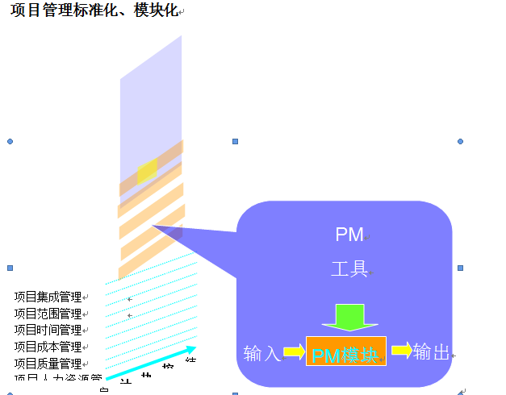
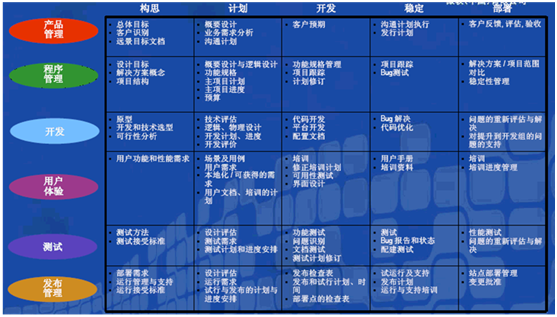
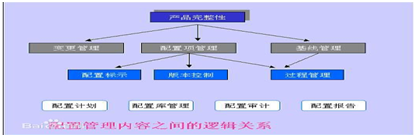
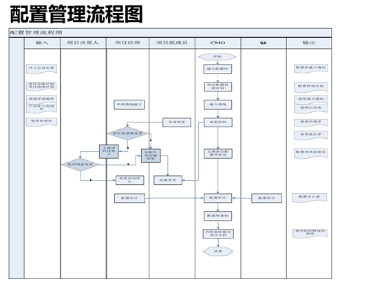

| 序号 | 修改时间   | 修改内容                                                   | 修改人 | 审稿人 |
| ---- | ---------- | ---------------------------------------------------------- | ------ | ------ |
| 1    | 2017-1-27  | 创建                                                       | 吴启福 |        |
| 2    | 2017-2-9   | 增加人员管理章节                                           | 同上   |        |
| 3    | 2017-9-9   | 增加商业管理方法章节                                       | 同上   |        |
| 4    | 2017-11-22 | 增加PL/PM角色认知章节                                      | 同上   |        |
| 5    | 2017-11-17 | 增加持续集成CI章节                                         | 同上   |        |
| 6    | 2018-3-28  | 将CI工具迁移到《运维技术》，增加研发管理、测试管理章节。   | 同上   |        |
| 7    | 2018-4-9   | 增加业务分析BA章节                                         | 同上   |        |
| 8    | 2018-7-26  | 增加质量管理章节，将商业管理方法章节迁移另文《公司管理》。 | 同上   |        |
| 9    | 2019-2-1   | 更新Scrum框架和敏捷看板。                                  | 同上   |        |
| 10   | 2019-3-23  | 更新测试管理章节                                           | 同上   |        |
| 11   | 2019-5-26  | 更新CMM系列章节；新增配置管理章节。                        | 同上   |        |
|   12     | 2020-1-1 | 测试管理章节迁移另文。 | 同上 |        |

---

# 目录

目录

[目录... 1](#_Toc9764664)

[1    概述... 4](#_Toc9764665)

[1.1    名词术语... 4](#_Toc9764666)

[1.2    软件开发模型... 4](#_Toc9764667)

[2    软件过程方法... 5](#_Toc9764668)

[3    项目管理 PM.. 16](#_Toc9764681)

[3.1    项目管理模型... 16](#_Toc9764682)

[3.1.1     PMBOK 2008~项目管理知识体系... 16](#_Toc9764683)

[3.1.2     CMM系列... 18](#_Toc9764684)

[3.1.3     ISO15504~软件过程模型... 20](#_Toc9764685)

[3.1.4     RUP~统一软件过程... 21](#_Toc9764686)

[3.1.5     MSF~Microsoft Solution Framework. 21](#_Toc9764687)

[3.2    项目管理工具... 22](#_Toc9764688)

[3.2.1     项目报表类... 23](#_Toc9764689)

[3.3    本章参考... 23](#_Toc9764690)

[4    质量管理 QA. 24](#_Toc9764691)

[4.1    PDCA环... 24](#_Toc9764692)

[4.2    TOP N.. 24](#_Toc9764693)

[4.2.1     QCC. 24](#_Toc9764694)

[4.3    本章参考... 24](#_Toc9764695)

[5    测试管理... 24](#_Toc9764696)

[6    配置管理... 30](#_Toc9764706)

[6.1    主要概念... 30](#_Toc9764707)

[6.2    配置管理流程... 31](#_Toc9764708)

[6.2.1     基线管理... 31](#_Toc9764709)

[6.2.2     三库管理... 32](#_Toc9764710)

[6.3    配置管理工具... 32](#_Toc9764711)

[6.3.1     配置中心... 33](#_Toc9764712)

[6.4    本章参考... 33](#_Toc9764713)

[7    需求管理... 33](#_Toc9764714)

[8    团队建设... 33](#_Toc9764715)

[8.1    绩效激励... 33](#_Toc9764716)

[8.2    人员配置范例... 33](#_Toc9764717)

[8.3    本章参考... 34](#_Toc9764718)

[参考资料... 34](#_Toc9764719)

[附录... 34](#_Toc9764720)

[专业术语英语发音... 34](#_Toc9764721)

 

 

**表目录**

[表格 1 软件开发模型列表__ 4](#_Toc9764722)

[表格 2 Scrum和XP的差别比较表__ 5](#_Toc9764723)

[表格 3 每日构建与发布流程列表__ 12](#_Toc9764724)

[表格 4 常见的项目管理机构__ 16](#_Toc9764725)

[表格 5 常见项目管理模型列表__ 16](#_Toc9764726)

[表格 6 五大过程组与九大知识域涉及到的各过程__ 17](#_Toc9764727)

[表格 7 CMM系列列表__ 18](#_Toc9764728)

[表格 8 SW-CMM的五个等级及关键过程域__ 19](#_Toc9764729)

[表格 9 项目管理工具总列表__ 22](#_Toc9764730)

[表格 10 各种测试手段比较__ 25](#_Toc9764731)

 

[TOC]

---
# 1 概述

IT管理是企业IT部门的管理职责。对于IT公司，IT管理更是全公司最重要的职责。

# 2 软件过程方法

相关学科：软件工程(软件开发方法学、软件过程管理...)，项目管理学, 工程学。

**备注**: 下文中的*软件开发* 概念广义上等同于*软件过程*，狭义上特指软件过程中的开发阶段。

## 1.1   名词术语
* 软件开发(过程)模型: 瀑布, 原型, 增量, 迭代, 螺旋, 构件, 形式化, CMM, RUP
* 软件过程方法: 敏捷开发Agile
* 软件开发方法: 面向对象OO和面向过程OP
* 敏捷开发Agile: 这是软件过程方法.是指在软件开发过程中选择的一种开发方式.一组开发方式的统称, 包括XP, SCURM, DSDM, FDD等.

**过程**: 过程是为实现一个给定目标而进行的一系列运作*步骤*。过程具有一系列的性质：时间性、并发性、嵌套性和度量性等. 
* DOD：Define of Done，完成的定义。
* WIP：Work In Progress，正在进行的工作。

 

## 1.2   软件开发模型

表格 1 软件开发模型列表

| 软件开发(过程)  模型名称                          | 特点                                                         | 优势                                             | 缺陷                                              | 适用场合                                  |
| ------------------------------------------------- | ------------------------------------------------------------ | ------------------------------------------------ | ------------------------------------------------- | ----------------------------------------- |
| 编码修正模型（Code and Fix Model）                | 编码, 不断修正                                               | 成本可能很低                                     | 对规模大的软件无法控制                            | 小软件                                    |
| 瀑布模型(Waterfall Model）                        | 分为若干阶段,严格按照阶段次序完成,,过程不可逆; 文档驱动;  过程模型的鼻祖. Royce,1970. | 各阶段任务相对独立                               | 1)需求理解可能差在差异;2)不支持迭代; 3)缺乏灵活性 | 适合于小型系统或需求被很好理解的系统      |
| 快速原型法  (Rapid  application development)      | 原型描述了系统的主要功能;用户可以评价需求和设计; 原型驱动;   | 降低成本, 及早发现错误; 改善沟通和部分需求清晰化 | 1)缺少标准;2)缺少控制; 3)增加额外成本.            | 适用于需求模糊或随时间变化的系统          |
| 增量  The  Incremental                            | 迭代的思想; 功能模块驱动;                                    | 迭代增加,风险程序降低                            | 较复杂,且依赖于风险评估技术                       | 适用于明确且易分阶段交付的系统            |
| 螺旋The Spiral                                    | 增加了风险分析                                               |                                                  |                                                   |                                           |
| 构件开发模型CBSD  (Component-Based  Development） | 面向对象技术                                                 | 重用性好                                         |                                                   |                                           |
| 形式化开发模型  (The  Formal Methods Model）      | 需求为详细的形式化描述                                       | 能够产生无缺陷软件                               | 开发费时且昂贵, 不易与用户交流                    | 适应于对安全性,可靠性和保密性要求高的系统 |
| CMM                                               | 软件成熟度模型, SEI提出的过程改进模型                        |                                                  |                                                   |                                           |
| RUP                                               | 增量和迭代开发的改进过程模型                                 |                                                  |                                                   |                                           |
| 敏捷开发                                          | 核心理念: 适应和以人为本.                                    |                                                  |                                                   |                                           |
| DevOps                                            | 开发运维一体化                                               |                                                  |                                                   |                                           |
| IPD                                               | Integrated Product Develop，集成产品开发，类似瀑布模型，是华为的开发方式。 |                                                  |                                                   |                                           |
| 测试驱动开发~TDD                                  | 测试先于编写代码。                                           |                                                  |                                                   | 侧重开发。                                |
| BDD~Behavior Driven Development                   | 形为驱动开发。鼓励开发者、QA和非技术业务的参与。             |                                                  |                                                   | 侧重设计。                                |

 

# 3 项目管理 PM

## 3.1   项目管理模型

表格 3 常见的项目管理机构

| 项目管理机构             | 英文简称 | 知识体系 | 认证体系 |      |
| ------------------------ | -------- | -------- | -------- | ---- |
| 国际项目管理协会         | IPMA     | ICB      | IPMP     |      |
| 美国项目管理学会         | PMI      | PMBOK    | PMP      |      |
| 中国项目管理  研究委员会 | PMRC     | C-PMBOK  | C-NCB    |      |

 

表格 4 常见项目管理模型列表

| 模型名称 | 发布单位      | 简介                                                         |
| -------- | ------------- | ------------------------------------------------------------ |
| PMBOK    | PMI组织       | 项目管理知识体系。PMI严格按照ISO的更新要求，每四年更新一次PMBOK Guide（从1996年开始，2012年是第5版）。  截止2017年，PMBOK把项目管理划分为10大知识领域。 |
| SW-CMM   | SEI/ISO       | 软件过程改善模型。美国卡内基梅隆大学软件研究所于1987年研制成功。  SW-CMM包括5个等级，共计18个[过程域](http://baike.baidu.com/view/998094.htm)，52个目标，300多个关键实践。 |
| ISO15504 | ISO/IEC       |                                                              |
| RUP      | Rational /IBM | 统一软件过程。开发过程的生命周期包括四个阶段、九大核心工作流。 |
| MSF      | MS公司        | 微软解决方案框架。                                           |
| UML      | OMG组织       | 统一建模语言,用于领域建模, Rose全面支持。(用图形来描述)      |

 

### 3.1.1 PMBOK 2008~项目管理知识体系

​     PMBOK是Project Management Body Of Knowledge的缩写， 即项目管理知识体系，是[美国项目管理协会](http://baike.baidu.com/view/3929225.htm)（PMI）对项目管理所需的知识、技能和工具进行的概括性描述。

​    1991年、1996年先后进行了修订，成为现在的项目管理知识体系，简称为PMBoK (Project Management Body of Knowledge )。[国际标准化组织](http://baike.baidu.com/view/42488.htm)以该文件为框架，制订了ISO10006关于项目管理的标准。

 

项目生命期: 启动-->组织和准备-->执行-->结束

五个过程组: initiating, planning, executing, monitoring and controlling, closing

九大知识域: Integration, Scope, Time, Cost, Quality, HR, Communication, Risk, Procurement 

WBS: WORK BREAKDOWN STRUCTRE ,工作分解结构

其它关键词: 甘特图, 基准（BASELINE）、项目干系人, 关键路径和挣值分析.

 

表格 5 五大过程组与九大知识域涉及到的各过程

|                  | 启动过程组                                   | 计划过程组                                               | 执行过程组                     | 控制过程组                     | 收尾过程组 |
| ---------------- | ------------------------------------------------ | ------------------------------------------------------------ | ---------------------------------- | ---------------------------------- | -------------- |
| 项目整体管理 | 制定项目章程 制定项目范围说明书（初步） | 编制项目管理计划                                         | 指导和管理项目实施             | 监控项目工作  综合变更控制 | 项目收尾   |
| 项目范围管理 |                                                  | 范围规划  范围定义  创建WBS                      |                                    | 范围核实  范围控制         |                |
| 项目时间管理 |                                                  | 活动定义、排序、资源估算、历时估算  进度计划编制     |                                    | 进度控制                       |                |
| 项目成本管理 |                                                  | 成本估算  成本预算                                   |                                    | 成本控制                       |                |
| 项目质量管理 |                                                  | 质量计划                                                 | 执行质量保证                   | 执行质量控制                   |                |
| 人力资源管理 |                                                  | 人力资源计划                                             | 获取项目团队  项目团队建设 | 管理项目团队                   |                |
| 项目沟通管理 |                                                  | 沟通计划                                                 | 信息发布                       | 绩效报告  管理项目干系人   |                |
| 项目风险管理 |                                                  | 风险管理计划  风险识别、定性分析、定量分析  风险应对计划 |                                    | 风险监控                       |                |
| 项目采购管理 |                                                  | 采购和获取计划、合同计划                                 | 请求供应商响应、供方选择       | 合同管理                       | 合同收尾   |

备注：PMBOK 2012新增一大过程域~干系人管理。

**示例:项目范围计划模块**

| **输入**                                                     | **工具与技术**                   | **输出**           |
| ------------------------------------------------------------ | -------------------------------- | ------------------ |
| 1.事业环境因素  2.组织过程资产 3. 项目章程  4.项目初步范围说明书  5.项目管理计划 | 1.专家判断 2.模版,表格和标准. | 1 项目范围管理计划 |

 

### 3.1.2 CMM系列

CMM，其英文全称为Capability Maturity Model for Software，即“[能力成熟度模型](http://baike.baidu.com/view/2983754.htm)”。 CMM的核心是把软件开发视为一个过程，并根据这一原则对软件开发和维护进行过程监控和研究，以使其更加科学化、[标准化](http://baike.baidu.com/view/8087.htm)、使企业能够更好地实现商业目标。

CMM的主要发布者是卡内基-梅隆大学（Carnegie-Mellon University）下的软件工程研究中心（Software Engineering Institute，SEI），简称SEICM。1994年SEI首次发布CMM。。

表格 6 CMM系列列表

| CMM系列                                | 简介                              | 说明                            |
| -------------------------------------- | --------------------------------- | ------------------------------- |
| SW-CMM (Software CMM)                  | 软件CMM                           |                                 |
| SE-CMM (System Engineering CMM)        | 系统工程CMM                       | 针对复杂产品。                  |
| SA-CMM (Software Acquisition CMM)      | 软件采购CMM                       |                                 |
| IPT-CMM (Integrated Product Team  CMM) | 集成产品群组CMM                   |                                 |
| P-CMM (People CMM)                     | 人力资源能力成熟度模型            |                                 |
| CMM 2.0                                | 1992年发布。                      |                                 |
| CMMI 1.0                               | 1994年由SEI和美国国防部共同发布。 | 第一个集成模型，包括SE/SW/SA    |
| CMMI 1.1                               |                                   | 包括四个集成成分：SE/SW/IPPD/SS |
| CMMI 1.3                               | 2010年11月SEI 发布                |                                 |
|                                        |                                   |                                 |

备注：1997 年，美国联邦航空管理局（FAA）开发了FAA-iCMMSM（联邦航空管理局的集成CMM），该模型集成了适用于系统工程的SE-CMM、软件获取的SA-CMM 和软件的SW-CMM 三个模型中的所有原则、概念和实践。

#### CMMI

CMMI全称是Capability Maturity Model Integration，即能力成熟度模型集成（也称为 软件能力成熟度集成模型），是美国国防部的一个设想，1994年由美国国防部（United States Department of Defense）与SEICM共同开发和研制的，他们计划把现在所有现存实施的与即将被发展出来的各种能力成熟度模型，集成到一个框架中去，申请此认证的前提条件是该企业具有有效的软件企业认定证书。

CMMI 模型的前身是 SW-CMM 和 SE-CMM。现在主要包括四个领域，分别是SW（软件）/SE（系统工程）/IPPD（集成的产品和过程开发）/SS（采购）。

CMMI主要关注点就是成本效益、明确重点、过程集中和灵活性四个方面。

CMMI的评估过程分为Class A、B 、C三种类型。

 

#### SW-CMM~软件能力成熟度改善模型

​     SW-CMM，常简称为CMM，软件能力成熟度模型。它是对于软件组织在定义、实施、[度量](http://baike.baidu.com/view/707359.htm)、控制和改善其[软件过程](http://baike.baidu.com/view/2207.htm)的实践中各个发展阶段的描述。
能力成熟度模型集成(CMMI® 强调流程+路径优化+正确的人)
持续的能力改进模型(CMMI:阶段式/连续式)

 

表格 7 SW-CMM的五个等级及关键过程域

| 等级\过程分类  | 过程域数 | 管理方面                                                     | 组织方面                             | 工程方面               |
| -------------- | -------- | ------------------------------------------------------------ | ------------------------------------ | ---------------------- |
| CMM 5   优化级 | 3        |                                                              | 技术改造管理  过程改造管理           | 缺陷防范               |
| 可管理级       | 2        | 量化过程管理  软件质量管理                                   |                                      |                        |
| 已定义级       | 7        | 集成软件管理  组间协调                                       | 组织过程焦点  组织过程定义  培训程序 | 软件产品工程  同级评审 |
| 可重复级       | 6        | 需求管理  软件项目计划  软件项目跟踪域监控  软件转包合同管理  软件质量保证  软件配置管理 |                                      |                        |
| 初始级         | 0        | 无序过程                                                     |                                      |                        |

备注：SW-CMM包括5个等级，共计18个[过程域](http://baike.baidu.com/view/998094.htm)，52个目标，300多个关键实践。CMMI-SE/SE也是5个等级，但22个过程域。

 

### 3.1.3 ISO15504~软件过程模型

　[ISO](http://wiki.mbalib.com/wiki/ISO)/IEC 联合信息技术委员会(ISO/IEC JOINT TECHNICAL COMMITTEE FOR INFORMATION TECHNOLOGY )是[国际标准化组织](http://wiki.mbalib.com/wiki/国际标准化组织)（ISO）和国际电工委员会(IEC)联合组建的第一个标准化技术委员会，其编号为JTC1。它在ISO和IEC共同领导下，承担信息技术领域[国际标准](http://wiki.mbalib.com/wiki/国际标准)制定工作，其重要性和影响力非同一般。

​     ISO/IEC 15504 是在ISO/IEC TR 15504 （SPICE）的基础上制订的正式国际标准，这个标准在总结SPICE试验的基础上，继存了ISO/IEC TR 15504 （SPICE）的基本思想和方法的同时，也发生了若干引人注目的变化。

​     ISO/IEC TR 15504 （SPICE）是由9个部分组成. 

　正式标准将ISO/IEC TR 15504的9个部分进行了调整、和合并和修改，使标准更加精简。其主要变更如下： 

　　1) ISO/IEC TR 15504-1 和ISO/IEC TR 15504-9合并、修改为ISO/IEC FDIS 15504-1信息技术－过程评估－第一部分：概念和词汇。 

　　2） ISO/IEC TR 15504-3修改后命名为ISO/IEC 15504-2:2003 信息技术－过程评估－第二部分：实施评估。 

　　3）ISO/IEC TR 15504-4 和ISO/IEC TR 15504-6 合并、修改后命名为ISO/IEC 15504-3:2004 信息技术－过程评估－第三部分：实施评估指南 

　　4） ISO/IEC TR 15504-4 和ISO/IEC TR 15504-6合并、修改后命名为ISO/IEC 15504-4:2004 信息技术－过程评估－第四部分：过程改进和过程能力测定应用指南 

　　5）ISO/IEC TR 15504-2 和ISO/IEC TR 15504-5合并、 修改后命名为ISO/IEC CD 15504-5信息技术－过程评估－第五部分：一个过程评估模型范例 

 

 

图 3 ISO15504~软件过程模型

 

### 3.1.4 RUP~统一软件过程

RUP（Rational Unified Process），[统一软件开发过程](http://baike.baidu.com/view/2235832.htm)，[统一软件过程](http://baike.baidu.com/view/3324129.htm))是一个[面向对象](http://baike.baidu.com/view/125370.htm)且基于网络的程序开发方法论。RUP是以体系结构为中心，用例驱动的迭代增量式软件开发方法。

瑞理统一过程（RUP）是Rational软件公司（Rational公司被IBM并购）创造的软件工程方法[1] 。RUP描述了如何有效地利用商业的可靠的方法开发和部署软件，是一种重量级过程（也被称作厚方法学），因此特别适用于大型软件团队开发大型项目。

 

**开发过程**

RUP中的[软件生命周期](http://baike.baidu.com/view/47193.htm)在时间上被分解为四个顺序的阶段，分别是：初始阶段（Inception）、细化阶段（Elaboration）、构造阶段（Construction）和交付阶段（Transition）。每个阶段结束于一个主要的里程碑（Major Milestones）；每个阶段本质上是两个里程碑之间的时间跨度。在每个阶段的结尾执行一次评估以确定这个阶段的目标是否已经满足。如果评估结果令人满意的话，可以允许项目进入下一个阶段。

 

### 3.1.5 MSF~Microsoft Solution Framework

MSF是一套大型系统开发指南,它描述了如何用组队模型、过程模型和应用模型来开发[Client/Server](http://baike.baidu.com/view/83263.htm)结构的应用程序，是在微软的工具和技术的基础上建立并开发分布式企业系统应用的参考。

MSF指导如何组织人员和项目规划、构建与部署成功的IT 解决方案.(强调人与过程)

MSF包括：
*  两模型: 过程和团队模型
*  三准则: 项目管理, 风险管理, 就绪管理
*  基本原则
*  重要概念
*  经实践检验正确的经验

 

图 4 MSF的人员与项目周期的过程映射表

 

## 3.2   项目管理工具

表格 8 项目管理工具总列表

| 类别       | 工具                       | 详述                                                     | 备注                                                     |
| -------------- | ------------------------------ | ------------------------------------------------------------ | ------------------------------------------------------------ |
| 项目综合  管理 | 甘特图                     | 项目人员的时间分配、项目进度管理。  dotproject：.dot  Microsoft Visio:  .vsd，较简单，无人员分配，无子项目  Microsoft Project：商业付费。  GanttProject：.gan，较简单  [OpenProj](https://sourceforge.net/projects/openproj/): .pod 有人员分配，有子项目缩进 | 推荐：[OpenProj](https://sourceforge.net/projects/openproj/) |
| 文档管理       |                                | 关注团队协作、多版本管理。                                   |                                                              |
|                | wiki                           | 优点：多人协同编辑，有历史版本。  缺点：不能离线看。         |                                                              |
|                | word                           | 缺点：无历史版本，多人协同困难。                             |                                                              |
|                | adoc（付费）                   | 基于SVN，可离线看，也可多人协同编辑                          | 推荐！                                                       |
|                | 云笔记                         |                                                              |                                                              |
| 源码管理       |                                | svn/git/hb                                                   |                                                              |
|                | git                            | 分布式版本管理，可以先在本地提交，再同步到线上。  适用于开源项目；缺点是权限管理较弱。 | 推荐！                                                       |
|                | svn                            | 可对目录进行权限管理。                                       |                                                              |
| 需求管理       |                                |                                                              | 详见 [产品管理](产品管理.MD) |
| BUG管理        |                                | bugzilla/td                                                  |                                                              |
| 测试管理       |                                | 性能测试: ab siege  压力测试: LoadRunner  自动化测试:        | 详见 [测试管理](测试管理.MD) |
| 自动化布署     | docker                         |                                                              | 详见 [docker用户手册](docker用户手册.md) |
| 项目构建       | maven/ant/  make/cmake/  qmake | 构建工具是将软件项目构建相关的过程自动化的工具。             | 详见 [项目开发环境工具](项目开发环境工具.MD) |
| 开发工具       | 主要针对开发人员的工具。       | 语言：C++: g++/gcc；java: eclipse；php   IDE：vim/eclipse  建模：rose/visio/umlbrello  原型：rp | 详见 [项目开发环境工具](项目开发环境工具.MD)                    |

## 3.3 项目交付件

以外包项目为例

外包项目一般分二种，人力外包和项目外包。

表格 敏捷项目的交付件

| 阶段 | 交付件                | 交付件            | 交付件                                                       | 过程活动         |
| ---- | --------------------- | ----------------- | ------------------------------------------------------------ | ---------------- |
|      | BA                    | PM/SM             | 开发测试团队                                                 |                  |
| 需求 | 《SOW》《需求规格书》 | 项目计划/迭代计划 | 需求澄清邮件 需求确认邮件                                    | 需求串讲和反串讲 |
| 设计 |                       |                   | 《概要设计说明》《测试用例设计》                             | 设计评审         |
| 开发 |                       |                   | 源代码                                                       | 代码评审         |
| 测试 |                       |                   | 《SIT测试报告》《UAT测试报告》 《性能测试报告》《测试用例》 | 测试评审         |
| 部署 |                       |                   | 《质量红线》《部署文档》                                     |                  |
| 上线 | UAT确认邮件           | 项目总结/迭代回溯 | 上线通告邮件                                                 |                  |
| 日常 |                       |                   |                                                              | DailyScrum       |

> 备注：1. SOW-Scope of Work 工作范围。
>
> 2. 上面的交付件中测试相关报告稍嫌过多，需要借助CICD工具减少手工生成过程件，得到自动报告。

## 本章参考

[1].   PMBOK http://baike.baidu.com/item/PMBOK

[2].   CMM http://baike.baidu.com/item/CMM 

[3].   RUP http://baike.baidu.com/item/RUP 

# 4 质量管理 QA

 持续改进

* 方法论～PDCA:  Planning计划, Doing实施, Check检查, Action改进。
* 改进方式：TOP N, QCC(Quality Control Circle,品管圈)，7S， 改进建议。
* QC七大工具: 查检表，柏拉图，鱼骨图，直方图，管制图，散布图和层别法。

 

**性能基准测试 benchmarks**

* 数据库： https://db-engines.com/en/

* WEB框架： https://www.techempower.com/benchmarks/

## 4.1   PDCA环

PDCA循环是美国质量管理专家休哈特博士首先提出的，由戴明采纳、宣传，获得普及，所以又称戴明环。全面质量管理的思想基础和方法依据就是PDCA循环。PDCA循环的含义是将质量管理分为四个阶段，即计划（plan）、执行（do）、检查（check）、调整（Action）。

 

## 4.2   TOP N

TOP-N分析法就是通过TOP-N算法从研究对象中得到所需的N个数据，并对这N个数据进行重点分析的方法。

 

## 4.3 QCC

QCC(Quality Control Circle,品管圈)

起始于1950年Deming﹝[戴明](http://wiki.mbalib.com/wiki/戴明)﹞教授的[统计方法](http://wiki.mbalib.com/wiki/统计方法)课程，以及1954年Juran﹝[朱兰](http://wiki.mbalib.com/wiki/朱兰)﹞教授的[质量管理](http://wiki.mbalib.com/wiki/质量管理)课程。

**品管圈**就是由相同、相近或互补之工作场所的人们自动自发组成数人一圈的小圈团体（又称[QC小组](http://wiki.mbalib.com/wiki/QC小组)，一般6人左右），然后全体合作、集思广益，按照一定的活动程序，活用[品管七大手法](http://wiki.mbalib.com/wiki/Category:品管七大手法)（QC7手法），来解决工作现场、管理、文化等方面所发生的问题及课题。它是一种比较活泼的品管形式。品管圈的特点是参加人员强调领导、技术人员、员工三结合。现代的QCC管理内容和目标突破了原有的质量管理范围，向着更高的技术、工艺、管理方面扩展。

 

## 本章参考

 

# 5 需求管理

详见 《[产品管理](./产品管理.md)》。

# 6 测试管理

详见 [测试管理](测试管理.md)

# 7 配置管理

配置管理（Configuration Management，CM）是通过技术或行政手段对软件产品及其开发过程和生命周期进行控制、规范的一系列措施。配置管理的目标是记录软件产品的演化过程，确保软件开发者在[软件生命周期](https://baike.baidu.com/item/软件生命周期/861455)中各个阶段都能得到精确的产品配置。

 

配置管理的概念源于美国空军，为了规范设备的设计与制造，美国空军1962年制定并发布了第一个配置管理的标准“AFSCM375-1，CM During the Development & Acquisition Phases”。

软件配置管理概念的提出则在20世纪60年代末70年代初。当时加利福尼亚大学圣巴巴拉分校的Leon Presser教授在承担美国海军的航空发动机研制合同期间，撰写了一篇名为“Change and Configuration Control”的论文，提出控制变更和配置的概念，这篇论文同时也是他在管理该项目（这个过程进行过近一千四百万次修改）的一个经验总结。

 

软件配置管理可以提炼为三个方面的内容：
* VersionControl-版本控制：能够简单、明确地重现软件系统的任何一个历史版本。
* ChangeControl-变更控制：修订版管理，跟踪每一个变更的创造者、时间和原因，从而加快问题和缺陷的确定。
* ProcessSupport-过程支持，并行开发支持。

## 7.1   概要

### 7.1.1 配置管理内容

**配置管理包含如下内容：**
标识：识别产品的结构、产品的[构件](https://baike.baidu.com/item/构件)及其类型，为其分配唯一的[标识符](https://baike.baidu.com/item/标识符)，并以某种形式提供对它们的存取。
控制：通过一定的机制控制对[配置项](https://baike.baidu.com/item/配置项)的修改。
状态报告：记录并报告配置项以及元数据的状态。
配置审计：确认产品的完整性并维护配置项间的一致性。

说明：配置管理相当于哲学上的3W问题( WHO/WHEN/WHERE )。

 

**关键活动**包括：配置项（基本单位)、工作空间管理、版本控制、变更控制、状态报告、配置审计等。

 

 

**配置识别：**
* 确定需要纳入配置管理的配置项
* 确定配置项的获取时间和所有者
* 为识别的配置项分配唯一的标识

 

### 7.1.2 术语和缩略词

**1）软件配置管理（Software Configuration Management，SCM）**

软件配置管理是对软件修改进行标识、组织和控制的技术，用来协调和控制整个过程。是通过技术或行政手段对软件产品及其开发过程和生命周期进行控制、规范的一系列措施。配置管理的目标是记录软件产品的演化过程，确保软件开发者在软件生命周期中各个阶段都能得到精确的不同版本的产品配置。

**2）配置（Configuration）**

配置是在技术文档中明确说明并最终组成软件产品的功能或物理属性。因此配置包括了即将受控的所有产品特性，其内容及相关文档、软件版本、变更文档、软件运行的支持数据，以及其他一切保证软件一致性的组成要素，相对与硬件类配置，软件产品的配置包括更多的内容并具有易变性。

 

**3）配置项（Configuration Item，CI）**

**配置项**：项目计划书、需求文档、设计文档、源代码、可执行代码、测试用例

凡是纳入配置管理范畴的工作成果统称为配置项（Configuration Item, CI），配置项逻辑上组成软件系统的各组成部分，一般是可以单独进行设计、实施和测试的。一个纯软件的CIs通常也称之为软件配置项（Computer Software Configuration Items，CSCIs）。

配置项主要有两大类：

1)属于产品组成部分的工作成果，例如需求文档、设计文档、源代码、测试用例等；

2)项目管理和机构支撑过程产生的文档。这些文档虽然不是产品的组成部分，但是值得保存。

每个配置项的主要属性有：名称、标识符、文件状态、版本、作者、日期等。所有配置项都被保存在配置库里，确保不会混淆、丢失。配置项及其历史记录反映了软件的演化过程。

 

**4）基线（Baseline）**

**基线**：指一个配置项在其生存周期的某一特定时间，被正式标明、固定并经正式批准的版本。可看作是一个相对稳定的逻辑实体，其组成部分不能被任何人随意修改。

## 7.2   配置管理流程

 

 

表格 12 相关人责任和权利

| 角色                                                | 责任                                                         | 权利                                                         |
| --------------------------------------------------- | ------------------------------------------------------------ | ------------------------------------------------------------ |
| 项目经理（Project Manager，PM）                     | 1)与CCB协商确定项目起始基线和开发里程碑；  2)接受配置管理计划，并按相关规定贯彻执行；  3)接受配置控制委员会的报告。 | 1) 提出配置管理计划的修改要求；  2) 提出管理管理的建议和要求。 |
| 配置控制委员会（Configuration Control Board，CCB）  | 1)   制定和修改项目的配置管理策略；                          | 1) 批准、发布配置管理计划；  2) 建立、更改基线的设置，审核变更申请；  3)根据配置管理员的报告决定相应的对策。 |
| 配置管理员（Configuration Management Officer，CMO） | 1)编制配置管理计划；  2)执行配置项管理方案；  3) 执行版本控制和变更控制方案；  4)编制配置状态报告； | 向CCB汇报有关配置管理流程中的不符合情况。                    |
| 程序库管理员（Program Librarian，PL）               | 1)配置库的建立和权限分配；  2)配置管理工具的日常管理与维护；  3) 配置库的日常操作和维护； | 1)各配置项的管理与维护；  2)对开发人员进行相关的培训。       |
| 开发人员（Developer）                               | 1）根据确定的配置管理计划和相关规定，提交配置项和基线；  2）负责软件集成和版本生成。 | 按照软件配置管理工具的使用模型来完成开发任务。               |
| 测试人员（Tester）                                  | 根据配置管理计划和相关规定，提交测试配置项和测试基线；       | 负责软件变更的测试验证。                                     |
| 软件质量保证员（Software Quality Assurance，SQA）   | 负责配置审核并提交报告。                                     | 对配置审核中发现的不符合项，要求相关责任人进行纠正。         |

 

### 7.2.1 基线管理

在配置管理系统中，基线就是一个CI或一组CIs在其生命周期的不同时间点上通过正式评审而进入正式受控的一种状态，些配置项构成了一个相对稳定的逻辑实体，而这个过程被称为“基线化”。每一个基线都是其下一步开发的出发点和参考点。基线确定了元素（配置项）的一个版本，且只确定一个版本。一般情况下，基线一般在指定的里程碑（Milestone）处创建，并与项目中的里程碑保持同步。每个基线都将接受配置管理的严格控制，基线中的配置项被“冻结”了，不能再被任何人随意修改，对其的修改将严格按照变更控制要求的过程进行，在一个软件开发阶段结束时，上一个基线加上增加和修改的基线内容形成下一个基线。

基线的主要属性有：名称、标识符、版本、日期等。通常将交付给客户的基线称为一个“Release”，为内部开发用的基线则称为一个“Build”。

建立基线的好处：

1)重现性：及时返回并重新生成软件系统给定发布版的能力，或者是在项目中的早些时候重新生成开发环境的能力。当认为更新不稳定或不可信时，基线为团队提供一种取消变更的方法。

2)可追踪性：建立项目工件之间的前后继承关系。目的是确保设计满足要求、代码实施设计以及用正确代码编译可执行文件。

3)版本隔离：基线为开发工件提供了一个定点和快照，新项目可以从基线提供的定点之中建立。作为一个单独分支，新项目将与随后对原始项目（在主要分支上）所进行的变更进行隔离。

 

针对软件过程的不同阶段，主要有六种基线：
* 需求基线：在需求分析完成后建立。
* 设计基线：
* 开发基线：
* 测试基线：
* 发布基线：
* 变更基线：

 

### 7.2.2 三库管理

项目配置管理的库分为开发库、受控库、产品库。这三个库是相互独立的物理库，其中受控库在逻辑上分为配置库和基线库。

备注：TFS管理的三库是CI库、预发布库和发布库，要求最终三库同步。

**1）开发库**

存放代码、脚本等开发过程中的产物。由开发人员使用。

只有开发人员可读和写。开发人员在配置项写入时，必须填写注释信息以标识配置项的功能；配置项变更时注明变更理由。

例如：http://192.168.1.1:3000/TD_GROUP/gateway_portal.git

 

**2）受控库**

保存已被批准的配置项（包括基线）或项目统一管理的过程资产记录，由配置管理员管理与维护。分两类：

1、受控基线库：

存放基线类配置项，由项目配置管理员管理和使用。其变更需要经CCB评审或项目经理批准后，由配置管理员负责检入、检出。

例如：开发人员在源程序编码完毕并自测通过后，提交配置管理员将代码入基线库。架构人员提交经过评审的系统设计文档。

2、受控文档库：

存放各类计划、项目的支持性记录等不是基线的配置项。受控文档库由其项目经理指派人员维护其变更，可不是配置管理员。其变更不需要经过CCB或项目经理审批。

例如：周报、会议纪要、检查单等记录性文件。

 

**3）产品库**

保存发布基线的配置项。作为最终产品存放在产品库，等待交付客户使用，出入库要严格办理手续。例如：通过系统测试的程序包。

 

## 7.3   配置管理工具

一个完整的SCM系统要具有三个核心功能：版本控制、变更控制、配置控制以及两个支持功能：状态统计和配置审计。

**主流配置管理工具：**
* Marc Rochkind的SCCS（Source Code Control System）
* Walter Tichy的RCS（Revision Control System）、
* Microsoft VSS
* 常用开源：CVS、SVN、GIT

 

**配置中心**

问题背景

在应用系统部署过程中，往往会有一些变量配置，这些配置都有一些共有的特性，那就是和业务侧的服务逻辑无关，只和当前的环境和特定场景有关。比如：
* 在开发、测试和生产的环境中，我们使用了不同的数据库；
* 在服务治理中，在开发环境使用直连模式，直连开关为true，在生产环境使用路由模式，直连开关为false；
* 不同的分组和实例中，使用的dubbo服务注册地址和dubbo端口也不同；
* 业务侧配置参数需要紧急修改参数并实时线上生效；

 

## 本章参考

[1].   百度百科-配置管理 https://baike.baidu.com/item/配置管理/10090499 

[2].   配置管理流程 https://www.cnblogs.com/wayne-ivan/articles/525818.html

[3].   配置管理之三类配置库 https://blog.csdn.net/zhiaiqingteng/article/details/79347495

[4].   配置中心——让配置管理更简单 https://cloud.tencent.com/developer/news/199791

# 8 团队建设

团队的四维地图：组织、人员、业务和氛围。

## 8.1   绩效激励

## 8.2   人员配置范例

**139的人员配置：共81人**
* 公共平台开发：12人 
* 基础关系平台：16人 
* 测试组：15人 
* 短彩开发：12人 
* 系统架构：6人 
* 互联网应用开发：20人 

 

**新浪微博的人员配置：共83人**
* PHP开发：35人，8个开发小组 分别由8个高级开发工程师+24个初级工程师，另外还有3个不参与开发，只对开发需求和开发采用的方案做规划和拍板的开发架构师团队，是8年以上开发经验的开发管理人员组成。
* 页面开发：7.5人
* 测试：10人
* 开发项目管理：3人
* 富媒体开发：6.5人
* UI设计师：10人
* 产品设计师：6人
* 产品设计项目管理：5人

 

## 本章参考

 

# 参考资料

**参考书目**

* 王立福 麻志毅 张世琨 编著 《软件工程》 / 北京大学出版社 / 2002-3 

* Tom DeMarco、Timothy Lister / UML China 《人件》/ 清华大学出版社 / 2003-6

* [美] 弗雷德里克·布鲁克斯 / 汪颖 《人月神话》 / 清华大学出版社 / 2002-11 

* [美]Karl E.Wiegers 《软件需求》第2版 / 清华大学出版社 / 2004-11-1

* Andrew Hunt、David Thomas / 马维达译 《程序员修炼之道 : 从小工到专家》/ 电子工业出版社 / 2011-1
      Eric Ris e 《[精益创业](https://baike.baidu.com/item/精益创业/590883)》 2012-8

 

**参考文献**

 

# 附录

## 专业术语英语发音

**新技术、新工具**

thrift  英[θrɪft] n. 节俭，节约； 茁壮成长； 〈英〉繁荣的手段，工作，劳动；

docker英 [ˈdɒkə(r)] 美 [ˈdɑkə(r)]  n. 码头工人

scrum 英 [skrʌm] 美 [skrʌm]  n. 并列争球；扭打，混乱；争夺；v. 参加并列争球；

lamda 英 [ˈlæmdə] 美 ['læmdə]  n. 希腊字母的第 11个字；

 

**SQL**

ascending 英 [ə'sendɪŋ] 美 [əˈsɛndɪŋ]  升序 （在SQL语言中通常是缺省排序项，简称ASC）

descending 简称DESC

 

**OO- Object Oriented**

inherit 继承

delegate 英 [ˈdelɪgət] 美 [ˈdɛlɪˌɡet] 委托

polymorphic   英 [ˌpɒlɪ'mɔ:fɪk] 美 [ˌpɒlɪ'mɔ:fɪk] 多态

---