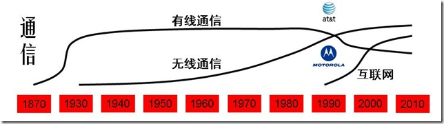
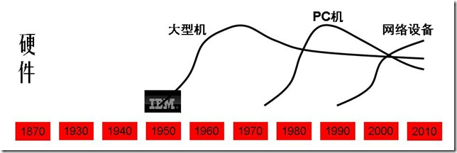

| 序号  | 修改时间      | 修改内容                   | 修改人   | 审稿人 |
| --- | --------- | ---------------------- | ----- | --- |
| 1   | 2023-3-31 | 创建。从《TMT行业指南》拆分相关章节成文。 | Keefe |     |
|     |           |                        |       |     |

    

---

[TOC]

---

# IT史~浪潮之巅

## 内部规律

**计算机工业生态链**

- 摩尔定理
- 安迪-比尔定理：以微软为首的软件开发商吃掉硬件提升带来的全部好处，迫使用户更新机器让惠普和戴尔等公司收益，而这些整机生产厂再向英特尔这样的半导体厂订货购买新的芯片、同时向 Seagat e等外设厂购买新的外设。
- 反摩尔定理

**信息产业的规律性**

- ​    70-20-10定律：信息产业大公司之间的市场份额大概保持老大70%，老二老三20%, 其它10%.
- ​    诺威格定理，当一个公司的市场占有率超过 50% 后，就无法再使市场占有率翻番了。--》公司需要新的增长点。
- ​    基因决定定理

### IT领域的技术生命周期

IT领域主要分为硬件，软件，通信三大块，下面逐一分析每一块的技术生命周期。

#### 通信领域

**包括有线通信，无线通信，互联网**

AT&T(1876—1995—1999) 包括AT&T、朗讯和 NCR, 贝尔实验室和香农试验室。

Motorola (1928—2010)

注：1870年左右AT&T在有线通信的起步阶段。

注：1940年左右AT&T在有线通信的成熟阶段。Motorola在无线通信的起步阶段。

注：1990年左右AT&T在有线通信的衰退阶段。Motorola在无线通信的成长阶段。

小结：AT&T在有线通信领域一直保持领先，直至互联网时代的到来。Motorola在无线通信领域也是一直保持领先，直至互联网时代落后。

#### 硬件领域

按终端产品可分为大型机，PC机和网络设备；按元器件也可细分为半导体，硬盘，内存等。

**IBM: (1923--)** 华生实验室

康柏: (1982--2002) 2002年被惠普收购

Sun: (1982--2009) 2009年被Oracle收购。

备注：1950年左右IBM在大型机市场起步阶段。

备注：1970年左右IBM在大型机市场成熟阶段，并在PC机起步，同时竞争者有Compaq。

备注：2000年左右Dell

#### 软件领域

相比于其他软件行业，中国的互联网行业算是基本跟紧国际潮流，一般晚2到3年。

* 门户：1994年雅虎在美国成立，1997年丁磊创办网易，王志东创办新浪，张朝阳创立搜狐。

* 搜索：1998年谷歌在美国成立，2000年李彦宏创办百度。2004年搜狐-搜狗，2006网易有道。

* 电子商务：1995年亚马逊，eBay创立，1999年马云创建阿里巴巴，沈南鹏创办携程。李国庆创办当当网。2001年搜狐商城。2008年~~百度有啊~~。

* 网游：1999年陈天桥创建盛大。2001年网易大话西游，2003年搜狐骑士。

* 社交网络：1999年马化腾腾讯。2003年Myspace成立，2004年facebook成立。2005年11月校内网创立。2004年网易部落，搜狐白社会。2006年twitter.

* 视频：2005.2 Youtube创立。2004.2土豆创立。2006年Youku成立。

 

## IT编年史

表格  TMT行业国内外大事比较

| 年代        | 产品&关键词              | 国际新创公司                                                | 国内新创公司                                         |
| --------- | ------------------- | ----------------------------------------------------- | ---------------------------------------------- |
| 1865-1919 | 有线通信：电话电报           | AT&T、诺基亚                                              |                                                |
| 1920-1939 | 大型机、收音机             | IBM、摩托罗拉、惠普                                           |                                                |
| 1940-1959 |                     |                                                       |                                                |
| 1960-1979 | 无线通信 企业软件 软件        | Intel、SAP、微软、Apple、Oracle                             |                                                |
| 1980-2009 | 个人电脑 互联网 内容门户 电商    | 康柏、~~Sun~~、思科、DELL、 ~~雅虎~~、谷歌、亚马逊、ebay            | 联想、电信、华为、 中华网、搜狐、新浪、网易、腾讯、 阿里巴巴、百度、当当、京东 |
| 2000-2009 | 移动互联网 社交 网络视频 4G 游戏 | LinkedIn、~~Myspace~~、Facebook、Flicker、Youtube、Twitter | 优酷、土豆、人人网、新浪微博、豆瓣、58同城、盛大                      |
| 2010-2019 | 直播 短视频 5G AI 大数据    | 特斯拉                                                   | 小米、抖音、快手、今日头条、拼多多、比亚迪                          |
| 2020-     | AI 新能源汽车            | OpenAI                                                |                                                |

说明：表中所指公司指年代范围内的后来成为行业领头羊的新创公司或典型代表公司。~~公司~~名加删除线表示此公司没跟上时代发展倒闭或被收购。

### 全球IT编年史

表格   全球IT编年史列表

| Date | 主要事件                                                                                      |
| ---- | ----------------------------------------------------------------------------------------- |
| 1865 | 诺基亚（[Nokia](http://www.nokia.com.cn/)）创立。                                                 |
| 1876 | 亚历山大·贝尔发明了电话，第二年成立了贝尔电话公司。（有线通信）                                                          |
| 1924 | [IBM](http://www.ibm.com/)创立。                                                             |
| 1928 | 加尔文兄弟创办了摩托罗拉的前身加尔文制造公司。                                                                   |
| 1930 | 第一台摩托罗拉牌汽车收音机问世。（无线通信）                                                                    |
| 1939 | [惠普](http://www.hp.com/)公司创立。                                                             |
| ...  |                                                                                           |
| 1968 | [Intel](http://www.intel.com/)创立。                                                         |
| 1972 | SAP创立（系统、应用和产品）。                                                                          |
| 1975 | [Microsoft](http://www.microsoft.com/)创立。                                                 |
| 1976 | [Apple](http://www.apple.com/itunes/)创立。                                                  |
| 1977 | [Oracle](http://www.oracle.com/)埃里森创立。                                                    |
| 1982 | 康柏创立，2002年被惠普收购。Sun创立，2009年被Oracle收购。                                                     |
| 1983 | 摩托罗拉首部商用手机。微软开始了“windows”项目，apple推出麦金托什计划。                                                |
| 1984 | 思科[Cisco](http://www.cisco.com/)成立。[Dell](http://www.dell.com/)成立。                        |
| 1985 |                                                                                           |
| 1991 | Motorola第一个GSM蜂窝系统                                                                        |
| 1992 |                                                                                           |
| 1993 |                                                                                           |
| 1994 | 网景公司浏览器软件占98％市场。雅虎成立。                                                                     |
| 1995 | AT&T 公司重组，分裂成 AT&T、朗讯和 NCR 三家公司。sun发布java语言。微软捆绑IE4。[亚马逊](http://www.amazon.com/)，ebay创立。 |
| ...  |                                                                                           |
| 1998 | [谷歌](http://www.google.com/)成立。AOL收购网景。                                                   |
| 1999 | AT&T 和朗讯公司分别被 SBC 公司和法国的阿尔卡特公司并购。blogger创立。                                               |
| 2001 | AOL与时代华纳并购。                                                                               |
| 2002 | 惠普收购康柏。**eBay收购PayPal。**                                                                  |
| 2003 | 5月LinkedIn 创立；8月myspace创立。甲骨文收购PeopleSoft。**EMC收购VMware。**                                |
| 2004 | 2月[facebook](http://www.facebook.com/)、flicker创立。**联想收购IBM PC。**                          |
| 2005 | 2月youtube创立, 2006年被[谷歌](http://www.google.com/)收购。12月，eBay收购Skype。谷歌收购安卓。                 |
| 2006 | 7月twitter创立。                                                                              |
| 2007 |                                                                                           |
| 2008 | 9月Google G1手机推出；Apple推出iPod及iTunes Store。谷歌收购DoubleClick。**惠普收购EDS。**                     |
| 2009 | 12月，时代华纳剥离AOL;                                                                            |
| 2010 | 甲骨文收购SUN。**惠普收购Palm。Intel收购McAfee.**                                                      |
| 2011 | 5月，微软85亿美元收购Skype；8月，谷歌125亿美元收购摩托罗拉移动业务。                                                  |
| 2012 |                                                                                           |
| 2013 | 9月，微软72亿美元收购诺基亚。                                                                          |
| 2017 |                                                                                           |
| 2021 | 元宇宙元年：上半年，元宇宙第一股Roblox上市；下半年，Facebook改名为元Meta。                                            |

### 中国IT编年史

表格  中国IT编年史列表

| Date      | 主要事件                                                                                                                                                                                                                                                                                                                                                                                                                              |
| --------- | --------------------------------------------------------------------------------------------------------------------------------------------------------------------------------------------------------------------------------------------------------------------------------------------------------------------------------------------------------------------------------------------------------------------------------- |
| 1984~1994 | 1984：联想成立  1985：长城微机0520CH诞生   1987：首封电邮   1988：建科技园(中关村)  1994：第一次接入互联网。                                                                                                                                                                                                                                                                                                                                          |
| 1995~2004 | 1995：8月，水木清华BBS架设。 1997：联通成立。1月，人民网上线。6月，CNNIC成立。   1998，内容门户元年，四大门户搜狐、新浪、网易、腾讯成立。 1999：电子商务元年。中华网在纳斯达克上市，成为第一个中国概念网络股。   2000：内容门户上市年。移动成立，TD成国标。   2001：移动手机元年。龙芯诞生。5月，中国互联网协会成立。   2002：移动手机内容SP元年。 2003：网络游戏元年。淘宝网、支付宝成立。 2004：中国互联网第一波集中上市收割年。                                                                                                                                                  |
| 2005~2014 | 2005：WEB2.0社区内容元年，新浪博客、豆瓣、58同城成立。 百度上市。联想购IBM PC。  2006：网络视频内容元年，酷六、优酷、土豆、迅雷成立。楼宇广告大战成就众多传媒公司，如分众。 2007：电子商务调整成长。阿里巴巴B2B香港上市。 2008：智能手机元年。网民世界第一，CN域名注册总量世界第一。   2009：产品大战年。奇虎360发布永久免费的杀毒软件，开创互联网盈利新模式。双十一购物首度开始。   2010：电商暴发年，团购百团大战。 2011：中国移动互联网元年。国家互联网信息办公室成立。    2012：中国移动互联网发展年，手机网民数量超过电脑网民数量。联想全球第一大PC厂商(超过HP)，华为全球第一大电信设备商(超过爱立信)。   2013：中国首批4G牌照发放。大数据元年。  2014：中国企业服务元年。阿里巴巴上市纽交所。 |
| 2015~2019 | 2015：中国互联网金融元年，扫码支付。 2016：智能元年。共享单车大战。 2017：新零售元年。5月，世界首台光量子计算机在中国诞生。10月，中科院和阿里云合作发布量子云计算平台。 2018：区块链。 2019：AI、5G、区块链、机器人、VR、AI寻人、智能家居、物联网、刷脸支付、AR。                                                                                                                                                                                                                                                                   |
| 2020-2024 | 2020：健康码、云、反垄断、直播带货、地摊经济、北斗、社区团购、P2P、长租公寓、视频号。信创产业落地元年。 2021：反垄断、互联互通、数据安全、碳中和、产业互联网、合规、硬科技、元宇宙、出海、助农。 2022：                                                                                                                                                                                                                                                                                                              |

> 中国新四大发明（2015年左右出现的段子）：高铁、共享单车、支付宝和网购。
> 
> 中国新基建：新型基础建设设施，出现于2019年政府工作报告，此后出现信创产业。

1. 2021年：
   - 反垄断大年：11月国家反垄断局正式成立。反垄断处罚案例高达118起，其中互联网占75.42%；互联网反垄断罚款超200亿元。7月阿里巴巴因涉及“二选一”行为被罚182.28亿元；叫停斗鱼虎牙合并。
   - 互联互通元年：9月整治网址屏蔽。数据安全元年：《数据安全法》和《个人信息安全保护法》。碳中和元年：年初，碳中和写入政府工作报告，成为国家战略。

 

## 本章参考

2. 吴军，《Google 黑板报─浪潮之巅》，2005
3. 吴军，浪潮之巅，电子工业出版社，2011-8
4. 中国互联网之二十年：1994-2014  http://www.cac.gov.cn/2014-11/16/c_1113265290.htm
5. 中国互联网20年简史（1998-2018）：其中的规律与本质是什么？  www.cniteyes.com/archives/33211   2018.7
6. 2019十大年度科技关键词  https://tech.sina.com.cn/roll/2019-12-25/doc-iihnzhfz8240108.shtml
7. 2020中国互联网哈哈榜之4：十大关键词  https://t.cj.sina.com.cn/articles/view/1455643221/56c35a5501900ykvo
8. 2022年，互联网10大关键词 https://new.qq.com/omn/20211228/20211228A05ZX800.html
9. 十分钟速览新中国成立70年通信行业发展史 https://zhuanlan.zhihu.com/p/84759595

  

# 参考资料

相关文章：

* 《TMT人物》《TMT行业巨头》《[TMT行业指南.md](./TMT行业指南.md)》

**参考书目**

* 方兴东，IT史记，中信出版社，2004-1-1
* 吴军，浪潮之巅，电子工业出版社，2011-8
* 吴晓波 《腾讯传》 浙江大学出版社  2017-1