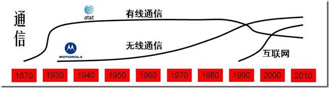

| 序号 | 修改时间  | 修改内容                                  | 修改人 | 审稿人 |
| ---- | --------- | ----------------------------------------- | ------ | ------ |
| 1    | 2023-3-31 | 创建。从《TMT行业指南》拆分相关章节成文。 | Keefe  |        |
|      |           |                                           |        |        |

    

---

[TOC]

---

# IT史~浪潮之巅

## 内部规律

**计算机工业生态链**

-  摩尔定理
-  安迪-比尔定理：以微软为首的软件开发商吃掉硬件提升带来的全部好处，迫使用户更新机器让惠普和戴尔等公司收益，而这些整机生产厂再向英特尔这样的半导体厂订货购买新的芯片、同时向 Seagat e等外设厂购买新的外设。
-  反摩尔定理

**信息产业的规律性**

- ​    70-20-10定律：信息产业大公司之间的市场份额大概保持老大70%，老二老三20%, 其它10%.
- ​    诺威格定理，当一个公司的市场占有率超过 50% 后，就无法再使市场占有率翻番了。--》公司需要新的增长点。
- ​    基因决定定理

### IT领域的技术生命周期

IT领域主要分为硬件，软件，通信三大块，下面逐一分析每一块的技术生命周期。

#### 通信领域

**包括有线通信，无线通信，互联网**

AT&T(1876—1995—1999) 包括AT&T、朗讯和 NCR, 贝尔实验室和香农试验室。

Motorola (1928—2010)

**注：1870年左右AT&T在有线通信的起步阶段。**

**注：1940年左右AT&T在有线通信的成熟阶段。Motorola在无线通信的起步阶段。**

**注：1990年左右AT&T在有线通信的衰退阶段。Motorola在无线通信的成长阶段。**

小结：AT&T在有线通信领域一直保持领先，直至互联网时代的到来。Motorola在无线通信领域也是一直保持领先，直至互联网时代落后。

#### 硬件领域

**主要分大型机，PC机和网络设备。也可细分为半导体，硬盘，内存等。**

**IBM: (1923--)** 华生实验室

康柏: (1982--2002) 2002年被惠普收购

Sun: (1982--2009) 2009年被Oracle收购。

备注：1950年左右IBM在大型机市场起步阶段。

备注：1970年左右IBM在大型机市场成熟阶段，并在PC机起步，同时竞争者有Compaq。

备注：2000年左右Dell

#### 软件领域

相比于其他软件行业，中国的互联网行业算是基本跟紧国际潮流，一般晚2到3年。
**门户**：1994年雅虎在美国成立，1997年丁磊创办网易，王志东创办新浪，张朝阳创立搜狐。
**搜索**：1998年谷歌在美国成立，2000年李彦宏创办百度。2004年搜狐-搜狗，2006网易有道。
**电子商务**：1995年亚马逊，eBay创立，1999年马云创建阿里巴巴，沈南鹏创办携程。李国庆创办当当网。2001年搜狐商城。2008年~~百度有啊~~。
**网游**：1999年陈天桥创建盛大。2001年网易大话西游，2003年搜狐骑士。
**社交网络**：1999年马化腾腾讯。2003年Myspace成立，2004年facebook成立。2005年11月校内网创立。2004年网易部落，搜狐白社会。2006年twitter.

**视频**：2005.2 Youtube创立。2004.2土豆创立。2006年Youku成立。

 

## IT编年史

表格  TMT行业国内外大事比较

| 年代      | 产品&关键词                      | 国际新创公司                                               | 国内新创公司                                                 |
| --------- | -------------------------------- | ---------------------------------------------------------- | ------------------------------------------------------------ |
| 1865-1919 | 有线通信：电话电报               | AT&T、诺基亚                                               |                                                              |
| 1920-1939 | 大型机、收音机                   | IBM、摩托罗拉、惠普                                        |                                                              |
| 1940-1959 |                                  |                                                            |                                                              |
| 1960-1979 | 无线通信 企业软件 软件           | Intel、SAP、微软、Apple、Oracle。                          |                                                              |
| 1980-2009 | 个人电脑 互联网 内容门户 电商    | 康柏、~~Sun~~、思科、DELL、雅虎、谷歌、亚马逊、ebay        | 联想、电信、华为、搜狐、新浪、网易、腾讯、阿里巴巴、中华网、百度、当当、京东 |
| 2000-2009 | 移动互联网 社交 网络视频 4G 游戏 | LinkedIn、~~Myspace~~、Facebook、Flicker、Youtube、Twitter | 优酷、土豆、人人网、新浪微博、豆瓣、58同城、盛大             |
| 2010-2019 | 直播 短视频 5G AI 大数据         | 特斯拉                                                     | 小米、抖音、快手、今日头条、                                 |
| 2020-     |                                  |                                                            |                                                              |

说明：表中所指公司指年代范围内的后来成为行业领头羊的新创公司或典型代表公司。~~公司~~名加删除线表示此公司没跟上时代发展倒闭或被收购。

### 全球IT编年史

表格   全球IT编年史列表

| Date | 主要事件                                                     |
| ---- | ------------------------------------------------------------ |
| 1865 | 诺基亚（[Nokia](http://www.nokia.com.cn/)）创立。            |
| 1876 | 亚历山大·贝尔发明了电话，第二年成立了贝尔电话公司。（有线通信） |
| 1924 | [IBM](http://www.ibm.com/)创立。                             |
| 1928 | 加尔文兄弟创办了摩托罗拉的前身加尔文制造公司。               |
| 1930 | 第一台摩托罗拉牌汽车收音机问世。（无线通信）                 |
| 1939 | [惠普](http://www.hp.com/)公司创立。                         |
| ...  |                                                              |
| 1968 | [Intel](http://www.intel.com/)创立。                         |
| 1972 | SAP创立（系统、应用和产品）。                                |
| 1975 | [Microsoft](http://www.microsoft.com/)创立。                 |
| 1976 | [Apple](http://www.apple.com/itunes/)创立。                  |
| 1977 | [Oracle](http://www.oracle.com/)埃里森创立。                 |
| 1982 | 康柏创立，2002年被惠普收购。Sun创立，2009年被Oracle收购。    |
| 1983 | 摩托罗拉首部商用手机。微软开始了“windows”项目，apple推出麦金托什计划。 |
| 1984 | 思科[Cisco](http://www.cisco.com/)成立。[Dell](http://www.dell.com/)成立。 |
| 1985 |                                                              |
| 1991 | Motorola第一个GSM蜂窝系统                                    |
| 1992 |                                                              |
| 1993 |                                                              |
| 1994 | 网景公司浏览器软件占98％市场。雅虎成立。                     |
| 1995 | AT&T 公司重组，分裂成 AT&T、朗讯和 NCR 三家公司。sun发布java语言。微软捆绑IE4。[亚马逊](http://www.amazon.com/)，ebay创立。 |
| ...  |                                                              |
| 1998 | [谷歌](http://www.google.com/)成立。AOL收购网景。            |
| 1999 | AT&T 和朗讯公司分别被 SBC 公司和法国的阿尔卡特公司并购。blogger创立。 |
| 2001 | AOL与时代华纳并购。                                          |
| 2002 | 惠普收购康柏。**eBay收购PayPal。**                           |
| 2003 | 5月LinkedIn 创立；8月myspace创立。甲骨文收购PeopleSoft。**EMC收购VMware。** |
| 2004 | 2月[facebook](http://www.facebook.com/)、flicker创立。**联想收购IBM PC。** |
| 2005 | 2月youtube创立, 2006年被[谷歌](http://www.google.com/)收购。12月，eBay收购Skype。谷歌收购安卓。 |
| 2006 | 7月twitter创立。                                             |
| 2007 |                                                              |
| 2008 | 9月Google G1手机推出；Apple推出iPod及iTunes Store。谷歌收购DoubleClick。**惠普收购EDS。** |
| 2009 | 12月，时代华纳剥离AOL;                                       |
| 2010 | 甲骨文收购SUN。**惠普收购Palm。Intel收购McAfee.**            |
| 2011 | 5月，微软85亿美元收购Skype；8月，谷歌125亿美元收购摩托罗拉移动业务。 |
| 2012 |                                                              |
| 2013 | 9月，微软72亿美元收购诺基亚。                                |
| 2017 |                                                              |
| 2021 | 元宇宙元年：上半年，元宇宙第一股Roblox上市；下半年，Facebook改名为元Meta。 |

### 中国IT编年史

表格  中国IT编年史列表

| Date      | 主要事件                                                     |
| --------- | ------------------------------------------------------------ |
| 1984~1994 | 1984：联想成立  1985：长城微机0520CH诞生   1987：首封电邮   1988：建科技园(中关村)  1994：第一次接入互联网。 |
| 1995~2004 | 1995：8月，水木清华BBS架设。 1997：联通成立。1月，人民网上线。6月，CNNIC成立。   1998，内容门户元年，四大门户搜狐、新浪、网易、腾讯成立。 1999：电子商务元年。中华网在纳斯达克上市，成为第一个中国概念网络股。   2000：内容门户上市年。移动成立，TD成国标。   2001：移动手机元年。龙芯诞生。5月，中国互联网协会成立。   2002：移动手机内容SP元年。 2003：网络游戏元年。淘宝网、支付宝成立。 2004：中国互联网第一波集中上市收割年。 |
| 2005~2014 | 2005：WEB2.0社区内容元年，新浪博客、豆瓣、58同城成立。 百度上市。联想购IBM PC。  2006：网络视频内容元年，酷六、优酷、土豆、迅雷成立。楼宇广告大战成就众多传媒公司，如分众。 2007：电子商务调整成长。阿里巴巴B2B香港上市。 2008：智能手机元年。网民世界第一，CN域名注册总量世界第一。   2009：产品大战年。奇虎360发布永久免费的杀毒软件，开创互联网盈利新模式。双十一购物首度开始。   2010：电商暴发年，团购百团大战。 2011：中国移动互联网元年。国家互联网信息办公室成立。    2012：中国移动互联网发展年，手机网民数量超过电脑网民数量。联想全球第一大PC厂商(超过HP)，华为全球第一大电信设备商(超过爱立信)。   2013：中国首批4G牌照发放。大数据元年。  2014：中国企业服务元年。阿里巴巴上市纽交所。 |
| 2015~2019 | 2015：中国互联网金融元年，扫码支付。 2016：智能元年。共享单车大战。 2017：新零售元年。5月，世界首台光量子计算机在中国诞生。10月，中科院和阿里云合作发布量子云计算平台。 2018：区块链。 2019：AI、5G、区块链、机器人、VR、AI寻人、智能家居、物联网、刷脸支付、AR。 |
| 2020-2024 | 2020：健康码、云、反垄断、直播带货、地摊经济、北斗、社区团购、P2P、长租公寓、视频号。信创产业落地元年。 2021：反垄断、互联互通、数据安全、碳中和、产业互联网、合规、硬科技、元宇宙、出海、助农。 2022： |

> 中国新四大发明（2015年左右出现的段子）：高铁、共享单车、支付宝和网购。
>
> 中国新基建：新型基础建设设施，出现于2019年政府工作报告，此后出现信创产业。

1. 2021年：
   - 反垄断大年：11月国家反垄断局正式成立。反垄断处罚案例高达118起，其中互联网占75.42%；互联网反垄断罚款超200亿元。7月阿里巴巴因涉及“二选一”行为被罚182.28亿元；叫停斗鱼虎牙合并。
   - 互联互通元年：9月整治网址屏蔽。数据安全元年：《数据安全法》和《个人信息安全保护法》。碳中和元年：年初，碳中和写入政府工作报告，成为国家战略。

## 伟大明星公司

说明：伟大明星公司不仅指市值靠前、行业巨头，还引领了社会和科技变革。靠垄断形成巨额利润而对社会贡献不显著的公司不列其中。

表格 伟大的明星公司列表

| 公司名    | 成立时间 | 创始人                                                       | 简介                                                       | 主要事件                                                     |
| --------- | -------- | ------------------------------------------------------------ | ---------------------------------------------------------- | ------------------------------------------------------------ |
| IBM       | 1924     |                                                              | 百年深蓝。多次成功战略转型。                               | 1964年推出大型机。1995后客户导向，提供解决方案。 2005年从硬件转型咨询服务（卖掉PC）。2010年系统整合。 |
| Intel     | 1968     |                                                              | Win-Intel联盟从80年代开始垄断PC市场近40年。                | 1971年，英特尔推出世界上第一款商用计算机微处理器4004。       |
| Microsoft | 1975     | [比尔·盖茨](http://baike.baidu.com/view/2075.htm) (Bill Gates)  1955-- | 80年代至今垄断个人电脑OS。2010后成为云服务领导者之一。     | 1983年推出Windows操作系统。2010年推出Azure。                 |
| Apple     | 1976     | [史蒂夫乔布斯](http://baike.baidu.com/view/90660.htm) (Steve Paul Jobs) 1955--2011 | 围绕Apple构建的软硬件生态。硬件有手机、电脑、PAD等。       | 1984年推出Macintosh电脑。2007年推出iPhone手机。              |
| 华为      | 1987     | 任正非  1944-                                                | 通讯行业领导者、手机领导者之一。                           | 2013年后，通讯设备市场占有率全球第一。                       |
| Amazon    | 1995     | 杰夫·贝索斯 (Jeff Bezos)   1964--                         | 电商巨头，云服务时代的领导者。                             | 2006年推出云平台。                                           |
| Google    | 1998     | [拉里.佩奇](http://baike.baidu.com/view/251897.html) (Larry Page)  1973-- | 最伟大的搜索引擎公司。产品软件有搜索、地图；硬件有手机等。 | 2006年收购Youtube；2008年推出手机。                          |
| 腾讯      | 1998     | 马化腾 1971-                                                 | 中国网络社交领导者，世界第一大游戏公司。                   |                                                              |
| 阿里巴巴  | 1999     | 马云 1964-                                                   | 电商领导者，云服务领导者。                                 |                                                              |
| Facebook  | 2004     | [克·扎克伯格](https://baike.baidu.com/item/马克·扎克伯格/9760094) (Mark Zuckerberg)   1984- | 网络社交领导者。2021年改名Meta。                           | 2012年4月10亿美元收购Instagram；10月纳斯达克上市。  2014年190亿美元收购WhatsApp。 |

备注：表格按成立时间排序，已经倒闭的明星公司另外列表。

### Google(1998--)

[Google Timeline](http://www.google.com/corporate/timeline/#start)

[拉里.佩奇](http://baike.baidu.com/view/251897.html)(Larry Page) 1973---xxxx

表格 43 谷歌发展史表

| Date      | 主要事件                                                     |
| --------- | ------------------------------------------------------------ |
| 1996-1997 | BackRub                                                      |
| 1998      | Google的第一个首页                                           |
| 1999      | 山姆大叔首页, 获红杉资本2500万美元风投                       |
| 2000      | Google成为Yahoo搜索服务合作伙伴,  推出Adword服务             |
| 2001      | Google图片搜索                                               |
| 2002      | Google Search Appliance – GSA; 5月推出 Labs；9月推出新闻搜索服务 |
| 2003      | Adsense；收购 [Blogger](http://www.blogger.com/) 的开发公司 Pyra Labs。 |
| 2004      | 推出Gmail; 推出Orkut；8月上市。                              |
| 2005      | 2月推出Google Maps地图; CodeSearch; Google Analytics; Google Reader; 七月推出Google Earth；收购Android。 |
| 2006      | 10月收购Youtube; 推出Trends服务；Gchat, Google Calenda, Translate |
| 2007      | 11月推出Android                                              |
| 2008      | 8月推出Chrome；9月第一款Google手机HTC G1；搜索添加了Google Suggest功能。收购DoubleClick。 |
| 2009      | Google Wave（1年后关闭）; 推出 Picasa;                       |
| 2010      | 应用商店Android Market; Buzz服务; Google TV;                 |
| 2011      | Google+；8月，125亿美元收购摩托罗拉移动业务。                |
| 2012      |                                                              |
| 2013      | 7.1，关闭Reader服务；                                        |
| 20xx      |                                                              |

### Apple(1976--)

http://it.icxo.com/specialreport/ITIndex/apple.html

[史蒂夫乔布斯](http://baike.baidu.com/view/90660.htm)（Steve Paul Jobs）1955~2011

Apple通过五款产品影响世界，分别是iPhone、iPad、Mac、AppleWatch和AppleTV。

表格 44  苹果发展史表

| Date      | 主要事件                                                     |
| --------- | ------------------------------------------------------------ |
| 1976      | [史蒂夫·乔布斯](http://zh.wikipedia.org/wiki/史蒂夫·乔布斯)、[史蒂夫·沃茲尼亚克](http://zh.wikipedia.org/wiki/史蒂夫·沃茲尼克)和[罗纳德‧韦恩](http://zh.wikipedia.org/w/index.php?title=羅納德‧韋恩&action=edit&redlink=1)在车库里创建苹果公司。 |
| 1977      | Apple II问世。在电脑界被广泛誉为缔造家庭电脑市场的产品。     |
| 1980      | 公司上市。                                                   |
| 1983      | 图形电脑[Lisa](http://zh.wikipedia.org/wiki/Apple_Lisa)问世，但过于昂贵，1986年终止销售。 |
| 1984      | Macintosh电脑问世。                                          |
| 1985—2000 | 长达十五年的低谷. 乔布斯离开APPLE公司时间（1985—1998）.      |
| 2001      | [Mac OS X](http://zh.wikipedia.org/wiki/Mac_OS_X)问世。开设[苹果零售店](http://zh.wikipedia.org/wiki/苹果零售店)iTunes。10月推出[iPod](http://zh.wikipedia.org/wiki/IPod)。 |
| 2004      |                                                              |
| 2005      |                                                              |
| 2006      | 推出个人电脑[iMac](http://zh.wikipedia.org/wiki/IMac)        |
| 2007      | 1月推出[iPhone](http://zh.wikipedia.org/wiki/IPhone)手机。   |
| 2008      | 推出了iPod及iTunes Store                                     |
| 2009      |                                                              |
| 2010      | 1月推出[平板电脑](http://zh.wikipedia.org/wiki/平板電腦)产品[iPad](http://zh.wikipedia.org/wiki/IPad)。 |
| 2011      | 3月推出[iPad 2](http://zh.wikipedia.org/wiki/IPad_2)。6月推出Mac Os X lion、ios 5、icloud。10月5日推出iPhone 4S。 10月6日[乔布斯](http://zh.wikipedia.org/wiki/喬布斯)病逝。125亿美元收购摩托罗拉移动。 |
| 2012      | 9月13日推出iPhone5；                                         |
| 2017      | 9月，推出iphone8。编程语言swift4.0发布。IOS 11发布。         |
| 2022      | 3月9日，54亿美元收购Mandiant。                               |

### MS(1975--)

http://it.icxo.com/specialreport/ITIndex/microsoft.html

[比尔·盖茨](http://baike.baidu.com/view/2075.htm)(Bill Gates) 1955—xxxx

表格 45  微软发展史表

| Date | 主要事件                                                     |
| ---- | ------------------------------------------------------------ |
| 1980 | MS-DOS系统                                                   |
| 1983 | 微软开始了“windows”项目                                      |
| 1985 | 历时2年的windows1.0问世                                      |
| 1990 | windows3.0推出。                                             |
| 1995 | 微软进军互联网，免费提供IE4                                  |
| 1998 | windows98                                                    |
| 2000 | Windows 2000                                                 |
| 2001 | 11月Windows XP发布。                                         |
| 2006 |                                                              |
| 2008 | 6.27，[比尔·盖茨](http://baike.baidu.com/view/2075.htm)宣布退休。 |
| 2009 | 推出windows7                                                 |
| 2010 | 启动Azure。                                                  |
| 2011 | 5月，85亿美元收购Skype。                                     |
| 2012 | 8月，淘汰Hotmail邮箱；10月，推出Windows8(Win8)。             |
| 2013 | 9月，72亿美元收购诺基亚。                                    |
| 2014 | 8月，MSN彻底退出全球最后一个市场~中国，用Skype替代。         |
| 2016 | 6月，262亿美元收购领英（LinkedIn）。                         |

### IBM(1924--)

http://it.icxo.com/specialreport/ITIndex/IBM.htm

创建于1924年的百年老店，蓝色巨人。 IBM到现在仍然是世界上第二大软件公司、第二大数据库公司、第二大服务器公司、第三大安全软件公司、第六大咨询公司，连续14年是最大的应用基础设施和中间件公司。

表格 46 IBM发展史表

| Date | 主要事件                                                 |
| ---- | -------------------------------------------------------- |
| 1911 | 加入CTR                                                  |
| 1924 | CTR改名为IBM。由华生创建，但是当时主要从事机械制表工业。 |
| 1952 | 冯· 诺伊曼做顾问，开始领导电子技术革命的浪潮。           |
| 1964 | IBM360系列电脑的推出, 占据了20年的大型机市场。           |
| 1981 | IBM PC问世，一经推出就抢掉了apple四分之三的市场。        |
| 1987 | IBM宣布推出OS/2操作系统                                  |
| 2002 | IBM以30亿美元出售硬盘部门给日本的日立公司。              |
| 2003 |                                                          |
| 2004 | IBM 以17.5亿美元出售笔记本电脑部门给中国的联想公司。     |
| 2005 | IBM 将自己确立为一个服务型的技术公司。                   |
| 2010 |                                                          |
| 2014 | IBM 以23亿美元出售X86服务器部门给中国的联想公司 。       |
| 2018 | 340亿美元收购Redhat。                                    |
|      |                                                          |

### 已经消失的明星公司

表格 47 已经消失的明星公司列表

| 名称                    | 简介                         | 简介（大事记）                                               | 创建时间 | 结束时间 |
| ----------------------- | ---------------------------- | ------------------------------------------------------------ | -------- | -------- |
| Compq.康柏              | 服务器和桌面电脑前巨头之一。 | 1983年：生产IBM兼容机。1998年收购[迪吉多](http://zh.wikipedia.org/wiki/迪吉多)。  2002年被惠普收购。 | 1982     | 2002     |
| Sun                     | 开源巨头。                   | 1986年在美国纳斯达克上市。主要产品是[工作站](http://zh.wikipedia.org/wiki/工作站)、[服务器](http://zh.wikipedia.org/wiki/服务器)和[UNIX](http://zh.wikipedia.org/wiki/UNIX) [操作系统](http://zh.wikipedia.org/wiki/作業系統)。  1995年Sun开发了[Java](http://zh.wikipedia.org/wiki/Java)技术。2000年，开放StarOffice源代码生成社区开发版OpenOffice。  2009年被Oracle收购。 | 1982     | 2009     |
| AT&T.美国电话和电报公司 | 通讯行业1-2G的前巨头。       | 1876年，亚历山大·贝尔发明了电话，第二年成立了贝尔电话公司。  1999，朗讯被法国的阿尔卡特并购.  AT&T被西南贝尔（SBC） 公司并购。  2015.12, 阿尔卡特-朗讯被诺基亚收购。 | 1877     | 2015     |
| Yahoo.雅虎              | 互联网先驱                   | 2016.7，Verizon斥资48亿美元收购雅虎互联网资产，雅虎仅余下雅虎日本和阿里巴巴的股份。 | 1994     | 2016     |
| Motorola.摩托罗拉       | 通讯行业2G、3G的领导者之一   | 1928年，加尔文兄弟创办了摩托罗拉的前身加尔文制造公司。  2011年：Google 172亿美元收购摩托罗拉移动。 2014年1月30日，联想集团以29亿美元的价格从[谷歌](http://product.yesky.com/mobilephone/google/)手中收购了[摩托罗拉](http://product.yesky.com/mobilephone/motorola/)移动。 | 1928     |          |
| Nokia.诺基亚            | 通讯行业2G、3G的领导者之一   | 成立于1865年，是一家总部位于芬兰埃斯波，主要从事生产移动通信产品的跨国公司。自1996年以来，诺基亚连续14年占据市场份额第一。  2013年，微软72亿美元（54.4亿欧元）收购诺基亚设备与服务部门（诺基亚手机业务）。 | 1865     |          |

备注：排序先按结束时间升序，再按创建时间升序。

**AT&T:** 美国电话和电报公司（1877—2000）

1876年，亚历山大·贝尔发明了电话，第二年成立了贝尔电话公司。

1885年，AT&T作为贝尔电话公司的子公司诞生，专门经营长途电话业务。

1892生意扩展到纽约之外； 1915年扩展到全国。1927年扩展到欧洲；

1925年成立贝尔实验室（历史最大的、最成功的私有实验室）。

1984年市话业务分出去。

1995，AT&T 公司重组为三个部分，从事电信业务的 AT&T，从事设备制造业务的朗讯 Lucent 和从事计算机业务的NCR。1999, AT&T 移动（AT&T　wireless）单独上市，市值100亿美元。

**结局**：1999，朗讯被法国的阿尔卡特并购，AT&T被西南贝尔（SBC） 公司并购。2015.12, 阿尔卡特-朗讯被诺基亚收购。

**Motorola**：摩托罗拉（1928—2011--）

1928年，加尔文兄弟创办了摩托罗拉的前身加尔文制造公司。

1930年：第一台摩托罗拉牌汽车收音机问；

1940年，研发推出手提式调幅(AM)无线对讲机“SCR536”。

1943年：背负式调频步话机SCR300。

1947年，加尔文制造公司更名为摩托罗拉公司。

1969年7月，阿波罗11号飞船安装了摩托罗拉的无线应答器，用于传递地球与月球间的语音通讯和电视信号。

1974年：摩托罗拉mc6800

1983年：首部商用手机

1986年：六西格玛

1991年：第一个GSM蜂窝系统。

到九十年代初，摩托罗拉在移动通信、数字信号处理和计算机处理器三个领域都处于世界领先。

1991 年：摩托罗拉公司联合了好几家投资公司，正式启动了“铱星计划”。 1996 年，第一颗铱星上天；1998 年整个系统顺利投入商业运营。2000 年 3 月 18 日，铱星公司正式破产。由于错过了GSM的发展，在无线通信上输给了诺基亚，在处理器输给了英特尔，在数字信号处理输给了德州仪器。

2011年：Google 172亿美元收购摩托罗拉移动。

2014年1月30日，联想集团以29亿美元的价格从谷歌手中收购了摩托罗拉移动。

**Nokia 诺基亚**（1865—2013--?）

成立于1865年，是一家总部位于芬兰埃斯波，主要从事生产移动通信产品的跨国公司。自1996年以来，诺基亚连续14年占据市场份额第一。面对新操作系统的智能手机的崛起，诺基亚全球手机销量第一的地位在2011年第二季被苹果及三星双双超越。

2013年，微软72亿美元（54.4亿欧元）收购诺基亚设备与服务部门（诺基亚手机业务）。

 

## 本章参考

2. 吴军，《Google 黑板报─浪潮之巅》，2005
3. 吴军，浪潮之巅，电子工业出版社，2011-8
4. 中国互联网之二十年：1994-2014  http://www.cac.gov.cn/2014-11/16/c_1113265290.htm
5. 中国互联网20年简史（1998-2018）：其中的规律与本质是什么？  www.cniteyes.com/archives/33211   2018.7
6. 2019十大年度科技关键词  https://tech.sina.com.cn/roll/2019-12-25/doc-iihnzhfz8240108.shtml
7. 2020中国互联网哈哈榜之4：十大关键词  https://t.cj.sina.com.cn/articles/view/1455643221/56c35a5501900ykvo
8. 2022年，互联网10大关键词 https://new.qq.com/omn/20211228/20211228A05ZX800.html
9. 十分钟速览新中国成立70年通信行业发展史 https://zhuanlan.zhihu.com/p/84759595

  

# 参考资料

**参考书目**

* 方兴东，IT史记，中信出版社，2004-1-1
* 吴军，浪潮之巅，电子工业出版社，2011-8
* 吴晓波 《腾讯传》 浙江大学出版社  2017-1