| 序号  | 修改时间       | 修改内容                   | 修改人   | 审稿人 |
| --- | ---------- | ---------------------- | ----- | --- |
| 1   | 2021-12-21 | 创建。从《行业业务知识》拆分TMT章节成文。 | Keefe |     |
| 2   | 2022-8-2   | 融资环境章节迁移至《金融投资基础》。     |       |     |

   

[TOC]

 

---

# 1 TMT行业动态

## 1.1 TMT行业简介

**TMT**：Telecommunication、Media、Technology（电信、媒体和科技）三个英文单词的首字母，整合在一起，实际是未来电信、媒体\科技（互联网）、信息技术的融合趋势所产生的。

**ICT**：Information、Communication、Technology（信息、通信和科技）。

据统计，全球信息技术产业有望在2020年达到5.2万亿美元。

## 1.2 TMT中国上市公司

### 海外中国概念股

- **上市周期**分析：第一波00年主要是门户类。以三大门户为首；第二波04-05年主要是SP和游戏，以盛大、腾讯、百度为首；第三波07年阿里，巨人网络延续第二波的游戏类；第四波09-10年主要是B2C*，视频等。因此，从间隔时间来看，大概是*二三年一个上市潮；从行业类别来看，上市类别短期集中。
- **行业分析**: 从行业来看，5家SP公司除了A8都跌破改行价，意味着SP的末落；行业分布主要是门户，游戏，电子商务，视频，媒体，招聘等。
- 已经赴美上市的电商：当当网、兰亭集序、唯品会、麦考林、聚美优品、京东。

表格   中国概念股大事记编年史

| 年份   | 概述                | 详述                                                                                                                                                                                          |
| ---- | ----------------- | ------------------------------------------------------------------------------------------------------------------------------------------------------------------------------------------- |
| 2010 | 中国概念股走红           | 从8月份的乐视网、酷6传媒，到9月份的搜房网，再到10月份的麦考林，这股热潮最终在12月彻底爆发。                                                                                                                                           |
| 2011 | 中国概念股集体跳水         | 6月以来中国概念股因报表作假等原因不被市场看好，大部下跌，小部破发。进入中国概念股的后融资时代。 据不完全统计，2011年共有46家中国公司从美国三大市场摘牌或退市。                                                                                                     |
| 2012 | 中概股低迷，互联网公司遭遇很多困难 | IT互联网领域仅有7起上市事件：其中美国三起（唯品会、YY/多玩(欢聚时代)、中国手游娱乐集团~介绍上市），国内二起（掌趣科技、润和软件），澳大利亚（淘淘谷TTG）和台湾（爱情公寓）各一起。 2012年仅有唯品会和欢聚时代两家公司赴美IPO（还有一家是通过介绍上市的中国手游），中概退市30多家（9家私有化退市，21+不合规退市），罕见的上市公司数远远少于退市公司数。 |
| 2013 | 上市潮再起             |                                                                                                                                                                                             |
| 2015 | 中国股市急牛后熊          | 以暴风影音回归为开始，中概股纷纷回归A股。 游戏系（完美时空、巨人和盛大游戏）和酒店系（艺龙、去哪儿）特别活跃。  中国推出新三板。                                                                                                                  |
| 2016 |                   | 由IT桔子数据库提供，2016年截至12/15共有25笔TMT相关企业成功IPO的融资案，不包括新三板。                                                                                                                                        |
| 2017 |                   |                                                                                                                                                                                             |
| 2018 | 海外上市公司历史最高峰       | 海外上市再创新高峰。10.24，青岛海尔在法兰克福中欧国际交易所上市，成为首家在德国发行D股的中国企业。 本年度海外上市数目（30+）创造历史峰值。                                                                                                              |
| 2019 |                   | 6月13日，中国科创板正式开板；7月22日，科创板首批公司上市。                                                                                                                                                            |
| 2020 | 中美贸易战             | 5月，美国列出实体黑名单，中概股纷纷回归A股或多地上市如网易、京东。 6.15日，深圳创业板试行注册制。                                                                                                                                    |
| 2021 | 双重上市              | 2021年，随着百度赴港二次上市，BAT三巨头在港股会师成功。另外，大批中概股在港股二次或双重上市，如携程、B站、汽车之家、微博、小鹏、理想等。                                                                                                                    |

### 中国A股

表格  中国A股TMT公司大事记

| 年份   | 概述           | 详述                                                                                                                                                                                                     | 评价           |
| ---- | ------------ | ------------------------------------------------------------------------------------------------------------------------------------------------------------------------------------------------------ | ------------ |
| 2015 | 中国股市经历高峰到低谷。 | 暴风科技作为国内首个拆除海外VIE架构的IT公司，上市连续37个涨停。                                                                                                                                                                    | 一次完整的泡沫      |
| 2016 |              | 据CVSource投中数据终端统计，2016年全年约116家中企在境外上市，其中香港市场共106起，美国、澳大利亚、新加坡等境外上市共10起。                                                                                                                                |              |
| 2017 | 乐视网坏账风波      | 乐视网创始人贾跃亭，2004年创办。  2010.8.12在中国创业板上市，是行业内全球首家IPO上市公司。2015.5.13，市值高达1700亿，为创业板一哥。 2017年7月乐视网38亿应收款或存坏账风险；贾跃亭辞职董事长，出逃美国；[孙宏斌](https://baike.baidu.com/item/孙宏斌/10345181)出任董事长。 2020.5.14，乐视被终止上市。 | 从创业板一哥到退市的闭环 |
| 2019 | 暴风科技濒临退市破产   | 暴风科技成立于2007年。 2015.3第一个回归A股的中概股，深创板上市时40个交易日创造了36个涨停，股价从7.14涨到360元（峰值）,市值最高达到369亿元。 2019年Q3亏损9亿，董事长冯鑫入狱。                                                                                        | 妖股始末         |
| ...  |              |                                                                                                                                                                                                        |              |

## 1.3 TMT行业投资动态

注：这里列出的收购案以被收购方完全控股或绝对控股的案例。

**收购**是收购通常特指获取目标公司的“股权”。

**并购**是不一定是收购其股权，还可能仅仅获取目标公司的特定资产（包括特有知识产权、品牌资源、业务渠道、人才资源等等），而使上述资产融入自己公司的行为。

### 投资观察~新兴行业领头羊（尚未上市）

表格 近期可能上市的公司列表

| 公司                            | 类别  | 公司基本信息                                                                                                          | 融资情况 |
| ----------------------------- | --- | --------------------------------------------------------------------------------------------------------------- | ---- |
| [豆瓣](http://www.douban.com/)  | SNS |                                                                                                                 |      |
| [百姓](http://www.baixing.com/) | 分类  |                                                                                                                 |      |
| [宜搜](http://wap.easou.com/)   | 移动  |                                                                                                                 |      |
| [拉手](http://www.lashou.com/)  | 团购  |                                                                                                                 |      |
| [凡客诚品](http://www.vancl.com/) | B2C | 由[卓越网](http://baike.baidu.com/view/29682.htm)创始人[陈年](http://baike.baidu.com/view/215345.htm)创办于2007年。2012年趋于平庸。 |      |
| 乐蜂网                           | B2C |                                                                                                                 |      |
| 安居客                           | 房产  |                                                                                                                 |      |
| 神州租车                          | 汽车  |                                                                                                                 |      |
| 今日头条                          | 自媒体 |                                                                                                                 |      |
| 大疆                            | 无人机 |                                                                                                                 |      |
| 快手                            | 小视频 |                                                                                                                 |      |
| 抖音                            | 小视频 |                                                                                                                 |      |

### 国际历年

表格   历年国际IT并购收购列表

| 案例名称                         | 时间       | 价值(亿美元)   | 当时影响                                                     | 后续影响                                                     |
| -------------------------------- | ---------- | -------------- | ------------------------------------------------------------ | ------------------------------------------------------------ |
| ~~AOL收购网景~~                  | 1998       | 42             |                                                              | 网景浏览器早已死亡。                                         |
| ~~雅虎收购Broadcast在线电视~~    | 1999       | 57             |                                                              | 失败了。过于超前。                                           |
| ~~雅虎收购GeoCities博客~~        | 1999       | 36             |                                                              | 2009.10，雅虎关闭GeoCities服务。                             |
| ~~美国在线-时代华纳并购~~        | 2001       | 1650           | 当时被赞为新旧媒体的梦幻联姻。                               | 2009.12，AOL从时代华纳剥离。                                 |
| **惠普收购康柏**                 | 2002       | 250            | 将计算机行业两个最知名的企业联系在了一起，惠普最终借助本次交易成为了全球最大的PC制造商HPE。 | 2017年，全球PC销量排名：HP、联想、DELL、Apple和Acer。        |
| eBay收购PayPal                   | 2002       | 15             |                                                              | 科技界有史以来最成功的交易之一。已成为eBay的最大业务。       |
| EMC收购VMware                    | 2003       | 6.35           |                                                              | VMware目前的价值已经达到大约330亿美元。2021.11, VMWARE再次成为独立公司。 |
| 甲骨文收购Peoplesoft             | 2004.12    | 70             | 当时受到审查，以防止出现垄断。                               | 甲骨文很好的实现了自己的战略。                               |
| 联想收购IBM     PC               | 2004.12    | 17.5           | 联想一举成为全球第三大PC厂商，而IBM则可以专心于IT服务业务。  |                                                              |
| 谷歌收购安卓                     | 2005       | 0.5            | IT史上最划算的收购。                                         | 安卓已是移动互联网最普及的平台。                             |
| Adobe收购Macromedia              | 2005.4     | 34             |                                                              |                                                              |
| eBay并购Skype                    | 2005.9     | 41             |                                                              | 2011年微软以85亿美元收购Skype。                              |
| Seagate收购Maxtor                | 2005.12    | 19             |                                                              |                                                              |
| 诺基亚合并西方子通信             | 2006       | 250            |                                                              |                                                              |
| 阿尔卡特收购朗讯                 | 2006       | 125            |                                                              | 后2015年阿尔卡特朗讯被诺基亚收购。                           |
| 新闻集团收购Myspace              | 2006       | 5.2            |                                                              | 2011年，Myspace以3500万转出新闻集团。                        |
| AMD收购ATI                       | 2006       | 54             | 在不同的市场，这两家公司都面临着相同的竞争对手-Intel。       | 随后的几年AMD财务表现不佳，而以ATI为重要组成部分的GPU部门却十分成功。 |
| 谷歌收购Youtube                  | 2006       | 16.5           | 最大的在线视频分享网站。                                     |                                                              |
| 微软收购aQuantive                | 2007       | 60             |                                                              | 2009年以5.3亿美元将aQuantive旗下一部分出售给WPP。            |
| 谷歌收购DoubleClick              | 2008       | 31             | 在线展示广告。                                               | 在DoubleClick的帮助下，谷歌已经成了美国最大的展示广告公司。  |
| 惠普收购EDS                      | 2008       | 139            | 惠普进入服务领域。EDS全球最大的服务商。                      |                                                              |
| **甲骨文收购Sun**                | 2010       | 74             | Sun的悲剧结局。                                              | 甲骨文很快解雇了大批Sun的雇员，并停止支持OpenSolaris等项目。 |
| 惠普收购Palm                     | 2010       | 12             | 惠普获得一个移动平台。                                       |                                                              |
| SAP收购Sybase                    | 2010       | 65             |                                                              |                                                              |
| Intel收购McAfee                  | 2010       | 77             |                                                              |                                                              |
| 谷歌收购摩托罗拉移动业务         | 2011       | 125            | 主要为获取摩托罗拉的手机专利来稳固android。                  | 2014.1，联想以29亿美元收购摩托罗拉移动。                     |
| 微软收购Skype                    | 2011       | 85             |                                                              | 导致微软关闭MSN。                                            |
| Facebook收购Instagram            | 2012       | 10             |                                                              |                                                              |
| 微软收购诺基亚手机业务           | 2013       | 72             |                                                              |                                                              |
| Facebook收购WhatsApp             | 2014       | 190            | 加强实时社交，巩固了社交领导者地位                           |                                                              |
| HP收购3Com                       | 2014.4     | 27             | 拓展产品组合，与思科竞争。                                   |                                                              |
| 特许通讯公司收购时代华纳Time     | 2015.5     | 792            |                                                              |                                                              |
| DELL戴尔收购EMC                  | 2015.10    | **670**        | 全球科技市场最大规模的并购。                                 | DELL获得VMwave 80%的股权，2021.11，VMwave 再次独立新公司。   |
| 诺基亚收购阿尔卡特-朗讯          | 2015.12    | 156亿欧元      | 合并后可能成为行业第一。                                     | 市场占有仍持续下降。2014年华为稳占全球通信设备市场第一，并扩大份额。 |
| 腾讯收购Supercell                | 2016       | 86             | 成为全球最大的游戏公司。                                     |                                                              |
| 软银收购ARM                      | 2016       | 310            |                                                              |                                                              |
| 微软收购领英（LinkedIn）         | 2016.6     | 262            | 最大的招聘平台。                                             |                                                              |
| 谷歌收购HTC部分手机业务          | 2017.9.14  | 11             | 谷歌加强其手机pixel硬件业务。                                |                                                              |
| 微软收购github                   | 2018.6.4   | 75             | 最知名的开源社区。                                           |                                                              |
| IBM收购红帽Redhat                | 2018.10.29 | 334            | 美国IT历史上第三大交易，IBM史上最大规模收购。 目标成为世界第一混合云提供商。 |                                                              |
| 阿里收购Flink母公司Data Artisans | 2019.1.8   | **8000万欧元** |                                                              |                                                              |
| salesforce收购slack              | 2021.7.1   | 277            | SaaS领导者+低代码平台领导者的强强组合                        |                                                              |
| 亚马逊收购米高梅                 | 2021       | 84.5           |                                                              |                                                              |
| 微软收购ZeniMax                  | 2021       | 81             | 微软成为Xbox阵营老大。                                       |                                                              |
| 微软收购暴雪                     | 2022.1.18  | 687            | 微软成为仅次于腾讯和索尼的全球第三大游戏公司。               |                                                              |
| 马斯克收购并私有化Twitter        | 2022.10    | 440            | 美国首富特斯拉董事长特斯拉收购并私有化TWITTER。              |                                                              |

备注：阴影部分灰色的表示从现在角度看，是一个很划算的收购。

2007年3月，甲骨文向Hyperion注资33亿美元，10 月SAP向BusinessObjects注资68亿美元。其它软件企业也不甘示弱，IBM向Cognos投资50亿美元。

阿里巴巴自2015年开始改进Flink，并创建了内部分支Blink，并于2019年1月正式开源；2019初以8000万欧元收购Flink母公司Data Artisans。

### 国内历年

表格  国内历年的IT并购收购列表

| 案例名称                | 时间         | 价值（亿美元）   | 当时影响                                        | 后续影响                                                |
| ------------------- | ---------- | --------- | ------------------------------------------- | --------------------------------------------------- |
| 搜狐收购Chinaren        | 2000       | 0.3       | 换股方式。当时国内顶尖的门户网站和最大的年轻人社区。                  | Chinaren三位创始人离开。其中陈一舟创办千像互动集团；；周云帆和杨宁创办空中网。         |
| TOM邮箱收购163.net      | 2000       | 0.48      |                                             | 163.net已被完全整合到Tom邮箱。                                |
| ebay收购易趣            | 2002/ 2003 | 1.8       | 分两次收购：第一次35%；第二次全部。一度占领C2C 90%的市场。          | 两年后，被淘宝网完全打败，份额不足20%。2006年，易趣转买给Tom.                |
| 雅虎中国收购3721          | 2003.11    | 1.2       |                                             | 这次收购对双方都是个灾难。负面新闻不断。                                |
| 亚马逊收购卓越             | 2004       | 0.75      | 借助亚马逊的B2C经验，与当当网竞争。                         |                                                     |
| 百度收购hao123          | 2004.8     | 0.5亿元     |                                             |                                                     |
| 联想并购IBM个人电脑业务       | 2004.12    | 12.5      | 联想一举成为全球第三大PC厂商，而IBM则可以专心于IT服务业务。           |                                                     |
| 阿里巴巴收购雅虎中国          | 2005.8     | 10        | 阿里获取雅虎中国全部资产，并获取雅虎10亿美元的投资；雅虎占阿里40%股份。      | 雅虎中国后来关闭。2015.4，阿里以76亿美元回购雅虎手里50%（即阿里总股份的20%）的阿里股份。 |
| 猫扑收购Donews          | 2005.12    | 0.1       |                                             |                                                     |
| 澳洲电讯收购搜房网           | 2006       | 2.54      |                                             |                                                     |
| 千橡互动收购校内网           | 2006       | 0.2       |                                             | 校内网后改名人人，成功上市，市值20亿美元。现人人网人气急剧。                     |
|                     |            |           |                                             |                                                     |
| 人人合并56网             | 2011.9     | 0.8       | 人人网上市后的第一笔资本运作。                             | 失败，2014年56以0.28亿美元出售给搜狐。                            |
| 优酷合并土豆              | 2012.3     |           | 国内最大两家视频网站合并，强强联合。合并后优酷持股71.5%,*土豆*持股28.5%。 | 2015.11，阿里全面收购优酷土豆；2016.4.6，优土完全私有化退市。              |
| 百度爱奇艺合并PPS          | 2013.5     | 3.7       | 通过收购成视频行业老大。                                |                                                     |
| 百度收购91无线            | 2013.8     | 19        | 目前为止中国互联网第二大并购案。                            |                                                     |
| 阿里入股新浪微博            | 2013       | 5.86      | 以5.86亿美元购入新浪微博18%的股份。                       |                                                     |
| 阿里收购友盟              | 2013       | 0.8       |                                             |                                                     |
| 联想收购Google旗下的摩托罗拉移动 | 2014.1     | 29        |                                             | 联想将成为全球第三大智能手机厂商，并巩固其全球第三大智能终端设备厂商的地位。              |
| 阿里收购UC              | 2014.6     | **300**亿元 | 中国互联网第一大并购案。UC流量成就了阿里大文娱。                   | UC已落后于QQ浏览器。                                        |
| 联想收购IBM X86服务器      | 2014.10    | 23        |                                             | 联想将成为全球x86服务器第三大厂商。                                 |
| 搜狐收购人人旗下56          | 2014.10    | 0.28      |                                             |                                                     |
| 腾讯文学并购盛大文学          | 2014.12    | 7.8       | 2015.3合并成立的阅文集团成为中国最大的文学集团。                 | 2017.11港交所上市达到900亿港币。                               |
| 滴滴与快的合并             | 2015.2     |           | 自称是中国互联网最大并购案。阿里系和腾讯系联手打造国内最大的打车市场。         |                                                     |
| 58同城收购赶集            | 2015.4     |           | 58同城宣布战略入股赶集网，获赶集网43.2%股份。                  | 打造国内最大同城网站。                                         |
| 美团与大众点评合并“新美大”      | 2015.10    |           | 对抗百度糯米。2016.9，阿里退出新美大。                      | 阿里系与腾讯系再次联手打造国内最大O2O市场。                             |
| 去哪儿与携程合并            | 2015.10    |           | 百度系合并对抗阿里旅行。                                | 百度占新携程股权28%。                                        |
| 世纪佳缘合并百合网           | 2015.12    |           | 打造国内最大婚恋网站。                                 |                                                     |
| 酷狗、QQ音乐、酷我合并        | 2016.7     |           | 在线音乐前三强合并成立中国音乐集团，合并后份额占50%以上，腾讯系独大。        | 一统国内在线音乐市场。                                         |
| 滴滴收购Uber中国          | 2016.8.1   |           | 收购后公司市值估值350亿美元。确立国内打车寡头地位，腾讯系胜出。           |                                                     |
| 饿了么收购百度外卖           | 2017.8.24  | 8         | 国内O2O外卖三强并立演变成二强，阿里系胜出。                     |                                                     |
| 前程无优控股拉勾网           | 2017.9     | 1.2       | 前程无忧占股60%。                                  |                                                     |
| 同程与艺龙合并             | 2017.12.29 |           | 携程是艺龙大股东。携程重回OTA寡头位置。                       |                                                     |
| 陌陌收购探探              | 2018.2.15  | 6         | 陌陌垄断陌生人社交领域。                                |                                                     |
| 海航并购当当              | 2018.3.9   | 5.56      | 海航多元化经营。                                    |                                                     |
| 阿里收购饿了么             | 2018.4.2   | 95        | 阿里原是饿了么占30%股份的么大股东。                         |                                                     |
| 美团收购摩拜单车            | 2018.4.4   | 141亿元     |                                             |                                                     |
| 京东物流收购德邦            | 2022.3.11  | 90亿元      |                                             |                                                     |

注：1. 至于非控股形式的收购不列在内。如千像入股新浪、新浪入股分众传媒等等。

2. 正式宣布收购前1个月基本上会有收购风声流传。

## 1.4 信创产业

2016 年 3 月 4 日，24 家专业从事软硬件关键技术研究及应用的国内单位，共同发起成立了一个非营利性社会组织，并将其命名为“**信息技术应用创新工作委员会**”。

这个委员会简称“信创工委会”，这就是“信创”这个词的最早由来。

工委会成立后不久，全国各地相继又成立了大量的信创产业联盟。这些联盟共同催生了庞大的信息技术应用创新产业，也被称为**“信创产业”，简称“信创”**。

**2020 年**被公认为国内信创产业的落地元年。在复工复产、“新基建”全面启动的大背景下，从2020年开始，全国各地的信创项目开始大面积铺开，信创产业也随之出现了一个**现象级的风口**。

信创，即 **信息技术应用创新产业**，其是数据安全、网络安全的基础，也是新基建的重要组成部分。

过去很多年间，国内 IT 底层标准、架构、生态等大多数都由国外 IT 巨头制定的，由此存在诸多安全风险。因此，我们要逐步建立基于自己的 IT 底层架构和标准，形成自有开放生态，而这也是信创产业的核心。通俗来讲，就是在核心芯片、基础硬件、操作系统、中间件、数据服务器等领域实现国产替代。信创产业是数据安全、网络安全的基础，也是“新基建”的重要内容，将成为拉动经济发展的重要抓手之一。

针对安全可控，我们国家提出的是<u>“2+8”体系</u>。“2”指党、政；“8”指关于国计民生的八大行业：金融、电力、电信、石油、交通、教育、医疗、航空航天。

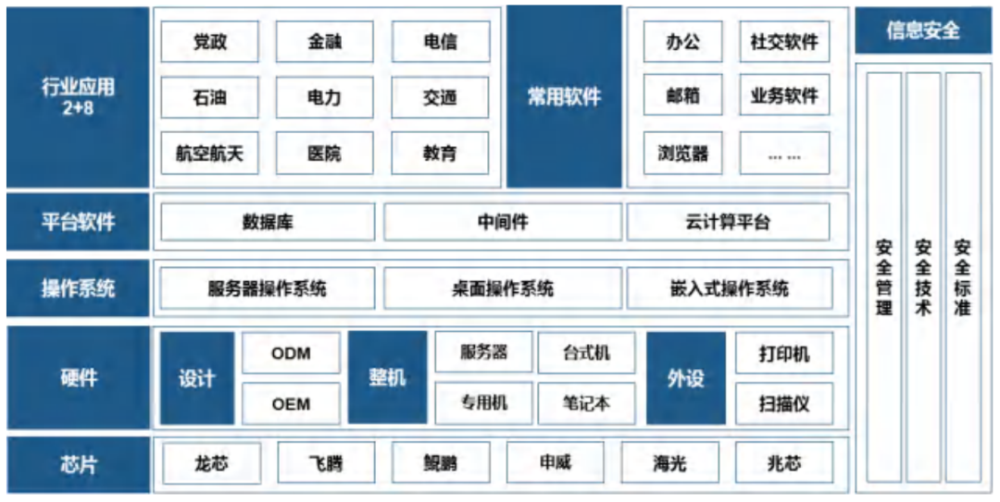

图  信创产业体系全景图（来源：众诚智库，2021.1）

信创产业是一条庞大的产业链，主要涉及以下四大部分：

一、IT 基础设置：CPU 芯片、服务器、存储、交换机、路由器、各种云等。

二、基础软件：操作系统、数据库、中间件、BIOS 等。

三、应用软件：OA、ERP、办公软件、政务应用、流版签软件等。

四、信息安全：边界安全产品、终端安全产品等。

表格  国内信创产业巨头布局

|         | 华为 鲲鹏产业链        | 中国电子CEC   | 中国电科CETC      | 浪潮   |
| ------- | ------------------ | --------- | ------------- | ---- |
| 基础设施    | 华为、神州数码、拓维信息       | 中国长城      | 中电科技、卫士通      | 浪潮信息 |
| 基础软件    | 麒麟、统信、东方通、普元信息、宝兰德 | 麒麟、武汉达梦   | 普华、人大金仓、金蝶天燕  | 浪潮软件 |
| 应用软件    | 金山办公               | 中标软件      | 慧点科技          | 浪潮软件 |
| 信息/网络安全 | 绿盟科技               | 奇安信       | 卫士通、绿盟科技、海康威视 | 中孚信息 |
| 云服务     | 华为云、金山云            | 中国电子云     | 太极股份、中国电科云    | 浪潮云  |
| 系统集成    | 太极股份、神州信息、华东软件     | 中国软件、中国系统 | 太极股份、卫士通      | 浪潮集团 |

> 说明：华为主要立足于鲲鹏处理器，聚集外部上下游企业形成鲲鹏信创生态体系。其它三家主要还是自建生态与战略投资/合作相结合的方式。

 

## 本章参考

1. 2018年已有29家中国科技公司境外上市 数量创历史新高   http://finance.eastmoney.com/news/1345,20180922950995221.html
2. 研报：社区团购起于生鲜，成于快消，美团、多多买菜、十荟团策略有何不同？ https://www.headscm.com/Fingertip/detail/id/21057.html
3. 十分钟速览新中国成立70年通信行业发展史 https://zhuanlan.zhihu.com/p/84759595
4. 华为、阿里都在搞，近年火热的“信创”到底是什么  https://www.ithome.com/0/562/434.htm
5. 十大最具影响力IT收购 http://www.pc6.com/infoview/Article_48736.html
6. 回顾丨至今有人不理解EMC为什么被戴尔收购，读完这篇文章就明白啦 [www.sohu.com/a/193339569_163524](http://www.sohu.com/a/193339569_163524)

 

 

# 2 TMT行业巨头

表格  TMT行业巨头列表

| 行业  | 国外领头羊                     | 国内领头羊   | 其它企业                                       | 备注              |
| --- | ------------------------- | ------- | ------------------------------------------ | --------------- |
| 搜索  | google                    | baidu   | sogou、360                                  | 搜索是互联网最重要的流量入口。 |
| 社交  | facebook、twitter、instrgra | tencent | whatsapp、人人、陌陌(baidu)、微信(tencent)、微博(sina) | 需求最多。           |
| 电商  | amazon                    | alibaba | 京东                                         | 变现最直接。          |
| 视频  | youtube                   | 优酷土豆    | 爱奇亿、腾讯视频                                   |                 |
| 游戏  |                           | 盛大、网易   |                                            |                 |

 表格 国内TMT头部厂商的重点行业赛道（数字化转型）

| 行业名  | 主要玩家 | 华为云     | 阿里云   | 腾讯云  | 火山引擎（字节） |
| ---- | ---- | ------- | ----- | ---- | -------- |
|      |      | 智慧零售    | 新零售   |      | 零售       |
| 电商   |      | 电商      | 电商    | 电商   |          |
| 汽车   |      | 汽车      |       |      | 汽车       |
| 交通物流 |      | 交通物流    | 交通物流  | 交通物流 |          |
| 金融   |      | 金融      | 金融    | 金融   | 金融       |
| 文旅   |      | 政府及公共事业 | 文旅与出行 | 文旅   | 文旅       |
| 游戏   |      | 游戏      | 游戏    | 游戏   |          |
| 教育   |      | 教育      | 教育    | 教育   |          |
| 制造   |      | 制造      | 制造    | 制造   |          |
| 医疗健康 |      | 医疗健康    | 医疗健康  | 医疗   |          |
| 文化   |      | 媒体文娱    | 文化产业  | 传媒   |          |
|      |      | 智慧城市    | 数字政府  | 政务   |          |
| 能源   |      | 能源      | 能源    |      |          |
| 农业   |      | 农业及环保   | 地产园区  |      |          |
|      |      | 工业互联网   |       |      |          |
| 音视频  |      |         | 音视频   | 音视频  | 泛互联网     |
| ...  |      |         |       |      |          |

> 说明：行业标准名称来自于国民经济产业分类中的二级分类。

## 2.1 独角兽

2013年，“独角兽”的概念一经提出便在全球投资界、科技界获得认可，目前全球已经有Fortune、CB Insights、TechCrunch、Visual Capitalist发布的全球四大独角兽榜单。

- 成立时间不超过10年；
- 获得过私募资金投资且尚未上市的；

企业估值超过10亿美元，称为独角兽企业。

企业估值超过100亿美元，称为超级独角兽企业。

**国内独角兽企业**：满足独角兽定义外，在中国境内注册的，具有法人资格的企业。

### 国内

表格  中国TMT独角兽公司基本信息

| 公司                           | 类别  | 公司基本信息 | 融资情况 |
| ---------------------------- | --- | ------ | ---- |
| [豆瓣](http://www.douban.com/) | SNS |        |      |
| 大疆                           | 无人机 |        |      |
| ...                          |     |        |      |

表格 从大公司分拆出来的独角兽

| **独角兽企业**            | **分拆自** | **国家** | **估值（亿人民币）** | **行业** |
| -------------------- | ------- | ------ | ------------ | ------ |
| 蚂蚁金服                 | 阿里巴巴    | 中国     | 10000        | 金融科技   |
| 淘票票                  | 阿里巴巴    | 中国     | 150          | 电子商务   |
| 阿里体育                 | 阿里巴巴    | 中国     | 70           | 媒体和娱乐  |
| 陆金所                  | 中国平安    | 中国     | 2700         | 金融科技   |
| 平安医保科技               | 中国平安    | 中国     | 600          | 健康科技   |
| 金融壹账通                | 中国平安    | 中国     | 500          | 金融科技   |
| 京东数科                 | 京东      | 中国     | 1300         | 金融科技   |
| 京东物流                 | 京东      | 中国     | 800          | 物流     |
| 京东健康                 | 京东      | 中国     | 100          | 健康科技   |
| 苏宁金服                 | 苏宁      | 中国     | 500          | 金融科技   |
| 苏宁体育                 | 苏宁      | 中国     | 150          | 媒体和娱乐  |
| 网易云音乐                | 网易      | 中国     | 100          | 媒体和娱乐  |
| 网易有道                 | 网易      | 中国     | 70           | 软件与服务  |
| 贝壳找房                 | 链家      | 中国     | 600          | 房地产科技  |
| Uber ATG             | Uber    | 美国     | 500          | 共享经济   |
| 度小满金融                | 百度      | 中国     | 200          | 金融科技   |
| 微鲸                   | 华人文化    | 中国     | 100          | 消费品    |
| 蜀海                   | 海底捞     | 中国     | 100          | 物流     |
| 日日顺                  | 海尔      | 中国     | 100          | 物流     |
| 金山云                  | 金山      | 中国     | 100          | 云计算    |
| 58到家                 | 58同城    | 中国     | 70           | 软件与服务  |
| Nikola Motor Company | Nikola  | 美国     | 70           | 新能源汽车  |

### 全球

***全球十大独角兽***

排名前十的独角兽公司占全球独角兽公司总估值的31%。它们都来自美国或中国。

表格  《**2019胡润全球独角兽榜》前十名**

|     | **企业名称**          | **估值（亿人民币）** | **总部** |
| --- | ----------------- | ------------ | ------ |
| 1   | 蚂蚁金服              | 10000        | 杭州     |
| 2   | 字节跳动              | 5000         | 北京     |
| 3   | 滴滴出行              | 3600         | 北京     |
| 4   | Infor             | 3500         | 纽约     |
| 5   | JUUL         Labs | 3400         | 旧金山    |
| 6   | 陆金所               | 2700         | 上海     |
| 6   | 爱彼迎               | 2700         | 旧金山    |
| 8   | SpaceX            | 2500         | 洛杉矶    |
| 9   | WeWork            | 2100         | 纽约     |
| 10  | Stripe            | 1600         | 旧金山    |

## 2.2 国内巨头

国内巨头有BAT（baidu/alibaba/tencent）为代表的IT全行业的巨头，也有某个细分行业的巨头或者早期巨头，如传统新闻类的新浪、网易和搜狐；游戏类的盛大；社交类的人人。

### 巨头创业史

表格 15 国内巨头的创业史

| 公司      | 大事记                                                                                                                                                                                                                                                                                                                                                                                                                                                                       | 投资与上市                                                                                                                                                                                                                                                                         |
| ------- | ------------------------------------------------------------------------------------------------------------------------------------------------------------------------------------------------------------------------------------------------------------------------------------------------------------------------------------------------------------------------------------------------------------------------------------------------------------------------- | ----------------------------------------------------------------------------------------------------------------------------------------------------------------------------------------------------------------------------------------------------------------------------- |
| 华为      | 1987年成立。                                                                                                                                                                                                                                                                                                                                                                                                                                                                  | 受美国限令影响，2020.11，拆分出荣耀手机业务；2022.1，拆分出x86服务器业务。                                                                                                                                                                                                                                 |
| 网易      | 1997年5月，丁磊创办网易。                                                                                                                                                                                                                                                                                                                                                                                                                                                           | 2000年，网易上市。                                                                                                                                                                                                                                                                   |
| 新浪      | 1998年，四通在线完成了与美国华渊资讯的合并，王志东创建新浪网。                                                                                                                                                                                                                                                                                                                                                                                                                                         | 2000年，SINA上市。                                                                                                                                                                                                                                                                 |
| 搜狐      | 1998年，张朝阳创办搜狐。                                                                                                                                                                                                                                                                                                                                                                                                                                                            | 2000年，SOHU上市。                                                                                                                                                                                                                                                                 |
|  腾讯 | 1998年11月，腾讯公司成立，推出无线互联网寻呼解决方案。  2000年5月，QQ同时在线人数首次突破十万大关。  2001年2月，腾讯QQ在线用户成功突破100万大关，注册用户数已增至5000万。  2003年8月，推出的“QQ游戏”再度引领互联网娱乐体验。 2003年12月，门户网站腾讯网发布。  2004年6月16日，香港上市。  2007年10月，腾讯研究院正式挂牌成立。                                                                                                                                                                                                                                                   | 2004.6，香港上市。                                                                                                                                                                                                                                                                  |
| **阿里**  | 1999年，马云创办阿里巴巴B2B。2003，淘宝诞生； 2003年10月，推出交流软件工具“贸易通”。 2003.10，支付宝诞生，2004.12独立运营，2011年支付宝获得第三方支付牌照并拆离成马云100%控股。  2010年12月，成功收购已经破产了的汇通快递。使阿里巴巴进入物流行业。   2011，淘宝一折为三：淘宝、淘宝商城（后改名为天猫）、一淘网。                                                                                                                                                                                                                                                                    | 1999.10，A 轮500万美元投资。 2000，B轮2500万美元，软银2000万美元领投。 2004.2，C轮8200万美元，软银6000万美元领投。 2005，雅虎10亿美元加雅虎中国占股39%，成大股东。 2007.11.7，香港上市；2012.6.20，退市。  2014.9.20，美国纽交所上市，此时软银占34.4%成大股东，雅虎降到22.6%。当日股价92.7美元，市值2383亿美元，成为全球第二大互联网公司。 2019.11.27，港交所上市，成为首个同时在美股和港股上市的中国互联网公司。 |
| 百度      | 2000年，李彦宏创建百度。 2003年，发布图片搜索、新闻搜索；百度贴吧上线。  2005年，推出 “百度知道”。 2006，百科上线。  2009年，推出 “框计算”技术理念正式迁入新办公和研发大楼“百度大厦”。  2010年，百度凤巢成功切换；百度输入法上线；百度创立爱奇艺。 2014，发布百度钱包。  2016年，百度大脑AI平台正式发布。发布智慧汽车战略。                                                                                                                                                                                                                                                                  | 2005.8.5，美国NASDAQ上市。  2011年，3.06亿美元战略投资去哪儿。  2013年，收购糯米；建立IDL（深度学习研究院）；19.1亿美元收购91无线。  2015年，百度宣布与携程达成换股协议，去哪儿与携程合并。 2021.3.23，港交所上市。                                                                                                                          |
| 京东      | 2004年1月，京东涉足电子商务领域，京东多媒体网正式开通，启用域名[www.jdlaser.com](http://www.jdlaser.com/)。  2007年6月，京东启用新域名www.360buy.com，更名为京东商城。  2007年7月，京东建成北京、上海、广州三大物流体系。  2008年6月，京东上线电视、空调、冰洗等大家电产品线，完成了3C产品的全线搭建。  2010年11月，京东图书产品上架销售。 2011年11月，京东进军奢侈品领域，正式推出奢侈品购物网站360Top.com。  2012年10月，京东海外站（英文网站）正式上线公测，迈出国际化重要一步。  京东完成了对第三方支付公司网银在线的完全收购，正式布局支付体系。  2013.3，京东域名正式更换为JD.COM。 2014年2月，京东推出首个互联网金融信用支付产品：“京东白条”。 2015，陆续上线京东股权众筹平台、全球购跨界电商平台、“京东整车频道”、 JD+智能奶茶馆。 | 2014年05月，在美国纳斯达克上市。                                                                                                                                                                                                                                                           |
| 360     | 2005年11月，成立。 2006.7，360安全卫士正式对外推出。 2008.5，360安全卫士发布安全浏览器。 2010.1，360杀毒的用户规模突破1亿。 2014.4，安卓清理大师正式上线。 2014.12，360与光线传媒成立合资公司，专注以电影为主的互联网视频业务。360投资4亿美元与酷派组建合资公司推出360手机。  2015.1，360宣布投资2亿人民币，与磊科成立合资公司蜂联，共同进军互联网智能路由器市场。  2016，推出直播平台花椒。                                                                                                                                                                                                                    | ~~2011.3.11，美国NASDAQ上市。32.4亿美元。2016.7.16，私有化退市，估值93亿美元。~~ 2017.11.7，借壳江南嘉捷回归A股，估值3800亿人民币元。 2018.2.28，正式回归上市，重组名为’ 三六零‘。                                                                                                                                                  |
| 小米      | 2010.3.3，雷军创建小米。                                                                                                                                                                                                                                                                                                                                                                                                                                                          | 2018.7,9，小米港交所上市 。                                                                                                                                                                                                                                                            |
| 美团      | 2010.3，王兴创建美团。 2015.10.8，美国与大众点评合并。 2016.9.26，美团宣布收购钱袋宝，正式获得第三方支付牌照。 2018.4，收购[摩拜](https://baike.baidu.com/item/摩拜/20590655)单车。 2019.5，推出美团配送。 2020.12，被收购后的摩拜单车，更名为“美团单车”。                                                                                                                                                                                                                                                                                | 2010.3，种子轮。 2010.8，A轮红杉资本1200万美元。 2011.7，B轮红杉资本5000万美元。 2014.5，C轮3亿美元。 2015.1，D轮7亿美元，估值达到70亿美元。 2016.1，首次融资超33亿美元，公司估计超180亿美元。 2018.9.20，港交所上市 。                                                                                                            |
| 字节跳动    | 2012.3，张一鸣创建字节跳动动，8月发布今日头条第一个版本。 2016.9，上线抖音。开始全球化战略。 2021.11，实现业务线BU化，成立六个业务板块：抖音、大力教育、飞书、火山引擎、朝夕光年和TikTok。 2022.5.6，成立今日头条公司，原母公司字节跳动改名为抖音。                                                                                                                                                                                                                                                                                                                    | 2012.7，A轮100万美元。2013.9，B轮DST领投1000万美元。 2014.6，C轮1亿美元。2016.12，D轮10亿美元，估值 110亿美元。 2018.8，估值750亿美元。                                                                                                                                                                        |
| 拼多多     | 2015年9月上线。2016.11.11，单日交易流水超过2亿元。                                                                                                                                                                                                                                                                                                                                                                                                                                         | 2016年，拼多多获1.1亿美金B轮融资。2018.7，NASDAQ上市。                                                                                                                                                                                                                                         |

### 主营业务和分拆上市

国内互联网企业主要希望通过分拆上市，在维持对旗下业务的控股权情况下扩大市值。另外，也实现了对所分拆业务的核心高管和员工的股权激励。

新浪、搜狐这类股权分散的企业易被股东操纵，分拆上市。而像百度、阿里这样的大公司不但不分拆上网，还不断收购上市公司。如阿里收购了优酷土豆。

表格 16 IT大公司的分拆上市公司

| **派系**     | 集团主营业务                                                 | 上市公司               | 简介                                                         |
| ------------ | ------------------------------------------------------------ | ---------------------- | ------------------------------------------------------------ |
| **百度系**   | 2013，组织结构调整。 两个业务群组：前向收费和搜索。 三个事业部：移动云、国际化和LBS。 |  百度              | 2005.8.5，美国NASDAQ上市。市值562亿美元。2021.3.23，港交所上市。 |
|              |                                                              | ~~去哪儿~~             | 2013.10.31，美国NASDAQ上市。市值30亿美元。2015.10，与携程合并。 |
|              | 2010年4月22日百度投资创建爱奇艺。2013年5月爱奇艺以3.7亿美元合并PPS。 | 爱奇艺                 | 2018.3.29，美国NASDAQ上市。市值109亿美元。                   |
|              | 问答式在线社区知乎成立于2011年。                             | 知乎                   | 2021.3.26，美国纽交所上市 ，市值47亿美元。                   |
|  阿里系   | 2012.7，六大子公司调整为七大事业群：淘宝、一淘、天猫、聚划算、阿里国际业务、阿里小企业业务和阿里云。一个集团CBBS市场集群。  2013.1，七大事业部又拆分成25个事业部。 | ~~阿里巴巴B2B~~        | 2007.11.7，香港上市；2012.6.20，退市。                       |
| 阿里巴巴集团 |                                                              | 阿里巴巴               | 2014.9.20，美国纽交所上市。  2016.11，市值4812亿美元，全球第七。 2019.11.27，港交所上市。 |
|              | 2015.11，阿里全资收购优酷土豆。                              | ~~优酷土豆~~           | 2016.4.6，优土完全私有化退市。                               |
|              | 2018.4.2，阿里全资收购饿了么。                               | ~~饿了么~~             |                                                              |
|              | 借壳上市，详见下面。                                         | 阿里健康               | 港股上市，市值约811亿港元。                                  |
|              | 同上                                                         | 阿里影业               | 港股上市，市值约262亿港元。                                  |
|              | 同上                                                         | 云峰金融               | 港股上市，市值约121亿港元。                                  |
|              | 同上                                                         | 亚博科技               | 港股上市，市值约113亿港元。                                  |
|              | 2021年初蚂蚁金服上市被叫停。                                 | 蚂蚁金服               | 待上市                                                       |
| **腾讯系**   | 2005，BU化。 2012.5，组建六大事业群：企业发展CDG、互动娱乐IEG、移动互联网、网络媒体OMG、社交与效果广告部SPA和技术工程TEG。  2014.5，增加微信事业群WXG。 一个独立子公司：腾讯电商。  2018.9.30，重组七大事业群：保留4~WXG/IEG/TEG/CDC，新建2~智慧产业CSIG、平台与内容PCG，合并1~广告营销服务AMS，移除2-OMG和SPA。 | 腾讯                   | 2004.6，香港上市。7750亿港币。 2016.11，市值5333亿美元，全球第五。 |
|              | 2013年9月16日，腾讯以4.48亿美元战略入股搜狗，并将旗下的搜索和 QQ 输入法并入搜狗现有的业务中，腾讯将持有新搜狗 36.5% 的股份，2017年腾讯持股比例达到43.7%。 | 搜狗                   | 2017.11.9，纽交所上市。52亿美元。                            |
|              | 2014年底腾讯收购盛大文学，然后整合腾讯文学。 2015.3成立阅文集团，占股57.62%。 | 阅文集团               | 2017.11.8，港交所上市。910亿港币。                           |
|              | 2005，QQ音乐上线。2017.1，QQ音乐和中国音乐集团（酷狗+酷我）合并成为腾讯音乐。 | 腾讯音乐               | 2018.12.12，纽交所上市 ，124亿美元。                         |
| 盛大系       | 盛大游戏、~~盛大文学、~~华友世纪、 盛世影业。 历史上四次转型： 第一次是由动漫社区向网络游戏转型。 第二次以盒子战略为核心，向家庭娱乐帝国转型。 第三次则在资本扩张的基础上，提出了“09架构”。 第四次转型，盛大成为了投资管理集团。 | ~~盛大网络~~           | 2004.5.14，美国NASDAQ上市；2012.2.15，退市。                 |
|              |                                                              | 盛大游戏               | 2009.9.25，美国NASDAQ上市。18.2亿美元。2015年回归A股。       |
|              |                                                              | ~~盛大文学~~           | ~~2015年已被腾讯收购~~                                       |
|              |                                                              | ~~华友世纪~~           | ~~2009年酷6借壳转型；2016.7退市。~~                          |
| 360系        | 360安全卫士/杀毒、360浏览器、 奇虎搜索                       | 奇虎360                | ~~2011.3.11，美国NASDAQ上市。32.4亿美元。2016.7.16，私有化退市，估值93亿美元。~~ 201x年，借壳A股。 |
|              | 2014年，奇安信前身“奇虎360企业安全集团”成立，业务由个人级安全（C端）拓展到企业级安全（B端）。2019年，中国电子接手360的奇安信股份。 | 奇安信                 | 2020.7.22，上交所科创板上市，市值800亿元。                   |
| 搜狐系       | 搜索网 搜索畅游 搜索视频                                     | 搜狐网                 | 2000.7.22，美国NASDAQ上市。28.5亿美元。                      |
|              |                                                              | 搜狐畅游               | 2009.4.2，美国NASDAQ上市。SOHO的网游业务。现市值14.2亿美元。 |
|              |                                                              | 搜狐视频               | 待上市                                                       |
| **新浪系**   | 2012.12，新组织架构分门户和微博两大板块。                    | 新浪网                 | 2000.4.13，美国NASDAQ上市。现市值45亿美元。                  |
|              |                                                              | ~~中房信~~             | 新浪房产板块与易居合股，为第二大股东40%。 2009.10.16 美国NASDAQ上市，2012.4.23被易居完全收购。 |
|              |                                                              | 新浪微博               | 2014.4.17，美国NASDAQ上市。现市值37.7亿美元。                |
|              |                                                              | 新浪乐居               | 2014.4.17，易居中国于美国纽交所上市。现市值16亿美元。        |
| **网易系**   | 在线游戏、门户、邮件、农业事业部。                           | 网易网                 | 2000.6.3，美国NASDAQ上市。50亿美元。                         |
|              |                                                              | 网易云音乐             | 2021.12.2，港交所上市，市值426亿港元。                       |
|              |                                                              | 网易有道               |                                                              |
| 人人系       | 2013.1，五大独立事业部：人人网、无线、游戏、糯米网、56网。   | 人人网                 | 2011.5.4，美国NASDAQ上市。57.9亿美元。                       |
| 金山系       |                                                              | 金山软件               | 2007.10.9，港交所。46亿港元。                                |
|              |                                                              | 猎豹移动（原金山网络） | 2014.5.8，纽交所。19.5亿美元。                               |
| 京东         | 2015.8，京东商城成立四大事业部：3C事业部、家电事业部、消费品事业部、服饰家具事业部。  2015.12，成立生鲜事业部。 | 京东网                 | 2014.5，美国纳斯达克上市。                                   |
| 华为         | 2014.10，成立三大客户事业群：运营商、企业和消费者，一个产品与解决方案部，一个集团职能平台（16个职能模块）。  2017.8，Cloud BU提升为一级部门。 2021.5，成立超聚变公司。 |                        | 2016年，销售5215亿元，净利润3705亿元，利润率9.1%。           |
|              | 2020.11，拆分出荣耀。                                        | 荣耀                   |                                                              |
| 字节跳动     | 2012.3，创建。 2021年组织架构调整为六个业务板块，分别是抖音、大力教育、飞书、火山引擎、朝夕光年和TikTok。 |                        |                                                              |

*备注：*

1. *组织结构：各大公司的组织结构从早先的业务系统制（Business Units，BUs）陆续转向事业群制（Business Groups，BGs）。事业部制结构主要适用于产业多元化、品种多样化、各有独立的市场，而且市场环境变化较快的大型企业。这种形式可以使得各个事业群/部权责明确，并能够保持相对独立、促进竞争、提高效率。但可能提高企业内部交易费用，并且对公司管理层的要求较高。华为比较特殊，按客户来划分事业群。*
2. 市值：2016.11，中国两家公司进入全球市值前七，分别是腾讯（5333亿美元，第五）和阿里巴巴（4812亿美元，第七），第一是苹果（8727亿美元）。
3. 多地上市：阿里巴巴是首个同时在美股和港股两地上市的中国互联网公司。暴风影音是首个拆除VIE结构回归A股上市的公司（2015.3.24上市，创建了A股众多奇迹；2020.11.9退市）。

### 创业部落派系

> 说明：2021年7月国家反垄断局成立。防止互联网资本无序扩张是反垄断的重要工作之一，因而平台企业的并购、投资行为尤其受到监管注视。原先的投资派系纷纷瓦解。阿里被罚百亿，虎牙斗鱼合并被叫停。

所谓派系是指某公司内分拆上市的多家公司或离职员工依靠原公司技术人脉创建的公司。

创业行业：电子商务、移动互联网、社会化媒体。

创业地图：北京、上海、广东

作为国内最早的一批互联网公司：腾讯、新浪、搜狐、网易、阿里巴巴、百度、盛大、金山这8家公司，再加上最为国际化的Google、最具代表性的IT公司华为，这10家公司出来了一批互联网创业者，无论是高管创业、还是普通员工，都为国内的互联网注入生机活力。

　　这些创业者，有的带有鲜明的特色，比如阿里巴巴系在电子商务、新浪在微博和社会化营销方面、盛大网易在游戏方面、搜狐在视频方面；有的非常多元 化，比如Google、腾讯、百度、华为、金山；有的已经是上市/准上市公司、或者拿到数千万的投资；有的才刚刚上路、或者你从未留意和听说过；有的曾在 一家公司工作数年、是高管核心成员，有的则到过多家大公司；有的与老东家、或者彼此之间合作紧密无间；有的则竞争激烈、和原公司几乎没有关联。

表格 创业部落派系表

| 创业派系        | 公司数    | 公司名列表                                                                                                                                                                          |
| ----------- | ------ | ------------------------------------------------------------------------------------------------------------------------------------------------------------------------------ |
| 阿里巴巴系       |  60 | 部分代表人物：孙彤宇（盒子世界）、陈琪（蘑菇街）、吴志祥（同程网）、王皓（虾米网）、冯大辉（丁香园）、白鸦（逛）、张斗（音悦台）、  张良伦（米折网）等                                                                                                   |
| 盛大系         | 52     | 部分代表人物：凌海（蝴蝶互动）、李瑜（优谈）、朱威廉（暴雨娱乐）、米丹宁（i8小时）、季昕华（Ucloud优刻得）、王欣（快播科技）、许朝军（点 心/啪啪）、许式伟（七牛信息）、梁建武（米格365）、边江（翻翻）、李文华（工程师爸爸）、吴裔敏（大蛙数字科技）等                                             |
| 网易系         | 38     | 部分代表人物：李学凌（多玩、YY）、詹钟晖/吴云洋（广州简悦）、关国光（快钱）、周娟（56网）、李甬（粉笔网）、喻华峰（本来生活）、方三文（雪球 财经）、杨斌（纷享科技）、唐岩（陌陌）、张锐（春雨掌上医生）、丁秀洪（云辰科技）、徐宥箴（多益网络）、胡琛（团800）、郭子威（蝉游记）、李明顺 （聚淘网/财猫浏览器）等                 |
| 新浪系         | 37     | 部分代表人物：王志东（点击科技）、杨震（大承网络）、程炳皓（开心网）、罗军（途家网）、梁公军（鲜果网）、祝志军/顾晓斌（Techweb/蚕豆）、江锡卓（我联系）等                                                                                              |
| 腾讯系         | 35     | 部分代表人物：王海兵（淘米）、封林毅（iTools）、黄何（磊友）、莫显峰/华琨（Ucloud优刻得）、杨威（贝瓦网）等                                                                                                                   |
| 百度系         | 34     | 部分代表人物：刘建国（爱帮网）、程浩（迅雷）、梁冬（太美）、毕胜（乐淘）、周品（趣品网）、齐玉杰（多盟）、周立民（豌豆荚）、谌振宇（抓虾）、雷鸣（酷我）、吴世春（酷讯、食神摇摇）、张磊（点心）                                                                               |
| Google（谷歌）系 | 34     | 代表人物：李开复（创新工场）、周韶宁（百世物流）、王怀南（宝宝树）、郭去疾（兰亭集势）、周杰（浪淘金）、林斌（小米科技）、刘骏（云云网）、宋中杰  （嘀嗒团）、沈思（木瓜移动）、蒋凡（友盟）、王俊煜（豌豆荚）、王晔（涂鸦移动）、邸烁（乐投科技/千夜旅游）、戴雨森（聚美优品）、沈学华（品友互 动）、江宏（AVOS中国）等               |
| 金山系         | 30     | 代表人物：雷军（小米科技）、吴裔敏（大蛙数字科技）、王峰（蓝港在线）、尚进（麒麟网）、冯鑫（暴风影音）、刘阳（51玩）、张福茂（游戏谷）、裘新 （梦工厂）、蒋涛（CSDN）、任健（博沃手机）、湛振阳（心游科技）、邢山虎（乐动卓越）、许晓辉（初刻）、王海明/童合心（传课网）、郑可（神雕网 络）、朱传靖（九众互动）、王颖奇（正点科技）、林伟（维棉）等 |
| 搜狐系         | 27     | 部分代表人物：古永锵（优酷）、李善友（酷6）、龚宇（爱奇艺）、王建军（56网）、叶忻（架势无线）、苏昌茂（欢乐矩阵）等                                                                                                                    |
| 华为系         | 21     | 代表人物：李一男（港湾）、张磊（点心）、卓日克（老虎地图）、张辉军（品尚红酒网）、孙洪军（艾为电子）、黄蔚（游果网络）等。                                                                                                                  |

> 说明：公司数统计时间为2015年10月。

## 2.3  国外巨头

与国内类似的布局，对应BAT有的google/amaze/facebook。

表格  国外TMT公司基本信息（明星巨头不列在此表，免得重复）

| 公司                               | 类别     | 公司基本信息                                                                                            | 融资情况                       |
| -------------------------------- | ------ | ------------------------------------------------------------------------------------------------- | -------------------------- |
| [Oracle](http://www.oracle.com/) | 企业软件   | 创建于1977年。全球最大的企业软件公司，仅次于微软的第二大软件公司。                                                               | 2009年，74亿美元收购Sun。          |
| EMC                              | 存储     | 创建于1979年，是一家信息存储资讯科技公司，主要业务为信息存储及管理产品、服务和解决方案。 壮大秘诀是研发与并购双轮驱动，研发与并购的投入占当年营业收入的22%左右，并购投入略高于研发。 | 2003年，EMC以6.35亿美元收购Vmware。 |
| DELL                             |  电脑 | 创立于1984年，主要以生产、设计、销售家用以及办公室电脑而闻名，同时也涉足高端电脑市场。                                                     | 2015年10月，670亿美元收购EMC。      |
| 特斯拉                              | 电动车    |                                                                                                   |                            |
| Twitter                          | 社交     |                                                                                                   |                            |
| Uber                             | 网约车    |                                                                                                   |                            |

备注：中国曾经发起过去‘OIE’，特指Oracle的数据库、IBM的小型机和 EMC的存储。

## 2.4 巨头战略收购

每个科技巨头的成长都离不开收购，收购的目的有很多种：人才、技术、用户、业务、未来布局，甚至是竞争对手。

面对好的公司好的项目，“要么干掉它，要么就买了它”这是公司竞争中的常见做法。很多公司都是靠收购成就了自己在行业中的“巨头”地位！

2010年以前，BAT还只是资本市场的小玩家，2010年以后，BAT投资版图开始扩张。

随着投资事件和投资规模的增加，互联网大厂投资逐渐形成了多种风格。

腾讯为代表的大厂趋向于“被动式投资”，不过分追求业务协同，更多寻求财务回报；京东、小米等公司偏向于“补充式投资”，被投公司与母公司不存在紧密的业务联系，但能帮助母公司构建商业生态、刺激市场需求、巩固市场地位；阿里、美团、B站则趋向于“驱动型投资”，注重被投公司与母公司当前战略及业务的紧密联系。

经过20多年的发展，投资业务已经成为互联网大厂版图中的重要一环。据腾讯2020年年报，合营、联营公司的投资资产总额达3152.58亿，占总资产的29.76%。

2020年《反垄断法》修订后，各大厂开始主动拆墙。2021年12月腾讯以派息的方式减持京东，退出第一大股东。阿里接连退出了芒果超媒在内的多家媒体。2022年1月，字节跳动整体裁撤投资业务。

表格  巨头的战略收购

| 巨头     | 对外收购或投资                                                                                                                                                                                                                                                                                                                                                                                                                                                                                                                       | 说明                                                                                      |
| ------ | ----------------------------------------------------------------------------------------------------------------------------------------------------------------------------------------------------------------------------------------------------------------------------------------------------------------------------------------------------------------------------------------------------------------------------------------------------------------------------------------------------------------------------- | --------------------------------------------------------------------------------------- |
| 阿里巴巴   | 阿里就像一个流量黑洞，从外界吸收流量，然后在自己的平台产生交易，无论是收购UCweb、高德、优酷，还是投资微博和陌陌，都是如此。一旦这些所谓的入口流量耗尽，阿里就会寻找新的流量。                                                                                                                                                                                                                                                                                                                                                                                                                                     |                                                                                         |
|        | 2005年，阿里巴巴收购雅虎中国，现如今雅虎中国早已关闭。 2006年，阿里收购口碑网，落后于美团。 2013年，0.8亿美元收购友盟。 2013年1月，收购虾米音乐；2021年1月5日，虾米音乐停止了音乐服务。 2014.6，300亿元收购UC。 2015年11月6日，阿里宣布12.2亿美元全资收购优酷土豆集团。 2016年，阿里巴巴收购豌豆荚，当年底，豌豆荚创始人出局。 2017年3月，收购大麦网；5月收购银泰百货。 2018年，全资并购菜鸟网络。 2018.4.2，95亿美元全资收购饿了么（2017.8，饿了么8亿美元收购百度外卖），将饿了么与口碑网合并。                                                                                                                                                                                                      | 失败的收购：                                                                                  |
|        | 2016年4月，10亿美元控股东南亚最大电商平台Lazada；2.66亿美元收购南华早报。 2018年7月，7.5亿美元收购土耳其最大电商平台Trendyol。 2019.1.8，8000万欧元收购Flink母公司Data Artisans。                                                                                                                                                                                                                                                                                                                                                                                               |                                                                                         |
| 腾讯     | 2010年3Q大战，是腾讯考虑提升开放能力的转折点。 腾讯喜欢战略投资，多数联营公司与腾讯产生了真实的协同效应：美团、京东、拼多多从微信获得流量，Epic、金山的游戏由腾讯代理，Sea是腾讯在东南亚扩张的立足点，搜狗为微信搜索提供技术支持……有些联营公司离开腾讯甚至难以生存。                                                                                                                                                                                                                                                                                                                                                                                 |                                                                                         |
|        | 2013年，腾讯 4.48 亿美元投资搜狗。 2016年7月，收购中国音乐集团，以此为基础组建了腾讯音乐。 2016 年 6 月，腾讯牵头的财团以 102 亿美元收购了 荷兰手游开发商Supercell 81.4% 的股份；2019 年 10 月，腾讯以 4000 万美元的价格将其份额从 50% 增加到 51.2%。                                                                                                                                                                                                                                                                                                                                                         |                                                                                         |
| 百度     | 2013年，收购糯米；5月以3.7亿美元爱奇艺合并PPS；8月以19亿美元收购91无线。                                                                                                                                                                                                                                                                                                                                                                                                                                                                                  | 收购多数失败了。                                                                                |
| 今日头条   | 2016年，全球化作为核心战略。“自建+收购”双轮驱动，自建完善产品线，收购获取品牌和流量。                                                                                                                                                                                                                                                                                                                                                                                                                                                                                |                                                                                         |
|        | 2017年，2月收购短视频社交Flipagram；11月，收购全球移动新闻服务运营商News Republic，收购音乐分享Muscial.ly。                                                                                                                                                                                                                                                                                                                                                                                                                                                  |                                                                                         |
| 谷歌     | 谷歌（Google）公司自1998年成立以来已经进行了数百起收购，据统计谷歌平均每10天就会收购一家公司。                                                                                                                                                                                                                                                                                                                                                                                                                                                                         |                                                                                         |
|        | 2005年，谷歌0.5亿美元收购安卓。 2006年10月，谷歌打败日本软银、雅虎、美国新闻集团等竞争对手，以16.5亿美元收购了 YouTube。 2006年，谷歌以31亿美元收购DoubleClick。通过收购，成为网络广告行业的绝对领导者。 2011年，谷歌斥资125亿美元收购了摩托罗拉移动。通过此次收购，谷歌弥补了专利短板，成功帮助安卓阵营抵御苹果和微软等竞争对手的专利诉讼。2014年，谷歌将摩托罗拉移动硬件业务以29亿美元的价格卖给联想，自己只保留了专利部分。 2014年，32亿美元收购智能家居设备公司Nest。 2017年9月，11亿美元收购HTC部分手机业务。 2019年，21亿美元收购可穿戴设备公司Fitbit。 2022年3月，54亿美元收购Mandiant。                                                                                                                                                 | （成功的收购） 截止到2019年，YouTube已经是全球最大的视频网站，月活跃用户达到18亿，营业收入达151.5亿美元。                       |
|        | 2013年，谷歌13亿美元收购地图导航应用公司Waze； 2009年，7.5亿美元收购移动广告公司AdMob； 2010年，7亿美元收购航班信息软件公司ITA SoftWare； 2007年，6.25亿美元收购电子邮件与网络安全公司Postini； 2014年，6.5亿美元收购深度学习领域初创公司DeepMind等等。                                                                                                                                                                                                                                                                                                                                              |                                                                                         |
| Amazon | 1999年，Amazon收购了eBay早期竞争对手Exchange，还收购收购电子商务软件开发商Accept.com和流量监控网站Alexa.com。以上三笔亚马逊全部以股票形式支付，虽未透露这三笔交易的各自金额，但合计估值为6.45亿美元。 2009年，收购了Zappos在线鞋商，这是亚马逊进行的规模最大的并购交易，4000万美元现金外加8亿多元股票。 2010年9月，收购音乐网站AmieStreet，收购后不久，亚马逊就宣布关闭AmieStreet.com，将服务定向到Amazon.com。 2014年8月，收购游戏视频服务商Twitch Interactive。 2021年，84.5亿美元收购米高梅。                                                                                                                                                                                               |                                                                                         |
| 微软     | 微软史上的大收购大多数以失败告终，也难掩其并购雄心：微软正通过收购不同行业的公司进入新的市场。                                                                                                                                                                                                                                                                                                                                                                                                                                                                               |                                                                                         |
|        | 1998年，4-5亿美元收购Hotmail。 2000.1.7，13.7亿美元收购绘图软件Visio。 2007.8.13，63亿美元收购数字营销公司aQuantive。 2011年5月10日，微软宣布以85亿美元收购Skype。 2012年6月，12亿美元收购了企业内部社交网络Yammer。 2013年9月2日，72亿美元收购诺基亚设备和服务部门，包括获得诺基亚专利授权和品牌使用，2014年4月份完成收购业务。2016年以3.5亿美元价格出售诺基亚功能机业务。 2014年11月6日，25亿美元收购视频游戏公司Mojang。 2016年12月8日，262亿美元现金收购全球最大职业社交网站LinkedIn(领英)。 2018年10月26日，75亿美元收购了全球最大的社交编程及代码托管网站 GitHub。 2021.4.12，197亿美元收购语音合成和识别公司Nuance。 2021.9.21，81亿美元收购视频游戏公司ZeniMax Media。 2022.1.18，687亿美元收购暴雪，成为仅次于腾讯和索尼的全球第三大游戏公司。 | 2017年，微软战略放弃了诺基亚智能手机和Windows Phone。 游戏行业，微软陆续收购Mojang(2014)、ZeniMax (2021)、暴雪(2022)。 |
| Oracle | 2004.12，甲骨文70亿美元收购Peoplesoft。 2010年，甲骨文以74亿美元收购Sun。                                                                                                                                                                                                                                                                                                                                                                                                                                                                        |                                                                                         |
| IBM    | IBM成立于1911年，百年巨人，多次转型变革。 从1993年到2002年，郭士纳帮助IBM的股价翻了约9倍。2002年进入到咨询行业。                                                                                                                                                                                                                                                                                                                                                                                                                                                       |                                                                                         |
|        | 1995年，IBM收购了Lotus软件。 2002年，39亿美元收购普华永道咨询公司，21亿美元收购了Rational软件公司。 2018.10.29，334亿美元收购红帽Redhat。                                                                                                                                                                                                                                                                                                                                                                                                                          |                                                                                         |

 

## 本章参考

* 2016中国独角兽企业发展报告 http://www.cbdio.com/image/site2/20170307/3417eb9bbd591a28b4c849.pdf

* 胡润研究院发布《2019胡润全球独角兽榜》 www.hurun.net/CN/Article/Details?num=E7190250C866

* 国内互联网十大创业派 http://www.chnsourcing.com.cn/outsourcing-news/article/49660.html

* 中国互联网圈的14个创业派系 https://www.huxiu.com/article/109024/1.html

**腾讯阿里相关资料**

* 腾讯不做投行，未来靠什么破防？  https://www.sohu.com/a/511269569_250147
* 腾讯不做投行：一盘生态共生的互联网产业大棋  https://weibo.com/ttarticle/p/show?id=2309404717970776785236
* 腾讯登全球市值第5大公司 https://www.leiphone.com/news/201711/QK2Rq9LbNAH8rgvY.html
* 细数：百度腾讯等互联网企业组织架构大调整  http://news.ename.cn/yumingzhoubian_20130614_45417_1.html
* 阿里巴巴、腾讯、华为等互联网公司最新组织结构图 2016年 www.sohu.com/a/114013989_379366
* 【评测】“阿里系”与“腾讯系”港股公司大比拼 [www.yangqiu.cn/i100ec/4132222.html](http://www.yangqiu.cn/i100ec/4132222.html)
* 腾讯阿里研报专题之九----腾讯投资 http://app.myzaker.com/news/article.php?pk=5c2de28577ac6427472dab69
* 腾讯阿里研报专题之十 ---- 从腾讯三次组织架构调整看互联网大势 http://www.myzaker.com/article/5c31b75477ac64201452b25a
* 深度复盘阿里小米京东美团崛起之密：阿里八次转身，京东两次革命 http://tech.ifeng.com/c/7nKmVfiiXyA
* 阿里卖掉优酷股份：土豆网成最冤“接盘侠”  https://news.mydrivers.com/1/810/810400.htm
* 为什么阿里喜欢全面并购，腾讯喜欢战略投资？  www.capwhale.com/newsfile/details/20200323/6a8db36aebef4d5a9b7142d3ae21fee4.shtml
* 3年赚750亿人民币，马化腾是这样从陈天桥手上接盘阅文集团的http://tech.ifeng.com/a/20171112/44756891_0.shtml

**其它公司**

* 盘点谷歌这些年比较经典的收购案例  https://www.sohu.com/a/388384710_120580834
* 微软的成功与失败：盘点微软发展史上最重要的20个转折点  https://www.36kr.com/p/1722899365889
* 盘点微软十大收购案：近700亿美元收购动视暴雪高居榜首  https://www.cnbeta.com/articles/tech/1228343.htm
* 盘点微软十大收购失败案例  www.jizhuomi.com/internet/600.html
* 百年IBM：值得全球商界研究的转型变革典范  tech.sina.com.cn/csj/2019-02-15/doc-ihqfskcp5373328.shtml
* 今日头条：新互联网巨头的崛起之路  https://www.36kr.com/p/1722806321153
* 盛大十五年：梦碎“网络迪斯尼” http://www.huxiu.com/article/103102/1.html
* 从组织架构调整角度看：字节跳动六大业务板块  https://baijiahao.baidu.com/s?id=1716120517027189661&wfr=spider&for=pc
* 字节裁撤战投部，大厂造系终结？  https://new.qq.com/omn/20220120/20220120A0593N00.html

  

# 3 TMT细分行业

## 细分行业简介

从国内互联网行业整体竞争分析，用户日常的三大刚需领域：搜索、消费和社交。

* 搜索：百度、360搜索
* 消费：阿里、京东、美团、滴滴
* 社交：腾讯、

表格 5  细分行业的行业周期表

| 年份          | 国外行业  起步阶段                          | 中国行业  起步阶段     | 中国行业成长/成熟期     | 备注                            |
| ----------- | ----------------------------------- | -------------- | -------------- | ----------------------------- |
| 2000        |                                     |                | 门户网站：如新浪、网易、搜狐 |                               |
| 2003~  2004 | SNS如myspace(2003.9) ，facebook(2004) |                | SP和游戏第一波如盛大    |                               |
| 2005        |                                     | 秀场如新浪秀场；SNS如校内 |                |                               |
| 2007        | 微博如Twitter                          |                | 游戏第二波如巨人       |                               |
| 2008        | 团购如Groupon                          |                | SNS如校内、开心      |                               |
| 2009        |                                     | 微博如新浪微博；手游。    | B2C、视频         | 2009年智能手机兴起。                  |
| 2010        |                                     | 团购如美团          |                |                               |
| 2012        |                                     |                | 团购‘千团大战’；      | 中国团购业的生命周期（5年）：2010~2014      |
| 2014        |                                     | 互联网金融          |                |                               |
| 2015        | 新能源汽车                               | VR             | 互联网金融、众筹       |                               |
| 2016        |                                     | 共享单车、短视频、社区团购  | 直播、O2O、快递      | 直播的成熟因素：4G成熟；移动支付成熟；从秀场到全民直播。 |
| 2017        |                                     | AI、协同办公        | 共享经济、区块链       | 滴滴优步打车并购，OFO和摩拜单车两强。          |
| 2018        |                                     | 新能源汽车          | 在线教育           |                               |
| 2019        |                                     |                | 新能源汽车、AI、短视频   |                               |
| 2020        |                                     |                | 社区团购、协同办公      | 政府不承认民间区块链币                   |
| 2021        |                                     |                |                | 政府打击教培、社区买菜资本化                |
| 2022        |                                     |                |                |                               |

备注：行业的生命周期指从起步-成长-成熟-衰退（有些行业经久不衰如B2C）。行业的成长期通常是投资热点，成熟期通常是上市高潮。

* 中国SNS的生合周期（15+）：1997~， 发展从BBS(如猫扑1997，天涯社区1999)-->娱乐SNS（如校内2005，开心2008）-->微信息SNS（如新浪微博2009，微信2011）。

* 中国团购业的生命周期（5年）：2010~2014

* 中国互联网金融行业的生命周期（2年）：2014~2015，从起步到行业规范仅经历一年多时间。截止2020年，全国互联网金融余下不到10家。互联网金融业主要受限于国家金融监管部门。

* 中国共享经济：

* 自媒体视频：传统影视主要受版权影响。自媒体主要受带宽影响。

* 社区团购：起于生鲜，成于快消。2013年本来生活获得A轮融资起。社区团购刚开始是作为生鲜市场的子赛道，始于2016长沙的代表企业为你我您与兴盛优选。

根据IT桔子死亡公司库数据，2021年，有816家中国公司宣告倒闭、关停，其中有143家公司曾经获得融资，占比为17%。

表格 4 互联网细分行业列表

|  行业 | 细化分行    | 领头者                                                                                                                                               | 侯选者                                                                                                                                                                                                                                                                                                                                                                                                                                                        |
| ------ | ------- | ------------------------------------------------------------------------------------------------------------------------------------------------- | ---------------------------------------------------------------------------------------------------------------------------------------------------------------------------------------------------------------------------------------------------------------------------------------------------------------------------------------------------------------------------------------------------------------------------------------------------------- |
| 游戏     | 游戏网站    |                                                                                                                                                   | [4399游戏](http://www.4399.com/) [7k7k游戏](http://www.7k7k.com/)  [17173](http://www.17173.com/)[37](http://www.37.com/)游戏 [LOL直播](http://www.hao123.com/video/lol)    游戏公司排名：1.盛大 2.网易 3.腾讯 4.久游 5.九城 6.一起玩 7.征途 8.金山 9.世纪天成 10.完美时空                                                                                                                                                                                                                     |
|        | 网游      |                                                                                                                                                   | 网络游戏排名 ： 1 穿越火线 2 QQ游戏 休闲平台   3 地下城与勇士 MMORPG 4 QQ炫舞 ACG 5 跑跑卡丁车 ACG 6 劲舞团 ACG 7 反恐精英online ACG 8 魔兽世界 MMORPG 9 梦幻西游 MMORPG 10 问道 MMORPG 11 天龙八部 MMORPG 12 热血传奇 MMORPG 13 大话西游Ⅱ MMORPG 14 A.V.A ACG 15 街头篮球 ACG 16 传奇外传 MMORPG 17 四国军旗 休闲平台 18 魔域 MMORPG 19 诛仙 MMORPG 20 QQ音速 ACG                                                                                                                                                                          |
|        | 页游      |                                                                                                                                                   | [九阴绝学](http://yx.2144.cn/89534)  [蓝月传奇](http://t.cyuew.com/index4.php?eid=344dpDAoJECiHLjBOIB9su2UKm07VvHx%2Bg0CqX5GMQ1puA)  [主宰西游](http://yx.2144.cn/90010) [大闹天宫 OL](http://youxi.baidu.com/dntg_10577_large/?pid=100108031400495_3073953)[龙骑士传](http://game.hao123.com/base/detail?gid=451) [风暴大陆](http://game.hao123.com/base/detail?gid=454) [剑雨江湖](http://game.hao123.com/base/detail?gid=449)                                                       |
|        | 手游      |                                                                                                                                                   |                                                                                                                                                                                                                                                                                                                                                                                                                                                            |
| 搜索引擎   | 网页搜索    | 百度、搜狗、谷歌                                                                                                                                          | 搜搜                                                                                                                                                                                                                                                                                                                                                                                                                                                         |
|        | 垂直搜索    | 酷讯                                                                                                                                                | 九酷 万方数据  商龙 雅虎  10 有道  11 365.com  12 爱问  13 酷讯  14 中搜  15 狗狗 16 YOK超级搜索  17 奇虎  18 奇查  19 地带搜索  20 VeryCD                                                                                                                                                                                                                                                                                                                                                 |
|        | 聚合搜索    |                                                                                                                                                   |                                                                                                                                                                                                                                                                                                                                                                                                                                                            |
| 电子商务   | B2C     | 天猫 京东                                                                                                                                             | 详见 1.3.4.1电商之B2C详述                                                                                                                                                                                                                                                                                                                                                                                                                                         |
|        | B2B     | 阿里巴巴、慧聪                                                                                                                                           | TTNET文笔天天网 生意宝 中国制造网 中国供应商 环球资源企业网 敦煌网 买麦网 一大把                                                                                                                                                                                                                                                                                                                                                                                                             |
|        | C2C     | 淘宝卓越亚马逊                                                                                                                                           | 当当网 京东商城 红孩子 草莓网 拍拍网  Ebay易趣中国 9 篱笆网 孔夫子旧书网 麦网 凡客诚品 天天购物网  百度有啊 时尚起义 新浪商城  中国鲜花礼品网 DHC 义乌中国小商品城官方网站 美国购物网 蜂网中心 富成航服 香港景点 柠檬绿茶 心蓝t透 双生儿 棉先生 好去处 搜酷 上海名表城 韩饰特价 居家家 牛来古城 龙腾体育 冲刺 瑞诚星期天 绿野萍踪 悦悦书店 够多网 金冠小也香水                                                                                                                                                                                                                                                   |
|        | O2O     |                                                                                                                                                   | 美团、聚划算、58同城、赶集、滴滴打车、快的                                                                                                                                                                                                                                                                                                                                                                                                                                     |
|        | 第三方支付   | 支付宝                                                                                                                                               | 快钱 财付通 百付宝 环迅支付 银联支付 paypal贝宝 云网支付 移动支付 易宝支付 首信易支付                                                                                                                                                                                                                                                                                                                                                                                                         |
| 社交平台   | 社交网站SNS | facebook                                                                                                                                          | 休闲娱乐类：开心网(2008) 朋友网  51.com(2005)   校园：校内（2005.12, 后改名人人）   商务和交友：   个人：博客 新浪微博 [QQ空间](https://www.hao123.com/link/https/?key=http%3A%2F%2Fqzone.qq.com%2F&&c=EC55732CBB583B19BA0620B0F2408D6B)                                                                                                                                                                                                                                                 |
|        | 垂直社交    | 豆瓣                                                                                                                                                | 知乎                                                                                                                                                                                                                                                                                                                                                                                                                                                         |
|        | 即时通讯    | 微信 QQ                                                                                                                                             |                                                                                                                                                                                                                                                                                                                                                                                                                                                            |
|        | 婚恋交友    | 世纪佳缘                                                                                                                                              | [珍爱网](http://www.zhenai.com/)  [百合网](https://www.hao123.com/link/https/?key=http%3A%2F%2Fwww.baihe.com%2F&&c=EC55732CBB583B19BA0620B0F2408D6B)  [非诚勿扰](https://www.hao123.com/link/https/?key=http%3A%2F%2Fv.hao123.com%2Fzongyi%2F290.htm&&c=EC55732CBB583B19BA0620B0F2408D6B)                                                                                                                                                                            |
|        | 职场交友    | 脉脉、                                                                                                                                               | 领英、猎聘秘书                                                                                                                                                                                                                                                                                                                                                                                                                                                    |
|        | 社区论坛    | 百度贴吧 天涯社区                                                                                                                                         | 猫扑 QQ校友 新浪论坛  搜狐社区 网易论坛 华声论坛 西祠胡同 新华网论坛 ChinaRen社区 凤凰论坛 凯迪社区 西陆社区 大旗网 强国论坛 5460同学录 水木社区 热门贴吧 中华网论坛 若邻网                                                                                                                                                                                                                                                                                                                                                     |
| 互联网金融  | P2P理财   | 余额宝                                                                                                                                               | 永利宝(2013)                                                                                                                                                                                                                                                                                                                                                                                                                                                  |
|        | P2P网货   | 陆金所(2011)                                                                                                                                         | 红岭创投(2009) 一起赚呗 人人贷(2010) 有利网(2013)   PPmoney 拍拍贷(2007) 小企业e家(2013) 合拍在线(2012) 宜人贷 微贷网 808信贷(2011) 翼龙贷(2007)、爱投资、投哪网、积木盒子等                                                                                                                                                                                                                                                                                                                                 |
|        | 众筹      |                                                                                                                                                   |                                                                                                                                                                                                                                                                                                                                                                                                                                                            |
| 旅行交通   | 在线旅行    | [携程网](http://www.ctrip.com/)[去哪儿](https://www.hao123.com/link/https/?key=http%3A%2F%2Fwww.qunar.com%2F&&c=EC55732CBB583B19BA0620B0F2408D6B) 艺龙旅行网 | 穷游网 趣途旅游网 酷讯网 芒果网 [蚂蜂窝](https://www.hao123.com/link/https/?key=http%3A%2F%2Fwww.mafengwo.cn%2F&&c=EC55732CBB583B19BA0620B0F2408D6B)                                                                                                                                                                                                                                                                                                                        |
|        | 交通住宿与票务 |                                                                                                                                                   | 春秋航空 去哪儿 海南航空 中青旅遨游 乐途旅游网 蒂芙尼 卡地亚 亚航网 国航网 上航假期 9588旅行网 信天游 新之旅 九游网 爱自由 到到网 易网通游易 商旅在线网 深圳航空 牛驴网 阳光假期 同程网 路路行 快乐e行   自游人 网票网 永乐票务 非常票务 如家酒店 7天链锁酒店 汉庭酒店                                                                                                                                                                                                                                                                                                     |
| 门户网站   | 综合门户    | 新浪                                                                                                                                                | 网易  腾讯  搜狐  TOM MSN中国  21CN  中华网                                                                                                                                                                                                                                                                                                                                                                                                                           |
|        | 金融网站    | [金融界](http://www.jrj.com.cn/)                                                                                                                     | [证券之星](http://www.stockstar.com/)  [新浪财经](http://finance.sina.com.cn/)[股票](http://www.hao123.com/stocknew#danmu)• [理财赚钱](http://www.hao123.com/licai)[理财大数据](http://www.hao123.com/licaishuju) [第一财经](http://www.yicai.com/) [同花顺](http://www.10jqka.com.cn/)  [百度金融](https://8.baidu.com/) [东方财富](http://www.eastmoney.com/) [精选理财](http://8.hao123.com/) [易通贷理财](http://www.etongdai.com/) [股吧](http://guba.eastmoney.com/) [和讯网](http://www.hexun.com/) |
| 泛娱乐    | 在线音乐    | 中国音乐集团（腾讯）                                                                                                                                        | 阿里音乐                                                                                                                                                                                                                                                                                                                                                                                                                                                       |
|        | 在线视频    | 优酷土豆（阿里）                                                                                                                                          | 爱奇艺（百度）  优度  久游视频  第九频道  PPS网络电视 [百度视频](http://v.baidu.com/)  [搜狐视频](http://tv.sohu.com/?txid=7b5ee622596e203d81b138d2a18facc6)  [影视大全](http://v.hao123.com/)                                                                                                                                                                                                                                                                                              |
|        | 在线文学    | 阅文集团（腾讯）                                                                                                                                          | 阅文集团（收购[起点中文网](http://www.qidian.com/)，包括创世中文、榕树下等）， 完美百度文学（包括纵横中文、百度书城、），阿里文学，中文在线（包括[17K小说](https://www.hao123.com/link/https/?key=http%3A%2F%2Fwww.17k.com%2F%3Fhmsr%3Dhao123&&c=EC55732CBB583B19BA0620B0F2408D6B)、四月天），掌阅文学                                                                                                                                                                                                                            |
| 新媒体    | 网站      |                                                                                                                                                   | 互联星空  8 激动网  9 分贝网 10 一听音乐网  11 皮皮网 第一视频  14 悠网 15 PPLive 8.60 97.57% 16.47  16 我秀网 17 九天音乐网  18 爆米花  19 搜刮网  20 网友天下  21 偶偶网  22 Mofile  23 我乐网  24 酷6网  25 华聚网                                                                                                                                                                                                                                                                                           |
|        | 直播平台    | 斗鱼                                                                                                                                                | 游戏直播：[虎牙](https://www.hao123.com/link/https/?key=http%3A%2F%2Fwww.huya.com%2F&&c=EC55732CBB583B19BA0620B0F2408D6B)     体育直播：   新闻直播：CCTV   综合直播：龙珠 [熊猫TV](https://www.hao123.com/link/https/?key=http%3A%2F%2Fwww.panda.tv%2F&&c=EC55732CBB583B19BA0620B0F2408D6B)  花椒直播、17直播、   其它：YY六间房                                                                                                                                                  |
|        | 自媒体     |                                                                                                                                                   |                                                                                                                                                                                                                                                                                                                                                                                                                                                            |
| 人才招聘   |         | [智联招聘](http://www.zhaopin.com/)  [前程无忧](http://www.51job.com/)                                                                                    | [赶集招聘](http://www.ganji.com/zhaopin/?ca_s=tg_hao123&ca_n=zpkz)  [猎聘网](http://www.liepin.com/abtest/38/) [应届生求职网](http://www.yingjiesheng.com/) [58同城招聘](http://jump.luna.58.com/s?spm=b-31580022738699-me-f-862&ch=zpkz)                                                                                                                                                                                                                                   |
| 在线地图   |         | 谷歌地图                                                                                                                                              | 百度地图 搜狗 腾讯                                                                                                                                                                                                                                                                                                                                                                                                                                                 |
|        |         |                                                                                                                                                   |                                                                                                                                                                                                                                                                                                                                                                                                                                                            |

备注：1.行业规模预算（2010年数据）：电子商务7万亿（其中B2B 3.4万亿，C2C 5000亿）；第三方支付2万亿；在线旅行2000亿；网络广告500亿；网络游戏400亿；移动互联网400亿；搜索市场200亿；在线视频62亿。2015年，电商16.4万亿。

​     2.社交平台按照用户关系链可分为五类，分别是熟人/微熟人社交、陌生人社交、婚恋交友、情侣互动和同性交友。按照使用目的可分为即时通讯、综合社交网站、图片/视频社交、婚恋交友和职场社交。

​     3.行业实力矩阵：领先者、务实者、创新者和补缺者。横轴是厂商的创新能力，纵轴是厂商现有规模。

## 电商

示例：以阿里巴巴电商为例

表格 1 阿里巴巴业务线

| 功能模块/业务线   | 淘宝  | 天猫  | 天猫国际 |
| ---------- | --- | --- | ---- |
| 商品管理       | √   | √   | √    |
| 会员管理       | √   | √   | √    |
| 交易流程管理     | √   | √   | √    |
| 用户行为追踪     | √   | √   | √    |
| 好中差评、DSR评分 | √   | √   | √    |
| 物流、库存管理    | √   | √   | √    |
| 供应链管理      | NA  | √   | √    |
| 客户投资与举报    | √   | √   | √    |

备注：除了淘宝不需要‘供应链管理’，其它业务线都一致。

表格 2 业务线对应的业务动作

| 功能模块/业务线   | 业务动作                   |
| ---------- | ---------------------- |
| 商品管理       | 商品上架、下架、商品名称修改、商品类别修改。 |
| 会员管理       | 新增会员、会员登陆、会员信息修改       |
| 交易流程管理     | 下单、订单支付、确认收货、退货、  退款   |
| 用户行为追踪     | 商品浏览、店铺浏览、网页区块点击       |
| 好中差评、DSR评分 | 做出好评、好评改差评、给订单打分       |
| 物流、库存管理    | 入库、出库、发货、签收            |
| 供应链管理      | 采购、发货、入库               |
| 客户投资与举报    | 投诉、举报                  |

表格 3 数据域对应的业务过程举例

| 数据域    | 业务过程举例（部分）      |
| ------ | --------------- |
| 会员和店铺域 | 注册、登陆、装修、开店、关店等 |
| 商品     |                 |
| 日志     |                 |
| 交易     |                 |
| 客服和销售  |                 |
| 工具和服务  |                 |
| 互动     |                 |
| 信用风控   |                 |
| 采购分销   | 商品采购（供应链管理）     |
| 互动     |                 |

**构建总线矩阵**

表格 4 数据域的总线矩阵：维度

| 数据域  | 业务过程 | 一致性维度 |     |     |     |     |     |     |
| ---- | ---- | ----- | --- | --- | --- | --- | --- | --- |
| 供应商  | 业务类型 | 地区    | 仓库  | 类目  | 采购单 | 发货单 |     |     |
| 采购分销 | 采购   | √     | √   | √   | √   | √   | √   |     |
| 发货   | √    | √     | √   | √   | √   |     | √   |     |
| 入库   | √    | √     | √   | √   | √   |     |     |     |

## 新媒体

## 新零售

新零售是一个泛行业，包括电商、消费品零售等行业的综合集合体。典型特征如下：

1. 以消费者为中心。
2. 线上线下融合 OMO
3. 互联网技术与数据技术广泛应用

表格 新零售的数据应用

| 数据应用      | 所属行业 | 数据方案                  | 数据成果           | 应用效果    |
| --------- | ---- | --------------------- | -------------- | ------- |
| 基于场景的精准营销 | 互联网  | 收集用户数据                | 营销建议           | 提高营销成功率 |
| 线下门店智能发券  | 新零售  | 关联商品分析、顾客购物偏好分析、时效优惠券 | 针对顾客 的推荐商品或优惠券 | 销售额提升   |
| 线下门店竞品分析  |      |                       | 商品定价建议         |         |

## 互联网金融

互联网 + 金融 = 互联网金融
以蚂蚁金服为例

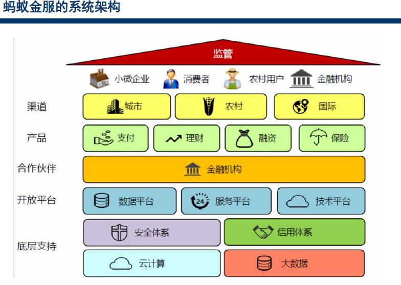

图   蚂蚁金服的系统架构
备注：
1.大数据风控五六千条规则、60多个模型，用于系统自动识别与管控风险并作出预警。在云计算和大数据基础之上，通过搭建信用 与风控体系，蚂蚁金服的上层业务板块得以构建。

## 电子信息

### 芯片

表格  芯片术语

| 术语   | 解释                                                           |
| ---- | ------------------------------------------------------------ |
| 芯片   | IC                                                           |
| 芯片分工 | 三块分别是设计、制造、封测                                                |
| 制程   | 用来表征集成电路尺寸的大小的一个参数。目前，28nm是传统制程和先进制程的分界点。                    |
| 晶圆   | 晶圆要经过金属溅镀、涂布光阻、蚀刻技术、光阻去除等过程将微型电路覆盖到表面上，这样一块晶圆上就会形成很多的集成电路芯片。 |
| 硅片   | 半导体芯片制造最重要的基础原材料，在晶圆制造材料成本中占比近30%，是份额最大的材料。                  |

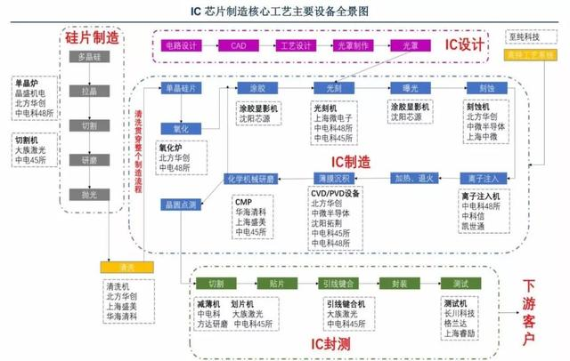

中国企业

- 晶圆代工三强：中芯国际、华虹半导体、华力微
- 存储器三强：长江存储、合肥长鑫、福建晋华

芯片设计：设计工具EDA， IC设计

芯片制造六大设备：扩散炉、刻蚀机、离子注入设备、薄膜沉积设备、抛光机和清洗剂

**产业链**

电子制造产业包括：原材料砂子-硅片制造-晶圆制造-封装测试-基板互联-仪器设备组装。集成电路产业链主要为设计、制造、封测以及上游的材料和设备。

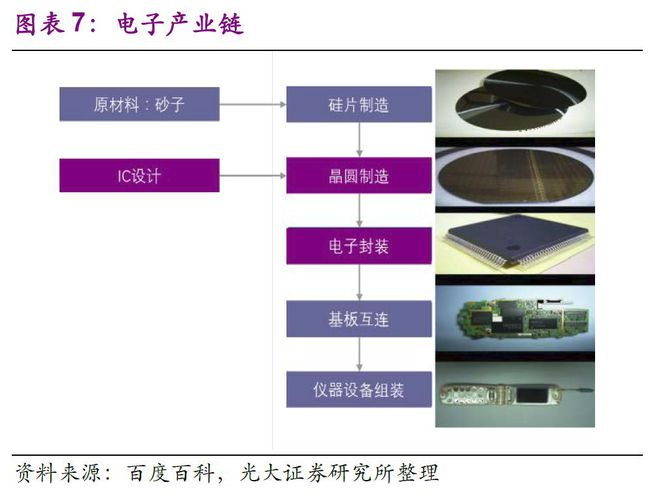

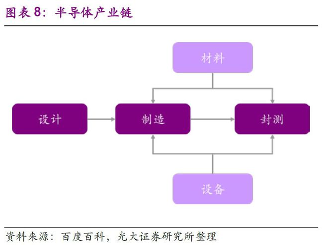

集成电路产业主要有以下特征：制造工序多、产品种类多、技术换代快、投资大风险高。

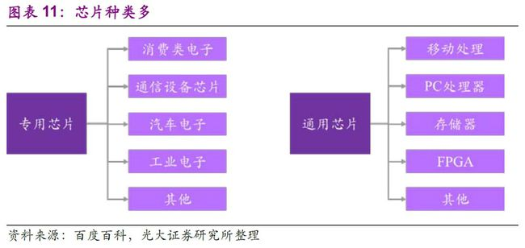

 

### 通信

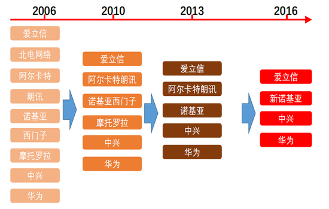

图  通信行业巨头演变史（2006-2016）

备注：2006年北电破产，4家合并成2家。2012年谷歌收购摩托罗拉移动。2015年，诺基亚收购阿尔卡特朗讯。

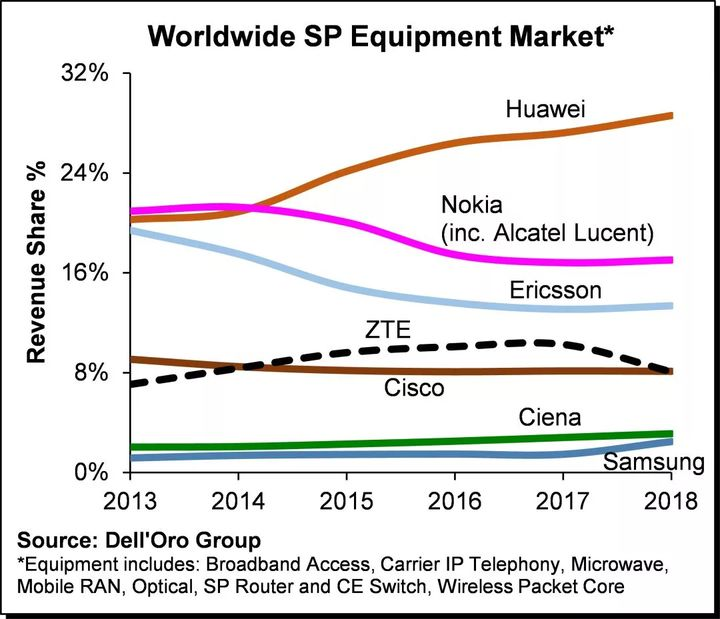

图   全球电信设备商市场份额（2013-2018）

表格  通信行业大事记

| 时间    | 事件                                                                                                                           | 备注                                                                                                                                                                                                                                                                                                                                                                                                                                                                                                                                                                                                                                                                                                                                                                                                                                                                                                                                                                                                                                                                         |
| ----- | ---------------------------------------------------------------------------------------------------------------------------- | -------------------------------------------------------------------------------------------------------------------------------------------------------------------------------------------------------------------------------------------------------------------------------------------------------------------------------------------------------------------------------------------------------------------------------------------------------------------------------------------------------------------------------------------------------------------------------------------------------------------------------------------------------------------------------------------------------------------------------------------------------------------------------------------------------------------------------------------------------------------------------------------------------------------------------------------------------------------------------------------------------------------------------------------------------------------------- |
| 1876  | 亚历山大·贝尔，打出了世界上第一通电话。次年，贝尔成立AT&T的前身--贝尔电话公司。                                                                                  | 全球现代通信史的开端。                                                                                                                                                                                                                                                                                                                                                                                                                                                                                                                                                                                                                                                                                                                                                                                                                                                                                                                                                                                                                                                                |
| 1925  | AT&T收购了西方电子公司的一个研究部门，成立了著名的通信技术实验室——贝尔实验室。                                                                                   | [美国贝尔实验室](https://baike.baidu.com/item/美国贝尔实验室/14738104)是[晶体管](https://baike.baidu.com/item/晶体管/569042)、[激光器](https://baike.baidu.com/item/激光器/2374206)、[太阳能电池](https://baike.baidu.com/item/太阳能电池/3155066)、[发光二极管](https://baike.baidu.com/item/发光二极管/1521336)、[数字交换机](https://baike.baidu.com/item/数字交换机/5926457)、[通信卫星](https://baike.baidu.com/item/通信卫星/377337)、[电子数字计算机](https://baike.baidu.com/item/电子数字计算机/3516281)、[C](https://baike.baidu.com/item/C语言/105958)[语言](https://baike.baidu.com/item/C语言/105958)、[UNIX](https://baike.baidu.com/item/UNIX操作系统/851445)[操作系统](https://baike.baidu.com/item/UNIX操作系统/851445)、[蜂窝](https://baike.baidu.com/item/蜂窝/18046858)[移动通信设备](https://baike.baidu.com/item/移动通信设备)、长途[电视传送](https://baike.baidu.com/item/电视传送/16688607)、[仿真语言](https://baike.baidu.com/item/仿真语言)、[有声电影](https://baike.baidu.com/item/有声电影/1090259)、[立体声录音](https://baike.baidu.com/item/立体声录音/4562404)，以及[通信网](https://baike.baidu.com/item/通信网/2300853)等许多重大发明的诞生地。一共获得8项（13人）[诺贝尔奖](https://baike.baidu.com/item/诺贝尔奖/187878)（其中7项物理学奖，1项化学奖）。 |
| 1950s | 0G无线通信技术时代。                                                                                                                  |                                                                                                                                                                                                                                                                                                                                                                                                                                                                                                                                                                                                                                                                                                                                                                                                                                                                                                                                                                                                                                                                            |
| 1980s | 1G，蜂窝通信技术时代。         1973年，摩托罗拉的马丁·库珀发明世界第一台“大哥大”问世。         1977年世界第一台个人电脑         APPLE         II面世。1978年，贝尔实验室研发出1G网络标准。 | 1987年11月，广东省开通了全国第一个移动通信网。         1987年，任正非创建华为；1994年华为推出了首款C&C08数字程控机。                                                                                                                                                                                                                                                                                                                                                                                                                                                                                                                                                                                                                                                                                                                                                                                                                                                                                                                                                                                                   |
| 1990s | 2G，数字通信技术时代。         二种标准：GSM（欧洲）与CDMA（美国）。                                                                                  | 中国通信业四小龙：巨大中华。         1993年中国第一个GSM网络在浙江嘉兴部署。                                                                                                                                                                                                                                                                                                                                                                                                                                                                                                                                                                                                                                                                                                                                                                                                                                                                                                                                                                                                                             |
| 1996  | 贝尔实验室以及 AT&T         的设备制造部门脱离 AT&T         成为朗讯科技。 AT&T保留了少数研究人员成为其研究机构——AT&T实验室。                                           |                                                                                                                                                                                                                                                                                                                                                                                                                                                                                                                                                                                                                                                                                                                                                                                                                                                                                                                                                                                                                                                                            |
| 2000s | 3G，宽频通信技术时代。         1996，ITU（国际电信联盟）         组织产生通信系统构建蓝图IMT-2000（即3G)。                                                     | 3G有三个国际标准：欧洲UMTS技术、美国CDMA技术标准，以及中国TD-SCDMA技术标准                                                                                                                                                                                                                                                                                                                                                                                                                                                                                                                                                                                                                                                                                                                                                                                                                                                                                                                                                                                                                             |
| 2006  | 北电破产。         NOKIA和西门子的电信设备子公司合并，成立的诺基亚西门子（简称诺西)。         同时，阿尔卡特134亿美元收购朗讯成立阿尔卡特朗讯。                                        | 北电CDMA和LTE部门和相关专利被诺西收购，北电WCDMA部门和专利被阿尔卡特收购。                                                                                                                                                                                                                                                                                                                                                                                                                                                                                                                                                                                                                                                                                                                                                                                                                                                                                                                                                                                                                                |
| 2010s | 4G，通信技术标准大统一时代。统一全球的LTE（         Long Term         Evolution）技术标准。         2014年，全球包括中国开始部署4G。                               | 二种制式：FDD-LTE（欧美日韩）与TD-LTE（中国）                                                                                                                                                                                                                                                                                                                                                                                                                                                                                                                                                                                                                                                                                                                                                                                                                                                                                                                                                                                                                                              |
| 2011  | 谷歌以125亿美元收购摩托罗拉移动。                                                                                                           | 2014年，联想以29亿美元从谷歌收购摩托罗拉移动。                                                                                                                                                                                                                                                                                                                                                                                                                                                                                                                                                                                                                                                                                                                                                                                                                                                                                                                                                                                                                                                 |
| 2015  | 诺基亚156亿欧元收购阿尔卡特朗讯。                                                                                                           |                                                                                                                                                                                                                                                                                                                                                                                                                                                                                                                                                                                                                                                                                                                                                                                                                                                                                                                                                                                                                                                                            |

 

## 新兴行业

### 比特币

表格 1 比特币大事记

| 阶段  | 主要事件                                                                                                           |
| --- | -------------------------------------------------------------------------------------------------------------- |
| 诞生  | 2009年，中本聪提出概念，去中心化的支付系统，并生成第一个创始区块。                                                                            |
| 发展  | 2014年9月9日，美国电商巨头<u><a href="https://baike.baidu.com/item/eBay">eBay</a></u>宣布，该公司旗下支付处理子公司Braintree将开始接受比特币支付。 |
| 高峰  | 2017年，比特币从年初的年初6949元（约1千美元）涨到12月13日的峰值130581元，涨了13倍。                                                           |
| 衰退  |                                                                                                             |

  

## 本章参考

* 介绍一个真实的中国芯片产业现状  https://www.sohu.com/a/317039535_530597
* 中国芯片产业深度分析报告：一文看懂真实国产芯片现状 2020.12 https://www.163.com/dy/article/FT622K0P0519X10F.html
* 中国芯片产业链发展现状，一文带你全面了解一下 https://t.cj.sina.com.cn/articles/view/7147850123/1aa0b898b00100oi59?from=tech
* 美国“芯”焦的背后 https://baijiahao.baidu.com/s?id=1675806835879006493&wfr=spider&for=pc
* 创业不易，他们倒在了2021  https://new.qq.com/omn/20211229/20211229A01YOD00.html

 

# 4 IT史~浪潮之巅

## 内部规律

**计算机工业生态链**

- ​    摩尔定理
- 安迪-比尔定理以微软为首的软件开发商吃掉硬件提升带来的全部好处，迫使用户更新机器让惠普和戴尔等公司收益，而这些整机生产厂再向英特尔这样的半导体厂订货购买新的芯片、同时向 Seagat e等外设厂购买新的外设。
- ​    反摩尔定理

**信息产业的规律性**

- ​    70-20-10定律：信息产业大公司之间的市场份额大概保持老大70%，老二老三20%, 其它10%.
- ​    诺威格定理，当一个公司的市场占有率超过 50% 后，就无法再使市场占有率翻番了。--》公司需要新的增长点。
- ​    基因决定定理

### IT领域的技术生命周期

IT领域主要分为硬件，软件，通信三大块，下面逐一分析每一块的技术生命周期。

#### 通信领域

**包括有线通信，无线通信，互联网**

AT&T(1876—1995—1999) 包括AT&T、朗讯和 NCR, 贝尔实验室和香农试验室。

Motorola (1928—2010)

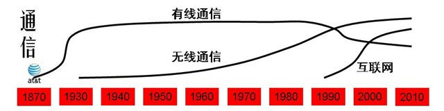

**注：1870年左右AT&T在有线通信的起步阶段。**

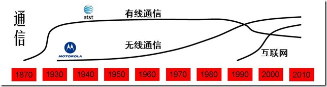

**注：1940年左右AT&T在有线通信的成熟阶段。Motorola在无线通信的起步阶段。**

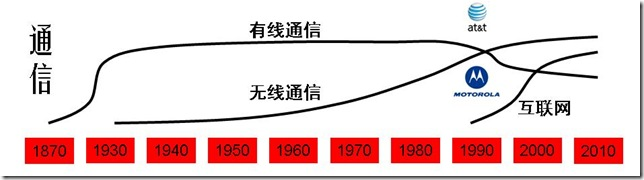

**注：1990年左右AT&T在有线通信的衰退阶段。Motorola在无线通信的成长阶段。**

小结：AT&T在有线通信领域一直保持领先，直至互联网时代的到来。Motorola在无线通信领域也是一直保持领先，直至互联网时代落后。

#### 硬件领域

**主要分大型机，PC机和网络设备。也可细分为半导体，硬盘，内存等。**

**IBM: (1923--)** 华生实验室

康柏: (1982--2002) 2002年被惠普收购

Sun: (1982--2009) 2009年被Oracle收购。

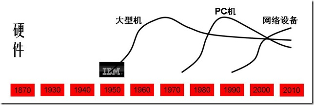

**注：1950年左右IBM在大型机市场起步阶段。**

**注：1970年左右IBM在大型机市场成熟阶段，并在PC机起步，同时竞争者有Compaq。**

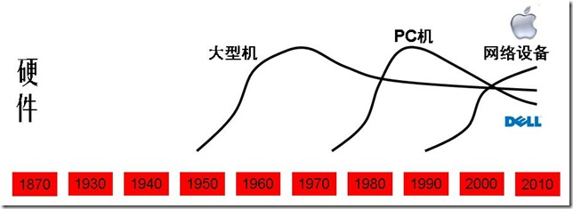

**注：2000年左右Dell**

#### 软件领域

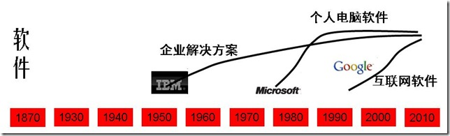

相比于其他软件行业，中国的互联网行业算是基本跟紧国际潮流，一般晚2到3年。
**门户**：1994年雅虎在美国成立，1997年丁磊创办网易，王志东创办新浪，张朝阳创立搜狐。
**搜索**：1998年谷歌在美国成立，2000年李彦宏创办百度。2004年搜狐-搜狗，2006网易有道。
**电子商务**：1995年亚马逊，eBay创立，1999年马云创建阿里巴巴，沈南鹏创办携程。李国庆创办当当网。2001年搜狐商城。2008年~~百度有啊~~。
**网游**：1999年陈天桥创建盛大。2001年网易大话西游，2003年搜狐骑士。
**社交网络**：1999年马化腾腾讯。2003年Myspace成立，2004年facebook成立。2005年11月校内网创立。2004年网易部落，搜狐白社会。2006年twitter.

**视频**：2005.2 Youtube创立。2004.2土豆创立。2006年Youku成立。

## IT编年史

表格  TMT行业国内外大事比较

| 年代        | 产品&关键词              | 国际新创公司                                                | 国内新创公司                                 |
| --------- | ------------------- | ----------------------------------------------------- | -------------------------------------- |
| 1865-1919 | 有线通信：电话电报           | AT&T、诺基亚                                              |                                        |
| 1920-1939 | 大型机、收音机             | IBM、摩托罗拉、惠普                                           |                                        |
| 1940-1959 |                     |                                                       |                                        |
| 1960-1979 | 无线通信 企业软件 软件        | Intel、SAP、微软、Apple、Oracle。                            |                                        |
| 1980-2009 | 个人电脑 互联网 内容门户 电商    | 康柏、~~Sun~~、思科、DELL、雅虎、谷歌、亚马逊、ebay                     | 联想、电信、华为、搜狐、新浪、网易、腾讯、阿里巴巴、中华网、百度、当当、京东 |
| 2000-2009 | 移动互联网 社交 网络视频 4G 游戏 | LinkedIn、~~Myspace~~、Facebook、Flicker、Youtube、Twitter | 优酷、土豆、人人网、新浪微博、豆瓣、58同城、盛大              |
| 2010-2019 | 直播 短视频 5G AI 大数据    | 特斯拉                                                   | 小米、抖音、快手、今日头条、                         |
| 2020-     |                     |                                                       |                                        |

说明：表中所指公司指年代范围内的后来成为行业领头羊的新创公司或典型代表公司。~~公司~~名加删除线表示此公司没跟上时代发展倒闭或被收购。

### 全球IT编年史

表格   全球IT编年史列表

| Date | 主要事件                                                                                      |
| ---- | ----------------------------------------------------------------------------------------- |
| 1865 | 诺基亚（[Nokia](http://www.nokia.com.cn/)）创立。                                                 |
| 1876 | 亚历山大·贝尔发明了电话，第二年成立了贝尔电话公司。（有线通信）                                                          |
| 1924 | [IBM](http://www.ibm.com/)创立。                                                             |
| 1928 | 加尔文兄弟创办了摩托罗拉的前身加尔文制造公司。                                                                   |
| 1930 | 第一台摩托罗拉牌汽车收音机问世。（无线通信）                                                                    |
| 1939 | [惠普](http://www.hp.com/)公司创立。                                                             |
| ...  |                                                                                           |
| 1968 | [Intel](http://www.intel.com/)创立。                                                         |
| 1972 | SAP创立（系统、应用和产品）。                                                                          |
| 1975 | [Microsoft](http://www.microsoft.com/)创立。                                                 |
| 1976 | [Apple](http://www.apple.com/itunes/)创立。                                                  |
| 1977 | [Oracle](http://www.oracle.com/)埃里森创立。                                                    |
| 1982 | 康柏创立，2002年被惠普收购。Sun创立，2009年被Oracle收购。                                                     |
| 1983 | 摩托罗拉首部商用手机。微软开始了“windows”项目，apple推出麦金托什计划。                                                |
| 1984 | 思科[Cisco](http://www.cisco.com/)成立。[Dell](http://www.dell.com/)成立。                        |
| 1985 |                                                                                           |
| 1991 | Motorola第一个GSM蜂窝系统                                                                        |
| 1992 |                                                                                           |
| 1993 |                                                                                           |
| 1994 | 网景公司浏览器软件占98％市场。雅虎成立。                                                                     |
| 1995 | AT&T 公司重组，分裂成 AT&T、朗讯和 NCR 三家公司。sun发布java语言。微软捆绑IE4。[亚马逊](http://www.amazon.com/)，ebay创立。 |
| ...  |                                                                                           |
| 1998 | [谷歌](http://www.google.com/)成立。AOL收购网景。                                                   |
| 1999 | AT&T 和朗讯公司分别被 SBC 公司和法国的阿尔卡特公司并购。blogger创立。                                               |
| 2001 | AOL与时代华纳并购。                                                                               |
| 2002 | 惠普收购康柏。**eBay收购PayPal。**                                                                  |
| 2003 | 5月LinkedIn 创立；8月myspace创立。甲骨文收购PeopleSoft。**EMC收购VMware。**                                |
| 2004 | 2月[facebook](http://www.facebook.com/)、flicker创立。**联想收购IBM PC。**                          |
| 2005 | 2月youtube创立, 2006年被[谷歌](http://www.google.com/)收购。12月，eBay收购Skype。谷歌收购安卓。                 |
| 2006 | 7月twitter创立。                                                                              |
| 2007 |                                                                                           |
| 2008 | 9月Google G1手机推出；Apple推出iPod及iTunes Store。谷歌收购DoubleClick。**惠普收购EDS。**                     |
| 2009 | 12月，时代华纳剥离AOL;                                                                            |
| 2010 | 甲骨文收购SUN。**惠普收购Palm。Intel收购McAfee.**                                                      |
| 2011 | 5月，微软85亿美元收购Skype；8月，谷歌125亿美元收购摩托罗拉移动业务。                                                  |
| 2012 |                                                                                           |
| 2013 | 9月，微软72亿美元收购诺基亚。                                                                          |
| 2017 |                                                                                           |
| 2021 | 元宇宙元年：上半年，元宇宙第一股Roblox上市；下半年，Facebook改名为元Meta。                                            |

### 中国IT编年史

表格  中国IT编年史列表

| Date      | 主要事件                                                                                                                                                                                                                                                                                                                                                                                                                              |
| --------- | --------------------------------------------------------------------------------------------------------------------------------------------------------------------------------------------------------------------------------------------------------------------------------------------------------------------------------------------------------------------------------------------------------------------------------- |
| 1984~1994 | 1984：联想成立  1985：长城微机0520CH诞生   1987：首封电邮   1988：建科技园(中关村)  1994：第一次接入互联网。                                                                                                                                                                                                                                                                                                                                          |
| 1995~2004 | 1995：8月，水木清华BBS架设。 1997：联通成立。1月，人民网上线。6月，CNNIC成立。   1998，内容门户元年，四大门户搜狐、新浪、网易、腾讯成立。 1999：电子商务元年。中华网在纳斯达克上市，成为第一个中国概念网络股。   2000：内容门户上市年。移动成立，TD成国标。   2001：移动手机元年。龙芯诞生。5月，中国互联网协会成立。   2002：移动手机内容SP元年。 2003：网络游戏元年。淘宝网、支付宝成立。 2004：中国互联网第一波集中上市收割年。                                                                                                                                                  |
| 2005~2014 | 2005：WEB2.0社区内容元年，新浪博客、豆瓣、58同城成立。 百度上市。联想购IBM PC。  2006：网络视频内容元年，酷六、优酷、土豆、迅雷成立。楼宇广告大战成就众多传媒公司，如分众。 2007：电子商务调整成长。阿里巴巴B2B香港上市。 2008：智能手机元年。网民世界第一，CN域名注册总量世界第一。   2009：产品大战年。奇虎360发布永久免费的杀毒软件，开创互联网盈利新模式。双十一购物首度开始。   2010：电商暴发年，团购百团大战。 2011：中国移动互联网元年。国家互联网信息办公室成立。    2012：中国移动互联网发展年，手机网民数量超过电脑网民数量。联想全球第一大PC厂商(超过HP)，华为全球第一大电信设备商(超过爱立信)。   2013：中国首批4G牌照发放。大数据元年。  2014：中国企业服务元年。阿里巴巴上市纽交所。 |
| 2015~2019 | 2015：中国互联网金融元年，扫码支付。 2016：智能元年。共享单车大战。 2017：新零售元年。5月，世界首台光量子计算机在中国诞生。10月，中科院和阿里云合作发布量子云计算平台。 2018：区块链。 2019：AI、5G、区块链、机器人、VR、AI寻人、智能家居、物联网、刷脸支付、AR。                                                                                                                                                                                                                                                                   |
| 2020-2024 | 2020：健康码、云、反垄断、直播带货、地摊经济、北斗、社区团购、P2P、长租公寓、视频号。信创产业落地元年。 2021：反垄断、互联互通、数据安全、碳中和、产业互联网、合规、硬科技、元宇宙、出海、助农。 2022：                                                                                                                                                                                                                                                                                                              |

> 中国新四大发明（2015年左右出现的段子）：高铁、共享单车、支付宝和网购。
> 
> 中国新基建：新型基础建设设施，出现于2019年政府工作报告，此后出现信创产业。

1. 2021年：
   - 反垄断大年：11月国家反垄断局正式成立。反垄断处罚案例高达118起，其中互联网占75.42%；互联网反垄断罚款超200亿元。7月阿里巴巴因涉及“二选一”行为被罚182.28亿元；叫停斗鱼虎牙合并。
   - 互联互通元年：9月整治网址屏蔽。数据安全元年：《数据安全法》和《个人信息安全保护法》。碳中和元年：年初，碳中和写入政府工作报告，成为国家战略。

## 伟大明星公司

说明：伟大明星公司不仅指市值靠前、行业巨头，还引领了社会和科技变革。靠垄断形成巨额利润而对社会贡献不显著的公司不列其中。

表格 伟大的明星公司列表

| 公司名       | 成立时间 | 创始人                                                                                  | 简介                              | 主要事件                                                            |
| --------- | ---- | ------------------------------------------------------------------------------------ | ------------------------------- | --------------------------------------------------------------- |
| IBM       | 1924 |                                                                                      | 百年深蓝。多次成功战略转型。                  | 1964年推出大型机。1995后客户导向，提供解决方案。 2005年从硬件转型咨询服务（卖掉PC）。2010年系统整合。 |
| Intel     | 1968 |                                                                                      | Win-Intel联盟从80年代开始垄断PC市场近40年。   | 1971年，英特尔推出世界上第一款商用计算机微处理器4004。                                 |
| Microsoft | 1975 | [比尔·盖茨](http://baike.baidu.com/view/2075.htm) (Bill Gates)  1955--               | 80年代至今垄断个人电脑OS。2010后成为云服务领导者之一。 | 1983年推出Windows操作系统。2010年推出Azure。                                |
| Apple     | 1976 | [史蒂夫乔布斯](http://baike.baidu.com/view/90660.htm) (Steve Paul Jobs) 1955--2011         | 围绕Apple构建的软硬件生态。硬件有手机、电脑、PAD等。  | 1984年推出Macintosh电脑。2007年推出iPhone手机。                             |
| 华为        | 1987 | 任正非  1944-                                                                           | 通讯行业领导者、手机领导者之一。                | 2013年后，通讯设备市场占有率全球第一。                                           |
| Amazon    | 1995 | 杰夫·贝索斯 (Jeff Bezos)   1964--                                                      | 电商巨头，云服务时代的领导者。                 | 2006年推出云平台。                                                     |
| Google    | 1998 | [拉里.佩奇](http://baike.baidu.com/view/251897.html) (Larry Page)  1973--             | 最伟大的搜索引擎公司。产品软件有搜索、地图；硬件有手机等。   | 2006年收购Youtube；2008年推出手机。                                       |
| 腾讯        | 1998 | 马化腾 1971-                                                                            | 中国网络社交领导者，世界第一大游戏公司。            |                                                                 |
| 阿里巴巴      | 1999 | 马云 1964-                                                                             | 电商领导者，云服务领导者。                   |                                                                 |
| Facebook  | 2004 | [克·扎克伯格](https://baike.baidu.com/item/马克·扎克伯格/9760094) (Mark Zuckerberg)   1984- | 网络社交领导者。2021年改名Meta。            | 2012年4月10亿美元收购Instagram；10月纳斯达克上市。  2014年190亿美元收购WhatsApp。  |

备注：表格按成立时间排序，已经倒闭的明星公司另外列表。

### Google(1998--)

[Google Timeline](http://www.google.com/corporate/timeline/#start)

[拉里.佩奇](http://baike.baidu.com/view/251897.html)(Larry Page) 1973---xxxx

表格 43 谷歌发展史表

| Date      | 主要事件                                                                                        |
| --------- | ------------------------------------------------------------------------------------------- |
| 1996-1997 | BackRub                                                                                     |
| 1998      | Google的第一个首页                                                                                |
| 1999      | 山姆大叔首页, 获红杉资本2500万美元风投                                                                      |
| 2000      | Google成为Yahoo搜索服务合作伙伴,  推出Adword服务                                                          |
| 2001      | Google图片搜索                                                                                  |
| 2002      | Google Search Appliance – GSA; 5月推出 Labs；9月推出新闻搜索服务                                         |
| 2003      | Adsense；收购 [Blogger](http://www.blogger.com/) 的开发公司 Pyra Labs。                              |
| 2004      | 推出Gmail; 推出Orkut；8月上市。                                                                      |
| 2005      | 2月推出Google Maps地图; CodeSearch; Google Analytics; Google Reader; 七月推出Google Earth；收购Android。 |
| 2006      | 10月收购Youtube; 推出Trends服务；Gchat, Google Calenda, Translate                                   |
| 2007      | 11月推出Android                                                                                |
| 2008      | 8月推出Chrome；9月第一款Google手机HTC G1；搜索添加了Google Suggest功能。收购DoubleClick。                         |
| 2009      | Google Wave（1年后关闭）; 推出 Picasa;                                                              |
| 2010      | 应用商店Android Market; Buzz服务; Google TV;                                                      |
| 2011      | Google+；8月，125亿美元收购摩托罗拉移动业务。                                                                |
| 2012      |                                                                                             |
| 2013      | 7.1，关闭Reader服务；                                                                             |
| 20xx      |                                                                                             |

### Apple(1976--)

http://it.icxo.com/specialreport/ITIndex/apple.html

[史蒂夫乔布斯](http://baike.baidu.com/view/90660.htm)（Steve Paul Jobs）1955~2011

Apple通过五款产品影响世界，分别是iPhone、iPad、Mac、AppleWatch和AppleTV。

表格 44  苹果发展史表

| Date      | 主要事件                                                                                                                                                                                           |
| --------- | ---------------------------------------------------------------------------------------------------------------------------------------------------------------------------------------------- |
| 1976      | [史蒂夫·乔布斯](http://zh.wikipedia.org/wiki/史蒂夫·乔布斯)、[史蒂夫·沃茲尼亚克](http://zh.wikipedia.org/wiki/史蒂夫·沃茲尼克)和[罗纳德‧韦恩](http://zh.wikipedia.org/w/index.php?title=羅納德‧韋恩&action=edit&redlink=1)在车库里创建苹果公司。 |
| 1977      | Apple II问世。在电脑界被广泛誉为缔造家庭电脑市场的产品。                                                                                                                                                               |
| 1980      | 公司上市。                                                                                                                                                                                          |
| 1983      | 图形电脑[Lisa](http://zh.wikipedia.org/wiki/Apple_Lisa)问世，但过于昂贵，1986年终止销售。                                                                                                                         |
| 1984      | Macintosh电脑问世。                                                                                                                                                                                 |
| 1985—2000 | 长达十五年的低谷. 乔布斯离开APPLE公司时间（1985—1998）.                                                                                                                                                           |
| 2001      | [Mac OS X](http://zh.wikipedia.org/wiki/Mac_OS_X)问世。开设[苹果零售店](http://zh.wikipedia.org/wiki/苹果零售店)iTunes。10月推出[iPod](http://zh.wikipedia.org/wiki/IPod)。                                        |
| 2004      |                                                                                                                                                                                                |
| 2005      |                                                                                                                                                                                                |
| 2006      | 推出个人电脑[iMac](http://zh.wikipedia.org/wiki/IMac)                                                                                                                                                |
| 2007      | 1月推出[iPhone](http://zh.wikipedia.org/wiki/IPhone)手机。                                                                                                                                           |
| 2008      | 推出了iPod及iTunes Store                                                                                                                                                                           |
| 2009      |                                                                                                                                                                                                |
| 2010      | 1月推出[平板电脑](http://zh.wikipedia.org/wiki/平板電腦)产品[iPad](http://zh.wikipedia.org/wiki/IPad)。                                                                                                      |
| 2011      | 3月推出[iPad 2](http://zh.wikipedia.org/wiki/IPad_2)。6月推出Mac Os X lion、ios 5、icloud。10月5日推出iPhone 4S。 10月6日[乔布斯](http://zh.wikipedia.org/wiki/喬布斯)病逝。125亿美元收购摩托罗拉移动。                           |
| 2012      | 9月13日推出iPhone5；                                                                                                                                                                                |
| 2017      | 9月，推出iphone8。编程语言swift4.0发布。IOS 11发布。                                                                                                                                                          |
| 2022      | 3月9日，54亿美元收购Mandiant。                                                                                                                                                                          |

### MS(1975--)

http://it.icxo.com/specialreport/ITIndex/microsoft.html

[比尔·盖茨](http://baike.baidu.com/view/2075.htm)(Bill Gates) 1955—xxxx

表格 45  微软发展史表

| Date | 主要事件                                                    |
| ---- | ------------------------------------------------------- |
| 1980 | MS-DOS系统                                                |
| 1983 | 微软开始了“windows”项目                                        |
| 1985 | 历时2年的windows1.0问世                                       |
| 1990 | windows3.0推出。                                           |
| 1995 | 微软进军互联网，免费提供IE4                                         |
| 1998 | windows98                                               |
| 2000 | Windows 2000                                            |
| 2001 | 11月Windows XP发布。                                        |
| 2006 |                                                         |
| 2008 | 6.27，[比尔·盖茨](http://baike.baidu.com/view/2075.htm)宣布退休。 |
| 2009 | 推出windows7                                              |
| 2010 | 启动Azure。                                                |
| 2011 | 5月，85亿美元收购Skype。                                        |
| 2012 | 8月，淘汰Hotmail邮箱；10月，推出Windows8(Win8)。                    |
| 2013 | 9月，72亿美元收购诺基亚。                                          |
| 2014 | 8月，MSN彻底退出全球最后一个市场~中国，用Skype替代。                         |
| 2016 | 6月，262亿美元收购领英（LinkedIn）。                                |

### IBM(1924--)

http://it.icxo.com/specialreport/ITIndex/IBM.htm

创建于1924年的百年老店，蓝色巨人。 IBM到现在仍然是世界上第二大软件公司、第二大数据库公司、第二大服务器公司、第三大安全软件公司、第六大咨询公司，连续14年是最大的应用基础设施和中间件公司。

表格 46 IBM发展史表

| Date | 主要事件                            |
| ---- | ------------------------------- |
| 1911 | 加入CTR                           |
| 1924 | CTR改名为IBM。由华生创建，但是当时主要从事机械制表工业。 |
| 1952 | 冯· 诺伊曼做顾问，开始领导电子技术革命的浪潮。        |
| 1964 | IBM360系列电脑的推出, 占据了20年的大型机市场。    |
| 1981 | IBM PC问世，一经推出就抢掉了apple四分之三的市场。  |
| 1987 | IBM宣布推出OS/2操作系统                 |
| 2002 | IBM以30亿美元出售硬盘部门给日本的日立公司。        |
| 2003 |                                 |
| 2004 | IBM 以17.5亿美元出售笔记本电脑部门给中国的联想公司。  |
| 2005 | IBM 将自己确立为一个服务型的技术公司。           |
| 2010 |                                 |
| 2014 | IBM 以23亿美元出售X86服务器部门给中国的联想公司 。  |
| 2018 | 340亿美元收购Redhat。                 |
|      |                                 |

### 已经消失的明星公司

表格 47 已经消失的明星公司列表

| 名称             | 简介              | 简介（大事记）                                                                                                                                                                                                                                                                                                           | 创建时间 | 结束时间 |
| -------------- | --------------- | ----------------------------------------------------------------------------------------------------------------------------------------------------------------------------------------------------------------------------------------------------------------------------------------------------------------- | ---- | ---- |
| Compq~康柏       | 服务器和桌面电脑前巨头之一。  | 1983年：生产IBM兼容机。1998年收购[迪吉多](http://zh.wikipedia.org/wiki/迪吉多)。  2002年被惠普收购。                                                                                                                                                                                                                                    | 1982 | 2002 |
| **Sun**        | 开源巨头。           | 1986年在美国纳斯达克上市。主要产品是[工作站](http://zh.wikipedia.org/wiki/工作站)、[服务器](http://zh.wikipedia.org/wiki/服务器)和[UNIX](http://zh.wikipedia.org/wiki/UNIX) [操作系统](http://zh.wikipedia.org/wiki/作業系統)。  1995年Sun开发了[Java](http://zh.wikipedia.org/wiki/Java)技术。2000年，开放StarOffice源代码生成社区开发版OpenOffice。  2009年被Oracle收购。 | 1982 | 2009 |
| AT&T~美国电话和电报公司 | 通讯行业1-2G的前巨头。   | 1876年，亚历山大·贝尔发明了电话，第二年成立了贝尔电话公司。  1999，朗讯被法国的阿尔卡特并购.  AT&T被西南贝尔（SBC） 公司并购。  2015.12, 阿尔卡特-朗讯被诺基亚收购。                                                                                                                                                                                                       | 1877 | 2015 |
| Yahoo~雅虎       | 互联网先驱           | 2016.7，Verizon斥资48亿美元收购雅虎互联网资产，雅虎仅余下雅虎日本和阿里巴巴的股份。                                                                                                                                                                                                                                                                 | 1994 | 2016 |
| Motorola~摩托罗拉  | 通讯行业2G、3G的领导者之一 | 1928年，加尔文兄弟创办了摩托罗拉的前身加尔文制造公司。  2011年：Google 172亿美元收购摩托罗拉移动。 2014年1月30日，联想集团以29亿美元的价格从[谷歌](http://product.yesky.com/mobilephone/google/)手中收购了[摩托罗拉](http://product.yesky.com/mobilephone/motorola/)移动。                                                                                                         | 1928 |      |
| Nokia~诺基亚      | 通讯行业2G、3G的领导者之一 | 成立于1865年，是一家总部位于芬兰埃斯波，主要从事生产移动通信产品的跨国公司。自1996年以来，诺基亚连续14年占据市场份额第一。  2013年，微软72亿美元（54.4亿欧元）收购诺基亚设备与服务部门（诺基亚手机业务）。                                                                                                                                                                                              | 1865 |      |

备注：排序先按结束时间升序，再按创建时间升序。

**AT&T:** 美国电话和电报公司（1877—2000）

1876年，亚历山大·贝尔发明了电话，第二年成立了贝尔电话公司。

1885年，AT&T作为贝尔电话公司的子公司诞生，专门经营长途电话业务。

1892生意扩展到纽约之外； 1915年扩展到全国。1927年扩展到欧洲；

1925年成立贝尔实验室（历史最大的、最成功的私有实验室）。

1984年市话业务分出去。

1995，AT&T 公司重组为三个部分，从事电信业务的 AT&T，从事设备制造业务的朗讯 Lucent 和从事计算机业务的NCR。1999, AT&T 移动（AT&T　wireless）单独上市，市值100亿美元。

**结局**：1999，朗讯被法国的阿尔卡特并购. T&T被西南贝尔（SBC） 公司并购。2015.12, 阿尔卡特-朗讯被诺基亚收购。

**Motorola**：摩托罗拉（1928—2011）

1928年，加尔文兄弟创办了摩托罗拉的前身加尔文制造公司。

1930年：第一台摩托罗拉牌汽车收音机问；

1940年，研发推出手提式调幅(AM)无线对讲机“SCR536”。

1943年：背负式调频步话机SCR300。

1947年，加尔文制造公司更名为摩托罗拉公司。

1969年7月，阿波罗11号飞船安装了摩托罗拉的无线应答器，用于传递地球与月球间的语音通讯和电视信号。

1974年：摩托罗拉mc6800

1983年：首部商用手机

1986年：六西格玛

1991年：第一个GSM蜂窝系统。

到九十年代初，摩托罗拉在移动通信、数字信号处理和计算机处理器三个领域都处于世界领先。

1991 年：摩托罗拉公司联合了好几家投资公司，正式启动了“铱星计划”。 1996 年，第一颗铱星上天；1998 年整个系统顺利投入商业运营。2000 年 3 月 18 日，铱星公司正式破产。由于错过了GSM的发展，在无线通信上输给了诺基亚，在处理器输给了英特尔，在数字信号处理输给了德州仪器。

2011年：Google 172亿美元收购摩托罗拉移动。

2014年1月30日，[联想](http://product.yesky.com/mobilephone/lenovo/)集团以29亿美元的价格从[谷歌](http://product.yesky.com/mobilephone/google/)手中收购了[摩托罗拉](http://product.yesky.com/mobilephone/motorola/)移动。

**Nokia 诺基亚**（1865—2013--?）

成立于1865年，是一家总部位于芬兰埃斯波，主要从事生产移动通信产品的跨国公司。自1996年以来，诺基亚连续14年占据市场份额第一。面对新操作系统的智能手机的崛起，诺基亚全球手机销量第一的地位在2011年第二季被苹果及三星双双超越。

2013年，微软72亿美元（54.4亿欧元）收购诺基亚设备与服务部门（诺基亚手机业务）。

 

## 本章参考

2. 吴军，《Google 黑板报─浪潮之巅》，2005
3. 吴军，浪潮之巅，电子工业出版社，2011-8
4. 中国互联网之二十年：1994-2014  http://www.cac.gov.cn/2014-11/16/c_1113265290.htm
5. 中国互联网20年简史（1998-2018）：其中的规律与本质是什么？  www.cniteyes.com/archives/33211   2018.7
6. 2019十大年度科技关键词  https://tech.sina.com.cn/roll/2019-12-25/doc-iihnzhfz8240108.shtml
7. 2020中国互联网哈哈榜之4：十大关键词  https://t.cj.sina.com.cn/articles/view/1455643221/56c35a5501900ykvo
8. 2022年，互联网10大关键词 https://new.qq.com/omn/20211228/20211228A05ZX800.html
9. 十分钟速览新中国成立70年通信行业发展史 https://zhuanlan.zhihu.com/p/84759595

  

# 参考资料

**参考书目**

* 方兴东，IT史记，中信出版社，2004-1-1
* 吴军，浪潮之巅，电子工业出版社，2011-8
* 吴晓波 《腾讯传》 浙江大学出版社  2017-1

**参考网站**

* 百度百科 http://baike.baidu.com/
* wikipedia  http://www.wikipedia.org/
* 知识产权局专利检索官网　http://www.sipo.gov.cn/sipo2008/zljs/
* 百度专利检索 http://zhuanli.baidu.com/
* http://www.soopat.net/  (可下载专利全文)
* InfoQ架构师 http://www.infoq.com/
* 全球最受欢迎的程序设计领域的问答网站之一  http://stackoverflow.com/
* 社交问答（仅英文） http://www.quora.com/
* IT桔子（IT互联网公司产品数据库及商业信息服务） https://www.itjuzi.com/
* 虎嗅网 https://www.huxiu.com/
* 36氪 创业服务平台，2015.6上线   http://36kr.com/
* 中国大数据产业观察 http://www.cbdio.com/BigData/
* 天眼查 https://www.tianyancha.com/
* 行行查  https://www.hanghangcha.com/

**参考链接**

* IT服务行业主管部门、监管体制及主要法律法规政策分析（2021年）  https://www.chyxx.com/zhengce/202108/970944.html
* 重磅！2020年中国网络信息安全行业政策汇总分析 地方政府加速领域布局(全)  https://www.qianzhan.com/analyst/detail/220/201116-010dfd7b.html
* 各国个人信息安全立法政策汇总  https://news.21csp.com.cn/c11/201904/11379801.html
* 2021中国互联网反垄断年度报告：罚款超200亿元，互联互通不断推进｜新京智库  https://baijiahao.baidu.com/s?id=1719912433551962722&wfr=spider&for=pc
* 工信部连发三文 绘制两化融合、软件和信息技术服务、大数据产业5年路线图  https://nengyuan.qlwb.com.cn/detail/18079888.html
* 清华大学：2021 元宇宙研究报告！  https://mp.weixin.qq.com/s/jUyt0H9kw84_TdvmQQj6xw   2021.11
* 《关于新增中国服务外包示范城市的通知》 国务院 2016年

  

# 附录

## TMT行业法规&政策

### 中国

为了规范行业秩序，国家历年颁布不少法律法规，如下表所示。

表格  TMT行业主要法律法规

| 法律法规名称                                                                                                                                                                                   | 施行时间       | 文件编号            | 影响   |
| ---------------------------------------------------------------------------------------------------------------------------------------------------------------------------------------- | ---------- | --------------- | ---- |
| 《中华人民共和国反垄断法》（2021年修订）                                                                                                                                                                   | 2008-08-01 | 国家主席令[2007]第68号 | 修订中  |
| 《中华人民共和国著作权法》（2010年修正）                                                                                                                                                                   | 2010-04-01 | 国家主席令[2010]第26号 |      |
| 《计算机软件保护条例》（2013年修正）                                                                                                                                                                     | 2013-03-01 | 国务院令[2013]第632号 |      |
| 《中华人民共和国政府采购法》（2014年修正）                                                                                                                                                                  | 2014-08-31 | 国家主席令[2014]第14号 |      |
| 《中华人民共和国政府采购法实施条例》                                                                                                                                                                       | 2015-03-01 | 国务院令[2014]第658号 |      |
| 《中华人民共和国国家安全法》                                                                                                                                                                           | 2015-07-01 | 国家主席令[2015]第29号 | 审查监管 |
| 《高新技术企业认定管理办法》（2016年修正）                                                                                                                                                                  | 2016-01-01 | 国科发火[2016]32号   |      |
| 《高新技术企业认定管理工作指引》（2016年修正）                                                                                                                                                                | 2016-01-01 | 国科发火[2016]195号  |      |
| 《中华人民共和国网络安全法》                                                                                                                                                                           | 2017-06-01 | 国家主席令[2017]第53号 | 网络监管 |
| 《中华人民共和国招标投标法》（2017年修正）                                                                                                                                                                  | 2017-12-28 | 国家主席令[2017]第86号 |      |
| 《中华人民共和国招标投标法实施条例》（2019年修正）                                                                                                                                                              | 2019-03-18 | 国务院令[2019]第709号 |      |
| 《中华人民共和国密码法》                                                                                                                                                                             | 2020-01-01 | 国家主席令[2019]第31号 |      |
| 《[中华人民共和国数据安全法](https://baike.baidu.com/item/%E4%B8%AD%E5%8D%8E%E4%BA%BA%E6%B0%91%E5%85%B1%E5%92%8C%E5%9B%BD%E6%95%B0%E6%8D%AE%E5%AE%89%E5%85%A8%E6%B3%95/22861124)》                     | 2021-09-01 | 国家主席令[2021]第84号 | 数据安全 |
| 《[中华人民共和国个人信息保护法](https://baike.baidu.com/item/%E4%B8%AD%E5%8D%8E%E4%BA%BA%E6%B0%91%E5%85%B1%E5%92%8C%E5%9B%BD%E4%B8%AA%E4%BA%BA%E4%BF%A1%E6%81%AF%E4%BF%9D%E6%8A%A4%E6%B3%95/24220563)》 | 2021-11-01 | 国家主席令[2021]第91号 | 个人信息 |

备注：上表中的施行时间是指生效时间，不是公布时间。施行时间一般晚于公布时间。

为了支持促进本行业发展，国家陆续出台相关政策，如下表所示。

表格  TMT行业主要政策

| 文件名称                                                                                                                       | 发布单位           | 发布时间       | 主要内容                                                                                                                                                                                         |
| -------------------------------------------------------------------------------------------------------------------------- | -------------- | ---------- | -------------------------------------------------------------------------------------------------------------------------------------------------------------------------------------------- |
| 《2006-2020年国家信息化发展战略》                                                                                                      | 中共中央办公厅、国务院办公厅 | 2006-05-08 | 到2020年，我国信息化发展的战略目标是：综合信息基础设施基本普及，信息技术自主创新能力显著增强，信息产业结构全面优化，国家信息安全保障水平大幅提高，国民经济和社会信息化取得明显成效，新型工业化发展模式初步确立，国家信息化发展的制度环境和政策体系基本完善，国民信息技术应用能力显著提高，为迈向信息社会奠定坚实基础。                                |
| 《商业银行数据中心监管指引》                                                                                                             | 银监会办公厅         | 2010-04-20 | 商业银行在选择数据中心外包服务商时，应充分审查、评估外包服务商的资质、专业能力和服务方案，对外包服务商进行风险评估，考查其服务能力是否足以承担相应的责任。                                                                                                                |
| 《进一步鼓励软件产业和集成电路产业发展的若干政策》                                                                                                  |  国务院       | 2011年1月    | 指出软件产业是国家战略性新兴产业，是国民经济和社会信息化的重要基础。同时，提出要继续实施国发18号文件明确的政策，完善激励措施，明确政策导向，优化产业发展环境，增强科技创新能力，提高产业发展质量和水平，并继续从财税、投融资、研究开发、进出口、人才、知识产权保护、市场管理等方面为软件产业发展提供强有力的政策支持。                                 |
| 《中国金融业信息化“十二五”发展规划》                                                                                                        | 中国人民银行         | 2011年9月    | 必须加大金融信息化工作的资金支持力度，提高信息化建设投入产出效率。支持金融业发展所急需的金融信息化基础设施建设。保障对基础性标准制定、系统软件、关键应用软件等的投入比例。加大移动支付、金融IC卡等创新领域的资金支持力度，支持金融业务的创新发展。                                                                   |
| 《软件和信息技术服务业“十二五”发展规划》                                                                                                      | 工信部            | 2012年4月    | 面向政府、金融、通信、交通、贸易、物流、能源等领域的行业信息化需求，提高关键核心应用的业务架构、应用架构、技术架构和信息架构的规划、设计与开发能力，重点突破核心业务信息系统、大型应用系统研发和应用。集中优势力量，提高应用系统与基础平台的整合能力、信息系统间的综合集成能力，形成结构完整、扩充性强、安全可靠的整体应用解决方案。                           |
| 《国务院关于大力推进信息化发展和切实保障信息安全的若干意见》                                                                                             | 国务院            | 2012年7月    | 到“十二五”末，实现信息产业转型升级突破。集成电路、系统软件、关键元器件等领域取得一批重大创新成果，软件业占信息产业收入比重进一步提高。                                                                                                                         |
| 《国务院办公厅关于金融支持经济结构调整和转型升级的指导意见》                                                                                             | 国务院办公厅         | 2013年7月    | 大力支持实施创新驱动发展战略。加大对有市场发展前景的现代信息技术产业等领域的资金支持力度。进一步发展消费金融，促进消费升级，逐步扩大消费金融公司的试点城市范围。加快完善银行卡消费服务功能，优化刷卡消费环境，扩大城乡居民用卡范围。                                                                           |
| 《关于应用安全可控信息技术加强银行业网络安全和信息化建设的指导意见》                                                                                         | 银监会            | 2014-09-03 | 在涉及客户敏感数据的信息处理环节，应优先使用安全可靠、风险可控的信息技术和服务，当前重点在网络设备、存储、中低端服务器、信息安全、运维服务、文字处理软件等领域积极推进，在操作系统、数据库等领域要加大探索和尝试力度。                                                                                  |
| 《关于促进云计算创新发展培育信息产业新业态的意见》                                                                                                  | 国务院            | 2015-01-30 | 提出了增强云计算服务能力、提升云计算自主创新能力、探索电子政务云计算发展新模式、加强大数据开发与利用、统筹布局云计算基础设施、提升安全保障能力等六项任务。                                                                                                                |
| 《促进大数据发展行动纲要》                                                                                                              | 国务院            | 2015-08-31 | 大力培育互联网金融、数据服务、数据探矿、数据化学、数据材料、数据制药等新业态，提升相关产业大数据资源的采集获取和分析利用能力，充分发掘数据资源支撑创新的潜力，带动技术研发体系创新、管理方式变革、商业模式创新和产业价值链体系重构，推动跨领域、跨行业的数据融合和协同创新，促进战略性新兴产业发展、服务业创新发展和信息消费扩大，探索形成协同发展的新业态、新模式，培育新的经济增长点。 |
| 《中华人民共和国国民经济和社会发展第十三个五年规划纲要》                                                                                               | 国务院            | 2016-03-17 | 支持新一代信息技术、新能源汽车、生物技术、绿色低碳、高端装备与材料、数字创意等领域的产业发展壮大。加强前瞻布局，在空天海洋、信息网络、生命科学、核技术等领域，培育一批战略性产业。                                                                                                    |
| 《国家信息化发展战略纲要》                                                                                                              | 中共中央办公厅、国务院办公厅 | 2016-07-27 | 最大程度发挥信息化的驱动作用，实施国家大数据战略，推进“互联网+”行动计划，引导新一代信息技术与经济社会各领域深度融合，推动优势新兴业态向更广范围、更宽领域拓展，全面提升经济、政治、文化、社会、生态文明和国防等领域信息化水平。                                                                            |
| 《“十三五”国家科技创新规划》                                                                                                            | 国务院            | 2016-08    | 从国家战略层面提出促进科技金融产品和服务创新，建设国家科技金融创新中心等，《规划》要求完善科技和金融结合机制，提高直接融资比重，形成各类金融工具协同融合的科技金融生态。                                                                                                         |
| 《“十三五”国家战略性新兴产业发展规划》                                                                                                       | 国务院            | 2016-12-19 | 加强信息技术核心软硬件系统服务能力建设，推动国内企业在系统集成各环节向高端发展，规范服务交付，保证服务质量，鼓励探索前沿技术驱动的服务新业态，推动骨干企业在新兴领域加快行业解决方案研发和推广应用。大力发展基于新一代信息技术的高端软件外包业务。                                                                    |
| 《“十三五”国家信息化规划》                                                                                                             | 国务院            | 2016-12-27 | 推动信息技术与制造、能源、材料、生物等技术融合渗透，催生新技术，打造新业态。构建跨行业、跨区域、跨部门的创新网络，建立线上线下结合的开放式创新服务载体，整合利用创新资源，增强创新要素集聚效应。                                                                                             |
| 《国家网络空间安全战略》                                                                                                               | 国家互联网信息办公室     | 2016-12-27 | 网络和信息系统已经成为关键基础设施乃至整个经济社会的神经中枢，遭受攻击破坏、发生重大安全事件，将导致能源、交通、通信、金融等基础设施瘫痪，造成灾难性后果，严重危害国家经济安全和公共利益。采取一切必要措施保护关键信息基础设施及其重要数据不受攻击破坏。                                                                 |
| 《软件和信息技术服务业发展规划（2016-2020年）》                                                                                               | 工信部            | 2017-01-17 | 支持安全咨询及集成、安全运维管理、安全测评和认证、安全风险评估、安全培训及新型信息安全服务发展。 确定了“十三五”时期软件和信息技术服务业年均增速13%以上的目标，且到2020年突破8万亿元的产业规模目标。                                                                                   |
| 《推动企业上云实施指南（2018-2020年）》                                                                                                   | 工信部            | 2018-07-23 | 鼓励软件和信息技术服务企业加速向云计算转型，针对不同行业、不同企业差异化需求，基于云计算平台开展产品、服务和解决方案的开发测试，加快丰富云计算产品服务供给。                                                                                                               |
| 《中小企业数字化赋能专项行动方案》                                                                                                          | 工信部            | 2020-03-18 | 培育推广一批符合中小企业需求的数字化平台、系统解决方案、产品和服务，助推中小企业通过数字化网络化智能化赋能实现复工复产，增添发展后劲，提高发展质量。                                                                                                                   |
| 《关于推进“上云用数赋智”行动培育新经济发展实施方案》                                                                                                | 国家发展改革委、中央网信办  | 2020-04-07 | 在已有工作基础上，大力培育数字经济新业态，深入推进企业数字化转型，打造数据供应链，以数据流引领物资流、人才流、技术流、资金流，形成产业链上下游和跨行业融合的数字化生态体系，构建设备数字化-生产线数字化-车间数字化-工厂数字化-企业数字化-产业链数字化-数字化生态的典型范式。                                                    |
| 《“十四五”信息化和工业化深度融合发展规划》                                                                                                     | 工信部            | 2021-11-15 | 总体目标上，提出到2025年，信息化和工业化在更广范围、更深程度、更高水平上实现融合发展，全国两化融合发展指数达到105。                                                                                                                                |
| 《[“十四五”软件和信息技术服务业发展规划](http://www.gov.cn/zhengce/zhengceku/2021-12/01/5655205/files/a44b507d67c74591ad4f5e55b98c4518.pdf)》 | 工信部            | 2021-11-15 | 5个主要任务、5个保障措施。围绕软件产业链、产业基础、创新能力、需求牵引、产业生态部署5项主要任务。针对5项任务提出相应的5个保障措施。                                                                                                                         |
| 《“十四五”大数据产业发展规划》                                                                                                           | 工信部            | 2021-11-15 | 到2025年，大数据产业测算规模突破3万亿元，年均复合增长率保持在25%左右；初步建立数据要素价值评估体系，培育一批比较成熟的交易平台；夯实产业基础，在关键核心技术上取得突破、形成一批优质大数据开源项目等；稳定产业链，统筹发展数据全生命周期产业体系；生态上，形成具有国际影响力的数字产业集群等。                                          |

我国对软件行业实行企业认证制度，对软件著作权、软件产品实行登记制度。软件企业认证的业务主管部门是工信部。

《中华人民共和国网络安全法》第8条规定，<u>国家网信部门</u>负责统筹协调网络安全工作和相关监督管理工作，国务院电信主管部门、公安部门和其他有关机关依法在各自职责范围内负责网络安全保护和监督管理工作。

为了促进行业的健康发展，国家陆续出台相关政策，如下表所示。

表格  中国TMT产业的监管政策法规列表

| 文件                                                                                                                                                                                                            | 发布时间      | 发布单位           | 主要内容                                                                                                                                                                                                     | 影响                                     |
| ------------------------------------------------------------------------------------------------------------------------------------------------------------------------------------------------------------- | --------- | -------------- | -------------------------------------------------------------------------------------------------------------------------------------------------------------------------------------------------------- | -------------------------------------- |
| 《[互联网上网服务营业场所管理条例](https://baike.baidu.com/item/%E4%BA%92%E8%81%94%E7%BD%91%E4%B8%8A%E7%BD%91%E6%9C%8D%E5%8A%A1%E8%90%A5%E4%B8%9A%E5%9C%BA%E6%89%80%E7%AE%A1%E7%90%86%E6%9D%A1%E4%BE%8B)》                     | 2002-9-29 | 国务院        | 2002年11月15日起施行。                                                                                                                                                                                          |                                        |
| 《[非经营性互联网信息服务备案管理办法](http://baike.baidu.com/item/非经营性互联网信息服务备案管理办法)》                                                                                                                                          | 2005-2-8  | 国家信息产业部        | 3月20日正式实施。该办法要求从事非经营性互联网信息服务的网站进行备案登记，否则将予以关站、罚款等处理。                                                                                                                                                     | 网站备案制度                                 |
| 《电话用户真实身份信息登记规定》                                                                                                                                                                                              | 2013-6-28 | 工信部            | 自2013年9月1日起，新增户须进行真实身份信息登记才可通信服务。                                                                                                                                                                        | 手机实名制的法理依据。2016.10.15，凡未通过实名登记的手机陆续停机。 |
| 《[移动互联网应用程序信息服务管理规定](https://baike.baidu.com/item/%E7%A7%BB%E5%8A%A8%E4%BA%92%E8%81%94%E7%BD%91%E5%BA%94%E7%94%A8%E7%A8%8B%E5%BA%8F%E4%BF%A1%E6%81%AF%E6%9C%8D%E5%8A%A1%E7%AE%A1%E7%90%86%E8%A7%84%E5%AE%9A)》 | 2016-6-28 | 国家网信办          | 2016年8月1日起实施。2022年修订。 将[网络实名制](https://baike.baidu.com/item/网络实名制/584852)分成两大层次：一是要求App提供者对注册用户的实名制；二是要求App商店对上架应用提供者信息的实名制审核。对于App提供者的责任，实行的是“前台自愿、后台实名”的原则，用户在前台可以匿名，而后台认证则可以通过电话号码、身份证或者其他实名制内容进行。 | 网络实名制                                  |
| 《互联网直播服务管理规定》                                                                                                                                                                                                 | 2016-11-4 | 国家网信办          | 三大管理制度是双资质、先审后发和总编辑；明确主播平台四大主体责任；网络直播双实名制；直播信用冶理。                                                                                                                                                        | 对于平台、主播、观众都受到一定影响。直播内容和发弹幕必须先审核才能发布。   |
| 《中华人民共和国网络安全法》                                                                                                                                                                                                | 2017-6-1  | 国务院            | 第24条规定，国家实施网络可信身份战略，支持研究开发安全、方便的电子身份认证技术，推动不同电子身份认证之间的互认。                                                                                                                                                | 所有国内互联网服务商都受到影响。                       |
| 《网络视听节目内容审核通则》                                                                                                                                                                                                | 2017-7    | 中国网络视听节目服务协会   | 禁止短视频中出现纹身、色情、暴力等不良行为。 之后网信办等四部委又启动了“剑网2018”打击网络侵权盗版专项行动等。                                                                                                                                            | 网络视听服务商受到影响。                           |
| 《网络安全审查办法》                                                                                                                                                                                                    | 2020-4-27 | 国家网信办等十二部门联合印发 | 《办法》明确指出，关键信息基础设施运营者采购网络产品和服务，影响或可能影响国家安全的，应当进行网络安全审查。 《办法》明确了审查内容；对申报材料及流程、审查时限等做出了相关规定。                                                                                                             |                                        |

> 备注：国家互联网信息办公室简称 国家网信办。全国“扫黄打非”办公室 简称 全国扫黄办。

**全国“扫黄打非”办公室**

* 2019年，全国案件1.1万起，其中挂牌督办重点案件308起。收缴各类非法出版物1710万件；处置淫秽色情等各类有害信息1113万条；关闭网站8.4万个。收缴非法有害少儿出版物95万件；处置有害信息600万条；举报奖金121万元；举报27万条次；基层站点66.2万个。净网行动在网络文学领域，一年之内，起点下架小说超过170万部。

* 2020 年：全国案件1.1万余起，其中重点案件331起，网络案件5800余起。向45名举报人发放“扫黄打非”举报奖金156万元。通过网站微信微博等渠道累计发送信息29万余条。

* 2021年：全国案件1.3万余起，其中重点案件374起；网络案件4500余起；刑事案件近1900起，刑事处罚4070人。“护苗”专项行动收缴非法有害少儿出版物380万起。“绿书签行动”，全年累计举办各类宣传活动12万场。新建“护苗”工作站5.3万个。

表格  全国扫黄办历年十大数据

| 事件/年份              | 2019  | 2020  | 2021  | 2022 |
| ------------------ | ----- | ----- | ----- | ---- |
| 案件 （起）             | 1.1万+ | 1.1万  | 1.3万+ |      |
| 挂牌督办重点案件 （起）       | 308   | 331   | 374   |      |
| 刑事案件 （起）           |       | 3218  | 1900  |      |
| 收缴各类非法出版物 （件）      | 1710万 | 1700万 | 1500万 |      |
| 处置淫秽色情等各类有害信息 （条）  | 1113万 | 1200万 | 1900万 |      |
| 取缔关闭违法网站 （个）       | 8.4万  |       | 11万   |      |
| 收缴非法有害少儿出版物 （件）    | 95万   | 232万  | 380万  |      |
| 指导各互联网公司处置有害信息 （条） | 600万  | 500万  | 1300万 |      |
| 各类宣传活动 （场）         |       |       | 12万   |      |
| 基层站点 （个）           | 66.2万 | 71.9万 |       |      |

**参考来源**

* [中国扫黄打非网 (shdf.gov.cn)](http://www.shdf.gov.cn/)

* 2020年“扫黄打非”十大数据发布  www.gov.cn/xinwen/2021-01/13/content_5579570.htm

* 2021年全国“扫黄打非”十大案件一览  https://www.aisoutu.com/a/1456202

 

## TMT行业组织&协会

### 国际

**IEEE**

Instituteof Electrical and Electronics Engineers (IEEE) 美国电气和电子工程师协会，是一个国际性的电子技术与信息科学工程师的协会，是世界上最大的专业技术组织之一（成员人数），拥有来自175个国家的36万会员(到2005年)。1963年1月1日由美国无线电工程师协会(IRE,创立于1912年)和美国电气工程师协会(AIEE,创建于1884年)合并而成，它有一个区域和技术互为补充的组织结构，以地理位置或者技术中心作为组织单位(例如IEEE 费城分会和IEEE计算机协会]])。它管理着推荐规则和执行计划的分散组织(例如IEEE-USA 明确服务于美国的成员，专业人士和公众）。总部在美国纽约市。

​    IEEE在150多个国家中它拥有300多个地方分会。透过多元化的会员，该组织在太空、计算机、电信、生物医学、电力及消费性电子产品等领域中都是主要的权威。专业上它有35个专业学会和两个联合会。IEEE发表多种杂志，学报，书籍和每年组织300多次专业会议。IEEE (读做eye-triple-ee，I-3E)。学会的主要活动是召开会议、出版期刊杂志、制定标准、继续教育、颁发奖项、认证（Accreditation）等。IEEE每年要举办300多个学术会议，有35万人参加。

​    IEEE定义的标准在工业界有极大的影响。IEEE制定了全世界电子和电气还有计算机科学领域30%的文献, 另外它还制定了超过900个现行工业标准。每年它还发起或者合作举办超过300次国际技术会议。IEEE由37个协会组成，还组织了相关的专门技术领域, 每年本地组织有规律的召开超过300次会议。 IEEE出版广泛的同级评审期刊，是主要的国际标准机构(900现行标准，700研发中标准)。

​    IEEE被国际标准化组织授权为可以制定标准的组织，设有专门的标准工作委员会，有30000义务工作者参与标准的研究和制定工作，每年制定和修订800多个技术标准。IEEE的标准制定内容有：电气与电子设备、试验方法、原器件、符号、定义以及测试方法等。

​    **IEEE学会会员分类**：学生会员（Student Member）、准会员（Associate Member）、会员（Member）、高级会员（Senior Member）、会士（Fellow）、荣誉会员（Honor Member）；按类别可分为：终身会员（Life Member）、失业会员、低收入会员等。学生会员、准会员没有投票权。

### 中国

IT行业协会的业务主管单位为工信部，需授受工信部的业务指导和监督管理。

​     工业和信息化部作为我国软件行业的主管部门，主要负责研究拟定国家信息产业发展战略、方针政策和总体规划；拟定本行业的法律、法规，发布行政规章；组织制订本行业的技术政策、技术体制和技术标准，负责会同国家发展改革委员会、科学技术部、国家税务总局等有关部门制定软件企业认证标准并管理软件企业认证。

​    中国软件行业协会及各地方协会、各领域分会是软件和信息服务行业的自律性管理机构，主要受工信部委托负责对各地软件企业认定机构的认定工作进行业务指导、监督和检查；负责软件产品登记认证和软件企业资质认证工作；订立行业行规，约束行业行为，提高行业自律性；协助政府部门组织制定、修改本行业的国家标准和专业标准以及本行业的推荐性标准等。

表格  国家行业主管部门组织 （官网后缀gov.cn）

| 组织&协会                                          | 官网                      | 管辖单位    | 简介                                                                                                                                                                                                               |
| ---------------------------------------------- | ----------------------- | ------- | ---------------------------------------------------------------------------------------------------------------------------------------------------------------------------------------------------------------- |
| [中国国家标准化管理委员会](http://www.sac.gov.cn/)         | http://www.sac.gov.cn/  | 国务院     | 成立于2001年10月。中国国务院授权履行行政管理职能、统一管理全国标准化工作的主管机构。                                                                                                                                                                    |
| [中国电子技术标准化研究院](http://www.cesi.cn/)（工信部第四研究院）  | http://www.cesi.cn/     |  工信部 | 成立于1963年。工信部直属事业单位，是国家从事电子信息技术领域标准化的基础性、公益性、综合性研究机构。 电子标准院以电子信息技术标准化工作为核心，通过开展标准科研、检测、计量、认证、信息服务等业务，面向政府提供政策研究、行业管理和战略决策的专业支撑，面向社会提供标准化技术服务。 职责：电子标准院承担55个IEC、ISO/IEC JTC1 的TC/SC国内技术归口和17 个全国标准化技术委员会秘书处的工作。 |
| [中国信息通信研究院](http://www.caict.ac.cn/)（工信部电信研究院） | http://www.caict.ac.cn/ | 工信部     | 简称信通院。前身为邮电部邮电科学研究院（始建于1957年），1994年正式组院。 现为工业和信息化部直属科研事业单位，是国家在信息通信领域（ICT）最重要的支撑单位以及工业和信息化部综合政策领域主要依托单位。 成果：每年发表大量行业研究报告。                                                                                  |
| [中国标准化研究院](http://www.cnis.gov.cn/)            | http://www.cnis.gov.cn/ | 质检局     | 成立于1963年。直属于国家质量监督检验检疫总局，从事标准化研究的国家级社会公益类科研机构，主要针对中国国民经济和社会发展中全局性、战略性和综合性的标准化问题进行研究。                                                                                                                             |

表格  官方背景的TMT产业协会组织 （民政部注册，原政府或事业单位改制，一般官网后缀org.cn）

| 组织&协会                                                          | 官网                              | 简介                                                                                                                                                                                                                               |
| -------------------------------------------------------------- | ------------------------------- | -------------------------------------------------------------------------------------------------------------------------------------------------------------------------------------------------------------------------------- |
| [中国电子信息行业联合会](https://baike.baidu.com/item/中国电子信息行业联合会)（CITIF） | http://www.citif.org.cn/        | China Information Technology Industry Federation，CITIF。成立于2014年，由中国电子信息及相关行业的社会团体和企事业单位自愿组成的全国性、综合性、联合性、非营利性的社团组织。 目前有个人会员5名、单位会员248家。                                                                                       |
| [中国软件行业协会](http://www.csia.org.cn/)                            | http://www.csia.org.cn/         | 成立于1984年。经国家民政部注册登记，是唯一代表中国软件产业界并具有全国性一级社团法人资格的行业组织。到目前为止协会共有接近700家直属会员单位，加上各分会的会员单位共有3000多家。  活动：每年举办软件产业年会、信息安全年会。                                                                                                         |
| 中国国际投资促进会（简称中国投促会）                                             | http://www.cciip.org.cn/        | 经国务院批准，在民政部登记注册的具有独立法人地位的全国性投资促进机构，于2006年7月25日正式成立。 活动：[中国服务外包网](http://www.chinasourcing.org.cn/)   中国国际服务外包交易博览会                                                                                                            |
| 中国服务外包网                                                        | http://nw.chinasourcing.org.cn/ | 主办单位: 中国国际投资促进会（简称中国投促会）。                                                                                                                                                                                                     |
| [长风开放标准平台软件联盟](http://www.changfeng.org.cn/)（简称长风联盟）           | http://www.changfeng.org.cn/    | 在北京市科委等政府有关部门的支持下，由坚持自主创新发展之路的软件与信息服务企业、科研机构、高等院校、用户和第三方机构联合成立的一个创新型产业联盟。联盟成立于2005年4月，首批成员22家，截至2008年8月，成员已达69家。 长风联盟将围绕“标准”、“应用”、“渠道”以及“市场”四个方面开展工作。联盟制定并获得的国际标准2项，国家标准22项，行业标准13项，联盟内部标准21项。                               |
| [开放原子开源基金会](https://www.openatom.org/)（简称“开源基金会”）              | https://www.openatom.org/       | 开放原子开源基金会是致力于推动全球开源产业发展的非营利机构，由阿里巴巴、百度、华为、浪潮、360、腾讯、招商银行联合发起，于 2020 年 6 月登记成立，“立足中国，面向世界”，是我国在开源领域的首个基金会。 开源基金会的服务范围包括开源软件、开源硬件、开源芯片及开源内容等，为各类开源项目提供中立的知识产权托管，保证项目的持续发展不受第三方影响，通过开放治理寻求更丰富的社区资源的支持与帮助，包括募集并管理资金，提供法律、财务等专业支持。 |

备注：对于面向全球的组织，官网后缀一般是org。

表格  民间TMT产业协会组织

| 组织&协会                         | 官网                                                 | 简介               |
| ----------------------------- | -------------------------------------------------- | ---------------- |
| [中国软件和信息服务业网]()（原名中国软件和服务外包网) | [http://www.csso.com.cn ](http://www.csso.com.cn/) | 微信公众号“cssocomcn” |
|                               |                                                    |                  |

 

## 排行榜

### MIT年度十大突破技术榜单

发布者：《麻省理工科技评论》（**[MIT](http://www.cn-healthcare.com/api/search/MIT)** Technology Review）

自2001年以来，《麻省理工科技评论》（MIT Technology Review）每年都会评选出10项突破性技术。对于“突破”一词到底如何定义？MIT编辑部表示，可能我们的TOP10里面有一些技术尚未得到广泛的应用，而另外的一些已经处于商业化的顶端。我们真正想要的是一种技术，或者说是一种技术的集合，它能够对人们的生活产生深远的影响。

2018**年全球十大突破性技术**

3D金属打印机（3-D Metal Printing）、人造胚胎（Artificial Embryos）、传感城市（Sensing City）、给所有人的人工智能（AI for Everybody）、对抗性神经网络（Dueling Neural Networks）、巴别鱼耳塞（Babel-Fish Earbuds）、零碳排放天然气（Zero-Carbon Natural Gas）、完美网络隐私（Perfect Online Privacy）、基因占卜（Genetic Fortune-Telling）、材料的量子飞跃（Materials’ Quantum Leap）。

2017**年全球十大突破性技术**

强化学习、自动驾驶货车、太阳能热光伏电池、刷脸识别、360度自拍、实用型量子计算机、基因疗法2.0、细胞图谱、治愈瘫痪和僵尸物联网。
