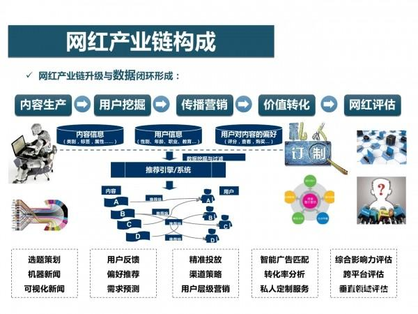
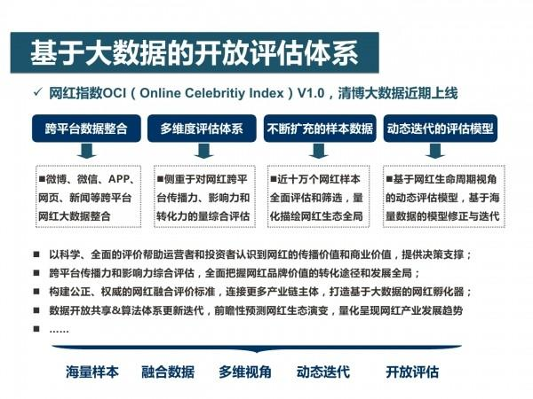
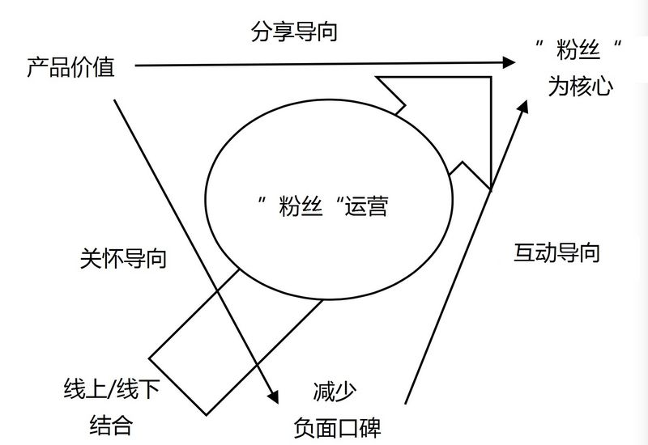

| 序号 | 修改时间   | 修改内容                         | 修改人 | 审稿人 |
| ---- | ---------- | -------------------------------- | ------ | ------ |
| 1    | 2016-7-15  | 创建                             | Keefe  |        |
| 2    | 2016-12-10 | 增加互联网行业的赢利模式章节。   | 同上   |        |
| 3    | 2017-11-25 | 增加灰色产业链章节               | 同上   |        |
| 4    | 2018-7-16  | 将营销章节迁移到《运营专题》     | 同上   |        |
| 5    | 2021-12-20 | 转化成MD格式。增加投资动态章节。 | 同上   |        |

---

# 		目录

[TOC]

---

# 1 新经济形式

## 1.1 网红经济

网红，即网络红人，原来是指因某个戒一系列事件及行为而在互联网上迅速受到关注而走红的人，目前泛指通过社交平台走红幵聚焦大量粉丝的红人。

随着技术不市场的升级，网红已经从现象逐渐转型成为一种经济产业。通过网络走红，通过网络线上实现变现成为一个鲜明特征。

随着技术的发展与推广，我们认为，视频、直播以及电商将成为未来网红经济的三大主要趋势。

### 1.1.1 网红史

2015年12月，“网红”关注度首次超越“明星”，成为全 网焦点和话题中心。2016年“网红”热度继续走高，网红传播和网红经济也被推到风口之上。媒体持续曝光&全民娱乐风暴助长“网红”传播热 度，5.3亿次微博讨论，近10万篇相关文章，2.81亿次阅读量，超400万篇新闻报道，上亿级别网页收录量。

 **网红产生背景
** 受众偏好 ：全民互娱时代，青春文化的兴起与内容消费观的转变，受众以一种更娱乐化的方式去寻求价值观认同感和情绪发泄渠道，激发围观效应。
 技术环境 ：社交平台的演化与变迁，重塑表达与传播方式，在短视频兴起的风口之下，网红经济入口扩张、门槛降低，通过短视频吸粉、社交网络沉淀关系、电商平台实现转化成为网红传播的一种常见闭环 。
 社会氛围 ：网红传播从“审丑”“审美”到去政治化、品牌化，去中心化和人格化特质凸显，是移动化、社交化背景下社会文化变迁的一种体现。

 **网红的变迁
** “网红”是指在微博、微信、社区贴吧等互联网平台上具有一定话题度和影响力的“名人”，其因在现实或网络生活中的某个事件或行为而被网民关注，并在跨平台 传播和全民娱乐过程中有意无意受到网络世界的追捧。网红既包括作家、企业家、官员等在现实社会具有一定影响力的人，也包括段子手、微商、美女等草根群体。 网红是网络媒介环境下，网红自身、网络推手、传播平台以及受众心理需求等利益共同体综合作用下的结果。

 网红1.0时代：1997~2000，草根成名。如网络写手痞子蔡、宁财神、安妮宝贝、今何在、慕容雪村等。
 网红2.0时代：2000~2010，全民创作。如木子美、叫兽易小星、郭美美、犀利哥、凤姐、芙蓉姐、奶茶等。
 网红3.0时代：2010~2015，品牌化传播。表现最突出的是网络大V如姚晨、薛蛮子、王思聪等。

网红4.0时代：2015~，个人IP。如罗振宇、Papi酱等。

**网红=美女?** **网红=颜值经济?**
 	部分人将网红狭义定义为高颜值且善于自我营销的网络美女，papi酱等创作型网红的崛起拓展了社会大众对网红的认知面，让网红的概念逐渐从“人”和“物” 延伸到“个性化品牌”层面，网红的内核引力也从“颜值”延伸到原创内容、信息价值、专业服务等更多层面，通过契合受众的审美观、价值观、娱乐观、消费观实 现品牌传播和转化。
 	网红的“去污名化”和内涵拓展既需要媒体传播和舆论领袖的引导和热点转移，也有赖于原创型、专业型网红的打造和涌现，随着网红的身份形象、传播模式、商业变现模式的转换和拓展，网红的内涵和外延都将呈现出全新特征。

 **网红VS自媒体**
 人格气质 VS 媒体属性：网红具有鲜明的个人风格，其核心吸引力在于人格气质，自媒体基于自身产品定位，核心竞争力在于内容和服务
 品牌传播 VS 信息传播 ：网红传播注重人格魅力体的传播和品牌效益的发挥。自媒体则通过内容生产和传播实现信息价值的增值
 围观效应 VS 专业性 ：网红基于粉丝流量形成，具备可被解构和娱乐的要素。自媒体给予自身专业性形成，在细分领域能聚集流量

### 1.1.2 网红产业链

图 网红产业链构成1：三个主要环节

图 网红产业链构成2：升级与数据闭环

### 1.1.3 大数据下的网红

图 3 基于大数据的开放评估体系

从年龄分布情况来看，21-25岁的年轻人最关注网红，占47.3%;其次是20岁以下人群，占比39.9%。可得出一个结论：在关注网红的人群中，25 岁以下的年轻人占据了近90%，90后、00后人群构成了关注网红的主力军。

关注网红及相关话题的人中，女性占比达72%，是男性的2.5倍左右。原因之 一可能在于82.5%的网红是美女，她们向大众传递的多是穿衣打扮方面的心得和经验，因此对同性的影响力较大。

## 1.2 颜值经济

这是一个看脸的时代。

颜值让人更轻易地获得好的工资收入、社会地位和婚恋关系。高颜值人群更易成功体现在政界、商界和娱乐界等社会各界。高颜值提升整体幸福感。

**高颜值者的高经济价值可靠吗？**

许多实证经济学研究成果表明，颜值高者的劳动效率和雇主对其的投入回报率、房贷车贷申请通过率、贷款条款优惠度等都显著高于颜值低者。雇主倾向于把较好的工作和收入给颜值高者，这不能完全说是出于歧视。高颜值者的高经济价值，其经济学理据是什么？

经济学家约翰·卡尔·斯库兹和卡米尔·古扁列韦斯在其研究论文《颜值和终生收入》中做出了解答。他们发现，颜值与高初中课外活动（学生会、社团、体育项目）参与度、自信度、大五人格特质等呈较强正相关性。

这表明颜值较高的人在学生时代有更多的机会参与社会组织活动，在宝贵的社会实践场景中不断加强自身的沟通能力、领导能力、纪律性、团队协调能力等日后被劳动力市场十分看重的人力资本素质。

**颜值经济火爆背后 心理作祟**

自拍在心理学范畴被称为“自我正性增强”，即“人们总会把自己想象得比实际更好”，这是人类很重要的特性，也是一种适应社会生存的能力。自拍还是一种自我强化，人们喜欢将自拍照片传到网络上与他人分享，是想得到别人的认同和赞同，以此来增强自信心。

除了自信，还有两种典型的心理因素。一种是释放“本我”。释放内心最原始的欲望，获得快乐。什么欲望呢？对自我容貌关注 与肯定的欲望。这些寻求“释放”的，大多数是孩童时被“压抑”所致。比如，从小到大就不太受关注。成年后便会以“自拍”的方式进行一种“反叛”，这种叛逆 的表现其实就是一种对“本我”的“释放”。

另一种是创造“自我”。有些人对自己现实中的容貌缺乏自信，而自拍又可以巧妙地将这些缺点避过去。这类人，往往被说成“自恋”。其实，她（他）“恋”的不是真实的自己，而是自拍照中那个被修得面目全非、可能连亲生父母都辨认不出来的“自己”，自己创造出来的“自我”。

## 1.3 粉丝经济

粉丝经济泛指架构在粉丝和被关注者关系之上的经营性创收行为，被关注者多为明星、偶像和行业名人等。粉丝经济最为典型的应用领域是**音乐**，在音乐产业中真正 贡献产值的是艺人的粉丝，它由粉丝所购买的CD、演唱会门票、彩铃下载和卡拉OK中点歌版税等收入构成，也因此有专业的机构在2011年将[ARPU](http://baike.baidu.com/view/168854.htm) (ARPU-AverageRevenuePerUser)的概念引入到粉丝经济中，即单位付费粉丝的月消费贡献值，有专家预测，随着互联网的发展，艺人影响力的排名将来很可能会由唱片的发行量转由ARPU代替。

粉丝经济的概念最早产生于六间房秀场，其草根歌手在实时演艺过程中积累了大量忠实粉丝，粉丝通常会通过购买鲜花等虚拟礼物来表达对主播的喜爱，在节日和歌手生日等特定时期礼物的消费尤为活跃，据统计秀场的ARPU值最高可达1,000元人民币。

ARPU(ARPU-AverageRevenuePerUser)即[每用户平均收入](http://baike.baidu.com/view/3872209.htm)。用于衡量电信运营商和互联网公司业务收入的指标。ARPU注重的是一个时间段内运营商从每个用户所得到的收入。很明显，高端的用户越多，ARPU越高。

粉丝向运营通常遵循下图的模式：

图 4 粉丝经济运营模式图

2014年中国最火的粉丝经济案例有哪些? Elon Musk的特斯拉、韩寒和郭敬明的电影、罗永浩的锤子手机、赫畅的煎饼、雕爷的牛腩、罗振宇的月饼、青龙老贼的自媒体、马佳佳的避孕套、李善友的公开课……

**如何成为最火的商业案例?**

1. **不做定位，只做自己。**他们不是在迎合消费者的需求，他们是在创造一种新的需求。他们没有在寻找差异化，他们本身就是一种差异化。当他们以一个独一无二的人格出现的时候，他们的产品就变得独一无二了。

**2、消费者买的不是实用性，而是自我表达**

**3、立场鲜明，拒绝中庸**

**4、大众化你就输了。**个人品牌天然就是反大众化的。

## 1.4 无聊经济

因“无聊”而产生的经济现象，被戏称为无聊经济。无聊经济可以是销售一篇失恋日记，甚至是一首小诗、一句话，标价不高，有的只需要一两元，即拍即卖，追随 者无数。还有人出租自己。无聊经济甚至会滋生出创意无穷的C2C电子商务模式。现代社会，由于科学技术进步，生产率提高，人的闲暇时间增多；同时，又因为 竞争激烈，压力增大都是催生无聊经济的因素。可以说，电脑游戏、网上聊天、虚拟社区、社交网站等等，某种程度上都是“无聊经济”的产物。

## 本章参考

1. 网红分析报告http://www.syjunshi.com/article?article_id=47&brd=1&article_category=1
2. 史上最全"网红"报告：一场全民虚拟与现实的狂欢http://digi.163.com/16/0402/14/BJLF1US300162OUT.html
3. 2016上半年网红现象专题报告 http://www.chinaz.com/news/2016/0713/550993.shtml
4. 中美网红对比报告 http://www.meihua.info/a/65679
5. 如何通过互联网建立粉丝经济 http://36kr.com/p/217457.html
6. 粉丝经济 http://baike.baidu.com/view/5699526.htm
7. 吴迪《颜值经济学》
8. 戴珒《看脸的社会就不理性？》
9. 颜值经济火爆的背后？ http://kangsitanding.baijia.baidu.com/article/60755

# 2  网络变现（赢利模式）

## 2.1 互联网行业的变现

表格 1 互联网行业的赢利模式列表

| 行业         | 行业发展史                                                   | 赢利模式                                                     |
| ------------ | ------------------------------------------------------------ | ------------------------------------------------------------ |
|  新闻门户 | 1995年，宽带/移动运营商提供付费新闻资讯。 998年始，新浪/搜狐/网易三大门户开始提供电脑端免费阅读，2000年左右陆续美国上市。 2005年始，3G门户网等开始提供移动端免费阅读。 | 新浪等免费阅读、展示广告赢利，目的通过流量变现。             |
| 搜索引擎     | 2000年，百度创建；同期还有中搜。                             | 早期搜索引擎通过给门户网站提供搜索服务赢利。 2002年，百度开创关键字购买广告平台，后拓展为广告联盟。 |
| 视频         | 2009年，6间房/优酷/土豆陆续上市。 2015年，直播纪年。     | 早期仍是传统的网站广告。 2009年后视频里插入广告。 2009年后版权意识加强，以乐视为代表开始正版影片付费。 |
| 文学         | 代表起点文学网。                                             | 付费阅读。                                                   |
| 电子商务     | 2000年，阿里巴巴、慧聪、全球贸易网等B2B公司创办。 2002年后，易购、淘宝等C2C公司成立。 2005年后，京东等B2C公司创办。 | B2B通过会员年费、线下恰谈会收入。 B2C通过佣金和网站广告收入。 		C2C目前仍不能实现赢利。 |
| 杀毒软件     | 360安全卫士横空出世，免费占领市场。                          | 免费杀毒赚流量，然后流量变现（通过软件库、展现广告）         |

备注：赢利核心途径有流量变现、版权付费等。互联网广告是流量变现的主要方式，广告包括展现广告和点击广告。

## 2.2 个人的变现

表格 2 网赚途径列表

| SN   | 途径         | 简介                                                         | 备注                       |
| ---- | ------------ | ------------------------------------------------------------ | -------------------------- |
|      | 调查         | 这种赚钱模式就是通过一些平台做调查问卷，通过你的问卷是否过关，给予一定的佣金， | 赚钱比较稳定，但是比较累   |
|      | 手打验证码   |                                                              | 累且廉价                   |
|      |  点击     | 通过点击别人的广告来获得收入，一般这种单价都非常低，但是可以通过拉下线加入的方式获得报酬，一个人点少，但是成百上千的人就不少了，每天一般10-20个广告，可以多做几个站点，做这种网赚的需要做好持久战的心理准备。 | 不建议做，见效慢，时间长   |
|      | 投票         | 通过任务主发布人的要求进行投票，从而获得佣金，不过佣金也较为低，一般适合新手来做。 | 适合新手                   |
|      | 冲浪         | 这个比较简单，注册好账号后输入一个URL挂机即可，曾经是一个非常不错的项目，但是随着现在加入者的增多，单价降低，已经没落了。 | 不推荐                     |
|      | ~~软件代理~~ | ~~通过代理别人的~~软件~~出售，从而获得不错的收益，所以选择到一款不错的软件是重点，而且需要有一定的营销技巧。~~ |                            |
|      | 淘宝网店     | 开网店，但是需要有货源才行，而且要有一定的优势，比如：产品价格低，产品垄断，产品样式新颖等等，在现在的淘宝市场，你如果没有些别人没有的优势，很难存活下来。 | 流量难获取                 |
|      | 游戏         | 通过玩游戏或者装备与金币出售给玩家获得收益，现在成立了不少工作室，有的帮别人练级，有的出售，甚至出现了代骂!!! | 游戏市场巨大，前景好       |
|      | 邮箱         | 通过接收邮件点击里面的广告或者根据要求注册获得佣金           |                            |
|      | 注册         | 引导用户注册某个地方的账号来获得佣金。包括APP试用。          |                            |
|      | 竞价         | 找到一款你认为不错的产品，购买搜索引擎搜索栏的广告位，例如顶端与右侧的。 | 高收入，高风险，低技术含量 |
|      | 做网站       | 通过网站放置联盟的广告，赚取广告费或者销售产品赚钱佣金.      |                            |
|      | 自媒体       |                                                              |                            |
|      | 直播         | 2015年开始大火的网赚途径。                                   |                            |

### 2.2.1 淘宝客

[淘宝客](http://baike.baidu.com/view/2133469.htm)，是一种按成交计费的推广模式，也指通过推广赚取收益的一类人，淘宝客只要从淘宝客推广专区获取商品代码，任何买家（包括您自己）经过您的推广（链接、个人网站，博客或者社区发的帖子）进入淘宝卖家店铺完成购买后，就可得到由卖家支付的佣金；简单说，淘宝客就是指帮助卖家推广商品并获取佣金的人

在淘宝客中，有[淘宝联盟](http://baike.baidu.com/view/1866463.htm)、[卖家](http://baike.baidu.com/view/1874981.htm)、[淘客](http://baike.baidu.com/view/628534.htm)以及买家四个角色。他们每个都是不可缺失的一环，如图所示。

（1）淘宝联盟：一个推广平台，帮助卖家推广产品；帮助淘客赚取利润，每笔推广的交易抽取相应的服务费用。

（2）卖家：佣金支出者，他们提供自己需要推广的商品到淘宝联盟，并设置每卖出一个产品愿意支付的佣金。

（3）[淘宝客](http://baike.baidu.com/view/2133469.htm)：佣金赚取者，他们在淘宝联盟中找到卖家发布的产品，并且推广出去，当有买家通过自己的推广链接成交后，那么就能够赚到卖家所提供的佣金（其中一部分需要作为淘宝联盟的服务费）。

**发展历程**

2009年1月12日起，国内[网络营销平台](http://baike.baidu.com/view/2213965.htm)“淘客推广平台”正式更名为淘宝客，意味着大淘宝战略实施后，原淘客推广平台与淘宝交易平台的进一步整合的完成！

2010年3月19日消息，基于淘宝客的“[淘宝联盟](http://baike.baidu.com/view/1866463.htm)”已悄然成型，淘宝网针对中小站长以及网络合作伙伴推出这一平台。所有用户都可以自由申请加入淘宝联盟，当通过注册申请后，即可成为一名“淘宝客”。

淘宝客的推广是一种按成交计费的推广模式，淘宝客只要从淘宝客推广专区获取商品代码，任何买家（包括您自己）经过您的推广（链接、个人网站，博客或者社区发的帖子）进入淘宝卖家店铺完成购买后，就可得到由卖家支付的佣金。

### 2.2.2 微商

[微商](http://baike.baidu.com/subview/690164/14543805.htm)，英文名称wechat Business。其作用是基于微信生态的社会化分销模式。它是企业或者个人基于社会化媒体开店的新型电商，从模式上来说主要分为两种：基于微信公众号的 微商称为B2C微商，基于朋友圈开店的称为C2C微商。微商和淘宝一样，有天猫平台(B2C微商)也有淘宝集市(C2C微商)。所不同的是微商基于微信 “连接一切”的能力，实现商品的社交分享、熟人推荐与朋友圈展示。从微商的流程来说，微商主要由基础完善的交易平台、 营销插件、分销体系以及个人端分享推广微客四个流程部分组成。现在已从一件代发逐渐发展成服务行业 自己存货自己发，有等级的区分，等级越高利润越大。微商是基于微信生态集移动与社交为一体的新型电商模式，主要分为两个环节：B2C环节、C2C环节。

### 2.2.3 自媒体变现

下面说自媒体怎么赚钱。

1、广告收入：首先自媒体不是一个媒体的话，那就没有公信力，于是就不能靠广告赚钱，这是必然的，至少不能主要靠广告，偶尔广告还是可以的。

2：公关宣传：然后就是软文了，当然很多文人有节操，是不写软文的，于是他们就开始写专访，是的，大家都在写专访，显得比软文高端大气上档次一点，尤其适合找不到媒体给专访的小公司，当然，润笔费还是少不了的。传播的时候，没准还要有些推广费用。

3电商:自 媒体不一定就是写狗屁文章的人，也可能是某一方面的专家，比如卖各种东西的，因为他们是专家，对这个事情感兴趣的人就会关注他们，然后这个时候他们推荐点 产品什么的，很多人都会买单。我文章开头写的赚大钱的，一般都是这样的人，他们是自媒体，意见领袖，能影响很多人，最重要的是，这些人会直接购买东西，然 他们的自媒体价值套现。

4咨询：这个钱一般说来非专业人士不好做，因为你在这个领域做得不错，同行认可你，然后找你咨询一些项目，是完全可以收费的。媒体人就别想了，还是专访吧。

5培训：自媒体做得好，自然就是传播什么的做得好，然后有想学习的，自然可以给用户粉丝或者企业做一些内训，效果一般是要好于社会上的那些讲师的，价格也便宜，一次5000到几万，一个月能有几次，收入也不错啊。

6跳槽：自媒体做得好，然后被挖走了，这事很常见。

7新闻客户端：目前搜狐新闻客户端的稿费最高，可以达到500-1000，以大熊老师的产量一个月30篇，也有三万的收入了，当然，这个没有那么悬，很多时候稿子也不能只 发独家，但是你专心在一个平台上做一个月写个十篇八篇，也是大几千一万的收入了，其实也还可以考虑的，之后如果搜狐客户端有新的广告什么分成计划之类的， 也许可以做一块额外的收入。

8过路费：因为你是自媒体，认识的人多，所以就帮人找人拼缝什么的，收个过路费，也完全是没有问题的。很多写不出文章的人，都去搞这种人脉、过桥、猎头、征婚之类的事情了。

9其他，大家可以发挥自己的想象了。自媒体最好只做推荐，不做推销，帮助别人成功，自己才会赚钱，自己憋着写稿子，版权还把的死死的，是没有未来的，你要给别人创造价值才行啊。

其实自媒体就是一个粉丝经济，里面充斥了情感营销，你就是一个意见领袖，很多意见领袖可以影响很多人，然后互相推荐一下，效果还是很不错的。

**这里面要注意两个大坑：**

第一个大坑就是你的目标用户不要是互联网这帮屌丝，这帮屌丝脾气大毛病多事多还特别抠门，写科技博客的是别想指望从这边屌丝身上赚钱的，没准他还想借喷你出名。至于什么讲座培训的针对这帮人估计也会赔光内裤，所以搞IT写作的，只能和公司合作。

第二，不要结盟。自媒体本来就是你的个人意见，你是一个意见领袖，一旦结盟，你就丧失了独立性，成了利益集团了，成了利益集团看似可以获得一些资源，最后会损失更多的独立人格的。

还要提醒一下自媒体，不要拒绝和媒体合作推广，好的内容一样需要好的渠道。

## 本章参考

1. [淘宝客](http://baike.baidu.com/view/2133469.htm)
2. [微商](http://baike.baidu.com/subview/690164/14543805.htm)
3. [自媒体赚钱手册](http://lusongsong.com/info/post/483.html) http://lusongsong.com/info/post/483.html

# 3  自媒体

自媒体(外文名：We Media)又称“公民媒体”或“个人媒体”，是指私人化、平民化、普泛化、自主化的传播者，以现代化、电子化的手段，向不特定的大多数或者特定的单个人传递规范性及非规范性信息的新媒体的总称。自媒体平台包括：博客、微博、微信、百度官方贴吧、论坛/BBS等网络社区。

美国新闻学会媒体中心于2003年7月发布了由谢因波曼与克里斯威理斯两位联合提出的“We Media（自媒体）”研究报告，里面对“We Media”下了一个十分严谨的定义：“We Media是普通大众经由数字科技强化、与全球知识体系相连之后，一种开始理解普通大众如何[提供](http://baike.baidu.com/view/834302.htm)与[分享](http://baike.baidu.com/subview/253726/8050071.htm)他们自身的事实、新闻的[途径](http://baike.baidu.com/view/1251889.htm)。”简言之，即公民用以发布自己亲眼所见、亲耳所闻事件的载体，如博客、微博、微信、论坛/BBS等网络社区。

自媒体平台包括但不限于个人微博、个人日志、个人主页等，其中最有代表性的托管平台是美国的[Facebook](http://baike.baidu.com/view/409608.htm)和[Twitter](http://baike.baidu.com/view/843376.htm)，中国的[QQ](http://baike.baidu.com/view/3702.htm)[空间](http://baike.baidu.com/view/3702.htm)、[新浪微博](http://baike.baidu.com/view/2762127.htm)、[腾讯微博](http://baike.baidu.com/view/3264698.htm)、微信[朋友圈](http://baike.baidu.com/view/891203.htm)、[微信公众平台](http://baike.baidu.com/view/9212662.htm)、[人人网](http://baike.baidu.com/view/2615985.htm)、[百度贴吧](http://baike.baidu.com/view/579.htm)等。

还有众多科技博客(主要指专注互联网和科技的新闻资讯网站)，有的脱胎于门户；有的是传统媒体人出来做的；有的脱胎于传统媒体，但是因为团队的局限，所以特色并不明确。

## 3.1 知识付费

2013年，知识付费开始当作一个产业。微信公众号‘逻辑思维’首先推出付费会员制。随后两年，微信、新浪微博开通了打赏功能。

2016年，被称为知识付费元年，国家知识产权局发布《关于严格专利保护的若干意见》。

## 3.2 自媒体内容生产

内容绝对是自媒体运营者的核心。自媒体将自己的信息、价值、理念传播出去，靠的是内容，而[文字](http://baike.baidu.com/view/32894.htm)、视频、[音频](http://baike.baidu.com/view/66105.htm)等介质均为载体，视频、音频介质上，自媒体在2014年已经取得了很大的突破，内容是根本。

内容生产我们讲两个词，一个词叫PGC，一个词叫UGC。PGC可以理解成专业生产内容，或者职业生产内容，或者机构生产内容。UGC就是草根、个体户， 好象不是团队作战。

以微信公众号为例，微信公众号内容的来源一般有几个方面：

**第一，通过多方信息的整理、加工（类似于信息搬运工）后，融合自己的观点、想法等，将外部的信息变成自己的内容；**

第二，通过采访、参会的形式，对外部信息的获取后，整理成自己的内容；

第三，广泛的阅读量以及自己通过实际操作经验沉淀下来的内容整理后形成自己风格的内容。

## 3.3 自媒体运营

**关于平台：**公众平台和自媒体人是共生关系，平台需要自媒体的好内容，自媒体需要平台将内容散播出去。

当然，所有的传播都是基于平台的规则内的，很多人都奇怪为什么会被无缘无故封号，在平台的规则内，进行有效的传播，是比较好的方式。

**关于读者：**有人叫读者、粉丝和用户，其实他们是你公众号所能影响到的读者，并逐渐转化为深度读者。

**关于互动：**和读者互动是一个技术活儿，也是一个脑力活，非常人所能胜任也，互动的好，一片欢声笑语，互动的不好，骂、喷、屌、踩样样都来。

## 3.4 自媒体平台

表格 3 自媒体平台

| 名称                 | 简介                                                         | 链接                                                  |
| -------------------- | ------------------------------------------------------------ | ----------------------------------------------------- |
| 微信公众平台         | 载体是微信手机客户端，海量用户，营销效果超好，它的公众平台是目前最热的。 | [https://mp.weixin.qq.com](https://mp.weixin.qq.com/) |
| 米聊订阅发布平台     | VIP账号订阅发布平台，目前米聊注册用户27000万，VIP账号采取邀请制。 | http://vip.miliao.com/                                |
| 搜狐新闻自媒体平台   | 据说搜狐新闻客户端安装量第一(但好像谁也没当回事)，它弄的自媒体平台也很给力，后台很简洁，发布也很方便，卢松松在该平台发布文章，几乎是秒过。流量的话还行，个别文章会有上千的阅读量。 | http://mp.k.sohu.com/server/openquicklogin.jsp        |
| 网易新闻媒体开放平台 | 你发布的文章会出现在网易新闻手机客户端                       | http://open.m.163.com/                                |
| 网易云阅读开放平台   | 强烈推荐这个平台，云阅读采取的是抓取网站RSS源，这样站长省去了更新内容的烦恼，如果你有网站直接RSS输出到云阅读了，目前这个平台是我博客发布内容最完整、最全的了。注册过程还是挺顺利，但没有任何推荐的情况下，流量也很少。 | http://open.yuedu.163.com/                            |
| 360自媒体平台        | 最近更新有点慢哦，可能是对自媒体不重视的原因，但从360来的流量入口很多，文章获得流量不菲。 | http://wemedia.so.com/                                |
| 百度百家自媒体平台   | 之前用[程苓峰的案例](http://lusongsong.com/blog/post/844.html)做个引子，告诉大家：你们来我百度，我会直接分钱给大家，百度联盟的广告全部分给自媒体人，申请貌似较难。申请方式Baijia@baidu.com | http://baijia.baidu.com/                              |
| 今日头条媒体平台     | 文章工审核，发布速度比较慢，但是数据特别亮眼，往往一些趣味性的文章可以达到60万的阅读量，上千的收藏量。 | http://mp.toutiao.com/                                |
| 微淘公众平台         | 早起进入微淘的都能得到官方推荐，现在有点点晚了，但很适合淘宝卖家、淘宝客注册使用。用淘宝ID登录后台，这个信息流的账号运营者将来自淘宝商家、媒体机构,或来自某个消费领域的意见领袖等。 | http://we.taobao.com/                                 |
| 新浪微博粉丝服务平台 | 新浪旗下公众账号，点击我的主页--管理即可找到该功能，仅限+V用户。我也注册了，信息都是以私信的形式发送。信息达到率较高。 | [http://weibo.com](http://weibo.com/lusongsong)       |
| 易信公众平台         | 这个，其实聚集听众还挺难，主要是营销人太多，真正用户较少。网易与中国电信推出的“易信”，除了具备微信的大多数功能之外，易信与微信最大的区别可通过易信给用户发送手机短信。 | https://plus.yixin.im/login                           |
| 来往公众帐号         |                                                              | https://pp.laiwang.com/                               |
| 飞信公众平台         | 牛逼之处在于它还能以短信的形式推送到手机上，这是优势，但感觉不太好。1中国移动推出的公众平台，认证非常麻烦，还要填表格、提交营业执照、加盖公章等。 | http://gz.feixin.10086.cn/                            |
| 腾讯媒体公众平台     | 它和微信公众平台可同步发布，主要面向腾讯新闻客户端推送，但是服务做的比较一般 | http://om.qq.com/                                     |
| 一点i媒体平台        | 新兴的自媒体平台，目前做的也比较好，点击率阅读量都还不错     | http://www.yidianzixun.com/mp                         |
| 凤凰新闻媒体开放平台 | 注册和审核都比较顺利，但是局限性较大，比如含有腾讯字眼的都无法发布。 | http://zmt.ifeng.com/                                 |

备注：这些自媒体平台多是网站的专栏。

## 3.5 知名自媒体

| 类别     |  自媒体                         | 简介                                                         | 运营现状                                                     |
| -------- | ----------------------------------- | ------------------------------------------------------------ | ------------------------------------------------------------ |
|  科技 | [虎嗅网](https://www.huxiu.com/)    | 创办于2012年5月，虎嗅网是一个聚合优质创新信息与人群的新媒体平台。 这个平台专注于贡献原创、深度、犀利优质的商业资讯、围绕创新创业的观点剖析与交流。 | 2015年12月，虎嗅正式挂牌[新三板](http://baike.baidu.com/view/1358511.htm)。虎嗅团队目前为70人（截止2016年4月），内部组织架构主分：编辑部、运营部、市场部、产品技术部。 平台已汇聚超过2000名优质的商业编辑、作者及第三方媒体，连接创新创业人群，旨在为商业用户提供获取与交流更有效率的体验。 |
|          | [IT桔子](https://www.itjuzi.com/)   | IT互联网公司产品数据库及商业信息服务。 IT桔子致力于通过信息和数据的生产、聚合、挖掘、加工、处理，帮助目标用户和客户节约时间和金钱、提高效率，以辅助其各类商业行为。 | 截至2015年12月31日，[IT](http://baike.baidu.com/view/10629430.htm)[桔子](http://baike.baidu.com/view/10629430.htm)数据库共追踪了22033家国内创业公司，其中2971家成立于2015年。 |
|          | [36氪](http://36kr.com/)            | 2010.12月正式上线2011年7月获得风投创办公司，是国内知名互联网创业生态服务平台。 | 截至2015年12月底，36氪活跃着2000余位机构投资人，共聚集了超过5万家创业公司，其中共有6700余家企业挂牌融资。 |
|          | 酷勤网                              | 创办于2006年，由IT导航网转型。                               |                                                              |
| 新闻     | [今日头条](http://www.toutiao.com/) | 张一鸣于2012年3月创建。                                      | 截至2016年10月底，今日头条激活用户数已经超过6亿，月活跃用户数超过1.4亿，日活跃用户数超过6600万，单用户日均使用时长超过76分钟，日均启动次数约9次。已有超过39万个个人、组织开设头条号。 2017年2月2日，今日头条宣布全资收购美国短视频应用Flipagram。 |

## 本章参考

1. 17个自媒体平台吐血推荐 http://lusongsong.com/reed/992.html
2. 杨邱自媒体 [http://www.yangqiu.cn](http://www.yangqiu.cn/)

# 4 灰色产业链

灰色产业链指游离于法律边缘，未被正式认可的行业。有些可能会触犯相关法律。

灰色产业链有自身产生的需求因素，可分为以下情形：

- 法律明文禁止，但需求旺盛，从业者危险：如黄、赌、毒。
- 法律有相关规定，但可执行性差：
- 法律未规定，但不符合一般职业道德：如电商刷单
- 新兴行业，没有可参考的标准：如比特币挖矿，人工打码平台

## 4.1 广告营销：群发广告、邮件

## 4.2 电商刷单

## 4.3 文章视频刷量

## 4.4 游戏私服和外挂

## 本章参考

# 投资动态

## 风险投资与天使投资

[风险投资](http://baike.baidu.com/view/4156.htm)（venture capital）简称是VC在我国是一个约定俗成的具有特定内涵的概念，其实把它翻译成创业投资更为妥当。广义的风险投资泛指一切具有高风险、高潜在收益的投资；狭义的风险投资是指以高新技术为基础，生产与经营技术密集型产品的投资。根据美国全美风险投资协会的定义，风险投资是由职业金融家投入到新兴的、迅速发展的、具有巨大竞争潜力的企业中一种[权益资本](http://baike.baidu.com/view/634838.htm)。

**天使投资**（Angel Investment），是[权益资本](http://baike.baidu.com/view/634838.htm)投资的一种形式，是指富有的个人出资协助具有专门技术或独特概念的原创项目或小型初创企业，进行一次性的前期投资。 它是风险投资的一种形式，在根据[天使投资人](http://baike.baidu.com/view/309919.htm)的投资数量以及对被投资企业可能提供的综合资源进行投资。

## 投资机构

表格  专业投资机构列表

| 投资机构名称      | 简介                                                         | 投资代表产品 |
| ----------------- | ------------------------------------------------------------ | ------------ |
| 创新工场          | 创新工场成立于2009年9月，过去3年累积投资50个项目，其中种子轮投资48个项目、天使轮投资了27个项目；2个项目被兼并，4个项目失败；有18个项目获得A轮投资，1个项目获得B轮投资。 |              |
| 红杉资本          | 真格基金成立于2006年，过去6年累计投资超过100个项目，17Startup可跟踪的近3年投资的53个项目中，有1个上市，6个获得A轮投资，3个获得B轮投资，3个被收购，7个关闭失败。 |              |
| IDG资本           | 天使湾成立于2011年，主要做孵化计划+早期投资，过去2年累积投资超过50个项目，从17Startup可跟踪的53个公司/产品来看，有2个获得A轮投资，有9个关闭失败。2011年11月对外公开的第1季15个项目中，7个关闭，比例接近一半。 |              |
| 天使湾            | Preangel成立于2011年，专注于早期投资，过去2年累积投资超过70个，从17Startup可跟踪的65个公司/产品来看，有5个获得A轮投资，1个获得B轮投资，有7个关闭失败。 |              |
| PreAngel/荷多基金 |                                                              |              |
| 金沙江创投        |                                                              |              |
| 真格基金          |                                                              |              |
| 凯鹏华盈          |                                                              |              |
| DCM               |                                                              |              |
| 经纬中国          |                                                              |              |

**《2019胡润全球独角兽活跃投资机构百强榜》**

**Hurun World’s Best Unicorn Investors 2019**  ——寻找全球真正的点金圣手

|      | **投资机构**                                       | **独角兽数量** |
| ---- | -------------------------------------------------- | -------------- |
| 1    | Sequoia（红杉资本）                                | 92             |
| 2    | Tencent（腾讯）                                    | 46             |
| 3    | SoftBank（软银）                                   | 42             |
| 4    | Tiger 		Fund（老虎基金）                     | 36             |
| 5    | IDG                                                | 31             |
| 6    | Goldman 		Sachs（高盛）                      | 24             |
| 7    | Alibaba（阿里巴巴）                                | 22             |
| 8    | Andreessen 		Horowitz（安德森•霍洛维茨基金） | 20             |
| 8    | DST                                                | 20             |
| 10   | GGV（纪源资本）                                    | 19             |
| 10   | Qiming（启明创投）                                 | 19             |
| 12   | Accel                                              | 18             |
| 13   | Index Ventures                                     | 17             |
| 13   | Warburg 		Pincus（华平投资）                 | 17             |
| 15   | Matrix 		Partners（经纬创投）                | 16             |
| 15   | New 		Enterprise Associates（恩颐投资）      | 16             |
| 15   | Hillhouse 		Capital（高瓴资本）              | 16             |
| 18   | Insight Partners                                   | 14             |
| 18   | IVP                                                | 14             |
| 18   | Shunwei（顺为资本）                                | 14             |
| 18   | Y Combinator                                       | 14             |
| 18   | ZhenFund（真格基金）                               | 14             |
| 23   | Fidelity（富达）                                   | 13             |
| 23   | General 		Atlantic（泛大西洋投资）           | 13             |
| 23   | ICONIQ Capital                                     | 13             |
| 23   | Kleiner 		Perkins（凯鹏华盈）                | 13             |
| 23   | Temasek（淡马锡）                                  | 13             |
| 23   | Morningside（晨兴资本）                            | 13             |
| 29   | Founders Fund                                      | 11             |
| 29   | KKR                                                | 11             |
| 29   | T. Rowe Price                                      | 11             |
| 29   | Wellington 		Management（威灵顿）            | 11             |
| 33   | Baillie Gifford                                    | 10             |
| 33   | GIC（新加坡政府投资公司）                          | 10             |
| 33   | Lightspeed（光速创投）                             | 10             |
| 33   | SIG                                                | 10             |
| 37   | Bessemer 		Venture Partners（柏尚投资）      | 9              |
| 37   | DFJ                                                | 9              |
| 37   | General Catalyst                                   | 9              |
| 37   | Khosla 		Ventures（科斯拉风险投资公司）      | 9              |
| 37   | Thrive 		Capital（兴盛资本）                 | 9              |
| 37   | TPG                                                | 9              |
| 43   | Ant 		Financial（蚂蚁金服）                  | 8              |
| 43   | Benchmark                                          | 8              |
| 43   | Spark 		Capital（星火资本）                  | 8              |
| 46   | Battery Ventures                                   | 7              |
| 46   | Capital G                                          | 7              |
| 46   | CDH（鼎晖）                                        | 7              |
| 46   | CICC（中金公司）                                   | 7              |
| 46   | DCM                                                | 7              |
| 46   | Greenoaks 		Capital（绿橡资本）              | 7              |
| 46   | Greylock Partners                                  | 7              |
| 46   | GV                                                 | 7              |
| 46   | JP 		Morgan（摩根大通）                      | 7              |

## 行业并购案例

TMT行业  详见 《[TMT行业指南.md](./TMT行业指南.md)》

## 本章参考

1. ​	十大最具影响力IT收购 http://www.pc6.com/infoview/Article_48736.html
2. ​	李开复：人口红利过去后应该看到这五个趋势 http://www.askci.com/news/hlw/20161003/17532867055_6.shtml
3. ​	2016年知名企业阵亡最全名单 http://mt.sohu.com/20170118/n478988581.shtml
4. ​	深度丨2016年，我们调研了50家创业公司的To B产品使用情况后 http://it.sohu.com/20170110/n478284494.shtml
5. ​	3年赚750亿人民币，马化腾是这样从陈天桥手上接盘阅文集团的http://tech.ifeng.com/a/20171112/44756891_0.shtml
6. ​	《关于新增中国服务外包示范城市的通知》 国务院 2016年
7. ​	回顾丨至今有人不理解EMC为什么被戴尔收购，读完这篇文章就明白啦 [www.sohu.com/a/193339569_163524](http://www.sohu.com/a/193339569_163524)

# 附录

## 参考网站

**新媒体**

* [虎嗅网](https://www.huxiu.com/)
* [36氪](http://36kr.com/)
* [IT桔子](https://www.itjuzi.com/)

## 参考资料

* 阳志平个人博客  [http://www.yangzhiping.com](http://www.yangzhiping.com/)
* 杨邱自媒体 [http://www.yangqiu.cn](http://www.yangqiu.cn/)

