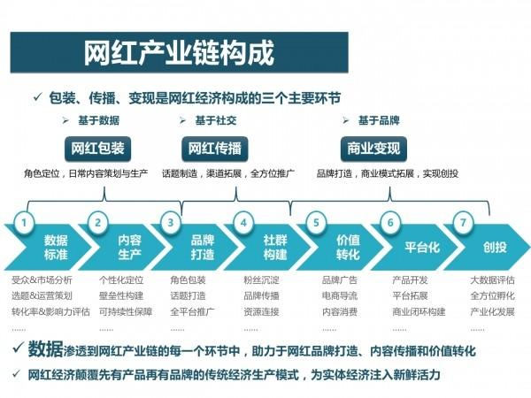

| 序号  | 修改时间       | 修改内容              | 修改人   | 审稿人 |
| --- | ---------- | ----------------- | ----- | --- |
| 1   | 2016-7-15  | 创建                | Keefe |     |
| 2   | 2016-12-10 | 增加互联网行业的赢利模式章节。   | 同上    |     |
| 3   | 2017-11-25 | 增加灰色产业链章节         | 同上    |     |
| 4   | 2018-7-16  | 将营销章节迁移到《运营专题》    | 同上    |     |
| 5   | 2021-12-20 | 转化成MD格式。增加投资动态章节。 | 同上    |     |

   

---

# 目录

[TOC]

 

---

# 1 新经济形式

## 1.1 网红经济

网红，即网络红人，原来是指因某个戒一系列事件及行为而在互联网上迅速受到关注而走红的人，目前泛指通过社交平台走红幵聚焦大量粉丝的红人。

随着技术不市场的升级，网红已经从现象逐渐转型成为一种经济产业。通过网络走红，通过网络线上实现变现成为一个鲜明特征。

随着技术的发展与推广，我们认为，视频、直播以及电商将成为未来网红经济的三大主要趋势。

### 1.1.1 网红史

2015年12月，“网红”关注度首次超越“明星”，成为全 网焦点和话题中心。2016年“网红”热度继续走高，网红传播和网红经济也被推到风口之上。媒体持续曝光&全民娱乐风暴助长“网红”传播热 度，5.3亿次微博讨论，近10万篇相关文章，2.81亿次阅读量，超400万篇新闻报道，上亿级别网页收录量。

 **网红产生背景
** 受众偏好 ：全民互娱时代，青春文化的兴起与内容消费观的转变，受众以一种更娱乐化的方式去寻求价值观认同感和情绪发泄渠道，激发围观效应。
 技术环境 ：社交平台的演化与变迁，重塑表达与传播方式，在短视频兴起的风口之下，网红经济入口扩张、门槛降低，通过短视频吸粉、社交网络沉淀关系、电商平台实现转化成为网红传播的一种常见闭环 。
 社会氛围 ：网红传播从“审丑”“审美”到去政治化、品牌化，去中心化和人格化特质凸显，是移动化、社交化背景下社会文化变迁的一种体现。

 **网红的变迁
** “网红”是指在微博、微信、社区贴吧等互联网平台上具有一定话题度和影响力的“名人”，其因在现实或网络生活中的某个事件或行为而被网民关注，并在跨平台 传播和全民娱乐过程中有意无意受到网络世界的追捧。网红既包括作家、企业家、官员等在现实社会具有一定影响力的人，也包括段子手、微商、美女等草根群体。 网红是网络媒介环境下，网红自身、网络推手、传播平台以及受众心理需求等利益共同体综合作用下的结果。

 网红1.0时代：1997~2000，草根成名。如网络写手痞子蔡、宁财神、安妮宝贝、今何在、慕容雪村等。
 网红2.0时代：2000~2010，全民创作。如木子美、叫兽易小星、郭美美、犀利哥、凤姐、芙蓉姐、奶茶等。
 网红2.0时代：2010~2015，品牌化传播。表现最突出的是网络大V如姚晨、薛蛮子、王思聪等。

网红4.0时代：2015~，个人IP。如罗振宇、Papi酱等。

**网红=美女?** **网红=颜值经济?**
     部分人将网红狭义定义为高颜值且善于自我营销的网络美女，papi酱等创作型网红的崛起拓展了社会大众对网红的认知面，让网红的概念逐渐从“人”和“物” 延伸到“个性化品牌”层面，网红的内核引力也从“颜值”延伸到原创内容、信息价值、专业服务等更多层面，通过契合受众的审美观、价值观、娱乐观、消费观实 现品牌传播和转化。
     网红的“去污名化”和内涵拓展既需要媒体传播和舆论领袖的引导和热点转移，也有赖于原创型、专业型网红的打造和涌现，随着网红的身份形象、传播模式、商业变现模式的转换和拓展，网红的内涵和外延都将呈现出全新特征。

 **网红VS自媒体**
 人格气质 VS 媒体属性：网红具有鲜明的个人风格，其核心吸引力在于人格气质，自媒体基于自身产品定位，核心竞争力在于内容和服务
 品牌传播 VS 信息传播 ：网红传播注重人格魅力体的传播和品牌效益的发挥。自媒体则通过内容生产和传播实现信息价值的增值
 围观效应 VS 专业性 ：网红基于粉丝流量形成，具备可被解构和娱乐的要素。自媒体给予自身专业性形成，在细分领域能聚集流量

### 1.1.2 网红产业链

图 网红产业链构成1：三个主要环节

图 网红产业链构成2：升级与数据闭环

### 1.1.3 大数据下的网红

图 3 基于大数据的开放评估体系

从年龄分布情况来看，21-25岁的年轻人最关注网红，占47.3%;其次是20岁以下人群，占比39.9%。可得出一个结论：在关注网红的人群中，25 岁以下的年轻人占据了近90%，90后、00后人群构成了关注网红的主力军。

关注网红及相关话题的人中，女性占比达72%，是男性的2.5倍左右。原因之 一可能在于82.5%的网红是美女，她们向大众传递的多是穿衣打扮方面的心得和经验，因此对同性的影响力较大。

## 1.2 颜值经济

这是一个看脸的时代。

颜值让人更轻易地获得好的工资收入、社会地位和婚恋关系。高颜值人群更易成功体现在政界、商界和娱乐界等社会各界。高颜值提升整体幸福感。

**高颜值者的高经济价值可靠吗？**

许多实证经济学研究成果表明，颜值高者的劳动效率和雇主对其的投入回报率、房贷车贷申请通过率、贷款条款优惠度等都显著高于颜值低者。雇主倾向于把较好的工作和收入给颜值高者，这不能完全说是出于歧视。高颜值者的高经济价值，其经济学理据是什么？

经济学家约翰·卡尔·斯库兹和卡米尔·古扁列韦斯在其研究论文《颜值和终生收入》中做出了解答。他们发现，颜值与高初中课外活动（学生会、社团、体育项目）参与度、自信度、大五人格特质等呈较强正相关性。

这表明颜值较高的人在学生时代有更多的机会参与社会组织活动，在宝贵的社会实践场景中不断加强自身的沟通能力、领导能力、纪律性、团队协调能力等日后被劳动力市场十分看重的人力资本素质。

**颜值经济火爆背后 心理作祟**

自拍在心理学范畴被称为“自我正性增强”，即“人们总会把自己想象得比实际更好”，这是人类很重要的特性，也是一种适应社会生存的能力。自拍还是一种自我强化，人们喜欢将自拍照片传到网络上与他人分享，是想得到别人的认同和赞同，以此来增强自信心。

除了自信，还有两种典型的心理因素。一种是释放“本我”。释放内心最原始的欲望，获得快乐。什么欲望呢？对自我容貌关注 与肯定的欲望。这些寻求“释放”的，大多数是孩童时被“压抑”所致。比如，从小到大就不太受关注。成年后便会以“自拍”的方式进行一种“反叛”，这种叛逆 的表现其实就是一种对“本我”的“释放”。

另一种是创造“自我”。有些人对自己现实中的容貌缺乏自信，而自拍又可以巧妙地将这些缺点避过去。这类人，往往被说成“自恋”。其实，她（他）“恋”的不是真实的自己，而是自拍照中那个被修得面目全非、可能连亲生父母都辨认不出来的“自己”，自己创造出来的“自我”。

## 1.3 粉丝经济

粉丝经济泛指架构在粉丝和被关注者关系之上的经营性创收行为，被关注者多为明星、偶像和行业名人等。粉丝经济最为典型的应用领域是**音乐**，在音乐产业中真正 贡献产值的是艺人的粉丝，它由粉丝所购买的CD、演唱会门票、彩铃下载和卡拉OK中点歌版税等收入构成，也因此有专业的机构在2011年将[ARPU](http://baike.baidu.com/view/168854.htm) (ARPU-AverageRevenuePerUser)的概念引入到粉丝经济中，即单位付费粉丝的月消费贡献值，有专家预测，随着互联网的发展，艺人影响力的排名将来很可能会由唱片的发行量转由ARPU代替。

粉丝经济的概念最早产生于六间房秀场，其草根歌手在实时演艺过程中积累了大量忠实粉丝，粉丝通常会通过购买鲜花等虚拟礼物来表达对主播的喜爱，在节日和歌手生日等特定时期礼物的消费尤为活跃，据统计秀场的ARPU值最高可达1,000元人民币。

ARPU(ARPU-AverageRevenuePerUser)即[每用户平均收入](http://baike.baidu.com/view/3872209.htm)。用于衡量电信运营商和互联网公司业务收入的指标。ARPU注重的是一个时间段内运营商从每个用户所得到的收入。很明显，高端的用户越多，ARPU越高。

粉丝向运营通常遵循下图的模式：

图 4 粉丝经济运营模式图

2014年中国最火的粉丝经济案例有哪些? Elon Musk的特斯拉、韩寒和郭敬明的电影、罗永浩的锤子手机、赫畅的煎饼、雕爷的牛腩、罗振宇的月饼、青龙老贼的自媒体、马佳佳的避孕套、李善友的公开课……

**如何成为最火的商业案例?**

1、**不做定位，只做自己。**他们不是在迎合消费者的需求，他们是在创造一种新的需求。他们没有在寻找差异化，他们本身就是一种差异化。当他们以一个独一无二的人格出现的时候，他们的产品就变得独一无二了。

2、**消费者买的不是实用性，而是自我表达**

3、**立场鲜明，拒绝中庸**

4、**大众化你就输了。**个人品牌天然就是反大众化的。

## 1.4 无聊经济

因“无聊”而产生的经济现象，被戏称为无聊经济。无聊经济可以是销售一篇失恋日记，甚至是一首小诗、一句话，标价不高，有的只需要一两元，即拍即卖，追随 者无数。还有人出租自己。无聊经济甚至会滋生出创意无穷的C2C电子商务模式。现代社会，由于科学技术进步，生产率提高，人的闲暇时间增多；同时，又因为 竞争激烈，压力增大都是催生无聊经济的因素。可以说，电脑游戏、网上聊天、虚拟社区、社交网站等等，某种程度上都是“无聊经济”的产物。

 

## 本章参考

1. 网红分析报告http://www.syjunshi.com/article?article_id=47&brd=1&article_category=1
2. 史上最全"网红"报告：一场全民虚拟与现实的狂欢http://digi.163.com/16/0402/14/BJLF1US300162OUT.html
3. 2016上半年网红现象专题报告 http://www.chinaz.com/news/2016/0713/550993.shtml
4. 中美网红对比报告 http://www.meihua.info/a/65679
5. 如何通过互联网建立粉丝经济 http://36kr.com/p/217457.html
6. 粉丝经济 http://baike.baidu.com/view/5699526.htm
7. 吴迪《颜值经济学》
8. 戴珒《看脸的社会就不理性？》
9. 颜值经济火爆的背后？ http://kangsitanding.baijia.baidu.com/article/60755

  

# 2 自媒体

自媒体(外文名：We Media)又称“公民媒体”或“个人媒体”，是指私人化、平民化、普泛化、自主化的传播者，以现代化、电子化的手段，向不特定的大多数或者特定的单个人传递规范性及非规范性信息的新媒体的总称。自媒体平台包括：博客、微博、微信、百度官方贴吧、论坛/BBS等网络社区。

美国新闻学会媒体中心于2003年7月发布了由谢因波曼与克里斯威理斯两位联合提出的“We Media（自媒体）”研究报告，里面对“We Media”下了一个十分严谨的定义：“We Media是普通大众经由数字科技强化、与全球知识体系相连之后，一种开始理解普通大众如何提供与分享他们自身的事实、新闻的途径。”简言之，即公民用以发布自己亲眼所见、亲耳所闻事件的载体，如博客、微博、微信、论坛/BBS等网络社区。

自媒体平台包括但不限于个人微博、个人日志、个人主页等，其中最有代表性的托管平台是美国的Facebook和Twitter，中国的QQ空间、新浪微博、腾讯微博、微信朋友圈、微信公众平台、人人网、百度贴吧等。

还有众多科技博客(主要指专注互联网和科技的新闻资讯网站)，有的脱胎于门户；有的是传统媒体人出来做的；有的脱胎于传统媒体，但是因为团队的局限，所以特色并不明确。

## 2.1 知识付费

2013年，知识付费开始当作一个产业。微信公众号‘逻辑思维’首先推出付费会员制。随后两年，微信、新浪微博开通了打赏功能。

2016年，被称为知识付费元年，国家知识产权局发布《关于严格专利保护的若干意见》。

## 2.2 自媒体内容生产

内容绝对是自媒体运营者的核心。自媒体将自己的信息、价值、理念传播出去，靠的是内容，而文字、视频、音频等介质均为载体，视频、音频介质上，自媒体在2014年已经取得了很大的突破，内容是根本。

内容生产我们讲两个词，一个词叫PGC，一个词叫UGC。PGC可以理解成专业生产内容，或者职业生产内容，或者机构生产内容。UGC就是草根、个体户， 好象不是团队作战。

以微信公众号为例，微信公众号内容的来源一般有几个方面：

第一，通过多方信息的整理、加工（类似于信息搬运工）后，融合自己的观点、想法等，将外部的信息变成自己的内容；

第二，通过采访、参会的形式，对外部信息的获取后，整理成自己的内容；

第三，广泛的阅读量以及自己通过实际操作经验沉淀下来的内容整理后形成自己风格的内容。

## 2.3 自媒体运营

**关于平台：**公众平台和自媒体人是共生关系，平台需要自媒体的好内容，自媒体需要平台将内容散播出去。

当然，所有的传播都是基于平台的规则内的，很多人都奇怪为什么会被无缘无故封号，在平台的规则内，进行有效的传播，是比较好的方式。

**关于读者：**有人叫读者、粉丝和用户，其实他们是你公众号所能影响到的读者，并逐渐转化为深度读者。

**关于互动：**和读者互动是一个技术活儿，也是一个脑力活，非常人所能胜任也，互动的好，一片欢声笑语，互动的不好，骂、喷、屌、踩样样都来。

## 2.4 自媒体平台

表格 3 自媒体平台

| 名称         | 简介                                                                                                                          | 链接                                                    |
| ---------- | --------------------------------------------------------------------------------------------------------------------------- | ----------------------------------------------------- |
| 微信公众平台     | 载体是微信手机客户端，海量用户，营销效果超好，它的公众平台是目前最热的。                                                                                        | [https://mp.weixin.qq.com](https://mp.weixin.qq.com/) |
| 米聊订阅发布平台   | VIP账号订阅发布平台，目前米聊注册用户27000万，VIP账号采取邀请制。                                                                                      | http://vip.miliao.com/                                |
| 搜狐新闻自媒体平台  | 据说搜狐新闻客户端安装量第一(但好像谁也没当回事)，它弄的自媒体平台也很给力，后台很简洁，发布也很方便，卢松松在该平台发布文章，几乎是秒过。流量的话还行，个别文章会有上千的阅读量。                                  | http://mp.k.sohu.com/server/openquicklogin.jsp        |
| 网易新闻媒体开放平台 | 你发布的文章会出现在网易新闻手机客户端                                                                                                         | http://open.m.163.com/                                |
| 网易云阅读开放平台  | 强烈推荐这个平台，云阅读采取的是抓取网站RSS源，这样站长省去了更新内容的烦恼，如果你有网站直接RSS输出到云阅读了，目前这个平台是我博客发布内容最完整、最全的了。注册过程还是挺顺利，但没有任何推荐的情况下，流量也很少。              | http://open.yuedu.163.com/                            |
| 360自媒体平台   | 最近更新有点慢哦，可能是对自媒体不重视的原因，但从360来的流量入口很多，文章获得流量不菲。                                                                              | http://wemedia.so.com/                                |
| 百度百家自媒体平台  | 之前用[程苓峰的案例](http://lusongsong.com/blog/post/844.html)做个引子，告诉大家：你们来我百度，我会直接分钱给大家，百度联盟的广告全部分给自媒体人，申请貌似较难。申请方式Baijia@baidu.com | http://baijia.baidu.com/                              |
| 今日头条媒体平台   | 文章工审核，发布速度比较慢，但是数据特别亮眼，往往一些趣味性的文章可以达到60万的阅读量，上千的收藏量。                                                                        | http://mp.toutiao.com/                                |
| 微淘公众平台     | 早起进入微淘的都能得到官方推荐，现在有点点晚了，但很适合淘宝卖家、淘宝客注册使用。用淘宝ID登录后台，这个信息流的账号运营者将来自淘宝商家、媒体机构,或来自某个消费领域的意见领袖等。                                 | http://we.taobao.com/                                 |
| 新浪微博粉丝服务平台 | 新浪旗下公众账号，点击我的主页--管理即可找到该功能，仅限+V用户。我也注册了，信息都是以私信的形式发送。信息达到率较高。                                                               | [http://weibo.com](http://weibo.com/lusongsong)       |
| 易信公众平台     | 这个，其实聚集听众还挺难，主要是营销人太多，真正用户较少。网易与中国电信推出的“易信”，除了具备微信的大多数功能之外，易信与微信最大的区别可通过易信给用户发送手机短信。                                        | https://plus.yixin.im/login                           |
| 来往公众帐号     |                                                                                                                             | https://pp.laiwang.com/                               |
| 飞信公众平台     | 牛逼之处在于它还能以短信的形式推送到手机上，这是优势，但感觉不太好。1中国移动推出的公众平台，认证非常麻烦，还要填表格、提交营业执照、加盖公章等。                                                   | http://gz.feixin.10086.cn/                            |
| 腾讯媒体公众平台   | 它和微信公众平台可同步发布，主要面向腾讯新闻客户端推送，但是服务做的比较一般                                                                                      | http://om.qq.com/                                     |
| 一点i媒体平台    | 新兴的自媒体平台，目前做的也比较好，点击率阅读量都还不错                                                                                                | http://www.yidianzixun.com/mp                         |
| 凤凰新闻媒体开放平台 | 注册和审核都比较顺利，但是局限性较大，比如含有腾讯字眼的都无法发布。                                                                                          | http://zmt.ifeng.com/                                 |

备注：这些自媒体平台多是网站的专栏。

## 2.5 知名自媒体

| 类别     | 自媒体                                | 简介                                                                                       | 运营现状                                                                                                                                                                             |
| ------ | ---------------------------------- | ---------------------------------------------------------------------------------------- | -------------------------------------------------------------------------------------------------------------------------------------------------------------------------------- |
|  科技 |  [虎嗅网](https://www.huxiu.com/) | 创办于2012年5月，虎嗅网是一个聚合优质创新信息与人群的新媒体平台。 这个平台专注于贡献原创、深度、犀利优质的商业资讯、围绕创新创业的观点剖析与交流。         | 2015年12月，虎嗅正式挂牌[新三板](http://baike.baidu.com/view/1358511.htm)。虎嗅团队目前为70人（截止2016年4月），内部组织架构主分：编辑部、运营部、市场部、产品技术部。 平台已汇聚超过2000名优质的商业编辑、作者及第三方媒体，连接创新创业人群，旨在为商业用户提供获取与交流更有效率的体验。 |
|        | [IT桔子](https://www.itjuzi.com/)    | IT互联网公司产品数据库及商业信息服务。 IT桔子致力于通过信息和数据的生产、聚合、挖掘、加工、处理，帮助目标用户和客户节约时间和金钱、提高效率，以辅助其各类商业行为。 | 截至2015年12月31日，[IT](http://baike.baidu.com/view/10629430.htm)[桔子](http://baike.baidu.com/view/10629430.htm)数据库共追踪了22033家国内创业公司，其中2971家成立于2015年。                                   |
|        | [36氪](http://36kr.com/)            | 2010.12月正式上线2011年7月获得风投创办公司，是国内知名互联网创业生态服务平台。                                            | 截至2015年12月底，36氪活跃着2000余位机构投资人，共聚集了超过5万家创业公司，其中共有6700余家企业挂牌融资。                                                                                                                    |
|        | 酷勤网                                | 创办于2006年，由IT导航网转型。                                                                       |                                                                                                                                                                                  |
| 新闻     | [今日头条](http://www.toutiao.com/)    | 张一鸣于2012年3月创建。                                                                           | 截至2016年10月底，今日头条激活用户数已经超过6亿，月活跃用户数超过1.4亿，日活跃用户数超过6600万，单用户日均使用时长超过76分钟，日均启动次数约9次。已有超过39万个个人、组织开设头条号。 2017年2月2日，今日头条宣布全资收购美国短视频应用Flipagram。                                   |

 

## 本章参考

1. 17个自媒体平台吐血推荐 http://lusongsong.com/reed/992.html
2. 杨邱自媒体 http://www.yangqiu.cn

  

# 附录

## 参考网站

**新媒体**

* [虎嗅网](https://www.huxiu.com/)
* [36氪](http://36kr.com/)
* [IT桔子](https://www.itjuzi.com/)

## 参考资料

* 阳志平个人博客  [http://www.yangzhiping.com](http://www.yangzhiping.com/)
* 杨邱自媒体 [http://www.yangqiu.cn](http://www.yangqiu.cn/)
