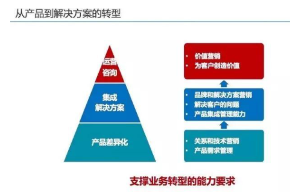
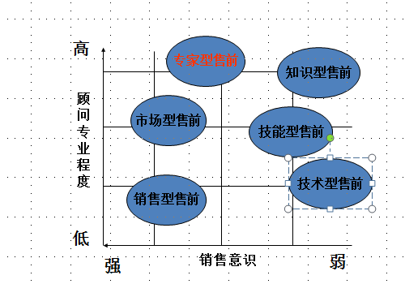

| 序号  | 修改时间      | 修改内容 | 修改人   | 审稿人 |
| --- | --------- | ---- | ----- | --- |
| 1   | 2021-4-12 | 创建   | Keefe |     |
|     |           |      |       |     |

[TOC]

 

---

# 1 简述

概念定义

* 产品：有形或无形的有价值的输出。能够为客户持续提供给价值。
* 服务：本身是依托在产品上的，没有产品就谈不上服务，IT企业如果单纯说自己提供某项服务，那么一般情况是产品不是自己的，而是基于第三方面的产品。对于自己的产品自己实施也有服务的内容，但是一般在企业宣传中不会单独宣传服务。
* 解决方案：解决方案有一个重点就是整合，包括多个产品的组合、实施和服务。提供解决方案的厂商可以所有产品都是集成外部的，但是有把这些产品全部集成在一起提供整合价值的能力，软件+硬件+实施等，那一般就叫解决方案。

产品是站在厂商的角度来看的，解决方案是站在客户来看的。

技术和产品为公司的基础，根据产品性能特点可以解决相应的问题（提供一定的服务）。对于特定客户项目，有着不同的个性化需求和问题，通过运用自身不同产品和技术的组合以满足客户的特殊需求，这便是解决方案。

因此，产品是基础，服务为产品功能的延伸，解决方案是对不同项目的特点定制的各种产品和服务的组合。

 

## 本章参考

[1]. 产品、服务和解决方案的区别是什么？ https://www.zhihu.com/question/22950228

 

# 2 产品

详见 《[产品管理](./产品管理.md)》

 

# 3 解决方案

从产品到解决方案的转型

解决方案 是 更进一步的 业务转型。

能够集成现有产品，打包集中解决用户问题，价值更大。

**利用 SCQA模型搭建方案框架**

* Situation：背景-可以以“趋势”引入，监管要求
* Complication:  冲突-目前现状，未能满足监管要求，体现问题的复杂性，可以举例出现的行业的真实案例
* Question: 问题-目前要达成目标所面临的困境
* Answer:  方案-针对性解决方案

 

## 本章参考

[1]. 如何“优雅”的设计一个“高逼格”解决方案？ https://zhuanlan.zhihu.com/p/138898172

  

# 4 咨询岗

咨询岗的职责是售前、产品解决方案设计。

传统咨询服务（咨询1.0）是以传统管理理论为基础，而新一代咨询服务基于数字化技术的应用、以创新技术和实践为基础。

- 咨询1.0：以管理流程、流程优化为主，然后把流程固化到平台上；
- 咨询2.0：围绕数字时代下的数字技术，重点考虑的是数字化技术如何给客户带来价值。“咨询2.0”的主要特征是技术驱动、共同创新、敏捷迭代、共同成长。

## 售前

售前需要较强的综合素质。

表格 售前不同工作阶段的输出物（解决方案）

| 售前工作阶段 | 提交解决方案名称                     | 作用                                                         |
| ------ | ---------------------------- | ---------------------------------------------------------- |
| 初步接触   | 公司白皮书                        | 让客户了解公司实力                                                  |
| 初步交流   | 产品白皮书                        | 让客户对产品有初步认识                                                |
| 初步意向   | 项目合作建议书                      | 为客户启动项目提供可行性建议分析   或者用于客户初步选型阶段以期入围                        |
| 售前调研   | 项目业务诊断书   项目解决方案书   项目实施总体计划 | 针对企业业务问题提供诊断和实施的系统建议   解决方案介绍供应商的技术能力   实施计划强调实施能力和服务能力等优势 |
| 用户考察   | 项目选型建议评分表  供应商能力对比表          | 影响客户制定有利自己的打分标准   帮助客户对比不同供应商综合实力，技术能力和实施能力                |
| 招标答辩   | 项目招标技术要求参数  项目投标书    长期合作建议书 | 帮助客户制作招标书  要充分说明公司各个方面综合实力以战胜对手  提供建立战略合作关系建议              |

 

## 本章参考

* 售前感悟———第四章 售前不是江湖是人情世故  https://zhuanlan.zhihu.com/p/436492845
* 谈谈技术（法师）转售前（牧师）  https://baijiahao.baidu.com/s?id=1581337759943491078

  

# 5 营销

营销，并不只是做市场活动、推广品牌那么简单；而是通过一个组合营销过程，将产品交付到客户手中，以换取收益。

所谓营销组合，是说营销必须组合一系列关键要素，然后按照营销逻辑，形成一个完整的结构和过程。

## 营销组合-4P理论

我们熟知的产品、定价、推广和渠道，这四个营销要素，构成了所谓营销组合的4P。即：产品（product）、价格（price）、分销渠道（place）和促销（promotion）。同时，4P也是关于营销最重要、最权威的理论。

* 产品（product）：是说以低成本和高效率，生产出有竞争力的畅销产品。对于SaaS来说，产品就是服务。
* 价格（price）：主要包括：统一版本定价，不同版本分别定价，按照用量定价，按用户数定价等几种方式。不过，软件这几种定价方式都缺少一个定价基础，**即定价的依据是什么？**是开发成本？是市场竞争？还是随行就市？还是行业规则？从整个4P来看，其实最复杂的正是定价。
* 分销渠道（place）：指在商品从生产企业流转到消费者手上的全过程中，所经历的各个环节和推动力量之和。所谓推动，其实就是销售，包括直销和代理商渠道。
* 促销（promotion）：包含了五个工具分别是广告、销售促进、公共关系、人员推销、直效营销。这五个工具主要是服务于品牌的目的。

## 精准营销

**SEO/SEM**

* SEO：搜索引擎优化

* SEM：搜索引擎营销

 

## 本章参考

* SaaS营销，为何会一地鸡毛？  https://baijiahao.baidu.com/s?id=1721353422570557523

 

# 参考资料

* 入大厂必读：15分钟看懂互联网巨头的平台逻辑 https://mp.weixin.qq.com/s/R4UqIe0X0TU1KhUGoFcOuQ
