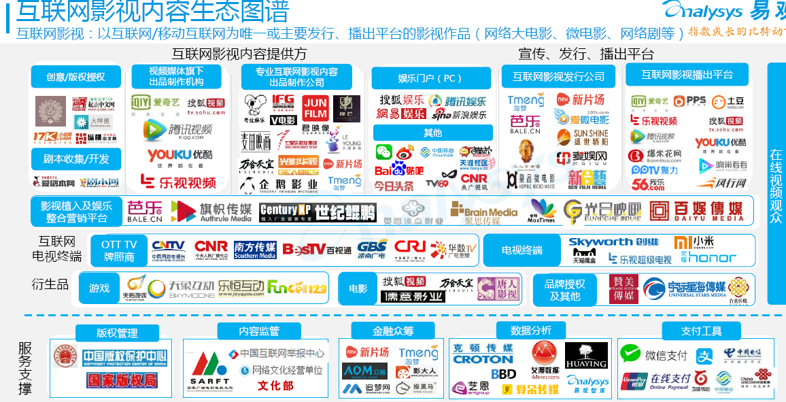
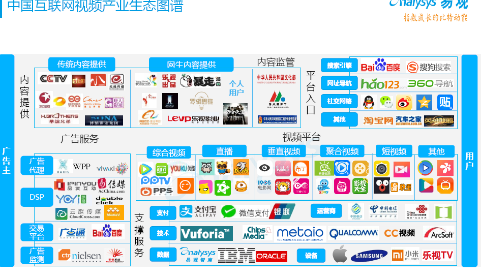
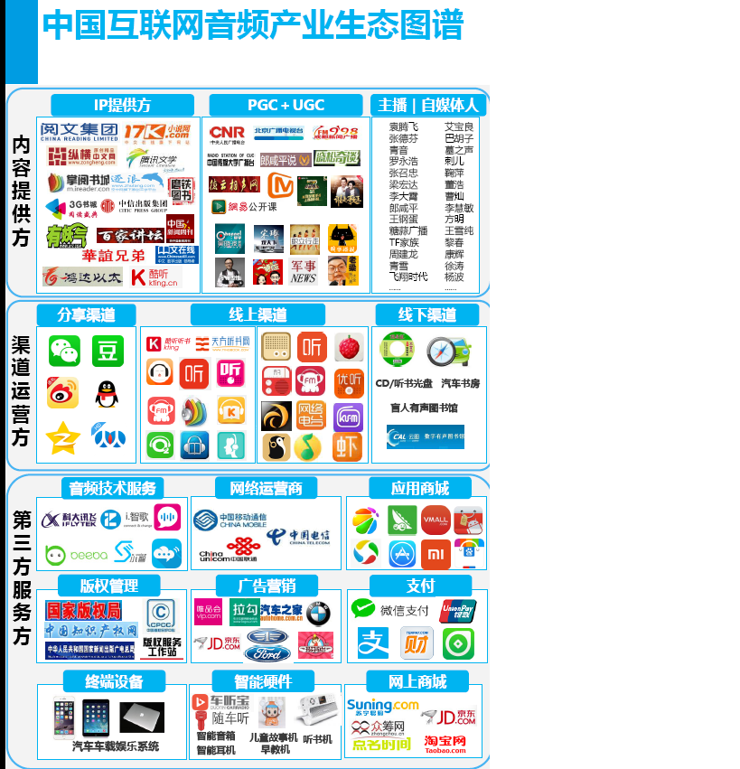
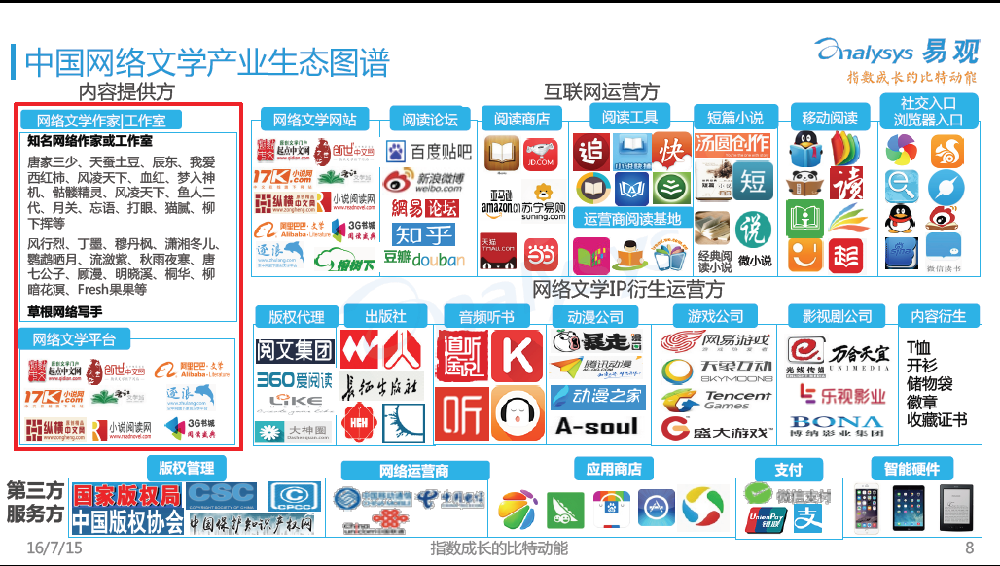
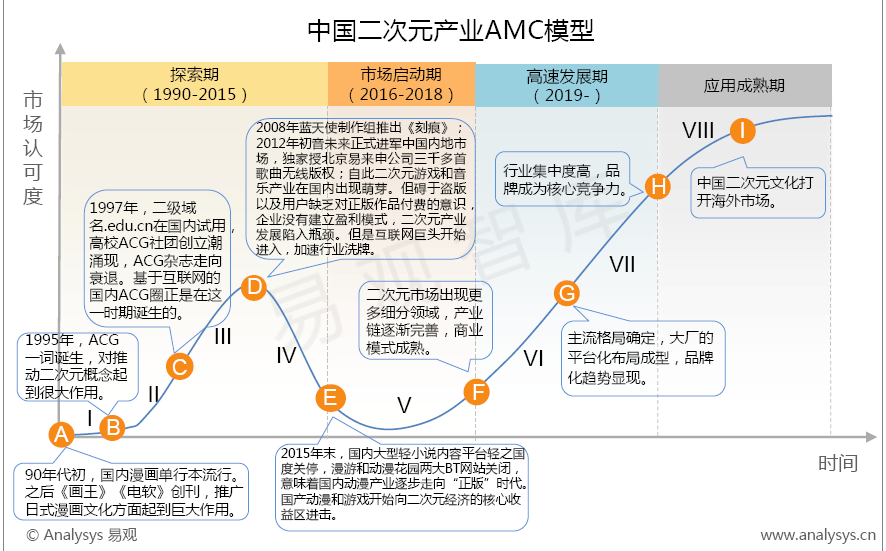
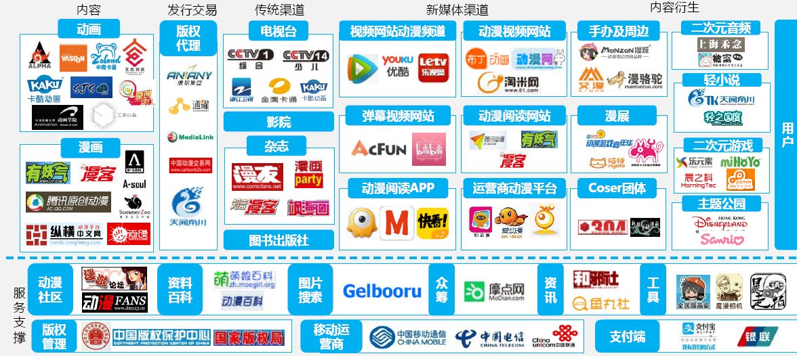
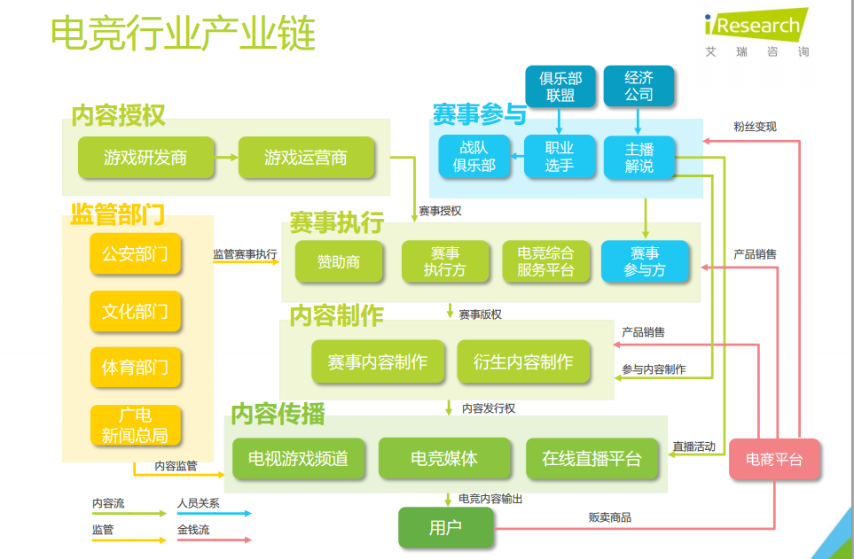

| 序号  | 修改时间      | 修改内容                       | 修改人   | 审稿人 |
| --- | --------- | -------------------------- | ----- | --- |
| 1   | 2018-5-27 | 创建                         | Keefe |     |
| 2   | 2021-12-1 | 调整目录结构，增加行业分类章节。TMT章节拆分另文。 | 同上    |     |

  

 

---

[TOC]

 

---

# 1 行业概述

英文Industry 翻译为 行业、产业。但在国内，行业和产业却有一些区别，可以从定义、范围外延作个区分。

* 行业：指从事国民经济中同性质的生产或其他经济社会的经营单位或者个体的组织结构体系，如林业，汽车业，银行业等。

* 产业：产业是社会分工和生产力的产物，属于某种同类型的经济活动。比如产业革命、工业革命。比如将国民经济各行业划分为第一产业、第二产业、第三产业。

简单来说，行业是微观的，产业是宏观的。产业的概念更加宽泛，产业概念的外延要大于行业。

## 行业分类

行业分类，是指从事国民经济中同性质的生产或其他经济社会的经营单位或者个体的组织结构体系的详细划分，如[林业](https://baike.baidu.com/item/林业/84154)，[汽车业](https://baike.baidu.com/item/汽车业/9324802)，[银行业](https://baike.baidu.com/item/银行业/2271821)等。行业分类可以解释行业本身所处的发展阶段及其在国民经济中的地位。

国内外比较权威的行业分类标准有六个,这六个分类标准又可划分为管理型和投资型两种类型。

管理型分类：联合国[国际标准产业分类](https://baike.baidu.com/item/国际标准产业分类/22621457)(ISIC)、北美行业分类系统(NAICS)、国家统计局的行业分类标准 和中国证监会的《指引》；

投资型分类：全球行业分类系统([GICS](https://baike.baidu.com/item/GICS/6189047))、富时分类系统([FTSE](https://baike.baidu.com/item/FTSE/6700743))。上证180指数在编制时即采用了投资型的GICS作为行业分类标准。

**新国家标准《国民经济行业分类》**

新国家标准《[国民经济行业分类](https://baike.baidu.com/item/国民经济行业分类)》（GB/T4754-2011）经国家质量监督检验检疫总局、国家标准化管理委员会批准发布，于2011年11月1日实施。根据统计工作的实际情况，从2012年定报统一开始使用。

GB/T 4754-2017《国民经济行业分类》国家标准第1号修改单（以下简称第1号修改单）已经国家标准化管理委员会于2019年3月25日批准，自2019年3月29日起实施。

本标准采用线分类法和分层次编码方法，将国民经济行业划分为门类、大类、中类和小类四级。代码由一位拉丁字母和四位阿拉伯数字组成。GB/T 4754-2017《国民经济行业分类》共有20个门类、97个大类、473个中类、1380个小类。相对于2001年，大类增加了1个，中类增加了41个，小类增加了286个。

A 农、林、牧、渔业； B 采矿业； C 制造业； D 电力、热力、燃气及水生产和供应业；

E 建筑业； F 交通运输、仓储和邮政业； G 信息传输、软件和信息技术服务业； H 批发和零售业；

I 住宿和餐饮业； J 金融业； K 房地产业； L 租赁和商务服务业；

M 科学研究和技术服务业； N 水利、环境和公共设施管理业； O 居民服务、修理和其他服务业； P 教育；

Q 卫生和社会工作； R 文化、体育和娱乐业； S 公共管理、社会保障和社会组织； T 国际组织

**全球行业分类标准**([GICS](https://baike.baidu.com/item/GICS/6189047))

GICS——全球行业分类系统(GICS)是由[标准普尔](https://baike.baidu.com/item/标准普尔/1194194)(S&P)与[摩根斯坦利](https://baike.baidu.com/item/摩根斯坦利)公司(MSCI)于1999年8月联手推出的行业分类系统。

新的标普全球行业分类标准把标普1500指数的成分股分为11个行业部门、24个行业组、68个行业。11个行业部门如下：

基础材料(Materials)——化学品、金属采矿、纸产品和林产品；

消费者非必需品(Unnecessary Consume)——汽车、服装、休闲和媒体；

消费者常用品(Necessary Consume)——日用产品、食品和药品零售；

能源(Energy)——能源设施、冶炼、石油和天然气的开采；

金融(Finance)——银行、金融服务、保险和房地产；

医疗保健(Medical & Health)——经营型医疗保健服务、医疗产品、药品和生物技术；

工业(Industry)——资本货物、交通、建筑、航空和国防；

信息技术(Information technology)——硬件、软件和通讯设备；

电信服务(Telecom)——电信服务和无线通讯；

公用事业(Utilities)——电力设备和天然气设备；

地产业(Real Estate)——房地产开发、管理及相关信托。

## 行业周期

每个产业都要经历一个由成长到衰退的发展演变过程。这个过程便称为产业的生命周期。一般地，行业的生命周期可分为四个阶段，即初创期（也叫幼稚期）、成长期、成熟期和衰退期。下面分别介绍行业的不同发展阶段的情况。

**初创期：** 高风险、低收益

**成长期：** 高风险、高收益

**成熟期：** 行业的成熟期是一个相对较长的时期。

**衰退期**： 在衰退期，厂商的数目逐步减少，市场逐渐萎缩，利润率停滞或不断下降。当[正常利润](https://baike.baidu.com/item/正常利润)无法维持或现有投资折旧完毕后，整个行业便逐渐解体了。

**技术生命周期**

可参看：Gartner的技术成熟曲线

技术生命周期十分重要，尤其是对以技术为生命的IT公司来讲，能否把握好技术生命周期，能否在新技术的初期介入，在技术的衰退期成功退出，是IT公司成功与否的决定性因素。

任何技术，任何产品都是有生命周期的，都有类似行业生命周期的四阶段。

起步，成长，成熟和衰退四个阶段。

**起步阶段**：也即一个技术的最初发明，这个时候，也许连最初发明产品的科学家都不知道此技术在市场上究竟如何使用，如何产品化。
**成长阶段**：此项技术被少数先知先觉的，有长远市场洞察力公司转化为产品，逐渐推向市场，被大众认可。此阶段，市场仍旧为蓝海，或因为技术壁垒，或因为市场不够成熟，竞争者较少，利润率较高，是先觉的公司快速增长，猛赚钱的阶段。

**成熟阶段**：此项技术或已经过了专利保护期，或已经被市场上的公司广泛掌握，技术壁垒已经基本消失。此阶段一般分为两个小的阶段：
 第一阶段，大量的公司涌入，使得蓝海市场变为红海，利润率降低，可能产生价格战，称为群雄逐鹿的阶段；
 第 二阶段，少数公司经过良好的市场运作或消灭，或合并其他的公司，最后形成垄断，继续保持较高的利润率，然而会受到反垄断法的困扰，因而往往保留一到两个小 弟做老二老三，从而形成[70-20-10分布](http://googlechinablog.com/2008/11/blog- post.html)，即70%的市场被老大占据，20%的市场被老二老三占据，10%是其他散兵游勇。

**衰退阶段**： 此项技术已经十分成熟，比较少有创新的空间，新技术的产生及代替作用使得利润率降低，哪怕是对垄断性的公司。掌握此项技术的公司已非明星企业，但是不会很 快消亡，因为技术尚在使用，并且没有太多的公司进入，因而能够维持平稳的利润。比如虽然载人飞船已经上天了，马车仍在使用，制造马车的作坊也能实现盈利。

## 行业趋势

IBM/华为的矩阵组织架构：产品、客户（行业）、区域。

**重点行业**（类别参见工信部定义）：大金融（银行保险证券）、互联网、科技、能源、智慧城市（交通、IOC）、制造、

**行业周期**：新兴、成长、快速、衰退

**洞察方法论**：PEST（政治经济社会科技，适用于国家洞察）、波特钻石理论模型(国家竞争优势理论)

## 行业巨头

关注各个行业的行业巨头、独角兽（尚未上市企业），可以很快地了解整个行业的状况。

## 行业投资

一个赛道是否有投资价值，取决于赛道的宽度、长度与深度。

* 宽度代表赛道的容纳空间，即市场的容量；
* 广度表示赛道的成长空间，即市场的增长潜力；
* 深度则代表赛道的成长逻辑，即市场成长的驱动因素。

 

## 本章参考

* 百度百科-[国民经济行业分类](https://baike.baidu.com/item/国民经济行业分类)   https://baike.baidu.com/item/国民经济行业分类
* 百度百科-全球行业分类标准([GICS](https://baike.baidu.com/item/GICS/6189047))
* 百度百科-行业周期  https://baike.baidu.com/item/行业周期

 

 

# 2 TMT

详见 《[TMT行业指南.md](./TMT行业指南.md)》

 

 

# 3  制造业

## 消费品

### 鞋服

业务价值链：产品设计、订货会、原材料采购、生产、物流、B端、门店、消费者

 

# 4 服务业

## HR人力资源

### HR业务

业务价值链：选、用、育、留、考

表格 人力资源领域的业务用例目录

| 业务价值链 | 二级场景    | 工作要点及标准                | 部门  |
| ----- | ------- | ---------------------- | --- |
| 选     | 岗位职能规划  | 岗位级别、岗位职责、岗位业务能力要求等    |     |
|       | 人才选择    | 人员招聘、人才库建立、招聘渠道维护等     |     |
|       | 人才引进    | 面试、人员入职                |     |
| 用     | 入职培训    | 入职培训、公司业务和规章制度讲解       |     |
|       | 人员日常管理  | 工作安排、工作管理、日常考勤         |     |
| 育     | 业务培训    | 业务技能培训                 |     |
|       | 人员成长力测评 | 对人员的业务技术、性格、爱好等进行综合评定  |     |
|       | 职业发展规划  | 对人员进行职业发展规划            |     |
| 留     | 人员加薪及晋升 | 岗位晋升、级别晋升、薪资调整等        |     |
|       | 人员激励    | 对绩效优秀的员工进行精神及物质层面的激励   |     |
| 考     | 业务考核    | 考核业务KPI指标              |     |
|       | 能力考核    | 对员工业务能力、发展潜力等进行能力考核及评估 |     |

表格 人力资源的典型数据应用

| 数据应用    | 数据方案                 | 数据成果       | 应用效果 |
| ------- | -------------------- | ---------- | ---- |
| 高潜力人员评估 | 收集员工行为数据；构建高潜力人员评估模型 | 高潜力人员评估报告  |      |
| 人员离职预测  | 构建能力评估模型、识别人员流失的关键事件 | 员工流失概率预测模型 |      |

### HR变革

HR三支柱模型由Dave Vlrich在1996年提出，在2002年左右引入国内，其核心思想就是把人当作“资本”而不是“资源”，将人力资本当作一项业务经营，重新定位了人力资源部门。从职能导向转向业务导向，要求HR要像业务单元一样运作，以实现业务增值。

人力资源部门要想从“支持业务”变为“业务伙伴”关键是自身要转型——从职能导向转向业务导向。三支柱分别为HRBP、HRCOE和HRSSC。

- HRBP(HR Business Partener，人力资源业务伙伴)是业务的合作伙伴，针对内部客户提供需求，提供相关的咨询服务解决方案；
- HRCOE(HR Centre of Excellence or Center of Expertise，专业知识中心或领域专家)借助专业技能和领先的实践经验设计业务发展导向，创新HR政策；一般几千员工中才配置一个COE。
- HRSSC(HR Shared Service Centre 共享服务中心)是HR标准服务的提供者，绝大多数的事务都可以由SSC来承担。

事务可以用分层式服务模式：66%智能问答，28% SSC服务代表，5% SSC专员，1% COE或者BP。

## 咨询行业

传统咨询服务（咨询1.0）是以传统管理理论为基础，而新一代咨询服务基于数字化技术的应用、以创新技术和实践为基础。

- 咨询1.0：以管理流程、流程优化为主，然后把流程固化到平台上；
- 咨询2.0：围绕数字时代下的数字技术，重点考虑的是数字化技术如何给客户带来价值。“咨询2.0”的主要特征是技术驱动、共同创新、敏捷迭代、共同成长。

 

## 泛娱乐业

泛娱乐包括五个方面，分别是影视、音乐、文学、动漫和游戏。

盛大的网络迪斯尼：已夭折。

腾讯的娱乐帝国：腾讯视频、腾讯音乐（占中国音乐界大半流量）、腾讯文学、腾讯游戏（全球第一大）

### 影视

图 中国互联网影视内容生态图谱

图 中国互联网视频产业生态图谱

### 音乐

图 中国互联网音频产业生态图谱

### 文学

图 中国网络文学产业生态图谱

表格 1 中国网络文学大事记

| 年份   | 主要事件                                                                         |
| ---- | ---------------------------------------------------------------------------- |
| 2002 | 吴文辉和宝剑锋（林庭锋）、藏剑江南（商学松）、意者（侯庆辰）、黑暗左手（罗立）、5号蚂蚁（郑红波）成立了一个协会——玄幻文学协会，就是起点中文网的前身。 |
| 2004 | 起点中文网被盛大以200万美元的价格收购。                                                        |
| 2005 | 盛大对起点追加了1000万元，2006年追加了1亿元的投资，一举奠定了起点中文网在国内网络文学市场第一的地位。                      |
| 2008 | 陈天桥开始着手打造盛大文学，陆续收购晋江原创网、红袖添香文学网、榕树下、潇湘书院、有妖气原创动漫工厂等。                         |
| 2013 | 3月，吴文辉离职盛大文学。5月，吴文辉创立创世中文网。                                                  |
| 2014 | 4月，吴文辉携他的团队加盟腾讯，并出任腾讯文学的CEO。年底，盛大文学被陈天桥以7.3亿美元卖给了马化腾。                        |
| 2015 | 3月，腾讯文学和盛大文学整合成立阅文集团。                                                        |
| 2017 | 11.9，阅文集团港交所上市，发行价为每股55.00港元，收盘市值945亿港币。                                     |

备注：2017.11，现年39岁的吴文辉持有阅文集团3.71%股份，商学松持有1.86%，林庭锋持有1.86%，侯庆辰持有0.93%，罗立持有0.93%。

### 动漫

备注：二次元用户年龄在30岁以下占97.2%，性别比例相当。

“二次元”即指二维平面世界，在动画(Animation)、漫画 (Comic)、游戏(Game)、小说(Novel)组织成的ACGN文化圈中,被用作对“架空世界”的称呼。现实世界是三次元。

ACG为英文[Animation](http://baike.baidu.com/view/479733.htm)、Comic、[Game](http://baike.baidu.com/subview/527580/9029418.htm)的缩写，是[动画](http://baike.baidu.com/view/7262.htm)、漫画、游戏的总称。ACG文化发源于日本，以网络及其他方式传播。为华人社会常用的次文化词汇（日本并不使用这个词，在英语为主的国家里也并不普及）。

现如今还有[ACGN](http://baike.baidu.com/view/1411428.htm)，为在ACG（英文[Animation](http://baike.baidu.com/view/479733.htm)、Comic、[Game](http://baike.baidu.com/subview/527580/9029418.htm)）的基础上增加了N（[Novel](http://baike.baidu.com/view/3081013.htm)小说，泛指文字读物——[轻小说](http://baike.baidu.com/subview/91916/10360052.htm)）。

图 中国二次元产业AMC模型

图 中国二次元产业生态图谱

### 游戏

图  电竞行业产业链

表格 1 电子竞技赛事和展览会列表

| 活动                                                                                            | 简介                                                                                                                                                                                                                                                                                                                                                                                                                                                                                                                                                        | 开始-结束              | 备注      |
| --------------------------------------------------------------------------------------------- | --------------------------------------------------------------------------------------------------------------------------------------------------------------------------------------------------------------------------------------------------------------------------------------------------------------------------------------------------------------------------------------------------------------------------------------------------------------------------------------------------------------------------------------------------------- | ------------------ | ------- |
| 职业电子竞技联盟简称[CPL](http://baike.baidu.com/subview/56177/10711828.htm)                            | Cyberathlete Professional League（CPL）中文名称为职业电子竞技联盟，创立于1997年，创始人为Angel Munoz，创立原因是为了报道、举办电子竞技职业比赛的消息以及比赛。CPL的比赛在美国、亚洲和欧洲都有出现，不同地区的玩家和战队会在他们擅长的比 赛中进行战斗。CPL的比赛向公众开放报名，但是所有参赛人员必须大于17岁的年龄限制（因为ESRB的要求）。2005年初，CPL确定了同年的比赛奖 金总额，超过了200万美元。它的目的就是想让电子竞技变成一项真正的比赛，提升到运动的层面上。                                                                                                                                                                                                                                                                                    | 1997~              |         |
| 电子竞技世界杯[ESWC](http://baike.baidu.com/view/18898.htm)                                          | Electronic Sport World Cup（ESWC，电子竞技世界杯），起源于法国，前身为欧洲传统电子竞技赛事“Lan Arena”（1992~2002），它与CPL和WCG一道，并称为当今世界三大电子竞技赛事；ESWC，是由包括中国在内的11个理事国发起、超过60个合作伙伴的国际文化活动。                                                                                                                                                                                                                                                                                                                                                                                                   | 2001~              |         |
| ~~世界电子竞技大赛WCG~~                                                                               | ~~世界电子竞技大赛（ ~~[~~World Cyber Games~~](http://baike.baidu.com/view/1281399.htm)~~，WCG）， 创立于2000年结束于2013年，是一个全球性的电子竞技赛事（或“电脑游戏文化节”），被称为“电子竞技奥运会”，该项赛事由韩国国际电子营销公司 （Internation Cyber Marketing, ICM）主办，并由三星和微软（自2006年起）提供赞助。大赛一直以 “~~[~~beyond the game~~](http://baike.baidu.com/view/409474.htm)~~” ~~~~为口号，以推动电子竞技的全球发展为目标，旨在促进人们在~~[~~网络时代~~](http://baike.baidu.com/view/552605.htm)~~的沟通、互动和交流，促进人类生活的和谐与愉快。2014年2月5日，现任~~[~~WCG~~](http://baike.baidu.com/subview/5608/5587179.htm)~~首席执行官李秀垠通过官方邮件对外宣布WCG组委会将不再举办任何赛事，包括WCG世界总决赛，延续13年的WCG至此画上了句号。~~ | ~~2000~~~ ~~2013~~ | ~~已结束~~ |
| 美国[E3](http://baike.baidu.com/view/2428590.htm)[游戏展](http://baike.baidu.com/view/2428590.htm) | 电子娱乐展览，（又叫E3游戏展），即Electronic Entertainment Expo/Exposition，简称为E&sup3;，常被写作E3。是世界上电子游戏界最大的年度商业化展览，也是第一大的游戏大会。展览只 对那些电子游戏业界业内人士以及记者开放，并且制定了了18岁以上才能参观的年龄限制。                                                                                                                                                                                                                                                                                                                                                                                                 | 1995~              |         |
| 日本东京电玩展                                                                                       | 东京电玩展(Tokyo Game Show，简称TGS)，始办于1996年，是规模仅次于美国[E3](http://baike.baidu.com/view/2428590.htm)[游戏展](http://baike.baidu.com/view/2428590.htm)的全球第二大游戏展会，至今已经发展成为亚洲最大的游戏展览会，是在日本东京千叶[幕张展览馆](http://baike.baidu.com/view/1430398.htm)（幕张メッセ）举办的大型视讯游戏展览。东京电玩展的内容以各类游戏机及其娱乐软体、电脑游戏以及游戏周边产品为主。                                                                                                                                                                                                                                                                    | 1996~              |         |
| [中国国际数码互动娱乐展览会](http://baike.baidu.com/view/9551662.htm)                                      | [中国国际数码互动娱乐展览会](http://baike.baidu.com/view/9551662.htm)（简称：ChinaJoy）是ChinaJoy品牌最重要的组成部分，是全球数码互动娱乐领域最具影响力的盛会。每年7月下旬在上海举办。 目前ChinaJoy已经形成一个以中国国际数码互动娱乐展览会（含B To C和B To B）为主，并包括同期举办的中国国际动漫及衍生品授权展览会（C.A.W.A.E）、次世代游戏机及家庭数字娱乐产品展览会（ACH）及 中国国际数码互动娱乐产业高峰论坛（CDEC）、世界移动游戏大会（WMGC）、中国游戏开发者大会（CGDC）和中国游戏商务大会（CGBC）在内的 “三展四会”的系列会展阵容，其内容涵盖了PC网络游戏、移动游戏、主机游戏及家庭数字娱乐、动漫娱乐多种业态，受众群则包括玩家及消费者、游戏商务人士 及技术开发人员，从而形成了一个横跨数字娱乐全业态的产业交流和展示平台。                                                                                                                               | 2004~              |         |

备注：ESWC、CPL和WCG（2014起停办），并称为当今世界三大电子竞技赛事。

 

## 快消

快消，快速消费品（FMCG，Fast Moving Consumer Goods）的简称。快消行业是指消费频率高、使用时限短、拥有广泛的消费群体、对于消费的便利性要求很高的商品销售行业。

表格  快消品行业细分

| 品类                    | 细分领域                                                     | 国际品牌                                                     | 中国品牌                                     |
| ----------------------- | ------------------------------------------------------------ | ------------------------------------------------------------ | -------------------------------------------- |
| 个人护理品              | 面部护肤、口腔护理、洗发护发、身体护体、彩妆、女性用户、生活纸巾等 | 宝洁、联合利华、欧莱雅、高露洁棕榄、雅诗兰黛、花王、路易威登、瑞典Essity |                                              |
| 家庭护理品              | 织物清洁品、盘碟器皿清洁剂及家庭清洁剂等。                   | 宝洁、联合利华、利洁时、汉高                                 |                                              |
| 食品饮料                | 饮料饮品、乳制品类及休闲食品等。                             |                                                              |                                              |
|                         | 饮料饮品                                                     | 雀巢、百事、可口可乐、                                       | 农夫山泉                                     |
|                         | 乳制品                                                       | 达能、                                                       | 伊利、蒙牛                                   |
|                         | 食品                                                         | JBS巴西、泰森、亿滋国际、卡夫亨氏、丰益新加坡、通用磨坊、巴西MARFRIG | 万洲国际、康师傅、海底捞、三只松鼠、良品铺子 |
| 烟酒                    | 烟                                                           | 英美烟草、菲利普莫里斯、奥驰亚、日本烟草、英国烟草           | 中华、玉溪                                   |
|                         | 酒                                                           | 百威英博、喜力、帝亚吉欧、日本朝日、嘉士伯（Carlsberg）、三得利、 | 茅台、五粮液、剑南春、青岛                   |
| 药品中的非处方药（OTC） |                                                              | 罗氏                                                         | 云南白药、中国生物制药、上海医药、恒瑞、哈药 |

> 备注：药品中的非处方药（OTC），消费者可以自行购买，但同时经营企业也需要接受一定的监督和管控。

 

## 奢侈品

奢侈品（Luxury），源于拉丁文的“光”(Lux)。奢侈品在国际上被定义为“一种超出人们生存与发展需要范围的，具有独特、稀缺、珍奇等特点的消费品”，又称非生活必需品。奢侈品在经济学上讲，指的是价值/品质关系比值最高的产品。从另外一个角度上看，奢侈品又是指无形价值/有形价值关系比值最高的产品。奢侈品是在市场上无论是质量，还是价格都是最高档次的商品。

### 产业分类

1.时装和皮具

2.游艇

3.汽车和摩托车

4.珠宝和腕表

5.钢笔

6.香水和化妆品

7.葡萄酒

8.家具和家纺

9.厨具、餐具和瓷器

10.物件设计

11.豪华酒店

12.手机和电脑

### 奢侈品牌

世界奢侈品协会曾评选出全球十大顶级时尚品牌：爱马仕（法国）、香奈儿（法国）、路易威登（法国）、克里斯汀·迪奥(法国)、菲拉格慕（意大利）、范思哲（意大利）、普拉达（意大利）、芬迪（意大利）、乔治·阿玛尼（意大利）、古驰（意大利）。

全球十大顶级时尚品牌中法国占4家、意大利占6家。

中国的奢侈品牌主要集中在酒类和珠宝领域：茅台、五粮液、剑南春、周大福、老凤祥。

表格 全球十大奢侈品品牌（按创建时间升序）

| 品牌                   | 发源地 | 创建时间 | 简介                                                         |
| ---------------------- | ------ | -------- | ------------------------------------------------------------ |
| 爱马仕Hermès           | 法国   | 1837     | 拥有皮具和马具、女士丝制品、男士丝制品、女士成衣、男士成衣、鞋履、腰带、帽子、手套、珠宝、钟表、香水、美妆、家具和生活艺术、餐瓷、petit h十六大工艺部门。 秉承独立、负社会责任的经营理念，坚持将生产重心放在法国本土、维持在51个生产点内，同时发展全球网络，遍及45个国家、包含306间专卖店。 |
| 路易威登.Louis Vuitton | 法国   | 1854     | 隶属于酩悦·轩尼诗-路易·威登集团，经营产品包括手提包，旅行用品，小型皮具，配饰，鞋履，成衣，腕表，高级珠宝及个性化订制服务等。 |
| 香奈儿.Chanel          | 法国   | 1910     | 由服装起家，发展至拥有时尚精品及配饰、香水彩妆及护肤品以及腕表/ 高级珠宝三个大类的产品。香奈儿一直保持着高雅、简洁、精美的风格，而双C标志、菱形格纹、山茶花是Chanel的三大标志。 |
| 普拉达.PRADA           | 意大利 | 1913     | 普拉达提供男女成衣、皮具、鞋履、眼镜及香水，并提供量身定制服务。 |
| 古驰.GUCCI             | 意大利 | 1921     | 借由其独特的创意和革新，以及精湛的意大利工艺闻名于世。古驰的产品包括时装、皮具、皮鞋、手表、领带、丝巾、香水、家居用品及宠物用品等 |
| 芬迪.FENDI             | 意大利 | 1925     | 芬迪主要产品有：皮草、女鞋、配饰、腕表、香水等。             |
| 菲拉格慕Ferragamo      | 意大利 | 1927     | 风格华贵典雅，实用性和款式并重，以传统手工设计和款式新颖誉满全球。 |
| 克里斯汀·迪奥Dior      | 法国   | 1947     | 隶属于[酩悦·轩尼诗-路易·威登集团](https://baike.baidu.com/item/酩悦·轩尼诗-路易·威登集团/23275789?fromModule=lemma_inlink)。迪奥主要经营男女手袋、女装、男装、男女鞋履、首饰、香水、化妆品、童装等高档消费品。 |
| 乔治·阿玛尼Armani      | 意大利 | 1975     | 经营的产品包括成衣、鞋履、手表、包袋、美妆等。               |
| 范思哲.VERSACE         | 意大利 | 1978     | 以希腊神话里的“Medusa蛇发女妖[美杜莎](https://baike.baidu.com/item/美杜莎/463?fromModule=lemma_inlink)”作为精神象征，代表着致命的吸引力。服饰上的鲜艳色彩，灵感则是来自于希腊、埃及、印度等古文明。范思哲经营服饰、香水、眼镜、领带、皮件、包袋、瓷器、玻璃器皿、丝巾、羽绒制品、家具产品等。 |

备注：

* [酩悦·轩尼诗-路易·威登集团](https://baike.baidu.com/item/酩悦·轩尼诗-路易·威登集团/23275789?fromModule=lemma_inlink)：Louis Vuitton Moët Hennessy，英文简称LVMH。世界最大的奢侈品集团。1987年由贝尔纳·阿尔诺（Bernard Arnault）将[路易威登](https://baike.baidu.com/item/路易威登?fromModule=lemma_inlink)（Louis Vuitton）与[酩悦·轩尼诗](https://baike.baidu.com/item/酩悦·轩尼诗?fromModule=lemma_inlink)（Moët Hennessy）公司合并而成，员工约五万六千人，旗下拥有50多个品牌。集团主要业务包括以下五个领域：葡萄酒及烈酒（Wines & Spirits）、时装及皮革制品（Fashion & Leather Goods）、香水及化妆品（Perfumes & Cosmetics）、钟表及珠宝（Watches & Jewelry）、精品零售（Selective Retailing）。旗下的奢侈品品牌有路易威登、Dior（1987年并购）、FENDI（2000年收购）、蒂芙尼Tiffany（美国珠宝品牌，2021年以162亿美元收购）。
* [PPR集团](https://baike.baidu.com/item/PPR集团?fromModule=lemma_inlink)：世界第三大奢侈品集团。1963年成立于 法国，后更名为PPR集团；2013年更名为Kering，中文名称为“开云”。

表格 奢侈品品类及品牌

| 品类   | 十大品牌                                                     |
| ------ | ------------------------------------------------------------ |
| 服装   | ▪ 唐纳卡兰  ▪Louis Vuitton ▪ covherlab ▪ 范思哲 ▪ Dior ▪ GUCCI ▪ 瓦伦蒂诺·加拉瓦尼 ▪ PRADA ▪ GUESS ▪ 阿玛尼 |
| 珠宝   | ▪ [JOLEE](http://baike.baidu.com/subview/7137312/7288660.htm)  ▪卡地亚 ▪ 蒂芙尼▪ ENZO▪ Oxette▪ 宝诗龙▪ Bvlgari▪ 路梦尚品▪ Graff▪ Georgjensen |
| 名表   | ▪ [百达翡丽](http://baike.baidu.com/subview/60024/60024.htm)▪江诗丹顿▪ 爱彼▪ 宝玑▪ 伯爵▪ 卡地亚▪ 劳力士▪ 积家▪ IWC万国▪ 芝柏 |
| 汽车   | ▪ 劳斯莱斯▪迈巴赫▪ 宾利▪ 布加迪▪ 法拉利▪ 玛莎拉蒂▪ 兰博基尼▪ 帕加尼▪ 阿斯顿马丁▪ 捷豹 |
| 化妆品 | ▪ La Prairie▪赫莲娜▪ 兰蔻▪ 海蓝之谜▪ 阿玛尼▪ 伊丽莎白·雅顿▪ 雅诗兰黛▪ 娇兰▪ Dior▪ Chanel |
| 名笔   | ▪ 帕克▪ 万宝龙▪ 威尔·永锋▪ 华特曼▪ 卡地亚▪ 犀飞利▪ 地球牌▪ 奥罗拉▪ 高仕▪ Montegrappa |
| 皮具   | ▪ 爱马仕▪ Louis Vuitton▪ Chanel▪ Dior▪ 古驰▪ PRADA▪ Bottega Veneta▪ Burberry▪ 芬迪▪ coach |
| 手机   | ▪ Vertu  ▪mobiado stealth▪ Gresso Steel▪ 东芝Cosmic Shiner▪ 诺基亚8800Arte▪ 迪奥Dior Phone▪ 苹果Amosu版iPhone▪ 保时捷P9521▪ 豪雅Meridiist▪ 华硕兰博基尼ZX1 |

### 珠宝首饰

表格 中国珠宝首饰品牌（按创建时间升序）

| 品牌      | 发源地 | 创建时间 | 简介                                                         |
| --------- | ------ | -------- | ------------------------------------------------------------ |
| 老凤祥    | 上海   | 1848     | 民族品牌老凤祥，集“研发、设计、生产与销售”于一体，拥有多家专业厂、研究所和遍布全国各地的3800多家销售网点，拥有完整的产业链、多元化的产品线，旗下涵盖黄金、白银、铂金、钻石、翡翠、珍珠等多品类首饰。 |
| 老庙黄金  | 上海   | 1906     | 上海豫园珠宝时尚集团旗下，知名黄金首饰品牌，国内大型的黄金销售中心，集设计、生产、加工、批发、销售金银珠宝于一身的企业。 |
| 周大福    | 香港   | 1929     | 国内较具规模的珠宝商，集原料采购、生产设计、零售服务于一体的综合性经营企业，周大福凭借差异化策略，相继推出HEARTS ON FIRE、ENZO、SOINLOVE与MONOLOGUE等其他个性品牌。 |
| 周生生    | 广州   | 1934     | 国内大型珠宝零售商，香港上市公司，专业提供一站式珠宝服务的现代化产业企业，以企业管治严谨、服务殷勤专业、产品优质精良见称。 周生生在中国设有超逾50余间分店，在香港将逾40分店，台湾21家。 |
| 菜百首饰  | 北京   | 1956     | 主要经营黄金饰品、贵金属投资产品、贵金属文化产品和钻翠珠宝饰品等在内的全品类黄金珠宝商品，2021年在上海证券交易所主板上市。 |
| 谢瑞麟TSL | 香港   | 1971     | 亚洲地区较具规模的珠宝零售及制造商，主要从事珠宝首饰设计、零售、出口及制造业务的企业。1987年香港交易所上市。全球超过480间珠宝分店。 |
| 六福珠宝  | 香港   | 1991     | 香港及内地主要珠宝零售商，专注于各类黄铂金首饰及珠宝首饰产品的采购、设计、批发、商标授权及零售业务。 1994年进入内地，1997年上市港主板。现时在全球拥有逾2,190个零售点（看国内地2,120间分店）。 |
| 湖宏基    | 汕头   | 1996     | 时尚珠宝行业知名品牌，集珠宝首饰设计、生产、销售为一体的大型股份企业，专注于自主创新以提供设计独特、款式丰富的珠宝首饰。 |
| 周大生    | 深圳   | 1999     | 国内主打钻石的珠宝连锁品牌，国内颇具影响力的珠宝品牌运营商，专业从事珠宝设计生产的大型企业，定位多种消费人群，主营铂金、K金、翡翠、珍珠、彩宝、黄金等产品。 2017年深交所上市。截至2019年12月底，周大生在全国拥有4011家门店。 |
| 中国黄金  | 北京   | 2010     | 隶属于中国黄金集团旗下，于2021年2月在上海证券交易所上市，主打黄金、钻石、珠宝等制品，集开发、设计、生产、销售、咨询服务等业务为一体的大型专业黄金珠宝企业。 |

 

## 生活服务

生活服务业是美好生活的最直接载体，与生活息息相关，其中既有全体人民均等享有的免费服
务，也有广大群众共需共享的普惠服务，还有居民自我消费享受的个性服务。

生活服务器可细分为便利店、酒店、药店、轻饮食、服装、健身房、汽车后市场、早教、体检机构、电影院等。

1、自上而下看连锁，时代趋势毋庸置疑，本地生活最具潜力。
我国第三产业增长迅速，日常消费（本地生活）是其中占比最大最具潜力的赛道。从2003到2019年，第三产业占总GDP比重从42.0%提升到53.9%，成为贡献GDP的主导力量，而日常消费服务产值从2003年占比第三产业的24.8%提升至71.8%，是第三产业的主要门类。

上市公司（包括拟上市）中由于业态差异，直营和加盟选择亦有所不同。

卖产品标准化程度更高，卖服务更能增强客户粘性。服装、零食、便利店、药店等偏零售的业态以卖产品为主，而酒店、眼科医院、早教机构等服务属性强的业态以卖服务为主，餐饮行业则是卖产品与卖服务并存。

2、本地生活服务机会巨大，连锁化率快速提高势不可挡。

从盈利能力来看，运动服装和连锁酒店盈利能力较强。从市场集中度来看，便利店和体检机构集中度较高，药店和轻饮食市场格局分散。

3、本地生活企业上市前后，股权架构、战略方向和运营模式均有所转变。

4、连锁业态未来将向工业化、品牌化和数字化方向发展。

### 购物中心

购物中心是最大的零食集合体。购物中心是多种零售店铺、服务设施集中在一个建筑物内或一个区域内，向消费者提供综合性服务的商业集合体。这种商业集合体内通常包含数十个甚至数百个服务场所，业态涵盖大型综合超市、专业店、专卖店、饮食店、杂品店以及娱乐健身休闲场所等。

购物中心是20世纪50年代以来在西方国家兴起的一种商业组织形式。20世纪80年代以前，我国没有购物中心，常见的主要是各种类型的供销社、百货大楼。90 年代中期，随着上海港汇商城、广州天河城、北京国贸中心的陆续建成开业，开始拥有了一批业态复合度较高、规模面积也较大且经营也较成功的真正的购物中心。截止2011年底，全国大型购物中心数量达到2795家。

《购物中心等级评价标准》由[中国房地产业协会](https://baike.baidu.com/item/中国房地产业协会/6307864)商业和旅游地产专业委员会等单位编制，经由“中国工程建设标准化协会”审查通过（编号：T/CECS 514-2018），于2018年11月1日正式实施。由评价机构[中国购物中心网](https://baike.baidu.com/item/中国购物中心网/24489467)（简称 评价机构）从设计规划、硬件设施、运营管理、消费体验四个维度，对购物中心项目进行评价，为促进购物中心开发行业整体水平的不断提高，提升物业资产的保值、增值能力，引导购物中心规划、建设、运营和管理适应消费者不断变化的生活方式和消费需求。

超过850分（满分为1100分），评选出的优秀[五星购物中心](https://baike.baidu.com/item/五星购物中心/49905806)，代表着中国世界级水平的购物中心等级。截至到2019年12月，中国共有33家五星购物中心。

**购物中心通常布局**：楼层租金价格一般是1楼 > 2/3 > 4/5 = -1 > -2/-3。所以最底层是停车场；负一层是超市、小吃购物；一层是高附加值的珠宝或奢侈品牌或饮品等；二层服装品牌；三层饮食品牌；四层影院健身KTV等娱乐。

根据最新出炉的2021全国购物中心销售额排行榜，3家购物中心营业额超200亿元（2020年无），分别是北京SKP、南京德基广场、北京国贸商城。

13家购物中心营业额超100亿元，比2020年多4家，分别是：上海国金中心IFC、上海恒隆广场、武汉武商摩尔城、深圳万象城、杭州大厦、上海环球港、西安赛格国际、成都IFS、广州太古汇。

表格  中国大型连锁购物中心

| 名称                            | 控股主体                                                  | 简介                                                         |
| ------------------------------- | --------------------------------------------------------- | ------------------------------------------------------------ |
| 大悦城                          | [中粮集团](https://baike.baidu.com/item/中粮集团/1534499) | 大悦城，是集大型[购物中心](https://baike.baidu.com/item/购物中心)、[甲级写字楼](https://baike.baidu.com/item/甲级写字楼/189467)、服务公寓、高档住宅等为一体的城市综合体，实现购物、娱乐、观光、休闲、餐饮等功能，节约资源，高效运营城市生活，成为推动城市发展的重要力量。 大悦城已成为[中粮集团](https://baike.baidu.com/item/中粮集团/1534499)城市综合体的核心品牌。以18-35岁新兴中产阶级为主力市场，以年轻、时尚、潮流、品位为特征，以购物中心为主体，组合公寓住宅、写字楼、酒店等多业态形成的全服务链城市综合体。 截止2020年底，共有10个城市12家门店 ，分别是北京（西单2007-12-28、朝阳2010-5-28）、天津（南开2011-12-25、和平2016-12-24）、上海（2010）、成都（2015-12-24）、沈阳（2009）、烟台（2014）、西安（2018）、杭州（2018）、昆明（2018）、鞍山（2020）。 |
| 万象城                          | [华润集团](https://baike.baidu.com/item/华润集团/2142288) | 从华润置地拆分出华润万象生活，产品有万象城（重奢）、万象天地（轻奢）、万象汇（中档）。 万象城（The Mixc）是世界500强企业华润集团旗下开发的高品质购物中心，是中国购物中心行业的领跑者。万象城倡导“一站式”消费和“体验式”购物，为消费者带来全新的消费概念和生活体验。 全国20+个城市。 |
| 太古里                          | [太古地产](https://baike.baidu.com/item/太古地产/6187351) | 太古地产（1972年创建）为中国内地因地制宜不断创新演变的发展项目。 全国3个城市：北京三里屯太古里（2008年），成都远洋太古里（2014-10-31）和上海前滩太古里（2021-9-30）。 |
| 万科广场                        | 万科地产                                                  | 万科广场定位为城市级中高端购物中心，其目标消费人群面向全客层，并以家庭消费人群为重点，坚持“以家庭型综合消费为主，以快速流行时尚为特色，以餐饮休闲娱乐为亮点”的商业原则规划。 全国6+个城市：深圳1家、北京2家、上海2家、福州、东莞、佛山等。 |
| 万达广场                        | 万达商管                                                  | 万达商管集团是全球领先的商业运营管理企业，万达广场是中国著名品牌，从2000年至今，已发展成为集社交、文化、旅游、美食、娱乐、购物于一体的第四代万达广场，成为人们美好生活中心。 截至2021年底，已在全国31个省、自治区、直辖市的200多座城市开业418座万达广场。 |
| 卓展                            | 卓展集团                                                  | 中国东北最具领导品质的高端百货运营商。物业总面积近65万平米。 全国3个城市：长春、沈阳、哈尔滨 |
| [天虹](https://www.rainbow.cn/) | 中航国际                                                  | 成立于1984年（第一家门店开业于深圳1985年），2010年上市。国有控股的连锁百货上市企业。 截止2022年8月，全国102家门店、123家超市，470万平经营面积。天虹单个平均经营面积约是4万平。 |

表格 深圳典型购物中心（按面积降序，20万平以上是大型购物中心）

| 名称                 | 创建时间   | 商业面积    | 简介                                                         |
| -------------------- | ---------- | ----------- | ------------------------------------------------------------ |
| **宝安壹方城**       | 2017-10-28 | 36万平8层   | 8层539家商户。 截止2021年底，全市<u>面积最大</u>、人流量最大购物中心。 |
| 天安云谷             | 2015-1-1   | 35万平5层   | 5层118家商户。                                               |
| 万达广场（龙岗店）   | 2021-9-1   | 30.4万平    |                                                              |
| 海雅缤纷城（宝安店） | 2013-9-13  | 30万平6层   | 6层518家商户。                                               |
| 大冲万象天地         | 2017-09-27 | 23万平8层   | 8层350家商户。 深圳人文综合体华润城的商业中心，毗邻深圳高新科技园，南临深南大道， 东靠沙河西路，与地铁 1 号线高新园站无缝接驳。 |
|                      |            |             |                                                              |
| 卓悦中心             | 2019-9-1   | 18.6万平5层 | 5层118家商户。                                               |
| 宝能环球汇           | 2020-9-1   | 13.8万平4层 | 4层178家商户。                                               |
| 皇庭广场             | 2013-12-25 | 13万平3层   | 3层229家商户。                                               |
| 海岸城               | 2007-12-16 | 12万平6层   | 6层407家商户。                                               |
| 益田假日广场         | 2008-8-30  | 10万平6层   | 中国首家国际化体验式购物中心。 商业面积10万平方米。6层285家商户。 |
| 红山6979商业中心     | 2020-6-1   | 10万平4层   | 4层95家商户。                                                |
|                      |            |             |                                                              |
| 时代城               | 2012-12-28 | 8万平7层    | 全国多家门店，深圳仅一家。7层89家商户。                      |
| 龙岗万科广场         | 2013-12-21 | 10万平6层   | 全国多家门店，深圳仅一家。                                   |
| 天虹                 | 2000       |             | 全市25家：福民店（2000-7-8，1.3万平4层）、保利文化广场店（2007-3-20，15万平）、宝安店（2013-2-1，8万平4层）、坂田店（2014-6-1，5万平5层） |
| 万象城               | 2004       |             | 全市2家：罗湖（2004-12-9，20.8万平6层）、深圳湾（2018-12-1，8万平5层） |
| 京基百纳广场         | 2008       |             | 全市2家：南山店（2008-9-3，12万平4层）、沙井店（2013-11-24，18万平7层） |
| Coco City            | 2014       |             | 全市2家：民治店（2014-11-8，16.8万平米米）、光明店           |
| MaxCity              | 2017       |             | 全市3家：沙井店（2017-12-23）、坂田店（2017-12-23，8万平7层）、百佳华领域广场店（2019-12-1，6万平6层） |
| 大仟里               | 2019       |             | 全市2家：光明（2019-9-28，15万平）、宝安（2019-12-24，16万平5层） |

> 备注：楼层数不包括负层，负层一般是二到三层，主要是小吃、超市和停车场。

2020年全年深圳购物中心人流量排名：宝安壹方城（3000万人次）、南山万象天地、南山海岸城、宝安海雅缤纷城、福田星河cocopark、宝安大仟里（1692万人次）、罗湖金光华广场、福田卓悦汇、罗湖万象城、南山益田假日广场（1200万人次）。

### 商超/卖场

表格 全球知名连锁卖场（按创建时间升序）

| 名称          | 发源地     | 创建时间 | 经营理念                   | 简介                                                         |
| ------------- | ---------- | -------- | -------------------------- | ------------------------------------------------------------ |
| 家乐福        | 法国       | 1959     | 廉价、服务和舒适的购物环境 | 全球大型超级市场概念的第一创始者。三种主要经营业态：大型超市，超市以及折扣店。 |
| 欧尚          | 法国       | 1961     | 自选、廉价、服务           | 欧尚集团是法国第二大以经营零售业为主的商业集团，全球十大零售商之一。欧尚集团的主力业态为：大型超级市场、超级市场、便利店，同时涉足加工生产和金融业。 |
| 沃尔玛        | 美国       | 1962     | "一站式"购物新概念         | 四种主要经营业态：沃尔玛购物广场、山姆会员店、沃尔玛商店、沃尔玛社区店。 |
| 麦德龙        | 德国       | 1964     | 超市和仓储合二为一         | 麦德龙股份公司曾是德国最大、欧洲第二、世界第三的零售批发超市集团。 |
| 开市客        | 美国西雅图 | 1976     |                            | 美国最大的连锁会员制仓储量贩店。2019年8月，开市客曾经在中国市场上开设了第一家门店。 |
| 山姆会员店    | 美国       | 1983     | 优质优价在山姆             | 沃尔玛旗下的高端会员制商店。全球已拥有超过800多家门店。在中国，第一家山姆会员商店于1996年8月12日落户深圳。截至2020年7月，山姆已在中国开设了28家商店。 |
| 大润发        | 台湾       | 1996     | 新鲜、便宜、舒适、便利     | 截止到2011年1月14日，大润发的最新门店数是150家，营收达到404亿元(约合新台币1854.5亿元)。成为中国大陆零售百货业冠军。 |
| 卜蜂莲花LOTUS | 泰国       |          |                            | 卜蜂莲花超市是泰国知名跨国集团——正大集团下属的零售企业，1997年进入中国，在中国年销售额超过500亿人民币，员工人数近8万人。 正大集团业务遍及20多个国家和地区，下属400多家公司，员工人数近20万人。 |

表格 中国知名连锁卖场（按创建时间升序）

| 名称     | 发源地 | 创建时间 | 经营理念                   | 简介                                                         |
| -------- | ------ | -------- | -------------------------- | ------------------------------------------------------------ |
| 华润万家 | 深圳   | 1938     | 产品齐全                   | 中央直属的国有控股企业集团、世界500强企业——华润集团旗下优秀的零售连锁企业集团。三种物流模式：直通、直送和配送。 |
| 苏宁易购 | 南京   | 1990     |                            | 中国商业企业的领先者，经营商品涵盖传统家电、消费电子、百货、日用品、图书、虚拟产品等综合品类。 2019年2月收购万达百货；9月48亿元收购家乐福中国。截至2020年底，苏宁易购零售云累计开店8000家，年销售额超200亿元。 |
| 联华超市 | 上海   | 1991     | 顾客第一,唯一的第一        | 联华超市2003年在香港上市，是首家于联交所上市的中国零售连锁超市公司。 联华超市旗下拥有联华、世纪联华（1997年）、华联和快客等著名连锁零售品牌。世纪联华主要用于大卖场业态，快客是便利店业态。 联华超市在全国有2000多家门店。 |
| 物美     | 北京   | 1994     |                            | 国内最早的以连锁方式经营超市的零售集团公司。                 |
| 大润发   | 台湾   | 1996     | 新鲜、便宜、舒适、便利     | 截止到2011年1月14日，大润发中国门店数150家，营收达到404亿元(约合新台币1854.5亿元)，成为中国大陆零售百货业冠军。 |
| 永辉超市 | 福州   | 2001     | 民生超市、百姓永辉”        | 永辉超市是中国大陆首批将生鲜农产品引进现代超市的流通企业之一，被国家七部委誉为中国“农改超”推广的典范，被百姓誉为“民生超市、百姓永辉”。总部在福州。 截止2019年5月，门店总数1275家，位居中国连锁百强企业第六位。 |
| **盒马** | 中国   | 2015     | 超市+餐饮+菜市场，迅速配送 | 阿里巴巴旗下，以数据和技术驱动的新零售平台，为消费者提供社区化的一站式新零售服务。 |

### 便利店

中国连锁经营协会发布了《2021中国便利店发展报告》。报告显示，2021年全国便利店销售额3492亿元，便利店行业整体发展向好。从门店规模看，2021年中国便利店门店规模达到25.3万家。易捷、美宜佳、昆仑好客为门店数量的前三甲。

表格 知名连锁便利店（按创建时间升序）

| 名称           | 发源地    | 创建时间 | 简介                                                         |
| -------------- | --------- | -------- | ------------------------------------------------------------ |
| 7-ELEVEn       | 美国   | 1927     | 原属[美国南方公司](https://baike.baidu.com/item/美国南方公司/12752134?fromModule=lemma_inlink)，2005年成为日本公司。1927年在美国德克萨斯州创立，名称为图腾店；1946年改名7-Eleven，藉以标榜营业时间由上午7时至晚上11时。1974年进入日本，变成24小时营业。 |
| LAWSON罗森     | 日本      | 1975     | 以开设全年无休息/24小时营业的便利店为主。                    |
| FamilyMart     | 日本      | 1981     | 顶新国际集团旗下。2004年进入中国，中文名全家。2005年进入美国市场。 至2012年11月止，全球总店数为21579家，超过50家店的国家地区有日本8000+）、韩国（6000+）、台湾（2000+）、中国（1000+）、泰国（600+）。 |
| 快客便利店     | 中国上海  | 1991     | 上海联华超市旗下。致力于直接经营/加盟经营和并购方式发展的零售企业。 |
| 可的KEDI       | 中国上海  | 1996     | 农工商超市集团旗下，推行商品预购与到店取货/宅配到户的服务，集直营、合伙合作承包和加盟三种经营模式为一体知名零售企业。 |
| 美宜佳MEIYIJIA | 中国东莞  | 1997     | 特许加盟为主要发展模式，致力于为社区居民打造便利生活的专业连锁企业。截止2021年，全国近3万家,，年收入500万。 |
| 红旗连锁       | 中国成都  | 2000     | 国内规模较大的以连锁经营、物流配送、电子商务为一体的商业连锁企业。目前在四川省内已开设3300家连锁超市。 |
| C-store喜士多  | 中国上海  | 2001     | 台湾润泰集团旗下，集批发、零售和服务为一体的便利店。拥有丰富多样化的商品选择，以上海为中心，辐射华东、华南等地区。 |
| 天福           | 中国东莞  | 2004     | 以便利店经营管理为主的大型综合性企业集团，集超市管理、产品开发、商贸代理、物流配送、供应链管理、商业地产、酒店投资管理、影院投资管理和股权投资为一体的集团企业。现有下属企业20余家。 目前已在广东、湖南、江西、广西、贵州、福建等地区发展了6800多间门店。 |
| 京东便利店     | 中国北京  | 2017     | 京东线下版本的创新型智能门店，是京东新通路事业部秉承京东的无界零售理念打造的创新型智能门店。 |

备注：

1. 日系便利店：7-11、罗森、全家。1992年后陆续进入中国。
2. 国企旗下便利店：截止2021年底，中石化易捷2.8万家、中石油昆仑好客2万家。

表格  中国境内便利店（按门店数目降序，2021年）

| 品牌     | 门店数（个） | 2021年营收（含税亿元） | 备注 |
| -------- | ------------ | ---------------------- | ---- |
| 易捷     | 27600        |                        |      |
| 昆仑好客 |              |                        |      |
| 美宜佳   | 20000        |                        |      |
| 天福     |              |                        |      |
| 苏宁小店 |              |                        |      |
| 红旗     |              |                        |      |
| 全家     |              |                        |      |
| 罗森     |              |                        |      |
| 7-11     | 2147         |                        |      |

### 餐饮

餐饮业（catering）是通过即时加工制作、商业销售和服务性劳动于一体，向消费者专门提供各种酒水、食品，消费场所和设施的食品生产经营行业。

2021年中国TOP4餐饮品类分别为中式快餐、中式正餐、轻餐饮、火锅。

* 中式快餐TOP5细分品类分别为快餐简餐、地方小吃、粉面类、卤味熟食，以及馅心点心类。
* 中式正餐TOP5细分品类分别为烧烤、川菜、江浙菜、粤菜、东北菜。
* 轻餐饮点选最多的饮品是杨枝甘露和拿铁。
* 火锅品类中按门店数量降序，TOP5分别是串串香、鱼火锅、重庆火锅、小火锅和牛羊肉火锅。

**辰智餐饮投资价值体系**：综合以下四个指标，每个指标最高100

* 选取门店规模与留存率代表宽度，

* 门店增长率代表广度，

* 门店连锁率代表深度

  投资价值指数：((门店规模+留存率) + 门店增长率 + 门店连锁率) /4 

表格 全球餐饮连锁品牌（按创建时间升序）

| 品牌                                                 | 创建时间 |  菜系   | 简介                                                         |
| ---------------------------------------------------- | -------- | ---------- | ------------------------------------------------------------ |
| [吉野家](http://pp.ppsj.com.cn/yoshinoya/)           | 1899     | 日式牛肉饭 | 日本生产以牛肉饭为主打产品的连锁企业。至2003年日本吉野家在日本本土已开设了900多家的连锁店，海外有200多家。 |
| [肯德基](http://pp.ppsj.com.cn/KFC/).KFC             | 1952     | 西式快餐   | 世界**<u>第二</u>**大速食及最大炸鸡连锁餐厅。 肯德基遍布全球八十余个国家，目前拥有超过9600家店。1987年进入中国，第一家门店 在北京。 |
| 汉堡王.BurgerKing                                    | 1954     | 西式快餐   | 创始于1954年[美国](https://baike.baidu.com/item/美国/125486)[迈阿密](https://baike.baidu.com/item/迈阿密/454739)。全球大型连锁快餐企业，在全球100多个国家及地区经营着超过17000家门店。 |
| [麦当劳 mcdonalds](http://pp.ppsj.com.cn/mcdonalds/) | 1955     | 西式快餐   | 麦当劳是餐饮行业的世界**<u>第一</u>**品牌，全球120多个国家4万家门店。2017年，麦当劳中国业务被中信系收购，改名金拱门。 |
| 必胜客                                               | 1958     | 比萨店     | 全球最大的比萨专卖连锁企业。全球90多个国家，1.2万间分店, 员工近25万名。1990年进入中国。 [必胜宅急送](http://pp.ppsj.com.cn/phdelivery/)是必胜客衍生的独立品牌，是专业美食外送专家。 |
| [塔可钟](http://pp.ppsj.com.cn/TacoBell/)            | 1962     | 美式       | 出售美国化的墨西哥食品。                                     |
| 萨莉亚                                               | 1967     | 意式       | 以意大利菜为显著特色的知名意式餐厅品牌，大型连锁经营餐饮品牌，致力于为顾客提供安全/健康/实惠的意大利料理。 |
| 味千拉面                                             | 1968     | 日式拉面   | 知名日本拉面品牌，拥有九州岛“白汤之雄”美誉。 全球门店达到了800家。1996年中国第一家味千拉面在香港开业。 |
| [星巴克](http://pp.ppsj.com.cn/starbucks/)           | 1971     | 咖啡馆     | 全球85个国家拥有33000家门店。1999年该公司正式登陆中国大陆，截止2021年，200多个城市开了超过5000家门店。 |
| 真功夫                                               | 1990     | 中式快餐   | 中式快餐第一品牌。公司口号：“真功夫——蒸的营养专家”。 创建于东莞长安。截止2014年3月，真功夫门店数量达570家，遍布全国40个城市。 |
| 德克士.Dicos                                         | 1994     | 西式快餐   | 原名德客士，1996年被顶新收购后改名德克士。以脆皮炸鸡著称。 起源于美国南部的德克萨斯州，1994年第一家门店在成都开业。2009年德克士开店总数达到1000家。 |
| 汉拿山                                               | 2001     | 韩式烤肉   | 创立于北京。直营餐饮连锁门店品牌，以韩式DIY自助式烤肉为主，多品牌/跨区域/多城市经营的大型餐饮企业。 全国80多个城市开设直营连锁分店超过300家。 |

备注：

1. 餐饮集团

   - 百胜餐饮集团：英文名Yum! Brands ，在全球100多个国家拥有超过 50万家的连锁餐厅，员工超过130万人，是全球最大的快餐连锁店公司、全球餐饮业多品牌集合的领导者。百胜餐饮集团拥有肯德基（1952年）、必胜客（1958年）和塔可钟（1962年）三家连锁餐饮品牌。百胜是1997年从百事可乐拆分而来。

   - 百胜中国：百胜中国是Yum! Brands在中国大陆的特许经营商，总部在上海，拥有肯德基、必胜客和塔可贝尔三大品牌在中国大陆的独家经营权，2016年从Yum! Brands拆分出来单独在纽交所挂牌上市。有意思的是，这家公司目前不论是营收还是市值，都已经超越了它原来的母公司。因为除了上述三家品牌代理之外，百胜中国还独家拥有小肥羊、东方既白、黄记煌和COFFii & JOY连锁餐饮品牌。

   - 顶新集团：台企，旗下拥有康师傅（1992年）、德克士（1996年收购）餐饮品牌。
   - [金拱门（中国）有限公司](https://baike.baidu.com/item/金拱门（中国）有限公司/22179177?fromModule=lemma_inlink)：[麦当劳（中国）有限公司](https://baike.baidu.com/item/麦当劳（中国）有限公司/19977055?fromModule=lemma_inlink)于2017年10月12日正式更名为金拱门（中国）有限公司，国企中信股份和中信资本合占52%控股。
   - 海底捞火锅：创建于1994年，2018年5月港交所上市。

2. 日本料理品牌：吉野家（1899）、味千拉面（1968）、食其家SUKIYA（1982）、元気寿司（1990）、禾绿回转寿司（1997深圳）

表格 中国餐饮小吃快餐类连锁品牌（按创建时间升序）

| 品牌                                       | 创建时间 | 发源地   | 菜系                                              | 简介                                                         |
| ------------------------------------------ | -------- | -------- | ------------------------------------------------- | ------------------------------------------------------------ |
| 狗不理                                     | 1858     | 天津     | 包子                                              | 主打产品狗不理包子闻名遐迩，以餐饮业为主营，兼具速冻食品、特色定型包装食品开发、销售的大型产业化企业。 |
| 大家乐                                     | 1968     | 香港     | [中式快餐](https://baike.baidu.com/item/中式快餐) | 创始人[罗腾祥](https://baike.baidu.com/item/罗腾祥/50513603)。全球最大的中式快餐集团。1986年香港上市。 |
| 大快活                                     | 1972     | 香港     | 中西快餐                                          | 创始人[罗芳祥](https://baike.baidu.com/item/罗芳祥/50568737)。1991年香港上市。 截至2009年3月底，集团于香港共经营101家店铺，包括96家快餐店、3家友天地及2家特色餐厅，内地则共设有16家快餐店。 |
| 李先生                                     | 1972     | 美国加州 | 牛肉面快餐                                        | 国内知名民族品牌快餐企业，美国加州牛肉面大王，大型牛肉面快餐连锁企业。 |
| 庆丰包子铺                                 | 1976     | 北京     | 包子快餐                                          | 始创于1948年，1976年更现名。 华天饮食集团旗下，包子快餐连锁企业，其包子以薄皮大馅味美汁多而备受推崇。 |
| 呷哺呷哺                                   | 1988     | 北京     | 火锅                                              | 创自北京，源自台湾，较大规模的吧台式涮锅连锁企业，以一人一锅形式为特色的时尚小火锅品牌。 |
|                                            |          |          |                                                   |                                                              |
| <u>**真功夫**</u>                          | 1990     | 东莞     | 中式快餐                                          | 中式快餐第一品牌。公司口号：“真功夫——蒸的营养专家”。 截止2014年3月，真功夫门店数量达570家，遍布全国40个城市。 |
| 丽华快餐                                   | 1993     | 江苏常州 | 中式快餐                                          | 覆盖北京、上海、广州、深圳等地，分店达80余家的连锁快餐企业。 |
| [豪客来](http://pp.ppsj.com.cn/houcaller/) | 1993     | 厦门     | 西式快餐                                          | 中国牛排餐饮品牌。                                           |
| **海底捞**                                 | 1994     | 成都     | 火锅                                              | 以其服务周到而著称，以经营川味火锅为主、融汇各地火锅特色为一体，业务涉及全球的大型连锁餐饮企业。 截止2020年6月30日，海底捞在全球开设935家直营餐厅，其中868家位于中国大陆的164个城市。 |
| 柒仙菇肉臊饭                               | 1994     | 东莞     | 中式快餐                                          | 全国有400多家直营店。                                        |
| 马兰拉面                                   | 1995     | 北京     | 面食                                              | 源于中国北方传统面食手工拉面。                               |
| 永和大王                                   | 1995     | 台湾     | 中式快餐                                          | 永和大王，是源自台湾中华快餐品牌。1995年，永和大王在上海开设了第一家餐厅。永和大王品牌于2004年加入快乐蜂餐饮集团，成为其在中国的最主要品牌。截止2020年，全国50多个城市300多家。 |
| 面点王                                     | 1996     | 深圳     | 面食                                              | 截至2012年3月，公司拥有3000名员工、108家直营分店、3个食品配送中心。2012年入选深圳老字号品牌。 |
| 乡村基                                     | 1996     | 重庆     | 中式快餐                                          | 2010年成为第一家在美国上市的中国快餐连锁企业。 目前乡村基集团旗下有乡村基、大米先生、米线记忆等品牌超1000直营店。 |
| 老家快餐                                   | 1996     | 北京     | 中式快餐                                          | 全国有170余家分店。                                          |
| 大娘水饺                                   | 1996     | 常州     | 水饺                                              | 国内最大的水饺堂食快餐连锁企业。                             |
| 小肥羊                                     | 1999     | 包头     | 火锅                                              | 2008年在香港上市，被誉为“中华火锅第一股”。                   |
| 吉祥馄饨                                   | 1999     | 上海     | 馄饨                                              | 全国120多个城市，数千家门店。                                |
|                                            |          |          |                                                   |                                                              |
| 阿香米线                                   | 2000     | 上海     | 米线                                              | 国内米线行业代表性品牌，覆盖全国的云南风味米线连锁店。       |
| 喜家德水饺                                 | 2002     | 鹤岗     | 水饺                                              | 全国超过600家门店连锁遍布40多个城市，员工超过8000人。        |
| 老乡鸡                                     | 2003     | 安徽合肥 | 中式快餐                                          | 全国600多家直营店。                                          |
| 大先生小碗菜大王                           | 2004     |          | 中式快餐                                          | 2004年2月，大先生小碗菜大王与菲律宾快餐巨头快乐蜂餐饮集团成功合并。 |
| 蛙来哒                                     | 2010     | 广州     | 牛蛙锅                                            | 全国知名牛蛙锅品牌，开创炭烧牛蛙品类，主打多种口味牛蛙锅的创新型餐饮连锁企业。2021年蛙来哒将实现全国500+门店。 |
| 和府捞面                                   | 2012     | 南通     | 中式面食                                          | 全国200余家直营门店。                                        |

备注：中国三大超级餐饮分别是沙县小吃、兰州拉面、黄焖鸡。

表格 中国餐饮八大菜系连锁品牌（按创建时间升序）

| 品牌           | 创建时间 | 发源地   | 菜系   | 简介                                                         |
| -------------- | -------- | -------- | ------ | ------------------------------------------------------------ |
| 松鹤楼         | 1757     | 苏州     | 苏菜   | 苏州地区历史悠久/饮誉海内外的正宗苏帮菜馆，其菜品用料上乘/因材施艺/精烹细作/鲜甜可口。 |
| 杏花楼         | 1851     | 上海     | 粤菜   | 以餐饮起家，月饼发家的百年品牌，素以精制月饼、地道粤菜、中西糕点、粽子腊味著称的大型食品餐饮企业。 拥有三家酒家、一家食品厂、一家物流配送中心、两家食品营销公司、120多家食品连锁专卖。 |
| **全聚德**     | 1864     | 北京     | 京菜   | 以中式正餐为主/连锁经营的大型餐饮集团，以全聚德烤鸭为龙头，涵盖川/鲁/宫廷/京味等多个口味，研发生产糕点/面食/卤味/酱料等产品。 |
| 东兴楼         | 1902     | 北京     | 鲁菜   | 以经营传统鲁菜为主，被誉为传统鲁菜八大楼之首。               |
| **点都德**     | 1933     | 广州     | 粤菜   | 国内知名的大型连锁式综合茶楼，早茶文化经典传承者，以美味的点心出品、良好的服务环境而备受消费者青睐。 |
| **广州酒家**   | 1935     | 广州     | 粤菜   | 素有“食在广州第一家”的美誉。截止2020年，集团共有餐饮门店17间。 |
| 小南国         | 1987     | 上海     | 上海菜 | 精品中餐正餐连锁餐厅，主推海派精品美食及上海本帮特色佳肴，以其独特、细腻、精致、典雅的新上海菜风格而广受消费者的青睐。 全国13个城市50余家门店。 |
| 西贝莜面村     | 1988     | 巴彦淖尔 | 西北菜 | 西贝餐饮集团旗下的主品牌，主营中式休闲正餐，西北菜的杰出代表。 |
| 眉州东坡       | 1996     | 北京     | 川菜   | 以其独特的东坡菜系和儒雅食风闻名，旗下品牌拥有“眉州东坡酒楼”、“王家渡火锅”、“眉州小吃”三个业态。 全球有一百多家直营店。 |
| 乡村基         | 1996     | 重庆     | 川菜   | 2010年成为第一家在美国上市的中国快餐连锁企业。 目前乡村基集团旗下有乡村基、大米先生、米线记忆等品牌超1000直营店。 |
| 炊烟小炒黄牛肉 | 1998     | 长沙     | 湘菜   | 华中地区知名湘菜代表，旗下菜品小炒黄牛肉以香辣、鲜嫩、多汁的特点深受消费者欢迎。 截止2021年，目前在湖南和上海共计30家直营门店，其中长沙28家，上海、湘潭各一家。 |
| 外婆家         | 1998     | 杭州     | 浙菜   | 专注家庭就餐的大型餐饮连锁机构，主打正宗的杭州味道和来自浙江鱼米之乡的美味。 截止2021年，全国60多个城市180多家门店。 |
| 大蓉和         | 1999     | 成都     | 川菜   | 川菜产业的标志性品牌，致力于新派川菜的开发，专门从事品牌餐饮管理的集约化企业集团。 大蓉和下属九家直营企业，并在全国近三十个大、中城市开设了三十多家中餐酒楼和茶饮休闲厅。 |
| 莆田餐厅       | 2000     | 新加坡   | 闽菜   | 凭借对食材品质的坚守和传统烹饪精髓的传承，已成为新加坡备受欢迎的中餐品牌。 |
| 俏江南         | 2000     | 北京     |        | 全国知名的商务餐饮连锁品牌，以精品川菜为特色，辅以南派粤菜/谭氏官府菜及法国大餐等的国际餐饮服务管理集团。全国20+家分店。 |
| 老乡鸡         | 2003     | 合肥     | 徽菜   | 老乡鸡是以180天土鸡与农夫山泉炖制的肥西老母鸡汤为特色。全国600多家直营店。 |
| 客语           | 2003     | 广州     | 客家菜 | 源自2003年成立的广州恒信客家王饮食发展有限公司。截止2020年，在广东10+城市拥有4个品牌、46家直营门店、2200多位职员。 |
|                |          |          |        |                                                              |
| 九毛九         | 2009     | 广州     | 西北菜 | 定位于大众化消费的特色餐厅，以“经典西北硬菜+主流西北面食”双轮驱动的西北菜品类知名品牌。 始建于海口，全国百家直营店，员工上万人。 |
| 费大厨         | 2013     | 衡阳     | 湘菜   | 费大厨秉承中餐大厨文化，专注“湘菜头牌”辣椒炒肉，打造享誉全球的湘菜知名品牌。长沙、深圳突破46+家直营门店。 |
| 小菜园         | 2013     | 铜陵     | 徽菜   | 致力于发展传统与创新徽菜的代表品牌，提出新徽菜概念，注重以食养生。 截止2021年，全国79个城市拥有293家直营门店。 |
| 楼兰           | 2015     | 苏州     | 新疆菜 | 致力于新疆民族特色菜肴与内地饮食文化的研究。全家30多家门店。 |

备注：

1. 中国“八大菜系”，即[鲁菜](https://baike.baidu.com/item/鲁菜)、[川菜](https://baike.baidu.com/item/川菜/26409)、[粤菜](https://baike.baidu.com/item/粤菜)、[江苏菜](https://baike.baidu.com/item/江苏菜/757561)、[闽菜](https://baike.baidu.com/item/闽菜)、[浙江菜](https://baike.baidu.com/item/浙江菜/762656)、[湘菜](https://baike.baidu.com/item/湘菜)、[徽菜](https://baike.baidu.com/item/徽菜)。
2. 北京饭店“八大楼”：分别为东兴楼、智美楼、泰丰楼、鸿兴楼、正阳楼、庆云楼、新丰楼和春华楼。除春华楼经营江浙菜，其它七家是鲁菜，北京菜是鲁菜的前身。现在仅剩<u>东兴楼</u>、智美楼、泰丰楼。
3. 中国餐饮集团：九毛九（总部广州，旗下品牌有九毛九和太二酸菜鱼）。

**深圳餐饮排名**

深圳十大餐饮品牌：<u>探鱼</u>、木屋烧烤、<u>西贝莜面村</u>、<u>八合里</u>（潮汕牛肉火锅）、胡桃里、嘉旺、乐凯撒、面点王、红荔村、探炉。

深圳本土餐饮：面点王（1996）、嘉旺（1997，中式快餐厅共37家）、禾绿回转寿司（1997）、红荔村（2002，肠粉）、木屋烧烤（2003）、乐凯撒（2009，榴莲披萨）、喜茶（2012，新茶饮）、探炉（2013，烤鱼）、越小品（2013，越南菜）、四季椰林（2013，海南菜）、胡桃里（2014）、爱碗亭（2014，湘菜）、奈雪の茶（2015，新茶饮）、有茶 （2015，新茶饮）、大弗兰（2016，湘菜）、农耕记（2017，湘菜）

 

## 本章参考

* 快消品行业有哪些？这个离我们最近的大类行业，你了解多少？  https://baijiahao.baidu.com/s?id=1717138815969565341
* 百度百度-奢侈品 [奢侈品（超出人们生存发展需要范围的消费品） 
* 最受中国人欢迎的十大连锁卖场  https://baijiahao.baidu.com/s?id=1713756616853569994
* 全国“店王”消费额排行：响应国家发文，八招搞大消费  https://www.163.com/dy/article/GVK0U7OB05528OJJ.html
* 百度百科-餐饮 https://baike.baidu.com/item/%E9%A4%90%E9%A5%AE
* 《2021年中国餐饮大数据白皮书》重磅发布，5分钟读完关键信息  https://baijiahao.baidu.com/s?id=1717565653973966054&wfr=spider&for=pc
* 全球十大餐饮集团：中国2家入围，一家进前三  https://baijiahao.baidu.com/s?id=1734892449738751858
* CCFA联合阿里云发布《2022品牌商数智化升级白皮书》  http://www.ccfa.org.cn/portal/cn/xiangxi.jsp?id=443399&type=1&sharetype=1
* 11个项目！看华润商业如何“占领”深圳？  https://www.163.com/dy/article/HHPK7OT105358UMI.html
* 《生活服务业时代变革，连锁赋能蓄势待发-最终版_202106.pdf》

  

# 5 国计民生行业

针对安全可控，我们国家提出的是<u>“2+8”体系</u>。“2”指党、政；“8”指关于国计民生的八大行业：金融、电力、电信、石油、交通、教育、医疗、航空航天。

电信行业包括在TMT行业里，增加对民生影响较大的房地产业。

## 房地产业

参见 《房市研究》

业务价值链：可行性研究、拿地、设计、建造、营销、转物业及项目复盘

表格  房地产业的业务用例目录

| 业务价值链    | 二级场景        | 工作要点及标准              | 部门           |
| -------- |:----------- | -------------------- | ------------ |
| 可行性研究    | 市场调研        | 由公司内部部门及外部专业机构出具分析报告 | 营销策划部        |
|          | 可行性分析       |                      | 营销策划部、计划部    |
|          | 项目评估决策      |                      | 投资战略部、公司高层领导 |
| 拿地       | 项目投标        |                      | 营销策划部        |
|          | 项目中标        |                      | 营销策划部、技术部    |
| 设计       | 项目开发计划      |                      | 总工室          |
|          | 产品策划        |                      | 营销策划部        |
|          | 项目策划        |                      | 技术部、财务部、办公室  |
|          | 产品设计        |                      | 技术部          |
| 建造       | 采购与供应的计划及管理 |                      | 技术部          |
|          | 施工前期准备      |                      | 工程部          |
|          | 现场管理        |                      | 项目部、技术部      |
|          | 技术管理        |                      | 项目部          |
|          | 竣工验收        |                      | 项目部、总工部、技术部  |
| 营销       | 营销计划        |                      | 营销策划部        |
|          | 营销推广        |                      | 营销策划部        |
| 转物业及项目复盘 | 物业交付        |                      | 项目部、营销策划部    |
|          | 营销评价        |                      | 营销策划部        |
|          | 管理评价        |                      | 技术部、项目部      |
|          | 经济评价        |                      | 财务部          |

表格 房地产业的典型数据应用

| 数据应用          | 场景名称   | 背景             | 数据方案                      | 数据成果 | 应用效果 |
| ------------- | ------ | -------------- | ------------------------- | ---- | ---- |
| 产品复盘          |        |                | 业主基础信息、外部人群群体画像、投资评测、营销信息 |      |      |
| 楼盘周边洞察        |        | 业主原地址在楼盘周边比重较高 | 购买楼盘周边人群画像                |      | 定向营销 |
| 渠道洞察          | 营销效果评估 |                | 对线上线下渠道进行数字化埋点            |      |      |
| 购房意向的实时评估     |        |                |                           |      |      |
| 置业顾问效能与客户资源匹配 |        |                |                           |      |      |
| 群诉预警          |        |                |                           |      |      |
| 基于画像的业务交叉营销   |        |                | 打通各业务线间的用户数据              | 用户池  |      |

 

## 金融

参见 《金融投资基础》、《股市研究》

六大商业银行：招商（总部深圳）、华夏、中信、兴业（总部福州）、浦发（总部上海）、民生。除华夏和中信外，其它4家位列中国十大行。

**名词解释**

* 零售：TO C业务

* 批发：TO B业务，对公业务。

* 同业：金融同业业务就是金融机构之间以资源共享、优势互补为原则开展的资金融通业务。

## 电力

## 石油

## 交通

## 教育

## 医疗

## 航空航天

 

 

# 参考资料

**参考网站**

* 百度百科 http://baike.baidu.com/
* wikipedia  http://www.wikipedia.org/
* 虎嗅网 https://www.huxiu.com/
* 36氪 创业服务平台，2015.6上线   http://36kr.com/
* 天眼查 https://www.tianyancha.com/
* 行行查  https://www.hanghangcha.com/
* 产业信息网 https://www.chyxx.com/
* 数位观察  https://www.swguancha.com/
* 品牌榜  https://www.maigoo.com/ 
* 品牌网  https://www.chinapp.com/   细分行业品牌多排名不准，疑有暗箱操作

**参考链接**

* 中国产业大迁移全景图  https://mp.weixin.qq.com/s/Bgtzmq94OhrSILXqsDY8rQ
* 2016年知名企业阵亡最全名单  www.kunlunce.com/ssjj/guojipinglun/2017-01-24/113082.html
* 创业不易，他们倒在了2021  https://new.qq.com/omn/20211229/20211229A01YOD00.html
* 3年赚750亿人民币，马化腾是这样从陈天桥手上接盘阅文集团的http://tech.ifeng.com/a/20171112/44756891_0.shtml
* 研报：社区团购起于生鲜，成于快消，美团、多多买菜、十荟团策略有何不同？ https://www.headscm.com/Fingertip/detail/id/21057.html
* 深度丨2016年，我们调研了50家创业公司的To B产品使用情况后 http://it.sohu.com/20170110/n478284494.shtml
* 15家银行的金融科技布局情况盘点  https://www.jiemian.com/article/6808269.html
* 史上最全银行IT研究框架！ 2020.11 https://www.163.com/dy/article/FQOF302M051982TB.html
* 一文看懂银行的同业业务  https://www.sohu.com/a/294505890_784591

  

# 附录

## 国家战略&规划

国家战略是战略体系中最高层次的战略。是为实现国家总目标而制定的总体性战略概括，指导国家各个领域的总方略。

其任务是依据国际国内情况，综合运用[政治](https://baike.baidu.com/item/政治/169778)、[军事](https://baike.baidu.com/item/军事/6154)、[经济](https://baike.baidu.com/item/经济/403149)、[科技](https://baike.baidu.com/item/科技/662906)、[文化](https://baike.baidu.com/item/文化/23624)等国家力量，筹划指导国家建设与发展，[维护国家安全](https://baike.baidu.com/item/维护国家安全/2421331)，达成国家目标。

表格 国家历年战略规划

| 文件                                                                                                   | 发布单位            | 发布时间       | 主要内容                                                                                                                                                                                                                                                                                                                                                                                                                               |
| ---------------------------------------------------------------------------------------------------- | --------------- | ---------- | ---------------------------------------------------------------------------------------------------------------------------------------------------------------------------------------------------------------------------------------------------------------------------------------------------------------------------------------------------------------------------------------------------------------------------------- |
| 《2006-2020年国家信息化发展战略》                                                                                | 中共中央办公厅、国务院办公厅  | 2006-05-08 | 到2020年，我国信息化发展的战略目标是：综合信息基础设施基本普及，信息技术自主创新能力显著增强，信息产业结构全面优化，国家信息安全保障水平大幅提高，国民经济和社会信息化取得明显成效，新型工业化发展模式初步确立，国家信息化发展的制度环境和政策体系基本完善，国民信息技术应用能力显著提高，为迈向信息社会奠定坚实基础。                                                                                                                                                                                                                                                                      |
| 《[推动共建丝绸之路经济带和21世纪海上丝绸之路的愿景与行动](https://baike.baidu.com/item/推动共建丝绸之路经济带和21世纪海上丝绸之路的愿景与行动/17010381)》 | 国家发展改革委、外交部、商务部 | 2015-3-28  | “一带一路”（The Belt and Road，缩写B&R）是“[丝绸之路经济带](https://baike.baidu.com/item/丝绸之路经济带)”和“[21世纪海上丝绸之路](https://baike.baidu.com/item/21世纪海上丝绸之路)”的简称，2013年9月和10月由中国国家主席[习近平](https://baike.baidu.com/item/习近平/515617)分别提出建设“新丝绸之路经济带”和“21世纪海上丝绸之路”的合作倡议（国家级顶层合作倡议）。 依靠中国与有关国家既有的双多边机制，借助既有的、行之有效的区域合作平台，一带一路旨在借用古代[丝绸之路](https://baike.baidu.com/item/丝绸之路/434)的历史符号，高举和平发展的旗帜，积极发展与沿线国家的经济合作伙伴关系，共同打造政治互信、经济融合、文化包容的利益共同体、命运共同体和责任共同体。 |
| 《中国制造2025》                                                                                           | 国务院             | 2015-5-19  | 中国实施制造强国战略第一个十年的**行动纲领**。 《中国制造2025》由百余名院士专家着手制定，为中国制造业未来10年设计顶层规划和路线图，通过努力实现中国制造向中国创造、中国速度向中国质量、中国产品向中国品牌三大转变，推动中国到2025年基本实现工业化，迈入制造强国行列 。 中国制造2025可以概括为“一二三四五五十”的总体结构：一个目标，二化整合，三步走，四项原则，五条方针和五大工程，十大领域。                                                                                                                                                                                                                   |
| 《中华人民共和国国民经济和社会发展第十三个五年规划纲要》                                                                         | 国务院             | 2016-03-17 | 支持新一代信息技术、新能源汽车、生物技术、绿色低碳、高端装备与材料、数字创意等领域的产业发展壮大。加强前瞻布局，在空天海洋、信息网络、生命科学、核技术等领域，培育一批战略性产业。                                                                                                                                                                                                                                                                                                                                          |
| 《国家信息化发展战略纲要》                                                                                        | 中共中央办公厅、国务院办公厅  | 2016-07-27 | 最大程度发挥信息化的驱动作用，实施国家大数据战略，推进“互联网+”行动计划，引导新一代信息技术与经济社会各领域深度融合，推动优势新兴业态向更广范围、更宽领域拓展，全面提升经济、政治、文化、社会、生态文明和国防等领域信息化水平。                                                                                                                                                                                                                                                                                                                  |
| 《“十三五”国家科技创新规划》                                                                                      | 国务院             | 2016-08    | 从国家战略层面提出促进科技金融产品和服务创新，建设国家科技金融创新中心等，《规划》要求完善科技和金融结合机制，提高直接融资比重，形成各类金融工具协同融合的科技金融生态。                                                                                                                                                                                                                                                                                                                                               |
| 《“十三五”国家战略性新兴产业发展规划》                                                                                 | 国务院             | 2016-12-19 | 加强信息技术核心软硬件系统服务能力建设，推动国内企业在系统集成各环节向高端发展，规范服务交付，保证服务质量，鼓励探索前沿技术驱动的服务新业态，推动骨干企业在新兴领域加快行业解决方案研发和推广应用。大力发展基于新一代信息技术的高端软件外包业务。                                                                                                                                                                                                                                                                                                          |
| 《“十三五”国家信息化规划》                                                                                       | 国务院             | 2016-12-27 | 推动信息技术与制造、能源、材料、生物等技术融合渗透，催生新技术，打造新业态。构建跨行业、跨区域、跨部门的创新网络，建立线上线下结合的开放式创新服务载体，整合利用创新资源，增强创新要素集聚效应。                                                                                                                                                                                                                                                                                                                                   |
| 《中华人民共和国国民经济和社会发展第十四个五年规划和2035年远景目标纲要》                                                               | 两会授权新华社         | 2021-3-12  | *简称“十四五”规划*。根据《中共中央关于制定国民经济和社会发展第十四个五年规划和二〇三五年远景目标的建议》编制，主要阐明国家战略意图，明确政府工作重点，引导规范市场主体行为，是我国开启全面建设社会主义现代化国家新征程的宏伟蓝图，是全国各族人民共同的行动纲领。 “十四五”时期经济社会发展主要目标：经济发展取得新成效；改革开放迈出新步伐；社会文明程度得到新提高；生态文明建设实现新进步；民生福祉达到新水平；国家治理效能得到新提升。 纲要共分为19篇。                                                                                                                                                                                            |
| 《“十四五”国家信息化规划》                                                                                       | 中央网络安全和信息化委员会   | 2021-12-27 | 指导“十四五”期间各地区、各部门信息化工作的行动指南。 《规划》围绕确定的发展目标，部署了10项重大任务，建设泛在智联的数字基础设施体系，建立高效利用的数据要素资源体系，构建释放数字生产力的创新发展体系，建立健全规范有序的数字化发展治理体系。                                                                                                                                                                                                                                                                                                       |

> 说明：国家级战略规划的发布单位一般是国务院，然后各行业主管部门依此再进一步细化本行业战略规划。

## 行业组织

**中国连锁经营协会**
中国连锁经营协会成立于1997年，有会员千余家，会员企业连锁店铺42.7万个。其中零售会员企业2019年销售额4.1万亿元人民币，约占全国社会消费品零售总额的10%。协会本着“引导行业、服务会员、回报社会、提升自我”的理念，参与政策制定与协调，维护行业和会员权益,为会员提供系列化专业培训和行业发展信息与数据，搭建业内交流与合作平台，致力于推进连锁经营事业与发展。（www.ccfa.org.cn)

