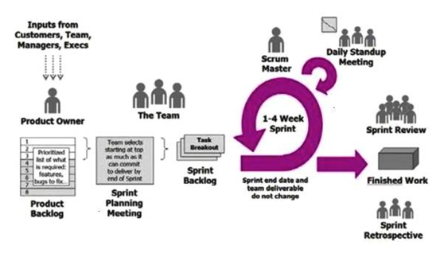
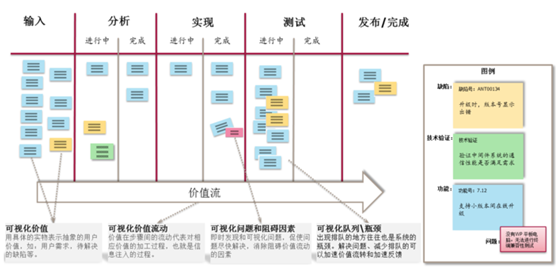
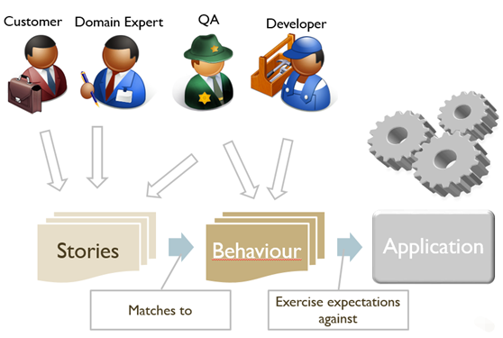

| 序号 | 修改时间  | 修改内容                                                   | 修改人 | 审稿人 |
| ---- | ---------- | ---------------------------------------------------------- | ------ | ------ |
| 1    | 2020-1-4  | 创建。从《IT管理》迁移相关章节成文。                                                       | Keefe |        |
| 2 | 2021-5-28 | 将《软件过程方法》更名为《敏捷开发》 | 同上 | |

---

[TOC]

---

## 1  敏捷开发方法

敏捷开发Agile Development，以用户的需求进化为核心，采用迭代、循序渐进的方法进行软件开发。

主流的敏捷方法有：Scrum、XP和看板。

表格  Scrum和XP的差别比较表

| 差异项                                                       | Scrum          | XP                 |
| ------------------------------------------------------------ | -------------- | ------------------ |
| 迭代长度的不同                                               | 一般为 2~ 4周  | 1~2周              |
| 迭代中, 是否允许修改需求                                     | 不允许         | 需求可替换         |
| User Story是否严格按照优先级别来实现                         | 较灵活         | 是                 |
| 软件的实施过程中，  是否采用严格的工程方法，保证进度或者质量 | 开发者自觉保证 | 严格定义流程方法。 |

备注：1. XP需求替换的原则是需求实现的时间量是相等的。XP规定需要采用TDD、自动测试、结对编程、简单设计、重构等约束团队的行为。

### 1.1 Scrum

**Scrum历史**

1986年，竹内弘高和[野中郁次郎](https://baike.baidu.com/item/野中郁次郎)阐述了一种新的[整体性](https://baike.baidu.com/item/整体性)的方法 ，该方法能够提高商业新产品开发的速度和灵活性：他们将这种新的'**整体性方法与橄榄球**相比较，前者各阶段相互重叠，并且由一个跨职能团队在不同的阶段完成整个过程，而后者整个团队*"tries to go to the distance as a unit, passing the ball back and forth"*。他们对来自汽车，照片机器，计算机和打印机等产业的案例进行了研究。1991年，DeGrace和Stahl在《Wicked Problems, Righteous Solutions》一书中将这种方法称为Scrum。1995年，在奥斯汀举办的OOPSLA '95上，萨瑟兰和施瓦伯联合发表了论文首次提出了Scrum概念。施瓦伯和萨瑟兰在接下的几年里合作，将上述的文章，他们的经验，以及业界的最佳实践融合起来，形成我们现在所知的Scrum。2001年，施瓦伯与麦克·比窦（Mike Beedle）合著了《敏捷软件开发-使用Scrum过程》一书，介绍了Scrum方法。

Scrum是迭代式增量软件开发过程，通常用于敏捷软件开发。Scrum包括了一系列实践和预定义角色的过程骨架。Scrum中的主要角色包括同项目经理类似的Scrum主管角色负责维护过程和任务，产品负责人代表利益所有者，开发团队包括了所有开发人员。虽然Scrum是为管理软件开发项目而开发的，它同样可以用于运行软件维护团队，或者作为计划管理方法：*Scrum of Scrums*.

管理Scrum过程有很多实施方法，从白板上的即时贴到软件包。Scrum最大的好处是它非常容易学习，而且应用Scrum不需要太多的投入。

管理方法：每日站立会议、

#### 1.1.1 Scrum框架
*  3个角色：PO（产品负责人）、SM~Scrum Master、Team（开发团队，3~9人）
*  3个工件：Product Backlog（产品待办列表）、Sprint Backlog（迭代待办列表）、产品增量
*  5个活动：需求梳理会、计划会(2H)、每日站立（15MIN）、评审(1H)、回顾(0.5H)
*  5个原则：承诺、勇气、专注、开发和敬重。

冲刺周期：2~4周

时间粒度：US约1周，TASK约2天

**产品梳理会**：主要对整个产品的需求进行梳理，一般由客户（如果可能）、PO、团队以及相关干系人共同参与，重要的是输出之前提到的第一个工件产品待办列表（product backlog），包含对用户故事大小的估计和优先级别的设定。

**迭代计划会**：规划这个迭代的目标和具体任务安排，它标志着一个迭代的开始，团队必须按照 PO 设定的产品待办列表的优先级别，从高到低选择，如因实现上的依赖关系，要调整需求选择的顺序，也需要和PO进行确认，以确保团队始终工作在最有价值的需求上。团队选择并承诺了接下来迭代中要完成的产品待办列表中的用户需求，并且将每一个需求分解成具体的多个开发任务。这些开发任务的列表被称为迭代待办列表（sprint backlog），这就是我们之前提到的第二个工件，它是迭代计划会最重要的输出，接下来的工作，就是完成这些开发任务，交付对应的用户需求。

**每日站会**：Scrum 团队每天都会进行一次信息同步 -- Scrum 站会，会议被限定在 15 分钟之内结束，每天在同样的时间，同样的地点举行，旨在沟通同步项目开发状态，建立团队对项目的整体认识，并发现项目中的问题。会议上，每一个人都向团队回答三个问题（可以简化为昨天、今天和问题）：`我昨天做了什么？ 我今天计划做什么？ 在前进的道路上有什么障碍? `Scrum 会议结束后，要更新迭代燃尽图以反映团队的工作进度，和离迭代目标的距离。

**迭代评审会议**：一个迭代结束，团队构建了包含新的用户需求的产品增量（之前提到的第三个工件），团队在这个会议上展示过去的一个迭代构建的产品。sprint评审会议是开放的，应尽可能邀请相关人员参加，ScrumMaster、团队、PO、市场人员、客户、管理人员、维护人员、领域专家以及关联团队等。在会议上团队对照产品待办列表依次演示刚刚构建的用户需求，获取参与者的反馈，这些反馈将成为未来的产品设计和规划调整的依据，以使产品更好的满足客户的需求，更好的服务于组织的业务目标。

**迭代回顾会议**：作为迭代的最后一个会议，迭代回顾会发生在评审会议结束之后,迭代计划会议之前，其目的在于：

1）检视前一个 Sprint 中关于人、关系、过程和工具的情况如何;

2）找出并加以排序做得好的和潜在需要改进的主要方面 ；

3）制定改进 Scrum 团队工作方式的计划 ；

在迭代回顾会议结束时，Scrum 团队应该明确接下来的迭代中需要实施的改进。在下 一个迭代中实施这些改进是基于 Scrum 团队对自身的检视而做出的适当调整。虽然改进可以在任何时间执行，迭代回顾会议提供了一个专注于检视和适应的正式机会。

​         

​			图1 敏捷Scrum流程图

Step1：在**产品梳理会**中进行需求梳理，优先级排序等并输出产品待办列表

Step2：产品待办列表生成后由 Scrum Master 组织召开**迭代计划会**议，确定迭代目标即完成产品待办列表中的几项需求（一般用 User story-用户故事表示），然后进行任务分解，小组成员领取任务，形成迭代待办列表，然后就开始了迭代执行

Step3：在迭代执行的过程中，每天早上固定时间，固定地点由 Scrum master 组织召开**站立会**，同步项目信息，更新看板与燃尽图

Step4：迭代末期由 Scrum master 组织召开**迭代评审会**，邀请相关干系人参加评审，会议室需展示迭代产出（产品增量），这是一个非正式会议，可以不用正式的PPT进行讲述，但需要用最简单的Demo展示成果，根据会上反馈制定调整计划，并促进合作。

Step5：Scrum 框架中最后一个会议是**迭代回顾会**，也是由 Scrum master 组织召开的，回顾会上主要对好的与不好的经验进行回顾，也是团队自检的机会，回顾会并不是吐槽大会，切忌不能再会议上批评教育团队成员，在会议中需要明确 Scrum 团队后续改进计划，持续改善！

#### 1.1.2 通用会议规则

**基本要求**
*  每次会议都要准时开始、准时结束。
*  每次会议都采取开放形式，所有人都可以参加。

**会前准备**
*  提前邀请所有必须参会的人，让他们有时间准备。
*  发送带有会议目标和意图的会议纲要。
*  预订会议所需的全部资源：房间、投影仪、挂图、主持设备，以及此会议需要的其他东西。
*  会前24小时发送提醒。
*  准备带有会议规则的挂图。

**会议推进**
*  展开讨论时，会议的推进人必须在场。他不能参与到具体讨论中，但是他需要注意讨论进程，如果讨论参与者失去重点，他还要将讨论带回正规。
*  推进人展示会议的目标和意图。
*  有必要时，推进人可以商定由某个撰写会议记录。
*  推进人可以记录团队的意见，或是教授团队如何自己记录文档；而且推进人可能会在挂图上进行记录，将对话可视化。
*  推进人会对会议进行收尾，并进行非常简短的回顾。

**会议输出**
*  使用手写或挂图说明来记录文档，给白板和挂图上的内容拍照。
*  必须传达会议记录和大家对会议结果的明确共同认知。

**让团队坐在一起！**
*  大家都懒的动，尽量让“产品负责人”和“全功能团队”都坐在一起！
*  互相听到：所有人都可以彼此交谈，不必大声喊，不必离开座位。
*  互相看到：所有人都可以看到彼此，都能看到任务板——不用非得近到可以看清楚内容，但至少可以看到个大概。
*  隔离：如果你们整个团队突然站起来，自发形成一个激烈的设计讨论，团队外的任何人都不会被打扰到，反之亦然。

**团队建设**
*  Scrum 团队最佳人数控制在“5～9”人。
*  全职能性团队：开发组（后台开发、前端开发、测试人员——3~8人）、Scrum Master（项目经理）、产品负责人
*  兼职团队成员：美工、DBA、运维

### 1.2 XP极限编程

极限编程（Extreme Programming，简称XP）是由KentBeck在1996年提出的。适用于小团队开发。

极限编程是一个轻量级的、灵巧的软件开发方法；同时它也是一个非常严谨和周密的方法。它的基础和价值观是交流、朴素、反馈和勇气；即，任何一个软件项目都可以从四个方面入手进行改善：加强交流；从简单做起；寻求反馈；勇于实事求是。XP是一种近螺旋式的开发方法，它将复杂的开发过程分解为一个个相对比较简单的小周期；通过积极的交流、反馈以及其它一系列的方法，开发人员和客户可以非常清楚开发进度、变化、待解决的问题和潜在的困难等，并根据实际情况及时地调整开发过程。

**XP的核心是其总结的沟通（Communication）、简单（Simplicity）、反馈（Feedback）、勇气（Courage）四大价值观，它们是XP的基础，也是XP的灵魂。**

**五大原则**：
1. 快速反馈；
2. 快速反馈；
3. 逐步修改。
4. 提倡更改。
5. 优质工作。

基于敏捷的核心思想和价值目标，XP要求项目团队遵循**13个核心实践**，如下：

[团队协作](http://baike.baidu.com/view/2052141.htm)(Whole Team)

规划策略(The Planning Game)；

[结对编程](http://baike.baidu.com/view/1149561.htm)(Pair programming)

[测试驱动开发](http://baike.baidu.com/view/184088.htm)(Testing-Driven Development)

重构(Refactoring)

简单设计(Simple Design)

代码集体所有权(Collective Code Ownership)

[持续集成](http://baike.baidu.com/view/5253255.htm)(Continuous Integration)

客户测试(Customer Tests)

小型发布（Small Release）

每周40小时工作制（40-hour Week）

编码规范（Code Standards）

系统隐喻（System Metaphor）

**极限编程的4个商业实践：**
测试驱动开发—TDD是你的商业安全网。因为测试是在编码之前完成的，所以写完的测试一定会运行失败，接下来再写代码使测试可以通过。TDD保证你的产品功能，不管公司和技术团队实现的是大规模的变更还是小规模的变更。
结对编程—让2名开发人员写同一段代码，使用同一个键盘和同一台显示器。因为结对大大降低了浪费的时间和缺陷，所以能带来更高质量的代码，并带来高水平的协作。
集体代码所有制和持续集成—如果每段代码不只有一个人熟悉，那么就不会有什么交流瓶颈了。把代码持续集成到一个主干可以避免重复和不匹配的代码。
重构—在当时的情况下，写的代码是解决已知问题的。通常，团队巧妙地解决了他们的问题，然后持续重构和修改代码，确保代码库能以最为高效的方式不断满足业务最新的需要。

### 1.3  敏捷看板

看板是丰田公司发明的，它是一种可视化的管理系统，目的是对生产过程做出持续，渐进的改善。

当可视化的表达方式，遇到了敏捷开发，就衍生出了一种称为“敏捷看板”的概念。

简单看板（三列式）：TODO，DOING和DONE

 

图2 精益看板（演变式看板）

**精益七大原则**：消除浪费、增强学习、尽量延迟决策、尽快交付、授权团队、嵌入完整性、着眼整体

**看板六大实践**：可视化、限制、管理流程、制定明确规则、落实反馈循环、持续演进

**SCRUM+看板**：看板墙的设计，看板一日游

个人看板的应用：第一步为视觉化工作流程，第二步为半成品限额。

**看板方法核心实践一：可视化工作流**

1) 可视化流程：需求-设计-开发-测试

2) 可视化工作项：STORY、TASK、BUG

3) 可视化人员分工：ASSIGNED TO

4) 可视化工作项层级：EPIC(IRS) -- Feature -- User Story

5) 可视化工作项关联/依赖

**核心实践二、度量和管理流动**

**核心实践三、显式化规则**

*  DOD完成的定义
*  DoR(Definition of Ready)。

**核心实践四、约束在制品** **（WIP）**

**核心实践五、反馈闭环（每日站会、回顾）**

### 本章参考

[1].  Scrum http://baike.baidu.com/item/Scrum

[2].  Scrum 框架是何方神架？ wemedia.ifeng.com/67858813/wemedia.shtml

[3].  Scrum框架详解总结https://blog.csdn.net/iblade/article/details/80569794

[4].  敏捷开发之XP https://blog.csdn.net/fw0124/article/details/48713959

[5].  极限编程 [http://baike.baidu.com/item/%E6%9E%81%E9%99%90%E7%BC%96%E7%A8%8B](http://baike.baidu.com/item/极限编程)

[7].  精益创业[https://baike.baidu.com/item/%E7%B2%BE%E7%9B%8A%E5%88%9B%E4%B8%9A/590883](https://baike.baidu.com/item/精益创业/590883)

[8].  精益创业工具 http://startingx.com/

[9].  验证最小化可行产品(MVP)的15种方法  36kr.com/p/217020.html

## 2 敏感开发的方法论

### TDD

TDD是[**测试驱动开发**](https://baike.baidu.com/item/测试驱动开发)（Test-Driven Development）的英文简称，是[敏捷开发](https://baike.baidu.com/item/敏捷开发/5618867)中的一项核心实践和技术，也是一种设计方法论。TDD的原理是在开发功能代码之前，先编写单元测试用例代码，测试代码确定需要编写什么产品代码。TDD虽是敏捷方法的核心实践，但不只适用于XP（Extreme Programming），同样可以适用于其他开发方法和过程。

**TDD原则**

* 独立测试：不同代码的测试应该相互独立，一个类对应一个测试类（对于C代码或C++全局函数，则一个文件对应一个测试文件），一个函数对应一个测试函数。
* 测试列表：代码的功能点可能很多，并且需求可能是陆续出现的，任何阶段想添加功能时，应把相关功能点加到测试列表中，然后才能继续手头工作，避免疏漏。
* 测试驱动：即利用测试来驱动开发，是TDD的核心。要实现某个功能，要编写某个类或某个函数，应首先编写测试代码，明确这个类、这个[函数](https://baike.baidu.com/item/函数/18686609)如何使用，如何测试，然后在对其进行设计、编码。
* 先写断言：编写测试代码时，应该首先编写判断代码功能的断言语句，然后编写必要的辅助语句。
* 可测试性：产品代码设计、开发时的应尽可能提高可测试性。
* 及时重构：对结构不合理，重复等“味道”不好的代码，在测试通过后，应及时进行重构。
* 小步前进：软件开发是复杂性非常高的工作，小步前进是降低复杂性的好办法。

### BDD

Behavior Driven Development，[行为驱动开发](https://baike.baidu.com/item/行为驱动开发/9424963)是一种[敏捷软件开发](https://baike.baidu.com/item/敏捷软件开发/7108658)的技术，它鼓励软件项目中的开发者、[QA](https://baike.baidu.com/item/QA)和非技术人员或商业参与者之间的协作。BDD最初是由Dan North在2003年命名，它包括[验收测试](https://baike.baidu.com/item/验收测试/10914477)和客户测试驱动等的[极限编程](https://baike.baidu.com/item/极限编程/4690591)的实践，作为对[测试驱动开发](https://baike.baidu.com/item/测试驱动开发/3328831)的回应。在过去数年里，它得到了很大的发展。

​     BDD的通用语言是一种近乎自然语言的描述软件的形式。传统的开发模式中，客户很难从技术层面理解问题，开发人员很难从业务需求考虑问题，基于这种通用语言形式可以尽可能的避免客户和开发者在沟通上的障碍，实现客户和开发者同时定义系统的需求。避免了因为理解需求不充分而带来的不必必要的工作量。

　　BDD描述的行为就像一个个的故事(Story)，系统业务专家、开发者、测试人员一起合作，分析软件的需求，然后将这些需求写成一个个的故事。开发者负责填充这些故事的内容，测试者负责检验这些故事的结果。通常，会使用一个故事的模板来对故事进行描述。

 

图3 BDD测试流程

### 本章参考

[1]. TDD https://baike.baidu.com/item/TDD/9064369

[2]. [开发人员看测试之TDD和BDD](https://www.cnblogs.com/Leo_wl/p/4780678.html#_label0) https://www.cnblogs.com/Leo_wl/p/4780678.html

[3]. [BDD in Python]使用behave框架在Python中实践行为驱动开发 https://cloud.tencent.com/developer/article/1157391

## 参考资料

* 比较TFS与SVN，你必须知道的10点区别 [www.cnblogs.com/danzhang/p/5707116.html](http://www.cnblogs.com/danzhang/p/5707116.html)

