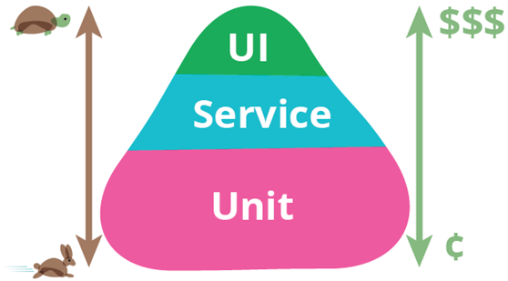

| 序号 | 修改时间   | 修改内容                                                   | 修改人 | 审稿人 |
| ---- | ---------- | ---------------------------------------------------------- | ------ | ------ |
| 1    | 2020-1-1  | 创建。从《IT管理》拆分成文。                                                       | Keefe |        |
---


```SH
目录
1 测试概述	2
2 测试金字塔	3
2.1 UI测试	4
2.2 API接口测试	4
2.3 Unit测试	5
3 测试类别	5
3.1 自动化测试	5
3.2 安全测试	5
3.3 移动APP测试	6
3.4 MOCK	6
3.5 A/B测试（灰度发布）	7
4 测试工具	8
本章参考	8
```


## 1  测试概述

从软件测试的实践过程看：单元测试、集成测试、确认测试、系统测试、验收测试……

从软件测试的方法策略看：白盒测试、黑盒测试、灰盒测试……

从软件测试的测试视角看：功能测试、性能测试、兼容性测试、安全测试、探索性测试……

从软件测试的技术程度看：手工测试、自动化测试、测试开发……

 

表格 9 各种测试手段比较

| 测试名称                    | 测试方法                                                     | 测试工具                  | 测试指标                                                     |
| --------------------------- | ------------------------------------------------------------ | ------------------------- | ------------------------------------------------------------ |
| 性能测试Performance Testing | 目的不是去找系统Bugs，而是排除系统的性能瓶颈，并为回归测试建立一个基准。 | WEB：ab, siege            | CPU、内存、磁盘IO、平均响应时间、最大并发数                  |
| 压力测试StressTesting       | 通过模拟实际应用的软硬件环境及用户使用过程的系统负荷，长时间或超大负荷地运行测试软件，来测试被测系统的性能、可靠性、稳定性等。   压力测试需要确定一个系统的瓶颈或者不能接收的性能点，来获得系统能提供的最大的服务级别。通俗地讲，压力测试是为了发现在什么条件下您的应用程序的性能会变得不可接受。 | LoadRunner，Apache JMeter | 服务器CPU/MEM达到瓶颈时（>70%）的服务并发数、响应时间。      |
| 负载测试   Load Testing     | 定义为给被测系统加上它所能操作的最大任务数的过程，负载测试有时也会被称为“容量测试”或者“耐久性测试/持久性测试”，其目标是确定并确保系统在超出最大预期工作量的情况下仍能正常运行。 |                           | 对于WEB应用来讲，负载则是并发用户或者HTTP连接的数量。        |
| SIT集成测试                 | 也叫组装测试或联合测试。在单元测试的基础上，将所有模块按照设计要求组装成为子系统或系统，进行集成测试。 | 开发联调                  |                                                              |
| UAT验证测试                 | User Acceptance Test，UAT。也叫用户可接受测试，一般在项目流程的最后阶段，这时相关的产品经理、业务人员、用户或测试人员根据测试计划和结果对系统进行测试和验收，来决定是否接收系统。它是一项确定产品是否能够满足合同或用户所规定需求的测试。 | 业务人工测试              | 业务逻辑                                                     |
| UI测试                      | 测试代码的函数块级功能。                                     | selunium、appium、robot   |                                                              |
| API接口测试                 | 实际上意义就是UI界面到数据库之间，数据流经过的所有过程。     | postman、   SoapUI        |                                                              |
| 单元测试 Unit Testing       | 关注某一个函数，模块的正确性，一般需要开发人员编写相关的测试代码来进行自动化测试。可以使用相应的TDD框架。 | unittest   （各种语言版） | 覆盖率按评测标准分为3个阶段：指令覆盖率CO，分支覆盖率C1，条件覆盖率C2. |
| 回归测试                    | 旨在检验软件原有功能在修改后是否保持完整。回归测试主要是以检查退化为目的的测试。 |                           | 开发人员视角的单元测试、用户视角出发的集成测试和用户验收测试的测试用例集是回归测试的相关内容。 |
| 冒烟测试                    | smoke。部分测试集，用来快速验证功能。                        |                           |                                                              |
| A/B测试                     | 也叫对照实验、随机实验。先验的预测型结论。一种灰度发布方式。 |                           | 部分测试新方案，寻找更优方案。                               |

备注：1.性能/负载/压力三种测试的目的截然不同，但其测试操作的环节都是基本一致的，因此一次测试过程中完全可以包含性能测试、负载测试、压力测试三个方面的内容，所使用的测试工具往往大同小异。

2.灰度发布是指在黑与白之间,能够平滑过渡的一种发布方式。AB test就是一种灰度发布方式。

 


 

## 2   测试金字塔

 

图 5 测试金字塔（Test Pyramid）

备注：Unit -> Service(API) -> UI. 测试金字塔概念由[Mike Cohn](http://www.mountaingoatsoftware.com/)提出，并在其著作[《Succeeding with Agile》](http://www.amazon.com/gp/product/0321579364?ie=UTF8&tag=martinfowlerc-20&linkCode=as2&camp=1789&creative=9325&creativeASIN=0321579364)中做了详细论述。其核心观点是底层单元测试应多于依赖GUI的高层端到端测试。

表格 10 测试金字塔的测试项内容和目的


| 测试          | 简介                                                         | 目的                                                         | 手段                                                         | 工具            |
| ------------- | ------------------------------------------------------------ | ------------------------------------------------------------ | ------------------------------------------------------------ | --------------- |
| UI            | 用户界面层。缺点：脆弱、编写成本高，而且运行耗时。           | 直接面向业务，基于UI的端到端测试。                           | 用自动化测试工具（如Robot，提供录制和回放功能）在用户界面上操控应用程序，并验证应用程序返回了同样的结果。  少量的场景测试。 | Robot/Selunium  |
| Service/  API | 面向应用程序服务层的中间层测试（皮下测试）。在WEB应用程序中，相当于API测试。 | 既保持了端到端测试的诸多优势，又避免了许多与UI框架相关的复杂性。 | 单独的服务范围。所有的外部合作者都被打桩或者mock。           | postman、swggle |
| Unit          | 面向开发人员，更容易捕捉缺陷，定位问题。特别是重构时，易定位问题。 | 快速扫描，定位问题。                                         | 通常只测试一个函数或方法。                                   | xUnit           |

备注：1. API/Unit测试中，可通过mock或打桩方式模拟内外部依赖。
2. 测试金字塔从顶到底，测试范围慢慢缩小，但隔离更好，运行更快。

### 2.1 UI测试

 

### 2.2 API接口测试

主要包含三种测试：

* Web接口测试，
* 应用程序接口（API, application programming interface）测试，
* 数据库测试。

实际上意义就是UI界面到数据库之间，数据流经过的所有过程。

 

### 2.3 Unit测试

参考 本人另作  《测试框架分析》

 

**Unit测试要点**

1 剔除环境依赖

1）请求/响应 VIEW

2）全局请求对象。

3）数据库

 

### 本章参考

[1]:  http://zyzhang.github.io/blog/2013/04/28/test-pyramid/  "测试金字塔（Test Pyramid）"
[2]:  https://blog.csdn.net/toafu/article/details/82993630  "测试金字塔实战 "
[3]:  https://blog.csdn.net/lintyleo/article/details/81269471#comments  "一分钟了解自动化测试"
[4]:   https://blog.csdn.net/lintyleo/article/details/79360730  "接口测试 | 接口测试入门"


## 3  测试类别

### 3.1 自动化测试

自动化测试覆盖了从 UI （功能测试）到契约（接口测试）以及底层代码方法（单元测试）的整个过程，要想很好的掌握自动化测试，那么的确需要以下三种领域的经验积累：
*  编程语言，面向对象编程优先，因为大量的开源技术方案，都是基于面向对象的编程方式
* 第三方测试工具和测试框架，这些主要通过官网的文档学习
* 测试的理念与设计，工具和语言，只是测试的手段，如何准备测试数据，如何设置测试的检查点与测试步骤，这些决定了测试的成败。

 

### 3.2 安全测试

 

### 3.3 移动APP测试

app


### 3.4 性能测试

**性能压测**是通过自动化的测试工具模拟多种正常、峰值以及异常负载条件来对系统的各项性能指标进行测试。

​     从测试目的上性能压测又可以划分为负载测试、压力测试、并发测试、配置测试以及可靠性测试。

* 负载测试：测试当负载逐渐增加时，系统各项性能指标的变化情况。

* 压力测试：通过确定一个系统的瓶颈或者不能接受的性能点，来获得系统能提供的最大服务级别的测试。

* 并发测试：通过模拟用户并发访问，测试多用户并发访问同一个软件、同一个模块或者数据记录时是否存在死锁等性能问题。

* 配置测试：通过对被测系统的软/硬件环境的调整，了解各种不同方法对软件系统的性能影响的程度，从而找到系统各项资源的最优分配原则。

* 可靠性测试：在给系统加载一定业务压力的情况下，使系统运行一段时间，以此检测系统是否稳定。

总的来说，性能压测是在对系统性能有一定程度了解的前提下，在确定的环境下针对压测需求进行的一种测试。 


### MOCK

**1、什么情况下会使用mock技术**

　　（1）需要将当前被测单元和其依赖模块独立开来，构造一个独立的[测试](http://www.51testing.com/html/05/n-804105.html)环境，不关注被测单元的依赖对象，只关注被测单元的功能逻辑

　　比如被测代码中需要依赖第三方接口返回值进行逻辑处理，可能因为网络或者[其他](http://www.51testing.com/html/05/n-804105.html)环境因素，调用第三方经常会中断或者失败，无法对被测单元进行[测试](http://lib.csdn.net/base/softwaretest)，这个时候就可以使用mock技术来将被测单元和依赖模块独立开来，使得测试可以进行下去。

　　（2）被测单元依赖的模块尚未开发完成，而被测单元需要依赖模块的返回值进行后续处理

　　比如service层的代码中，包含对Dao层的调用，但是，DAO层代码尚未实现

　　（3）被测单元依赖的对象较难[模拟](https://www.baidu.com/s?wd=模拟&tn=24004469_oem_dg&rsv_dl=gh_pl_sl_csd)或者构造比较复杂

　　比如，[支付宝](https://www.baidu.com/s?wd=支付宝&tn=24004469_oem_dg&rsv_dl=gh_pl_sl_csd)支付的异常条件有很多，但是模拟这种异常条件很复杂或者无法模拟，比如，查询[聚划算](https://www.baidu.com/s?wd=聚划算&tn=24004469_oem_dg&rsv_dl=gh_pl_sl_csd)的订单结果，无法在测试环境进行模拟

　　

**2、Mock技术分类**

　　（1）手动构造mock对象

　　比如，可以自己写某个接口方法的实现，根据需要编写返回值，测试代码中使用该实现类对象

　　缺点：会增加代码量，在写mock对象代码时，有可能引入错误

　　（2）使用开源代码提供的构造mock方法

　　比如easyMock，提供了对接口类的模拟，能够通过录制、回放、检查三步来完成大体的测试过程，可以验证方法的调用种类、次数、顺序，可以令Mock对象返回指定的值或抛出指定异常

 

### A/B测试（灰度发布）

灰度发布（又名金丝雀发布）是指在黑与白之间，能够平滑过渡的一种发布方式。在其上可以进行A/B testing，即让一部分用户继续用产品特性A，一部分用户开始用产品特性B，如果用户对B没有什么反对意见，那么逐步扩大范围，把所有用户都迁移到B上面来。灰度发布可以保证整体系统的稳定，在初始灰度的时候就可以发现、调整问题，以保证其影响度。

 

**作用**

及早获得用户的意见反馈，完善产品功能，提升产品质量 让用户参与产品测试，加强与用户互动 降低产品升级所影响的用户范围

**步骤**

1）定义目标

2）选定策略：包括用户规模、发布频率、功能覆盖度、回滚策略、运营策略、新旧系统部署策略等

3）筛选用户：包括用户特征、用户数量、用户常用功能、用户范围等

4）部署系统：部署新系统、部署用户行为分析系统（web analytics）、设定分流规则、运营数据分析、分流规则微调

5）发布总结：用户行为分析报告、用户问卷调查、社会化媒体意见收集、形成产品功能改进列表

6）产品完善

7）新一轮灰度发布或完整发布

**测试方法**

灰度发布与互联网公司常用A/B测试似乎比较类似，老外似乎并没有所谓的灰度发布的概念。按照wikipedia中对A/B测试的定义，A/B测试又叫：A/B/N Testing、Multivariate Testing，因此本质上灰度测试可以算作A/B测试的一种特例。只不过为了术语上不至于等同搞混淆，谈谈自己理解的两者的差异。

灰度发布是对某一产品的发布逐步扩大使用群体范围，也叫灰度放量。

A/B测试重点是在几种方案中选择最优方案。


### 本章参考


## 4  测试工具

详见 [自动化测试工具](自动化测试工具.md)


## 参考资料

**参考文章**

[1]:  《Succeeding with Agile: Software Development Using Scrum》，中文版《Scrum敏捷软件开发》

[2]:  [10大主流压力测试工具推荐](https://www.cnblogs.com/xd502djj/p/8024336.html) http://blog.csdn.net/moonpure/article/details/72674374

 

**相关文档**

* 《测试框架分析.docx》
* 《python开发》python单元测试工具章节