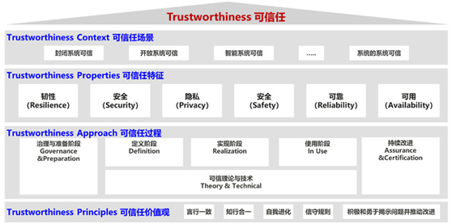

| 序号  | 修改时间     | 修改内容 | 修改人   | 审稿人 |
| --- | -------- | ---- | ----- | --- |
| 1   | 2020-5-3 | 创建。  | Keefe |     |
|     |          |      |       |     |

   

---

[TOC]

 

---

# 软件工程可信简介

软件工程可信可分为

* 过程可信
* 结果可信
* 方法可信

图  华为可信任框架Huawei Trustworthiness Framework (2020)

关键内容包括：

**安全性（Security）**：产品有良好的抗攻击能力，保护业务和数据的机密性、完整性和可用性。

**韧性（Resilience）**：系统受攻击时保持有定义的运行状态，包括降级，以及遭遇攻击时快速恢复的能力。

**隐私性（Privacy）**：遵从隐私保护既是法律法规的要求，也是价值观的体现。用户应该能够适当地控制他们的数据的使用方式。信息的使用政策应该是对用户透明的。用户应该根据自己的需要来控制何时接收以及是否接收信息。用户的隐私数据要有完善的保护能力和机制。

**可靠性和可用性（Reliability& Availability）**：产品能在生命周期内长期保障业务无故障运行，具备快速恢复和自我管理的能力，提供可预期的、一致的服务。

 

# 软件过程可信

 

# 参考资料

**参考网站**

* 信创中国 http://www.xc-cn.cn/

**参考链接**

[1]:   https://zhuanlan.zhihu.com/p/259300901?utm_source=wechat_session  "知乎-什么是信创？"

[2]:   https://www.sohu.com/a/286402333_258858  "任正非致员工信公布：全面提升软件工程能力和实践 "
