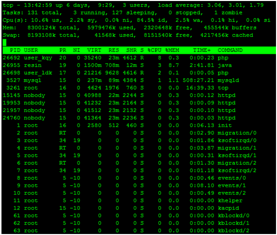
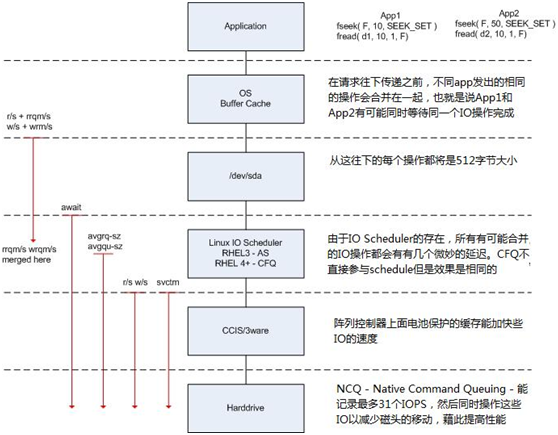
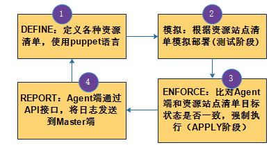
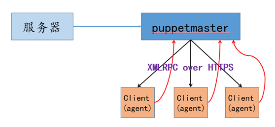
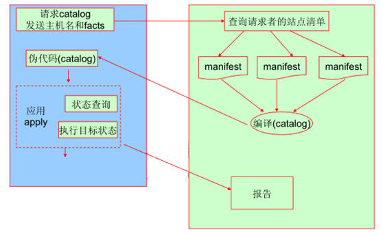

| 序号  | 修改时间       | 修改内容                                       | 修改人   | 审稿人   |
| --- | ---------- | ------------------------------------------ | ----- | ----- |
| 1   | 2016-10-21 | 创建                                         | Keefe | Keefe |
| 2   | 2016-12-22 | 增加WEB信息管理章节                                | 同上    |       |
| 3   | 2018-3-28  | 重新组织目录结构，将运维内容单独成文。<br>补充docker/jenkins章节。 | 同上    |       |
| 4   | 2018-5-24  | 将网站整体优化章节迁移到《网站架构设计和开发》                    | 同上    |       |
| 5   | 2019-4-1   | 更新容器部署章节                                   | 同上    |       |

<br>
<br>

<br>

---

# 目录

[TOC]

目录

[目录... 1](#_Toc19744423)

[1   运维概述... 3](#_Toc19744424)

[2   运维技术篇... 3](#_Toc19744425)

[2.1   运维技术方向... 3](#_Toc19744426)

[2.2   硬件基础... 4](#_Toc19744427)

[2.2.1    CPU架构... 4](#_Toc19744428)

[2.2.2    存储介质... 4](#_Toc19744429)

[2.3   系统监控... 7](#_Toc19744430)

[2.3.1    监控指标... 7](#_Toc19744431)

[2.3.2    Linux环境监控IO性能... 7](#_Toc19744432)

[2.4   性能 Performance. 9](#_Toc19744433)

[2.4.1    性能指标... 9](#_Toc19744434)

[2.4.2    类unix系统性能监控命令... 11](#_Toc19744435)

[2.4.3    在线服务故障排查... 13](#_Toc19744436)

[2.4.4    性能压测工具... 14](#_Toc19744437)

[2.4.5    本节参考... 15](#_Toc19744438)

[2.5   高可用性HA. 16](#_Toc19744439)

[2.5.1    SLA协议... 16](#_Toc19744440)

[2.5.2    keepalive实现高可用... 17](#_Toc19744441)

[2.6   CICD持续集成-持续部署... 20](#_Toc19744442)

[2.7   服务集群管理... 20](#_Toc19744443)

[2.8   网站整体优化... 21](#_Toc19744444)

[2.9   本章参考... 21](#_Toc19744445)

[3   运维工具篇... 21](#_Toc19744446)

[3.1   运维工具列表... 21](#_Toc19744447)

[3.2   常用工具与镜像... 23](#_Toc19744448)

[3.2.1    VirtualBox. 23](#_Toc19744449)

[3.2.2    Vagrant. 23](#_Toc19744450)

[3.2.3    容器docker. 26](#_Toc19744451)

[3.2.4    容器编排 K8S. 26](#_Toc19744452)

[3.3   持续集成CI工具：Jenkins. 26](#_Toc19744453)

[3.3.1    安装篇... 26](#_Toc19744454)

[3.3.2    本节参考... 27](#_Toc19744455)

[3.4   Devops工具：TFS. 27](#_Toc19744456)

[3.5   自动化运维工具... 28](#_Toc19744457)

[3.5.1    Ansible. 29](#_Toc19744458)

[3.5.2    Puppet. 29](#_Toc19744459)

[3.5.3    Saltstack. 31](#_Toc19744460)

[3.5.4    fabric. 31](#_Toc19744461)

[3.5.5    本章参考... 32](#_Toc19744462)

[3.6   运维工具选型... 32](#_Toc19744463)

[3.7   本章参考... 32](#_Toc19744464)

[4   Hadoop集群运维... 32](#_Toc19744465)

[5   参考资料... 32](#_Toc19744466)

[5.1   参考书目... 32](#_Toc19744467)

[5.2   参考链接... 33](#_Toc19744468)

[5.3   运维相关的国际会议... 33](#_Toc19744469)

**表目录**

[表格 1 存储介质对比__ 4](#_Toc19744470)

[表格 2 知名服务系统吞吐量列表__ 10](#_Toc19744471)

[表格 3 性能压测工具简介__ 14](#_Toc19744472)

[表格 4 性能压测工具比较__ 15](#_Toc19744473)

[表格 5 每日构建与发布流程列表__ 20](#_Toc19744474)

[表格 6运维项及运维工具列表__ 21](#_Toc19744475)

[表格 7 轻量级运维（系统工具）列表__ 22](#_Toc19744476)

[表格 8 轻量级运维（系统工具）详述__ 22](#_Toc19744477)

[表格 9 常用工具镜像源__ 23](#_Toc19744478)

[表格 11 自动化运维工具比较列表__ 28](#_Toc19744479)

<br>

<br>

---

# 1  运维概述

运维发展史

人工阶段 -- 工具和自动化阶段 -- 平台化 -- AIOPs（智能运维2016~）

**运维**：运行维护，Operation and maintenance，服务要正常运转。

**运营**：Operation，服务要运转好。

**SRE**：Site Reliability Engineer (网站可靠性工程师)。起源于google，在国内他们被称为运维工程师(OPS,operations)，直接掌管着互联网公司的机器和服务，保证网站不宕机是他们的使命。

​    运维，这里指互联网运维，通常属于技术部门，与[研发](https://baike.baidu.com/item/研发)、[测试](https://baike.baidu.com/item/测试/112688)、[系统管理](https://baike.baidu.com/item/系统管理)同为互联网产品技术支撑的4大部门，这个划分在国内和国外以及大小公司间都会多少有一些不同。

​    一个互联网产品的生成一般经历的过程是：产品经理、需求分析、研发部门开发、测试部门测试、运维部门部署发布以及长期的运行维护。运维的职责覆盖了产品从设计到发布、运行维护、变更升级及至下线的生命周期。

**业务运维工程师的日常工作包括：**

* 监控线上的服务质量
* 响应异常/处理突发故障
* 在线发布/升级产品
* 和相应产品线的研发和测试协调处理产品问题
* 基于工作中的问题和数据分析进行抽取，将运维经验理念落地沉淀为方法论/工具/系统/平台，并制定相关的改进计划，在各个技术方向上落地实现，最终反馈回运维工作中，提高运维本身的效率和产品的价值。

<br>

<br>

# 2  运维技术篇

## 2.1 运维技术方向

产品的整个生命周期里运维的职责重要而广泛，但运维工程师们的职责不仅限于这部分工作，还需要总结工作中遇到的问题，抽取出相关的技术方向、研发相关的工具和平台以支持/优化业务的发展并提高运维的效率，相关技术工作主要包括：

* 服务监控技术：包括监控平台的研发、应用，服务监控准确性、实时性、全面性的保障
* 服务故障管理：包括服务的故障预案设计，预案的自动化执行，故障的总结并反馈到产品/系统的设计层面进行优化以提高产品的稳定性
* 服务容量管理：测量服务的容量，规划服务的机房建设，扩容、迁移等工作
* 服务性能优化：从各个方向，包括网络优化、操作系统优化、应用优化、客户端优化等，提高服务的性能和响应速度，改善用户体验
* 服务全局流量调度：接入服务的流量，根据容量和服务状态在各个机房间分配流量
* 服务任务调度：服务的各种定时/非定时任务的调度触发及状态监控
* 服务安全保障：包括服务的访问安全、防攻击、权限控制等
* 数据传输技术：包括p2p等各类传输技术的研发应用，也远距离大数据传输等问题的解决
* 服务自动发布部署：部署平台/工具的研发，及平台/工具的使用，做到安全、高效的发布服务
* 服务集群管理：包括服务的服务器管理、大规模集群管理等
* 服务成本优化：尽可能降低服务运行使用的资源，降低服务运行成本
* 数据库管理（DBA）：通过设计、开发和管理高性能数据库集群，使数据库服务更稳定、更高效、更易于管理。
* 平台化的开发：类docker和google borg平台的开发管理，及服务接入技术
* 分布式存储平台的开发优化：类google gfs等分布式存储平台的研发及服务接入

## 2.2 硬件基础

### 2.2.1 芯片计算架构

目前主流计算架构主要有 X86、ARM、GPU、FPGA、ASIC，各种架构在不同场景各有优势。未来由 X86、ARM、GPU、FPGA、ASIC 构成的异构计算有望提供系统级的摩尔定律重新驱动算力快速增长。

* X86 适用于高性能高功耗的通用计算场景；
* ARM 适用于对功耗较为敏感的通用性计算场景；
* GPU 图形处理器。在图像处理、深度学习机器学习等领域应用较为广泛；
* [FPGA](https://baike.baidu.com/item/FPGA)：（Field Programmable Gate Array，现场可编程逻辑门阵列）是在PAL、GAL等可编程器件的基础上进一步发展的产物。采用门阵列架构具有低时延可编程的优势，除传统图像处理、信号采集、通信、航空航天等领域外目前也逐渐在 AI 领域得到应用；
* [ASIC](https://baike.baidu.com/item/ASIC/2014676)：（Application Specific Integrated Circuit，专用集成电路）。高度定制，主要应用于大型专用场景（挖矿），前期投资成本高但一旦稳定使用，每单位的成本最优。
* SOC：系统级芯片，高集成度。如Apple M1。

表格 主流计算架构对比

|         | x86            | ARM            | GPU                           | FPGA               | ASIC   |
| ------- | -------------- | -------------- | ----------------------------- | ------------------ | ------ |
| 代表厂商    | 英特尔、AMD        | 华为、高通、AWS、飞腾等  | [英伟达](https://www.nvidia.cn/) | Xlinx、英特尔          | 谷歌     |
| 架构      | 重核             | 多核             | 众核                            | 门阵列                | ASIC芯片 |
| <br/>性能 | 高性能高功耗         | 均衡性能功耗比        | 浮点运算强                         | 低时延可编程             | 功耗&时延低 |
| 通用性     | 强              | 强              | 较强                            | 较强                 | 高度定制   |
| 生态      | 丰富             | 丰富             | 较丰富                           | 较差                 | 高度定制   |
| 开放性     | 封闭             | 开放平台           | 封闭                            | 封闭                 | 封闭     |
| 适用场景    | 对功耗不敏感的通用性计算场景 | 对功耗较敏感的通用性计算场景 | 图像处理、深度学习、机器学习                | 图像处理、信号采集、通信、航空航天等 | 具体专门应用 |

> 备注：CPU的计算架构有二种，分别是x86和ARM。GPU/FPGA/ASIC是现在流行的AI芯片。AI芯片详见 《AI笔记》AI芯片章节
> 
> 开源软件版本：常提供二种版本分别是386和arm64，此处版本差别在于CPU位数，386是指32机器，arm64是指64位机器。事实上2010年后市面上新机器都是64位的，无论是x86还是ARM架构。

通常CPU架构

* SMP：Symmetric Multi-Processing，对称多处理。共享所有资源（CPU/内存/IO）。
* NUMA：NoN-Uniform Memory Access，非一致存储访问。不共享资源。

**计算架构示例**

1. **CPU**

```shell
# Intel cpu x86_64
$ cat /proc/cpuinfo
processor       : 0
vendor_id       : GenuineIntel
cpu family      : 6
model           : 79
model name      : Intel(R) Xeon(R) CPU E5-2682 v4 @ 2.50GHz
stepping        : 1
microcode       : 0x1
cpu MHz         : 2494.222
cache size      : 40960 KB
physical id     : 0
siblings        : 1
core id         : 0
cpu cores       : 1
apicid          : 0
initial apicid  : 0
fpu             : yes
fpu_exception   : yes
cpuid level     : 20
wp              : yes
flags           : fpu vme de pse tsc msr pae mce cx8 apic sep mtrr pge mca cmov pat pse36 clflush mmx fxsr sse sse2 ss ht syscall nx pdpe1gb rdtscp lm constant_tsc rep_good nopl nonstop_tsc cpuid tsc_known_freq pni pclmulqdq ssse3 fma cx16 pcid sse4_1 sse4_2 x2apic movbe popcnt tsc_deadline_timer aes xsave avx f16c rdrand hypervisor lahf_lm abm 3dnowprefetch invpcid_single pti ibrs ibpb stibp fsgsbase tsc_adjust bmi1 hle avx2 smep bmi2 erms invpcid rtm rdseed adx smap xsaveopt arat
bugs            : cpu_meltdown spectre_v1 spectre_v2 spec_store_bypass l1tf mds swapgs taa itlb_multihit
bogomips        : 4988.44
clflush size    : 64
cache_alignment : 64
address sizes   : 46 bits physical, 48 bits virtual
power management:

# kunpeng cpu aarch64
$ cat /proc/cpuinfo
processor       : 0
BogoMIPS        : 200.00
Features        : fp asimd evtstrm aes pmull sha1 sha2 crc32 atomics fphp asimdhp cpuid asimdrdm jscvt fcma dcpop asimddp asimdfhm
CPU implementer : 0x48
CPU architecture: 8
CPU variant     : 0x1
CPU part        : 0xd01
CPU revision    : 0
```

2. **GPU**

```shell
# gpu
# lspci查看PCI设备
$ lspci | grep -i 'NVIDIA'
02:00.0 3D controller: NVIDIA Corporation TU104GL [Tesla T4] (rev a1)

# nvida-smi 命令查看nvidia显卡GPU使用情况
```

<br>

### 2.2.2 存储介质

IO总线：南北桥

存储系统的瓶颈一般在IO。

**IOPS**（Input/Output Operations Per Second）是一个用于计算机存储设备（如硬盘（HDD）、固态硬盘（SSD）或存储区域网络（SAN））性能测试的量测方式，可以视为是每秒的读写次数。

表格 1 存储介质对比

| 类别      | IOPS  | 每GB价格（元） | 容量       | 随机读取 | 随机写入   |
| ------- | ----- | -------- | -------- | ---- | ------ |
| 内存      | 千万级   | 150      | 1G~16G   | 友好   | 友好     |
| SSD（闪存） | 35000 | 20       |          | 友好   | 写入放大问题 |
| SAS磁盘   | 180   | 3        |          | 磁盘寻道 | 磁盘寻道   |
| SATA磁盘  | 90    | 0.3      | 0.5T~8TB | 磁盘寻道 | 磁盘寻道   |

备注：早期存储介质的价格差异巨大，所以多级缓存使用了不同介质。随着SSD的降价，多级缓存也可以使用SSD介质。

#### 磁盘IO性能评估

表格  一些典型磁盘的性能数据

| Disk Model                                                 | 形式                                      | Size(GB) | 平均访问时间(ms) | RPM   | 网络传输率(MB/s) | Random IOPS | 接口            |
| ---------------------------------------------------------- | --------------------------------------- | -------- | ---------- | ----- | ----------- | ----------- | ------------- |
| IBM Ultrastar 36ZX                                         | 硬盘                                      | 36       | 5.4        | 10000 | 15-29       | 119         | Ultra160      |
| Quantum Atlas V                                            | 硬盘                                      | 36.7     | 6.3        | 10000 | 17-29       | 107.5       | Ultra160      |
| Seagate Cheetah X15                                        | 硬盘                                      | 18.4     | 3.9        | 15000 | 38-47       | 169.5       | FC-AL         |
| Seagate Cheetah 73                                         | 硬盘                                      | 73.4     | 5.6        | 10000 | 26-40       | 116         | Ultra160      |
| 英特尔Intel X25-M G2（[MLC](https://baike.baidu.com/item/MLC)） | [SSD](https://baike.baidu.com/item/SSD) |          |            |       | ~2GB/s      | ~8,600      | SATA 3 Gbit/s |

说明：磁盘由扇区，柱区组成，每扇区大小为512Byte.

磁盘参数组成：平均寻址时间ms，RPM转速（Revolutions/Rotational Per minute，每分钟转速），IOPS每秒的IO数，传输率MB/S.

`一次IO时间 = 寻址时间(Seek Time) + 旋转延时(Rotational Delay=60/RPM) + 传送时间(TransferTime=IOChunkSize/Transfer Rate)`

这3个参数，分别对应于磁盘的平均寻址时间、盘片旋转速度以及最大传送速度.

* IOPS主要取决于SeekTime（寻址时间）、RPM。与IO ChunkSize（一般是10K）反比，TransferRate正比。
* MB/s：最大传输速度，在顺序访问时，非常接近 IOPS*IO ChunkSize.  常见IOPS 120次，IO ChunkSize 10K，那么实际传输率=`120*10K*8=9.6MB/s`

于是公式：
$$
IOTime=SeekTime + 60/RPM + TransferTime
$$

$$
IOPS  = 1/IOTime
$$

**概念：**

- 随机读写：在随机读写中，每次IO操作的寻址时间和旋转延时不能忽略不计。
- 顺序读写：每次IO操作的寻址时间和旋转延时几乎可忽略。

**磁盘IO性能的四个关键指标：**

* IO Chunk Size：单个IO的大小，数据库存储有个基本的块大小(Block Size)，磁盘页也为一个IO块，缺省为4K。但IO Chunk Size与IO Block Size并没关系。每次IO操作的大小是不固定的，系统会根据需要合并IO次数，集中读写，以提高性能。
* IOPS(IO per Second)：IO系统每秒所执行IO操作的次数。
* 传输速度(Transfer Rate)/ 吞吐率(Throughput)：同传输速度/传输率。磁盘在实际使用的时候从磁盘系统总线上流过的数据量。=IOPS * IO ChunkSize。 随机访问时取决于IOPS，顺序访问时取决于磁盘的最大传输速度。
* IO响应时间(IO Response Time)：IO响应时间也叫IO延时，就是从操作系统内核发出的一个读或者写的IO命令到操作系统内核接收到IO回应的时间。包括了IO在系统中等待时间。

**计算1：计算IOPS**

假设磁盘的转速(Rotational Speed)为15K RPM，平均寻道时间为5ms，最大传输速率为40MB/s, IO chunksize 4K.（这里将读写速度视为一样，实际会差别比较大）。

公式：IO Time = Seek Time + 60 sec/Rotational Speed/2 + IO ChunkSize/Transfer Rate

IOPS = 1/IO Time = 1/(5ms + 60s/15K/2 + 4K/40MB) = 1/(5ms+2ms+0.1ms) = 1/7.1*1000=143

注：**顺序访问**时，寻址时间和旋转延时几乎可忽略，只余下传送时间，这时的IPOS相对于**随机访问**时差别极大。

**计算2：计算磁盘的实际传输速度**

实际上传输速度和IOPS是没有直接关系，在没有缓存的情况下它们共同的决定因素都是对磁盘系统的访问方式以及单个IO的大小。对磁盘进行随机访问时候我们可以利用IOPS来衡量一个磁盘系统的性能，此时的传输速度不会太大；但是当对磁盘进行连续访问时，此时的IOPS已经没有了参考的价值，这个时候限制实际传输速度却是磁盘的最大传输速度。

因此在实际的应用当中，只会用<u>IOPS</u>来衡量小IO的随机读写的性能，而当要衡量大IO连续读写的性能的时候就要采用<u>传输速度</u>而不能是IOPS了。

#### 缓存对磁盘IO性能的影响

与IO性能直接相关的几个缓存分别是文件系统缓存 (File System Cache)、磁盘控制器缓存(Disk Controller Cache)和磁盘缓存(Disk Cache,也称为Disk Buffer)。

计算一个磁盘系统性能的时候文件系统缓存也是不会考虑在内的，因此我们重点考察的就是磁盘控制器缓存和磁盘缓存。

缓存作用主要是分为三部分：缓存数据、预读(Read-ahead)和回写(Write-back)。

**缓存数据**

首先是系统读取过的数据会被缓存在高速缓存中，这样下次再次需要读取相同的数据的时候就不用在访问磁盘，直接从缓存中取数据就可以了。当然使用过的数据也不可能在缓存中永久保留的，缓存的数据一般那是采取 [LRU算法](http://en.wikipedia.org/wiki/Cache_algorithms#Least_Recently_Used)来进行管理，目的是将长时间不用的数据清除出缓存，那些经常被访问的却能一直保留在缓存中，直到缓存被清空。

**预读**

预读是指采用预读算法在没有系统的IO请求的时候事先将数据从磁盘中读入到缓存中，然后在系统发出读IO请求的时候，就会实现去检查看看缓存里面 是否存在要读取的数据，如果存在（即命中）的话就直接将结果返回，这时候的磁盘不再需要寻址、旋转等待、读取数据这一序列的操作了，这样是能节省很多时间 的；如果没有命中则再发出真正的读取磁盘的命令去取所需要的数据。

缓存的命中率跟缓存的大小有很大的关系，理论上是缓存越大的话，所能缓存的数据也就越多，这样命中率也自然越高，当然缓存不可能太大，毕竟成本在 那儿呢。如果一个容量很大的存储系统配备了一个很小的读缓存的话，这时候问题会比较大的，因为小缓存缓存的数据量非常小，相比整个存储系统来说比例非常 低，这样随机读取（数据库系统的大多数情况）的时候命中率也自然就很低，这样的缓存不但不能提高效率（因为绝大部分读IO都还要读取磁盘），反而会因为每 次去匹配缓存而浪费时间。

执行读IO操作是读取数据存在于缓存中的数量与全部要读取数据的比值称为缓存命中率(Read Cache Hit Radio)，假设一个存储系统在不使用缓存的情况下随机小IO读取能达到150IOPS，而它的缓存能提供10%的缓存命中率的话，那么实际上它的 IOPS可以达到150/(1-10%)=166。

**回写**

首先说一下，用于回写功能的那部分缓存被称为 **写缓存(Write Cache)**。在一套写缓存打开的存储中， 操作系统所发出的一系列写IO命令并不会被挨个的执行，这些写IO的命令会先写入缓存中，然后再一次性的将缓存中的修改推到磁盘中，这就相当于将那些相同 的多个IO合并成一个，多个连续操作的小IO合并成一个大的IO，还有就是将多个随机的写IO变成一组连续的写IO，这样就能减少磁盘寻址等操作所消耗的 时间，大大的提高磁盘写入的效率。

读缓存虽然对效率提高是很明显的，但是它所带来的问题也比较严重，因为缓存和普通内存一样，掉点以后数据会全部丢失，当操作系统发出的写IO命令 写入到缓存中后即被认为是写入成功，而实际上数据是没有被真正写入磁盘的，此时如果掉电，缓存中的数据就会永远的丢失了，这个对应用来说是灾难性的，目前解决这个问题最好的方法就是给缓存配备电池了，保证存储掉电之后缓存数据能如数保存下来。

和读一样，写缓存也存在一个写缓存命中率(Write Cache Hit Radio)，不过和读缓存命中情况不一样的是，尽管缓存命中，也不能将实际的IO操作免掉，只是被合并了而已。

控制器缓存和磁盘缓存除了上面的作用之外还承当着其他的作用，比如磁盘缓存有保存IO命令队列的功能，单个的磁盘一次只能处理一个IO命令，但却能接收多个IO命令，这些进入到磁盘而未被处理的命令就保存在缓存中的IO队列中。

#### RAID对磁盘IO性能的影响

RAID(Redundant Array Of Inexpensive Disks) 冗余磁盘阵列。

**RAID0**

RAID0将数据条带化(striping)将连续的数据分散在多个磁盘上进行存取，系统发出的IO命令（不管读IO和写IO都一样）就可以在磁 盘上被并行的执行，每个磁盘单独执行自己的那一部分请求，这样的并行的IO操作能大大的增强整个存储系统的性能。假设一个RAID0阵列有 n(n>=2)个磁盘组成，每个磁盘的随机读写的IO能力都达到140的话，那么整个磁盘阵列的IO能力将是140*n。同时如果在阵列总线的传输 能力允许的话RAID0的吞吐率也将是单个磁盘的n倍。

**RAID1**

RAID1在容量上相当于是将两个磁盘合并成一个磁盘来使用了，互为镜像的两个磁盘里面保存的数据是完全一样的，因此在并行读取的时候速度将是n个磁盘速度的总和，但是写入就不一样了，每次写入都必须同时写入到两个磁盘中，因此写入速度只有n/2。

**RAID5**

我们那一个有n(n>=3)个磁盘的RAID5阵列来看，首先看看RAID5阵列的读IO，RAID5是支持并行IO的，而磁盘上的数据呈 条带状的分布在所有的磁盘上，因此读IO的速度相当于所有磁盘速度的总和。不过这是在没有磁盘损坏的情况下，当有一个磁盘故障的时候读取速度也是会下降 的，因为中间需要花时间来计算丢失磁盘上面的数据。

读取数据的情况相对就要复杂的多了，先来看下RAID5奇偶校验数据写入的过程，我们把写入的数据称为D1，当磁盘拿到一个写IO的命令的时候， 它首先会读取一次要入的地址的数据块中修改之前的数据D0，然后再读取到当前条带中的校验信息P0，接下来就根据D0，P0，D1这三组数据计算出数据写 入之后的条带的奇偶校验信息P1，最后发出两个写IO的命令，一个写入D1，另一个写入奇偶校验信息P1。可以看出阵列在实际操作的时候需要读、读、写、 写一共4个IO才能完成一次写IO操作，也就是实际上的写入速度只有所有磁盘速度总和的1/4。从这点可以看出RAID5是非常不适合用在要大批量写入数 据的系统上的。

**RAID6**

RAID6和RAID5很类似，差别就在于RAID6多了一个用于校验的磁盘。就写IO速度上来说这两个是完全一样的，都是所有磁盘IO速度的总和。

在写IO上也很是类似，不同的是RAID将一个命令分成了三次读、三次写一共6次IO命令才能完成，也就是RAID6实际写入磁盘的速度是全部磁盘速度之和的1/6。可以看出从写IO看RAID6比RAID5差别是很大的。

**RAID10**

RAID0读写速度都很好，却没有冗余保护；RAID5和RAID6都有同样的毛病就是写入的时候慢，读取的时候快。那么RAID1呢？嗯，这里 要说的就是RAID1，其实不管是RAID10还是RAID01，其实都是组合大于2块磁盘时候的RAID1，当先镜像后条带时候就称为RAID10，先 条带后镜像的时候称为RAID01。从性能上看RAID01和RAID10都是一样的，都是RAID1嘛，但是RAID10在重建故障磁盘的时候性能比 RAID01要快。

**RAID提升数据传输率**

当前单个磁盘的平均数据传输速率在20-50MBps之间，并没有完全利用SCSI总线的全部带宽，解决这个问题的方法是采用冗余磁盘阵列技术 （RAID）。N个磁盘组成的数组可以使数据传输速率获得接近N倍的提升，并且可以改善I/O请求的响应时间（同时也增加了IOPS），不同的配置方案对 I/O系统这两方面的影响可参考[Scheuermann, et al.,1998]。显然，这种提高I/O性能的方法是以增加系统硬件成本为代价的。

**示例：计算IOPS**

假设：IPOS为140, 读命中率为90%,写命中率为90%, 读RAID数目为4.

read IOPS = disk_IOPS/(1-read_cache_hit_ratio)*disk_num =140/(1-10%)*4 = 622

write IOPS =disk_IOPS/(1-write_cache_hit_ratio)*disk_num/acture_IO_num =140/(1-10%)*4/1 = 622

### 2.2.3  传输速度和传输距离

**计量单位**：bps(也写成B/s, bit per second) 字节每秒

表格 各种传输设备或传输总线的传输速度列表

| 设备&总线       | 速度 (Mbps)                                     | 备注                                                                                                                                                  |
| ----------- | --------------------------------------------- | --------------------------------------------------------------------------------------------------------------------------------------------------- |
| 网络带宽        | 10Mbps/20M/...                                | 云ECS外网带宽10M算是比较贵的了，一般入门级是1M。                                                                                                                        |
| 有线          | 取决于有线网卡，常用10M/100M/1000M自适应网卡                 | 有线使用交换机是独享带宽；100M全速传输一天可传输 `3600*24*100MB=8640GB=8.64TB`。                                                                                           |
| WLAN无线传输    | 150Mbps/300M/450M                             | 无线使用路由器中转相当于集线器，是共享带宽。<br>150M局域网内部传输率一天可达到`3600*24*150MB=12960GB=13TB`                                                                             |
| USB         | 1.0/1.1/2.0/3.0分别是1.5Mbps/12M/480M/5G         | 连接标准，目前有1.0、1.1、2.0、3.0和4.0。<br>USB2.0: 有3种工作模式，低速（主要是键盘/鼠标等互动型设备）平均1.5M；全速（主要是硬盘/光盘/ZIP驱动压缩文件使用的模式）平均12M，高速25~480M；<br>USB3.0：理论5Gbps, 因采用8/10位传输。 |
| SD          | 2/4/6/8/10Mbps                                | CLASS中标注了写入速度                                                                                                                                       |
| UHS         | UHS-1传输速度为10104MB/s，<br/>UHS-2传输速度为20304MB/s。 | 全称Ultra High Speed，是与SDXC同时推出的SD卡读写速度標准。有UHS-I和UHS-2,                                                                                               |
| 硬盘          | 5500转/分，数据传输率300Mbps，内部数据传输率800Mbps           |                                                                                                                                                     |
| IEEE 1394   | IEEEa 400Mbps,<br>IEEEb 800Mbps               |                                                                                                                                                     |
| IEEE 1284   | 300K                                          | 并行总线                                                                                                                                                |
| RS-232      | 20K                                           |                                                                                                                                                     |
| HDDI        | 5Gbps                                         |                                                                                                                                                     |
| SATA        | SATA 1.0/2.0/3.0分别是150M/300M/600M             | Intel公司在2001推出的SATA 1.0规范。                                                                                                                          |
| Type        |                                               | 接口类型，目前有A/B/C。TypeC是目前主流的接口，小米手机和mac的接口，不分正反，两面都可以插入使用。                                                                                             |
| lighting    |                                               | 目前苹果设备（手机、平板）的主流接口，又称「闪电接口」                                                                                                                         |
| Thunderbolt |                                               | 连接标准，目前有1/2/3。英特尔与苹果合作开发的硬件接口标准（技术）                                                                                                                 |

备注：从传输效率看，传输效率与接口类型关系也不大，更多取决于传输协议。网络带宽速度常是性能瓶颈。<br>

**传输速率小结:**

**存储设备**：包括硬盘HDD、移动硬盘MHD、固态硬盘SSD、存储卡(micro-SD~TF/SD/CF)、内存RAM、机身存储ROM、闪存（SLC/MLC/TLC）、光盘CVD/DVD等等。

**传输总线**： HDD使用PATA/PCI，SSD使用M.2/SATA/PCI-E, ROM使用eMMC/UFS, SD使用UHS-I。串行总线有SATA/UFS/USB，并行总线有PATA/MMC。

无网络情况下影响传输速率的有存储设备本身的传输速度和使用的传输总线（如USB/SATA/PCI/PATA/UHS等等）的限速。

有网络情况下还要考虑网络带宽、网卡的影响。

无线传输情况下要考虑无线网卡、无线路由的速度限制。

从慢到快（单位：bps）：

RS-232(20K) < IEEE 1284(300K) < USB1.0 (1.5M) < USB1.1 (12M) < UHS-1(10~104M) < SATA 1.0 (150M) < UHS-2(20~304M)

< IEEEa(400M) < USB2.0(480M) < IEEEb(800M) < USB3.0=HDDI(5G)

**传输距离**

从短到长（单位：米m）：串口RS-232（15m） < HDDI（30m）< USB3.0(100m)

## 2.3 系统监控

监控的四个黄金指标：延迟、流量、错误和饱和度。

* 延迟：服务处理某个请求所需要的失败。如要求API响应时间在500ms内。

* 流量：针对系统负载需求所进行的度量。如每秒HTTP请求数、QPS

* 错误：请求失败的速率。

* 饱和度：指系统中最为受限的资源具体指标的度量，通常指系统资源中最薄弱的一环如CPU/内存/IO等等。

## 2.4 性能 Performance

主要监控项：CPU使用率，磁盘IO，系统负载，程序服务状态和响应时间监控。

**经验值**：CPU不要高于70%，系统负载不要高于CPU个数*2。

### 2.4.1 性能指标

网站的性能由这些内容组成：带宽占用率，CPU利用率，内存使用率，响应时间，请求并发数（Ququests Per Second)。

**服务器并发处理能力**

- 呑吐率
- CPU并发计算
- 系统调用： 尽量少调用，减少内核CPU
- 内存分配
- 持久连接
- Io模型：阻塞/非阻塞，select/poll/epoll/kqueue/AIO
- 服务器并发策略：多线程，多进程，同步异步等。

#### 高并发指标

高并发（High Concurrency）是互联网分布式系统架构设计中必须考虑的因素之一，它通常是指，通过设计保证系统能够同时并行处理很多请求。

高并发相关常用的一些指标有响应时间（Response Time），吞吐量（Throughput），每秒查询率QPS（Query Per Second），并发用户数等。

* 响应时间：对请求作出响应所需要的时间。通常取平均响应时间。
* 吞吐量：Throughput，单位时间内处理的请求数量。
* QPS或TPS：Query/事务 Per Second，每秒查询量。一般单机几百~几千QPS。在互联网领域，这个指标和吞吐量区分的没有这么明显。
* 并发数：系统同时处理的请求数或者用户数。同时承载正常使用系统功能的用户数量。例如一个即时通讯系统，同时在线量一定程度上代表了系统的并发用户数。

**计算公式：**

* QPS = 并发数/平均响应时间
* 并发数 = QPS * 平均响应时间
* 响应时间 = 网络传输时间 + 应用服务器处理时间 + 数据库服务器处理时间

一个系统的吞吐量（承压能力）与请求request对CPU的消耗、外部接口、IO等紧密关联。单个请求消耗的系统资源越少，系统吞吐能力就越高，反之越低。

吞吐量从不同角度可以表现为不同的形式：

* 从业务角度来看：请求数/秒、页面数/秒等（体现应用服务器和代码的瓶颈）
* 从网络角度来看：字节/秒 （体现网络/服务器等的瓶颈）

**知名服务的系统吞吐量**

表格 2 知名服务系统吞吐量列表

| 知名服务   | 数据时间 | QPS       | 平均响应时间 | 数据量                          | 其它                               |
| ------ | ---- | --------- | ------ | ---------------------------- | -------------------------------- |
| 百度贴吧   | 2011 | 10万       |        | 百亿帖子，某些热门话题千万回复，P级视频存储       |                                  |
| 腾讯微信   | 2011 |           |        | 10个月5千万用户，千万级在线              | 2010.1.26发布1.0版本，2010.10发布3.0版本。 |
| QQGame |      |           |        | 3.2亿注册用户，2千万活跃用户数，400万人同时在线。 |                                  |
| 淘宝搜索   |      |           |        |                              |                                  |
| 一淘     |      |           |        |                              |                                  |
| 新浪微博   |      |           |        |                              |                                  |
| 豆瓣     | 2009 | 峰值500~600 |        | 280万注册用户，约1/4活跃用户，千万级非注册用户。  | 每天约2千万请求。                        |

备注：

### 2.4.2 在线服务故障排查

说明：类unix系统下命令和命令参数通常大小写敏感。

**1） CPU过高**

示例：以tomcat实例为例，定位哪个服务进程、哪个线程、哪段代码导致CPU过载？

步骤一：找最耗CPU的进程

$ top c，显示进程运行信息列表

$ 键入P，进程按照CPU使用率排序

步骤二：找最耗CPU的线程

$ top -Hp [pid] 显示一个进程的线程运行信息列表

$ 键入P，线程按照CPU使用率排序

步骤三：将线程TID转化为16进制

`$ printf "%x\n" [TID]`

步骤四：查看堆栈

工具：pstack/jstack/grep

`$ jstack [pid] | grep [TID] -C5 --color`

步骤五：查看系统调用

工具：stract

`$ stract [pid]`

**2）JVM或PVM内存频繁回收问题**

频繁Full GC的来源有：

- 内存泄漏（代码有问题，对象引用没及时释放，导致对象不能及时回收）
- 死循环
- 大对象

尤其是大对象，80%以上的情况就是他。

那么大对象从哪里来的呢？

- 数据库（包括Mysql和Mongodb等NOSql数据库），结果集太大。
- 第三方接口传输的大对象。
- 消息队列，消息太大。

## 2.5 高可用性HA

参见  《[网站优化工具.md](../软件可复用/tools.工具/网站优化工具.md)》keepalived章节

**可用性定义**

* 基于时间：可用性=系统正常运行时间/（系统正常运行时间+停机时间） >=99.99%

* 合计（请求成功率）：可用性=成功请求数/总的请求数 >=99.99%
  
  **HA的几个常用指标**

* 平均故障间隔时间MTBF：Mean Time Between Failure

* 平均修复时间 MTTR: Mean Time To Repair

* 可有性 Avaliability：常用N个9来进行量化

### SLA协议

- SL1: Service-Level Indicator，服务质量指标。某项服务质量的一个具体量化指标。
- SLO: Service-Level Objecct，服务质量目标。服务的某个SL1的目标范围。
- SLA：Service-Level Agreement的[缩写](https://baike.baidu.com/item/缩写/1948062)，意思是[服务等级协议](https://baike.baidu.com/item/服务等级协议/20861172)。是关于[网络服务](https://baike.baidu.com/item/网络服务/9498645)供应商和客户间的一份合同，其中定义了[服务类型](https://baike.baidu.com/item/服务类型/5935663)、服务质量和客户付款等术语。

说明：SLO和SLA的一个简单区别在于如果SLO没有达到时，会有什么后果。

**典型的SLA包括以下项目：**

* 分配给客户的最小带宽；
* 客户带宽极限；
* 能同时服务的客户数目；
* 在可能影响用户行为的网络变化之前的通知安排；
* 拨入访问可用性；
* 运用统计学；
* 服务供应商支持的最小网络利用性能，如99.9%[有效工作时间](https://baike.baidu.com/item/有效工作时间)或每天最多为1分钟的停机时间；
* 各类客户的流量优先权；
* 客户技术支持和服务；
* 惩罚规定，为服务供应商不能满足 SLA 需求所指定。

## 2.6 CICD持续集成-持续部署

CI：Continuous Integration. CI是敏捷开发的最有用的实践。

TFS和Jenkins是流行的CI工具。

表格 3 每日构建与发布流程列表

| 测试项    | 详细项                            | 备注  |
| ------ | ------------------------------ | --- |
| 源码静态扫描 | 检查源码规范、注释覆盖率、代码圈复杂度。还可检查代码安全性。 |     |
| 环境配置   | 检测配置文件名  检测线上和测试环境配置差异         |     |
| 单元测试脚本 | 脚本运行正确率、覆盖率                    |     |
| 自动化布署  | 代码脚本上传  检测系统、开发工具需求（尝试docker）  |     |

## 2.7 服务集群管理

详见 《[大数据集群管理.md](../大数据与AI/bigdata/大数据集群管理.md)》

<br>

## 2.8 网站整体优化

详见 《[网站架构设计与开发.md](../软件可复用/architecture.架构/网站架构设计与开发.md)》、《[网站优化工具.md](../软件可复用/tools.工具/网站优化工具.md)》

<br>

## 本章参考

* 半导体跑分存储卡和ROM传输速度详解  http://www.cnmo.com/reviews/535879_all.html
* 缓存和RAID如何提高磁盘IO性能  https://blog.csdn.net/weixin_30508241/article/details/98781980
* Keepalive 之高可用实现 https://www.jianshu.com/p/a209cb8ed693
* [IO系统性能之一：衡量性能的几个指标](http://num7.javaeye.com/blog/787209)
* [IO系统性能之二：缓存和RAID如何提高磁盘IO性能](http://num7.javaeye.com/blog/787211) http://num7.javaeye.com/blog/787211
* [IO系统性能之三：在Linux中监视IO性能](http://num7.javaeye.com/blog/787217)
* 为你总结了N个真实线上故障，从容应对面试官  https://mp.weixin.qq.com/s/LLj66JNh3B7regOotHMHNQ
* nvidia-smi 命令解读 https://blog.csdn.net/sallyxyl1993/article/details/62220424
* nvidia显卡驱动概念理解及GPU原理. https://zhuanlan.zhihu.com/p/266652844
* 雷电3接口跟type-c接口的区别？ https://baijiahao.baidu.com/s?id=1683777966392729786

<br><br>

<br>

# 3   运维工具篇

## 3.1 运维工具概述

运维工程师使用的运维平台包括：

* Web服务器：apache、tomcat、nginx、lighttpd
* 数据库：mysql、oracle、sqlserver
* 分布式平台：hdfs、mapreduce、spark、storm、hive
* 分布式数据库：hbase、cassandra、redis、MongoDB

### 3.1.1 运维项

表格 4  运维项及运维工具列表

| 运维项     | 简介                                  | 使用的工具                                     |
| ------- | ----------------------------------- | ----------------------------------------- |
| 日常任务    | 数据库定期备份、数据分发和同步                     | 参考以下：定时操作timer、数据分发和同步、自动化测试、服务器/系统的性能监控。 |
| 自动化布署   | 使用各种脚本实现布署的自动化。  包括数据的分发同步、配置文件的变更。 | ansible、sshpt、salt                        |
| 容器      |                                     | lxc、docker、K8s                            |
| 虚拟化     |                                     | openstack、xen、kvm LXC                     |
| 配置管理    |                                     | puppet、cfengine Consul  Zookeeper         |
| 负载均衡    |                                     | LVS、Haproxy、Nginx                         |
| 传输工具    |                                     | scribe、flume、fabric、                      |
| 监控      |                                     | nagios、ganglia、cacti、zabbix,   snmp       |
| 安全      |                                     | kerberos、selinux、acl、iptables             |
| 问题追查    |                                     | netstat、top、tcpdump、last                  |
| 日志统计和分析 |                                     | 百度站长流量跟踪系统、站长工具                           |
| 代码质量分析  | 从编码规范、代码质量属性多角度分析技术债务               | sonar                                     |
| 网络工具    |                                     | curl tcpcopy                              |

备注：1. OS内主备机之间要设置NTP（网络时间）同步，最好在同一时区。
2. ssh 无终端后台挂起，ssh连接断了不会导致进程中断。

```sh
$ daemon [process]
$ nohup ./xxx &
=./xxx &; exit;
=screen ./xxx
```

### 3.1.2 轻量级运维工具

表格 5 轻量级运维（系统工具）列表

| 运维项        | 简介                               | 使用的工具                                        |
| ---------- | -------------------------------- | -------------------------------------------- |
| 系统性能监控     | 监控CPU使用率，磁盘IO， 系统负载， 程序服务状态和响应时间 | top、free、netstat、ps、pgrep                    |
| 定时操作timer  | 定时执行任务                           | windows: 计划任务 <br>linux：crontab              |
| 数据分发和同步    |                                  | rsync, ssh, scp, wget, autossh               |
| 共享文件系统     |                                  | nfs, smbfs, usefs, ntfs,   proc....use mount |
| linux服务器管理 |                                  | cockpit                                      |

技巧1：快速搭建HTTP服务器 或启动一个HTTP服务端口，如8080 

```shell
python -m SimpleHTTPServer 8080
# 或者
python -m http.server 8080
```

### 3.1.3 命令行运维工具

#### 系统运维项及工具列表

表格 6 系统运维项

|        | 工具              | 简介             | 详介 & 实现原理                                                                                                                |
| ------ | --------------- | -------------- | ------------------------------------------------------------------------------------------------------------------------ |
| os     | uname           | linux发行版本      | /proc/os-release<br>/proc/redhat-release                                                                                 |
| kernel | uname           | linux内核版本      |                                                                                                                          |
| cpu    | top/vmstat/sar/ |                | cpu = user + nice + system + idle <br/> /proc/cpuinfo  <br/> /proc/stat=`100*(user+nice+system)/(user+nice+system+idle)` |
| 内存     | top/free/vmstat |                | /proc/meminfo  <br/>应用程序可使用内存 = 物理内存Mem_free + buffers + cached. <br/>大小比较：VIRT > RES > SHR                              |
| 磁盘     | df/du           | 磁盘存储           |                                                                                                                          |
| 负载     | top/uptime      |                | /proc/loadavg                                                                                                            |
| IO     | iostat          |                |                                                                                                                          |
| 网络     | netstat/ping/   | 查看端口及服务        | /etc/services                                                                                                            |
|        | tracert         | 路由跟踪           |                                                                                                                          |
|        | telent          | telnet ip port | telnet协议                                                                                                                 |
|        | lsof            | lsof -i        |                                                                                                                          |
|        | curl            |                | curl -–head [net-site]                                                                                                   |
| 进程     | ps              |                | /proc/[pid]                                                                                                              |
| 线程     | ps              | 查看进程内的线程，线程数   | ps –LF [pid]  #进程所属线程  <br>ps -o nlwp [pid]                                                                              |
|        | pstree          | pstree  -p     |                                                                                                                          |
| dns    | dig/nslookup    |                | apt-get install dnsutils                                                                                                 |
| 系统调用   | strace/dmesg    |                | strace -p [pid]                                                                                                          |
| PCI设备  | lspci           |                |                                                                                                                          |
| gpu    |                 | 获取gpu版本号       | /proc/driver/nvidia/version                                                                                              |

表格 7 linux/windows下一些常用命令比较

| 命令          | linux                     | windows                     |
| ----------- | ------------------------- | --------------------------- |
| 查看监听端口如5000 | netstat -anpl \|grep 5000 | netstat -ano\|findstr  5000 |
| 查看进程        | ps -ef                    | tasklist                    |
| 杀死进程pid     | kill -9 [pid]             | taskkill /f -pid [pid]      |

**1)查看cpu**

说明： time xxx 得到的时间是： real = user + system

cpu.sh

```sh
# cmd：sar-System Activity Reporter, mpstat, top, vmstat
# imp：/proc/stat = 100 *(user + nice + system)/(user + nice + system + idle)
idle=`/usr/bin/mpstat 1 1 | /bin/grep Average | awk '{print $9}'`
used=`echo "100 - $idle" | /usr/bin/bc -l -s`
```

**2)查看内存**

说明：内存以KB为单位。

* VIRT：virtual memory usage 虚拟内存大小，包括进程使用的库、代码、数据等
* RES：resident memory usage 常驻内存 ，进程当前使用的内存大小（不包括SWAP）和进程间共享内存。
* SHR：shared memory 共享内存。包括进程间共享内存、库内存。
* 计算某个进程所占的物理内存大小公式：RES – SHR

备注：1. 假如进程申请100m的内存，但实际只使用了10m，那么VIRT会增长100m，而RES增长10m。
2. 一般 VIRT > RES > SHR
mem.sh

```sh
# cmd：free, vmstat, top
# imp：/proc/meminfo  = 100  *  (cmem  /  umem)
#    /proc/vmstat

/usr/bin/free |grep Mem|awk '{print $4/$2*100}'
/usr/bin/free |grep Swap|awk '{print $4/$2*100}'

# application momory utilization ratio
/usr/bin/free |grep Mem|awk '{print ($3-$7_$8)/$2*100}'
```

**示例：free**

```sh
qfwu@test30：~$ free
       total    used    free   shared  buffers   cached
Mem：   1026224  1001912   24312     0   109464   767516
-/+ buffers/cache：  124932   901292
Swap：  1052248    144  1052104
```

说明：

* 第一行为列属性名，shared为共享所用的内存，buffers为系统块设备文件缓存， cached为文件缓存。其中buffers+cached是为了提高文件读取的性能，当应用程序需要内存时，buffers+cached将快速回收。
* 第二行Mem 指以操作系统角度来看。总共有1026224内存，`total=used+free=1001912+24312=1026224`， used=buffers+cached+内核使用的内存+应用程序使用的内存；
* （可选，<u>新的free命令已取消此行</u>）第三行-/+ buffers/cache 指以应用程序角度来看。 `total=used+free=124932+901292=1026224`;  此行的free是指应用程序可使用的内存，其值数据来自于第二行的free+buffer+cached之和，即`901292=24312+109464+767516`。
* 第四行swap指交互分区。当可用内存少于限定值时，就会开始进行交换，原理是用空间换时间，增大内存使用大小。

**3)查看负载load**

load averages，系统负载平均值，计算当前正在运行线程（运行+等待)的平均数据，一般会显示1、5、15分钟的平均值。
load average数据是每隔5秒钟检查一次活跃的进程数，然后按特定算法计算出的数值。如果这个数除以逻辑 CPU的数量，结果高于5的时候就表明系统在超负荷运转了。
load.sh

```sh
# cmd：uptime, top
# imp：/proc/loadavg
uptime |awk -Faverage '{print $2}'|awk '{print $2}'|awk -F, '{print $1}'
```

**4)查看网络连接**

```sh
# tcpstate.sh
# cmd：netstat 统计tcp套接字状态
netstat | awk '/^tcp/ {++S[$NF]} END {for(a in S) print a, S[a]}'

# 显示监听状态的端口和程序  -l监听服务 -p显示程序名 -n服务名解析成端口(可以在/etc/services找到对应映射)
netstat -npl
```

**5)查看设备IO（详见iostat解读）**

```sh
# io.sh
# cmd：iostat
iostat -x /dev/sda|grep sda |awk '{print $8}'
```

6) 查看其它
* 磁盘使用情况：df –h
* 进程信息：cat /proc/[pid]
* 进程里的线程数：ps –LF [pid] 或者 pstree -p

#### top~监控系统资源综合情况

cpu：idle项说明是空闲比率，其余是被使用的。（多核时，某进程CPU可能会大于100%。按数字1可显示各CPU使用情况）

**top排序**

* shift + P CPU

* shift + M memory

* 敲击键盘b（打开/关闭加亮效果）：横向

* 敲击键盘x（打开/关闭加亮效果）：纵向
  
  
  
  **第一行：**
  13:42:59 当前系统时间
  6 days, 9:29 系统已经运行了6天6小时29分钟（在这期间没有重启过）
  3 users 当前有3个用户登录系统
  load average: 3.06,3.01, 1.79 load average后面的三个数分别是1分钟、5分钟、15分钟的负载情况。
  load average数据是每隔5秒钟检查一次活跃的进程数，然后按特定算法计算出的数值。如果这个数除以逻辑 CPU（即实际CPU核数）的数量，结果高于5的时候就表明系统在超负荷运转了。
  
  **第二行： Tasks 任务（进程）**
  系统现在共有131个进程，其中处于运行中的有3个，127个在休眠（sleep），stoped状态的有0个，zombie状态（僵尸）的有1个。
  
  **第三行：cpu状态**
  10.6% us 用户空间占用CPU的百分比。
  2.2% sy 内核空间占用CPU的百分比。
  0.0% ni 改变过优先级的进程占用CPU的百分比
  84.5% **id 空闲CPU百分比**（如果这项比例低于50%，才需要看其它项）
  2.5% wa IO等待占用CPU的百分比
  0.1% hi 硬中断（Hardware IRQ）占用CPU的百分比
  0.0% si 软中断（Software Interrupts）占用CPU的百分比

**第四行：内存状态**
 8300124k total 物理内存总量（8GB）
 5979476k used 使用中的内存总量（5.7GB）
 2320648k free 空闲内存总量（2.2G）
 455544k buffers 缓存的内存量 （434M）

**第五行：swap交换分区**
 8193108k total 交换区总量（8GB）
 41568k used 使用的交换区总量（40.6M）
 8151540k free 空闲交换区总量（8GB）
 4217456k cached 缓冲的交换区总量（4GB）

服务器的可用内存： free + buffers + cached

#### iostat~监控IO性能

**iostat参数说明**

```shell
rrqm/s 每秒进行merge的读操作数目。rqm—request merge
wrqm/s每秒进行merge的写操作数目。
r/s 每秒完成的读I/O设备次数。
w/s 每秒完成的写I/O设备次数。
rsec/s 每秒读扇区数。sec--sector
wsec/s 每秒写扇区数。
rkB/s每秒读K字节数。
wkB/s 每秒写K字节数。
avgrq-sz 平均每次设备I/O操作的数据大小(扇区)。 rq--request
avgqu-sz 平均I/O队列长度。qu--queue
await 平均每次设备I/O操作的等待时间(毫秒)。
svctm平均每次设备I/O操作的服务时间(毫秒)。
%util 一秒中有百分之多少的时间用于I/O操作，或者说一秒中有多少时间I/O队列是非空的。
```

**公式：（根据iostat大致估算）**

平均单次IO大小(IO Chunk Size) <=> avgrq-sz（扇区数）
 平均IO响应时间(IO Response Time) <=> await
 IOPS(IO per Second) <=> r/s + w/s
 吞吐率(Throughtput) <=> rkB/s + wkB/s

 

图 2 IO的执行过程的各个参数

上表说明：在从OS Buffer Cache传入到OS Kernel(Linux IO scheduler)的读IO操作的个数实际上是rrqm/s+r/s，直到读IO请求到达OS Kernel层之后，有每秒钟有rrqm/s个读IO操作被合并，最终转送给磁盘控制器的每秒钟读IO的个数为r/w；在进入到操作系统的设备层 (/dev/sda)之后，计数器开始对IO操作进行计时，最终的计算结果表现是await，这个值就是我们要的IO响应时间了；svctm是在IO操作 进入到磁盘控制器之后直到磁盘控制器返回结果所花费的时间，这是一个实际IO操作所花的时间，当await与svctm相差很大的时候，我们就要注意磁盘的IO性能了；而avgrq-sz是从OS Kernel往下传递请求时单个IO的大小，avgqu-sz则是在OS Kernel中IO请求队列的平均大小。

**示例1：测试本地磁盘IO性能**

```sh
$ /usr/bin/time dd if=/dev/zero of=/tmp/foo bs=4k count=1024 > ~/disk.log

0.00user 0.02system 0：00.02elapsed 91%CPU (0avgtext+0avgdata 0maxresident)k

0inputs+0outputs (0major+209minor)pagefaults 0swaps
```

**示例2：iostat -x**

```sh
$ iostat -x
Linux 2.6.9-42.ELsmp (is13084905-0442) 2011
avg-cpu：%user  %nice  %sys %iowait  %idle
      5.97  0.00  0.31  8.30  85.43
Device： rrqm/s wrqm/s  r/s  w/s rsec/s wsec/s  rkB/s  wkB/s avgrq-sz avgqu-sz  await svctm %util
sda     26.81  8.92 76.85 5.68 184.06 116.80   92.03  58.40   3.65   0.05  0.55  0.93  7.72
sdb     0.01  3.27 0.13 1.64  4.30  39.28   2.15  19.64  24.63   0.00  1.39  0.82  0.14
```

### 3.1.4 编程语言相关的运维工具

表格 8 编程语言相关的运维工具列表

| 编程语言   | 命令               | 简介          | 详述  |
| ------ | ---------------- | ----------- | --- |
| Java   | jps              | JVM进程状态查看工具 |     |
|        | jstat/jinfo/jmap |             |     |
| Python |                  |             |     |

备注：

<br>

## 3.2 运维监控工具

表格 20 运维监控工具列表

| 工具                                      | 简介                                                                                                                                                           | 功能特性                                                                     | 缺陷                       |
| --------------------------------------- | ------------------------------------------------------------------------------------------------------------------------------------------------------------ | ------------------------------------------------------------------------ | ------------------------ |
| [Nagios](http://www.nagios.org/)        | Nagios Ain’t Goona Insist on Saintood. 1998年开发，2004年正式Release。<br>它是一款免费的开源 IT 基础设施监控系统，监控中心服务器是类UNIX OS。结构上可分为核心和插件两个部分。Nagios  的核心部分只提供了很少的监控功能，插件可下载或自己写。 | 强大的管理中心。功能强大，灵活性强，能有效监控 Windows 、Linux、VMware 和 Unix 主机状态，交换机、路由器等网络设置等。 | 看不到历史数据，很难追查故障原因，而且配置复杂。 |
| [Cacti](http://cacti.net/)              | 2001年开发，基于PHP,MySQL,SNMP及RRDTool开发的网络流量监测图形分析工具。通过snmpget来获取数据，使用 RRDtool绘画图形。                                                                               | snmp抓到数据不是存储在MySQL中，而是存在rrdtool生成的rrd文件中。                                |                          |
| [Zenoss](http://www.zenoss.com/)        | Zenoss允许每个组织选择满足他们需要的最佳组合。                                                                                                                                   |                                                                          |                          |
| [Zabbix](http://www.zabbix.com/)        | 1992年开发。<BR>基于WEB界面的提供分布式系统监视以及网络监视功能的企业级的开源解决方案。  zabbix由2部分构成，zabbix server与可选组件zabbix agent。                                                              | 能监视各种网络参数，保证服务器系统的安全运营；并提供柔软的通知机制以让系统管理员快速定位/解决存在的各种问题。                  |                          |
| [Hyperic   HQ](http://www.hyperic.com/) | 基于Java的监控软件，由一个中心监控服务器和一个或多个远程代理组成，远程代理用来向服务器报告节点信息。                                                                                                         | 支持多种平台。工业级，功能丰富的产品，提供监测生产环境中软件的各技术栈的可视性，包括开源的，商业的或混合软件。                  |                          |
| Ganglia                                 | Ganglia 是一个跨平台可扩展的，高性能计算系统下的分布式监控系统，如集群和网格。它是基于分层设计，它使用广泛的技术，如XML数据代表、便携数据传输、RRDtool用于数据存储和可视化。                                                              |                                                                          |                          |
| Graphite                                | Graphite 是一个用于采集网站实时信息并进行统计的开源项目，可用于采集多种网站服务运行状态信息。                                                                                                          |                                                                          |                          |
| Kibana                                  | Kibana 是一个为 Logstash 和 ElasticSearch 提供的日志分析的 Web 接口，可使用它对日志进行高效的搜索、可视化、分析等各种操作。                                                                             | ELK组合。                                                                   |                          |
| Splunk                                  | Splunk® 的创立是为了追求一种颠覆性的新愿景：使机器数据对每个用户来说更易于访问、便于使用和更具价值。                                                                                                       | 在语句里生成图表。  Splunk属于入库后对内容的即使处理。                                          | 商业软件昂贵。                  |
| ELK                                     | ELK是Elasticsearch、Logstash、Kibana的简称，它们都是Elastc公司的开源软件。数据来源众多。可用来监控程序。                                                                                       | 用户在Kibana Web Portal上鼠标选择的方式来点出来。                                        | 开源免费。                    |

备注：1. 市场占用率排名：Nagios最高，接下来依次是OpenNMS、Zenoss、Zabbix、Mon、Hyperic。

表格 21 开源监控软件综合比较

|         | 细项         | Nagios          | Cacti           | Zabbix                                     | Zenoss               | Hyperic HQ                   |
| ------- | ---------- | --------------- | --------------- | ------------------------------------------ | -------------------- | ---------------------------- |
| 开源      | 时间         | 1998            | 2001            | 2002                                       |                      |                              |
| License | License    | GPL             | GPL             | GPL                                        | GPL                  | GPL                          |
| 使用限制    | 开源版和企业版    | 开源版             | 开源版             | 开源版 + 企业版                                  | 开源版 + 企业版            |                              |
| 易用性     | Windows支持  | N               | Y               | N                                          | N                    | Y                            |
| ~       | 无安装过程源代码编译 | N               | N               | N                                          | Y                    | Y                            |
| ~       | 支持普通用户安装   | N               | N               | N                                          | Y                    | Y                            |
| ~       | 无网络安装      | N               | Y               | N                                          | Y                    | Y                            |
| ~       | 简单卸载       | N               | N               | N                                          | Y                    | Y                            |
| 易用性     | 整体安装包      | N               | N               | N                                          | N                    | Y                            |
| 功能      | 性能趋势       | Y               | Y               | Y                                          | Y                    | Y                            |
|         | 趋势预测       | N               | Y               | N                                          | Y                    | Y                            |
|         | 自动发现       | Via plugin      | Via plugin      | Y                                          | Y                    | Y                            |
|         | Agent      | Y               | N               | Y                                          | N                    | Y                            |
|         | Agentless  | Y               | Y               | Y                                          | Y                    | N                            |
|         | SNMP       | Y               | Y               | Y                                          | Y                    | Y                            |
|         | SYSLOG     | Via plugin      | Y               | Y                                          | Y                    | Y                            |
|         | 脚本扩展       | Y               | Y               | Y                                          | Y                    | Y                            |
|         | 插件         | Y               | Y               | Y                                          | Y                    | Y                            |
|         | 预警         | Y               | Y模板             | Y                                          | Y                    | Y                            |
|         | WEB应用      | Y(仅查看）          | Y(Full Control） | Y(Full Control）                            | Y(Full Control）      | Y                            |
|         | 分布式监控      | Y               | Y               | Y                                          | Y                    | Y                            |
|         | 监控设备列表     | Via plugin      | Y               | Y                                          | Y                    | Y                            |
|         | 数据存储       | N(扩展存储）         | Y               | Y                                          | Y                    | Y                            |
|         | 资源管理（CMDB） | N               | N               | N                                          | Y                    | Y                            |
|         | 报表         | Y               | Y               | Y                                          | Y                    | Y                            |
| 功能      | 监控对象完整性    | 4（插件）           | 3               | 5                                          | 4                    | 5                            |
| 开发语言    | 开发语言       | C/ php+cgi（WEB） | PHP             | C（backend ） PHP（WEB）                       | Python               | Java                         |
| 数据存储方法  | 数据存储方法     | Flat file, SQL  | RRDtool, MySQL  | Oracle, MySQL, PostgreSQL, IBM DB2, SQLite | ZODB, MySQL, RRDtool | MySQL, Oracle, or PostgreSQL |

表格 22 开源监控软件综合打分

| 项目                             | Nagios | Cacti | Zabbix | Zenoss | Hyperic HQ |
| ------------------------------ | ------ | ----- | ------ | ------ | ---------- |
| License（free得分2，GPL 得分1，商用得分0） | 1      | 1     | 1      | 1      | 1          |
| 安装配置简单（简单2分，困难0分）              | 0      | 0     | 0      | 2      | 2          |
| 功能（全面得分5，基本全面2，其他1）            | 4      | 2     | 5      | 4      | 5          |
| 管理界面（FULL CONTRL2，其他1）         | 1      | 2     | 2      | 2      | 2          |
| 软件支持情况（论坛、官方服务、中文情况好为2分，其他为1分） | 2      | 2     | 1      | 2      | 2          |
| 市场占有率（市场占有率较高1分、较低0分）          | 1      | 1     | 1      | 1      | 0          |
| 合计:                            | 9      | 8     | 10     | 12     | 12         |

综上所述，对于开源软件的评估基于开源、简单、易用、功能全面、软件活跃度、支持度综合评判，推荐Zenoss和HypericHQ。

### Nagios

Nagios是一个主要用于监控系统运行状态和网络信息的监控系统。Nagios能监控所指定的本地或远程主机以及服务，同时提供异常通知等功能。

Nagios拥有4000多个插件，且在很早之前就开始拥有自己的官方插件社区。这里面包括很多应用级别的监控插件。此外，Nagios的通知虽然简单但能覆盖所有场景，以及本身拥有强大的监控任务调度的能力。

**优势**

* 功能简单易用，主要的功能是主动检测。

**劣势**

* 功能过于单一，只能通过主动检测告知结果是否匹配，被动检测功能原生功能较弱；
* 配置复杂，配置修改主机、报警、阈值等时，在原生Nagios中只能通过修改配置文件来实现，操作较为复杂。

**使用场景**

* 小场景简单监控。对于一些网站、端口等可进行简单监控；
* 大型场景需要各种花式Hack，需要借助很多第三方的插件进行效率的提升和分布式的扩展。

### Zabbix

Zabbix于1998年开发，2004年正式Release。较于其他开源监控产品，Zabbix拥有强大的指标数据存储功能、画图功能，并且真正地做到了All in One全面监控，解决了运维人力和时间成本上的问题。

现如今，Zabbix已经进入了5.X时代，前端界面的优化、ES及TimescaleDB等时序数据库的支持，使得Zabbix又步入了一个的新的时代。

**优势**

* 丰富的插件。Zabbix拥有丰富的MiB库资源以及模版等850多个插件；
* 易用性、依赖少。基于PHP与MySQL搭建，可用性比较强；
* 可进行一定颗粒度的权限控制；
* 文档完善。Zabbix本身定位为企业级分布式监控系统，故拥有完善的文档，活跃的官方社区，且本身也更新得比较频繁，开发比较积极；
* 国内市场有相关的商业支持。

**劣势**

* MySQL数据量问题。当MySQL数据量比较大时，存储性能容易出现问题；
* 可视化问题。自身可视化灵活性较差，需用Grafana等进行弥补；
* 功能使用率低，80%的用户使用的仍为监控、看图、告警等基础功能，大部分高级功能未能被使用。

**使用场景分析**

* 监控基础设施。主机、网络设备监控等；
* 中小规模监控；
* 对于大型场景的监控来说仍需注意数据问题。

### Prometheus

官方网站：https://prometheus.io/docs/introduction/overview/

Prometheus 是由 SoundCloud 开源的监控告警解决方案。它将所有信息都存储为时间序列数据，即按相同时序(相同名称和标签)，以时间维度存储连续的数据的集合。因此实现一种Profiling监控方式，实时分析系统运行的状态、执行时间、调用次数等，以找到系统的热点，为性能优化提供依据。

优势

* 时序型存储、查询效率高。
* 支持集群模式，扩展性强。
* CNCF项目，社区活跃。

劣势

* 一些Exporter采集的指标众多，需进行适当裁剪。
* 自定义采集脚本需要脚本开发能力（Golang、Python），相比Shell脚本来说学习成本更高一些。

使用场景分析

* 对于云计算、容器化场景更适合

### 其它

**Cacti（2001）**

Cacti是用PHP语言实现的一个监控软件，它的主要功能是用SNMP服务获取数据，然后用RRD储存和更新数据，当用户需要查看数据的时候用RRD生成图表呈现给用户。

**Centreon（2005）**

Centreon是一款开源的软件，主要用于对Nagios的一些功能增强。可通过页面管理Nagios，通过第三方插件实现对网络，操作系统，应用程序的监控。

**Check_MK**

Check_MK是一款通用的Nagios/Icinga增强工具集。其插件有着相当成熟的检测机制和对硬件服务器的检测手段。非常适合对硬件服务器进行“体检”。

**Ganglia（2001）**

Ganglia是UC Berkeley发起的一个开源集群监视项目，设计用于测量数以千计的节点。主要是用来监控系统性能，如：CPU 、内存、硬盘利用率， I/O负载、网络流量情况等。

**Graphite（2008）**

Graphite是一个开源实时的、显示时间序列度量数据的图形系统，通过其后端接收度量数据，然后以实时方式查询、转换、组合这些度量数据。

**Open-falcon**

官方网址：http://open-falcon.org/

小米的监控系统：OpenFalcon是一款企业级、高可用、可扩展的开源监控解决方案。

可以从运营级别（基本配置即可），以及应用级别（二次开发，通过端口进行日志上报），对服务器、操作系统、中间件、应用进行全面的监控，及报警。

<br>

## 3.3  自动化运维工具

表格 13 自动化运维工具比较列表

|           | 环境     | 简介                                    | 优点                                      | 缺点                                  |
| --------- | ------ | ------------------------------------- | --------------------------------------- | ----------------------------------- |
| Ansible   | python | python开发的自动化运维工具，通过SSH方式执行命令（命令式）。    | 部署成本低；不需要Agent；学习成本低；完备模块。              | WINDOWS环境兼容差；需要python环境。            |
| Saltstack | python | python开发的集中化运维工具。功能相当于Ansible+Puppet。 | 可以Ansible样的主动触发命令；也可Puppeet样的SLS文件描述状态。 | 集中化操作的返回结果不够友好，可能无结果返回。无源情况下安装较为不便。 |
| Fabric    | python | python工具，简化SSH+SHELL。                 |                                         |                                     |
| Puppet    | Ruby   | Ruby开发的集中化运维工具。（声明式）                  | 丰富模块；多操作系统兼容。基于证书的通讯。                   | 需要Ruby环境；  命令式触发功能较弱。               |

### Ansible

环境搭建与部署的自动化。

运行环境：python

依赖模块(python)：paramiko PyYAML Jinja2 httplib2 six

配置文件：/etc/ansible/[ansible.cfg](https://raw.github.com/ansible/ansible/devel/examples/ansible.cfg)

测试命令

`$ ansible all -m ping --ask-pass`


#### ansible-play

ansible-playbook 其实属于ansible 一部分。用ansible-playbook 命令与 用ansible命令有不同之处,且非常适合于复杂应用的部署。在 playbooks 中可以编排有序的执行过程,甚至于做到在多组机器间,来回有序的执行特别指定的步骤。

ansible-play的主要功能在于将预定义的一组主机，装扮成事先通过ansible中的task定义好的角色。
Task实际是调用ansible的一个module，将多个play组织在一个playbook中，即可以让它们联合起来，按事先编排的机制执行预定义的动作。
Playbook采用YAML语言编写。


YML文件示例

```yml
---

- name: Generate deploy code
  hosts: localhost
  connection: local

  roles:
    - { role: business_combination }
    - { role: deploy_test_1.0, when: stack_name == "test-test" }

...
```

说明：hosts指定了执行主机，roles指定roles目录。


**roles目录**

roles能够根瓶层次型结构自动装载变量文件、task以及handlers等。简单来讲，roles就是通过分别将变量、文件、任务、模块及处知器故置于单独的目录中，并可以便速地include它们。

* files:用来存放由copy模块或script模块调用的文件。

* templates:用来存放jinjia2模板，template模块会自动在此目录中寻找jinjia2模板文件。

* tasks:此目录应当包含一个main.yml文件，用于定义此角色的任务列表，此文件可以使用include包含其它的位于此目录的task文件。

* handlers:此目录应当包含一个main.yml文件，用于定义此角色中触发条件时执行的动作。

* vars:此目录应当包含一个main.yml文件，用于定义此角色用到的变量。

* defaults:此目录应当包含一个main.yml文件，用于为当前角色设定默认变量。

* meta:此目录应当包含一个main.yml文件，用于定义此角色的特殊设定及其依赖关系。
  <br>

### Puppet

**概述**

puppet是一个IT基础设施自动化管理工具，它能够帮助系统管理员管理基础设施的整个生命周期： 供应(provisioning)、配置(configuration)、联动(orchestration)及报告(reporting)。

基于puppet ，可实现自动化重复任务、快速部署关键性应用以及在本地或云端完成主动管理变更和快速扩展架构规模等。

基于ruby语言开发。2.0.0之前遵循GPL 协议, 2.7.0 以后使用(Apache 2.0 license)

对于系统管理员是抽象的，只依赖于ruby与facter。

能管理多达40 多种资源，例如：file、user、group、host、package、service、cron、exec、yum repo等。

**名词术语**

* 资源：是puppet的核心，通过资源申报，定义在资源清单中。相当于ansible中的模块，只是抽象的更加彻底。
* 类：一组资源清单。
* 模块：包含多个类。相当于ansible中的角色。
* 站点清单：以主机为核心，应用哪些模块。

**工作流程**

puppet与其他手工操作工具有一个最大的区别就是 puppet的配置具有稳定性,因此你可以多次执行puppet, 一旦你更新了你的配置文件,puppet就会根据配置文件来更改你的机器配置,通常每30分钟检查一次。.

 

图 4 puppet的工作流程

**使用模型**

puppet的使用模型分为单机使用模型和master/agent模型，下面我们来看看这两个模型的原理图。

1). 单机使用模型

实现定义多个manifests --> complier --> catalog --> apply

2). master/agent模型

master/agent模型实现的是集中式管理，即 agent 端周期性向 master 端发起请求，请求自己需要的数据。然后在自己的机器上运行，并将结果返回给 master 端。

 

图 5 puppet的master/agent模式架构

 

图 6 puppet的master-agent模式的工作原理

### Saltstack

SaltStack是一个服务器基础架构集中化管理平台，具备配置管理、远程执行、监控等功能，基于Python语言实现，结合轻量级消息队列（ZeroMQ）与Python第三方模块（Pyzmq、PyCrypto、Pyjinjia2、python-msgpack和PyYAML等）构建。

通过部署SaltStack，我们可以在成千万台服务器上做到批量执行命令，根据不同业务进行配置集中化管理、分发文件、采集服务器数据、操作系统基础及软件包管理等，SaltStack是运维人员提高工作效率、规范业务配置与操作的利器。

**SaltStack工作原理**

SaltStack 采用 C/S模式，server端就是salt的master，client端就是minion，minion与master之间通过ZeroMQ消息队列通信

minion上线后先与master端联系，把自己的pub key发过去，这时master端通过salt-key -L命令就会看到minion的key，接受该minion-key后，也就是master与minion已经互信

master可以发送任何指令让minion执行了，salt有很多可执行模块，比如说cmd模块，在安装minion的时候已经自带了，它们通常位于你的python库中，locate salt | grep /usr/ 可以看到salt自带的所有东西。

### Fabric

python工具，简化SSH+SHELL。

Fabric 是一个 Python 的库和命令行工具，用来提高基于 SSH 的应用部署和系统管理效率。
更具体地说，Fabric 是：

* 一个让你通过 命令行 执行 无参数 Python 函数 的工具；
* 一个让通过 SSH 执行 Shell 命令更加 容易 、 更符合 Python 风格 的命令库（建立于一个更低层次的库）。

```python
# fabfile.py
def hello(name="world"):
    print("Hello %s!" % name)
```

```sh
# 执行命令
$ fab hello:name=Jeff
Hello Jeff!
```

fabric常用的几个API

* local  本地执行
* open_shell
* run    远程主机执行SHELL命令
* sudo   在远程主机上使用超级用户权限执行 shell 命令
* prompt
* put  移动文件
* rebot
* require
* env.hosts = ['my_server']

示例：

```PYTHON
from fabric.api import local
env.hosts = ['my_server'] # 设置全局主机列表
def prepare_deploy():
   local("./manage.py test my_app")
   local("git add -p && git commit")
   local("git push")

def deploy():
    code_dir = '/srv/django/myproject'
    with cd(code_dir):
        run("git pull")
        run("touch app.wsgi")
```

## 3.4 进程管理 Supervisor

supervisor是用Python开发的一个client/server服务，是Linux/Unix系统下的一个进程管理工具。可以很方便的监听、启动、停止、重启一个或多个进程。用supervisor管理的进程，当一个进程意外被杀死，supervisor监听到进程死后，会自动将它重启，很方便的做到进程自动恢复的功能，不再需要自己写shell脚本来控制。

\# 安装，安装好后在/etc/会生成一个supervisord.conf文件及一个supervisord.d文件目录
pip install supervisor
或者 脚本命令(echo_supervisord_conf)生成配置文件
/usr/bin/echo_supervisord_conf

```ini
# 配置文件：supervisord.conf
[unix_http_server]
file=/tmp/supervisor.sock   ;UNIX socket 文件，supervisorctl 会使用
;chmod=0700    ;socket文件的mode，默认是0700
;chown=nobody:nogroup       ;socket文件的owner，格式：uid:gid

;[inet_http_server]         ;HTTP服务器，提供web管理界面
;port=127.0.0.1:9001        ;Web管理后台运行的IP和端口，如果开放到公网，需要注意安全性
;username=user ;登录管理后台的用户名
;password=123  ;登录管理后台的密码

[supervisord]
logfile=/tmp/supervisord.log ;日志文件，默认是 $CWD/supervisord.log
logfile_maxbytes=50MB        ;日志文件大小，超出会rotate，默认 50MB，如果设成0，表示不限制大小
logfile_backups=10           ;日志文件保留备份数量默认10，设为0表示不备份
loglevel=info   ;日志级别，默认info，其它: debug,warn,trace
pidfile=/tmp/supervisord.pid ;pid 文件
nodaemon=false  ;是否在前台启动，默认是false，即以 daemon 的方式启动
minfds=1024     ;可以打开的文件描述符的最小值，默认 1024
minprocs=200    ;可以打开的进程数的最小值，默认 200

[supervisorctl]
serverurl=unix:///tmp/supervisor.sock ;通过UNIX socket连接supervisord，路径与unix_http_server部分的file一致
;serverurl=http://127.0.0.1:9001 ; 通过HTTP的方式连接supervisord

; [program:xx]是被管理的进程配置参数，xx是进程的名称
[program:xx]
command=/opt/apache-tomcat-8.0.35/bin/catalina.sh run  ; 程序启动命令
autostart=true       ; 在supervisord启动的时候也自动启动
startsecs=10         ; 启动10秒后没有异常退出，就表示进程正常启动了，默认为1秒
autorestart=true     ; 程序退出后自动重启,可选值：[unexpected,true,false]，默认为unexpected，表示进程意外杀死后才重启
startretries=3       ; 启动失败自动重试次数，默认是3
user=tomcat          ; 用哪个用户启动进程，默认是root
priority=999         ; 进程启动优先级，默认999，值小的优先启动
redirect_stderr=true ; 把stderr重定向到stdout，默认false
stdout_logfile_maxbytes=20MB  ; stdout 日志文件大小，默认50MB
stdout_logfile_backups = 20   ; stdout 日志文件备份数，默认是10
; stdout 日志文件，需要注意当指定目录不存在时无法正常启动，所以需要手动创建目录（supervisord 会自动创建日志文件）
stdout_logfile=/opt/apache-tomcat-8.0.35/logs/catalina.out
stopasgroup=false     ;默认为false,进程被杀死时，是否向这个进程组发送stop信号，包括子进程
killasgroup=false     ;默认为false，向进程组发送kill信号，包括子进程

;包含其它配置文件
[include]
files = relative/directory/*.ini    ;可以指定一个或多个以.ini结束的配置文件

# supervisord.d目录用来存放用户自定义的进程配置
[program:es]
command=/opt/software/elasticsearch/bin/elasticsearch
user=es
stdout_logfile=/opt/supervisor_test/run.log
autostart=true
autorestart=true
startsecs=60
stopasgroup=true
ikillasgroup=true
startretries=1
redirect_stderr=true
```

注意: supervisor不能监控后台进程，command 不能为后台运行命令,如gunicorn -D
**服务启动**
`supervisord -c /etc/supervisord.conf`

## 3.5  Devops工具

* Devops工具     详见 《[Devops指南.md](./Devops指南.md)》 TFS

* 持续集成CI工具Jenkins    详见 《[jenkins用户手册.md](../软件可复用/tools.工具/jenkins用户手册.md)》

<br>

## 3.6  虚拟化工具与镜像

容器 Docker、容器编排 详见 《[docker用户手册.md](../%E8%BD%AF%E4%BB%B6%E5%8F%AF%E5%A4%8D%E7%94%A8/tools.%E5%B7%A5%E5%85%B7/docker%E7%94%A8%E6%88%B7%E6%89%8B%E5%86%8C)》

表格 9 常用虚拟化工具镜像源

| 工具             | 简介                 | 配置信息                                         | 官网镜像                            | 中国区镜像                          |
| -------------- | ------------------ | -------------------------------------------- | ------------------------------- | ------------------------------ |
| docker         | images。各种容器镜像。     | 镜像制作文件: Dockerfile;  <br>服务端配置文件:daemon.json | https://hub.docker.com          | https://registry.docker-cn.com |
| docker-compose | 容器编排，管理多个容器。       | docker-compose.yml                           |                                 |                                |
| vagrant        | 管理虚拟环境。虚拟OS名称为box。 | box配置文件：vagrantfile  配置路径：~/.vagrant.d/      | https://app.vagrantup.com/boxes |                                |
| vmware         | 虚拟机                |                                              |                                 |                                |
| virtualbox     | 虚拟机                |                                              |                                 |                                |

备注： 其它常用仓库镜像 参见 《项目开发环境工具》软件制品仓库Aritfactory章节。

### Vmware

VMware,Inc. (Virtual Machine ware）是“虚拟PC”软件公司，提供[服务器](https://baike.baidu.com/item/%E6%9C%8D%E5%8A%A1%E5%99%A8/100571)、[桌面](https://baike.baidu.com/item/%E6%A1%8C%E9%9D%A2/4773626)[虚拟化](https://baike.baidu.com/item/%E8%99%9A%E6%8B%9F%E5%8C%96)解决方案。

产品

* **VMware Cloud Foundation**提供一个由计算、存储和网络虚拟化构成的原生集成的软件定义数据中心体系，包括 vSphere、vSAN 和 NSX。

* VMware vCenter Server 是一款高级服务器管理软件，提供了一个集中式平台来控制 vSphere 环境，以实现跨混合云的可见性。

* VMware ESXi：专门构建的裸机 Hypervisor。

vmware虚拟机磁盘置备

1、厚置备延迟置零：
      默认的创建格式，创建过程中为虚拟磁盘分配所需空间。创建时不会擦除物理设备上保留的任何数据，没有置零操作，当有IO操作时，需要等待清零操作完成后才能完成IO，即：分配好空间，执行写操作时才会按需要将其置零。

    磁盘性能较好，时间短，适合于做池模式的虚拟桌面。

2、厚置备置零(thick)：
      创建群集功能的磁盘。创建磁盘时，直接从磁盘分配空间，并对磁盘保留数据置零。所以当有I/O操作时，不需要等待直接执行。

      磁盘性能最好，时间长，适合于做跑运行繁重应用业务的虚拟机。

3、精简置备（thin）：
 精简配置就是无论磁盘分配多大，实际占用存储大小是现在使用的大小，即用多少算多少。当客户机有输入输出的时候，VMkernel首先分配需要的空间并进行清零操作，也就是说如果使用精简配置在有IO的时候需要：等待分配空间和清零，这两个步骤完成后才能进行操作，对于IO频繁的应用这样性能会有所下降，虽然节省了存储空间。

I/O不频繁时，磁盘性能较好；I/O频繁时，磁盘性能较差。时间短，适合于对磁盘I/O不频繁的业务应用虚拟机。

磁盘的性能排序是：**厚置备置零>厚置备延迟置零>Thic Provision（精科置备）。**

<br>

### VirtualBox (vbox)

VirtualBox 是 Oracle 开源的虚拟化系统，和 VMware 是同类产品，支持多个平台，可以到官方网站：https://www.virtualbox.org/wiki/Downloads 下载适合你平台的 VirtualBox 最新版本并安装。

### Vagrant

Vagrant 是Hashicorp公司基于Ruby开发的用于创建和部署虚拟机开发环境，通常作为虚拟机管理软件。Vagrant 基于 VirtualBox 等虚拟机管理软件的接口，提供了一个可配置、轻量级的便携式虚拟开发环境。使用 Vagrant 可以很方便的就建立起来一个虚拟环境，而且可以模拟多台虚拟机，这样我们平时还可以在开发机模拟分布式系统。

vagrant下载相应系统平台的安装包：http://www.vagrantup.com/downloads.html

表格 vagrant boxes列表

| boxes                                    | 下载地址（优先级：中国区 >  官网）                                                                                              | 注意事项                   |
| ---------------------------------------- | ---------------------------------------------------------------------------------------------------------------- | ---------------------- |
| bionic-server-cloudimg-amd64-vagrant.box | https://mirrors.tuna.tsinghua.edu.cn/ubuntu-cloud-images/bionic/current/bionic-server-cloudimg-amd64-vagrant.box | ubuntu-18.04 root初始无密码 |
| ubuntu/trusty64                          | https://app.vagrantup.com/ubuntu/boxes/trusty64                                                                  |                        |
| centos/7                                 | https://app.vagrantup.com/centos/boxes/7                                                                         |                        |

备注：1. box本地存放路径~ ~/.vargrant.d/boxes/。 vagrant ssh登陆到box。

2. root密码： 在Ubuntu 18.04 Linux上没有默认的root密码。但是，如果您需要以root特权执行命令，则可以在命令前添加前缀`sudo`。更改默认的空白root密码和[设置root密码](https://ubuntuqa.com/how-to-set-a-root-password-on-ubuntu-18-04-bionic-beaver-linux)输入：sudo passwd。

#### Vagrant命令

```sh
Usage: vagrant [options] <command> [<args>]
  -v, --version          Print the version and exit.
  -h, --help            Print this help.

Common commands:
   box       manages boxes: installation, removal, etc.
   cloud      manages everything related to Vagrant Cloud
   destroy     stops and deletes all traces of the vagrant machine
   global-status  outputs status Vagrant environments for this user
   halt      stops the vagrant machine
   help      shows the help for a subcommand
   init      initializes a new Vagrant environment by creating a Vagrantfile
   login
   package     packages a running vagrant environment into a box
   plugin     manages plugins: install, uninstall, update, etc.
   port      displays information about guest port mappings
   powershell   connects to machine via powershell remoting
   provision    provisions the vagrant machine
   push      deploys code in this environment to a configured destination
   rdp       connects to machine via RDP
   reload     restarts vagrant machine, loads new Vagrantfile configuration
   resume     resume a suspended vagrant machine
   snapshot    manages snapshots: saving, restoring, etc.
   ssh       connects to machine via SSH
   ssh-config   outputs OpenSSH valid configuration to connect to the machine
   status     outputs status of the vagrant machine
   suspend     suspends the machine
   up       starts and provisions the vagrant environment
   upload     upload to machine via communicator
   validate    validates the Vagrantfile
   version     prints current and latest Vagrant version
   winrm      executes commands on a machine via WinRM
   winrm-config  outputs WinRM configuration to connect to the machine

For help on any individual command run `vagrant COMMAND -h`
Additional subcommands are available, but are either more advanced
or not commonly used. To see all subcommands, run the command
`vagrant list-commands`.
```

**vagrant常用命令**

**法1**： 本地下载boxes，然后初始化， 会产生 Vagrantfile文件。示例box名称是ubuntu/bionic

```sh
# vagrant box add <远程或本地box文件名称> <box文件>
# 1）添加远程box文件，示例生成box名称是ubuntu/bionic
vagrant box add \
https://mirrors.tuna.tsinghua.edu.cn/ubuntu-cloud-images/bionic/current/bionic-server-cloudimg-amd64-vagrant.box \
--name ubuntu/bionic

# 2) 添加本地box文件, 示例生成box名称是centOS-7
vagrant box add centos7 centOS-7.box

# 查看 box是否添加成功
vagrant box list

# 初始化上面添加的 box，初始化后会在当前目录生成文件Vagrantfile
vagrant init <本地 box 名称>
```

**法２**：直接 Vagrantfile文件，不需init

```shell
Vagrant.configure("2") do |config|
  config.vm.box = "ubuntu/trusty64"
end
```

启动并连接虚拟机

```sh
# 启动虚拟机（先在本地找，本地没有到仓库下载）。启动后自动将当前目录和虚拟机的/vargrant目录共享
vagrant up
# 连接虚拟机
vagrant ssh
# 查看vagrant共享目录
df -h
```

#### vagrant配置文件：VagrantFile

Vagrantfile 主要包括三个方面的配置，虚拟机的配置、SSH配置、Vagrant 的一些基础配置。Vagrant 是使用 Ruby 开发。

修改完配置后需要执行 vagrant reload 重启 VM 使其配置生效。

**vagrant启动一个虚拟机**

```sh
Vagrant.configure("2") do |config|
     # box配置，定义了虚拟机使用的操作系统类型及版本
     config.vm.box = "centos/7"
     # VM配置
     config.vm.provider "virtualbox" do |v|
        v.customize ["modifyvm", :id, "--name", "ubuntu", "--memory", "1024"]
     end
     config.vm.hostname = "kubernetes"
end
```

**vagrant启动虚拟机集群**

下列是2个VM，分别是web和db，在同一网段，使用同一个box启动

```sh
Vagrant.configure("2") do |config|
 config.vm.define :web do |web|
  web.vm.provider "virtualbox" do |v|
     v.customize ["modifyvm", :id, "--name", "web", "--memory", "512"]
  end
  web.vm.box = "ubuntu-server-16.04"
  web.vm.hostname = "web"
  web.vm.network :private_network, ip: "11.11.1.1"
 end

 config.vm.define :db do |db|
  db.vm.provider "virtualbox" do |v|
     v.customize ["modifyvm", :id, "--name", "db", "--memory", "512"]
  end
  db.vm.box = "ubuntu-server-16.04"
  db.vm.hostname = "db"
  db.vm.network :private_network, ip: "11.11.1.2"
 end
end
```

### Hyper-V

Hyper-V是微软的一款虚拟化产品，是微软第一个采用类似Vmware ESXi和Citrix Xen的基于hypervisor的技术。

Hyper-V是微软提出的一种系统管理程序虚拟化技术，能够实现桌面虚拟化。最早版本在Windows Server 2008出现。

Windows 上的 Hyper-V 支持虚拟机中的许多不同操作系统，其中包括各种版本的 Linux、FreeBSD 和 Windows。

windows下启用Hyper-V，要求下面四项都是YES.

```shell
$ systeminfo
Hyper-V Requirements:      VM Monitor Mode Extensions: Yes
                           Virtualization Enabled In Firmware: Yes
                           Second Level Address Translation: Yes
                           Data Execution Prevention Available: Yes
```

## 3.7 内网对外提供服务

**内网向公网暴露服务端口** （需要一个公网IP和服务器）

法1：frp打洞法，公网服务器运行frp服务端，提供服务端口的内网机器安装frp客户端。详见 章节 内网穿透工具frp。

法2：autossh免密码登陆法。

表格 内网穿透工具比较 

| 名称                                                | 支持API | 客户端单独KEY | 子域名 | 收费模式     | 语言   | stars |
| ------------------------------------------------- | ----- | -------- | --- | -------- | ---- | ----- |
| [ngrok](https://github.com/inconshreveable/ngrok) | 支持    | ？        | 支持  | 按客户端数量收费 | go   | 16K   |
| [frp](https://github.com/fatedier/frp)            | 不支持   | 统一       | 支持  | 免费       | go   | 26K   |
| [lanproxy](https://github.com/ffay/lanproxy)      | 不支持   | 单独       | ？   | 免费       | java | 3K    |
| [goproxy](https://github.com/snail007/goproxy)    | 支持    | ？        | ？   | API版本收费  | go   | 6K    |
| [nps](https://github.com/cnlh/nps)                | 支持    | 单独       | 支持  | 免费       | go   | 6K    |

备注：github stars时间截止是2020.1。

### frp

frp 是一个可用于内网穿透的高性能的反向代理应用，支持多种协议类型

- frp 为 C/S （客户端/服务端）架构
- 服务端的配置文件名为 `frps.ini` （公网）
- 客户端的配置文件名为 `frpc.ini` （内网）

**下载地址：**  https://github.com/fatedier/frp/releases

**官方文档：**  
中文：https://gofrp.org/docs/ 
中文：https://github.com/fatedier/frp/blob/master/README_zh.md
英文：https://github.com/fatedier/frp#configuration-files

frp 是一个可用于内网穿透的高性能的反向代理应用，支持tcp, udp, http, https等协议类型，并且web服务支持根据域名进行路由转发。

### autossh

<br>

## 运维工具选型

|              | 简介               | 优点  | 缺点  |
| ------------ | ---------------- | --- | --- |
| ActiveMQ     | 消息中间件。JMS。       |     |     |
| Apache Karaf | OSGI容器，可支持热插拔特性。 |     |     |
| Zabbix       | 开源监控系统。          |     |     |

备注：OSGI*i*(Open Service Gateway Initiative)~Java的动态模块化系统，,定义了一套模块应用开发的框架，提供了程序热更新的特性。*OSGI*容器实现方案如Apache Karaf、Knopflerfish, Equinox, and Apache Felix。

<br>

## 本章参考

**工具官网**

* [Nagios]  http://www.nagios.org/
* [Cacti]  http://cacti.net/
* [Zabbix]  http://www.zabbix.com/
* Ansible中文权威指南 http://www.ansible.com.cn
* puppet  https://puppet.com/
* saltstack  https://docs.saltstack.com/en/latest/
* fabric https://fabric-chs.readthedocs.io/zh_CN/chs/tutorial.html#making-connections
* docker  http://www.docker.com
* podman  https://podman.io/ <br>

**参考链接**

* Vagrant 入门指南 https://blog.csdn.net/qianghaohao/article/details/80038096
* CentOS详解top命令各个数据的含义 https://blog.csdn.net/chaoluo001/article/details/79151905
* watch OS and web server http://uptime.netcraft.com/up/graph?site
* Hyper-V  https://docs.microsoft.com/zh-cn/virtualization/hyper-v-on-windows/quick-start/enable-hyper-v
* 自动化运维工具——puppet详解 https://www.cnblogs.com/keerya/p/8040071.html
* Ansible-Playbook详解. https://blog.csdn.net/weixin_46202385/article/details/112757895
* SaltStack学习 https://www.jianshu.com/p/624b9cf51c64
* 开源IT监控系统对比 https://blog.csdn.net/findgem/article/details/39293057
* 常用开源监控系统分析推荐（必备知识）  https://blog.csdn.net/Sharon0408/article/details/122410590
* 主流开源监控系统汇总  https://blog.csdn.net/William0318/article/details/104304664?
* Docker 大势已去，Podman 崛起  https://mp.weixin.qq.com/s/dbUYmQqw_ziqQDp_t7NOtw
* frp（内网穿透）  https://www.cnblogs.com/anonymous-test/p/13645148.html
* http://freefrp.wlphp.com/
* Go frp内网穿透防暴力破解工具 [Go frp内网穿透防暴力破解工具 - 简书](https://www.jianshu.com/p/741b01bc3752)
* [VMware 文档 | CN](https://www.vmware.com/cn/support/support-resources/pubs.html)
* 使用VMware创建的虚拟机磁盘空间不够了，如何扩充磁盘并生效  https://blog.csdn.net/Flying_Ape/article/details/118548972 
* VMware vSphere中三种磁盘规格（厚置备延迟置零\厚置备置零\Thin Provision  https://blog.csdn.net/hawht/article/details/88600054

<br><br>

# 4 微服务运维

## 微服务部署方式

各微服务之间要互相隔离，独自部署。

* 虚拟环境virtual env（python)：每个微服务一个虚拟环境。

* Docker部署：每个微服务一个基础镜像（Dockerfile里的FROM项），命名为`项目名:1.0`

* K8S/ECS/docker-compose部署：一个组件管理一个微服务或组合微服务（若干紧耦合的微服务）。

<br>

## 本章参考

<br><br>

<br>

# 参考资料

## 参考书目

* [Python自动化运维 : 技术与最佳实践](https://book.douban.com/subject/26258735/) 刘天斯 / 机械工业出版社 / 2014-11-1
* 自动化运维软件设计实战 吴文豪 / 电子工业出版社 / 2015-7-1
* [SRE: Google运维解密](https://book.douban.com/subject/26875239/)【美】Betsy Beyer（贝特西 拜尔）等 / 孙宇聪 / 电子工业出版社 / 2016-10-1 / CNY 108.00
* [Nagios系统监控实践（原书第2版） (豆瓣)](https://book.douban.com/subject/25843798/)
* [Cacti实战 (豆瓣)](https://book.douban.com/subject/26422185/)
* [Prometheus云原生监控： 运维与开发实战 (豆瓣)](https://book.douban.com/subject/35239877/)

## 参考链接

* 百度百科-运维 [https://baike.baidu.com/item/%E8%BF%90%E7%BB%B4](https://baike.baidu.com/item/运维)
* 十大云运维监控工具横向评测 http://chuansong.me/n/1857260
* DevOps 标准体系发布及权威解读 [www.sohu.com/a/207491875_262549](http://www.sohu.com/a/207491875_262549)
* Ubuntu 18.04 Bionic Beaver Linux上的默认root密码  https://ubuntuqa.com/article/7884.html
* Linux操作运维问题  https://help.aliyun.com/knowledge_list/41090.html

<br>

# 附录

## 运维相关的国际会议

以下是部分运维相关的国际会议，会议涉及运维及运维相关技术的交流学习。

* nsdi'14
* Percona live
* Velocity Oreilly web
* fcw'14
* LISA '14
* 35th IEEE S&P 2014
* SIGMOD/PODS ’14
* OSDI'14
* oow'13
* SRECON
