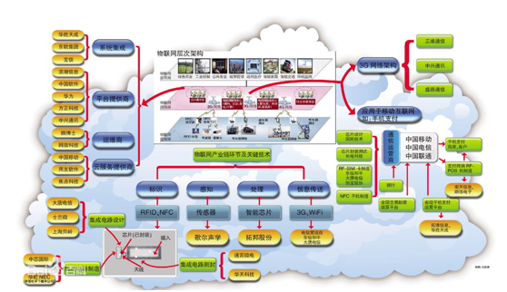
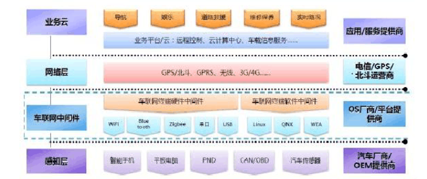

| 序号 | 修改时间   | 修改内容 | 修改人 | 审稿人 |
| ---- | ---------- | -------- | ------ | ------ |
| 1    | 2019-10-26 | 创建。   | Keefe | Keefe |
|      |            |          |        |        |

 
---

# 目录

[TOC]

 
---

# 1  物联网概述

## 简介

**定义**：

 “物联网”（IOT：Internet of Things）指的是将各种信息传感设备，如射频识别(RFID)装置、红外感应器、全球定位系统、激光扫描器等种种装置与互联网结合起来而形成的一个巨大网络。其目的是让所有的物品都与网络连接在一起，方便识别和管理。From anytime, any placeconnectivity for anyone, we will now have connectivity for anything.

物联网（The Internet of Things，简称IOT）是指通过 各种信息传感器、[射频识别技术](https://baike.baidu.com/item/射频识别技术/9524139)、[全球定位系统](https://baike.baidu.com/item/全球定位系统/1240960)、[红外感应器](https://baike.baidu.com/item/红外感应器/9989923)、激光扫描器等各种装置与技术，实时采集任何需要监控、 连接、互动的物体或过程，采集其声、光、热、电、力学、化 学、生物、位置等各种需要的信息，通过各类可能的网络接入，实现物与物、物与人的泛在连接，实现对物品和过程的智能化感知、识别和管理。物联网是一个基于互联网、传统电信网等的信息承载体，它让所有能够被独立寻址的普通物理对象形成互联互通的网络。

物联网概念最早出现于比尔盖茨1995年《[未来之路](https://baike.baidu.com/item/未来之路/18723580)》一书，在《未来之路》中，比尔盖茨已经提及物联网概念，只是当时受限于无线网络、硬件及传感设备的发展，并未引起世人的重视。

1、从技术理解物联网是指物体通过智能感应装置，经过传输网络，到达指定的信息处理中心，最终实现物与物、人与物之间的自动化信息交互与处理的智能网络。

2、从应用理解物联网是指把世界上所有的物体都联接到一个网络中，形成“物联网”,然后“物联网”又与现有的互联网结合,实现人类社会与物理系统的整合，达到更加精细和动态的方式管理生产和生活。

具体地说，就是把传感器嵌入和装备到电网、铁路、桥梁、隧道、公路、建筑、供水系统、大坝、油气管道等各种物体中。

然后将“物联网”与现有的互联网整合起来，实现人类社会、物理系统与虚拟（信息）系统的整合。

在这个整合的网络当中，存在能力超级强大的中心计算机群，能够对整合网络内的人员、机器、设备和基础设施实施实时的管理和控制。

**物联网特点**

* 全面感知：利用RFID、传感器、二维码、卫星、微波，及其它各种感知设备随时随地采集各种动态对象，全面感知世界。

* 可靠的传送：利用以太网、无线网、移动网将感知的信息进行实时传送。

* 智能控制：对物体实现智能化的控制和管理，真正达到人与物的沟通。

**云、边、端协同**

在物联网应用方案中，云端计算、终端计算和边缘计算是一个协同的系统，根据用户场景、资源约束程度、业务实时性等进行动态调 配，形成可靠、低成本的应用方案。云计算厂商、IT 厂商、运营商和垂直行业厂商等不同角色对于边缘计算的概念、边缘节点位置和边缘计算能力等各方面都有不同理解，但面对物联网方案实现云、边、端协同已达成共识。

**物联网的分类**

（1）私有物联网：一般面向单一机构内部提供服务；

（2）公有物联网：基于互联网向公众或大型用户群体提供服务；

（3）社区物联网：向一个关联的“社区”或机构群体（如一个城市政府下属的各委办局：如公安局、交通局、环保局、城管局等）提供服务；

（4）混合物联网：是上述的两种或以上的物联网的组合，但#后台有统一运维实体。

表格1  物联网国内外发展现状

| 地区     | 发展情况                                                     |
| -------- | ------------------------------------------------------------ |
|  全球 | 1995年比尔・盖茨在《未来之路》书中首次提及物联网概念。 2005年11月17日，在突尼斯举行的信息社会世界峰会（WSIS）上，国际电信联盟（ITU）发布了《ITU互联网报告2005：物联网》，报告指出，无所不在的“物联网”通信时代即将来临，世界上所有的物体从轮胎到牙刷、从房屋到纸巾都可以通过因特网主动进行交换。射频识别技术（RFID）、传感器技术、纳米技术、智能嵌入技术将到更加广泛的应用。 2009年1月，IBM首席执行官彭明盛提出“智慧地球”构想，其中物联网为“智慧地球”不可或缺的一部分，而奥巴马在就职演讲后已对“智慧地球”构想提出积极回应，并提升到国家级发展战略。 |
| 日本     | 日本u-Japan战略，希望实现从有线到无线、从网络到终端、包括认证、数据交换在内的无缝链接泛在网络环境，100％的国民可以利用高速或超高速网络。 |
| 韩国     | 韩国也实现了类似的发展。配合u-Korea 推出的u-Home 是韩国的u-IT839 八大创新服务之一。智能家庭最终让韩国民众能通过有线或无线的方式远程控制家电设备，并能在家享受高质量的双向与互动多媒体服务。 |
| 中国     | 2009年8月7日，温总理在无锡调研时，对微纳传感器研发中心予以高度关注，提出了把“感知中国”中心设在无锡、辐射全国的想法。 |
| 欧洲     |                                                              |

## 物联网应用场景

麦肯锡研究了300 项物联网应用，将物联网场景分为9 类，包括：工厂(设备维护、库存优化、工人健康、安全等)、城市(交通、公共健康和安全、资源管理、服务交付)、医疗保健(健康改善、慢性病护理)、外部环境(发生在城市间的户外环境)、工地(运营效率、设备维修)、车辆、家庭(家务自动化、能源管理、安全性)、人类生产力(AR、移动连接性)、办公室(安防、能源管理)。九项应用的最大潜在价值可以高达11.1 万亿美元，平均的潜在价值也有7.4 万亿美元。

## 基础设施-5G

5G天然是为物联网准备的。以5G为代表的第四次工业革命正在到来。

ITU定义了5G三大应用场景：增强型移动宽带（eMBB)、超可靠和低延迟通信（uRLLC）、大规模机器类通信（mMTC），即5G拥有更快速度、覆盖更多设备，实现低延迟。

这三大应用场景分别指向不同的领域，涵盖了我们工作和生活的方方面面。

* eMBB指3D/超高清视频等大流量移动宽带业务，

* uRLLC则指如无人驾驶、工业自动化等需要低时延、高可靠连接的业务
* mMTC指大规模物联网业务

 

## 本章参考

[1].  百度百科-物联网 [https://baike.baidu.com/item/%E7%89%A9%E8%81%94%E7%BD%91](https://baike.baidu.com/item/物联网)

[2]. 知乎-物联网 https://www.zhihu.com/topic/19551271/hot

[3]. 5G商用步伐加快 读懂ITU定义的5G三大应用场景 https://www.sohu.com/a/288145834_100009973

[4]. 华为机器视觉技术精粹 (2020) https://support.huawei.com/enterprise/zh/doc/EDOC1100164704

 

# 2  物联网技术

## 参考架构

​                     

**物联网DCM架构**

物联网系统架构中，可以分为 DCM 三个逻辑层次。

- 感知层（Device）：属于 DCM 架构第一层，负责全面感知，利用射频识别、二维码、传感器等感知、捕获、测量技术随时随地对物体进行信息采集和获取。
- 网络层（Connect）：负责可靠传递，通过将物体接入信息网络，依托通信网络和协议，实现可信的信息交互和共享。
- 应用层（Manage）：负责智能处理，分析和处理海量的感知数据和信息，实现智能化的决策和控制。

## NBIOT

窄带物联网（Narrow Band Internet of Things, NB-IoT），NB-IoT构建于蜂窝网络，只消耗大约180KHz的带宽，使用License频段，可采取带内、保护带或独立载波等三种部署方式，与现有网络共存。可直接部署于GSM网络、UMTS网络或LTE网络，以降低部署成本、实现平滑升级。

 

## 本章参考

[1]. 浅谈NBIOT https://zhuanlan.zhihu.com/p/84087832

 

# 3   车联网

车联网概念是物联网面向行业应用的概念实现，主要指借助新一代信息和通信技术，实现车内、车与车、车与路、车与人、车与服务平台的全方位网络连接，提升汽车智能化水平和自动驾驶能力，构建汽车和交通服务新业态，从而提高交通效率，改善汽车驾乘感受，为用户提供智能、舒适、安全、节能、高效的综合服务。网络连接、汽车智能化、服务新业态是车联网的三个核心。

物联网是在互联网基础上，利用射频识别 ( Radio Frequency Identification，RFID) 、无线数据通信等技 术，构造一个覆盖世界上万事万物的网络体系，实现 任何物体的自动识别和信息的互联与共享。物联网不刻意强调物体的类型，更多的是强调物理世界信息的 获取和交换，以实现当前互联网未触及的物与物信息 交换领域。车联网是物联网概念的着陆点，将这个具 体的物理世界限定到车、路、人和城市上。

车联网利 用装载在车辆上**电子标签RFID**  获取车辆的行驶属性 和系统运行状态信息，通过 GPS 等全球定位技术获取车辆行驶位置等参数，通过 3G 等无线传输技术实现信息传输和共享，通过RFID 和传感器获取道路、桥 梁等交通基础设施的使用状况，最后通过互联网信息平台，实现对车辆运行监控以及提供各种交通综合服务。

从技术角度区分，车联网技术主要有电子**标签**技术、位置定位技术、无线传输 技术、数字广播技术、网络服务平台技术。

从系统交互角度，主要有车与车通信系统、车与 人通信系统、车与路通信系统、车与综合信息平台通 信系统、路与综合信息平台通信系统。车与车通信系统强调物与物之间的端到端通信。这种端到端的通信 使得任何一个车辆既可以成为服务器，也可以作为通 信终端。车与路通信系统使得车辆能够提前获取道路 基础设施的运营状况，如某条道路是否在维修，某个 桥洞是否积水过多等信息，以方便车辆的顺畅通行。 车与综合信息平台通信系统是汇集车辆行驶状态等信 息，提供路况、车辆监控等综合统计性信息以及出行 提醒、安全行驶等个性化信息的综合性平台。路与综合信息平台通信系统目的是维护道路基础设施的运营 状况，以及时更换老化和运营状况不佳设备。

从应用角度区分，车联网技术可以分为监控应用系统、行车安全系统、动态路况信息系统、交通事件 保障系统等。

**车联网数据**

如果将车辆数据分类，可以分为操控、使用、性能、用户、环境、工况6个分类。

1.操控数据

加速、制动、驻车、档位、远近光/雾灯/位置灯、车窗、安全带、方向盘转角、方向盘转速、空调、音乐/FM/蓝牙、碰撞等级、碰撞检测。

2.使用数据

里程、生命周期、行驶路段、行驶时间、行驶方向、行驶时段、行驶频次、单次行驶时长、拥堵时长、畅行时长、乘坐人数、进度/维度/海拔、翻滚角/俯仰角/横摆角、胎温/胎压、倒车雷达测距、探头、空调、车速/加速度、雨刷器状态。

3.性能数据

油门踏板开度、制动踏板百分比、制动踏板状态、发动机转速、瞬时油耗、百公里油耗、剩余油量、百米加速。

4.用户数据

POI、兴趣、住址、公司、是否有育儿家庭、是否有差率人群、自驾游人群、通勤族、自由职业、吃货、加班族、早九晚五、驾驶安全等级、不良行为频度、行程分析、常用路线、活动范围。

5.环境数据

天气、道路类型、道路状况、道路限速、拥堵情况、POI、平顺\拥堵\爬坡\颠簸。

6.工况数据

动力蓄电池电压电流温度、电机电压电流温度状态、发送机转速、发动机状态、怠速状态、节气门绝对位置、平均点火角度、主缸压力、进气温度、冷却液温度、ABS状态、EBD状态、ESP状态、车身稳定性控制状态、牵引力控制系统状态、警告信息。

## 车联网技术

1. RFID 射频识别技术。车联网使用 RFID 技术结合已有的网络技术、数据库技术、中间件技术 等，**构建**一个由大量联网的 RFID 终端组成比互联网 更为庞大的物联网，因此 RFID 技术是实现车联网的 基础技术。我国 RFID 缺乏关键核心技术，特别是在超高频 RFID 方面。

2. 传感技术。利用传感器及汽车总线采集车 辆、道路等交通基础设施的运行参数等传感技术需 要根据不同物体的运行参数进行定制。如车需要油 耗、刹车、发动机等运行参数，而桥梁需要压力、老 化程度等参数。传感技术是实现**车联网数据**采集的关 键技术。

3. 无线传输技术。无线传输技术将传感器采集得到的数据发送至服务器或其它终端，或者接收控 制指令完成物体远程控制。只有通过无线传输技术， 才能实现信息的交换和共享。

4. 云计算技术。对采集获取的物体数据进行 综合加工分析，并提供各类综合服务。车联网系统通 过网络以按需、易扩展的方式获得 云计算所提供的服务。

5. 车联网标准体系。标准是一个产业兴起的 重要标志。车联网只有建立一套易用、统一的标准体 系，才能实现不同物体之间的相互通信，不同车联网 系统的融合，才能带动汽车、交通产业的快速发展。

6. 车联网安全体系。包括车联网物体信息化 之后的安全度、传输器安全度、传输技术安全以及服务端安全。安全是保障车联网系统能够快速推广的 前提。

7. 定位技术。通过 GSP、无线定位技术等提高当前车联网中物体的位置精度。通过定位精度的提 高，将准确获取车辆行驶位置，提高实时路况精准 度、交通事件定位精确度。

**车联网体系结构**

感知层，承担车辆自身与道路交通信息的全面感知和采集，是 车联网的神经末梢，也是车联网“一枝独秀”于物联网的最 显著部分。 通过传感器、RFID、车辆定位等技术，实时感知 车况及控制系统、道路环境、车辆与车辆、车辆与人、车辆 与道路基础设施、车辆当前位置等信息，为车联网应用提 供全面、原始的终端信息服务。

网络层，通过制定专用的能够协同异构网络通信需要的网络架构和协议模型，整合感知层的数据；通过向应用层屏蔽 通信网络的类型， 为应用程序提供透明的信息传输服务； 通过对云计算、虚拟化等技术的综合应用，充分利用现有 网络资源，为上层应用提供强大的应用支撑。

应用层，车联网的各项应用必须在现有网络体系和协议的基础 上，兼容未来可能的网络拓展功能。 应用需求是推动车联网技术发展的源动力，车联网在实现智能交通管理、车辆安全控 制、交通事件预警等高端功能的同时，还应为车联网用户 提供车辆信息查询、信息订阅、事件告知等各类服务功能。

安全能力，车联网的通信特点制约着车联网信息的安全性和通信能力。 安全能力为车联网提供密钥管理和身份鉴别能 力，确保入网车辆信息的真实性；提供信息的安全保护功 能，保证数据在传输过程中不被破坏、篡改和丢弃；提供准 确的位置信息，实现对车辆的定位和路径回溯；提供精确的时钟信息， 保证车联网实时业务尤其是安全应用在时间上 的同步。

管理能力，作为车联网的控制中心，管理能力提供对入网车辆信 息和路况信息的管理能力，实现车辆之间、车辆与道路基 础设施之间以及不同网络之间的自由、无缝切换；实现车 联网通信的 QoS 管理，根据不同的入网车辆信息及业务类型，提供不同的网络优先级服务。

 

# 参考资料

* 《车联网体系架构分析与解决方案》
* 《车联网架构与关键技术研究》 兰州交通大学 王建强，吴辰文，李晓军；
* 《车联网技术初探》北京航空航天大学计算机学院，北京市交通信息中心；
* 《车联网体系结构及感知层关键技术研究》王 群，钱焕延
* 百度百科-车联网 https://baike.baidu.com/item/%E8%BD%A6%E8%81%94%E7%BD%91/6724145?fr=aladdin
* 智能驾驶数据一体化解决方案 https://cloud.baidu.com/solution/aidataservice/autopilotdata.html

 

# 附录

## 行业协会和机构

相关链接

* 中国制造2025-智能网 http://www.2025china.cn/
