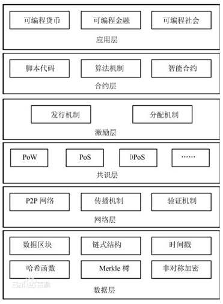
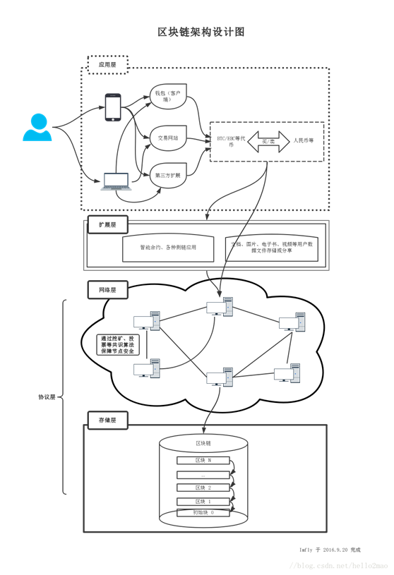
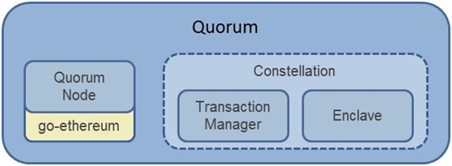

| 序号  | 修改时间      | 修改内容 | 修改人   | 审稿人   |
| --- | --------- | ---- | ----- | ----- |
| 1   | 2018-3-10 | 创建。  | Keefe | Keefe |
|     |           |      |       |       |

   

---

# 目录

[TOC]

 

---

# 1 概论

## 1.1  简介

2008年11月1日，中本聪在“metzdowd.com”网站的密码学邮件列表中发表了一篇论文，题为《比特币：一种点对点式的电子现金系统》。论文中详细描述了如何创建一套去中心化的电子交易体系，且这种体系不需要创建在交易双方相互信任的基础之上。

2009年1月3日，他开发出首个实现了比特币算法的客户端程序并进行了首次“采矿”（mining），获得了第一批的50个比特币。这也标志着比特币金融体系的正式诞生。中本聪创造第一个区块，即“创世区块”。

2016年12月20日，数字货币联盟——中国FinTech数字货币联盟及FinTech研究院正式筹建，火币是联合发起单位之一。

比特币中国已于2018年1月3日，停止了网站登陆和在线提现服务。

由比特币技术延伸出区块链技术，智能合约等等。

## 1.2  应用领域

可以用区块链的一些领域可以是：

▪ [智能合约](https://baike.baidu.com/item/智能合约)

▪ [证券交易](https://baike.baidu.com/item/证券交易/3277)

▪ [电子商务](https://baike.baidu.com/item/电子商务/98106)

▪ [物联网](https://baike.baidu.com/item/物联网)

▪ 社交通讯

▪ [文件存储](https://baike.baidu.com/item/文件存储)

▪ [存在性证明](https://baike.baidu.com/item/存在性证明)

▪ [身份验证](https://baike.baidu.com/item/身份验证)

▪ [股权众筹](https://baike.baidu.com/item/股权众筹/13887616)

区块链和金融科技：区块链是金融科技的核心。

互联网金融和金融科技：互联网金融主要是场景革命，而金融科技革命侧重于技术革命。金融科技涉及到的技术有大数据、AI、云计算等等。

## 1.3   区块链社区

### 开源项目

表格 1 区块链开源项目列表

| 名称                                           | 公识算法              | 适合场景   | 开发语言 | 智能合约 | TPS  |
| -------------------------------------------- | ----------------- | ------ | ---- | ---- | ---- |
| [比特币1.0](https://github.com/bitcoin/bitcoin) | POW               | 公链     | C++  | 否    | 7    |
| 以太坊ETH 1.0                                   | POW               | 公链/联盟链 | GO   | 是    | 25   |
| IBM HyperLedger fabric                       | PBFT为主            | 联盟链    | GO   | 是    | 100K |
| 比特股BitShare                                  | DPos              | 联盟链    | C++  | 否    | 500  |
| 公证通Factom                                    | Factom自有共识机制，类Pos | 公链/联盟链 | C++  | 否    | 27   |
| 瑞波Ripple                                     | RPCA              | 公链/联盟链 | C++  | 否    | 1000 |
| 未来币NXT                                       | Pos               | 公链/联盟链 | JAVA | 否    | 1000 |

**开源链接**

* 区块链技术汇总 https://github.com/chaozh/awesome-blockchain-cn

* [Ebookcoin / ebookcoin ](https://github.com/Ebookcoin/ebookcoin)《Node.js区块链开发》源码，纸书 2017.8

* 比特币 https://github.com/bitcoin/bitcoin/

* 元素链（Elements） https://github.com/ElementsProject/elements

* 以太坊ETH https://github.com/ethereum/

* IBM HyperLedger(fabric) https://github.com/hyperledger/fabric

* 比特股的1.0：https://github.com/bytemaster/bitshares

* 比特股的2.0：http://github.com/bitshares

* 公证通：https://github.com/FactomProject/FactomCode

* Ripple：https://github.com/ripple/rippled

* Nxt：https://bitbucket.org/JeanLucPicard/nxt/overview

* 英特尔的锯齿湖（Sawtooth Lake） https://github.com/intelledger

* 小蚁区块链 https://github.com/antshares/antshares

### 政治和监管

反洗钱

 

## 1.4   名词术语

* **区块链**：Block Chain。

* PoET（Proof ofElapsed Time），也就是‘消逝时间量证明’，它是由英特尔构建在可信执行环境的一种彩票协议。

* QuorumVoting，属于Quorum拜占庭协议，仲裁投票算法，它采用了瑞波和恒星的共识协议，用来解决需立即交易定局的需求。”

* Casper，以太坊社区提出的正在研发中的类POS共识协议。Casper的基本思路是，任何人抵押足够多的以太币到系统中就可以成为矿工参与到挖矿过程。共识算法要求所有的矿工诚实工作，如果一个矿工有意破坏，不遵守协议，系统就会对矿工做出惩罚：没收之前抵押的以太币。有人把Casper这样的挖矿机制称为“虚拟挖矿”。

## 本章参考

 

# 2 区块链技术

## 2.1  核心技术

区块链是分布式数据存储、点对点传输、共识机制、加密算法等计算机技术的新型应用模式。所谓共识机制是区块链系统中实现不同节点之间建立信任、获取权益的数学算法。

狭义来讲，区块链是一种按照时间顺序将数据区块以顺序相连的方式组合成的一种链式数据结构， 并以密码学方式保证的不可篡改和不可伪造的分布式账本。

广义来讲，区块链技术是利用块链式数据结构来验证与存储数据、利用分布式节点共识算法来生成和更新数据、利用密码学的方式保证数据传输和访问的安全、利用由自动化脚本代码组成的智能合约来编程和操作数据的一种全新的分布式基础架构与计算方式

区块链主要解决的交易的信任和安全问题，因此它针对这个问题提出了四个技术创新：

第一个叫分布式账本，就是交易记账由分布在不同地方的多个节点共同完成，而且每一个节点都记录的是完整的账目，因此它们都可以参与监督交易合法性，同时也可以共同为其作证。不同于传统的中心化记账方案，没有任何一个节点可以单独记录账目，从而避免了单一记账人被控制或者被贿赂而记假账的可能性。另一方面，由于记账节点足够多，理论上讲除非所有的节点被破坏，否则账目就不会丢失，从而保证了账目数据的安全性。

第二个叫做非对称加密和授权技术，存储在区块链上的交易信息是公开的，但是账户身份信息是高度加密的，只有在数据拥有者授权的情况下才能访问到，从而保证了数据的安全和个人的隐私。

第三个叫做[共识机制](https://baike.baidu.com/item/共识机制)，就是所有记账节点之间怎么达成共识，去认定一个记录的有效性，这既是认定的手段，也是防止篡改的手段。区块链提出了四种不同的共识机制，适用于不同的应用场景，在效率和安全性之间取得平衡。以比特币为例，采用的是工作量证明PoW，只有在控制了全网超过51%的记账节点的情况下，才有可能伪造出一条不存在的记录。当加入区块链的节点足够多的时候，这基本上不可能，从而杜绝了造假的可能。

最后一个技术特点叫智能合约，智能合约是基于这些可信的不可篡改的数据，可以自动化的执行一些预先定义好的规则和条款。以保险为例，如果说每个人的信息（包括医疗信息和风险发生的信息）都是真实可信的，那就很容易的在一些标准化的保险产品中，去进行自动化的理赔。

### 2.1.1  分布式账本

### 2.1.2  非对称加密和授权

### 2.1.3  共识机制

共识机制是让区块链良性运转的保障。

常见的共识机制有：PoW、PoS、DPoS

表格 2 区块链常见共识机制比较列表

| 共识机制                       | 简介                                                         | 优点                               | 缺点                                               | 现实原型                         |
| ------------------------------ | ------------------------------------------------------------ | ---------------------------------- | -------------------------------------------------- | -------------------------------- |
| PoW：Proof of Work             | 工作量证明机制，比特币最早的机制。按算力衡量，即挖矿。       | 相对公平；                         | 不环保耗电；算力集中化；经济效益递减（紧缩）。     | 比特币                           |
| PoS~ Proof of Stake            | 股权证明机制，此机制是点点币的创新。即根据用户持币数量发放利益。 | 相对节能；更去中心化；避免紧缩。   | 纯PoS机制需IPO发行，容易造成投机。                 | 银行存款。以太币                 |
| PoW+PoS                        | 用PoW挖矿发行，用PoS维护网络稳定。                           |                                    |                                                    |                                  |
| DPoS~ Delegated Proof of Stake | 授权股权证明机制。首先来自比特币。通过投票机制               | 更节能；更去中心化；更快确认速度。 | 缺乏投资经验，投票积极性不高；坏节点处理存在困难。 | 股份制公司里普通股民选举委托人。 |
| Pool验证池                     | 基于传统的分布式一致性技术，加上数据验证机制。               |                                    |                                                    |                                  |

* POW：工作量证明。简单解释就是，系统出了一道题，大家一起计算这道题，谁先算出来，钱归谁。这条规则下，不同统属的算力，彼此之间是直接竞争，而非合作关系。另外，如果网络算力提升，那么就提升难度。也就是说增加再多的算力，比特币计算一次（出块）就是固定的，时间并不会缩短，效率也不会增加。

### 2.1.4  智能合约

### 2.1.5  本节参考

[1].  区块链主流开源技术体系介绍 https://blog.csdn.net/elwingao/article/details/52679475

* 比特币挖矿消耗的计算能力用来干什么了？创造了什么价值？  https://www.zhihu.com/question/268115812

 

## 2.2  整体架构

### 2.2.1  区块链参考架构六层模型

区块链系统由数据层、网络层、共识层、激励层、合约层和应用层组成。

​      

图 1 区块链基础架构模型（六层）

说明：该模型中，基于时间戳的链式区块结构、分布式节点的共识机制、基于共识算力的经济激励和灵活可编程的智能合约是区块链技术最具代表性的创新点。

* 数据层封装了底层数据区块以及相关的数据加密和时间戳等基础数据和基本算法；

* 网络层则包括分布式组网机制、数据传播机制和数据验证机制等；

* 共识层主要封装网络节点的各类共识算法；

* 激励层将经济因素集成到区块链技术体系中来，主要包括经济激励的发行机制和分配机制等；

* 合约层主要封装各类脚本、算法和智能合约，是区块链可编程特性的基础；

* 应用层则封装了区块链的各种应用场景和案例。

### 2.2.2  区块链简单三层架构（亿书）

 

图 2 区块链简单三层架构（亿书）

备注：区块链架构设计可简单分为三层，分别是应用层、扩展层和协议层，其中协议层又分为网络层和存储层。

## 2.3  Quorum

Quorum 是由 J.P.Morgan（美国的金融机构摩根大通） 推出的企业级区块链平台。

Quorum是个联盟链。

基于以太坊，Quorum提供了额外的服务。

Quorum和以太坊的主要区别:

* 提供了Transaction和Contract的私有化功能。

* 多种共识方式。

* 网络与节点的权限管理。

* 更高的性能。

Quorum 的主要组件：

* Quorum Node (节点)

* Constellation - Transaction Manager (用于私有Transaction的管理)

* Constellation - Enclave (用于加解密私有Transaction的信息)

 

图 3 Quorum结构

 

## 本章参考

  

# 3 区块链应用

## 比特币

设计者在设计比特币之初就将其总量设定为2100万枚。最开始每个争取到记账权的矿工都可以获得50枚比特币作为奖励，之后每4年减半一次。预计到2140年，比特币将无法再继续细分，从而完成所有货币的发行，之后不再增加。设计者在设计比特币之初就将其总量设定为2100万枚。

比特币在各国法律现状

* 禁止：中国、泰国
* 限制：美国、新加坡、印尼、俄罗斯
* 合法：日本、中国香港
* 列为官方货币：萨尔瓦多（2021）、古巴央行（BCC，2021）、中非（2022）

### 比特币社区

比特币三个方面的共识：规则、历史纪录、比特币价值、

利益相关者

* 比特币核心钱包首席开发人员：编写规则，几乎人人使用他们的代码。
* 矿工：编写历史纪录，决定哪些交易是有效的。
* 投资人：购买并持有比特币，决定了比特币是否有价值。
* 商家及客户：比特币的主要需求。
* 支付服务商：处理交易。

非营利社区组织：

* 比特币基金会：成立于2012年。现在主要二个角色，一是资助比特币开发人员；二是同政府沟通，作为比特币的发声机构。
* 货币中心：成立于2014年9月。主要同政府沟通；货币中心运作类似智囊团。

## 本章参考

  

# 参考资料

## 参考书目

* Bitcoin: A Peer-to-Peer Electronic Cash System [https://bitcoin.org/bitcoin.pdf](https://link.zhihu.com/?target=https%3A//bitcoin.org/bitcoin.pdf)  2008.11.1
* [比特币白皮书：一种点对点的电子现金系统 | 巴比特](https://link.zhihu.com/?target=http%3A//www.8btc.com/wiki/bitcoin-a-peer-to-peer-electronic-cash-system)
* 《精通比特币》 《Master Bitcoin》 2014
* 《区块链从数字货币到信用社会》  中信出版社  2016.7
* 《[区块链技术驱动金融 : 数字货币与智能合约技术](https://book.douban.com/subject/26860970/)》 阿尔文德·纳拉亚南、约什·贝努、爱德华·费尔顿、安德鲁·米勒、史蒂文·戈德费德 / 林华、王勇 / 中信出版社 / 2016-8-25 / CNY 79.00
* [Ebookcoin / ebookcoin ](https://github.com/Ebookcoin/ebookcoin)《Node.js区块链开发》源码，纸书 2017.8
* 《图说区块链》 中信出版社 2017.7
*  工信部 2018

## 参考链接

[1].  区域链 [https://baike.baidu.com/item/%E5%8C%BA%E5%9D%97%E9%93%BE](https://baike.baidu.com/item/区块链)

[2].  比特币 [https://baike.baidu.com/item/%E6%AF%94%E7%89%B9%E5%B8%81/4143690](https://baike.baidu.com/item/比特币/4143690)

[3].  亿书官网 http://www.ebookchain.org/

[4].  [区块链是什么 | 巴比特](https://link.zhihu.com/?target=http%3A//www.8btc.com/what-is-blockchain)

 

# 附录
