| 序号  | 修改时间       | 修改内容                         | 修改人   | 审稿人 |
| --- | ---------- | ---------------------------- | ----- | --- |
| 1   | 2014-10-23 | 创建：把历年的安全相关文章组合在一起。          | Keefe |     |
| 2   | 2016-4-10  | 增加新章节：黑客技术                   | 同上    |     |
| 3   | 2016-7-19  | 增加网站攻击章节                     | 同上    |     |
| 4   | 2016-10-19 | 增加互联网安全大事记                   | 同上    |     |
| 5   | 2017-11-25 | 更新安全知识域、安全架构、安全编程章节          | 同上    |     |
| 6   | 2018-5-1   | 将《进程间通信》整体迁移到这。              | 同上    |     |
| 7   | 2018-9-3   | 更新安全算法章节，将并发章节迁移到《性能优化》。     | 同上    |     |
| 8   | 2021-9-1   | 更新RBAC章节，安全算法章节。             | 同上    |     |
| 9   | 2021-12-28 | 将黑客技术章节迁移另文。《安全开发》更名为《安全技术》。 | 同上    |     |

<br><br><br>

---

# 目录

[TOC]

**表目录**

[表格 1 LINUX安全设置项列表__ 8](#_Toc524041453)

[表格 2 目录服务软件比较__ 17](#_Toc524041454)

[表格 3 LDAP协议的版本__ 17](#_Toc524041455)

[表格 4 LDAP基本术语__ 19](#_Toc524041456)

[表格 5 oAuth版本史__ 23](#_Toc524041457)

<br>

---

# 1  信息安全简介

​            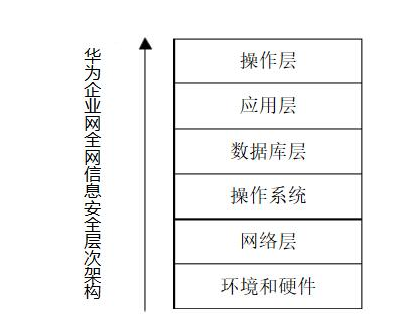

图 1 华为的企业网全网信息安全层次架构

## 信息安全发展史

网络安全敏感国家：美国、加拿大、新西兰、澳大利亚、俄罗斯、台湾、越南、印度和欧洲区（38国）

| 阶段       | 详述                                                                                                                                                                                                                                                                                                                                                  |
| -------- | --------------------------------------------------------------------------------------------------------------------------------------------------------------------------------------------------------------------------------------------------------------------------------------------------------------------------------------------------- |
| 通信<br>保密 | 香农《通信保密系统的信息理论》，  <BR>主要威胁形式：搭线窃听和密码学分析  <br>关心对象：军方和政府                                                                                                                                                                                                                                                                                             |
| 信息安全     | 操作系统/数据库/网络安全TCSEC --> 计算机安全IPSEC --> 信息安全CC                                                                                                                                                                                                                                                                                                        |
| 信息保障     | 保护和防御信息及信息系统，确保其可用性、完整性、保密性、  鉴别、不可否认性等特性。这包括在信息系统中融入保护、检测、反应功能，并提供信息系统的恢复功能。 --美国国防部令S-3600.1                                                                                                                                                                                                                                                      |
| 数据安全     | 1998年英国颁布的《数据保护法案》规定，政府采集与公民自身或企业有关的信息，必须遵守资料保护的[法律](https://baike.baidu.com/item/法律)与相关程序，尽量减少重复收集，维护资料的安全，确保信息收集行为的合法性、收集目的的正当性、收集过程的科学性、信息内容的正确性、数据的完整性和准确性。除了部分涉及国家安全、[商业机密](https://baike.baidu.com/item/商业机密/5702583)或[个人隐私](https://baike.baidu.com/item/个人隐私/7128166)的信息受到法律规范而不得公开外，其它政府信息应经过系统的处理后，尽量以电子化形式予以公开。<br>2016.4，欧盟通过最新《数据保护法》。 |

## 信息安全等级保护

信息安全等级保护是指对国家秘密信息、法人和其他组织及公民的专有信息以及公开信息和存储、传输、处理这些信息的信息系统分等级实行安全保护

* 对信息系统中使用的信息安全产品实行按等级管理

* 对信息系统中发生的信息安全事件分等级响应、处置

* 测评指标项主要根据信息系统的安全保护等级选取。其中三级测评项目根据信息系统防护等级（S3A3G3）包含73个安全指标类，290个安全要求项。

* 单元测评：包括物理安全、网络安全、主机安全、应用安全、数据安全、安全管理机构、安全管理制度、人员安全管理、系统建设管理和系统运维管理共10个方面，覆盖290个要求项。

* 整体测评：包括安全控制点间测评、层面间测评、区域间测评和验证测试几个方面。
  
  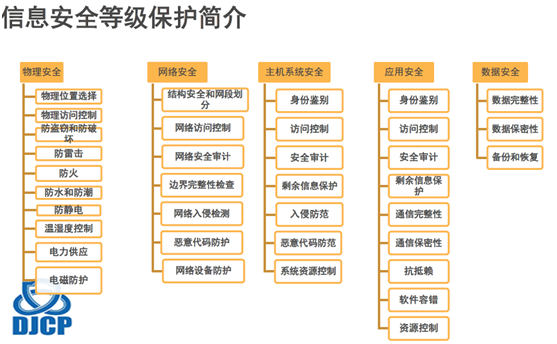
  
  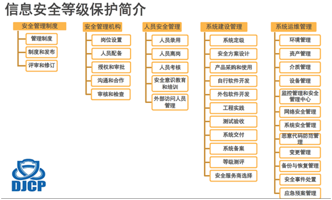

<br>

# 2  安全OS

## 2.1  UNIX系统安全

### 2.1.1  设置健壮的密码

要求包含大小写字母，数字，特殊字符，长度要求8位以上。

root用户可以使用下面的命令和参数来增强对用户密码的管理：

`$passwd Cn 30 帐号名`   #强迫用户每30天修改一次密码

### 2.1.2  删除所有的特殊账户

你应该删除所有不用的缺省用户和组账户（比如lp,　sync,　shutdown,　halt,　news,
 uucp,　operator,　games,　gopher等）。

```shell
 #删除用户：
 [root@kapil　/]# userdel LP
 #删除组：
 [root@kapil　/]# groupdel LP
```

在终端上打入下面的命令删掉下面的特权用账号：

```sh
# 删除特权账号
userdel adm
userdel lp
userdel sync
userdel shutdown
userdel halt
userdel mail

# 如果你不用sendmail服务器，就删除这几个帐号：
userdel news
userdel uucp
userdel operator
userdel games

# 如果你不用X windows 服务器，就删掉这个帐号。
userdel gopher

# 如果你不允许匿名FTP，就删掉这个用户帐号：
userdel ftp
```

### 2.1.3  关闭不需要的服务

Unix系统中有许多用不着的服务自动处于激活状态，它们中可能存在的安全漏洞使攻击者甚至不需要账户就能控制机器。为了系统的安全，应把该关的功能关闭，该限制的文件限制访问权限。可以用如下方法来关闭：

- 编辑 /etc/service文件（参考/etc/xinted.d/中文件）,  Centos在 /lib/systemd/system/目录。

- 用”#”符号注释掉不需要的服务，使其处于不激活的状态；

- 另外可使用chkconfig –del 服务名 来删除不必要的服务。

[此条使用了新的xinetd, /etc/service, /etc/xinetd.d/*]
 取消并反安装所有不用的服务，这样你的担心就会少很多。察看"/etc/inetd.conf"文件，通过注释取
 消所有你不需要的服务（在该服务项目之前加一个"#"）。然后用"sighup"命令升级"inetd.conf"文件。
 第一步：更改"/etc/inetd.conf"权限为600，只允许root来读写该文件。
` [Root@kapil　/]#　chmod 600 /etc/inetd.conf `

 第二步：确定"/etc/inetd.conf"文件所有者为root。

 第三步：编辑　/etc/inetd.conf文件（vi　/etc/inetd.conf），取消下列服务（你不需要的）：ftp,　telnet,　shell,　login,　exec,　talk,　ntalk,　imap,　pop-2,　pop-3,　finger,　auth等等。把不需要的服务关闭可以使系统的危险性降低很多。

 第四步：给inetd进程发送一个HUP信号：
` [root@kapil　/]# killall　-HUP inetd `

 第五步：用chattr命令把/ec/inetd.conf文件设为不可修改，这样就没人可以修改它：
` [root@kapil　/]# chattr　+i　/etc/inetd.conf`
 这样可以防止对inetd.conf的任何修改（以外或其他原因）。唯一可以取消这个属性的人只有root。如果要修改inetd.conf文件，首先要是取消不可修改性质：
`[root@kapil　/]# chattr -i /etc/inetd.conf `

### 2.1.4  远程登陆管理

禁止不安全的rlogin. telnet，使用密钥管理的ssh，使用scp进行加密传输。

登陆日志可查看 /var/log/secure

**1). UNIX下系统用户登陆的安全审计工具主要有lastlog和WTMP。**

安全日志文件一般在/var/log目录下，各种UNIX系统可能不同。

* lastlog文件 记录每个用户的最近一次登陆时间和每个用户的最初目的地。

* wtmp文件 记录用户登陆和退出时间。

**2). SSH服务**

修改ssh服务的默认端口，改完重启sshd激活修改项

```shell
vi /etc/ssh/sshd_config
PORT 22

# 改完重启sshd
sudo /etc/init.d/ssh restart
```

**3). FTP服务**

使用iptable来管理登陆的ip及用户。

/etc/service

```ini
ftp-data    20/tcp
ftp-data    20/udp
# 21 is registered to ftp, but also used by fsp
ftp       21/tcp
ftp       21/udp     fsp fspd
ssh       22/tcp             # SSH Remote Login Protocol
ssh       22/udp             # SSH Remote Login Protocol
telnet     23/tcp
telnet     23/udp
rtelnet     107/tcp             # Remote Telnet
rtelnet     107/udp
```

### 2.1.5 限制 IP访问

首先修改 /etc/hosts.allow文件，将可访问服务器ssh服务的客户IP加入其中，格式如下

```ini
sshd:192.168.1.0/255.255.255.0
sshd: 202.114.23.45
sshd: 211.67.67.89
```

然后修改 /etc/hosts.deny文件，加入禁用其它客户连接ssh服务
`sshd: ALL`

### 2.1.6  日志监控

 系统管理员主要依靠系统的LOG，即我们时常所说的日志文件来获得[入侵](http://www.05112.org/)的痕迹及[入侵](http://www.05112.org/)者进来的IP和其他信息。当然也有些管理员使用第三方工具来记录侵入电脑的信息，这里主要讲的是一般U NIX系统里记录[入侵](http://www.05112.org/)踪迹的文件。

 /var/log，一些版本的Solaris，Linux BSD，Free BSD使用这个位置；
 /etc，大多数UNIX版本把utmp放在此处，一些也把wtmp放在这里，这也是 syslog.conf 的位置。

下面列举一些文件的功能，当然他们也根据入侵的系统不同而不同。

```shell
 acct 或 pacct，记录每个用户使用的命令记录；
 access_log，主要使用来服务器运行了NCSA HTTPD，这个记录文件会有什么站点连接过你的服务器；
 aculog，保存着你拨出去的MODEMS记录；
 lastlog，记录了用户最近的登陆记录和每个用户的最初目的地，有时是最后不成功登陆的记录；
 loginlog，记录一些不正常的登陆记录；
 messages，记录输出到系统控制台的记录，另外的信息由syslog来生成；
 security，记录一些使用UUCP系统企图进入限制范围的事例；
 secure   远程登陆相关的日志
 sulog，记录使用su命令的记录；
 utmp，记录当前登录到系统中的所有用户，这个文件伴随着用户进入和离开系统而不断变化；
 utmpx，UTMP的扩展；
 wtmp，记录用户登录和退出事件；
 syslog，最重要的日志文件，使用syslogd守护程序来获得。
```

 **日志信息：  **

```shell
/dev/log，一个UNIX域套接字，接受在本地机器上运行的进程所产生的消息；
/dev/klog，一个从UNIX内核接受消息的设备；
514端口，一个INTERNET套接字，接受其他机器通过UDP产生的syslog消息；
Uucp，记录的UUCP的信息，可以被本地UUCP活动更新，也可有远程站点发起的动作修改，信息包括发出和接受的呼叫，发出的请求，发送者，发送时间和发送主机；
lpd-errs，处理打印机故障信息的日志；
ftp日志，执行带-l选项的ftpd能够获得记录功能；
httpd日志，HTTPD服务器在日志中记录每一个WEB访问记录；
history日志，这个文件保存了用户最近输入命令的记录；
vold.log，记录使用外接媒介时遇到的错误记录。
```

在Linux系统中，有三个主要的日志子系统：

* 连接时间日志--由多个程序执行，把纪录写入到/var/log/wtmp 和 /var/run/utmp，login等程序更新wtmp和utmp文件，使系统管理员能够跟踪谁在何时登录到系统。
* 进程统计--由系统内核执行。当一个进程终止时，为每个进程往进程统计文件（pacct或acct）中写一个纪录。进程统计的目的是为系统中的基本服务提供命令使用统计。
* 错误日志--由syslogd（8）执行。各种系统守护进程、用户程序和内核通过syslog（3）向文件/var/log/messages 报告值得注意的事件。另外有许多UNIX程序创建日志。像HTTP和FTP这样提供网络服务的服务器也保持详细的日志。

## 2.2  Linux系统安全

备注: unix系统安全的注意事项一般也能用到Linux系统.

### Linux安全设置手册

表格  Linux安全设置项列表

| 设置项                              | 设置原因                                                                                                                                                               | 设置内容                                                                                                                                  |
| -------------------------------- | ------------------------------------------------------------------------------------------------------------------------------------------------------------------ | ------------------------------------------------------------------------------------------------------------------------------------- |
| Bios Security  [可选]              | 一定要给Bios设置密码，以防通过在Bios中改变启动顺序，而可以从软盘启动。这样可以阻止别人试图用特殊的启动盘启动你的系统，还可以阻止别人进入Bios改动其中的设置（比如允许通过软盘启动等）。                                                                  |                                                                                                                                       |
| grub Security [可选]               | 这三个参数可以使你的系统在启动grub时就要求密码验证。                                                                                                                                       | $ vi /etc/ grub.conf  <br>time-out,restricted,password                                                                                |
| 选择正确的密码 [必选]                     | 修改密码长度：在你安装linux时默认的密码长度是5个字节。但这并不够，要把它设为8。                                                                                                                        | $ vi /etc/login.defs  <br>PASS_MIN_LEN　8                                                                                              |
| 打开密码的shadow支持功能 [必选]             | 打开密码的shadow功能，来对password加密。                                                                                                                                        | 工具：/usr/sbin/authconfig  <br/>转化shadow格式：  $ pwcov, grpconv                                                                           |
| root账户 [必选]                      | 系统管理员在离开系统之前忘记注销root账户，系统会自动注销。                                                                                                                                    | `$ vi /etc/profile`  <br>TMOUT=3600 # 单位为秒                                                                                            |
| 取消普通用户的控制台访问权限  [必选]             | 应该取消普通用户的控制台访问权限，比如shutdown、reboot、halt等命令。                                                                                                                        | `$ rm -f  /etc/security/console.apps/`                                                                                                |
| TCP_WRAPPERS [必选]                | 使用TCP_WRAPPERS可以使你的系统安全面对外部入侵。                                                                                                                                     |                                                                                                                                       |
| 禁止系统信息暴露  [红帽默认]                 | 当有人远程登陆时，禁止显示系统欢迎信息。  在最后加"-h"可以使当有人登陆时只显示一个login:提示，而不显示系统欢迎信息。                                                                                                   | `$ vi /etc/inetd.conf`  <br/>telnet　　stream　　tcp　　　　　nowait　　root　　　　/usr/sbin/tcpd　　in.telnetd　-h                                    |
|                                  | 在缺省情况下，当你登陆到linux系统，它会告诉你该linux发行版的名称、版本、内核版本、服务器的名称。                                                                                                              | # 注释输出到 issue项  <br/>$ vi /etc/rc.d/rc.local    <br/>$ rm -f  /etc/issue　    <br/>$rm -f /etc/issue.net                               |
| /etc/services文件免疫 [可选]           | 防止未经许可的删除或添加服务                                                                                                                                                     | `$ chattr +i /etc/services`                                                                                                           |
| 不允许从不同的控制台进行root登陆 [可选]          | 在不需要登陆的TTY设备前添加"#"标志，来禁止从该TTY设备进行root登陆。                                                                                                                           | `$ vi /etc/securetty`                                                                                                                 |
| 禁止任何人通过su命令改变为root用户 [可选]        | 编辑su配置文件。  #这表明只有"wheel"组的成员可以使用su命令成为root用户。你可以把用户添加到"wheel"组，以使它可以使用su命令成为root用户。                                                                                | `$ vi /etc/pam.d/su`  <br/>auth　sufficient　/lib/security/pam_rootok.so　debug　    auth　required　/lib/security/Pam_wheel.so　group=wheel |
| 禁止Control-Alt-Delete　键盘关闭命令 [可选] | 注释命令。  # 激活修改    $ /sbin/init q                                                                                                                                    | `$ vi /etc/inittab` <br/> #ca::ctrlaltdel:/sbin/shutdown　-t3　-r　now                                                                   |
| 设置脚本权限                           | 给执行或关闭启动时执行的程序的script文件设置权限。                                                                                                                                       | `$ chmod -R 700 /etc/rc.d/init.d/*`                                                                                                   |
| 禁止不使用的SUID/SGID程序                | 如果一个程序被设置成了SUID root，那么普通用户就可以以root身份来运行这个程序。网管应尽可能的少使用SUID/SGID　程序，禁止所有不必要的SUID/SGID程序。   $ find / -type f \( -perm -04000 -o -perm -02000 \) \-exec ls -lg {} \; | 查找使用's'位的程序  <br/>`$ find  / -perm -4000 -print`  <br>禁止选中的带有's'位的程序   <br/>`$ chmod a-s [program]`                                   |
| 修改host.conf                      | 第一项设置首先通过DNS解析IP地址，然后通过hosts文件解析。  第二项设置检测是否"/etc/hosts"文件中的主机是否拥有多个IP地址（比如有多个以太口网卡）。  第三项设置说明要注意对本机未经许可的电子欺骗。                                                     | `$ vi /etc/host.conf`   <br/>order bind,hosts   multi on   nospoof on                                                                 |
| TCP_WRAPPERS设置                   | 详见 备注1                                                                                                                                                             |                                                                                                                                       |
| Shell  logging [可选]              | 详见 备注2                                                                                                                                                             |                                                                                                                                       |

**备注**：

1. TCP_WRAPPERS设置:  使用TCP_WRAPPERS可以使你的系统安全面对外部入侵。

最好的策略就是阻止所有的主机（在"/etc/hosts.deny"　文件中加入"ALL:　ALL@ALL,　PARANOID"　），然后再在"/etc/hosts.allow"　文件中加入所有允许访问的主机列表。
第一步：编辑 hosts.deny文件（vi　/etc/hosts.deny），加入下面这行

```ini
# 这表明除非该地址包好在允许访问的主机列表中，否则阻塞所有的服务和地址。
#　Deny　access　to　everyone.
ALL:　ALL@ALL,　PARANOID
```

第二步：编辑 hosts.allow文件（vi　/etc/hosts.allow），加入允许访问的主机列表，比如：

```ini
# 202.54.15.99和　foo.com是允许访问ftp服务的ip地址和主机名称。
ftp:　202.54.15.99　foo.com
```

第三步：tcpdchk程序是tepd wrapper设置检查程序。它用来检查你的tcp wrapper设置，并报告发现的潜在的和真实的问题。设置完后，运行下面这个命令：
` [Root@kapil　/]#　tcpdchk`

2. **Shell logging [可选]**
   Bash shell在 `~/.bash_history`（"~/"表示用户目录）文件中保存了500条使用过的命令，这样可以使你输入使用过的长命令变得容易。每个在系统中拥有账号的用户在他的目录下都有一个".bash_history"文件。bash shell应该保存少量的命令，并且在每次用户注销时都把这些历史命令删除。

第一步： "/etc/profile"文件中的"HISTFILESIZE"和"HISTSIZE"行确定所有用户的".bash_history"文件中可以保存的旧命令条数。强烈建议把把"/etc/profile"文件中的"HISTFILESIZE"和"HISTSIZE"行的值设为一个较小的数，比如30。编辑profile文件（vi /etc/profile），把下面这行改为：

```ini
# 这表示每个用户的".bash_history"文件只可以保存30条旧命令。
HISTFILESIZE=30
HISTSIZE=30
```

第二步：当用户每次注销时，删除".bash_history"文件。
编辑.bash_logout文件(vi /etc/skel/.bash_logout)，添加下面这行：

```ini
rm　-f　$HOME/.bash_history
```

### Linux服务器安全加固

**关于分区**

一个潜在的黑客如果要攻击你的Linux服务器，他首先就会尝试缓冲区溢出。在过去的几年中，以缓冲区溢出为类型的安全漏洞是最为常见的一种形式了。更为严重的是，缓冲区溢出漏洞占了远程网络攻击的绝大多数，这种攻击可以轻易使得一个匿名的Internet用户有机会获得一台主机的部分或全部的控制权！

为了防止此类攻击，我们从安装系统时就应该注意。如果用root分区纪录数据，如log文件和email，就可能因为拒绝服务产生大量日志或垃圾邮件，从而导致系统崩溃。所以建议为/var开辟单独的分区，用来存放日志和邮件，以避免root分区被溢出。最好为特殊的应用程序单独开一个分区，特别是可以产生大量日志的程序，还有建议为/home单独分一个区，这样他们就不能填满/分区了，从而就避免了部分针对Linux分区溢出的恶意攻击。

**关于Ping**

既然没有人能ping通你的机器并收到响应，你可以大大增强你的站点的安全性。你可以加下面的一行命令到/etc/rc.d/rc.local，以使每次启动后自动运行，这样就可以阻止你的系统响应任何从外部/内部来的ping请求。

echo 1 > /proc/sys/net/ipv4/icmp_echo_ignore_all

**关于用户资源**

对你的系统上所有的用户设置资源限制可以防止DoS类型攻击，如最大进程数，内存数量等。例如，对所有用户的限制， 编辑/etc/security/limits.con加入以下几行：

```ini
* hard core 0
* hard rss 5000
* hard nproc 20
```

你也必须编辑/etc/pam.d/login文件，检查这一行的存在：

session required /lib/security/pam_limits.so

上面的命令禁止core files“core 0”，限制进程数为“nproc 50“，且限制内存使用为5M“rss 5000”。

### Linux防火墙

**备注： centos7版本对防火墙进行加强，不再使用原来的iptables，启用firewalld。**

centos使用 systemctl 命令来管理后台服务service.

常用命令:  `systemctl status|start|stop|disable|enable|is-enabled| [service]`

**firewalld (centos7之后)**

如果服务端口正常，但外界不可访问，可检测是否开启了防火墙

```shell
# 1.：firewalld的基本使用
启动：  systemctl start firewalld
状态：  systemctl status firewalld
停止：  systemctl disable firewalld
禁用：  systemctl stop firewalld
在开机时启用一个服务：systemctl enable firewalld.service
在开机时禁用一个服务：systemctl disable firewalld.service
查看服务是否开机启动：systemctl is-enabled firewalld.service
查看已启动的服务列表：systemctl list-unit-files|grep enabled
查看启动失败的服务列表：systemctl --failed

# 2.配置firewalld-cmd
查看版本： firewall-cmd --version
查看帮助： firewall-cmd --help
显示状态： firewall-cmd --state
查看所有打开的端口： firewall-cmd --zone=public --list-ports
更新防火墙规则： firewall-cmd --reload
查看区域信息:  firewall-cmd --get-active-zones
查看指定接口所属区域： firewall-cmd --get-zone-of-interface=eth0
拒绝所有包：firewall-cmd --panic-on
取消拒绝状态： firewall-cmd --panic-off
查看是否拒绝： firewall-cmd --query-panic

# 3.配置规则
参数说明:
–add-service #添加的服务
–zone #作用域
–add-port=80/tcp #添加端口，格式为：端口/通讯协议
–permanent #永久生效，没有此参数重启后失效

# 示例: 开放端口
firewall-cmd --zone=public --query-port=80/tcp
firewall-cmd --zone=public --query-port=8080/tcp
firewall-cmd --zone=public --query-port=3306/tcp
firewall-cmd --zone=public --add-port=8080/tcp --permanent
firewall-cmd --zone=public --add-port=3306/tcp --permanent
firewall-cmd --zone=public --query-port=3306/tcp
firewall-cmd --zone=public --query-port=8080/tcp
firewall-cmd --reload  # 重新加载后才能生效


# 示例：增加屏蔽IP
firewall-cmd --permanent --add-rich-rule="rule family="ipv4" source address="119.1.97.214" reject
```

**~~iptables~~ (centos7之前)**

```sh
# 1.开放80，22，8080 端口
/sbin/iptables -I INPUT -p tcp --dport 80 -j ACCEPT
/sbin/iptables -I INPUT -p tcp --dport 22 -j ACCEPT
/sbin/iptables -I INPUT -p tcp --dport 8080 -j ACCEPT

# 2.保存
/etc/rc.d/init.d/iptables save

# 3.查看打开的端口
/etc/init.d/iptables status

# 4.关闭防火墙
# 1） 永久性生效，重启后不会复原 off/on
$ chkconfig iptables off

# 2） 即时生效，重启后复原 start/stop
$ service iptables stop
```

### SELinux

安全增强型 Linux（Security-Enhanced Linux）简称 SELinux，它是一个 Linux 内核模块，也是 Linux 的一个安全子系统。

SELinux 主要由美国国家安全局开发。2.6 及以上版本的 Linux 内核都已经集成了 SELinux 模块。

SELinux 主要作用就是最大限度地减小系统中服务进程可访问的资源（最小权限原则）。SELinux比普通的Linux内核提供了更高的安全性，理论上说，在系统因为未知漏洞溢出的时候，普通用户是不可能得到超级用户的权限了。

Fedora Core 3 在安装时默认激活SELinux。

```shell
# 获取selinux状态： enable/Enforcing为开启，disabled/Permissive为关闭
$ getenforce
Enforcing

# 临时开启,关闭: 0时关闭，其它值开启，重启失效。 永久生效要修改/etc/selinux/config，并且重启机器reboot
$ setenforce 0

# Current mode是当前防火墙工作模式
$ /usr/sbin/sestatus
SELinux status:                 enabled
SELinuxfs mount:                /sys/fs/selinux
SELinux root directory:         /etc/selinux
Loaded policy name:             targeted
Current mode:                   permissive
Mode from config file:          disabled
Policy MLS status:              enabled
Policy deny_unknown status:     allowed
Memory protection checking:     actual (secure)
Max kernel policy version:      31
```

SELinux 概念：

* 主体（Subject）：等同于进程。
* 对象（Object）：被主体访问的资源。可以是文件、目录、端口、设备等。
* 政策和规则（Policy & Rule）：一套政策里面有多个规则。部分规则可以按照需求启用或禁用。规则是模块化、可扩展的。政策可以在 /etc/selinux/config 中设定。

SELinux 有三种**工作模式**，分别是：

1. enforcing：强制模式。违反 SELinux 规则的行为将被阻止并记录到日志中。

2. permissive：宽容模式。违反 SELinux 规则的行为只会记录到日志中。一般为调试用。

3. disabled：关闭 SELinux。

**违规日志**： /var/log/audit/audit.log

**配置文件**： /etc/selinux/config   ( 软链接指向 /etc/sysconfig/selinux ，可设置工作模式SELINUX，政策SELINUXTYPE）

```ini
[root@ecs-a5e2 ~]# cat /etc/selinux/config

# This file controls the state of SELinux on the system.
# SELINUX= can take one of these three values:
#     enforcing - SELinux security policy is enforced.
#     permissive - SELinux prints warnings instead of enforcing.
#     disabled - No SELinux policy is loaded.
SELINUX=disabled    # 永久关闭
# SELINUXTYPE= can take one of these three values:
#     targeted - Targeted processes are protected,
#     minimum - Modification of targeted policy. Only selected processes are protected.
#     mls - Multi Level Security protection.
SELINUXTYPE=targeted
```

**相关命令**

```shell
# 查看selinux的某类进程允许的端口。似乎与firewalld的功能有点雷同，但又不太一样。
semanage port -l

# 分析违规日志
sealert -a /var/log/audit/audit.log
```

**SELinux中的Apache和MySQL设定**

因为SELinux安全性的提高，导致我们在使用时，会发生一些我们以前从没遇到的问题。
 前两天我在使用Fedora Core 3搭建PHP+MySQL的WebServer时就遇到了一些问题。现在整理一下，如果您也遇到同样的问题，那么，看过这篇文章，就应该可以轻而易举的解决了。

 1.　Apache - Document root must be a directory 问题。
 有可能和这个问题并发的问题还有 403 Forbidden禁止访问的问题。
    现象描述：
    不使用系统默认的 /var/www/html作为系统的Document Root，自己新建一个目录后修改 /etc/httpd/conf/httpd.conf 中的配置，然后重起Apache的Daemon，发现Apache无法起动，系统报错：
    　Document root must be a directory
    但是，我们设置的DocumentRoot 的确是一个目录，而且apache用户具有可读权限。
    另一种情况：新建一个虚拟目录或文件后，无法访问，显示 Forbidden, 403 Error，但文件或目录有可读权限。
    问题产生的原因：
    一开始我想来想去想不出为什么，但是给我感觉是权限的问题，用传统的Linux的思维方式来看，权限绝对没有问题。但是仔细一想，SELinux是不是会有其他安全的设定？
    查看 /var/log/messages文件，发现有类似以下内容的这样一段：
    Dec 24 17:54:59 hostname kernel: audit(1098222899.827:0): avc:　\
    denied　{ getattr } for　pid=19029 exe=/usr/sbin/httpd \
    path=/var/www/html/about.html dev=dm-0 ino=373900 \
    scontext=root:system_r:httpd_t tcontext=user_ubject_r:user_home_t \
    tclass=file
    嘿嘿，问题找到了，果然是SELinux的新特性搞的鬼。我把目录或文件设成了user_home_t类型，因此apache的进程没有权限，无法访问。针对Apache的进程所使用的SELinux target policy规定了apache的进程只能访问httpd_sys_content_t类型的目录或文件。
    解决办法：
    很简单，把目录或文件的策略类型改成 httpd_sys_content_t 就可以了
    使用root用户
      `$ chcon -t httpd_sys_content_t 目录名或文件名`
    然后可以用 ls -laZ 命令查看文件目录的策略类型。

2. Mysql - Can't connect to local MySQL server through socket '/var/lib/mysql/mysql.sock' (13)
    刚搞定Apache，mySQL又出问题了。
    问题现象：
     本机用mysql命令可以正常登录数据库并正常操作。但是在php写的页面中，不管怎样，连接mySQL数据库时，都会报如下错误：
     Can't connect to local MySQL server through socket　'/var/lib/mysql/mysql.sock' (13)
     问题原因：
     查看mysql.sock文件，存在并且任何人都可读可写。发现avc message (/var/log/messages)中同样有策略错误的记录。
     用 ps -efZ|grep mysql 命令检查mysql的进程，发现mySQL使用了unconfined_t　这个未定义策略类型在运行，而mysql.sock以及mysqld文件的策略类型都是var_lib_t。很明显，这应该是个Fedora Core 3 的 BUG，SELinux target policy的BUG，redhat并没有为mySQL制定正确的target policy。
     解决办法：
     到redhat的bugzilla系统上搜索，果然找到了这个BUG。
     Bug #:　 138421
     https://bugzilla.redhat.com/bugzill...g.cgi?id=138421
     在这个页面找到新的target policy的补丁安装即可
     补丁下载页面：
     [ftp://people.redhat.com/dwalsh/SELinux/FC3](ftp://people.redhat.com/dwalsh/SELinux/FC3)
     你也可以从本文的附件中下载
     只要下载
     selinux-policy-targeted-1.17.30-2.23以上的版本就能正常使用mySQL了。
     如果你原来的系统安装了 selinux-policy-targeted-source (源代码)，那么你也必需下载source的rpm文件，并首先升级这个包，因为两个包有依赖关系。
     补丁安装办法：
   
   ```shell
   #step1:  使用root用户
   #step2: 先升级新的target-policy-source (如果你之前安装了这个包的话)
   rpm -Uvh selinux-policy-targeted-sources-1.17.30-2.61.noarch.rpm
   ```

#step3: 升级新的target-policy
rpm -Uvh selinux-policy-targeted-1.17.30-2.61.noarch.rpm

#step4: 更新mysql相关的target policy
rpm -q -l mysql-server | restorecon -R -v -f -
rpm -q -l mysql | restorecon -R -v -f -

#step5 重起mysql的服务
service mysqld restart

```
### SSH免密登陆

减少密码传输。

```shell
# 生成公私密钥: 缺省在~/.ssh/下生成 id_rsa, id_rsa.pub
ssh-keygen -t rsa

# 将id_rsa.pub内容复制到目标主机的 ~/.ssh/authorized_keys

# 登陆，将提示信息保存,缺省在~/.ssh/known_hosts
ssh user@host
```

## 2.3  Windows系统安全

### Windows常见安全隐患

1) IPC通道

控制台使用net系列命令.

```shell
# 以用户名abc进入到ip,使用IPC通道的网络连接
net use \\ip\ipc$ * /user:abc
```

2. 关闭windows的系统报警声 1:13 2012-3-6

法1: 开始－运行－cmd－

```shell
net stop beep  //停掉beep服务
sc config beep start= disabled  //把beep服务设置为禁用状态
```

法2: bios中禁用. ide页设置Halt on 为 All error即可.

3. windows/ubuntu双系统下windows重装修复grub 

用ubuntu的安装光盘进入到试用termianl下，执行以下命令：

```shell
# 查看linux /的sda路径,如/dev/sda7
$sudo fdisk -l

# 映射mnt
$sudo mount /dev/sda7 /mnt

# 安装grub
$sudo grub-install --root-directory=/mnt /dev/sda
```

### 防火墙-Microsoft Defender

WIN8+自带防火墙Microsoft Defender，可在“控制面板” --“系统与安全”-“Windows 防火墙”启用或关闭。

一般来讲关闭防火墙就能解决绝大部分问题，但从安全角度来讲，不推荐。

1）局域网无法PING：

修改规则：修改ICMP Echo规则。

具体操作：“控制面板” - “Windows 防火墙” - “高级设置” - “入站规则” - “文件和打印机共享（回显请求 - ICMPv4 - In）”，然后根据你的实际情况选择其中一个，右键点击“启用规则”。

2）局域网无法访问WEB服务

新建规则：增加TCP80端口。

具体操作：“控制面板” - “Windows 防火墙” - “高级设置” - “入站规则” - “新建规则”- “添加端口”。

Microsoft Defender命令行

```shell
# 增加一条规则：ip为119.1.97.214 阻止访问block
netsh advfirewall firewall add rule name=119.1.97.214 dir=in action=block protocol=TCP remoteip=119.1.97.214
```

<br>

## 本章参考

* SELinux中的Apache和MySQL设定 http://childman.bokee.com/5077254.html

* https://bugzilla.redhat.com/bugzilla/show_bug.cgi?id=13842

* CentOS7使用firewall-cmd打开关闭防火墙与端口 https://blog.csdn.net/s_p_j/article/details/80979450

* 一文彻底明白linux中的selinux到底是什么 https://blog.csdn.net/yanjun821126/article/details/80828908

* Go frp内网穿透防暴力破解工具  https://www.jianshu.com/p/741b01bc3752

<br>

# 3   访问控制技术

Authentication：  认证，关注用户是谁。包括消息认证和身份认证。要验证其真实性。

Authorization：英 [ˌɔ:θəraɪˈzeɪʃn]，美 [ˌɔ:θərəˈzeɪʃn]， 授权，关注用户能做什么。不需要注册，授权使用用户信息访问某项服务。

访问控制技术是一个安全信息系统不可或缺的安全措施，对保护数字资源的安全有着重要意义。访问控制技术起源于20世纪70年代，当时是为了满足管理大型主机系统上共享数据授权访问的需要；基本目标都是防止非法用户进入系统和合法用户对系统资源的非法使用。为了达到这个目标，访问控制常以用户身份认证为前提，在此基础上实施各种访问策略来控制和规范合法用户在系统中的行为。

权限控制的中心是对访问数据的控制。访问控制（也称存取控制）的目的是根据需要批准或禁止用户访问数字资源，确保用户对数据只能进行经过授权的有关操作；使每个用户都能方便地访问其在工作中所需要的数据（根据其责任和资格），同时屏蔽不允许他们访问的数据。

在访问控制机制中，一般把被访问的资源称为“客体”，把以用户名义进行资源访问的进程、事务等实体称为“主体”。因此访问控制的基本目标就是为了限制访问主体（用户、进程、服务等）对访问客体（文件、系统等）的访问权限，从而使计算机系统在合法范围内使用；决定用户能做什么，也决定代表一定用户权益的程序能做什么。

目前，访问控制机制理论有四种：

* 自主访问控制（Discretionary Access Control，DAC）：通过访问控制列表（ACL：Access Control List）来实现，如防火墙机制iptables.

* 强制访问控制（Mandatory Access Control，MAC）：

* **基于角色的访问控制**（Role-based Access Control，RBAC）

* 使用控制（Usage Control，UCON）。

## 3.1  基于角色的访问控制RBAC

RBAC（Role-Based Access Control，基于角色的访问控制），就是用户通过角色与权限进行关联。简单地说，一个用户拥有若干角色，每一个角色拥有若干权限。 *RBAC*属于策略中立的访问控制模型，既可以实现自主存取控制策略（*DAC*），又可以实现强制存取控制策略（*MAC*），可以有效缓解传统安全管理处理瓶颈问题，被认为是一种普通适用的访问控制模型，尤其适用于大型组织的统一资源有效的访问控制机制。

角色（Role）作为一个用户与权限的代理层，解耦了权限和用户的关系，所有的授权应该给予角色而不是直接给用户或组（Group）。权限是权限颗粒，由操作（Operation）和资源（Resource）组成，表示对资源的一个操作，即“Operation + Resource”；例如，对于新闻的删除操作。角色－权限（Role-Privilege）是多对多（Many-to-Many）的关系，这是权限的核心。

**RBAC参考模型部件**

*NIST*（*The National Institute of Standards and Technology*，美国国家标准与技术研究院，*2004*）发布标准*RBAC*模型。标准*RBAC*模型由*4*个部件模型组成，这*4*个部件模型分别是：

* 基本模型*RBAC0*（*Core RBAC*）；

* 角色分级模型*RBAC1*（*Hierarchical RBAC*，含*General*，*Limited*）；

* 角色限制模型*RBAC2*（*Constraining RBAC*，含*Static/Dynamic Separation of Duty*，即*SSD*和*DSD*）；

* 统一模型*RBAC3*（*Combines RBAC*）。

**RBAC0**： 基本模型。权限赋予角色，再把角色赋予用户。用户和角色，角色和权限都是多对多的关系。用户拥有的权限等于他所有的角色持有权限之和。在*RBAC0*之中*,*包含最基本的*5*个元素：用户集（*users*，*USERS*）、角色集（*roles*，*ROLES*）、目标*/*对象集（*objects*，*OBS*）、操作集（*operations*，*OPS*）、许可权*/*特权集（*permissions*，*PRMS*）。

**角色分层模型RBAC1**

RBAC1建立在RBAC0基础之上，在角色中引入了继承的概念。角色继承用于解决复杂组织机构之间的权限关系。它是一种“很自然地”对组织机构层次中权限和责任的映射。如：总经理→部门经理→业务员。角色继承的方向和用户的关系方向相反，即权限最小的在顶端：业务员→部门经理→总经理。如：若所有*role_salesman*（业务员）的权限都是*role_Mgr*（经理）的权限，那么*role_Mgr*继承自*role_salesman*。

**角色限制模型RBAC2（Constraint RBAC）**

RBAC2同样建立在RBAC0基础之上，仅是对用户、角色和权限三者之间增加了一些限制。这些限制可以分成两类，即静态职责分离SSD(Static Separation of Duty)和动态职责分离DSD(Dynamic Separation of Duty)。职责关系分离（*SoD*）用于增强利益冲突策略，这种策略某些组织机构可能会需要，即避免用户超出其当前职位合理的权限等级。简单地说，就是避免两个角色间的冲突。如：会计和出纳，在一般公司都不允许同一个人兼任。因此在分配角色的时候，应该禁止这两种角色赋给同一人。

* 静态职责分离SSD：即在系统初始化时，当角色授给用户时来判断是否将冲突的角色给了同一用户。在*RBAC*标准中，冲突的角色被定义为一个二元关系，就是说，任何一个用户只能拥有其中的一个。
* 动态职责分离DSD：指相冲突的角色可以同时给一个，但是在一次会话中不能同时扮演两个冲突的角色。如：在超市*POS*系统中，*ywf*可以是收银员或收银员主管（*ROLE*）。收银员必须经过主管才能打开收银机的抽屉修改某次结账错误。如果收银员角色的一个单独的行为中需要从收银员切换到主管，那么*DSD*要求，这个用户（*USER*）必须先放弃收银员角色；即，当该收银员正在收银时发现错误，必须要先关闭抽屉，然后再次以主管身份打开抽屉才行。

**统一模型RBAC3（Combines RBAC）**

RBAC3是RBAC1和RBAC2的合集，所以RBAC3既有角色分层，也包括可以增加各种限制。

### 基于RBAC的延展-用户组（租户）

当用户的数量非常大时，要给系统每个用户逐一授权（授角色），是件非常烦琐的事情。这时，就需要给用户分组，每个用户组内有多个用户。除了可给用户授权外，还可以给用户组授权。这样一来，用户拥有的所有权限，就是用户个人拥有的权限与该用户所在用户组拥有的权限之和。

基于RBAC模型，还可以适当延展，使其更适合我们的产品。譬如增加用户组概念，直接给用户组分配角色，再把用户加入用户组。这样用户除了拥有自身的权限外，还拥有了所属用户组的所有权限。

**举例：**

譬如，我们可以把一个部门看成一个用户组，如销售部，财务部，再给这个部门直接赋予角色，使部门拥有部门权限，这样这个部门的所有用户都有了部门权限。用户组概念可以更方便的给群体用户授权，且不影响用户本来就拥有的角色权限。

### 示例1：Python Django后台管理

数据架构：用户表、角色表、权限表、资源列表

* 用户表 auth_user：账号、姓名、邮箱、添加时间、最后登录时间、账号是否禁止登录
* 角色表 auth_group：商品管理员、订单管理员、超级管理员
* 权限表 auth_permission：对某一个路由的增删改查权限。路由是指向资源 。
* 资源列表(路径正则) ：资源名称（项目模块名称），资源路径（后台路由）
* 资源分类 django_content_type：商品模块、订单模块、营销模块、权限模块、内容模块、其他模块

备注：面向资源编程，一个资源就是一个路由URL。资源根据实际权限控制需要，可以是菜单、视图、模块、操作方法（如增删改查、上传下载）等。

**后端如何判断用户权限?**

1. 用户发送Method + URL
2. 后端首先查询是哪一个用户，然后查询当前用户的角色
3. 判断这个角色是否可以访问此URL对应的方法
4. 如果用户有权限访问此URL就返回数据，不能访问就返回401状态码。

Django自带权限管理是基于角色的权限管理模型。用户 -> 组 -> 权限

django自带表分为二类，

* 一类是auth开头的，需要激活了认证应用auth才生效，这些表是权限管理表，可管理用户、用户组、权限，内容对象。
* 另一类是django开头的表，功能是app管理、会话管理、管理日志、数据迁移记录。

表格 django自带表

| 表名                    | 表字段                                                                                                                     | 功能说明   | 备注          |
| --------------------- | ----------------------------------------------------------------------------------------------------------------------- | ------ | ----------- |
| auth_group            | id, name                                                                                                                | 认证组名称  | 创建时空组       |
| auth_group_permission | id, group_id, permission_id                                                                                             | 组和权限关联 |             |
| auth_permission       | id, name, content_type_id, code_name                                                                                    | 权限项名称  | 预创建         |
| auth_user             | id, password, last_login, is_superuser,<br/>username, first_name, last_name,email,<br/>is_staff, is_active, date_joined | 认证用户   |             |
| auth_user_groups      | id, user_id, group_id                                                                                                   | 用户和组关联 |             |
| django_admin_log      | active_time, object_id, user_id,,,                                                                                      | 管理日志   |             |
| django_content_type   | id, app_label, model                                                                                                    | 内容对象   | app > model |
| django_migrations     | id, app, name, applied                                                                                                  | ORM记录  |             |
| django_session        | session_key, session_date, expire_date                                                                                  | 会话管理   |             |

激活认证应用-auth

```python
# /django/
from django.contrib.auth.models import User, Group

class UserViewSet(viewsets.ModelViewSet):
    """
    API endpoint that allows users to be viewed or edited.
    """
    queryset = User.objects.all().order_by('-date_joined')
    serializer_class = UserSerializer
    permission_classes = [permissions.IsAuthenticated]
```

创建超级用户 admin（普通用户创建可以通过接口或页面上操作 ）

```shell
$ python manage.py createsuperuser --email admin@example.com --username admin
```

### 示例2：Python flask_appbuilder后台管理

用户通过角色关联到 若干权限，权限为视图项权限（每个权限可以由二部分组成：权限控制对象，权限控制对象的某个操作形为如can_read）。

* 权限表 permission：规定若干基本权限（此处为操作形为）如读、写、列表、删除...,
* 视图项 view_menu：页面上每一个要控制权限的项都可以作为一个视图项如数据源页，看板页，图表页甚至数据源某列等等。

表格 flask_appbuilder模块权限管理的数据表 （表名以ab_开头）

| 表名                      | 权限说明        | 字段                                  | 权限详述                                                                                                         |
| ----------------------- | ----------- | ----------------------------------- | ------------------------------------------------------------------------------------------------------------ |
| ab_role                 | 角色          | id, name(uni)                       | 一个角色映射到访问权限，一个用户可以是多个角色，一个角色也可以有多个用户。6个预创建角色分别是Admin, Alpha, Gramma, granter, Public, sql_lab。               |
| ab_premission           | 权限          | id, name(uni)                       | 操作形为如can list/can del, menu_access等。共85个                                                                     |
| ab_view_menu            | 被管对象        | id, name(uni)                       | 权限控制对象即资源包括菜单view、视图menu、数据源，数据集，看板，图板等等.<br>示例数据集：[database_name].[schema] ，[database_name].[schema](id:xx) |
| ab_permission_view      | 权限视图关联      | id, permission_id, view_menu_id     | 建议permission表和view_menu表的关联，多对多关系。                                                                           |
| ab_permission_view_role |             | id, permission_view_id, <br>role_id | 角色对应的视图权限。permission_view_id和role_id二个外键分别对应到ab_permission_view表和ab_role表的主键。                                |
| ab_user_role            | user和role关联 | id, user_id, role_id                | 建立user表和role表的关联，多对多关系                                                                                       |
| ab_user                 |             | id, ...                             | 包括用户基本信息，包括用户名/密码等。                                                                                          |
| ab_register             | 用户注册时基本信息   | id, ...                             | 如果不允许用户自注册，此表则不用。                                                                                            |

备注：权限和被管对象通过表`ab_permission_view`关联起来。

## 3.2  认证

认证技术是计算机网络安全中的一个重要内容，一般可以分为两种:

（1）消息认证：用于保证信息的完整性和抗否认性；在很多情况下，用户要确认网上信息是不是假的，信息是否被第三方修改或伪造，这就需要消息认证。消息认证的有关内容参见加密解密部分和数字签名部分。

（2）身份认证：用于鉴别用户身份。包括（1）识别：明确并区分访问者的身份；（2）验证：对访问者声称的身份进行确认。

常见的第三方认证机制有：OpenID、LDAP、Kereros。

**问题的来源**

在一个开放的分布式网络环境中，用户通过工作站访问服务器上提供的服务。

* 服务器应能够限制非授权用户的访问并能够认证对服务的请求。
* 工作站不能够被网络服务所信任其能够正确地认定用户，即工作站存在三种威胁。

一个工作站上一个用户可能冒充另一个用户操作；

一个用户可能改变一个工作站的网络地址，从而冒充另一台工作站工作；

一个用户可能窃听他人的信息交换，并用回放攻击获得对一个服务器的访问权或中断服务器的运行。

**所有上述问题可以归结为一个非授权用户能够获得其无权访问的服务或数据。**

### 3.2.1 认证机制

#### SASL

SASL（Simple Authentication and Security Layer，简单认证和安全层）是一种用来扩充C/S模式验证能力的机制。在[Postfix](https://baike.baidu.com/item/Postfix/10077421)可以利用SASL来判断用户是否有权使用转发服务，或是辨认谁在使用你的服务器。

SASL支持多种认证方法，主要包括以下几种：

* Anonymous：匿名，无须认证
* PLAIN：最简单也是最危险的机制，信息采用明文密码方式传播。
* DIGEST-MD5：与HTTP Diges兼容的安全机制。
* GSSAPI: Generic Security Services Application Program Interface（通用安全服务应用程序接口），GSSAPI本身是一套API，由IETE标准化。其最主要的实现是基于kerberos。所以一般GSSAPI暗指Kerberos.

#### JAAS

​     Java Authentication Authorization Service（JAAS，Java验证和授权API）提供了灵活和可伸缩的机制来保证客户端或服务器端的Java程序。Java早期的安全框架强调的是通过验证代码的来源和作者，保护用户避免受到下载下来的代码的攻击。JAAS强调的是通过验证谁在运行代码以及他/她的权限来保护系统免受用户的攻击。它让你能够将一些标准的安全机制，例如Solaris NIS（[网络信息服务](https://baike.baidu.com/item/网络信息服务)）、Windows NT、LDAP（轻量目录存取协议），Kerberos等通过一种通用的，可配置的方式集成到系统当中去。

​     JAAS已经整合进了Java 2 SDK 1.4，作为标准的[用户认证](https://baike.baidu.com/item/用户认证)与授权模型。

一旦执行代码的用户通过了认证，JAAS授权组件将和核心Java[访问控制](https://baike.baidu.com/item/访问控制)模型一起工作，来保护对敏感资源的访问。

**JAAS核心类和接口**

* JAAS相关的核心类和接口分为三类，公共、认证和授权。
* 公共类：Subject,，Principal，Credential
* 认证类和接口：LoginContext，LoginModule，CallbackHandler，Callback
* 授权类 ：Policy，AuthPermission，PrivateCredentialPermission

详细的描述请参考《JAAS Reference Guide》。

范例程序的代码分为两部分，一部分为主程序，执行用户认证过程，

源程序如下(CountFiles.java) ：

```java
package samples;

import javax.security.auth.Subject;
import javax.security.auth.login.LoginContext;
import javax.security.auth.login.LoginException;
import com.sun.security.auth.callback.TextCallbackHandler;

public class CountFiles {
  static LoginContext lc = null;
  public static void main(String[] args) {

    //使用配置文件中名字为“CountFiles”的条目
    try {
      lc = new LoginContext("CountFiles", new TextCallbackHandler());
   } catch (LoginException le) {
     le.printStackTrace();
     System.exit(-1);
   }

   try {
     lc.login();
     //如果没有异常抛出，则表示认证成功
   } catch (Exception e) {
     System.out.println("Login failed: " + e);
     System.exit(-1);
   }

   //以认证用户的身份执行代码 CountFilesAction.run
   Object o = Subject.doAs(lc.getSubject(), new CountFilesAction());
   System.out.println("User " + lc.getSubject( ) + " found " + o + " files.");
   System.exit(0);
  }
}
```

说明：主程序包含了三个重要的步骤：首先构造一个LoginContext对象，然后使用这个对象进行登录，最后，把用户作为doAs方法一个参数，CountFilesAction为用户想要执行的具体操作。

源程序如下 (CountFilesAction.java) ：

```java
package samples;

import java.io.File;
import java.security.PrivilegedAction;

class CountFilesAction implements PrivilegedAction {
  public Object run() {
   File f = new File(".");
   File[] files = f.listFiles();
   return new Integer(files.length);
  }
}
```

### 3.2.2 OpenID

OpenID 是一个以用户为中心的数字身份识别框架，它具有开放、分散性。OpenID 的创建基于这样一个概念：我们可以通过 URI （又叫 URL 或网站地址）来认证一个网站的唯一身份，同理，我们也可以通过这种方式来作为用户的[身份认证](https://baike.baidu.com/item/身份认证)。

示例：Google/Yahoo/AOL/Flickr/MyOpenID

```python
# Uncomment to setup OpenID providers example for OpenID authentication
OPENID_PROVIDERS = [
  { 'name': 'Google', 'url': 'https://www.google.com/accounts/o8/id' },
  { 'name': 'Yahoo', 'url': 'https://me.yahoo.com' },
  { 'name': 'AOL', 'url': 'http://openid.aol.com/<username>' },
  { 'name': 'Flickr', 'url': 'http://www.flickr.com/<username>' },
  { 'name': 'MyOpenID', 'url': 'https://www.myopenid.com' }
]
```

### 3.2.3 LDAP

#### 3.2.3.1   目录服务

目录是一个为查询、浏览和搜索而优化的专业分布式数据库，它呈树状结构组织数据，就好象Linux/Unix系统中的文件目录一样。目录数据库和关系数据库不同，它有优异的读性能，但写性能差，并且没有事务处理、回滚等复杂功能，不适于存储修改频繁的数据。所以目录天生是用来查询的，就好象它的名字一样。

目录服务是由目录数据库和一套访问协议组成的系统。类似以下的信息适合储存在目录中：

* 企业员工信息，如姓名、电话、邮箱等；
* 公用证书和安全密钥；
* 公司的物理设备信息，如服务器，它的IP地址、存放位置、厂商、购买时间等；

表格 2 目录服务软件比较

|                                                                               | 简介                                                                    | 特性                                                          |
| ----------------------------------------------------------------------------- | --------------------------------------------------------------------- | ----------------------------------------------------------- |
| LDAP                                                                          | 轻量目录访问协议(Lightweight  Directory Access Protocol)的缩写。基于X.500标准，最新版本3.0 | 支持TCP/IP。  查询快但写慢。  C/S模型，Server 用于存储数据，Client提供操作目录信息树的工具。 |
| X.500                                                                         | 构成全球分布式的目录服务系统的协议                                                     | 严格按照ISO七层协议，较复杂。  主要运行在UNIX系统。                              |
| [Active Directory](https://technet.microsoft.com/en-us/library/dd448614.aspx) |                                                                       |                                                             |
| [ApacheDS](http://directory.apache.org/apacheds/)                             |                                                                       |                                                             |

#### 3.2.3.2   LDAP简介

Ldap (Lightweight Directory Access Protocol)，轻量目录访问协议，提供被称为目录服务的信息服务，特别是基于x.500（构成全球分布式的目录服务系统的协议）的目录服务。

* Ldap运行在TCP/IP或其他面向连接的传输服务之上。

* Ldap同时是一个IETF标准跟踪协议，在“轻量级目录访问协议(Ldap )技术规范路线图”RFC4510中被指定。

* Ldap软件来源于OpenLDAP项目，该项目是一个由志愿者组成的团队。

表格 3 LDAP协议的版本

|     | 发布时间 | 特性                                                                              |
| --- | ---- | ------------------------------------------------------------------------------- |
| 1.0 | 1993 | 共有四类10种操作：查询类操作，如搜索、比较；更新类操作，如添加条目、删除条目、修改条目、修改条目名；认证类操作，如绑定、解绑定；其它操作，如放弃和扩展操作。 |
| 2.0 |      |                                                                                 |
| 3.0 | 1997 | 不是一个单一的协议，而是一个协议群组。                                                             |

说明：

1. LDAP中的安全模型：主要通过身份认证、安全通道和访问控制来实现。
* 身份认证在LDAP中提供三种认证机制，即匿名、基本认证和SASL（Simple Authentication and Secure Layer）认证。
* 通讯安全：LDAP中提供了基于SSL/TLS的通讯安全保障。SSL/TLS是基于PKI信息安全技术，是目前Internet上广泛采用的安全服务。
* 访问控制：LDAP，用户数据管理和访问标识是一体的。基于策略语句来实现的，无论是访问控制的数据对象，还是访问控制的主体对象，均是与这些对象在树中的位置和对象本身的数据特征相关。

**2. LDAP的衍生版本**，有以下三种，皆使用LDAP协议，但后两种使用额外专有信息指定其使用方式。

* ldap://: 一项基本LDAP协议，允许对目录服务进行结构化访问。

* ldaps://: 此衍生版本用于通过SSL/TLS实现LDAP表达。普通LDAP流量未经加密，不过大多数LDAP实现方案支持此功能。这种LDAP连接加密方法实际已经被弃用，建议大家使用STARTTLS作为替代。如果大家在非安全网络上使用LDAP，则强烈建议使用加密机制。

* ldapi://: 用于通过IPC表达LDAP。其通常用于安全接入本地LDAP系统以实现管理用途。其能够内部嵌套而非公开网络端口实现通信。
  
  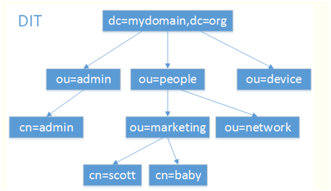

图 2 LDAP组织数据的方式（DIT~Data Information Tree数据信息树）

说明：树型目录。

1. 条目Entry：也叫记录项，是LDAP中最基本的颗粒，就像字典中的词条，或者是数据库中的记录。通常对LDAP的添加、删除、更改、检索都是以条目为基本对象的。
   
   * DN：Distinguished Name，每一个条目都有一个唯一的标识名。
   * Base DN： LDAP目录树的最顶部即根结点，如上图的Base DN="dc=mydomain,dc=org"。
   * RDN：一般指DN逗号最左边的部分，特指管理LDAP中信息的最高权限用户。
     通过DN的层次型语法结构，可以方便地表示出条目在LDAP树中的位置，通常用于检索。

2. Attribute: 属性，每个条目都可以有很多属性（Attribute），比如常见的人都有姓名、地址、电话等属性。每个属性都有名称及对应的值，属性值可以有单个、多个，比如你有多个邮箱。

3. ObjectClass: 对象类，对象类是属性的集合，通过对象类可以方便的定义条目类型。每个条目可以直接继承多个对象类，这样就继承了各种属性。对象类有三种类型：结构类型（Structural）、抽象类型(Abstract)和辅助类型（Auxiliary）。
   
   * 结构类型是最基本的类型，它规定了对象实体的基本属性，每个条目属于且仅属于一个结构型对象类。
   * 抽象类型可以是结构类型或其他抽象类型父类，它将对象属性中共性的部分组织在一起，称为其他类的模板，条目不能直接集成抽象型对象类。
   * 辅助类型规定了对象实体的扩展属性。每个条目至少有一个结构性对象类。

表格 4 LDAP基本术语

| 概述                     | 别名     | 语法               | 描述               | 值(举例)                      |
| ---------------------- | ------ | ---------------- | ---------------- | -------------------------- |
| commonName             | cn/uid | Directory String | 姓名               | sean                       |
| surname                | sn     | Directory String | 姓                | Chow                       |
| organizationalUnitName | ou     | Directory String | 单位（部门）名称         | IT_SECTION                 |
| organization           | o      | Directory String | 组织（公司）名称         | example                    |
| telephoneNumber        |        | Telephone Number | 电话号码             | 110                        |
| owner                  |        | DN               | 该条目拥有者           | cn=doubao,ou=ops,dc=shuyun |
| jpegPhoto              |        | Binary           | JPEG照片           |                            |
| objectClass            |        |                  | 对象类              | organizationalPerson       |
|                        |        |                  |                  |                            |
| Entry                  | 条目     |                  |                  |                            |
| Distinguished  Name    | DN     |                  | 每一个条目都有一个唯一的标识名。 |                            |
|                        | DC     |                  | 一条记录所属区域         |                            |

#### 3.2.3.3     LDAP使用

**LDIF**

LDIF（LDAP Data Interchange Format，数据交换格式）是LDAP数据库信息的一种文本格式，用于数据的导入导出，每行都是“属性: 值”对，见 [openldap ldif格式示例](http://seanlook.com/2015/01/22/openldap_ldif_example/)

**LDAP服务端配置**

OpenLDAP(2.4.3x)服务器安装配置方法见 [这里](http://seanlook.com/2015/01/21/openldap-install-guide-ssl/)。

**LDAP客户端模块支持**

[PHP](http://lib.csdn.net/base/php)默认并不启用LDAP支持，[php](http://lib.csdn.net/base/php)的LDAP模块依赖于[OpenLDAP](ftp://ftp.openldap.org/pub/OpenLDAP/openldap-release/)或[bind9.net](http://www.bind9.net/download-openldap/)提供的客户端LDAP库，你必须在编译的时候使用 --with-ldap[=DIR] 才行，如果你想要SASL支持，那还必须使用 --with-ldap-sasl[=DIR] 选项，而且你的系统中必须有 sasl.h 头文件才行。

**LDAP客户端访问**

LDAP中也是利用登陆名和密码进行验证，LDAP中会定义一个属性password，用来存放用户密码，而登陆名使用较多的都是mail地址。那怎么样才能正确的用LDAP进行身份验证呢，下面是一个正确而又通用的**步骤**（五大步基于LDAP的一个 “两次绑定” 验证方法）：

说明：绑定有两种，即WEB服务器的用户绑定和请求用户的绑定。实际使用中可只需一次绑定即用户的绑定（如支持匿名绑定搜索）。

1. 从客户端得到登陆名和密码。注意这里的登陆名和密码一开始并没有被用到。
2. bind：先匿名绑定bind到LDAP服务器，如果LDAP服务器没有启用匿名绑定，一般会提供一个默认的用户，用这个进行绑定即可。（若绑定失败，即可认定LDAP验证失败）
3. search搜索：，当上一步绑定成功以后，需要执行一个搜索，而filter就是用登陆名来构造，形如： "(|(uid=$login)(mail=$login))" ，这里的login就是登陆名。搜索执行完毕后，需要对结果进行判断，如果只返回一个entry，这个就是包含了该用户信息的entry，可以得到该entry的DN，后面使用。如果返回不止一个或者没有返回，说明用户名输入有误，应该退出验证并返回错误信息。（可将搜索返回的信息作为注册用户信息）
4. 再次bind用户：上一步执行时得到了用户信息所在的entry的DN，这里就需要用这个DN和第一步中得到的password重新绑定LDAP服务器。
5. bind用户结果的处理：如果能成功绑定，那么就说明验证成功，如果不行，则应该返回密码错误的信息。

### 3.2.4 Kerberos

Kerberos这一名词来源于希腊神话“三个头的狗——地狱之门守护者”，后来沿用作为安全认证的概念，该系统设计上采用客户端/服务器结构与DES、AES等加密技术，并且能够进行相互认证，即客户端和服务器端均可对对方进行身份认证。
可以用于防止窃听、防止replay攻击、保护数据完整性等场合，是一种应用对称密钥体制进行密钥管理的系统。

Kerberos提供一个中心认证服务器，提供用户到服务器和服务器到用户的认证服务。

#### 用户篇

```sh
$ sudo apt-get install krb5-kdc krb5-admin-server
# 配置，设置ACL权限
$ sudo dpkg-reconfigure krb5-kdc
$ vi /etc/krb5.conf

$ vi /etc/krb5kdc/kdc.conf

$ vi /etc/krb5kdc/kadm5.ac

$ sudo service krb5-admin-server restart

# 设置证书
$ kinit steve/admin

# 查看
$ klist
```

#### 原理篇

**概念**

* Principal：任何服务器所提供的用户、计算机、服务都将被定义成Principal。
* Instances：用于服务principals和特殊管理Principal。
* Realms：Kerberos安装提供的独特的域的控制，把它想象成你的主机和用户所属的主机或者组。官方约定这域需要大写。默认的，Ubuntu将把DNS域名转换为大写当成这里的域。
* Ticket Granting Ticket (TGT)：票据授权票据。用于应用程序与KDC服务器建立安全会话的票据TGT，TGT存在有效期。当TGT失效后，需要重新建立与KDC的安全会话，会话有效期在24小时，不可配置。TGT由认证服务器（AS）签发，TGT使用用户的密码加密，这个密码只有用户和KDC知道。
* 服务票据(ST- Service Ticket)：用于应用程序与服务端建立安全会话的票据，服务票据存在有效期，当服务票据失效后，应用侧需要重新建立与服务端的安全会话。默认有效期为5分钟，不可配置。
* Tickets：确认两个Principal的身份。一个主体是用户，另一个是由用户请求的服务。门票会建立一个加密密钥，用于在身份验证会话中的安全通信。
* Keytab Files：从KDC主数据库中提取的文件，并且包含的服务或主机的加密密钥。

**服务器**

* Key Distribution Center (KDC)：密钥分发中心。KDC由三部分组成，一是principal数据库，认证服务器，和票据授予服务器。每个Realm至少要有一个。

* Ticket Granting Server: (TGS) ：票据授权服务器。根据请求签发服务的票据。

* AS：认证服务器。

总得来讲就是，一个域至少包含一个KDC，最好能有更多的冗余，它包含一个principal数据库。当用户登录一个被Kerberos认证定义的工作站中，KDC发布一个TGT。如果用户提供的证书匹配，用户得到认证，之后就能从TGS请求被kerberos注册过的服务的票据，用户凭票据就可以认证并访问服务，而不需要再提供用户名和密码。

备注：Kerberos是一个时间敏感的协议。因此，如果客户机和服务器之间的本地系统时间超过五分钟（默认情况下），工作站将无法进行身份验证。要纠正这个问题，所有的主机都应该把自己的时间与统一一个（NTP）服务器同步。

 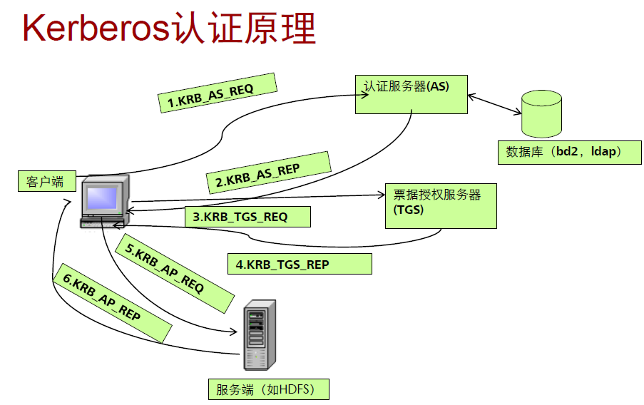

图 kerberos认证原理

step1&2:  KRB_AS_REQ & KRB_AS_REP,  客户端到AS的 认证请求和响应。验证*用户*是否合法。

step3&4:  KRB_TGS_REQ & KRB_TGS_REP,  客户端到TGS的 认证请求和响应。获取票据授权票据TGT。

step5&6:  KRB_AP_REQ & KRB_AP_REP,  客户端到AP服务端的 认证请求和响应。验证TGT票据是否合法。

Kerberos采用传统加密算法（无公钥体制DES）。

C/S环境下三种可能的安全方案

* 相信每一个单独的客户工作站可以保证对其用户的识别，并依赖于每一个服务器强制实施一个基于用户标识的安全策略。 (基于用户标识的识别)
* 要求客户端系统将它们自己向服务器作身份认证，但相信客户端系统负责对其用户的识别。
* 要求每一个用户对每一个服务证明其标识身份，同样要求服务器向客户端证明其标识身份。

Kerberos支持以上三种策略。总体方案是提供一个可信第三方的认证服务。

**方案的详细描述：**

**1)一次签名：**

第一次首先需要证书的实体将自己的信息和公钥提交给CA，CA确认该组织的可信赖之后，就用自己的密钥对该实体的信息和公钥进行签名。最后被签名的信息就叫证书。

**2)二次签名**

用户首先接到一个证书，然后根据CA（可信）提供的公钥进行解密。解密后再由用户发服务许可。

### 3.2.5 数字签名

参照：  JSON Web Signature (JWS) [[JWS](https://datatracker.ietf.org/doc/html/rfc7519#ref-JWS)]

在金融和商业等系统中，许多业务都要求在单据上进行签名或加盖印章，证实其真实性，以备日后检查，可是在利用计算机网络来传送报文时，显然不能用手签的方法，在计算机中我们可以采用数字签名的方法，利用公开密钥来实现数字签名，从而代替传统的签名。

  为使数字签名能代替传统的签名，必须满足下面三个条件：

  （1）接收者能够核实发送者对报文的签名；

  （2）发送者事后不能抵赖对其报文的签名；

  （3）接收者无法伪造对报文的签名。

​     数字签名操作具体过程如下：首先是生成被签名的电子文件（《电子签名法》中称数据电文），然后对电子文件用散列算法做数字摘要，再对数字摘要用签名私钥做非对称加密，即作数字签名；之后是将以上的签名和电子文件原文以及签名证书的公钥加在一起进行封装，形成签名结果发送给收方，待收方验证。

数字签名验证过程：接收方收到数字签名的结果，其中包括数字签名、电子原文和发方公钥(C/S模式中服务器方公钥通常已经知道)，接收方进行签名验证。验证过程是：接收方首先用发方公钥解密数字签名，导出数字摘要，并对电子文件原文做同样散列算法得出一个新的数字摘要；将两个摘要进行结果比较，结果相同则签名得到验证，否则签名无效。这就做到了《电子签名法》中所要求的对签名不能改动，对签署的内容和形式也不能改动的要求。

### 3.2.6  基于证书的认证

近年来相当流行的认证技术应该是基于证书的认证。其实证书就是一个数据块，主要包括公开密钥、主体相关的信息、证书有效的日期、证书发行者的信息和证书发行者生成的签名。

其实整个过程很简单，我就认为是二次数字签名就是了。第一次首先需要证书的实体将自己的信息和公钥提交给CA，CA确认该组织的可信赖之后，就用自己的密钥对该实体的信息和公钥进行签名。最后被签名的信息会就叫证书。站在用户的角度，用户首先接到一个证书，当然会根据CA（可信）提供的公钥进行解密，如果能解密，当然就可以获得可信赖的信息和实体公钥。然后由实体公钥再进行前面我们介绍的数字签名解密步骤。

Pegasus 中基于 SSL 的数据传输流程（协商加密方式为例）如下图所示：
 **Pegasus中基于SSL的数据传输流程**
  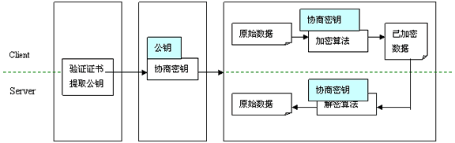

## 3.3  授权

### 3.3.1 OAuth

OAuth协议为用户资源的授权提供了一个安全的、开放而又简易的标准。与以往的授权方式不同之处是OAuth的授权不会使第三方触及到用户的帐号信息（如用户名与密码），即第三方无需使用用户的用户名与密码就可以申请获得该用户资源的授权，因此OAuth是安全的。oAuth是Open Authorization的简写。

表格 5 oAuth版本史

| 版本        | 简介                                                                                                                                                                            | 说明                            |
| --------- | ----------------------------------------------------------------------------------------------------------------------------------------------------------------------------- | ----------------------------- |
| OAuth 1.0 | OAuth Core 1.0 版本发布于2007年12月4日，由于存在可被会话定向攻击(session fixation attack)的缘故，2009年6月24日发布了OAuth Core 1.0 Revision A 版本。最终在2010年4月，OAuth成为了RFC标准： RFC 5849: The OAuth 1.0 Protocol。 | OAuth的标准版本涉及三步流程，分别要访问三个URL。  |
| OAuth 2.0 | 2010年5月初在IETF发布草案。OAuth 2.0是OAuth协议的下一版本，但不[向后兼容](https://baike.baidu.com/item/向后兼容)OAuth1.0。 OAuth 2.0关注客户端开发者的简易性，同时为Web应用，桌面应用和手机，和起居室设备提供专门的认证流程。                         | OAuth 2.0简化开发，流程中去除涉及用户授权的环节。 |

备注：3-Legged OAuth就是通过User的授权，Consumer可以访问User在Service Provider的数据；至于2-Legged OAuth，没有User的参与，只是Consumer和Service Provider的交互。

一个典型的OAuth应用通常包括三种角色，分别是：

* Consumer：消费方
* Service Provider：服务提供者
* User：用户

消费方如果想使用服务提供者的OAuth功能，通常需要先申请两样东西：

* Consumer Key
* Consumer Secret

**OAuth 1.0**

OAuth认证授权就三个步骤：

1. 获取未授权的Request Token。

2. 获取用户授权的Request Token。

3. 用授权的Request Token换取Access Token

上面三步分别对应于三个URL：Request Token URL、User Authorization URL 和 Access Token URL。

 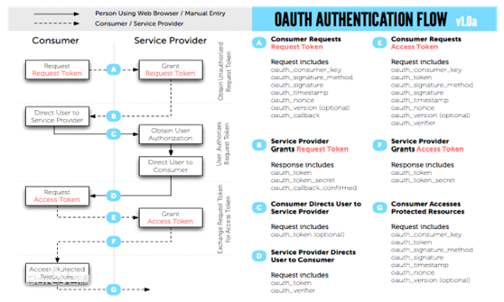

图 3 OAuth流程

说明：

* A：消费方请求Request Token
* B：服务提供者授权Request Token
* C：消费方定向用户到服务提供者
* D：获得用户授权后，服务提供者定向用户到消费方
* E：消费方请求Access Token
* F：服务提供者授权Access Token
* G：消费方访问受保护的资源

**OAuth 2.0**

OAuth 2.0定义了四种授权方式。

* 授权码模式（authorization code）
* 简化模式（implicit）
* 密码模式（resource owner password credentials）
* 客户端模式（client credentials）

> 备注：在API市场的API授权管理使用中， 消费者key常指appid，消费者secret指静态token。通过静态token获取动态token，动态token验证是否过期、是否已授权（若未授权需要在API市场订阅，订阅过程会获取提供方的授权token）。

**示例：twitter/google/azure**

https://raw.githubusercontent.com/dpgaspar/Flask-AppBuilder/master/examples/oauth/config.py

```python
OAUTH_PROVIDERS = [
  {'name':'twitter', 'icon':'fa-twitter',
    'remote_app': {
      'consumer_key': os.environ.get('TWITTER_KEY'),
      'consumer_secret': os.environ.get('TWITTER_SECRET'),
      'base_url': 'https://api.twitter.com/1.1/',
      'request_token_url': 'https://api.twitter.com/oauth/request_token',
      'access_token_url': 'https://api.twitter.com/oauth/access_token',
      'authorize_url': 'https://api.twitter.com/oauth/authenticate'}
  },
  {'name': 'google', 'icon': 'fa-google', 'token_key': 'access_token',
    'remote_app': {
      'consumer_key': os.environ.get('GOOGLE_KEY'),
      'consumer_secret': os.environ.get('GOOGLE_SECRET'),
      'base_url': 'https://www.googleapis.com/oauth2/v2/',
      'request_token_params': {
       'scope': 'email profile'
      },
      'request_token_url': None,
      'access_token_url': 'https://accounts.google.com/o/oauth2/token',
      'authorize_url': 'https://accounts.google.com/o/oauth2/auth'}
  },
  {'name': 'azure', 'icon': 'fa-windows', 'token_key': 'access_token',
    'remote_app': {
      'consumer_key': os.environ.get('AZURE_APPLICATION_ID'),
      'consumer_secret': os.environ.get('AZURE_SECRET'),
      'base_url': 'https://login.microsoftonline.com/{AZURE_TENANT_ID}/oauth2',
      'request_token_params': {
       'scope': 'User.read name preferred_username email profile',
       'resource' : os.environ.get('AZURE_APPLICATION_ID'),
      },
      'request_token_url': None,
           'access_token_url':'https://login.microsoftonline.com/{AZURE_TENANT_ID}/oauth2/token',
  'authorize_url':'https://login.microsoftonline.com/{AZURE_TENANT_ID}/oauth2/authorize'}
  }
]
# OAuth 2.0去除了用户鉴权步骤，即 request_token_url=None
```

## 3.4  HTTPS

### 3.4.1 HTTPS原理

HTTPS 区别于 HTTP，它多了加密(encryption)，认证(verification)，鉴定(identification)。它的安全源自非对称加密以及第三方的 CA 认证。

 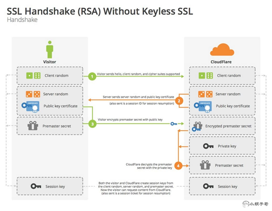

图 4 HTTPS的运作方式

如上图所示，简述如下：

* 客户端生成一个随机数 random-client，传到服务器端（Say Hello)
* 服务器端生成一个随机数 random-server，和着公钥，一起回馈给客户端（I got it)
* 客户端收到的东西原封不动，加上 premaster secret（通过 random-client、random-server 经过一定算法生成的东西），再一次送给服务器端，这次传过去的东西会使用公钥加密
* 服务器端先使用私钥解密，拿到 premaster secret，此时客户端和服务器端都拥有了三个要素：random-client、random-server 和 premaster secret
* 此时安全通道已经建立，以后的交流都会校检上面的三个要素通过算法算出的 session key

### 3.4.2 证书

CA 认证分为三类：DV ( domain validation)，OV ( organization validation)，EV ( extended validation)，证书申请难度从前往后递增，貌似 EV 这种不仅仅是有钱就可以申请的。

两个发放免费 CA 的机构：StartSSL 和 CAcert。

**StartSSL**

StartSSL 隶属于一家以色列商业公司 [StartCOM](http://www.startcom.org/)，是 StartCom Linux 操作系统的生产供应商。由 StartCom 提供的大多数解决方案都基于开源技术和开放标准。StartCom 自 2005 年开始经营 StartCom 认证机构（StartCOM CA），即由 StartSSL 负责运营。StartSSL已于2016年被 WoSign（一家中国 CA，2002年成立）收购。因隐瞒了收购同行的主导权与架构的转移，伪造SHA-1凭证的分发日期，2017年先后被Mozilla、苹果和谷歌封锁。沃通([WoSign](https://buy.wosign.com/)/WoTrus)自2017年9月26日起不再提供在线申请免费电子邮件加密证书的服务，但仍提供免费SSL证书。

**CAcert**

[CAcert.org](http://www.cacert.org/) 是一个社区驱动的安全证书颁发机构，2003年7月注册成立于澳大利亚新南威尔士州。从 2005年10月开始提供 Class 1 和 Class 3 根证书（Root Certificate），Class 3 证书是 Class 1 的具有更高安全性的分支。

### 3.4.3 自签名证书

#### 自签名证书的生成

对于一般的小型网站尤其是博客，可以使用自签名证书来构建安全网络，所谓自签名证书，就是自己扮演 CA 机构，自己给自己的服务器颁发证书。

第一步，为服务器端和客户端准备公钥、私钥

```sh
# 生成服务器端私钥
openssl genrsa -out server.key 1024
# 生成服务器端公钥
openssl rsa -in server.key -pubout -out server.pem

# 生成客户端私钥
openssl genrsa -out client.key 1024
# 生成客户端公钥
openssl rsa -in client.key -pubout -out client.pem
```

第二步，生成 CA 证书

```shell
# 生成 CA 私钥
openssl genrsa -out ca.key 1024
# X.509 Certificate Signing Request (CSR) Management.
openssl req -new -key ca.key -out ca.csr
# X.509 Certificate Data Management.
openssl x509 -req -in ca.csr -signkey ca.key -out ca.crt
```

说明：第二步要手工填写一些数据，如Common Name (e.g. server FQDN or YOUR name)

第三步，生成服务器端证书和客户端证书

```sh
# 服务器端需要向 CA 机构申请签名证书，在申请签名证书之前依然是创建自己的 CSR 文件
$ openssl req -new -key server.key -out server.csr
# 向自己的 CA 机构申请证书，签名过程需要 CA 的证书和私钥参与，最终颁发一个带有 CA 签名的证书
$ openssl x509 -req -CA ca.crt -CAkey ca.key -CAcreateserial -in server.csr -out server.crt

# client 端
$openssl req -new -key client.key -out client.csr
# client 端到 CA 签名
$openssl x509 -req -CA ca.crt -CAkey ca.key -CAcreateserial -in client.csr -out client.crt
```

最后生成的文件如下：

```sh
.
├── https-client.js
├── https-server.js
└── keys
├── ca.crt
├── ca.csr
├── ca.key
├── ca.pem
├── ca.srl
├── client.crt
├── client.csr
├── client.key
├── client.pem
├── server.crt
├── server.csr
├── server.key
└── server.pem
```

#### Chrome配置信任自签名证书

备注：修改后都需要重启浏览器才生效。证书后缀名为crt或cer。

**1.本地证书**
chrome://flags/#allow-insecure-localhost

将此值改为Enabled，即可允许访问localhost/127.0.0.1之类的本地主机自签名。

**2.非本地证书**

1）从浏览器客户端 导出证书，步骤为：‘查看证书’--> 导出

导入证书到chrome，步骤如下：

2）证书管理 --> 选择保存位置为‘受信任的根证书颁发机构’

### 本节参考

[1].   HTTPS证书生成原理和部署细节 https://www.cnblogs.com/liyulong1982/p/6106129.html

[2].   Google Chrome安装证书的方法_百度经验 https://jingyan.baidu.com/article/c843ea0bc4142a77921e4a79.html

[3].   wosign  https://buy.wosign.com/

[4].   腾讯HTTPS性能优化实践 https://baijiahao.baidu.com/s?id=1559840813865463

## 案例

### 天网MAZE的信用卡机制

由于每个Peer都要同时与多个服务器通讯，我们采用了一种类似信用卡机制的分布式认证算法，来确保用户身份认证的安全性和有效性。参考Kerberos机制，我们有信用卡发放机构(TGS: Ticket Grant Server)，称之为用户管理服务器，由它进行用户注册和发放信用卡。用户持有效的信用卡访问其他的服务器，其他的服务器检查信用卡上的数字签名来验证身份，判断是否允许进行某项操作。一个正常的从注册到登录的流程如下：

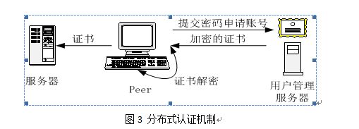

图3 分布式认证机制

1. Peer首先登录到用户管理服务器，申请一个Maze UID账号，申请时把登录密码保存在用户管理服务器上。

2. 账户申请完毕之后，Peer向用户管理服务器请求这个Maze账户的身份认证数据包，同时提交自己的Maze服务端口、自己看到的本地IP地址。

3. 用户管理服务器在身份认证数据包中记录Peer的Maze UID、从用户管理服务器看到的外部IP、Maze服务端口、是否在局域网内（根据Peer提交的自己看到本地IP和心跳服务器看到Peer的外部IP是否一致判断）、用户级别、信用卡失效时间等信息，用系统签名私钥密码对数据包进行数字签名，把整个数据包和其数字签名（我们把它称之为信用卡）用Peer的登录密码进行加密，把加密后的证书返回给Peer。整个算法可以用下列公式表示：
   
   ```sh
   Certificate = Maze ID + IPoutside + Portservice + InGatewayOrNo + Level + ExpireTime …
   Ticket = Certificate + Sign system-private-key (Certificate)
   EncryptedTicket = Ecrypt peer-password (Ticket)
   ```

4. 如果用户在Peer端有正确的登录密码，就可以把加密的数据包解密，从而获得有数字签名的信用卡。

`Ticket = Decrypt peer-password (EncryptedTicket)`

5. 当Peer需要访问其他的服务器（如心跳服务器等）时，出示这个信用卡，服务器用系统签名公钥密码检查数字签名是否正确，以及是否已经过期，如果检查失败，要求Peer重新申请新的信用卡，否则允许下一步操作，也就是登录成功。

这种基于信用卡机制的分布式身份认证算法，可以保证用户密码只在注册初期出现，此后并不在网上明文传送；系统签名密码则只在用户管理服务器上出现，因而从客户端很难破解，这些方法都保证了用户身份认证的安全性。

**总结：**

​     用户注册时，经过了1次摘要，1次非对称加密，1次对称加密：

1) 用户服务器生成证书。证书的组成，Certificate = Maze ID + IPoutside + Portservice + InGatewayOrNo + Level + ExpireTime。
2) 然后对证书作数字签名。数字签名过程：由证书得到数字摘要，然后对数字摘要进行非对称加密，私钥由用户服务器自己保存，形成数字签名 (Sign system-private-key (Certificate))。
3) 对Certificate+数字签名= Ticket用peer密码进行对称加密。最后将这个加密Ticket发送回客户端。

​    用户登陆时，向服务器发出请求，服务器返回EncryptedTicket。用户则用登陆密码对EncryptedTicket进行解密，如果解密成功，就能得到证书+数字签名。用服务器的公钥就能验证是否来自服务器，登陆成功。

### S3认证机制

使用AK, SK方式登陆。AK, SK在app申请s3权限时获取。可参照Amazon s3协议。

Amazon (S3) 是一个公开的服务，Web 应用程序开发人员可以使用它存储数字资产，包括图片、视频、音乐和文档。 S3 提供一个 RESTful API 以编程方式实现与该服务的交互。

### 云盘认证机制

多种认证方式如用户登陆认证等。另外有类似s3中ak/sk的认证方式。

### 双因子认证

双因子认证（2FA，Two-Factor Authentication）是指结合密码以及实物（信用卡、SMS手机、令牌或指纹等生物标志）两种条件对用户进行认证的方法。

为减轻必须携带专用双因子令牌设备所带来的阻力，可以利用无处不在的移动计算平台（如支持Java的手机或通过短信息服务传递的一次性口令）作为双因子客户平台。同时，就像欺诈带来的成本促使银行业采用双因子认证一样，这也是电子商务企业采用双因子认证的主要动力，电子支付行业团体，如PCI和APACS已经开始强制使用双因子认证。这一机制很快将会成为认证领域的通用作法，不久以后我们就会对仅仅采用密码认证的系统产生强烈的不信任感。

示例案例：gitlab登陆

<br>

### 扫码登陆

<br>

### 单点登陆SSO

单点登录，英文是 Single Sign On，缩写为 SSO。多个站点(192.168.1.20X)共用一台认证授权服务器(192.168.1.xxx，用户数据库和认证授权模块共用)。用户经由其中任何一个站点(比如 192.168.1.201)登录后，可以免登录访问其他所有站点。而且，各站点间可以通过该登录状态直接交互。

<br>

## 本章参考

* 认证和 授权(Authentication和Authorization) https://www.cnblogs.com/jiaoxh/p/5531528.html
* SASL https://baike.baidu.com/item/sasl/5292142
* JAAS  https://baike.baidu.com/item/JAAS
* JAAS基础 https://www.aliyun.com/jiaocheng/344430.html
* oAuth  https://baike.baidu.com/item/oAuth
* LDAP  https://baike.baidu.com/item/LDAP
* LDAP服务器的概念和原理简单介绍https://www.cnblogs.com/yjd_hycf_space/p/7994597.html
* [LDAP基础概念](http://407711169.blog.51cto.com/6616996/1439623)
* [LDAP-HOWTO](http://www.tldp.org/HOWTO/LDAP-HOWTO/ldapbackends.html)
* openldap doc admin24  http://www.openldap.org/doc/admin24/
* RBAC权限管理模型：基本模型及角色模型解析及举例 www.woshipm.com/pd/440765.html
* RBAC权限模型——项目实战 https://blog.csdn.net/zwk626542417/article/details/46726491
* RBAC http://csrc.nist.gov/groups/SNS/rbac/index.html
* 理解OAuth 2.0 http://www.ruanyifeng.com/blog/2014/05/oauth_2_0.html
* 微博开放接口与企业平台整合的设计与实现http://www.doc88.com/p-4834172007596.html
* "[About two-factor authentication](https://docs.github.com/en/articles/about-two-factor-authentication)"
* Configuring two-factor authentication  https://docs.github.com/en/authentication/securing-your-account-with-two-factor-authentication-2fa/configuring-two-factor-authentication
* 双因子认证机制  https://baike.baidu.com/item/%E5%8F%8C%E5%9B%A0%E5%AD%90%E8%AE%A4%E8%AF%81%E6%9C%BA%E5%88%B6
* Amazon S3 https://aws.amazon.com/cn/s3/
* 手机扫码登录实现原理  https://www.pianshen.com/article/27971152041/

<br>

# 4 安全编程

* 代码审视 code review：编码规范、安全审视
* 安全工具：codex安全云

## 4.1  内存管理

对于内存管理程序。程序员可能犯的错误是：

* 释放一个内存块但继续引用其中的内容；(delete xxx; xxx=NULL;)
* 分配一个内存块并使用其中未经初始化的内容；(memset)
* 调用realloc对一个内存块进行扩展，因此原来的内容发生了存储位置的变化，但程序引用的仍是原来存储位置的内容；
* 分配一个内存块后即“失去”了它，因为没有保存指向所分配内存块的指针；
* 读写操作越过了所分配内存块的边界；
* 没有对错误情况进行检查。(返回值判断)

示例: 复制一个不重叠的内存块

memcpy

```c
//用预编译符号来分隔DEBUG与RELEASE版本,做到臃肿缓慢与整洁快速的融合,通常DEBUG时使用有额外检查的版本
void* memcpy(void* pvTo, void* pvFrom, size_t size)
{
  void* pbTo = (byte*)pvTo;
  void* pbFrom = (byte*)pvFrom;
  #ifdef DEBUG
  if(pvTo == NULL | | pvFrom == NULL)
  {
    fprintf(stderr, “Bad args in memcpy\n”);
    abort();
  }
  #endif
  while(size-->0)
    *pbTo++ == *pbFrom++;
  return(pvTo);
}
```

## 4.2  安全编程实践

### 4.2.1 使用断言进行防止错误

上面memcpy那段深着色的额外检索可用下面简单断言来替换,

`assert(pvTo != NULL && pvFrom != NULL);`

assert的实现就是宏,因此可以定义自己的断言函数,比如出了错误继续运行,只是把错误记录下来,这是预防性编程.

## 4.3  语言相关的安全编码

### 4.3.1 net中使用安全函数

strcpy-->strcpy_s

xxx-->xxx_s

### 4.3.2 PHP代码执行漏洞

**代码执行函数**

PHP中可以执行代码的函数。如eval()、assert()、system()、exec()、shell_exec()、passthru()、 escapeshellcmd()、pcntl_exec() 等

**文件包含代码注射**

文件包含函数在特定条件下的代码注射，如include()、include_once()、 require()、require_once()。

当allow_url_include=On ，PHP Version>=5.2.0 时，导致代码注射。

include.php

```php
<?php
include($_GET[‘a’]);
?>
```

URL： [http://localhost/test/ include.php?a=data:text/plain,%3C?php%20phpinfo();?%3E](http://localhost/test/include.php?a=data:text/plain,)

**正则匹配代码注射**

众所周知的preg_replace()函数导致的代码注射。当pattern中存在/e模式修饰符，即允许执行代码。这里我们分三种情况讨论下

1 ). preg_replace() pattern 参数注射

pattern即第一个参数的代码注射。
 当magic_quotes_gpc=Off时，导致代码执行。

demo code 3.1:
preg_replace1.php

```php
<?php
 echo $regexp = $_GET[‘reg’];
 $var = ‘<php>phpinfo()</php>’;
 preg_replace(“/<php>(.*?)$regexp”, ‘\1’, $var);
 ?>
```

URL：preg_replace1.php?reg=%3C/php%3E/e

2 ). preg_replace() replacement参数注射

replacement即第二个参数的代码注射，导致代码执行。

3 ). preg_replace() 第三个参数注射

我们通过构造subject参数执行代码。

## 4.4 源码保护

### Java源码保护

### python源码保护

方法一(入门级):  源码py 到 字节码 pyc 的转化, windows环境生成的文件在`__pycache__`目录.

```shell
# 编译: 依赖模块 py_compile 或 compileall
$ python -m py_compile *.py

# 反编译: 依赖模块 uncompile
$ uncompyle6 xx.cpython-38.pyc > xx.py
```

方法二: 代码混淆, 通过变量名替换等方法 让代码变得难读.  常用混淆库有**pyobfuscate**, pyminifier

```sh
$ pip install pyminifier
$ pyminifier --nonlatin --replacement-length=10 -O xx.py

# 或者 base64编码 + lzma加密
$ pyminifier --lzma "xx.py"
import lzma, base64
exec(lzma.decompress(base64.b64decode('/Td6WFoAAATm1rRGAgAhARYAAAB0L+Wj4AC9AIddADSbSme4Ujxz0DHnfZG4YVh3r9CsdtAwW4DRCnyvCgYFNNvit5ucVyZEXm0xrZQFnMmnv5z9aXgGq8oGWLMz+nFaI+A7zI5M115jvtlkHe2PTQ44cNNJgVhXoX718yXUd9RQuI13Z9g+nUZiG4oGdJRmK7JehLK/UQ2Tic8JFOCKT4lM8+hv4AAAZj5170QAhWgAAaMBvgEAALPN0p2xxGf7AgAAAAAEWVo=')))
# Created by pyminifier (https://github.com/liftoff/pyminifier)
```

方法三: .pyd或.so加密

使用cpython,  将 `.py`/`.pyx` 编译为 `.c` 文件，再将 `.c` 文件编译为 `.so`(Unix) 或 `.pyd`(Windows)

```sh
# 在dist目录得到 pyd文件
$ pip install jmpy3
$ jmpy -i "XX.py" -m 0
```

可能问题: 若代码版本不支持在cpython, 兼容成本较大.

方法四:  订制python解释器

其它方法: 使用py2exe(只选用于windows), 第三方包

<br>

## 本章参考

* 高级应用 (virbox.com)   https://h.virbox.com/virboxlm/高级应用-1902089.html
* python代码加密——编译与反编译方法总结 https://blog.csdn.net/submarineas/article/details/93723421
* 如何防止你的代码被窃取？Python代码加密方案汇总（带实例验证） https://blog.csdn.net/weixin_43207777/article/details/108351862
* Python源码寻宝记——地图篇  https://www.lightxue.com/python-internals-locate-source-code

# 5  安全算法

详见 《[安全算法.md](../软件可复用/algo/安全算法.md)》

<br>

# 6 安全架构

# 云安全

## 云安全事件案例

**云平台自身安全带来的安全事件**

2013年1月31日亚马逊云计算服务出现大规模中断，影响DropBox等大量用户

2013年1月28日Facebook出现2-3小时中断

2013年2月1日微软Office 365、Outlook.com等云服务出现中断影响大量用户邮件收发、文件处理

2013年3月18-19日Google Drive 中断17个小时，导致大量用户无法访问自己云上的文件信息

2013年3月3日CLoudFlare网站崩溃将近1小时，导致785000个网站无法访问

**分析**：云平台的可用性是云安全问题之一，云平台服务端造成的损失远比非云要大得多。

**新浪SAE云计算平台**

新浪SAE的Java版本一处可越权访问其他目录 http://www.wooyun.org/bugs/wooyun-2010-042106

新浪SAE的Java版本一处权限不严可扫内网 http://www.wooyun.org/bugs/wooyun-2010-041694

SAE内容审核平台管理员弱口令漏洞 http://www.wooyun.org/bugs/wooyun-2010-020288

新浪SAE沦陷，oauthtoken/安全密码全部泄露，hack任意app http://www.wooyun.org/bugs/wooyun-2010-011189

新浪SAE云平台文件系统沙箱绕过 http://www.wooyun.org/bugs/wooyun-2010-03687

**分析**：攻击者可通过云计算平台自身的漏洞攻击云平台,获取云平台管理权限，或者直接攻击云平台的用户从而造成大规模的危害.

**云平台数据泄漏导致的安全事件**

Evernote遭到黑客攻击，5000万用户密码需重 http://digi.tech.qq.com/a/20130304/000111.htm

1200万苹果设备ID泄露，源头并非FBI http://www.ctocio.com/ccnews/8524.html

ChinaCache云主机openssl漏洞(控制用户主机系统) http://www.wooyun.org/bugs/wooyun-2010-056291

苹果开发者中心被黑，导致大量用户信息泄漏

http://www.tripwire.com/state-of-security/security-data-protection/apples-development-center-breached-by-hackers/

出去偷情被现场直播，iCloud导致离婚案件越来越多http://roll.sohu.com/20140420/n398525059.shtml

黑客在ebay上花费$50 to $150 买被锁的IPOHONE，然后通过icloud解锁。http://hackersnewsbulletin.com/2014/05/hackers-claim-hack-apples-icloud-server-unlock-30000-stolen-iphones.html

分析：云平台数据泄漏影响的用户将是海量的，涉及的经济损失更是无法估算，其中以icloud为例其中大量的通讯录、照片、私人日记等。

## 云计算带来的安全挑战

| 云计算特点    | 安全威胁                                                                                                                     |
| -------- | ------------------------------------------------------------------------------------------------------------------------ |
| 数据和服务外包  | （1）隐私泄露  （2）代码被盗                                                                                                         |
| 多租户和跨域共享 | （1）信任关系的建立、管理和维护更加困难。（2）服务授权和访问控制变得更加复杂。<br>（3）反动、黄色、钓鱼欺诈等不良信息的云缓冲。（4）恶意SaaS应用。                                          |
| 虚拟化      | （1）用户通过租用大量的虚拟服务使得协同攻击更容易，隐蔽性更强；  <br/>（2）资源虚拟化支持不同租户的虚拟资源部署在相同的物理资源上,方便了恶意用户借助共享资源实施攻击。<br/>（3）虚拟机的动态迁移，使得攻击的面更大，且很难追踪。 |

## 应用：安全云/云查杀

主要服务商：趋势科技、瑞星、360、QQ管家。

病毒/木马识别——特征识别

种类越来越多;特征越来越细

特征的存储与识别: 存储容量越来越大;识别计算耗时越来越长

利用云的计算能力, 扩展云的思想——扩大特征码的搜集效率.

**云时代的安全威胁**

* 共享技术漏洞
* 数据丢失与数据泄露
* 恶意内部用户
* 账户服务及传输劫持
* 不安全的APIs
* 服务的恶意使用
* 不确定风险预测

**研究热点**

* 不可信任的服务上建立整体可信的服务链
* 第三方托管
* 动态边界的安全控制
* 虚拟化与安全

# 业界案例

## 华为的安全白皮书

**信息安全项**

* 信息安全维度：权限、设备、人员、奖惩
* 安全级别：外部公开、内部公开、秘密、机密、绝密
* BUG级别：严重、一般和提示。
* 安全违规级别：从1~4，危险度依次降低。

**概述**

 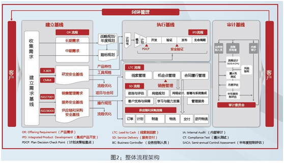

图 5 华为整体流程框架

**IPD流程**

 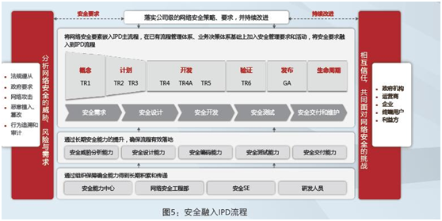

图 6 华为的安全融入IPD流程

 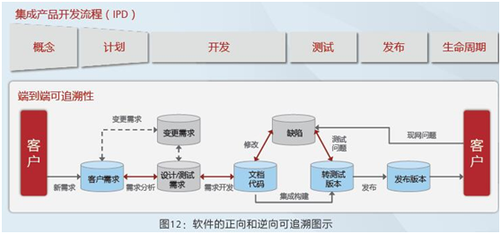

图 7 华为集成产品开发流程IPD的软件部分

 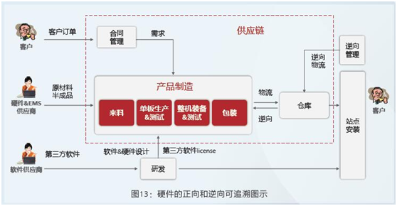

图 8 华为硬件的正向和逆向可追溯图示

<br>

# 参考资料

官网

* Kerberos MIT Doc官方网址：http://web.mit.edu/kerberos/krb5-latest/doc/index.html
* OpenLdap官方网址：http://www.openldap.org
* [JSON Web Tokens - jwt.io](https://jwt.io/)  https://jwt.io/

<br>

# 附录

## 安全相关法律法规

**行政法规**  （多数修订时间是2011-01-08，根据2011年1月8日《[国务院关于废止和修改部分行政法规的决定](https://baike.baidu.com/item/国务院关于废止和修改部分行政法规的决定/19652267)》修订。

* 《[全国人民代表大会常务委员会关于维护互联网安全的决定](https://baike.baidu.com/item/%E5%85%A8%E5%9B%BD%E4%BA%BA%E6%B0%91%E4%BB%A3%E8%A1%A8%E5%A4%A7%E4%BC%9A%E5%B8%B8%E5%8A%A1%E5%A7%94%E5%91%98%E4%BC%9A%E5%85%B3%E4%BA%8E%E7%BB%B4%E6%8A%A4%E4%BA%92%E8%81%94%E7%BD%91%E5%AE%89%E5%85%A8%E7%9A%84%E5%86%B3%E5%AE%9A/2590130)》  首版2000年12月28日颁布。
* 《[计算机信息网络国际联网安全保护管理办法](https://baike.baidu.com/item/%E8%AE%A1%E7%AE%97%E6%9C%BA%E4%BF%A1%E6%81%AF%E7%BD%91%E7%BB%9C%E5%9B%BD%E9%99%85%E8%81%94%E7%BD%91%E5%AE%89%E5%85%A8%E4%BF%9D%E6%8A%A4%E7%AE%A1%E7%90%86%E5%8A%9E%E6%B3%95)》  首版公安部于1997-12-16颁布，1997-12-30实施。

表格  中国安全相关法律法规列表

| 法律法规                                                                                                                                                                                                                                                       | 实施时间       | 颁布时间       | 发布单位                                                                  | 主要内容                  |
| ---------------------------------------------------------------------------------------------------------------------------------------------------------------------------------------------------------------------------------------------------------- | ---------- | ---------- | --------------------------------------------------------------------- | --------------------- |
| 《[中华人民共和国计算机信息系统安全保护条例](https://baike.baidu.com/item/%E4%B8%AD%E5%8D%8E%E4%BA%BA%E6%B0%91%E5%85%B1%E5%92%8C%E5%9B%BD%E8%AE%A1%E7%AE%97%E6%9C%BA%E4%BF%A1%E6%81%AF%E7%B3%BB%E7%BB%9F%E5%AE%89%E5%85%A8%E4%BF%9D%E6%8A%A4%E6%9D%A1%E4%BE%8B)》<br/> （2011年修订） | 1994-02-18 | 1994-02-18 | 国务院                                                                   |                       |
| 《[中华人民共和国保守国家秘密法](https://baike.baidu.com/item/%E4%B8%AD%E5%8D%8E%E4%BA%BA%E6%B0%91%E5%85%B1%E5%92%8C%E5%9B%BD%E4%BF%9D%E5%AE%88%E5%9B%BD%E5%AE%B6%E7%A7%98%E5%AF%86%E6%B3%95/3111)》<br>（2010年修订）                                                          | 2010-10-01 | 2010-04-29 | 国家主席令[2010]                                                           |                       |
| 《[中华人民共和国国家安全法](https://baike.baidu.com/item/%E4%B8%AD%E5%8D%8E%E4%BA%BA%E6%B0%91%E5%85%B1%E5%92%8C%E5%9B%BD%E5%9B%BD%E5%AE%B6%E5%AE%89%E5%85%A8%E6%B3%95/525260)》                                                                                         | 2015-07-01 | 2015-07-01 | 国家主席令[2015]第29号                                                       | 其中包括章节-审查监管           |
| 《[中华人民共和国网络安全法](https://baike.baidu.com/item/%E4%B8%AD%E5%8D%8E%E4%BA%BA%E6%B0%91%E5%85%B1%E5%92%8C%E5%9B%BD%E7%BD%91%E7%BB%9C%E5%AE%89%E5%85%A8%E6%B3%95)》                                                                                                | 2017-06-01 | 2016-11-07 | 国家主席令[2017]第53号                                                       | 网络监管                  |
| 《[信息安全技术个人信息安全规范](https://baike.baidu.com/item/%E4%BF%A1%E6%81%AF%E5%AE%89%E5%85%A8%E6%8A%80%E6%9C%AF%E4%B8%AA%E4%BA%BA%E4%BF%A1%E6%81%AF%E5%AE%89%E5%85%A8%E8%A7%84%E8%8C%83)》                                                                            | 2020-10-01 | 2020-03-06 | [全国信息安全标准化技术委员会](https://baike.baidu.com/item/全国信息安全标准化技术委员会/5107223) | 个人信息安全                |
| 《[中华人民共和国数据安全法](https://baike.baidu.com/item/%E4%B8%AD%E5%8D%8E%E4%BA%BA%E6%B0%91%E5%85%B1%E5%92%8C%E5%9B%BD%E6%95%B0%E6%8D%AE%E5%AE%89%E5%85%A8%E6%B3%95/22861124)》                                                                                       | 2021-09-01 | 2021-06-10 | 国家主席令[2021]                                                           | 草案提交2020-07-03。数据安全   |
| 《[中华人民共和国个人信息保护法]()》                                                                                                                                                                                                                                       | 2021-11-01 | 2021-08-20 | 国家主席令[2021]第91号                                                       | 草案提交2020-10-21。个人信息安全 |

备注：颁布时间一般早于或等于实施时间。实施时间即正式生效时间。

### 个人信息安全

个人信息，是指以电子或者其他方式记录的能够单独或者与其他信息结合识别自然人个人身份的各种信息，包括但不限于自然人的姓名、出生日期、身份证件号码、个人生物识别信息、住址、电话号码等。

表格  各国个人信息安全相关政策法规汇总

| 国家   | 政策法规                          | 实施/草案时间    |
| ---- | ----------------------------- | ---------- |
| 中国   | 《中华人民共和国网络安全法》                | 2017-06-11 |
|      | 《信息安全技术个人信息安全规范》              | 2020-10-01 |
|      | 《中华人民共和国个人信息保护法》              | 2021-11-01 |
| 中国香港 | 《个人资料（私隐）条例》（中国香港）            | 2013-04-25 |
| 欧盟   | 《电子通信领域个人数据处理和隐私保护的指令》（ePD指令） | 2017-01-10 |
|      | 《一般数据保护条例》（GDPR）              | 2018-05-25 |
| 美国   | 《隐私法》                         | 1974       |
|      | 《网络信息安全共享法》                   | 2015-10-01 |
| 俄罗斯  | 《俄罗斯联邦信息、信息技术与信息保护法》          | 2006       |
| 菲律宾  | 《保护个人隐私免遭侵犯法案》                | 2014-08-21 |

备注：草案时间一般早于实施时间。政策法律名称里带有草案则为草案时间，否则为实施时间。

## 云安全标准与组织

### 国际

目前主要的云安全标准机构，有：

* ISO/IEC 第一联合技术委员会(ISO/IEC JTC1)
* 国际电信联盟--电信标准化部(ITU-T)
* 美国国家标准技术研究所（NIST）
* 区域标准组织（美国）CIO委员会
* 欧洲网络与信息安全管理局（ENISA ）
* 开放式组织联盟（TheOpenGroup）

国际上比较具有影响力的云安全组织，有：

* 云安全联盟（CSA）
* 分布式管理任务组（DMTF）
* 结构化信息标准促进组织（OASIS）

表格 8 云安全标准列表

| 云安全分类      | 安全子类      | 相关组织、标准(白皮书)                                                                                                                                                                                       |
| ---------- | --------- | -------------------------------------------------------------------------------------------------------------------------------------------------------------------------------------------------- |
| 云安全体系架构及术语 |           | NIST：《云计算参考体系》（标准）  <br/>CSA:《云计算关键领域安全指南》（白皮书）  <br/>ITU-T：《电信领域云计算安全指南》（标准草案）  TheOpenGroup:《云安全和SOA参考架构》（标准）                                                                                    |
| 安全的云       | 身份隐私与访问控制 | OASIS:《身份在云中的使用》（白皮书）  <br/>CSA：《云控制矩阵》(白皮书)，《身份管理与接入控制指导建议书》(白皮书),《云计算安全障碍与缓和措施》（白皮书）  <br/>NIST：《公共云计算中安全域隐私》（标准草案），《通用云计算环境》（标准草案）  <br/>DMTF：《云管理体系结构》(白皮书)  <br/>ISO/IEC：《云计算安全与隐私管理系统》（标准草案） |
|            | 虚拟运行环境安全  | ISO/IEC：《ISO/IECDIS17203》—虚拟机迁移（标准草案）  <br/>NIST:《完全虚拟化技术安全指南》（标准）,《云计算安全障碍与缓和措施》（标准草案）                                                                                                            |
|            | 云风险评估     | NIST:《云计算安全障碍与缓和措施》（标准草案）  <br/>ENSIA：《云计算--信息安全保障框架》，《云计算--信息安全的好处，风险和建议》                                                                                                                         |
| 可信的云       | 数据安全与数据隐私 | NIST:《云计算安全障碍与缓和措施》（标准草案）  <br/>CSA:《如何保护云数据》（白皮书）                                                                                                                                                 |
|            | 云审计       | CSA：《云审计》（白皮书）                                                                                                                                                                                     |
|            | 可信云认证     | ITU-TY.3501的可信云服务                                                                                                                                                                                  |
| 可靠的云       | 云容灾与数据备份  | NIST:《云计算安全障碍与缓和措施》（标准草案）                                                                                                                                                                          |
| 可控的云       | 云内容管理     | ISO/IEC：《ISO/IECIDS13187》—一种多虚拟机管理通信协议(标准草案)  <br>DMTF：《云管理体系结构》(白皮书)，《云管理用例与交互》(白皮书)  <br/>NIST:《云计算安全障碍与缓和措施》（标准草案）                                                                              |

### 国内

**1. 全国信息技术标准化技术委员**

组织简介：成立于1983年。受国家标准化管理委员会和工业和信息化部的共同领导，下设17分技术委员会和10个直属工作组。

SOA标准工作组（WGSOA）负责云计算领域的相关标准

* GB/T32400-2015《信息技术云计算概览与词汇》

* GB/T32399-2015《信息技术云计算参考架构》

目前可借鉴信息安全领域标准，身份认证与隐私保护

 《隐私保护框架》、《隐私参照体系架构》等等 数据隐私与安全

 《公钥基础设施安全支撑平台技术框架》、《证书认证系统密码及其相关安全技术规范》等等 风险评估

 《信息安全管理系统》、《风险管理--风险评估技术》等等

**2. 全国信息安全标准化技术委员**

**组织简介：**

 成立于2002年。直属于国家标准化管理委员会，主要负责国家网络安全标准申报、立项、评审等工作。

 技术委员会主要工作范围包括：安全技术、安全机制、安全服务、安全管理、安全评估等领域的标准化技术工作。

**SWG-BDS大数据安全特别工作组**

负责大数据和云计算相关的安全标准化研制工作。具体职责包括调研急需标准化需求，研究提出标准研制路线图，明确年度标准研制方向，及时组织开展关键标准研制工作。

**3. 中国通信标准化协会（CCSA）**

组织简介：2002年12月18日在北京正式成立。

 该协会是国内企、事业单位自愿联合组织起来，经业务主管部门批准，国家社团登记管理机关登记，开展通信技术领域标准化活动的非营利性法人社会团体。

组织成员：目前已有277个研究组织和企业加盟。

表格  中国三大协会的云标准方案

|            | 全国信息技术标准化技术委员                                                  | 全国信息安全标准化技术委员                                                                                                                                                                                    | 中国通信标准化协会（CCSA）                                                                                                                |
| ---------- | -------------------------------------------------------------- | ------------------------------------------------------------------------------------------------------------------------------------------------------------------------------------------------ | ------------------------------------------------------------------------------------------------------------------------------ |
| 成立         | 1983                                                           | 2002                                                                                                                                                                                             | 2002                                                                                                                           |
| 组织 <br/>简介 | SOA标准工作组（WGSOA）负责云计算领域的相关标准                                    | 直属于国家标准化管理委员会，主要负责国家网络安全标准申报、立项、评审等工作。<br>技术委员会主要工作范围包括：安全技术、安全机制、安全服务、安全管理、安全评估等领域的标准化技术工作。 <br/>SWG-BDS大数据安全特别工作组：负责大数据和云计算相关的安全标准化研制工作。具体职责包括调研急需标准化需求，研究提出标准研制路线图，明确年度标准研制方向，及时组织开展关键标准研制工作。 | 该协会是国内企、事业单位自愿联合组织起来，经业务主管部门批准，国家社团登记管理机关登记，开展通信技术领域标准化活动的非营利性法人社会团体。   <br/>组织成员：目前已有277个研究组织和企业加盟。                           |
| 已制定标准      | GB/T32400-2015《信息技术云计算概览与词汇》  <br/>GB/T32399-2015《信息技术云计算参考架构》 |                                                                                                                                                                                                  | 《移动环境下云计算安全技术研究》~由中国联合网络通信集团有限公司牵头，针对移动环境中云计算中面临的安全关键问题进行详细分析和研究。   <br/>《电信业务云安全需求和框架》  ~由中兴通讯股份有限公司牵头，旨在构建电信业务云环境的安全业务云体系框架。 |
| 正在制定标准     |                                                                | 信息安全技术云计算安全参考架构  <br/>云计算服务安全能力评估方法  <br/>桌面云安全技术要求   <br/>信息安全技术政府门户网站云计算服务安全指南  <br/>网站安全云防护平台技术要求  <br/>云计算服务持续监管框架及技术规范  <br/>信息安全技术云计算服务安全指南  <br/>信息安全技术云计算服务安全能力要求                |                                                                                                                                |

中国信通院推出了国内首个云计算服务标准——可信云服务。通过完备性、规范性、真实性三大考核方向，16个可量化指标，可信云对国内云服务商的资质和服务质量提出了标准，这助力了云计算市场发展进入了快车道。
