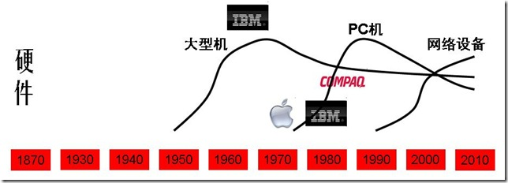

| 序号 | 修改时间  | 修改内容 | 修改人 | 审稿人 |
| ---- | --------- | -------- | ------ | ------ |
| 1    | 2018-5-27 | 创建     | Keefe |        |
| 2 | 2021-12-1 | 调整目录结构，增加行业分类章节。 | 同上 |        |

---

[TOC]

---

# 1 行业概述

## 行业分类

行业分类，是指从事国民经济中同性质的生产或其他经济社会的经营单位或者个体的组织结构体系的详细划分，如[林业](https://baike.baidu.com/item/林业/84154)，[汽车业](https://baike.baidu.com/item/汽车业/9324802)，[银行业](https://baike.baidu.com/item/银行业/2271821)等。行业分类可以解释行业本身所处的发展阶段及其在国民经济中的地位。

国内外比较权威的行业分类标准有六个,这六个分类标准又可划分为管理型和投资型两种类型。

管理型分类：联合国[国际标准产业分类](https://baike.baidu.com/item/国际标准产业分类/22621457)(ISIC)、北美行业分类系统(NAICS)、国家统计局的行业分类标准 和中国证监会的《指引》；

投资型分类：全球行业分类系统([GICS](https://baike.baidu.com/item/GICS/6189047))、富时分类系统([FTSE](https://baike.baidu.com/item/FTSE/6700743))。上证180指数在编制时即采用了投资型的GICS作为行业分类标准。

**新国家标准《国民经济行业分类》**

新国家标准《[国民经济行业分类](https://baike.baidu.com/item/国民经济行业分类)》（GB/T4754-2011）经国家质量监督检验检疫总局、国家标准化管理委员会批准发布，于2011年11月1日实施。根据统计工作的实际情况，从2012年定报统一开始使用。

GB/T 4754-2017《国民经济行业分类》国家标准第1号修改单（以下简称第1号修改单）已经国家标准化管理委员会于2019年3月25日批准，自2019年3月29日起实施。

本标准采用线分类法和分层次编码方法，将国民经济行业划分为门类、大类、中类和小类四级。代码由一位拉丁字母和四位阿拉伯数字组成。GB/T 4754-2017《国民经济行业分类》共有20个门类、97个大类、473个中类、1380个小类。相对于2001年，大类增加了1个，中类增加了41个，小类增加了286个。

A 农、林、牧、渔业； B 采矿业； C 制造业； D 电力、热力、燃气及水生产和供应业；

E 建筑业； F 交通运输、仓储和邮政业； G 信息传输、软件和信息技术服务业； H 批发和零售业；

I 住宿和餐饮业； J 金融业； K 房地产业； L 租赁和商务服务业；

M 科学研究和技术服务业； N 水利、环境和公共设施管理业； O 居民服务、修理和其他服务业； P 教育；

Q 卫生和社会工作； R 文化、体育和娱乐业； S 公共管理、社会保障和社会组织； T 国际组织

**全球行业分类标准**([GICS](https://baike.baidu.com/item/GICS/6189047))

GICS——全球行业分类系统(GICS)是由[标准普尔](https://baike.baidu.com/item/标准普尔/1194194)(S&P)与[摩根斯坦利](https://baike.baidu.com/item/摩根斯坦利)公司(MSCI)于1999年8月联手推出的行业分类系统。

新的标普全球行业分类标准把标普1500指数的成分股分为11个行业部门、24个行业组、68个行业。11个行业部门如下：

基础材料(Materials)——化学品、金属采矿、纸产品和林产品；

消费者非必需品(Unnecessary Consume)——汽车、服装、休闲和媒体；

消费者常用品(Necessary Consume)——日用产品、食品和药品零售；

能源(Energy)——能源设施、冶炼、石油和天然气的开采；

金融(Finance)——银行、金融服务、保险和房地产；

医疗保健(Medical & Health)——经营型医疗保健服务、医疗产品、药品和生物技术；

工业(Industry)——资本货物、交通、建筑、航空和国防；

信息技术(Information technology)——硬件、软件和通讯设备；

电信服务(Telecom)——电信服务和无线通讯；

公用事业(Utilities)——电力设备和天然气设备；

地产业(Real Estate)——房地产开发、管理及相关信托。

## 行业趋势

IBM/华为的矩阵组织架构：产品、客户（行业）、区域。

**重点行业**（类别参见工信部定义）：大金融（银行保险证券）、互联网、科技、能源、智慧城市（交通、IOC）、制造、

**行业周期**：新兴、成长、快速、衰退

**洞察方法论**：PEST（政治经济社会科技，适用于国家洞察）、波特钻石理论模型(国家竞争优势理论)

## 行业巨头

 表格 国内几个头部厂商的重点行业赛道（数字化转型）

| 行业名   | 主要玩家 | 华为云         | 阿里云     | 腾讯云   | 火山引擎（字节） |
| -------- | -------- | -------------- | ---------- | -------- | ---------------- |
|          |          | 智慧零售       | 新零售     |          | 零售             |
| 电商     |          | 电商           | 电商       | 电商     |                  |
| 汽车     |          | 汽车           |            |          | 汽车             |
| 交通物流 |          | 交通物流       | 交通物流   | 交通物流 |                  |
| 金融     |          | 金融           | 金融       | 金融     | 金融             |
| 文旅     |          | 政府及公共事业 | 文旅与出行 | 文旅     | 文旅             |
| 游戏     |          | 游戏           | 游戏       | 游戏     |                  |
| 教育     |          | 教育           | 教育       | 教育     |                  |
| 制造     |          | 制造           | 制造       | 制造     |                  |
| 医疗健康 |          | 医疗健康       | 医疗健康   | 医疗     |                  |
| 文化     |          | 媒体文娱       | 文化产业   | 传媒     |                  |
|          |          | 智慧城市       | 数字政府   | 政务     |                  |
| 能源     |          | 能源           | 能源       |          |                  |
| 农业     |          | 农业及环保     | 地产园区   |          |                  |
|          |          | 工业互联网     |            |          |                  |
| 音视频   |          |                | 音视频     | 音视频   | 泛互联网         |
| ...      |          |                |            |          |                  |

> 说明：行业标准名称来自于国民经济产业分类中的二级分类。

## 技术趋势

可参看：Gartner的技术成熟曲线

任何技术，任何产品都是有生命周期的, 都有起步，成长，成熟和衰退四个阶段.

**起步阶段**：也即一个技术的最初发明，这个时候，也许连最初发明产品的科学家都不知道此技术在市场上究竟如何使用，如何产品化。
**成长阶段**：此项技术被少数先知先觉的，有长远市场洞察力公司转化为产品，逐渐推向市场，被大众认可。此阶段，市场仍旧为蓝海，或因为技术壁垒，或因为市场不够成熟，竞争者较少，利润率较高，是先觉的公司快速增长，猛赚钱的阶段。

**成熟阶段**：此项技术或已经过了专利保护期，或已经被市场上的公司广泛掌握，技术壁垒已经基本消失。此阶段一般分为两个小的阶段：
 第一阶段，大量的公司涌入，使得蓝海市场变为红海，利润率降低，可能产生价格战，称为群雄逐鹿的阶段；
 第 二阶段，少数公司经过良好的市场运作或消灭，或合并其他的公司，最后形成垄断，继续保持较高的利润率，然而会受到反垄断法的困扰，因而往往保留一到两个小 弟做老二老三，从而形成[70-20-10分布](http://googlechinablog.com/2008/11/blog- post.html)，即70%的市场被老大占据，20%的市场被老二老三占据，10%是其他散兵游勇。

**衰退阶段**： 此项技术已经十分成熟，比较少有创新的空间，新技术的产生及代替作用使得利润率降低，哪怕是对垄断性的公司。掌握此项技术的公司已非明星企业，但是不会很 快消亡，因为技术尚在使用，并且没有太多的公司进入，因而能够维持平稳的利润。比如虽然载人飞船已经上天了，马车仍在使用，制造马车的作坊也能实现盈利。

技术生命周期十分重要，尤其是对以技术为生命的IT公司来讲，能否把握好技术生命周期，能否在新技术的初期介入，在技术的衰退期成功退出，是IT公司成功与否的决定性因素。

## 本章参考

* 百度百科-[国民经济行业分类](https://baike.baidu.com/item/国民经济行业分类)   https://baike.baidu.com/item/国民经济行业分类
* 百度百科-全球行业分类标准([GICS](https://baike.baidu.com/item/GICS/6189047))

# 2 TMT

TMT：电信、媒体和科技（Telecommunication，Media，Technology）三个英文单词的首字母，整合在一起，实际是未来电信、媒体\科技（互联网）、信息技术的融合趋势所产生的。

**ICT**：Information、Communication、Technology（信息、通信和科技）。

互联网商业模式的特点：标准化的产品，海量的用户。

## 电商

示例：以阿里巴巴电商为例

表格 1 阿里巴巴业务线

| 功能模块/业务线   | 淘宝 | 天猫 | 天猫国际 |
| ----------------- | ---- | ---- | -------- |
| 商品管理          | √    | √    | √        |
| 会员管理          | √    | √    | √        |
| 交易流程管理      | √    | √    | √        |
| 用户行为追踪      | √    | √    | √        |
| 好中差评、DSR评分 | √    | √    | √        |
| 物流、库存管理    | √    | √    | √        |
| 供应链管理        | NA   | √    | √        |
| 客户投资与举报    | √    | √    | √        |

备注：除了淘宝不需要‘供应链管理’，其它业务线都一致。

表格 2 业务线对应的业务动作

| 功能模块/业务线   | 业务动作                                     |
| ----------------- | -------------------------------------------- |
| 商品管理          | 商品上架、下架、商品名称修改、商品类别修改。 |
| 会员管理          | 新增会员、会员登陆、会员信息修改             |
| 交易流程管理      | 下单、订单支付、确认收货、退货、  退款       |
| 用户行为追踪      | 商品浏览、店铺浏览、网页区块点击             |
| 好中差评、DSR评分 | 做出好评、好评改差评、给订单打分             |
| 物流、库存管理    | 入库、出库、发货、签收                       |
| 供应链管理        | 采购、发货、入库                             |
| 客户投资与举报    | 投诉、举报                                   |

表格 3 数据域对应的业务过程举例

| 数据域       | 业务过程举例（部分）           |
| ------------ | ------------------------------ |
| 会员和店铺域 | 注册、登陆、装修、开店、关店等 |
| 商品         |                                |
| 日志         |                                |
| 交易         |                                |
| 客服和销售   |                                |
| 工具和服务   |                                |
| 互动         |                                |
| 信用风控     |                                |
| 采购分销     | 商品采购（供应链管理）         |
| 互动         |                                |

**构建总线矩阵**

表格 4 数据域的总线矩阵：维度

| 数据域   | 业务过程 | 一致性维度 |      |      |        |        |      |      |
| -------- | -------- | ---------- | ---- | ---- | ------ | ------ | ---- | ---- |
| 供应商   | 业务类型 | 地区       | 仓库 | 类目 | 采购单 | 发货单 |      |      |
| 采购分销 | 采购     | √          | √    | √    | √      | √      | √    |      |
| 发货     | √        | √          | √    | √    | √      |        | √    |      |
| 入库     | √        | √          | √    | √    | √      |        |      |      |

## 新媒体

## 新零售

新零售是一个泛行业，包括电商、消费品零售等行业的综合集合体。典型特征如下：

1. 以消费者为中心。
2. 线上线下融合 OMO
3. 互联网技术与数据技术广泛应用

表格 新零售的数据应用

| 数据应用           | 所属行业 | 数据方案                                   | 数据成果                    | 应用效果       |
| ------------------ | -------- | ------------------------------------------ | --------------------------- | -------------- |
| 基于场景的精准营销 | 互联网   | 收集用户数据                               | 营销建议                    | 提高营销成功率 |
| 线下门店智能发券   | 新零售   | 关联商品分析、顾客购物偏好分析、时效优惠券 | 针对顾客 的推荐商品或优惠券 | 销售额提升     |
| 线下门店竞品分析   |          |                                            | 商品定价建议                |                |

## 本章参考

# 3 制造业

## 消费品

### 鞋服

业务价值链：产品设计、订货会、原材料采购、生产、物流、B端、门店、消费者

# 4 服务业

## 人力资源

### HR业务

业务价值链：选、用、育、留、考

表格 人力资源领域的业务用例目录

| 业务价值链 | 二级场景       | 工作要点及标准                               | 部门 |
| ---------- | -------------- | -------------------------------------------- | ---- |
| 选         | 岗位职能规划   | 岗位级别、岗位职责、岗位业务能力要求等       |      |
|            | 人才选择       | 人员招聘、人才库建立、招聘渠道维护等         |      |
|            | 人才引进       | 面试、人员入职                               |      |
| 用         | 入职培训       | 入职培训、公司业务和规章制度讲解             |      |
|            | 人员日常管理   | 工作安排、工作管理、日常考勤                 |      |
| 育         | 业务培训       | 业务技能培训                                 |      |
|            | 人员成长力测评 | 对人员的业务技术、性格、爱好等进行综合评定   |      |
|            | 职业发展规划   | 对人员进行职业发展规划                       |      |
| 留         | 人员加薪及晋升 | 岗位晋升、级别晋升、薪资调整等               |      |
|            | 人员激励       | 对绩效优秀的员工进行精神及物质层面的激励     |      |
| 考         | 业务考核       | 考核业务KPI指标                              |      |
|            | 能力考核       | 对员工业务能力、发展潜力等进行能力考核及评估 |      |

表格 人力资源的典型数据应用

| 数据应用       | 数据方案                                 | 数据成果             | 应用效果 |
| -------------- | ---------------------------------------- | -------------------- | -------- |
| 高潜力人员评估 | 收集员工行为数据；构建高潜力人员评估模型 | 高潜力人员评估报告   |          |
| 人员离职预测   | 构建能力评估模型、识别人员流失的关键事件 | 员工流失概率预测模型 |          |

### HR变革

HR三支柱模型由Dave Vlrich在1996年提出，在2002年左右引入国内，其核心思想就是把人当作“资本”而不是“资源”，将人力资本当作一项业务经营，重新定位了人力资源部门。从职能导向转向业务导向，要求HR要像业务单元一样运作，以实现业务增值。

人力资源部门要想从“支持业务”变为“业务伙伴”关键是自身要转型——从职能导向转向业务导向。三支柱分别为HRBP、HRCOE和HRSSC。

- HRBP(HR Business Partener，人力资源业务伙伴)是业务的合作伙伴，针对内部客户提供需求，提供相关的咨询服务解决方案；
- HRCOE(HR Centre of Excellence or Center of Expertise，专业知识中心或领域专家)借助专业技能和领先的实践经验设计业务发展导向，创新HR政策；一般几千员工中才配置一个COE。
- HRSSC(HR Shared Service Centre 共享服务中心)是HR标准服务的提供者，绝大多数的事务都可以由SSC来承担。

事务可以用分层式服务模式：66%智能问答，28% SSC服务代表，5% SSC专员，1% COE或者BP。

## 咨询行业

传统咨询服务（咨询1.0）是以传统管理理论为基础，而新一代咨询服务基于数字化技术的应用、以创新技术和实践为基础。

- 咨询1.0：以管理流程、流程优化为主，然后把流程固化到平台上；
- 咨询2.0：围绕数字时代下的数字技术，重点考虑的是数字化技术如何给客户带来价值。“咨询2.0”的主要特征是技术驱动、共同创新、敏捷迭代、共同成长。

# 其它行业

## 房地产业

业务价值链：可行性研究、拿地、设计、建造、营销、转物业及项目复盘

表格  房地产业的业务用例目录

| 业务价值链       | 二级场景               | 工作要点及标准                           | 部门                     |
| ---------------- | :--------------------- | ---------------------------------------- | ------------------------ |
| 可行性研究       | 市场调研               | 由公司内部部门及外部专业机构出具分析报告 | 营销策划部               |
|                  | 可行性分析             |                                          | 营销策划部 、计划部  |
|                  | 项目评估决策           |                                          | 投资战略部、公司高层领导 |
| 拿地             | 项目投标               |                                          | 营销策划部               |
|                  | 项目中标               |                                          | 营销策划部、技术部       |
| 设计             | 项目开发计划           |                                          | 总工室                   |
|                  | 产品策划               |                                          | 营销策划部               |
|                  | 项目策划               |                                          | 技术部、财务部、办公室   |
|                  | 产品设计               |                                          | 技术部                   |
| 建造             | 采购与供应的计划及管理 |                                          | 技术部                   |
|                  | 施工前期准备           |                                          | 工程部                   |
|                  | 现场管理               |                                          | 项目部、技术部           |
|                  | 技术管理               |                                          | 项目部                   |
|                  | 竣工验收               |                                          | 项目部、总工部、技术部   |
| 营销             | 营销计划               |                                          | 营销策划部               |
|                  | 营销推广               |                                          | 营销策划部               |
| 转物业及项目复盘 | 物业交付               |                                          | 项目部、营销策划部       |
|                  | 营销评价               |                                          | 营销策划部               |
|                  | 管理评价               |                                          | 技术部、项目部           |
|                  | 经济评价               |                                          | 财务部                   |

表格 房地产业的典型数据应用

| 数据应用                   | 场景名称     | 背景                         | 数据方案                                           | 数据成果 | 应用效果 |
| -------------------------- | ------------ | ---------------------------- | -------------------------------------------------- | -------- | -------- |
| 产品复盘                   |              |                              | 业主基础信息、外部人群群体画像、投资评测、营销信息 |          |          |
| 楼盘周边洞察               |              | 业主原地址在楼盘周边比重较高 | 购买楼盘周边人群画像                               |          | 定向营销 |
| 渠道洞察                   | 营销效果评估 |                              | 对线上线下渠道进行数字化埋点                       |          |          |
| 购房意向的实时评估         |              |                              |                                                    |          |          |
| 置业顾问效能与客户资源匹配 |              |                              |                                                    |          |          |
| 群诉预警                   |              |                              |                                                    |          |          |
| 基于画像的业务交叉营销     |              |                              | 打通各业务线间的用户数据                           | 用户池   |          |

## 教育

# IT史~浪潮之巅

## 内部规律

**计算机工业生态链**

- ​	摩尔定理
- 安迪-比尔定理以微软为首的软件开发商吃掉硬件提升带来的全部好处，迫使用户更新机器让惠普和戴尔等公司收益，而这些整机生产厂再向英特尔这样的半导体厂订货购买新的芯片、同时向 Seagat e等外设厂购买新的外设。
- ​	反摩尔定理

**信息产业的规律性**

- ​	70-20-10定律：信息产业大公司之间的市场份额大概保持老大70%，老二老三20%, 其它10%.
- ​	诺威格定理，当一个公司的市场占有率超过 50% 后，就无法再使市场占有率翻番了。--》公司需要新的增长点。
- ​	基因决定定理

### IT领域的技术生命周期

IT领域主要分为硬件，软件，通信三大块，下面逐一分析每一块的技术生命周期。

#### 通信领域

**包括有线通信，无线通信，互联网**

AT&T(1876—1995—1999) 包括AT&T、朗讯和 NCR, 贝尔实验室和香农试验室。

Motorola (1928—2010)

**注：1870年左右AT&T在有线通信的起步阶段。**

**注：1940年左右AT&T在有线通信的成熟阶段。Motorola在无线通信的起步阶段。**

**注：1990年左右AT&T在有线通信的衰退阶段。Motorola在无线通信的成长阶段。**

小结：AT&T在有线通信领域一直保持领先，直至互联网时代的到来。Motorola在无线通信领域也是一直保持领先，直至互联网时代落后。

#### 硬件领域

**主要分大型机，PC机和网络设备。也可细分为半导体，硬盘，内存等。**

**IBM: (1923--)** 华生实验室

康柏: (1982--2002) 2002年被惠普收购

Sun: (1982--2009) 2009年被Oracle收购。

**注：1950年左右IBM在大型机市场起步阶段。**

**注：1970年左右IBM在大型机市场成熟阶段，并在PC机起步，同时竞争者有Compaq。**

**注：2000年左右Dell**

#### 软件领域

相比于其他软件行业，中国的互联网行业算是基本跟紧国际潮流，一般晚2到3年。
**门户**：1994年雅虎在美国成立，1997年丁磊创办网易，王志东创办新浪，张朝阳创立搜狐。
**搜索**：1998年谷歌在美国成立，2000年李彦宏创办百度。2004年搜狐搜狗，2006网易有道。
**电子商务**：1995年亚马逊，eBay创立，1999年马云创建阿里巴巴，沈南鹏创办携程。李国庆创办当当网。2001年搜狐商城。2008年百度有啊。
**网游**：1999年陈天桥创建盛大。2001年网易大话西游，2003年搜狐骑士。
**社交网络**：1999年马化腾腾讯。2003年myspace成立，2004年facebook成立。2005年11月校内网创立。2004年网易部落，搜狐白社会。2006年twitter.

**视频**：2005.2 youtube创立。2004.2土豆创立。2006年youku成立。

## IT编年史

### 全球IT编年史

表格   全球IT编年史列表

| Date | 主要事件                                                     |
| ---- | ------------------------------------------------------------ |
| 1865 | 诺基亚（[Nokia](http://www.nokia.com.cn/)）创立。            |
| 1876 | 亚历山大·贝尔发明了电话，第二年成立了贝尔电话公司。（有线通信） |
| 1924 | [IBM](http://www.ibm.com/)创立。                             |
| 1928 | 加尔文兄弟创办了摩托罗拉的前身加尔文制造公司。               |
| 1930 | 第一台摩托罗拉牌汽车收音机问世。（无线通信）                 |
| 1939 | [惠普](http://www.hp.com/)公司创立。                         |
|      |                                                              |
| 1968 | [Intel](http://www.intel.com/)创立。                         |
| 1972 | SAP创立（系统、应用和产品）。                                |
| 1975 | [Microsoft](http://www.microsoft.com/)创立。                 |
| 1976 | [Apple](http://www.apple.com/itunes/)创立。                  |
| 1977 | [Oracle](http://www.oracle.com/)埃里森创立。                 |
| 1982 | 康柏创立，2002年被惠普收购。Sun创立，2009年被Oracle收购。    |
| 1983 | 摩托罗拉首部商用手机。微软开始了“windows”项目，apple推出麦金托什计划。 |
| 1984 | 思科[Cisco](http://www.cisco.com/)成立. [Dell](http://www.dell.com/)成立。 |
| 1985 |                                                              |
| 1991 | Motorola第一个GSM蜂窝系统                                    |
| 1992 |                                                              |
| 1993 |                                                              |
| 1994 | 网景公司浏览器软件占98％市场。雅虎成立。                     |
| 1995 | AT&T 公司重组，分裂成 AT&T、朗讯和 NCR 三家公司。sun发布java语言。微软捆绑IE4。[亚马逊](http://www.amazon.com/)，ebay创立。 |
|      |                                                              |
| 1998 | [谷歌](http://www.google.com/)成立。AOL收购网景。            |
| 1999 | AT&T 和朗讯公司分别被 SBC 公司和法国的阿尔卡特公司并购。blogger创立。 |
| 2001 | AOL与时代华纳并购。                                          |
| 2002 | 惠普收购康柏。**eBay收购PayPal。**                           |
| 2003 | 5月LinkedIn 创立；8月myspace创立。甲骨文收购PeopleSoft。**EMC收购VMware。** |
| 2004 | 2月[facebook](http://www.facebook.com/)、flicker创立。**联想收购IBM PC。** |
| 2005 | 2月youtube创立, 2006年被[谷歌](http://www.google.com/)收购。12月，eBay收购Skype。谷歌收购安卓。 |
| 2006 | 7月twitter创立。                                             |
| 2007 |                                                              |
| 2008 | 9月Google G1手机推出；Apple推出iPod及iTunes Store。谷歌收购DoubleClick。**惠普收购EDS。** |
| 2009 | 12月，时代华纳剥离AOL;                                       |
| 2010 | 甲骨文收购SUN。**惠普收购Palm。Intel收购McAfee.**            |
| 2011 | 5月，微软85亿美元收购Skype；8月，谷歌125亿美元收购摩托罗拉移动业务。 |
| 2012 |                                                              |
| 2013 | 9月，微软72亿美元收购诺基亚。                                |
| 2017 |                                                              |
|      |                                                              |

### 中国IT编年史

表格  中国IT编年史列表

| Date      | 主要事件                                                     |
| --------- | ------------------------------------------------------------ |
| 1984~1994 | 1984：联想成立 1985：长城微机0520CH诞生   1987：首封电邮   1988：建科技园(中关村)  1994：第一次接入互联网。   1995：8月，水木清华BBS架设。 |
| 1995~2004 | 1997：联通成立。1月，人民网上线。6月，CNNIC成立。   1999：中华网在纳斯达克上市，成为第一个中国概念网络股。   2000：移动成立, TD成国标，移动互联网出现。   2001：龙芯诞生。5月，中国互联网协会成立。   2003：淘宝网、支付宝成立。 |
| 2005~2014 | 2005：联想购IBM PC。博客元年。   2008：网民世界第一，CN域名注册总量世界第一。   2009：奇虎360发布永久免费的杀毒软件，开创互联网盈利新模式。双十一购物首度开始。   2011：国家互联网信息办公室成立。    2012: 联想全球第一大PC厂商(超过HP)，华为全球第一大电信设备商(超过爱立信).    2013：中国首批4G牌照发放。 2014：阿里巴巴上市纽约所。 |
| 2015~     | 中国新四大发明：高铁、共享单车、支付宝和网购。 2017.5，世界首台光量子计算机在中国诞生。10月，中科院和阿里云合作发布量子云计算平台。 |
| 2020-     |                                                              |

## 伟大的明星公司

### Google(1998--)

[Google Timeline](http://www.google.com/corporate/timeline/#start)

[拉里.佩奇](http://baike.baidu.com/view/251897.html)(Larry Page) 1973---xxxx

表格 43 谷歌发展史表

| Date      | 主要事件                                                     |
| --------- | ------------------------------------------------------------ |
| 1996-1997 | BackRub                                                      |
| 1998      | Google的第一个首页                                           |
| 1999      | 山姆大叔首页, 获红杉资本2500万美元风投                       |
| 2000      | Google成为Yahoo搜索服务合作伙伴,  推出Adword服务             |
| 2001      | Google图片搜索                                               |
| 2002      | Google Search Appliance – GSA; 5月推出 Labs；9月推出新闻搜索服务 |
| 2003      | Adsense；收购 [Blogger](http://www.blogger.com/) 的开发公司 Pyra Labs。 |
| 2004      | 推出Gmail; 推出Orkut；8月上市。                              |
| 2005      | 2月推出Google Maps地图; CodeSearch; Google Analytics; Google Reader; 七月推出Google Earth；收购Android。 |
| 2006      | 10月收购Youtube; 推出Trends服务；Gchat, Google Calenda, Translate |
| 2007      | 11月推出Android                                              |
| 2008      | 8月推出Chrome；9月第一款Google手机HTC G1；搜索添加了Google Suggest功能。收购DoubleClick。 |
| 2009      | Google Wave（1年后关闭）; 推出 Picasa;                       |
| 2010      | 应用商店Android Market; Buzz服务; Google TV;                 |
| 2011      | Google+；8月，125亿美元收购摩托罗拉移动业务。                |
| 2012      |                                                              |
| 2013      | 7.1，关闭Reader服务；                                        |
| 20xx      |                                                              |

### Apple(1976--)

http://it.icxo.com/specialreport/ITIndex/apple.html

[史蒂夫乔布斯](http://baike.baidu.com/view/90660.htm)（Steve Paul Jobs）1955~2011

表格 44苹果发展史表

| Date      | 主要事件                                                     |
| --------- | ------------------------------------------------------------ |
| 1976      | [史蒂夫·乔布斯](http://zh.wikipedia.org/wiki/史蒂夫·乔布斯)、[史蒂夫·沃茲尼亚克](http://zh.wikipedia.org/wiki/史蒂夫·沃茲尼克)和[罗纳德‧韦恩](http://zh.wikipedia.org/w/index.php?title=羅納德‧韋恩&action=edit&redlink=1)在车库里创建苹果公司。 |
| 1977      | Apple II问世。在电脑界被广泛誉为缔造家庭电脑市场的产品。     |
| 1980      | 公司上市。                                                   |
| 1983      | 图形电脑[Lisa](http://zh.wikipedia.org/wiki/Apple_Lisa)问世，但过于昂贵，1986年终止销售。 |
| 1984      | Macintosh电脑问世。                                          |
| 1985—2000 | 长达十五年的低谷. 乔布斯离开APPLE公司时间（1985—1998）.      |
| 2001      | [Mac OS X](http://zh.wikipedia.org/wiki/Mac_OS_X)问世。开设[苹果零售店](http://zh.wikipedia.org/wiki/苹果零售店)iTunes。10月推出[iPod](http://zh.wikipedia.org/wiki/IPod)。 |
| 2004      |                                                              |
| 2005      |                                                              |
| 2006      | 发表了个人电脑[iMac](http://zh.wikipedia.org/wiki/IMac)      |
| 2007      | 1月推出[iPhone](http://zh.wikipedia.org/wiki/IPhone)手机。   |
| 2008      | 推出了iPod及iTunes Store                                     |
| 2009      |                                                              |
| 2010      | 1月推出[平板电脑](http://zh.wikipedia.org/wiki/平板電腦)产品[iPad](http://zh.wikipedia.org/wiki/IPad)。 |
| 2011      | 3月推出[iPad 2](http://zh.wikipedia.org/wiki/IPad_2)。6月推出Mac Os X lion、ios 5、icloud。10月5日推出iPhone 4S。10月6日[乔布斯](http://zh.wikipedia.org/wiki/喬布斯)病逝。 |
| 2012      | 9月13日推出iPhone5；                                         |
| 2017      | 9月，推出iphone8。编程语言swift4.0发布。IOS 11发布。         |
|           |                                                              |

### MS(1975--)

http://it.icxo.com/specialreport/ITIndex/microsoft.html

[比尔·盖茨](http://baike.baidu.com/view/2075.htm)(Bill Gates) 1955—xxxx

表格 45微软发展史表

| Date | 主要事件                                                     |
| ---- | ------------------------------------------------------------ |
| 1980 | MS-DOS系统                                                   |
| 1983 | 微软开始了“windows”项目                                      |
| 1985 | 历时2年的windows1.0问世                                      |
| 1990 | windows3.0推出。                                             |
| 1995 | 微软进军互联网，免费提供IE4                                  |
| 1998 | windows98                                                    |
| 2000 | Windows 2000                                                 |
| 2001 | 11月Windows XP发布。                                         |
| 2006 |                                                              |
| 2008 | 6.27，[比尔·盖茨](http://baike.baidu.com/view/2075.htm)宣布退休。 |
| 2009 | 推出windows7                                                 |
| 2011 | 5月，85亿美元收购Skype。                                     |
| 2012 | 8月，淘汰Hotmail邮箱；10月，推出Windows8(Win8)。             |
| 2013 | 9月，72亿美元收购诺基亚。                                    |
| 2014 | 8月，MSN彻底退出全球最后一个市场~中国，用Skype替代。         |
|      |                                                              |

### IBM(1924--)

http://it.icxo.com/specialreport/ITIndex/IBM.htm

表格 46 IBM发展史表

| Date | 主要事件                                                 |
| ---- | -------------------------------------------------------- |
| 1911 | 加入CTR                                                  |
| 1924 | CTR改名为IBM。由华生创建，但是当时主要从事机械制表工业。 |
| 1952 | 冯· 诺伊曼做顾问，开始领导电子技术革命的浪潮。           |
| 1964 | IBM360系列电脑的推出, 占据了20年的大型机市场。           |
| 1981 | IBMPC问世，一经推出就抢掉了apple四分之三的市场。         |
| 1987 | IBM宣布推出OS/2操作系统                                  |
| 2002 | IBM 以30亿美元出售硬盘部门给日本的日立公司。             |
| 2003 |                                                          |
| 2004 | IBM 以17.5亿美元出售笔记本电脑部门给中国的联想公司       |
| 2005 | IBM 将自己确立为一个服务型的技术公司                     |
| 2010 |                                                          |
| 2014 | IBM 以23亿美元出售X86服务器部门给中国的联想公司 。       |
|      |                                                          |
|      |                                                          |

### 已经消失的明星公司

表格 47 已经消失的明星公司列表

| 名称                    | 简介（大事记）                                               | 创建时间 | 结束时间 |
| ----------------------- | ------------------------------------------------------------ | -------- | -------- |
| Compq~康柏              | 1983年：生产IBM兼容机。1998年收购[迪吉多](http://zh.wikipedia.org/wiki/迪吉多)。  2002年被惠普收购。 | 1982     | 2002     |
| **Sun**                 | 创建于1982年2月24日，1986年在[美国](http://zh.wikipedia.org/wiki/美国)[纳斯达克](http://zh.wikipedia.org/wiki/那斯達克)上市。主要产品是[工作站](http://zh.wikipedia.org/wiki/工作站)、[服务器](http://zh.wikipedia.org/wiki/服务器)和[UNIX](http://zh.wikipedia.org/wiki/UNIX) [操作系统](http://zh.wikipedia.org/wiki/作業系統)。  1995年Sun开发了[Java](http://zh.wikipedia.org/wiki/Java)技术。2000年，开放StarOffice源代码生成社区开发版OpenOffice。  2009年被Oracle收购。 | 1982     | 2009     |
| AT&T~美国电话和电报公司 | 1876年，亚历山大·贝尔发明了电话，第二年成立了贝尔电话公司。  1999，朗讯被法国的阿尔卡特并购.  AT&T被西南贝尔（SBC） 公司并购。  2015.12, 阿尔卡特-朗讯被诺基亚收购。 | 1877     | 2015     |
| Yahoo~雅虎              | 创建于1994年4月。   2016.7，Verizon斥资48亿美元收购雅虎互联网资产，雅虎仅余下雅虎日本和阿里巴巴的股份。 | 1994     | 2016     |
| Motorola~摩托罗拉       | 1928年，加尔文兄弟创办了摩托罗拉的前身加尔文制造公司。  2011年：Google 172亿美元收购摩托罗拉移动。 2014年1月30日，联想集团以29亿美元的价格从[谷歌](http://product.yesky.com/mobilephone/google/)手中收购了[摩托罗拉](http://product.yesky.com/mobilephone/motorola/)移动。 | 1928     |          |
| Nokia~诺基亚            | 成立于1865年，是一家总部位于芬兰埃斯波，主要从事生产移动通信产品的跨国公司。自1996年以来，诺基亚连续14年占据市场份额第一。  2013年，微软72亿美元（54.4亿欧元）收购诺基亚设备与服务部门（诺基亚手机业务）。 | 1865     |          |

备注：排序先按结束时间升序，再按创建时间升序。

**AT&T:** 美国电话和电报公司（1877—2000）

1876年，亚历山大·贝尔发明了电话，第二年成立了贝尔电话公司。

1885年，AT&T作为贝尔电话公司的子公司诞生，专门经营长途电话业务。

1892生意扩展到纽约之外； 1915年扩展到全国。1927年扩展到欧洲；

1925年成立贝尔实验室（历史最大的、最成功的私有实验室）。

1984年市话业务分出去。

1995，AT&T 公司重组为三个部分，从事电信业务的 AT&T，从事设备制造业务的朗讯 Lucent 和从事计算机业务的NCR。1999, AT&T 移动（AT&T　wireless）单独上市，市值100亿美元。

**结局**：1999，朗讯被法国的阿尔卡特并购. T&T被西南贝尔（SBC） 公司并购。2015.12, 阿尔卡特-朗讯被诺基亚收购。

**Motorola**：摩托罗拉（1928—2011）

1928年，加尔文兄弟创办了摩托罗拉的前身加尔文制造公司。

1930年：第一台摩托罗拉牌汽车收音机问；

1940年，研发推出手提式调幅(AM)无线对讲机“SCR536”。

1943年：背负式调频步话机SCR300。

1947年，加尔文制造公司更名为摩托罗拉公司。

1969年7月，阿波罗11号飞船安装了摩托罗拉的无线应答器，用于传递地球与月球间的语音通讯和电视信号。

1974年：摩托罗拉mc6800

1983年：首部商用手机

1986年：六西格玛

1991年：第一个GSM蜂窝系统。

到九十年代初，摩托罗拉在移动通信、数字信号处理和计算机处理器三个领域都处于世界领先。

1991 年：摩托罗拉公司联合了好几家投资公司，正式启动了“铱星计划”。 1996 年，第一颗铱星上天；1998 年整个系统顺利投入商业运营。2000 年 3 月 18 日，铱星公司正式破产。由于错过了GSM的发展，在无线通信上输给了诺基亚，在处理器输给了英特尔，在数字信号处理输给了德州仪器。

2011年：Google 172亿美元收购摩托罗拉移动。

2014年1月30日，[联想](http://product.yesky.com/mobilephone/lenovo/)集团以29亿美元的价格从[谷歌](http://product.yesky.com/mobilephone/google/)手中收购了[摩托罗拉](http://product.yesky.com/mobilephone/motorola/)移动。

**Nokia 诺基亚**（1865—2013--?）

成立于1865年，是一家总部位于芬兰埃斯波，主要从事生产移动通信产品的跨国公司。自1996年以来，诺基亚连续14年占据市场份额第一。面对新操作系统的智能手机的崛起，诺基亚全球手机销量第一的地位在2011年第二季被[苹果](http://baike.baidu.com/subview/1331/5268507.htm)及三星双双超越。

2013年，微软72亿美元（54.4亿欧元）收购诺基亚设备与服务部门（诺基亚手机业务）。

## 本章参考

1. 方兴东，IT史记，中信出版社，2004-1-1
2. 吴军，《Google 黑板报─浪潮之巅》，2005
3. 吴军，浪潮之巅，电子工业出版社，2011-8
4. 中国互联网之二十年：1994-2014  http://www.cac.gov.cn/2014-11/16/c_1113265290.htm
5. http://topic.csdn.net/u/20091217/21/dca2ed05-9ae4-4a58-8c7b-0eb947811e50.html
6. http://www.20ju.com/content/V175528.htm

# 参考资料

**参考网站**
* 百度百科 http://baike.baidu.com/
* wikipedia  http://www.wikipedia.org/
* 知识产权局专利检索官网　http://www.sipo.gov.cn/sipo2008/zljs/
* 百度专利检索 http://zhuanli.baidu.com/
* http://www.soopat.net/  (可下载专利全文)
* InfoQ架构师 http://www.infoq.com/
* 全球最受欢迎的程序设计领域的问答网站之一  http://stackoverflow.com/
* 社交问答（仅英文） http://www.quora.com/
* IT桔子（IT互联网公司产品数据库及商业信息服务） https://www.itjuzi.com/
* 虎嗅网 https://www.huxiu.com/
* 36氪 创业服务平台，2015.6上线   http://36kr.com/
* 中国大数据产业观察 http://www.cbdio.com/BigData/
* 天眼查 https://www.tianyancha.com/
* 行行查  https://www.hanghangcha.com/

**参考链接**

* 本人另文 《TMT行业指南》

# 附录

## TMT行业协会

### 国际行业协会

**IEEE**

Instituteof Electrical and Electronics Engineers (IEEE) 美国电气和电子工程师协会，是一个国际性的电子技术与信息科学工程师的协会，是世界上最大的专业技术组织之一（成员人数），拥有来自175个国家的36万会员(到2005年)。1963年1月1日由美国无线电工程师协会(IRE,创立于1912年)和美国电气工程师协会(AIEE,创建于1884年)合并而成，它有一个区域和技术互为补充的组织结构，以地理位置或者技术中心作为组织单位(例如IEEE 费城分会和IEEE计算机协会]])。它管理着推荐规则和执行计划的分散组织(例如IEEE-USA 明确服务于美国的成员，专业人士和公众）。总部在美国纽约市。

​	IEEE在150多个国家中它拥有300多个地方分会。透过多元化的会员，该组织在太空、计算机、电信、生物医学、电力及消费性电子产品等领域中都是主要的权威。专业上它有35个专业学会和两个联合会。IEEE发表多种杂志，学报，书籍和每年组织300多次专业会议。IEEE (读做eye-triple-ee，I-3E)。学会的主要活动是召开会议、出版期刊杂志、制定标准、继续教育、颁发奖项、认证（Accreditation）等。IEEE每年要举办300多个学术会议，有35万人参加。

​	IEEE定义的标准在工业界有极大的影响。IEEE制定了全世界电子和电气还有计算机科学领域30%的文献, 另外它还制定了超过900个现行工业标准。每年它还发起或者合作举办超过300次国际技术会议。IEEE由37个协会组成，还组织了相关的专门技术领域, 每年本地组织有规律的召开超过300次会议。 IEEE出版广泛的同级评审期刊，是主要的国际标准机构(900现行标准，700研发中标准)。

​	IEEE被国际标准化组织授权为可以制定标准的组织，设有专门的标准工作委员会，有30000义务工作者参与标准的研究和制定工作，每年制定和修订800多个技术标准。IEEE的标准制定内容有：电气与电子设备、试验方法、原器件、符号、定义以及测试方法等。

​	**IEEE学会会员分类**：学生[会员](https://baike.baidu.com/item/会员)（Student Member）、准会员（Associate Member）、会员（Member）、高级会员（Senior Member）、会士（Fellow）、荣誉会员（Honor Member）；按类别可分为：终身会员（Life Member）、失业会员、低收入会员等。学生会员、准会员没有投票权。

### 中国行业协会

表格  准官方的TMT行业协会组织

| 协会                                                         | 简介                                                         | 官网                                |
| ------------------------------------------------------------ | ------------------------------------------------------------ | ----------------------------------- |
| 中国电子技术标准化研究院（工信部第四研究院）                 | 成立于1963年。工信部直属事业单位，是国家从事电子信息技术领域标准化的基础性、公益性、综合性研究机构。 电子标准院以电子信息技术标准化工作为核心，通过开展标准科研、检测、计量、认证、信息服务等业务，面向政府提供政策研究、行业管理和战略决策的专业支撑，面向社会提供标准化技术服务。电子标准院承担55个IEC、ISO/IEC JTC1 的TC/SC国内技术归口和17 个全国标准化技术委员会秘书处的工作。 | http://www.cesi.cn/                 |
| 中国信息通信研究院（工信部电信研究院）                       | 前身为邮电部邮电科学研究院（始建于1957年），1994年正式组院，现为工业和信息化部直属科研事业单位，是国家在信息通信领域（ICT）最重要的支撑单位以及工业和信息化部综合政策领域主要依托单位。 | http://www.caict.ac.cn/             |
| 中国服务外包网                                               | 商务部主办，工业和信息化部、科技部、教育部支持，中国国际投资促进会承办的中国服务外包行业最具权威性的政府[网站](https://baike.baidu.com/item/网站)。  活动：中国国际服务外包交易博览会 | http://chinasourcing.mofcom.gov.cn/ |
| [中国电子信息行业联合会](https://baike.baidu.com/item/中国电子信息行业联合会)（China Information Technology Industry Federation，CITIF） | 成立于2014年，由中国电子信息及相关行业的社会团体和企事业单位自愿组成的全国性、综合性、联合性、非营利性的社团组织。 目前有个人会员5名、单位会员248家。 | http://www.citif.org.cn/            |
| 中国软件行业协会                                             | 成立于1984年。经国家民政部注册登记,是唯一代表中国软件产业界并具有全国性一级社团法人资格的行业组织。到目前为止协会共有接近700家直属会员单位，加上各分会的会员单位共有3000多家。  活动：每年举办软件产业年会、信息安全年会。 | http://www.csia.org.cn/             |
| [长风开放标准平台软件联盟（简称长风联盟）](http://www.changfeng.org.cn/) | 在北京市科委等政府有关部门的支持下，由坚持自主创新发展之路的[软件](https://baike.baidu.com/item/软件/12053)与信息服务企业、科研机构、高等院校、用户和[第三方机构](https://baike.baidu.com/item/第三方机构/5333784)联合成立的一个创新型产业联盟。联盟成立于2005年4月，首批成员22家，截至2008年8月，成员已达69家。 长风联盟将围绕“标准”、“应用”、“渠道”以及“市场”四个方面开展工作。联盟制定并获得的国际标准2项，国家标准22项，行业标准13项，联盟内部标准21项。 | http://www.changfeng.org.cn/        |
| 中国标准化研究院                                             | 成立于1963年。直属于国家质量监督检验检疫总局，从事标准化研究的国家级社会公益类科研机构，主要针对中国国民经济和社会发展中全局性、战略性和综合性的标准化问题进行研究。 | http://www.cnis.gov.cn/             |
| 中国国家标准化管理委员会                                     | 中国[国务院](https://baike.baidu.com/item/中华人民共和国国务院)授权履行行政管理职能、统一管理全国标准化工作的主管机构，正式成立于2001年10月。 | http://www.sac.gov.cn/              |

备注：IT行业协会的业务主管单位为工信部，需授受工信部的业务指导和监督管理。

表格  民间TMT产业协会组织

| 民间协会                                          | 简介                  | 官网                                               |
| ------------------------------------------------- | --------------------- | -------------------------------------------------- |
| 中国软件和信息服务业网（原名中国软件和服务外包网) | 微信公众号“cssocomcn” | [http://www.csso.com.cn ](http://www.csso.com.cn/) |

## TMT产业的监管

表格  中国TMT产业的监管政策列表

| 时间            | 事件                                                         | 影响                                                         |
| --------------- | ------------------------------------------------------------ | ------------------------------------------------------------ |
| 2005-2-8        | 国家信息产业部出台《[非经营性互联网信息服务备案管理办法](http://baike.baidu.com/item/非经营性互联网信息服务备案管理办法)》，并于3月20日正式实施。该办法要求从事非经营性互联网信息服务的网站进行备案登记，否则将予以关站、罚款等处理。 | 网站备案制度                                                 |
| 2013-6-28       | 工信部出台《电话用户真实身份信息登记规定》：自2013年9月1日起，新增户须进行真实身份信息登记才可通信服务。2016.10.15，凡未通过实名登记的手机陆续停机。 | 手机实名制的法理依据。                                       |
| 2016-11-4       | 国家网信办出台的《互联网直播服务管理规定》，三大管理制度是双资质、先审后发和总编辑；明确主播平台四大主体责任；网络直播双实名制；直播信用冶理。 | 对于平台、主播、观众都受到一定影响。直播内容和发弹幕必须先审核才能发布。 |
| 2017-6-1        | 《中华人民共和国网络安全法》要求，2017年6月1日起，使用互联网服务需要进行帐号实名认证。 | 所有国内互联网服务商都受到影响。                             |
| 2019.3~ 2019.11 | 全国“扫黄打非”办公室组织净网行动。 网络文学领域：一年之内，起点下架小说超过170万部。 		 十大数据：收缴各类非法出版物1710万件；处置淫秽色情等各类有害信息1113万条； 关闭网站8.4万个；案件1.1万起；重点案件308起；收缴非法有害少儿出版物95万件； 处置有害信息600万条；举报奖金121万元；举报27万条次；基层站点66.2万个。 |                                                              |
| 2020-           |                                                              |                                                              |

