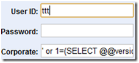
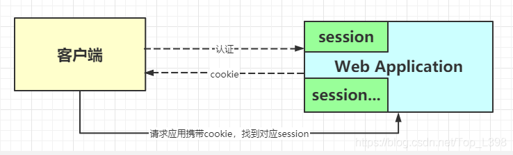
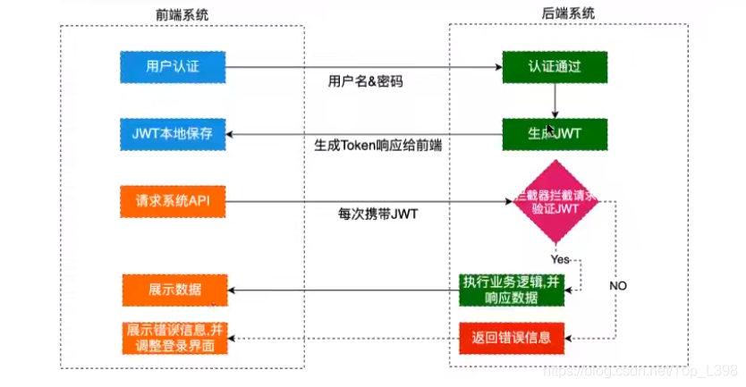

| 序号 | 修改时间   | 修改内容                                   | 修改人 | 审稿人 |
| ---- | ---------- | ------------------------------------------ | ------ | ------ |
| 1    | 2021-12-28 | 创建。从《安全技术》迁移黑客技术章节成文。 | Keefe  |        |
|      |            |                                            |        |        |


---

[TOC]


---

# 1  黑客简介

## 黑客史

**黑客起源背景：**

起源地：美国

精神支柱：对技术的渴求；对自由的渴求

历史背景：

* 越战与反战活动
* 马丁·路德金与自由
* 嬉皮士与非主流文化
* 电话飞客与计算机革命


表格 21 著名黑客列表

| 人物/标题     | 主要事件                                                     | 影响                                                         |
| ------------- | ------------------------------------------------------------ | ------------------------------------------------------------ |
| 凯文•米特尼克 | 凯文•米特尼克是美国20世纪最著名的黑客之一，他是《社会工程学》的创始人。  <BR>1979，凯文•米特尼克和他的伙伴侵入了北美防空指挥部。 | 1983年的电影《战争游戏》演绎了同样的故事，在片中，以凯文为原型的少年黑客几乎引发了第三次世界大战。 |
| 蠕虫<br/>病毒 | 1988年，莫里斯蠕虫病毒震撼了整个世界。由原本寂寂无名的大学生罗伯特·莫里斯制造的这个蠕虫病毒入侵了大约6000个大学和军事机构的计算机，使之瘫痪。<BR>2001年8月，“红色代码”蠕虫利用微软web服务器IIS 4.0或5.0中index服务的安全缺陷，攻破目的机器，并通过自动扫描感染方式传播蠕虫，已在互联网上大规模泛滥。<BR>2003年，“冲击波”蠕虫。 | 此后，从CIH到美丽杀病毒，从尼姆达到红色代码，病毒、蠕虫的发展愈演愈烈。 |
| 中国黑客      | 1998年印尼事件.<BR >1999年南联盟事件<BR>绿色兵团南北分拆事件<BR>中美五一黑客大战事件 |                                                              |
| 俄罗斯        |                                                              |                                                              |


## 互联网安全大事记

表格 20  互联网安全大事记列表

| 时间 | 国际事件                                                     | 国内事件                                                     |
| ---- | ------------------------------------------------------------ | ------------------------------------------------------------ |
| 2011 |                                                              | 2011年底，CSDN中文IT社区、天涯等众多互联网公司的账户密码信息被公开下载（CSDN94万行，密码非明文加密传输)。  <br>国家互联网应急中心通过公开渠道获得疑似泄露的数据库有26个，涉及账号、密码2.78亿条。这些信息均为黑客攻击商业网站后窃取并泄露。 |
| 2012 |                                                              | 2012-2-9，国内主流电商淘宝、当当网、1号店等B2C网站用户个人信息泄露。<br>7月，京东商城、当当网、1号店等多家电商网站再次“集体”被曝账户信息泄露。<br>11月，包括EMS在内10余家主流快递企业的快递单号信息被大面积泄露，并衍生出多个专门从事快递单号信息交易的网站。 |
| 2013 | 2013.6.5，“[棱镜门](http://baike.baidu.com/subview/10688863/10901700.htm)”事件爆发，[美国国家安全局](http://baike.baidu.com/subview/14954/14954.htm)监控用户隐私。 |                                                              |
| 2014 | 1、微软2014年停止对Windows XP安全更新 。<br/>2、[比特币](http://baike.baidu.com/subview/5784548/12216829.htm)席卷全球诈骗案件频发。 | 2014-5，小米论坛800万用户数据库泄漏。800万行1.3GB，数据项仅username/email/passwd/ip，密码非明文加密保存。<br>2014-8-2，名为“XX神器”的手机病毒开始通过网络大面积传播。上百万手机在半天内受到感染。病毒会向受感染用户手机的通信录自动群发短信，诱骗其他用户点击，该病毒会将短信记录转发至某固定手机号码，获取个人隐私和网银短信验证码等。 |
|      |                                                              | 国家互联网应急中心（CNCERT）共接收境内网络安全事件报告30684起，较2012年增长71.2%。 |
| 2017 | 4月，黑客团体Shadow Brokers公布一大批网络攻击工具，其中包括永恒之蓝工具。永恒之蓝利用Windows系统的SMB漏洞可以获取系统最高权限。<br>5月，不法分子通过改造“永恒之蓝”制作了wannacry勒索病毒-全球第一款勒索病毒。2020年美国遭受了6.5万次勒索软件攻击 。微软已于2017年发布MS17-010补丁，修复永恒之蓝漏洞。 |                                                              |
| 2018 |                                                              |                                                              |
| 2019 |                                                              |                                                              |
| 2020 | SolarWinds供应链攻击：过去十年最重大的网络安全事件。         |                                                              |
| 2021 | 12月，Apache log4j被发现存在远程执行漏洞，90%以上基于java开发的应用平台都会受到影响。 | 7月，滴滴等25款APP因涉及国家信息安全被网信办下架。           |


**2013年全球十大互联网安全事件：**

1. 2013.6.5，“[棱镜门](http://baike.baidu.com/subview/10688863/10901700.htm)”事件爆发 [美国国家安全局](http://baike.baidu.com/subview/14954/14954.htm)监控用户隐私。

2. 微软2014年停止对Windows XP安全更新 。

3. 比特币席卷全球诈骗案件频发。

4. [BlackHat](http://baike.baidu.com/subview/2904516/2904516.htm) ([黑帽](http://baike.baidu.com/subview/1231085/1231085.htm)大会)和Defcon (国际黑客大会)在拉斯维加斯召开。

5. 韩国政府等多家网站多次爆发大规模的黑客攻击，瘫痪数小时；

6. 2013.12.7，Google曝法国伪造CA证书全球首例国家级伪造CA证书劫持加密通讯事件诞生

7. 2013.3.1，[美国银行](http://baike.baidu.com/subview/788853/788853.htm)、彭博社等金融机构重要资料遭黑客曝光；

8. Apple、Facebook 、Twitter 等科技巨头相继被入侵，用户数据泄漏等事件。

9. 2013.7.23, 思科27亿美元收购网络安全公司Sourcefire 巨头掀起收购安全公司热潮.

10. 五年历史大规模网络间谍活动“红色十月行动”曝光.


## 本章参考

* 2013年国际十大互联网安全事件 http://baike.baidu.com/view/11799241.htm
* 【安全圈】2020年网络安全大事记 https://www.163.com/dy/article/FVHBEQF00511A5GF.html


# 2 黑客技术

## 2.1  黑客的攻击思路

 

图  黑客的攻击思路与操作图


**弱点挖掘**

目的：进入系统或者直接攻击.利用这些网络服务固有的或配置上的漏洞，试图从目标系统上取回重要信息（如口令文件）、或在上面执行命令

方法：

* 匹配公开弱点知识库
* 查询匹配弱点的网页
* 弱口令字典库


### 常见安全隐患

**Windows十大安全隐患**

* Web服务器和服务
* 工作站服务
* Windows远程访问服务
* 微软SQL服务器
* Windows认证
* Web浏览器
* 文件共享
* LSASS Exposures
* 电子邮件客户端
* 即时信息


**Unix十大安全隐患**

* BIND域名系统
* Web服务器
* 认证
* 版本控制系统
* 电子邮件传输服务
* 简单网络管理协议
* 开放安全连接通讯层
* 企业服务NIS/NFS 配置不当
* 数据库
* 内核


## 2.2  SQL注入

[   ](http://images.cnblogs.com/cnblogs_com/hkncd/201203/201203310307276110.png)

**示例：Name、Password、Corp**


**1.初级注入--绕过验证，直接登录**

输入：`' or 1=1--'`

SQL：

```sql
SELECT * From Table WHERE Name='SQL inject' and Password='' and Corp='' or 1=1--'
```

说明：从代码可以看出，前一半单引号被闭合，后一半单引号被 “--”给注释掉，中间多了一个永远成立的条件“1=1”，这就造成任何字符都能成功登录的结果。而Sql注入的危害却不仅仅是匿名登录。


**2.中级注入--借助异常获取信息**

输入：`' or 1=(SELECT @@version) –-`

SQL：

```sqlite
SELECT * From Table WHERE Name='SQL inject' and Password='' and Corp='' or 1=(SELECT @@VERSION)--'
```

说明：判断条件变成了 1=(SELECT @@VERSION),这个写法肯定会导致错误，但出错正是我们想要的。点击登录后，页面出现以下信息：

Conversion failed when converting the nvarchar value 'Microsoft SQL Server 2008 (SP3) - 10.0.5500.0 (X64) Sep 21 2011 22:45:45 Copyright (c) 1988-2008 Microsoft Corporation Developer Edition (64-bit) on Windows NT 6.1 <X64> (Build 7601: Service Pack 1) ' to data type int.

可怕的事情出现了，服务器的操作系统和SQL Server版本信息竟然通过错误显示出来。

备注：phpmyadmin中执行select * from anchor where 1=(SELECT @@VERSION)无结果显示，可能此BUG已修复。


**3.危害扩大--获取服务器所有的库名、表名、字段名**

**输入**：

SQL：

```sql
b' or 1=(SELECT top 1 name FROM master..sysobjects where xtype='U' and name not in (SELECT top 1 name FROM master..sysobjects where xtype='U'))
```

说明：


**常见SQL命令：**

* SELECT @@VERSION：显示MySQL数据库版本。


### 2.2.1 SQL注入安全问题

**概念**：所谓SQL注入，就是通过把SQL命令插入到Web表单递交或输入域名或页面请求的查询字符串，最终达到欺骗服务器执行恶意的SQL命令。
**危害**：

  1. 查询数据库中敏感信息。

  2. 绕过认证。

  3. 添加、删除、修改服务器数据。

  4. 拒绝服务。`?id=(BENCHMARK(100000000, MD5(RAND()));`
     例子：
     `$sql = “SELECT name FROM users WHERE id = ‘”. $_GET[‘id’] . “‘”;`
     当ID值为：1’or 1=’1 SQL语句 (已测试可以注入)：

```sql
 SELECT name FROM users WHERE id = ‘1’ or 1=’1 ‘
```

  说明：1=1的时候，条件语句WHEREOR之前的不起作用。 ‘的作用是组装SQL语句。
 **解决方法**：
  SQL组装的时候，对外部变量以及所有变量都进行过滤：
  PHPWIND中，可以用sqlEscape、sqlImplode、sqlSingle、sqlMulti等函数过滤组装。过滤主要是一些’单引号这些可以破坏SQL组装的数据。

```php
/**
 * SQL组装-私有SQL过滤
 * @param string $val 过滤的值
 * @param int  $iskey 0-过滤value值，1-过滤字段
 * @return string
 */
 private function build_escape_single($val, $iskey = 0) {
   if ($iskey === 0) {
     if (is_numeric($val)) {
       return ” ‘” . $val . “‘ “;
     } else {
       return ” ‘” . addslashes(stripslashes($val)) . “‘ “;
     }
   } else {
     $val = str_replace(array(‘`’, ‘ ‘), ”, $val);
     return ‘ `’.addslashes(stripslashes($val)).’` ‘;
   }
 }
```


## 2.3  网站攻击

### 2.3.1 XSS跨站脚本

**概念**：XSS (Cross Site Scripting，跨站脚本攻击)  是Web程序中最常见的漏洞。恶意攻击者往Web页面里插入恶意html代码，当用户浏览该页之时，嵌入其中Web里面的html代码会被执行，从而达到恶意用户的特殊目的。可分为存储型XSS和反射型XSS。


**危害：**

* 盗取用户COOKIE信息。
* 跳转到钓鱼网站。
* 操作受害者的浏览器，查看受害者网页浏览信息等。
* 蠕虫攻击。

**描述**：GET或POST内容未过滤，可以提交JS以及HTML等恶意代码。
**代码**：

```php
<?php echo $_GET[‘msg’]; ?>
 //正常URL
 user.php?msg=henhao
 //带JS的URL
 user.php?msg=<script>alert(1)</script>
 //恶意跳转URL
 user.php?msg=<script>window.history.back(-1);</script>
```

 **解决方法**：输出过滤，php端输出到view的模板页面上的数据都需要经过过滤。

```php
// 输出过滤HTML JS标签
$var = str_replace(array(‘<iframe’,'<meta’,'<script’), ”, $var);
$var = str_replace(array(‘..’,’)’,'<‘,’=’), array(‘..’,’)’,'<‘,’=’), $var);
$var = addslashes($var);
```

**修复建议**

- 对输入字符进行过滤，对数据进行Html Encode处理，过滤或移除特殊的Html标签，禁止将非法字符传到服务端
- 校验参数格式，不允许输入’”<>;等特殊字符
- 限制参数长度
- 将重要的cookie标记为http only


### 2.3.2 CSRF跨站攻击

**概念**：CSRF（Cross-site request forgery，跨站请求伪造），也被称成为“one click attack”或者Session riding，通常缩写为CSRF或者XSRF，是一种对网站的恶意利用，伪造请求，冒充用户在站内的正常操作。

XSS利用站点内的信任用户，而CSRF则通过伪装来自受信任用户的请求来利用 受信任的网站。与XSS攻击相比，CSRF攻击往往不大流行（因此对其进行防范的资源也相当稀少）和难以防范，所以被认为比XSS更具危险性。


**危害**：强迫受害者的浏览器向一个易受攻击的Web应用程序发送请求，最后达到攻击者所需要的操作行为。
 例子：
 

  1. 上面是一个图片的html标签，但是src中是一个添加id为123好友的新增好友链接。
  2. 恶意用户可以将这段代码植入其它网站网页上面，甚至可以img设置为0,0，让用户不知不觉中点击这个链接，达到用户并不像加这个人好友，但是添加的目的。
  3. 当很多人都无意加了id为123这个人为好友的时候，id为123的恶意用户就有权限来查看这些人的信息，甚至可以发送很多恶意的信息，达到恶意用户的目的。

**解决方法**：

1. http://www.2cto.com/addfriend.php?id=123 关键操作只接受POST请求。

 2. 验证码验证：CSRF攻击的过程，往往是在用户不知情的情况下构造网络请求。所以如果使用验证码，那么每次操作都需要用户进行互动，从而简单有效的防御了CSRF攻击。但是如果你在一个网站作出任何举动都要输入验证码会严重影响用户体验，所以验证码一般只出现在特殊操作里面，或者在注册时候使用。

3. 检测 Referer。Referer Check 一般用于监控 CSRF 攻击的发生，而不用来抵御攻击。
4. Token验证：目前主流的做法是使用 Token 抵御 CSRF 攻击。每次用户登录网站随机生成一个token，存放在cookie中，用户的所有操作中都需要经过token验证。


### 2.3.3 flash安全问题（弃）

Adobo宣布2020年底停止支持flask插件，Chrome、微软Edge等浏览器已经移除对于flask的支持。

例子： `http://images.sohu.com/bill/s2010/liulin/nokia/1602600902.swf?clickthru=javascript:alert(1)`

**解决方法** ：
在网站根目录中，添加crossdomain.xml文件，这个文件主要是控制flash的域访问。
淘宝的：http://www.taobao.com/crossdomain.xml

 ```xml
<?xml version=”1.0″ ?>
<cross-domain-policy>
<allow-access-from domain=”*.taobao.com” />
<allow-access-from domain=”*.taobao.net” />
<allow-access-from domain=”*.taobaocdn.com” />
<allow-access-from domain=”*.tbcdn.cn” />
<allow-access-from domain=”*.allyes.com” />
</cross-domain-policy>
 ```


### 2.3.4 XML注入安全问题

**概念**：和SQL注入原理一样，XML是存储数据的地方，如果在查询或修改时，如果没有做转义，直接输入或输出数据，都将导致XML注入漏洞。攻击者可以修改XML数据格式，增加新的XML节点，对数据处理流程产生影响。
**危害**：

  1. 攻击者可以新增XML节点
  2. 破坏原来的XML结构，影响业务流程，甚至产生严重的错误。
     例子：

```php
$xml = “<USER role=guest><name>“ . $_GET[‘name’] . “</name><email>“ . $_GET[‘email’] . “</email></USER>”;
```

 需要得到的XML结构：

```xml
<?xml version=”1.0″ encoding=”UTF-8″?>
 <USER role=guest>
 <name>user1</name>
 <email>user1@a.com</email>
 </USER>
```

恶意代码：
`user1@a.com</email></USER><USER role=admin><name>test</name><email>user2@a.com`

意外的XML文档：

```xml
<?xml version=”1.0″ encoding=”UTF-8″?>
 <USER role=guest>
 <name>user1</name>
 <email>user1@a.com</email>
 </USER>
 <USER role=admin>
 <name>test</name>
 <email>user2@a.com</email>
 </USER>
```


**解决方法：**

  1. 对php处理XML文档的时候，进行标签过滤
  2. 尽量减少直接被外部访问到xml文档，可以采用文件名用散列方法等。


### 2.3.5 其它漏洞

1. **url跳转漏洞**
   概念：Web应用程序接收到用户提交的URL参数后，没有对参数做”可信任URL”的验证，就向用户浏览器返回跳转到该URL的指令。
   危害：钓鱼网站
   例子： `http://m.yahoo.cn/log.php?c=web&u=http://www.163.com`
   解决方法：
   对跳转的php函数进行进一步优化，使页面跳转可以在可信任的范围内。 例如可以有跳转域名白名单方法，这个访问各大公司使用比较多

2. **文件系统跨越漏洞**

   概念：对文件目录参数没有进行过滤，导致恶意用户可以通过在参数中输入一些执行命令，或者跨越访问的行为，来超出用户的访问权限。
    例子：通过一个或多个../跨越目录限制

```php
$fp = fopen(“image/{$_GET[‘filename’]}”, ‘r’);
Getfile?filename=../../../../etc/passwd
```

解决方法：1)对文本操作的时候一定要谨慎，不可信任; 2)严格使用phpwind中安全类库escapePath函数

3. **系统命令漏洞**
   概念：用户提交的参数用于执行系统命令的参数。
    解决：1)谨慎使用系统命令，对使用系统命令的地方需要进行安全评审; 2)对命令语句进行严格过滤

4. **文件上传漏洞**

    概念：Web应用程序在处理用户上传的文件时，没有判断文件的扩展名是否在允许的范围内，或者没检测文件内容的合法性，就把文件保存在服务器上，甚至上传脚本木马到web服务器上，直接控制web服务器。
    情况：

```shell
  1. 未限制扩展名
  2. 未检查文件内容
  3. 病毒文件
     解决方法：
  4. 使用安全的，可信任的上传组件。
  5. 检查文件扩展名，保证文件的类型正确。
  6. 检查文件内容，保证用户不伪造文件类型。
```


5. **任意文件下载漏洞**
   解决方法：
   1). Apache虚拟目录指向
   2). Java/PHP读取文件


6. **权限控制漏洞**
   概念：属于业务逻辑上的安全管理。
   访问控制：

* 水平访问：Web应用程序接收到用户请求，修改某条数据时，没有判断数据的所属人，或判断数据所属人时，从用户提交的request参数（用户可控数据）中，获取了数据所属人id，导致恶意攻击者可以通过变换数据ID，或变换所属人id，修改不属于自己的数据。

* 垂直访问：由于web应用程序没有做权限控制，或仅仅在菜单上做了权限控制，导致的恶意用户只要猜测其他管理页面的URL，就可以访问或控制其他角色拥有的数据或页面，达到权限提升目的。
  **存在情况**：

- URL级别的。（例如论坛需要操作评分的时候，有一个提交的URL地址，该地址提交过去，如果不做权限判断，那么恶意用户就可以随意的拿这个URL地址来进行恶意行为）
- 菜单级别。（会员中心或者后台管理中心，会有菜单，管理员可以看到多个功能，普通管理员只能看到一部分功能。但是如果你对管理员操作的功能区不做权限判断，那么普通管理员只要猜测或者获取管理区的URL，就可以进行管理员操作了）

```shell
危害：属于业务逻辑的漏洞，这些危害性是巨大的，可以让普通用户就可能获取管理员的权限，对网站进行恶意破坏或者做非法行为。
解决方案：
  1项目先期，做一份详细的权限规划文档。
  2在开发中严格按照权限文档的要求去做权限。
  3后期测试需要覆盖权限这一块功能区。
  4程序员需要经常注意这些方面的要求。
```


## 2.4  浏览器安全和隐私

https是安全浏览。

HTTP 是一种无状态协议，即每次客户端发送请求时，对于服务端来说接收到的都是一个全新的请求，因此服务器并不知道客户端的历史请求记录。而cookie，session, token就是用来管理会话的手段。


### Session和Cookie机制

Cookie和Session机制涉及到一些用户隐私： 如浏览习惯，用户名，密码。

Session安全

  1. SESSION是保存在服务器端的，具有比COOKIE一定的安全性。

  2. 使用COOKIE的时候，如果长时间没有动作，可以设置一个时间值，来对COOKIE进行过期。

  3. 尽量让用户每次的cookie值都是不同的，这样可以保证cookie被盗取也不能长期使用的问题


表格 Cookie和Session的区别

|              | Session                                               | Cookie                                                       |
| ------------ | ----------------------------------------------------- | ------------------------------------------------------------ |
| 存储位置     | 服务器                                                | 客户的浏览器                                                 |
| 安全性       | 安全                                                  | 不安全。别人可以分析存放在本地的cookie并进行cookie欺骗。     |
| 存取值的类型 | 存任意数据类型                                        | 只支持存字符串数据，想要设置其他类型的数据，需要将其转换成字符串。 |
| 有效期       | 一般失效时间较短，客户端关闭或者 session 超时都会失效 | 可设置为长时间保持，比如我们经常使用的默认登录功能。         |
| 存储大小     | 高                                                    | 单个 cookie 保存的数据不能超过 4K。                          |
| 安全策略     |                                                       | cookie httponly flag ： 在用到用户名登陆密码之类的安全性比较高的cookie的时候，可以在cookie中设置httponly属性，该属性只允许php等访问cookie，而不允许js访问。  <br>cookie secure flag ： 在涉及到https这样的情况，需要对cookie加密传输，那么可以设置这个属性。 |


#### Session



​		图 Session的工作过程


**定义：**会话，打开web应用时产生，浏览器第一次访问服务器会在服务器端生成一个session，有一个sessionid和它对应。**session 是基于 cookie 实现的**。

**创建：**session在访问tomcat服务器时调用`HttpServletRequest.getSession(true)`创建（此时对应的sessionid也同时产生）。

**存储**：session的状态信息等储存在服务器的内存中，但是**sessionid**是保存客户端的cookie中，客户端不保存session，session销毁只能通过invalidate或超时失效，关掉浏览器并不会关闭session。

**删除：**（1）超时；

  （2）程序调用HttpSession.invalidate()；

  （3）程序关闭；

**存在问题：**（1）负载均衡后，每台机器间的session都需要相互复制，很烦杂。需要考虑全局性会话一致问题。

　　　　　（2）单独把session拿出来存，又会面临这台存session的服务器一宕机，全部的用户都得重新登陆。

**解决方法**：Nginx ip_hash 策略、Session 复制、共享 Session。


Session，称为“会话控制”。Session 对象存储特定用户会话所需的信息。这样，当用户在应用程序的 Web 页之间跳转时，存储在 Session 对象中的变量将不会丢失，而是在整个用户会话中一直存在下去。当用户请求来自应用程序的 Web 页时，如果该用户还没有会话，则 Web 服务器将自动创建一个 Session 对象。当会话过期或被放弃后，服务器将终止该会话。具体到Web中的Session指的就是用户在浏览某个网站时，从进入网站到关闭这个网站所经过的这段时间，也就是用户浏览这个网站所花费的时间。因此从上述的定义中我们可以看到，Session实际上是一个特定的时间概念。

需要注意的是，一个Session的概念需要包括特定的客户端，特定的[服务器](http://baike.baidu.com/view/899.htm)端以及不中断的操作时间。A用户和C服务器建立连接时所处的Session同B用户和C服务器建立连接时所处的Session是两个不同的Session。


#### Cookie

**Cookie**，有时也用其复数形式[Cookies](http://baike.baidu.com/subview/1311/6319629.htm)，指某些网站为了辨别用户身份、进行Session跟踪而储存在用户本地终端上的数据（通常经过加密）。定义于RFC2109和2965都已废弃，最新取代的规范是RFC6265。

Cookie 是一个非常具体的东西，指的就是浏览器里面能永久存储的一种数据，仅仅是浏览器实现的一种数据存储功能（可以叫做浏览器缓存）。

- cookie 存储在客户端：cookie是由服务器生成发送到客户端，客户端以key-value形式保存在本地的一小块数据，在下一次请求同一网站时会把该cookie发送给服务端。
- cookie为不可跨域的：每个 cookie 都会绑定单一的域名，无法在别的域名下获取使用，一级域名和二级域名之间是允许共享使用的（靠的是 domain）。

Cookie是由服务器端生成，发送给User-Agent（一般是浏览器），浏览器会将Cookie的key/value保存到某个目录下的文本文件内，下次请求同一网站时就发送该Cookie给服务器（前提是浏览器设置为启用cookie）。Cookie名称和值可以由服务器端开发自己定义，对于JSP而言也可以直接写入jsessionid，这样服务器 可以知道该用户是否是合法用户以及是否需要重新登录等，服务器可以设置或读取Cookies中包含信息，借此维护用户跟服务器会话中的状态。

Cookie的安全级别包括组织所用Cookie，接受所有Cookie，中级，和高级。

 表格 Cookie参数说明

| 参数     | 说明                                                         | 后端                       |
| :------- | :----------------------------------------------------------- | :------------------------- |
| Domain   | 指定 cookie 所属域名，默认是当前域名                         | `cookie.setDomain("")`     |
| Max-Age  | 设置cookie的过期时间，单位为秒                               | `cookie.setMaxAge(10)`     |
| Path     | 指定 cookie 在哪个路径（路由）下生效，默认是 '/'             | `cookie.setPath("")`       |
| HttpOnly | 如果给某个 cookie 设置了 httpOnly 属性，则无法通过 JS 脚本 读取到该 cookie 的信息，但还是能通过 Application 中手动修改 cookie，所以只是在一定程度上可以防止 XSS 攻击，不是绝对的安全 | `cookie.setHttpOnly(true)` |
| Secure   | 告诉浏览器此Cookie只能在Https安全协议中传输,如果是Http则禁止传输 | `cookie.setSecure(true`    |

说明：1. 不要存储敏感数据，比如用户密码，账户余额，因为存储在客户端，容易被客户端篡改，使用前需要验证合法性。

2. 能存储的数据量不能超过 4kb。
3. 一个浏览器针对一个网站最多存 20 个Cookie，浏览器一般只允许存放 300 个Cookie。
4. 移动端对 cookie 的支持不是很好，而 session 需要基于 cookie 实现，所以移动端常用的是 token。


**Cookie应用**：登陆、购物车等等。示例如下，

1. 用户验证简略化。将ID、密码作为cookie信息发送给用户，在以后的访问中可以获得到cookie，简化输入。

2. 网上购物等应用。每将一个商品放入购物车，就会发送cookie给用户。

3. 把握用户访问的时间。访问时，将时间作为cookie发送给用户，退出时将该cookie返回给web服务器，这样可以掌握访问该站点的时间长度。

4. 推荐系统与搜索引擎。

5. 编写商品信息列表，给每个商品起唯一的id值，通过id传值。

6. 判断是否是第一次访问
   - 如果是第一次访问，创建cookie，记录商品id，回写到浏览器。
   - 如果不是第一次访问，获取cookie中的商品信息，但是需要判断cookie中是否已经包含该商品，如果包含就不用处理，如果不包含，可以取出商品的id，累加操作。（可以编写一个判断是否包含的方法）
7. 重定向到商品列表页面，把商品循环到列表页面。
8. 清除浏览记录。


**原理**：浏览器缓存。

**流程**：客户端请求-服务器响应-响应数据保存

**Cookie组成**：Expires, Name, Value等等。

**Cookie攻击**

建议开发人员在向客户端 Cookie 输出敏感的内容时（譬如：该内容能识别用户身份）：

​     1）设置该 Cookie 不能被脚本读取，这样在一定程度上解决上述问题。
 　2）对 Cookie 内容进行加密，在加密前嵌入时间戳，保证每次加密后的密文都不一样（并且可以防止消息重放）。
 　3）客户端请求时，每次或定时更新 Cookie 内容（即：基于第2小条，重新加密）
 　4）每次向 Cookie 写入时间戳，数据库需要记录最后一次时间戳（防止 Cookie 篡改，或重放攻击）。
 　5）客户端提交 Cookie 时，先解密然后校验时间戳，时间戳若小于数据数据库中记录，即意味发生攻击。

基于上述建议，即使 Cookie 被窃取，却因 Cookie 被随机更新，且内容无规律性，攻击者无法加以利用。另外利用了时间戳另一大好处就是防止 Cookie 篡改或重放。

**Cookie窃取**：搜集用户cookie并发给攻击者的黑客。攻击者将利用cookie信息通过合法手段进入用户帐户。

**Cookie篡改**：利用安全机制，攻击者加入代码从而改写 Cookie 内容，以便持续攻击。


**Cookie的传递流程**

当在浏览器地址栏中键入了[Amazon](http://baike.baidu.com/view/552703.htm)的URL，浏览器会向Amazon发送一个读取网页的请求，并将结果在显示器上显示。这时该网页在你的电脑上寻找Amazon网站设置的Cookie文件，如果找到，浏览器会把Cookie文件中的数据连同前面输入的URL一同发送到Amazon服务器。 服务器收到Cookie数据，就会在他的数据库中检索你的ID，你的购物记录、个人喜好等信息，并记录下新的内容，增加到数据库和Cookie文件中去。 如果没有检测到Cookie或者你的Cookie信息与数据库中的信息不符合，则说明你是第一次浏览该网站，服务器的CGI程序将为你创建新的ID信息， 并保存到数据库中。

Cookie是利用了网页代码中的HTTP头信息进行传递的，浏览器的每一次网页请求，都可以伴随Cookie传递，例如，浏览器的打开或刷新网页操作。服务器将Cookie添加到网页的HTTP头 信息中，伴随网页数据传回到你的浏览器，浏览器会根据你电脑中的Cookie设置选择是否保存这些数据。如果浏览器不允许Cookie保存，则关掉浏览器 后，这些数据就消失。Cookie在电脑上保存的时间是不一样的，这些都是由服务器的设置不同决定的。Cookie有一个Expires（有效期）属性， 这个属性决定了Cookie的保存时间，服务器可以通过设定Expires字段的数值，来改变Cookie的保存时间。如果不设置该属性，那么 Cookie只在浏览网页期间有效，关闭浏览器，这些Cookie自动消失，绝大多数网站属于这种情况。通常情况下，Cookie包含Server、 Expires、Name、value这几个字段，其中对服务器有用的只是Name和value字段，Expires等字段的内容仅仅是为了告诉浏览器如 何处理这些Cookies。


**Cookie的编程实现**

多数网页编程语言都提供了对Cookie的支持。如[javascript](http://baike.baidu.com/view/16168.htm)、[VBScript](http://baike.baidu.com/view/24920.htm)、[Delphi](http://baike.baidu.com/view/3297.htm)、[ASP](http://baike.baidu.com/view/2616.htm)、[SQL](http://baike.baidu.com/view/34.htm)、[PHP](http://baike.baidu.com/subview/99/5828265.htm)、C#等。在这些面向对象的编程语言中，对Cookie的编程利用基本上是相似的，大体过程为：先创建一个Cookie对象（Object），然后利用控制函数对Cookie进行赋值、读取、写入等操作。那么如何通过代码来获取其他用户Cookie中的敏感信息，下面进行简单的介绍。

该方法主要有两步，首先要定位你需要收集Cookie的网站，并对其进行分析，并构造URL；然后编制收集Cookie的PHP代码，并将其放到你可以控制的网站上，当不知情者单击了你构造的URL后可以执行该PHP代码。下面我们看具体的实现过程。


#### SessionID构成

会话session区分常用方法有三种：随机数、序列号和时间戳。

|               | 时间戳 | 序列号   | 随机数                                                       |
| ------------- | ------ | -------- | ------------------------------------------------------------ |
| 简介          |        |          | 一般应用于其它两种不能用的场景。  慎用伪随机数。             |
| 优点          | 简单   |          |                                                              |
| 缺点          |        |          | UDP非连接不好用。                                            |
| 应用<br/>场景 |        | 全局很难 | 验证码生成，抽奖活动，UUID生成，SessionID生成，Token生成，CSRF Token，找回密码Token，游戏(随机元素的生成)，洗牌，俄罗斯方块出现特定形状的序列，游戏爆装备，<br>密码应用场景，生成密钥：对称密码，消息认证；生成密钥对：公钥密码，数字签名；生成IV： 用于分组密码的CBC，CFB和OFB模式；生成nonce: 用于防御重放攻击；分组密码的CTR模式；生成盐：用于基于口令的密码PBE等。 |


**随机数**

随机数分为真随机数和伪随机数，我们程序使用的基本都是伪随机数，其中伪随机又分为强伪随机数和弱伪随机数。

真随机数，通过物理实验得出，比如掷钱币、骰子、转轮、使用电子元件的噪音、核裂变等

伪随机数，通过一定算法和种子得出。软件实现的是伪随机数。

* 强伪随机数，难以预测的随机数
* 弱伪随机数，易于预测的随机数


随机数有3个特性，具体如下：

* 随机性：不存在统计学偏差，是完全杂乱的数列
* 不可预测性：不能从过去的数列推测出下一个出现的数
* 不可重现性：除非将数列本身保存下来，否则不能重现相同的数列


#### 实现示例：电商

**Java实现**

* **javax.servlet.http.Cookie**: Cookie getName getValue setValue setMaxAge getMaxAge setPath getPath setDomain getDomain
* **javax.servlet.http.HttpSession**:  session.setAttribute()  getAttribute  removeAttribute  invalidate
* **javax.servlet.http.HttpServletRequest**: HttpSession session = request.getSession()
* **javax.servlet.http.HttpServletResponse**: response.addCookie(Cookie c)

1）服务端处理

商品浏览记录的后台示例： 获取cookie（区分是否首次访问）

```java
import java.io.IOException;

import javax.servlet.ServletException;
import javax.servlet.http.Cookie;
import javax.servlet.http.HttpServlet;
import javax.servlet.http.HttpServletRequest;
import javax.servlet.http.HttpServletResponse;

import cn.itcast.utils.MyCookieUtil;

/**
 * 商品浏览记录的后台： 获取cookie（区分是否首次访问）
 * @author Administrator
 *
 */
public class ProductServlet extends HttpServlet {
	private static final long serialVersionUID = -5747737695587699577L;

	public void doGet(HttpServletRequest request, HttpServletResponse response)
			throws ServletException, IOException {
		/**
		 * 0.获取传过来id值
		 * 1.判断是否是第一次访问？（获取指定名称的cookie如果为null，说明是第一次访问）
		 * 		* 如果是第一次访问，把商品的id保存到cookie中，回写cookie。
		 * 		* 如果不是第一次访问
		 * 			* 先获取cookie中的内容，进行判断（判断cookie中是否包含当前点击的商品）
		 * 				* 如果cookie中已经包含了该商品，那么就不用处理了
		 * 				* 如果不包含，在cookie中追加该商品	product=1	product=1,2
		 * 2.重定向商品的列表页面
		 * 3.需要在商品的列表页面中获取cookie的中内容，把内容显示到页面上。
		 */
		// 先获取商品的id
		String id = request.getParameter("id");
		// 获取cookie的数组
		Cookie [] cookies = request.getCookies();
		// 查找指定名称的cookie
		Cookie cookie = MyCookieUtil.getCookieByName(cookies, "product");
		// 如果cookie为null，说明是第一次访问，把商品的id保存到cookie中，回写
		if(cookie == null){
			Cookie c = new Cookie("product",id);
			// 设置有效时间
			c.setMaxAge(60*60*24);
			// 设置有效的路径
			c.setPath("/day11");
			// 回写
			response.addCookie(c);
		}else{
			// 先获取cookie的内容（拿出来做判断），cookie有可能包含当前的商品
			String longid = cookie.getValue();		// product=1,2,3		假如说当前点击的是4	product=4,1,2,3
			// 判断字符串ids是否包含当前的id
			// 把ids字符串切割成数组
			String [] ids = longid.split(",");
			if(!checkId(ids,id)){
				// 说明不包含该商品
				cookie.setValue(id+","+longid);
				cookie.setMaxAge(60*60*24);
				// 设置有效的路径
				cookie.setPath("/day11");
				// 回写cookie
				response.addCookie(cookie);
			}
		}
		// 重定向或者转发（使用request域存储内容，必须是转发）request.getContextPath()获取虚拟路径，默认和项目名称相同
		response.sendRedirect(request.getContextPath()+"/cookie/productList.jsp");
	}

	/**
	 * 判断ids的数组中是否包含id的值
	 * @param ids
	 * @param id
	 * @return
	 */
	private boolean checkId(String[] ids, String id) {
		for (String s : ids) {
			// 获取s和id匹配
			if(s.equals(id)){
				// 包含
				return true;
			}
		}
		// 不包含
		return false;
	}

	public void doPost(HttpServletRequest request, HttpServletResponse response)
			throws ServletException, IOException {

		doGet(request, response);
	}

}
```


购物车的后台示例：获取会话session

区分是否首次购买 `request.getSession().getAttribute("cart")`

```java
package cn.itcast.session;

import java.io.IOException;
import java.util.HashMap;
import java.util.Map;

import javax.servlet.ServletException;
import javax.servlet.http.HttpServlet;
import javax.servlet.http.HttpServletRequest;
import javax.servlet.http.HttpServletResponse;
import javax.servlet.http.HttpSession;

/**
 * 购物车的后台
 * @author Administrator
 *
 */
public class CartServlet extends HttpServlet {
	private static final long serialVersionUID = -4944571720622706932L;

	public void doGet(HttpServletRequest request, HttpServletResponse response)
			throws ServletException, IOException {
		/**
		 * 0.Map<String,Integer> cart 车里面放商品的名称和数量。
		 * 1.接收参数，接收的id值。把id值转换成相应的商品。
		 * 2.判断是否是第一次购买（从session中获取车，如果车是null，肯定是第一次购买）
		 * 		* 如果是一次购买，创建一个购物车，把该商品和数量存入到车中，再把车存入到session中。
		 * 		* 如果不是第一次购买
		 * 			* 先判断车中是否包含该商品，因为如果包含该商品了，数量+1
		 * 			* 如果不包含该商品，直接把该商品存入车中。
		 * 3.转发或者重定向到继续购物或者结算页面
		 * 4.去结算的页面（把商品的名称和数量显示到页面上）
		 */
		String id = request.getParameter("id");
		// 想id转换成响应的商品名称
		String [] names = new String []{"手电筒","电视","冰箱","洗衣机","电话","电脑"};
		int index = Integer.parseInt(id);
		String productName = names[index - 1];
		HttpSession session = request.getSession();   //获取session
		// 从session来获取购物车
		Map<String, Integer> cart = (Map<String, Integer>)session.getAttribute("cart");
		if(cart == null){
			// 第一次：把购买的商品存入到车中
			cart = new HashMap<String, Integer>();
			cart.put(productName, 1);
			session.setAttribute("cart", cart);
		}else{
			// 先获取车中的内容，和当前购买的商品进行判断
			if(cart.containsKey(productName)){
				// 先获取商品的数量
				Integer count = cart.get(productName);
				count++;
				cart.put(productName, count);
				session.setAttribute("cart", cart);
			}else{
				cart.put(productName, 1);
				session.setAttribute("cart", cart);  // 存入到session中
			}
		}

		// 重定向到继续购物或者去结算的页面
		response.sendRedirect(request.getContextPath()+"/session/gopay.jsp");
	}

	public void doPost(HttpServletRequest request, HttpServletResponse response)
			throws ServletException, IOException {

		doGet(request, response);
	}
}
```


2）客户端处理

客户端页面浏览记录示例：productlist.jsp

* request.getCookies()

```jsp
<%@page import="cn.itcast.utils.MyCookieUtil"%>
<%@ page language="java" contentType="text/html; charset=UTF-8"
    pageEncoding="UTF-8"%>
<!DOCTYPE html PUBLIC "-//W3C//DTD HTML 4.01 Transitional//EN" "http://www.w3.org/TR/html4/loose.dtd">
<html>
<head>
<meta http-equiv="Content-Type" content="text/html; charset=UTF-8">
<title>商品的列表页面</title>

<style type="text/css">
	.img1{
		width: 160px;
		height: 140px;
	}
	.img2{
		width: 80px;
		height: 70px;
	}
</style>

</head>
<body>

	<a href="/day11/product?id=1">手电筒</a>
	<a href="/day11/product?id=2">电话</a>
	<a href="/day11/product?id=3">电视</a>
	<br/>
	<a href="/day11/product?id=4">冰箱</a>
	<a href="/day11/product?id=5">手表</a>
	<a href="/day11/product?id=6">电脑</a>
	<h3>商品的浏览器记录</h3>
	<h4><a href="/day11/removeProduct">清除浏览记录</a></h4>

<%
	// 获取到cookie的内容 可以把cookie的内容动态的显示到页面上
	Cookie [] cookies = request.getCookies();
	// 通过指定名称来获取cookie
	Cookie cookie = MyCookieUtil.getCookieByName(cookies, "product");
	// 判断cookie不为空
	if(cookie != null){
		// 获取cookie的值
		String longid = cookie.getValue();		// product=1,2,3
		// 切割
		String [] ids = longid.split(",");
		// 循环遍历
		for(String id : ids){
%>
		.jpg">++++"/day11/img/<%= id %>.jpg"
<%
		}
	}
%>

</body>
</html>
```


客户端页面付款示例：pay.jsp

```jsp
<%@page import="java.util.Set"%>
<%@page import="java.util.Map"%>
<%@ page language="java" contentType="text/html; charset=UTF-8"
    pageEncoding="UTF-8"%>
<!DOCTYPE html PUBLIC "-//W3C//DTD HTML 4.01 Transitional//EN" "http://www.w3.org/TR/html4/loose.dtd">
<html>
<head>
<meta http-equiv="Content-Type" content="text/html; charset=UTF-8">
<title>Insert title here</title>
</head>
<body>

<h4>商品的信息</h4>
<%
	// 获取车
	Map<String,Integer> cart = (Map<String,Integer>)request.getSession().getAttribute("cart");
	if(cart != null){	// 购物车不为空
		// 获取车的商品名称和数量
		Set<String> names = cart.keySet();
		// 循环set集合，商品的名称
		for(String name : names){
%>
		<h3>亲，您购买了<%= name %>，数量是<%= cart.get(name) %></h3>
<%
		}
	}else{
%>
		<h3>亲，您还没有<a href="/day11/session/cartlist.jsp">败家</a>，请您快去败家</h3>
<%
	}
%>
</body>
</html>
```


**Python实现**

* `import requests`
* cookieJar = requests.cookies.RequestsCookieJar()

豆瓣登陆示例

```python
import requests
headers = {'Host': 'www.douban.com',
'User-Agent': 'Mozilla/5.0 (Macintosh; Intel Mac OS X 10_13_6) AppleWebKit/537.36 (KHTML, like Gecko) Chrome/67.0.3396.99 Safari/537.36',
'Accept': 'text/html,application/xhtml+xml,application/xml;q=0.9,*/*;q=0.8',
'Accept-Language': 'zh-CN,zh;q=0.8,en-US;q=0.5,en;q=0.3',
'Accept-Encoding': 'gzip, deflate, br',
'Connection': 'keep-alive'
           }
res = requests.get("https://www.douban.com/accounts/login",headers=headers)

#查看状态码
>>>res.status_code
200
#查看headers，注意第一次请求豆瓣，响应体中的Set-Cookies字段
>>>res.headers
{'Date': 'Sat, 28 Jul 2018 14:47:46 GMT', 'Content-Type': 'text/html; charset=utf-8', 'Transfer-Encoding': 'chunked', 'Connection': 'keep-alive', 'Keep-Alive': 'timeout=30', 'Vary': 'Accept-Encoding', 'X-Xss-Protection': '1; mode=block', 'X-Douban-Mobileapp': '0', 'Expires': 'Sun, 1 Jan 2006 01:00:00 GMT', 'Pragma': 'no-cache', 'Cache-Control': 'must-revalidate, no-cache, private', 'X-Frame-Options': 'SAMEORIGIN', 'Set-Cookie': 'bid=NURXfALBCrM; Expires=Sun, 28-Jul-19 14:47:46 GMT; Domain=.douban.com; Path=/', 'X-DOUBAN-NEWBID': 'NURXfALBCrM', 'X-DAE-Node': 'brand56', 'X-DAE-App': 'accounts', 'Server': 'dae', 'Strict-Transport-Security': 'max-age=15552000;', 'Content-Encoding': 'gzip'}
#查看cookie，直接获取cookie，将会获取到cookieJar对象，事实上requests中就是用该对象储存cookies的
>>>res.cookies
<RequestsCookieJar[Cookie(version=0, name='bid', value='NURXfALBCrM', port=None, port_specified=False, domain='.douban.com', domain_specified=True, domain_initial_dot=True, path='/', path_specified=True, secure=False, expires=1564325266, discard=False, comment=None, comment_url=None, rest={}, rfc2109=False)]>

>>>for cookie in res.cookies:
    print(cookie.name+"\t"+cookie.value)
bid NURXfALBCrM
#我们可以将第一次请求的响应中的Set-cookies添加进来，事实上requests库会自动帮我们做这些
>>>cookieJar = requests.cookies.RequestsCookieJar()
>>>for cookie in res.cookies:
    cookieJar.set(cookie.name,cookie.value)
>>>cookieJar
<RequestsCookieJar[Cookie(version=0, name='bid', value='NURXfALBCrM', port=None, port_specified=False, domain='', domain_specified=False, domain_initial_dot=False, path='/', path_specified=True, secure=False, expires=None, discard=True, comment=None, comment_url=None, rest={'HttpOnly': None}, rfc2109=False)]>

>>>for cookie in res.headers['Set-Cookie'].split(";"):
    key=cookie.split('=')[0]
    value=cookie.split('=')[1]
    cookieJar.set(key,value)
#看一下现在cookieJar中内容
>>>cookieJar
<RequestsCookieJar[Cookie(version=0, name=' Domain', value='.douban.com', port=None, port_specified=False, domain='', domain_specified=False, domain_initial_dot=False, path='/', path_specified=True, secure=False, expires=None, discard=True, comment=None, comment_url=None, rest={'HttpOnly': None}, rfc2109=False), Cookie(version=0, name=' Expires', value='Sun, 28-Jul-19 14:47:46 GMT', port=None, port_specified=False, domain='', domain_specified=False, domain_initial_dot=False, path='/', path_specified=True, secure=False, expires=None, discard=True, comment=None, comment_url=None, rest={'HttpOnly': None}, rfc2109=False), Cookie(version=0, name=' Path', value='/', port=None, port_specified=False, domain='', domain_specified=False, domain_initial_dot=False, path='/', path_specified=True, secure=False, expires=None, discard=True, comment=None, comment_url=None, rest={'HttpOnly': None}, rfc2109=False), Cookie(version=0, name='bid', value='NURXfALBCrM', port=None, port_specified=False, domain='', domain_specified=False, domain_initial_dot=False, path='/', path_specified=True, secure=False, expires=None, discard=True, comment=None, comment_url=None, rest={'HttpOnly': None}, rfc2109=False)]>

#模拟登陆
>>>data = {
    'source':'None',
    'redir':'https://movie.douban.com/',
    'form_email':'*****',
    'form_password':'****'
}

#使用Session对象提交请求，相当于在浏览器中连续操作网页，而如果直接使用```request.post()```,则相当没提交一次请求，则打开一个浏览器，我们在实际使用浏览器的经验告诉我们，这样是不行的。
>>>session = requests.Session()
>>>res =session.post('https://www.douban.com/accounts/login',headers=headers,cookies=cookieJar,data=data)
>>>res.status_code
200
#此时，如果实在浏览器的话，我们应该可以看到已经登陆成功，并且跳转到了https://movie.douban.com/，页面，使用这个Session直接访问的我的账号，检查一下，是否是我的账号在登录状态。
>>>res = session.get('https://www.douban.com/accounts')
>>>res.text
'<!DOCTYPE html>\n<html lang="zh-CN">\n  <head>\n    <meta http-equiv="Content-Type" content="text/html; charset=utf-8">\n    <meta property="wb:webmaster" content="572c54c2cc00c6fb" />\n    <meta name="referrer" content="always">\n    \n    <title>\n    smart_hang的帐号\n</title>\n
```


**php实现**

```php
（1）当一个Session第一次被启用时，一个唯一的标识被存储于本地的cookie中。
（2）首先使用session_start()函数，[PHP](http://baike.baidu.com/subview/99/5828265.htm)从Session仓库中加载已经存储的Session变量。
（3）当执行PHP脚本时，通过使用session_register()函数注册Session变量。
（4）当PHP脚本执行结束时，未被销毁的Session变量会被自动保存在本地一定路径下的Session库中，这个路径可以通过php.ini文件中的Session.save_path指定，下次浏览网页时可以加载使用。
Session解决方案，就是要提供在PHP脚本中定义全局变量的方法，使得这个全局变量在同一个Session中对于所有的PHP脚本都有效。上面我们提到了，Session不是一个简单的时间概念，一个Session中还包括了特定的用户和[服务器](http://baike.baidu.com/view/899.htm)。因此更详细地讲，在一个Session定义的全局变量的作用范围，是指这个Session所对应的用户所访问的所有PHP。
```


### JWT - JSON Web Token

 JSON Web Token（缩写 JWT）是目前最流行的跨域认证解决方案。JWT常用于设计用户认证、授权系统、web的单点登录。

JWT长度较小，且可以使用URL传输(URL safe)，不像cookies只能在web环境起作用。 JWT可以同时使用在web环境和RESTfull的接口。

JWT是一个开放标准([RFC 7519](https://tools.ietf.org/html/rfc7519) )，它定义了一种紧凑的、自包含的方式，用于在各方之间以JSON对象安全地传输信息。此信息可以验证和信任，因为它是数字签名的。JWT可以使用秘密〈使用HNAC算法）或使用RSA或ECDSA的公钥/私钥对进行签名。通过JSON形式作为Web应用中的令牌，用于在各方之间安全地将信息作为JSON对象传输。在数据传输过程中还可以完成数据加密、签名等相关处理。



图 JWT认证过程

**JWT认证流程**

1. 前端通过Web表单将自己的用户名和密码发送到后端的接口。该过程一般是HTTP的POST请求。建议的方式是通过SSL加密的传输(https协议)，从而避免敏感信息被嗅探。
2. 后端核对用户名和密码成功后，将用户的id等其他信息作为JWT Payload(负载)，将其与头部分别进行Base64编码拼接后签名，形成一个JWT(Token)。
3. 后端将JWT字符串作为登录成功的返回结果返回给前端。前端可以将返回的结果保存在localStorage（浏览器本地缓存）或sessionStorage（session缓存）上，退出登录时前端删除保存的JWT即可。
4. 前端在每次请求时将JWT放入HTTP的Header中的Authorization位。(解决XSS和XSRF问题）
5. 后端检查是否存在，如存在验证JWT的有效性。例如，检查签名是否正确﹔检查Token是否过期; 检查Token的接收方是否是自己(可选）。
6. 验证通过后后端使用JWT中包含的用户信息进行其他逻辑操作，返回相应结果。


**JWT作用：**
授权：一旦用户登录，每个后续请求将包括JWT，从而允许用户访问该令牌允许的路由，服务和资源。它的开销很小并且可以在不同的域中使用。如：单点登录。
信息交换：在各方之间安全地传输信息。JWT可进行签名（如使用公钥/私钥对)，因此可确保发件人。由于签名是使用标头和有效负载计算的，因此还可验证内容是否被篡改。

**JWT优点**

* 简洁(Compact)：可以通过URL，POST参数或者在HTTP header发送，数据量小，传输速度也很快；
* 自包含(Self-contained)：负载中包含了所有用户所需要的信息，避免了多次查询数据库；
* Token是以JSON加密的形式保存在客户端，所以JWT是跨语言的，原则上任何web形式都支持。
* 不需要在服务端保存会话信息，特别适用于分布式微服务。

**JWT结构**

就是令牌token，是一个String字符串，由3部分组成，中间用点隔开。

Token格式：Header.Payload.Signature   如：xxxxx.yyyy.zzzz

Token组成：

1. 标头（Header）：有令牌的类型和所使用的签名算法，如HMAC、SHA256、RSA；使用Base64编码组成。

   JWT里验证和签名使用的算法，可选择下面的：

   | JWS   | 算法名称 | 描述                               |
   | :---- | :------- | :--------------------------------- |
   | HS256 | HMAC256  | HMAC with SHA-256                  |
   | HS384 | HMAC384  | HMAC with SHA-384                  |
   | HS512 | HMAC512  | HMAC with SHA-512                  |
   | RS256 | RSA256   | RSASSA-PKCS1-v1_5 with SHA-256     |
   | RS384 | RSA384   | RSASSA-PKCS1-v1_5 with SHA-384     |
   | RS512 | RSA512   | RSASSA-PKCS1-v1_5 with SHA-512     |
   | ES256 | ECDSA256 | ECDSA with curve P-256 and SHA-256 |
   | ES384 | ECDSA384 | ECDSA with curve P-384 and SHA-384 |
   | ES512 | ECDSA512 | ECDSA with curve P-521 and SHA-512 |

2. 有效载荷（Payload）：有效负载，包含声明；声明是有关实体（通常是用户）和其他数据的声明，不放用户敏感的信息，如密码。同样使用Base64编码。官方定义了7种数据供选择。分别是

   ```
   iss (issuer)：签发人
   exp (expiration time)：过期时间
   sub (subject)：主题
   aud (audience)：受众
   nbf (Not Before)：生效时间
   iat (Issued At)：签发时间
   jti (JWT ID)：编号
   ```

3. 签名（Signature）：Signature需要使用编码后的header和payload加上我们提供的一个密钥，使用header中指定的签名算法(HS256)进行签名。签名的作用是保证JWT没有被篡改过。alg指算法，typ指类型type，cty指内容类型content type。

```json
# Header: Base64URL(header)
header = {
  "alg": "HS256",
  "typ": "JWT"
}

# Payload: Base64URL(payload)
payload = {
  "sub": "1234567890",
  "name": "John Doe",
  "admin": true
}

# Signature: 需要指定一个只有服务器知道的密钥（secret），用下面公式计算得出，（此处生成的signature可以用base64再次加密，可选）
signature = HMACSHA256(base64UrlEncode(header) + "." + base64UrlEncode(payload), secret)

# 完整JWT Toekn
token = f"{Base64URL(header)}.{Base64URL(payload)}.{signature}"
```

说明：上面参数用到url里，则base64要替换成 Base64URL，相当于urlencode，将url里特殊符号进行转换。Base64 有三个字符`+`、`/`和`=`，在 URL 里面有特殊含义，所以要被替换掉：`=`被省略、`+`替换成`-`，`/`替换成`_` 。这就是 Base64URL 算法。


**JWT 的使用方式**

1. 放在 HTTP 请求的头信息`Authorization`字段里面。 此处，也可以将token用base64或者用其它的加密方式如AES再次加密。

   ```
   Authorization: Bearer <token>
   ```

2. 跨域的时候，JWT 就放在 POST 请求的数据体里面。

3. 放在URL GET请求的参数里。


**JWT 的几个特点**

（1）JWT 默认是不加密，但也是可以加密的。生成原始 Token 以后，可以用密钥再加密一次。

（2）JWT 不加密的情况下，不能将秘密数据写入 JWT。

（3）JWT 不仅可以用于认证，也可以用于交换信息。有效使用 JWT，可以降低服务器查询数据库的次数。

（4）JWT 的最大缺点是，由于服务器不保存 session 状态，因此无法在使用过程中废止某个 token，或者更改 token 的权限。也就是说，一旦 JWT 签发了，在到期之前就会始终有效，除非服务器部署额外的逻辑。

（5）JWT 本身包含了认证信息，一旦泄露，任何人都可以获得该令牌的所有权限。为了减少盗用，JWT 的有效期应该设置得比较短。对于一些比较重要的权限，使用时应该再次对用户进行认证。

（6）为了减少盗用，JWT 不应该使用 HTTP 协议明码传输，要使用 HTTPS 协议传输。


#### Token

**定义：**令牌，是一种用户身份的验证方式。基于 token 的用户认证是一种服务端无状态的认证方式，服务端不用存放 token 数据。用解析 token 的计算时间换取 session 的存储空间，从而减轻服务器的压力，减少频繁的查询数据库。

**创建**：第一次登录后，服务器生成一个Token便将此Token返回给客户端。

**存储：**token一般储存在客户端的cookie中，服务端生成后不保存token（可以存在缓存中），服务端处理每次请求，只做token的校验工作而已。

**常见组成方式**：uid(用户唯一的身份标识) + time(当前时间的时间戳) + sign(签名，由token的前几位+盐以哈希算法压缩成一定长的十六进制字符串，可以防止恶意第三方拼接token请求服务器)。

**验证流程：**（1）用户通过用户名和密码发送请求。

　　　　　（2）程序验证。

　　　　　（3）程序返回一个签名的token 给客户端。

　　　　　（4）客户端储存token,并且每次用于每次发送请求。

　　　　　（5）再次请求时，服务端验证token并返回数据。

**PS：**第一次登陆时，客户端传账号和密码到服务器，服务器先去查询数据库，查询到用户信息后服务器再根据自己的规则生成token并缓存（如redis等技术），再把token回传给客户端（客户端可以把token存到cookie中）。

　　第二次登陆时，直接传token给服务器验证缓存中是否存在该token；也可以传账号密码给服务器，让服务器再次生成一次token，用这次生成的token去缓存中校验是否存在。


### 浏览器模拟登陆

* 带refer：常被用来分辨是否spider。当浏览器发送一个HTTP请求时一般都会在Referer中表明发起请求的URL。通过Referer我们可以通过判断一个请求是否为同域下发起的来防御CSRF，但是Referer可能会包含一些敏感信息甚至在某些情况下能够被伪造。因此我们无法依赖于Referer来作为防御CSRF的主要手段，但是可以通过Referer来监控CSRF攻击的发生。

* 带cookie：

* 带proxy：


method: get/post

有些需要随机数random和令牌token支持。


### FAQ

**Q1:** 浏览器关闭时，session会同时关闭么？

**A:**  Session并不会因为浏览器的关闭而删除！关闭浏览器和session失效没有任何关系， Session本身有一个存活时间，在tomcat中默认的是30分钟，打个比方即使浏览器一直开着，如果在30分钟内没有发出任何请求， 那原来存在服务器上的session域内的东西就全没有了， 再次访问的时候，服务器会新建一个session。它的改变是通过session.getMaxInactiveInterval()改变的，当关闭浏览器，再打开浏览器访问的时候，服务器会新建一个session，可以通过session的ID来判断是不是新的session，session的失效除了上述的超时，还有调用invalidate() 或者服务器重启或者中断，所以如果当设置session的**MaxInactiveInterval为-1（永不超时）**时，并且关闭了浏览器，那么你的session会一直存在，除非重启服务器。


## 本章参考

* PHP开发web应用安全总结 http://www.cnseay.com/386/
* PYTHON操作MYSQL时防止SQL注入 blog.csdn.net/pi9nc/article/details/17631905
* Session http://baike.baidu.com/view/25258.htm
* Java Web学习（五）认证机制三巨头--session、cookie、token www.bubuko.com/infodetail-3167236.html
* cookie http://baike.baidu.com/subview/835/5062332.htm
* JWT详细教程与使用 https://blog.csdn.net/Top_L398/article/details/109361680
* JSON Web Token 入门教程 www.ruanyifeng.com/blog/2018/07/json_web_token-tutorial.html
* javaweb：会话管理和保存会话数据的两种技术（Cookie、Session） https://blog.csdn.net/weixin_42442713/article/details/84189439


# 3 黑客工具

## 黑客常用工具

| 工具类型              | 工具列表                                                     |
| --------------------- | ------------------------------------------------------------ |
| 信息获取              | * Whois   * Ping  * Traceroute   * Nslookup   * 网站公布信息<br>* 服务器市场信息[http://www.netcraft.com](http://www.netcraft.com/)    * 域名登记信息[http://www.internic.com](http://www.internic.com/)    <br>* 扫描器之王-NMAP  * 漏洞检查利器－NESSUS  * 大范围扫描工具－ X-SCAN  <br>* 常用扫描工具－　SHADOW SCAN、CIS、SUPERSCAN和HOLESCAN等。  <br/>* Neotrc20－图形化的Trace杂项工具,生动地显示出各节点和路由    * [http://visualroute.visualware.com](http://visualroute.visualware.com/) |
| 漏洞挖掘              | SNIFFER工具：  * 常见免费的SNIFFER－－ tcpdump、 Windump、 SNIFFIT、NETXRAY  <br/>口令窃听工具：  *  dsniff   密码破解工具  * WINDOWS密码导出工具－－ PWDDUMP    * WINDOWS密码破解工具－－ L0phtCrack   * 大众型破解2000/Nt的小工具－－NtKill   <br/>* IDA、W32dasm－优秀的反汇编工具  <br/>* Softice、Trw2000　－优秀的调试工具 |
| UNIX日志清除          | 日志文件：WTMP, UTMP,  lastlog, messages, secure, xferlog, maillog, warn, mail, access_log,  error_log，sulog   <br/>工具：wipe |
| Windows 2000 日志清除 | 清除安全日志：`$ elsave -s \\IDS_ONE -l "Security" -C`  <br/>清除应用程序日志：`$elsave -s \\IDS_ONE -l "Application" -C` <br/>清除系统日志： `$ elsave -s \\IDS_ONE -l "System"  -C` |


## 信息获取工具

### 扫描器---nmap

```sh
 Usage: nmap [Scan Type(s)] [Options] <host or net list>
 -sS TCP SYN stealth port scan (default if privileged (root))
 -sT TCP connect() port scan (default for unprivileged users)
 -sU UDP port scan
 -sP ping scan (Find any reachable machines)
 -P0 Don't ping hosts
 -O Use TCP/IP fingerprinting to guess remote operating system
 -v Verbose.
 -o <logfile> Output scan logs to <logfile>
 -p <range> ports to scan. Example range: 1-1024,1080,6666,31337
```

 例子： `$ nmap -sS -p 21,23,53,80 -O -v [www.yourserver.com] `


## 漏洞挖掘工具

**密码破解---John the Ripper**

```sh
 Usage: john-386 [OPTIONS] [PASSWORD-FILES]
 --wordlist=FILE --stdin wordlist mode, read words from FILE or stdin
 --restore[=NAME] restore an interrupted session [called NAME]
 --show show cracked passwords
 --test perform a benchmark
```

解密过程中可以使用Ctrl+C键中止，下次可以从断点继续，所有已破解的密码保存在john.pot文件中，进度文件名默认为restore。


### 嗅探器---tcpdump

tcpdump官网手册 http://www.tcpdump.org/tcpdump_man.html

tcpdump快速入门手册 http://tcpdump.anheng.com.cn/news/22/591.html


## 本章参考


# 4 安全测试

## 安全测试用例清单

表格  WEB系统的安全测试用例清单

| **类型**             | 安全项                                      | 通过标准                                                     | 备注                                                         |
| -------------------- | ------------------------------------------- | ------------------------------------------------------------ | ------------------------------------------------------------ |
| 传输协议             | 未使用https引起的信息泄露、运营商劫持等问题 | 1、对外提供服务、面向C端用户的web、H5、接口均应启用https传输；<br/>2、服务器间交互且有身份或白名单等形式校验，对响应时间要求高的可考虑走http。 | 原则上无条件默认推https，遇到http的需沟通确认                |
| 信息泄露             | 敏感信息未脱敏展示                          | 所有涉及用户个人隐私的信息，如姓名、手机号、邮箱、地址、身份证号等均不得在前端页面上未脱敏展示。 | 一般而言不应由前端做特殊脱敏处理，而应该是服务端下发的数据本身已经过脱敏 |
|                      | 敏感信息明文传输                            | 接口请求及响应中的敏感信息，如个人隐私、设备串号等，应做加密处理 。 |                                                              |
|                      | 敏感信息明文存储                            | 1、数据库中用户密码等关键敏感信息应加密后存储；仓库的手机号、身份证号加密存储。<br>2、前端本地cookie不可明文存储用户敏感信息。<br/>3、禁止在日志中记录明文的敏感数据如密码、会话标识等 。 |                                                              |
|                      | 响应信息泄露                                | 1、接口响应信息中不可明文返回用户敏感信息。<br/>2、接口响应（404、403、500等）不可返回debug调试信息，如代码路径、sql语句、服务器代码信息、数据库连接信息。<br/>3、媒体链接和超链接不可用物理路径，采用相对路径的表达方式 。 |                                                              |
| SQL注入              | SQL注入漏洞                                 | 1、sqlmap等工具扫描通过；<br/>2、测试手动模拟注入时不生效或接口报错；服务端避免SQL拼接形式，添加参数过滤。 |                                                              |
| XSS跨站脚本攻击      | XSS跨站脚本攻击                             | 模拟XSS攻击不生效.<br/>1、无反射型XSS脚本攻击：系统的URL地址搜索框后面输入以下无弹窗`<οnlοad=alert(document.cookie)>`或`<script>alert(/xss/)</script>、、<html>"1234"</html>`(是否出错）、`<inputtype="text"name="user"/>`（是否出现文本框），`<scripttype="text/javascript">alert("提示")</scripe>（`是否出现提示）大小写转换、引号的使用、[/]代替空格、回车符<br/>2、无存储型XSS脚本攻击：搜索框、输入框、留言、输入以上测试语句。 |                                                              |
| CSRF跨站伪造请求攻击 | CSRF跨站伪造请求攻击                        | 检查存在CSRF限制措施添加校验token等。                        |                                                              |
| 文件上传漏洞         | 文件上传漏洞                                | 1、严格限制和校验上传文件类型，限定文件后缀名，禁止直接上传.exe，php、asp、.py等可执行文件。<br/>2、限制相关目录的执行权限。<br/>3、文件内容服务端校验，避免本地绕过。<br/>4、限制上传文件大小，防止由于内存、磁盘耗尽造成的拒绝服务 |                                                              |
| DDoS攻击             | DDoS攻击                                    | 限制单个用户或IP的访问流量，超限后服务降级或拒绝（拉黑）     | 该条视业务需要，非必须，可接入统一网关解决                   |
| 业务逻辑             | 越权访问漏洞：水平越权、垂直越权            | 1、无法通过简单修改用户ID等形式越权获取他人数据。<br/>2、无法通过url直接访问无权限页面或者文件下载。<br/>3、退出登陆后，点击后退按钮不能访问之前的页面。<br/>4、执行关键操作前必须验证用户身份，验证用户是否具备操作数据的权限。 | 一般会添加登录用户token校验                                  |
|                      | 业务信息泄露                                | 1、注册时不得预校验用户名或手机号是否已注册，应在通过验证码校验后提交时统一校验。<br/>2、登录时不得明确提示用户名不存在/用户名错误/密码错误，改为模糊提示，如“用户名或密码错误”。<br/>3、密码/口令输入框不能明文显示和拷贝。 | 还包括敏感信息泄露                                           |
|                      | 登录漏洞                                    | 1、账户锁定：密码有连续错误次数限制，达到次数账号锁定，不可穷举爆破。<br/>2、不可使用“cookie/历史访问数据”登录。<br/>3、客户端限制同一个账号多机器同时登录，web端根据实际情况是否限制。<br/>4、强制用户在首次登陆系统时修改系统为其设置的初始密码。<br/>5、用户修改密码必须验证旧密码，同时对新密码进行确认。<br/>6、不可设置每个账号的初始密码均相同，可预测 。 |                                                              |
|                      | 验证码漏洞                                  | 1、验证码不可重用/被爆破/一直有效。<br/>2、验证码不可过于清晰，易被机器识别。<br/>3、验证码不可为空，如value传空或字段key不传。<br/>4、验证码不可单由前端验证，需服务端校验。<br/>5、验证码生成算法的安全随机数（试多次就可观察到规律）。<br/>6、验证码不能通过html源代码查看到。<br/>7、验证码在登录失败后能够刷新。<br/>8、发送短信验证码有次数限制，不可滥用。<br/>9、发送短信验证码有超时限制，且是短信验证码一次性。 |                                                              |
|                      | 前端限制绕过                                | 1、关键业务流参数不可仅由前端限制，服务端处理时需校验，避免接口级的篡改。<br/>2、接口传输的用户名和密码不可是明文。<br/>3、不要有默认可猜测的用户账号：admin，administrator、root、system<br/>4、对于暴力破解攻击，建议在尝试3次左右失败之后，使用图形验证码。<br/>5、登录认证不能绕过，如输入adminor'1'='1' |                                                              |
|                      | 条件竞争漏洞（并发）                        | 限制数量或频次的业务在并发请求下不出现超发，超支等问题。     | Web应用中常见的漏洞场景有：签到、领优惠券、抽奖、抢购商品等  |
|                      | 密码复杂度低                                | 1、业务层限定密码长度和包含字符类型；<br/>2、密码设置时除前端精准校验外，后端亦要精准校验，确保不符合密码无法被成功设置。 |                                                              |
|                      | 参数溢出                                    | 不可输入超长字符串，导致数据溢出触发应用服务器异常或服务器拒绝服务。 | 限制输入参数内容的长度                                       |


## 本章参考

* 安全测试方法和用例 https://blog.csdn.net/weixin_43409011/article/details/114117186


# 参考资料

**工具官网**

* tcpdump官网手册：http://www.tcpdump.org/tcpdump_man.html
* nmap参考指南：http://insecure.org/nmap/man/zh/index.html
* John the Ripper文档  http://www.openwall.com/john/doc/


**安全网站**

中文站点

* 安全焦点：http://www.xfocus.net/
* 绿盟科技：http://www.nsfocus.net/

英文站点

* SecurityFocus：http://www.securityfocus.net/
* PacketStorm:http://packetstormsecurity.org/
* Sysinternals：http://www.sysinternals.net/
* Cert:  http://www.cert.org


**参考链接**


# 附录


